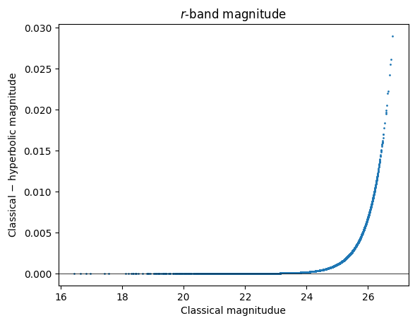

Computing Hyperbolic Magnitudes
===============================

Last successfully run: Feb 9, 2025

`Implementation <https://github.com/jlvdb/hyperbolic>`__ of Lupton et
al. (1999) by Jan Luca van den Busch.

Hyperbolic magnitudes aim to overcome limitations of classical
magnitudes, which are logarithmic in flux. Hyperbolic magnitudues are
implemented using the inverse hyperbolic sine and therefore have a
linear behaviour in flux at low signal to noise, which gradually
transitions to the classical logarithmic scaling at high signal to noise
(i.e. equivalent to classical magnitudes in this limit).

This notebooks provides an example of how to convert classical to
hyperbolical magnitudes using the interactive versions of pipeline
stages ``HyperbolicSmoothing`` and ``HyperbolicMagnitudes``.

If you’re interested in running this in pipeline mode, see
```03_Hyperbolic_Magnitude.ipynb`` <https://github.com/LSSTDESC/rail/blob/main/pipeline_examples/core_examples/03_Hyperbolic_Magnitude.html>`__
in the ``pipeline_examples/core_examples/`` folder.

.. code:: ipython3

    import matplotlib.pyplot as plt
    import rail.interactive as ri
    import tables_io
    from rail.utils.path_utils import find_rail_file


.. parsed-literal::

    Install FSPS with the following commands:
    pip uninstall fsps
    git clone --recursive https://github.com/dfm/python-fsps.git
    cd python-fsps
    python -m pip install .
    export SPS_HOME=$(pwd)/src/fsps/libfsps
    
    LEPHAREDIR is being set to the default cache directory:
    /home/runner/.cache/lephare/data
    More than 1Gb may be written there.
    LEPHAREWORK is being set to the default cache directory:
    /home/runner/.cache/lephare/work
    Default work cache is already linked. 
    This is linked to the run directory:
    /home/runner/.cache/lephare/runs/20260323T184807


.. parsed-literal::

    
    A module that was compiled using NumPy 1.x cannot be run in
    NumPy 2.4.3 as it may crash. To support both 1.x and 2.x
    versions of NumPy, modules must be compiled with NumPy 2.0.
    Some module may need to rebuild instead e.g. with 'pybind11>=2.12'.
    
    If you are a user of the module, the easiest solution will be to
    downgrade to 'numpy<2' or try to upgrade the affected module.
    We expect that some modules will need time to support NumPy 2.
    
    Traceback (most recent call last):  File "<frozen runpy>", line 198, in _run_module_as_main
      File "<frozen runpy>", line 88, in _run_code
      File "/opt/hostedtoolcache/Python/3.11.15/x64/lib/python3.11/site-packages/ipykernel_launcher.py", line 18, in <module>
        app.launch_new_instance()
      File "/opt/hostedtoolcache/Python/3.11.15/x64/lib/python3.11/site-packages/traitlets/config/application.py", line 1075, in launch_instance
        app.start()
      File "/opt/hostedtoolcache/Python/3.11.15/x64/lib/python3.11/site-packages/ipykernel/kernelapp.py", line 758, in start
        self.io_loop.start()
      File "/opt/hostedtoolcache/Python/3.11.15/x64/lib/python3.11/site-packages/tornado/platform/asyncio.py", line 211, in start
        self.asyncio_loop.run_forever()
      File "/opt/hostedtoolcache/Python/3.11.15/x64/lib/python3.11/asyncio/base_events.py", line 608, in run_forever
        self._run_once()
      File "/opt/hostedtoolcache/Python/3.11.15/x64/lib/python3.11/asyncio/base_events.py", line 1936, in _run_once
        handle._run()
      File "/opt/hostedtoolcache/Python/3.11.15/x64/lib/python3.11/asyncio/events.py", line 84, in _run
        self._context.run(self._callback, *self._args)
      File "/opt/hostedtoolcache/Python/3.11.15/x64/lib/python3.11/site-packages/ipykernel/kernelbase.py", line 621, in shell_main
        await self.dispatch_shell(msg, subshell_id=subshell_id)
      File "/opt/hostedtoolcache/Python/3.11.15/x64/lib/python3.11/site-packages/ipykernel/kernelbase.py", line 478, in dispatch_shell
        await result
      File "/opt/hostedtoolcache/Python/3.11.15/x64/lib/python3.11/site-packages/ipykernel/ipkernel.py", line 372, in execute_request
        await super().execute_request(stream, ident, parent)
      File "/opt/hostedtoolcache/Python/3.11.15/x64/lib/python3.11/site-packages/ipykernel/kernelbase.py", line 834, in execute_request
        reply_content = await reply_content
      File "/opt/hostedtoolcache/Python/3.11.15/x64/lib/python3.11/site-packages/ipykernel/ipkernel.py", line 464, in do_execute
        res = shell.run_cell(
      File "/opt/hostedtoolcache/Python/3.11.15/x64/lib/python3.11/site-packages/ipykernel/zmqshell.py", line 663, in run_cell
        return super().run_cell(*args, **kwargs)
      File "/opt/hostedtoolcache/Python/3.11.15/x64/lib/python3.11/site-packages/IPython/core/interactiveshell.py", line 3123, in run_cell
        result = self._run_cell(
      File "/opt/hostedtoolcache/Python/3.11.15/x64/lib/python3.11/site-packages/IPython/core/interactiveshell.py", line 3178, in _run_cell
        result = runner(coro)
      File "/opt/hostedtoolcache/Python/3.11.15/x64/lib/python3.11/site-packages/IPython/core/async_helpers.py", line 128, in _pseudo_sync_runner
        coro.send(None)
      File "/opt/hostedtoolcache/Python/3.11.15/x64/lib/python3.11/site-packages/IPython/core/interactiveshell.py", line 3400, in run_cell_async
        has_raised = await self.run_ast_nodes(code_ast.body, cell_name,
      File "/opt/hostedtoolcache/Python/3.11.15/x64/lib/python3.11/site-packages/IPython/core/interactiveshell.py", line 3641, in run_ast_nodes
        if await self.run_code(code, result, async_=asy):
      File "/opt/hostedtoolcache/Python/3.11.15/x64/lib/python3.11/site-packages/IPython/core/interactiveshell.py", line 3701, in run_code
        exec(code_obj, self.user_global_ns, self.user_ns)
      File "/tmp/ipykernel_4091/2416626524.py", line 2, in <module>
        import rail.interactive as ri
      File "/opt/hostedtoolcache/Python/3.11.15/x64/lib/python3.11/site-packages/rail/interactive/__init__.py", line 3, in <module>
        from . import calib, creation, estimation, evaluation, tools
      File "/opt/hostedtoolcache/Python/3.11.15/x64/lib/python3.11/site-packages/rail/interactive/calib/__init__.py", line 3, in <module>
        from rail.utils.interactive.initialize_utils import _initialize_interactive_module
      File "/opt/hostedtoolcache/Python/3.11.15/x64/lib/python3.11/site-packages/rail/utils/interactive/initialize_utils.py", line 17, in <module>
        from rail.utils.interactive.base_utils import (
      File "/opt/hostedtoolcache/Python/3.11.15/x64/lib/python3.11/site-packages/rail/utils/interactive/base_utils.py", line 10, in <module>
        rail.stages.import_and_attach_all(silent=True)
      File "/opt/hostedtoolcache/Python/3.11.15/x64/lib/python3.11/site-packages/rail/stages/__init__.py", line 74, in import_and_attach_all
        RailEnv.import_all_packages(silent=silent)
      File "/opt/hostedtoolcache/Python/3.11.15/x64/lib/python3.11/site-packages/rail/core/introspection.py", line 541, in import_all_packages
        _imported_module = importlib.import_module(pkg)
      File "/opt/hostedtoolcache/Python/3.11.15/x64/lib/python3.11/importlib/__init__.py", line 126, in import_module
        return _bootstrap._gcd_import(name[level:], package, level)
      File "/opt/hostedtoolcache/Python/3.11.15/x64/lib/python3.11/site-packages/rail/som/__init__.py", line 1, in <module>
        from rail.creation.degraders.specz_som import *
      File "/opt/hostedtoolcache/Python/3.11.15/x64/lib/python3.11/site-packages/rail/creation/degraders/specz_som.py", line 15, in <module>
        from somoclu import Somoclu
      File "/opt/hostedtoolcache/Python/3.11.15/x64/lib/python3.11/site-packages/somoclu/__init__.py", line 11, in <module>
        from .train import Somoclu
      File "/opt/hostedtoolcache/Python/3.11.15/x64/lib/python3.11/site-packages/somoclu/train.py", line 25, in <module>
        from .somoclu_wrap import train as wrap_train
      File "/opt/hostedtoolcache/Python/3.11.15/x64/lib/python3.11/site-packages/somoclu/somoclu_wrap.py", line 11, in <module>
        import _somoclu_wrap


::


    ---------------------------------------------------------------------------

    ImportError                               Traceback (most recent call last)

    File /opt/hostedtoolcache/Python/3.11.15/x64/lib/python3.11/site-packages/numpy/core/_multiarray_umath.py:46, in __getattr__(attr_name)
         41     # Also print the message (with traceback).  This is because old versions
         42     # of NumPy unfortunately set up the import to replace (and hide) the
         43     # error.  The traceback shouldn't be needed, but e.g. pytest plugins
         44     # seem to swallow it and we should be failing anyway...
         45     sys.stderr.write(msg + tb_msg)
    ---> 46     raise ImportError(msg)
         48 ret = getattr(_multiarray_umath, attr_name, None)
         49 if ret is None:


    ImportError: 
    A module that was compiled using NumPy 1.x cannot be run in
    NumPy 2.4.3 as it may crash. To support both 1.x and 2.x
    versions of NumPy, modules must be compiled with NumPy 2.0.
    Some module may need to rebuild instead e.g. with 'pybind11>=2.12'.
    
    If you are a user of the module, the easiest solution will be to
    downgrade to 'numpy<2' or try to upgrade the affected module.
    We expect that some modules will need time to support NumPy 2.
    


.. parsed-literal::

    Warning: the binary library cannot be imported. You cannot train maps, but you can load and analyze ones that you have already saved.
    The problem occurs because either compilation failed when you installed Somoclu or a path is missing from the dependencies when you are trying to import it. Please refer to the documentation to see your options.


Next we load some DC2 sample data that provides LSST ugrizy magnitudes
and magnitude errors, which we want to convert to hyperbolic magnitudes.

.. code:: ipython3

    testFile = find_rail_file("examples_data/testdata/test_dc2_training_9816.pq")
    test_mags = tables_io.read(testFile)


.. parsed-literal::

    column_list None


Determining the smoothing parameters
------------------------------------

First we run the ``HyperbolicSmoothing`` stage. This stage computes the
smoothing parameter (called :math:`b` in Lupton et al. 1999), which
determines the transition between the linear and logarithmic behaviour
of the hyperbolic magnitudes.

The **input** for this stage is a table containing magnitudes and
magnitude errors per object (fluxes are also supported as input data by
setting ``is_flux=True`` in the configuration). In this example, we
assume that the magnitude zeropoint is 0.0 and that we want to convert
all 6 LSST bands. This can be specified with the ``value_columns`` and
``error_columns`` parameters, which list the names of the magnitude
columns and their corresponding magnitude errors.

.. code:: ipython3

    lsst_bands = "ugrizy"
    configuration = dict(
        value_columns=[f"mag_{band}_lsst" for band in lsst_bands],
        error_columns=[f"mag_err_{band}_lsst" for band in lsst_bands],
        zeropoints=[0.0] * len(lsst_bands),
        is_flux=False,
    )
    
    smooth_params = ri.tools.photometry_tools.hyperbolic_smoothing(
        data=test_mags, **configuration
    )


.. parsed-literal::

    Inserting handle into data store.  input: None, HyperbolicSmoothing
    Inserting handle into data store.  parameters: inprogress_parameters.pq, HyperbolicSmoothing


The **output** of this stage is a table of relevant statistics required
to compute the hyperbolic magnitudes per filter: - the median flux error
- the zeropoint (which can be computed by comparing fluxes and
magnitudes in the original ``hyperbolic`` code) - the reference flux
:math:`f_{\rm ref}` that corresponds to the given zeropoint - the
smoothing parameter :math:`b` (in terms of the absolute and the relative
flux :math:`x = f / f_{\rm ref}`

The ``field ID`` column is currently not used by the RAIL module and can
be ignored.

.. code:: ipython3

    smooth_params["parameters"]


.. raw:: html

    <div>
    <style scoped>
        .dataframe tbody tr th:only-of-type {
            vertical-align: middle;
        }
    
        .dataframe tbody tr th {
            vertical-align: top;
        }
    
        .dataframe thead th {
            text-align: right;
        }
    </style>
    <table border="1" class="dataframe">
      <thead>
        <tr style="text-align: right;">
          <th></th>
          <th></th>
          <th>flux error</th>
          <th>zeropoint</th>
          <th>ref. flux</th>
          <th>b relative</th>
          <th>b absolute</th>
        </tr>
        <tr>
          <th>filter</th>
          <th>field ID</th>
          <th></th>
          <th></th>
          <th></th>
          <th></th>
          <th></th>
        </tr>
      </thead>
      <tbody>
        <tr>
          <th>mag_u_lsst</th>
          <th>0</th>
          <td>1.559839e-11</td>
          <td>0.0</td>
          <td>1.0</td>
          <td>1.625332e-11</td>
          <td>1.625332e-11</td>
        </tr>
        <tr>
          <th>mag_g_lsst</th>
          <th>0</th>
          <td>3.286980e-12</td>
          <td>0.0</td>
          <td>1.0</td>
          <td>3.424989e-12</td>
          <td>3.424989e-12</td>
        </tr>
        <tr>
          <th>mag_r_lsst</th>
          <th>0</th>
          <td>3.052049e-12</td>
          <td>0.0</td>
          <td>1.0</td>
          <td>3.180194e-12</td>
          <td>3.180194e-12</td>
        </tr>
        <tr>
          <th>mag_i_lsst</th>
          <th>0</th>
          <td>4.441195e-12</td>
          <td>0.0</td>
          <td>1.0</td>
          <td>4.627666e-12</td>
          <td>4.627666e-12</td>
        </tr>
        <tr>
          <th>mag_z_lsst</th>
          <th>0</th>
          <td>7.823318e-12</td>
          <td>0.0</td>
          <td>1.0</td>
          <td>8.151793e-12</td>
          <td>8.151793e-12</td>
        </tr>
        <tr>
          <th>mag_y_lsst</th>
          <th>0</th>
          <td>1.785106e-11</td>
          <td>0.0</td>
          <td>1.0</td>
          <td>1.860057e-11</td>
          <td>1.860057e-11</td>
        </tr>
      </tbody>
    </table>
    </div>


Computing the magnitudes
------------------------

Based on the smoothing parameters, the hyperbolic magnitudes are
computed with be computed by ``HyperbolicMagnitudes``.

The **input** for this module is, again, the table with magnitudes and
magnitude errors and the output table of ``HyperbolicSmoothing``.

.. code:: ipython3

    test_hypmags = ri.tools.photometry_tools.hyperbolic_magnitudes(
        data=test_mags,
        parameters=smooth_params["parameters"],
        **configuration,
    )


.. parsed-literal::

    Inserting handle into data store.  input: None, HyperbolicMagnitudes
    Inserting handle into data store.  parameters:                        flux error  zeropoint  ref. flux    b relative  \
    filter     field ID                                                     
    mag_u_lsst 0         1.559839e-11        0.0        1.0  1.625332e-11   
    mag_g_lsst 0         3.286980e-12        0.0        1.0  3.424989e-12   
    mag_r_lsst 0         3.052049e-12        0.0        1.0  3.180194e-12   
    mag_i_lsst 0         4.441195e-12        0.0        1.0  4.627666e-12   
    mag_z_lsst 0         7.823318e-12        0.0        1.0  8.151793e-12   
    mag_y_lsst 0         1.785106e-11        0.0        1.0  1.860057e-11   
    
                           b absolute  
    filter     field ID                
    mag_u_lsst 0         1.625332e-11  
    mag_g_lsst 0         3.424989e-12  
    mag_r_lsst 0         3.180194e-12  
    mag_i_lsst 0         4.627666e-12  
    mag_z_lsst 0         8.151793e-12  
    mag_y_lsst 0         1.860057e-11  , HyperbolicMagnitudes
    Inserting handle into data store.  output: inprogress_output.pq, HyperbolicMagnitudes


The **output** of this module is a table with hyperbolic magnitudes and
their corresponding error.

**Note:** The current default is to relabel the columns names by
substituting ``mag_`` by ``mag_hyp_``. If this substitution is not
possible, the column names are identical to the input table with
classical magnitudes.

.. code:: ipython3

    test_hypmags["output"]


.. raw:: html

    <div>
    <style scoped>
        .dataframe tbody tr th:only-of-type {
            vertical-align: middle;
        }
    
        .dataframe tbody tr th {
            vertical-align: top;
        }
    
        .dataframe thead th {
            text-align: right;
        }
    </style>
    <table border="1" class="dataframe">
      <thead>
        <tr style="text-align: right;">
          <th></th>
          <th>mag_hyp_u_lsst</th>
          <th>mag_hyp_err_u_lsst</th>
          <th>mag_hyp_g_lsst</th>
          <th>mag_hyp_err_g_lsst</th>
          <th>mag_hyp_r_lsst</th>
          <th>mag_hyp_err_r_lsst</th>
          <th>mag_hyp_i_lsst</th>
          <th>mag_hyp_err_i_lsst</th>
          <th>mag_hyp_z_lsst</th>
          <th>mag_hyp_err_z_lsst</th>
          <th>mag_hyp_y_lsst</th>
          <th>mag_hyp_err_y_lsst</th>
        </tr>
      </thead>
      <tbody>
        <tr>
          <th>0</th>
          <td>18.040370</td>
          <td>0.005046</td>
          <td>16.960892</td>
          <td>0.005001</td>
          <td>16.653413</td>
          <td>0.005001</td>
          <td>16.506310</td>
          <td>0.005001</td>
          <td>16.466378</td>
          <td>0.005001</td>
          <td>16.423906</td>
          <td>0.005003</td>
        </tr>
        <tr>
          <th>1</th>
          <td>21.615533</td>
          <td>0.009551</td>
          <td>20.709402</td>
          <td>0.005084</td>
          <td>20.533851</td>
          <td>0.005048</td>
          <td>20.437566</td>
          <td>0.005075</td>
          <td>20.408885</td>
          <td>0.005193</td>
          <td>20.388203</td>
          <td>0.005804</td>
        </tr>
        <tr>
          <th>2</th>
          <td>21.851866</td>
          <td>0.011146</td>
          <td>20.437067</td>
          <td>0.005057</td>
          <td>19.709715</td>
          <td>0.005015</td>
          <td>19.312630</td>
          <td>0.005016</td>
          <td>18.953412</td>
          <td>0.005023</td>
          <td>18.770441</td>
          <td>0.005063</td>
        </tr>
        <tr>
          <th>3</th>
          <td>19.976499</td>
          <td>0.005477</td>
          <td>19.128676</td>
          <td>0.005011</td>
          <td>18.803485</td>
          <td>0.005005</td>
          <td>18.619996</td>
          <td>0.005007</td>
          <td>18.546590</td>
          <td>0.005014</td>
          <td>18.479452</td>
          <td>0.005041</td>
        </tr>
        <tr>
          <th>4</th>
          <td>22.294717</td>
          <td>0.015481</td>
          <td>21.242782</td>
          <td>0.005182</td>
          <td>20.911803</td>
          <td>0.005084</td>
          <td>20.731707</td>
          <td>0.005118</td>
          <td>20.700288</td>
          <td>0.005308</td>
          <td>20.644994</td>
          <td>0.006211</td>
        </tr>
        <tr>
          <th>...</th>
          <td>...</td>
          <td>...</td>
          <td>...</td>
          <td>...</td>
          <td>...</td>
          <td>...</td>
          <td>...</td>
          <td>...</td>
          <td>...</td>
          <td>...</td>
          <td>...</td>
          <td>...</td>
        </tr>
        <tr>
          <th>10220</th>
          <td>25.732646</td>
          <td>0.301680</td>
          <td>25.301790</td>
          <td>0.047027</td>
          <td>25.099622</td>
          <td>0.036055</td>
          <td>25.180361</td>
          <td>0.055825</td>
          <td>25.295404</td>
          <td>0.108750</td>
          <td>25.229366</td>
          <td>0.226270</td>
        </tr>
        <tr>
          <th>10221</th>
          <td>25.251545</td>
          <td>0.205102</td>
          <td>24.512358</td>
          <td>0.023323</td>
          <td>24.345662</td>
          <td>0.018623</td>
          <td>24.434138</td>
          <td>0.028559</td>
          <td>24.547622</td>
          <td>0.055349</td>
          <td>24.678486</td>
          <td>0.140864</td>
        </tr>
        <tr>
          <th>10222</th>
          <td>25.147493</td>
          <td>0.187751</td>
          <td>24.113802</td>
          <td>0.016640</td>
          <td>23.828346</td>
          <td>0.012276</td>
          <td>23.711119</td>
          <td>0.015380</td>
          <td>23.755514</td>
          <td>0.027202</td>
          <td>23.830545</td>
          <td>0.065739</td>
        </tr>
        <tr>
          <th>10223</th>
          <td>26.305978</td>
          <td>0.435503</td>
          <td>25.067304</td>
          <td>0.038089</td>
          <td>24.770026</td>
          <td>0.026890</td>
          <td>24.586800</td>
          <td>0.032711</td>
          <td>24.781555</td>
          <td>0.068406</td>
          <td>24.653411</td>
          <td>0.137773</td>
        </tr>
        <tr>
          <th>10224</th>
          <td>26.429216</td>
          <td>0.461142</td>
          <td>25.548904</td>
          <td>0.058784</td>
          <td>24.983338</td>
          <td>0.032494</td>
          <td>24.889564</td>
          <td>0.042924</td>
          <td>24.836702</td>
          <td>0.071907</td>
          <td>24.752944</td>
          <td>0.150422</td>
        </tr>
      </tbody>
    </table>
    <p>10225 rows × 12 columns</p>
    </div>


This plot shows the difference between the classical and hyperbolic
magnitude as function of the classical :math:`r`-band magnitude. The
turn-off point is determined by the value for :math:`b` estimated above.

.. code:: ipython3

    filt = "r"
    
    mag_class = test_mags[f"mag_{filt}_lsst"]
    magerr_class = test_mags[f"mag_err_{filt}_lsst"]
    mag_hyp = test_hypmags["output"][f"mag_hyp_{filt}_lsst"]
    magerr_hyp = test_hypmags["output"][f"mag_hyp_err_{filt}_lsst"]
    
    fig = plt.figure(dpi=100)
    plt.axhline(y=0.0, color="k", lw=0.55)
    plt.scatter(mag_class, mag_class - mag_hyp, s=1)
    plt.xlabel("Classical magnitudue")
    plt.ylabel("Classical $-$ hyperbolic magnitude")
    plt.title("$r$-band magnitude")


.. parsed-literal::

    Text(0.5, 1.0, '$r$-band magnitude')




