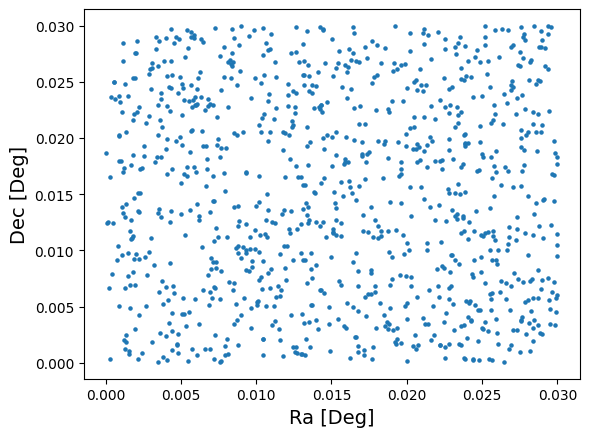
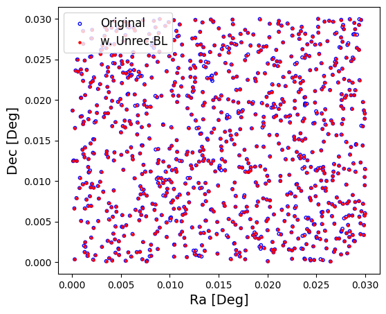
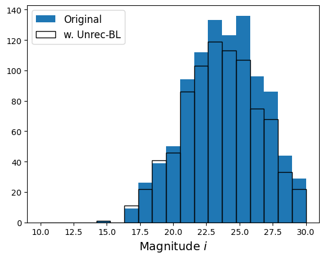
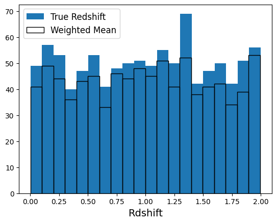
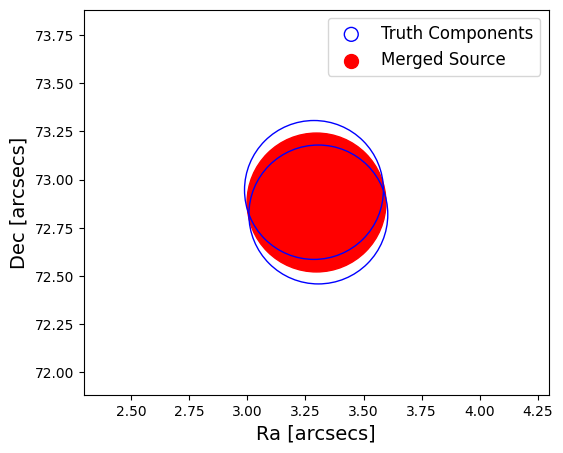

Blending Degrader demo
----------------------

Author: Shuang Liang

Last run successfully: Feb 9, 2026

This notebook demonstrate the use of
``rail.creation.degradation.unrec_bl_model``, which uses Friends of
Friends to finds sources close to each other and merge them into
unrecognized blends

**Note:** If you’re interested in running this in pipeline mode, see
```06_Blending_Degrader.ipynb`` <https://github.com/LSSTDESC/rail/blob/main/pipeline_examples/creation_examples/06_Blending_Degrader.ipynb>`__
in the ``pipeline_examples/creation_examples/`` folder.

.. code:: ipython3

    import matplotlib.pyplot as plt
    import numpy as np
    import pandas as pd
    from rail.interactive.creation.degraders import unrec_bl_model


.. parsed-literal::

    Install FSPS with the following commands:
    pip uninstall fsps
    git clone --recursive https://github.com/dfm/python-fsps.git
    cd python-fsps
    python -m pip install .
    export SPS_HOME=$(pwd)/src/fsps/libfsps
    
    LEPHAREDIR is being set to the default cache directory:
    /home/runner/.cache/lephare/data
    More than 1Gb may be written there.
    LEPHAREWORK is being set to the default cache directory:
    /home/runner/.cache/lephare/work
    Default work cache is already linked. 
    This is linked to the run directory:
    /home/runner/.cache/lephare/runs/20260324T150130


.. parsed-literal::

    
    A module that was compiled using NumPy 1.x cannot be run in
    NumPy 2.4.3 as it may crash. To support both 1.x and 2.x
    versions of NumPy, modules must be compiled with NumPy 2.0.
    Some module may need to rebuild instead e.g. with 'pybind11>=2.12'.
    
    If you are a user of the module, the easiest solution will be to
    downgrade to 'numpy<2' or try to upgrade the affected module.
    We expect that some modules will need time to support NumPy 2.
    
    Traceback (most recent call last):  File "<frozen runpy>", line 198, in _run_module_as_main
      File "<frozen runpy>", line 88, in _run_code
      File "/opt/hostedtoolcache/Python/3.11.15/x64/lib/python3.11/site-packages/ipykernel_launcher.py", line 18, in <module>
        app.launch_new_instance()
      File "/opt/hostedtoolcache/Python/3.11.15/x64/lib/python3.11/site-packages/traitlets/config/application.py", line 1075, in launch_instance
        app.start()
      File "/opt/hostedtoolcache/Python/3.11.15/x64/lib/python3.11/site-packages/ipykernel/kernelapp.py", line 758, in start
        self.io_loop.start()
      File "/opt/hostedtoolcache/Python/3.11.15/x64/lib/python3.11/site-packages/tornado/platform/asyncio.py", line 211, in start
        self.asyncio_loop.run_forever()
      File "/opt/hostedtoolcache/Python/3.11.15/x64/lib/python3.11/asyncio/base_events.py", line 608, in run_forever
        self._run_once()
      File "/opt/hostedtoolcache/Python/3.11.15/x64/lib/python3.11/asyncio/base_events.py", line 1936, in _run_once
        handle._run()
      File "/opt/hostedtoolcache/Python/3.11.15/x64/lib/python3.11/asyncio/events.py", line 84, in _run
        self._context.run(self._callback, *self._args)
      File "/opt/hostedtoolcache/Python/3.11.15/x64/lib/python3.11/site-packages/ipykernel/kernelbase.py", line 621, in shell_main
        await self.dispatch_shell(msg, subshell_id=subshell_id)
      File "/opt/hostedtoolcache/Python/3.11.15/x64/lib/python3.11/site-packages/ipykernel/kernelbase.py", line 478, in dispatch_shell
        await result
      File "/opt/hostedtoolcache/Python/3.11.15/x64/lib/python3.11/site-packages/ipykernel/ipkernel.py", line 372, in execute_request
        await super().execute_request(stream, ident, parent)
      File "/opt/hostedtoolcache/Python/3.11.15/x64/lib/python3.11/site-packages/ipykernel/kernelbase.py", line 834, in execute_request
        reply_content = await reply_content
      File "/opt/hostedtoolcache/Python/3.11.15/x64/lib/python3.11/site-packages/ipykernel/ipkernel.py", line 464, in do_execute
        res = shell.run_cell(
      File "/opt/hostedtoolcache/Python/3.11.15/x64/lib/python3.11/site-packages/ipykernel/zmqshell.py", line 663, in run_cell
        return super().run_cell(*args, **kwargs)
      File "/opt/hostedtoolcache/Python/3.11.15/x64/lib/python3.11/site-packages/IPython/core/interactiveshell.py", line 3123, in run_cell
        result = self._run_cell(
      File "/opt/hostedtoolcache/Python/3.11.15/x64/lib/python3.11/site-packages/IPython/core/interactiveshell.py", line 3178, in _run_cell
        result = runner(coro)
      File "/opt/hostedtoolcache/Python/3.11.15/x64/lib/python3.11/site-packages/IPython/core/async_helpers.py", line 128, in _pseudo_sync_runner
        coro.send(None)
      File "/opt/hostedtoolcache/Python/3.11.15/x64/lib/python3.11/site-packages/IPython/core/interactiveshell.py", line 3400, in run_cell_async
        has_raised = await self.run_ast_nodes(code_ast.body, cell_name,
      File "/opt/hostedtoolcache/Python/3.11.15/x64/lib/python3.11/site-packages/IPython/core/interactiveshell.py", line 3641, in run_ast_nodes
        if await self.run_code(code, result, async_=asy):
      File "/opt/hostedtoolcache/Python/3.11.15/x64/lib/python3.11/site-packages/IPython/core/interactiveshell.py", line 3701, in run_code
        exec(code_obj, self.user_global_ns, self.user_ns)
      File "/tmp/ipykernel_4788/561744479.py", line 4, in <module>
        from rail.interactive.creation.degraders import unrec_bl_model
      File "/opt/hostedtoolcache/Python/3.11.15/x64/lib/python3.11/site-packages/rail/interactive/__init__.py", line 3, in <module>
        from . import calib, creation, estimation, evaluation, tools
      File "/opt/hostedtoolcache/Python/3.11.15/x64/lib/python3.11/site-packages/rail/interactive/calib/__init__.py", line 3, in <module>
        from rail.utils.interactive.initialize_utils import _initialize_interactive_module
      File "/opt/hostedtoolcache/Python/3.11.15/x64/lib/python3.11/site-packages/rail/utils/interactive/initialize_utils.py", line 17, in <module>
        from rail.utils.interactive.base_utils import (
      File "/opt/hostedtoolcache/Python/3.11.15/x64/lib/python3.11/site-packages/rail/utils/interactive/base_utils.py", line 10, in <module>
        rail.stages.import_and_attach_all(silent=True)
      File "/opt/hostedtoolcache/Python/3.11.15/x64/lib/python3.11/site-packages/rail/stages/__init__.py", line 74, in import_and_attach_all
        RailEnv.import_all_packages(silent=silent)
      File "/opt/hostedtoolcache/Python/3.11.15/x64/lib/python3.11/site-packages/rail/core/introspection.py", line 541, in import_all_packages
        _imported_module = importlib.import_module(pkg)
      File "/opt/hostedtoolcache/Python/3.11.15/x64/lib/python3.11/importlib/__init__.py", line 126, in import_module
        return _bootstrap._gcd_import(name[level:], package, level)
      File "/opt/hostedtoolcache/Python/3.11.15/x64/lib/python3.11/site-packages/rail/som/__init__.py", line 1, in <module>
        from rail.creation.degraders.specz_som import *
      File "/opt/hostedtoolcache/Python/3.11.15/x64/lib/python3.11/site-packages/rail/creation/degraders/specz_som.py", line 15, in <module>
        from somoclu import Somoclu
      File "/opt/hostedtoolcache/Python/3.11.15/x64/lib/python3.11/site-packages/somoclu/__init__.py", line 11, in <module>
        from .train import Somoclu
      File "/opt/hostedtoolcache/Python/3.11.15/x64/lib/python3.11/site-packages/somoclu/train.py", line 25, in <module>
        from .somoclu_wrap import train as wrap_train
      File "/opt/hostedtoolcache/Python/3.11.15/x64/lib/python3.11/site-packages/somoclu/somoclu_wrap.py", line 11, in <module>
        import _somoclu_wrap


::


    ---------------------------------------------------------------------------

    ImportError                               Traceback (most recent call last)

    File /opt/hostedtoolcache/Python/3.11.15/x64/lib/python3.11/site-packages/numpy/core/_multiarray_umath.py:46, in __getattr__(attr_name)
         41     # Also print the message (with traceback).  This is because old versions
         42     # of NumPy unfortunately set up the import to replace (and hide) the
         43     # error.  The traceback shouldn't be needed, but e.g. pytest plugins
         44     # seem to swallow it and we should be failing anyway...
         45     sys.stderr.write(msg + tb_msg)
    ---> 46     raise ImportError(msg)
         48 ret = getattr(_multiarray_umath, attr_name, None)
         49 if ret is None:


    ImportError: 
    A module that was compiled using NumPy 1.x cannot be run in
    NumPy 2.4.3 as it may crash. To support both 1.x and 2.x
    versions of NumPy, modules must be compiled with NumPy 2.0.
    Some module may need to rebuild instead e.g. with 'pybind11>=2.12'.
    
    If you are a user of the module, the easiest solution will be to
    downgrade to 'numpy<2' or try to upgrade the affected module.
    We expect that some modules will need time to support NumPy 2.
    


.. parsed-literal::

    Warning: the binary library cannot be imported. You cannot train maps, but you can load and analyze ones that you have already saved.
    The problem occurs because either compilation failed when you installed Somoclu or a path is missing from the dependencies when you are trying to import it. Please refer to the documentation to see your options.


Create a random catalog with ugrizy+YJHF bands as the the true input
~~~~~~~~~~~~~~~~~~~~~~~~~~~~~~~~~~~~~~~~~~~~~~~~~~~~~~~~~~~~~~~~~~~~

.. code:: ipython3

    data = np.random.normal(24, 3, size=(1000, 13))
    data[:, 0] = np.random.uniform(low=0, high=0.03, size=1000)
    data[:, 1] = np.random.uniform(low=0, high=0.03, size=1000)
    data[:, 2] = np.random.uniform(low=0, high=2, size=1000)
    
    data_truth = pd.DataFrame(
        data=data,  # values
        columns=["ra", "dec", "z_true", "u", "g", "r", "i", "z", "y", "Y", "J", "H", "F"],
    )

.. code:: ipython3

    plt.scatter(data_truth["ra"], data_truth["dec"], s=5)
    plt.xlabel("Ra [Deg]", fontsize=14)
    plt.ylabel("Dec [Deg]", fontsize=14)
    plt.show()





The blending model
~~~~~~~~~~~~~~~~~~

.. code:: ipython3

    ## model configuration; linking length is in arcsecs
    lsst_zp_dict = {"u": 12.65, "g": 14.69, "r": 14.56, "i": 14.38, "z": 13.99, "y": 13.02}
    
    outputs = unrec_bl_model.unrec_bl_model(
        sample=data_truth,
        ra_label="ra",
        dec_label="dec",
        linking_lengths=1.0,
        bands="ugrizy",
        zp_dict=lsst_zp_dict,
        ref_band="i",
        redshift_col="z_true",
    )


.. parsed-literal::

    Inserting handle into data store.  input: None, UnrecBlModel


.. parsed-literal::

    Inserting handle into data store.  output: inprogress_output.pq, UnrecBlModel
    Inserting handle into data store.  compInd: inprogress_compInd.pq, UnrecBlModel


.. code:: ipython3

    samples_w_bl = outputs["output"]
    component_ind = outputs["compInd"]

.. code:: ipython3

    fig, ax = plt.subplots(figsize=(6, 5), dpi=100)
    
    ax.scatter(
        data_truth["ra"],
        data_truth["dec"],
        s=10,
        facecolors="none",
        edgecolors="b",
        label="Original",
    )
    ax.scatter(samples_w_bl["ra"], samples_w_bl["dec"], s=5, c="r", label="w. Unrec-BL")
    
    ax.legend(loc=2, fontsize=12)
    ax.set_xlabel("Ra [Deg]", fontsize=14)
    ax.set_ylabel("Dec [Deg]", fontsize=14)
    
    plt.show()





.. code:: ipython3

    b = "i"
    plt.hist(data_truth[b], bins=np.linspace(10, 30, 20), label="Original")
    plt.hist(samples_w_bl[b], bins=np.linspace(10, 30, 20), fill=False, label="w. Unrec-BL")
    
    plt.xlabel(rf"Magnitude ${b}$", fontsize=14)
    plt.legend(fontsize=12)
    plt.show()





.. code:: ipython3

    plt.hist(data_truth["z_true"], bins=20, label="True Redshift")
    plt.hist(samples_w_bl["z_weighted"], bins=20, fill=False, label="Weighted Mean")
    
    plt.xlabel(rf"Rdshift", fontsize=14)
    plt.legend(fontsize=12)
    plt.show()





Study one BL case
~~~~~~~~~~~~~~~~~

.. code:: ipython3

    ## find a source with more than 1 truth component
    
    group_size = 1
    while group_size == 1:
    
        rand_ind = np.random.randint(len(samples_w_bl))
        this_bl = samples_w_bl.iloc[rand_ind]
        group_id = this_bl["group_id"]
    
        mask = component_ind["group_id"] == group_id
        FoF_group = component_ind[mask]
        group_size = len(FoF_group)
    
    truth_comp = data_truth.iloc[FoF_group.index]
    
    print("Truth RA / Blended RA:")
    print(truth_comp["ra"].to_numpy(), "/", this_bl["ra"])
    print("")
    
    print("Truth DEC / Blended DEC:")
    print(truth_comp["dec"].to_numpy(), "/", this_bl["dec"])
    print("")
    
    for b in "ugrizy":
        print(f"Truth mag {b} / Blended mag {b}:")
        print(truth_comp[b].to_numpy(), "/", this_bl[b])
        print("")


.. parsed-literal::

    Truth RA / Blended RA:
    [0.00091819 0.00091298] / 0.0009155860494499012
    
    Truth DEC / Blended DEC:
    [0.02022744 0.02026283] / 0.020245135986047276
    
    Truth mag u / Blended mag u:
    [26.16302111 30.55517758] / 26.144180789958376
    
    Truth mag g / Blended mag g:
    [27.26775449 27.8673441 ] / 26.774099949015458
    
    Truth mag r / Blended mag r:
    [23.65206617 20.26248329] / 20.215656740590255
    
    Truth mag i / Blended mag i:
    [25.20733241 30.29905071] / 25.197400123850166
    
    Truth mag z / Blended mag z:
    [22.85699415 20.32903572] / 20.22806614200212
    
    Truth mag y / Blended mag y:
    [26.80184823 23.28922813] / 23.247322894520543
    


.. code:: ipython3

    fig, ax = plt.subplots(figsize=(6, 5), dpi=100)
    
    ax.scatter(this_bl["ra"] * 3600, this_bl["dec"] * 3600, s=1e4, c="r")
    ax.scatter(
        truth_comp["ra"] * 3600,
        truth_comp["dec"] * 3600,
        s=1e4,
        facecolors="none",
        edgecolors="b",
    )
    
    ax.scatter([], [], s=1e2, facecolors="none", edgecolors="b", label="Truth Components")
    ax.scatter([], [], s=1e2, c="r", label="Merged Source")
    
    fig_size = 1  ## in arcsecs
    ax.set_xlim(this_bl["ra"] * 3600 - fig_size, this_bl["ra"] * 3600 + fig_size)
    ax.set_ylim(this_bl["dec"] * 3600 - fig_size, this_bl["dec"] * 3600 + fig_size)
    
    ax.legend(fontsize=12)
    ax.set_xlabel("Ra [arcsecs]", fontsize=14)
    ax.set_ylabel("Dec [arcsecs]", fontsize=14)
    
    plt.show()




