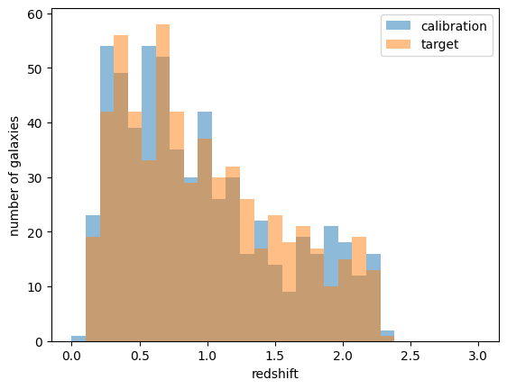
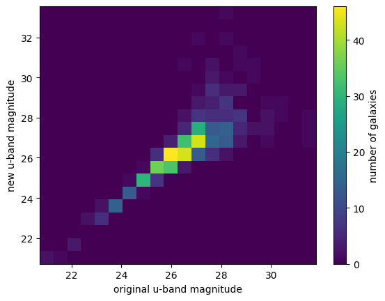
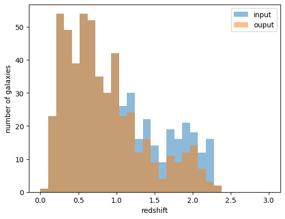
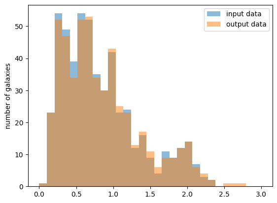
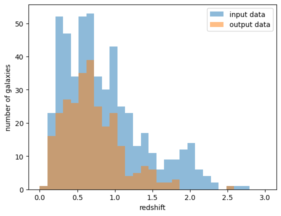
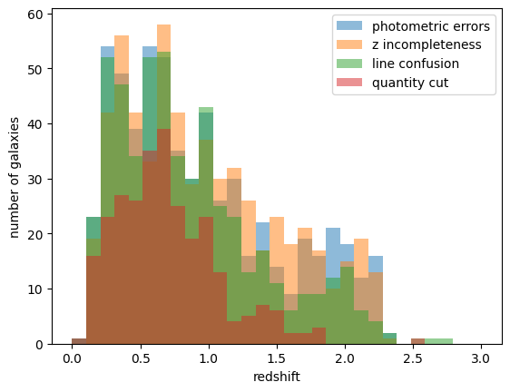
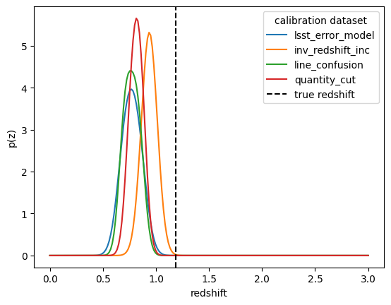
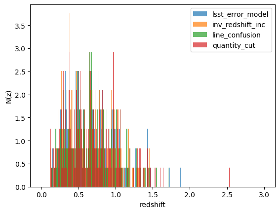
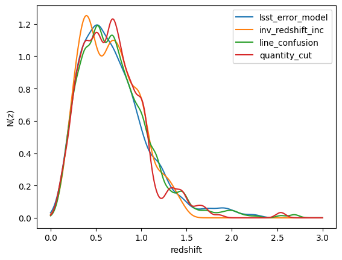
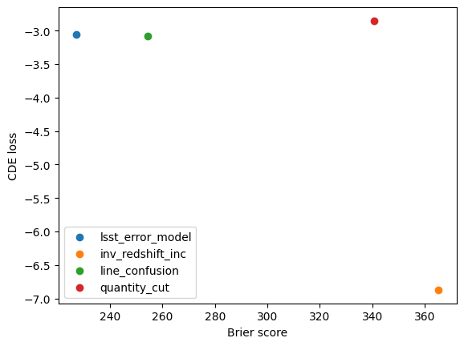

Exploring the Effects of Different Degraders on Estimated Redshifts
===================================================================

**Authors:** Jennifer Scora, Mubdi Rahman

**Last run successfully:** Feb 9, 2026

Thanks to Matteo Moretti and Biprateep Dey for inspiring the use case.

In this notebook, we’ll explore how to create simulated datasets with
the `RAIL creation
stage <https://rail-hub.readthedocs.io/en/latest/source/rail_stages/creation.html>`__,
in particular focusing on how data sets created using different
degradation algorithms can affect the calibration of models to estimate
photometric redshifts (photo-zs). Here “degradation” algorithms refer to
any algorithms applied to alter the “true” sample, for example to add
biases or cuts.

Here are the main steps we’ll be following:

1. Simulating galaxies with photometric data and redshifts
2. “Degrading” photometry and redshift information to create different
   calibration data
3. Calibrating the photometric redshift algorithms with the differently
   degraded data
4. Estimating the photometric redshifts of a set of target galaxies
   using the calibrated models
5. Seeing how the algorithm calibration affected the output redshift
   distributions

1. Simulating galaxies with photometric data and redshifts
----------------------------------------------------------

In this step we want to create the data sets of galaxy magnitudes and
corresponding redshifts that we will use to calibrate and estimate
photometric redshifts. We use the `PZflow
algorithm <https://rail-hub.readthedocs.io/en/latarget/source/rail_stages/creation.html#pzflow-engine>`__
to generate our model, which is a machine learning package that we’re
going to use in this context to model galaxies. Then we sample two data
sets from the model, a calibration dataset and a target dataset. The
calibration data set will be used to calibrate our models, and the
target data set is the data we will get photo-z estimates for. These
data sets will be considered our “true” data, which means they contain
the “real” redshifts before we have made any alterations to make the
data more realistic.

Set up
~~~~~~

Let’s start by importing the packages we’ll need to create and analyze
the data sets.

.. code:: ipython3

    import rail.interactive as ri
    import numpy as np
    from pzflow.examples import get_galaxy_data
    
    # for plotting
    import matplotlib.pyplot as plt
    
    %matplotlib inline


.. parsed-literal::

    Install FSPS with the following commands:
    pip uninstall fsps
    git clone --recursive https://github.com/dfm/python-fsps.git
    cd python-fsps
    python -m pip install .
    export SPS_HOME=$(pwd)/src/fsps/libfsps
    
    LEPHAREDIR is being set to the default cache directory:
    /home/runner/.cache/lephare/data
    More than 1Gb may be written there.
    LEPHAREWORK is being set to the default cache directory:
    /home/runner/.cache/lephare/work
    Default work cache is already linked. 
    This is linked to the run directory:
    /home/runner/.cache/lephare/runs/20260323T195050


.. parsed-literal::

    
    A module that was compiled using NumPy 1.x cannot be run in
    NumPy 2.4.3 as it may crash. To support both 1.x and 2.x
    versions of NumPy, modules must be compiled with NumPy 2.0.
    Some module may need to rebuild instead e.g. with 'pybind11>=2.12'.
    
    If you are a user of the module, the easiest solution will be to
    downgrade to 'numpy<2' or try to upgrade the affected module.
    We expect that some modules will need time to support NumPy 2.
    
    Traceback (most recent call last):  File "<frozen runpy>", line 198, in _run_module_as_main
      File "<frozen runpy>", line 88, in _run_code
      File "/opt/hostedtoolcache/Python/3.11.15/x64/lib/python3.11/site-packages/ipykernel_launcher.py", line 18, in <module>
        app.launch_new_instance()
      File "/opt/hostedtoolcache/Python/3.11.15/x64/lib/python3.11/site-packages/traitlets/config/application.py", line 1075, in launch_instance
        app.start()
      File "/opt/hostedtoolcache/Python/3.11.15/x64/lib/python3.11/site-packages/ipykernel/kernelapp.py", line 758, in start
        self.io_loop.start()
      File "/opt/hostedtoolcache/Python/3.11.15/x64/lib/python3.11/site-packages/tornado/platform/asyncio.py", line 211, in start
        self.asyncio_loop.run_forever()
      File "/opt/hostedtoolcache/Python/3.11.15/x64/lib/python3.11/asyncio/base_events.py", line 608, in run_forever
        self._run_once()
      File "/opt/hostedtoolcache/Python/3.11.15/x64/lib/python3.11/asyncio/base_events.py", line 1936, in _run_once
        handle._run()
      File "/opt/hostedtoolcache/Python/3.11.15/x64/lib/python3.11/asyncio/events.py", line 84, in _run
        self._context.run(self._callback, *self._args)
      File "/opt/hostedtoolcache/Python/3.11.15/x64/lib/python3.11/site-packages/ipykernel/kernelbase.py", line 621, in shell_main
        await self.dispatch_shell(msg, subshell_id=subshell_id)
      File "/opt/hostedtoolcache/Python/3.11.15/x64/lib/python3.11/site-packages/ipykernel/kernelbase.py", line 478, in dispatch_shell
        await result
      File "/opt/hostedtoolcache/Python/3.11.15/x64/lib/python3.11/site-packages/ipykernel/ipkernel.py", line 372, in execute_request
        await super().execute_request(stream, ident, parent)
      File "/opt/hostedtoolcache/Python/3.11.15/x64/lib/python3.11/site-packages/ipykernel/kernelbase.py", line 834, in execute_request
        reply_content = await reply_content
      File "/opt/hostedtoolcache/Python/3.11.15/x64/lib/python3.11/site-packages/ipykernel/ipkernel.py", line 464, in do_execute
        res = shell.run_cell(
      File "/opt/hostedtoolcache/Python/3.11.15/x64/lib/python3.11/site-packages/ipykernel/zmqshell.py", line 663, in run_cell
        return super().run_cell(*args, **kwargs)
      File "/opt/hostedtoolcache/Python/3.11.15/x64/lib/python3.11/site-packages/IPython/core/interactiveshell.py", line 3123, in run_cell
        result = self._run_cell(
      File "/opt/hostedtoolcache/Python/3.11.15/x64/lib/python3.11/site-packages/IPython/core/interactiveshell.py", line 3178, in _run_cell
        result = runner(coro)
      File "/opt/hostedtoolcache/Python/3.11.15/x64/lib/python3.11/site-packages/IPython/core/async_helpers.py", line 128, in _pseudo_sync_runner
        coro.send(None)
      File "/opt/hostedtoolcache/Python/3.11.15/x64/lib/python3.11/site-packages/IPython/core/interactiveshell.py", line 3400, in run_cell_async
        has_raised = await self.run_ast_nodes(code_ast.body, cell_name,
      File "/opt/hostedtoolcache/Python/3.11.15/x64/lib/python3.11/site-packages/IPython/core/interactiveshell.py", line 3641, in run_ast_nodes
        if await self.run_code(code, result, async_=asy):
      File "/opt/hostedtoolcache/Python/3.11.15/x64/lib/python3.11/site-packages/IPython/core/interactiveshell.py", line 3701, in run_code
        exec(code_obj, self.user_global_ns, self.user_ns)
      File "/tmp/ipykernel_4745/1847479680.py", line 1, in <module>
        import rail.interactive as ri
      File "/opt/hostedtoolcache/Python/3.11.15/x64/lib/python3.11/site-packages/rail/interactive/__init__.py", line 3, in <module>
        from . import calib, creation, estimation, evaluation, tools
      File "/opt/hostedtoolcache/Python/3.11.15/x64/lib/python3.11/site-packages/rail/interactive/calib/__init__.py", line 3, in <module>
        from rail.utils.interactive.initialize_utils import _initialize_interactive_module
      File "/opt/hostedtoolcache/Python/3.11.15/x64/lib/python3.11/site-packages/rail/utils/interactive/initialize_utils.py", line 17, in <module>
        from rail.utils.interactive.base_utils import (
      File "/opt/hostedtoolcache/Python/3.11.15/x64/lib/python3.11/site-packages/rail/utils/interactive/base_utils.py", line 10, in <module>
        rail.stages.import_and_attach_all(silent=True)
      File "/opt/hostedtoolcache/Python/3.11.15/x64/lib/python3.11/site-packages/rail/stages/__init__.py", line 74, in import_and_attach_all
        RailEnv.import_all_packages(silent=silent)
      File "/opt/hostedtoolcache/Python/3.11.15/x64/lib/python3.11/site-packages/rail/core/introspection.py", line 541, in import_all_packages
        _imported_module = importlib.import_module(pkg)
      File "/opt/hostedtoolcache/Python/3.11.15/x64/lib/python3.11/importlib/__init__.py", line 126, in import_module
        return _bootstrap._gcd_import(name[level:], package, level)
      File "/opt/hostedtoolcache/Python/3.11.15/x64/lib/python3.11/site-packages/rail/som/__init__.py", line 1, in <module>
        from rail.creation.degraders.specz_som import *
      File "/opt/hostedtoolcache/Python/3.11.15/x64/lib/python3.11/site-packages/rail/creation/degraders/specz_som.py", line 15, in <module>
        from somoclu import Somoclu
      File "/opt/hostedtoolcache/Python/3.11.15/x64/lib/python3.11/site-packages/somoclu/__init__.py", line 11, in <module>
        from .train import Somoclu
      File "/opt/hostedtoolcache/Python/3.11.15/x64/lib/python3.11/site-packages/somoclu/train.py", line 25, in <module>
        from .somoclu_wrap import train as wrap_train
      File "/opt/hostedtoolcache/Python/3.11.15/x64/lib/python3.11/site-packages/somoclu/somoclu_wrap.py", line 11, in <module>
        import _somoclu_wrap


::


    ---------------------------------------------------------------------------

    ImportError                               Traceback (most recent call last)

    File /opt/hostedtoolcache/Python/3.11.15/x64/lib/python3.11/site-packages/numpy/core/_multiarray_umath.py:46, in __getattr__(attr_name)
         41     # Also print the message (with traceback).  This is because old versions
         42     # of NumPy unfortunately set up the import to replace (and hide) the
         43     # error.  The traceback shouldn't be needed, but e.g. pytest plugins
         44     # seem to swallow it and we should be failing anyway...
         45     sys.stderr.write(msg + tb_msg)
    ---> 46     raise ImportError(msg)
         48 ret = getattr(_multiarray_umath, attr_name, None)
         49 if ret is None:


    ImportError: 
    A module that was compiled using NumPy 1.x cannot be run in
    NumPy 2.4.3 as it may crash. To support both 1.x and 2.x
    versions of NumPy, modules must be compiled with NumPy 2.0.
    Some module may need to rebuild instead e.g. with 'pybind11>=2.12'.
    
    If you are a user of the module, the easiest solution will be to
    downgrade to 'numpy<2' or try to upgrade the affected module.
    We expect that some modules will need time to support NumPy 2.
    


.. parsed-literal::

    Warning: the binary library cannot be imported. You cannot train maps, but you can load and analyze ones that you have already saved.
    The problem occurs because either compilation failed when you installed Somoclu or a path is missing from the dependencies when you are trying to import it. Please refer to the documentation to see your options.


We need to set up some column name dictionaries, as the expected column
names vary between some of the codes. In order to handle this, we can
pass in dictionaries of expected column names and the column name that
exists in the input data (``band_dict`` and ``rename_dict`` below). In
this notebook, we are using bands ugrizy, and each band will have a name
‘mag_u_lsst’, for example, with the error column name being
‘mag_err_u_lsst’.

The initial data we pull from our model won’t have any associated
errors. Those will be created when we degrade the datasets, but the
error columns will need to be renamed with the ``rename_dict`` later on.

.. code:: ipython3

    bands = ["u", "g", "r", "i", "z", "y"]
    band_dict = {band: f"mag_{band}_lsst" for band in bands}
    rename_dict = {f"mag_{band}_lsst_err": f"mag_err_{band}_lsst" for band in bands}

In order to generate the model with PZflow, we need to grab some sample
data to base the model off of. This sample data is only used to create
the model, and is seperate from the calibration and target data we’ll
get from the model later. We’ll rename the band columns in this data
table to match our desired band names as discussed above, using
``band_dict``. We can check that our columns have been renamed
appropriately by printing out the first few lines of the table:

.. code:: ipython3

    catalog = get_galaxy_data().rename(band_dict, axis=1)
    # let's take a look at the columns
    catalog.head()


.. raw:: html

    <div>
    <style scoped>
        .dataframe tbody tr th:only-of-type {
            vertical-align: middle;
        }
    
        .dataframe tbody tr th {
            vertical-align: top;
        }
    
        .dataframe thead th {
            text-align: right;
        }
    </style>
    <table border="1" class="dataframe">
      <thead>
        <tr style="text-align: right;">
          <th></th>
          <th>redshift</th>
          <th>mag_u_lsst</th>
          <th>mag_g_lsst</th>
          <th>mag_r_lsst</th>
          <th>mag_i_lsst</th>
          <th>mag_z_lsst</th>
          <th>mag_y_lsst</th>
        </tr>
      </thead>
      <tbody>
        <tr>
          <th>0</th>
          <td>0.287087</td>
          <td>26.759261</td>
          <td>25.901778</td>
          <td>25.187710</td>
          <td>24.932318</td>
          <td>24.736903</td>
          <td>24.671623</td>
        </tr>
        <tr>
          <th>1</th>
          <td>0.293313</td>
          <td>27.428358</td>
          <td>26.679299</td>
          <td>25.977161</td>
          <td>25.700094</td>
          <td>25.522763</td>
          <td>25.417632</td>
        </tr>
        <tr>
          <th>2</th>
          <td>1.497276</td>
          <td>27.294001</td>
          <td>26.068798</td>
          <td>25.450055</td>
          <td>24.460507</td>
          <td>23.887221</td>
          <td>23.206112</td>
        </tr>
        <tr>
          <th>3</th>
          <td>0.283310</td>
          <td>28.154075</td>
          <td>26.283166</td>
          <td>24.599570</td>
          <td>23.723491</td>
          <td>23.214108</td>
          <td>22.860012</td>
        </tr>
        <tr>
          <th>4</th>
          <td>1.545183</td>
          <td>29.276065</td>
          <td>27.878301</td>
          <td>27.333528</td>
          <td>26.543374</td>
          <td>26.061941</td>
          <td>25.383056</td>
        </tr>
      </tbody>
    </table>
    </div>


Looks like the column names are the way we want them!

Calibrate and sample the model
~~~~~~~~~~~~~~~~~~~~~~~~~~~~~~

Now we need to use the galaxy data we retrieved to calibrate the model
that we’ll use to create our input galaxy magnitude data catalogues
later. We’re going to use the ``PZflow`` engine to do this, specifically
the ``modeler`` function. This will train the normalizing flow that
serves as the engine for the input data creation. To get a sense of what
it does and the parameters it needs, let’s check out its docstrings:

.. code:: ipython3

    ri.creation.engines.flowEngine.flow_modeler?

We’ll pass the modeler a few parameters: - **input_data:** this is the
input catalog that our modeler needs to train the data flow (the one we
retrieved above) - **seed (optional):** this is the random seed used for
training - **phys_cols (optional):** The names of any non-photometry
columns and their [min,max] values. - **phot_cols (optional):** This is
a dictionary of the names of the photometry columns and their
corresponding [min,max] values. - **calc_colors (optional):** Whether to
internally calculate colors (if phot_cols are magnitudes). Assumes that
you want to calculate colors from adjacent columns in phot_cols. If you
do not want to calculate colors, set False. Else, provide a dictionary
``{‘ref_column_name’: band}``, where band is a string corresponding to
the column in phot_cols you want to save as the overall galaxy
magnitude. We’re passing in the default value here just so you can see
how it works. - **num_training_epochs (optional):** By default 30, here
we’re doing fewer so that it doesn’t take as long.

**NOTE:** This calibration may take a while depending on your setup.

.. code:: ipython3

    flow_model = ri.creation.engines.flowEngine.flow_modeler(
        input_data=catalog,
        seed=0,
        phys_cols={"redshift": [0, 3]},
        phot_cols={
            "mag_u_lsst": [17, 35],
            "mag_g_lsst": [16, 32],
            "mag_r_lsst": [15, 30],
            "mag_i_lsst": [15, 30],
            "mag_z_lsst": [14, 29],
            "mag_y_lsst": [14, 28],
        },
        calc_colors={"ref_column_name": "mag_i_lsst"},
        num_training_epochs=10,
    )


.. parsed-literal::

    Inserting handle into data store.  input: None, FlowModeler


.. parsed-literal::

    Training 30 epochs 
    Loss:


.. parsed-literal::

    (0) 19.6133


.. parsed-literal::

    (1) 1.3356


.. parsed-literal::

    (2) -0.2960


.. parsed-literal::

    (3) -0.8647


.. parsed-literal::

    (4) -1.2269


.. parsed-literal::

    (5) 0.7571


.. parsed-literal::

    (6) -1.3080


.. parsed-literal::

    (7) -2.4602


.. parsed-literal::

    (8) -1.6267


.. parsed-literal::

    (9) -1.1870


.. parsed-literal::

    (10) -2.0287


.. parsed-literal::

    (11) -2.8581


.. parsed-literal::

    (12) -3.2555


.. parsed-literal::

    (13) -2.9009


.. parsed-literal::

    (14) -2.9004


.. parsed-literal::

    (15) -3.3742


.. parsed-literal::

    (16) -3.2952


.. parsed-literal::

    (17) -3.4071


.. parsed-literal::

    (18) -3.4816


.. parsed-literal::

    (19) -3.2921


.. parsed-literal::

    (20) -2.4361


.. parsed-literal::

    (21) -3.2809


.. parsed-literal::

    (22) -2.9982


.. parsed-literal::

    (23) -0.6346


.. parsed-literal::

    (24) -3.8663


.. parsed-literal::

    (25) -4.4979


.. parsed-literal::

    (26) -4.0998


.. parsed-literal::

    (27) -4.2410


.. parsed-literal::

    (28) -4.0741


.. parsed-literal::

    (29) -4.6661


.. parsed-literal::

    (30) -4.5725


.. parsed-literal::

    Inserting handle into data store.  model: inprogress_model.pkl, FlowModeler


Now we’ll use the flow to produce some synthetic data for our
calibration data set and target data set. Since this is a test we’ll
create some small datasets, with 600 galaxies for this sample, so we’ll
pass in the argument: ``n_samples = 600``. We’ll also use a specific
seed for each one to ensure they’re reproducible but different from each
other.

**Note that when we pass the model to this function, we don’t pass the
dictionary, but the actual model object. This is true of all the
interactive functions.**

.. code:: ipython3

    # get sample calibration and target data sets
    calib_data_orig = ri.creation.engines.flowEngine.flow_creator(
        n_samples=600, model=flow_model["model"], seed=1235
    )
    targ_data_orig = ri.creation.engines.flowEngine.flow_creator(
        model=flow_model["model"], n_samples=600, seed=1234
    )


.. parsed-literal::

    Inserting handle into data store.  model: <pzflow.flow.Flow object at 0x7fdae52a2dd0>, FlowCreator


.. parsed-literal::

    Inserting handle into data store.  output: inprogress_output.pq, FlowCreator
    Inserting handle into data store.  model: <pzflow.flow.Flow object at 0x7fdae52a2dd0>, FlowCreator
    Inserting handle into data store.  output: inprogress_output.pq, FlowCreator


Let’s plot these data sets to check that they are in fact different:

.. code:: ipython3

    hist_options = {"bins": np.linspace(0, 3, 30), "histtype": "stepfilled", "alpha": 0.5}
    
    plt.hist(calib_data_orig["output"]["redshift"], label="calibration", **hist_options)
    plt.hist(targ_data_orig["output"]["redshift"], label="target", **hist_options)
    plt.legend(loc="best")
    plt.xlabel("redshift")
    plt.ylabel("number of galaxies")


.. parsed-literal::

    Text(0, 0.5, 'number of galaxies')





2. “Degrading” photometry and redshift information to create different calibration data
---------------------------------------------------------------------------------------

The goal of this step is to create a bunch of realistic galaxy
observations that have been degraded in a variety of ways that we’re
going to use as calibration sets for our favourite photometric redshift
algorithm, and to degrade one target data set we want to use to get
estimated redshifts.

So in this step, we’re going to create four different calibration data
sets, where each data set has had one more degrader applied. Thus, the
fourth data has all four degraders applied, while the first only has one
applied. We’ll also create a set of target data will all of the same
four degradations applied, such that the target data should most closely
resemble the most degraded calibration data set.

The degraders we’ll be using, in order, are:

1. ``lsst_error_model`` to add photometric errors that are modelled
   based on the Vera Rubin telescope
2. ``inv_redshift_incompleteness`` to mimic redshift dependent
   incompleteness
3. ``line_confusion`` to simulate the effect of misidentified lines
4. ``quantity_cut`` mimics a band-dependent brightness cut

1. LSST Error Model
~~~~~~~~~~~~~~~~~~~

This method adds photometric errors, non-detections and extended source
errors that are modelled based on the Vera Rubin telescope. We’re going
to apply it to both calibration and target data sets. Once again, we’re
supplying different seeds to ensure the results are reproducible and
different from each other. We need to supply the ``band_dict`` we
created earlier, which tells the code what the band column names should
be. We are also supplying ``ndFlag=np.nan``, which just tells the code
to make non-detections ``np.nan`` in the output.

.. code:: ipython3

    # calibration data
    calib_data_photerrs = ri.creation.degraders.photometric_errors.lsst_error_model(
        sample=calib_data_orig["output"], seed=66, renameDict=band_dict, ndFlag=np.nan
    )
    
    # target data set
    targ_data_photerrs = ri.creation.degraders.photometric_errors.lsst_error_model(
        sample=targ_data_orig["output"], seed=66, renameDict=band_dict, ndFlag=np.nan
    )


.. parsed-literal::

    Inserting handle into data store.  input: None, LSSTErrorModel
    Inserting handle into data store.  output: inprogress_output.pq, LSSTErrorModel
    Inserting handle into data store.  input: None, LSSTErrorModel
    Inserting handle into data store.  output: inprogress_output.pq, LSSTErrorModel


.. code:: ipython3

    # let's see what the output looks like
    calib_data_photerrs["output"].head()


.. raw:: html

    <div>
    <style scoped>
        .dataframe tbody tr th:only-of-type {
            vertical-align: middle;
        }
    
        .dataframe tbody tr th {
            vertical-align: top;
        }
    
        .dataframe thead th {
            text-align: right;
        }
    </style>
    <table border="1" class="dataframe">
      <thead>
        <tr style="text-align: right;">
          <th></th>
          <th>redshift</th>
          <th>mag_u_lsst</th>
          <th>mag_u_lsst_err</th>
          <th>mag_g_lsst</th>
          <th>mag_g_lsst_err</th>
          <th>mag_r_lsst</th>
          <th>mag_r_lsst_err</th>
          <th>mag_i_lsst</th>
          <th>mag_i_lsst_err</th>
          <th>mag_z_lsst</th>
          <th>mag_z_lsst_err</th>
          <th>mag_y_lsst</th>
          <th>mag_y_lsst_err</th>
        </tr>
      </thead>
      <tbody>
        <tr>
          <th>0</th>
          <td>0.370414</td>
          <td>27.122132</td>
          <td>0.598764</td>
          <td>26.918704</td>
          <td>0.197826</td>
          <td>25.869258</td>
          <td>0.070240</td>
          <td>25.662502</td>
          <td>0.095367</td>
          <td>25.598763</td>
          <td>0.170217</td>
          <td>25.932099</td>
          <td>0.466979</td>
        </tr>
        <tr>
          <th>1</th>
          <td>0.372931</td>
          <td>26.918850</td>
          <td>0.517267</td>
          <td>25.936898</td>
          <td>0.084767</td>
          <td>24.755959</td>
          <td>0.026250</td>
          <td>24.309388</td>
          <td>0.028819</td>
          <td>24.016158</td>
          <td>0.042495</td>
          <td>23.829944</td>
          <td>0.081376</td>
        </tr>
        <tr>
          <th>2</th>
          <td>0.884873</td>
          <td>23.906889</td>
          <td>0.041496</td>
          <td>23.670047</td>
          <td>0.012199</td>
          <td>23.195966</td>
          <td>0.008063</td>
          <td>22.531059</td>
          <td>0.007602</td>
          <td>22.139233</td>
          <td>0.009244</td>
          <td>22.031194</td>
          <td>0.016887</td>
        </tr>
        <tr>
          <th>3</th>
          <td>0.522923</td>
          <td>26.468731</td>
          <td>0.367962</td>
          <td>25.222704</td>
          <td>0.045079</td>
          <td>24.024797</td>
          <td>0.014218</td>
          <td>23.450198</td>
          <td>0.013981</td>
          <td>23.188577</td>
          <td>0.020615</td>
          <td>22.913779</td>
          <td>0.036135</td>
        </tr>
        <tr>
          <th>4</th>
          <td>2.039537</td>
          <td>27.228641</td>
          <td>0.645154</td>
          <td>27.856077</td>
          <td>0.420774</td>
          <td>26.810722</td>
          <td>0.159733</td>
          <td>26.389236</td>
          <td>0.178745</td>
          <td>25.516306</td>
          <td>0.158656</td>
          <td>25.616592</td>
          <td>0.366833</td>
        </tr>
      </tbody>
    </table>
    </div>


You can see that error columns have been added in for each of the
magnitude columns.

Now let’s take a look at what’s happened to the magnitudes. Below we’ll
plot the u-band magnitudes before and after running the degrader. You
can see that the higher magnitude objects now have a much wider variance
in magnitude compared to their initial magnitudes, but at lower
magnitudes they’ve remained similar:

.. code:: ipython3

    # we have to set the range because there are nans in the new dataset with errors, which messes up plt.hist2d
    range = [
        [
            np.min(calib_data_orig["output"]["mag_u_lsst"]),
            np.max(calib_data_orig["output"]["mag_u_lsst"]),
        ],
        [
            np.min(calib_data_photerrs["output"]["mag_u_lsst"]),
            np.max(calib_data_photerrs["output"]["mag_u_lsst"]),
        ],
    ]
    plt.hist2d(
        calib_data_orig["output"]["mag_u_lsst"],
        calib_data_photerrs["output"]["mag_u_lsst"],
        range=range,
        bins=20,
        cmap="viridis",
    )
    plt.xlabel("original u-band magnitude")
    plt.ylabel("new u-band magnitude")
    plt.colorbar(label="number of galaxies")


.. parsed-literal::

    <matplotlib.colorbar.Colorbar at 0x7fdad494fd90>





You can make this plot for all the other magnitudes if you’d like.

2. Redshift Incompleteness
~~~~~~~~~~~~~~~~~~~~~~~~~~

This method applies a selection function, which keeps galaxies with
probability

:math:`p_{\text{keep}}(z) = \min(1, \frac{z_p}{z})`,

where :math:`z_p` is the ‘’pivot’’ redshift. We’ll use
:math:`z_p = 1.0`.

**NOTE**:

As you’ll see later with the evaluators, they’ll require the samples
that we want to compare to be the same length. But if you’ve removed
galaxies due to incompleteness, they won’t inherently be the same
length. So instead, what we’re going to do is flag those galaxies that
are removed.

To do this, we can use the parameter ``drop_rows=False``. This will
return a data table of the same length as before, with a “flag” column
that identifies which galaxies are to be kept, and which are to be
dropped.

.. code:: ipython3

    # calibration data set
    calib_data_inc = (
        ri.creation.degraders.spectroscopic_degraders.inv_redshift_incompleteness(
            sample=calib_data_photerrs["output"], pivot_redshift=1.0
        )
    )
    
    # target data set - use drop_rows to ensure it's the same length
    targ_data_inc = (
        ri.creation.degraders.spectroscopic_degraders.inv_redshift_incompleteness(
            sample=targ_data_photerrs["output"], pivot_redshift=1.0, drop_rows=False
        )
    )
    targ_data_inc["output"]  # look at the output


.. parsed-literal::

    Inserting handle into data store.  input: None, InvRedshiftIncompleteness
    Inserting handle into data store.  output: inprogress_output.pq, InvRedshiftIncompleteness
    Inserting handle into data store.  input: None, InvRedshiftIncompleteness
    Inserting handle into data store.  output: inprogress_output.pq, InvRedshiftIncompleteness


.. raw:: html

    <div>
    <style scoped>
        .dataframe tbody tr th:only-of-type {
            vertical-align: middle;
        }
    
        .dataframe tbody tr th {
            vertical-align: top;
        }
    
        .dataframe thead th {
            text-align: right;
        }
    </style>
    <table border="1" class="dataframe">
      <thead>
        <tr style="text-align: right;">
          <th></th>
          <th>flag</th>
          <th>redshift</th>
          <th>mag_u_lsst</th>
          <th>mag_u_lsst_err</th>
          <th>mag_g_lsst</th>
          <th>mag_g_lsst_err</th>
          <th>mag_r_lsst</th>
          <th>mag_r_lsst_err</th>
          <th>mag_i_lsst</th>
          <th>mag_i_lsst_err</th>
          <th>mag_z_lsst</th>
          <th>mag_z_lsst_err</th>
          <th>mag_y_lsst</th>
          <th>mag_y_lsst_err</th>
        </tr>
      </thead>
      <tbody>
        <tr>
          <th>0</th>
          <td>True</td>
          <td>0.253092</td>
          <td>26.113820</td>
          <td>0.277420</td>
          <td>25.452406</td>
          <td>0.055248</td>
          <td>24.764484</td>
          <td>0.026446</td>
          <td>24.547853</td>
          <td>0.035551</td>
          <td>24.405074</td>
          <td>0.060012</td>
          <td>24.485035</td>
          <td>0.144121</td>
        </tr>
        <tr>
          <th>1</th>
          <td>True</td>
          <td>1.218356</td>
          <td>27.211861</td>
          <td>0.637675</td>
          <td>26.849462</td>
          <td>0.186618</td>
          <td>26.323622</td>
          <td>0.104791</td>
          <td>25.962856</td>
          <td>0.123960</td>
          <td>25.353204</td>
          <td>0.137915</td>
          <td>25.103264</td>
          <td>0.242815</td>
        </tr>
        <tr>
          <th>2</th>
          <td>True</td>
          <td>0.457460</td>
          <td>26.202677</td>
          <td>0.298050</td>
          <td>25.819786</td>
          <td>0.076458</td>
          <td>24.684006</td>
          <td>0.024660</td>
          <td>24.354272</td>
          <td>0.029976</td>
          <td>24.122647</td>
          <td>0.046705</td>
          <td>24.020353</td>
          <td>0.096216</td>
        </tr>
        <tr>
          <th>3</th>
          <td>True</td>
          <td>1.018021</td>
          <td>28.267686</td>
          <td>1.232677</td>
          <td>26.988308</td>
          <td>0.209710</td>
          <td>26.870200</td>
          <td>0.168048</td>
          <td>26.293306</td>
          <td>0.164742</td>
          <td>25.498548</td>
          <td>0.156264</td>
          <td>25.048256</td>
          <td>0.232025</td>
        </tr>
        <tr>
          <th>4</th>
          <td>True</td>
          <td>0.632389</td>
          <td>26.198423</td>
          <td>0.297032</td>
          <td>26.278279</td>
          <td>0.114292</td>
          <td>25.678773</td>
          <td>0.059329</td>
          <td>25.233383</td>
          <td>0.065301</td>
          <td>25.068103</td>
          <td>0.107671</td>
          <td>25.545583</td>
          <td>0.346958</td>
        </tr>
        <tr>
          <th>...</th>
          <td>...</td>
          <td>...</td>
          <td>...</td>
          <td>...</td>
          <td>...</td>
          <td>...</td>
          <td>...</td>
          <td>...</td>
          <td>...</td>
          <td>...</td>
          <td>...</td>
          <td>...</td>
          <td>...</td>
          <td>...</td>
        </tr>
        <tr>
          <th>595</th>
          <td>True</td>
          <td>1.511651</td>
          <td>NaN</td>
          <td>NaN</td>
          <td>27.810852</td>
          <td>0.406459</td>
          <td>27.415500</td>
          <td>0.264987</td>
          <td>27.085513</td>
          <td>0.317422</td>
          <td>25.843004</td>
          <td>0.209180</td>
          <td>27.449550</td>
          <td>1.253839</td>
        </tr>
        <tr>
          <th>596</th>
          <td>True</td>
          <td>0.850231</td>
          <td>27.009124</td>
          <td>0.552332</td>
          <td>27.756517</td>
          <td>0.389795</td>
          <td>27.153910</td>
          <td>0.213493</td>
          <td>26.101826</td>
          <td>0.139793</td>
          <td>25.496812</td>
          <td>0.156032</td>
          <td>25.432001</td>
          <td>0.317072</td>
        </tr>
        <tr>
          <th>597</th>
          <td>True</td>
          <td>0.288089</td>
          <td>27.100459</td>
          <td>0.589638</td>
          <td>26.268716</td>
          <td>0.113344</td>
          <td>25.152618</td>
          <td>0.037199</td>
          <td>24.822860</td>
          <td>0.045360</td>
          <td>24.400083</td>
          <td>0.059747</td>
          <td>24.462033</td>
          <td>0.141295</td>
        </tr>
        <tr>
          <th>598</th>
          <td>True</td>
          <td>0.653297</td>
          <td>NaN</td>
          <td>NaN</td>
          <td>28.324357</td>
          <td>0.594137</td>
          <td>26.440218</td>
          <td>0.116014</td>
          <td>25.802774</td>
          <td>0.107831</td>
          <td>25.527978</td>
          <td>0.160247</td>
          <td>25.116330</td>
          <td>0.245443</td>
        </tr>
        <tr>
          <th>599</th>
          <td>True</td>
          <td>0.963349</td>
          <td>32.428109</td>
          <td>4.983029</td>
          <td>26.777304</td>
          <td>0.175562</td>
          <td>26.496116</td>
          <td>0.121793</td>
          <td>25.692422</td>
          <td>0.097903</td>
          <td>25.479200</td>
          <td>0.153696</td>
          <td>25.310582</td>
          <td>0.287605</td>
        </tr>
      </tbody>
    </table>
    <p>600 rows × 14 columns</p>
    </div>


We can see that, as expected, the target data set has the “flag” column,
and that the length of the data set is still 600. Now let’s take a look
at the calibration data set, where we left ``drop_rows`` as true:

.. code:: ipython3

    targ_data_inc["output"]  # look at the output


.. raw:: html

    <div>
    <style scoped>
        .dataframe tbody tr th:only-of-type {
            vertical-align: middle;
        }
    
        .dataframe tbody tr th {
            vertical-align: top;
        }
    
        .dataframe thead th {
            text-align: right;
        }
    </style>
    <table border="1" class="dataframe">
      <thead>
        <tr style="text-align: right;">
          <th></th>
          <th>flag</th>
          <th>redshift</th>
          <th>mag_u_lsst</th>
          <th>mag_u_lsst_err</th>
          <th>mag_g_lsst</th>
          <th>mag_g_lsst_err</th>
          <th>mag_r_lsst</th>
          <th>mag_r_lsst_err</th>
          <th>mag_i_lsst</th>
          <th>mag_i_lsst_err</th>
          <th>mag_z_lsst</th>
          <th>mag_z_lsst_err</th>
          <th>mag_y_lsst</th>
          <th>mag_y_lsst_err</th>
        </tr>
      </thead>
      <tbody>
        <tr>
          <th>0</th>
          <td>True</td>
          <td>0.253092</td>
          <td>26.113820</td>
          <td>0.277420</td>
          <td>25.452406</td>
          <td>0.055248</td>
          <td>24.764484</td>
          <td>0.026446</td>
          <td>24.547853</td>
          <td>0.035551</td>
          <td>24.405074</td>
          <td>0.060012</td>
          <td>24.485035</td>
          <td>0.144121</td>
        </tr>
        <tr>
          <th>1</th>
          <td>True</td>
          <td>1.218356</td>
          <td>27.211861</td>
          <td>0.637675</td>
          <td>26.849462</td>
          <td>0.186618</td>
          <td>26.323622</td>
          <td>0.104791</td>
          <td>25.962856</td>
          <td>0.123960</td>
          <td>25.353204</td>
          <td>0.137915</td>
          <td>25.103264</td>
          <td>0.242815</td>
        </tr>
        <tr>
          <th>2</th>
          <td>True</td>
          <td>0.457460</td>
          <td>26.202677</td>
          <td>0.298050</td>
          <td>25.819786</td>
          <td>0.076458</td>
          <td>24.684006</td>
          <td>0.024660</td>
          <td>24.354272</td>
          <td>0.029976</td>
          <td>24.122647</td>
          <td>0.046705</td>
          <td>24.020353</td>
          <td>0.096216</td>
        </tr>
        <tr>
          <th>3</th>
          <td>True</td>
          <td>1.018021</td>
          <td>28.267686</td>
          <td>1.232677</td>
          <td>26.988308</td>
          <td>0.209710</td>
          <td>26.870200</td>
          <td>0.168048</td>
          <td>26.293306</td>
          <td>0.164742</td>
          <td>25.498548</td>
          <td>0.156264</td>
          <td>25.048256</td>
          <td>0.232025</td>
        </tr>
        <tr>
          <th>4</th>
          <td>True</td>
          <td>0.632389</td>
          <td>26.198423</td>
          <td>0.297032</td>
          <td>26.278279</td>
          <td>0.114292</td>
          <td>25.678773</td>
          <td>0.059329</td>
          <td>25.233383</td>
          <td>0.065301</td>
          <td>25.068103</td>
          <td>0.107671</td>
          <td>25.545583</td>
          <td>0.346958</td>
        </tr>
        <tr>
          <th>...</th>
          <td>...</td>
          <td>...</td>
          <td>...</td>
          <td>...</td>
          <td>...</td>
          <td>...</td>
          <td>...</td>
          <td>...</td>
          <td>...</td>
          <td>...</td>
          <td>...</td>
          <td>...</td>
          <td>...</td>
          <td>...</td>
        </tr>
        <tr>
          <th>595</th>
          <td>True</td>
          <td>1.511651</td>
          <td>NaN</td>
          <td>NaN</td>
          <td>27.810852</td>
          <td>0.406459</td>
          <td>27.415500</td>
          <td>0.264987</td>
          <td>27.085513</td>
          <td>0.317422</td>
          <td>25.843004</td>
          <td>0.209180</td>
          <td>27.449550</td>
          <td>1.253839</td>
        </tr>
        <tr>
          <th>596</th>
          <td>True</td>
          <td>0.850231</td>
          <td>27.009124</td>
          <td>0.552332</td>
          <td>27.756517</td>
          <td>0.389795</td>
          <td>27.153910</td>
          <td>0.213493</td>
          <td>26.101826</td>
          <td>0.139793</td>
          <td>25.496812</td>
          <td>0.156032</td>
          <td>25.432001</td>
          <td>0.317072</td>
        </tr>
        <tr>
          <th>597</th>
          <td>True</td>
          <td>0.288089</td>
          <td>27.100459</td>
          <td>0.589638</td>
          <td>26.268716</td>
          <td>0.113344</td>
          <td>25.152618</td>
          <td>0.037199</td>
          <td>24.822860</td>
          <td>0.045360</td>
          <td>24.400083</td>
          <td>0.059747</td>
          <td>24.462033</td>
          <td>0.141295</td>
        </tr>
        <tr>
          <th>598</th>
          <td>True</td>
          <td>0.653297</td>
          <td>NaN</td>
          <td>NaN</td>
          <td>28.324357</td>
          <td>0.594137</td>
          <td>26.440218</td>
          <td>0.116014</td>
          <td>25.802774</td>
          <td>0.107831</td>
          <td>25.527978</td>
          <td>0.160247</td>
          <td>25.116330</td>
          <td>0.245443</td>
        </tr>
        <tr>
          <th>599</th>
          <td>True</td>
          <td>0.963349</td>
          <td>32.428109</td>
          <td>4.983029</td>
          <td>26.777304</td>
          <td>0.175562</td>
          <td>26.496116</td>
          <td>0.121793</td>
          <td>25.692422</td>
          <td>0.097903</td>
          <td>25.479200</td>
          <td>0.153696</td>
          <td>25.310582</td>
          <td>0.287605</td>
        </tr>
      </tbody>
    </table>
    <p>600 rows × 14 columns</p>
    </div>


This data set is shorter than the target data set now, since those
galaxies have just been removed from the data entirely. This isn’t a
problem for the calibration data set, since we don’t need to compare it
to anything later. Let’s plot a histogram of the calibration data set
redshifts with just the photometric errors, and compare it to our new
data set with both that and the redshift incompleteness:

.. code:: ipython3

    plt.hist(calib_data_photerrs["output"]["redshift"], label="input", **hist_options)
    plt.hist(calib_data_inc["output"]["redshift"], label="ouput", **hist_options)
    plt.legend(loc="best")
    plt.xlabel("redshift")
    plt.ylabel("number of galaxies")


.. parsed-literal::

    Text(0, 0.5, 'number of galaxies')





The output data set clearly has fewer galaxies than the input data set
above redshift of 1, and the distributions are the same for redshifts
less than 1, as expected.

For the target data set, we just have one more step that we need to do
before we can feed it into any other degraders. We use the “flag” column
to mask all of the “dropped” galaxy rows and set them all as ``np.nan``
- this keeps the indices the same, allowing us to compare to the truth
data set as is our goal.

.. code:: ipython3

    # save the column as a separate variable
    inc_flag = targ_data_inc["output"]["flag"]
    
    # drop the flag column from the dataframe entirely
    targ_data_inc["output"].drop(columns="flag", inplace=True)
    
    # replace the lines that are cut out by the degrader with np.nan
    new_targ_data_inc = targ_data_inc["output"].where(inc_flag, np.nan)
    
    # take a look at the result
    new_targ_data_inc


.. raw:: html

    <div>
    <style scoped>
        .dataframe tbody tr th:only-of-type {
            vertical-align: middle;
        }
    
        .dataframe tbody tr th {
            vertical-align: top;
        }
    
        .dataframe thead th {
            text-align: right;
        }
    </style>
    <table border="1" class="dataframe">
      <thead>
        <tr style="text-align: right;">
          <th></th>
          <th>redshift</th>
          <th>mag_u_lsst</th>
          <th>mag_u_lsst_err</th>
          <th>mag_g_lsst</th>
          <th>mag_g_lsst_err</th>
          <th>mag_r_lsst</th>
          <th>mag_r_lsst_err</th>
          <th>mag_i_lsst</th>
          <th>mag_i_lsst_err</th>
          <th>mag_z_lsst</th>
          <th>mag_z_lsst_err</th>
          <th>mag_y_lsst</th>
          <th>mag_y_lsst_err</th>
        </tr>
      </thead>
      <tbody>
        <tr>
          <th>0</th>
          <td>0.253092</td>
          <td>26.113820</td>
          <td>0.277420</td>
          <td>25.452406</td>
          <td>0.055248</td>
          <td>24.764484</td>
          <td>0.026446</td>
          <td>24.547853</td>
          <td>0.035551</td>
          <td>24.405074</td>
          <td>0.060012</td>
          <td>24.485035</td>
          <td>0.144121</td>
        </tr>
        <tr>
          <th>1</th>
          <td>1.218356</td>
          <td>27.211861</td>
          <td>0.637675</td>
          <td>26.849462</td>
          <td>0.186618</td>
          <td>26.323622</td>
          <td>0.104791</td>
          <td>25.962856</td>
          <td>0.123960</td>
          <td>25.353204</td>
          <td>0.137915</td>
          <td>25.103264</td>
          <td>0.242815</td>
        </tr>
        <tr>
          <th>2</th>
          <td>0.457460</td>
          <td>26.202677</td>
          <td>0.298050</td>
          <td>25.819786</td>
          <td>0.076458</td>
          <td>24.684006</td>
          <td>0.024660</td>
          <td>24.354272</td>
          <td>0.029976</td>
          <td>24.122647</td>
          <td>0.046705</td>
          <td>24.020353</td>
          <td>0.096216</td>
        </tr>
        <tr>
          <th>3</th>
          <td>1.018021</td>
          <td>28.267686</td>
          <td>1.232677</td>
          <td>26.988308</td>
          <td>0.209710</td>
          <td>26.870200</td>
          <td>0.168048</td>
          <td>26.293306</td>
          <td>0.164742</td>
          <td>25.498548</td>
          <td>0.156264</td>
          <td>25.048256</td>
          <td>0.232025</td>
        </tr>
        <tr>
          <th>4</th>
          <td>0.632389</td>
          <td>26.198423</td>
          <td>0.297032</td>
          <td>26.278279</td>
          <td>0.114292</td>
          <td>25.678773</td>
          <td>0.059329</td>
          <td>25.233383</td>
          <td>0.065301</td>
          <td>25.068103</td>
          <td>0.107671</td>
          <td>25.545583</td>
          <td>0.346958</td>
        </tr>
        <tr>
          <th>...</th>
          <td>...</td>
          <td>...</td>
          <td>...</td>
          <td>...</td>
          <td>...</td>
          <td>...</td>
          <td>...</td>
          <td>...</td>
          <td>...</td>
          <td>...</td>
          <td>...</td>
          <td>...</td>
          <td>...</td>
        </tr>
        <tr>
          <th>595</th>
          <td>1.511651</td>
          <td>NaN</td>
          <td>NaN</td>
          <td>27.810852</td>
          <td>0.406459</td>
          <td>27.415500</td>
          <td>0.264987</td>
          <td>27.085513</td>
          <td>0.317422</td>
          <td>25.843004</td>
          <td>0.209180</td>
          <td>27.449550</td>
          <td>1.253839</td>
        </tr>
        <tr>
          <th>596</th>
          <td>0.850231</td>
          <td>27.009124</td>
          <td>0.552332</td>
          <td>27.756517</td>
          <td>0.389795</td>
          <td>27.153910</td>
          <td>0.213493</td>
          <td>26.101826</td>
          <td>0.139793</td>
          <td>25.496812</td>
          <td>0.156032</td>
          <td>25.432001</td>
          <td>0.317072</td>
        </tr>
        <tr>
          <th>597</th>
          <td>0.288089</td>
          <td>27.100459</td>
          <td>0.589638</td>
          <td>26.268716</td>
          <td>0.113344</td>
          <td>25.152618</td>
          <td>0.037199</td>
          <td>24.822860</td>
          <td>0.045360</td>
          <td>24.400083</td>
          <td>0.059747</td>
          <td>24.462033</td>
          <td>0.141295</td>
        </tr>
        <tr>
          <th>598</th>
          <td>0.653297</td>
          <td>NaN</td>
          <td>NaN</td>
          <td>28.324357</td>
          <td>0.594137</td>
          <td>26.440218</td>
          <td>0.116014</td>
          <td>25.802774</td>
          <td>0.107831</td>
          <td>25.527978</td>
          <td>0.160247</td>
          <td>25.116330</td>
          <td>0.245443</td>
        </tr>
        <tr>
          <th>599</th>
          <td>0.963349</td>
          <td>32.428109</td>
          <td>4.983029</td>
          <td>26.777304</td>
          <td>0.175562</td>
          <td>26.496116</td>
          <td>0.121793</td>
          <td>25.692422</td>
          <td>0.097903</td>
          <td>25.479200</td>
          <td>0.153696</td>
          <td>25.310582</td>
          <td>0.287605</td>
        </tr>
      </tbody>
    </table>
    <p>600 rows × 13 columns</p>
    </div>


The new dataframe is the same length as the old one, but without the
flag column, and now those rows will just be ``np.nan``.

3. Line Confusion
~~~~~~~~~~~~~~~~~

This method simulates the effect of misidentified lines. The degrader
will misidentify some percentage (``frac_wrong``) of the actual lines
(here we’re picking :math:`5007.0~\mathring{\mathrm{A}}`, which are OIII
lines) as the line we pick for ``wrong_wavelen``. In this case, we’ll
pick :math:`3727.0~\mathring{\mathrm{A}}`, which are OII lines.

This degrader doesn’t cut any galaxies, so we don’t have to worry about
the ``drop_rows`` parameter.

.. code:: ipython3

    # dataset 3: add in line confusion
    calib_data_conf = ri.creation.degraders.spectroscopic_degraders.line_confusion(
        sample=calib_data_inc["output"],
        true_wavelen=5007.0,
        wrong_wavelen=3727.0,
        frac_wrong=0.05,
        seed=1337,
    )
    
    # dataset 3: add in line confusion using the modified data set
    targ_data_conf = ri.creation.degraders.spectroscopic_degraders.line_confusion(
        sample=new_targ_data_inc,
        true_wavelen=5007.0,
        wrong_wavelen=3727.0,
        frac_wrong=0.05,
        seed=1450,
    )


.. parsed-literal::

    Inserting handle into data store.  input: None, LineConfusion
    Inserting handle into data store.  output: inprogress_output.pq, LineConfusion
    Inserting handle into data store.  input: None, LineConfusion
    Inserting handle into data store.  output: inprogress_output.pq, LineConfusion


Now let’s take a look at what this has done to our redshift distribution
by plotting the input calibration data set against the one output by the
``line_confusion`` method:

.. code:: ipython3

    plt.hist(calib_data_inc["output"]["redshift"], label="input data", **hist_options)
    plt.hist(calib_data_conf["output"]["redshift"], label="output data", **hist_options)
    plt.legend(loc="best")
    plt.ylabel("redshift")
    plt.ylabel("number of galaxies")


.. parsed-literal::

    Text(0, 0.5, 'number of galaxies')





We can see that the output data has a few small differences in the
distribution, spread across the whole range of redshifts.

4. Quantity Cut
~~~~~~~~~~~~~~~

This method cuts galaxies based on their band magnitudes. It takes a
dictionary of cuts, where you can provide the band name and the values
to cut that band on (for example, ``{"mag_i_lsst": 25.0}``). If one
value is given, it’s considered a maximum, and if a tuple is given, it’s
considered a range within which the sample is selected. For this, we’ll
just set a maximum magnitude for the i band of 25.

Since this method cuts galaxies, we’re going to follow the steps we used
for the ``inv_redshift_incompleteness`` method to keep our target
dataset at the same length:

.. code:: ipython3

    # cut some of the data below a certain magnitude
    calib_data_cut = ri.creation.degraders.quantityCut.quantity_cut(
        sample=calib_data_conf["output"], cuts={"mag_i_lsst": 25.0}
    )
    
    # cut some of the data below a certain magnitude, set drop_rows=False to keep data set the same length
    targ_data_cut = ri.creation.degraders.quantityCut.quantity_cut(
        sample=targ_data_conf["output"], cuts={"mag_i_lsst": 25.0}, drop_rows=False
    )
    targ_data_cut["output"]


.. parsed-literal::

    Inserting handle into data store.  input: None, QuantityCut
    Inserting handle into data store.  output: inprogress_output.pq, QuantityCut
    Inserting handle into data store.  input: None, QuantityCut
    Inserting handle into data store.  output: inprogress_output.pq, QuantityCut


.. raw:: html

    <div>
    <style scoped>
        .dataframe tbody tr th:only-of-type {
            vertical-align: middle;
        }
    
        .dataframe tbody tr th {
            vertical-align: top;
        }
    
        .dataframe thead th {
            text-align: right;
        }
    </style>
    <table border="1" class="dataframe">
      <thead>
        <tr style="text-align: right;">
          <th></th>
          <th>flag</th>
          <th>redshift</th>
          <th>mag_u_lsst</th>
          <th>mag_u_lsst_err</th>
          <th>mag_g_lsst</th>
          <th>mag_g_lsst_err</th>
          <th>mag_r_lsst</th>
          <th>mag_r_lsst_err</th>
          <th>mag_i_lsst</th>
          <th>mag_i_lsst_err</th>
          <th>mag_z_lsst</th>
          <th>mag_z_lsst_err</th>
          <th>mag_y_lsst</th>
          <th>mag_y_lsst_err</th>
        </tr>
      </thead>
      <tbody>
        <tr>
          <th>0</th>
          <td>1</td>
          <td>0.253092</td>
          <td>26.113820</td>
          <td>0.277420</td>
          <td>25.452406</td>
          <td>0.055248</td>
          <td>24.764484</td>
          <td>0.026446</td>
          <td>24.547853</td>
          <td>0.035551</td>
          <td>24.405074</td>
          <td>0.060012</td>
          <td>24.485035</td>
          <td>0.144121</td>
        </tr>
        <tr>
          <th>1</th>
          <td>0</td>
          <td>1.218356</td>
          <td>27.211861</td>
          <td>0.637675</td>
          <td>26.849462</td>
          <td>0.186618</td>
          <td>26.323622</td>
          <td>0.104791</td>
          <td>25.962856</td>
          <td>0.123960</td>
          <td>25.353204</td>
          <td>0.137915</td>
          <td>25.103264</td>
          <td>0.242815</td>
        </tr>
        <tr>
          <th>2</th>
          <td>1</td>
          <td>0.457460</td>
          <td>26.202677</td>
          <td>0.298050</td>
          <td>25.819786</td>
          <td>0.076458</td>
          <td>24.684006</td>
          <td>0.024660</td>
          <td>24.354272</td>
          <td>0.029976</td>
          <td>24.122647</td>
          <td>0.046705</td>
          <td>24.020353</td>
          <td>0.096216</td>
        </tr>
        <tr>
          <th>3</th>
          <td>0</td>
          <td>1.018021</td>
          <td>28.267686</td>
          <td>1.232677</td>
          <td>26.988308</td>
          <td>0.209710</td>
          <td>26.870200</td>
          <td>0.168048</td>
          <td>26.293306</td>
          <td>0.164742</td>
          <td>25.498548</td>
          <td>0.156264</td>
          <td>25.048256</td>
          <td>0.232025</td>
        </tr>
        <tr>
          <th>4</th>
          <td>0</td>
          <td>0.632389</td>
          <td>26.198423</td>
          <td>0.297032</td>
          <td>26.278279</td>
          <td>0.114292</td>
          <td>25.678773</td>
          <td>0.059329</td>
          <td>25.233383</td>
          <td>0.065301</td>
          <td>25.068103</td>
          <td>0.107671</td>
          <td>25.545583</td>
          <td>0.346958</td>
        </tr>
        <tr>
          <th>...</th>
          <td>...</td>
          <td>...</td>
          <td>...</td>
          <td>...</td>
          <td>...</td>
          <td>...</td>
          <td>...</td>
          <td>...</td>
          <td>...</td>
          <td>...</td>
          <td>...</td>
          <td>...</td>
          <td>...</td>
          <td>...</td>
        </tr>
        <tr>
          <th>595</th>
          <td>0</td>
          <td>1.511651</td>
          <td>NaN</td>
          <td>NaN</td>
          <td>27.810852</td>
          <td>0.406459</td>
          <td>27.415500</td>
          <td>0.264987</td>
          <td>27.085513</td>
          <td>0.317422</td>
          <td>25.843004</td>
          <td>0.209180</td>
          <td>27.449550</td>
          <td>1.253839</td>
        </tr>
        <tr>
          <th>596</th>
          <td>0</td>
          <td>0.850231</td>
          <td>27.009124</td>
          <td>0.552332</td>
          <td>27.756517</td>
          <td>0.389795</td>
          <td>27.153910</td>
          <td>0.213493</td>
          <td>26.101826</td>
          <td>0.139793</td>
          <td>25.496812</td>
          <td>0.156032</td>
          <td>25.432001</td>
          <td>0.317072</td>
        </tr>
        <tr>
          <th>597</th>
          <td>1</td>
          <td>0.288089</td>
          <td>27.100459</td>
          <td>0.589638</td>
          <td>26.268716</td>
          <td>0.113344</td>
          <td>25.152618</td>
          <td>0.037199</td>
          <td>24.822860</td>
          <td>0.045360</td>
          <td>24.400083</td>
          <td>0.059747</td>
          <td>24.462033</td>
          <td>0.141295</td>
        </tr>
        <tr>
          <th>598</th>
          <td>0</td>
          <td>0.653297</td>
          <td>NaN</td>
          <td>NaN</td>
          <td>28.324357</td>
          <td>0.594137</td>
          <td>26.440218</td>
          <td>0.116014</td>
          <td>25.802774</td>
          <td>0.107831</td>
          <td>25.527978</td>
          <td>0.160247</td>
          <td>25.116330</td>
          <td>0.245443</td>
        </tr>
        <tr>
          <th>599</th>
          <td>0</td>
          <td>1.637641</td>
          <td>32.428109</td>
          <td>4.983029</td>
          <td>26.777304</td>
          <td>0.175562</td>
          <td>26.496116</td>
          <td>0.121793</td>
          <td>25.692422</td>
          <td>0.097903</td>
          <td>25.479200</td>
          <td>0.153696</td>
          <td>25.310582</td>
          <td>0.287605</td>
        </tr>
      </tbody>
    </table>
    <p>600 rows × 14 columns</p>
    </div>


We can see that there’s been a flag column added to the target data
again, but this time the flags are 1 and 0 instead of True and False.
Let’s save the flag column and drop it from the main DataFrame. We’re
going to do something a little different with the data later so we don’t
need do the ``np.nan`` substitution from earlier.

.. code:: ipython3

    # save flag column
    cut_flag = targ_data_cut["output"]["flag"]
    
    # drop flag column from dataframe
    targ_data_cut["output"].drop(columns="flag", inplace=True)

Now let’s plot a histogram of the calibration data set we input into the
``quantity_cut`` method compared to the output calibration data set to
see how it’s changed the number and distribution of galaxies:

.. code:: ipython3

    plt.hist(calib_data_conf["output"]["redshift"], label="input data", **hist_options)
    plt.hist(calib_data_cut["output"]["redshift"], label="output data", **hist_options)
    plt.legend(loc="best")
    plt.xlabel("redshift")
    plt.ylabel("number of galaxies")


.. parsed-literal::

    Text(0, 0.5, 'number of galaxies')





We can see our output distribution has roughly the same shape, but with
significantly fewer galaxies overall.

Now we have applied four different degraders, so we’ve set up our
various calibration data sets, and our target data set. The final step
is to use the dictionary we made earlier of error column names
(``rename_dict``) and the RAIL function ``column_mapper`` to rename the
error columns, so they match the expected names for the later steps:

.. code:: ipython3

    # renames error columns to match DC2 for calibration data sets
    
    # photerrs
    df_calib_data_photerrs = ri.tools.table_tools.column_mapper(
        data=calib_data_photerrs["output"], columns=rename_dict
    )
    
    # photerrs
    df_calib_data_inc = ri.tools.table_tools.column_mapper(
        data=targ_data_inc["output"], columns=rename_dict
    )
    
    # photerrs
    df_calib_data_conf = ri.tools.table_tools.column_mapper(
        data=calib_data_conf["output"], columns=rename_dict
    )
    
    # photerrs
    df_calib_data_cut = ri.tools.table_tools.column_mapper(
        data=calib_data_cut["output"], columns=rename_dict
    )
    
    
    # renames error columns for target data set
    df_targ_data = ri.tools.table_tools.column_mapper(
        data=targ_data_cut["output"], columns=rename_dict
    )


.. parsed-literal::

    Inserting handle into data store.  input: None, ColumnMapper
    Inserting handle into data store.  output: inprogress_output.pq, ColumnMapper
    Inserting handle into data store.  input: None, ColumnMapper
    Inserting handle into data store.  output: inprogress_output.pq, ColumnMapper
    Inserting handle into data store.  input: None, ColumnMapper
    Inserting handle into data store.  output: inprogress_output.pq, ColumnMapper
    Inserting handle into data store.  input: None, ColumnMapper
    Inserting handle into data store.  output: inprogress_output.pq, ColumnMapper
    Inserting handle into data store.  input: None, ColumnMapper
    Inserting handle into data store.  output: inprogress_output.pq, ColumnMapper


Now that we have all four of our calibration data sets, let’s plot them
all together to get a final look at their differences:

.. code:: ipython3

    plt.hist(
        df_calib_data_photerrs["output"]["redshift"],
        label="photometric errors",
        **hist_options,
    )
    plt.hist(
        df_calib_data_inc["output"]["redshift"], label="z incompleteness", **hist_options
    )
    plt.hist(
        df_calib_data_conf["output"]["redshift"], label="line confusion", **hist_options
    )
    plt.hist(df_calib_data_cut["output"]["redshift"], label="quantity cut", **hist_options)
    
    plt.legend(loc="best")
    plt.xlabel("redshift")
    plt.ylabel("number of galaxies")


.. parsed-literal::

    Text(0, 0.5, 'number of galaxies')





We have one final step to do to our target data set before we can use it
in the estimation and evaluation stages. For this data set to work with
the RAIL evaluate stages, we want a couple of things:

1. Our degraded (and cut down) target DataFrame indices to match up with
   our original target DataFrame indices
2. Our target data sets to not have columns with all NaNs
3. Our target data to have linearly increasing indices (i.e. not retain
   the masked indices)

In order to accomplish this, we’re going to do the following: 1. Mask
the degraded target data set using our existing masks 2. Mask the
“truth” target data set using the existing masks 3. Reindex both of
these arrays

.. code:: ipython3

    # mask the degraded test data
    masked_targ_data = df_targ_data["output"][cut_flag & inc_flag]
    
    # reset the index
    reindexed_targ_data = masked_targ_data.reset_index(drop=True)
    reindexed_targ_data


.. raw:: html

    <div>
    <style scoped>
        .dataframe tbody tr th:only-of-type {
            vertical-align: middle;
        }
    
        .dataframe tbody tr th {
            vertical-align: top;
        }
    
        .dataframe thead th {
            text-align: right;
        }
    </style>
    <table border="1" class="dataframe">
      <thead>
        <tr style="text-align: right;">
          <th></th>
          <th>redshift</th>
          <th>mag_u_lsst</th>
          <th>mag_err_u_lsst</th>
          <th>mag_g_lsst</th>
          <th>mag_err_g_lsst</th>
          <th>mag_r_lsst</th>
          <th>mag_err_r_lsst</th>
          <th>mag_i_lsst</th>
          <th>mag_err_i_lsst</th>
          <th>mag_z_lsst</th>
          <th>mag_err_z_lsst</th>
          <th>mag_y_lsst</th>
          <th>mag_err_y_lsst</th>
        </tr>
      </thead>
      <tbody>
        <tr>
          <th>0</th>
          <td>0.253092</td>
          <td>26.113820</td>
          <td>0.277420</td>
          <td>25.452406</td>
          <td>0.055248</td>
          <td>24.764484</td>
          <td>0.026446</td>
          <td>24.547853</td>
          <td>0.035551</td>
          <td>24.405074</td>
          <td>0.060012</td>
          <td>24.485035</td>
          <td>0.144121</td>
        </tr>
        <tr>
          <th>1</th>
          <td>0.457460</td>
          <td>26.202677</td>
          <td>0.298050</td>
          <td>25.819786</td>
          <td>0.076458</td>
          <td>24.684006</td>
          <td>0.024660</td>
          <td>24.354272</td>
          <td>0.029976</td>
          <td>24.122647</td>
          <td>0.046705</td>
          <td>24.020353</td>
          <td>0.096216</td>
        </tr>
        <tr>
          <th>2</th>
          <td>0.195513</td>
          <td>21.982291</td>
          <td>0.009138</td>
          <td>20.884207</td>
          <td>0.005123</td>
          <td>20.006312</td>
          <td>0.005024</td>
          <td>19.617867</td>
          <td>0.005029</td>
          <td>19.292390</td>
          <td>0.005053</td>
          <td>19.153310</td>
          <td>0.005173</td>
        </tr>
        <tr>
          <th>3</th>
          <td>0.648485</td>
          <td>25.452218</td>
          <td>0.159858</td>
          <td>25.105943</td>
          <td>0.040656</td>
          <td>24.316884</td>
          <td>0.018035</td>
          <td>23.681232</td>
          <td>0.016845</td>
          <td>23.584093</td>
          <td>0.029023</td>
          <td>23.392849</td>
          <td>0.055261</td>
        </tr>
        <tr>
          <th>4</th>
          <td>0.942750</td>
          <td>23.540863</td>
          <td>0.030169</td>
          <td>23.677898</td>
          <td>0.012271</td>
          <td>23.944262</td>
          <td>0.013349</td>
          <td>23.778484</td>
          <td>0.018262</td>
          <td>23.703332</td>
          <td>0.032227</td>
          <td>23.594741</td>
          <td>0.066097</td>
        </tr>
        <tr>
          <th>...</th>
          <td>...</td>
          <td>...</td>
          <td>...</td>
          <td>...</td>
          <td>...</td>
          <td>...</td>
          <td>...</td>
          <td>...</td>
          <td>...</td>
          <td>...</td>
          <td>...</td>
          <td>...</td>
          <td>...</td>
        </tr>
        <tr>
          <th>235</th>
          <td>1.218477</td>
          <td>NaN</td>
          <td>NaN</td>
          <td>27.361590</td>
          <td>0.285130</td>
          <td>25.854869</td>
          <td>0.069351</td>
          <td>24.890505</td>
          <td>0.048168</td>
          <td>24.081679</td>
          <td>0.045038</td>
          <td>23.452738</td>
          <td>0.058278</td>
        </tr>
        <tr>
          <th>236</th>
          <td>1.244255</td>
          <td>27.844785</td>
          <td>0.964468</td>
          <td>26.848555</td>
          <td>0.186476</td>
          <td>25.308613</td>
          <td>0.042713</td>
          <td>23.750076</td>
          <td>0.017834</td>
          <td>23.024036</td>
          <td>0.017947</td>
          <td>22.128198</td>
          <td>0.018303</td>
        </tr>
        <tr>
          <th>237</th>
          <td>0.504704</td>
          <td>26.356614</td>
          <td>0.336957</td>
          <td>25.884224</td>
          <td>0.080926</td>
          <td>24.939187</td>
          <td>0.030816</td>
          <td>24.631691</td>
          <td>0.038287</td>
          <td>24.399247</td>
          <td>0.059703</td>
          <td>24.425756</td>
          <td>0.136944</td>
        </tr>
        <tr>
          <th>238</th>
          <td>0.921385</td>
          <td>24.921151</td>
          <td>0.101090</td>
          <td>24.631261</td>
          <td>0.026809</td>
          <td>24.169269</td>
          <td>0.015967</td>
          <td>23.486935</td>
          <td>0.014393</td>
          <td>23.120676</td>
          <td>0.019462</td>
          <td>23.105292</td>
          <td>0.042813</td>
        </tr>
        <tr>
          <th>239</th>
          <td>0.288089</td>
          <td>27.100459</td>
          <td>0.589638</td>
          <td>26.268716</td>
          <td>0.113344</td>
          <td>25.152618</td>
          <td>0.037199</td>
          <td>24.822860</td>
          <td>0.045360</td>
          <td>24.400083</td>
          <td>0.059747</td>
          <td>24.462033</td>
          <td>0.141295</td>
        </tr>
      </tbody>
    </table>
    <p>240 rows × 13 columns</p>
    </div>


.. code:: ipython3

    # mask the degraded target data
    masked_targ_data_orig = targ_data_orig["output"][cut_flag & inc_flag]
    
    # reset the index
    reindexed_targ_data_orig = masked_targ_data_orig.reset_index(drop=True)
    reindexed_targ_data_orig


.. raw:: html

    <div>
    <style scoped>
        .dataframe tbody tr th:only-of-type {
            vertical-align: middle;
        }
    
        .dataframe tbody tr th {
            vertical-align: top;
        }
    
        .dataframe thead th {
            text-align: right;
        }
    </style>
    <table border="1" class="dataframe">
      <thead>
        <tr style="text-align: right;">
          <th></th>
          <th>redshift</th>
          <th>mag_u_lsst</th>
          <th>mag_g_lsst</th>
          <th>mag_r_lsst</th>
          <th>mag_i_lsst</th>
          <th>mag_z_lsst</th>
          <th>mag_y_lsst</th>
        </tr>
      </thead>
      <tbody>
        <tr>
          <th>0</th>
          <td>0.253092</td>
          <td>26.299827</td>
          <td>25.422216</td>
          <td>24.751366</td>
          <td>24.510188</td>
          <td>24.326134</td>
          <td>24.268778</td>
        </tr>
        <tr>
          <th>1</th>
          <td>0.457460</td>
          <td>26.601035</td>
          <td>25.759947</td>
          <td>24.711040</td>
          <td>24.349515</td>
          <td>24.120014</td>
          <td>23.903554</td>
        </tr>
        <tr>
          <th>2</th>
          <td>0.195513</td>
          <td>21.985338</td>
          <td>20.884806</td>
          <td>20.012474</td>
          <td>19.618118</td>
          <td>19.291399</td>
          <td>19.150343</td>
        </tr>
        <tr>
          <th>3</th>
          <td>0.648485</td>
          <td>25.744319</td>
          <td>25.133746</td>
          <td>24.297711</td>
          <td>23.678938</td>
          <td>23.540052</td>
          <td>23.398750</td>
        </tr>
        <tr>
          <th>4</th>
          <td>0.942750</td>
          <td>23.543277</td>
          <td>23.671578</td>
          <td>23.943572</td>
          <td>23.780021</td>
          <td>23.708045</td>
          <td>23.638526</td>
        </tr>
        <tr>
          <th>...</th>
          <td>...</td>
          <td>...</td>
          <td>...</td>
          <td>...</td>
          <td>...</td>
          <td>...</td>
          <td>...</td>
        </tr>
        <tr>
          <th>235</th>
          <td>1.218477</td>
          <td>28.169970</td>
          <td>27.078651</td>
          <td>25.892095</td>
          <td>24.839238</td>
          <td>24.016791</td>
          <td>23.394044</td>
        </tr>
        <tr>
          <th>236</th>
          <td>1.244255</td>
          <td>27.780749</td>
          <td>26.896284</td>
          <td>25.357902</td>
          <td>23.785710</td>
          <td>23.000380</td>
          <td>22.137876</td>
        </tr>
        <tr>
          <th>237</th>
          <td>0.504704</td>
          <td>26.476533</td>
          <td>25.818029</td>
          <td>24.951983</td>
          <td>24.587840</td>
          <td>24.456913</td>
          <td>24.290639</td>
        </tr>
        <tr>
          <th>238</th>
          <td>0.921385</td>
          <td>24.923239</td>
          <td>24.661077</td>
          <td>24.186410</td>
          <td>23.500600</td>
          <td>23.186857</td>
          <td>23.051891</td>
        </tr>
        <tr>
          <th>239</th>
          <td>0.288089</td>
          <td>28.011370</td>
          <td>26.364248</td>
          <td>25.201337</td>
          <td>24.789670</td>
          <td>24.479188</td>
          <td>24.394670</td>
        </tr>
      </tbody>
    </table>
    <p>240 rows × 7 columns</p>
    </div>


We can see that these DataFrames are now the same length, with indices
that actually match the length of the arrays and that are linearly
increasing, which is what we wanted. Now these can be appropriately
compared to each other in the later steps.

3. Calibrating the photometric redshift algorithms with the differently degraded data
-------------------------------------------------------------------------------------

Now we can loop through each of the calibration datasets to calibrate
our algorithms. We’ll use all four of our calibration data sets to
calibrate our models.

For this notebook, we’ll use the `K-Nearest
Neighbours <https://rail-hub.readthedocs.io/en/latarget/source/rail_stages/estimation.html#k-nearest-neighbor>`__
(KNN) algorithm, which is a wrapper around ``sklearn``\ ’s nearest
neighbour (NN) machine learning model. Essentially, it takes a given
galaxy, identifies its nearest neighbours in the space, in this case
galaxies that have similar colours, and then constructs the photometric
redshift PDF as a sum of Gaussians from each neighbour. For more details
on how this algorithm works, you can see the `wikipedia
page <https://en.wikipedia.org/wiki/K-nearest_neighbors_algorithm>`__ or
the `Quick Start in
Estimation <https://rail-hub.readthedocs.io/projects/rail-notebooks/en/latest/interactive_examples/rendered/estimation_examples/00_Quick_Start_in_Estimation.html>`__
notebook.

The calibration methods of RAIL algorithms are called *informers*, so
the function we want to use is called ``k_near_neigh_informer()``.

Useful parameters: - ``nondetect_val``: This tells the code which values
are considered non-detections. We pass in ``np.nan`` here, since that’s
what we used as the ``ndFlag`` in the degradation stage for
non-detections. - ``hdf5_groupname``: the dictionary key the code will
find the data under. Set to ``""`` if the data is passed in directly.

First, we’ll set up a dictionary with all four of the calibration
datasets, and empty dictionaries to store the calibrated models:

.. code:: ipython3

    # make a dictionary of the calibration datasets to iterate through
    calib_datasets = {
        "lsst_error_model": df_calib_data_photerrs,
        "inv_redshift_inc": df_calib_data_inc,
        "line_confusion": df_calib_data_conf,
        "quantity_cut": df_calib_data_cut,
    }
    
    # set up dictionary for output
    knn_models = {}

Now we’ll iterate through the datasets, calibrating a model for each
calibration set:

.. code:: ipython3

    for key, item in calib_datasets.items():
    
        # calibrate the model
        inform_knn = ri.estimation.algos.k_nearneigh.k_near_neigh_informer(
            training_data=item["output"], nondetect_val=np.nan, hdf5_groupname=""
        )
        
        knn_models[key] = inform_knn


.. parsed-literal::

    Inserting handle into data store.  input: None, KNearNeighInformer
    split into 450 training and 150 validation samples
    finding best fit sigma and NNeigh...


.. parsed-literal::

    
    
    
    best fit values are sigma=0.075 and numneigh=7
    
    
    
    Inserting handle into data store.  model: inprogress_model.pkl, KNearNeighInformer
    Inserting handle into data store.  input: None, KNearNeighInformer
    split into 450 training and 150 validation samples
    finding best fit sigma and NNeigh...


.. parsed-literal::

    
    
    
    best fit values are sigma=0.075 and numneigh=7
    
    
    
    Inserting handle into data store.  model: inprogress_model.pkl, KNearNeighInformer
    Inserting handle into data store.  input: None, KNearNeighInformer
    split into 394 training and 131 validation samples
    finding best fit sigma and NNeigh...


.. parsed-literal::

    
    
    
    best fit values are sigma=0.05333333333333334 and numneigh=7
    
    
    
    Inserting handle into data store.  model: inprogress_model.pkl, KNearNeighInformer
    Inserting handle into data store.  input: None, KNearNeighInformer
    split into 208 training and 69 validation samples
    finding best fit sigma and NNeigh...


.. parsed-literal::

    
    
    
    best fit values are sigma=0.05333333333333334 and numneigh=3
    
    
    
    Inserting handle into data store.  model: inprogress_model.pkl, KNearNeighInformer


.. code:: ipython3

    # let's see what the output looks like 
    knn_models["lsst_error_model"]


.. parsed-literal::

    {'model': {'kdtree': <sklearn.neighbors._kd_tree.KDTree at 0x55c69224a520>,
      'bestsig': np.float64(0.075),
      'nneigh': 7,
      'truezs': array([0.37041432, 0.37293102, 0.88487255, 0.52292334, 2.03953677,
             0.87234497, 0.76126104, 1.05570277, 0.82707332, 1.80441105,
             1.53999106, 0.12391515, 1.57087809, 0.35998814, 1.41811932,
             0.95478163, 0.68934796, 0.91649538, 0.5942983 , 1.67666558,
             0.1069951 , 0.80340879, 0.0597787 , 1.47044913, 1.32183845,
             0.38511439, 0.86525102, 0.22147589, 0.24250877, 0.94493754,
             0.17459164, 0.72071548, 1.79196878, 0.55541828, 1.87090932,
             0.24110249, 0.41205712, 0.65573633, 2.14771004, 1.90447298,
             0.57792776, 0.21930393, 0.16078756, 1.07067442, 0.37848213,
             0.87633134, 0.54305878, 1.96480059, 1.20550637, 1.24314938,
             1.40815611, 0.61095275, 0.81623   , 0.80070656, 1.35846752,
             0.64569936, 1.46429376, 0.94821588, 0.7060872 , 1.23471168,
             0.53675906, 1.59025825, 1.53018307, 0.32093234, 0.34766946,
             1.40681974, 0.23022548, 0.48986603, 0.67083066, 0.42528986,
             0.32136921, 0.96169965, 0.69501522, 0.43293158, 0.27448546,
             0.48451278, 1.34559633, 0.25863142, 0.37816479, 0.45382018,
             0.9352864 , 2.26264713, 0.71648138, 1.95121009, 1.43077771,
             0.39010846, 0.26591574, 0.38683119, 0.60944337, 1.01718457,
             0.31174827, 0.20256376, 0.27340745, 1.74784388, 0.27219877,
             1.13039967, 0.46881774, 2.28173805, 0.37659034, 0.16388779,
             0.5471006 , 0.57744219, 0.97883987, 2.03604243, 0.38430813,
             0.79061626, 2.3542272 , 2.13007187, 0.28551183, 0.19583922,
             0.44504381, 1.14239357, 1.23986149, 0.55671057, 0.67168345,
             1.47941006, 1.28694231, 0.7340028 , 2.06579841, 0.67659514,
             0.2886045 , 1.11563839, 0.18418745, 0.31764971, 0.7782977 ,
             2.26600962, 0.5955293 , 1.00041106, 0.67378581, 2.18696473,
             1.81270004, 0.25544345, 0.55683388, 1.23035462, 0.29847522,
             1.03371547, 1.1533011 , 0.83696091, 1.10274197, 1.38293526,
             0.35528046, 0.86316422, 1.04067072, 0.30460806, 0.75706364,
             0.15915409, 1.1946161 , 1.24077634, 0.558343  , 0.50841595,
             0.77275029, 1.92888887, 0.77633249, 0.1840094 , 0.64871989,
             1.6643454 , 2.04221819, 0.9731697 , 0.3722718 , 0.98182411,
             0.24893009, 1.32310029, 0.83432544, 0.99531797, 2.13498616,
             1.99359043, 0.16212456, 0.74592372, 0.94662115, 0.64986473,
             0.66014416, 0.30986064, 0.57537337, 0.44127442, 1.6909366 ,
             2.24292201, 1.17841071, 0.63794244, 1.39338054, 0.3073989 ,
             0.52596522, 0.87241962, 1.06873451, 1.00731852, 0.9001608 ,
             0.91658695, 1.38428261, 1.26202341, 0.67902157, 0.73575187,
             1.18636612, 0.7506069 , 1.22232523, 1.11784642, 0.66025545,
             0.19790479, 2.07002869, 0.20965462, 0.57773413, 0.7668455 ,
             0.64513218, 0.96638853, 0.13637805, 1.44075633, 0.65313404,
             1.24799544, 1.59093438, 2.05417744, 2.03769357, 0.94054845,
             2.0419127 , 0.73113841, 0.62134168, 0.5921035 , 0.94436547,
             1.33483243, 0.81186601, 0.53969416, 1.22316902, 0.42965586,
             1.24718999, 0.39199878, 0.45386412, 0.42217735, 0.66802381,
             2.12258843, 1.08662455, 0.5867549 , 0.87841841, 0.6913596 ,
             1.27642006, 1.17668759, 0.5713541 , 1.17528844, 1.92230425,
             2.24099497, 1.9267174 , 0.33445798, 0.28702381, 0.1153327 ,
             0.41562929, 2.06312174, 0.33878741, 1.98764758, 1.27990046,
             1.02613143, 0.26337241, 1.20867513, 0.45349892, 1.78213981,
             0.26147717, 0.31116315, 0.62057918, 0.40681918, 0.28491689,
             1.45773683, 0.31421093, 0.40150273, 0.21598492, 1.44467906,
             0.33797797, 0.60171564, 0.34437072, 0.4692395 , 2.18364998,
             2.16177433, 0.27385045, 2.2476053 , 1.63485952, 0.40015442,
             1.0441201 , 2.11237138, 1.84551716, 1.37492165, 1.12272645,
             0.61249862, 0.68538179, 0.75474827, 1.6286294 , 1.35665191,
             0.7815827 , 1.81475046, 0.80393499, 2.20452817, 0.32649636,
             0.83476509, 0.25414852, 0.57164654, 0.7611451 , 0.21181502,
             1.7115468 , 1.06013014, 0.71508392, 1.4358756 , 1.98151547,
             1.21995182, 0.25698465, 0.58439428, 0.43665428, 2.23849035,
             1.22101862, 1.12547572, 0.3264024 , 0.88775161, 0.22188179,
             0.63048339, 0.57584537, 0.30714131, 0.5080915 , 0.34901209,
             0.41248433, 1.859149  , 0.45451513, 1.74107343, 1.03071766,
             0.80256855, 0.62314496, 0.33514118, 1.93974125, 0.99688196,
             2.01416419, 0.6175092 , 0.47100322, 0.66848317, 0.31383034,
             0.18041138, 0.46086892, 1.93967529, 0.51547914, 0.90867677,
             1.87489697, 0.53026202, 1.71188999, 1.74225271, 0.96428554,
             2.01707386, 0.14185144, 1.19456477, 0.13764871, 1.85591247,
             1.46801669, 0.85681032, 0.2510978 , 0.56623433, 2.00904165,
             1.14107084, 0.42261345, 1.59366072, 2.0581619 , 1.11146046,
             0.61518367, 0.51218447, 1.78340455, 0.29554345, 2.19727899,
             0.72082659, 0.92784521, 1.94351174, 0.86604333, 0.22073224,
             1.51823318, 0.28729589, 0.33548783, 1.94062552, 1.02268639,
             1.6324964 , 0.74646899, 1.6968113 , 0.95593257, 0.94939824,
             0.69893777, 0.61217103, 0.64846932, 0.33770378, 1.06444164,
             0.30828913, 1.41316667, 1.0183233 , 0.44256734, 0.97942663,
             1.78561395, 0.52125053, 0.58736021, 0.17100162, 0.70027174,
             0.1952387 , 1.06513327, 0.78505558, 0.6229917 , 1.86646689,
             0.50536946, 0.26598804, 0.6502244 , 1.77566263, 0.50257933,
             0.29070757, 1.56682548, 0.88838554, 0.57938561, 0.50109589,
             0.21647805, 0.41736201, 0.86444241, 0.91822494, 1.03269703,
             0.66239364, 0.69994883, 0.52728323, 1.36387164, 0.37919392,
             1.91755206, 1.29074934, 0.44886388, 2.1750625 , 0.55836264,
             1.2867997 , 0.74759611, 0.80593548, 0.32569463, 0.75986569,
             0.26679856, 0.16248547, 0.30017034, 0.3706527 , 0.2916197 ,
             1.41485667, 0.59213631, 1.29344257, 0.93727487, 0.69417891,
             0.53194014, 1.08505018, 1.29900456, 0.62340054, 1.12360529,
             0.93814818, 0.66207597, 1.18392794, 0.91878978, 1.19742511,
             1.94155261, 0.92770948, 0.2488312 , 0.67239351, 0.31780791,
             1.5332564 , 2.16704369, 0.5260346 , 0.51294641, 1.68879268,
             2.18331092, 1.89371167, 0.60328257, 1.18209235, 0.65613956,
             0.65901606, 0.68728589, 1.50322734, 1.03081485, 0.59584266,
             0.80842544, 0.26618317, 0.67361356, 0.54109472, 1.318252  ,
             0.19159987, 1.38913319, 0.26994828, 1.74337591, 2.24300465,
             0.52955756, 1.77868642, 0.53752053, 1.75327534, 0.36349917,
             0.81680722, 1.91870544, 1.71730975, 0.52112846, 2.16741537,
             0.42438111, 0.24602613, 2.2058349 , 0.48769609, 0.73039044,
             1.14668749, 1.9215205 , 1.05815144, 0.56980693, 0.31640424,
             2.12766914, 1.45410015, 1.6595357 , 0.70295834, 1.46113419,
             0.21371677, 0.84380564, 0.88929152, 0.4744537 , 1.24382177,
             0.27265633, 0.93382634, 0.33391198, 1.54085463, 0.88388153,
             0.24947914, 1.79498167, 0.36511825, 0.82997741, 1.36797273,
             0.66084904, 1.14194883, 1.05432853, 0.29156086, 1.02254873,
             1.73632411, 1.61913334, 1.23097105, 0.24139945, 0.98402699,
             0.38808115, 0.85883242, 0.95947576, 1.98511095, 1.42311064,
             0.99217939, 1.10438874, 1.23509096, 1.89756933, 1.82934694,
             0.10629652, 1.00956107, 0.4936057 , 2.08364915, 2.17785699,
             1.72616312, 0.73431324, 0.32007488, 1.10794078, 0.64613734,
             1.70957447, 0.63747603, 1.02942876, 0.60175925, 0.42255361,
             0.61910594, 1.10044884, 0.51699976, 0.25421487, 2.20995799,
             1.78535162, 0.80301364, 0.56365274, 0.51552689, 1.68469112,
             1.18826736, 0.79071026, 0.21497337, 0.8160969 , 0.96428346,
             1.16410961, 1.42977865, 1.9621368 , 0.52218138, 2.01333222,
             0.54655271, 1.44706587, 0.99190247, 1.01350631, 0.69746209,
             0.34709097, 0.62514374, 0.37161624, 0.57771138, 1.09652679,
             1.47064226, 1.08068793, 0.57647119, 0.38762443, 0.4724725 ,
             2.06848791, 0.138305  , 0.30187062, 0.68216778, 0.95319077,
             0.47097486, 2.10011824, 0.72064545, 1.1371776 , 0.73308297,
             1.16363459, 0.6771987 , 1.95065524, 1.20645717, 0.82965135,
             0.96641986, 1.70978676, 1.78605401, 0.86690129, 0.23487104]),
      'only_colors': False}}


We can see that the models output by this algorithm include a dictionary
of data and an ``sklearn`` object.

Estimating the photometric redshifts of a set of target galaxies using the calibrated models
--------------------------------------------------------------------------------------------

Now that we’ve got all four of our models, we can use the *Estimator* of
the KNN Algorithm on our target data set to get our photometric redshift
probability distribution functions. It takes the same parameters we gave
to the *informer* above that relate to the data format, as well as the
galaxy data to estimate redshifts for as ``input_data``, and the model
from the *informer* stage as ``model``.

We’ll iterate over each of the models, storing the estimated redshifts
in a dictionary:

.. code:: ipython3

    estimated_photoz = {} # set up a dictionary to store estimates in 
    
    for key, item in knn_models.items():
    
        # estimate the photozs
        knn_estimated = ri.estimation.algos.k_nearneigh.k_near_neigh_estimator(
            input_data=reindexed_targ_data,
            model=item["model"],
            nondetect_val=np.nan,
            hdf5_groupname="",
        )
    
        # add estimates to dictionary under the appropriate key
        estimated_photoz[key] = knn_estimated


.. parsed-literal::

    Inserting handle into data store.  input: None, KNearNeighEstimator
    Inserting handle into data store.  model: {'kdtree': <sklearn.neighbors._kd_tree.KDTree object at 0x55c69224a520>, 'bestsig': np.float64(0.075), 'nneigh': 7, 'truezs': array([0.37041432, 0.37293102, 0.88487255, 0.52292334, 2.03953677,
           0.87234497, 0.76126104, 1.05570277, 0.82707332, 1.80441105,
           1.53999106, 0.12391515, 1.57087809, 0.35998814, 1.41811932,
           0.95478163, 0.68934796, 0.91649538, 0.5942983 , 1.67666558,
           0.1069951 , 0.80340879, 0.0597787 , 1.47044913, 1.32183845,
           0.38511439, 0.86525102, 0.22147589, 0.24250877, 0.94493754,
           0.17459164, 0.72071548, 1.79196878, 0.55541828, 1.87090932,
           0.24110249, 0.41205712, 0.65573633, 2.14771004, 1.90447298,
           0.57792776, 0.21930393, 0.16078756, 1.07067442, 0.37848213,
           0.87633134, 0.54305878, 1.96480059, 1.20550637, 1.24314938,
           1.40815611, 0.61095275, 0.81623   , 0.80070656, 1.35846752,
           0.64569936, 1.46429376, 0.94821588, 0.7060872 , 1.23471168,
           0.53675906, 1.59025825, 1.53018307, 0.32093234, 0.34766946,
           1.40681974, 0.23022548, 0.48986603, 0.67083066, 0.42528986,
           0.32136921, 0.96169965, 0.69501522, 0.43293158, 0.27448546,
           0.48451278, 1.34559633, 0.25863142, 0.37816479, 0.45382018,
           0.9352864 , 2.26264713, 0.71648138, 1.95121009, 1.43077771,
           0.39010846, 0.26591574, 0.38683119, 0.60944337, 1.01718457,
           0.31174827, 0.20256376, 0.27340745, 1.74784388, 0.27219877,
           1.13039967, 0.46881774, 2.28173805, 0.37659034, 0.16388779,
           0.5471006 , 0.57744219, 0.97883987, 2.03604243, 0.38430813,
           0.79061626, 2.3542272 , 2.13007187, 0.28551183, 0.19583922,
           0.44504381, 1.14239357, 1.23986149, 0.55671057, 0.67168345,
           1.47941006, 1.28694231, 0.7340028 , 2.06579841, 0.67659514,
           0.2886045 , 1.11563839, 0.18418745, 0.31764971, 0.7782977 ,
           2.26600962, 0.5955293 , 1.00041106, 0.67378581, 2.18696473,
           1.81270004, 0.25544345, 0.55683388, 1.23035462, 0.29847522,
           1.03371547, 1.1533011 , 0.83696091, 1.10274197, 1.38293526,
           0.35528046, 0.86316422, 1.04067072, 0.30460806, 0.75706364,
           0.15915409, 1.1946161 , 1.24077634, 0.558343  , 0.50841595,
           0.77275029, 1.92888887, 0.77633249, 0.1840094 , 0.64871989,
           1.6643454 , 2.04221819, 0.9731697 , 0.3722718 , 0.98182411,
           0.24893009, 1.32310029, 0.83432544, 0.99531797, 2.13498616,
           1.99359043, 0.16212456, 0.74592372, 0.94662115, 0.64986473,
           0.66014416, 0.30986064, 0.57537337, 0.44127442, 1.6909366 ,
           2.24292201, 1.17841071, 0.63794244, 1.39338054, 0.3073989 ,
           0.52596522, 0.87241962, 1.06873451, 1.00731852, 0.9001608 ,
           0.91658695, 1.38428261, 1.26202341, 0.67902157, 0.73575187,
           1.18636612, 0.7506069 , 1.22232523, 1.11784642, 0.66025545,
           0.19790479, 2.07002869, 0.20965462, 0.57773413, 0.7668455 ,
           0.64513218, 0.96638853, 0.13637805, 1.44075633, 0.65313404,
           1.24799544, 1.59093438, 2.05417744, 2.03769357, 0.94054845,
           2.0419127 , 0.73113841, 0.62134168, 0.5921035 , 0.94436547,
           1.33483243, 0.81186601, 0.53969416, 1.22316902, 0.42965586,
           1.24718999, 0.39199878, 0.45386412, 0.42217735, 0.66802381,
           2.12258843, 1.08662455, 0.5867549 , 0.87841841, 0.6913596 ,
           1.27642006, 1.17668759, 0.5713541 , 1.17528844, 1.92230425,
           2.24099497, 1.9267174 , 0.33445798, 0.28702381, 0.1153327 ,
           0.41562929, 2.06312174, 0.33878741, 1.98764758, 1.27990046,
           1.02613143, 0.26337241, 1.20867513, 0.45349892, 1.78213981,
           0.26147717, 0.31116315, 0.62057918, 0.40681918, 0.28491689,
           1.45773683, 0.31421093, 0.40150273, 0.21598492, 1.44467906,
           0.33797797, 0.60171564, 0.34437072, 0.4692395 , 2.18364998,
           2.16177433, 0.27385045, 2.2476053 , 1.63485952, 0.40015442,
           1.0441201 , 2.11237138, 1.84551716, 1.37492165, 1.12272645,
           0.61249862, 0.68538179, 0.75474827, 1.6286294 , 1.35665191,
           0.7815827 , 1.81475046, 0.80393499, 2.20452817, 0.32649636,
           0.83476509, 0.25414852, 0.57164654, 0.7611451 , 0.21181502,
           1.7115468 , 1.06013014, 0.71508392, 1.4358756 , 1.98151547,
           1.21995182, 0.25698465, 0.58439428, 0.43665428, 2.23849035,
           1.22101862, 1.12547572, 0.3264024 , 0.88775161, 0.22188179,
           0.63048339, 0.57584537, 0.30714131, 0.5080915 , 0.34901209,
           0.41248433, 1.859149  , 0.45451513, 1.74107343, 1.03071766,
           0.80256855, 0.62314496, 0.33514118, 1.93974125, 0.99688196,
           2.01416419, 0.6175092 , 0.47100322, 0.66848317, 0.31383034,
           0.18041138, 0.46086892, 1.93967529, 0.51547914, 0.90867677,
           1.87489697, 0.53026202, 1.71188999, 1.74225271, 0.96428554,
           2.01707386, 0.14185144, 1.19456477, 0.13764871, 1.85591247,
           1.46801669, 0.85681032, 0.2510978 , 0.56623433, 2.00904165,
           1.14107084, 0.42261345, 1.59366072, 2.0581619 , 1.11146046,
           0.61518367, 0.51218447, 1.78340455, 0.29554345, 2.19727899,
           0.72082659, 0.92784521, 1.94351174, 0.86604333, 0.22073224,
           1.51823318, 0.28729589, 0.33548783, 1.94062552, 1.02268639,
           1.6324964 , 0.74646899, 1.6968113 , 0.95593257, 0.94939824,
           0.69893777, 0.61217103, 0.64846932, 0.33770378, 1.06444164,
           0.30828913, 1.41316667, 1.0183233 , 0.44256734, 0.97942663,
           1.78561395, 0.52125053, 0.58736021, 0.17100162, 0.70027174,
           0.1952387 , 1.06513327, 0.78505558, 0.6229917 , 1.86646689,
           0.50536946, 0.26598804, 0.6502244 , 1.77566263, 0.50257933,
           0.29070757, 1.56682548, 0.88838554, 0.57938561, 0.50109589,
           0.21647805, 0.41736201, 0.86444241, 0.91822494, 1.03269703,
           0.66239364, 0.69994883, 0.52728323, 1.36387164, 0.37919392,
           1.91755206, 1.29074934, 0.44886388, 2.1750625 , 0.55836264,
           1.2867997 , 0.74759611, 0.80593548, 0.32569463, 0.75986569,
           0.26679856, 0.16248547, 0.30017034, 0.3706527 , 0.2916197 ,
           1.41485667, 0.59213631, 1.29344257, 0.93727487, 0.69417891,
           0.53194014, 1.08505018, 1.29900456, 0.62340054, 1.12360529,
           0.93814818, 0.66207597, 1.18392794, 0.91878978, 1.19742511,
           1.94155261, 0.92770948, 0.2488312 , 0.67239351, 0.31780791,
           1.5332564 , 2.16704369, 0.5260346 , 0.51294641, 1.68879268,
           2.18331092, 1.89371167, 0.60328257, 1.18209235, 0.65613956,
           0.65901606, 0.68728589, 1.50322734, 1.03081485, 0.59584266,
           0.80842544, 0.26618317, 0.67361356, 0.54109472, 1.318252  ,
           0.19159987, 1.38913319, 0.26994828, 1.74337591, 2.24300465,
           0.52955756, 1.77868642, 0.53752053, 1.75327534, 0.36349917,
           0.81680722, 1.91870544, 1.71730975, 0.52112846, 2.16741537,
           0.42438111, 0.24602613, 2.2058349 , 0.48769609, 0.73039044,
           1.14668749, 1.9215205 , 1.05815144, 0.56980693, 0.31640424,
           2.12766914, 1.45410015, 1.6595357 , 0.70295834, 1.46113419,
           0.21371677, 0.84380564, 0.88929152, 0.4744537 , 1.24382177,
           0.27265633, 0.93382634, 0.33391198, 1.54085463, 0.88388153,
           0.24947914, 1.79498167, 0.36511825, 0.82997741, 1.36797273,
           0.66084904, 1.14194883, 1.05432853, 0.29156086, 1.02254873,
           1.73632411, 1.61913334, 1.23097105, 0.24139945, 0.98402699,
           0.38808115, 0.85883242, 0.95947576, 1.98511095, 1.42311064,
           0.99217939, 1.10438874, 1.23509096, 1.89756933, 1.82934694,
           0.10629652, 1.00956107, 0.4936057 , 2.08364915, 2.17785699,
           1.72616312, 0.73431324, 0.32007488, 1.10794078, 0.64613734,
           1.70957447, 0.63747603, 1.02942876, 0.60175925, 0.42255361,
           0.61910594, 1.10044884, 0.51699976, 0.25421487, 2.20995799,
           1.78535162, 0.80301364, 0.56365274, 0.51552689, 1.68469112,
           1.18826736, 0.79071026, 0.21497337, 0.8160969 , 0.96428346,
           1.16410961, 1.42977865, 1.9621368 , 0.52218138, 2.01333222,
           0.54655271, 1.44706587, 0.99190247, 1.01350631, 0.69746209,
           0.34709097, 0.62514374, 0.37161624, 0.57771138, 1.09652679,
           1.47064226, 1.08068793, 0.57647119, 0.38762443, 0.4724725 ,
           2.06848791, 0.138305  , 0.30187062, 0.68216778, 0.95319077,
           0.47097486, 2.10011824, 0.72064545, 1.1371776 , 0.73308297,
           1.16363459, 0.6771987 , 1.95065524, 1.20645717, 0.82965135,
           0.96641986, 1.70978676, 1.78605401, 0.86690129, 0.23487104]), 'only_colors': False}, KNearNeighEstimator
    Process 0 running estimator on chunk 0 - 240
    Process 0 estimating PZ PDF for rows 0 - 240
    Inserting handle into data store.  output: inprogress_output.hdf5, KNearNeighEstimator


.. parsed-literal::

    Inserting handle into data store.  input: None, KNearNeighEstimator
    Inserting handle into data store.  model: {'kdtree': <sklearn.neighbors._kd_tree.KDTree object at 0x55c692293d60>, 'bestsig': np.float64(0.075), 'nneigh': 7, 'truezs': array([0.25309177, 1.21835621, 0.45746013, 1.01802131, 0.63238868,
           0.60052531, 1.34183175, 1.54021255, 0.19551275, 1.50471896,
           0.64848456, 0.28516801, 0.75562789, 2.15586876, 1.01312978,
           0.94274995, 2.10850403, 2.0532249 , 1.05656108, 1.12997586,
           2.11877442, 1.05530363, 0.67461712, 0.56061275, 1.46719074,
           0.53616272, 0.30349588, 0.65309617, 0.6279801 , 0.68957098,
           1.0754775 , 0.6478806 , 0.86787383, 1.03348678, 0.19844985,
           0.46852816, 0.46366194, 0.28135946, 1.33362329, 0.64826097,
           0.72858751, 0.8597691 , 0.46495051, 0.71713202, 1.04146351,
           2.07321859, 1.37697313, 0.43682678, 1.75221886, 0.30807303,
           1.22784543, 1.60407683, 1.23408343, 0.64617362, 0.47439717,
           0.41932562, 0.41014885, 2.13265941, 0.80891905, 0.92770447,
           1.46423532, 1.5662352 , 0.81063977, 1.81989263, 2.08822363,
           0.94145233, 1.85387865, 1.19129305, 2.2556538 , 0.63047524,
           0.46966132, 1.54654683, 1.73279811, 1.84612041, 1.25624049,
           0.40055521, 0.93818986, 0.7417691 , 0.48399862, 1.3416698 ,
           2.21047766, 1.28879961, 1.29391322, 0.15144656, 0.63323574,
           1.04914794, 0.84878298, 0.88695089, 0.62678021, 1.19339653,
           0.63504747, 0.35352925, 0.31714682, 1.0668786 , 1.47288873,
           0.98735352, 1.33982618, 1.52166712, 1.66514284, 1.17447333,
           1.18612182, 2.06972231, 0.93899877, 1.83234172, 0.11641201,
           1.35233456, 0.95945149, 1.35575172, 0.55918467, 0.76354941,
           0.52147694, 2.19812349, 0.95548149, 1.19069815, 1.07079477,
           0.49891553, 0.65132695, 1.83770966, 0.6070777 , 0.40241035,
           2.07991034, 0.71360152, 0.3931451 , 0.94291388, 0.21526213,
           0.72838435, 1.38575082, 0.39796172, 0.95702769, 0.2757739 ,
           0.9692667 , 0.67197386, 0.66440241, 0.42119632, 1.19232113,
           0.4536533 , 1.67782481, 1.20197979, 2.0197101 , 0.47226628,
           2.02684157, 0.69052446, 0.77400594, 0.8037474 , 1.66820926,
           1.71247049, 0.67098337, 1.79389068, 0.63379999, 1.59316392,
           0.56929536, 0.27365945, 0.26064337, 2.05356729, 0.4362379 ,
           1.09233352, 0.77889356, 0.97039477, 0.30339425, 0.33817542,
           0.27369154, 0.30624776, 1.20233839, 0.57293831, 1.9186845 ,
           0.41660516, 2.23245939, 0.74449067, 0.54642869, 0.83586834,
           1.04776531, 0.74919441, 0.22328907, 0.28748965, 0.4911291 ,
           0.90980469, 1.65662558, 0.32900645, 0.82985822, 1.7795602 ,
           1.58676577, 0.78219282, 0.43446707, 0.37343105, 0.46666177,
           0.3053711 , 2.08495936, 1.08500356, 1.7894154 , 1.75483601,
           0.77290467, 0.98170148, 0.39922947, 0.60256819, 1.46488124,
           1.42635322, 1.80673547, 1.59606971, 0.60541173, 0.84666925,
           1.86129912, 1.57305202, 1.80346572, 1.34560366, 2.23754759,
           0.33877933, 0.80333029, 0.71142948, 0.32261939, 0.58825557,
           1.25073217, 0.47832385, 0.37135108, 0.41006832, 0.61739822,
           0.29994805, 0.32112241, 0.30730554, 1.82068355, 1.16629803,
           1.05575162, 0.4255726 , 1.43966634, 1.66654912, 1.22949448,
           1.45197672, 0.62259391, 1.10546227, 0.26790669, 0.36278803,
           0.39620455, 1.86476398, 1.61904517, 0.72396176, 0.67455459,
           1.10584001, 0.39286406, 0.65359227, 0.42790733, 2.0041101 ,
           0.28577496, 1.29313438, 0.62087757, 1.23608593, 1.07337791,
           0.17492781, 0.77970906, 1.06841932, 0.26631786, 1.10735728,
           0.34557325, 1.14915057, 1.03410984, 0.80372433, 0.93740723,
           1.36630777, 1.45522933, 0.38116387, 1.45280262, 0.31971201,
           1.30565954, 1.54787446, 1.05911761, 1.23971575, 1.37877622,
           1.27197332, 0.59720274, 0.3364253 , 0.33671221, 0.39680612,
           1.84256299, 0.89126374, 1.44907223, 0.90581638, 0.83325304,
           0.32000751, 0.82244776, 0.79484509, 1.15839043, 0.57948634,
           1.32022434, 2.01778459, 0.47931603, 2.1042461 , 0.37421576,
           1.36332329, 0.29127245, 0.95038535, 1.08670376, 0.19143835,
           0.72612026, 0.37748109, 0.56783705, 0.78251785, 0.62196272,
           0.71648831, 0.50040844, 0.4410377 , 0.34362399, 0.46564332,
           0.38814121, 0.98045551, 1.36988405, 0.37585   , 2.0949197 ,
           1.17425566, 0.60989865, 1.55230167, 0.72856066, 0.26123745,
           1.13807335, 0.22936362, 2.24120104, 0.40894046, 1.69793048,
           0.66816265, 1.67391257, 0.50708571, 1.53574673, 1.01563152,
           1.23809777, 0.38412283, 2.0845943 , 0.3750406 , 1.72327502,
           0.64831029, 0.76466687, 0.65166057, 1.81875889, 0.26687433,
           1.29500684, 0.66811817, 0.5688482 , 1.02303833, 0.18857   ,
           0.37469939, 1.23003193, 1.59945254, 0.46821956, 0.79207632,
           1.42664023, 0.88677662, 0.93306271, 1.68078832, 0.87897123,
           1.74588706, 0.94482081, 0.49456596, 1.69751167, 2.09552588,
           1.55883994, 0.73136611, 0.32076214, 0.624582  , 0.63085777,
           0.81397202, 0.59969345, 1.08825914, 1.59167229, 0.3868743 ,
           0.20422268, 1.46094774, 2.05826534, 0.38188457, 0.60649395,
           1.02041401, 0.65822657, 1.60516631, 0.65266129, 1.15950966,
           0.50271663, 1.94428875, 2.14177822, 1.28936482, 2.05120703,
           1.77542781, 0.72963415, 0.37581499, 0.36480709, 0.23493146,
           1.16506552, 0.3835708 , 0.3257172 , 1.06094863, 1.02035314,
           0.6465948 , 1.69224822, 0.4293268 , 0.27815165, 1.86409378,
           1.08953973, 0.95251344, 0.9151339 , 0.61297671, 0.76480815,
           1.21795506, 0.73378568, 2.04684055, 0.68423321, 0.50605302,
           2.08967602, 0.77303766, 1.36112814, 0.87339089, 0.58604024,
           1.32282776, 0.81826124, 0.37212193, 1.38377887, 0.46678269,
           1.12225324, 0.84842693, 0.74003297, 1.46510812, 1.9174867 ,
           1.64326919, 1.54592399, 2.01526717, 1.47565361, 0.32711296,
           1.05661671, 0.66033008, 0.92836441, 1.55634529, 1.01928127,
           2.22161674, 0.40150456, 0.270683  , 1.46239596, 0.56868906,
           0.8619038 , 1.06607405, 0.21612825, 1.15727316, 1.32231606,
           0.66038619, 0.37983609, 1.02183789, 0.25301454, 0.63707821,
           1.40139645, 2.01530425, 0.66599314, 0.18034984, 1.81754079,
           0.63315848, 1.70664607, 0.51046859, 0.11870979, 0.81452365,
           2.10950895, 1.56458189, 0.4156815 , 1.90716866, 0.18006766,
           0.63771906, 0.84541962, 0.60429022, 2.11474987, 0.57879989,
           2.29139292, 2.1980303 , 0.29998052, 1.44259379, 0.38686525,
           1.3189668 , 0.27633365, 1.01365756, 1.91306633, 0.79621238,
           0.66101047, 1.0641618 , 0.22558454, 1.84221158, 1.87772232,
           0.65902269, 0.84820539, 0.76972277, 2.19917115, 0.64697695,
           0.50366965, 1.36233271, 0.51401802, 0.56100181, 0.52935187,
           0.21757675, 1.06699951, 0.78329628, 1.04245825, 1.08771078,
           0.34816487, 0.66783694, 0.1585602 , 1.03181748, 1.05491274,
           0.97939913, 0.27113233, 1.95357471, 0.78663172, 2.09827791,
           1.21296717, 0.69117083, 2.09529597, 1.62146017, 0.6116655 ,
           0.58427184, 2.19125708, 0.90036049, 0.35481114, 1.20113008,
           0.69845244, 0.83426279, 0.17509594, 1.74256957, 0.33729434,
           1.27913834, 0.83111768, 0.27091408, 1.59905726, 0.28409023,
           0.51027125, 1.54337295, 0.46545643, 0.1951714 , 0.2287925 ,
           1.63649848, 0.74910965, 0.52925706, 0.24851234, 0.40152959,
           1.1699321 , 0.98631438, 0.78085129, 0.9953637 , 1.29797684,
           0.22374704, 0.47932512, 0.23031036, 0.3617988 , 1.31724719,
           0.12082183, 0.22395452, 0.89029802, 0.38227046, 1.03251949,
           2.20434507, 1.26721332, 1.24327659, 1.30181578, 1.23171456,
           2.05457292, 0.64263786, 0.56602406, 2.19041606, 0.97882674,
           0.46907319, 1.15901218, 0.647317  , 0.38422827, 0.54990009,
           0.34833687, 1.72375296, 0.15865408, 2.06441057, 0.87348584,
           0.75407841, 0.7693664 , 0.53698589, 2.04822799, 1.71914575,
           1.17494204, 1.97864646, 0.95015764, 2.26241471, 0.64876506,
           0.15837112, 1.29155858, 0.6566621 , 0.17596249, 0.91133529,
           0.70412911, 0.66012115, 0.41618072, 1.30585975, 1.21847719,
           1.49146629, 0.37022099, 1.96467577, 0.7545897 , 0.14590802,
           1.24425507, 0.50470392, 1.71489274, 0.92138523, 1.45847874,
           1.51165107, 0.85023128, 0.2880894 , 0.65329707, 0.9633488 ]), 'only_colors': False}, KNearNeighEstimator
    Process 0 running estimator on chunk 0 - 240
    Process 0 estimating PZ PDF for rows 0 - 240


.. parsed-literal::

    Inserting handle into data store.  output: inprogress_output.hdf5, KNearNeighEstimator


.. parsed-literal::

    Inserting handle into data store.  input: None, KNearNeighEstimator
    Inserting handle into data store.  model: {'kdtree': <sklearn.neighbors._kd_tree.KDTree object at 0x55c69217ec20>, 'bestsig': np.float64(0.05333333333333334), 'nneigh': 7, 'truezs': array([0.37041432, 0.37293102, 0.88487255, 1.04595578, 0.87234497,
           0.76126104, 1.05570277, 0.82707332, 1.80441105, 0.12391515,
           0.35998814, 0.95478163, 0.68934796, 0.91649538, 0.5942983 ,
           1.67666558, 0.1069951 , 0.80340879, 0.0597787 , 1.47044913,
           0.38511439, 0.86525102, 0.22147589, 0.24250877, 0.94493754,
           0.17459164, 0.72071548, 0.55541828, 1.87090932, 0.24110249,
           0.89701369, 0.65573633, 2.14771004, 1.90447298, 0.57792776,
           0.21930393, 0.16078756, 1.07067442, 0.37848213, 0.87633134,
           0.54305878, 1.96480059, 1.20550637, 1.24314938, 1.40815611,
           0.61095275, 0.81623   , 0.80070656, 1.35846752, 0.64569936,
           0.94821588, 0.7060872 , 0.53675906, 0.32093234, 0.34766946,
           1.40681974, 0.23022548, 0.48986603, 0.67083066, 0.91479107,
           0.32136921, 0.96169965, 0.69501522, 0.43293158, 0.27448546,
           0.48451278, 1.34559633, 0.25863142, 0.37816479, 0.45382018,
           0.9352864 , 0.71648138, 1.43077771, 0.39010846, 0.26591574,
           0.38683119, 0.60944337, 1.01718457, 0.31174827, 0.20256376,
           0.27340745, 1.74784388, 0.27219877, 1.13039967, 0.97326816,
           2.28173805, 0.37659034, 0.16388779, 0.5471006 , 0.57744219,
           0.97883987, 2.03604243, 0.38430813, 1.40558508, 2.3542272 ,
           0.28551183, 0.19583922, 0.44504381, 1.14239357, 2.00911899,
           0.55671057, 0.67168345, 1.47941006, 1.28694231, 0.7340028 ,
           2.06579841, 0.67659514, 0.2886045 , 1.11563839, 0.18418745,
           0.31764971, 0.7782977 , 0.5955293 , 1.00041106, 0.67378581,
           1.81270004, 0.25544345, 0.55683388, 0.74442324, 1.03371547,
           1.1533011 , 0.83696091, 1.38293526, 0.35528046, 1.5030489 ,
           1.04067072, 0.30460806, 0.75706364, 0.15915409, 1.1946161 ,
           1.24077634, 0.558343  , 0.50841595, 0.77275029, 1.92888887,
           0.77633249, 0.1840094 , 0.64871989, 1.6643454 , 0.9731697 ,
           0.3722718 , 0.98182411, 0.67786234, 1.32310029, 0.83432544,
           0.99531797, 2.13498616, 3.02170842, 0.16212456, 0.74592372,
           0.94662115, 0.64986473, 0.66014416, 0.30986064, 0.57537337,
           0.44127442, 1.6909366 , 1.17841071, 0.63794244, 1.39338054,
           0.3073989 , 0.52596522, 0.87241962, 1.06873451, 1.00731852,
           0.9001608 , 0.91658695, 1.38428261, 0.67902157, 0.73575187,
           0.7506069 , 0.66025545, 0.19790479, 2.07002869, 0.20965462,
           1.11959077, 0.7668455 , 0.64513218, 0.96638853, 0.13637805,
           1.44075633, 0.65313404, 1.24799544, 2.05417744, 2.03769357,
           0.94054845, 0.73113841, 0.62134168, 0.5921035 , 0.94436547,
           0.81186601, 0.53969416, 1.22316902, 0.42965586, 0.39199878,
           0.45386412, 0.42217735, 0.66802381, 3.19500946, 1.08662455,
           0.5867549 , 0.87841841, 0.6913596 , 1.27642006, 1.17668759,
           0.5713541 , 1.17528844, 0.33445798, 0.28702381, 0.1153327 ,
           0.41562929, 2.06312174, 0.33878741, 1.98764758, 1.27990046,
           1.02613143, 0.26337241, 1.20867513, 0.45349892, 1.78213981,
           0.26147717, 0.31116315, 0.62057918, 0.40681918, 0.28491689,
           1.45773683, 0.31421093, 0.40150273, 0.21598492, 0.33797797,
           0.60171564, 0.34437072, 0.4692395 , 2.16177433, 0.27385045,
           2.53977506, 0.40015442, 1.0441201 , 1.37492165, 1.12272645,
           0.61249862, 0.68538179, 0.75474827, 1.6286294 , 1.35665191,
           0.7815827 , 1.81475046, 0.80393499, 0.32649636, 0.83476509,
           0.25414852, 0.57164654, 0.7611451 , 0.21181502, 1.06013014,
           0.71508392, 2.27245214, 1.21995182, 0.25698465, 0.58439428,
           0.43665428, 2.23849035, 1.12547572, 0.3264024 , 0.88775161,
           0.22188179, 0.63048339, 0.57584537, 0.30714131, 0.5080915 ,
           0.34901209, 0.41248433, 0.95405346, 2.68246705, 1.03071766,
           0.80256855, 0.62314496, 0.33514118, 1.93974125, 0.99688196,
           2.01416419, 0.6175092 , 0.47100322, 0.66848317, 0.31383034,
           0.18041138, 0.46086892, 1.93967529, 0.51547914, 0.90867677,
           0.53026202, 1.71188999, 1.6388993 , 2.01707386, 0.14185144,
           1.19456477, 0.13764871, 1.85591247, 1.46801669, 0.85681032,
           0.2510978 , 0.56623433, 2.00904165, 1.14107084, 0.42261345,
           1.59366072, 2.0581619 , 1.11146046, 0.61518367, 0.51218447,
           0.29554345, 0.72082659, 0.92784521, 1.94351174, 0.86604333,
           0.22073224, 0.28729589, 0.33548783, 1.02268639, 0.74646899,
           1.6968113 , 0.95593257, 0.94939824, 0.69893777, 0.61217103,
           0.64846932, 0.33770378, 1.06444164, 0.30828913, 1.41316667,
           1.0183233 , 0.44256734, 0.97942663, 1.78561395, 0.52125053,
           0.58736021, 0.17100162, 0.70027174, 0.1952387 , 1.06513327,
           0.78505558, 0.6229917 , 1.86646689, 0.50536946, 0.26598804,
           0.6502244 , 1.77566263, 0.50257933, 0.29070757, 1.56682548,
           0.88838554, 0.57938561, 0.50109589, 0.21647805, 0.41736201,
           0.86444241, 0.91822494, 1.03269703, 0.66239364, 0.69994883,
           0.52728323, 0.37919392, 1.91755206, 1.29074934, 0.94646135,
           2.1750625 , 0.55836264, 1.2867997 , 0.74759611, 0.80593548,
           0.32569463, 0.75986569, 0.26679856, 0.16248547, 0.30017034,
           0.3706527 , 0.2916197 , 0.59213631, 1.29344257, 0.93727487,
           0.69417891, 0.53194014, 1.08505018, 1.29900456, 0.62340054,
           0.93814818, 0.66207597, 1.18392794, 0.91878978, 1.19742511,
           1.94155261, 0.92770948, 0.2488312 , 0.67239351, 0.31780791,
           1.5332564 , 2.16704369, 0.5260346 , 0.51294641, 0.60328257,
           1.18209235, 0.65613956, 0.65901606, 0.68728589, 1.03081485,
           0.59584266, 0.80842544, 0.26618317, 0.67361356, 0.54109472,
           1.318252  , 0.19159987, 0.26994828, 1.74337591, 0.52955756,
           0.53752053, 2.69885958, 0.36349917, 0.81680722, 0.52112846,
           0.42438111, 0.24602613, 2.2058349 , 0.48769609, 0.73039044,
           1.14668749, 1.05815144, 0.56980693, 0.31640424, 2.12766914,
           1.45410015, 0.70295834, 1.46113419, 0.21371677, 0.84380564,
           0.88929152, 0.4744537 , 1.24382177, 0.27265633, 1.59797921,
           0.33391198, 1.54085463, 0.88388153, 0.24947914, 0.36511825,
           1.45846442, 1.36797273, 0.66084904, 1.14194883, 1.05432853,
           0.29156086, 1.02254873, 1.23097105, 0.24139945, 0.98402699,
           0.38808115, 0.85883242, 0.95947576, 1.98511095, 1.42311064,
           0.99217939, 1.10438874, 1.82934694, 0.10629652, 1.00956107,
           1.00656928, 1.32994537, 0.77344109, 1.10794078, 0.64613734,
           0.63747603, 1.02942876, 0.60175925, 0.42255361, 0.61910594,
           1.10044884, 0.51699976, 0.25421487, 1.78535162, 1.42224022,
           0.56365274, 0.51552689, 1.68469112, 1.18826736, 0.79071026,
           0.21497337, 0.8160969 , 0.96428346, 1.16410961, 1.42977865,
           1.9621368 , 0.52218138, 2.01333222, 0.54655271, 0.99190247,
           1.01350631, 0.69746209, 0.34709097, 0.62514374, 0.37161624,
           0.57771138, 1.09652679, 1.47064226, 1.08068793, 0.57647119,
           0.38762443, 0.4724725 , 2.06848791, 0.138305  , 0.30187062,
           0.68216778, 0.95319077, 0.47097486, 0.72064545, 1.1371776 ,
           0.73308297, 1.16363459, 0.6771987 , 1.95065524, 1.20645717,
           0.82965135, 1.64176663, 1.70978676, 0.86690129, 0.23487104]), 'only_colors': False}, KNearNeighEstimator
    Process 0 running estimator on chunk 0 - 240
    Process 0 estimating PZ PDF for rows 0 - 240
    Inserting handle into data store.  output: inprogress_output.hdf5, KNearNeighEstimator


.. parsed-literal::

    Inserting handle into data store.  input: None, KNearNeighEstimator
    Inserting handle into data store.  model: {'kdtree': <sklearn.neighbors._kd_tree.KDTree object at 0x55c6921e3a10>, 'bestsig': np.float64(0.05333333333333334), 'nneigh': 3, 'truezs': array([0.37293102, 0.88487255, 1.04595578, 0.87234497, 0.76126104,
           0.82707332, 0.12391515, 0.95478163, 0.68934796, 0.91649538,
           0.5942983 , 0.1069951 , 0.80340879, 0.0597787 , 0.38511439,
           0.86525102, 0.24250877, 0.94493754, 0.89701369, 0.65573633,
           0.57792776, 0.21930393, 0.37848213, 1.24314938, 1.40815611,
           0.61095275, 0.81623   , 1.35846752, 0.94821588, 0.53675906,
           0.48986603, 0.67083066, 0.69501522, 0.43293158, 0.27448546,
           0.48451278, 0.25863142, 0.37816479, 0.45382018, 1.43077771,
           0.39010846, 0.60944337, 1.01718457, 0.31174827, 0.20256376,
           0.37659034, 0.5471006 , 0.57744219, 0.38430813, 1.40558508,
           0.28551183, 0.19583922, 0.55671057, 0.7340028 , 0.2886045 ,
           1.11563839, 0.18418745, 0.31764971, 0.5955293 , 1.00041106,
           0.67378581, 0.74442324, 1.03371547, 1.1533011 , 0.83696091,
           0.35528046, 1.5030489 , 1.04067072, 0.30460806, 0.75706364,
           0.558343  , 0.50841595, 0.77275029, 0.77633249, 0.1840094 ,
           0.64871989, 0.9731697 , 0.3722718 , 0.67786234, 1.32310029,
           0.83432544, 0.16212456, 0.74592372, 0.94662115, 0.30986064,
           0.57537337, 0.44127442, 1.6909366 , 0.3073989 , 0.52596522,
           0.9001608 , 0.67902157, 0.7506069 , 0.66025545, 1.11959077,
           0.13637805, 0.65313404, 0.94054845, 0.73113841, 0.62134168,
           0.5921035 , 0.94436547, 0.81186601, 0.39199878, 0.45386412,
           0.42217735, 0.66802381, 0.5867549 , 0.6913596 , 1.17528844,
           0.33445798, 0.1153327 , 0.26337241, 0.26147717, 0.62057918,
           0.28491689, 0.31421093, 0.40150273, 0.60171564, 0.34437072,
           0.4692395 , 0.27385045, 2.53977506, 0.40015442, 1.0441201 ,
           1.37492165, 1.12272645, 0.61249862, 0.75474827, 0.7815827 ,
           1.81475046, 0.80393499, 0.32649636, 0.83476509, 0.25414852,
           0.57164654, 0.7611451 , 0.21181502, 0.71508392, 0.58439428,
           0.43665428, 0.88775161, 0.22188179, 0.63048339, 0.57584537,
           0.5080915 , 0.41248433, 1.03071766, 0.80256855, 0.62314496,
           0.99688196, 0.47100322, 0.66848317, 0.18041138, 0.46086892,
           0.51547914, 0.14185144, 0.13764871, 1.85591247, 1.46801669,
           0.85681032, 0.56623433, 0.42261345, 1.11146046, 0.61518367,
           0.51218447, 0.92784521, 0.86604333, 0.22073224, 0.33548783,
           1.02268639, 0.74646899, 0.95593257, 0.69893777, 0.61217103,
           0.64846932, 1.0183233 , 0.52125053, 0.70027174, 0.78505558,
           0.50536946, 0.26598804, 0.6502244 , 1.77566263, 0.50257933,
           0.50109589, 0.41736201, 0.86444241, 0.91822494, 0.66239364,
           0.69994883, 0.37919392, 0.94646135, 0.80593548, 0.75986569,
           0.26679856, 0.16248547, 0.3706527 , 0.2916197 , 0.59213631,
           1.29344257, 0.93727487, 0.69417891, 0.62340054, 0.93814818,
           0.66207597, 1.18392794, 0.91878978, 0.2488312 , 0.67239351,
           1.5332564 , 0.5260346 , 0.51294641, 0.65613956, 0.65901606,
           0.68728589, 0.80842544, 0.67361356, 1.318252  , 0.19159987,
           0.52955756, 0.53752053, 0.36349917, 0.52112846, 0.42438111,
           0.48769609, 1.14668749, 1.05815144, 0.56980693, 0.31640424,
           1.45410015, 0.70295834, 0.84380564, 0.4744537 , 1.59797921,
           0.36511825, 1.45846442, 1.36797273, 0.66084904, 1.05432853,
           1.02254873, 0.98402699, 0.38808115, 0.85883242, 0.99217939,
           1.10438874, 0.10629652, 1.00656928, 1.32994537, 0.77344109,
           1.10794078, 0.64613734, 0.63747603, 0.60175925, 0.51699976,
           0.25421487, 1.42224022, 0.56365274, 0.8160969 , 0.52218138,
           1.01350631, 0.69746209, 0.37161624, 0.57771138, 1.09652679,
           1.47064226, 1.08068793, 0.57647119, 0.138305  , 0.68216778,
           0.47097486, 0.72064545, 0.6771987 , 1.64176663, 1.70978676,
           0.86690129, 0.23487104]), 'only_colors': False}, KNearNeighEstimator
    Process 0 running estimator on chunk 0 - 240
    Process 0 estimating PZ PDF for rows 0 - 240


.. parsed-literal::

    Inserting handle into data store.  output: inprogress_output.hdf5, KNearNeighEstimator


Now let’s take a look at what the output of the estimation stage
actually looks like. Most estimation stages output an ``Ensemble``,
which is a data structure from the package ``qp``. For more information,
see `the qp
documentation <https://qp.readthedocs.io/en/main/user_guide/datastructure.html>`__.

An Ensemble acts a bit like a ```scipy`` probability
distribution <https://docs.scipy.org/doc/scipy/reference/generated/scipy.stats.rv_continuous.html#scipy.stats.rv_continuous>`__,
so you can easily calculate statistics from it, such as the mean,
median, or mode of all of the photo-z PDFs. For a full list of the
functions available see `the list of methods
here <https://qp.readthedocs.io/en/main/user_guide/methods.html>`__.

In this case, we’re using an ``Ensemble`` to hold a redshift
distribution for each of the galaxies we’re estimating. If you’d like to
see the underlying data points that make up the ``Ensemble``\ ’s PDFs,
you can take a look at the three data dictionaries it’s made up of: -
``.metadata``: Contains information about the whole data structure, like
the Ensemble type, and any shared parameters such as the bins of
histograms. This is not per-object metadata. - ``.objdata``: The main
data points of the distributions for each object, where each object is a
row. - ``.ancil``: the optional dictionary, containing extra information
about each object. It can have arrays that have one or more data points
per distribution.

.. code:: ipython3

    # estimated_photoz contains the output of the KNN estimate function for each of our
    # parameter sets. Here we print out the result for just one of them. We can see that
    # the Ensemble has the same number of rows as galaxies that we input, and some number
    # of points per row
    print(estimated_photoz["lsst_error_model"])


.. parsed-literal::

    {'output': Ensemble(the_class=mixmod,shape=(240, 7))}


We can see that this algorithm outputs Ensembles of class ``mixmod``,
which are just combinations of Gaussians (for more info see the `qp
docs <https://qp.readthedocs.io/en/main/user_guide/parameterizations/mixmod.html>`__).

So each distribution in this Ensemble has a set of Gaussians that, added
together, make up the distribution. Each distribution is therefore
described by a set of means, weights, and standard deviations. The shape
portion of the print statement tells us two things: the first number is
the number of photo-z distributions, or galaxies, in this ``Ensemble``,
and the second number tells us how many Gaussians are combined to make
up each photo-z distribution.

Let’s take a look at what the different dictionaries look like for this
``Ensemble``:

.. code:: ipython3

    # this is the metadata dictionary of that output Ensemble
    print(estimated_photoz["lsst_error_model"]["output"].metadata)


.. parsed-literal::

    {'pdf_name': array([b'mixmod'], dtype='|S6'), 'pdf_version': array([0])}


.. code:: ipython3

    # this is the actual distribution data of that output Ensemble, which contains
    # the data points that describe each photometric redshift probability distribution
    print(estimated_photoz["lsst_error_model"]["output"].objdata)


.. parsed-literal::

    {'weights': array([[0.19225649, 0.14057875, 0.13767915, ..., 0.13302541, 0.13052931,
            0.12829715],
           [0.23237945, 0.14783115, 0.13839272, ..., 0.12606496, 0.11724972,
            0.10670811],
           [0.22858354, 0.14743387, 0.13971409, ..., 0.12034452, 0.11978395,
            0.11829486],
           ...,
           [0.25111704, 0.14925417, 0.14905561, ..., 0.11271534, 0.11125739,
            0.10723248],
           [0.22288792, 0.16518327, 0.15654997, ..., 0.12123639, 0.09742502,
            0.0944174 ],
           [0.17773632, 0.14876468, 0.14064037, ..., 0.1329481 , 0.13204043,
            0.12983903]], shape=(240, 7)), 'stds': array([[0.075, 0.075, 0.075, ..., 0.075, 0.075, 0.075],
           [0.075, 0.075, 0.075, ..., 0.075, 0.075, 0.075],
           [0.075, 0.075, 0.075, ..., 0.075, 0.075, 0.075],
           ...,
           [0.075, 0.075, 0.075, ..., 0.075, 0.075, 0.075],
           [0.075, 0.075, 0.075, ..., 0.075, 0.075, 0.075],
           [0.075, 0.075, 0.075, ..., 0.075, 0.075, 0.075]], shape=(240, 7)), 'means': array([[0.42965586, 0.38808115, 0.32007488, ..., 0.34437072, 0.33548783,
            0.28729589],
           [0.55683388, 0.40150273, 0.5713541 , ..., 0.45451513, 0.32649636,
            0.62314496],
           [0.2916197 , 0.27385045, 0.21181502, ..., 0.52596522, 0.25414852,
            0.5080915 ],
           ...,
           [0.32649636, 0.37919392, 0.55683388, ..., 0.38511439, 0.5260346 ,
            0.3722718 ],
           [0.88487255, 0.74646899, 0.51552689, ..., 0.86690129, 0.73113841,
            1.01350631],
           [0.41205712, 0.44127442, 0.25544345, ..., 0.37293102, 0.46086892,
            0.2916197 ]], shape=(240, 7))}


Typically the ancillary data table includes a photo-z point estimate
derived from the PDFs, by default this is the mode of the distribution,
called ‘zmode’ in the ancillary dictionary below:

.. code:: ipython3

    # this is the ancillary dictionary of the output Ensemble, which in this case
    # contains the zmode, redshift, and distribution type
    print(estimated_photoz["lsst_error_model"]["output"].ancil)


.. parsed-literal::

    {'zmode': array([[0.34],
           [0.54],
           [0.27],
           [0.64],
           [0.97],
           [1.05],
           [0.67],
           [0.67],
           [0.49],
           [0.81],
           [1.73],
           [0.95],
           [0.25],
           [0.47],
           [0.35],
           [0.83],
           [1.47],
           [0.3 ],
           [0.81],
           [0.93],
           [0.97],
           [0.83],
           [0.35],
           [0.43],
           [0.88],
           [0.5 ],
           [1.19],
           [1.43],
           [0.58],
           [1.07],
           [0.67],
           [0.3 ],
           [0.98],
           [1.03],
           [0.82],
           [0.15],
           [0.8 ],
           [0.57],
           [0.97],
           [1.05],
           [0.48],
           [0.7 ],
           [0.33],
           [0.69],
           [0.19],
           [0.65],
           [1.39],
           [1.  ],
           [0.49],
           [0.88],
           [0.49],
           [0.99],
           [0.56],
           [0.66],
           [0.78],
           [0.71],
           [0.58],
           [0.49],
           [0.2 ],
           [0.73],
           [0.74],
           [0.35],
           [0.57],
           [0.86],
           [1.15],
           [0.56],
           [0.99],
           [0.41],
           [0.75],
           [0.65],
           [0.47],
           [0.3 ],
           [0.99],
           [0.88],
           [0.8 ],
           [0.46],
           [0.68],
           [0.75],
           [0.65],
           [0.44],
           [0.33],
           [0.32],
           [0.37],
           [1.05],
           [0.98],
           [1.27],
           [0.33],
           [0.31],
           [0.67],
           [0.38],
           [0.56],
           [0.34],
           [1.27],
           [1.09],
           [0.21],
           [0.79],
           [0.24],
           [0.31],
           [0.86],
           [0.79],
           [0.77],
           [0.46],
           [0.13],
           [0.4 ],
           [0.37],
           [0.84],
           [1.38],
           [0.67],
           [0.41],
           [0.95],
           [0.52],
           [0.36],
           [0.64],
           [0.34],
           [0.51],
           [0.58],
           [0.29],
           [0.48],
           [0.4 ],
           [1.12],
           [0.57],
           [0.43],
           [0.34],
           [0.66],
           [1.02],
           [0.47],
           [0.89],
           [0.76],
           [0.5 ],
           [0.94],
           [0.22],
           [1.43],
           [0.51],
           [0.78],
           [0.81],
           [0.9 ],
           [0.83],
           [0.63],
           [0.18],
           [0.79],
           [0.46],
           [0.45],
           [0.57],
           [0.33],
           [0.26],
           [0.4 ],
           [0.25],
           [0.94],
           [0.42],
           [0.32],
           [0.95],
           [0.77],
           [0.65],
           [0.7 ],
           [0.48],
           [0.76],
           [0.52],
           [1.33],
           [0.82],
           [0.46],
           [0.82],
           [0.38],
           [0.84],
           [0.94],
           [0.24],
           [0.25],
           [0.7 ],
           [0.32],
           [0.55],
           [0.69],
           [0.21],
           [0.53],
           [0.78],
           [0.52],
           [0.63],
           [0.68],
           [0.55],
           [0.18],
           [0.46],
           [0.3 ],
           [0.67],
           [0.66],
           [0.66],
           [0.49],
           [0.48],
           [0.7 ],
           [0.82],
           [0.62],
           [1.03],
           [1.06],
           [0.83],
           [0.23],
           [0.74],
           [0.61],
           [1.18],
           [0.69],
           [0.79],
           [0.15],
           [0.47],
           [1.88],
           [0.69],
           [0.4 ],
           [0.28],
           [0.65],
           [0.2 ],
           [0.34],
           [1.19],
           [0.78],
           [0.98],
           [1.24],
           [0.32],
           [0.39],
           [0.46],
           [0.18],
           [0.32],
           [0.32],
           [1.  ],
           [1.29],
           [0.56],
           [1.13],
           [0.51],
           [0.49],
           [0.53],
           [0.47],
           [0.82],
           [0.51],
           [1.18],
           [0.95],
           [0.54],
           [0.65],
           [0.78],
           [0.71],
           [0.71],
           [0.25],
           [1.43],
           [1.08],
           [1.1 ],
           [0.36],
           [0.85],
           [0.39]]), 'redshift': 0      0.253092
    1      0.457460
    2      0.195513
    3      0.648485
    4      0.942750
             ...   
    235    1.218477
    236    1.244255
    237    0.504704
    238    0.921385
    239    0.288089
    Name: redshift, Length: 240, dtype: float64, 'distribution_type': array([0, 0, 0, 0, 0, 0, 0, 0, 0, 0, 0, 0, 0, 0, 0, 0, 0, 0, 0, 0, 0, 0,
           0, 0, 0, 0, 0, 0, 0, 0, 0, 0, 0, 0, 0, 0, 0, 0, 0, 0, 0, 0, 0, 0,
           0, 0, 0, 0, 0, 0, 0, 0, 0, 0, 0, 0, 0, 0, 0, 0, 0, 0, 0, 0, 0, 0,
           0, 0, 0, 0, 0, 0, 0, 0, 0, 0, 0, 0, 0, 0, 0, 0, 0, 0, 0, 0, 0, 0,
           0, 0, 0, 0, 0, 0, 0, 0, 0, 0, 0, 0, 0, 0, 0, 0, 0, 0, 0, 0, 0, 0,
           0, 0, 0, 0, 0, 0, 0, 0, 0, 0, 0, 0, 0, 0, 0, 0, 0, 0, 0, 0, 0, 0,
           0, 0, 0, 0, 0, 0, 0, 0, 0, 0, 0, 0, 0, 0, 0, 0, 0, 0, 0, 0, 0, 0,
           0, 0, 0, 0, 0, 0, 0, 0, 0, 0, 0, 0, 0, 0, 0, 0, 0, 0, 0, 0, 0, 0,
           0, 0, 0, 0, 0, 0, 0, 0, 0, 0, 0, 0, 0, 0, 0, 0, 0, 0, 0, 0, 0, 0,
           0, 0, 0, 0, 0, 0, 0, 0, 0, 0, 0, 0, 0, 0, 0, 0, 0, 0, 0, 0, 0, 0,
           0, 0, 0, 0, 0, 0, 0, 0, 0, 0, 0, 0, 0, 0, 0, 0, 0, 0, 0, 0])}


The nice thing about the ``Ensemble`` is that you don’t actually need to
access these dictionaries at all. You can just use the ``.pdf()``
method, which calculates the value(s) of the distribution(s) at any
redshift(s) you provide, and works the same for all types of
``Ensemble``. This is quite useful for plotting, since the different
estimation algorithms can store data in different ways, which makes
plotting the actual data points more confusing, but we can always use
the ``.pdf()`` method.

Now let’s use this method to plot one redshift PDF from each of our four
estimated redshift distribution datasets to compare them:

.. code:: ipython3

    xvals = np.linspace(0, 3, 200)  # we want to cover the whole available redshift space
    gal_id = 100 # the galaxy we'll look at 
    for key, df in estimated_photoz.items():
        plt.plot(xvals, df["output"][gal_id].pdf(xvals), label=key)
    
    # plot the true redshift
    plt.axvline(
        targ_data_orig["output"]["redshift"].iloc[gal_id],
        color="k",
        ls="--",
        label="true redshift",
    )
    
    plt.legend(loc="best", title="calibration dataset")
    plt.xlabel("redshift")
    plt.ylabel("p(z)")


.. parsed-literal::

    Text(0, 0.5, 'p(z)')





This plot shows us the estimated photo-z PDF for the first galaxy with
each of the different calibration sets, compared to the redshift from
the “true” target dataset we sampled at the beginning.

Plotting one distribution at a time isn’t the best way to get a sense of
how the whole set of galaxy redshift distributions changes, so let’s
summarize these distributions. This will give us a sense of how all of
the estimated redshift distributions change with each different
calibration data set. There are a number of summarizing algorithms, but
here we’ll use two of the most basic:

1. `Point Estimate
   Histogram <https://rail-hub.readthedocs.io/en/latest/source/rail_stages/estimation.html#point-estimate-histogram>`__:
   This algorithm creates a histogram of all the point estimates of the
   photometric redshifts. By default, the point estimate used is
   ``zmode``, which is usually found in the ancillary dictionary of the
   distributions.
2. `Naive
   Stacking <https://rail-hub.readthedocs.io/en/latest/source/rail_stages/estimation.html#naive-stacking>`__:
   This algorithm stacks the PDFs of the estimated photometric redshifts
   together and normalizes the stacked distribution.

.. code:: ipython3

    # set up dictionaries for output
    point_est_dict = {}
    naive_stack_dict = {}
    
    for key, item in estimated_photoz.items():
    
        # get the summary of the point estimates
        point_estimate_ens = ri.estimation.algos.point_est_hist.point_est_hist_summarizer(
            input_data=item["output"]
        )
        point_est_dict[key] = point_estimate_ens
    
        # get a summary of the PDFs
        naive_stack_ens = ri.estimation.algos.naive_stack.naive_stack_summarizer(
            input_data=item["output"]
        )
        naive_stack_dict[key] = naive_stack_ens


.. parsed-literal::

    Inserting handle into data store.  input: None, PointEstHistSummarizer
    Process 0 running estimator on chunk 0 - 240


.. parsed-literal::

    Inserting handle into data store.  output: inprogress_output.hdf5, PointEstHistSummarizer
    Inserting handle into data store.  single_NZ: inprogress_single_NZ.hdf5, PointEstHistSummarizer
    Inserting handle into data store.  input: None, NaiveStackSummarizer
    Process 0 running estimator on chunk 0 - 240
    Inserting handle into data store.  output: inprogress_output.hdf5, NaiveStackSummarizer
    Inserting handle into data store.  single_NZ: inprogress_single_NZ.hdf5, NaiveStackSummarizer
    Inserting handle into data store.  input: None, PointEstHistSummarizer
    Process 0 running estimator on chunk 0 - 240


.. parsed-literal::

    Inserting handle into data store.  output: inprogress_output.hdf5, PointEstHistSummarizer
    Inserting handle into data store.  single_NZ: inprogress_single_NZ.hdf5, PointEstHistSummarizer
    Inserting handle into data store.  input: None, NaiveStackSummarizer
    Process 0 running estimator on chunk 0 - 240
    Inserting handle into data store.  output: inprogress_output.hdf5, NaiveStackSummarizer
    Inserting handle into data store.  single_NZ: inprogress_single_NZ.hdf5, NaiveStackSummarizer
    Inserting handle into data store.  input: None, PointEstHistSummarizer
    Process 0 running estimator on chunk 0 - 240


.. parsed-literal::

    Inserting handle into data store.  output: inprogress_output.hdf5, PointEstHistSummarizer
    Inserting handle into data store.  single_NZ: inprogress_single_NZ.hdf5, PointEstHistSummarizer
    Inserting handle into data store.  input: None, NaiveStackSummarizer
    Process 0 running estimator on chunk 0 - 240
    Inserting handle into data store.  output: inprogress_output.hdf5, NaiveStackSummarizer
    Inserting handle into data store.  single_NZ: inprogress_single_NZ.hdf5, NaiveStackSummarizer
    Inserting handle into data store.  input: None, PointEstHistSummarizer
    Process 0 running estimator on chunk 0 - 240


.. parsed-literal::

    Inserting handle into data store.  output: inprogress_output.hdf5, PointEstHistSummarizer
    Inserting handle into data store.  single_NZ: inprogress_single_NZ.hdf5, PointEstHistSummarizer
    Inserting handle into data store.  input: None, NaiveStackSummarizer
    Process 0 running estimator on chunk 0 - 240
    Inserting handle into data store.  output: inprogress_output.hdf5, NaiveStackSummarizer
    Inserting handle into data store.  single_NZ: inprogress_single_NZ.hdf5, NaiveStackSummarizer


Now let’s take a look at the output dictionaries for both these
functions for one of the distributions:

.. code:: ipython3

    print(point_est_dict["lsst_error_model"])
    print(naive_stack_dict["lsst_error_model"])


.. parsed-literal::

    {'output': Ensemble(the_class=hist,shape=(1000, 301)), 'single_NZ': Ensemble(the_class=hist,shape=(1, 301))}
    {'output': Ensemble(the_class=interp,shape=(1000, 302)), 'single_NZ': Ensemble(the_class=interp,shape=(1, 302))}


These functions output ``Ensembles``, just like the KNN estimation
algorithm. However, they output two separate ``Ensembles``: the
“single_NZ” one contains just one distribution, the actual stacked
distribution that has been created. The ‘output’ one contains a number
of bootstrapped distributions, to make further analysis easier.

We’re going to focus on the “single_NZ” distribution here. We’ll start
by plotting the point estimate summarized distributions for all of the
runs, which are histograms:

.. code:: ipython3

    # get bin centers and widths
    bin_width = (
        point_est_dict["lsst_error_model"]["single_NZ"].metadata["bins"][1]
        - point_est_dict["lsst_error_model"]["single_NZ"].metadata["bins"][0]
    )
    bin_centers = (
        point_est_dict["lsst_error_model"]["single_NZ"].metadata["bins"][:-1]
        + point_est_dict["lsst_error_model"]["single_NZ"].metadata["bins"][1:]
    ) / 2
    
    for key, df in point_est_dict.items():
        plt.bar(
            bin_centers,
            df["single_NZ"].objdata["pdfs"],
            width=bin_width,
            alpha=0.7,
            label=key,
        )
    
    plt.legend(loc="best")
    plt.xlabel("redshift")
    plt.ylabel("N(z)")


.. parsed-literal::

    Text(0, 0.5, 'N(z)')





It’s a little difficult to see the differences between so many
distributions in this format, but you can get a sense that there are
some distinct differences in the distributions of redshifts.

Let’s plot the summarized distributions from the Naive Stacking
algorithm, which are smoothed distributions since they are created by
stacking the full photo-z PDFs instead of point estimates:

.. code:: ipython3

    for key, df in naive_stack_dict.items():
        plt.plot(
            df["single_NZ"].metadata["xvals"], df["single_NZ"].objdata["yvals"], label=key
        )
    
    plt.legend(loc="best")
    plt.xlabel("redshift")
    plt.ylabel("N(z)")


.. parsed-literal::

    Text(0, 0.5, 'N(z)')





It’s a bit easier to see the differences between the distributions of
redshifts in this plot. We can see that the overall shape of the
distributions is the same, but there are some significant differences,
in particular at higher redshifts.

If you’d like to save these summarized distributions so you can use them
elsewhere, or compare them using your own algorithms, you likely want
them as just an array instead of an Ensemble. These Ensembles are of the
type “interp”, which means that they have their data already stored in a
grid of x and y values. So it’s easy to just pull those values out into
an array, like so:

.. code:: ipython3

    # returns the array of y values of the summarized photo-z distribution for all the galaxies 
    y_arr = naive_stack_dict["lsst_error_model"]["single_NZ"].objdata['yvals']
    type(y_arr) 


.. parsed-literal::

    numpy.ndarray


However, if you want to do this for any type of Ensemble, the method
that works the most consistently is to use the ``.pdf()`` function,
which will return the values of the PDF at a given set of redshifts. We
can use this to get a dictionary of arrays, one for each of the
distributions we’ve summarized, and turn it into a pandas DataFrame:

.. code:: ipython3

    import pandas as pd
    
    array_dict = {}
    z_grid_out = np.linspace(0,3,301) # create a set of z values to sample the PDFs on 
    # add the z grid into the dictionary
    array_dict["z_grid_values"] = z_grid_out
    
    # calculate the PDF values for each of the different distributions 
    for key, item in naive_stack_dict.items():
        array_dict[key] = item["single_NZ"].pdf(z_grid_out) 
    
    df_summarized_dist = pd.DataFrame(array_dict)
    df_summarized_dist.head()


.. raw:: html

    <div>
    <style scoped>
        .dataframe tbody tr th:only-of-type {
            vertical-align: middle;
        }
    
        .dataframe tbody tr th {
            vertical-align: top;
        }
    
        .dataframe thead th {
            text-align: right;
        }
    </style>
    <table border="1" class="dataframe">
      <thead>
        <tr style="text-align: right;">
          <th></th>
          <th>z_grid_values</th>
          <th>lsst_error_model</th>
          <th>inv_redshift_inc</th>
          <th>line_confusion</th>
          <th>quantity_cut</th>
        </tr>
      </thead>
      <tbody>
        <tr>
          <th>0</th>
          <td>0.00</td>
          <td>0.031276</td>
          <td>0.021255</td>
          <td>0.012615</td>
          <td>0.016023</td>
        </tr>
        <tr>
          <th>1</th>
          <td>0.01</td>
          <td>0.039460</td>
          <td>0.027550</td>
          <td>0.017803</td>
          <td>0.022750</td>
        </tr>
        <tr>
          <th>2</th>
          <td>0.02</td>
          <td>0.049247</td>
          <td>0.035281</td>
          <td>0.024671</td>
          <td>0.031632</td>
        </tr>
        <tr>
          <th>3</th>
          <td>0.03</td>
          <td>0.060809</td>
          <td>0.044659</td>
          <td>0.033582</td>
          <td>0.043063</td>
        </tr>
        <tr>
          <th>4</th>
          <td>0.04</td>
          <td>0.074308</td>
          <td>0.055897</td>
          <td>0.044903</td>
          <td>0.057386</td>
        </tr>
      </tbody>
    </table>
    </div>


Now you can save the pandas DataFrame to whatever file type you would
like, or pass it on to another algorithm.

4. Seeing how the algorithm calibration affected the output redshift distributions
----------------------------------------------------------------------------------

You can compare your estimated redshift distributions however you want,
but RAIL has a bunch of built in metrics that compare the distributions,
so we’ll use that here. They are a part of the `evaluation
stage <https://rail-hub.readthedocs.io/en/latest/source/rail_stages/creation.html>`__.
For a more detailed look at all of the available metrics and how to use
them, take a look at the ``01_Evaluation_by_Type.ipynb`` notebook.

| Here we’re just going to use two of the available metrics: 1. The
  `Brier score <https://en.wikipedia.org/wiki/Brier_score>`__, which
  assesses the accuracy of probabilistic predictions. The lower the
  score, the better the predictions.
| 2. The `Conditional Density Estimation
  loss <https://vitaliset.github.io/conditional-density-estimation/>`__,
  which is the averaged squared loss between the true and predicted
  conditional probability density functions. The lower the score, the
  better the predicted probability density, in this case, the
  photometric redshift distributions.

For the evaluation metrics, in general we need the estimated redshift
distributions, and the actual redshifts – these are the pre-degradation
redshifts from our initially sampled distribution. This is why we did
all of that data wrangling earlier to get our estimated redshifts to
line up with our pre-degradation photometry data.

.. code:: ipython3

    # set up dictionaries for output
    eval_dict = {}
    
    for key, item in estimated_photoz.items():
        # evaluate the results
        evaluator_stage_dict = dict(
            metrics=["cdeloss", "brier"],
            _random_state=None,
            metric_config={
                "brier": {"limits": (0, 3.1)},
            },
        )
    
        the_eval = ri.evaluation.dist_to_point_evaluator.dist_to_point_evaluator(
            data=item["output"],
            truth=reindexed_targ_data_orig,
            **evaluator_stage_dict,
            hdf5_groupname="",
        )
    
        # put the evaluation results in a dictionary so we have them
        eval_dict[key] = the_eval


.. parsed-literal::

    WARNING:root:Input predictions do not sum to 1.


.. parsed-literal::

    WARNING:root:Input predictions do not sum to 1.


.. parsed-literal::

    WARNING:root:Input predictions do not sum to 1.


.. parsed-literal::

    WARNING:root:Input predictions do not sum to 1.


.. parsed-literal::

    Inserting handle into data store.  input: None, DistToPointEvaluator
    Inserting handle into data store.  truth:      redshift  mag_u_lsst  mag_g_lsst  mag_r_lsst  mag_i_lsst  mag_z_lsst  \
    0    0.253092   26.299827   25.422216   24.751366   24.510188   24.326134   
    1    0.457460   26.601035   25.759947   24.711040   24.349515   24.120014   
    2    0.195513   21.985338   20.884806   20.012474   19.618118   19.291399   
    3    0.648485   25.744319   25.133746   24.297711   23.678938   23.540052   
    4    0.942750   23.543277   23.671578   23.943572   23.780021   23.708045   
    ..        ...         ...         ...         ...         ...         ...   
    235  1.218477   28.169970   27.078651   25.892095   24.839238   24.016791   
    236  1.244255   27.780749   26.896284   25.357902   23.785710   23.000380   
    237  0.504704   26.476533   25.818029   24.951983   24.587840   24.456913   
    238  0.921385   24.923239   24.661077   24.186410   23.500600   23.186857   
    239  0.288089   28.011370   26.364248   25.201337   24.789670   24.479188   
    
         mag_y_lsst  
    0     24.268778  
    1     23.903554  
    2     19.150343  
    3     23.398750  
    4     23.638526  
    ..          ...  
    235   23.394044  
    236   22.137876  
    237   24.290639  
    238   23.051891  
    239   24.394670  
    
    [240 rows x 7 columns], DistToPointEvaluator
    Requested metrics: ['cdeloss', 'brier']
    Inserting handle into data store.  output: inprogress_output.hdf5, DistToPointEvaluator
    Inserting handle into data store.  summary: inprogress_summary.hdf5, DistToPointEvaluator
    Inserting handle into data store.  single_distribution_summary: inprogress_single_distribution_summary.hdf5, DistToPointEvaluator
    Inserting handle into data store.  input: None, DistToPointEvaluator
    Inserting handle into data store.  truth:      redshift  mag_u_lsst  mag_g_lsst  mag_r_lsst  mag_i_lsst  mag_z_lsst  \
    0    0.253092   26.299827   25.422216   24.751366   24.510188   24.326134   
    1    0.457460   26.601035   25.759947   24.711040   24.349515   24.120014   
    2    0.195513   21.985338   20.884806   20.012474   19.618118   19.291399   
    3    0.648485   25.744319   25.133746   24.297711   23.678938   23.540052   
    4    0.942750   23.543277   23.671578   23.943572   23.780021   23.708045   
    ..        ...         ...         ...         ...         ...         ...   
    235  1.218477   28.169970   27.078651   25.892095   24.839238   24.016791   
    236  1.244255   27.780749   26.896284   25.357902   23.785710   23.000380   
    237  0.504704   26.476533   25.818029   24.951983   24.587840   24.456913   
    238  0.921385   24.923239   24.661077   24.186410   23.500600   23.186857   
    239  0.288089   28.011370   26.364248   25.201337   24.789670   24.479188   
    
         mag_y_lsst  
    0     24.268778  
    1     23.903554  
    2     19.150343  
    3     23.398750  
    4     23.638526  
    ..          ...  
    235   23.394044  
    236   22.137876  
    237   24.290639  
    238   23.051891  
    239   24.394670  
    
    [240 rows x 7 columns], DistToPointEvaluator
    Requested metrics: ['cdeloss', 'brier']
    Inserting handle into data store.  output: inprogress_output.hdf5, DistToPointEvaluator
    Inserting handle into data store.  summary: inprogress_summary.hdf5, DistToPointEvaluator
    Inserting handle into data store.  single_distribution_summary: inprogress_single_distribution_summary.hdf5, DistToPointEvaluator
    Inserting handle into data store.  input: None, DistToPointEvaluator
    Inserting handle into data store.  truth:      redshift  mag_u_lsst  mag_g_lsst  mag_r_lsst  mag_i_lsst  mag_z_lsst  \
    0    0.253092   26.299827   25.422216   24.751366   24.510188   24.326134   
    1    0.457460   26.601035   25.759947   24.711040   24.349515   24.120014   
    2    0.195513   21.985338   20.884806   20.012474   19.618118   19.291399   
    3    0.648485   25.744319   25.133746   24.297711   23.678938   23.540052   
    4    0.942750   23.543277   23.671578   23.943572   23.780021   23.708045   
    ..        ...         ...         ...         ...         ...         ...   
    235  1.218477   28.169970   27.078651   25.892095   24.839238   24.016791   
    236  1.244255   27.780749   26.896284   25.357902   23.785710   23.000380   
    237  0.504704   26.476533   25.818029   24.951983   24.587840   24.456913   
    238  0.921385   24.923239   24.661077   24.186410   23.500600   23.186857   
    239  0.288089   28.011370   26.364248   25.201337   24.789670   24.479188   
    
         mag_y_lsst  
    0     24.268778  
    1     23.903554  
    2     19.150343  
    3     23.398750  
    4     23.638526  
    ..          ...  
    235   23.394044  
    236   22.137876  
    237   24.290639  
    238   23.051891  
    239   24.394670  
    
    [240 rows x 7 columns], DistToPointEvaluator
    Requested metrics: ['cdeloss', 'brier']
    Inserting handle into data store.  output: inprogress_output.hdf5, DistToPointEvaluator
    Inserting handle into data store.  summary: inprogress_summary.hdf5, DistToPointEvaluator
    Inserting handle into data store.  single_distribution_summary: inprogress_single_distribution_summary.hdf5, DistToPointEvaluator
    Inserting handle into data store.  input: None, DistToPointEvaluator
    Inserting handle into data store.  truth:      redshift  mag_u_lsst  mag_g_lsst  mag_r_lsst  mag_i_lsst  mag_z_lsst  \
    0    0.253092   26.299827   25.422216   24.751366   24.510188   24.326134   
    1    0.457460   26.601035   25.759947   24.711040   24.349515   24.120014   
    2    0.195513   21.985338   20.884806   20.012474   19.618118   19.291399   
    3    0.648485   25.744319   25.133746   24.297711   23.678938   23.540052   
    4    0.942750   23.543277   23.671578   23.943572   23.780021   23.708045   
    ..        ...         ...         ...         ...         ...         ...   
    235  1.218477   28.169970   27.078651   25.892095   24.839238   24.016791   
    236  1.244255   27.780749   26.896284   25.357902   23.785710   23.000380   
    237  0.504704   26.476533   25.818029   24.951983   24.587840   24.456913   
    238  0.921385   24.923239   24.661077   24.186410   23.500600   23.186857   
    239  0.288089   28.011370   26.364248   25.201337   24.789670   24.479188   
    
         mag_y_lsst  
    0     24.268778  
    1     23.903554  
    2     19.150343  
    3     23.398750  
    4     23.638526  
    ..          ...  
    235   23.394044  
    236   22.137876  
    237   24.290639  
    238   23.051891  
    239   24.394670  
    
    [240 rows x 7 columns], DistToPointEvaluator
    Requested metrics: ['cdeloss', 'brier']
    Inserting handle into data store.  output: inprogress_output.hdf5, DistToPointEvaluator
    Inserting handle into data store.  summary: inprogress_summary.hdf5, DistToPointEvaluator
    Inserting handle into data store.  single_distribution_summary: inprogress_single_distribution_summary.hdf5, DistToPointEvaluator


Now let’s take a look at the metrics we calculated, and compare them.
The code below just selects the one dictionary output per run that we
want to look at, to make the dictionary a little easier to read.

.. code:: ipython3

    # pull data out of the sub-directory to make the dictionaries easier to read
    results_dict = {key: val["summary"] for key, val in eval_dict.items()}
    
    results_dict


.. parsed-literal::

    {'lsst_error_model': {'cdeloss': array([-3.05713962]),
      'brier': array([227.28835411])},
     'inv_redshift_inc': {'cdeloss': array([-6.87223592]),
      'brier': array([365.25006069])},
     'line_confusion': {'cdeloss': array([-3.07607177]),
      'brier': array([254.30617991])},
     'quantity_cut': {'cdeloss': array([-2.8518889]),
      'brier': array([340.57601981])}}


We can also plot these metrics to better visualize which trianing data
sets gave better scores, ‘better’ here meaning lower for both of the
metrics:

.. code:: ipython3

    for key, value in eval_dict.items():
        plt.scatter(value["summary"]["brier"], value["summary"]["cdeloss"], label=key)
    
    plt.legend(loc="best")
    plt.xlabel("Brier score")
    plt.ylabel("CDE loss")


.. parsed-literal::

    Text(0, 0.5, 'CDE loss')





This gives us a bit of a clearer picture of which calibration
distributions did better than others. It’s also clear from this why
multiple metrics can be useful, since some of these distributions do
better in one metric than the other.

Next Steps
----------

If you’d like to parallelize your iteration in order to speed things up,
take a look at the `introduction to RAIL
interactive <https://rail-hub.readthedocs.io/projects/rail-notebooks/en/latest/interactive_examples/rendered/estimation_examples/Estimating_Redshifts_and_Comparing_Results_for_Different_Parameters.html>`__
notebook.

To learn more about the creation stage of RAIL, and the available
degraders, take a look at the `RAIL Creation
docs <https://rail-hub.readthedocs.io/en/latest/source/rail_stages/creation.html>`__.

Similarly, if you’d like to learn more about the Evaluation stage, you
can take a look at the `RAIL Evaluation
docs <https://rail-hub.readthedocs.io/en/latest/source/rail_stages/evaluation.html>`__,
or try out the `Evaluation by
type <https://rail-hub.readthedocs.io/projects/rail-notebooks/en/latest/interactive_examples/rendered/evaluation_examples/01_Evaluation_by_Type.html>`__
notebook.
