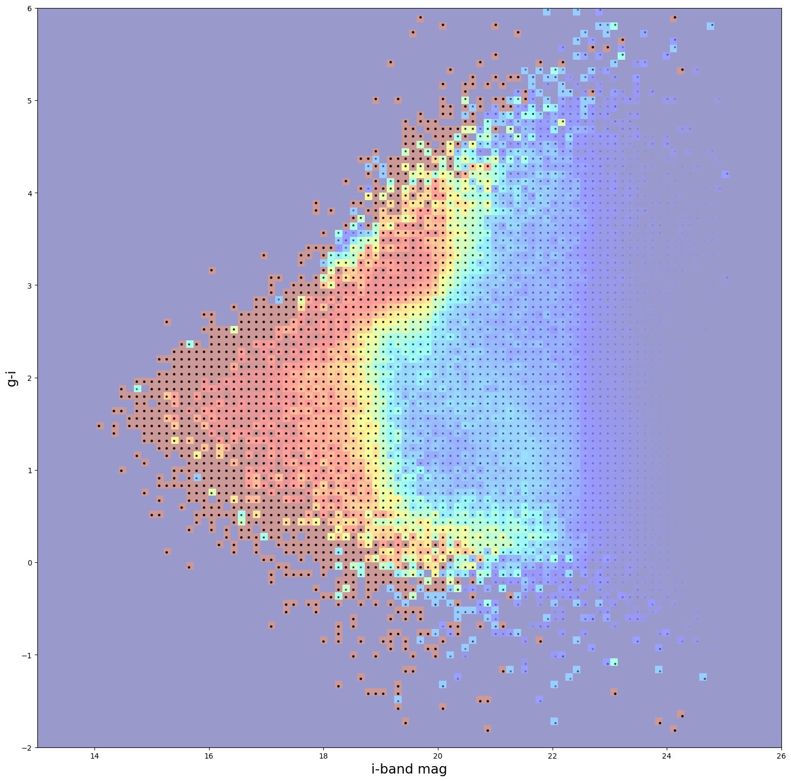

GridSelection Degrader to Emulate HSC Training Samples
======================================================

last run successfully: Feb 9, 2026

The GridSelection degrader can be used to model the spectroscopic
success rates in training sets based on real data. Given a 2-dimensional
grid of spec-z success ratio as a function of two variables (often
magnitude or color), the degrader will draw the appropriate fraction of
samples from the input data and return a sample with incompleteness
modeled. An additional redshift cut can also be applied, where all
redshifts above the cutoff are also removed from the sample.

| The degrader takes the following arguments: - ``ratio_file``: the name
  of the file containing the 2-dimensional grid of spec-z success -
  ``random_seed``: random seed to feed to numpy for reproducibility -
  ``settings_file``: path to the pickled file containing settings that
  define the 2-dimensional grid. There is a mechanism to make cuts
  either on a single column from the input data, or a difference
  (i.e. either a magnitude or a color as a difference of two
  magnitudes). The parameters in the settings file are: - ``x_band_1``:
  column name for the x-axis variable from ratios grid.
| - ``x_band_2``: [optional] column name for the second x-axis variable.
  If x_band_2 is set to ’’ then it is assumed that the x-axis is
  parameterized in terms of x_band_1. If x_band_2 is not ’’ then the
  x-axis is compared against (x_band_1 - x_band_2) -``y_band_1`` and
  ``y_band_2``: analagous to ``x_band_1`` and ``x_band_2`` but for the
  y-axis - ``x_limits`` and ``y_limits``: 2-element lists with the
  minimum and maximum values for the grid, e.g. [13, 26] if the limits
  in the x-axis are between magnitudes of 13 and 26.

In this quick notebook we’ll create a grid of mock galaxies on the same
grid on which the HyperSuprimeCam Survey (HSC) spectroscopic success has
been parameterized by Irene Moskowitz (and available in the rail_base
repository at ``rail_base/src/rail/examples_data/creation_data/``), and
plot the success rate to visualize the spectroscopic success rate for
HSC.

**Note:** If you’re interested in running this in pipeline mode, see
`03_GridSelection_for_HSC.ipynb <https://github.com/LSSTDESC/rail/blob/main/pipeline_examples/creation_examples/03_GridSelection_for_HSC.ipynb>`__
in the ``pipeline_examples/creation_examples/`` folder.

.. code:: ipython3

    import matplotlib.pyplot as plt
    import numpy as np
    import pandas as pd
    import rail.interactive as ri
    import tables_io
    from rail.utils.path_utils import find_rail_file

.. parsed-literal::

    Install FSPS with the following commands:
    pip uninstall fsps
    git clone --recursive https://github.com/dfm/python-fsps.git
    cd python-fsps
    python -m pip install .
    export SPS_HOME=$(pwd)/src/fsps/libfsps
    
    LEPHAREDIR is being set to the default cache directory:
    /home/runner/.cache/lephare/data
    More than 1Gb may be written there.
    LEPHAREWORK is being set to the default cache directory:
    /home/runner/.cache/lephare/work
    Default work cache is already linked. 
    This is linked to the run directory:
    /home/runner/.cache/lephare/runs/20260330T121200

.. parsed-literal::

    
    A module that was compiled using NumPy 1.x cannot be run in
    NumPy 2.2.6 as it may crash. To support both 1.x and 2.x
    versions of NumPy, modules must be compiled with NumPy 2.0.
    Some module may need to rebuild instead e.g. with 'pybind11>=2.12'.
    
    If you are a user of the module, the easiest solution will be to
    downgrade to 'numpy<2' or try to upgrade the affected module.
    We expect that some modules will need time to support NumPy 2.
    
    Traceback (most recent call last):  File "/opt/hostedtoolcache/Python/3.10.20/x64/lib/python3.10/runpy.py", line 196, in _run_module_as_main
        return _run_code(code, main_globals, None,
      File "/opt/hostedtoolcache/Python/3.10.20/x64/lib/python3.10/runpy.py", line 86, in _run_code
        exec(code, run_globals)
      File "/opt/hostedtoolcache/Python/3.10.20/x64/lib/python3.10/site-packages/ipykernel_launcher.py", line 18, in <module>
        app.launch_new_instance()
      File "/opt/hostedtoolcache/Python/3.10.20/x64/lib/python3.10/site-packages/traitlets/config/application.py", line 1075, in launch_instance
        app.start()
      File "/opt/hostedtoolcache/Python/3.10.20/x64/lib/python3.10/site-packages/ipykernel/kernelapp.py", line 758, in start
        self.io_loop.start()
      File "/opt/hostedtoolcache/Python/3.10.20/x64/lib/python3.10/site-packages/tornado/platform/asyncio.py", line 211, in start
        self.asyncio_loop.run_forever()
      File "/opt/hostedtoolcache/Python/3.10.20/x64/lib/python3.10/asyncio/base_events.py", line 603, in run_forever
        self._run_once()
      File "/opt/hostedtoolcache/Python/3.10.20/x64/lib/python3.10/asyncio/base_events.py", line 1909, in _run_once
        handle._run()
      File "/opt/hostedtoolcache/Python/3.10.20/x64/lib/python3.10/asyncio/events.py", line 80, in _run
        self._context.run(self._callback, *self._args)
      File "/opt/hostedtoolcache/Python/3.10.20/x64/lib/python3.10/site-packages/ipykernel/utils.py", line 71, in preserve_context
        return await f(*args, **kwargs)
      File "/opt/hostedtoolcache/Python/3.10.20/x64/lib/python3.10/site-packages/ipykernel/kernelbase.py", line 621, in shell_main
        await self.dispatch_shell(msg, subshell_id=subshell_id)
      File "/opt/hostedtoolcache/Python/3.10.20/x64/lib/python3.10/site-packages/ipykernel/kernelbase.py", line 478, in dispatch_shell
        await result
      File "/opt/hostedtoolcache/Python/3.10.20/x64/lib/python3.10/site-packages/ipykernel/ipkernel.py", line 372, in execute_request
        await super().execute_request(stream, ident, parent)
      File "/opt/hostedtoolcache/Python/3.10.20/x64/lib/python3.10/site-packages/ipykernel/kernelbase.py", line 834, in execute_request
        reply_content = await reply_content
      File "/opt/hostedtoolcache/Python/3.10.20/x64/lib/python3.10/site-packages/ipykernel/ipkernel.py", line 464, in do_execute
        res = shell.run_cell(
      File "/opt/hostedtoolcache/Python/3.10.20/x64/lib/python3.10/site-packages/ipykernel/zmqshell.py", line 663, in run_cell
        return super().run_cell(*args, **kwargs)
      File "/opt/hostedtoolcache/Python/3.10.20/x64/lib/python3.10/site-packages/IPython/core/interactiveshell.py", line 3077, in run_cell
        result = self._run_cell(
      File "/opt/hostedtoolcache/Python/3.10.20/x64/lib/python3.10/site-packages/IPython/core/interactiveshell.py", line 3132, in _run_cell
        result = runner(coro)
      File "/opt/hostedtoolcache/Python/3.10.20/x64/lib/python3.10/site-packages/IPython/core/async_helpers.py", line 128, in _pseudo_sync_runner
        coro.send(None)
      File "/opt/hostedtoolcache/Python/3.10.20/x64/lib/python3.10/site-packages/IPython/core/interactiveshell.py", line 3336, in run_cell_async
        has_raised = await self.run_ast_nodes(code_ast.body, cell_name,
      File "/opt/hostedtoolcache/Python/3.10.20/x64/lib/python3.10/site-packages/IPython/core/interactiveshell.py", line 3519, in run_ast_nodes
        if await self.run_code(code, result, async_=asy):
      File "/opt/hostedtoolcache/Python/3.10.20/x64/lib/python3.10/site-packages/IPython/core/interactiveshell.py", line 3579, in run_code
        exec(code_obj, self.user_global_ns, self.user_ns)
      File "/tmp/ipykernel_6197/285264119.py", line 4, in <module>
        import rail.interactive as ri
      File "/opt/hostedtoolcache/Python/3.10.20/x64/lib/python3.10/site-packages/rail/interactive/__init__.py", line 3, in <module>
        from . import calib, creation, estimation, evaluation, tools
      File "/opt/hostedtoolcache/Python/3.10.20/x64/lib/python3.10/site-packages/rail/interactive/calib/__init__.py", line 3, in <module>
        from rail.utils.interactive.initialize_utils import _initialize_interactive_module
      File "/opt/hostedtoolcache/Python/3.10.20/x64/lib/python3.10/site-packages/rail/utils/interactive/initialize_utils.py", line 17, in <module>
        from rail.utils.interactive.base_utils import (
      File "/opt/hostedtoolcache/Python/3.10.20/x64/lib/python3.10/site-packages/rail/utils/interactive/base_utils.py", line 10, in <module>
        rail.stages.import_and_attach_all(silent=True)
      File "/opt/hostedtoolcache/Python/3.10.20/x64/lib/python3.10/site-packages/rail/stages/__init__.py", line 74, in import_and_attach_all
        RailEnv.import_all_packages(silent=silent)
      File "/opt/hostedtoolcache/Python/3.10.20/x64/lib/python3.10/site-packages/rail/core/introspection.py", line 541, in import_all_packages
        _imported_module = importlib.import_module(pkg)
      File "/opt/hostedtoolcache/Python/3.10.20/x64/lib/python3.10/importlib/__init__.py", line 126, in import_module
        return _bootstrap._gcd_import(name[level:], package, level)
      File "/opt/hostedtoolcache/Python/3.10.20/x64/lib/python3.10/site-packages/rail/som/__init__.py", line 1, in <module>
        from rail.creation.degraders.specz_som import *
      File "/opt/hostedtoolcache/Python/3.10.20/x64/lib/python3.10/site-packages/rail/creation/degraders/specz_som.py", line 15, in <module>
        from somoclu import Somoclu
      File "/opt/hostedtoolcache/Python/3.10.20/x64/lib/python3.10/site-packages/somoclu/__init__.py", line 11, in <module>
        from .train import Somoclu
      File "/opt/hostedtoolcache/Python/3.10.20/x64/lib/python3.10/site-packages/somoclu/train.py", line 25, in <module>
        from .somoclu_wrap import train as wrap_train
      File "/opt/hostedtoolcache/Python/3.10.20/x64/lib/python3.10/site-packages/somoclu/somoclu_wrap.py", line 11, in <module>
        import _somoclu_wrap

::

    ---------------------------------------------------------------------------

    ImportError                               Traceback (most recent call last)

    File /opt/hostedtoolcache/Python/3.10.20/x64/lib/python3.10/site-packages/numpy/core/_multiarray_umath.py:44, in __getattr__(attr_name)
         39     # Also print the message (with traceback).  This is because old versions
         40     # of NumPy unfortunately set up the import to replace (and hide) the
         41     # error.  The traceback shouldn't be needed, but e.g. pytest plugins
         42     # seem to swallow it and we should be failing anyway...
         43     sys.stderr.write(msg + tb_msg)
    ---> 44     raise ImportError(msg)
         46 ret = getattr(_multiarray_umath, attr_name, None)
         47 if ret is None:

    ImportError: 
    A module that was compiled using NumPy 1.x cannot be run in
    NumPy 2.2.6 as it may crash. To support both 1.x and 2.x
    versions of NumPy, modules must be compiled with NumPy 2.0.
    Some module may need to rebuild instead e.g. with 'pybind11>=2.12'.
    
    If you are a user of the module, the easiest solution will be to
    downgrade to 'numpy<2' or try to upgrade the affected module.
    We expect that some modules will need time to support NumPy 2.
    

.. parsed-literal::

    Warning: the binary library cannot be imported. You cannot train maps, but you can load and analyze ones that you have already saved.
    The problem occurs because either compilation failed when you installed Somoclu or a path is missing from the dependencies when you are trying to import it. Please refer to the documentation to see your options.

Let’s make a grid of fake data matching the grid used by HSC. The 2D
grid of spec-z success in this case is parameterized in terms of ``g-z``
color vs ``i-band`` magnitude, with ``g-z`` between ``[-2, 6]`` and
``i-band`` magnitude spanning ``[13, 26]``. Let’s generate 100 identical
objects in each of the 100x100=10,000 grid cells, for a total of
1,000,000 mock galaxies. The only quantities that we need are ``g``,
``i``, ``z`` magnitudes and a ``redshift`` that we can just set to a
random number between 1 and 2.5. The only thing that we really need is
consistent g-z and i-mag values, so we can just set g to 20.0 in all
circumstances.

.. code:: ipython3

    gridgz, gridi = np.meshgrid(
        np.linspace(-1.98, 5.98, 100), np.linspace(13.0325, 25.9675, 100)
    )

.. code:: ipython3

    i = gridi.flatten()
    gz = gridgz.flatten()
    g = np.full_like(i, 20.0, dtype=np.double)
    z = g - gz
    redshift = np.round(np.random.uniform(size=len(i)) * 2.5, 2)

.. code:: ipython3

    mockdict = {}
    for label, item in zip(["i", "gz", "g", "z", "redshift"], [i, gz, g, z, redshift]):
        mockdict[f"{label}"] = np.repeat(item, 100).flatten()

.. code:: ipython3

    df = pd.DataFrame(mockdict)

.. code:: ipython3

    df.head()

.. raw:: html

    

    
    <table border="1" class="dataframe">
      <thead>
        <tr style="text-align: right;">
          <th></th>
          <th>i</th>
          <th>gz</th>
          <th>g</th>
          <th>z</th>
          <th>redshift</th>
        </tr>
      </thead>
      <tbody>
        <tr>
          <th>0</th>
          <td>13.0325</td>
          <td>-1.98</td>
          <td>20.0</td>
          <td>21.98</td>
          <td>1.87</td>
        </tr>
        <tr>
          <th>1</th>
          <td>13.0325</td>
          <td>-1.98</td>
          <td>20.0</td>
          <td>21.98</td>
          <td>1.87</td>
        </tr>
        <tr>
          <th>2</th>
          <td>13.0325</td>
          <td>-1.98</td>
          <td>20.0</td>
          <td>21.98</td>
          <td>1.87</td>
        </tr>
        <tr>
          <th>3</th>
          <td>13.0325</td>
          <td>-1.98</td>
          <td>20.0</td>
          <td>21.98</td>
          <td>1.87</td>
        </tr>
        <tr>
          <th>4</th>
          <td>13.0325</td>
          <td>-1.98</td>
          <td>20.0</td>
          <td>21.98</td>
          <td>1.87</td>
        </tr>
      </tbody>
    </table>
    

Now, let’s import the GridSelection degrader and set up the config dict
parameters. We will set a redshift cut of 5.1 so as to not cut any of
our mock galaxies, if you would want a redshift cut, you would simply
change this parameter as desired. There is an optional
``color_redshift_cut`` that scales the number of galaxies kept, we will
turn this off. There is also a ``percentile_cut`` that computes
percentiles in redshift of each cell and removes the highest redshift
galaxies, as those are usually the most likely to not be recovered by a
spectroscopic survey. For simplicity, we will set percentile_cut to 100.
to not remove any galaxies with this cut.

The ratio file for HSC is located in the ``RAIL/examples/creation/data``
directory, as we are in ``RAIL/examples/creation`` folder with this demo
the paths for the ``ratio_file`` and ``settings_file`` are set
accordingly.

We will set a random seed for reproducibility, and set the output file
to write our incomplete catalog to “test_hsc.pq”.

.. code:: ipython3

    configdict = dict(
        redshift_cut=5.1,
        ratio_file=find_rail_file(
            "examples_data/creation_data/data/hsc_ratios_and_specz.hdf5"
        ),
        settings_file=find_rail_file(
            "examples_data/creation_data/data/HSC_grid_settings.pkl"
        ),
        percentile_cut=100.0,
        color_redshift_cut=False,
        random_seed=66,
    )

Let’s run the code and see how long it takes:

.. code:: ipython3

    %%time
    trim_data = ri.creation.degraders.grid_selection.grid_selection(sample=df, **configdict)

.. parsed-literal::

    Inserting handle into data store.  input: None, GridSelection

.. parsed-literal::

    Inserting handle into data store.  output: inprogress_output.pq, GridSelection
    CPU times: user 2.79 s, sys: 90.4 ms, total: 2.88 s
    Wall time: 2.88 s

This took 10.1s on my home computer, not too bad for 4 million mock
galaxies.

.. code:: ipython3

    trim_data["output"].info()

.. parsed-literal::

    <class 'pandas.core.frame.DataFrame'>
    Index: 182026 entries, 84300 to 927791
    Data columns (total 9 columns):
     #   Column     Non-Null Count   Dtype  
    ---  ------     --------------   -----  
     0   i          182026 non-null  float64
     1   gz         182026 non-null  float64
     2   g          182026 non-null  float64
     3   z          182026 non-null  float64
     4   redshift   182026 non-null  float64
     5   x_vals     182026 non-null  float64
     6   y_vals     182026 non-null  float64
     7   ratios     182026 non-null  float64
     8   max_specz  182026 non-null  float64
    dtypes: float64(9)
    memory usage: 13.9 MB

And we see that we’ve kept 625,677 out of the 4,000,000 galaxies in the
initial sample, so about 15% of the initial sample. To visualize our
cuts, let’s read in the success ratios file and plot our sample overlaid
with an alpha of 0.01, that way the strength of the black dot will give
a visual indication of how many galaxies in each cell we’ve kept.

.. code:: ipython3

    # compare to sum of ratios * 100
    ratio_file = find_rail_file(
        "examples_data/creation_data/data/hsc_ratios_and_specz.hdf5"
    )

.. code:: ipython3

    allrats = tables_io.read(ratio_file)["ratios"]

.. code:: ipython3

    trim_data["output"]["color"] = trim_data["output"]["g"] - trim_data["output"]["z"]

.. parsed-literal::

    /tmp/ipykernel_6197/3945432532.py:1: SettingWithCopyWarning: 
    A value is trying to be set on a copy of a slice from a DataFrame.
    Try using .loc[row_indexer,col_indexer] = value instead
    
    See the caveats in the documentation: https://pandas.pydata.org/pandas-docs/stable/user_guide/indexing.html#returning-a-view-versus-a-copy
      trim_data["output"]["color"] = trim_data["output"]["g"] - trim_data["output"]["z"]

.. code:: ipython3

    bgr, bi = np.meshgrid(np.linspace(-2, 6, 101), np.linspace(13, 26, 101))

.. code:: ipython3

    bratios = tables_io.read(
        find_rail_file("examples_data/creation_data/data/hsc_ratios_and_specz.hdf5")
    )["ratios"]

.. code:: ipython3

    plt.figure(figsize=(18, 18))
    plt.pcolormesh(bi, bgr, bratios.T, cmap="jet", vmin=0, vmax=1, alpha=0.4)
    plt.scatter(
        trim_data["output"]["i"], trim_data["output"]["color"], s=3, c="k", alpha=0.015
    )
    plt.xlabel("i-band mag", fontsize=18)
    plt.ylabel("g-i", fontsize=18)

.. parsed-literal::

    Text(0, 0.5, 'g-i')

The colormap shows the HSC ratios and the strenth of the black dots
shows how many galaxies were actually kept. We see perfect agreement
between our predicted ratios and the actual number of galaxies kept, the
degrader is functioning properly, and we see a nice visual
representation of the resulting spectroscopic sample incompleteness.
