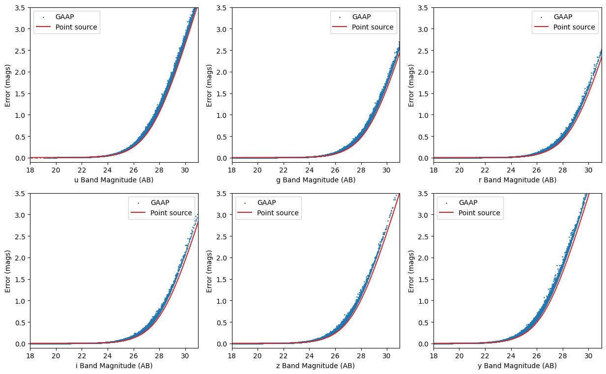
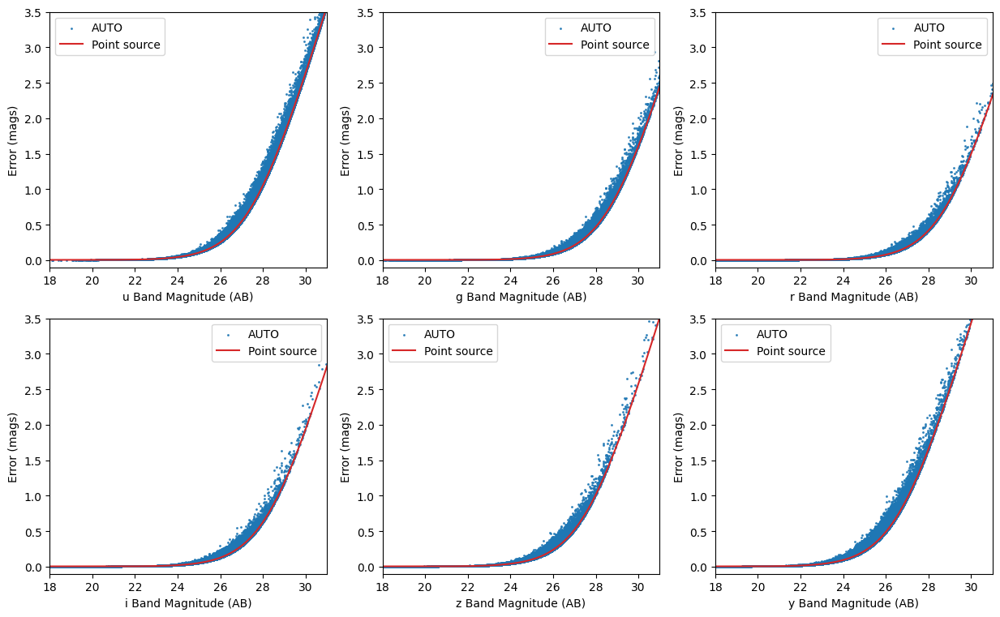

Photometric Realization from Different Magnitude Error Models
=============================================================

author: John Franklin Crenshaw, Sam Schmidt, Eric Charles, Ziang Yan

last run successfully: Feb 9, 2026

This notebook demonstrates how to do photometric realization from
different magnitude error models. For more completed degrader demo, see
``Quick_Start_in_Creation.ipynb``

If you’re interested in running this in pipeline mode, see
`01_Photometric_Realization.ipynb <https://github.com/LSSTDESC/rail/blob/main/pipeline_examples/creation_examples/01_Photometric_Realization.ipynb>`__
in the ``pipeline_examples/creation_examples/`` folder.

.. code:: ipython3

    import os
    
    import matplotlib.pyplot as plt
    import numpy as np
    import pzflow
    import rail.interactive as ri

.. parsed-literal::

    Install FSPS with the following commands:
    pip uninstall fsps
    git clone --recursive https://github.com/dfm/python-fsps.git
    cd python-fsps
    python -m pip install .
    export SPS_HOME=$(pwd)/src/fsps/libfsps
    
    LEPHAREDIR is being set to the default cache directory:
    /home/runner/.cache/lephare/data
    More than 1Gb may be written there.
    LEPHAREWORK is being set to the default cache directory:
    /home/runner/.cache/lephare/work
    Default work cache is already linked. 
    This is linked to the run directory:
    /home/runner/.cache/lephare/runs/20260427T122115

.. parsed-literal::

    
    A module that was compiled using NumPy 1.x cannot be run in
    NumPy 2.2.6 as it may crash. To support both 1.x and 2.x
    versions of NumPy, modules must be compiled with NumPy 2.0.
    Some module may need to rebuild instead e.g. with 'pybind11>=2.12'.
    
    If you are a user of the module, the easiest solution will be to
    downgrade to 'numpy<2' or try to upgrade the affected module.
    We expect that some modules will need time to support NumPy 2.
    
    Traceback (most recent call last):  File "/opt/hostedtoolcache/Python/3.10.20/x64/lib/python3.10/runpy.py", line 196, in _run_module_as_main
        return _run_code(code, main_globals, None,
      File "/opt/hostedtoolcache/Python/3.10.20/x64/lib/python3.10/runpy.py", line 86, in _run_code
        exec(code, run_globals)
      File "/opt/hostedtoolcache/Python/3.10.20/x64/lib/python3.10/site-packages/ipykernel_launcher.py", line 18, in <module>
        app.launch_new_instance()
      File "/opt/hostedtoolcache/Python/3.10.20/x64/lib/python3.10/site-packages/traitlets/config/application.py", line 1075, in launch_instance
        app.start()
      File "/opt/hostedtoolcache/Python/3.10.20/x64/lib/python3.10/site-packages/ipykernel/kernelapp.py", line 758, in start
        self.io_loop.start()
      File "/opt/hostedtoolcache/Python/3.10.20/x64/lib/python3.10/site-packages/tornado/platform/asyncio.py", line 211, in start
        self.asyncio_loop.run_forever()
      File "/opt/hostedtoolcache/Python/3.10.20/x64/lib/python3.10/asyncio/base_events.py", line 603, in run_forever
        self._run_once()
      File "/opt/hostedtoolcache/Python/3.10.20/x64/lib/python3.10/asyncio/base_events.py", line 1909, in _run_once
        handle._run()
      File "/opt/hostedtoolcache/Python/3.10.20/x64/lib/python3.10/asyncio/events.py", line 80, in _run
        self._context.run(self._callback, *self._args)
      File "/opt/hostedtoolcache/Python/3.10.20/x64/lib/python3.10/site-packages/ipykernel/utils.py", line 71, in preserve_context
        return await f(*args, **kwargs)
      File "/opt/hostedtoolcache/Python/3.10.20/x64/lib/python3.10/site-packages/ipykernel/kernelbase.py", line 621, in shell_main
        await self.dispatch_shell(msg, subshell_id=subshell_id)
      File "/opt/hostedtoolcache/Python/3.10.20/x64/lib/python3.10/site-packages/ipykernel/kernelbase.py", line 478, in dispatch_shell
        await result
      File "/opt/hostedtoolcache/Python/3.10.20/x64/lib/python3.10/site-packages/ipykernel/ipkernel.py", line 372, in execute_request
        await super().execute_request(stream, ident, parent)
      File "/opt/hostedtoolcache/Python/3.10.20/x64/lib/python3.10/site-packages/ipykernel/kernelbase.py", line 834, in execute_request
        reply_content = await reply_content
      File "/opt/hostedtoolcache/Python/3.10.20/x64/lib/python3.10/site-packages/ipykernel/ipkernel.py", line 464, in do_execute
        res = shell.run_cell(
      File "/opt/hostedtoolcache/Python/3.10.20/x64/lib/python3.10/site-packages/ipykernel/zmqshell.py", line 663, in run_cell
        return super().run_cell(*args, **kwargs)
      File "/opt/hostedtoolcache/Python/3.10.20/x64/lib/python3.10/site-packages/IPython/core/interactiveshell.py", line 3077, in run_cell
        result = self._run_cell(
      File "/opt/hostedtoolcache/Python/3.10.20/x64/lib/python3.10/site-packages/IPython/core/interactiveshell.py", line 3132, in _run_cell
        result = runner(coro)
      File "/opt/hostedtoolcache/Python/3.10.20/x64/lib/python3.10/site-packages/IPython/core/async_helpers.py", line 128, in _pseudo_sync_runner
        coro.send(None)
      File "/opt/hostedtoolcache/Python/3.10.20/x64/lib/python3.10/site-packages/IPython/core/interactiveshell.py", line 3336, in run_cell_async
        has_raised = await self.run_ast_nodes(code_ast.body, cell_name,
      File "/opt/hostedtoolcache/Python/3.10.20/x64/lib/python3.10/site-packages/IPython/core/interactiveshell.py", line 3519, in run_ast_nodes
        if await self.run_code(code, result, async_=asy):
      File "/opt/hostedtoolcache/Python/3.10.20/x64/lib/python3.10/site-packages/IPython/core/interactiveshell.py", line 3579, in run_code
        exec(code_obj, self.user_global_ns, self.user_ns)
      File "/tmp/ipykernel_4722/696671147.py", line 6, in <module>
        import rail.interactive as ri
      File "/opt/hostedtoolcache/Python/3.10.20/x64/lib/python3.10/site-packages/rail/interactive/__init__.py", line 3, in <module>
        from . import calib, creation, estimation, evaluation, tools
      File "/opt/hostedtoolcache/Python/3.10.20/x64/lib/python3.10/site-packages/rail/interactive/calib/__init__.py", line 3, in <module>
        from rail.utils.interactive.initialize_utils import _initialize_interactive_module
      File "/opt/hostedtoolcache/Python/3.10.20/x64/lib/python3.10/site-packages/rail/utils/interactive/initialize_utils.py", line 17, in <module>
        from rail.utils.interactive.base_utils import (
      File "/opt/hostedtoolcache/Python/3.10.20/x64/lib/python3.10/site-packages/rail/utils/interactive/base_utils.py", line 10, in <module>
        rail.stages.import_and_attach_all(silent=True)
      File "/opt/hostedtoolcache/Python/3.10.20/x64/lib/python3.10/site-packages/rail/stages/__init__.py", line 74, in import_and_attach_all
        RailEnv.import_all_packages(silent=silent)
      File "/opt/hostedtoolcache/Python/3.10.20/x64/lib/python3.10/site-packages/rail/core/introspection.py", line 541, in import_all_packages
        _imported_module = importlib.import_module(pkg)
      File "/opt/hostedtoolcache/Python/3.10.20/x64/lib/python3.10/importlib/__init__.py", line 126, in import_module
        return _bootstrap._gcd_import(name[level:], package, level)
      File "/opt/hostedtoolcache/Python/3.10.20/x64/lib/python3.10/site-packages/rail/som/__init__.py", line 1, in <module>
        from rail.creation.degraders.specz_som import *
      File "/opt/hostedtoolcache/Python/3.10.20/x64/lib/python3.10/site-packages/rail/creation/degraders/specz_som.py", line 15, in <module>
        from somoclu import Somoclu
      File "/opt/hostedtoolcache/Python/3.10.20/x64/lib/python3.10/site-packages/somoclu/__init__.py", line 11, in <module>
        from .train import Somoclu
      File "/opt/hostedtoolcache/Python/3.10.20/x64/lib/python3.10/site-packages/somoclu/train.py", line 25, in <module>
        from .somoclu_wrap import train as wrap_train
      File "/opt/hostedtoolcache/Python/3.10.20/x64/lib/python3.10/site-packages/somoclu/somoclu_wrap.py", line 11, in <module>
        import _somoclu_wrap

::

    ---------------------------------------------------------------------------

    ImportError                               Traceback (most recent call last)

    File /opt/hostedtoolcache/Python/3.10.20/x64/lib/python3.10/site-packages/numpy/core/_multiarray_umath.py:44, in __getattr__(attr_name)
         39     # Also print the message (with traceback).  This is because old versions
         40     # of NumPy unfortunately set up the import to replace (and hide) the
         41     # error.  The traceback shouldn't be needed, but e.g. pytest plugins
         42     # seem to swallow it and we should be failing anyway...
         43     sys.stderr.write(msg + tb_msg)
    ---> 44     raise ImportError(msg)
         46 ret = getattr(_multiarray_umath, attr_name, None)
         47 if ret is None:

    ImportError: 
    A module that was compiled using NumPy 1.x cannot be run in
    NumPy 2.2.6 as it may crash. To support both 1.x and 2.x
    versions of NumPy, modules must be compiled with NumPy 2.0.
    Some module may need to rebuild instead e.g. with 'pybind11>=2.12'.
    
    If you are a user of the module, the easiest solution will be to
    downgrade to 'numpy<2' or try to upgrade the affected module.
    We expect that some modules will need time to support NumPy 2.
    

.. parsed-literal::

    Warning: the binary library cannot be imported. You cannot train maps, but you can load and analyze ones that you have already saved.
    The problem occurs because either compilation failed when you installed Somoclu or a path is missing from the dependencies when you are trying to import it. Please refer to the documentation to see your options.

Specify the path to the pretrained ‘pzflow’ used to generate samples

.. code:: ipython3

    flow_file = os.path.join(
        os.path.dirname(pzflow.__file__), "example_files", "example-flow.pzflow.pkl"
    )

“True” Engine
~~~~~~~~~~~~~

First, let’s make an Engine that has no degradation. We can use it to
generate a “true” sample, to which we can compare all the degraded
samples below.

Note: in this example, we will use a normalizing flow engine from the
`pzflow <https://github.com/jfcrenshaw/pzflow>`__ package. However,
everything in this notebook is totally agnostic to what the underlying
engine is.

.. code:: ipython3

    n_samples = int(1e5)
    
    samples_truth = ri.creation.engines.flowEngine.flow_creator(
        n_samples=n_samples, model=flow_file, seed=0
    )

.. parsed-literal::

    Inserting handle into data store.  model: /opt/hostedtoolcache/Python/3.10.20/x64/lib/python3.10/site-packages/pzflow/example_files/example-flow.pzflow.pkl, FlowCreator

.. parsed-literal::

    Inserting handle into data store.  output: inprogress_output.pq, FlowCreator

.. code:: ipython3

    samples_truth["output"]["major"] = np.abs(
        np.random.normal(loc=0.01, scale=0.1, size=n_samples)
    )  # add major and minor axes
    b_to_a = 1 - 0.5 * np.random.rand(n_samples)
    samples_truth["output"]["minor"] = samples_truth["output"]["major"] * b_to_a
    
    samples_truth["output"]

.. raw:: html

    

    
    <table border="1" class="dataframe">
      <thead>
        <tr style="text-align: right;">
          <th></th>
          <th>redshift</th>
          <th>u</th>
          <th>g</th>
          <th>r</th>
          <th>i</th>
          <th>z</th>
          <th>y</th>
          <th>major</th>
          <th>minor</th>
        </tr>
      </thead>
      <tbody>
        <tr>
          <th>0</th>
          <td>1.398944</td>
          <td>27.667536</td>
          <td>26.723337</td>
          <td>26.032637</td>
          <td>25.178587</td>
          <td>24.695955</td>
          <td>23.994413</td>
          <td>0.054169</td>
          <td>0.038316</td>
        </tr>
        <tr>
          <th>1</th>
          <td>2.285624</td>
          <td>28.786999</td>
          <td>27.476589</td>
          <td>26.640175</td>
          <td>26.259745</td>
          <td>25.865673</td>
          <td>25.391064</td>
          <td>0.163372</td>
          <td>0.147705</td>
        </tr>
        <tr>
          <th>2</th>
          <td>1.495132</td>
          <td>30.011349</td>
          <td>29.789337</td>
          <td>28.200390</td>
          <td>26.014826</td>
          <td>25.030174</td>
          <td>24.304707</td>
          <td>0.092742</td>
          <td>0.047193</td>
        </tr>
        <tr>
          <th>3</th>
          <td>0.842594</td>
          <td>29.306244</td>
          <td>28.721798</td>
          <td>27.353018</td>
          <td>26.256907</td>
          <td>25.529823</td>
          <td>25.291103</td>
          <td>0.129518</td>
          <td>0.112302</td>
        </tr>
        <tr>
          <th>4</th>
          <td>1.588960</td>
          <td>26.273870</td>
          <td>26.115387</td>
          <td>25.950441</td>
          <td>25.687405</td>
          <td>25.466606</td>
          <td>25.096743</td>
          <td>0.181735</td>
          <td>0.165265</td>
        </tr>
        <tr>
          <th>...</th>
          <td>...</td>
          <td>...</td>
          <td>...</td>
          <td>...</td>
          <td>...</td>
          <td>...</td>
          <td>...</td>
          <td>...</td>
          <td>...</td>
        </tr>
        <tr>
          <th>99995</th>
          <td>0.389450</td>
          <td>27.270800</td>
          <td>26.371506</td>
          <td>25.436853</td>
          <td>25.077412</td>
          <td>24.852779</td>
          <td>24.737946</td>
          <td>0.085875</td>
          <td>0.071689</td>
        </tr>
        <tr>
          <th>99996</th>
          <td>1.481047</td>
          <td>27.478113</td>
          <td>26.735254</td>
          <td>26.042776</td>
          <td>25.204935</td>
          <td>24.825092</td>
          <td>24.224169</td>
          <td>0.004630</td>
          <td>0.003249</td>
        </tr>
        <tr>
          <th>99997</th>
          <td>2.023548</td>
          <td>26.990147</td>
          <td>26.714737</td>
          <td>26.377949</td>
          <td>26.250343</td>
          <td>25.917370</td>
          <td>25.613836</td>
          <td>0.003347</td>
          <td>0.001775</td>
        </tr>
        <tr>
          <th>99998</th>
          <td>1.548204</td>
          <td>26.367432</td>
          <td>26.206884</td>
          <td>26.087980</td>
          <td>25.876932</td>
          <td>25.715893</td>
          <td>25.274899</td>
          <td>0.017225</td>
          <td>0.014595</td>
        </tr>
        <tr>
          <th>99999</th>
          <td>1.739491</td>
          <td>26.881983</td>
          <td>26.773064</td>
          <td>26.553123</td>
          <td>26.319622</td>
          <td>25.955982</td>
          <td>25.699642</td>
          <td>0.068194</td>
          <td>0.044258</td>
        </tr>
      </tbody>
    </table>
    
100000 rows × 9 columns

    

LSSTErrorModel
~~~~~~~~~~~~~~

Now, we will demonstrate the ``LSSTErrorModel``, which adds photometric
errors using a model similar to the model from `Ivezic et
al. 2019 <https://arxiv.org/abs/0805.2366>`__ (specifically, it uses the
model from this paper, without making the high SNR assumption. To
restore this assumption and therefore use the exact model from the
paper, set ``highSNR=True``.)

Let’s create an error model with the default settings for point sources:

.. code:: ipython3

    samples_w_errs = ri.creation.degraders.photometric_errors.lsst_error_model(
        sample=samples_truth["output"]
    )

.. parsed-literal::

    Inserting handle into data store.  input: None, LSSTErrorModel
    Inserting handle into data store.  output: inprogress_output.pq, LSSTErrorModel

For extended sources:

.. code:: ipython3

    samples_w_errs_auto = ri.creation.degraders.photometric_errors.lsst_error_model(
        sample=samples_truth["output"], extendedType="auto"
    )

.. parsed-literal::

    Inserting handle into data store.  input: None, LSSTErrorModel

.. parsed-literal::

    Inserting handle into data store.  output: inprogress_output.pq, LSSTErrorModel

.. code:: ipython3

    samples_w_errs_gaap = ri.creation.degraders.photometric_errors.lsst_error_model(
        sample=samples_truth["output"], extendedType="gaap"
    )

.. parsed-literal::

    Inserting handle into data store.  input: None, LSSTErrorModel

.. parsed-literal::

    Inserting handle into data store.  output: inprogress_output.pq, LSSTErrorModel

Notice some of the magnitudes are inf’s. These are non-detections
(i.e. the noisy flux was negative). You can change the nSigma limit for
non-detections by setting ``sigLim=...``. For example, if ``sigLim=5``,
then all fluxes with ``SNR<5`` are flagged as non-detections.

Let’s plot the error as a function of magnitude

.. code:: ipython3

    fig, axes_ = plt.subplots(ncols=3, nrows=2, figsize=(15, 9), dpi=100)
    axes = axes_.reshape(-1)
    for i, band in enumerate("ugrizy"):
        ax = axes[i]
        # pull out the magnitudes and errors
        mags = samples_w_errs["output"][band].to_numpy()
        errs = samples_w_errs["output"][band + "_err"].to_numpy()
    
        # sort them by magnitude
        mags, errs = mags[mags.argsort()], errs[mags.argsort()]
    
        # plot errs vs mags
        # ax.plot(mags, errs, label=band)
    
        # plt.plot(mags, errs, c='C'+str(i))
        ax.scatter(
            samples_w_errs_gaap["output"][band].to_numpy(),
            samples_w_errs_gaap["output"][band + "_err"].to_numpy(),
            s=5,
            marker=".",
            color="C0",
            alpha=0.8,
            label="GAAP",
        )
    
        ax.plot(mags, errs, color="C3", label="Point source")
    
        ax.legend()
        ax.set_xlim(18, 31)
        ax.set_ylim(-0.1, 3.5)
        ax.set(xlabel=band + " Band Magnitude (AB)", ylabel="Error (mags)")

.. code:: ipython3

    fig, axes_ = plt.subplots(ncols=3, nrows=2, figsize=(15, 9), dpi=100)
    axes = axes_.reshape(-1)
    for i, band in enumerate("ugrizy"):
        ax = axes[i]
        # pull out the magnitudes and errors
        mags = samples_w_errs["output"][band].to_numpy()
        errs = samples_w_errs["output"][band + "_err"].to_numpy()
    
        # sort them by magnitude
        mags, errs = mags[mags.argsort()], errs[mags.argsort()]
    
        # plot errs vs mags
        # ax.plot(mags, errs, label=band)
    
        # plt.plot(mags, errs, c='C'+str(i))
        ax.scatter(
            samples_w_errs_auto["output"][band].to_numpy(),
            samples_w_errs_auto["output"][band + "_err"].to_numpy(),
            s=5,
            marker=".",
            color="C0",
            alpha=0.8,
            label="AUTO",
        )
    
        ax.plot(mags, errs, color="C3", label="Point source")
    
        ax.legend()
        ax.set_xlim(18, 31)
        ax.set_ylim(-0.1, 3.5)
        ax.set(xlabel=band + " Band Magnitude (AB)", ylabel="Error (mags)")

You can see that the photometric error increases as magnitude gets
dimmer, just like you would expect, and that the extended source errors
are greater than the point source errors. The extended source errors are
also scattered, because the galaxies have random sizes.

Also, you can find the GAaP and AUTO magnitude error are scattered due
to variable galaxy sizes. Also, you can find that there are gaps between
GAAP magnitude error and point souce magnitude error, this is because
the additional factors due to aperture sizes have a minimum value of
:math:`\sqrt{(\sigma^2+A_{\mathrm{min}})/\sigma^2}`, where
:math:`\sigma` is the width of the beam, :math:`A_{\min}` is an offset
of the aperture sizes (taken to be 0.7 arcmin here).

You can also see that there are *very* faint galaxies in this sample.
That’s because, by default, the error model returns magnitudes for all
positive fluxes. If you want these galaxies flagged as non-detections
instead, you can set e.g. ``sigLim=5``, and everything with ``SNR<5``
will be flagged as a non-detection.
