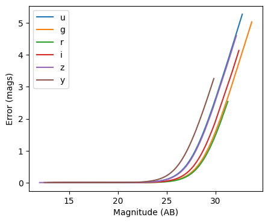
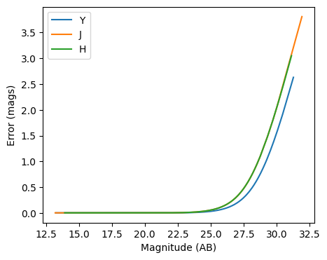
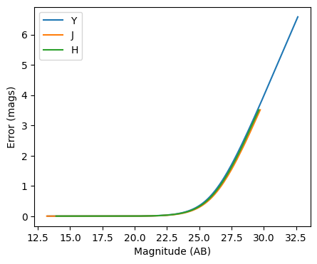

Photometric error stage demo
============================

author: Tianqing Zhang, John-Franklin Crenshaw

This notebook demonstrate the use of
``rail.creation.degraders.photometric_errors``, which adds column for
the photometric noise to the catalog based on the package PhotErr
developed by John-Franklin Crenshaw. The RAIL stage PhotoErrorModel
inherit from the Noisifier base classes, and the LSST, Roman, Euclid
child classes inherit from the PhotoErrorModel.

If you’re interested in running this in pipeline mode, see
```02_Photometric_Realization_with_Other_Surveys.ipynb`` <https://github.com/LSSTDESC/rail/blob/main/pipeline_examples/creation_examples/02_Photometric_Realization_with_Other_Surveys.ipynb>`__
in the ``pipeline_examples/core_examples/`` folder.

.. code:: ipython3

    import numpy as np
    import pandas as pd
    from matplotlib import pyplot as plt
    from rail.core.data import PqHandle
    from rail.interactive.creation.degraders import photometric_errors


.. parsed-literal::

    Install FSPS with the following commands:
    pip uninstall fsps
    git clone --recursive https://github.com/dfm/python-fsps.git
    cd python-fsps
    python -m pip install .
    export SPS_HOME=$(pwd)/src/fsps/libfsps
    
    LEPHAREDIR is being set to the default cache directory:
    /home/runner/.cache/lephare/data
    More than 1Gb may be written there.
    LEPHAREWORK is being set to the default cache directory:
    /home/runner/.cache/lephare/work
    Default work cache is already linked. 
    This is linked to the run directory:
    /home/runner/.cache/lephare/runs/20260323T195050


.. parsed-literal::

    
    A module that was compiled using NumPy 1.x cannot be run in
    NumPy 2.4.3 as it may crash. To support both 1.x and 2.x
    versions of NumPy, modules must be compiled with NumPy 2.0.
    Some module may need to rebuild instead e.g. with 'pybind11>=2.12'.
    
    If you are a user of the module, the easiest solution will be to
    downgrade to 'numpy<2' or try to upgrade the affected module.
    We expect that some modules will need time to support NumPy 2.
    
    Traceback (most recent call last):  File "<frozen runpy>", line 198, in _run_module_as_main
      File "<frozen runpy>", line 88, in _run_code
      File "/opt/hostedtoolcache/Python/3.11.15/x64/lib/python3.11/site-packages/ipykernel_launcher.py", line 18, in <module>
        app.launch_new_instance()
      File "/opt/hostedtoolcache/Python/3.11.15/x64/lib/python3.11/site-packages/traitlets/config/application.py", line 1075, in launch_instance
        app.start()
      File "/opt/hostedtoolcache/Python/3.11.15/x64/lib/python3.11/site-packages/ipykernel/kernelapp.py", line 758, in start
        self.io_loop.start()
      File "/opt/hostedtoolcache/Python/3.11.15/x64/lib/python3.11/site-packages/tornado/platform/asyncio.py", line 211, in start
        self.asyncio_loop.run_forever()
      File "/opt/hostedtoolcache/Python/3.11.15/x64/lib/python3.11/asyncio/base_events.py", line 608, in run_forever
        self._run_once()
      File "/opt/hostedtoolcache/Python/3.11.15/x64/lib/python3.11/asyncio/base_events.py", line 1936, in _run_once
        handle._run()
      File "/opt/hostedtoolcache/Python/3.11.15/x64/lib/python3.11/asyncio/events.py", line 84, in _run
        self._context.run(self._callback, *self._args)
      File "/opt/hostedtoolcache/Python/3.11.15/x64/lib/python3.11/site-packages/ipykernel/kernelbase.py", line 621, in shell_main
        await self.dispatch_shell(msg, subshell_id=subshell_id)
      File "/opt/hostedtoolcache/Python/3.11.15/x64/lib/python3.11/site-packages/ipykernel/kernelbase.py", line 478, in dispatch_shell
        await result
      File "/opt/hostedtoolcache/Python/3.11.15/x64/lib/python3.11/site-packages/ipykernel/ipkernel.py", line 372, in execute_request
        await super().execute_request(stream, ident, parent)
      File "/opt/hostedtoolcache/Python/3.11.15/x64/lib/python3.11/site-packages/ipykernel/kernelbase.py", line 834, in execute_request
        reply_content = await reply_content
      File "/opt/hostedtoolcache/Python/3.11.15/x64/lib/python3.11/site-packages/ipykernel/ipkernel.py", line 464, in do_execute
        res = shell.run_cell(
      File "/opt/hostedtoolcache/Python/3.11.15/x64/lib/python3.11/site-packages/ipykernel/zmqshell.py", line 663, in run_cell
        return super().run_cell(*args, **kwargs)
      File "/opt/hostedtoolcache/Python/3.11.15/x64/lib/python3.11/site-packages/IPython/core/interactiveshell.py", line 3123, in run_cell
        result = self._run_cell(
      File "/opt/hostedtoolcache/Python/3.11.15/x64/lib/python3.11/site-packages/IPython/core/interactiveshell.py", line 3178, in _run_cell
        result = runner(coro)
      File "/opt/hostedtoolcache/Python/3.11.15/x64/lib/python3.11/site-packages/IPython/core/async_helpers.py", line 128, in _pseudo_sync_runner
        coro.send(None)
      File "/opt/hostedtoolcache/Python/3.11.15/x64/lib/python3.11/site-packages/IPython/core/interactiveshell.py", line 3400, in run_cell_async
        has_raised = await self.run_ast_nodes(code_ast.body, cell_name,
      File "/opt/hostedtoolcache/Python/3.11.15/x64/lib/python3.11/site-packages/IPython/core/interactiveshell.py", line 3641, in run_ast_nodes
        if await self.run_code(code, result, async_=asy):
      File "/opt/hostedtoolcache/Python/3.11.15/x64/lib/python3.11/site-packages/IPython/core/interactiveshell.py", line 3701, in run_code
        exec(code_obj, self.user_global_ns, self.user_ns)
      File "/tmp/ipykernel_5567/2313627096.py", line 5, in <module>
        from rail.interactive.creation.degraders import photometric_errors
      File "/opt/hostedtoolcache/Python/3.11.15/x64/lib/python3.11/site-packages/rail/interactive/__init__.py", line 3, in <module>
        from . import calib, creation, estimation, evaluation, tools
      File "/opt/hostedtoolcache/Python/3.11.15/x64/lib/python3.11/site-packages/rail/interactive/calib/__init__.py", line 3, in <module>
        from rail.utils.interactive.initialize_utils import _initialize_interactive_module
      File "/opt/hostedtoolcache/Python/3.11.15/x64/lib/python3.11/site-packages/rail/utils/interactive/initialize_utils.py", line 17, in <module>
        from rail.utils.interactive.base_utils import (
      File "/opt/hostedtoolcache/Python/3.11.15/x64/lib/python3.11/site-packages/rail/utils/interactive/base_utils.py", line 10, in <module>
        rail.stages.import_and_attach_all(silent=True)
      File "/opt/hostedtoolcache/Python/3.11.15/x64/lib/python3.11/site-packages/rail/stages/__init__.py", line 74, in import_and_attach_all
        RailEnv.import_all_packages(silent=silent)
      File "/opt/hostedtoolcache/Python/3.11.15/x64/lib/python3.11/site-packages/rail/core/introspection.py", line 541, in import_all_packages
        _imported_module = importlib.import_module(pkg)
      File "/opt/hostedtoolcache/Python/3.11.15/x64/lib/python3.11/importlib/__init__.py", line 126, in import_module
        return _bootstrap._gcd_import(name[level:], package, level)
      File "/opt/hostedtoolcache/Python/3.11.15/x64/lib/python3.11/site-packages/rail/som/__init__.py", line 1, in <module>
        from rail.creation.degraders.specz_som import *
      File "/opt/hostedtoolcache/Python/3.11.15/x64/lib/python3.11/site-packages/rail/creation/degraders/specz_som.py", line 15, in <module>
        from somoclu import Somoclu
      File "/opt/hostedtoolcache/Python/3.11.15/x64/lib/python3.11/site-packages/somoclu/__init__.py", line 11, in <module>
        from .train import Somoclu
      File "/opt/hostedtoolcache/Python/3.11.15/x64/lib/python3.11/site-packages/somoclu/train.py", line 25, in <module>
        from .somoclu_wrap import train as wrap_train
      File "/opt/hostedtoolcache/Python/3.11.15/x64/lib/python3.11/site-packages/somoclu/somoclu_wrap.py", line 11, in <module>
        import _somoclu_wrap


::


    ---------------------------------------------------------------------------

    ImportError                               Traceback (most recent call last)

    File /opt/hostedtoolcache/Python/3.11.15/x64/lib/python3.11/site-packages/numpy/core/_multiarray_umath.py:46, in __getattr__(attr_name)
         41     # Also print the message (with traceback).  This is because old versions
         42     # of NumPy unfortunately set up the import to replace (and hide) the
         43     # error.  The traceback shouldn't be needed, but e.g. pytest plugins
         44     # seem to swallow it and we should be failing anyway...
         45     sys.stderr.write(msg + tb_msg)
    ---> 46     raise ImportError(msg)
         48 ret = getattr(_multiarray_umath, attr_name, None)
         49 if ret is None:


    ImportError: 
    A module that was compiled using NumPy 1.x cannot be run in
    NumPy 2.4.3 as it may crash. To support both 1.x and 2.x
    versions of NumPy, modules must be compiled with NumPy 2.0.
    Some module may need to rebuild instead e.g. with 'pybind11>=2.12'.
    
    If you are a user of the module, the easiest solution will be to
    downgrade to 'numpy<2' or try to upgrade the affected module.
    We expect that some modules will need time to support NumPy 2.
    


.. parsed-literal::

    Warning: the binary library cannot be imported. You cannot train maps, but you can load and analyze ones that you have already saved.
    The problem occurs because either compilation failed when you installed Somoclu or a path is missing from the dependencies when you are trying to import it. Please refer to the documentation to see your options.


Create a random catalog with ugrizy+YJHF bands as the the true input
~~~~~~~~~~~~~~~~~~~~~~~~~~~~~~~~~~~~~~~~~~~~~~~~~~~~~~~~~~~~~~~~~~~~

.. code:: ipython3

    data = np.random.normal(23, 3, size=(1000, 9))
    
    data_df = pd.DataFrame(
        data=data, columns=["u", "g", "r", "i", "z", "y", "Y", "J", "H"]  # values
    )
    data_truth = PqHandle("input")
    data_truth.set_data(data_df)

.. code:: ipython3

    data_df


.. raw:: html

    <div>
    <style scoped>
        .dataframe tbody tr th:only-of-type {
            vertical-align: middle;
        }
    
        .dataframe tbody tr th {
            vertical-align: top;
        }
    
        .dataframe thead th {
            text-align: right;
        }
    </style>
    <table border="1" class="dataframe">
      <thead>
        <tr style="text-align: right;">
          <th></th>
          <th>u</th>
          <th>g</th>
          <th>r</th>
          <th>i</th>
          <th>z</th>
          <th>y</th>
          <th>Y</th>
          <th>J</th>
          <th>H</th>
        </tr>
      </thead>
      <tbody>
        <tr>
          <th>0</th>
          <td>23.683121</td>
          <td>23.354166</td>
          <td>28.230583</td>
          <td>18.968495</td>
          <td>19.370071</td>
          <td>19.972915</td>
          <td>19.949026</td>
          <td>20.690386</td>
          <td>21.919478</td>
        </tr>
        <tr>
          <th>1</th>
          <td>27.276162</td>
          <td>23.536272</td>
          <td>25.788465</td>
          <td>24.050784</td>
          <td>21.406005</td>
          <td>21.929665</td>
          <td>25.161211</td>
          <td>25.628592</td>
          <td>24.504963</td>
        </tr>
        <tr>
          <th>2</th>
          <td>18.369383</td>
          <td>25.529880</td>
          <td>20.266164</td>
          <td>23.549902</td>
          <td>22.031181</td>
          <td>23.629216</td>
          <td>21.074538</td>
          <td>21.325699</td>
          <td>21.951753</td>
        </tr>
        <tr>
          <th>3</th>
          <td>19.889489</td>
          <td>27.934341</td>
          <td>25.790760</td>
          <td>19.439462</td>
          <td>24.493117</td>
          <td>28.585688</td>
          <td>18.789199</td>
          <td>22.221550</td>
          <td>22.438697</td>
        </tr>
        <tr>
          <th>4</th>
          <td>21.366128</td>
          <td>17.747997</td>
          <td>16.236102</td>
          <td>23.370124</td>
          <td>22.940087</td>
          <td>22.774419</td>
          <td>20.405630</td>
          <td>21.215041</td>
          <td>20.873405</td>
        </tr>
        <tr>
          <th>...</th>
          <td>...</td>
          <td>...</td>
          <td>...</td>
          <td>...</td>
          <td>...</td>
          <td>...</td>
          <td>...</td>
          <td>...</td>
          <td>...</td>
        </tr>
        <tr>
          <th>995</th>
          <td>19.131775</td>
          <td>28.725367</td>
          <td>20.531062</td>
          <td>21.112367</td>
          <td>20.881414</td>
          <td>25.647697</td>
          <td>27.614009</td>
          <td>20.011940</td>
          <td>20.589839</td>
        </tr>
        <tr>
          <th>996</th>
          <td>20.992495</td>
          <td>23.621536</td>
          <td>23.000571</td>
          <td>25.339096</td>
          <td>20.872554</td>
          <td>21.701241</td>
          <td>23.374392</td>
          <td>24.607667</td>
          <td>23.245990</td>
        </tr>
        <tr>
          <th>997</th>
          <td>30.179991</td>
          <td>20.412467</td>
          <td>22.029887</td>
          <td>24.211843</td>
          <td>15.202970</td>
          <td>24.910601</td>
          <td>26.626646</td>
          <td>18.182164</td>
          <td>22.638506</td>
        </tr>
        <tr>
          <th>998</th>
          <td>23.190322</td>
          <td>28.361289</td>
          <td>22.658173</td>
          <td>22.201725</td>
          <td>20.862692</td>
          <td>17.976980</td>
          <td>25.675689</td>
          <td>24.580042</td>
          <td>27.137251</td>
        </tr>
        <tr>
          <th>999</th>
          <td>22.062316</td>
          <td>20.016337</td>
          <td>20.665527</td>
          <td>22.254256</td>
          <td>22.267169</td>
          <td>16.663740</td>
          <td>18.868112</td>
          <td>24.271207</td>
          <td>23.379250</td>
        </tr>
      </tbody>
    </table>
    <p>1000 rows × 9 columns</p>
    </div>


The LSST error model adds noise to the optical bands
~~~~~~~~~~~~~~~~~~~~~~~~~~~~~~~~~~~~~~~~~~~~~~~~~~~~

.. code:: ipython3

    samples_w_errs = photometric_errors.lsst_error_model(sample=data_truth)
    
    samples_w_errs["output"]


.. parsed-literal::

    Inserting handle into data store.  input: None, LSSTErrorModel
    Inserting handle into data store.  output: inprogress_output.pq, LSSTErrorModel


.. raw:: html

    <div>
    <style scoped>
        .dataframe tbody tr th:only-of-type {
            vertical-align: middle;
        }
    
        .dataframe tbody tr th {
            vertical-align: top;
        }
    
        .dataframe thead th {
            text-align: right;
        }
    </style>
    <table border="1" class="dataframe">
      <thead>
        <tr style="text-align: right;">
          <th></th>
          <th>u</th>
          <th>u_err</th>
          <th>g</th>
          <th>g_err</th>
          <th>r</th>
          <th>r_err</th>
          <th>i</th>
          <th>i_err</th>
          <th>z</th>
          <th>z_err</th>
          <th>y</th>
          <th>y_err</th>
          <th>Y</th>
          <th>J</th>
          <th>H</th>
        </tr>
      </thead>
      <tbody>
        <tr>
          <th>0</th>
          <td>23.651989</td>
          <td>0.033218</td>
          <td>23.360195</td>
          <td>0.009821</td>
          <td>28.777032</td>
          <td>0.735119</td>
          <td>18.965935</td>
          <td>0.005013</td>
          <td>19.377448</td>
          <td>0.005060</td>
          <td>19.974880</td>
          <td>0.005641</td>
          <td>19.949026</td>
          <td>20.690386</td>
          <td>21.919478</td>
        </tr>
        <tr>
          <th>1</th>
          <td>30.022746</td>
          <td>2.664230</td>
          <td>23.530141</td>
          <td>0.011025</td>
          <td>25.801969</td>
          <td>0.066177</td>
          <td>24.086620</td>
          <td>0.023739</td>
          <td>21.407883</td>
          <td>0.006446</td>
          <td>21.970822</td>
          <td>0.016072</td>
          <td>25.161211</td>
          <td>25.628592</td>
          <td>24.504963</td>
        </tr>
        <tr>
          <th>2</th>
          <td>18.361261</td>
          <td>0.005041</td>
          <td>25.509846</td>
          <td>0.058132</td>
          <td>20.273167</td>
          <td>0.005034</td>
          <td>23.529045</td>
          <td>0.014885</td>
          <td>22.027043</td>
          <td>0.008629</td>
          <td>23.617477</td>
          <td>0.067442</td>
          <td>21.074538</td>
          <td>21.325699</td>
          <td>21.951753</td>
        </tr>
        <tr>
          <th>3</th>
          <td>19.891260</td>
          <td>0.005241</td>
          <td>28.420735</td>
          <td>0.635784</td>
          <td>25.811120</td>
          <td>0.066716</td>
          <td>19.441654</td>
          <td>0.005023</td>
          <td>24.541897</td>
          <td>0.067750</td>
          <td>inf</td>
          <td>inf</td>
          <td>18.789199</td>
          <td>22.221550</td>
          <td>22.438697</td>
        </tr>
        <tr>
          <th>4</th>
          <td>21.367471</td>
          <td>0.006803</td>
          <td>17.747109</td>
          <td>0.005003</td>
          <td>16.229736</td>
          <td>0.005000</td>
          <td>23.365459</td>
          <td>0.013088</td>
          <td>22.936997</td>
          <td>0.016700</td>
          <td>22.811925</td>
          <td>0.033029</td>
          <td>20.405630</td>
          <td>21.215041</td>
          <td>20.873405</td>
        </tr>
        <tr>
          <th>...</th>
          <td>...</td>
          <td>...</td>
          <td>...</td>
          <td>...</td>
          <td>...</td>
          <td>...</td>
          <td>...</td>
          <td>...</td>
          <td>...</td>
          <td>...</td>
          <td>...</td>
          <td>...</td>
          <td>...</td>
          <td>...</td>
          <td>...</td>
        </tr>
        <tr>
          <th>995</th>
          <td>19.124339</td>
          <td>0.005095</td>
          <td>inf</td>
          <td>inf</td>
          <td>20.523502</td>
          <td>0.005048</td>
          <td>21.116433</td>
          <td>0.005278</td>
          <td>20.877656</td>
          <td>0.005624</td>
          <td>25.287895</td>
          <td>0.282372</td>
          <td>27.614009</td>
          <td>20.011940</td>
          <td>20.589839</td>
        </tr>
        <tr>
          <th>996</th>
          <td>20.981625</td>
          <td>0.006052</td>
          <td>23.620163</td>
          <td>0.011760</td>
          <td>22.997681</td>
          <td>0.007289</td>
          <td>25.284595</td>
          <td>0.068332</td>
          <td>20.860202</td>
          <td>0.005606</td>
          <td>21.686121</td>
          <td>0.012831</td>
          <td>23.374392</td>
          <td>24.607667</td>
          <td>23.245990</td>
        </tr>
        <tr>
          <th>997</th>
          <td>30.083779</td>
          <td>2.720146</td>
          <td>20.415794</td>
          <td>0.005065</td>
          <td>22.032048</td>
          <td>0.005501</td>
          <td>24.247553</td>
          <td>0.027302</td>
          <td>15.208102</td>
          <td>0.005001</td>
          <td>24.779973</td>
          <td>0.185356</td>
          <td>26.626646</td>
          <td>18.182164</td>
          <td>22.638506</td>
        </tr>
        <tr>
          <th>998</th>
          <td>23.134671</td>
          <td>0.021352</td>
          <td>28.504964</td>
          <td>0.673908</td>
          <td>22.652787</td>
          <td>0.006350</td>
          <td>22.202962</td>
          <td>0.006584</td>
          <td>20.867338</td>
          <td>0.005613</td>
          <td>17.980350</td>
          <td>0.005031</td>
          <td>25.675689</td>
          <td>24.580042</td>
          <td>27.137251</td>
        </tr>
        <tr>
          <th>999</th>
          <td>22.049721</td>
          <td>0.009516</td>
          <td>20.011027</td>
          <td>0.005038</td>
          <td>20.664301</td>
          <td>0.005059</td>
          <td>22.255771</td>
          <td>0.006719</td>
          <td>22.276431</td>
          <td>0.010113</td>
          <td>16.669901</td>
          <td>0.005006</td>
          <td>18.868112</td>
          <td>24.271207</td>
          <td>23.379250</td>
        </tr>
      </tbody>
    </table>
    <p>1000 rows × 15 columns</p>
    </div>


.. code:: ipython3

    fig, ax = plt.subplots(figsize=(5, 4), dpi=100)
    
    for band in "ugrizy":
        # pull out the magnitudes and errors
        mags = samples_w_errs["output"][band].to_numpy()
        errs = samples_w_errs["output"][band + "_err"].to_numpy()
    
        # sort them by magnitude
        mags, errs = mags[mags.argsort()], errs[mags.argsort()]
    
        # plot errs vs mags
        ax.plot(mags, errs, label=band)
    
    ax.legend()
    ax.set(xlabel="Magnitude (AB)", ylabel="Error (mags)")
    plt.show()





The Roman error model adds noise to the infrared bands
~~~~~~~~~~~~~~~~~~~~~~~~~~~~~~~~~~~~~~~~~~~~~~~~~~~~~~

.. code:: ipython3

    samples_w_errs_roman = photometric_errors.roman_error_model(
        sample=data_truth,
        m5={"Y": 27.0, "J": 26.4, "H": 26.4},
        theta={"Y": 27.0, "J": 0.106, "H": 0.128},
    )
    
    samples_w_errs_roman["output"]


.. parsed-literal::

    Inserting handle into data store.  input: None, RomanErrorModel
    Inserting handle into data store.  output: inprogress_output.pq, RomanErrorModel


.. raw:: html

    <div>
    <style scoped>
        .dataframe tbody tr th:only-of-type {
            vertical-align: middle;
        }
    
        .dataframe tbody tr th {
            vertical-align: top;
        }
    
        .dataframe thead th {
            text-align: right;
        }
    </style>
    <table border="1" class="dataframe">
      <thead>
        <tr style="text-align: right;">
          <th></th>
          <th>u</th>
          <th>g</th>
          <th>r</th>
          <th>i</th>
          <th>z</th>
          <th>y</th>
          <th>Y</th>
          <th>Y_err</th>
          <th>J</th>
          <th>J_err</th>
          <th>H</th>
          <th>H_err</th>
        </tr>
      </thead>
      <tbody>
        <tr>
          <th>0</th>
          <td>23.683121</td>
          <td>23.354166</td>
          <td>28.230583</td>
          <td>18.968495</td>
          <td>19.370071</td>
          <td>19.972915</td>
          <td>19.941414</td>
          <td>0.005011</td>
          <td>20.693121</td>
          <td>0.005126</td>
          <td>21.907089</td>
          <td>0.006075</td>
        </tr>
        <tr>
          <th>1</th>
          <td>27.276162</td>
          <td>23.536272</td>
          <td>25.788465</td>
          <td>24.050784</td>
          <td>21.406005</td>
          <td>21.929665</td>
          <td>25.184603</td>
          <td>0.040342</td>
          <td>25.666968</td>
          <td>0.105376</td>
          <td>24.535499</td>
          <td>0.038616</td>
        </tr>
        <tr>
          <th>2</th>
          <td>18.369383</td>
          <td>25.529880</td>
          <td>20.266164</td>
          <td>23.549902</td>
          <td>22.031181</td>
          <td>23.629216</td>
          <td>21.071837</td>
          <td>0.005084</td>
          <td>21.318100</td>
          <td>0.005388</td>
          <td>21.944206</td>
          <td>0.006144</td>
        </tr>
        <tr>
          <th>3</th>
          <td>19.889489</td>
          <td>27.934341</td>
          <td>25.790760</td>
          <td>19.439462</td>
          <td>24.493117</td>
          <td>28.585688</td>
          <td>18.791370</td>
          <td>0.005001</td>
          <td>22.226920</td>
          <td>0.006816</td>
          <td>22.445699</td>
          <td>0.007555</td>
        </tr>
        <tr>
          <th>4</th>
          <td>21.366128</td>
          <td>17.747997</td>
          <td>16.236102</td>
          <td>23.370124</td>
          <td>22.940087</td>
          <td>22.774419</td>
          <td>20.407621</td>
          <td>0.005025</td>
          <td>21.211187</td>
          <td>0.005320</td>
          <td>20.868858</td>
          <td>0.005173</td>
        </tr>
        <tr>
          <th>...</th>
          <td>...</td>
          <td>...</td>
          <td>...</td>
          <td>...</td>
          <td>...</td>
          <td>...</td>
          <td>...</td>
          <td>...</td>
          <td>...</td>
          <td>...</td>
          <td>...</td>
          <td>...</td>
        </tr>
        <tr>
          <th>995</th>
          <td>19.131775</td>
          <td>28.725367</td>
          <td>20.531062</td>
          <td>21.112367</td>
          <td>20.881414</td>
          <td>25.647697</td>
          <td>28.022171</td>
          <td>0.449427</td>
          <td>20.014141</td>
          <td>0.005036</td>
          <td>20.582880</td>
          <td>0.005103</td>
        </tr>
        <tr>
          <th>996</th>
          <td>20.992495</td>
          <td>23.621536</td>
          <td>23.000571</td>
          <td>25.339096</td>
          <td>20.872554</td>
          <td>21.701241</td>
          <td>23.383477</td>
          <td>0.009203</td>
          <td>24.587882</td>
          <td>0.040460</td>
          <td>23.258440</td>
          <td>0.012951</td>
        </tr>
        <tr>
          <th>997</th>
          <td>30.179991</td>
          <td>20.412467</td>
          <td>22.029887</td>
          <td>24.211843</td>
          <td>15.202970</td>
          <td>24.910601</td>
          <td>26.619642</td>
          <td>0.143183</td>
          <td>18.173919</td>
          <td>0.005001</td>
          <td>22.647263</td>
          <td>0.008454</td>
        </tr>
        <tr>
          <th>998</th>
          <td>23.190322</td>
          <td>28.361289</td>
          <td>22.658173</td>
          <td>22.201725</td>
          <td>20.862692</td>
          <td>17.976980</td>
          <td>25.696422</td>
          <td>0.063651</td>
          <td>24.588211</td>
          <td>0.040472</td>
          <td>27.179419</td>
          <td>0.373078</td>
        </tr>
        <tr>
          <th>999</th>
          <td>22.062316</td>
          <td>20.016337</td>
          <td>20.665527</td>
          <td>22.254256</td>
          <td>22.267169</td>
          <td>16.663740</td>
          <td>18.863041</td>
          <td>0.005001</td>
          <td>24.285688</td>
          <td>0.030934</td>
          <td>23.407745</td>
          <td>0.014583</td>
        </tr>
      </tbody>
    </table>
    <p>1000 rows × 12 columns</p>
    </div>


.. code:: ipython3

    fig, ax = plt.subplots(figsize=(5, 4), dpi=100)
    
    for band in "YJH":
        # pull out the magnitudes and errors
        mags = samples_w_errs_roman["output"][band].to_numpy()
        errs = samples_w_errs_roman["output"][band + "_err"].to_numpy()
    
        # sort them by magnitude
        mags, errs = mags[mags.argsort()], errs[mags.argsort()]
    
        # plot errs vs mags
        ax.plot(mags, errs, label=band)
    
    ax.legend()
    ax.set(xlabel="Magnitude (AB)", ylabel="Error (mags)")
    plt.show()





The Euclid error model adds noise to YJH bands
~~~~~~~~~~~~~~~~~~~~~~~~~~~~~~~~~~~~~~~~~~~~~~

.. code:: ipython3

    samples_w_errs_Euclid = photometric_errors.euclid_error_model(sample=data_truth)
    
    samples_w_errs_Euclid["output"]


.. parsed-literal::

    Inserting handle into data store.  input: None, EuclidErrorModel
    Inserting handle into data store.  output: inprogress_output.pq, EuclidErrorModel


.. raw:: html

    <div>
    <style scoped>
        .dataframe tbody tr th:only-of-type {
            vertical-align: middle;
        }
    
        .dataframe tbody tr th {
            vertical-align: top;
        }
    
        .dataframe thead th {
            text-align: right;
        }
    </style>
    <table border="1" class="dataframe">
      <thead>
        <tr style="text-align: right;">
          <th></th>
          <th>u</th>
          <th>g</th>
          <th>r</th>
          <th>i</th>
          <th>z</th>
          <th>y</th>
          <th>Y</th>
          <th>Y_err</th>
          <th>J</th>
          <th>J_err</th>
          <th>H</th>
          <th>H_err</th>
        </tr>
      </thead>
      <tbody>
        <tr>
          <th>0</th>
          <td>23.683121</td>
          <td>23.354166</td>
          <td>28.230583</td>
          <td>18.968495</td>
          <td>19.370071</td>
          <td>19.972915</td>
          <td>19.950777</td>
          <td>0.006365</td>
          <td>20.693398</td>
          <td>0.008191</td>
          <td>21.960891</td>
          <td>0.023257</td>
        </tr>
        <tr>
          <th>1</th>
          <td>27.276162</td>
          <td>23.536272</td>
          <td>25.788465</td>
          <td>24.050784</td>
          <td>21.406005</td>
          <td>21.929665</td>
          <td>24.572982</td>
          <td>0.248522</td>
          <td>25.573460</td>
          <td>0.467083</td>
          <td>24.323401</td>
          <td>0.185608</td>
        </tr>
        <tr>
          <th>2</th>
          <td>18.369383</td>
          <td>25.529880</td>
          <td>20.266164</td>
          <td>23.549902</td>
          <td>22.031181</td>
          <td>23.629216</td>
          <td>21.056499</td>
          <td>0.011975</td>
          <td>21.335871</td>
          <td>0.012726</td>
          <td>21.999086</td>
          <td>0.024044</td>
        </tr>
        <tr>
          <th>3</th>
          <td>19.889489</td>
          <td>27.934341</td>
          <td>25.790760</td>
          <td>19.439462</td>
          <td>24.493117</td>
          <td>28.585688</td>
          <td>18.785079</td>
          <td>0.005178</td>
          <td>22.193398</td>
          <td>0.026112</td>
          <td>22.427108</td>
          <td>0.035067</td>
        </tr>
        <tr>
          <th>4</th>
          <td>21.366128</td>
          <td>17.747997</td>
          <td>16.236102</td>
          <td>23.370124</td>
          <td>22.940087</td>
          <td>22.774419</td>
          <td>20.402552</td>
          <td>0.007786</td>
          <td>21.208270</td>
          <td>0.011548</td>
          <td>20.860894</td>
          <td>0.009686</td>
        </tr>
        <tr>
          <th>...</th>
          <td>...</td>
          <td>...</td>
          <td>...</td>
          <td>...</td>
          <td>...</td>
          <td>...</td>
          <td>...</td>
          <td>...</td>
          <td>...</td>
          <td>...</td>
          <td>...</td>
          <td>...</td>
        </tr>
        <tr>
          <th>995</th>
          <td>19.131775</td>
          <td>28.725367</td>
          <td>20.531062</td>
          <td>21.112367</td>
          <td>20.881414</td>
          <td>25.647697</td>
          <td>inf</td>
          <td>inf</td>
          <td>20.011794</td>
          <td>0.006084</td>
          <td>20.578918</td>
          <td>0.008123</td>
        </tr>
        <tr>
          <th>996</th>
          <td>20.992495</td>
          <td>23.621536</td>
          <td>23.000571</td>
          <td>25.339096</td>
          <td>20.872554</td>
          <td>21.701241</td>
          <td>23.241465</td>
          <td>0.079110</td>
          <td>24.528870</td>
          <td>0.202865</td>
          <td>23.186982</td>
          <td>0.068985</td>
        </tr>
        <tr>
          <th>997</th>
          <td>30.179991</td>
          <td>20.412467</td>
          <td>22.029887</td>
          <td>24.211843</td>
          <td>15.202970</td>
          <td>24.910601</td>
          <td>25.947451</td>
          <td>0.703745</td>
          <td>18.179658</td>
          <td>0.005041</td>
          <td>22.706796</td>
          <td>0.044983</td>
        </tr>
        <tr>
          <th>998</th>
          <td>23.190322</td>
          <td>28.361289</td>
          <td>22.658173</td>
          <td>22.201725</td>
          <td>20.862692</td>
          <td>17.976980</td>
          <td>26.281017</td>
          <td>0.875645</td>
          <td>24.544807</td>
          <td>0.205596</td>
          <td>27.142714</td>
          <td>1.360485</td>
        </tr>
        <tr>
          <th>999</th>
          <td>22.062316</td>
          <td>20.016337</td>
          <td>20.665527</td>
          <td>22.254256</td>
          <td>22.267169</td>
          <td>16.663740</td>
          <td>18.871043</td>
          <td>0.005208</td>
          <td>24.010093</td>
          <td>0.130247</td>
          <td>23.318367</td>
          <td>0.077509</td>
        </tr>
      </tbody>
    </table>
    <p>1000 rows × 12 columns</p>
    </div>


.. code:: ipython3

    fig, ax = plt.subplots(figsize=(5, 4), dpi=100)
    
    for band in "YJH":
        # pull out the magnitudes and errors
        mags = samples_w_errs_Euclid["output"][band].to_numpy()
        errs = samples_w_errs_Euclid["output"][band + "_err"].to_numpy()
    
        # sort them by magnitude
        mags, errs = mags[mags.argsort()], errs[mags.argsort()]
    
        # plot errs vs mags
        ax.plot(mags, errs, label=band)
    
    ax.legend()
    ax.set(xlabel="Magnitude (AB)", ylabel="Error (mags)")
    plt.show()




