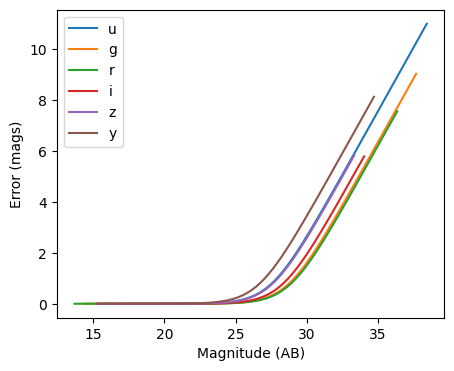
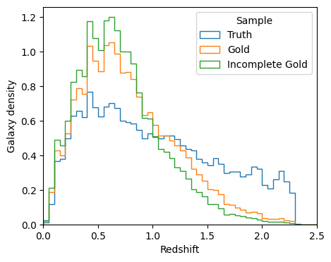
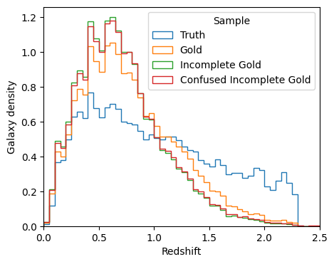
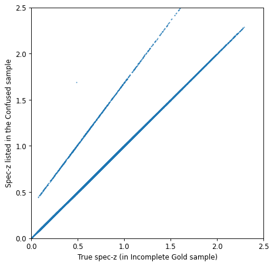

Using Engines and Degraders to Generate Galaxy Samples with Errors and Biases
=============================================================================

author: John Franklin Crenshaw, Sam Schmidt, Eric Charles, others…

last run successfully: Feb 9, 2026

This notebook demonstrates how to use a RAIL Engines to create galaxy
samples, and how to use Degraders to add various errors and biases to
the sample.

Note that in the parlance of the Creation Module, “degradation” is any
post-processing that occurs to the “true” sample generated by the
Engine. This can include adding photometric errors, applying quality
cuts, introducing systematic biases, etc.

In this notebook, we will first learn how to draw samples from a RAIL
Engine object. Then we will demonstrate how to use the following RAIL
Degraders:

1. **LSSTErrorModel**, which adds photometric errors

2. **QuantityCut**, which applies cuts to the specified columns of the
   sample

3. **InvRedshiftIncompleteness**, which introduces sample incompleteness

4. **LineConfusion**, which introduces spectroscopic errors

Throughout the notebook, we will show how you can chain all these
Degraders together to build a more complicated degrader. Hopefully, this
will allow you to see how you can build your own degrader.

*Note on generating redshift posteriors*: regardless of what Degraders
you apply, when you use a Creator to estimate posteriors, the posteriors
will *always* be calculated with respect to the “true” distribution.
This is the whole point of the Creation Module – you can generate
degraded samples for which we still have access to the *true*
posteriors. For an example of how to calculate posteriors, see
``True_Posterior.ipynb``.

If you’re interested in running this in pipeline mode, see
`00_Quick_Start_in_Creation.ipynb <https://github.com/LSSTDESC/rail/blob/main/pipeline_examples/creation_examples/00_Quick_Start_in_Creation.ipynb>`__
in the ``pipeline_examples/creation_examples/`` folder.

.. code:: ipython3

    import os
    
    import matplotlib.pyplot as plt
    import pzflow
    
    from rail import interactive as ri

.. parsed-literal::

    Install FSPS with the following commands:
    pip uninstall fsps
    git clone --recursive https://github.com/dfm/python-fsps.git
    cd python-fsps
    python -m pip install .
    export SPS_HOME=$(pwd)/src/fsps/libfsps
    
    LEPHAREDIR is being set to the default cache directory:
    /home/runner/.cache/lephare/data
    More than 1Gb may be written there.
    LEPHAREWORK is being set to the default cache directory:
    /home/runner/.cache/lephare/work
    Default work cache is already linked. 
    This is linked to the run directory:
    /home/runner/.cache/lephare/runs/20260427T122115

.. parsed-literal::

    
    A module that was compiled using NumPy 1.x cannot be run in
    NumPy 2.2.6 as it may crash. To support both 1.x and 2.x
    versions of NumPy, modules must be compiled with NumPy 2.0.
    Some module may need to rebuild instead e.g. with 'pybind11>=2.12'.
    
    If you are a user of the module, the easiest solution will be to
    downgrade to 'numpy<2' or try to upgrade the affected module.
    We expect that some modules will need time to support NumPy 2.
    
    Traceback (most recent call last):  File "/opt/hostedtoolcache/Python/3.10.20/x64/lib/python3.10/runpy.py", line 196, in _run_module_as_main
        return _run_code(code, main_globals, None,
      File "/opt/hostedtoolcache/Python/3.10.20/x64/lib/python3.10/runpy.py", line 86, in _run_code
        exec(code, run_globals)
      File "/opt/hostedtoolcache/Python/3.10.20/x64/lib/python3.10/site-packages/ipykernel_launcher.py", line 18, in <module>
        app.launch_new_instance()
      File "/opt/hostedtoolcache/Python/3.10.20/x64/lib/python3.10/site-packages/traitlets/config/application.py", line 1075, in launch_instance
        app.start()
      File "/opt/hostedtoolcache/Python/3.10.20/x64/lib/python3.10/site-packages/ipykernel/kernelapp.py", line 758, in start
        self.io_loop.start()
      File "/opt/hostedtoolcache/Python/3.10.20/x64/lib/python3.10/site-packages/tornado/platform/asyncio.py", line 211, in start
        self.asyncio_loop.run_forever()
      File "/opt/hostedtoolcache/Python/3.10.20/x64/lib/python3.10/asyncio/base_events.py", line 603, in run_forever
        self._run_once()
      File "/opt/hostedtoolcache/Python/3.10.20/x64/lib/python3.10/asyncio/base_events.py", line 1909, in _run_once
        handle._run()
      File "/opt/hostedtoolcache/Python/3.10.20/x64/lib/python3.10/asyncio/events.py", line 80, in _run
        self._context.run(self._callback, *self._args)
      File "/opt/hostedtoolcache/Python/3.10.20/x64/lib/python3.10/site-packages/ipykernel/utils.py", line 71, in preserve_context
        return await f(*args, **kwargs)
      File "/opt/hostedtoolcache/Python/3.10.20/x64/lib/python3.10/site-packages/ipykernel/kernelbase.py", line 621, in shell_main
        await self.dispatch_shell(msg, subshell_id=subshell_id)
      File "/opt/hostedtoolcache/Python/3.10.20/x64/lib/python3.10/site-packages/ipykernel/kernelbase.py", line 478, in dispatch_shell
        await result
      File "/opt/hostedtoolcache/Python/3.10.20/x64/lib/python3.10/site-packages/ipykernel/ipkernel.py", line 372, in execute_request
        await super().execute_request(stream, ident, parent)
      File "/opt/hostedtoolcache/Python/3.10.20/x64/lib/python3.10/site-packages/ipykernel/kernelbase.py", line 834, in execute_request
        reply_content = await reply_content
      File "/opt/hostedtoolcache/Python/3.10.20/x64/lib/python3.10/site-packages/ipykernel/ipkernel.py", line 464, in do_execute
        res = shell.run_cell(
      File "/opt/hostedtoolcache/Python/3.10.20/x64/lib/python3.10/site-packages/ipykernel/zmqshell.py", line 663, in run_cell
        return super().run_cell(*args, **kwargs)
      File "/opt/hostedtoolcache/Python/3.10.20/x64/lib/python3.10/site-packages/IPython/core/interactiveshell.py", line 3077, in run_cell
        result = self._run_cell(
      File "/opt/hostedtoolcache/Python/3.10.20/x64/lib/python3.10/site-packages/IPython/core/interactiveshell.py", line 3132, in _run_cell
        result = runner(coro)
      File "/opt/hostedtoolcache/Python/3.10.20/x64/lib/python3.10/site-packages/IPython/core/async_helpers.py", line 128, in _pseudo_sync_runner
        coro.send(None)
      File "/opt/hostedtoolcache/Python/3.10.20/x64/lib/python3.10/site-packages/IPython/core/interactiveshell.py", line 3336, in run_cell_async
        has_raised = await self.run_ast_nodes(code_ast.body, cell_name,
      File "/opt/hostedtoolcache/Python/3.10.20/x64/lib/python3.10/site-packages/IPython/core/interactiveshell.py", line 3519, in run_ast_nodes
        if await self.run_code(code, result, async_=asy):
      File "/opt/hostedtoolcache/Python/3.10.20/x64/lib/python3.10/site-packages/IPython/core/interactiveshell.py", line 3579, in run_code
        exec(code_obj, self.user_global_ns, self.user_ns)
      File "/tmp/ipykernel_4059/3568811912.py", line 6, in <module>
        from rail import interactive as ri
      File "/opt/hostedtoolcache/Python/3.10.20/x64/lib/python3.10/site-packages/rail/interactive/__init__.py", line 3, in <module>
        from . import calib, creation, estimation, evaluation, tools
      File "/opt/hostedtoolcache/Python/3.10.20/x64/lib/python3.10/site-packages/rail/interactive/calib/__init__.py", line 3, in <module>
        from rail.utils.interactive.initialize_utils import _initialize_interactive_module
      File "/opt/hostedtoolcache/Python/3.10.20/x64/lib/python3.10/site-packages/rail/utils/interactive/initialize_utils.py", line 17, in <module>
        from rail.utils.interactive.base_utils import (
      File "/opt/hostedtoolcache/Python/3.10.20/x64/lib/python3.10/site-packages/rail/utils/interactive/base_utils.py", line 10, in <module>
        rail.stages.import_and_attach_all(silent=True)
      File "/opt/hostedtoolcache/Python/3.10.20/x64/lib/python3.10/site-packages/rail/stages/__init__.py", line 74, in import_and_attach_all
        RailEnv.import_all_packages(silent=silent)
      File "/opt/hostedtoolcache/Python/3.10.20/x64/lib/python3.10/site-packages/rail/core/introspection.py", line 541, in import_all_packages
        _imported_module = importlib.import_module(pkg)
      File "/opt/hostedtoolcache/Python/3.10.20/x64/lib/python3.10/importlib/__init__.py", line 126, in import_module
        return _bootstrap._gcd_import(name[level:], package, level)
      File "/opt/hostedtoolcache/Python/3.10.20/x64/lib/python3.10/site-packages/rail/som/__init__.py", line 1, in <module>
        from rail.creation.degraders.specz_som import *
      File "/opt/hostedtoolcache/Python/3.10.20/x64/lib/python3.10/site-packages/rail/creation/degraders/specz_som.py", line 15, in <module>
        from somoclu import Somoclu
      File "/opt/hostedtoolcache/Python/3.10.20/x64/lib/python3.10/site-packages/somoclu/__init__.py", line 11, in <module>
        from .train import Somoclu
      File "/opt/hostedtoolcache/Python/3.10.20/x64/lib/python3.10/site-packages/somoclu/train.py", line 25, in <module>
        from .somoclu_wrap import train as wrap_train
      File "/opt/hostedtoolcache/Python/3.10.20/x64/lib/python3.10/site-packages/somoclu/somoclu_wrap.py", line 11, in <module>
        import _somoclu_wrap

::

    ---------------------------------------------------------------------------

    ImportError                               Traceback (most recent call last)

    File /opt/hostedtoolcache/Python/3.10.20/x64/lib/python3.10/site-packages/numpy/core/_multiarray_umath.py:44, in __getattr__(attr_name)
         39     # Also print the message (with traceback).  This is because old versions
         40     # of NumPy unfortunately set up the import to replace (and hide) the
         41     # error.  The traceback shouldn't be needed, but e.g. pytest plugins
         42     # seem to swallow it and we should be failing anyway...
         43     sys.stderr.write(msg + tb_msg)
    ---> 44     raise ImportError(msg)
         46 ret = getattr(_multiarray_umath, attr_name, None)
         47 if ret is None:

    ImportError: 
    A module that was compiled using NumPy 1.x cannot be run in
    NumPy 2.2.6 as it may crash. To support both 1.x and 2.x
    versions of NumPy, modules must be compiled with NumPy 2.0.
    Some module may need to rebuild instead e.g. with 'pybind11>=2.12'.
    
    If you are a user of the module, the easiest solution will be to
    downgrade to 'numpy<2' or try to upgrade the affected module.
    We expect that some modules will need time to support NumPy 2.
    

.. parsed-literal::

    Warning: the binary library cannot be imported. You cannot train maps, but you can load and analyze ones that you have already saved.
    The problem occurs because either compilation failed when you installed Somoclu or a path is missing from the dependencies when you are trying to import it. Please refer to the documentation to see your options.

Specify the path to the pretrained ‘pzflow’ used to generate samples
~~~~~~~~~~~~~~~~~~~~~~~~~~~~~~~~~~~~~~~~~~~~~~~~~~~~~~~~~~~~~~~~~~~~

.. code:: ipython3

    flow_file = os.path.join(
        os.path.dirname(pzflow.__file__), "example_files", "example-flow.pzflow.pkl"
    )

“True” Engine
-------------

First, let’s make an Engine that has no degradation. We can use it to
generate a “true” sample, to which we can compare all the degraded
samples below.

Note: in this example, we will use a normalizing flow engine from the
`pzflow <https://github.com/jfcrenshaw/pzflow>`__ package. However,
everything in this notebook is totally agnostic to what the underlying
engine is.

.. code:: ipython3

    n_samples = int(1e5)
    
    samples_truth = ri.creation.engines.flowEngine.flow_creator(
        n_samples=n_samples, model=flow_file, seed=0
    )

.. parsed-literal::

    Inserting handle into data store.  model: /opt/hostedtoolcache/Python/3.10.20/x64/lib/python3.10/site-packages/pzflow/example_files/example-flow.pzflow.pkl, FlowCreator

.. parsed-literal::

    Inserting handle into data store.  output: inprogress_output.pq, FlowCreator

Degrader 1: LSSTErrorModel
--------------------------

Now, we will demonstrate the ``LSSTErrorModel``, which adds photometric
errors using a model similar to the model from `Ivezic et
al. 2019 <https://arxiv.org/abs/0805.2366>`__ (specifically, it uses the
model from this paper, without making the high SNR assumption. To
restore this assumption and therefore use the exact model from the
paper, set ``highSNR=True``.)

Let’s create an error model with the default settings and add this error
model as a degrader and draw some samples with photometric errors.

.. code:: ipython3

    samples_w_errs = ri.creation.degraders.photometric_errors.lsst_error_model(
        sample=samples_truth["output"]
    )
    
    samples_w_errs["output"]

.. parsed-literal::

    Inserting handle into data store.  input: None, LSSTErrorModel
    Inserting handle into data store.  output: inprogress_output.pq, LSSTErrorModel

.. raw:: html

    

    
    <table border="1" class="dataframe">
      <thead>
        <tr style="text-align: right;">
          <th></th>
          <th>redshift</th>
          <th>u</th>
          <th>u_err</th>
          <th>g</th>
          <th>g_err</th>
          <th>r</th>
          <th>r_err</th>
          <th>i</th>
          <th>i_err</th>
          <th>z</th>
          <th>z_err</th>
          <th>y</th>
          <th>y_err</th>
        </tr>
      </thead>
      <tbody>
        <tr>
          <th>0</th>
          <td>1.398944</td>
          <td>26.540884</td>
          <td>0.389162</td>
          <td>26.782301</td>
          <td>0.176308</td>
          <td>25.969922</td>
          <td>0.076780</td>
          <td>25.133723</td>
          <td>0.059777</td>
          <td>24.822727</td>
          <td>0.086822</td>
          <td>23.897004</td>
          <td>0.086330</td>
        </tr>
        <tr>
          <th>1</th>
          <td>2.285624</td>
          <td>27.197509</td>
          <td>0.631329</td>
          <td>27.620858</td>
          <td>0.350664</td>
          <td>26.534437</td>
          <td>0.125911</td>
          <td>26.204051</td>
          <td>0.152636</td>
          <td>25.699376</td>
          <td>0.185379</td>
          <td>25.427769</td>
          <td>0.316002</td>
        </tr>
        <tr>
          <th>2</th>
          <td>1.495132</td>
          <td>26.612859</td>
          <td>0.411314</td>
          <td>27.524939</td>
          <td>0.325050</td>
          <td>29.095483</td>
          <td>0.903380</td>
          <td>25.967418</td>
          <td>0.124451</td>
          <td>25.063384</td>
          <td>0.107228</td>
          <td>24.321030</td>
          <td>0.125081</td>
        </tr>
        <tr>
          <th>3</th>
          <td>0.842594</td>
          <td>29.014876</td>
          <td>1.790613</td>
          <td>27.984725</td>
          <td>0.463760</td>
          <td>27.399511</td>
          <td>0.261548</td>
          <td>26.167050</td>
          <td>0.147865</td>
          <td>25.782079</td>
          <td>0.198763</td>
          <td>25.017982</td>
          <td>0.226272</td>
        </tr>
        <tr>
          <th>4</th>
          <td>1.588960</td>
          <td>26.782426</td>
          <td>0.467616</td>
          <td>26.184507</td>
          <td>0.105320</td>
          <td>25.884889</td>
          <td>0.071219</td>
          <td>25.805666</td>
          <td>0.108104</td>
          <td>25.489975</td>
          <td>0.155121</td>
          <td>25.202934</td>
          <td>0.263512</td>
        </tr>
        <tr>
          <th>...</th>
          <td>...</td>
          <td>...</td>
          <td>...</td>
          <td>...</td>
          <td>...</td>
          <td>...</td>
          <td>...</td>
          <td>...</td>
          <td>...</td>
          <td>...</td>
          <td>...</td>
          <td>...</td>
          <td>...</td>
        </tr>
        <tr>
          <th>99995</th>
          <td>0.389450</td>
          <td>30.250596</td>
          <td>2.874255</td>
          <td>26.486056</td>
          <td>0.136837</td>
          <td>25.467517</td>
          <td>0.049183</td>
          <td>25.064217</td>
          <td>0.056201</td>
          <td>24.796342</td>
          <td>0.084828</td>
          <td>25.061559</td>
          <td>0.234594</td>
        </tr>
        <tr>
          <th>99996</th>
          <td>1.481047</td>
          <td>inf</td>
          <td>inf</td>
          <td>26.679831</td>
          <td>0.161588</td>
          <td>26.103122</td>
          <td>0.086352</td>
          <td>25.162292</td>
          <td>0.061311</td>
          <td>24.907538</td>
          <td>0.093544</td>
          <td>24.390671</td>
          <td>0.132856</td>
        </tr>
        <tr>
          <th>99997</th>
          <td>2.023548</td>
          <td>26.883761</td>
          <td>0.504116</td>
          <td>26.964426</td>
          <td>0.205561</td>
          <td>26.303983</td>
          <td>0.103006</td>
          <td>26.309731</td>
          <td>0.167065</td>
          <td>25.825091</td>
          <td>0.206067</td>
          <td>25.254998</td>
          <td>0.274933</td>
        </tr>
        <tr>
          <th>99998</th>
          <td>1.548204</td>
          <td>26.269137</td>
          <td>0.314343</td>
          <td>26.299893</td>
          <td>0.116461</td>
          <td>26.102464</td>
          <td>0.086302</td>
          <td>26.123259</td>
          <td>0.142399</td>
          <td>25.362654</td>
          <td>0.139044</td>
          <td>25.901407</td>
          <td>0.456353</td>
        </tr>
        <tr>
          <th>99999</th>
          <td>1.739491</td>
          <td>27.128527</td>
          <td>0.601478</td>
          <td>26.809669</td>
          <td>0.180444</td>
          <td>26.572180</td>
          <td>0.130096</td>
          <td>26.329122</td>
          <td>0.169847</td>
          <td>25.826429</td>
          <td>0.206298</td>
          <td>25.768738</td>
          <td>0.412650</td>
        </tr>
      </tbody>
    </table>
    
100000 rows × 13 columns

    

Notice some of the magnitudes are inf’s. These are non-detections. This
means those observed fluxes were negative. You can change the limit for
non-detections by setting ``sigLim=...``, where the value you set is the
minimum SNR. Setting ``ndFlag=...`` changes the value used to flag
non-detections.

Let’s plot the error as a function of magnitude

.. code:: ipython3

    fig, ax = plt.subplots(figsize=(5, 4), dpi=100)
    
    for band in "ugrizy":
        # pull out the magnitudes and errors
        mags = samples_w_errs["output"][band].to_numpy()
        errs = samples_w_errs["output"][band + "_err"].to_numpy()
    
        # sort them by magnitude
        mags, errs = mags[mags.argsort()], errs[mags.argsort()]
    
        # plot errs vs mags
        ax.plot(mags, errs, label=band)
    
    ax.legend()
    ax.set(xlabel="Magnitude (AB)", ylabel="Error (mags)")
    plt.show()

You can see that the photometric error increases as magnitude gets
dimmer, just like you would expect. Notice, however, that we have
galaxies as dim as magnitude 30. This is because the Flow produces a
sample much deeper than the LSST 5-sigma limiting magnitudes. There are
no galaxies dimmer than magnitude 30 because LSSTErrorModel sets
magnitudes > 30 equal to NaN (the default flag for non-detections).

Degrader 2: QuantityCut
-----------------------

Recall how the sample above has galaxies as dim as magnitude 30. This is
well beyond the LSST 5-sigma limiting magnitudes, so it will be useful
to apply cuts to the data to filter out these super-dim samples. We can
apply these cuts using the ``QuantityCut`` degrader. This degrader will
cut out any samples that do not pass all of the specified cuts.

Let’s make and run degraders that first adds photometric errors, then
cuts at i<25.3, which is the LSST gold sample.

.. code:: ipython3

    samples_gold_with_errs = ri.creation.degraders.quantityCut.quantity_cut(
        sample=samples_w_errs["output"], cuts={"i": 25.3}
    )
    samples_gold_with_errs["output"]

.. parsed-literal::

    Inserting handle into data store.  input: None, QuantityCut
    Inserting handle into data store.  output: inprogress_output.pq, QuantityCut

.. raw:: html

    

    
    <table border="1" class="dataframe">
      <thead>
        <tr style="text-align: right;">
          <th></th>
          <th>redshift</th>
          <th>u</th>
          <th>u_err</th>
          <th>g</th>
          <th>g_err</th>
          <th>r</th>
          <th>r_err</th>
          <th>i</th>
          <th>i_err</th>
          <th>z</th>
          <th>z_err</th>
          <th>y</th>
          <th>y_err</th>
        </tr>
      </thead>
      <tbody>
        <tr>
          <th>0</th>
          <td>1.398944</td>
          <td>26.540884</td>
          <td>0.389162</td>
          <td>26.782301</td>
          <td>0.176308</td>
          <td>25.969922</td>
          <td>0.076780</td>
          <td>25.133723</td>
          <td>0.059777</td>
          <td>24.822727</td>
          <td>0.086822</td>
          <td>23.897004</td>
          <td>0.086330</td>
        </tr>
        <tr>
          <th>5</th>
          <td>1.446021</td>
          <td>26.837539</td>
          <td>0.487197</td>
          <td>25.976476</td>
          <td>0.087769</td>
          <td>25.474370</td>
          <td>0.049483</td>
          <td>24.593520</td>
          <td>0.037015</td>
          <td>24.215995</td>
          <td>0.050741</td>
          <td>23.339915</td>
          <td>0.052725</td>
        </tr>
        <tr>
          <th>6</th>
          <td>0.857864</td>
          <td>24.927398</td>
          <td>0.101642</td>
          <td>24.315943</td>
          <td>0.020458</td>
          <td>23.305152</td>
          <td>0.008580</td>
          <td>22.345304</td>
          <td>0.006970</td>
          <td>21.859435</td>
          <td>0.007855</td>
          <td>21.681772</td>
          <td>0.012788</td>
        </tr>
        <tr>
          <th>8</th>
          <td>1.281177</td>
          <td>26.541466</td>
          <td>0.389337</td>
          <td>25.495246</td>
          <td>0.057385</td>
          <td>24.719911</td>
          <td>0.025440</td>
          <td>24.055067</td>
          <td>0.023102</td>
          <td>23.444445</td>
          <td>0.025692</td>
          <td>22.843984</td>
          <td>0.033976</td>
        </tr>
        <tr>
          <th>9</th>
          <td>1.089695</td>
          <td>27.646208</td>
          <td>0.852070</td>
          <td>26.519650</td>
          <td>0.140855</td>
          <td>25.810599</td>
          <td>0.066685</td>
          <td>25.292444</td>
          <td>0.068808</td>
          <td>24.605223</td>
          <td>0.071656</td>
          <td>24.418445</td>
          <td>0.136082</td>
        </tr>
        <tr>
          <th>...</th>
          <td>...</td>
          <td>...</td>
          <td>...</td>
          <td>...</td>
          <td>...</td>
          <td>...</td>
          <td>...</td>
          <td>...</td>
          <td>...</td>
          <td>...</td>
          <td>...</td>
          <td>...</td>
          <td>...</td>
        </tr>
        <tr>
          <th>99988</th>
          <td>0.536846</td>
          <td>26.288407</td>
          <td>0.319209</td>
          <td>26.237609</td>
          <td>0.110314</td>
          <td>25.613351</td>
          <td>0.055982</td>
          <td>25.249978</td>
          <td>0.066268</td>
          <td>25.446097</td>
          <td>0.149393</td>
          <td>25.620705</td>
          <td>0.368013</td>
        </tr>
        <tr>
          <th>99989</th>
          <td>0.399217</td>
          <td>27.586870</td>
          <td>0.820224</td>
          <td>25.891227</td>
          <td>0.081427</td>
          <td>25.039014</td>
          <td>0.033647</td>
          <td>24.841455</td>
          <td>0.046115</td>
          <td>24.763926</td>
          <td>0.082438</td>
          <td>24.287555</td>
          <td>0.121499</td>
        </tr>
        <tr>
          <th>99994</th>
          <td>0.678879</td>
          <td>27.254857</td>
          <td>0.656967</td>
          <td>26.185629</td>
          <td>0.105423</td>
          <td>25.416001</td>
          <td>0.046984</td>
          <td>24.788661</td>
          <td>0.044004</td>
          <td>24.404061</td>
          <td>0.059958</td>
          <td>24.373905</td>
          <td>0.130943</td>
        </tr>
        <tr>
          <th>99995</th>
          <td>0.389450</td>
          <td>30.250596</td>
          <td>2.874255</td>
          <td>26.486056</td>
          <td>0.136837</td>
          <td>25.467517</td>
          <td>0.049183</td>
          <td>25.064217</td>
          <td>0.056201</td>
          <td>24.796342</td>
          <td>0.084828</td>
          <td>25.061559</td>
          <td>0.234594</td>
        </tr>
        <tr>
          <th>99996</th>
          <td>1.481047</td>
          <td>inf</td>
          <td>inf</td>
          <td>26.679831</td>
          <td>0.161588</td>
          <td>26.103122</td>
          <td>0.086352</td>
          <td>25.162292</td>
          <td>0.061311</td>
          <td>24.907538</td>
          <td>0.093544</td>
          <td>24.390671</td>
          <td>0.132856</td>
        </tr>
      </tbody>
    </table>
    
51884 rows × 13 columns

    

If you look at the i column, you will see there are no longer any
samples with i > 25.3. The number of galaxies returned has been nearly
cut in half from the input sample and, unlike the LSSTErrorModel
degrader, is not equal to the number of input objects. Users should note
that with degraders that remove galaxies from the sample the size of the
output sample will not equal that of the input sample.

One more note: it is easy to use the QuantityCut degrader as a SNR cut
on the magnitudes. The magnitude equation is :math:`m = -2.5 \log(f)`.
Taking the derivative, we have

.. math::

   dm = \frac{2.5}{\ln(10)} \frac{df}{f} = \frac{2.5}{\ln(10)} \frac{1}{\mathrm{SNR}}.

So if you want to make a cut on galaxies above a certain SNR, you can
make a cut

.. math::

   dm < \frac{2.5}{\ln(10)} \frac{1}{\mathrm{SNR}}.

For example, an SNR cut on the i band would look like this:
``QuantityCut({"i_err": 2.5/np.log(10) * 1/SNR})``.

Degrader 3: InvRedshiftIncompleteness
-------------------------------------

Next, we will demonstrate the ``InvRedshiftIncompleteness`` degrader. It
applies a selection function, which keeps galaxies with probability
:math:`p_{\text{keep}}(z) = \min(1, \frac{z_p}{z})`, where :math:`z_p`
is the ‘’pivot’’ redshift. We’ll use :math:`z_p = 0.8`.

.. code:: ipython3

    samples_incomplete_gold_w_errs = (
        ri.creation.degraders.spectroscopic_degraders.inv_redshift_incompleteness(
            sample=samples_gold_with_errs["output"], pivot_redshift=0.8
        )
    )

.. parsed-literal::

    Inserting handle into data store.  input: None, InvRedshiftIncompleteness
    Inserting handle into data store.  output: inprogress_output.pq, InvRedshiftIncompleteness

Let’s plot the redshift distributions of the samples we have generated
so far:

.. code:: ipython3

    fig, ax = plt.subplots(figsize=(5, 4), dpi=100)
    
    zmin = 0
    zmax = 2.5
    
    hist_settings = {
        "bins": 50,
        "range": (zmin, zmax),
        "density": True,
        "histtype": "step",
    }
    
    ax.hist(samples_truth["output"]["redshift"], label="Truth", **hist_settings)
    ax.hist(samples_gold_with_errs["output"]["redshift"], label="Gold", **hist_settings)
    ax.hist(
        samples_incomplete_gold_w_errs["output"]["redshift"],
        label="Incomplete Gold",
        **hist_settings,
    )
    ax.legend(title="Sample")
    ax.set(xlim=(zmin, zmax), xlabel="Redshift", ylabel="Galaxy density")
    plt.show()

You can see that the Gold sample has significantly fewer high-redshift
galaxies than the truth. This is because many of the high-redshift
galaxies have i > 25.3.

You can further see that the Incomplete Gold sample has even fewer
high-redshift galaxies. This is exactly what we expected from this
degrader.

Degrader 4: LineConfusion
-------------------------

``LineConfusion`` is a degrader that simulates spectroscopic errors
resulting from the confusion of different emission lines.

For this example, let’s use the degrader to simulate a scenario in which
which 2% of [OII] lines are mistaken as [OIII] lines, and 1% of [OIII]
lines are mistaken as [OII] lines. (note I do not know how realistic
this scenario is!)

.. code:: ipython3

    OII = 3727
    OIII = 5007
    
    samples_conf_inc_gold_w_errs = (
        ri.creation.degraders.spectroscopic_degraders.line_confusion(
            sample=ri.creation.degraders.spectroscopic_degraders.line_confusion(
                sample=samples_incomplete_gold_w_errs["output"],
                true_wavelen=OIII,
                wrong_wavelen=OII,
                frac_wrong=0.01,
            )["output"],
            true_wavelen=OIII,
            wrong_wavelen=OII,
            frac_wrong=0.01,
        )
    )

.. parsed-literal::

    Inserting handle into data store.  input: None, LineConfusion
    Inserting handle into data store.  output: inprogress_output.pq, LineConfusion
    Inserting handle into data store.  input: None, LineConfusion
    Inserting handle into data store.  output: inprogress_output.pq, LineConfusion

Let’s plot the redshift distributions one more time

.. code:: ipython3

    fig, ax = plt.subplots(figsize=(5, 4), dpi=100)
    
    zmin = 0
    zmax = 2.5
    
    hist_settings = {
        "bins": 50,
        "range": (zmin, zmax),
        "density": True,
        "histtype": "step",
    }
    
    ax.hist(samples_truth["output"]["redshift"], label="Truth", **hist_settings)
    ax.hist(samples_gold_with_errs["output"]["redshift"], label="Gold", **hist_settings)
    ax.hist(
        samples_incomplete_gold_w_errs["output"]["redshift"],
        label="Incomplete Gold",
        **hist_settings,
    )
    ax.hist(
        samples_conf_inc_gold_w_errs["output"]["redshift"],
        label="Confused Incomplete Gold",
        **hist_settings,
    )
    ax.legend(title="Sample")
    ax.set(xlim=(zmin, zmax), xlabel="Redshift", ylabel="Galaxy density")
    plt.show()

You can see that the redshift distribution of this new sample is
essentially identical to the Incomplete Gold sample, with small
perturbations that result from the line confusion.

However the real impact of this degrader isn’t on the redshift
distribution, but rather that it introduces erroneous spec-z’s into the
photo-z training sets! To see the impact of this effect, let’s plot the
true spec-z’s as present in the Incomplete Gold sample, vs the spec-z’s
listed in the new sample with Oxygen Line Confusion.

.. code:: ipython3

    fig, ax = plt.subplots(figsize=(6, 6), dpi=85)
    
    ax.scatter(
        samples_incomplete_gold_w_errs["output"]["redshift"],
        samples_conf_inc_gold_w_errs["output"]["redshift"],
        marker=".",
        s=1,
    )
    
    ax.set(
        xlim=(0, 2.5),
        ylim=(0, 2.5),
        xlabel="True spec-z (in Incomplete Gold sample)",
        ylabel="Spec-z listed in the Confused sample",
    )
    plt.show()

Now we can clearly see the spec-z errors! The galaxies above the line
y=x are the [OII] -> [OIII] galaxies, while the ones below are the
[OIII] -> [OII] galaxies.
