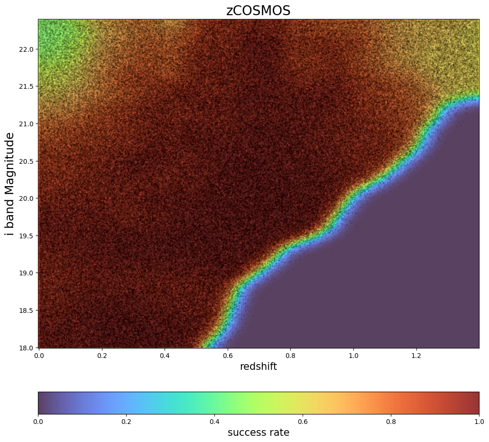

Spectroscopic Selection Degrader to Emulate zCOSMOS Training Samples
====================================================================

last run successfully: Feb 9, 2026

The spectroscopic_selection degrader can be used to model the
spectroscopic success rates in training sets based on real data. Given a
2-dimensional grid of spec-z success ratio as a function of two
variables (often magnitude, color, or redshift), the degrader will draw
the appropriate fraction of samples from the input data and return a
sample with incompleteness modeled.

The degrader takes the following arguments:

-  ``N_tot``: number of selected sources
-  ``nondetect_val``: non detected magnitude value to be excluded
   (usually 99.0, -99.0 or NaN).
-  ``downsample``: If true, downsample the selected sources into a total
   number of N_tot.
-  ``success_rate_dir``: The path to the directory containing success
   rate files.
-  ``colnames``: a dictionary that includes necessary columns
   (magnitudes, colors and redshift) for selection. For magnitudes, the
   keys are ugrizy; for colors, the keys are, for example, gr standing
   for g-r; for redshift, the key is ‘redshift’. In this demo, zCOSMOS
   takes {‘i’:‘i’, ‘redshift’:‘redshift’} as minimum necessary input

In this quick notebook we’ll select galaxies based on zCOSMOS selection
function.

**Note:** If you’re interested in running this in pipeline mode, see
`11_Spectroscopic_Selection_for_zCOSMOS.ipynb <https://github.com/LSSTDESC/rail/blob/main/pipeline_examples/creation_examples/11_Spectroscopic_Selection_for_zCOSMOS.ipynb>`__
in the ``pipeline_examples/creation_examples/`` folder.

.. code:: ipython3

    import matplotlib.pyplot as plt
    import numpy as np
    import pandas as pd
    from rail.utils.path_utils import find_rail_file
    
    from rail import interactive as ri

.. parsed-literal::

    Install FSPS with the following commands:
    pip uninstall fsps
    git clone --recursive https://github.com/dfm/python-fsps.git
    cd python-fsps
    python -m pip install .
    export SPS_HOME=$(pwd)/src/fsps/libfsps
    
    LEPHAREDIR is being set to the default cache directory which is being created at:
    /home/runner/.cache/lephare/data
    More than 1Gb may be written there.
    LEPHAREWORK is being set to the default cache directory:
    /home/runner/.cache/lephare/work

.. parsed-literal::

    
    A module that was compiled using NumPy 1.x cannot be run in
    NumPy 2.2.6 as it may crash. To support both 1.x and 2.x
    versions of NumPy, modules must be compiled with NumPy 2.0.
    Some module may need to rebuild instead e.g. with 'pybind11>=2.12'.
    
    If you are a user of the module, the easiest solution will be to
    downgrade to 'numpy<2' or try to upgrade the affected module.
    We expect that some modules will need time to support NumPy 2.
    
    Traceback (most recent call last):  File "/opt/hostedtoolcache/Python/3.10.20/x64/lib/python3.10/runpy.py", line 196, in _run_module_as_main
        return _run_code(code, main_globals, None,
      File "/opt/hostedtoolcache/Python/3.10.20/x64/lib/python3.10/runpy.py", line 86, in _run_code
        exec(code, run_globals)
      File "/opt/hostedtoolcache/Python/3.10.20/x64/lib/python3.10/site-packages/ipykernel_launcher.py", line 18, in <module>
        app.launch_new_instance()
      File "/opt/hostedtoolcache/Python/3.10.20/x64/lib/python3.10/site-packages/traitlets/config/application.py", line 1075, in launch_instance
        app.start()
      File "/opt/hostedtoolcache/Python/3.10.20/x64/lib/python3.10/site-packages/ipykernel/kernelapp.py", line 758, in start
        self.io_loop.start()
      File "/opt/hostedtoolcache/Python/3.10.20/x64/lib/python3.10/site-packages/tornado/platform/asyncio.py", line 211, in start
        self.asyncio_loop.run_forever()
      File "/opt/hostedtoolcache/Python/3.10.20/x64/lib/python3.10/asyncio/base_events.py", line 603, in run_forever
        self._run_once()
      File "/opt/hostedtoolcache/Python/3.10.20/x64/lib/python3.10/asyncio/base_events.py", line 1909, in _run_once
        handle._run()
      File "/opt/hostedtoolcache/Python/3.10.20/x64/lib/python3.10/asyncio/events.py", line 80, in _run
        self._context.run(self._callback, *self._args)
      File "/opt/hostedtoolcache/Python/3.10.20/x64/lib/python3.10/site-packages/ipykernel/utils.py", line 71, in preserve_context
        return await f(*args, **kwargs)
      File "/opt/hostedtoolcache/Python/3.10.20/x64/lib/python3.10/site-packages/ipykernel/kernelbase.py", line 621, in shell_main
        await self.dispatch_shell(msg, subshell_id=subshell_id)
      File "/opt/hostedtoolcache/Python/3.10.20/x64/lib/python3.10/site-packages/ipykernel/kernelbase.py", line 478, in dispatch_shell
        await result
      File "/opt/hostedtoolcache/Python/3.10.20/x64/lib/python3.10/site-packages/ipykernel/ipkernel.py", line 372, in execute_request
        await super().execute_request(stream, ident, parent)
      File "/opt/hostedtoolcache/Python/3.10.20/x64/lib/python3.10/site-packages/ipykernel/kernelbase.py", line 834, in execute_request
        reply_content = await reply_content
      File "/opt/hostedtoolcache/Python/3.10.20/x64/lib/python3.10/site-packages/ipykernel/ipkernel.py", line 464, in do_execute
        res = shell.run_cell(
      File "/opt/hostedtoolcache/Python/3.10.20/x64/lib/python3.10/site-packages/ipykernel/zmqshell.py", line 663, in run_cell
        return super().run_cell(*args, **kwargs)
      File "/opt/hostedtoolcache/Python/3.10.20/x64/lib/python3.10/site-packages/IPython/core/interactiveshell.py", line 3077, in run_cell
        result = self._run_cell(
      File "/opt/hostedtoolcache/Python/3.10.20/x64/lib/python3.10/site-packages/IPython/core/interactiveshell.py", line 3132, in _run_cell
        result = runner(coro)
      File "/opt/hostedtoolcache/Python/3.10.20/x64/lib/python3.10/site-packages/IPython/core/async_helpers.py", line 128, in _pseudo_sync_runner
        coro.send(None)
      File "/opt/hostedtoolcache/Python/3.10.20/x64/lib/python3.10/site-packages/IPython/core/interactiveshell.py", line 3336, in run_cell_async
        has_raised = await self.run_ast_nodes(code_ast.body, cell_name,
      File "/opt/hostedtoolcache/Python/3.10.20/x64/lib/python3.10/site-packages/IPython/core/interactiveshell.py", line 3519, in run_ast_nodes
        if await self.run_code(code, result, async_=asy):
      File "/opt/hostedtoolcache/Python/3.10.20/x64/lib/python3.10/site-packages/IPython/core/interactiveshell.py", line 3579, in run_code
        exec(code_obj, self.user_global_ns, self.user_ns)
      File "/tmp/ipykernel_3932/1741399557.py", line 6, in <module>
        from rail import interactive as ri
      File "/opt/hostedtoolcache/Python/3.10.20/x64/lib/python3.10/site-packages/rail/interactive/__init__.py", line 3, in <module>
        from . import calib, creation, estimation, evaluation, tools
      File "/opt/hostedtoolcache/Python/3.10.20/x64/lib/python3.10/site-packages/rail/interactive/calib/__init__.py", line 3, in <module>
        from rail.utils.interactive.initialize_utils import _initialize_interactive_module
      File "/opt/hostedtoolcache/Python/3.10.20/x64/lib/python3.10/site-packages/rail/utils/interactive/initialize_utils.py", line 17, in <module>
        from rail.utils.interactive.base_utils import (
      File "/opt/hostedtoolcache/Python/3.10.20/x64/lib/python3.10/site-packages/rail/utils/interactive/base_utils.py", line 10, in <module>
        rail.stages.import_and_attach_all(silent=True)
      File "/opt/hostedtoolcache/Python/3.10.20/x64/lib/python3.10/site-packages/rail/stages/__init__.py", line 74, in import_and_attach_all
        RailEnv.import_all_packages(silent=silent)
      File "/opt/hostedtoolcache/Python/3.10.20/x64/lib/python3.10/site-packages/rail/core/introspection.py", line 541, in import_all_packages
        _imported_module = importlib.import_module(pkg)
      File "/opt/hostedtoolcache/Python/3.10.20/x64/lib/python3.10/importlib/__init__.py", line 126, in import_module
        return _bootstrap._gcd_import(name[level:], package, level)
      File "/opt/hostedtoolcache/Python/3.10.20/x64/lib/python3.10/site-packages/rail/som/__init__.py", line 1, in <module>
        from rail.creation.degraders.specz_som import *
      File "/opt/hostedtoolcache/Python/3.10.20/x64/lib/python3.10/site-packages/rail/creation/degraders/specz_som.py", line 15, in <module>
        from somoclu import Somoclu
      File "/opt/hostedtoolcache/Python/3.10.20/x64/lib/python3.10/site-packages/somoclu/__init__.py", line 11, in <module>
        from .train import Somoclu
      File "/opt/hostedtoolcache/Python/3.10.20/x64/lib/python3.10/site-packages/somoclu/train.py", line 25, in <module>
        from .somoclu_wrap import train as wrap_train
      File "/opt/hostedtoolcache/Python/3.10.20/x64/lib/python3.10/site-packages/somoclu/somoclu_wrap.py", line 11, in <module>
        import _somoclu_wrap

::

    ---------------------------------------------------------------------------

    ImportError                               Traceback (most recent call last)

    File /opt/hostedtoolcache/Python/3.10.20/x64/lib/python3.10/site-packages/numpy/core/_multiarray_umath.py:44, in __getattr__(attr_name)
         39     # Also print the message (with traceback).  This is because old versions
         40     # of NumPy unfortunately set up the import to replace (and hide) the
         41     # error.  The traceback shouldn't be needed, but e.g. pytest plugins
         42     # seem to swallow it and we should be failing anyway...
         43     sys.stderr.write(msg + tb_msg)
    ---> 44     raise ImportError(msg)
         46 ret = getattr(_multiarray_umath, attr_name, None)
         47 if ret is None:

    ImportError: 
    A module that was compiled using NumPy 1.x cannot be run in
    NumPy 2.2.6 as it may crash. To support both 1.x and 2.x
    versions of NumPy, modules must be compiled with NumPy 2.0.
    Some module may need to rebuild instead e.g. with 'pybind11>=2.12'.
    
    If you are a user of the module, the easiest solution will be to
    downgrade to 'numpy<2' or try to upgrade the affected module.
    We expect that some modules will need time to support NumPy 2.
    

.. parsed-literal::

    Warning: the binary library cannot be imported. You cannot train maps, but you can load and analyze ones that you have already saved.
    The problem occurs because either compilation failed when you installed Somoclu or a path is missing from the dependencies when you are trying to import it. Please refer to the documentation to see your options.

Let’s make fake data for zCOSMOS selection.

.. code:: ipython3

    i = np.random.uniform(low=18, high=25.9675, size=(2000000,))
    gz = np.random.uniform(low=-1.98, high=5.98, size=(2000000,))
    u = np.full_like(i, 20.0, dtype=np.double)
    g = np.full_like(i, 20.0, dtype=np.double)
    r = np.full_like(i, 20.0, dtype=np.double)
    y = np.full_like(i, 20.0, dtype=np.double)
    z = g - gz
    redshift = np.random.uniform(size=len(i)) * 2

Standardize the column names:

.. code:: ipython3

    mockdict = {}
    for label, item in zip(
        ["u", "g", "r", "i", "z", "y", "redshift"], [u, g, r, i, z, y, redshift]
    ):
        mockdict[f"{label}"] = item

np.repeat(item, 100).flatten()

.. code:: ipython3

    df = pd.DataFrame(mockdict)

.. code:: ipython3

    df.head()

.. raw:: html

    

    
    <table border="1" class="dataframe">
      <thead>
        <tr style="text-align: right;">
          <th></th>
          <th>u</th>
          <th>g</th>
          <th>r</th>
          <th>i</th>
          <th>z</th>
          <th>y</th>
          <th>redshift</th>
        </tr>
      </thead>
      <tbody>
        <tr>
          <th>0</th>
          <td>20.0</td>
          <td>20.0</td>
          <td>20.0</td>
          <td>25.098267</td>
          <td>18.243048</td>
          <td>20.0</td>
          <td>1.465712</td>
        </tr>
        <tr>
          <th>1</th>
          <td>20.0</td>
          <td>20.0</td>
          <td>20.0</td>
          <td>22.241783</td>
          <td>21.097393</td>
          <td>20.0</td>
          <td>0.638646</td>
        </tr>
        <tr>
          <th>2</th>
          <td>20.0</td>
          <td>20.0</td>
          <td>20.0</td>
          <td>25.686531</td>
          <td>20.814044</td>
          <td>20.0</td>
          <td>0.357820</td>
        </tr>
        <tr>
          <th>3</th>
          <td>20.0</td>
          <td>20.0</td>
          <td>20.0</td>
          <td>24.385811</td>
          <td>21.584044</td>
          <td>20.0</td>
          <td>0.594600</td>
        </tr>
        <tr>
          <th>4</th>
          <td>20.0</td>
          <td>20.0</td>
          <td>20.0</td>
          <td>24.074451</td>
          <td>15.518858</td>
          <td>20.0</td>
          <td>1.340057</td>
        </tr>
      </tbody>
    </table>
    

Now, let’s import the spectroscopic_selections degrader for zCOSMOS.

The ratio file for zCOSMOS is located in the
``RAIL/src/rail/examples/creation/data/success_rate_data/`` directory,
as we are in ``RAIL/examples/creation`` folder named
``zCOSMOS_success.txt``; the binning in i band and redshift are given in
``zCOSMOS_I_sampling.txt`` and ``zCOSMOS_z_sampling.txt``.

We will set a random seed for reproducibility, and set the output file
to write our incomplete catalog to “test_hsc.pq”.

Let’s run the code and see how long it takes:

.. code:: ipython3

    %%time
    trim_data = ri.creation.degraders.spectroscopic_selections.spec_selection_zCOSMOS(
        sample=df, downsample=False, colnames={"i": "i", "redshift": "redshift"}
    )

.. parsed-literal::

    Inserting handle into data store.  input: None, SpecSelection_zCOSMOS

.. parsed-literal::

    Inserting handle into data store.  output: inprogress_output.pq, SpecSelection_zCOSMOS
    CPU times: user 1.31 s, sys: 24.9 ms, total: 1.33 s
    Wall time: 1.33 s

.. code:: ipython3

    trim_data["output"].info()

.. parsed-literal::

    <class 'pandas.core.frame.DataFrame'>
    Index: 503587 entries, 1 to 1999999
    Data columns (total 7 columns):
     #   Column    Non-Null Count   Dtype  
    ---  ------    --------------   -----  
     0   u         503587 non-null  float64
     1   g         503587 non-null  float64
     2   r         503587 non-null  float64
     3   i         503587 non-null  float64
     4   z         503587 non-null  float64
     5   y         503587 non-null  float64
     6   redshift  503587 non-null  float64
    dtypes: float64(7)
    memory usage: 30.7 MB

And we see that we’ve kept 503967 out of the 2,000,000 galaxies in the
initial sample, so about 25% of the initial sample. To visualize our
cuts, let’s read in the success ratios file and plot our sample overlaid
with an alpha of 0.05, that way the strength of the black dot will give
a visual indication of how many galaxies in each cell we’ve kept.

.. code:: ipython3

    # compare to sum of ratios * 100
    ratio_file = find_rail_file(
        "examples_data/creation_data/data/success_rate_data/zCOSMOS_success.txt"
    )

.. code:: ipython3

    ratios = np.loadtxt(ratio_file)

.. code:: ipython3

    ibin_ = np.arange(18, 22.4, 0.01464226, dtype=np.float64)
    zbin_ = np.arange(0, 1.4, 0.00587002, dtype=np.float64)
    
    ibin, zbin = np.meshgrid(ibin_, zbin_)

.. code:: ipython3

    plt.figure(figsize=(12, 12))
    plt.title("zCOSMOS", fontsize=20)
    
    c = plt.pcolormesh(zbin, ibin, ratios.T, cmap="turbo", vmin=0, vmax=1, alpha=0.8)
    plt.scatter(
        trim_data["output"]["redshift"], trim_data["output"]["i"], s=2, c="k", alpha=0.05
    )
    plt.xlabel("redshift", fontsize=15)
    plt.ylabel("i band Magnitude", fontsize=18)
    cb = plt.colorbar(c, label="success rate", orientation="horizontal", pad=0.1)
    cb.set_label(label="success rate", size=15)

The colormap shows the zCOSMOS success ratios and the strenth of the
black dots shows how many galaxies were actually kept. We see perfect
agreement between our predicted ratios and the actual number of galaxies
kept, the degrader is functioning properly, and we see a nice visual
representation of the resulting spectroscopic sample incompleteness.
