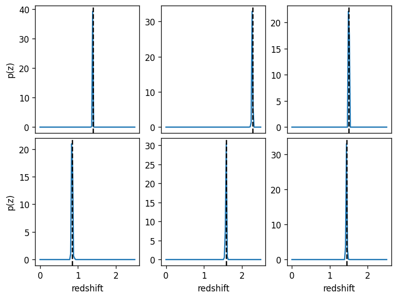
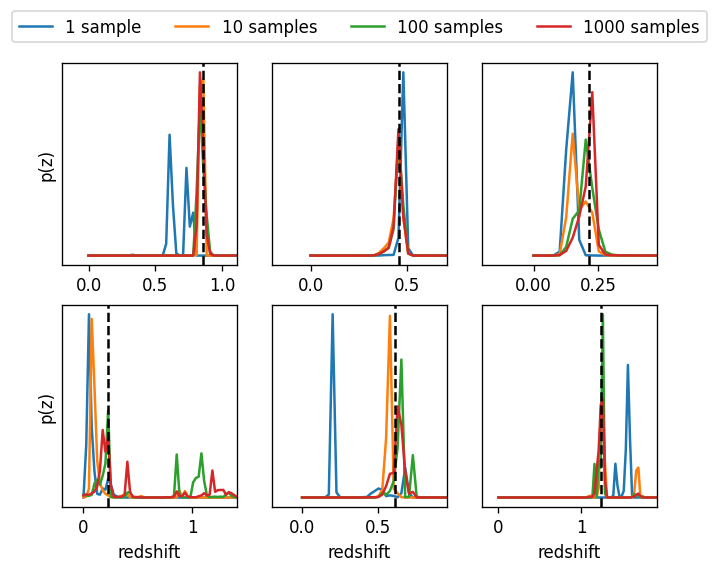
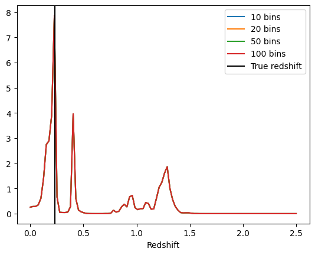

Using a Creator to Calculate True Posteriors for a Galaxy Sample
================================================================

author: John Franklin Crenshaw, Sam Schmidt, Eric Charles, others…

last run successfully: Feb 9, 2026

This notebook demonstrates how to use a RAIL Engine to calculate true
posteriors for galaxy samples drawn from the same Engine. Note that this
notebook assumes you have already read through
``00_Quick_Start_in_Creation.ipynb``.

Calculating posteriors is more complicated than drawing samples, because
it requires more knowledge of the engine that underlies the Engine. In
this example, we will use the same engine we used in Degradation demo:
``FlowEngine`` which wraps a normalizing flow from the
`pzflow <https://github.com/jfcrenshaw/pzflow>`__ package.

This notebook will cover three scenarios of increasing complexity:

1. Calculating posteriors without errors

2. Calculating posteriors while convolving errors

3. Calculating posteriors with missing bands

**Note:** If you’re interested in running this in pipeline mode, see
`05_True_Posterior.ipynb <https://github.com/LSSTDESC/rail/blob/main/pipeline_examples/creation_examples/05_True_Posterior.ipynb>`__
in the ``pipeline_examples/creation_examples/`` folder.

.. code:: ipython3

    import os
    
    import matplotlib.pyplot as plt
    import numpy as np
    import pzflow
    import rail.interactive as ri

.. parsed-literal::

    Install FSPS with the following commands:
    pip uninstall fsps
    git clone --recursive https://github.com/dfm/python-fsps.git
    cd python-fsps
    python -m pip install .
    export SPS_HOME=$(pwd)/src/fsps/libfsps
    
    LEPHAREDIR is being set to the default cache directory:
    /home/runner/.cache/lephare/data
    More than 1Gb may be written there.
    LEPHAREWORK is being set to the default cache directory:
    /home/runner/.cache/lephare/work
    Default work cache is already linked. 
    This is linked to the run directory:
    /home/runner/.cache/lephare/runs/20260330T121200

.. parsed-literal::

    
    A module that was compiled using NumPy 1.x cannot be run in
    NumPy 2.2.6 as it may crash. To support both 1.x and 2.x
    versions of NumPy, modules must be compiled with NumPy 2.0.
    Some module may need to rebuild instead e.g. with 'pybind11>=2.12'.
    
    If you are a user of the module, the easiest solution will be to
    downgrade to 'numpy<2' or try to upgrade the affected module.
    We expect that some modules will need time to support NumPy 2.
    
    Traceback (most recent call last):  File "/opt/hostedtoolcache/Python/3.10.20/x64/lib/python3.10/runpy.py", line 196, in _run_module_as_main
        return _run_code(code, main_globals, None,
      File "/opt/hostedtoolcache/Python/3.10.20/x64/lib/python3.10/runpy.py", line 86, in _run_code
        exec(code, run_globals)
      File "/opt/hostedtoolcache/Python/3.10.20/x64/lib/python3.10/site-packages/ipykernel_launcher.py", line 18, in <module>
        app.launch_new_instance()
      File "/opt/hostedtoolcache/Python/3.10.20/x64/lib/python3.10/site-packages/traitlets/config/application.py", line 1075, in launch_instance
        app.start()
      File "/opt/hostedtoolcache/Python/3.10.20/x64/lib/python3.10/site-packages/ipykernel/kernelapp.py", line 758, in start
        self.io_loop.start()
      File "/opt/hostedtoolcache/Python/3.10.20/x64/lib/python3.10/site-packages/tornado/platform/asyncio.py", line 211, in start
        self.asyncio_loop.run_forever()
      File "/opt/hostedtoolcache/Python/3.10.20/x64/lib/python3.10/asyncio/base_events.py", line 603, in run_forever
        self._run_once()
      File "/opt/hostedtoolcache/Python/3.10.20/x64/lib/python3.10/asyncio/base_events.py", line 1909, in _run_once
        handle._run()
      File "/opt/hostedtoolcache/Python/3.10.20/x64/lib/python3.10/asyncio/events.py", line 80, in _run
        self._context.run(self._callback, *self._args)
      File "/opt/hostedtoolcache/Python/3.10.20/x64/lib/python3.10/site-packages/ipykernel/utils.py", line 71, in preserve_context
        return await f(*args, **kwargs)
      File "/opt/hostedtoolcache/Python/3.10.20/x64/lib/python3.10/site-packages/ipykernel/kernelbase.py", line 621, in shell_main
        await self.dispatch_shell(msg, subshell_id=subshell_id)
      File "/opt/hostedtoolcache/Python/3.10.20/x64/lib/python3.10/site-packages/ipykernel/kernelbase.py", line 478, in dispatch_shell
        await result
      File "/opt/hostedtoolcache/Python/3.10.20/x64/lib/python3.10/site-packages/ipykernel/ipkernel.py", line 372, in execute_request
        await super().execute_request(stream, ident, parent)
      File "/opt/hostedtoolcache/Python/3.10.20/x64/lib/python3.10/site-packages/ipykernel/kernelbase.py", line 834, in execute_request
        reply_content = await reply_content
      File "/opt/hostedtoolcache/Python/3.10.20/x64/lib/python3.10/site-packages/ipykernel/ipkernel.py", line 464, in do_execute
        res = shell.run_cell(
      File "/opt/hostedtoolcache/Python/3.10.20/x64/lib/python3.10/site-packages/ipykernel/zmqshell.py", line 663, in run_cell
        return super().run_cell(*args, **kwargs)
      File "/opt/hostedtoolcache/Python/3.10.20/x64/lib/python3.10/site-packages/IPython/core/interactiveshell.py", line 3077, in run_cell
        result = self._run_cell(
      File "/opt/hostedtoolcache/Python/3.10.20/x64/lib/python3.10/site-packages/IPython/core/interactiveshell.py", line 3132, in _run_cell
        result = runner(coro)
      File "/opt/hostedtoolcache/Python/3.10.20/x64/lib/python3.10/site-packages/IPython/core/async_helpers.py", line 128, in _pseudo_sync_runner
        coro.send(None)
      File "/opt/hostedtoolcache/Python/3.10.20/x64/lib/python3.10/site-packages/IPython/core/interactiveshell.py", line 3336, in run_cell_async
        has_raised = await self.run_ast_nodes(code_ast.body, cell_name,
      File "/opt/hostedtoolcache/Python/3.10.20/x64/lib/python3.10/site-packages/IPython/core/interactiveshell.py", line 3519, in run_ast_nodes
        if await self.run_code(code, result, async_=asy):
      File "/opt/hostedtoolcache/Python/3.10.20/x64/lib/python3.10/site-packages/IPython/core/interactiveshell.py", line 3579, in run_code
        exec(code_obj, self.user_global_ns, self.user_ns)
      File "/tmp/ipykernel_4666/696671147.py", line 6, in <module>
        import rail.interactive as ri
      File "/opt/hostedtoolcache/Python/3.10.20/x64/lib/python3.10/site-packages/rail/interactive/__init__.py", line 3, in <module>
        from . import calib, creation, estimation, evaluation, tools
      File "/opt/hostedtoolcache/Python/3.10.20/x64/lib/python3.10/site-packages/rail/interactive/calib/__init__.py", line 3, in <module>
        from rail.utils.interactive.initialize_utils import _initialize_interactive_module
      File "/opt/hostedtoolcache/Python/3.10.20/x64/lib/python3.10/site-packages/rail/utils/interactive/initialize_utils.py", line 17, in <module>
        from rail.utils.interactive.base_utils import (
      File "/opt/hostedtoolcache/Python/3.10.20/x64/lib/python3.10/site-packages/rail/utils/interactive/base_utils.py", line 10, in <module>
        rail.stages.import_and_attach_all(silent=True)
      File "/opt/hostedtoolcache/Python/3.10.20/x64/lib/python3.10/site-packages/rail/stages/__init__.py", line 74, in import_and_attach_all
        RailEnv.import_all_packages(silent=silent)
      File "/opt/hostedtoolcache/Python/3.10.20/x64/lib/python3.10/site-packages/rail/core/introspection.py", line 541, in import_all_packages
        _imported_module = importlib.import_module(pkg)
      File "/opt/hostedtoolcache/Python/3.10.20/x64/lib/python3.10/importlib/__init__.py", line 126, in import_module
        return _bootstrap._gcd_import(name[level:], package, level)
      File "/opt/hostedtoolcache/Python/3.10.20/x64/lib/python3.10/site-packages/rail/som/__init__.py", line 1, in <module>
        from rail.creation.degraders.specz_som import *
      File "/opt/hostedtoolcache/Python/3.10.20/x64/lib/python3.10/site-packages/rail/creation/degraders/specz_som.py", line 15, in <module>
        from somoclu import Somoclu
      File "/opt/hostedtoolcache/Python/3.10.20/x64/lib/python3.10/site-packages/somoclu/__init__.py", line 11, in <module>
        from .train import Somoclu
      File "/opt/hostedtoolcache/Python/3.10.20/x64/lib/python3.10/site-packages/somoclu/train.py", line 25, in <module>
        from .somoclu_wrap import train as wrap_train
      File "/opt/hostedtoolcache/Python/3.10.20/x64/lib/python3.10/site-packages/somoclu/somoclu_wrap.py", line 11, in <module>
        import _somoclu_wrap

::

    ---------------------------------------------------------------------------

    ImportError                               Traceback (most recent call last)

    File /opt/hostedtoolcache/Python/3.10.20/x64/lib/python3.10/site-packages/numpy/core/_multiarray_umath.py:44, in __getattr__(attr_name)
         39     # Also print the message (with traceback).  This is because old versions
         40     # of NumPy unfortunately set up the import to replace (and hide) the
         41     # error.  The traceback shouldn't be needed, but e.g. pytest plugins
         42     # seem to swallow it and we should be failing anyway...
         43     sys.stderr.write(msg + tb_msg)
    ---> 44     raise ImportError(msg)
         46 ret = getattr(_multiarray_umath, attr_name, None)
         47 if ret is None:

    ImportError: 
    A module that was compiled using NumPy 1.x cannot be run in
    NumPy 2.2.6 as it may crash. To support both 1.x and 2.x
    versions of NumPy, modules must be compiled with NumPy 2.0.
    Some module may need to rebuild instead e.g. with 'pybind11>=2.12'.
    
    If you are a user of the module, the easiest solution will be to
    downgrade to 'numpy<2' or try to upgrade the affected module.
    We expect that some modules will need time to support NumPy 2.
    

.. parsed-literal::

    Warning: the binary library cannot be imported. You cannot train maps, but you can load and analyze ones that you have already saved.
    The problem occurs because either compilation failed when you installed Somoclu or a path is missing from the dependencies when you are trying to import it. Please refer to the documentation to see your options.

.. code:: ipython3

    flow_file = os.path.join(
        os.path.dirname(pzflow.__file__), "example_files", "example-flow.pzflow.pkl"
    )

1. Calculating posteriors without errors
----------------------------------------

For a basic first example, let’s make a Creator with no degradation and
draw a sample.

.. code:: ipython3

    samples_truth = ri.creation.engines.flowEngine.flow_creator(
        n_samples=6, model=flow_file, seed=0
    )

.. parsed-literal::

    Inserting handle into data store.  model: /opt/hostedtoolcache/Python/3.10.20/x64/lib/python3.10/site-packages/pzflow/example_files/example-flow.pzflow.pkl, FlowCreator

.. parsed-literal::

    Inserting handle into data store.  output: inprogress_output.pq, FlowCreator

Now, let’s calculate true posteriors for this sample. Note the important
fact here: these are literally the true posteriors for the sample
because pzflow gives us direct access to the probability distribution
from which the sample was drawn!

When calculating posteriors, the Engine will always require ``data``,
which is a pandas DataFrame of the galaxies for which we are calculating
posteriors (in out case the ``samples_truth``). Because we are using a
``FlowEngine``, we also must provide ``grid``, because ``FlowEngine``
calculates posteriors over a grid of redshift values.

Let’s calculate posteriors for every galaxy in our sample:

.. code:: ipython3

    pdfs = ri.creation.engines.flowEngine.flow_posterior(
        input_data=samples_truth["output"],
        name="truth_post",
        column="redshift",
        grid=np.linspace(0, 2.5, 100),
        marg_rules=dict(flag=np.nan, u=lambda _: np.linspace(25, 31, 10)),
        model=flow_file,
    )

.. parsed-literal::

    Inserting handle into data store.  model: /opt/hostedtoolcache/Python/3.10.20/x64/lib/python3.10/site-packages/pzflow/example_files/example-flow.pzflow.pkl, truth_post
    Inserting handle into data store.  input: None, truth_post

.. parsed-literal::

    Inserting handle into data store.  output_truth_post: inprogress_output_truth_post.hdf5, truth_post

Note that Creator returns the pdfs as a
`qp <https://github.com/LSSTDESC/qp>`__ Ensemble:

.. code:: ipython3

    pdfs["output"]

.. parsed-literal::

    Ensemble(the_class=interp,shape=(6, 100))

Let’s plot these pdfs:

.. code:: ipython3

    fig, axes = plt.subplots(2, 3, constrained_layout=True, dpi=120)
    
    for i, ax in enumerate(axes.flatten()):
        # plot the pdf
        pdfs["output"][i].plot_native(axes=ax)
    
        # plot the true redshift
        ax.axvline(samples_truth["output"]["redshift"][i], c="k", ls="--")
    
        # remove x-ticks on top row
        if i < 3:
            ax.set(xticks=[])
        # set x-label on bottom row
        else:
            ax.set(xlabel="redshift")
        # set y-label on far left column
        if i % 3 == 0:
            ax.set(ylabel="p(z)")

The true posteriors are in blue, and the true redshifts are marked by
the vertical black lines.

## 2. Calculating posteriors while convolving errors Now, let’s get a
little more sophisticated.

Let’s recreate the Engine/Degredation we were using at the end of the
Degradation demo.

I will make one change however: the LSST Error Model sometimes results
in non-detections for faint galaxies. These non-detections are flagged
with inf. Calculating posteriors for galaxies with non-detections is
more complicated, so for now, I will add one additional QuantityCut to
remove any galaxies with missing magnitudes. To see how to calculate
posteriors for galaxies with missing magnitudes, see `Section
3 <#MissingBands>`__.

Now let’s draw a degraded sample:

.. code:: ipython3

    # set up the error model
    
    n_samples = 50
    samples_degr = ri.creation.engines.flowEngine.flow_creator(
        n_samples=n_samples, seed=0, model=flow_file
    )
    
    OII = 3727
    OIII = 5007
    
    data = ri.creation.degraders.photometric_errors.lsst_error_model(
        sample=samples_degr["output"], sigLim=5
    )
    data = ri.creation.degraders.quantityCut.quantity_cut(
        sample=data["output"], cuts={band: np.inf for band in "ugrizy"}
    )
    data = ri.creation.degraders.spectroscopic_degraders.inv_redshift_incompleteness(
        sample=data["output"], pivot_redshift=0.8
    )
    data = ri.creation.degraders.spectroscopic_degraders.line_confusion(
        sample=data["output"], true_wavelen=OII, wrong_wavelen=OIII, frac_wrong=0.02
    )
    data = ri.creation.degraders.spectroscopic_degraders.line_confusion(
        sample=data["output"], true_wavelen=OII, wrong_wavelen=OIII, frac_wrong=0.01
    )
    samples_degraded_with_nondetects = data  # saving this for later
    data = ri.creation.degraders.quantityCut.quantity_cut(
        sample=data["output"], cuts={"i": 25.3}
    )

.. parsed-literal::

    Inserting handle into data store.  model: /opt/hostedtoolcache/Python/3.10.20/x64/lib/python3.10/site-packages/pzflow/example_files/example-flow.pzflow.pkl, FlowCreator

.. parsed-literal::

    Inserting handle into data store.  output: inprogress_output.pq, FlowCreator
    Inserting handle into data store.  input: None, LSSTErrorModel
    Inserting handle into data store.  output: inprogress_output.pq, LSSTErrorModel
    Inserting handle into data store.  input: None, QuantityCut
    Inserting handle into data store.  output: inprogress_output.pq, QuantityCut
    Inserting handle into data store.  input: None, InvRedshiftIncompleteness
    Inserting handle into data store.  output: inprogress_output.pq, InvRedshiftIncompleteness
    Inserting handle into data store.  input: None, LineConfusion
    Inserting handle into data store.  output: inprogress_output.pq, LineConfusion
    Inserting handle into data store.  input: None, LineConfusion
    Inserting handle into data store.  output: inprogress_output.pq, LineConfusion
    Inserting handle into data store.  input: None, QuantityCut
    Inserting handle into data store.  output: inprogress_output.pq, QuantityCut

.. code:: ipython3

    samples_degraded_wo_nondetects = data["output"]
    samples_degraded_wo_nondetects

.. raw:: html

    

    
    <table border="1" class="dataframe">
      <thead>
        <tr style="text-align: right;">
          <th></th>
          <th>redshift</th>
          <th>u</th>
          <th>u_err</th>
          <th>g</th>
          <th>g_err</th>
          <th>r</th>
          <th>r_err</th>
          <th>i</th>
          <th>i_err</th>
          <th>z</th>
          <th>z_err</th>
          <th>y</th>
          <th>y_err</th>
        </tr>
      </thead>
      <tbody>
        <tr>
          <th>0</th>
          <td>0.857864</td>
          <td>25.094050</td>
          <td>0.117484</td>
          <td>24.302393</td>
          <td>0.020226</td>
          <td>23.304868</td>
          <td>0.008578</td>
          <td>22.354205</td>
          <td>0.006997</td>
          <td>21.859663</td>
          <td>0.007856</td>
          <td>21.685294</td>
          <td>0.012823</td>
        </tr>
        <tr>
          <th>1</th>
          <td>0.456452</td>
          <td>25.175537</td>
          <td>0.126067</td>
          <td>23.622511</td>
          <td>0.011780</td>
          <td>22.141901</td>
          <td>0.005598</td>
          <td>21.490360</td>
          <td>0.005509</td>
          <td>21.126907</td>
          <td>0.005929</td>
          <td>20.856093</td>
          <td>0.007526</td>
        </tr>
        <tr>
          <th>2</th>
          <td>0.214385</td>
          <td>24.838607</td>
          <td>0.094063</td>
          <td>24.371652</td>
          <td>0.021447</td>
          <td>24.007738</td>
          <td>0.014028</td>
          <td>23.840119</td>
          <td>0.019232</td>
          <td>23.765980</td>
          <td>0.034056</td>
          <td>23.718881</td>
          <td>0.073773</td>
        </tr>
        <tr>
          <th>3</th>
          <td>0.229357</td>
          <td>24.388128</td>
          <td>0.063350</td>
          <td>24.413475</td>
          <td>0.022225</td>
          <td>24.609147</td>
          <td>0.023115</td>
          <td>24.748012</td>
          <td>0.042445</td>
          <td>24.863082</td>
          <td>0.089960</td>
          <td>24.776999</td>
          <td>0.184890</td>
        </tr>
        <tr>
          <th>4</th>
          <td>0.614859</td>
          <td>25.578206</td>
          <td>0.177907</td>
          <td>25.340080</td>
          <td>0.050016</td>
          <td>24.777223</td>
          <td>0.026741</td>
          <td>24.314758</td>
          <td>0.028955</td>
          <td>24.207631</td>
          <td>0.050365</td>
          <td>23.961773</td>
          <td>0.091391</td>
        </tr>
        <tr>
          <th>5</th>
          <td>1.239338</td>
          <td>24.875477</td>
          <td>0.097141</td>
          <td>24.602842</td>
          <td>0.026156</td>
          <td>24.368319</td>
          <td>0.018828</td>
          <td>23.951932</td>
          <td>0.021146</td>
          <td>23.337246</td>
          <td>0.023415</td>
          <td>22.865724</td>
          <td>0.034634</td>
        </tr>
        <tr>
          <th>6</th>
          <td>0.314718</td>
          <td>24.503321</td>
          <td>0.070105</td>
          <td>23.202388</td>
          <td>0.008894</td>
          <td>22.211354</td>
          <td>0.005669</td>
          <td>21.891618</td>
          <td>0.005971</td>
          <td>21.596755</td>
          <td>0.006933</td>
          <td>21.489037</td>
          <td>0.011088</td>
        </tr>
        <tr>
          <th>7</th>
          <td>0.707498</td>
          <td>24.163313</td>
          <td>0.051979</td>
          <td>23.570079</td>
          <td>0.011342</td>
          <td>22.787180</td>
          <td>0.006663</td>
          <td>22.003901</td>
          <td>0.006160</td>
          <td>21.703143</td>
          <td>0.007268</td>
          <td>21.457024</td>
          <td>0.010839</td>
        </tr>
        <tr>
          <th>8</th>
          <td>0.370970</td>
          <td>23.229016</td>
          <td>0.023111</td>
          <td>23.161146</td>
          <td>0.008678</td>
          <td>22.929880</td>
          <td>0.007068</td>
          <td>23.015941</td>
          <td>0.010148</td>
          <td>22.866521</td>
          <td>0.015765</td>
          <td>23.070187</td>
          <td>0.041501</td>
        </tr>
        <tr>
          <th>9</th>
          <td>1.165920</td>
          <td>24.737946</td>
          <td>0.086135</td>
          <td>24.417315</td>
          <td>0.022298</td>
          <td>24.003816</td>
          <td>0.013985</td>
          <td>23.656233</td>
          <td>0.016502</td>
          <td>23.012528</td>
          <td>0.017776</td>
          <td>22.751412</td>
          <td>0.031315</td>
        </tr>
        <tr>
          <th>10</th>
          <td>0.314914</td>
          <td>25.589216</td>
          <td>0.179571</td>
          <td>24.873636</td>
          <td>0.033130</td>
          <td>24.119023</td>
          <td>0.015330</td>
          <td>23.899142</td>
          <td>0.020216</td>
          <td>23.659337</td>
          <td>0.031004</td>
          <td>23.689417</td>
          <td>0.071876</td>
        </tr>
        <tr>
          <th>11</th>
          <td>0.601109</td>
          <td>25.102721</td>
          <td>0.118370</td>
          <td>24.697461</td>
          <td>0.028397</td>
          <td>24.052610</td>
          <td>0.014535</td>
          <td>23.626869</td>
          <td>0.016110</td>
          <td>23.516288</td>
          <td>0.027352</td>
          <td>23.426456</td>
          <td>0.056934</td>
        </tr>
      </tbody>
    </table>
    

This sample has photometric errors that we would like to convolve in the
redshift posteriors, so that the posteriors are fully consistent with
the errors. We can perform this convolution by sampling from the error
distributions, calculating posteriors, and averaging.

``FlowEngine`` has this functionality already built in - we just have to
provide ``err_samples`` to the ``get_posterior`` method.

Let’s calculate posteriors with a variable number of error samples.

.. code:: ipython3

    grid = np.linspace(0, 2.5, 100)
    degr_kwargs = dict(
        column="redshift",
        model=flow_file,
        marg_rules=dict(flag=np.nan, u=lambda _: np.linspace(25, 31, 10)),
        grid=grid,
        seed=0,
        batch_size=2,
    )
    pdfs_errs_convolved = {
        err_samples: ri.creation.engines.flowEngine.flow_posterior(
            input_data=data["output"], err_samples=err_samples, **degr_kwargs
        )
        for err_samples in [1, 10, 100, 1000]
    }

.. parsed-literal::

    Inserting handle into data store.  model: /opt/hostedtoolcache/Python/3.10.20/x64/lib/python3.10/site-packages/pzflow/example_files/example-flow.pzflow.pkl, FlowPosterior
    Inserting handle into data store.  input: None, FlowPosterior

.. parsed-literal::

    Inserting handle into data store.  output: inprogress_output.hdf5, FlowPosterior
    Inserting handle into data store.  model: /opt/hostedtoolcache/Python/3.10.20/x64/lib/python3.10/site-packages/pzflow/example_files/example-flow.pzflow.pkl, FlowPosterior
    Inserting handle into data store.  input: None, FlowPosterior

.. parsed-literal::

    Inserting handle into data store.  output: inprogress_output.hdf5, FlowPosterior
    Inserting handle into data store.  model: /opt/hostedtoolcache/Python/3.10.20/x64/lib/python3.10/site-packages/pzflow/example_files/example-flow.pzflow.pkl, FlowPosterior
    Inserting handle into data store.  input: None, FlowPosterior

.. parsed-literal::

    Inserting handle into data store.  output: inprogress_output.hdf5, FlowPosterior
    Inserting handle into data store.  model: /opt/hostedtoolcache/Python/3.10.20/x64/lib/python3.10/site-packages/pzflow/example_files/example-flow.pzflow.pkl, FlowPosterior
    Inserting handle into data store.  input: None, FlowPosterior

.. parsed-literal::

    Inserting handle into data store.  output: inprogress_output.hdf5, FlowPosterior

.. code:: ipython3

    fig, axes = plt.subplots(2, 3, dpi=120)
    
    for i, ax in enumerate(axes.flatten()):
        # set dummy values for xlim
        xlim = [np.inf, -np.inf]
    
        for pdfs_ in pdfs_errs_convolved.values():
            # plot the pdf
            pdfs_["output"][i].plot_native(axes=ax)
    
            # get the x value where the pdf first rises above 2
            xmin = grid[np.argmax(pdfs_["output"][i].pdf(grid)[0] > 2)]
            if xmin < xlim[0]:
                xlim[0] = xmin
    
            # get the x value where the pdf finally falls below 2
            xmax = grid[-np.argmax(pdfs_["output"][i].pdf(grid)[::-1] > 2)]
            if xmax > xlim[1]:
                xlim[1] = xmax
    
        # plot the true redshift
        z_true = samples_degraded_wo_nondetects["redshift"].iloc[i]
        ax.axvline(z_true, c="k", ls="--")
    
        # set x-label on bottom row
        if i >= 3:
            ax.set(xlabel="redshift")
        # set y-label on far left column
        if i % 3 == 0:
            ax.set(ylabel="p(z)")
    
        # set the x-limits so we can see more detail
        xlim[0] -= 0.2
        xlim[1] += 0.2
        ax.set(xlim=xlim, yticks=[])
    
    # create the legend
    axes[0, 1].plot([], [], c="C0", label=f"1 sample")
    for i, n in enumerate([10, 100, 1000]):
        axes[0, 1].plot([], [], c=f"C{i+1}", label=f"{n} samples")
    axes[0, 1].legend(
        bbox_to_anchor=(0.5, 1.3),
        loc="upper center",
        ncol=4,
    )
    
    plt.show()

You can see the effect of convolving the errors. In particular, notice
that without error convolution (1 sample), the redshift posterior is
often totally inconsistent with the true redshift (marked by the
vertical black line). As you convolve more samples, the posterior
generally broadens and becomes consistent with the true redshift.

Also notice how the posterior continues to change as you convolve more
and more samples. This suggests that you need to do a little testing to
ensure that you have convolved enough samples.

3. Calculating posteriors with missing bands
--------------------------------------------

Now let’s finally tackle posterior calculation with missing bands.

First, lets make a sample that has missing bands. Let’s use the same
degrader as we used above, except without the final QuantityCut that
removed non-detections:

.. code:: ipython3

    samples_degraded = samples_degraded_with_nondetects

You can see that galaxy 3 has a non-detection in the u band.
``FlowEngine`` can handle missing values by marginalizing over that
value. By default, ``FlowEngine`` will marginalize over NaNs in the u
band, using the grid ``u = np.linspace(25, 31, 10)``. This default grid
should work in most cases, but you may want to change the flag for
non-detections, use a different grid for the u band, or marginalize over
non-detections in other bands. In order to do these things, you must
supply ``FlowEngine`` with marginalization rules in the form of the
``marg_rules`` dictionary.

Let’s imagine we want to use a different grid for u band
marginalization. In order to determine what grid to use, we will create
a histogram of non-detections in u band vs true u band magnitude
(assuming year 10 LSST errors). This will tell me what are reasonable
values of u to marginalize over.

.. code:: ipython3

    # get true u band magnitudes
    true_u = ri.creation.engines.flowEngine.flow_creator(
        n_samples=n_samples, seed=0, model=flow_file
    )["output"]["u"].to_numpy()
    # get the observed u band magnitudes
    obs_u = ri.creation.degraders.photometric_errors.lsst_error_model(
        sample=samples_degr["output"], sigLim=5
    )["output"]["u"].to_numpy()
    # create the figure
    fig, ax = plt.subplots(constrained_layout=True, dpi=100)
    # plot the u band detections
    ax.hist(true_u[np.isfinite(obs_u)], bins=10, range=(23, 31), label="detected")
    # plot the u band non-detections
    ax.hist(true_u[~np.isfinite(obs_u)], bins=10, range=(23, 31), label="non-detected")
    
    ax.legend()
    ax.set(xlabel="true u magnitude")
    
    plt.show()

.. parsed-literal::

    Inserting handle into data store.  model: /opt/hostedtoolcache/Python/3.10.20/x64/lib/python3.10/site-packages/pzflow/example_files/example-flow.pzflow.pkl, FlowCreator
    Inserting handle into data store.  output: inprogress_output.pq, FlowCreator
    Inserting handle into data store.  input: None, LSSTErrorModel
    Inserting handle into data store.  output: inprogress_output.pq, LSSTErrorModel

.. image:: True_Posterior_files/True_Posterior_24_1.png

Based on this histogram, I will marginalize over u band values from 25
to 31. Like how I tested different numbers of error samples above, here
I will test different resolutions for the u band grid.

I will provide our new u band grid in the ``marg_rules`` dictionary,
which will also include ``"flag"`` which tells ``FlowEngine`` what my
flag for non-detections is. In this simple example, we are using a fixed
grid for the u band, but notice that the u band rule takes the form of a
function - this is because the grid over which to marginalize can be a
function of any of the other variables in the row. If I wanted to
marginalize over any other bands, I would need to include corresponding
rules in ``marg_rules`` too.

For this example, I will only calculate pdfs for galaxy 3, which is the
galaxy with a non-detection in the u band. Also, similarly to how I
tested the error convolution with a variable number of samples, I will
test the marginalization with varying resolutions for the marginalized
grid.

.. code:: ipython3

    # dict to save the marginalized posteriors
    pdfs_u_marginalized = {}
    
    row3_degraded = ri.tools.table_tools.row_selector(
        data=samples_degraded["output"], start_row=3, stop_row=4
    )
    
    degr_post_kwargs = dict(
        grid=grid, err_samples=10000, seed=0, model=flow_file, column="redshift"
    )
    
    # iterate over variable grid resolution
    for nbins in [10, 20, 50, 100]:
        # set up the marginalization rules for this grid resolution
        marg_rules = {
            "flag": np.nan,
            "u": lambda _: np.linspace(25, 31, nbins),
        }
    
        # calculate the posterior by marginalizing over u and sampling
        # from the error distributions of the other galaxies
        pdfs_u_marginalized[nbins] = ri.creation.engines.flowEngine.flow_posterior(
            input_data=row3_degraded["output"],
            marg_rules=marg_rules,
            **degr_post_kwargs,
        )["output"]

.. parsed-literal::

    Inserting handle into data store.  input: None, RowSelector
    Inserting handle into data store.  output: inprogress_output.pq, RowSelector
    Inserting handle into data store.  model: /opt/hostedtoolcache/Python/3.10.20/x64/lib/python3.10/site-packages/pzflow/example_files/example-flow.pzflow.pkl, FlowPosterior
    Inserting handle into data store.  input: None, FlowPosterior

.. parsed-literal::

    Inserting handle into data store.  output: inprogress_output.hdf5, FlowPosterior
    Inserting handle into data store.  model: /opt/hostedtoolcache/Python/3.10.20/x64/lib/python3.10/site-packages/pzflow/example_files/example-flow.pzflow.pkl, FlowPosterior
    Inserting handle into data store.  input: None, FlowPosterior

.. parsed-literal::

    Inserting handle into data store.  output: inprogress_output.hdf5, FlowPosterior
    Inserting handle into data store.  model: /opt/hostedtoolcache/Python/3.10.20/x64/lib/python3.10/site-packages/pzflow/example_files/example-flow.pzflow.pkl, FlowPosterior
    Inserting handle into data store.  input: None, FlowPosterior

.. parsed-literal::

    Inserting handle into data store.  output: inprogress_output.hdf5, FlowPosterior
    Inserting handle into data store.  model: /opt/hostedtoolcache/Python/3.10.20/x64/lib/python3.10/site-packages/pzflow/example_files/example-flow.pzflow.pkl, FlowPosterior
    Inserting handle into data store.  input: None, FlowPosterior

.. parsed-literal::

    Inserting handle into data store.  output: inprogress_output.hdf5, FlowPosterior

.. code:: ipython3

    fig, ax = plt.subplots(dpi=100)
    for i in [10, 20, 50, 100]:
        pdfs_u_marginalized[i][0].plot_native(axes=ax, label=f"{i} bins")
    ax.axvline(samples_degraded["output"].iloc[3]["redshift"], label="True redshift", c="k")
    ax.legend()
    ax.set(xlabel="Redshift")
    plt.show()

Notice that the resolution with only 10 bins is sufficient for this
marginalization.

In this example, only one of the bands featured a non-detection, but you
can easily marginalize over more bands by including corresponding rules
in the ``marg_rules`` dict. Note that marginalizing over multiple bands
quickly gets expensive.
