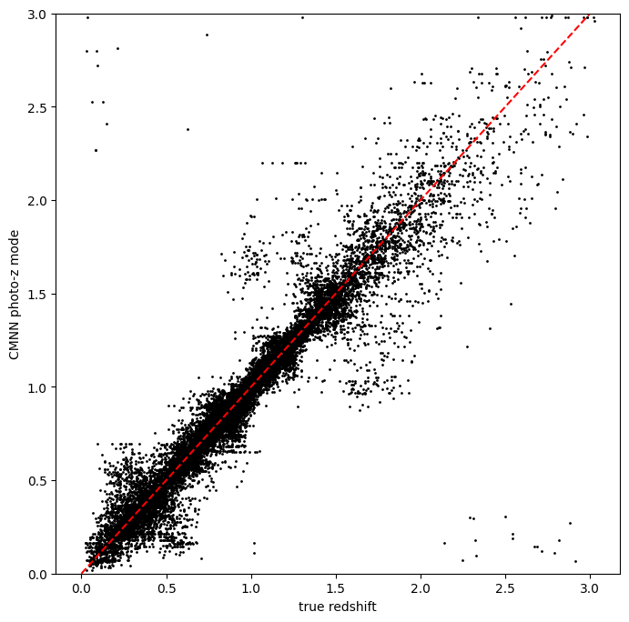
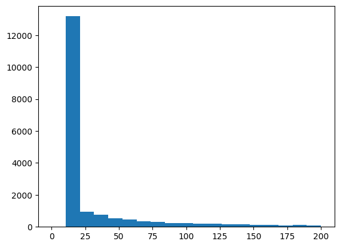
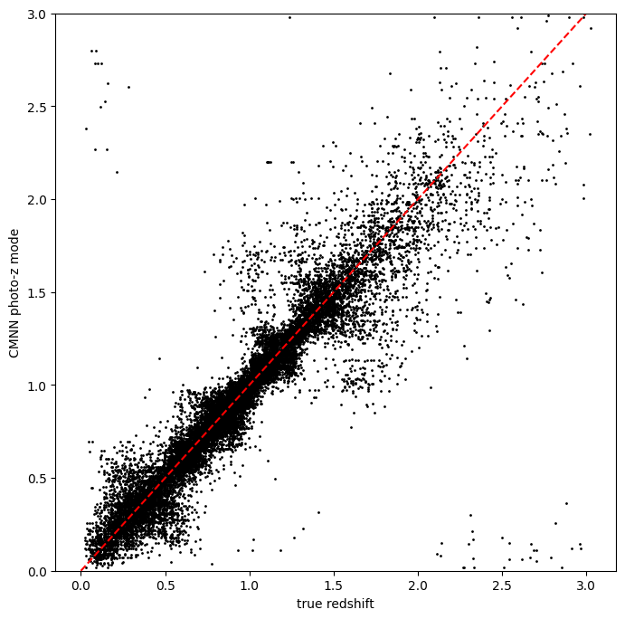
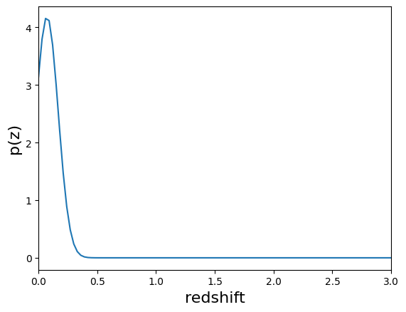
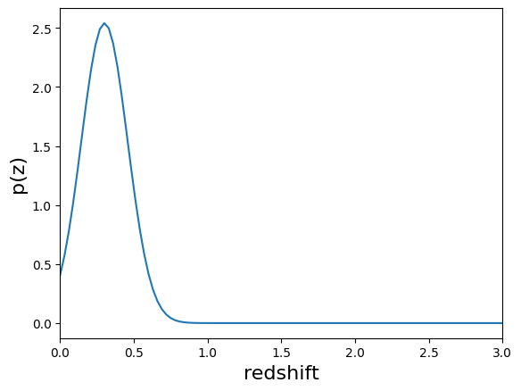
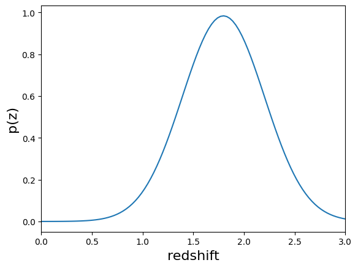

RAIL CMNN Tutorial Notebook
===========================

**Author:** Sam Schmidt

**Last Successfully Run:** Feb 9, 2026

This is a notebook demonstrating some of the features of the LSSTDESC
``RAIL`` version of the CMNN estimator, see `Graham et
al. (2018) <https://ui.adsabs.harvard.edu/abs/2018AJ....155....1G/abstract>`__
for more details on the algorithm.

CMNN stands for color-matched nearest-neighbor, and as this name
implies, the method works by finding the Mahalanobis distance between
each test galaxy and the training galaxies, and selecting one of those
“nearby” in color space as the redshift estimate. The algorithm also
estimates the “width” of the resulting PDF based on the standard
deviation of this nearby set and returns a single Gaussian with a mean
and width defined as such.

The current version of the code consists of a training stage,
``CMNNInformer``, that computes colors for a set of training data and an
estimation stage ``CMNNEstimator`` that calculates the Mahalanobis
distance to each training galaxy for each test galaxy and returns a
single Guassian PDF for each galaxy. The mean value of this Gaussian PDF
can be estimated in one of three ways (see selection mode below), and
the width is determined by the standard deviation of training galaxy
redshifts within the threshold Mahalanobis distance. Future
implementation improvements may change the output format to include
multiple Gaussians.

For the color calculation, there is an option for how to treat the
“non-detections” in a band: the default choice is to ignore any colors
that contain a non-detect magnitude and adjust the number of degrees of
freedom in the Mahalanobis distance accordingly (this is how the CMNN
algorithm was originally implemented). Or, if the configuration
parameter ``nondetect_replace`` is set to ``True`` in ``CMNNInformer``,
the non-detected magnitudes will be replaced with the 1-sigma limiting
magnitude in each band as supplied by the user via the ``mag_limits``
configuration parameter (or by the default 1-sigma limits if the user
does not supply specific numbers). We have not done any exploration of
the relative performance of these two choices, but note that there is
not a significant performance difference in terms of runtime between the
two methods.

In addition to the Gaussian PDF for each test galaxy, two ancillary
quantities are stored: ``zmode``: the mode of the redshift PDF and
``Ncm``, the integer number of “nearby” galaxies considered as neighbors
for each galaxy.

``CMNNInformer`` takes in a training data set and returns a model file
that simply consists of the computed colors and color errors (magnitude
errors added in quadrature) for that dataset, the model to be used in
the ``CMNNEstimator`` stage. A modification of the original CMNN
algorithm, “nondetections” are now replaced by the 1-sigma limiting
magnitudes and the non-detect magnitude errors replaced with a value of
1.0. The config parameters that can be set by the user for
``CMNNInformer`` are:

-  bands: list of the band names that should be present in the input
   data.
-  err_bands: list of the magnitude error column names that should be
   present in the input data.
-  redshift_col: a string giving the name for the redshift column
   present in the input data.
-  mag_limits: a dictionary with keys that match those in bands and a
   float with the 1 sigma limiting magnitude for each band.
-  nondetect_val: float or np.nan, the value indicating a non-detection,
   which will be replaced by the values in mag_limits.
-  nondetect_replace: bool, if set to ``False`` (the default) this
   option ignores colors with non-detected values in the Mahalanobis
   distance calculation, with a corresponding drop in the degrees of
   freedom value. If set to ``True``, the method will replace
   non-detections with the 1-sigma limiting magnitudes specified via
   ``mag_limits`` (or default 1-sigma limits if not supplied), and will
   use all colors in the Mahalanobis distance calculation.

The parameters that can be set via the config_params in
``CMNNEstimator`` are described in brief below:

-  bands, err_bands, redshift_col, mag_limits are all the same as
   described above for CMNNInformer.
-  ppf_value: float, usually 0.68 or 0.95, which sets the value of the
   PPF used in the Mahalanobis distance calculation.
-  selection_mode: int, selects how the central value of the Gaussian
   PDF is calculated in the algorithm, if set to **0** randomly chooses
   from set within the Mahalanobis distance, if set to **1** chooses the
   nearest neighbor point, if set to **2** adds a distance weight to the
   random choice.
-  min_n: int, the minimum number of training galaxies to use.
-  min_thresh: float, the minimum threshold cutoff. Values smaller than
   this threshold value will be ignored.
-  min_dist: float, the minimum Mahalanobis distance. Values smaller
   than this will be ignored.
-  bad_redshift_val: float, in the unlikely case that there are not
   enough training galaxies, this central redshift will be assigned to
   galaxies.
-  bad_redshift_err: float, in the unlikely case that there are not
   enough training galaxies, this Gaussian width will be assigned to
   galaxies.

Let’s grab some example data, train the model by running the
``CMNNInformer`` ``inform`` method, then calculate a set of photo-z’s
using ``CMNNEstimator`` ``estimate``. Much of the following is copied
from the ``Quick_Start_in_Estimation.ipynb`` in the RAIL repo, so look
at that notebook for general questions on setting up the RAIL
infrastructure for estimators.

**Note:** If you’re interested in running this in pipeline mode, see
`04_CMNN.ipynb <https://github.com/LSSTDESC/rail/blob/main/pipeline_examples/estimation_examples/04_CMNN.ipynb>`__
in the ``pipeline_examples/estimation_examples/`` folder.

.. code:: ipython3

    import matplotlib.pyplot as plt
    import numpy as np
    import rail.interactive as ri
    import tables_io
    from rail.utils.path_utils import find_rail_file

.. parsed-literal::

    Install FSPS with the following commands:
    pip uninstall fsps
    git clone --recursive https://github.com/dfm/python-fsps.git
    cd python-fsps
    python -m pip install .
    export SPS_HOME=$(pwd)/src/fsps/libfsps
    
    LEPHAREDIR is being set to the default cache directory:
    /home/runner/.cache/lephare/data
    More than 1Gb may be written there.
    LEPHAREWORK is being set to the default cache directory:
    /home/runner/.cache/lephare/work
    Default work cache is already linked. 
    This is linked to the run directory:
    /home/runner/.cache/lephare/runs/20260330T122231

.. parsed-literal::

    
    A module that was compiled using NumPy 1.x cannot be run in
    NumPy 2.2.6 as it may crash. To support both 1.x and 2.x
    versions of NumPy, modules must be compiled with NumPy 2.0.
    Some module may need to rebuild instead e.g. with 'pybind11>=2.12'.
    
    If you are a user of the module, the easiest solution will be to
    downgrade to 'numpy<2' or try to upgrade the affected module.
    We expect that some modules will need time to support NumPy 2.
    
    Traceback (most recent call last):  File "/opt/hostedtoolcache/Python/3.10.20/x64/lib/python3.10/runpy.py", line 196, in _run_module_as_main
        return _run_code(code, main_globals, None,
      File "/opt/hostedtoolcache/Python/3.10.20/x64/lib/python3.10/runpy.py", line 86, in _run_code
        exec(code, run_globals)
      File "/opt/hostedtoolcache/Python/3.10.20/x64/lib/python3.10/site-packages/ipykernel_launcher.py", line 18, in <module>
        app.launch_new_instance()
      File "/opt/hostedtoolcache/Python/3.10.20/x64/lib/python3.10/site-packages/traitlets/config/application.py", line 1075, in launch_instance
        app.start()
      File "/opt/hostedtoolcache/Python/3.10.20/x64/lib/python3.10/site-packages/ipykernel/kernelapp.py", line 758, in start
        self.io_loop.start()
      File "/opt/hostedtoolcache/Python/3.10.20/x64/lib/python3.10/site-packages/tornado/platform/asyncio.py", line 211, in start
        self.asyncio_loop.run_forever()
      File "/opt/hostedtoolcache/Python/3.10.20/x64/lib/python3.10/asyncio/base_events.py", line 603, in run_forever
        self._run_once()
      File "/opt/hostedtoolcache/Python/3.10.20/x64/lib/python3.10/asyncio/base_events.py", line 1909, in _run_once
        handle._run()
      File "/opt/hostedtoolcache/Python/3.10.20/x64/lib/python3.10/asyncio/events.py", line 80, in _run
        self._context.run(self._callback, *self._args)
      File "/opt/hostedtoolcache/Python/3.10.20/x64/lib/python3.10/site-packages/ipykernel/utils.py", line 71, in preserve_context
        return await f(*args, **kwargs)
      File "/opt/hostedtoolcache/Python/3.10.20/x64/lib/python3.10/site-packages/ipykernel/kernelbase.py", line 621, in shell_main
        await self.dispatch_shell(msg, subshell_id=subshell_id)
      File "/opt/hostedtoolcache/Python/3.10.20/x64/lib/python3.10/site-packages/ipykernel/kernelbase.py", line 478, in dispatch_shell
        await result
      File "/opt/hostedtoolcache/Python/3.10.20/x64/lib/python3.10/site-packages/ipykernel/ipkernel.py", line 372, in execute_request
        await super().execute_request(stream, ident, parent)
      File "/opt/hostedtoolcache/Python/3.10.20/x64/lib/python3.10/site-packages/ipykernel/kernelbase.py", line 834, in execute_request
        reply_content = await reply_content
      File "/opt/hostedtoolcache/Python/3.10.20/x64/lib/python3.10/site-packages/ipykernel/ipkernel.py", line 464, in do_execute
        res = shell.run_cell(
      File "/opt/hostedtoolcache/Python/3.10.20/x64/lib/python3.10/site-packages/ipykernel/zmqshell.py", line 663, in run_cell
        return super().run_cell(*args, **kwargs)
      File "/opt/hostedtoolcache/Python/3.10.20/x64/lib/python3.10/site-packages/IPython/core/interactiveshell.py", line 3077, in run_cell
        result = self._run_cell(
      File "/opt/hostedtoolcache/Python/3.10.20/x64/lib/python3.10/site-packages/IPython/core/interactiveshell.py", line 3132, in _run_cell
        result = runner(coro)
      File "/opt/hostedtoolcache/Python/3.10.20/x64/lib/python3.10/site-packages/IPython/core/async_helpers.py", line 128, in _pseudo_sync_runner
        coro.send(None)
      File "/opt/hostedtoolcache/Python/3.10.20/x64/lib/python3.10/site-packages/IPython/core/interactiveshell.py", line 3336, in run_cell_async
        has_raised = await self.run_ast_nodes(code_ast.body, cell_name,
      File "/opt/hostedtoolcache/Python/3.10.20/x64/lib/python3.10/site-packages/IPython/core/interactiveshell.py", line 3519, in run_ast_nodes
        if await self.run_code(code, result, async_=asy):
      File "/opt/hostedtoolcache/Python/3.10.20/x64/lib/python3.10/site-packages/IPython/core/interactiveshell.py", line 3579, in run_code
        exec(code_obj, self.user_global_ns, self.user_ns)
      File "/tmp/ipykernel_5217/4087826718.py", line 3, in <module>
        import rail.interactive as ri
      File "/opt/hostedtoolcache/Python/3.10.20/x64/lib/python3.10/site-packages/rail/interactive/__init__.py", line 3, in <module>
        from . import calib, creation, estimation, evaluation, tools
      File "/opt/hostedtoolcache/Python/3.10.20/x64/lib/python3.10/site-packages/rail/interactive/calib/__init__.py", line 3, in <module>
        from rail.utils.interactive.initialize_utils import _initialize_interactive_module
      File "/opt/hostedtoolcache/Python/3.10.20/x64/lib/python3.10/site-packages/rail/utils/interactive/initialize_utils.py", line 17, in <module>
        from rail.utils.interactive.base_utils import (
      File "/opt/hostedtoolcache/Python/3.10.20/x64/lib/python3.10/site-packages/rail/utils/interactive/base_utils.py", line 10, in <module>
        rail.stages.import_and_attach_all(silent=True)
      File "/opt/hostedtoolcache/Python/3.10.20/x64/lib/python3.10/site-packages/rail/stages/__init__.py", line 74, in import_and_attach_all
        RailEnv.import_all_packages(silent=silent)
      File "/opt/hostedtoolcache/Python/3.10.20/x64/lib/python3.10/site-packages/rail/core/introspection.py", line 541, in import_all_packages
        _imported_module = importlib.import_module(pkg)
      File "/opt/hostedtoolcache/Python/3.10.20/x64/lib/python3.10/importlib/__init__.py", line 126, in import_module
        return _bootstrap._gcd_import(name[level:], package, level)
      File "/opt/hostedtoolcache/Python/3.10.20/x64/lib/python3.10/site-packages/rail/som/__init__.py", line 1, in <module>
        from rail.creation.degraders.specz_som import *
      File "/opt/hostedtoolcache/Python/3.10.20/x64/lib/python3.10/site-packages/rail/creation/degraders/specz_som.py", line 15, in <module>
        from somoclu import Somoclu
      File "/opt/hostedtoolcache/Python/3.10.20/x64/lib/python3.10/site-packages/somoclu/__init__.py", line 11, in <module>
        from .train import Somoclu
      File "/opt/hostedtoolcache/Python/3.10.20/x64/lib/python3.10/site-packages/somoclu/train.py", line 25, in <module>
        from .somoclu_wrap import train as wrap_train
      File "/opt/hostedtoolcache/Python/3.10.20/x64/lib/python3.10/site-packages/somoclu/somoclu_wrap.py", line 11, in <module>
        import _somoclu_wrap

::

    ---------------------------------------------------------------------------

    ImportError                               Traceback (most recent call last)

    File /opt/hostedtoolcache/Python/3.10.20/x64/lib/python3.10/site-packages/numpy/core/_multiarray_umath.py:44, in __getattr__(attr_name)
         39     # Also print the message (with traceback).  This is because old versions
         40     # of NumPy unfortunately set up the import to replace (and hide) the
         41     # error.  The traceback shouldn't be needed, but e.g. pytest plugins
         42     # seem to swallow it and we should be failing anyway...
         43     sys.stderr.write(msg + tb_msg)
    ---> 44     raise ImportError(msg)
         46 ret = getattr(_multiarray_umath, attr_name, None)
         47 if ret is None:

    ImportError: 
    A module that was compiled using NumPy 1.x cannot be run in
    NumPy 2.2.6 as it may crash. To support both 1.x and 2.x
    versions of NumPy, modules must be compiled with NumPy 2.0.
    Some module may need to rebuild instead e.g. with 'pybind11>=2.12'.
    
    If you are a user of the module, the easiest solution will be to
    downgrade to 'numpy<2' or try to upgrade the affected module.
    We expect that some modules will need time to support NumPy 2.
    

.. parsed-literal::

    Warning: the binary library cannot be imported. You cannot train maps, but you can load and analyze ones that you have already saved.
    The problem occurs because either compilation failed when you installed Somoclu or a path is missing from the dependencies when you are trying to import it. Please refer to the documentation to see your options.

Getting the list of available Estimators
~~~~~~~~~~~~~~~~~~~~~~~~~~~~~~~~~~~~~~~~

RailStage knows about all of the sub-types of stages. The are stored in
the ``RailStage.pipeline_stages`` dict. By looping through the values in
that dict we can and asking if each one is a sub-class of
``rail.estimation.estimator.CatEstimator`` we can identify the available
estimators that operator on catalog-like inputs.

The code-specific parameters
----------------------------

As mentioned above, CMNN has particular configuration options that can
be set when setting up an instance of our ``CMNNInformer`` stage, we’ll
define those in a dictionary. Any parameters not specifically assigned
will take on default values.

.. code:: ipython3

    cmnn_dict = dict(zmin=0.0, zmax=3.0, nzbins=301, hdf5_groupname="photometry")

Now, let’s load our training data, which is stored in hdf5 format. We’ll
load it into the Data Store so that the ceci stages are able to access
it.

.. code:: ipython3

    trainFile = find_rail_file("examples_data/testdata/test_dc2_training_9816.hdf5")
    testFile = find_rail_file("examples_data/testdata/test_dc2_validation_9816.hdf5")
    training_data = tables_io.read(trainFile)
    test_data = tables_io.read(testFile)

We will begin by training the algorithm, to to this we instantiate a
rail object with a call to the base class.

The inform stage for CMNN should not take long to run, it essentially
just converts the magnitudes to colors for the training data and stores
those as a model dictionary which is stored in a pickle file specfied by
the ``model`` keyword above, in this case “demo_cmnn_model.pkl”. This
file should appear in the directory after we run the inform stage in the
cell below:

.. code:: ipython3

    model = ri.estimation.algos.cmnn.cmnn_informer(
        training_data=training_data, **cmnn_dict
    )["model"]

.. parsed-literal::

    Inserting handle into data store.  input: None, CMNNInformer
    Inserting handle into data store.  model: inprogress_model.pkl, CMNNInformer

We can now set up the main photo-z stage and run our algorithm on the
data to produce simple photo-z estimates. We will set
``nondetect_replace`` to ``True`` to replace our non-detection
magnitudes with their 1-sigma limits and use all colors.

Let’s also set the minumum number of neighbors to 24, and the
``selection_mode`` to “1”, which will choose the nearest neighbor for
each galaxy as the redshift estimate:

.. code:: ipython3

    results = ri.estimation.algos.cmnn.cmnn_estimator(
        input_data=test_data,
        model=model,
        hdf5_groupname="photometry",
        min_n=20,
        selection_mode=1,
        nondetect_replace=True,
        aliases={"output": "pz_near"},
    )

.. parsed-literal::

    Inserting handle into data store.  input: None, CMNNEstimator
    Inserting handle into data store.  model: {'train_color': array([[ 1.0794773 ,  0.30747986,  0.14710236,  0.03993225,  0.04247284],
           [ 0.90618706,  0.17555046,  0.09628677,  0.02867889,  0.02067566],
           [ 1.4148846 ,  0.72735214,  0.3970852 ,  0.3592186 ,  0.18297005],
           ...,
           [ 1.0717449 ,  0.28557777,  0.11713791, -0.04490662, -0.07866859],
           [ 1.6134739 ,  0.29800034,  0.18285942, -0.1985035 ,  0.112957  ],
           [ 1.374155  ,  0.5680065 ,  0.09293938,  0.04940796,  0.06501579]],
          shape=(10225, 5), dtype=float32), 'train_err': array([[5.0470888e-05, 7.0723682e-03, 7.0719984e-03, 7.0725773e-03,
            7.0744390e-03],
           [1.1707894e-04, 7.1640075e-03, 7.1581202e-03, 7.2615067e-03,
            7.7885520e-03],
           [1.4984720e-04, 7.1225977e-03, 7.0929667e-03, 7.0982333e-03,
            7.1318364e-03],
           ...,
           [4.0772561e-02, 2.0685915e-02, 1.9685455e-02, 3.1283423e-02,
            7.1648136e-02],
           [6.3544774e-01, 4.6727572e-02, 4.2418279e-02, 7.6403938e-02,
            1.5869458e-01],
           [9.9753356e-01, 6.7530423e-02, 5.3994592e-02, 8.4432341e-02,
            1.7313819e-01]], shape=(10225, 5), dtype=float32), 'truez': array([0.02043499, 0.01936132, 0.03672067, ..., 2.97927326, 2.98694714,
           2.97646626], shape=(10225,)), 'nondet_choice': False}, CMNNEstimator
    Process 0 running estimator on chunk 0 - 20,449
    Process 0 estimating PZ PDF for rows 0 - 20,449

.. parsed-literal::

    Inserting handle into data store.  pz_near: inprogress_pz_near.hdf5, CMNNEstimator

As mentioned above, in addition to the PDF, ``estimate`` calculates and
stores both the mode of the PDF (``zmode``), and the number of neighbors
(``Ncm``) for each galaxy, which can be accessed from the ancillary
data. We will plot the modes vs the true redshift to see how well CMNN
did in estimating redshifts:

.. code:: ipython3

    zmode = results["output"].ancil["zmode"]

Let’s plot the redshift mode against the true redshifts to see how they
look:

.. code:: ipython3

    plt.figure(figsize=(8, 8))
    plt.scatter(
        test_data["photometry"]["redshift"], zmode, s=1, c="k", label="simple NN mode"
    )
    plt.plot([0, 3], [0, 3], "r--")
    plt.xlabel("true redshift")
    plt.ylabel("CMNN photo-z mode")
    plt.ylim(0, 3)

.. parsed-literal::

    (0.0, 3.0)

Very nice! Not many outliers and a fairly small scatter without much
biase!

Now, let’s plot the histogram of how many neighbors were used. We set a
minimum number of 20, so we should see a large peak at that value:

.. code:: ipython3

    ncm = results["output"].ancil["Ncm"]
    plt.hist(ncm, bins=np.linspace(0, 200, 20))

.. parsed-literal::

    (array([    0., 13178.,   955.,   755.,   541.,   467.,   359.,   293.,
              245.,   229.,   188.,   196.,   160.,   146.,   131.,   127.,
              102.,   113.,   103.]),
     array([  0.        ,  10.52631579,  21.05263158,  31.57894737,
             42.10526316,  52.63157895,  63.15789474,  73.68421053,
             84.21052632,  94.73684211, 105.26315789, 115.78947368,
            126.31578947, 136.84210526, 147.36842105, 157.89473684,
            168.42105263, 178.94736842, 189.47368421, 200.        ]),
     <BarContainer object of 19 artists>)

As mentioned previously, we can change the method for how we select the
mean redshift, let’s re-run the estimator but use ``selection_mode`` =
“0”, which will select a random galaxy from amongst the neighbors. This
should still look decent, but perhaps not as nice as the nearest
neighbor estimator:

.. code:: ipython3

    results_rand = ri.estimation.algos.cmnn.cmnn_estimator(
        input_data=test_data,
        hdf5_groupname="photometry",
        model=model,
        min_n=20,
        selection_mode=0,
        nondetect_replace=True,
        aliaes={"output": "pz_rand"},
    )

.. parsed-literal::

    Inserting handle into data store.  input: None, CMNNEstimator
    Inserting handle into data store.  model: {'train_color': array([[ 1.0794773 ,  0.30747986,  0.14710236,  0.03993225,  0.04247284],
           [ 0.90618706,  0.17555046,  0.09628677,  0.02867889,  0.02067566],
           [ 1.4148846 ,  0.72735214,  0.3970852 ,  0.3592186 ,  0.18297005],
           ...,
           [ 1.0717449 ,  0.28557777,  0.11713791, -0.04490662, -0.07866859],
           [ 1.6134739 ,  0.29800034,  0.18285942, -0.1985035 ,  0.112957  ],
           [ 1.374155  ,  0.5680065 ,  0.09293938,  0.04940796,  0.06501579]],
          shape=(10225, 5), dtype=float32), 'train_err': array([[5.0470888e-05, 7.0723682e-03, 7.0719984e-03, 7.0725773e-03,
            7.0744390e-03],
           [1.1707894e-04, 7.1640075e-03, 7.1581202e-03, 7.2615067e-03,
            7.7885520e-03],
           [1.4984720e-04, 7.1225977e-03, 7.0929667e-03, 7.0982333e-03,
            7.1318364e-03],
           ...,
           [4.0772561e-02, 2.0685915e-02, 1.9685455e-02, 3.1283423e-02,
            7.1648136e-02],
           [6.3544774e-01, 4.6727572e-02, 4.2418279e-02, 7.6403938e-02,
            1.5869458e-01],
           [9.9753356e-01, 6.7530423e-02, 5.3994592e-02, 8.4432341e-02,
            1.7313819e-01]], shape=(10225, 5), dtype=float32), 'truez': array([0.02043499, 0.01936132, 0.03672067, ..., 2.97927326, 2.98694714,
           2.97646626], shape=(10225,)), 'nondet_choice': False}, CMNNEstimator
    Process 0 running estimator on chunk 0 - 20,449
    Process 0 estimating PZ PDF for rows 0 - 20,449

.. parsed-literal::

    Inserting handle into data store.  output: inprogress_output.hdf5, CMNNEstimator

.. code:: ipython3

    zmode_rand = results_rand["output"].ancil["zmode"]
    plt.figure(figsize=(8, 8))
    plt.scatter(
        test_data["photometry"]["redshift"],
        zmode_rand,
        s=1,
        c="k",
        label="simple NN mode",
    )
    plt.plot([0, 3], [0, 3], "r--")
    plt.xlabel("true redshift")
    plt.ylabel("CMNN photo-z mode")
    plt.ylim(0, 3)

.. parsed-literal::

    (0.0, 3.0)

Slightly worse, but not dramatically so, a few more outliers are visible
visually. Finally, we can try the weighted random selection by setting
``selection_mode`` to “2”:

.. code:: ipython3

    results_weight = ri.estimation.algos.cmnn.cmnn_estimator(
        input_data=test_data,
        hdf5_groupname="photometry",
        model=model,
        min_n=20,
        selection_mode=2,
        nondetect_replace=True,
        aliaes={"output": "pz_weight"},
    )

.. parsed-literal::

    Inserting handle into data store.  input: None, CMNNEstimator
    Inserting handle into data store.  model: {'train_color': array([[ 1.0794773 ,  0.30747986,  0.14710236,  0.03993225,  0.04247284],
           [ 0.90618706,  0.17555046,  0.09628677,  0.02867889,  0.02067566],
           [ 1.4148846 ,  0.72735214,  0.3970852 ,  0.3592186 ,  0.18297005],
           ...,
           [ 1.0717449 ,  0.28557777,  0.11713791, -0.04490662, -0.07866859],
           [ 1.6134739 ,  0.29800034,  0.18285942, -0.1985035 ,  0.112957  ],
           [ 1.374155  ,  0.5680065 ,  0.09293938,  0.04940796,  0.06501579]],
          shape=(10225, 5), dtype=float32), 'train_err': array([[5.0470888e-05, 7.0723682e-03, 7.0719984e-03, 7.0725773e-03,
            7.0744390e-03],
           [1.1707894e-04, 7.1640075e-03, 7.1581202e-03, 7.2615067e-03,
            7.7885520e-03],
           [1.4984720e-04, 7.1225977e-03, 7.0929667e-03, 7.0982333e-03,
            7.1318364e-03],
           ...,
           [4.0772561e-02, 2.0685915e-02, 1.9685455e-02, 3.1283423e-02,
            7.1648136e-02],
           [6.3544774e-01, 4.6727572e-02, 4.2418279e-02, 7.6403938e-02,
            1.5869458e-01],
           [9.9753356e-01, 6.7530423e-02, 5.3994592e-02, 8.4432341e-02,
            1.7313819e-01]], shape=(10225, 5), dtype=float32), 'truez': array([0.02043499, 0.01936132, 0.03672067, ..., 2.97927326, 2.98694714,
           2.97646626], shape=(10225,)), 'nondet_choice': False}, CMNNEstimator
    Process 0 running estimator on chunk 0 - 20,449
    Process 0 estimating PZ PDF for rows 0 - 20,449

.. parsed-literal::

    Inserting handle into data store.  output: inprogress_output.hdf5, CMNNEstimator

.. code:: ipython3

    zmode_weight = results_weight["output"].ancil["zmode"]
    plt.figure(figsize=(8, 8))
    plt.scatter(
        test_data["photometry"]["redshift"],
        zmode_weight,
        s=1,
        c="k",
        label="simple NN mode",
    )
    plt.plot([0, 3], [0, 3], "r--")
    plt.xlabel("true redshift")
    plt.ylabel("CMNN photo-z mode")
    plt.ylim(0, 3)

.. parsed-literal::

    (0.0, 3.0)

Again, not a dramatic difference, but it can make a difference if there
is sparse coverage of areas of the color-space by the training data,
where choosing “nearest” might choose the same single data point for
many test points, whereas setting to random or weighted random could
slightly “smooth” that choice by forcing choices of other nearby points
for the redshift estimate.

Finally, let’s plot a few PDFs, again, they are a single Gaussian:

.. code:: ipython3

    results["output"].plot_native(key=9, xlim=(0, 3))

.. parsed-literal::

    <Axes: xlabel='redshift', ylabel='p(z)'>

.. code:: ipython3

    results["output"].plot_native(key=1554, xlim=(0, 3))

.. parsed-literal::

    <Axes: xlabel='redshift', ylabel='p(z)'>

.. code:: ipython3

    results["output"].plot_native(key=19554, xlim=(0, 3))

.. parsed-literal::

    <Axes: xlabel='redshift', ylabel='p(z)'>

We see a wide variety of widths, as expected for a single Gaussian
parameterization that must encompass a wide variety of PDF shapes.
