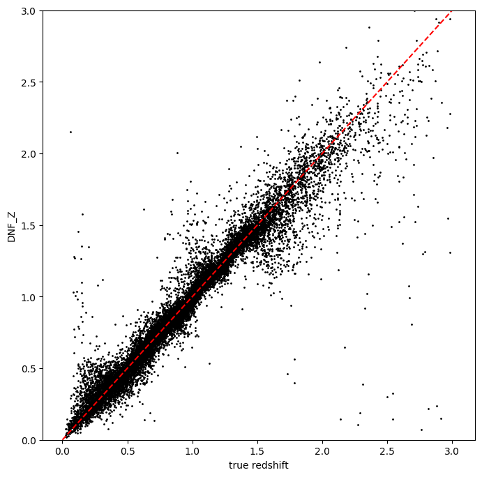
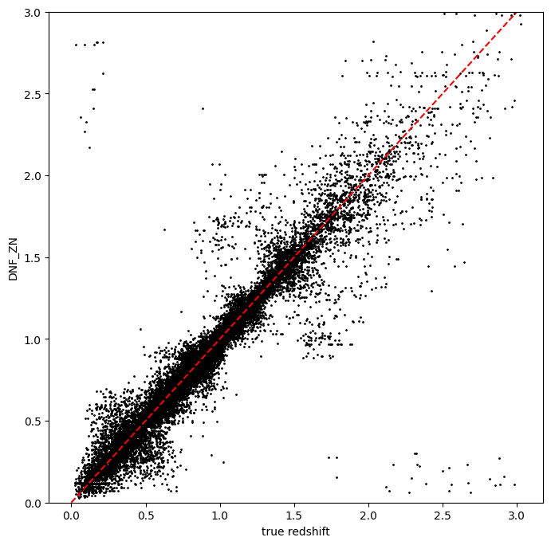
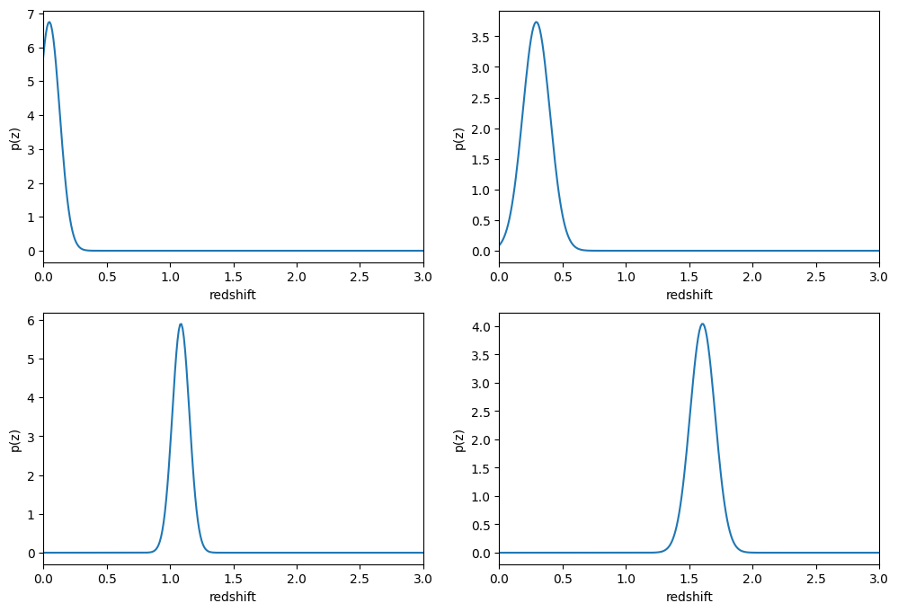
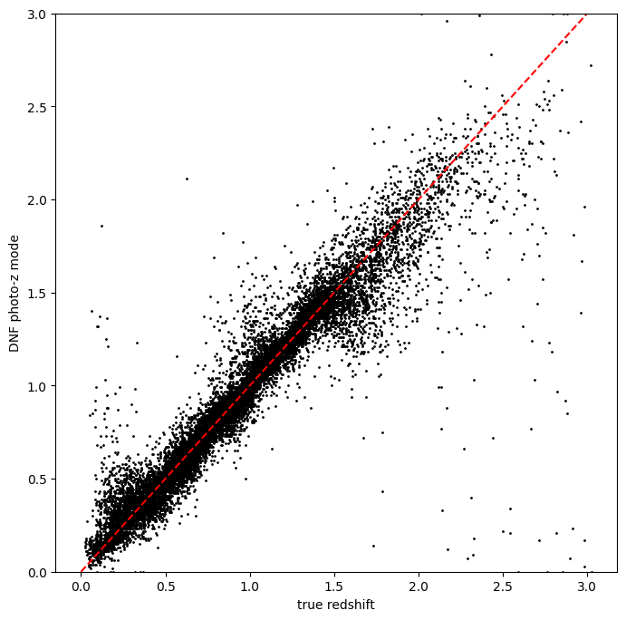
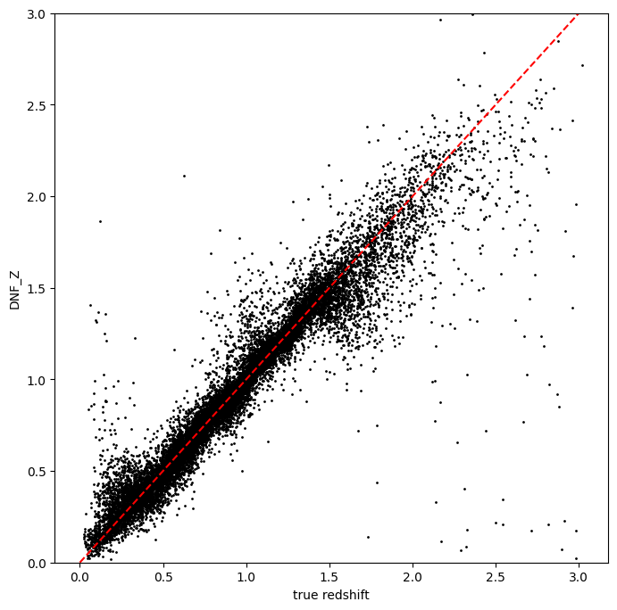
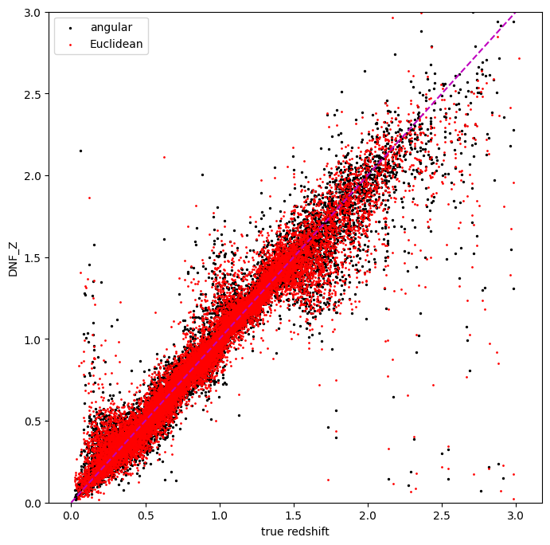
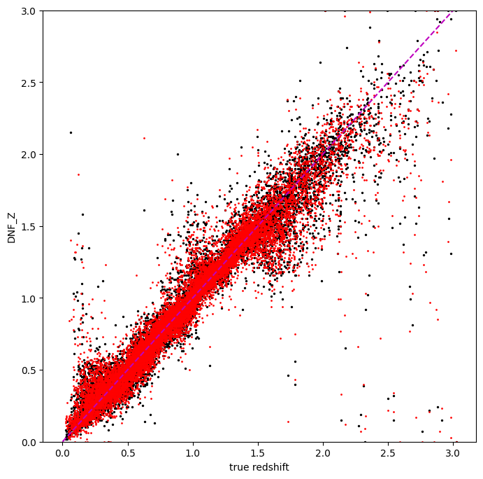
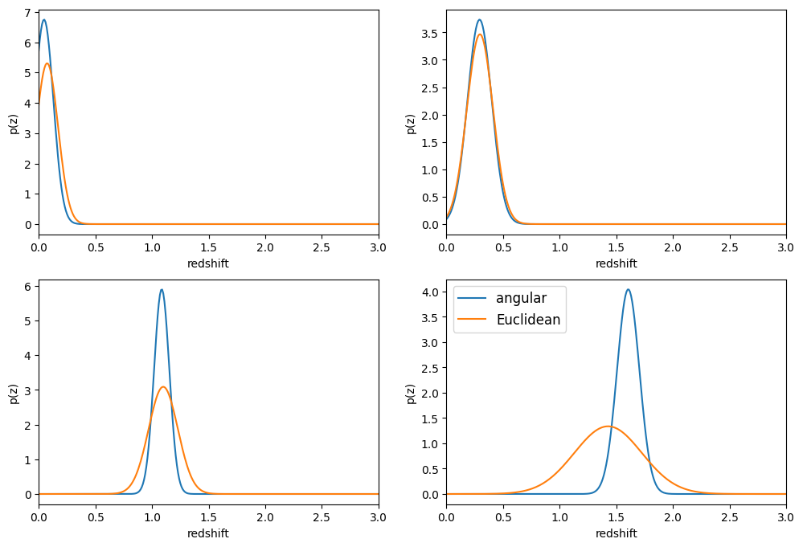

RAIL’s DNF implementation example
=================================

**Authors**: Laura Toribio San Cipriano, Sam Schmidt and Juan De Vicente
**last successfully run**: Feb 9, 2026

This is a notebook demonstrating some of the features of the LSSTDESC
``RAIL`` version of the DNF estimator, see `De Vicente et
al. (2016) <https://arxiv.org/abs/1511.07623>`__ for more details on the
algorithm.

**Note:** If you’re interested in running this in pipeline mode, see
```05_DNF.ipynb`` <https://github.com/LSSTDESC/rail/blob/main/pipeline_examples/estimation_examples/05_DNF.ipynb>`__
in the ``pipeline_examples/estimation_examples/`` folder.

DNF (Directional Neighbourhood Fitting) is a nearest-neighbor approach
for photometric redshift estimation developed at the CIEMAT (Centro de
Investigaciones Energéticas, Medioambientales y Tecnológicas) at Madrid.
DNF computes the photo-z hyperplane that best fits the directional
neighbourhood of a photometric galaxy in the training sample.

The current version of the code for ``RAIL``\ consists of a training
stage, ``DNFInformer`` and a estimation stage ``DNFEstimator``.
``DNFInformer`` is a class that preprocesses the protometric data,
handles missing or non-detected values, and trains a first basic
k-Nearest Neighbors regressor for redshift prediction. The
``DNFEstimator`` calculates photometric redshifts based on an
enhancement of Nearest Neighbor techniques. The class supports three
main metrics for redshift estimation: ENF, ANF or DNF.

-  **ENF**: Euclidean neighbourhood. It’s a common distance metric used
   in kNN (k-Nearest Neighbors) for photometric redshift prediction.
-  **ANF**: uses normalized inner product for more accurate photo-z
   predictions. It is particularly **recommended** when working with
   datasets containing more than four filters.
-  **DNF**: combines Euclidean and angular metrics, improving accuracy,
   especially for larger neighborhoods, and maintaining proportionality
   in observable content.

``DNFInformer``
~~~~~~~~~~~~~~~

The ``DNFInformer`` class processes a training dataset and produces a
model file containing the computed magnitudes, colors, and their
associated errors for the dataset. This model is then utilized in the
``DNFEstimator`` stage for photometric redshift estimation. Missing
photometric detections (non-detections) are handled by replacing them
with a configurable placeholder value, or optionally ignoring them
during model training.

The configurable parameters for ``DNFInformer`` include:

-  ``bands``: List of band names expected in the input dataset.
-  ``err_bands``: List of magnitude error column names corresponding to
   the bands.
-  ``redshift_col``: String indicating the name of the redshift column
   in the input data.
-  ``mag_limits``: Dictionary with band names as keys and floats
   representing the acceptable magnitude range for each band.
-  ``nondetect_val``: Float or np.nan, the value indicating a
   non-detection, which will be replaced by the values in mag_limits.
-  ``replace_nondetect``: Boolean; if True, non-detections are replaced
   with the specified nondetect_val. If False, non-detections are
   ignored during the neighbor-finding process.

``DNFEstimator``
~~~~~~~~~~~~~~~~

The ``DNFEstimator`` class uses the model generated by DNFInformer to
compute photometric redshifts for new datasets and the PDFs. It
identifies the nearest neighbors from the training data using various
distance metrics and estimates redshifts based on these neighbors.

The configurable parameters for ``DNFEstimator`` include:

-  ``bands``, ``err_bands``, ``redshift_col``, ``nondetect_val``,
   ``mag_limits``: As described for ``DNFInformer``.
-  ``selection_mode``: Integer indicating the method for neighbor
   selection:

   -  ``0``: Euclidean Neighbourhood Fitting (ENF).
   -  ``1``: Angular Neighbourhood Fitting (ANF).
   -  ``2``: Directional Neighbourhood Fitting (DNF).

-  ``zmin``, ``zmax``, ``nzbins``: Float values defining the minimum and
   maximum redshift range and the number of bins for estimation of the
   PDFs.
-  ``pdf_estimation``: Boolean; if True, computes a probability density
   function (PDF) for the redshift of each object.

.. code:: ipython3

    import matplotlib.pyplot as plt
    import numpy as np
    import tables_io
    from rail.utils.path_utils import find_rail_file
    
    from rail import interactive as ri


.. parsed-literal::

    Install FSPS with the following commands:
    pip uninstall fsps
    git clone --recursive https://github.com/dfm/python-fsps.git
    cd python-fsps
    python -m pip install .
    export SPS_HOME=$(pwd)/src/fsps/libfsps
    
    LEPHAREDIR is being set to the default cache directory:
    /home/runner/.cache/lephare/data
    More than 1Gb may be written there.
    LEPHAREWORK is being set to the default cache directory:
    /home/runner/.cache/lephare/work
    Default work cache is already linked. 
    This is linked to the run directory:
    /home/runner/.cache/lephare/runs/20260326T203551


.. parsed-literal::

    
    A module that was compiled using NumPy 1.x cannot be run in
    NumPy 2.2.6 as it may crash. To support both 1.x and 2.x
    versions of NumPy, modules must be compiled with NumPy 2.0.
    Some module may need to rebuild instead e.g. with 'pybind11>=2.12'.
    
    If you are a user of the module, the easiest solution will be to
    downgrade to 'numpy<2' or try to upgrade the affected module.
    We expect that some modules will need time to support NumPy 2.
    
    Traceback (most recent call last):  File "/opt/hostedtoolcache/Python/3.10.20/x64/lib/python3.10/runpy.py", line 196, in _run_module_as_main
        return _run_code(code, main_globals, None,
      File "/opt/hostedtoolcache/Python/3.10.20/x64/lib/python3.10/runpy.py", line 86, in _run_code
        exec(code, run_globals)
      File "/opt/hostedtoolcache/Python/3.10.20/x64/lib/python3.10/site-packages/ipykernel_launcher.py", line 18, in <module>
        app.launch_new_instance()
      File "/opt/hostedtoolcache/Python/3.10.20/x64/lib/python3.10/site-packages/traitlets/config/application.py", line 1075, in launch_instance
        app.start()
      File "/opt/hostedtoolcache/Python/3.10.20/x64/lib/python3.10/site-packages/ipykernel/kernelapp.py", line 758, in start
        self.io_loop.start()
      File "/opt/hostedtoolcache/Python/3.10.20/x64/lib/python3.10/site-packages/tornado/platform/asyncio.py", line 211, in start
        self.asyncio_loop.run_forever()
      File "/opt/hostedtoolcache/Python/3.10.20/x64/lib/python3.10/asyncio/base_events.py", line 603, in run_forever
        self._run_once()
      File "/opt/hostedtoolcache/Python/3.10.20/x64/lib/python3.10/asyncio/base_events.py", line 1909, in _run_once
        handle._run()
      File "/opt/hostedtoolcache/Python/3.10.20/x64/lib/python3.10/asyncio/events.py", line 80, in _run
        self._context.run(self._callback, *self._args)
      File "/opt/hostedtoolcache/Python/3.10.20/x64/lib/python3.10/site-packages/ipykernel/utils.py", line 71, in preserve_context
        return await f(*args, **kwargs)
      File "/opt/hostedtoolcache/Python/3.10.20/x64/lib/python3.10/site-packages/ipykernel/kernelbase.py", line 621, in shell_main
        await self.dispatch_shell(msg, subshell_id=subshell_id)
      File "/opt/hostedtoolcache/Python/3.10.20/x64/lib/python3.10/site-packages/ipykernel/kernelbase.py", line 478, in dispatch_shell
        await result
      File "/opt/hostedtoolcache/Python/3.10.20/x64/lib/python3.10/site-packages/ipykernel/ipkernel.py", line 372, in execute_request
        await super().execute_request(stream, ident, parent)
      File "/opt/hostedtoolcache/Python/3.10.20/x64/lib/python3.10/site-packages/ipykernel/kernelbase.py", line 834, in execute_request
        reply_content = await reply_content
      File "/opt/hostedtoolcache/Python/3.10.20/x64/lib/python3.10/site-packages/ipykernel/ipkernel.py", line 464, in do_execute
        res = shell.run_cell(
      File "/opt/hostedtoolcache/Python/3.10.20/x64/lib/python3.10/site-packages/ipykernel/zmqshell.py", line 663, in run_cell
        return super().run_cell(*args, **kwargs)
      File "/opt/hostedtoolcache/Python/3.10.20/x64/lib/python3.10/site-packages/IPython/core/interactiveshell.py", line 3077, in run_cell
        result = self._run_cell(
      File "/opt/hostedtoolcache/Python/3.10.20/x64/lib/python3.10/site-packages/IPython/core/interactiveshell.py", line 3132, in _run_cell
        result = runner(coro)
      File "/opt/hostedtoolcache/Python/3.10.20/x64/lib/python3.10/site-packages/IPython/core/async_helpers.py", line 128, in _pseudo_sync_runner
        coro.send(None)
      File "/opt/hostedtoolcache/Python/3.10.20/x64/lib/python3.10/site-packages/IPython/core/interactiveshell.py", line 3336, in run_cell_async
        has_raised = await self.run_ast_nodes(code_ast.body, cell_name,
      File "/opt/hostedtoolcache/Python/3.10.20/x64/lib/python3.10/site-packages/IPython/core/interactiveshell.py", line 3519, in run_ast_nodes
        if await self.run_code(code, result, async_=asy):
      File "/opt/hostedtoolcache/Python/3.10.20/x64/lib/python3.10/site-packages/IPython/core/interactiveshell.py", line 3579, in run_code
        exec(code_obj, self.user_global_ns, self.user_ns)
      File "/tmp/ipykernel_6813/444981919.py", line 6, in <module>
        from rail import interactive as ri
      File "/opt/hostedtoolcache/Python/3.10.20/x64/lib/python3.10/site-packages/rail/interactive/__init__.py", line 3, in <module>
        from . import calib, creation, estimation, evaluation, tools
      File "/opt/hostedtoolcache/Python/3.10.20/x64/lib/python3.10/site-packages/rail/interactive/calib/__init__.py", line 3, in <module>
        from rail.utils.interactive.initialize_utils import _initialize_interactive_module
      File "/opt/hostedtoolcache/Python/3.10.20/x64/lib/python3.10/site-packages/rail/utils/interactive/initialize_utils.py", line 17, in <module>
        from rail.utils.interactive.base_utils import (
      File "/opt/hostedtoolcache/Python/3.10.20/x64/lib/python3.10/site-packages/rail/utils/interactive/base_utils.py", line 10, in <module>
        rail.stages.import_and_attach_all(silent=True)
      File "/opt/hostedtoolcache/Python/3.10.20/x64/lib/python3.10/site-packages/rail/stages/__init__.py", line 74, in import_and_attach_all
        RailEnv.import_all_packages(silent=silent)
      File "/opt/hostedtoolcache/Python/3.10.20/x64/lib/python3.10/site-packages/rail/core/introspection.py", line 541, in import_all_packages
        _imported_module = importlib.import_module(pkg)
      File "/opt/hostedtoolcache/Python/3.10.20/x64/lib/python3.10/importlib/__init__.py", line 126, in import_module
        return _bootstrap._gcd_import(name[level:], package, level)
      File "/opt/hostedtoolcache/Python/3.10.20/x64/lib/python3.10/site-packages/rail/som/__init__.py", line 1, in <module>
        from rail.creation.degraders.specz_som import *
      File "/opt/hostedtoolcache/Python/3.10.20/x64/lib/python3.10/site-packages/rail/creation/degraders/specz_som.py", line 15, in <module>
        from somoclu import Somoclu
      File "/opt/hostedtoolcache/Python/3.10.20/x64/lib/python3.10/site-packages/somoclu/__init__.py", line 11, in <module>
        from .train import Somoclu
      File "/opt/hostedtoolcache/Python/3.10.20/x64/lib/python3.10/site-packages/somoclu/train.py", line 25, in <module>
        from .somoclu_wrap import train as wrap_train
      File "/opt/hostedtoolcache/Python/3.10.20/x64/lib/python3.10/site-packages/somoclu/somoclu_wrap.py", line 11, in <module>
        import _somoclu_wrap


::


    ---------------------------------------------------------------------------

    ImportError                               Traceback (most recent call last)

    File /opt/hostedtoolcache/Python/3.10.20/x64/lib/python3.10/site-packages/numpy/core/_multiarray_umath.py:44, in __getattr__(attr_name)
         39     # Also print the message (with traceback).  This is because old versions
         40     # of NumPy unfortunately set up the import to replace (and hide) the
         41     # error.  The traceback shouldn't be needed, but e.g. pytest plugins
         42     # seem to swallow it and we should be failing anyway...
         43     sys.stderr.write(msg + tb_msg)
    ---> 44     raise ImportError(msg)
         46 ret = getattr(_multiarray_umath, attr_name, None)
         47 if ret is None:


    ImportError: 
    A module that was compiled using NumPy 1.x cannot be run in
    NumPy 2.2.6 as it may crash. To support both 1.x and 2.x
    versions of NumPy, modules must be compiled with NumPy 2.0.
    Some module may need to rebuild instead e.g. with 'pybind11>=2.12'.
    
    If you are a user of the module, the easiest solution will be to
    downgrade to 'numpy<2' or try to upgrade the affected module.
    We expect that some modules will need time to support NumPy 2.
    


.. parsed-literal::

    Warning: the binary library cannot be imported. You cannot train maps, but you can load and analyze ones that you have already saved.
    The problem occurs because either compilation failed when you installed Somoclu or a path is missing from the dependencies when you are trying to import it. Please refer to the documentation to see your options.


.. code:: ipython3

    trainFile = find_rail_file("examples_data/testdata/test_dc2_training_9816.hdf5")
    testFile = find_rail_file("examples_data/testdata/test_dc2_validation_9816.hdf5")
    training_data = tables_io.read(trainFile)
    test_data = tables_io.read(testFile)

Training the informer
---------------------

You can configure DNF by setting options in a dictionary when
initializing an instance of our ``DNFInformer`` stage. Any parameters
not explicitly defined will use their default values.

.. code:: ipython3

    dnf_dict = dict(zmin=0.0, zmax=3.0, nzbins=301, hdf5_groupname="photometry")

We will begin by training the algorithm, to to this we instantiate a
rail object with a call to the base class.

The inform stage of DNF transforms magnitudes into colors, corrects
undetected values in the training data, and saves them as a model
dictionary.

.. code:: ipython3

    model = ri.estimation.algos.dnf.dnf_informer(training_data=training_data, **dnf_dict)[
        "model"
    ]


.. parsed-literal::

    Inserting handle into data store.  input: None, DNFInformer
    Inserting handle into data store.  model: inprogress_model.pkl, DNFInformer


Run DNF
-------

Now, we can configure the main photo-z stage and run our algorithm on
the data to generate basic photo-z estimates. Keep in mind that we are
loading the trained model obtained from the inform stage using the
statement\ ``model=pz_train.get_handle('model')``. We will set
``nondetect_replace`` to ``True`` to replace non-detection magnitudes
with their 1-sigma limits and utilize all colors.

DNF provides three methods for selecting the distance metric: Euclidean
(“ENF,” set with ``selection_mode`` of ``0``), Angular (“ANF,” set with
``selection_mode = 1``, which is the default for this stage), and
Directional (“DNF,” set with ``selection_mode = 2``).

For our first example, we will set ``selection_mode`` to ``1``, using
the angular distance:

.. code:: ipython3

    results = ri.estimation.algos.dnf.dnf_estimator(
        input_data=test_data,
        hdf5_groupname="photometry",
        model=model,
        selection_mode=1,
        nondetect_replace=True,
    )["output"]


.. parsed-literal::

    using metric ANF
    Inserting handle into data store.  input: None, DNFEstimator
    Inserting handle into data store.  model: {'train_mag': array([[18.040369, 16.960892, 16.653412, 16.50631 , 16.466377, 16.423904],
           [21.61559 , 20.709402, 20.533852, 20.437565, 20.408886, 20.38821 ],
           [21.851952, 20.437067, 19.709715, 19.31263 , 18.953411, 18.770441],
           ...,
           [25.185795, 24.11405 , 23.828472, 23.711334, 23.75624 , 23.83491 ],
           [26.682219, 25.068745, 24.770744, 24.587885, 24.786388, 24.673431],
           [26.926563, 25.552408, 24.984402, 24.891462, 24.842054, 24.777039]],
          shape=(10225, 6), dtype=float32), 'train_err': array([[0.00504562, 0.00500126, 0.00500058, 0.00500074, 0.0050014 ,
            0.00500337],
           [0.00955173, 0.00508365, 0.00504773, 0.00507535, 0.0051933 ,
            0.00580441],
           [0.01114765, 0.00505737, 0.00501542, 0.00501555, 0.00502286,
            0.005063  ],
           ...,
           [0.20123477, 0.01664717, 0.0122792 , 0.0153863 , 0.0272381 ,
            0.0662687 ],
           [0.7962344 , 0.03818999, 0.02692565, 0.03277681, 0.06901625,
            0.14290111],
           [0.99701214, 0.05916394, 0.03255744, 0.04307469, 0.07261812,
            0.15717329]], shape=(10225, 6), dtype=float32), 'truez': array([0.02043499, 0.01936132, 0.03672067, ..., 2.97927326, 2.98694714,
           2.97646626], shape=(10225,)), 'clf': KNeighborsRegressor(), 'train_norm': array([41.277203, 50.671963, 48.664085, ..., 58.977093, 61.49536 ,
           62.070927], shape=(10225,), dtype=float32)}, DNFEstimator
    Process 0 running estimator on chunk 0 - 20,449
    Process 0 estimating PZ PDF for rows 0 - 20,449


.. parsed-literal::

    /opt/hostedtoolcache/Python/3.10.20/x64/lib/python3.10/site-packages/rail/estimation/algos/dnf.py:488: RuntimeWarning: invalid value encountered in sqrt
      alpha = np.sqrt(1.0 - NIP**2)


.. parsed-literal::

    /opt/hostedtoolcache/Python/3.10.20/x64/lib/python3.10/site-packages/rail/estimation/algos/dnf.py:529: RuntimeWarning: divide by zero encountered in divide
      inverse_distances = 1.0 / distances
    /opt/hostedtoolcache/Python/3.10.20/x64/lib/python3.10/site-packages/rail/estimation/algos/dnf.py:537: RuntimeWarning: invalid value encountered in divide
      wmatrix = inverse_distances / row_sum


.. parsed-literal::

    Inserting handle into data store.  output: inprogress_output.hdf5, DNFEstimator


DNF calculates its own point estimate, ``DNF_Z``, which is stored in the
qp Ensemble ``ancil`` data. Also, DNF calculates other photo-zs called
``DNF_ZN``.

-  ``DNF_Z`` represents the photometric redshift for each galaxy
   computed as the weighted average or hyperplane fit (depending on the
   option selected) for a set of neighbors determined by a specific
   metric (ENF, ANF, DNF) where the outliers are removed

-  ``DNF_ZN`` represents the photometric redshift using only the closest
   neighbor. It is mainly used for computing the redshift distributions.

Let’s plot that versus the true redshift. We can also compute the PDF
mode for each object and plot that as well:

.. code:: ipython3

    zdnf = results.ancil["DNF_Z"].flatten()

.. code:: ipython3

    zn_dnf = results.ancil["DNF_ZN"].flatten()

.. code:: ipython3

    zgrid = np.linspace(0, 3, 301)
    zmode = results.mode(zgrid).flatten()

.. code:: ipython3

    zmode


.. parsed-literal::

    array([0.08, 0.03, 0.03, ..., 3.  , 2.94, 3.  ], shape=(20449,))


Let’s plot the redshift mode against the true redshifts to see how they
look:

.. code:: ipython3

    plt.figure(figsize=(8, 8))
    plt.scatter(test_data["photometry"]["redshift"], zmode, s=1, c="k", label="DNF mode")
    plt.plot([0, 3], [0, 3], "r--")
    plt.xlabel("true redshift")
    plt.ylabel("DNF photo-z mode")
    plt.ylim(0, 3)


.. parsed-literal::

    (0.0, 3.0)


.. code:: ipython3

    plt.figure(figsize=(8, 8))
    plt.scatter(test_data["photometry"]["redshift"], zdnf, s=1, c="k")
    plt.plot([0, 3], [0, 3], "r--")
    plt.xlabel("true redshift")
    plt.ylabel("DNF_Z")
    plt.ylim(0, 3)


.. parsed-literal::

    (0.0, 3.0)





.. code:: ipython3

    plt.figure(figsize=(8, 8))
    plt.scatter(test_data["photometry"]["redshift"], zn_dnf, s=1, c="k")
    plt.plot([0, 3], [0, 3], "r--")
    plt.xlabel("true redshift")
    plt.ylabel("DNF_ZN")
    plt.ylim(0, 3)


.. parsed-literal::

    (0.0, 3.0)





plotting PDFs
-------------

In addition to point estimates, we can also plot a few of the full PDFs
produced by DNF using the ``plot_native`` method of the qp Ensemble that
we’ve created as ``results``. We can specify which PDF to plot with the
``key`` argument to ``plot_native``, let’s plot four, the 5th, 1380th,
14481st, and 18871st:

.. code:: ipython3

    fig, axs = plt.subplots(2, 2, figsize=(12, 8))
    whichgals = [4, 1379, 14480, 18870]
    for ax, which in zip(axs.flat, whichgals):
        ax.set_xlim(0, 3)
        results.plot_native(key=which, axes=ax)
        ax.set_xlabel("redshift")
        ax.set_ylabel("p(z)")





Other distance metrics
======================

Besides DNF there are options for ENF and ANF.

Let’s run our estimator using ``selection_mode=0`` for the Euclidean
distance, and compare both the mode results and PDF results:

.. code:: ipython3

    results2 = ri.estimation.algos.dnf.dnf_estimator(
        input_data=test_data,
        hdf5_groupname="photometry",
        model=model,
        selection_mode=0,
        nondetect_replace=True,
    )


.. parsed-literal::

    using metric ENF
    Inserting handle into data store.  input: None, DNFEstimator
    Inserting handle into data store.  model: {'train_mag': array([[18.040369, 16.960892, 16.653412, 16.50631 , 16.466377, 16.423904],
           [21.61559 , 20.709402, 20.533852, 20.437565, 20.408886, 20.38821 ],
           [21.851952, 20.437067, 19.709715, 19.31263 , 18.953411, 18.770441],
           ...,
           [25.185795, 24.11405 , 23.828472, 23.711334, 23.75624 , 23.83491 ],
           [26.682219, 25.068745, 24.770744, 24.587885, 24.786388, 24.673431],
           [26.926563, 25.552408, 24.984402, 24.891462, 24.842054, 24.777039]],
          shape=(10225, 6), dtype=float32), 'train_err': array([[0.00504562, 0.00500126, 0.00500058, 0.00500074, 0.0050014 ,
            0.00500337],
           [0.00955173, 0.00508365, 0.00504773, 0.00507535, 0.0051933 ,
            0.00580441],
           [0.01114765, 0.00505737, 0.00501542, 0.00501555, 0.00502286,
            0.005063  ],
           ...,
           [0.20123477, 0.01664717, 0.0122792 , 0.0153863 , 0.0272381 ,
            0.0662687 ],
           [0.7962344 , 0.03818999, 0.02692565, 0.03277681, 0.06901625,
            0.14290111],
           [0.99701214, 0.05916394, 0.03255744, 0.04307469, 0.07261812,
            0.15717329]], shape=(10225, 6), dtype=float32), 'truez': array([0.02043499, 0.01936132, 0.03672067, ..., 2.97927326, 2.98694714,
           2.97646626], shape=(10225,)), 'clf': KNeighborsRegressor(), 'train_norm': array([41.277203, 50.671963, 48.664085, ..., 58.977093, 61.49536 ,
           62.070927], shape=(10225,), dtype=float32)}, DNFEstimator
    Process 0 running estimator on chunk 0 - 20,449
    Process 0 estimating PZ PDF for rows 0 - 20,449


.. parsed-literal::

    Inserting handle into data store.  output: inprogress_output.hdf5, DNFEstimator


.. code:: ipython3

    zdnf2 = results2["output"].ancil["DNF_Z"].flatten()

.. code:: ipython3

    zgrid = np.linspace(0, 3, 301)
    zmode2 = results2["output"].mode(zgrid).flatten()

.. code:: ipython3

    plt.figure(figsize=(8, 8))
    plt.scatter(test_data["photometry"]["redshift"], zmode2, s=1, c="k", label="DNF mode")
    plt.plot([0, 3], [0, 3], "r--")
    plt.xlabel("true redshift")
    plt.ylabel("DNF photo-z mode")
    plt.ylim(0, 3)


.. parsed-literal::

    (0.0, 3.0)





.. code:: ipython3

    plt.figure(figsize=(8, 8))
    plt.scatter(test_data["photometry"]["redshift"], zdnf2, s=1, c="k")
    plt.plot([0, 3], [0, 3], "r--")
    plt.xlabel("true redshift")
    plt.ylabel("DNF_Z")
    plt.ylim(0, 3)


.. parsed-literal::

    (0.0, 3.0)





Let’s directly compare the “angular” and “Euclidean” distance estimates
on the same axes:

.. code:: ipython3

    plt.figure(figsize=(8, 8))
    plt.scatter(test_data["photometry"]["redshift"], zdnf, s=2, c="k", label="angular")
    plt.scatter(test_data["photometry"]["redshift"], zdnf2, s=1, c="r", label="Euclidean")
    plt.legend(loc="upper left", fontsize=10)
    plt.plot([0, 3], [0, 3], "m--")
    plt.xlabel("true redshift")
    plt.ylabel("DNF_Z")
    plt.ylim(0, 3)


.. parsed-literal::

    (0.0, 3.0)





.. code:: ipython3

    plt.figure(figsize=(8, 8))
    plt.scatter(test_data["photometry"]["redshift"], zmode, s=2, c="k")
    plt.scatter(test_data["photometry"]["redshift"], zmode2, s=1, c="r")
    plt.plot([0, 3], [0, 3], "m--")
    plt.xlabel("true redshift")
    plt.ylabel("DNF_Z")
    plt.ylim(0, 3)


.. parsed-literal::

    (0.0, 3.0)





Finally, let’s directly compare the same PDFs that we plotted above

.. code:: ipython3

    fig, axs = plt.subplots(2, 2, figsize=(12, 8))
    whichgals = [4, 1379, 14480, 18870]
    for ax, which in zip(axs.flat, whichgals):
        ax.set_xlim(0, 3)
        results.plot_native(key=which, axes=ax, label="angular")
        results2["output"].plot_native(key=which, axes=ax, label="Euclidean")
        ax.set_xlabel("redshift")
        ax.set_ylabel("p(z)")
    ax.legend(loc="upper left", fontsize=12)


.. parsed-literal::

    <matplotlib.legend.Legend at 0x7f61a7e119c0>




