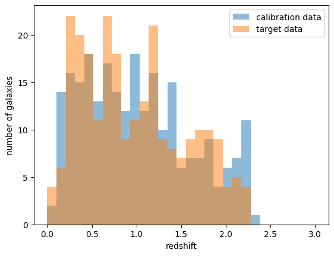
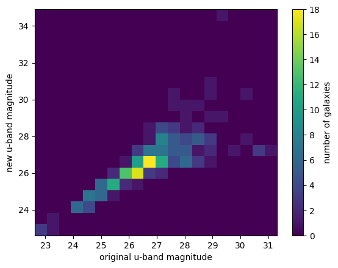
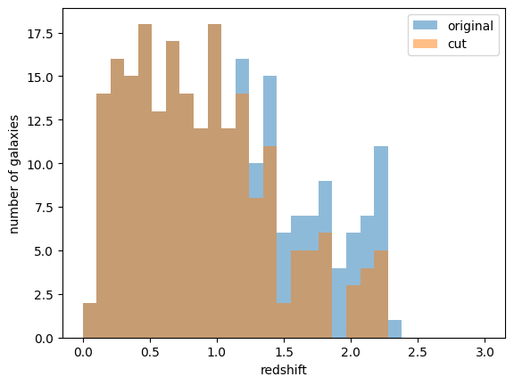
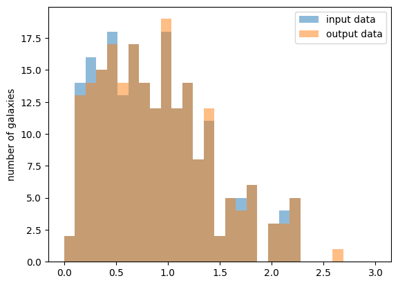
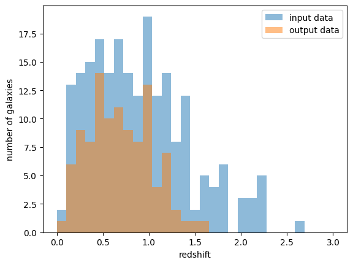
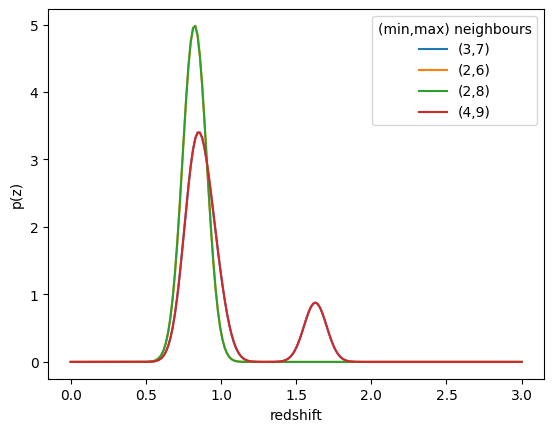
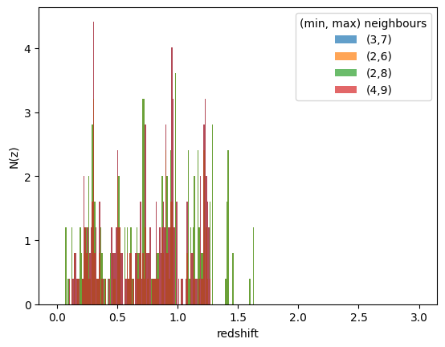
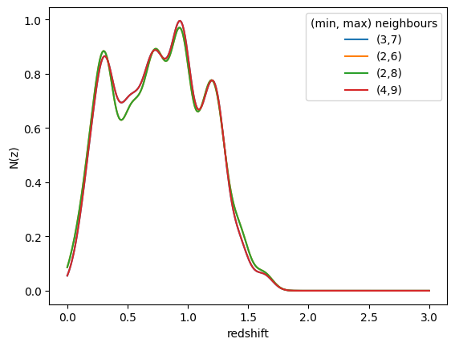
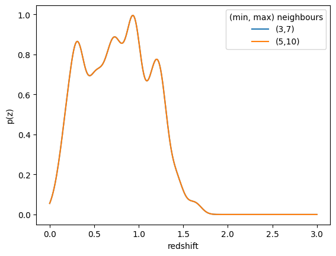

Estimating photometric redshifts with RAIL stages and comparing results for different parameters
================================================================================================

**Authors:** Jennifer Scora, Tai Withers, Mubdi Rahman

**Last run successfully:** Feb 9, 2026

This notebook shows how to run through the various `stages of
RAIL <https://rail-hub.readthedocs.io/en/latest/source/rail_stages/what_are_rail_stages.html>`__
(creation, estimation, evaluation) in order to create a simulated
dataset of galaxy magnitudes and redshifts, use the magnitudes to
estimate photometric redshifts, and then compare the resulting estimated
photometric redshifts to the *true* redshifts. We will be using the
`K-Nearest Neighbour
algorithm <https://rail-hub.readthedocs.io/en/latest/source/rail_stages/estimation.html#k-nearest-neighbor>`__
(KNN) to estimate redshifts, and testing out how the limits on the
number of nearest neighbours affect the resulting esimated redshift
distributions.

To do this, we loop over the estimation and evaluation stages while
varying these parameters to test their effect. We will also then be
exploring how we can parallelize this loop within the notebook to speed
things up a little. However, if you are running on very large datasets,
we recommend running in pipeline mode instead (see instructions
`here <https://rail-hub.readthedocs.io/en/latest/source/user_guide/pipeline_usage.html>`__),
as it is not possible to loop over large files with the interactive mode
of RAIL.

Here are the steps that we’re going to cover in this notebook:

1. Creating a realistic data set of galaxy magnitudes and true redshifts
2. Estimating the photometric redshifts
3. Summarizing the redshift distributions
4. Evaluating the photometric redshifts against the *true* values
5. Repeating steps 2-4 with a parallelized loop

Before we get started, here’s a quick introduction to some of the
features of RAIL interactive mode. The only RAIL package you need to
import is the ``rail.interactive`` package. This contains all of the
interactive functions for all of the RAIL algorithms. You may need to
import supporting functions that are not part of a stage separately. To
get a sense of what functions/stages are available and for some more
detailed instructions, see `the RAIL
documentation <https://rail-hub.readthedocs.io/en/latest/source/user_guide/interactive_usage.html>`__.

.. code:: ipython3

    # import the packages we'll need
    import rail.interactive as ri


.. parsed-literal::

    Install FSPS with the following commands:
    pip uninstall fsps
    git clone --recursive https://github.com/dfm/python-fsps.git
    cd python-fsps
    python -m pip install .
    export SPS_HOME=$(pwd)/src/fsps/libfsps
    
    LEPHAREDIR is being set to the default cache directory:
    /home/runner/.cache/lephare/data
    More than 1Gb may be written there.
    LEPHAREWORK is being set to the default cache directory:
    /home/runner/.cache/lephare/work
    Default work cache is already linked. 
    This is linked to the run directory:
    /home/runner/.cache/lephare/runs/20260504T123336


.. parsed-literal::

    
    A module that was compiled using NumPy 1.x cannot be run in
    NumPy 2.2.6 as it may crash. To support both 1.x and 2.x
    versions of NumPy, modules must be compiled with NumPy 2.0.
    Some module may need to rebuild instead e.g. with 'pybind11>=2.12'.
    
    If you are a user of the module, the easiest solution will be to
    downgrade to 'numpy<2' or try to upgrade the affected module.
    We expect that some modules will need time to support NumPy 2.
    
    Traceback (most recent call last):  File "/opt/hostedtoolcache/Python/3.10.20/x64/lib/python3.10/runpy.py", line 196, in _run_module_as_main
        return _run_code(code, main_globals, None,
      File "/opt/hostedtoolcache/Python/3.10.20/x64/lib/python3.10/runpy.py", line 86, in _run_code
        exec(code, run_globals)
      File "/opt/hostedtoolcache/Python/3.10.20/x64/lib/python3.10/site-packages/ipykernel_launcher.py", line 18, in <module>
        app.launch_new_instance()
      File "/opt/hostedtoolcache/Python/3.10.20/x64/lib/python3.10/site-packages/traitlets/config/application.py", line 1075, in launch_instance
        app.start()
      File "/opt/hostedtoolcache/Python/3.10.20/x64/lib/python3.10/site-packages/ipykernel/kernelapp.py", line 758, in start
        self.io_loop.start()
      File "/opt/hostedtoolcache/Python/3.10.20/x64/lib/python3.10/site-packages/tornado/platform/asyncio.py", line 211, in start
        self.asyncio_loop.run_forever()
      File "/opt/hostedtoolcache/Python/3.10.20/x64/lib/python3.10/asyncio/base_events.py", line 603, in run_forever
        self._run_once()
      File "/opt/hostedtoolcache/Python/3.10.20/x64/lib/python3.10/asyncio/base_events.py", line 1909, in _run_once
        handle._run()
      File "/opt/hostedtoolcache/Python/3.10.20/x64/lib/python3.10/asyncio/events.py", line 80, in _run
        self._context.run(self._callback, *self._args)
      File "/opt/hostedtoolcache/Python/3.10.20/x64/lib/python3.10/site-packages/ipykernel/utils.py", line 71, in preserve_context
        return await f(*args, **kwargs)
      File "/opt/hostedtoolcache/Python/3.10.20/x64/lib/python3.10/site-packages/ipykernel/kernelbase.py", line 621, in shell_main
        await self.dispatch_shell(msg, subshell_id=subshell_id)
      File "/opt/hostedtoolcache/Python/3.10.20/x64/lib/python3.10/site-packages/ipykernel/kernelbase.py", line 478, in dispatch_shell
        await result
      File "/opt/hostedtoolcache/Python/3.10.20/x64/lib/python3.10/site-packages/ipykernel/ipkernel.py", line 372, in execute_request
        await super().execute_request(stream, ident, parent)
      File "/opt/hostedtoolcache/Python/3.10.20/x64/lib/python3.10/site-packages/ipykernel/kernelbase.py", line 834, in execute_request
        reply_content = await reply_content
      File "/opt/hostedtoolcache/Python/3.10.20/x64/lib/python3.10/site-packages/ipykernel/ipkernel.py", line 464, in do_execute
        res = shell.run_cell(
      File "/opt/hostedtoolcache/Python/3.10.20/x64/lib/python3.10/site-packages/ipykernel/zmqshell.py", line 663, in run_cell
        return super().run_cell(*args, **kwargs)
      File "/opt/hostedtoolcache/Python/3.10.20/x64/lib/python3.10/site-packages/IPython/core/interactiveshell.py", line 3077, in run_cell
        result = self._run_cell(
      File "/opt/hostedtoolcache/Python/3.10.20/x64/lib/python3.10/site-packages/IPython/core/interactiveshell.py", line 3132, in _run_cell
        result = runner(coro)
      File "/opt/hostedtoolcache/Python/3.10.20/x64/lib/python3.10/site-packages/IPython/core/async_helpers.py", line 128, in _pseudo_sync_runner
        coro.send(None)
      File "/opt/hostedtoolcache/Python/3.10.20/x64/lib/python3.10/site-packages/IPython/core/interactiveshell.py", line 3336, in run_cell_async
        has_raised = await self.run_ast_nodes(code_ast.body, cell_name,
      File "/opt/hostedtoolcache/Python/3.10.20/x64/lib/python3.10/site-packages/IPython/core/interactiveshell.py", line 3519, in run_ast_nodes
        if await self.run_code(code, result, async_=asy):
      File "/opt/hostedtoolcache/Python/3.10.20/x64/lib/python3.10/site-packages/IPython/core/interactiveshell.py", line 3579, in run_code
        exec(code_obj, self.user_global_ns, self.user_ns)
      File "/tmp/ipykernel_6213/3510305779.py", line 2, in <module>
        import rail.interactive as ri
      File "/opt/hostedtoolcache/Python/3.10.20/x64/lib/python3.10/site-packages/rail/interactive/__init__.py", line 3, in <module>
        from . import calib, creation, estimation, evaluation, tools
      File "/opt/hostedtoolcache/Python/3.10.20/x64/lib/python3.10/site-packages/rail/interactive/calib/__init__.py", line 3, in <module>
        from rail.utils.interactive.initialize_utils import _initialize_interactive_module
      File "/opt/hostedtoolcache/Python/3.10.20/x64/lib/python3.10/site-packages/rail/utils/interactive/initialize_utils.py", line 17, in <module>
        from rail.utils.interactive.base_utils import (
      File "/opt/hostedtoolcache/Python/3.10.20/x64/lib/python3.10/site-packages/rail/utils/interactive/base_utils.py", line 10, in <module>
        rail.stages.import_and_attach_all(silent=True)
      File "/opt/hostedtoolcache/Python/3.10.20/x64/lib/python3.10/site-packages/rail/stages/__init__.py", line 74, in import_and_attach_all
        RailEnv.import_all_packages(silent=silent)
      File "/opt/hostedtoolcache/Python/3.10.20/x64/lib/python3.10/site-packages/rail/core/introspection.py", line 541, in import_all_packages
        _imported_module = importlib.import_module(pkg)
      File "/opt/hostedtoolcache/Python/3.10.20/x64/lib/python3.10/importlib/__init__.py", line 126, in import_module
        return _bootstrap._gcd_import(name[level:], package, level)
      File "/opt/hostedtoolcache/Python/3.10.20/x64/lib/python3.10/site-packages/rail/som/__init__.py", line 1, in <module>
        from rail.creation.degraders.specz_som import *
      File "/opt/hostedtoolcache/Python/3.10.20/x64/lib/python3.10/site-packages/rail/creation/degraders/specz_som.py", line 15, in <module>
        from somoclu import Somoclu
      File "/opt/hostedtoolcache/Python/3.10.20/x64/lib/python3.10/site-packages/somoclu/__init__.py", line 11, in <module>
        from .train import Somoclu
      File "/opt/hostedtoolcache/Python/3.10.20/x64/lib/python3.10/site-packages/somoclu/train.py", line 25, in <module>
        from .somoclu_wrap import train as wrap_train
      File "/opt/hostedtoolcache/Python/3.10.20/x64/lib/python3.10/site-packages/somoclu/somoclu_wrap.py", line 11, in <module>
        import _somoclu_wrap


::


    ---------------------------------------------------------------------------

    ImportError                               Traceback (most recent call last)

    File /opt/hostedtoolcache/Python/3.10.20/x64/lib/python3.10/site-packages/numpy/core/_multiarray_umath.py:44, in __getattr__(attr_name)
         39     # Also print the message (with traceback).  This is because old versions
         40     # of NumPy unfortunately set up the import to replace (and hide) the
         41     # error.  The traceback shouldn't be needed, but e.g. pytest plugins
         42     # seem to swallow it and we should be failing anyway...
         43     sys.stderr.write(msg + tb_msg)
    ---> 44     raise ImportError(msg)
         46 ret = getattr(_multiarray_umath, attr_name, None)
         47 if ret is None:


    ImportError: 
    A module that was compiled using NumPy 1.x cannot be run in
    NumPy 2.2.6 as it may crash. To support both 1.x and 2.x
    versions of NumPy, modules must be compiled with NumPy 2.0.
    Some module may need to rebuild instead e.g. with 'pybind11>=2.12'.
    
    If you are a user of the module, the easiest solution will be to
    downgrade to 'numpy<2' or try to upgrade the affected module.
    We expect that some modules will need time to support NumPy 2.
    


.. parsed-literal::

    Warning: the binary library cannot be imported. You cannot train maps, but you can load and analyze ones that you have already saved.
    The problem occurs because either compilation failed when you installed Somoclu or a path is missing from the dependencies when you are trying to import it. Please refer to the documentation to see your options.


To get the docstrings for a function, including what parameters it needs
and what it returns, you can just put a question mark after the function
call or use the ``help()`` function, as you would with any python
function.

.. code:: ipython3

    ri.creation.engines.flowEngine.flow_modeler?

1. Creating a realistic data set of galaxy magnitudes and true redshifts
------------------------------------------------------------------------

First we want to create the data sets of galaxy magnitudes that we will
use to estimate photometric redshifts. We will use the `PZflow
algorithm <https://rail-hub.readthedocs.io/en/latest/source/rail_stages/creation.html#pzflow-engine>`__,
which is a machine-learning algorithm, to generate our model. Then we
pull two data sets from the model, a calibration dataset and a target
dataset. The calibration data set will be used to calibrate our models,
and the target data is what we’ll get photo-z estimates for. We’ll then
degrade these datasets so that they better resemble real data from the
Rubin telescope.

.. code:: ipython3

    # importing some supplementary packages and functions
    import numpy as np
    from pzflow.examples import get_galaxy_data
    
    # plotting imports
    import matplotlib.pyplot as plt
    
    %matplotlib inline

Here we first need to set up some column name dictionaries, as the
expected column names vary between some of the codes. In order to handle
this, we can pass in dictionaries of expected column names and the
column name that exists in the input data (``band_dict`` and
``rename_dict`` below). In this notebook, we are using bands ugrizy, and
each band will have a name ‘mag_u_lsst’, for example, with the error
column name being ‘mag_err_u_lsst’.

The initial data we pull from our model won’t have any associated
errors. Those will be created when we degrade the datasets, but the
error columns will need to be renamed with the ``rename_dict`` later on.

.. code:: ipython3

    bands = ["u", "g", "r", "i", "z", "y"]
    band_dict = {band: f"mag_{band}_lsst" for band in bands}
    rename_dict = {f"mag_{band}_lsst_err": f"mag_err_{band}_lsst" for band in bands}

In order to generate the model with PZflow, we need to grab some sample
data to base the model off of. This sample data is only used to create
the model, and is seperate from the training and test data we’ll get
from the model later. We’ll rename the band columns in this data table
to match our desired band names as discussed above, using ``band_dict``.
We can check that our columns have been renamed appropriately by
printing out the first few lines of the table:

.. code:: ipython3

    catalog = get_galaxy_data().rename(band_dict, axis=1)
    # let's take a look at the columns
    catalog.head()


.. raw:: html

    <div>
    <style scoped>
        .dataframe tbody tr th:only-of-type {
            vertical-align: middle;
        }
    
        .dataframe tbody tr th {
            vertical-align: top;
        }
    
        .dataframe thead th {
            text-align: right;
        }
    </style>
    <table border="1" class="dataframe">
      <thead>
        <tr style="text-align: right;">
          <th></th>
          <th>redshift</th>
          <th>mag_u_lsst</th>
          <th>mag_g_lsst</th>
          <th>mag_r_lsst</th>
          <th>mag_i_lsst</th>
          <th>mag_z_lsst</th>
          <th>mag_y_lsst</th>
        </tr>
      </thead>
      <tbody>
        <tr>
          <th>0</th>
          <td>0.287087</td>
          <td>26.759261</td>
          <td>25.901778</td>
          <td>25.187710</td>
          <td>24.932318</td>
          <td>24.736903</td>
          <td>24.671623</td>
        </tr>
        <tr>
          <th>1</th>
          <td>0.293313</td>
          <td>27.428358</td>
          <td>26.679299</td>
          <td>25.977161</td>
          <td>25.700094</td>
          <td>25.522763</td>
          <td>25.417632</td>
        </tr>
        <tr>
          <th>2</th>
          <td>1.497276</td>
          <td>27.294001</td>
          <td>26.068798</td>
          <td>25.450055</td>
          <td>24.460507</td>
          <td>23.887221</td>
          <td>23.206112</td>
        </tr>
        <tr>
          <th>3</th>
          <td>0.283310</td>
          <td>28.154075</td>
          <td>26.283166</td>
          <td>24.599570</td>
          <td>23.723491</td>
          <td>23.214108</td>
          <td>22.860012</td>
        </tr>
        <tr>
          <th>4</th>
          <td>1.545183</td>
          <td>29.276065</td>
          <td>27.878301</td>
          <td>27.333528</td>
          <td>26.543374</td>
          <td>26.061941</td>
          <td>25.383056</td>
        </tr>
      </tbody>
    </table>
    </div>


Looks like the column names are the way we want them!

Calibrate and sample the model
~~~~~~~~~~~~~~~~~~~~~~~~~~~~~~

Now we need to use the galaxy data we retrieved to calibrate the model
that we’ll use to create our input galaxy magnitude data catalogues
later. We’re going to use the ``PZflow`` engine to do this, specifically
the ``modeler`` function. This will train the normalizing flow that
serves as the engine for the input data creation. To get a sense of what
it does and the parameters it needs, let’s check out its docstrings:

.. code:: ipython3

    ri.creation.engines.flowEngine.flow_modeler?

We’ll pass the modeler a few parameters: - **input_data:** this is the
input catalog that our modeler needs to train the data flow (the one we
retrieved above) - **seed (optional):** this is the random seed used for
training - **phys_cols (optional):** The names of any non-photometry
columns and their [min,max] values. - **phot_cols (optional):** This is
a dictionary of the names of the photometry columns and their
corresponding [min,max] values. - **calc_colors (optional):** Whether to
internally calculate colors (if phot_cols are magnitudes). Assumes that
you want to calculate colors from adjacent columns in phot_cols. If you
do not want to calculate colors, set False. Else, provide a dictionary
``{‘ref_column_name’: band}``, where band is a string corresponding to
the column in phot_cols you want to save as the overall galaxy
magnitude. - **num_training_epochs (optional):** By default 30, here
we’re doing fewer so that it doesn’t take as long.

**NOTE:** This training may take a while depending on your setup.

.. code:: ipython3

    flow_model = ri.creation.engines.flowEngine.flow_modeler(
        input_data=catalog,
        seed=0,
        phys_cols={"redshift": [0, 3]},
        phot_cols={
            "mag_u_lsst": [17, 35],
            "mag_g_lsst": [16, 32],
            "mag_r_lsst": [15, 30],
            "mag_i_lsst": [15, 30],
            "mag_z_lsst": [14, 29],
            "mag_y_lsst": [14, 28],
        },
        calc_colors={"ref_column_name": "mag_i_lsst"},
        num_training_epochs=10,
    )


.. parsed-literal::

    Inserting handle into data store.  input: None, FlowModeler


.. parsed-literal::

    Training 30 epochs 
    Loss:


.. parsed-literal::

    (0) 17.6137


.. parsed-literal::

    (1) 2.3274


.. parsed-literal::

    (2) 0.2876


.. parsed-literal::

    (3) -0.0272


.. parsed-literal::

    (4) -0.1473


.. parsed-literal::

    (5) -2.1294


.. parsed-literal::

    (6) -1.7337


.. parsed-literal::

    (7) -1.5389


.. parsed-literal::

    (8) -2.2590


.. parsed-literal::

    (9) -1.9952


.. parsed-literal::

    (10) -3.0617


.. parsed-literal::

    (11) -3.3305


.. parsed-literal::

    (12) -2.5602


.. parsed-literal::

    (13) -3.1145


.. parsed-literal::

    (14) -2.3787


.. parsed-literal::

    (15) -3.8322


.. parsed-literal::

    (16) -3.4641


.. parsed-literal::

    (17) -3.1314


.. parsed-literal::

    (18) -3.6828


.. parsed-literal::

    (19) -2.9029


.. parsed-literal::

    (20) -3.5720


.. parsed-literal::

    (21) -4.0345


.. parsed-literal::

    (22) -4.3882


.. parsed-literal::

    (23) -4.5509


.. parsed-literal::

    (24) -3.9286


.. parsed-literal::

    (25) -3.7284


.. parsed-literal::

    (26) -4.3904


.. parsed-literal::

    (27) -4.3243


.. parsed-literal::

    (28) -4.7942


.. parsed-literal::

    (29) -4.7405


.. parsed-literal::

    (30) -4.7778
    Inserting handle into data store.  model: inprogress_model.pkl, FlowModeler


Now, if you take a look at the output of this function, you can see that
it’s a dictionary with the key ‘model’, since that’s what we’re
generating, and the actual model object as the value. If there were
multiple outputs for this function, they would all be collected in this
dictionary:

.. code:: ipython3

    print(flow_model)


.. parsed-literal::

    {'model': <pzflow.flow.Flow object at 0x7fb16daa6200>}


Now we’ll use the flow to produce some synthetic data for our
calibration data set, which we’ll need to calibrate the KNN estimation
algorithm later. We’ll just create a small dataset of 250 galaxies for
this sample, so we’ll pass in the argument: ``n_samples = 250``. We’ll
also (optionally) use a specific seed for this so that it’s
reproducible.

**Note that when we pass the model to this function, we don’t pass the
dictionary, but the actual model object. This is true of all the
interactive functions.**

.. code:: ipython3

    # sample calibration data set from the model
    calib_data_orig = ri.creation.engines.flowEngine.flow_creator(
        n_samples=250, model=flow_model["model"], seed=1235
    )


.. parsed-literal::

    Inserting handle into data store.  model: <pzflow.flow.Flow object at 0x7fb16daa6200>, FlowCreator


.. parsed-literal::

    Inserting handle into data store.  output: inprogress_output.pq, FlowCreator


Now we can look at the output from this function – as before, it’s a
dictionary. Here the key is ‘output’ instead of model, and the data is
just given as a table:

.. code:: ipython3

    print(calib_data_orig)


.. parsed-literal::

    {'output':      redshift  mag_u_lsst  mag_g_lsst  mag_r_lsst  mag_i_lsst  mag_z_lsst  \
    0    1.433343   28.280912   27.882185   27.530712   26.812515   26.413805   
    1    1.323755   26.259487   26.035542   25.826984   25.285051   24.842354   
    2    0.870260   27.230839   26.537441   24.902483   23.711864   22.847149   
    3    1.793983   29.553865   28.533979   27.856812   27.306374   26.653337   
    4    1.294506   26.105036   25.780891   25.402021   24.745909   24.225349   
    ..        ...         ...         ...         ...         ...         ...   
    245  0.440043   22.918629   21.488237   20.035812   19.109129   18.666946   
    246  0.972430   26.248547   25.877398   25.350004   24.826731   24.365990   
    247  0.918639   26.569534   26.381409   25.801516   24.942860   24.579403   
    248  0.174149   27.195707   25.920229   25.361408   25.061169   24.982319   
    249  0.631052   26.177553   25.298500   24.265676   23.571556   23.410421   
    
         mag_y_lsst  
    0     25.740788  
    1     24.234245  
    2     22.463053  
    3     26.335152  
    4     23.588650  
    ..          ...  
    245   18.411720  
    246   24.188030  
    247   24.433424  
    248   24.889046  
    249   23.236485  
    
    [250 rows x 7 columns]}


Now let’s do the same thing, except this time we’re going to grab our
target data set. This data set is our ‘actual’ data set, that we’ll feed
into the KNN estimation model to get our redshifts. Again, we’ll just
create a small dataset of 250 galaxies, and we’ll use a different seed
to ensure that the data won’t be the same as the calibration set.

.. code:: ipython3

    # sample target data set from the model
    targ_data_orig = ri.creation.engines.flowEngine.flow_creator(
        model=flow_model["model"], n_samples=250, seed=1234
    )


.. parsed-literal::

    Inserting handle into data store.  model: <pzflow.flow.Flow object at 0x7fb16daa6200>, FlowCreator
    Inserting handle into data store.  output: inprogress_output.pq, FlowCreator


Let’s check out the distributions of galaxy redshifts, just to make sure
they aren’t the same:

.. code:: ipython3

    hist_options = {"bins": np.linspace(0, 3, 30), "histtype": "stepfilled", "alpha": 0.5}
    
    plt.hist(calib_data_orig["output"]["redshift"], label="calibration data", **hist_options)
    plt.hist(targ_data_orig["output"]["redshift"], label="target data", **hist_options)
    plt.legend(loc="best")
    plt.xlabel("redshift")
    plt.ylabel("number of galaxies")


.. parsed-literal::

    Text(0, 0.5, 'number of galaxies')





Degrade the data sets
~~~~~~~~~~~~~~~~~~~~~

Next we will apply some degradation functions to the data, to make it
look more like real observations. We apply the following functions to
the calibration data set: 1. ``lsst_error_model`` to add photometric
errors that are modelled based on the telescope 2.
``inv_redshift_incompleteness`` to mimic redshift dependent
incompleteness 3. ``line_confusion`` to simulate the effect of
misidentified lines 4. ``quantity_cut`` mimics a band-dependent
brightness cut

We then use the administrative function ``column_mapper`` to rename the
error columns so that they match the names in DC2.

For the target data set, we only apply the ``lsst_error_model``
degradations, as well as making the above structural changes to get the
data in the same output format as the calibration data set. This is
beause we want to be able to compare the estimated redshifts to the true
redshifts later on, and to do this when applying cuts can get a bit
complicated. If you want to see how this works, we go into detail about
this in the the
`Exploring_the_Effects_of_Degraders.ipynb <https://rail-hub.readthedocs.io/projects/rail-notebooks/en/latest/interactive_examples/rendered/creation_examples/Exploring_the_Effects_of_Degraders.html>`__
notebook.

1. Apply the ``lsst_error_model`` to both calibration and target data
   sets. Once again, we’re supplying different seeds to ensure the
   results are reproducible and different from each other. We are also
   using the ``band_dict`` we created earlier, which tells the code what
   the band column names should be. We are also supplying
   ``ndFlag=np.nan``, which just tells the code to make non-detections
   ``np.nan`` in the output.

.. code:: ipython3

    # add photometric errors modelled on LSST to the data
    calib_data_errs = ri.creation.degraders.photometric_errors.lsst_error_model(
        sample=calib_data_orig["output"], seed=66, renameDict=band_dict, ndFlag=np.nan
    )
    
    targ_data_errs = ri.creation.degraders.photometric_errors.lsst_error_model(
        sample=targ_data_orig["output"], seed=58, renameDict=band_dict, ndFlag=np.nan
    )


.. parsed-literal::

    Inserting handle into data store.  input: None, LSSTErrorModel


.. parsed-literal::

    Inserting handle into data store.  output: inprogress_output.pq, LSSTErrorModel
    Inserting handle into data store.  input: None, LSSTErrorModel
    Inserting handle into data store.  output: inprogress_output.pq, LSSTErrorModel


.. code:: ipython3

    # let's see what the output looks like
    calib_data_errs["output"].head()


.. raw:: html

    <div>
    <style scoped>
        .dataframe tbody tr th:only-of-type {
            vertical-align: middle;
        }
    
        .dataframe tbody tr th {
            vertical-align: top;
        }
    
        .dataframe thead th {
            text-align: right;
        }
    </style>
    <table border="1" class="dataframe">
      <thead>
        <tr style="text-align: right;">
          <th></th>
          <th>redshift</th>
          <th>mag_u_lsst</th>
          <th>mag_u_lsst_err</th>
          <th>mag_g_lsst</th>
          <th>mag_g_lsst_err</th>
          <th>mag_r_lsst</th>
          <th>mag_r_lsst_err</th>
          <th>mag_i_lsst</th>
          <th>mag_i_lsst_err</th>
          <th>mag_z_lsst</th>
          <th>mag_z_lsst_err</th>
          <th>mag_y_lsst</th>
          <th>mag_y_lsst_err</th>
        </tr>
      </thead>
      <tbody>
        <tr>
          <th>0</th>
          <td>1.433343</td>
          <td>27.446394</td>
          <td>0.748055</td>
          <td>28.211738</td>
          <td>0.548112</td>
          <td>27.708995</td>
          <td>0.335556</td>
          <td>27.169004</td>
          <td>0.339186</td>
          <td>27.116238</td>
          <td>0.567046</td>
          <td>27.045358</td>
          <td>0.993960</td>
        </tr>
        <tr>
          <th>1</th>
          <td>1.323755</td>
          <td>26.091792</td>
          <td>0.272504</td>
          <td>25.932552</td>
          <td>0.084444</td>
          <td>25.796621</td>
          <td>0.065864</td>
          <td>25.265092</td>
          <td>0.067161</td>
          <td>24.815723</td>
          <td>0.086288</td>
          <td>24.249732</td>
          <td>0.117569</td>
        </tr>
        <tr>
          <th>2</th>
          <td>0.870260</td>
          <td>26.597977</td>
          <td>0.406650</td>
          <td>26.663111</td>
          <td>0.159298</td>
          <td>24.870533</td>
          <td>0.029014</td>
          <td>23.714600</td>
          <td>0.017316</td>
          <td>22.848013</td>
          <td>0.015531</td>
          <td>22.493640</td>
          <td>0.025000</td>
        </tr>
        <tr>
          <th>3</th>
          <td>1.793983</td>
          <td>29.076769</td>
          <td>1.840873</td>
          <td>27.276723</td>
          <td>0.266134</td>
          <td>27.889978</td>
          <td>0.386658</td>
          <td>27.504056</td>
          <td>0.439639</td>
          <td>26.477421</td>
          <td>0.350413</td>
          <td>25.714324</td>
          <td>0.395747</td>
        </tr>
        <tr>
          <th>4</th>
          <td>1.294506</td>
          <td>25.819838</td>
          <td>0.217892</td>
          <td>25.835736</td>
          <td>0.077541</td>
          <td>25.459463</td>
          <td>0.048832</td>
          <td>24.792595</td>
          <td>0.044158</td>
          <td>24.228459</td>
          <td>0.051305</td>
          <td>23.734367</td>
          <td>0.074790</td>
        </tr>
      </tbody>
    </table>
    </div>


You can see that the error columns have been added in for each of the
magnitude columns.

Now let’s take a look at what’s happened to the magnitudes. Below we’ll
plot the u-band magnitudes before and after running the degrader. You
can see that the higher magnitude objects now have a much wider variance
in magnitude compared to their initial magnitudes, but at lower
magnitudes they’ve remained similar:

.. code:: ipython3

    # we have to set the range because there are nans in the new
    # dataset with errors, which messes up plt.hist2d
    range = [
        [
            np.min(calib_data_orig["output"]["mag_u_lsst"]),
            np.max(calib_data_orig["output"]["mag_u_lsst"]),
        ],
        [
            np.min(calib_data_errs["output"]["mag_u_lsst"]),
            np.max(calib_data_errs["output"]["mag_u_lsst"]),
        ],
    ]
    plt.hist2d(
        calib_data_orig["output"]["mag_u_lsst"],
        calib_data_errs["output"]["mag_u_lsst"],
        range=range,
        bins=20,
        cmap="viridis",
    )
    plt.xlabel("original u-band magnitude")
    plt.ylabel("new u-band magnitude")
    plt.colorbar(label="number of galaxies")


.. parsed-literal::

    <matplotlib.colorbar.Colorbar at 0x7fb15f96c7c0>





You can make this plot for all the other magnitudes if you’d like.

2. Use ``inv_redshift_incompleteness`` to mimic redshift dependent
   incompleteness by removing some galaxies above a redshift threshold.
   The threshold is given as ``pivot_redshift``:

.. code:: ipython3

    # randomly removes some galaxies above certain redshift threshold
    calib_data_inc = (
        ri.creation.degraders.spectroscopic_degraders.inv_redshift_incompleteness(
            sample=calib_data_errs["output"], pivot_redshift=1.0
        )
    )


.. parsed-literal::

    Inserting handle into data store.  input: None, InvRedshiftIncompleteness
    Inserting handle into data store.  output: inprogress_output.pq, InvRedshiftIncompleteness


Now let’s take a look at what’s happened to the data. We can easily see
that this has resulted in a smaller sample of galaxies:

.. code:: ipython3

    print(f"Number of galaxies after cut: {len(calib_data_inc['output'])}")
    print(f"Number of galaxies in original: {len(calib_data_errs['output'])}")


.. parsed-literal::

    Number of galaxies after cut: 214
    Number of galaxies in original: 250


Now let’s plot the redshift distributions of our input and output
sample. We can see that the distribution is the same below our redshift
threshold of 1, and above redshift 1 is where some galaxies are no
longer present:

.. code:: ipython3

    plt.hist(calib_data_errs["output"]["redshift"], label="original", **hist_options)
    plt.hist(calib_data_inc["output"]["redshift"], label="cut", **hist_options)
    plt.legend(loc="best")
    plt.xlabel("redshift")
    plt.ylabel("number of galaxies")


.. parsed-literal::

    Text(0, 0.5, 'number of galaxies')





3. Apply ``line_confusion`` to simulate the effect of misidentified
   lines. The degrader will misidentify some percentage (``frac_wrong``)
   of the actual lines (here we’re picking ``5007.0`` Angstroms, which
   are OIII lines) as the line we pick for ``wrong_wavelen``. In this
   case, we’ll pick ``3727.0`` Angstroms, which are OII lines.

.. code:: ipython3

    # simulates the effect of misidentified lines
    calib_data_conf = ri.creation.degraders.spectroscopic_degraders.line_confusion(
        sample=calib_data_inc["output"],
        true_wavelen=5007.0,
        wrong_wavelen=3727.0,
        frac_wrong=0.05,
        seed=1337,
    )


.. parsed-literal::

    Inserting handle into data store.  input: None, LineConfusion
    Inserting handle into data store.  output: inprogress_output.pq, LineConfusion


Now let’s plot the distribution of redshifts we passed into this stage
compared to what’s been output by the ``line_confusion`` function. We
can see that the output data has a few differences in the distribution,
spread across the whole range of redshifts:

.. code:: ipython3

    plt.hist(calib_data_inc["output"]["redshift"], label="input data", **hist_options)
    plt.hist(calib_data_conf["output"]["redshift"], label="output data", **hist_options)
    plt.legend(loc="best")
    plt.ylabel("redshift")
    plt.ylabel("number of galaxies")


.. parsed-literal::

    Text(0, 0.5, 'number of galaxies')





4. We use ``quantity_cut`` to cut galaxies based on their specific band
   magnitudes. This function takes a dictionary of cuts, where you can
   provide the band name and the values to cut that band on. If one
   value is given, it’s considered a maximum, and if a tuple is given,
   it’s considered a range within which the sample is selected. For
   this, we’ll just set a maximum magnitude for the i band of 25.

.. code:: ipython3

    # cut some of the data below a certain magnitude
    calib_data_cut = ri.creation.degraders.quantityCut.quantity_cut(
        sample=calib_data_conf["output"], cuts={"mag_i_lsst": 25.0}
    )


.. parsed-literal::

    Inserting handle into data store.  input: None, QuantityCut
    Inserting handle into data store.  output: inprogress_output.pq, QuantityCut


Now let’s check how this has affected the number of galaxies in our
sample:

.. code:: ipython3

    print(f"Number of galaxies after cut: {len(calib_data_cut['output'])}")
    print(f"Number of galaxies in original: {len(calib_data_conf['output'])}")


.. parsed-literal::

    Number of galaxies after cut: 105
    Number of galaxies in original: 214


We can see that this cut the sample down significantly – now we’re at
about half the galaxies!

Now let’s plot the distributions to see once again how they compare:

.. code:: ipython3

    plt.hist(calib_data_conf["output"]["redshift"], label="input data", **hist_options)
    plt.hist(calib_data_cut["output"]["redshift"], label="output data", **hist_options)
    plt.legend(loc="best")
    plt.xlabel("redshift")
    plt.ylabel("number of galaxies")


.. parsed-literal::

    Text(0, 0.5, 'number of galaxies')





Now we just need to use the dictionary we made earlier of error column
names (``rename_dict``) to rename the error columns, so they match the
expected names for the later steps:

.. code:: ipython3

    # renames error columns to match DC2
    calib_data = ri.tools.table_tools.column_mapper(
        data=calib_data_cut["output"], columns=rename_dict
    )
    
    # renames error columns to match DC2
    targ_data = ri.tools.table_tools.column_mapper(
        data=targ_data_errs["output"], columns=rename_dict, hdf5_groupname=""
    )


.. parsed-literal::

    Inserting handle into data store.  input: None, ColumnMapper
    Inserting handle into data store.  output: inprogress_output.pq, ColumnMapper
    Inserting handle into data store.  input: None, ColumnMapper
    Inserting handle into data store.  output: inprogress_output.pq, ColumnMapper


We can compare the tables before and after we used the ``column_mapper``
function to see the effect on the column names:

.. code:: ipython3

    calib_data_cut["output"].head()


.. raw:: html

    <div>
    <style scoped>
        .dataframe tbody tr th:only-of-type {
            vertical-align: middle;
        }
    
        .dataframe tbody tr th {
            vertical-align: top;
        }
    
        .dataframe thead th {
            text-align: right;
        }
    </style>
    <table border="1" class="dataframe">
      <thead>
        <tr style="text-align: right;">
          <th></th>
          <th>redshift</th>
          <th>mag_u_lsst</th>
          <th>mag_u_lsst_err</th>
          <th>mag_g_lsst</th>
          <th>mag_g_lsst_err</th>
          <th>mag_r_lsst</th>
          <th>mag_r_lsst_err</th>
          <th>mag_i_lsst</th>
          <th>mag_i_lsst_err</th>
          <th>mag_z_lsst</th>
          <th>mag_z_lsst_err</th>
          <th>mag_y_lsst</th>
          <th>mag_y_lsst_err</th>
        </tr>
      </thead>
      <tbody>
        <tr>
          <th>1</th>
          <td>0.870260</td>
          <td>26.597977</td>
          <td>0.406650</td>
          <td>26.663111</td>
          <td>0.159298</td>
          <td>24.870533</td>
          <td>0.029014</td>
          <td>23.714600</td>
          <td>0.017316</td>
          <td>22.848013</td>
          <td>0.015531</td>
          <td>22.493640</td>
          <td>0.025000</td>
        </tr>
        <tr>
          <th>3</th>
          <td>1.294506</td>
          <td>25.819838</td>
          <td>0.217892</td>
          <td>25.835736</td>
          <td>0.077541</td>
          <td>25.459463</td>
          <td>0.048832</td>
          <td>24.792595</td>
          <td>0.044158</td>
          <td>24.228459</td>
          <td>0.051305</td>
          <td>23.734367</td>
          <td>0.074790</td>
        </tr>
        <tr>
          <th>4</th>
          <td>1.132094</td>
          <td>24.767104</td>
          <td>0.088362</td>
          <td>24.355817</td>
          <td>0.021161</td>
          <td>23.621690</td>
          <td>0.010522</td>
          <td>23.119809</td>
          <td>0.010908</td>
          <td>22.588412</td>
          <td>0.012664</td>
          <td>22.343922</td>
          <td>0.021972</td>
        </tr>
        <tr>
          <th>7</th>
          <td>0.138363</td>
          <td>24.973997</td>
          <td>0.105852</td>
          <td>24.290110</td>
          <td>0.020017</td>
          <td>24.091406</td>
          <td>0.014993</td>
          <td>23.882706</td>
          <td>0.019937</td>
          <td>24.160154</td>
          <td>0.048286</td>
          <td>24.142881</td>
          <td>0.107111</td>
        </tr>
        <tr>
          <th>10</th>
          <td>0.456862</td>
          <td>24.101211</td>
          <td>0.049216</td>
          <td>21.938460</td>
          <td>0.005594</td>
          <td>20.409692</td>
          <td>0.005041</td>
          <td>19.695470</td>
          <td>0.005033</td>
          <td>19.436405</td>
          <td>0.005066</td>
          <td>19.226054</td>
          <td>0.005194</td>
        </tr>
      </tbody>
    </table>
    </div>


.. code:: ipython3

    calib_data["output"].head()


.. raw:: html

    <div>
    <style scoped>
        .dataframe tbody tr th:only-of-type {
            vertical-align: middle;
        }
    
        .dataframe tbody tr th {
            vertical-align: top;
        }
    
        .dataframe thead th {
            text-align: right;
        }
    </style>
    <table border="1" class="dataframe">
      <thead>
        <tr style="text-align: right;">
          <th></th>
          <th>redshift</th>
          <th>mag_u_lsst</th>
          <th>mag_err_u_lsst</th>
          <th>mag_g_lsst</th>
          <th>mag_err_g_lsst</th>
          <th>mag_r_lsst</th>
          <th>mag_err_r_lsst</th>
          <th>mag_i_lsst</th>
          <th>mag_err_i_lsst</th>
          <th>mag_z_lsst</th>
          <th>mag_err_z_lsst</th>
          <th>mag_y_lsst</th>
          <th>mag_err_y_lsst</th>
        </tr>
      </thead>
      <tbody>
        <tr>
          <th>1</th>
          <td>0.870260</td>
          <td>26.597977</td>
          <td>0.406650</td>
          <td>26.663111</td>
          <td>0.159298</td>
          <td>24.870533</td>
          <td>0.029014</td>
          <td>23.714600</td>
          <td>0.017316</td>
          <td>22.848013</td>
          <td>0.015531</td>
          <td>22.493640</td>
          <td>0.025000</td>
        </tr>
        <tr>
          <th>3</th>
          <td>1.294506</td>
          <td>25.819838</td>
          <td>0.217892</td>
          <td>25.835736</td>
          <td>0.077541</td>
          <td>25.459463</td>
          <td>0.048832</td>
          <td>24.792595</td>
          <td>0.044158</td>
          <td>24.228459</td>
          <td>0.051305</td>
          <td>23.734367</td>
          <td>0.074790</td>
        </tr>
        <tr>
          <th>4</th>
          <td>1.132094</td>
          <td>24.767104</td>
          <td>0.088362</td>
          <td>24.355817</td>
          <td>0.021161</td>
          <td>23.621690</td>
          <td>0.010522</td>
          <td>23.119809</td>
          <td>0.010908</td>
          <td>22.588412</td>
          <td>0.012664</td>
          <td>22.343922</td>
          <td>0.021972</td>
        </tr>
        <tr>
          <th>7</th>
          <td>0.138363</td>
          <td>24.973997</td>
          <td>0.105852</td>
          <td>24.290110</td>
          <td>0.020017</td>
          <td>24.091406</td>
          <td>0.014993</td>
          <td>23.882706</td>
          <td>0.019937</td>
          <td>24.160154</td>
          <td>0.048286</td>
          <td>24.142881</td>
          <td>0.107111</td>
        </tr>
        <tr>
          <th>10</th>
          <td>0.456862</td>
          <td>24.101211</td>
          <td>0.049216</td>
          <td>21.938460</td>
          <td>0.005594</td>
          <td>20.409692</td>
          <td>0.005041</td>
          <td>19.695470</td>
          <td>0.005033</td>
          <td>19.436405</td>
          <td>0.005066</td>
          <td>19.226054</td>
          <td>0.005194</td>
        </tr>
      </tbody>
    </table>
    </div>


2. Estimate the redshifts
-------------------------

Now, we estimate our photometric redshifts. We use the `KNN
algorithm <https://rail-hub.readthedocs.io/en/latest/source/rail_stages/estimation.html#k-nearest-neighbor>`__
to estimate our redshifts, varying the minimum and maximum allowed
number of neighbours to see its effect on the final result (see
`here <https://en.wikipedia.org/wiki/K-nearest_neighbors_algorithm>`__
for more of an explanation of how KNN works).

To do this, we iterate over a list of the different parameter inputs we
want to use for the estimator. In each loop, we estimate the redshifts
with the chosen parameters.

First, we need to pick a few (min, max) neighbour limits that we can
iterate over. The default values are (3,7), so let’s try values that are
around that. We also need a dictionary where we can store the estimated
redshifts once we have them:

.. code:: ipython3

    # set up parameters to iterate over and the dictionary to store data
    nb_params = [(3, 7), (2, 6), (2, 8), (4, 9)]
    estimated_photoz = {}

Now we can loop through the two steps required to estimate redshifts:
calibrating the model and using the model to estimate. In RAIL, all
estimation algorithms have an **informer** method that calibrates, and
an **estimator** method that uses the model to estimate the redshift
distributions.

**The algorithm**: The ``K-Nearest Neighbours`` algorithm we’re using
(see
`here <https://en.wikipedia.org/wiki/K-nearest_neighbors_algorithm>`__
for more of an explanation of how it works) is a wrapper around
``sklearn``\ ’s nearest neighbour (NN) machine learning model.
Essentially, it takes a given galaxy, identifies its nearest neighbours
in the space, in this case galaxies that have similar colours, and then
constructs the photometric redshift PDF as a sum of Gaussians from each
neighbour.

**Informer**: This method is training the model that we will use to
estimate the redshifts. We will plug in our calibration data set, and
any parameters the model needs. The parameters that we need for this
algorithm are the minimum and maximum neighbour limits, which we’ll be
iterating over. These set the minimum and maximum possible number of
neighbours that the model will use to estimate a galaxy’s redshift. They
do not set the specific number of neighbours it will use, just the range
it will test. A larger range will require more computing time. The
inform method will also set aside some of the calibration data set as a
validation data set.

**Estimator**: Once our model is trained, we can then use it to estimate
the redshifts of the target data set. We provide the estimate algorithm
with the target data set, and the model that we’ve calibrated, and any
other necessary parameters.

Common parameters: - ``nondetect_val``: This tells the code which values
are considered non-detections. We pass in ``np.nan`` here, since that’s
what we used as the ``ndFlag`` in the degradation stage for
non-detections. - ``hdf5_groupname``: the dictionary key the code will
find the data under. Set to ``""`` if the data is passed in directly.

.. code:: ipython3

    for nb_min, nb_max in nb_params:
    
        # use training data to train the informer or model that we will use to estimate redshifts
        inform_knn = ri.estimation.algos.k_nearneigh.k_near_neigh_informer(
            training_data=calib_data["output"],
            nondetect_val=np.nan,
            hdf5_groupname="",
            nneigh_min=nb_min,
            nneigh_max=nb_max,
        )
        # use the trained model to estimate the redshifts of the test data
        knn_estimated = ri.estimation.algos.k_nearneigh.k_near_neigh_estimator(
            input_data=targ_data["output"],
            model=inform_knn["model"],
            nondetect_val=np.nan,
            hdf5_groupname="",
        )
    
        # add estimated redshifts to a dictionary to store them
        estimated_photoz[(nb_min, nb_max)] = knn_estimated


.. parsed-literal::

    Inserting handle into data store.  input: None, KNearNeighInformer
    split into 79 training and 26 validation samples
    finding best fit sigma and NNeigh...


.. parsed-literal::

    
    
    
    best fit values are sigma=0.075 and numneigh=5
    
    
    
    Inserting handle into data store.  model: inprogress_model.pkl, KNearNeighInformer
    Inserting handle into data store.  input: None, KNearNeighEstimator
    Inserting handle into data store.  model: {'kdtree': <sklearn.neighbors._kd_tree.KDTree object at 0x555885ddd910>, 'bestsig': np.float64(0.075), 'nneigh': 5, 'truezs': array([0.87025988, 1.2945056 , 1.13209355, 0.13836348, 0.45686185,
           0.75680077, 0.51444894, 1.14700544, 0.47601438, 0.83919311,
           0.52233857, 0.59968507, 0.34287202, 0.57653922, 0.96368963,
           0.29344237, 0.73928225, 0.29615378, 1.11298227, 0.92013162,
           0.19354403, 0.59407061, 0.56117678, 0.59243715, 0.52366143,
           0.56322128, 0.58909053, 0.94512057, 0.49115348, 1.13888812,
           1.1898067 , 0.85092658, 0.67183864, 0.81284779, 0.72021025,
           0.32609248, 1.21063805, 0.78741646, 0.29916453, 0.3636477 ,
           0.3132515 , 0.50676078, 1.00271571, 1.46023285, 1.24507451,
           0.93563014, 1.14436436, 0.82186377, 0.70383537, 0.90621483,
           0.95451319, 1.06586504, 0.45711076, 0.66132927, 0.31336808,
           0.17441905, 0.75293626, 0.97572835, 0.75493431, 0.65248919,
           0.47894454, 1.41731215, 0.51615679, 0.65915453, 0.30754578,
           0.13578796, 0.24158561, 0.28185225, 0.46412849, 0.71383107,
           0.2099607 , 0.35085678, 0.67059481, 1.20021856, 0.94304281,
           0.90039802, 0.21674824, 0.48858619, 1.6274004 , 0.69446862,
           0.93013179, 0.94225061, 1.00482392, 1.23987663, 0.79719043,
           0.80110627, 0.16412175, 0.36510038, 0.42826843, 0.06771374,
           1.02543449, 0.90034324, 1.0493418 , 1.01627433, 0.59678823,
           0.95617354, 0.30426669, 0.50387681, 0.48399901, 0.37443542,
           0.70757198, 0.19370699, 0.44004273, 0.97242951, 0.63105214]), 'only_colors': False}, KNearNeighEstimator
    Process 0 running estimator on chunk 0 - 250
    Process 0 estimating PZ PDF for rows 0 - 250
    Inserting handle into data store.  output: inprogress_output.hdf5, KNearNeighEstimator


.. parsed-literal::

    Inserting handle into data store.  input: None, KNearNeighInformer
    split into 79 training and 26 validation samples
    finding best fit sigma and NNeigh...
    
    
    
    best fit values are sigma=0.075 and numneigh=2
    
    
    
    Inserting handle into data store.  model: inprogress_model.pkl, KNearNeighInformer
    Inserting handle into data store.  input: None, KNearNeighEstimator
    Inserting handle into data store.  model: {'kdtree': <sklearn.neighbors._kd_tree.KDTree object at 0x555885ddbdc0>, 'bestsig': np.float64(0.075), 'nneigh': 2, 'truezs': array([0.87025988, 1.2945056 , 1.13209355, 0.13836348, 0.45686185,
           0.75680077, 0.51444894, 1.14700544, 0.47601438, 0.83919311,
           0.52233857, 0.59968507, 0.34287202, 0.57653922, 0.96368963,
           0.29344237, 0.73928225, 0.29615378, 1.11298227, 0.92013162,
           0.19354403, 0.59407061, 0.56117678, 0.59243715, 0.52366143,
           0.56322128, 0.58909053, 0.94512057, 0.49115348, 1.13888812,
           1.1898067 , 0.85092658, 0.67183864, 0.81284779, 0.72021025,
           0.32609248, 1.21063805, 0.78741646, 0.29916453, 0.3636477 ,
           0.3132515 , 0.50676078, 1.00271571, 1.46023285, 1.24507451,
           0.93563014, 1.14436436, 0.82186377, 0.70383537, 0.90621483,
           0.95451319, 1.06586504, 0.45711076, 0.66132927, 0.31336808,
           0.17441905, 0.75293626, 0.97572835, 0.75493431, 0.65248919,
           0.47894454, 1.41731215, 0.51615679, 0.65915453, 0.30754578,
           0.13578796, 0.24158561, 0.28185225, 0.46412849, 0.71383107,
           0.2099607 , 0.35085678, 0.67059481, 1.20021856, 0.94304281,
           0.90039802, 0.21674824, 0.48858619, 1.6274004 , 0.69446862,
           0.93013179, 0.94225061, 1.00482392, 1.23987663, 0.79719043,
           0.80110627, 0.16412175, 0.36510038, 0.42826843, 0.06771374,
           1.02543449, 0.90034324, 1.0493418 , 1.01627433, 0.59678823,
           0.95617354, 0.30426669, 0.50387681, 0.48399901, 0.37443542,
           0.70757198, 0.19370699, 0.44004273, 0.97242951, 0.63105214]), 'only_colors': False}, KNearNeighEstimator
    Process 0 running estimator on chunk 0 - 250
    Process 0 estimating PZ PDF for rows 0 - 250


.. parsed-literal::

    Inserting handle into data store.  output: inprogress_output.hdf5, KNearNeighEstimator
    Inserting handle into data store.  input: None, KNearNeighInformer
    split into 79 training and 26 validation samples
    finding best fit sigma and NNeigh...


.. parsed-literal::

    
    
    
    best fit values are sigma=0.075 and numneigh=2
    
    
    
    Inserting handle into data store.  model: inprogress_model.pkl, KNearNeighInformer
    Inserting handle into data store.  input: None, KNearNeighEstimator
    Inserting handle into data store.  model: {'kdtree': <sklearn.neighbors._kd_tree.KDTree object at 0x555887af5270>, 'bestsig': np.float64(0.075), 'nneigh': 2, 'truezs': array([0.87025988, 1.2945056 , 1.13209355, 0.13836348, 0.45686185,
           0.75680077, 0.51444894, 1.14700544, 0.47601438, 0.83919311,
           0.52233857, 0.59968507, 0.34287202, 0.57653922, 0.96368963,
           0.29344237, 0.73928225, 0.29615378, 1.11298227, 0.92013162,
           0.19354403, 0.59407061, 0.56117678, 0.59243715, 0.52366143,
           0.56322128, 0.58909053, 0.94512057, 0.49115348, 1.13888812,
           1.1898067 , 0.85092658, 0.67183864, 0.81284779, 0.72021025,
           0.32609248, 1.21063805, 0.78741646, 0.29916453, 0.3636477 ,
           0.3132515 , 0.50676078, 1.00271571, 1.46023285, 1.24507451,
           0.93563014, 1.14436436, 0.82186377, 0.70383537, 0.90621483,
           0.95451319, 1.06586504, 0.45711076, 0.66132927, 0.31336808,
           0.17441905, 0.75293626, 0.97572835, 0.75493431, 0.65248919,
           0.47894454, 1.41731215, 0.51615679, 0.65915453, 0.30754578,
           0.13578796, 0.24158561, 0.28185225, 0.46412849, 0.71383107,
           0.2099607 , 0.35085678, 0.67059481, 1.20021856, 0.94304281,
           0.90039802, 0.21674824, 0.48858619, 1.6274004 , 0.69446862,
           0.93013179, 0.94225061, 1.00482392, 1.23987663, 0.79719043,
           0.80110627, 0.16412175, 0.36510038, 0.42826843, 0.06771374,
           1.02543449, 0.90034324, 1.0493418 , 1.01627433, 0.59678823,
           0.95617354, 0.30426669, 0.50387681, 0.48399901, 0.37443542,
           0.70757198, 0.19370699, 0.44004273, 0.97242951, 0.63105214]), 'only_colors': False}, KNearNeighEstimator
    Process 0 running estimator on chunk 0 - 250
    Process 0 estimating PZ PDF for rows 0 - 250
    Inserting handle into data store.  output: inprogress_output.hdf5, KNearNeighEstimator


.. parsed-literal::

    Inserting handle into data store.  input: None, KNearNeighInformer
    split into 79 training and 26 validation samples
    finding best fit sigma and NNeigh...


.. parsed-literal::

    
    
    
    best fit values are sigma=0.075 and numneigh=5
    
    
    
    Inserting handle into data store.  model: inprogress_model.pkl, KNearNeighInformer
    Inserting handle into data store.  input: None, KNearNeighEstimator
    Inserting handle into data store.  model: {'kdtree': <sklearn.neighbors._kd_tree.KDTree object at 0x55588fbda580>, 'bestsig': np.float64(0.075), 'nneigh': 5, 'truezs': array([0.87025988, 1.2945056 , 1.13209355, 0.13836348, 0.45686185,
           0.75680077, 0.51444894, 1.14700544, 0.47601438, 0.83919311,
           0.52233857, 0.59968507, 0.34287202, 0.57653922, 0.96368963,
           0.29344237, 0.73928225, 0.29615378, 1.11298227, 0.92013162,
           0.19354403, 0.59407061, 0.56117678, 0.59243715, 0.52366143,
           0.56322128, 0.58909053, 0.94512057, 0.49115348, 1.13888812,
           1.1898067 , 0.85092658, 0.67183864, 0.81284779, 0.72021025,
           0.32609248, 1.21063805, 0.78741646, 0.29916453, 0.3636477 ,
           0.3132515 , 0.50676078, 1.00271571, 1.46023285, 1.24507451,
           0.93563014, 1.14436436, 0.82186377, 0.70383537, 0.90621483,
           0.95451319, 1.06586504, 0.45711076, 0.66132927, 0.31336808,
           0.17441905, 0.75293626, 0.97572835, 0.75493431, 0.65248919,
           0.47894454, 1.41731215, 0.51615679, 0.65915453, 0.30754578,
           0.13578796, 0.24158561, 0.28185225, 0.46412849, 0.71383107,
           0.2099607 , 0.35085678, 0.67059481, 1.20021856, 0.94304281,
           0.90039802, 0.21674824, 0.48858619, 1.6274004 , 0.69446862,
           0.93013179, 0.94225061, 1.00482392, 1.23987663, 0.79719043,
           0.80110627, 0.16412175, 0.36510038, 0.42826843, 0.06771374,
           1.02543449, 0.90034324, 1.0493418 , 1.01627433, 0.59678823,
           0.95617354, 0.30426669, 0.50387681, 0.48399901, 0.37443542,
           0.70757198, 0.19370699, 0.44004273, 0.97242951, 0.63105214]), 'only_colors': False}, KNearNeighEstimator
    Process 0 running estimator on chunk 0 - 250
    Process 0 estimating PZ PDF for rows 0 - 250
    Inserting handle into data store.  output: inprogress_output.hdf5, KNearNeighEstimator


Now let’s take a look at what the output of the estimation stage
actually looks like. Most estimation stages output an ``Ensemble``,
which is a data structure from the package ``qp``. For more information,
see `the qp
documentation <https://qp.readthedocs.io/en/main/user_guide/datastructure.html>`__.

An Ensemble acts a bit like a ```scipy`` probability
distribution <https://docs.scipy.org/doc/scipy/reference/generated/scipy.stats.rv_continuous.html#scipy.stats.rv_continuous>`__,
so you can easily calculate statistics from it, such as the mean,
median, or mode of all of the photo-z PDFs. For a full list of the
functions available see `the list of methods
here <https://qp.readthedocs.io/en/main/user_guide/methods.html>`__.

In this case, we’re using an ``Ensemble`` to hold a redshift
distribution for each of the galaxies we’re estimating. If you’d like to
see the underlying data points that make up the ``Ensemble``\ ’s PDFs,
you can take a look at the three data dictionaries it’s made up of: -
``.metadata``: Contains information about the whole data structure, like
the Ensemble type, and any shared parameters such as the bins of
histograms. This is not per-object metadata. - ``.objdata``: The main
data points of the distributions for each object, where each object is a
row. - ``.ancil``: the optional dictionary, containing extra information
about each object. It can have arrays that have one or more data points
per distribution.

.. code:: ipython3

    # estimated_photoz contains the output of the KNN estimate function for each of our
    # parameter sets. Here we print out the result for just one of them. We can see that
    # the Ensemble has the same number of rows as galaxies that we input, and some number
    # of points per row
    print(estimated_photoz[(3, 7)])


.. parsed-literal::

    {'output': Ensemble(the_class=mixmod,shape=(250, 5))}


We can see that this algorithm outputs Ensembles of class ``mixmod``,
which are just combinations of Gaussians (for more info see the `qp
docs <https://qp.readthedocs.io/en/main/user_guide/parameterizations/mixmod.html>`__).

So each distribution in this Ensemble has a set of Gaussians that, added
together, make up the distribution. Each distribution is therefore
described by a set of means, weights, and standard deviations. The shape
portion of the print statement tells us two things: the first number is
the number of photo-z distributions, or galaxies, in this ``Ensemble``,
and the second number tells us how many Gaussians are combined to make
up each photo-z distribution.

Let’s take a look at what the different dictionaries look like for this
``Ensemble``:

.. code:: ipython3

    # this is the metadata dictionary of that output Ensemble
    print(estimated_photoz[(3, 7)]["output"].metadata)


.. parsed-literal::

    {'pdf_name': array([b'mixmod'], dtype='|S6'), 'pdf_version': array([0])}


.. code:: ipython3

    # this is the actual distribution data of that output Ensemble, which contains
    # the data points that describe each photometric redshift probability distribution
    print(estimated_photoz[(3, 7)]["output"].objdata)


.. parsed-literal::

    {'weights': array([[0.26538859, 0.26160682, 0.16838893, 0.16521662, 0.13939904],
           [0.47118937, 0.13775522, 0.13490726, 0.12878081, 0.12736733],
           [0.21371458, 0.20584802, 0.19436682, 0.19397756, 0.19209303],
           ...,
           [0.25731981, 0.20346426, 0.20221659, 0.1694046 , 0.16759474],
           [0.21977921, 0.21754122, 0.19512995, 0.18534406, 0.18220556],
           [0.24025504, 0.20006391, 0.19220697, 0.18514255, 0.18233153]],
          shape=(250, 5)), 'stds': array([[0.075, 0.075, 0.075, 0.075, 0.075],
           [0.075, 0.075, 0.075, 0.075, 0.075],
           [0.075, 0.075, 0.075, 0.075, 0.075],
           ...,
           [0.075, 0.075, 0.075, 0.075, 0.075],
           [0.075, 0.075, 0.075, 0.075, 0.075],
           [0.075, 0.075, 0.075, 0.075, 0.075]], shape=(250, 5)), 'means': array([[0.85092658, 0.79719043, 0.90034324, 1.6274004 , 0.97242951],
           [0.69446862, 0.59243715, 0.94225061, 0.57653922, 0.46412849],
           [0.97572835, 0.3636477 , 0.52233857, 0.52366143, 0.48399901],
           ...,
           [0.3132515 , 0.97242951, 0.29615378, 0.29344237, 1.0493418 ],
           [1.14436436, 1.02543449, 1.13209355, 0.96368963, 1.21063805],
           [1.2945056 , 0.83919311, 0.90621483, 0.90039802, 1.20021856]],
          shape=(250, 5))}


Typically the ancillary data table includes a photo-z point estimate
derived from the PDFs, by default this is the mode of the distribution,
called ‘zmode’ in the ancillary dictionary below:

.. code:: ipython3

    # this is the ancillary dictionary of the output Ensemble, which in this case
    # contains the zmode, redshift, and distribution type
    print(estimated_photoz[(3, 7)]["output"].ancil)


.. parsed-literal::

    {'zmode': array([[0.85],
           [0.67],
           [0.5 ],
           [0.89],
           [0.25],
           [0.3 ],
           [0.22],
           [0.22],
           [0.54],
           [0.85],
           [0.96],
           [0.8 ],
           [1.08],
           [0.93],
           [0.95],
           [0.15],
           [0.96],
           [0.3 ],
           [0.63],
           [0.43],
           [0.91],
           [0.66],
           [1.25],
           [0.99],
           [0.99],
           [0.9 ],
           [0.88],
           [0.35],
           [0.52],
           [1.11],
           [0.66],
           [0.96],
           [0.3 ],
           [0.94],
           [0.95],
           [0.87],
           [0.92],
           [0.65],
           [0.95],
           [1.22],
           [0.46],
           [0.69],
           [0.95],
           [0.88],
           [0.79],
           [1.18],
           [0.23],
           [0.31],
           [1.24],
           [1.11],
           [0.96],
           [0.82],
           [0.91],
           [0.86],
           [0.5 ],
           [0.68],
           [0.35],
           [1.25],
           [0.3 ],
           [0.29],
           [1.22],
           [0.5 ],
           [0.4 ],
           [0.94],
           [0.22],
           [0.29],
           [0.22],
           [1.19],
           [0.6 ],
           [1.26],
           [0.87],
           [0.51],
           [1.03],
           [1.19],
           [0.58],
           [1.22],
           [0.61],
           [0.21],
           [0.77],
           [0.81],
           [0.3 ],
           [1.14],
           [0.35],
           [0.5 ],
           [0.52],
           [0.99],
           [1.23],
           [0.73],
           [1.15],
           [0.88],
           [1.25],
           [0.84],
           [0.25],
           [0.75],
           [0.51],
           [0.16],
           [1.23],
           [1.07],
           [0.3 ],
           [0.59],
           [0.69],
           [1.24],
           [1.26],
           [0.73],
           [1.22],
           [1.22],
           [0.5 ],
           [0.28],
           [1.08],
           [0.49],
           [0.77],
           [0.72],
           [0.48],
           [0.95],
           [0.82],
           [0.99],
           [0.57],
           [0.85],
           [0.17],
           [0.69],
           [0.27],
           [0.3 ],
           [0.95],
           [1.19],
           [0.96],
           [0.93],
           [0.94],
           [0.53],
           [1.26],
           [1.12],
           [0.97],
           [0.5 ],
           [0.22],
           [0.82],
           [0.14],
           [0.69],
           [0.95],
           [0.1 ],
           [0.12],
           [0.97],
           [0.7 ],
           [0.35],
           [0.82],
           [1.21],
           [0.29],
           [0.37],
           [1.19],
           [0.9 ],
           [0.77],
           [0.95],
           [0.45],
           [1.23],
           [1.01],
           [0.76],
           [0.9 ],
           [0.13],
           [1.23],
           [0.9 ],
           [0.93],
           [0.33],
           [0.92],
           [1.24],
           [0.9 ],
           [0.94],
           [0.48],
           [0.9 ],
           [1.22],
           [0.95],
           [0.32],
           [0.89],
           [0.73],
           [0.75],
           [1.24],
           [0.96],
           [0.47],
           [0.27],
           [1.08],
           [0.74],
           [0.56],
           [0.3 ],
           [0.9 ],
           [0.73],
           [1.08],
           [0.49],
           [0.49],
           [0.45],
           [0.28],
           [0.61],
           [0.71],
           [1.13],
           [0.92],
           [1.27],
           [1.12],
           [0.68],
           [1.23],
           [0.58],
           [0.45],
           [0.3 ],
           [0.83],
           [1.24],
           [0.3 ],
           [1.04],
           [0.89],
           [0.95],
           [0.74],
           [0.51],
           [1.22],
           [0.73],
           [0.73],
           [1.2 ],
           [0.15],
           [0.96],
           [1.23],
           [0.28],
           [0.29],
           [0.18],
           [0.24],
           [0.31],
           [0.54],
           [0.97],
           [1.19],
           [0.32],
           [0.65],
           [0.32],
           [0.23],
           [0.24],
           [0.46],
           [0.52],
           [0.14],
           [0.34],
           [1.23],
           [1.25],
           [0.86],
           [0.38],
           [0.53],
           [0.71],
           [0.47],
           [0.6 ],
           [1.23],
           [0.26],
           [0.73],
           [0.76],
           [0.25],
           [0.96],
           [0.23],
           [1.16],
           [0.87],
           [0.3 ],
           [1.13],
           [0.88]]), 'redshift': 0      0.710979
    1      0.684234
    2      0.249871
    3      1.751949
    4      0.478461
             ...   
    245    2.102067
    246    0.667614
    247    0.289256
    248    1.081625
    249    1.197557
    Name: redshift, Length: 250, dtype: float32, 'distribution_type': array([0, 0, 0, 0, 0, 0, 0, 0, 0, 0, 0, 0, 0, 0, 0, 0, 0, 0, 0, 0, 0, 0,
           0, 0, 0, 0, 0, 0, 0, 0, 0, 0, 0, 0, 0, 0, 0, 0, 0, 0, 0, 0, 0, 0,
           0, 0, 0, 0, 0, 0, 0, 0, 0, 0, 0, 0, 0, 0, 0, 0, 0, 0, 0, 0, 0, 0,
           0, 0, 0, 0, 0, 0, 0, 0, 0, 0, 0, 0, 0, 0, 0, 0, 0, 0, 0, 0, 0, 0,
           0, 0, 0, 0, 0, 0, 0, 0, 0, 0, 0, 0, 0, 0, 0, 0, 0, 0, 0, 0, 0, 0,
           0, 0, 0, 0, 0, 0, 0, 0, 0, 0, 0, 0, 0, 0, 0, 0, 0, 0, 0, 0, 0, 0,
           0, 0, 0, 0, 0, 0, 0, 0, 0, 0, 0, 0, 0, 0, 0, 0, 0, 0, 0, 0, 0, 0,
           0, 0, 0, 0, 0, 0, 0, 0, 0, 0, 0, 0, 0, 0, 0, 0, 0, 0, 0, 0, 0, 0,
           0, 0, 0, 0, 0, 0, 0, 0, 0, 0, 0, 0, 0, 0, 0, 0, 0, 0, 0, 0, 0, 0,
           0, 0, 0, 0, 0, 0, 0, 0, 0, 0, 0, 0, 0, 0, 0, 0, 0, 0, 0, 0, 0, 0,
           0, 0, 0, 0, 0, 0, 0, 0, 0, 0, 0, 0, 0, 0, 0, 0, 0, 0, 0, 0, 0, 0,
           0, 0, 0, 0, 0, 0, 0, 0])}


Converting an Ensemble output to an array
~~~~~~~~~~~~~~~~~~~~~~~~~~~~~~~~~~~~~~~~~

The nice thing about the ``Ensemble`` is that you don’t actually need to
access these dictionaries at all. You can just use the ``.pdf()``
method, which calculates the value(s) of the distribution(s) at any
redshift(s) you provide, and works the same for all types of
``Ensemble``. Here we’ll use it to get an array of PDF values at a set
of redshift grid points:

.. code:: ipython3

    # create the points to evaluate the PDFs at 
    output_zgrid = np.linspace(0,3,200) 
    # evaluate all the PDFs at the given redshifts
    output_photoz_pdfvals = estimated_photoz[(3,7)]["output"].pdf(output_zgrid) 
    output_photoz_pdfvals


.. parsed-literal::

    array([[4.07725162e-025, 3.38454744e-024, 2.69830426e-023, ...,
            2.36078775e-070, 6.33513531e-072, 1.63270619e-073],
           [3.27372522e-009, 1.11299083e-008, 3.63409484e-008, ...,
            1.40928323e-159, 6.02872047e-162, 2.47688136e-164],
           [8.59947179e-006, 2.23347543e-005, 5.57123348e-005, ...,
            3.51851629e-154, 1.64646483e-156, 7.39943465e-159],
           ...,
           [1.09260051e-003, 2.38401571e-003, 4.99794610e-003, ...,
            3.67501973e-143, 2.09475906e-145, 1.14673131e-147],
           [1.38814146e-036, 1.80026841e-035, 2.24230293e-034, ...,
            3.26561877e-120, 2.86799750e-122, 2.41905222e-124],
           [6.92495968e-028, 6.43310900e-027, 5.73956853e-026, ...,
            5.67357127e-109, 6.23859013e-111, 6.58824262e-113]],
          shape=(250, 200))


This array now contains the PDF values of the photo-z probability
distributions for each galaxy, where each row is a distribution, and
each column is the value of the distribution at one of the redshift grid
points in ``output_zgrid``.

Now let’s plot some of these estimated photo-z probability
distributions:

.. code:: ipython3

    xvals = np.linspace(0, 3, 200)  # we want to cover the whole available redshift space
    plt.plot(xvals, estimated_photoz[(3, 7)]["output"][0].pdf(xvals), label="(3,7)")
    plt.plot(xvals, estimated_photoz[(2, 6)]["output"][0].pdf(xvals), label="(2,6)")
    plt.plot(xvals, estimated_photoz[(2, 8)]["output"][0].pdf(xvals), label="(2,8)")
    plt.plot(xvals, estimated_photoz[(4, 9)]["output"][0].pdf(xvals), label="(4,9)")
    
    plt.legend(loc="best", title="(min,max) neighbours")
    plt.xlabel("redshift")
    plt.ylabel("p(z)")


.. parsed-literal::

    Text(0, 0.5, 'p(z)')





You can see that the distributions are all quite similar to each other.
Some of the runs have little to no difference in their photometric
redshift distribution for this galaxy, and any differences that do exist
are typically small. This makes sense, since the algorithm is averaging
out a set of neighbours, and one more or less shouldn’t significantly
change that for each individual galaxy.

Now let’s summarize these distributions, so we can get a sense of how
the whole distribution of redshift distributions changes with the
different parameters. There are a number of summarizing algorithms. Here
we’ll use two of the most basic:

1. `Point Estimate
   Histogram <https://rail-hub.readthedocs.io/en/latest/source/rail_stages/estimation.html#point-estimate-histogram>`__:
   This algorithm creates a histogram of all the point estimates of the
   photometric redshifts. By default, the point estimate used is
   ``zmode``, which is usually found in the ancillary dictionary of the
   distributions.
2. `Naive
   Stacking <https://rail-hub.readthedocs.io/en/latest/source/rail_stages/estimation.html#naive-stacking>`__:
   This algorithm stacks the PDFs of the estimated photometric redshifts
   together and normalizes the stacked distribution.

.. code:: ipython3

    naive_dict = {}
    point_est_dict = {}
    
    for nb_min, nb_max in nb_params:
        # summarize the distributions using point estimate and naive stack summarizers
        point_estimate_ens = ri.estimation.algos.point_est_hist.point_est_hist_summarizer(
            input_data=estimated_photoz[(nb_min, nb_max)]["output"]
        )
        point_est_dict[(nb_min, nb_max)] = point_estimate_ens
        naive_stack_ens = ri.estimation.algos.naive_stack.naive_stack_summarizer(
            input_data=estimated_photoz[(nb_min, nb_max)]["output"]
        )
        naive_dict[(nb_min, nb_max)] = naive_stack_ens


.. parsed-literal::

    Inserting handle into data store.  input: None, PointEstHistSummarizer
    Process 0 running estimator on chunk 0 - 250


.. parsed-literal::

    Inserting handle into data store.  output: inprogress_output.hdf5, PointEstHistSummarizer
    Inserting handle into data store.  single_NZ: inprogress_single_NZ.hdf5, PointEstHistSummarizer
    Inserting handle into data store.  input: None, NaiveStackSummarizer
    Process 0 running estimator on chunk 0 - 250
    Inserting handle into data store.  output: inprogress_output.hdf5, NaiveStackSummarizer
    Inserting handle into data store.  single_NZ: inprogress_single_NZ.hdf5, NaiveStackSummarizer
    Inserting handle into data store.  input: None, PointEstHistSummarizer
    Process 0 running estimator on chunk 0 - 250


.. parsed-literal::

    Inserting handle into data store.  output: inprogress_output.hdf5, PointEstHistSummarizer
    Inserting handle into data store.  single_NZ: inprogress_single_NZ.hdf5, PointEstHistSummarizer
    Inserting handle into data store.  input: None, NaiveStackSummarizer
    Process 0 running estimator on chunk 0 - 250
    Inserting handle into data store.  output: inprogress_output.hdf5, NaiveStackSummarizer
    Inserting handle into data store.  single_NZ: inprogress_single_NZ.hdf5, NaiveStackSummarizer
    Inserting handle into data store.  input: None, PointEstHistSummarizer
    Process 0 running estimator on chunk 0 - 250


.. parsed-literal::

    Inserting handle into data store.  output: inprogress_output.hdf5, PointEstHistSummarizer
    Inserting handle into data store.  single_NZ: inprogress_single_NZ.hdf5, PointEstHistSummarizer
    Inserting handle into data store.  input: None, NaiveStackSummarizer
    Process 0 running estimator on chunk 0 - 250
    Inserting handle into data store.  output: inprogress_output.hdf5, NaiveStackSummarizer
    Inserting handle into data store.  single_NZ: inprogress_single_NZ.hdf5, NaiveStackSummarizer
    Inserting handle into data store.  input: None, PointEstHistSummarizer
    Process 0 running estimator on chunk 0 - 250


.. parsed-literal::

    Inserting handle into data store.  output: inprogress_output.hdf5, PointEstHistSummarizer
    Inserting handle into data store.  single_NZ: inprogress_single_NZ.hdf5, PointEstHistSummarizer
    Inserting handle into data store.  input: None, NaiveStackSummarizer
    Process 0 running estimator on chunk 0 - 250
    Inserting handle into data store.  output: inprogress_output.hdf5, NaiveStackSummarizer
    Inserting handle into data store.  single_NZ: inprogress_single_NZ.hdf5, NaiveStackSummarizer


Now let’s take a look at the output dictionaries for both these
functions for one of the distributions:

.. code:: ipython3

    print(point_est_dict[(3, 7)])
    print(naive_dict[(3, 7)])


.. parsed-literal::

    {'output': Ensemble(the_class=hist,shape=(1000, 301)), 'single_NZ': Ensemble(the_class=hist,shape=(1, 301))}
    {'output': Ensemble(the_class=interp,shape=(1000, 302)), 'single_NZ': Ensemble(the_class=interp,shape=(1, 302))}


These functions output ``Ensembles``, just like the KNN estimation
algorithm. However, they output two separate ``Ensembles``: the
‘single_NZ’ one contains just one distribution, the actual stacked
distribution that has been created. The ‘output’ one contains a number
of bootstrapped distributions, to make further analysis easier.

We’re going to focus on the ‘single_NZ’ distribution here. We’ll start
by plotting the point estimate summarized distributions for all of the
runs, which are histograms:

.. code:: ipython3

    # get bin centers and widths
    bin_width = (
        point_est_dict[(3, 7)]["single_NZ"].metadata["bins"][1]
        - point_est_dict[(3, 7)]["single_NZ"].metadata["bins"][0]
    )
    bin_centers = (
        point_est_dict[(3, 7)]["single_NZ"].metadata["bins"][:-1]
        + point_est_dict[(3, 7)]["single_NZ"].metadata["bins"][1:]
    ) / 2
    
    # plot both histograms to compare
    plt.bar(
        bin_centers,
        point_est_dict[(3, 7)]["single_NZ"].objdata["pdfs"],
        width=bin_width,
        alpha=0.7,
        label="(3,7)",
    )
    plt.bar(
        bin_centers,
        point_est_dict[(2, 6)]["single_NZ"].objdata["pdfs"],
        width=bin_width,
        alpha=0.7,
        label="(2,6)",
    )
    plt.bar(
        bin_centers,
        point_est_dict[(2, 8)]["single_NZ"].objdata["pdfs"],
        width=bin_width,
        alpha=0.7,
        label="(2,8)",
    )
    plt.bar(
        bin_centers,
        point_est_dict[(4, 9)]["single_NZ"].objdata["pdfs"],
        width=bin_width,
        alpha=0.7,
        label="(4,9)",
    )
    
    plt.legend(loc="best", title="(min, max) neighbours")
    plt.xlabel("redshift")
    plt.ylabel("N(z)")


.. parsed-literal::

    Text(0, 0.5, 'N(z)')





You can see that the distributions are not all the same, but the
variations that do exist are small.

Let’s plot the summarized distributions from the Naive Stacking
algorithm, which are smoothed distributions since it stacked the actual
distributions instead of point estimates:

.. code:: ipython3

    # Plot of naive stack summarized distribution
    plt.plot(
        naive_dict[(3, 7)]["single_NZ"].metadata["xvals"],
        naive_dict[(3, 7)]["single_NZ"].objdata["yvals"],
        label="(3,7)",
    )
    plt.plot(
        naive_dict[(2, 6)]["single_NZ"].metadata["xvals"],
        naive_dict[(2, 6)]["single_NZ"].objdata["yvals"],
        label="(2,6)",
    )
    plt.plot(
        naive_dict[(2, 8)]["single_NZ"].metadata["xvals"],
        naive_dict[(2, 8)]["single_NZ"].objdata["yvals"],
        label="(2,8)",
    )
    plt.plot(
        naive_dict[(4, 9)]["single_NZ"].metadata["xvals"],
        naive_dict[(4, 9)]["single_NZ"].objdata["yvals"],
        label="(4,9)",
    )
    
    plt.legend(loc="best", title="(min, max) neighbours")
    plt.xlabel("redshift")
    plt.ylabel("N(z)")


.. parsed-literal::

    Text(0, 0.5, 'N(z)')





Similar to the histograms above, the summarized distributions of all the
galaxy photometric redshift probability density functions have some
slight differences but are overall quite similar.

4. Use the ``Evaluator`` stage to calculate some metrics
--------------------------------------------------------

Now that we have a sense of how the distributions of the estimated
photometric redshift probability distributions differ, let’s get a
little more technical. We’ll use the `evaluation
stage <https://rail-hub.readthedocs.io/en/latest/source/rail_stages/creation.html>`__
to calculate some metrics for each of the distributions of redshifts.
For a more detailed look at the available metrics and how to use them,
take a look at the ``Evaluation_by_Type.ipynb`` notebook.

| Here are the metrics we’ll calculate: 1. The `Brier
  score <https://en.wikipedia.org/wiki/Brier_score>`__, which assesses
  the accuracy of probabilistic predictions. The lower the score, the
  better the predictions.
| 2. The `Conditional Density Estimation
  loss <https://vitaliset.github.io/conditional-density-estimation/>`__,
  which is the averaged squared loss between the true and predicted
  conditional probability density functions. The lower the score, the
  better the predicted probability density, in this case, the
  photometric redshift distributions.

For the evaluation metrics, in general we need the estimated redshift
distributions, and the actual redshifts – these are the pre-degradation
redshifts from our initially sampled distribution.

.. code:: ipython3

    eval_dict = {}
    
    for nb_min, nb_max in nb_params:
        ### Evaluate the results
        evaluator_stage_dict = dict(
            metrics=["cdeloss", "brier"],
            _random_state=None,
            metric_config={
                # the limits of the redshifts to evaluate the distributions on
                "brier": {"limits": (0, 3.1)},
            },
        )
    
        the_eval = ri.evaluation.dist_to_point_evaluator.dist_to_point_evaluator(
            data=estimated_photoz[(nb_min, nb_max)]["output"],
            truth=targ_data_orig["output"],
            **evaluator_stage_dict,
            hdf5_groupname="",
        )
    
        # put the evaluation results in a dictionary so we have them
        eval_dict[(nb_min, nb_max)] = the_eval


.. parsed-literal::

    WARNING:root:Input predictions do not sum to 1.


.. parsed-literal::

    WARNING:root:Input predictions do not sum to 1.


.. parsed-literal::

    WARNING:root:Input predictions do not sum to 1.


.. parsed-literal::

    WARNING:root:Input predictions do not sum to 1.


.. parsed-literal::

    Inserting handle into data store.  input: None, DistToPointEvaluator
    Inserting handle into data store.  truth:      redshift  mag_u_lsst  mag_g_lsst  mag_r_lsst  mag_i_lsst  mag_z_lsst  \
    0    0.710979   27.128540   26.701607   26.103630   25.440432   25.318165   
    1    0.684234   23.222248   22.496042   21.628773   20.817329   20.564213   
    2    0.249871   28.452118   27.647137   27.146101   26.915216   26.965424   
    3    1.751949   28.061226   26.201729   25.492706   24.880798   24.292238   
    4    0.478461   28.784658   27.170214   25.729788   25.174732   24.942528   
    ..        ...         ...         ...         ...         ...         ...   
    245  2.102067   30.277105   28.391989   27.616749   27.165022   26.598719   
    246  0.667614   26.565666   25.922649   25.111830   24.431290   24.243885   
    247  0.289256   27.459190   26.741211   26.134184   25.937506   25.852783   
    248  1.081625   28.128185   27.520241   26.650793   25.952312   25.152357   
    249  1.197557   28.616951   27.922165   27.124577   26.458269   25.736181   
    
         mag_y_lsst  
    0     25.236933  
    1     20.347912  
    2     26.922886  
    3     23.972845  
    4     24.702866  
    ..          ...  
    245   26.184759  
    246   24.105915  
    247   25.740219  
    248   24.850243  
    249   25.287426  
    
    [250 rows x 7 columns], DistToPointEvaluator
    Requested metrics: ['cdeloss', 'brier']
    Inserting handle into data store.  output: inprogress_output.hdf5, DistToPointEvaluator
    Inserting handle into data store.  summary: inprogress_summary.hdf5, DistToPointEvaluator
    Inserting handle into data store.  single_distribution_summary: inprogress_single_distribution_summary.hdf5, DistToPointEvaluator
    Inserting handle into data store.  input: None, DistToPointEvaluator
    Inserting handle into data store.  truth:      redshift  mag_u_lsst  mag_g_lsst  mag_r_lsst  mag_i_lsst  mag_z_lsst  \
    0    0.710979   27.128540   26.701607   26.103630   25.440432   25.318165   
    1    0.684234   23.222248   22.496042   21.628773   20.817329   20.564213   
    2    0.249871   28.452118   27.647137   27.146101   26.915216   26.965424   
    3    1.751949   28.061226   26.201729   25.492706   24.880798   24.292238   
    4    0.478461   28.784658   27.170214   25.729788   25.174732   24.942528   
    ..        ...         ...         ...         ...         ...         ...   
    245  2.102067   30.277105   28.391989   27.616749   27.165022   26.598719   
    246  0.667614   26.565666   25.922649   25.111830   24.431290   24.243885   
    247  0.289256   27.459190   26.741211   26.134184   25.937506   25.852783   
    248  1.081625   28.128185   27.520241   26.650793   25.952312   25.152357   
    249  1.197557   28.616951   27.922165   27.124577   26.458269   25.736181   
    
         mag_y_lsst  
    0     25.236933  
    1     20.347912  
    2     26.922886  
    3     23.972845  
    4     24.702866  
    ..          ...  
    245   26.184759  
    246   24.105915  
    247   25.740219  
    248   24.850243  
    249   25.287426  
    
    [250 rows x 7 columns], DistToPointEvaluator
    Requested metrics: ['cdeloss', 'brier']
    Inserting handle into data store.  output: inprogress_output.hdf5, DistToPointEvaluator
    Inserting handle into data store.  summary: inprogress_summary.hdf5, DistToPointEvaluator
    Inserting handle into data store.  single_distribution_summary: inprogress_single_distribution_summary.hdf5, DistToPointEvaluator
    Inserting handle into data store.  input: None, DistToPointEvaluator
    Inserting handle into data store.  truth:      redshift  mag_u_lsst  mag_g_lsst  mag_r_lsst  mag_i_lsst  mag_z_lsst  \
    0    0.710979   27.128540   26.701607   26.103630   25.440432   25.318165   
    1    0.684234   23.222248   22.496042   21.628773   20.817329   20.564213   
    2    0.249871   28.452118   27.647137   27.146101   26.915216   26.965424   
    3    1.751949   28.061226   26.201729   25.492706   24.880798   24.292238   
    4    0.478461   28.784658   27.170214   25.729788   25.174732   24.942528   
    ..        ...         ...         ...         ...         ...         ...   
    245  2.102067   30.277105   28.391989   27.616749   27.165022   26.598719   
    246  0.667614   26.565666   25.922649   25.111830   24.431290   24.243885   
    247  0.289256   27.459190   26.741211   26.134184   25.937506   25.852783   
    248  1.081625   28.128185   27.520241   26.650793   25.952312   25.152357   
    249  1.197557   28.616951   27.922165   27.124577   26.458269   25.736181   
    
         mag_y_lsst  
    0     25.236933  
    1     20.347912  
    2     26.922886  
    3     23.972845  
    4     24.702866  
    ..          ...  
    245   26.184759  
    246   24.105915  
    247   25.740219  
    248   24.850243  
    249   25.287426  
    
    [250 rows x 7 columns], DistToPointEvaluator
    Requested metrics: ['cdeloss', 'brier']
    Inserting handle into data store.  output: inprogress_output.hdf5, DistToPointEvaluator
    Inserting handle into data store.  summary: inprogress_summary.hdf5, DistToPointEvaluator
    Inserting handle into data store.  single_distribution_summary: inprogress_single_distribution_summary.hdf5, DistToPointEvaluator
    Inserting handle into data store.  input: None, DistToPointEvaluator
    Inserting handle into data store.  truth:      redshift  mag_u_lsst  mag_g_lsst  mag_r_lsst  mag_i_lsst  mag_z_lsst  \
    0    0.710979   27.128540   26.701607   26.103630   25.440432   25.318165   
    1    0.684234   23.222248   22.496042   21.628773   20.817329   20.564213   
    2    0.249871   28.452118   27.647137   27.146101   26.915216   26.965424   
    3    1.751949   28.061226   26.201729   25.492706   24.880798   24.292238   
    4    0.478461   28.784658   27.170214   25.729788   25.174732   24.942528   
    ..        ...         ...         ...         ...         ...         ...   
    245  2.102067   30.277105   28.391989   27.616749   27.165022   26.598719   
    246  0.667614   26.565666   25.922649   25.111830   24.431290   24.243885   
    247  0.289256   27.459190   26.741211   26.134184   25.937506   25.852783   
    248  1.081625   28.128185   27.520241   26.650793   25.952312   25.152357   
    249  1.197557   28.616951   27.922165   27.124577   26.458269   25.736181   
    
         mag_y_lsst  
    0     25.236933  
    1     20.347912  
    2     26.922886  
    3     23.972845  
    4     24.702866  
    ..          ...  
    245   26.184759  
    246   24.105915  
    247   25.740219  
    248   24.850243  
    249   25.287426  
    
    [250 rows x 7 columns], DistToPointEvaluator
    Requested metrics: ['cdeloss', 'brier']
    Inserting handle into data store.  output: inprogress_output.hdf5, DistToPointEvaluator
    Inserting handle into data store.  summary: inprogress_summary.hdf5, DistToPointEvaluator
    Inserting handle into data store.  single_distribution_summary: inprogress_single_distribution_summary.hdf5, DistToPointEvaluator


Now let’s take a look at the metrics we calculated, and compare them.
The code below just selects the one dictionary output per run that we
want to look at, to make the dictionary a little easier to read.

.. code:: ipython3

    results_dict = {key: val["summary"] for key, val in eval_dict.items()}
    
    print(results_dict)


.. parsed-literal::

    {(3, 7): {'cdeloss': array([-1.07166461]), 'brier': array([199.02505084])}, (2, 6): {'cdeloss': array([-0.56269465]), 'brier': array([273.91413853])}, (2, 8): {'cdeloss': array([-0.56269465]), 'brier': array([273.91413853])}, (4, 9): {'cdeloss': array([-1.07166461]), 'brier': array([199.02505084])}}


We can see that the metrics are actually quite similar across most of
the runs. Typically, when there is a variation it’s because the actual
number of neighbours chosen is different. This doesn’t always happen
just because you change the limits, hence the lack of variation across
some of these runs. As mentioned above, smaller metrics are better – in
the case of CDE loss that can mean more negative. So those that have the
lower CDE loss and Brier scores are the runs that are better estimates

5. Using multiprocessing
------------------------

Let’s say we wanted to do the same as above but with a lot more
parameters. We can use the python
```multiprocessing`` <https://docs.python.org/3/library/multiprocessing.html#module-multiprocessing>`__
module to run the whole loop concurrently, and speed up the process a
little. To do this, we need to turn our loop above into its own
function, which takes a the tuple of parameters as an input, and outputs
the data that we want to keep.

.. code:: ipython3

    def estimate_photoz(nb_lims):
        """A function to estimate photo-zs using the KNN algorithm, given a minimum
        and maximum number of nearest neighbours. It will then evaluate the performance"""
    
        # train the informer
        inform_knn = ri.estimation.algos.k_nearneigh.k_near_neigh_informer(
            training_data=calib_data["output"],
            nondetect_val=np.nan,
            model="bpz.pkl",
            hdf5_groupname="",
            nneigh_min=nb_lims[0],
            nneigh_max=nb_lims[1],
        )
        # estimate redshifts
        knn_estimated = ri.estimation.algos.k_nearneigh.k_near_neigh_estimator(
            input_data=targ_data["output"],
            model=inform_knn["model"],
            nondetect_val=np.nan,
            hdf5_groupname="",
        )
    
        ### Evaluate the results
        evaluator_stage_dict = dict(
            metrics=["cdeloss", "brier"],
            _random_state=None,
            metric_config={
                "brier": {"limits": (0, 3.1)},
            },
        )
    
        the_eval = ri.evaluation.dist_to_point_evaluator.dist_to_point_evaluator(
            data=knn_estimated["output"],
            truth=targ_data_orig["output"],
            **evaluator_stage_dict,
            hdf5_groupname="",
        )
    
        # summarize the distributions using point estimate and naive stack summarizers
        point_estimate_ens = ri.estimation.algos.point_est_hist.point_est_hist_summarizer(
            input_data=knn_estimated["output"]
        )
        naive_stack_ens = ri.estimation.algos.naive_stack.naive_stack_summarizer(
            input_data=knn_estimated["output"]
        )
    
        return nb_lims, the_eval, point_estimate_ens, naive_stack_ens

Now we need to set up the parameters that we’ll be iterating over –
we’ll add another four sets of limits to iterate over, with a larger
range of possible neighbours, to slow it down a bit. We also need to set
up the dictionaries for all the outputs we’ll be storing. We’ll just
store the summarized distributions and evaluator results here, since
we’re looking for the differences, not the actual redshifts.

.. code:: ipython3

    from multiprocessing.pool import ThreadPool
    
    # set up parameters to iterate over and dictionaries to store data
    nb_params = [(3, 7), (2, 6), (2, 8), (4, 9), (5, 10), (1, 9), (2, 9), (3, 10)]
    eval_dict_lg = {}
    naive_dict_lg = {}
    point_est_dict_lg = {}

Now let’s actually run our loop.

We’re going to capture the output into the ``iter_out_2`` variable using
the ``%%capture`` magic command, since running it with this many
parameters is going to produce more output than we really need. The
``%%timeit -o`` magic command times how long the cell takes to run, and
stores that result in ``iter_out_2``.

The ``ThreadPool`` class takes the number of processes to use as a
parameter, and lets us use the
```imap_unordered`` <https://docs.python.org/3/library/multiprocessing.html#multiprocessing.pool.Pool.imap_unordered>`__
utility that accepts the function we’d like to run, as well as the
parameters to run it on. Calling ``imap_unordered(func, [a, b, c])``
returns the iterable ``[func(a), func(b), func(c)]`` – though the
ordering of the result is not guaranteed.

We’ll try the parallelization with 2 cores first and see how fast it is:

.. code:: ipython3

    %%capture iter_out_2
    %%timeit -o
    pool = ThreadPool(2) # use 2 cores
    for result in pool.imap_unordered(estimate_photoz, nb_params):
        # store the outputs in the dictionaries
        eval_dict_lg[result[0]] = result[1]
        point_est_dict_lg[result[0]] = result[2]
        naive_dict_lg[result[0]] = result[3]


.. parsed-literal::

    WARNING:root:Input predictions do not sum to 1.


.. parsed-literal::

    WARNING:root:Input predictions do not sum to 1.


.. parsed-literal::

    WARNING:root:Input predictions do not sum to 1.


.. parsed-literal::

    WARNING:root:Input predictions do not sum to 1.


.. parsed-literal::

    WARNING:root:Input predictions do not sum to 1.


.. parsed-literal::

    WARNING:root:Input predictions do not sum to 1.


.. parsed-literal::

    WARNING:root:Input predictions do not sum to 1.


.. parsed-literal::

    WARNING:root:Input predictions do not sum to 1.


.. parsed-literal::

    WARNING:root:Input predictions do not sum to 1.


.. parsed-literal::

    WARNING:root:Input predictions do not sum to 1.


.. parsed-literal::

    WARNING:root:Input predictions do not sum to 1.


.. parsed-literal::

    WARNING:root:Input predictions do not sum to 1.


.. parsed-literal::

    WARNING:root:Input predictions do not sum to 1.


.. parsed-literal::

    WARNING:root:Input predictions do not sum to 1.


.. parsed-literal::

    WARNING:root:Input predictions do not sum to 1.


.. parsed-literal::

    WARNING:root:Input predictions do not sum to 1.


.. parsed-literal::

    WARNING:root:Input predictions do not sum to 1.


.. parsed-literal::

    WARNING:root:Input predictions do not sum to 1.


.. parsed-literal::

    WARNING:root:Input predictions do not sum to 1.


.. parsed-literal::

    WARNING:root:Input predictions do not sum to 1.


.. parsed-literal::

    WARNING:root:Input predictions do not sum to 1.


.. parsed-literal::

    WARNING:root:Input predictions do not sum to 1.


.. parsed-literal::

    WARNING:root:Input predictions do not sum to 1.


.. parsed-literal::

    WARNING:root:Input predictions do not sum to 1.


.. parsed-literal::

    WARNING:root:Input predictions do not sum to 1.


.. parsed-literal::

    WARNING:root:Input predictions do not sum to 1.


.. parsed-literal::

    WARNING:root:Input predictions do not sum to 1.


.. parsed-literal::

    WARNING:root:Input predictions do not sum to 1.


.. parsed-literal::

    WARNING:root:Input predictions do not sum to 1.


.. parsed-literal::

    WARNING:root:Input predictions do not sum to 1.


.. parsed-literal::

    WARNING:root:Input predictions do not sum to 1.


.. parsed-literal::

    WARNING:root:Input predictions do not sum to 1.


.. parsed-literal::

    WARNING:root:Input predictions do not sum to 1.


.. parsed-literal::

    WARNING:root:Input predictions do not sum to 1.


.. parsed-literal::

    WARNING:root:Input predictions do not sum to 1.


.. parsed-literal::

    WARNING:root:Input predictions do not sum to 1.


.. parsed-literal::

    WARNING:root:Input predictions do not sum to 1.


.. parsed-literal::

    WARNING:root:Input predictions do not sum to 1.


.. parsed-literal::

    WARNING:root:Input predictions do not sum to 1.


.. parsed-literal::

    WARNING:root:Input predictions do not sum to 1.


.. parsed-literal::

    WARNING:root:Input predictions do not sum to 1.


.. parsed-literal::

    WARNING:root:Input predictions do not sum to 1.


.. parsed-literal::

    WARNING:root:Input predictions do not sum to 1.


.. parsed-literal::

    WARNING:root:Input predictions do not sum to 1.


.. parsed-literal::

    WARNING:root:Input predictions do not sum to 1.


.. parsed-literal::

    WARNING:root:Input predictions do not sum to 1.


.. parsed-literal::

    WARNING:root:Input predictions do not sum to 1.


.. parsed-literal::

    WARNING:root:Input predictions do not sum to 1.


.. parsed-literal::

    WARNING:root:Input predictions do not sum to 1.


.. parsed-literal::

    WARNING:root:Input predictions do not sum to 1.


.. parsed-literal::

    WARNING:root:Input predictions do not sum to 1.


.. parsed-literal::

    WARNING:root:Input predictions do not sum to 1.


.. parsed-literal::

    WARNING:root:Input predictions do not sum to 1.


.. parsed-literal::

    WARNING:root:Input predictions do not sum to 1.


.. parsed-literal::

    WARNING:root:Input predictions do not sum to 1.


.. parsed-literal::

    WARNING:root:Input predictions do not sum to 1.


.. parsed-literal::

    WARNING:root:Input predictions do not sum to 1.


.. parsed-literal::

    WARNING:root:Input predictions do not sum to 1.


.. parsed-literal::

    WARNING:root:Input predictions do not sum to 1.


.. parsed-literal::

    WARNING:root:Input predictions do not sum to 1.


.. parsed-literal::

    WARNING:root:Input predictions do not sum to 1.


.. parsed-literal::

    WARNING:root:Input predictions do not sum to 1.


.. parsed-literal::

    WARNING:root:Input predictions do not sum to 1.


.. parsed-literal::

    WARNING:root:Input predictions do not sum to 1.


.. code:: ipython3

    # print out the first entry of iter_out_2, which is the %%timeit result, stored with the -o option
    iter_out_2.outputs[0]


.. parsed-literal::

    <TimeitResult : 7.01 s +- 26 ms per loop (mean +- std. dev. of 7 runs, 1 loop each)>


If you want to take a look at the code output, you can do so by
uncommenting the line below.

.. code:: ipython3

    # show the entire captured output
    # iter_out_2.show()

Now let’s try re-running on the same set of parameters, but this time
with four cores. We’ll time this and compare it with the time it took
with two cores. As before, we need to set up some dictionaries to store
the data in:

.. code:: ipython3

    eval_dict_lg_2 = {}
    naive_dict_lg_2 = {}
    point_est_dict_lg_2 = {}

.. code:: ipython3

    %%capture iter_out_4
    %%timeit -o
    pool = ThreadPool(4) # use 4 cores
    for result in pool.imap_unordered(estimate_photoz, nb_params):
        eval_dict_lg_2[result[0]] = result[1]
        point_est_dict_lg_2[result[0]] = result[2]
        naive_dict_lg_2[result[0]] = result[3]


.. parsed-literal::

    WARNING:root:Input predictions do not sum to 1.


.. parsed-literal::

    WARNING:root:Input predictions do not sum to 1.


.. parsed-literal::

    WARNING:root:Input predictions do not sum to 1.


.. parsed-literal::

    WARNING:root:Input predictions do not sum to 1.


.. parsed-literal::

    WARNING:root:Input predictions do not sum to 1.


.. parsed-literal::

    WARNING:root:Input predictions do not sum to 1.


.. parsed-literal::

    WARNING:root:Input predictions do not sum to 1.


.. parsed-literal::

    WARNING:root:Input predictions do not sum to 1.


.. parsed-literal::

    WARNING:root:Input predictions do not sum to 1.


.. parsed-literal::

    WARNING:root:Input predictions do not sum to 1.


.. parsed-literal::

    WARNING:root:Input predictions do not sum to 1.


.. parsed-literal::

    WARNING:root:Input predictions do not sum to 1.


.. parsed-literal::

    WARNING:root:Input predictions do not sum to 1.


.. parsed-literal::

    WARNING:root:Input predictions do not sum to 1.


.. parsed-literal::

    WARNING:root:Input predictions do not sum to 1.


.. parsed-literal::

    WARNING:root:Input predictions do not sum to 1.


.. parsed-literal::

    WARNING:root:Input predictions do not sum to 1.


.. parsed-literal::

    WARNING:root:Input predictions do not sum to 1.


.. parsed-literal::

    WARNING:root:Input predictions do not sum to 1.


.. parsed-literal::

    WARNING:root:Input predictions do not sum to 1.


.. parsed-literal::

    WARNING:root:Input predictions do not sum to 1.


.. parsed-literal::

    WARNING:root:Input predictions do not sum to 1.


.. parsed-literal::

    WARNING:root:Input predictions do not sum to 1.


.. parsed-literal::

    WARNING:root:Input predictions do not sum to 1.


.. parsed-literal::

    WARNING:root:Input predictions do not sum to 1.


.. parsed-literal::

    WARNING:root:Input predictions do not sum to 1.


.. parsed-literal::

    WARNING:root:Input predictions do not sum to 1.


.. parsed-literal::

    WARNING:root:Input predictions do not sum to 1.


.. parsed-literal::

    WARNING:root:Input predictions do not sum to 1.


.. parsed-literal::

    WARNING:root:Input predictions do not sum to 1.


.. parsed-literal::

    WARNING:root:Input predictions do not sum to 1.


.. parsed-literal::

    WARNING:root:Input predictions do not sum to 1.


.. parsed-literal::

    WARNING:root:Input predictions do not sum to 1.


.. parsed-literal::

    WARNING:root:Input predictions do not sum to 1.


.. parsed-literal::

    WARNING:root:Input predictions do not sum to 1.


.. parsed-literal::

    WARNING:root:Input predictions do not sum to 1.


.. parsed-literal::

    WARNING:root:Input predictions do not sum to 1.


.. parsed-literal::

    WARNING:root:Input predictions do not sum to 1.


.. parsed-literal::

    WARNING:root:Input predictions do not sum to 1.


.. parsed-literal::

    WARNING:root:Input predictions do not sum to 1.


.. parsed-literal::

    WARNING:root:Input predictions do not sum to 1.


.. parsed-literal::

    WARNING:root:Input predictions do not sum to 1.


.. parsed-literal::

    WARNING:root:Input predictions do not sum to 1.


.. parsed-literal::

    WARNING:root:Input predictions do not sum to 1.


.. parsed-literal::

    WARNING:root:Input predictions do not sum to 1.


.. parsed-literal::

    WARNING:root:Input predictions do not sum to 1.


.. parsed-literal::

    WARNING:root:Input predictions do not sum to 1.


.. parsed-literal::

    WARNING:root:Input predictions do not sum to 1.


.. parsed-literal::

    WARNING:root:Input predictions do not sum to 1.


.. parsed-literal::

    WARNING:root:Input predictions do not sum to 1.


.. parsed-literal::

    WARNING:root:Input predictions do not sum to 1.


.. parsed-literal::

    WARNING:root:Input predictions do not sum to 1.


.. parsed-literal::

    WARNING:root:Input predictions do not sum to 1.


.. parsed-literal::

    WARNING:root:Input predictions do not sum to 1.


.. parsed-literal::

    WARNING:root:Input predictions do not sum to 1.


.. parsed-literal::

    WARNING:root:Input predictions do not sum to 1.


.. parsed-literal::

    WARNING:root:Input predictions do not sum to 1.


.. parsed-literal::

    WARNING:root:Input predictions do not sum to 1.


.. parsed-literal::

    WARNING:root:Input predictions do not sum to 1.


.. parsed-literal::

    WARNING:root:Input predictions do not sum to 1.


.. parsed-literal::

    WARNING:root:Input predictions do not sum to 1.


.. parsed-literal::

    WARNING:root:Input predictions do not sum to 1.


.. parsed-literal::

    WARNING:root:Input predictions do not sum to 1.


.. parsed-literal::

    WARNING:root:Input predictions do not sum to 1.


.. code:: ipython3

    iter_out_4.outputs[0]


.. parsed-literal::

    <TimeitResult : 7.53 s +- 37.6 ms per loop (mean +- std. dev. of 7 runs, 1 loop each)>


We can see it’s actually faster with two cores than four, just because
the overhead of assigning the work to each core is still dominating over
the actual work being done. If given a larger parameter set, or more
data, then the four core parallelization may be worth it.

Comparing results
~~~~~~~~~~~~~~~~~

We can use the dictionaries of data we stored to compare the results
we’ve gotten. We’ll follow the same method as above, so see there for
more explanation if needed.

First we’ll take a look at the dictionary of evaluation metrics we
calculated, and compare the results for the different parameters:

.. code:: ipython3

    results_dict_lg = {key: val["summary"] for key, val in eval_dict_lg.items()}
    
    print(results_dict_lg)


.. parsed-literal::

    {(2, 6): {'cdeloss': array([-0.56269465]), 'brier': array([273.91413853])}, (3, 7): {'cdeloss': array([-1.07166461]), 'brier': array([199.02505084])}, (2, 8): {'cdeloss': array([-0.56269465]), 'brier': array([273.91413853])}, (4, 9): {'cdeloss': array([-1.07166461]), 'brier': array([199.02505084])}, (5, 10): {'cdeloss': array([-1.07166461]), 'brier': array([199.02505084])}, (1, 9): {'cdeloss': array([-0.56269465]), 'brier': array([273.91413853])}, (2, 9): {'cdeloss': array([-0.56269465]), 'brier': array([273.91413853])}, (3, 10): {'cdeloss': array([-1.07166461]), 'brier': array([199.02505084])}}


We can see that as before, most of the distributions have similar
metrics. Let’s plot the summarized distributions of redshift estimates
from two different runs with different evalutation metrics to see how
the differences have manifested:

.. code:: ipython3

    # Plot of naive stack summarized distribution
    plt.plot(
        naive_dict_lg[(3, 7)]["single_NZ"].metadata["xvals"],
        naive_dict_lg[(3, 7)]["single_NZ"].objdata["yvals"],
        label="(3,7)",
    )
    plt.plot(
        naive_dict_lg[(5, 10)]["single_NZ"].metadata["xvals"],
        naive_dict_lg[(5, 10)]["single_NZ"].objdata["yvals"],
        label="(5,10)",
    )
    
    plt.legend(loc="best", title="(min, max) neighbours")
    plt.xlabel("redshift")
    plt.ylabel("p(z)")


.. parsed-literal::

    Text(0, 0.5, 'p(z)')





As expected, the differences are relatively small, since the differences
in the evaluation metrics are relatively small.

Next Steps
----------

This is clearly a toy problem with a small number of galaxies, but
presumably you may want to do something similar with a larger dataset
and a more intensive algorithm. If you are planning to use very large
datasets, we recommend running using a pipeline instead of the
interactive notebook method (see instructions
`here <https://rail-hub.readthedocs.io/en/latest/source/user_guide/pipeline_usage.html>`__).
This method is made for production-level use, and so should be able to
operate more efficiently.

If you’d like to explore a little more with RAIL, we recommend taking a
look at the
`Exploring_the_Effects_of_Degraders <https://rail-hub.readthedocs.io/projects/rail-notebooks/en/latest/interactive_examples/rendered/creation_examples/Exploring_the_Effects_of_Degraders.html>`__
notebook, which takes a more in-depth look at the creation of datasets
and the effect the training data set has on the estimated redshift
distributions.
