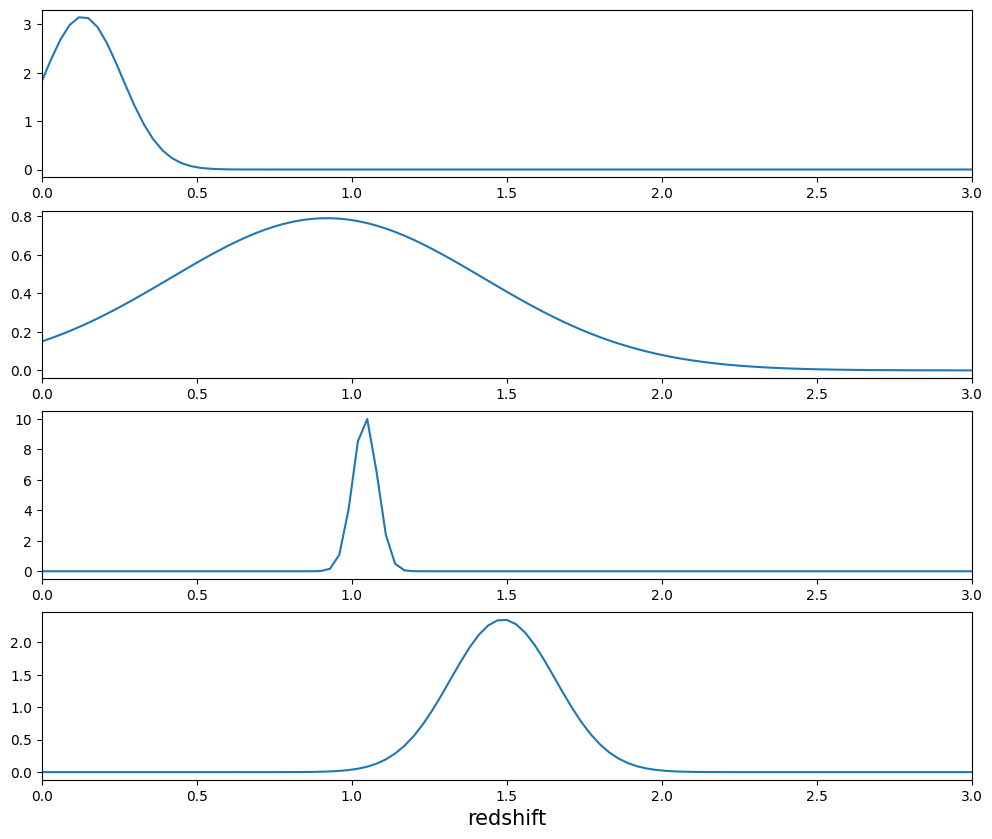
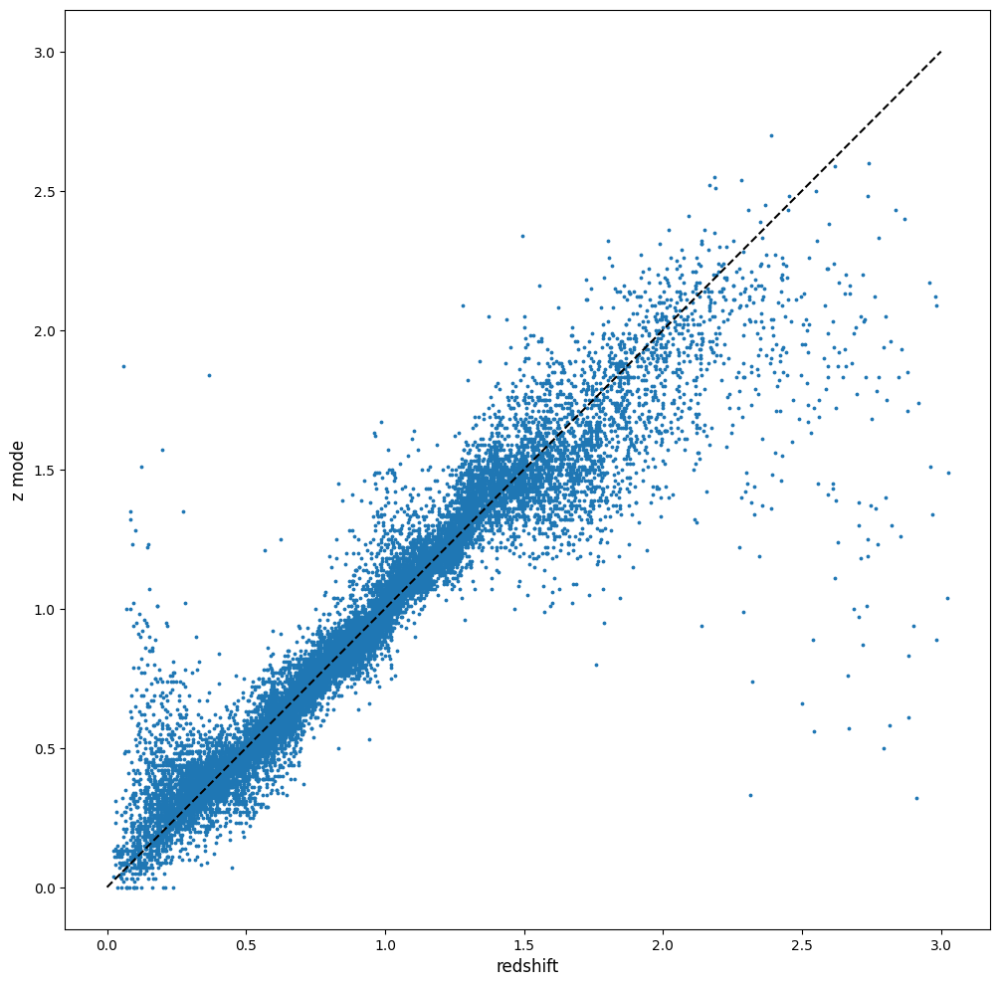

GPz Estimation Example
======================

**Author:** Sam Schmidt

**Last Run Successfully:** Feb 9, 2026

**Note:** If you’re interested in running this in pipeline mode, see
```06_GPz.ipynb`` <https://github.com/LSSTDESC/rail/blob/main/pipeline_examples/estimation_examples/06_GPz.ipynb>`__
in the ``pipeline_examples/estimation_examples/`` folder.

A quick demo of running GPz on the typical test data. You should have
installed rail_gpz_v1 (we highly recommend that you do this from within
a custom conda environment so that all dependencies for package versions
are met), either by cloning and installing from github, or with:

::

   pip install pz-rail-gpz-v1

As RAIL is a namespace package, installing rail_gpz_v1 will make
``GPzInformer`` and ``GPzEstimator`` available, and they can be imported
via:

::

   from rail.estimation.algos.gpz import GPzInformer, GPzEstimator

Let’s start with all of our necessary imports:

.. code:: ipython3

    import matplotlib.pyplot as plt
    import rail.interactive as ri
    import tables_io
    
    # find_rail_file is a convenience function that finds a file in the RAIL ecosystem   We have several example data files that are copied with RAIL that we can use for our example run, let's grab those files, one for training/validation, and the other for testing:
    from rail.utils.path_utils import find_rail_file


.. parsed-literal::

    Install FSPS with the following commands:
    pip uninstall fsps
    git clone --recursive https://github.com/dfm/python-fsps.git
    cd python-fsps
    python -m pip install .
    export SPS_HOME=$(pwd)/src/fsps/libfsps
    
    LEPHAREDIR is being set to the default cache directory:
    /home/runner/.cache/lephare/data
    More than 1Gb may be written there.
    LEPHAREWORK is being set to the default cache directory:
    /home/runner/.cache/lephare/work
    Default work cache is already linked. 
    This is linked to the run directory:
    /home/runner/.cache/lephare/runs/20260326T203551


.. parsed-literal::

    
    A module that was compiled using NumPy 1.x cannot be run in
    NumPy 2.2.6 as it may crash. To support both 1.x and 2.x
    versions of NumPy, modules must be compiled with NumPy 2.0.
    Some module may need to rebuild instead e.g. with 'pybind11>=2.12'.
    
    If you are a user of the module, the easiest solution will be to
    downgrade to 'numpy<2' or try to upgrade the affected module.
    We expect that some modules will need time to support NumPy 2.
    
    Traceback (most recent call last):  File "/opt/hostedtoolcache/Python/3.10.20/x64/lib/python3.10/runpy.py", line 196, in _run_module_as_main
        return _run_code(code, main_globals, None,
      File "/opt/hostedtoolcache/Python/3.10.20/x64/lib/python3.10/runpy.py", line 86, in _run_code
        exec(code, run_globals)
      File "/opt/hostedtoolcache/Python/3.10.20/x64/lib/python3.10/site-packages/ipykernel_launcher.py", line 18, in <module>
        app.launch_new_instance()
      File "/opt/hostedtoolcache/Python/3.10.20/x64/lib/python3.10/site-packages/traitlets/config/application.py", line 1075, in launch_instance
        app.start()
      File "/opt/hostedtoolcache/Python/3.10.20/x64/lib/python3.10/site-packages/ipykernel/kernelapp.py", line 758, in start
        self.io_loop.start()
      File "/opt/hostedtoolcache/Python/3.10.20/x64/lib/python3.10/site-packages/tornado/platform/asyncio.py", line 211, in start
        self.asyncio_loop.run_forever()
      File "/opt/hostedtoolcache/Python/3.10.20/x64/lib/python3.10/asyncio/base_events.py", line 603, in run_forever
        self._run_once()
      File "/opt/hostedtoolcache/Python/3.10.20/x64/lib/python3.10/asyncio/base_events.py", line 1909, in _run_once
        handle._run()
      File "/opt/hostedtoolcache/Python/3.10.20/x64/lib/python3.10/asyncio/events.py", line 80, in _run
        self._context.run(self._callback, *self._args)
      File "/opt/hostedtoolcache/Python/3.10.20/x64/lib/python3.10/site-packages/ipykernel/utils.py", line 71, in preserve_context
        return await f(*args, **kwargs)
      File "/opt/hostedtoolcache/Python/3.10.20/x64/lib/python3.10/site-packages/ipykernel/kernelbase.py", line 621, in shell_main
        await self.dispatch_shell(msg, subshell_id=subshell_id)
      File "/opt/hostedtoolcache/Python/3.10.20/x64/lib/python3.10/site-packages/ipykernel/kernelbase.py", line 478, in dispatch_shell
        await result
      File "/opt/hostedtoolcache/Python/3.10.20/x64/lib/python3.10/site-packages/ipykernel/ipkernel.py", line 372, in execute_request
        await super().execute_request(stream, ident, parent)
      File "/opt/hostedtoolcache/Python/3.10.20/x64/lib/python3.10/site-packages/ipykernel/kernelbase.py", line 834, in execute_request
        reply_content = await reply_content
      File "/opt/hostedtoolcache/Python/3.10.20/x64/lib/python3.10/site-packages/ipykernel/ipkernel.py", line 464, in do_execute
        res = shell.run_cell(
      File "/opt/hostedtoolcache/Python/3.10.20/x64/lib/python3.10/site-packages/ipykernel/zmqshell.py", line 663, in run_cell
        return super().run_cell(*args, **kwargs)
      File "/opt/hostedtoolcache/Python/3.10.20/x64/lib/python3.10/site-packages/IPython/core/interactiveshell.py", line 3077, in run_cell
        result = self._run_cell(
      File "/opt/hostedtoolcache/Python/3.10.20/x64/lib/python3.10/site-packages/IPython/core/interactiveshell.py", line 3132, in _run_cell
        result = runner(coro)
      File "/opt/hostedtoolcache/Python/3.10.20/x64/lib/python3.10/site-packages/IPython/core/async_helpers.py", line 128, in _pseudo_sync_runner
        coro.send(None)
      File "/opt/hostedtoolcache/Python/3.10.20/x64/lib/python3.10/site-packages/IPython/core/interactiveshell.py", line 3336, in run_cell_async
        has_raised = await self.run_ast_nodes(code_ast.body, cell_name,
      File "/opt/hostedtoolcache/Python/3.10.20/x64/lib/python3.10/site-packages/IPython/core/interactiveshell.py", line 3519, in run_ast_nodes
        if await self.run_code(code, result, async_=asy):
      File "/opt/hostedtoolcache/Python/3.10.20/x64/lib/python3.10/site-packages/IPython/core/interactiveshell.py", line 3579, in run_code
        exec(code_obj, self.user_global_ns, self.user_ns)
      File "/tmp/ipykernel_8229/232514726.py", line 2, in <module>
        import rail.interactive as ri
      File "/opt/hostedtoolcache/Python/3.10.20/x64/lib/python3.10/site-packages/rail/interactive/__init__.py", line 3, in <module>
        from . import calib, creation, estimation, evaluation, tools
      File "/opt/hostedtoolcache/Python/3.10.20/x64/lib/python3.10/site-packages/rail/interactive/calib/__init__.py", line 3, in <module>
        from rail.utils.interactive.initialize_utils import _initialize_interactive_module
      File "/opt/hostedtoolcache/Python/3.10.20/x64/lib/python3.10/site-packages/rail/utils/interactive/initialize_utils.py", line 17, in <module>
        from rail.utils.interactive.base_utils import (
      File "/opt/hostedtoolcache/Python/3.10.20/x64/lib/python3.10/site-packages/rail/utils/interactive/base_utils.py", line 10, in <module>
        rail.stages.import_and_attach_all(silent=True)
      File "/opt/hostedtoolcache/Python/3.10.20/x64/lib/python3.10/site-packages/rail/stages/__init__.py", line 74, in import_and_attach_all
        RailEnv.import_all_packages(silent=silent)
      File "/opt/hostedtoolcache/Python/3.10.20/x64/lib/python3.10/site-packages/rail/core/introspection.py", line 541, in import_all_packages
        _imported_module = importlib.import_module(pkg)
      File "/opt/hostedtoolcache/Python/3.10.20/x64/lib/python3.10/importlib/__init__.py", line 126, in import_module
        return _bootstrap._gcd_import(name[level:], package, level)
      File "/opt/hostedtoolcache/Python/3.10.20/x64/lib/python3.10/site-packages/rail/som/__init__.py", line 1, in <module>
        from rail.creation.degraders.specz_som import *
      File "/opt/hostedtoolcache/Python/3.10.20/x64/lib/python3.10/site-packages/rail/creation/degraders/specz_som.py", line 15, in <module>
        from somoclu import Somoclu
      File "/opt/hostedtoolcache/Python/3.10.20/x64/lib/python3.10/site-packages/somoclu/__init__.py", line 11, in <module>
        from .train import Somoclu
      File "/opt/hostedtoolcache/Python/3.10.20/x64/lib/python3.10/site-packages/somoclu/train.py", line 25, in <module>
        from .somoclu_wrap import train as wrap_train
      File "/opt/hostedtoolcache/Python/3.10.20/x64/lib/python3.10/site-packages/somoclu/somoclu_wrap.py", line 11, in <module>
        import _somoclu_wrap


::


    ---------------------------------------------------------------------------

    ImportError                               Traceback (most recent call last)

    File /opt/hostedtoolcache/Python/3.10.20/x64/lib/python3.10/site-packages/numpy/core/_multiarray_umath.py:44, in __getattr__(attr_name)
         39     # Also print the message (with traceback).  This is because old versions
         40     # of NumPy unfortunately set up the import to replace (and hide) the
         41     # error.  The traceback shouldn't be needed, but e.g. pytest plugins
         42     # seem to swallow it and we should be failing anyway...
         43     sys.stderr.write(msg + tb_msg)
    ---> 44     raise ImportError(msg)
         46 ret = getattr(_multiarray_umath, attr_name, None)
         47 if ret is None:


    ImportError: 
    A module that was compiled using NumPy 1.x cannot be run in
    NumPy 2.2.6 as it may crash. To support both 1.x and 2.x
    versions of NumPy, modules must be compiled with NumPy 2.0.
    Some module may need to rebuild instead e.g. with 'pybind11>=2.12'.
    
    If you are a user of the module, the easiest solution will be to
    downgrade to 'numpy<2' or try to upgrade the affected module.
    We expect that some modules will need time to support NumPy 2.
    


.. parsed-literal::

    Warning: the binary library cannot be imported. You cannot train maps, but you can load and analyze ones that you have already saved.
    The problem occurs because either compilation failed when you installed Somoclu or a path is missing from the dependencies when you are trying to import it. Please refer to the documentation to see your options.


.. code:: ipython3

    trainFile = find_rail_file("examples_data/testdata/test_dc2_training_9816.hdf5")
    testFile = find_rail_file("examples_data/testdata/test_dc2_validation_9816.hdf5")
    training_data = tables_io.read(trainFile)
    test_data = tables_io.read(testFile)

Now, we need to set up the stage that will run GPz. We begin by defining
a dictionary with the config options for the algorithm. There are
sensible defaults set, we will override several of these as an example
of how to do this. Config parameters not set in the dictionary will
automatically be set to their default values.

.. code:: ipython3

    gpz_train_dict = dict(
        n_basis=60,
        trainfrac=0.8,
        csl_method="normal",
        max_iter=150,
        hdf5_groupname="photometry",
    )

We are now ready to run the stage to create the model. We will use the
training data from ``test_dc2_training_9816.hdf5``, which contains
10,225 galaxies drawn from healpix 9816 from the cosmoDC2_v1.1.4
dataset, to train the model. Note that we read this data in called
``train_data`` in the DataStore. Note that we set ``trainfrac`` to 0.8,
so 80% of the data will be used in the “main” training, but 20% will be
reserved by ``GPzInformer`` to determine a SIGMA parameter. We set
``max_iter`` to 150, so we will see 150 steps where the stage tries to
maximize the likelihood. We run the stage as follows:

.. code:: ipython3

    model = ri.estimation.algos.gpz.gpz_informer(
        training_data=training_data, **gpz_train_dict
    )["model"]


.. parsed-literal::

    Inserting handle into data store.  input: None, GPzInformer
    ngal: 10225
    training model...


.. parsed-literal::

    Iter	 logML/n 		 Train RMSE		 Train RMSE/n		 Valid RMSE		 Valid MLL		 Time    
       1	-3.3012153e-01	 3.1643958e-01	-3.1985017e-01	 3.3315876e-01	[-3.5315461e-01]	 4.6550274e-01


.. parsed-literal::

       2	-2.6299203e-01	 3.0729616e-01	-2.4023014e-01	 3.2277667e-01	[-2.8886596e-01]	 2.3141432e-01


.. parsed-literal::

       3	-2.1788911e-01	 2.8627089e-01	-1.7629034e-01	 2.9711290e-01	[-2.2510647e-01]	 3.3121848e-01
       4	-1.7891118e-01	 2.6321228e-01	-1.3809693e-01	 2.7062693e-01	[-1.8251972e-01]	 1.7679954e-01


.. parsed-literal::

       5	-8.9337447e-02	 2.5388024e-01	-5.6729650e-02	 2.6310781e-01	[-1.0196639e-01]	 2.0397902e-01


.. parsed-literal::

       6	-5.9674307e-02	 2.4917081e-01	-3.0411375e-02	 2.6052916e-01	[-7.0736347e-02]	 2.1703339e-01


.. parsed-literal::

       7	-4.1665996e-02	 2.4630715e-01	-1.8249043e-02	 2.5687288e-01	[-5.9633301e-02]	 2.0802283e-01


.. parsed-literal::

       8	-2.9079435e-02	 2.4417862e-01	-9.1508548e-03	 2.5476744e-01	[-5.2139618e-02]	 2.0776725e-01
       9	-1.6123506e-02	 2.4173072e-01	 1.4625421e-03	 2.5266692e-01	[-4.3706065e-02]	 1.8375039e-01


.. parsed-literal::

      10	-5.8956895e-03	 2.3986932e-01	 9.9004695e-03	 2.5066861e-01	[-3.6350952e-02]	 1.8788552e-01
      11	-1.6249580e-03	 2.3912100e-01	 1.3392690e-02	 2.5076750e-01	[-3.2718763e-02]	 2.0432878e-01


.. parsed-literal::

      12	 9.8399335e-04	 2.3863803e-01	 1.5815924e-02	 2.5007343e-01	[-3.1824646e-02]	 2.0888138e-01


.. parsed-literal::

      13	 4.5492983e-03	 2.3795679e-01	 1.9301739e-02	 2.4905529e-01	[-2.6982176e-02]	 2.0598269e-01


.. parsed-literal::

      14	 9.0329925e-03	 2.3702549e-01	 2.4247974e-02	 2.4805208e-01	[-2.2415529e-02]	 2.1585226e-01


.. parsed-literal::

      15	 1.5271209e-01	 2.2029221e-01	 1.7660586e-01	 2.2780074e-01	[ 1.6060125e-01]	 3.1743360e-01


.. parsed-literal::

      16	 2.5331912e-01	 2.1324739e-01	 2.8178443e-01	 2.2290723e-01	[ 2.5576978e-01]	 2.1875024e-01


.. parsed-literal::

      17	 2.9360115e-01	 2.0968921e-01	 3.2751801e-01	 2.2015347e-01	[ 2.7525766e-01]	 2.0664144e-01
      18	 3.5518060e-01	 2.1079982e-01	 3.8879373e-01	 2.1980978e-01	[ 3.5095159e-01]	 1.7545199e-01


.. parsed-literal::

      19	 3.9162207e-01	 2.0533345e-01	 4.2506263e-01	 2.1361580e-01	[ 3.8960194e-01]	 1.9944048e-01
      20	 4.4756852e-01	 2.0074703e-01	 4.8206626e-01	 2.0828156e-01	[ 4.4489732e-01]	 1.7813587e-01


.. parsed-literal::

      21	 5.4214806e-01	 1.9996694e-01	 5.7784919e-01	 2.0685837e-01	[ 5.3681557e-01]	 2.1647072e-01


.. parsed-literal::

      22	 6.1313791e-01	 1.9873749e-01	 6.5382206e-01	 2.0526035e-01	[ 5.8913329e-01]	 2.0719600e-01


.. parsed-literal::

      23	 6.5585029e-01	 1.9451805e-01	 6.9499382e-01	 2.0281600e-01	[ 6.5492377e-01]	 2.0731378e-01


.. parsed-literal::

      24	 6.8269953e-01	 1.9090088e-01	 7.2116636e-01	 1.9931996e-01	[ 6.7708065e-01]	 2.0497441e-01


.. parsed-literal::

      25	 7.0941123e-01	 1.9210058e-01	 7.4754889e-01	 2.0382412e-01	[ 6.9391957e-01]	 2.0591998e-01


.. parsed-literal::

      26	 7.2087302e-01	 1.9381335e-01	 7.5839473e-01	 2.0290555e-01	[ 7.0939357e-01]	 2.1602941e-01


.. parsed-literal::

      27	 7.4630278e-01	 1.9108118e-01	 7.8495976e-01	 1.9943410e-01	[ 7.4389540e-01]	 2.1102428e-01


.. parsed-literal::

      28	 7.6963780e-01	 1.8998601e-01	 8.0842698e-01	 1.9876528e-01	[ 7.7149369e-01]	 2.1859789e-01


.. parsed-literal::

      29	 7.9571187e-01	 1.8814280e-01	 8.3480230e-01	 1.9652864e-01	[ 8.0304319e-01]	 2.0875740e-01


.. parsed-literal::

      30	 8.4262486e-01	 1.8603497e-01	 8.8362757e-01	 1.8878530e-01	[ 8.6921242e-01]	 2.0155835e-01


.. parsed-literal::

      31	 8.6067472e-01	 1.8538896e-01	 9.0182735e-01	 1.9077226e-01	[ 8.7882536e-01]	 2.0934868e-01
      32	 8.8171569e-01	 1.8402818e-01	 9.2438497e-01	 1.8925554e-01	[ 8.9883099e-01]	 1.8247104e-01


.. parsed-literal::

      33	 8.9155455e-01	 1.8409907e-01	 9.3507728e-01	 1.8519957e-01	[ 9.0912580e-01]	 2.1610165e-01


.. parsed-literal::

      34	 9.1499870e-01	 1.8207913e-01	 9.5843621e-01	 1.8309594e-01	[ 9.3206144e-01]	 2.0930314e-01


.. parsed-literal::

      35	 9.3392939e-01	 1.8111088e-01	 9.7794172e-01	 1.8361416e-01	[ 9.4966292e-01]	 2.0465183e-01
      36	 9.5192068e-01	 1.8032267e-01	 9.9655528e-01	 1.8346416e-01	[ 9.6777396e-01]	 1.9990945e-01


.. parsed-literal::

      37	 9.7242941e-01	 1.7966607e-01	 1.0192076e+00	 1.8663142e-01	[ 9.7705004e-01]	 1.7619753e-01
      38	 9.9063016e-01	 1.7553739e-01	 1.0374275e+00	 1.8006415e-01	[ 9.9702436e-01]	 1.9977903e-01


.. parsed-literal::

      39	 1.0022807e+00	 1.7415116e-01	 1.0483028e+00	 1.7948521e-01	[ 1.0128985e+00]	 1.9912553e-01
      40	 1.0106546e+00	 1.7249777e-01	 1.0569821e+00	 1.7863150e-01	[ 1.0196603e+00]	 1.6318393e-01


.. parsed-literal::

      41	 1.0206270e+00	 1.7012081e-01	 1.0675456e+00	 1.7681579e-01	[ 1.0238366e+00]	 2.0256591e-01
      42	 1.0268452e+00	 1.6818715e-01	 1.0750883e+00	 1.7629813e-01	  1.0217370e+00 	 1.7023063e-01


.. parsed-literal::

      43	 1.0377997e+00	 1.6711703e-01	 1.0857804e+00	 1.7473937e-01	[ 1.0305850e+00]	 2.1873164e-01


.. parsed-literal::

      44	 1.0445906e+00	 1.6669125e-01	 1.0925966e+00	 1.7398409e-01	[ 1.0358849e+00]	 2.0736265e-01
      45	 1.0594304e+00	 1.6525695e-01	 1.1080434e+00	 1.7237993e-01	[ 1.0440824e+00]	 1.9047880e-01


.. parsed-literal::

      46	 1.0640829e+00	 1.6379514e-01	 1.1141445e+00	 1.7135842e-01	  1.0289518e+00 	 2.1639848e-01
      47	 1.0815765e+00	 1.6208506e-01	 1.1311734e+00	 1.6996087e-01	[ 1.0503829e+00]	 1.9815397e-01


.. parsed-literal::

      48	 1.0873364e+00	 1.6113845e-01	 1.1369675e+00	 1.6941853e-01	[ 1.0543116e+00]	 1.8766832e-01


.. parsed-literal::

      49	 1.0939324e+00	 1.5998682e-01	 1.1438510e+00	 1.6869498e-01	[ 1.0588339e+00]	 2.0725012e-01


.. parsed-literal::

      50	 1.1054171e+00	 1.5855648e-01	 1.1555391e+00	 1.6814491e-01	[ 1.0712376e+00]	 2.0742035e-01
      51	 1.1091113e+00	 1.5698607e-01	 1.1601064e+00	 1.6628399e-01	[ 1.0889855e+00]	 1.9737649e-01


.. parsed-literal::

      52	 1.1212760e+00	 1.5670301e-01	 1.1715345e+00	 1.6584960e-01	[ 1.0985174e+00]	 2.0121551e-01
      53	 1.1271310e+00	 1.5621123e-01	 1.1773339e+00	 1.6519584e-01	[ 1.1064309e+00]	 1.8696260e-01


.. parsed-literal::

      54	 1.1375828e+00	 1.5520923e-01	 1.1880118e+00	 1.6384800e-01	[ 1.1168801e+00]	 1.8160319e-01
      55	 1.1467035e+00	 1.5463736e-01	 1.1973766e+00	 1.6294782e-01	[ 1.1339729e+00]	 1.8617511e-01


.. parsed-literal::

      56	 1.1572908e+00	 1.5381286e-01	 1.2080934e+00	 1.6158282e-01	[ 1.1413218e+00]	 2.1038508e-01
      57	 1.1665248e+00	 1.5317268e-01	 1.2177082e+00	 1.6078213e-01	[ 1.1454080e+00]	 1.9170403e-01


.. parsed-literal::

      58	 1.1734035e+00	 1.5258002e-01	 1.2247726e+00	 1.6024369e-01	[ 1.1500185e+00]	 1.9017744e-01
      59	 1.1840391e+00	 1.5127671e-01	 1.2361248e+00	 1.5949130e-01	[ 1.1546228e+00]	 1.7787361e-01


.. parsed-literal::

      60	 1.1925335e+00	 1.4998187e-01	 1.2446973e+00	 1.5830998e-01	[ 1.1590286e+00]	 1.9972515e-01


.. parsed-literal::

      61	 1.2019384e+00	 1.4935667e-01	 1.2536558e+00	 1.5865944e-01	[ 1.1671111e+00]	 2.0281148e-01


.. parsed-literal::

      62	 1.2118592e+00	 1.4851678e-01	 1.2638931e+00	 1.5807753e-01	[ 1.1712567e+00]	 2.2115946e-01
      63	 1.2192406e+00	 1.4757792e-01	 1.2717412e+00	 1.5730896e-01	[ 1.1719297e+00]	 1.9764137e-01


.. parsed-literal::

      64	 1.2277456e+00	 1.4715780e-01	 1.2804405e+00	 1.5726806e-01	[ 1.1765510e+00]	 2.0253944e-01


.. parsed-literal::

      65	 1.2363978e+00	 1.4684006e-01	 1.2893275e+00	 1.5686297e-01	[ 1.1845619e+00]	 2.0854712e-01
      66	 1.2435609e+00	 1.4698484e-01	 1.2970250e+00	 1.5776100e-01	  1.1810188e+00 	 1.8931460e-01


.. parsed-literal::

      67	 1.2496878e+00	 1.4728864e-01	 1.3032551e+00	 1.5887969e-01	[ 1.1863101e+00]	 1.9876623e-01


.. parsed-literal::

      68	 1.2549061e+00	 1.4672893e-01	 1.3084116e+00	 1.5835206e-01	[ 1.1905830e+00]	 2.0538640e-01


.. parsed-literal::

      69	 1.2653307e+00	 1.4582660e-01	 1.3194139e+00	 1.5822073e-01	  1.1904165e+00 	 2.1285129e-01
      70	 1.2726233e+00	 1.4550778e-01	 1.3270068e+00	 1.5918877e-01	  1.1897565e+00 	 1.8554330e-01


.. parsed-literal::

      71	 1.2795879e+00	 1.4513371e-01	 1.3340573e+00	 1.5963643e-01	  1.1891262e+00 	 1.9822049e-01
      72	 1.2846773e+00	 1.4524094e-01	 1.3393413e+00	 1.6055563e-01	  1.1821182e+00 	 1.7146921e-01


.. parsed-literal::

      73	 1.2915744e+00	 1.4520267e-01	 1.3464104e+00	 1.6112609e-01	  1.1755837e+00 	 2.1549511e-01


.. parsed-literal::

      74	 1.2984409e+00	 1.4428317e-01	 1.3534648e+00	 1.6055683e-01	  1.1585630e+00 	 2.0549798e-01


.. parsed-literal::

      75	 1.3046185e+00	 1.4427753e-01	 1.3594897e+00	 1.6071526e-01	  1.1563873e+00 	 2.0646238e-01
      76	 1.3111607e+00	 1.4388808e-01	 1.3659233e+00	 1.6018921e-01	  1.1518785e+00 	 1.7685485e-01


.. parsed-literal::

      77	 1.3174706e+00	 1.4371380e-01	 1.3722120e+00	 1.5988527e-01	  1.1354500e+00 	 2.0470643e-01


.. parsed-literal::

      78	 1.3249362e+00	 1.4398665e-01	 1.3798968e+00	 1.6047067e-01	  1.1002333e+00 	 2.0783591e-01


.. parsed-literal::

      79	 1.3318996e+00	 1.4382677e-01	 1.3868015e+00	 1.6000103e-01	  1.1019456e+00 	 2.1180511e-01


.. parsed-literal::

      80	 1.3390922e+00	 1.4362650e-01	 1.3943392e+00	 1.6020331e-01	  1.0781977e+00 	 2.0573831e-01


.. parsed-literal::

      81	 1.3440839e+00	 1.4415084e-01	 1.3997514e+00	 1.6137737e-01	  1.0896864e+00 	 2.0688820e-01
      82	 1.3494976e+00	 1.4363849e-01	 1.4049892e+00	 1.6087309e-01	  1.0939247e+00 	 1.9100213e-01


.. parsed-literal::

      83	 1.3534072e+00	 1.4358336e-01	 1.4088672e+00	 1.6110743e-01	  1.0837291e+00 	 2.1840119e-01


.. parsed-literal::

      84	 1.3591197e+00	 1.4335815e-01	 1.4146640e+00	 1.6119152e-01	  1.0810745e+00 	 2.0959806e-01


.. parsed-literal::

      85	 1.3624399e+00	 1.4389754e-01	 1.4185267e+00	 1.6211383e-01	  1.0533836e+00 	 2.1029139e-01


.. parsed-literal::

      86	 1.3676262e+00	 1.4360387e-01	 1.4237139e+00	 1.6199342e-01	  1.0621948e+00 	 2.0887733e-01
      87	 1.3699632e+00	 1.4319260e-01	 1.4259648e+00	 1.6143672e-01	  1.0711764e+00 	 2.0000076e-01


.. parsed-literal::

      88	 1.3742323e+00	 1.4275893e-01	 1.4304320e+00	 1.6107403e-01	  1.0690179e+00 	 2.0866060e-01
      89	 1.3780881e+00	 1.4220254e-01	 1.4343359e+00	 1.6052437e-01	  1.0731180e+00 	 1.6933513e-01


.. parsed-literal::

      90	 1.3815205e+00	 1.4197715e-01	 1.4376939e+00	 1.6031297e-01	  1.0755691e+00 	 2.0236611e-01
      91	 1.3840266e+00	 1.4185531e-01	 1.4401320e+00	 1.6024573e-01	  1.0782788e+00 	 1.9673133e-01


.. parsed-literal::

      92	 1.3883809e+00	 1.4140636e-01	 1.4444781e+00	 1.5995648e-01	  1.0785003e+00 	 2.1608591e-01


.. parsed-literal::

      93	 1.3915273e+00	 1.4064519e-01	 1.4476410e+00	 1.5911177e-01	  1.0897442e+00 	 2.1129942e-01
      94	 1.3959514e+00	 1.4018610e-01	 1.4519616e+00	 1.5862186e-01	  1.0896742e+00 	 1.9647098e-01


.. parsed-literal::

      95	 1.3997318e+00	 1.3958308e-01	 1.4558777e+00	 1.5804021e-01	  1.0857243e+00 	 1.7567992e-01
      96	 1.4026759e+00	 1.3899190e-01	 1.4588849e+00	 1.5727761e-01	  1.0853233e+00 	 1.7401242e-01


.. parsed-literal::

      97	 1.4089168e+00	 1.3802283e-01	 1.4653520e+00	 1.5617679e-01	  1.0836619e+00 	 2.0506263e-01
      98	 1.4132560e+00	 1.3643020e-01	 1.4699894e+00	 1.5403380e-01	  1.0759300e+00 	 1.9857669e-01


.. parsed-literal::

      99	 1.4171761e+00	 1.3671266e-01	 1.4737157e+00	 1.5449418e-01	  1.0772351e+00 	 2.0490766e-01
     100	 1.4195742e+00	 1.3673616e-01	 1.4760961e+00	 1.5465154e-01	  1.0724838e+00 	 1.9710994e-01


.. parsed-literal::

     101	 1.4228631e+00	 1.3629297e-01	 1.4795484e+00	 1.5424149e-01	  1.0586736e+00 	 2.0464849e-01


.. parsed-literal::

     102	 1.4257137e+00	 1.3576748e-01	 1.4826179e+00	 1.5349434e-01	  1.0396448e+00 	 2.1815968e-01
     103	 1.4284444e+00	 1.3531649e-01	 1.4853607e+00	 1.5291402e-01	  1.0446916e+00 	 1.8259382e-01


.. parsed-literal::

     104	 1.4312292e+00	 1.3469489e-01	 1.4882411e+00	 1.5193265e-01	  1.0500632e+00 	 2.0379043e-01
     105	 1.4342909e+00	 1.3430080e-01	 1.4913820e+00	 1.5134411e-01	  1.0530440e+00 	 1.9385481e-01


.. parsed-literal::

     106	 1.4384181e+00	 1.3358731e-01	 1.4958421e+00	 1.5002570e-01	  1.0533588e+00 	 2.0293927e-01


.. parsed-literal::

     107	 1.4414346e+00	 1.3356592e-01	 1.4987482e+00	 1.5019573e-01	  1.0525710e+00 	 2.0914793e-01
     108	 1.4431726e+00	 1.3356561e-01	 1.5004360e+00	 1.5036012e-01	  1.0493895e+00 	 1.7105579e-01


.. parsed-literal::

     109	 1.4459699e+00	 1.3347287e-01	 1.5032653e+00	 1.5040588e-01	  1.0417436e+00 	 1.7674494e-01


.. parsed-literal::

     110	 1.4485649e+00	 1.3325350e-01	 1.5060025e+00	 1.5031375e-01	  1.0389751e+00 	 2.0870781e-01


.. parsed-literal::

     111	 1.4510035e+00	 1.3318074e-01	 1.5084358e+00	 1.5031997e-01	  1.0406354e+00 	 2.2042632e-01


.. parsed-literal::

     112	 1.4538660e+00	 1.3300499e-01	 1.5114006e+00	 1.5011716e-01	  1.0396179e+00 	 2.2486544e-01


.. parsed-literal::

     113	 1.4562650e+00	 1.3290204e-01	 1.5138184e+00	 1.5013462e-01	  1.0374056e+00 	 2.0436192e-01
     114	 1.4571564e+00	 1.3266126e-01	 1.5148967e+00	 1.5025451e-01	  1.0250858e+00 	 1.8881178e-01


.. parsed-literal::

     115	 1.4608234e+00	 1.3262571e-01	 1.5183894e+00	 1.5021899e-01	  1.0291941e+00 	 2.0612073e-01


.. parsed-literal::

     116	 1.4617119e+00	 1.3258523e-01	 1.5192274e+00	 1.5019520e-01	  1.0308992e+00 	 2.1940017e-01


.. parsed-literal::

     117	 1.4646021e+00	 1.3236621e-01	 1.5220688e+00	 1.4999259e-01	  1.0311257e+00 	 2.0557928e-01
     118	 1.4655742e+00	 1.3204761e-01	 1.5232181e+00	 1.4968271e-01	  1.0288256e+00 	 1.8192387e-01


.. parsed-literal::

     119	 1.4676409e+00	 1.3201211e-01	 1.5251497e+00	 1.4952016e-01	  1.0309118e+00 	 1.9413185e-01


.. parsed-literal::

     120	 1.4688623e+00	 1.3192437e-01	 1.5263854e+00	 1.4933078e-01	  1.0289146e+00 	 2.0391488e-01


.. parsed-literal::

     121	 1.4704754e+00	 1.3174044e-01	 1.5280400e+00	 1.4897180e-01	  1.0260549e+00 	 2.0666766e-01
     122	 1.4731994e+00	 1.3142813e-01	 1.5308137e+00	 1.4835543e-01	  1.0202463e+00 	 1.7958665e-01


.. parsed-literal::

     123	 1.4744638e+00	 1.3117235e-01	 1.5321070e+00	 1.4806433e-01	  1.0219241e+00 	 3.2104874e-01
     124	 1.4768892e+00	 1.3088963e-01	 1.5345243e+00	 1.4756324e-01	  1.0170781e+00 	 1.8516493e-01


.. parsed-literal::

     125	 1.4787844e+00	 1.3068849e-01	 1.5364314e+00	 1.4737317e-01	  1.0115532e+00 	 2.0311499e-01


.. parsed-literal::

     126	 1.4806678e+00	 1.3038016e-01	 1.5383979e+00	 1.4713443e-01	  1.0060460e+00 	 2.0632005e-01
     127	 1.4824461e+00	 1.3024615e-01	 1.5402057e+00	 1.4705697e-01	  1.0023931e+00 	 1.9969058e-01


.. parsed-literal::

     128	 1.4841536e+00	 1.3016192e-01	 1.5419449e+00	 1.4703499e-01	  1.0001003e+00 	 2.1546412e-01
     129	 1.4862532e+00	 1.2997890e-01	 1.5441722e+00	 1.4692861e-01	  1.0000716e+00 	 1.7571282e-01


.. parsed-literal::

     130	 1.4874676e+00	 1.2990214e-01	 1.5454762e+00	 1.4671261e-01	  1.0010179e+00 	 1.9474363e-01
     131	 1.4886367e+00	 1.2986429e-01	 1.5465746e+00	 1.4667116e-01	  1.0046196e+00 	 1.8104815e-01


.. parsed-literal::

     132	 1.4900297e+00	 1.2975565e-01	 1.5479226e+00	 1.4653683e-01	  1.0099627e+00 	 2.0127034e-01
     133	 1.4914069e+00	 1.2964469e-01	 1.5492857e+00	 1.4642847e-01	  1.0125035e+00 	 1.7701578e-01


.. parsed-literal::

     134	 1.4930377e+00	 1.2933819e-01	 1.5510511e+00	 1.4646281e-01	  1.0136087e+00 	 2.0582199e-01
     135	 1.4952116e+00	 1.2928431e-01	 1.5532395e+00	 1.4625271e-01	  1.0059874e+00 	 1.9533324e-01


.. parsed-literal::

     136	 1.4961752e+00	 1.2925581e-01	 1.5542315e+00	 1.4625825e-01	  9.9931734e-01 	 2.0701861e-01


.. parsed-literal::

     137	 1.4983098e+00	 1.2914278e-01	 1.5565441e+00	 1.4625862e-01	  9.8268336e-01 	 2.0127201e-01
     138	 1.4993128e+00	 1.2899406e-01	 1.5578012e+00	 1.4632450e-01	  9.5880748e-01 	 1.9194007e-01


.. parsed-literal::

     139	 1.5007102e+00	 1.2894921e-01	 1.5591268e+00	 1.4619897e-01	  9.6471145e-01 	 1.8204331e-01


.. parsed-literal::

     140	 1.5018173e+00	 1.2891895e-01	 1.5601975e+00	 1.4608667e-01	  9.7195373e-01 	 2.0646238e-01


.. parsed-literal::

     141	 1.5030848e+00	 1.2888239e-01	 1.5614553e+00	 1.4596772e-01	  9.7256942e-01 	 2.1654081e-01


.. parsed-literal::

     142	 1.5044666e+00	 1.2890056e-01	 1.5628444e+00	 1.4595405e-01	  9.7586611e-01 	 2.1340680e-01


.. parsed-literal::

     143	 1.5058043e+00	 1.2891044e-01	 1.5641313e+00	 1.4592353e-01	  9.7167991e-01 	 2.0748329e-01
     144	 1.5069451e+00	 1.2891880e-01	 1.5653207e+00	 1.4605271e-01	  9.6234592e-01 	 1.8519187e-01


.. parsed-literal::

     145	 1.5082539e+00	 1.2895815e-01	 1.5666758e+00	 1.4622702e-01	  9.5924762e-01 	 1.8304849e-01
     146	 1.5096919e+00	 1.2894787e-01	 1.5682685e+00	 1.4656112e-01	  9.5116103e-01 	 1.9407010e-01


.. parsed-literal::

     147	 1.5109901e+00	 1.2894665e-01	 1.5695674e+00	 1.4665766e-01	  9.5618468e-01 	 1.7154121e-01
     148	 1.5119968e+00	 1.2890050e-01	 1.5705575e+00	 1.4662050e-01	  9.6142356e-01 	 1.8022323e-01


.. parsed-literal::

     149	 1.5131243e+00	 1.2881445e-01	 1.5717002e+00	 1.4671983e-01	  9.6394867e-01 	 2.0342541e-01


.. parsed-literal::

     150	 1.5144055e+00	 1.2872381e-01	 1.5730390e+00	 1.4668902e-01	  9.5908210e-01 	 2.1102381e-01
    Inserting handle into data store.  model: inprogress_model.pkl, GPzInformer


This should have taken about 30 seconds on a typical desktop computer,
and you should now see a file called ``GPz_model.pkl`` in the directory.
This model file is used by the ``GPzEstimator`` stage to determine our
redshift PDFs for the test set of galaxies. Let’s set up that stage,
again defining a dictionary of variables for the config params:

.. code:: ipython3

    gpz_test_dict = dict(hdf5_groupname="photometry", model=model)

Let’s run the stage and compute photo-z’s for our test set:

.. code:: ipython3

    results = ri.estimation.algos.gpz.gpz_estimator(input_data=test_data, **gpz_test_dict)


.. parsed-literal::

    Inserting handle into data store.  input: None, GPzEstimator
    Inserting handle into data store.  model: <rail.estimation.algos._gpz_util.GP object at 0x7f65c81df070>, GPzEstimator
    Process 0 running estimator on chunk 0 - 20,449
    Process 0 estimating GPz PZ PDF for rows 0 - 20,449


.. parsed-literal::

    Inserting handle into data store.  output: inprogress_output.hdf5, GPzEstimator


This should be very fast, under a second for our 20,449 galaxies in the
test set. Now, let’s plot a scatter plot of the point estimates, as well
as a few example PDFs. We can get access to the ``qp`` ensemble that was
written via the DataStore via ``results()``

.. code:: ipython3

    ens = results["output"]

.. code:: ipython3

    expdfids = [2, 180, 13517, 18032]
    fig, axs = plt.subplots(4, 1, figsize=(12, 10))
    for i, xx in enumerate(expdfids):
        axs[i].set_xlim(0, 3)
        ens[xx].plot_native(axes=axs[i])
    axs[3].set_xlabel("redshift", fontsize=15)


.. parsed-literal::

    Text(0.5, 0, 'redshift')





GPzEstimator parameterizes each PDF as a single Gaussian, here we see a
few examples of Gaussians of different widths. Now let’s grab the mode
of each PDF (stored as ancil data in the ensemble) and compare to the
true redshifts from the test_data file:

.. code:: ipython3

    truez = test_data["photometry"]["redshift"]
    zmode = ens.ancil["zmode"].flatten()

.. code:: ipython3

    plt.figure(figsize=(12, 12))
    plt.scatter(truez, zmode, s=3)
    plt.plot([0, 3], [0, 3], "k--")
    plt.xlabel("redshift", fontsize=12)
    plt.ylabel("z mode", fontsize=12)


.. parsed-literal::

    Text(0, 0.5, 'z mode')




