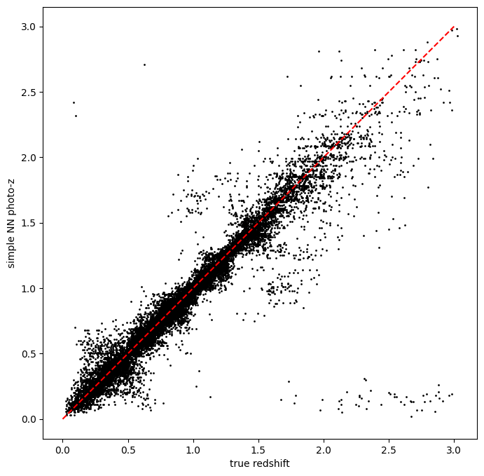
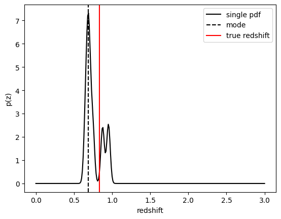
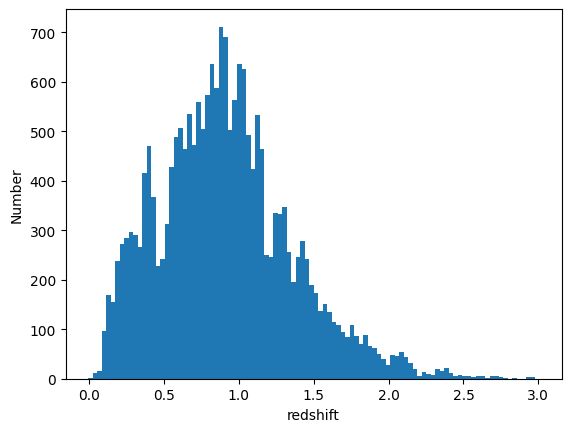
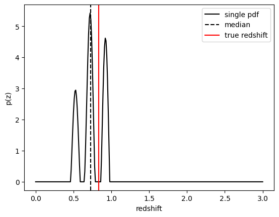
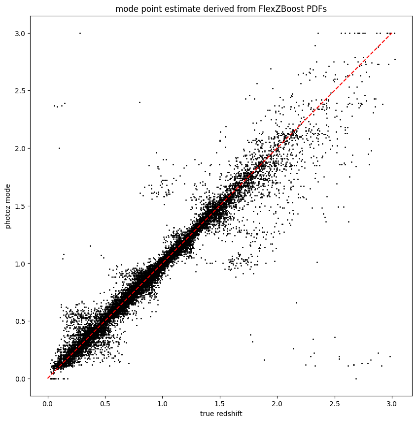

RAIL Estimation Tutorial Notebook
=================================

**Authors:** Sam Schmidt, Eric Charles, Alex Malz, others…

**Last run successfully:** Feb 9, 2026

This is a notebook demonstrating some of the ``estimation`` features of
the LSST-DESC ``RAIL``-iverse packages.

The ``rail.estimation`` subpackage contains infrastructure to run
multiple production-level photo-z codes. There is a minimimal superclass
that sets up some file paths and variable names. Each specific photo-z
code resides in a subclass in ``rail.estimation.algos`` with
algorithm-specific setup variables. More extensive documentation is
available on Read the Docs here:
https://rail-hub.readthedocs.io/en/latest/

**Note:** If you’re interested in running this in pipeline mode, see
```00_Quick_Start_in_Estimation.ipynb`` <https://github.com/LSSTDESC/rail/blob/main/pipeline_examples/estimation_examples/00_Quick_Start_in_Estimation.ipynb>`__
in the ``pipeline_examples/estimation_examples/`` folder.

.. code:: ipython3

    import matplotlib.pyplot as plt
    import numpy as np
    import rail.interactive as ri
    import tables_io
    from rail.utils.path_utils import find_rail_file


.. parsed-literal::

    Install FSPS with the following commands:
    pip uninstall fsps
    git clone --recursive https://github.com/dfm/python-fsps.git
    cd python-fsps
    python -m pip install .
    export SPS_HOME=$(pwd)/src/fsps/libfsps
    
    LEPHAREDIR is being set to the default cache directory:
    /home/runner/.cache/lephare/data
    More than 1Gb may be written there.
    LEPHAREWORK is being set to the default cache directory:
    /home/runner/.cache/lephare/work
    Default work cache is already linked. 
    This is linked to the run directory:
    /home/runner/.cache/lephare/runs/20260420T122630


.. parsed-literal::

    
    A module that was compiled using NumPy 1.x cannot be run in
    NumPy 2.2.6 as it may crash. To support both 1.x and 2.x
    versions of NumPy, modules must be compiled with NumPy 2.0.
    Some module may need to rebuild instead e.g. with 'pybind11>=2.12'.
    
    If you are a user of the module, the easiest solution will be to
    downgrade to 'numpy<2' or try to upgrade the affected module.
    We expect that some modules will need time to support NumPy 2.
    
    Traceback (most recent call last):  File "/opt/hostedtoolcache/Python/3.10.20/x64/lib/python3.10/runpy.py", line 196, in _run_module_as_main
        return _run_code(code, main_globals, None,
      File "/opt/hostedtoolcache/Python/3.10.20/x64/lib/python3.10/runpy.py", line 86, in _run_code
        exec(code, run_globals)
      File "/opt/hostedtoolcache/Python/3.10.20/x64/lib/python3.10/site-packages/ipykernel_launcher.py", line 18, in <module>
        app.launch_new_instance()
      File "/opt/hostedtoolcache/Python/3.10.20/x64/lib/python3.10/site-packages/traitlets/config/application.py", line 1075, in launch_instance
        app.start()
      File "/opt/hostedtoolcache/Python/3.10.20/x64/lib/python3.10/site-packages/ipykernel/kernelapp.py", line 758, in start
        self.io_loop.start()
      File "/opt/hostedtoolcache/Python/3.10.20/x64/lib/python3.10/site-packages/tornado/platform/asyncio.py", line 211, in start
        self.asyncio_loop.run_forever()
      File "/opt/hostedtoolcache/Python/3.10.20/x64/lib/python3.10/asyncio/base_events.py", line 603, in run_forever
        self._run_once()
      File "/opt/hostedtoolcache/Python/3.10.20/x64/lib/python3.10/asyncio/base_events.py", line 1909, in _run_once
        handle._run()
      File "/opt/hostedtoolcache/Python/3.10.20/x64/lib/python3.10/asyncio/events.py", line 80, in _run
        self._context.run(self._callback, *self._args)
      File "/opt/hostedtoolcache/Python/3.10.20/x64/lib/python3.10/site-packages/ipykernel/utils.py", line 71, in preserve_context
        return await f(*args, **kwargs)
      File "/opt/hostedtoolcache/Python/3.10.20/x64/lib/python3.10/site-packages/ipykernel/kernelbase.py", line 621, in shell_main
        await self.dispatch_shell(msg, subshell_id=subshell_id)
      File "/opt/hostedtoolcache/Python/3.10.20/x64/lib/python3.10/site-packages/ipykernel/kernelbase.py", line 478, in dispatch_shell
        await result
      File "/opt/hostedtoolcache/Python/3.10.20/x64/lib/python3.10/site-packages/ipykernel/ipkernel.py", line 372, in execute_request
        await super().execute_request(stream, ident, parent)
      File "/opt/hostedtoolcache/Python/3.10.20/x64/lib/python3.10/site-packages/ipykernel/kernelbase.py", line 834, in execute_request
        reply_content = await reply_content
      File "/opt/hostedtoolcache/Python/3.10.20/x64/lib/python3.10/site-packages/ipykernel/ipkernel.py", line 464, in do_execute
        res = shell.run_cell(
      File "/opt/hostedtoolcache/Python/3.10.20/x64/lib/python3.10/site-packages/ipykernel/zmqshell.py", line 663, in run_cell
        return super().run_cell(*args, **kwargs)
      File "/opt/hostedtoolcache/Python/3.10.20/x64/lib/python3.10/site-packages/IPython/core/interactiveshell.py", line 3077, in run_cell
        result = self._run_cell(
      File "/opt/hostedtoolcache/Python/3.10.20/x64/lib/python3.10/site-packages/IPython/core/interactiveshell.py", line 3132, in _run_cell
        result = runner(coro)
      File "/opt/hostedtoolcache/Python/3.10.20/x64/lib/python3.10/site-packages/IPython/core/async_helpers.py", line 128, in _pseudo_sync_runner
        coro.send(None)
      File "/opt/hostedtoolcache/Python/3.10.20/x64/lib/python3.10/site-packages/IPython/core/interactiveshell.py", line 3336, in run_cell_async
        has_raised = await self.run_ast_nodes(code_ast.body, cell_name,
      File "/opt/hostedtoolcache/Python/3.10.20/x64/lib/python3.10/site-packages/IPython/core/interactiveshell.py", line 3519, in run_ast_nodes
        if await self.run_code(code, result, async_=asy):
      File "/opt/hostedtoolcache/Python/3.10.20/x64/lib/python3.10/site-packages/IPython/core/interactiveshell.py", line 3579, in run_code
        exec(code_obj, self.user_global_ns, self.user_ns)
      File "/tmp/ipykernel_5761/4087826718.py", line 3, in <module>
        import rail.interactive as ri
      File "/opt/hostedtoolcache/Python/3.10.20/x64/lib/python3.10/site-packages/rail/interactive/__init__.py", line 3, in <module>
        from . import calib, creation, estimation, evaluation, tools
      File "/opt/hostedtoolcache/Python/3.10.20/x64/lib/python3.10/site-packages/rail/interactive/calib/__init__.py", line 3, in <module>
        from rail.utils.interactive.initialize_utils import _initialize_interactive_module
      File "/opt/hostedtoolcache/Python/3.10.20/x64/lib/python3.10/site-packages/rail/utils/interactive/initialize_utils.py", line 17, in <module>
        from rail.utils.interactive.base_utils import (
      File "/opt/hostedtoolcache/Python/3.10.20/x64/lib/python3.10/site-packages/rail/utils/interactive/base_utils.py", line 10, in <module>
        rail.stages.import_and_attach_all(silent=True)
      File "/opt/hostedtoolcache/Python/3.10.20/x64/lib/python3.10/site-packages/rail/stages/__init__.py", line 74, in import_and_attach_all
        RailEnv.import_all_packages(silent=silent)
      File "/opt/hostedtoolcache/Python/3.10.20/x64/lib/python3.10/site-packages/rail/core/introspection.py", line 541, in import_all_packages
        _imported_module = importlib.import_module(pkg)
      File "/opt/hostedtoolcache/Python/3.10.20/x64/lib/python3.10/importlib/__init__.py", line 126, in import_module
        return _bootstrap._gcd_import(name[level:], package, level)
      File "/opt/hostedtoolcache/Python/3.10.20/x64/lib/python3.10/site-packages/rail/som/__init__.py", line 1, in <module>
        from rail.creation.degraders.specz_som import *
      File "/opt/hostedtoolcache/Python/3.10.20/x64/lib/python3.10/site-packages/rail/creation/degraders/specz_som.py", line 15, in <module>
        from somoclu import Somoclu
      File "/opt/hostedtoolcache/Python/3.10.20/x64/lib/python3.10/site-packages/somoclu/__init__.py", line 11, in <module>
        from .train import Somoclu
      File "/opt/hostedtoolcache/Python/3.10.20/x64/lib/python3.10/site-packages/somoclu/train.py", line 25, in <module>
        from .somoclu_wrap import train as wrap_train
      File "/opt/hostedtoolcache/Python/3.10.20/x64/lib/python3.10/site-packages/somoclu/somoclu_wrap.py", line 11, in <module>
        import _somoclu_wrap


::


    ---------------------------------------------------------------------------

    ImportError                               Traceback (most recent call last)

    File /opt/hostedtoolcache/Python/3.10.20/x64/lib/python3.10/site-packages/numpy/core/_multiarray_umath.py:44, in __getattr__(attr_name)
         39     # Also print the message (with traceback).  This is because old versions
         40     # of NumPy unfortunately set up the import to replace (and hide) the
         41     # error.  The traceback shouldn't be needed, but e.g. pytest plugins
         42     # seem to swallow it and we should be failing anyway...
         43     sys.stderr.write(msg + tb_msg)
    ---> 44     raise ImportError(msg)
         46 ret = getattr(_multiarray_umath, attr_name, None)
         47 if ret is None:


    ImportError: 
    A module that was compiled using NumPy 1.x cannot be run in
    NumPy 2.2.6 as it may crash. To support both 1.x and 2.x
    versions of NumPy, modules must be compiled with NumPy 2.0.
    Some module may need to rebuild instead e.g. with 'pybind11>=2.12'.
    
    If you are a user of the module, the easiest solution will be to
    downgrade to 'numpy<2' or try to upgrade the affected module.
    We expect that some modules will need time to support NumPy 2.
    


.. parsed-literal::

    Warning: the binary library cannot be imported. You cannot train maps, but you can load and analyze ones that you have already saved.
    The problem occurs because either compilation failed when you installed Somoclu or a path is missing from the dependencies when you are trying to import it. Please refer to the documentation to see your options.


The code-specific parameters
----------------------------

Each photo-z algorithm has code-specific parameters necessary to
initialize the code. These values can be input on the command line, or
passed in via a dictionary.

Let’s start with a very simple demonstration using ``k_nearneigh``, a
RAIL wrapper around ``sklearn``\ ’s nearest neighbor (NN) method. It
calculates a normalized weight for the K nearest neighbors based on
their distance and makes a PDF as a sum of K Gaussians, each at the
redshift of the training galaxy with amplitude based on the distance
weight, and a Gaussian width set by the user. This is a toy model
estimator, but it actually performs very well for representative data
sets. There are configuration parameters for the names of columns,
random seeds, etc… in ``KNearNeighEstimator`` with best-guess sensible
defaults based on preliminary experimentation in DESC. See the
`KNearNeigh
code <https://github.com/LSSTDESC/RAIL/blob/eac-dev/rail/estimation/algos/k_nearneigh.py>`__
for more details, but here is a minimal set to run:

.. code:: ipython3

    knn_dict = dict(
        zmin=0.0,
        zmax=3.0,
        nzbins=301,
        trainfrac=0.75,
        sigma_grid_min=0.01,
        sigma_grid_max=0.07,
        ngrid_sigma=10,
        nneigh_min=3,
        nneigh_max=7,
        hdf5_groupname="photometry",
    )

Here, ``trainfrac`` sets the proportion of training data to use in
training the algorithm, where the remaining fraction is used to validate
both the width of the Gaussians used in constructing the PDF and the
number of neighbors used in each PDF. The CDE Loss is a metric computed
on a grid of some width and number of neighbors, and the combination of
width and number of neighbors with the lowest CDE loss is used.
``sigma_grid_min``, ``sigma_grid_max``, and ``ngrid_sigma`` are used to
specify the grid of sigma values to test, while ``nneigh_min`` and
``nneigh_max`` are the integer values between which we will check the
loss.

``zmin``, ``zmax``, and ``nzbins`` are used to create a grid on which
the CDE Loss is computed when minimizing the loss to find the best
values for sigma and number of neighbors to use.

Now, let’s load our training data, which is stored in hdf5 format. We’ll
load it into the ``DataStore`` so that the ``ceci`` stages are able to
access it.

.. code:: ipython3

    trainFile = find_rail_file("examples_data/testdata/test_dc2_training_9816.hdf5")
    testFile = find_rail_file("examples_data/testdata/test_dc2_validation_9816.hdf5")
    training_data = tables_io.read(trainFile)
    test_data = tables_io.read(testFile)

We will begin by training the algorithm by instantiating its
``Informer`` stage.

If any essential parameters are missing from the parameter dictionary,
they will be set to default values:

We need to train the KDTree, which is done with the ``inform()`` method
present in every ``Informer`` stage. The parameter ``model`` is the name
that the trained model object that will be saved as, in a format
specific to the estimation algorithm in question. In this case the
format is a pickle file called ``demo_knn.pkl``.

``KNearNeighInformer.inform`` finds the best sigma and NNeigh and stores
those along with the KDTree in the model.

.. code:: ipython3

    # %%time
    pz_model = ri.estimation.algos.k_nearneigh.k_near_neigh_informer(
        training_data=training_data,
        **knn_dict,
    )


.. parsed-literal::

    Inserting handle into data store.  input: None, KNearNeighInformer
    split into 7669 training and 2556 validation samples
    finding best fit sigma and NNeigh...


.. parsed-literal::

    
    
    
    best fit values are sigma=0.023333333333333334 and numneigh=7
    
    
    
    Inserting handle into data store.  model: inprogress_model.pkl, KNearNeighInformer


We can now set up the main photo-z ``Estimator`` stage and run our
algorithm on the data to produce simple photo-z estimates. Note that we
are loading the trained model that we computed from the ``Informer``
stage:

.. code:: ipython3

    results = ri.estimation.algos.k_nearneigh.k_near_neigh_estimator(
        input_data=test_data, model=pz_model["model"]
    )


.. parsed-literal::

    Inserting handle into data store.  input: None, KNearNeighEstimator
    Inserting handle into data store.  model: {'kdtree': <sklearn.neighbors._kd_tree.KDTree object at 0x5583fa0413c0>, 'bestsig': np.float64(0.023333333333333334), 'nneigh': 7, 'truezs': array([0.02043499, 0.01936132, 0.03672067, ..., 2.97927326, 2.98694714,
           2.97646626], shape=(10225,)), 'only_colors': False}, KNearNeighEstimator
    Process 0 running estimator on chunk 0 - 20,449
    Process 0 estimating PZ PDF for rows 0 - 20,449


.. parsed-literal::

    Inserting handle into data store.  output: inprogress_output.hdf5, KNearNeighEstimator


The output file is a ``qp.Ensemble`` containing the redshift PDFs. This
``Ensemble`` also includes a photo-z point estimate derived from the
PDFs, the mode by default (though there will soon be a keyword option to
choose a different point estimation method or to skip the calculation of
a point estimate). The modes are stored in the “ancillary” data within
the ``Ensemble``. By default it will be in an 1xM array, so you may need
to include a ``.flatten()`` to flatten the array. The zmode values in
the ancillary data can be accessed via:

.. code:: ipython3

    zmode = results["output"].ancil["zmode"].flatten()

Let’s plot the redshift mode against the true redshifts to see how they
look:

.. code:: ipython3

    plt.figure(figsize=(8, 8))
    plt.scatter(
        test_data["photometry"]["redshift"], zmode, s=1, c="k", label="simple NN mode"
    )
    plt.plot([0, 3], [0, 3], "r--")
    plt.xlabel("true redshift")
    plt.ylabel("simple NN photo-z")


.. parsed-literal::

    Text(0, 0.5, 'simple NN photo-z')





Not bad, given our very simple estimator! For the PDFs, ``KNearNeigh``
is storing each PDF as a Gaussian mixture model parameterization where
each PDF is represented by a set of N Gaussians for each galaxy.
``qp.Ensemble`` objects have all the methods of
``scipy.stats.rv_continuous`` objects so we can evaluate the PDF on a
set of grid points with the built-in ``.pdf`` method. Let’s pick a
single galaxy from our sample and evaluate and plot the PDF, the mode,
and true redshift:

.. code:: ipython3

    zgrid = np.linspace(0, 3.0, 301)

.. code:: ipython3

    galid = 9529
    single_gal = np.squeeze(results["output"][galid].pdf(zgrid))
    single_zmode = zmode[galid]
    truez = test_data["photometry"]["redshift"][galid]
    plt.plot(zgrid, single_gal, color="k", label="single pdf")
    plt.axvline(single_zmode, color="k", ls="--", label="mode")
    plt.axvline(truez, color="r", label="true redshift")
    plt.legend(loc="upper right")
    plt.xlabel("redshift")
    plt.ylabel("p(z)")


.. parsed-literal::

    Text(0, 0.5, 'p(z)')





We see that KNearNeigh PDFs do consist of a number of discrete
Gaussians, and many have quite a bit of substructure. This is a naive
estimator, and some of these features are likely spurious.

FlexZBoost
----------

That illustrates the basics. Now let’s try the ``FlexZBoostEstimator``
estimator. FlexZBoost is available in the
`rail_flexzboost <https://github.com/LSSTDESC/rail_flexzboost/>`__ repo
and can be installed with

``pip install pz-rail-flexzboost``

on the command line or from source. Once installed, it will function the
same as any of the other estimators included in the primary ``rail``
repo.

``FlexZBoostEstimator`` approximates the conditional density estimate
for each PDF with a set of weights on a set of basis functions. This can
save space relative to a gridded parameterization, but it also leads to
residual “bumps” in the PDF intrinsic to the underlying cosine or
fourier parameterization. For this reason, ``FlexZBoostEstimator`` has a
post-processing stage where it “trims” (i.e. sets to zero) any small
peaks, or “bumps”, below a certain ``bump_thresh`` threshold.

One of the dominant features seen in our PhotoZDC1 analysis of multiple
photo-z codes (Schmidt, Malz et al. 2020) was that photo-z estimates
were often, in general, overconfident or underconfident in their overall
uncertainty in PDFs. To remedy this, ``FlexZBoostEstimator`` has an
additional post-processing step where it applies a “sharpening”
parameter ``sharpen`` that modulates the width of the PDFs according to
a power law.

A portion of the training data is held in reserve to determine best-fit
values for both ``bump_thresh`` and ``sharpening``, which we currently
find by simply calculating the CDE loss for a grid of ``bump_thresh``
and ``sharpening`` values; once those values are set FlexZBoost will
re-train its density estimate model with the full dataset. A more
sophisticated hyperparameter fitting procedure may be implemented in the
future.

We’ll start with a dictionary of setup parameters for
FlexZBoostEstimator, just as we had for the k-nearest neighbor
estimator. Some of the parameters are the same as in k-nearest neighbor
above, ``zmin``, ``zmax``, ``nzbins``. However, FlexZBoostEstimator
performs a more in depth training and as such has more input parameters
to control its behavior. These parameters are:

-  ``basis_system``: which basis system to use in the density estimate.
   The default is ``cosine`` but ``fourier`` is also an option
-  ``max_basis``: the maximum number of basis functions parameters to
   use for PDFs
-  ``regression_params``: a dictionary of options fed to ``xgboost``
   that control the maximum depth and the ``objective`` function. An
   update in ``xgboost`` means that ``objective`` should now be set to
   ``reg:squarederror`` for proper functioning.
-  ``trainfrac``: The fraction of the training data to use for training
   the density estimate. The remaining galaxies will be used for
   validation of ``bump_thresh`` and ``sharpening``.
-  ``bumpmin``: the minimum value to test in the ``bump_thresh`` grid
-  ``bumpmax``: the maximum value to test in the ``bump_thresh`` grid
-  ``nbump``: how many points to test in the ``bump_thresh`` grid
-  ``sharpmin``, ``sharpmax``, ``nsharp``: same as equivalent
   ``bump_thresh`` params, but for ``sharpening`` parameter

.. code:: ipython3

    fz_dict = dict(
        zmin=0.0,
        zmax=3.0,
        nzbins=301,
        trainfrac=0.75,
        bumpmin=0.02,
        bumpmax=0.35,
        nbump=20,
        sharpmin=0.7,
        sharpmax=2.1,
        nsharp=15,
        max_basis=35,
        basis_system="cosine",
        hdf5_groupname="photometry",
        regression_params={"max_depth": 8, "objective": "reg:squarederror"},
    )

``FlexZBoostInformer`` operates on the training set and writes a file
containing the estimation model. ``FlexZBoost`` uses xgboost to
determine a conditional density estimate model, and also fits the
``bump_thresh`` and ``sharpen`` parameters described above.

``FlexZBoost`` is a bit more sophisticated than the earlier k-nearest
neighbor estimator, so it will take a bit longer to train, but not
drastically so, still under a minute on a semi-new laptop. We specified
the name of the model file, ``demo_FZB_model.pkl``, which will store our
trained model for use with the estimation stage.

.. code:: ipython3

    %%time
    flexzboost_model = ri.estimation.algos.flexzboost.flex_z_boost_informer(
        training_data=training_data, **fz_dict
    )


.. parsed-literal::

    Inserting handle into data store.  input: None, FlexZBoostInformer
    stacking some data...
    read in training data
    fit the model...


.. parsed-literal::

    /opt/hostedtoolcache/Python/3.10.20/x64/lib/python3.10/site-packages/xgboost/training.py:200: UserWarning: [12:47:27] WARNING: /__w/xgboost/xgboost/src/learner.cc:782: 
    Parameters: { "silent" } are not used.
    
      bst.update(dtrain, iteration=i, fobj=obj)
    /opt/hostedtoolcache/Python/3.10.20/x64/lib/python3.10/site-packages/xgboost/training.py:200: UserWarning: [12:47:27] WARNING: /__w/xgboost/xgboost/src/learner.cc:782: 
    Parameters: { "silent" } are not used.
    
      bst.update(dtrain, iteration=i, fobj=obj)
    /opt/hostedtoolcache/Python/3.10.20/x64/lib/python3.10/site-packages/xgboost/training.py:200: UserWarning: [12:47:27] WARNING: /__w/xgboost/xgboost/src/learner.cc:782: 
    Parameters: { "silent" } are not used.
    
      bst.update(dtrain, iteration=i, fobj=obj)
    /opt/hostedtoolcache/Python/3.10.20/x64/lib/python3.10/site-packages/xgboost/training.py:200: UserWarning: [12:47:27] WARNING: /__w/xgboost/xgboost/src/learner.cc:782: 
    Parameters: { "silent" } are not used.
    
      bst.update(dtrain, iteration=i, fobj=obj)
    /opt/hostedtoolcache/Python/3.10.20/x64/lib/python3.10/site-packages/xgboost/training.py:200: UserWarning: [12:47:28] WARNING: /__w/xgboost/xgboost/src/learner.cc:782: 
    Parameters: { "silent" } are not used.
    
      bst.update(dtrain, iteration=i, fobj=obj)


.. parsed-literal::

    /opt/hostedtoolcache/Python/3.10.20/x64/lib/python3.10/site-packages/xgboost/training.py:200: UserWarning: [12:47:28] WARNING: /__w/xgboost/xgboost/src/learner.cc:782: 
    Parameters: { "silent" } are not used.
    
      bst.update(dtrain, iteration=i, fobj=obj)
    /opt/hostedtoolcache/Python/3.10.20/x64/lib/python3.10/site-packages/xgboost/training.py:200: UserWarning: [12:47:28] WARNING: /__w/xgboost/xgboost/src/learner.cc:782: 
    Parameters: { "silent" } are not used.
    
      bst.update(dtrain, iteration=i, fobj=obj)
    /opt/hostedtoolcache/Python/3.10.20/x64/lib/python3.10/site-packages/xgboost/training.py:200: UserWarning: [12:47:28] WARNING: /__w/xgboost/xgboost/src/learner.cc:782: 
    Parameters: { "silent" } are not used.
    
      bst.update(dtrain, iteration=i, fobj=obj)
    /opt/hostedtoolcache/Python/3.10.20/x64/lib/python3.10/site-packages/xgboost/training.py:200: UserWarning: [12:47:28] WARNING: /__w/xgboost/xgboost/src/learner.cc:782: 
    Parameters: { "silent" } are not used.
    
      bst.update(dtrain, iteration=i, fobj=obj)


.. parsed-literal::

    /opt/hostedtoolcache/Python/3.10.20/x64/lib/python3.10/site-packages/xgboost/training.py:200: UserWarning: [12:47:29] WARNING: /__w/xgboost/xgboost/src/learner.cc:782: 
    Parameters: { "silent" } are not used.
    
      bst.update(dtrain, iteration=i, fobj=obj)
    /opt/hostedtoolcache/Python/3.10.20/x64/lib/python3.10/site-packages/xgboost/training.py:200: UserWarning: [12:47:29] WARNING: /__w/xgboost/xgboost/src/learner.cc:782: 
    Parameters: { "silent" } are not used.
    
      bst.update(dtrain, iteration=i, fobj=obj)
    /opt/hostedtoolcache/Python/3.10.20/x64/lib/python3.10/site-packages/xgboost/training.py:200: UserWarning: [12:47:29] WARNING: /__w/xgboost/xgboost/src/learner.cc:782: 
    Parameters: { "silent" } are not used.
    
      bst.update(dtrain, iteration=i, fobj=obj)
    /opt/hostedtoolcache/Python/3.10.20/x64/lib/python3.10/site-packages/xgboost/training.py:200: UserWarning: [12:47:29] WARNING: /__w/xgboost/xgboost/src/learner.cc:782: 
    Parameters: { "silent" } are not used.
    
      bst.update(dtrain, iteration=i, fobj=obj)


.. parsed-literal::

    /opt/hostedtoolcache/Python/3.10.20/x64/lib/python3.10/site-packages/xgboost/training.py:200: UserWarning: [12:47:29] WARNING: /__w/xgboost/xgboost/src/learner.cc:782: 
    Parameters: { "silent" } are not used.
    
      bst.update(dtrain, iteration=i, fobj=obj)
    /opt/hostedtoolcache/Python/3.10.20/x64/lib/python3.10/site-packages/xgboost/training.py:200: UserWarning: [12:47:29] WARNING: /__w/xgboost/xgboost/src/learner.cc:782: 
    Parameters: { "silent" } are not used.
    
      bst.update(dtrain, iteration=i, fobj=obj)
    /opt/hostedtoolcache/Python/3.10.20/x64/lib/python3.10/site-packages/xgboost/training.py:200: UserWarning: [12:47:29] WARNING: /__w/xgboost/xgboost/src/learner.cc:782: 
    Parameters: { "silent" } are not used.
    
      bst.update(dtrain, iteration=i, fobj=obj)
    /opt/hostedtoolcache/Python/3.10.20/x64/lib/python3.10/site-packages/xgboost/training.py:200: UserWarning: [12:47:29] WARNING: /__w/xgboost/xgboost/src/learner.cc:782: 
    Parameters: { "silent" } are not used.
    
      bst.update(dtrain, iteration=i, fobj=obj)


.. parsed-literal::

    /opt/hostedtoolcache/Python/3.10.20/x64/lib/python3.10/site-packages/xgboost/training.py:200: UserWarning: [12:47:30] WARNING: /__w/xgboost/xgboost/src/learner.cc:782: 
    Parameters: { "silent" } are not used.
    
      bst.update(dtrain, iteration=i, fobj=obj)
    /opt/hostedtoolcache/Python/3.10.20/x64/lib/python3.10/site-packages/xgboost/training.py:200: UserWarning: [12:47:30] WARNING: /__w/xgboost/xgboost/src/learner.cc:782: 
    Parameters: { "silent" } are not used.
    
      bst.update(dtrain, iteration=i, fobj=obj)
    /opt/hostedtoolcache/Python/3.10.20/x64/lib/python3.10/site-packages/xgboost/training.py:200: UserWarning: [12:47:30] WARNING: /__w/xgboost/xgboost/src/learner.cc:782: 
    Parameters: { "silent" } are not used.
    
      bst.update(dtrain, iteration=i, fobj=obj)
    /opt/hostedtoolcache/Python/3.10.20/x64/lib/python3.10/site-packages/xgboost/training.py:200: UserWarning: [12:47:30] WARNING: /__w/xgboost/xgboost/src/learner.cc:782: 
    Parameters: { "silent" } are not used.
    
      bst.update(dtrain, iteration=i, fobj=obj)


.. parsed-literal::

    /opt/hostedtoolcache/Python/3.10.20/x64/lib/python3.10/site-packages/xgboost/training.py:200: UserWarning: [12:47:30] WARNING: /__w/xgboost/xgboost/src/learner.cc:782: 
    Parameters: { "silent" } are not used.
    
      bst.update(dtrain, iteration=i, fobj=obj)
    /opt/hostedtoolcache/Python/3.10.20/x64/lib/python3.10/site-packages/xgboost/training.py:200: UserWarning: [12:47:31] WARNING: /__w/xgboost/xgboost/src/learner.cc:782: 
    Parameters: { "silent" } are not used.
    
      bst.update(dtrain, iteration=i, fobj=obj)
    /opt/hostedtoolcache/Python/3.10.20/x64/lib/python3.10/site-packages/xgboost/training.py:200: UserWarning: [12:47:31] WARNING: /__w/xgboost/xgboost/src/learner.cc:782: 
    Parameters: { "silent" } are not used.
    
      bst.update(dtrain, iteration=i, fobj=obj)
    /opt/hostedtoolcache/Python/3.10.20/x64/lib/python3.10/site-packages/xgboost/training.py:200: UserWarning: [12:47:31] WARNING: /__w/xgboost/xgboost/src/learner.cc:782: 
    Parameters: { "silent" } are not used.
    
      bst.update(dtrain, iteration=i, fobj=obj)


.. parsed-literal::

    /opt/hostedtoolcache/Python/3.10.20/x64/lib/python3.10/site-packages/xgboost/training.py:200: UserWarning: [12:47:31] WARNING: /__w/xgboost/xgboost/src/learner.cc:782: 
    Parameters: { "silent" } are not used.
    
      bst.update(dtrain, iteration=i, fobj=obj)
    /opt/hostedtoolcache/Python/3.10.20/x64/lib/python3.10/site-packages/xgboost/training.py:200: UserWarning: [12:47:31] WARNING: /__w/xgboost/xgboost/src/learner.cc:782: 
    Parameters: { "silent" } are not used.
    
      bst.update(dtrain, iteration=i, fobj=obj)
    /opt/hostedtoolcache/Python/3.10.20/x64/lib/python3.10/site-packages/xgboost/training.py:200: UserWarning: [12:47:31] WARNING: /__w/xgboost/xgboost/src/learner.cc:782: 
    Parameters: { "silent" } are not used.
    
      bst.update(dtrain, iteration=i, fobj=obj)


.. parsed-literal::

    /opt/hostedtoolcache/Python/3.10.20/x64/lib/python3.10/site-packages/xgboost/training.py:200: UserWarning: [12:47:31] WARNING: /__w/xgboost/xgboost/src/learner.cc:782: 
    Parameters: { "silent" } are not used.
    
      bst.update(dtrain, iteration=i, fobj=obj)


.. parsed-literal::

    /opt/hostedtoolcache/Python/3.10.20/x64/lib/python3.10/site-packages/xgboost/training.py:200: UserWarning: [12:47:32] WARNING: /__w/xgboost/xgboost/src/learner.cc:782: 
    Parameters: { "silent" } are not used.
    
      bst.update(dtrain, iteration=i, fobj=obj)
    /opt/hostedtoolcache/Python/3.10.20/x64/lib/python3.10/site-packages/xgboost/training.py:200: UserWarning: [12:47:32] WARNING: /__w/xgboost/xgboost/src/learner.cc:782: 
    Parameters: { "silent" } are not used.
    
      bst.update(dtrain, iteration=i, fobj=obj)


.. parsed-literal::

    /opt/hostedtoolcache/Python/3.10.20/x64/lib/python3.10/site-packages/xgboost/training.py:200: UserWarning: [12:47:32] WARNING: /__w/xgboost/xgboost/src/learner.cc:782: 
    Parameters: { "silent" } are not used.
    
      bst.update(dtrain, iteration=i, fobj=obj)
    /opt/hostedtoolcache/Python/3.10.20/x64/lib/python3.10/site-packages/xgboost/training.py:200: UserWarning: [12:47:32] WARNING: /__w/xgboost/xgboost/src/learner.cc:782: 
    Parameters: { "silent" } are not used.
    
      bst.update(dtrain, iteration=i, fobj=obj)


.. parsed-literal::

    /opt/hostedtoolcache/Python/3.10.20/x64/lib/python3.10/site-packages/xgboost/training.py:200: UserWarning: [12:47:32] WARNING: /__w/xgboost/xgboost/src/learner.cc:782: 
    Parameters: { "silent" } are not used.
    
      bst.update(dtrain, iteration=i, fobj=obj)
    /opt/hostedtoolcache/Python/3.10.20/x64/lib/python3.10/site-packages/xgboost/training.py:200: UserWarning: [12:47:32] WARNING: /__w/xgboost/xgboost/src/learner.cc:782: 
    Parameters: { "silent" } are not used.
    
      bst.update(dtrain, iteration=i, fobj=obj)


.. parsed-literal::

    finding best bump thresh...


.. parsed-literal::

    finding best sharpen parameter...


.. parsed-literal::

    Retraining with full training set...


.. parsed-literal::

    /opt/hostedtoolcache/Python/3.10.20/x64/lib/python3.10/site-packages/xgboost/training.py:200: UserWarning: [12:48:20] WARNING: /__w/xgboost/xgboost/src/learner.cc:782: 
    Parameters: { "silent" } are not used.
    
      bst.update(dtrain, iteration=i, fobj=obj)
    /opt/hostedtoolcache/Python/3.10.20/x64/lib/python3.10/site-packages/xgboost/training.py:200: UserWarning: [12:48:20] WARNING: /__w/xgboost/xgboost/src/learner.cc:782: 
    Parameters: { "silent" } are not used.
    
      bst.update(dtrain, iteration=i, fobj=obj)
    /opt/hostedtoolcache/Python/3.10.20/x64/lib/python3.10/site-packages/xgboost/training.py:200: UserWarning: [12:48:20] WARNING: /__w/xgboost/xgboost/src/learner.cc:782: 
    Parameters: { "silent" } are not used.
    
      bst.update(dtrain, iteration=i, fobj=obj)
    /opt/hostedtoolcache/Python/3.10.20/x64/lib/python3.10/site-packages/xgboost/training.py:200: UserWarning: [12:48:20] WARNING: /__w/xgboost/xgboost/src/learner.cc:782: 
    Parameters: { "silent" } are not used.
    
      bst.update(dtrain, iteration=i, fobj=obj)
    /opt/hostedtoolcache/Python/3.10.20/x64/lib/python3.10/site-packages/xgboost/training.py:200: UserWarning: [12:48:20] WARNING: /__w/xgboost/xgboost/src/learner.cc:782: 
    Parameters: { "silent" } are not used.
    
      bst.update(dtrain, iteration=i, fobj=obj)


.. parsed-literal::

    /opt/hostedtoolcache/Python/3.10.20/x64/lib/python3.10/site-packages/xgboost/training.py:200: UserWarning: [12:48:20] WARNING: /__w/xgboost/xgboost/src/learner.cc:782: 
    Parameters: { "silent" } are not used.
    
      bst.update(dtrain, iteration=i, fobj=obj)
    /opt/hostedtoolcache/Python/3.10.20/x64/lib/python3.10/site-packages/xgboost/training.py:200: UserWarning: [12:48:20] WARNING: /__w/xgboost/xgboost/src/learner.cc:782: 
    Parameters: { "silent" } are not used.
    
      bst.update(dtrain, iteration=i, fobj=obj)
    /opt/hostedtoolcache/Python/3.10.20/x64/lib/python3.10/site-packages/xgboost/training.py:200: UserWarning: [12:48:20] WARNING: /__w/xgboost/xgboost/src/learner.cc:782: 
    Parameters: { "silent" } are not used.
    
      bst.update(dtrain, iteration=i, fobj=obj)
    /opt/hostedtoolcache/Python/3.10.20/x64/lib/python3.10/site-packages/xgboost/training.py:200: UserWarning: [12:48:20] WARNING: /__w/xgboost/xgboost/src/learner.cc:782: 
    Parameters: { "silent" } are not used.
    
      bst.update(dtrain, iteration=i, fobj=obj)


.. parsed-literal::

    /opt/hostedtoolcache/Python/3.10.20/x64/lib/python3.10/site-packages/xgboost/training.py:200: UserWarning: [12:48:21] WARNING: /__w/xgboost/xgboost/src/learner.cc:782: 
    Parameters: { "silent" } are not used.
    
      bst.update(dtrain, iteration=i, fobj=obj)
    /opt/hostedtoolcache/Python/3.10.20/x64/lib/python3.10/site-packages/xgboost/training.py:200: UserWarning: [12:48:21] WARNING: /__w/xgboost/xgboost/src/learner.cc:782: 
    Parameters: { "silent" } are not used.
    
      bst.update(dtrain, iteration=i, fobj=obj)
    /opt/hostedtoolcache/Python/3.10.20/x64/lib/python3.10/site-packages/xgboost/training.py:200: UserWarning: [12:48:21] WARNING: /__w/xgboost/xgboost/src/learner.cc:782: 
    Parameters: { "silent" } are not used.
    
      bst.update(dtrain, iteration=i, fobj=obj)
    /opt/hostedtoolcache/Python/3.10.20/x64/lib/python3.10/site-packages/xgboost/training.py:200: UserWarning: [12:48:21] WARNING: /__w/xgboost/xgboost/src/learner.cc:782: 
    Parameters: { "silent" } are not used.
    
      bst.update(dtrain, iteration=i, fobj=obj)


.. parsed-literal::

    /opt/hostedtoolcache/Python/3.10.20/x64/lib/python3.10/site-packages/xgboost/training.py:200: UserWarning: [12:48:22] WARNING: /__w/xgboost/xgboost/src/learner.cc:782: 
    Parameters: { "silent" } are not used.
    
      bst.update(dtrain, iteration=i, fobj=obj)
    /opt/hostedtoolcache/Python/3.10.20/x64/lib/python3.10/site-packages/xgboost/training.py:200: UserWarning: [12:48:22] WARNING: /__w/xgboost/xgboost/src/learner.cc:782: 
    Parameters: { "silent" } are not used.
    
      bst.update(dtrain, iteration=i, fobj=obj)
    /opt/hostedtoolcache/Python/3.10.20/x64/lib/python3.10/site-packages/xgboost/training.py:200: UserWarning: [12:48:22] WARNING: /__w/xgboost/xgboost/src/learner.cc:782: 
    Parameters: { "silent" } are not used.
    
      bst.update(dtrain, iteration=i, fobj=obj)
    /opt/hostedtoolcache/Python/3.10.20/x64/lib/python3.10/site-packages/xgboost/training.py:200: UserWarning: [12:48:22] WARNING: /__w/xgboost/xgboost/src/learner.cc:782: 
    Parameters: { "silent" } are not used.
    
      bst.update(dtrain, iteration=i, fobj=obj)


.. parsed-literal::

    /opt/hostedtoolcache/Python/3.10.20/x64/lib/python3.10/site-packages/xgboost/training.py:200: UserWarning: [12:48:22] WARNING: /__w/xgboost/xgboost/src/learner.cc:782: 
    Parameters: { "silent" } are not used.
    
      bst.update(dtrain, iteration=i, fobj=obj)
    /opt/hostedtoolcache/Python/3.10.20/x64/lib/python3.10/site-packages/xgboost/training.py:200: UserWarning: [12:48:22] WARNING: /__w/xgboost/xgboost/src/learner.cc:782: 
    Parameters: { "silent" } are not used.
    
      bst.update(dtrain, iteration=i, fobj=obj)
    /opt/hostedtoolcache/Python/3.10.20/x64/lib/python3.10/site-packages/xgboost/training.py:200: UserWarning: [12:48:22] WARNING: /__w/xgboost/xgboost/src/learner.cc:782: 
    Parameters: { "silent" } are not used.
    
      bst.update(dtrain, iteration=i, fobj=obj)
    /opt/hostedtoolcache/Python/3.10.20/x64/lib/python3.10/site-packages/xgboost/training.py:200: UserWarning: [12:48:22] WARNING: /__w/xgboost/xgboost/src/learner.cc:782: 
    Parameters: { "silent" } are not used.
    
      bst.update(dtrain, iteration=i, fobj=obj)


.. parsed-literal::

    /opt/hostedtoolcache/Python/3.10.20/x64/lib/python3.10/site-packages/xgboost/training.py:200: UserWarning: [12:48:23] WARNING: /__w/xgboost/xgboost/src/learner.cc:782: 
    Parameters: { "silent" } are not used.
    
      bst.update(dtrain, iteration=i, fobj=obj)
    /opt/hostedtoolcache/Python/3.10.20/x64/lib/python3.10/site-packages/xgboost/training.py:200: UserWarning: [12:48:23] WARNING: /__w/xgboost/xgboost/src/learner.cc:782: 
    Parameters: { "silent" } are not used.
    
      bst.update(dtrain, iteration=i, fobj=obj)
    /opt/hostedtoolcache/Python/3.10.20/x64/lib/python3.10/site-packages/xgboost/training.py:200: UserWarning: [12:48:23] WARNING: /__w/xgboost/xgboost/src/learner.cc:782: 
    Parameters: { "silent" } are not used.
    
      bst.update(dtrain, iteration=i, fobj=obj)
    /opt/hostedtoolcache/Python/3.10.20/x64/lib/python3.10/site-packages/xgboost/training.py:200: UserWarning: [12:48:23] WARNING: /__w/xgboost/xgboost/src/learner.cc:782: 
    Parameters: { "silent" } are not used.
    
      bst.update(dtrain, iteration=i, fobj=obj)


.. parsed-literal::

    /opt/hostedtoolcache/Python/3.10.20/x64/lib/python3.10/site-packages/xgboost/training.py:200: UserWarning: [12:48:23] WARNING: /__w/xgboost/xgboost/src/learner.cc:782: 
    Parameters: { "silent" } are not used.
    
      bst.update(dtrain, iteration=i, fobj=obj)
    /opt/hostedtoolcache/Python/3.10.20/x64/lib/python3.10/site-packages/xgboost/training.py:200: UserWarning: [12:48:23] WARNING: /__w/xgboost/xgboost/src/learner.cc:782: 
    Parameters: { "silent" } are not used.
    
      bst.update(dtrain, iteration=i, fobj=obj)
    /opt/hostedtoolcache/Python/3.10.20/x64/lib/python3.10/site-packages/xgboost/training.py:200: UserWarning: [12:48:23] WARNING: /__w/xgboost/xgboost/src/learner.cc:782: 
    Parameters: { "silent" } are not used.
    
      bst.update(dtrain, iteration=i, fobj=obj)
    /opt/hostedtoolcache/Python/3.10.20/x64/lib/python3.10/site-packages/xgboost/training.py:200: UserWarning: [12:48:23] WARNING: /__w/xgboost/xgboost/src/learner.cc:782: 
    Parameters: { "silent" } are not used.
    
      bst.update(dtrain, iteration=i, fobj=obj)


.. parsed-literal::

    /opt/hostedtoolcache/Python/3.10.20/x64/lib/python3.10/site-packages/xgboost/training.py:200: UserWarning: [12:48:24] WARNING: /__w/xgboost/xgboost/src/learner.cc:782: 
    Parameters: { "silent" } are not used.
    
      bst.update(dtrain, iteration=i, fobj=obj)
    /opt/hostedtoolcache/Python/3.10.20/x64/lib/python3.10/site-packages/xgboost/training.py:200: UserWarning: [12:48:24] WARNING: /__w/xgboost/xgboost/src/learner.cc:782: 
    Parameters: { "silent" } are not used.
    
      bst.update(dtrain, iteration=i, fobj=obj)
    /opt/hostedtoolcache/Python/3.10.20/x64/lib/python3.10/site-packages/xgboost/training.py:200: UserWarning: [12:48:24] WARNING: /__w/xgboost/xgboost/src/learner.cc:782: 
    Parameters: { "silent" } are not used.
    
      bst.update(dtrain, iteration=i, fobj=obj)
    /opt/hostedtoolcache/Python/3.10.20/x64/lib/python3.10/site-packages/xgboost/training.py:200: UserWarning: [12:48:24] WARNING: /__w/xgboost/xgboost/src/learner.cc:782: 
    Parameters: { "silent" } are not used.
    
      bst.update(dtrain, iteration=i, fobj=obj)


.. parsed-literal::

    /opt/hostedtoolcache/Python/3.10.20/x64/lib/python3.10/site-packages/xgboost/training.py:200: UserWarning: [12:48:25] WARNING: /__w/xgboost/xgboost/src/learner.cc:782: 
    Parameters: { "silent" } are not used.
    
      bst.update(dtrain, iteration=i, fobj=obj)
    /opt/hostedtoolcache/Python/3.10.20/x64/lib/python3.10/site-packages/xgboost/training.py:200: UserWarning: [12:48:25] WARNING: /__w/xgboost/xgboost/src/learner.cc:782: 
    Parameters: { "silent" } are not used.
    
      bst.update(dtrain, iteration=i, fobj=obj)


.. parsed-literal::

    Best bump = 0.08947368421052632, best sharpen = 1.2
    Inserting handle into data store.  model: inprogress_model.pkl, FlexZBoostInformer
    CPU times: user 56.9 s, sys: 521 ms, total: 57.4 s
    Wall time: 1min


Loading a pre-trained model
---------------------------

If we have an existing pretrained model, for example the one in the file
``demo_FZB_model.pkl``, we can skip this step in subsequent runs of an
estimator; that is, we load this pickled model without having to repeat
the training stage for this specific training data, and that can save
time for larger training sets that would take longer to create the
model.

Now, let’s compute photo-z’s using with the ``estimate`` method.

.. code:: ipython3

    fzresults = ri.estimation.algos.flexzboost.flex_z_boost_estimator(
        input_data=test_data, model=flexzboost_model["model"]
    )


.. parsed-literal::

    Inserting handle into data store.  input: None, FlexZBoostEstimator
    Inserting handle into data store.  model: <flexcode.core.FlexCodeModel object at 0x7fcafc5da8c0>, FlexZBoostEstimator
    Process 0 running estimator on chunk 0 - 20,449
    Process 0 estimating PZ PDF for rows 0 - 20,449


.. parsed-literal::

    Inserting handle into data store.  output: inprogress_output.hdf5, FlexZBoostEstimator


We can calculate the median and mode values of the PDFs and plot their
distribution (in this case the modes are already stored in the
qp.Ensemble’s ancillary data, but here is an example of computing the
point estimates via qp directly):

.. code:: ipython3

    fz_medians = fzresults["output"].median()
    fz_modes = fzresults["output"].mode(grid=zgrid)

.. code:: ipython3

    plt.hist(fz_medians, bins=np.linspace(-0.005, 3.005, 101))
    plt.xlabel("redshift")
    plt.ylabel("Number")


.. parsed-literal::

    Text(0, 0.5, 'Number')





We can plot an example PDF, its median redshift, and its true redshift
from the results file:

.. code:: ipython3

    galid = 9529
    single_gal = np.squeeze(fzresults["output"][galid].pdf(zgrid))
    single_zmedian = fz_medians[galid]
    truez = test_data["photometry"]["redshift"][galid]
    plt.plot(zgrid, single_gal, color="k", label="single pdf")
    plt.axvline(single_zmedian, color="k", ls="--", label="median")
    plt.axvline(truez, color="r", label="true redshift")
    plt.legend(loc="upper right")
    plt.xlabel("redshift")
    plt.ylabel("p(z)")


.. parsed-literal::

    Text(0, 0.5, 'p(z)')





We can also plot a point estimaten against the truth as a visual
diagnostic:

.. code:: ipython3

    plt.figure(figsize=(10, 10))
    plt.scatter(test_data["photometry"]["redshift"], fz_modes, s=1, c="k")
    plt.plot([0, 3], [0, 3], "r--")
    plt.xlabel("true redshift")
    plt.ylabel("photoz mode")
    plt.title("mode point estimate derived from FlexZBoost PDFs")


.. parsed-literal::

    Text(0.5, 1.0, 'mode point estimate derived from FlexZBoost PDFs')





The results look very good! FlexZBoost is a mature algorithm, and with
representative training data we see a very tight correlation with true
redshift and few outliers due to physical degeneracies.
