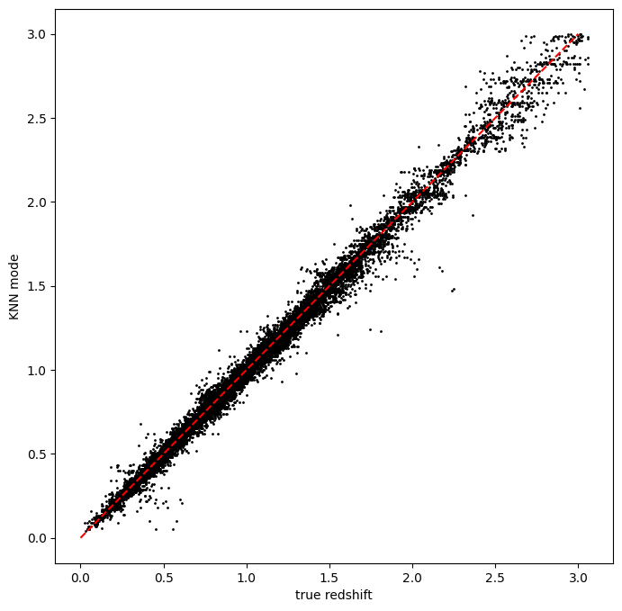

Running RAIL with a different dataset
=====================================

**Authors:** Sam Schmidt

**Last run successfully:** Feb 9, 2026

This is a notebook with a quick example of running a ``rail`` algoritm
with a different dataset and overriding configuration parameters.

Most of our other demo notebooks use small datasets included with the
RAIL demo package, all with the same input names. These datasets are
named consistently with many of the default parameter values used in
RAIL, e.g. ``hdf5_groupname="photometry"`` and ugrizy photometry named
in a pattern ``"mag_{band}_lsst"``, often specified in
``SHARED_PARAMS``.

This notebook will just show a quick run with an alternate dataset,
showing the values that users will likely need to change in order to get
things running.

**Note:** If you’re interested in running this in pipeline mode, see
`16_Running_with_different_data.ipynb <https://github.com/LSSTDESC/rail/blob/main/pipeline_examples/estimation_examples/16_Running_with_different_data.ipynb>`__
in the ``pipeline_examples/estimation_examples/`` folder.

.. code:: ipython3

    import os
    from pathlib import Path
    
    import matplotlib.pyplot as plt
    import tables_io
    
    from rail import interactive as ri
    
    DOWNLOADS_DIR = Path("../examples_data")
    DOWNLOADS_DIR.mkdir(exist_ok=True)

.. parsed-literal::

    Install FSPS with the following commands:
    pip uninstall fsps
    git clone --recursive https://github.com/dfm/python-fsps.git
    cd python-fsps
    python -m pip install .
    export SPS_HOME=$(pwd)/src/fsps/libfsps
    
    LEPHAREDIR is being set to the default cache directory:
    /home/runner/.cache/lephare/data
    More than 1Gb may be written there.
    LEPHAREWORK is being set to the default cache directory:
    /home/runner/.cache/lephare/work
    Default work cache is already linked. 
    This is linked to the run directory:
    /home/runner/.cache/lephare/runs/20260406T121811

.. parsed-literal::

    
    A module that was compiled using NumPy 1.x cannot be run in
    NumPy 2.2.6 as it may crash. To support both 1.x and 2.x
    versions of NumPy, modules must be compiled with NumPy 2.0.
    Some module may need to rebuild instead e.g. with 'pybind11>=2.12'.
    
    If you are a user of the module, the easiest solution will be to
    downgrade to 'numpy<2' or try to upgrade the affected module.
    We expect that some modules will need time to support NumPy 2.
    
    Traceback (most recent call last):  File "/opt/hostedtoolcache/Python/3.10.20/x64/lib/python3.10/runpy.py", line 196, in _run_module_as_main
        return _run_code(code, main_globals, None,
      File "/opt/hostedtoolcache/Python/3.10.20/x64/lib/python3.10/runpy.py", line 86, in _run_code
        exec(code, run_globals)
      File "/opt/hostedtoolcache/Python/3.10.20/x64/lib/python3.10/site-packages/ipykernel_launcher.py", line 18, in <module>
        app.launch_new_instance()
      File "/opt/hostedtoolcache/Python/3.10.20/x64/lib/python3.10/site-packages/traitlets/config/application.py", line 1075, in launch_instance
        app.start()
      File "/opt/hostedtoolcache/Python/3.10.20/x64/lib/python3.10/site-packages/ipykernel/kernelapp.py", line 758, in start
        self.io_loop.start()
      File "/opt/hostedtoolcache/Python/3.10.20/x64/lib/python3.10/site-packages/tornado/platform/asyncio.py", line 211, in start
        self.asyncio_loop.run_forever()
      File "/opt/hostedtoolcache/Python/3.10.20/x64/lib/python3.10/asyncio/base_events.py", line 603, in run_forever
        self._run_once()
      File "/opt/hostedtoolcache/Python/3.10.20/x64/lib/python3.10/asyncio/base_events.py", line 1909, in _run_once
        handle._run()
      File "/opt/hostedtoolcache/Python/3.10.20/x64/lib/python3.10/asyncio/events.py", line 80, in _run
        self._context.run(self._callback, *self._args)
      File "/opt/hostedtoolcache/Python/3.10.20/x64/lib/python3.10/site-packages/ipykernel/utils.py", line 71, in preserve_context
        return await f(*args, **kwargs)
      File "/opt/hostedtoolcache/Python/3.10.20/x64/lib/python3.10/site-packages/ipykernel/kernelbase.py", line 621, in shell_main
        await self.dispatch_shell(msg, subshell_id=subshell_id)
      File "/opt/hostedtoolcache/Python/3.10.20/x64/lib/python3.10/site-packages/ipykernel/kernelbase.py", line 478, in dispatch_shell
        await result
      File "/opt/hostedtoolcache/Python/3.10.20/x64/lib/python3.10/site-packages/ipykernel/ipkernel.py", line 372, in execute_request
        await super().execute_request(stream, ident, parent)
      File "/opt/hostedtoolcache/Python/3.10.20/x64/lib/python3.10/site-packages/ipykernel/kernelbase.py", line 834, in execute_request
        reply_content = await reply_content
      File "/opt/hostedtoolcache/Python/3.10.20/x64/lib/python3.10/site-packages/ipykernel/ipkernel.py", line 464, in do_execute
        res = shell.run_cell(
      File "/opt/hostedtoolcache/Python/3.10.20/x64/lib/python3.10/site-packages/ipykernel/zmqshell.py", line 663, in run_cell
        return super().run_cell(*args, **kwargs)
      File "/opt/hostedtoolcache/Python/3.10.20/x64/lib/python3.10/site-packages/IPython/core/interactiveshell.py", line 3077, in run_cell
        result = self._run_cell(
      File "/opt/hostedtoolcache/Python/3.10.20/x64/lib/python3.10/site-packages/IPython/core/interactiveshell.py", line 3132, in _run_cell
        result = runner(coro)
      File "/opt/hostedtoolcache/Python/3.10.20/x64/lib/python3.10/site-packages/IPython/core/async_helpers.py", line 128, in _pseudo_sync_runner
        coro.send(None)
      File "/opt/hostedtoolcache/Python/3.10.20/x64/lib/python3.10/site-packages/IPython/core/interactiveshell.py", line 3336, in run_cell_async
        has_raised = await self.run_ast_nodes(code_ast.body, cell_name,
      File "/opt/hostedtoolcache/Python/3.10.20/x64/lib/python3.10/site-packages/IPython/core/interactiveshell.py", line 3519, in run_ast_nodes
        if await self.run_code(code, result, async_=asy):
      File "/opt/hostedtoolcache/Python/3.10.20/x64/lib/python3.10/site-packages/IPython/core/interactiveshell.py", line 3579, in run_code
        exec(code_obj, self.user_global_ns, self.user_ns)
      File "/tmp/ipykernel_5956/3836591137.py", line 7, in <module>
        from rail import interactive as ri
      File "/opt/hostedtoolcache/Python/3.10.20/x64/lib/python3.10/site-packages/rail/interactive/__init__.py", line 3, in <module>
        from . import calib, creation, estimation, evaluation, tools
      File "/opt/hostedtoolcache/Python/3.10.20/x64/lib/python3.10/site-packages/rail/interactive/calib/__init__.py", line 3, in <module>
        from rail.utils.interactive.initialize_utils import _initialize_interactive_module
      File "/opt/hostedtoolcache/Python/3.10.20/x64/lib/python3.10/site-packages/rail/utils/interactive/initialize_utils.py", line 17, in <module>
        from rail.utils.interactive.base_utils import (
      File "/opt/hostedtoolcache/Python/3.10.20/x64/lib/python3.10/site-packages/rail/utils/interactive/base_utils.py", line 10, in <module>
        rail.stages.import_and_attach_all(silent=True)
      File "/opt/hostedtoolcache/Python/3.10.20/x64/lib/python3.10/site-packages/rail/stages/__init__.py", line 74, in import_and_attach_all
        RailEnv.import_all_packages(silent=silent)
      File "/opt/hostedtoolcache/Python/3.10.20/x64/lib/python3.10/site-packages/rail/core/introspection.py", line 541, in import_all_packages
        _imported_module = importlib.import_module(pkg)
      File "/opt/hostedtoolcache/Python/3.10.20/x64/lib/python3.10/importlib/__init__.py", line 126, in import_module
        return _bootstrap._gcd_import(name[level:], package, level)
      File "/opt/hostedtoolcache/Python/3.10.20/x64/lib/python3.10/site-packages/rail/som/__init__.py", line 1, in <module>
        from rail.creation.degraders.specz_som import *
      File "/opt/hostedtoolcache/Python/3.10.20/x64/lib/python3.10/site-packages/rail/creation/degraders/specz_som.py", line 15, in <module>
        from somoclu import Somoclu
      File "/opt/hostedtoolcache/Python/3.10.20/x64/lib/python3.10/site-packages/somoclu/__init__.py", line 11, in <module>
        from .train import Somoclu
      File "/opt/hostedtoolcache/Python/3.10.20/x64/lib/python3.10/site-packages/somoclu/train.py", line 25, in <module>
        from .somoclu_wrap import train as wrap_train
      File "/opt/hostedtoolcache/Python/3.10.20/x64/lib/python3.10/site-packages/somoclu/somoclu_wrap.py", line 11, in <module>
        import _somoclu_wrap

::

    ---------------------------------------------------------------------------

    ImportError                               Traceback (most recent call last)

    File /opt/hostedtoolcache/Python/3.10.20/x64/lib/python3.10/site-packages/numpy/core/_multiarray_umath.py:44, in __getattr__(attr_name)
         39     # Also print the message (with traceback).  This is because old versions
         40     # of NumPy unfortunately set up the import to replace (and hide) the
         41     # error.  The traceback shouldn't be needed, but e.g. pytest plugins
         42     # seem to swallow it and we should be failing anyway...
         43     sys.stderr.write(msg + tb_msg)
    ---> 44     raise ImportError(msg)
         46 ret = getattr(_multiarray_umath, attr_name, None)
         47 if ret is None:

    ImportError: 
    A module that was compiled using NumPy 1.x cannot be run in
    NumPy 2.2.6 as it may crash. To support both 1.x and 2.x
    versions of NumPy, modules must be compiled with NumPy 2.0.
    Some module may need to rebuild instead e.g. with 'pybind11>=2.12'.
    
    If you are a user of the module, the easiest solution will be to
    downgrade to 'numpy<2' or try to upgrade the affected module.
    We expect that some modules will need time to support NumPy 2.
    

.. parsed-literal::

    Warning: the binary library cannot be imported. You cannot train maps, but you can load and analyze ones that you have already saved.
    The problem occurs because either compilation failed when you installed Somoclu or a path is missing from the dependencies when you are trying to import it. Please refer to the documentation to see your options.

First, we’ll start with grabbing some small datasets from NERSC, a tar
file with some data drawn from the Roman-Rubin simulation:

.. code:: ipython3

    training_file = DOWNLOADS_DIR / "romanrubin_demo_data.tar"
    
    if not os.path.exists(training_file):
        os.system(
            f"curl -O https://portal.nersc.gov/cfs/lsst/PZ/romanrubin_demo_data.tar --create-dirs --output-dir {DOWNLOADS_DIR}"
        )
    os.system(f"tar -xvf {training_file} --directory {DOWNLOADS_DIR}")

.. parsed-literal::

      % Total    % Received % Xferd  Average Speed   Time    Time     Time  Current
                                     Dload  Upload   Total   Spent    Left  Speed
    
  0     0    0     0    0     0      0      0 --:--:-- --:--:-- --:--:--     0

.. parsed-literal::

    
  8 4670k    8  395k    0     0   597k      0  0:00:07 --:--:--  0:00:07  596k

.. parsed-literal::

    romanrubin_train_data.hdf5
    romanrubin_test_data.hdf5

.. parsed-literal::

    
100 4670k  100 4670k    0     0  3885k      0  0:00:01  0:00:01 --:--:-- 3888k

.. parsed-literal::

    0

Let’s load one of the files and look at the contents:

.. code:: ipython3

    trainFile = DOWNLOADS_DIR / "romanrubin_train_data.hdf5"
    training_data = tables_io.read(trainFile)
    training_data.keys()

.. parsed-literal::

    odict_keys(['H', 'H_err', 'J', 'J_err', 'g', 'g_err', 'i', 'i_err', 'r', 'r_err', 'redshift', 'u', 'u_err', 'y', 'y_err', 'z', 'z_err'])

We can see that, unlike the demo data in other notebooks, there is no
top level hdf5_groupname of “photometry”, the data is directly in the
top level of the hdf5 file. As such, we will need to specify
``hdf5_groupname=""`` to override the default value of ``"photometry"``
in RAIL.

We also see that the magnitudes and errors are simply named with the
band name, e.g. ``"u"`` rather than ``"mag_u_lsst"``. Again, we will
need to specify the band and error names in order to override the
defaults in RAIL. Let’s do that below, using the KNearNeighInformer and
Estimator algorithms:

.. code:: ipython3

    testFile = DOWNLOADS_DIR / "romanrubin_test_data.hdf5"
    test_data = tables_io.read(testFile)

The dataset-specific parameters
-------------------------------

We will need to specify several parameters to override the default
values in RAIL, we can create a dictionary of these and pass those into
the ``make_stage`` for our informer. Because we have Roman J and H, we
will also demonstrate running with 8 bands rather than the default six.

RAIL requires that we specify the names of the input columns as
``bands``, and the input errors on those as ``err_bands``. Most
algorithms also require a ``ref_band``. To handle non-detections, RAIL
uses a dictionary of ``mag_limits`` which must contain keys for all of
the columns in ``bands`` and a float for the value with which the
non-detect will be replaced. You may also need to specify a different
``nondetect_val`` if the dataset has a different convention for
non-detections (in this dataset, our non-detetions have a value of
``np.inf``).

**NOTE:** RAIL uses ``SHARED_PARAMS``, a central location for specifying
a subset of parameters that are common to a dataset, and setting them in
one place when running multiple algorithms. However, any configuration
parameters specified as ``SHARED_PARAMS`` can be overridden in the same
way as any other parameter, there is nothing special about them, and we
will do that here with ``bands``, ``err_bands``, etc…

Let’s set up our dictionary with these values:

.. code:: ipython3

    bands = ["u", "g", "r", "i", "z", "y", "J", "H"]
    errbands = []
    maglims = {}
    limvals = [27.8, 29.0, 29.1, 28.6, 28.0, 27.0, 26.4, 26.4]
    for band, limval in zip(bands, limvals):
        errbands.append(f"{band}_err")
        maglims[band] = limval
    
    
    print(bands)
    print(errbands)
    print(maglims)

.. parsed-literal::

    ['u', 'g', 'r', 'i', 'z', 'y', 'J', 'H']
    ['u_err', 'g_err', 'r_err', 'i_err', 'z_err', 'y_err', 'J_err', 'H_err']
    {'u': 27.8, 'g': 29.0, 'r': 29.1, 'i': 28.6, 'z': 28.0, 'y': 27.0, 'J': 26.4, 'H': 26.4}

.. code:: ipython3

    knn_dict = dict(
        hdf5_groupname="", bands=bands, err_bands=errbands, mag_limits=maglims, ref_band="i"
    )

We can now feed this into our inform stage:

.. code:: ipython3

    pz_model = ri.estimation.algos.k_nearneigh.k_near_neigh_informer(
        training_data=training_data, **knn_dict
    )["model"]

.. parsed-literal::

    Inserting handle into data store.  input: None, KNearNeighInformer
    split into 11250 training and 3750 validation samples
    finding best fit sigma and NNeigh...

.. parsed-literal::

    
    
    
    best fit values are sigma=0.017222222222222222 and numneigh=7
    
    
    
    Inserting handle into data store.  model: inprogress_model.pkl, KNearNeighInformer

We can use the same dictionary to specify overrides for the estimator
stage:

.. code:: ipython3

    results = ri.estimation.algos.k_nearneigh.k_near_neigh_estimator(
        input_data=test_data, model=pz_model, **knn_dict
    )

.. parsed-literal::

    Inserting handle into data store.  input: None, KNearNeighEstimator
    Inserting handle into data store.  model: {'kdtree': <sklearn.neighbors._kd_tree.KDTree object at 0x56132891ba60>, 'bestsig': np.float64(0.017222222222222222), 'nneigh': 7, 'truezs': array([0.61988401, 1.74063779, 1.08068781, ..., 0.25938554, 0.92907312,
           2.84295586], shape=(15000,)), 'only_colors': False}, KNearNeighEstimator
    Process 0 running estimator on chunk 0 - 20,000
    Process 0 estimating PZ PDF for rows 0 - 20,000

.. parsed-literal::

    Inserting handle into data store.  output: inprogress_output.hdf5, KNearNeighEstimator

Let’s plot the mode vs the true redshift to make sure that things ran
properly:

.. code:: ipython3

    zmode = results["output"].ancil["zmode"].flatten()

Let’s plot the redshift mode against the true redshifts to see how they
look:

.. code:: ipython3

    plt.figure(figsize=(8, 8))
    plt.scatter(test_data["redshift"], zmode, s=1, c="k", label="KNN mode")
    plt.plot([0, 3], [0, 3], "r--")
    plt.xlabel("true redshift")
    plt.ylabel("KNN mode")

.. parsed-literal::

    Text(0, 0.5, 'KNN mode')

Yes, things look very nice, and the inclusion of NIR photometry gives us
very little scatter and very few outliers!

Clean up downloaded files
-------------------------

.. code:: ipython3

    for file in [training_file, trainFile, testFile]:
        file.unlink()
