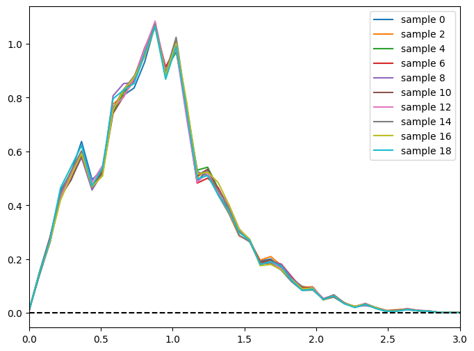
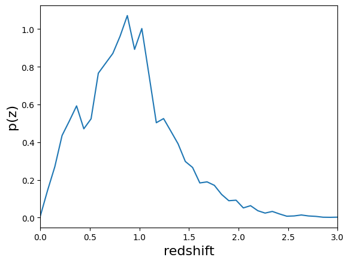
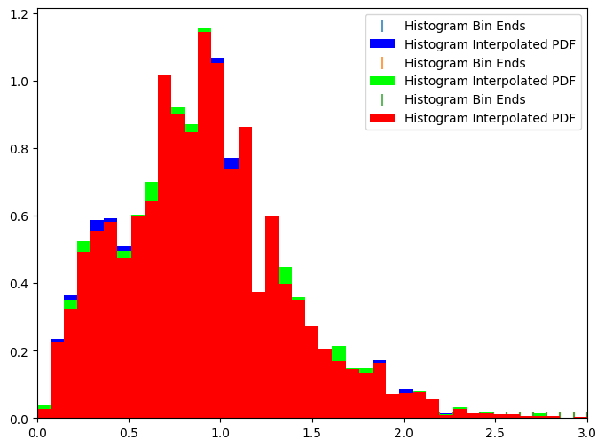
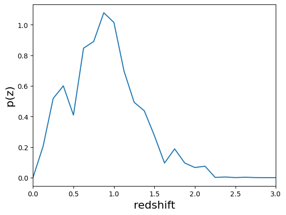
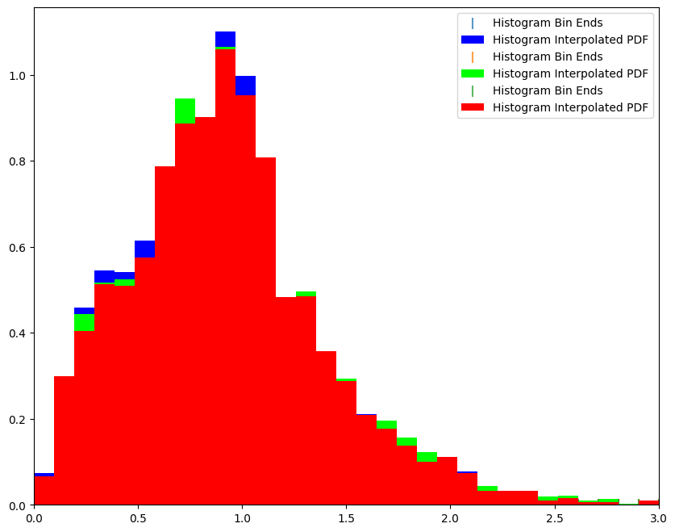
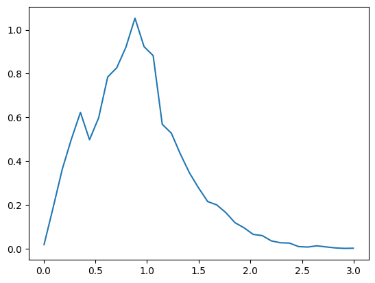
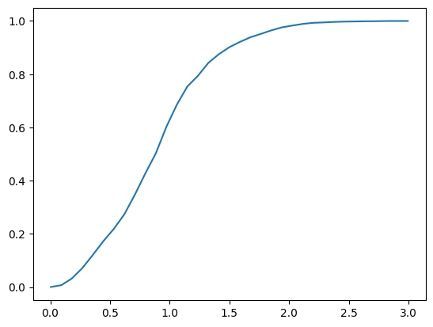
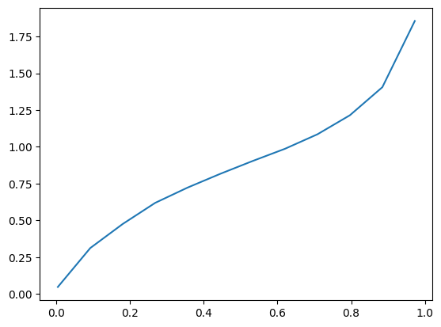
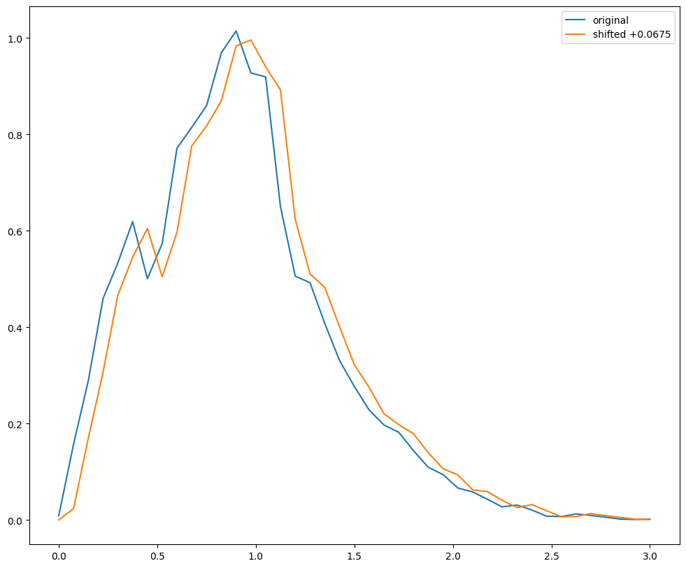

Test Sampled Summarizers
========================

**Author:** Sam Schmidt

**Last successfully run:** Feb 9, 2026

June 28 update: I modified the summarizers to output not just N sample
N(z) distributions (saved to the file specified via the ``output``
keyword), but also the single fiducial N(z) estimate (saved to the file
specified via the ``single_NZ`` keyword). I also updated NZDir and
included it in this example notebook

**Note:** If you’re interested in running this in pipeline mode, see
`13_Sampled_Summarizers.ipynb <https://github.com/LSSTDESC/rail/blob/main/pipeline_examples/estimation_examples/13_Sampled_Summarizers.ipynb>`__
in the ``pipeline_examples/estimation_examples/`` folder.

.. code:: ipython3

    import matplotlib.pyplot as plt
    import numpy as np
    import rail.interactive as ri
    import tables_io
    from rail.utils.path_utils import find_rail_file

.. parsed-literal::

    Install FSPS with the following commands:
    pip uninstall fsps
    git clone --recursive https://github.com/dfm/python-fsps.git
    cd python-fsps
    python -m pip install .
    export SPS_HOME=$(pwd)/src/fsps/libfsps
    
    LEPHAREDIR is being set to the default cache directory:
    /home/runner/.cache/lephare/data
    More than 1Gb may be written there.
    LEPHAREWORK is being set to the default cache directory:
    /home/runner/.cache/lephare/work
    Default work cache is already linked. 
    This is linked to the run directory:
    /home/runner/.cache/lephare/runs/20260330T122231

.. parsed-literal::

    
    A module that was compiled using NumPy 1.x cannot be run in
    NumPy 2.2.6 as it may crash. To support both 1.x and 2.x
    versions of NumPy, modules must be compiled with NumPy 2.0.
    Some module may need to rebuild instead e.g. with 'pybind11>=2.12'.
    
    If you are a user of the module, the easiest solution will be to
    downgrade to 'numpy<2' or try to upgrade the affected module.
    We expect that some modules will need time to support NumPy 2.
    
    Traceback (most recent call last):  File "/opt/hostedtoolcache/Python/3.10.20/x64/lib/python3.10/runpy.py", line 196, in _run_module_as_main
        return _run_code(code, main_globals, None,
      File "/opt/hostedtoolcache/Python/3.10.20/x64/lib/python3.10/runpy.py", line 86, in _run_code
        exec(code, run_globals)
      File "/opt/hostedtoolcache/Python/3.10.20/x64/lib/python3.10/site-packages/ipykernel_launcher.py", line 18, in <module>
        app.launch_new_instance()
      File "/opt/hostedtoolcache/Python/3.10.20/x64/lib/python3.10/site-packages/traitlets/config/application.py", line 1075, in launch_instance
        app.start()
      File "/opt/hostedtoolcache/Python/3.10.20/x64/lib/python3.10/site-packages/ipykernel/kernelapp.py", line 758, in start
        self.io_loop.start()
      File "/opt/hostedtoolcache/Python/3.10.20/x64/lib/python3.10/site-packages/tornado/platform/asyncio.py", line 211, in start
        self.asyncio_loop.run_forever()
      File "/opt/hostedtoolcache/Python/3.10.20/x64/lib/python3.10/asyncio/base_events.py", line 603, in run_forever
        self._run_once()
      File "/opt/hostedtoolcache/Python/3.10.20/x64/lib/python3.10/asyncio/base_events.py", line 1909, in _run_once
        handle._run()
      File "/opt/hostedtoolcache/Python/3.10.20/x64/lib/python3.10/asyncio/events.py", line 80, in _run
        self._context.run(self._callback, *self._args)
      File "/opt/hostedtoolcache/Python/3.10.20/x64/lib/python3.10/site-packages/ipykernel/utils.py", line 71, in preserve_context
        return await f(*args, **kwargs)
      File "/opt/hostedtoolcache/Python/3.10.20/x64/lib/python3.10/site-packages/ipykernel/kernelbase.py", line 621, in shell_main
        await self.dispatch_shell(msg, subshell_id=subshell_id)
      File "/opt/hostedtoolcache/Python/3.10.20/x64/lib/python3.10/site-packages/ipykernel/kernelbase.py", line 478, in dispatch_shell
        await result
      File "/opt/hostedtoolcache/Python/3.10.20/x64/lib/python3.10/site-packages/ipykernel/ipkernel.py", line 372, in execute_request
        await super().execute_request(stream, ident, parent)
      File "/opt/hostedtoolcache/Python/3.10.20/x64/lib/python3.10/site-packages/ipykernel/kernelbase.py", line 834, in execute_request
        reply_content = await reply_content
      File "/opt/hostedtoolcache/Python/3.10.20/x64/lib/python3.10/site-packages/ipykernel/ipkernel.py", line 464, in do_execute
        res = shell.run_cell(
      File "/opt/hostedtoolcache/Python/3.10.20/x64/lib/python3.10/site-packages/ipykernel/zmqshell.py", line 663, in run_cell
        return super().run_cell(*args, **kwargs)
      File "/opt/hostedtoolcache/Python/3.10.20/x64/lib/python3.10/site-packages/IPython/core/interactiveshell.py", line 3077, in run_cell
        result = self._run_cell(
      File "/opt/hostedtoolcache/Python/3.10.20/x64/lib/python3.10/site-packages/IPython/core/interactiveshell.py", line 3132, in _run_cell
        result = runner(coro)
      File "/opt/hostedtoolcache/Python/3.10.20/x64/lib/python3.10/site-packages/IPython/core/async_helpers.py", line 128, in _pseudo_sync_runner
        coro.send(None)
      File "/opt/hostedtoolcache/Python/3.10.20/x64/lib/python3.10/site-packages/IPython/core/interactiveshell.py", line 3336, in run_cell_async
        has_raised = await self.run_ast_nodes(code_ast.body, cell_name,
      File "/opt/hostedtoolcache/Python/3.10.20/x64/lib/python3.10/site-packages/IPython/core/interactiveshell.py", line 3519, in run_ast_nodes
        if await self.run_code(code, result, async_=asy):
      File "/opt/hostedtoolcache/Python/3.10.20/x64/lib/python3.10/site-packages/IPython/core/interactiveshell.py", line 3579, in run_code
        exec(code_obj, self.user_global_ns, self.user_ns)
      File "/tmp/ipykernel_7867/4087826718.py", line 3, in <module>
        import rail.interactive as ri
      File "/opt/hostedtoolcache/Python/3.10.20/x64/lib/python3.10/site-packages/rail/interactive/__init__.py", line 3, in <module>
        from . import calib, creation, estimation, evaluation, tools
      File "/opt/hostedtoolcache/Python/3.10.20/x64/lib/python3.10/site-packages/rail/interactive/calib/__init__.py", line 3, in <module>
        from rail.utils.interactive.initialize_utils import _initialize_interactive_module
      File "/opt/hostedtoolcache/Python/3.10.20/x64/lib/python3.10/site-packages/rail/utils/interactive/initialize_utils.py", line 17, in <module>
        from rail.utils.interactive.base_utils import (
      File "/opt/hostedtoolcache/Python/3.10.20/x64/lib/python3.10/site-packages/rail/utils/interactive/base_utils.py", line 10, in <module>
        rail.stages.import_and_attach_all(silent=True)
      File "/opt/hostedtoolcache/Python/3.10.20/x64/lib/python3.10/site-packages/rail/stages/__init__.py", line 74, in import_and_attach_all
        RailEnv.import_all_packages(silent=silent)
      File "/opt/hostedtoolcache/Python/3.10.20/x64/lib/python3.10/site-packages/rail/core/introspection.py", line 541, in import_all_packages
        _imported_module = importlib.import_module(pkg)
      File "/opt/hostedtoolcache/Python/3.10.20/x64/lib/python3.10/importlib/__init__.py", line 126, in import_module
        return _bootstrap._gcd_import(name[level:], package, level)
      File "/opt/hostedtoolcache/Python/3.10.20/x64/lib/python3.10/site-packages/rail/som/__init__.py", line 1, in <module>
        from rail.creation.degraders.specz_som import *
      File "/opt/hostedtoolcache/Python/3.10.20/x64/lib/python3.10/site-packages/rail/creation/degraders/specz_som.py", line 15, in <module>
        from somoclu import Somoclu
      File "/opt/hostedtoolcache/Python/3.10.20/x64/lib/python3.10/site-packages/somoclu/__init__.py", line 11, in <module>
        from .train import Somoclu
      File "/opt/hostedtoolcache/Python/3.10.20/x64/lib/python3.10/site-packages/somoclu/train.py", line 25, in <module>
        from .somoclu_wrap import train as wrap_train
      File "/opt/hostedtoolcache/Python/3.10.20/x64/lib/python3.10/site-packages/somoclu/somoclu_wrap.py", line 11, in <module>
        import _somoclu_wrap

::

    ---------------------------------------------------------------------------

    ImportError                               Traceback (most recent call last)

    File /opt/hostedtoolcache/Python/3.10.20/x64/lib/python3.10/site-packages/numpy/core/_multiarray_umath.py:44, in __getattr__(attr_name)
         39     # Also print the message (with traceback).  This is because old versions
         40     # of NumPy unfortunately set up the import to replace (and hide) the
         41     # error.  The traceback shouldn't be needed, but e.g. pytest plugins
         42     # seem to swallow it and we should be failing anyway...
         43     sys.stderr.write(msg + tb_msg)
    ---> 44     raise ImportError(msg)
         46 ret = getattr(_multiarray_umath, attr_name, None)
         47 if ret is None:

    ImportError: 
    A module that was compiled using NumPy 1.x cannot be run in
    NumPy 2.2.6 as it may crash. To support both 1.x and 2.x
    versions of NumPy, modules must be compiled with NumPy 2.0.
    Some module may need to rebuild instead e.g. with 'pybind11>=2.12'.
    
    If you are a user of the module, the easiest solution will be to
    downgrade to 'numpy<2' or try to upgrade the affected module.
    We expect that some modules will need time to support NumPy 2.
    

.. parsed-literal::

    Warning: the binary library cannot be imported. You cannot train maps, but you can load and analyze ones that you have already saved.
    The problem occurs because either compilation failed when you installed Somoclu or a path is missing from the dependencies when you are trying to import it. Please refer to the documentation to see your options.

To create some N(z) distributions, we’ll want some PDFs to work with
first, for a quick demo let’s just run some photo-z’s using the
KNearNeighEstimator estimator using the 10,000 training galaxies to
generate ~20,000 PDFs using data from healpix 9816 of cosmoDC2_v1.1.4
that are included in the RAIL repo:

.. code:: ipython3

    knn_dict = dict(
        zmin=0.0,
        zmax=3.0,
        nzbins=301,
        trainfrac=0.75,
        sigma_grid_min=0.01,
        sigma_grid_max=0.07,
        ngrid_sigma=10,
        nneigh_min=3,
        nneigh_max=7,
        hdf5_groupname="photometry",
    )

.. code:: ipython3

    trainFile = find_rail_file("examples_data/testdata/test_dc2_training_9816.hdf5")
    testFile = find_rail_file("examples_data/testdata/test_dc2_validation_9816.hdf5")
    training_data = tables_io.read(trainFile)
    test_data = tables_io.read(testFile)

.. code:: ipython3

    # train knnpz
    model = ri.estimation.algos.k_nearneigh.k_near_neigh_informer(
        training_data=training_data, **knn_dict
    )["model"]

.. parsed-literal::

    Inserting handle into data store.  input: None, KNearNeighInformer
    split into 7669 training and 2556 validation samples
    finding best fit sigma and NNeigh...

.. parsed-literal::

    
    
    
    best fit values are sigma=0.023333333333333334 and numneigh=7
    
    
    
    Inserting handle into data store.  model: inprogress_model.pkl, KNearNeighInformer

.. code:: ipython3

    qp_data = ri.estimation.algos.k_nearneigh.k_near_neigh_estimator(
        input_data=test_data, model=model
    )["output"]

.. parsed-literal::

    Inserting handle into data store.  input: None, KNearNeighEstimator
    Inserting handle into data store.  model: {'kdtree': <sklearn.neighbors._kd_tree.KDTree object at 0x55f23138b460>, 'bestsig': np.float64(0.023333333333333334), 'nneigh': 7, 'truezs': array([0.02043499, 0.01936132, 0.03672067, ..., 2.97927326, 2.98694714,
           2.97646626], shape=(10225,)), 'only_colors': False}, KNearNeighEstimator
    Process 0 running estimator on chunk 0 - 20,449
    Process 0 estimating PZ PDF for rows 0 - 20,449

.. parsed-literal::

    Inserting handle into data store.  output: inprogress_output.hdf5, KNearNeighEstimator

So, ``qp_data`` now contains the 20,000 PDFs from KNearNeighEstimator,
we can feed this in to three summarizers to generate an overall N(z)
distribution. We won’t bother with any tomographic selections for this
demo, just the overall N(z). It is stored as ``qp_data``, but has also
been saved to disk as ``output_KNN.fits`` as an astropy table. If you
want to read in this data to grab the qp Ensemble at a later stage, you
can do this via qp with a ``ens = qp.read("output_KNN.fits")``

I coded up **quick and dirty** bootstrap versions of the
``NaiveStackSummarizer``, ``PointEstHistSummarizer``, and
``VarInference`` sumarizers. These are not optimized, not parallel
(issue created for future update), but they do produce N different
bootstrap realizations of the overall N(z) which are returned as a qp
Ensemble (Note: the previous versions of these degraders returned only
the single overall N(z) rather than samples).

Naive Stack
-----------

Naive stack just “stacks” i.e. sums up, the PDFs and returns a qp.interp
distribution with bins defined by np.linspace(zmin, zmax, nzbins), we
will create a stack with 41 bins and generate 20 bootstrap realizations

.. code:: ipython3

    naive_results = ri.estimation.algos.naive_stack.naive_stack_summarizer(
        input_data=qp_data,
        zmin=0.0,
        zmax=3.0,
        nzbins=41,
        n_samples=20,
    )

.. parsed-literal::

    Inserting handle into data store.  input: None, NaiveStackSummarizer
    Process 0 running estimator on chunk 0 - 20,449

.. parsed-literal::

    Inserting handle into data store.  output: inprogress_output.hdf5, NaiveStackSummarizer
    Inserting handle into data store.  single_NZ: inprogress_single_NZ.hdf5, NaiveStackSummarizer

The results are now in naive_results, but because of the DataStore, the
actual *ensemble* is stored in ``.data``, let’s grab the ensemble and
plot a few of the bootstrap sample N(z) estimates:

.. code:: ipython3

    newens = naive_results["output"]

.. code:: ipython3

    fig, axs = plt.subplots(figsize=(8, 6))
    for i in range(0, 20, 2):
        newens[i].plot_native(axes=axs, label=f"sample {i}")
    axs.plot([0, 3], [0, 0], "k--")
    axs.set_xlim(0, 3)
    axs.legend(loc="upper right")

.. parsed-literal::

    <matplotlib.legend.Legend at 0x7f4960b1f820>

The summarizer also outputs a **second** file containing the fiducial
N(z). We saved the fiducial N(z) in the file “NaiveStack_NZ.hdf5”, let’s
grab the N(z) estimate with qp and plot it with the native plotter:

.. code:: ipython3

    naive_nz = naive_results["single_NZ"]
    naive_nz.plot_native(xlim=(0, 3))

.. parsed-literal::

    <Axes: xlabel='redshift', ylabel='p(z)'>

Point Estimate Hist
-------------------

PointEstHistSummarizer takes the point estimate mode of each PDF and
then histograms these, we’ll again generate 41 bootstrap samples of this
and plot a few of the resultant histograms. Note: For some reason the
plotting on the histogram distribution in qp is a little wonky, it
appears alpha is broken, so this plot is not the best:

.. code:: ipython3

    pens = ri.estimation.algos.point_est_hist.point_est_hist_summarizer(
        input_data=qp_data,
        zmin=0.0,
        zmax=3.0,
        nzbins=41,
        n_samples=20,
    )["output"]

.. parsed-literal::

    Inserting handle into data store.  input: None, PointEstHistSummarizer
    Process 0 running estimator on chunk 0 - 20,449

.. parsed-literal::

    Inserting handle into data store.  output: inprogress_output.hdf5, PointEstHistSummarizer
    Inserting handle into data store.  single_NZ: inprogress_single_NZ.hdf5, PointEstHistSummarizer

.. code:: ipython3

    fig, axs = plt.subplots(figsize=(8, 6))
    pens[0].plot_native(axes=axs, fc=[0, 0, 1, 0.01])
    pens[1].plot_native(axes=axs, fc=[0, 1, 0, 0.01])
    pens[4].plot_native(axes=axs, fc=[1, 0, 0, 0.01])
    axs.set_xlim(0, 3)
    axs.legend()

.. parsed-literal::

    <matplotlib.legend.Legend at 0x7f4960b1d9c0>

Again, we have saved the fiducial N(z) in a separate file,
“point_NZ.hdf5”, we could read that data in if we desired.

VarInfStackSummarizer
---------------------

VarInfStackSummarizer implements Markus’ variational inference scheme
and returns qp.interp gridded distribution. VarInfStackSummarizer tends
to get a little wonky if you use too many bins, so we’ll only use 25
bins. Again let’s generate 20 samples and plot a few:

.. code:: ipython3

    vens = ri.estimation.algos.var_inf.var_inf_stack_summarizer(
        input_data=qp_data, zmin=0.0, zmax=3.0, nzbins=25, niter=10, n_samples=10
    )
    vens

.. parsed-literal::

    Inserting handle into data store.  input: None, VarInfStackSummarizer
    Process 0 running estimator on chunk 0 - 20,449

.. parsed-literal::

    Inserting handle into data store.  output: inprogress_output.hdf5, VarInfStackSummarizer
    Inserting handle into data store.  single_NZ: inprogress_single_NZ.hdf5, VarInfStackSummarizer

.. parsed-literal::

    {'output': Ensemble(the_class=interp,shape=(10, 25)),
     'single_NZ': Ensemble(the_class=interp,shape=(1, 25))}

Let’s plot the fiducial N(z) for this distribution:

.. code:: ipython3

    varinf_nz = vens["single_NZ"]
    varinf_nz.plot_native(xlim=(0, 3))

.. parsed-literal::

    <Axes: xlabel='redshift', ylabel='p(z)'>

NZDir
-----

NZDirSummarizer is a different type of summarizer, taking a weighted set
of neighbors to a set of training spectroscopic objects to reconstruct
the redshift distribution of the photometric sample. I implemented a
bootstrap of the **spectroscopic data** rather than the photometric
data, both because it was much easier computationally, and I think that
the spectroscopic variance is more important to take account of than
simple bootstrap of the large photometric sample. We must first run the
``inform_NZDir`` stage to train up the K nearest neigh tree used by
NZDirSummarizer, then we will run ``NZDirSummarizer`` to actually
construct the N(z) estimate.

Like PointEstHistSummarizer NZDirSummarizer returns a qp.hist ensemble
of samples

.. code:: ipython3

    nzdir_model = ri.estimation.algos.nz_dir.nz_dir_informer(
        training_data=training_data, n_neigh=8
    )["model"]

.. parsed-literal::

    Inserting handle into data store.  input: None, NZDirInformer
    Inserting handle into data store.  model: inprogress_model.pkl, NZDirInformer

.. code:: ipython3

    nzd_summary = ri.estimation.algos.nz_dir.nz_dir_summarizer(
        input_data=test_data,
        leafsize=20,
        zmin=0.0,
        zmax=3.0,
        nzbins=31,
        model=nzdir_model,
        hdf5_groupname="photometry",
    )

.. parsed-literal::

    Inserting handle into data store.  input: None, NZDirSummarizer
    Inserting handle into data store.  model: {'distances': array([3.93343151, 0.99550861, 0.502487  , ..., 0.55141209, 0.52943015,
           0.34063373], shape=(10225,)), 'szusecols': ['mag_u_lsst', 'mag_g_lsst', 'mag_r_lsst', 'mag_i_lsst', 'mag_z_lsst', 'mag_y_lsst'], 'szweights': array([1., 1., 1., ..., 1., 1., 1.], shape=(10225,)), 'szvec': array([0.02043499, 0.01936132, 0.03672067, ..., 2.97927326, 2.98694714,
           2.97646626], shape=(10225,)), 'sz_mag_data': array([[18.040369, 16.960892, 16.653412, 16.50631 , 16.466377, 16.423904],
           [21.61559 , 20.709402, 20.533852, 20.437565, 20.408886, 20.38821 ],
           [21.851952, 20.437067, 19.709715, 19.31263 , 18.953411, 18.770441],
           ...,
           [25.185795, 24.11405 , 23.828472, 23.711334, 23.75624 , 23.83491 ],
           [26.682219, 25.068745, 24.770744, 24.587885, 24.786388, 24.673431],
           [26.926563, 25.552408, 24.984402, 24.891462, 24.842054, 24.777039]],
          shape=(10225, 6), dtype=float32)}, NZDirSummarizer
    Process 0 running estimator on chunk 0 - 20449

.. parsed-literal::

    Inserting handle into data store.  single_NZ: inprogress_single_NZ.hdf5, NZDirSummarizer
    Inserting handle into data store.  output: inprogress_output.hdf5, NZDirSummarizer

.. code:: ipython3

    nzd_ens = nzd_summary["output"]
    nzdir_nz = nzd_summary["single_NZ"]

.. code:: ipython3

    fig, axs = plt.subplots(figsize=(10, 8))
    nzd_ens[0].plot_native(axes=axs, fc=[0, 0, 1, 0.01])
    nzd_ens[1].plot_native(axes=axs, fc=[0, 1, 0, 0.01])
    nzd_ens[4].plot_native(axes=axs, fc=[1, 0, 0, 0.01])
    axs.set_xlim(0, 3)
    axs.legend()

.. parsed-literal::

    <matplotlib.legend.Legend at 0x7f4917dee5f0>

As we also wrote out the single estimate of N(z) we can read that data
from the second file written (specified by the ``single_NZ`` argument
given in NZDirSummarizer.make_stage above, in this case “NZDir_NZ.hdf5”)

.. code:: ipython3

    nzdir_nz.plot_native(xlim=(0, 3))

.. parsed-literal::

    <Axes: xlabel='redshift', ylabel='p(z)'>

.. image:: Sampled_Summarizers_files/Sampled_Summarizers_30_1.png

Results
-------

All three results files are qp distributions, NaiveStackSummarizer and
VarInfStackSummarizer return qp.interp distributions while
PointEstHistSummarizer returns a qp.histogram distribution. Even with
the different distributions you can use qp functionality to do things
like determine the means, modes, etc… of the distributions. You could
then use the std dev of any of these to estimate a 1 sigma “shift”, etc…

.. code:: ipython3

    zgrid = np.linspace(0, 3, 41)
    names = ["naive", "point", "varinf", "nzdir"]
    enslist = [newens, pens, vens["output"], nzd_ens]
    results_dict = {}
    for nm, en in zip(names, enslist):
        results_dict[f"{nm}_modes"] = en.mode(grid=zgrid).flatten()
        results_dict[f"{nm}_means"] = en.mean().flatten()
        results_dict[f"{nm}_std"] = en.std().flatten()

.. code:: ipython3

    results_dict

.. parsed-literal::

    {'naive_modes': array([0.9, 0.9, 0.9, 0.9, 0.9, 0.9, 0.9, 0.9, 0.9, 0.9, 0.9, 0.9, 0.9,
            0.9, 0.9, 0.9, 0.9, 0.9, 0.9, 0.9]),
     'naive_means': array([0.90186015, 0.90594959, 0.90998413, 0.90789723, 0.91061713,
            0.91218896, 0.90767783, 0.90533378, 0.90791096, 0.90745548,
            0.91191782, 0.90432094, 0.90620407, 0.9087479 , 0.90410093,
            0.91160362, 0.90904143, 0.90900628, 0.89714565, 0.9139707 ]),
     'naive_std': array([0.45914047, 0.45888175, 0.45996851, 0.45790462, 0.45714307,
            0.46346092, 0.45902071, 0.45676502, 0.45571704, 0.45996679,
            0.45816316, 0.4557761 , 0.45894757, 0.45615512, 0.45516466,
            0.45840581, 0.4548986 , 0.4602565 , 0.45546553, 0.45910612]),
     'point_modes': array([0.9, 0.9, 0.9, 0.9, 0.9, 0.9, 0.9, 0.9, 0.9, 0.9, 0.9, 0.9, 0.9,
            0.9, 0.9, 0.9, 0.9, 0.9, 0.9, 0.9]),
     'point_means': array([0.89950191, 0.90316242, 0.90687302, 0.90601783, 0.90864065,
            0.90872653, 0.90396036, 0.90296562, 0.90483344, 0.90456865,
            0.90957456, 0.90098687, 0.9043146 , 0.90417863, 0.90164168,
            0.90770316, 0.90771032, 0.90617885, 0.89527605, 0.90990018]),
     'point_std': array([0.451436  , 0.4514502 , 0.45148951, 0.45006287, 0.45043543,
            0.45565337, 0.44891521, 0.4484236 , 0.44829022, 0.4508991 ,
            0.4500663 , 0.4485642 , 0.45077344, 0.44607659, 0.44649072,
            0.44982927, 0.44799803, 0.45198245, 0.44738948, 0.44999159]),
     'varinf_modes': array([0.9  , 0.9  , 0.9  , 0.9  , 0.975, 0.9  , 0.9  , 0.9  , 0.9  ,
            0.9  ]),
     'varinf_means': array([0.89003845, 0.89392636, 0.89344345, 0.89527312, 0.89632345,
            0.89302009, 0.89468313, 0.89474443, 0.88888415, 0.89065952]),
     'varinf_std': array([0.42668055, 0.43098261, 0.42998022, 0.42472522, 0.42612753,
            0.4260668 , 0.4298318 , 0.42863912, 0.42913894, 0.42877965]),
     'nzdir_modes': array([0.9, 0.9, 0.9, 0.9, 0.9, 0.9, 0.9, 0.9, 0.9, 0.9, 0.9, 0.9, 0.9,
            0.9, 0.9, 0.9, 0.9, 0.9, 0.9, 0.9]),
     'nzdir_means': array([0.91527627, 0.92144451, 0.92166271, 0.92410584, 0.92118734,
            0.91847357, 0.92651638, 0.91452663, 0.92038542, 0.92942564,
            0.93107928, 0.91022267, 0.92142493, 0.92510869, 0.91931933,
            0.92364447, 0.919305  , 0.92659316, 0.91014124, 0.92499533]),
     'nzdir_std': array([0.46761557, 0.47080438, 0.46766624, 0.46515462, 0.46097655,
            0.46587178, 0.46626591, 0.46660589, 0.4646169 , 0.47014536,
            0.47077795, 0.46410977, 0.46431021, 0.46323947, 0.46435023,
            0.47121424, 0.46146407, 0.46880833, 0.46674124, 0.46798514])}

You can also use qp to compute quantities the pdf, cdf, ppf, etc… on any
grid that you want, much of the functionality of scipy.stats
distributions have been inherited by qp ensembles

.. code:: ipython3

    newgrid = np.linspace(0.005, 2.995, 35)
    naive_pdf = newens.pdf(newgrid)
    point_cdf = pens.cdf(newgrid)
    var_ppf = vens["output"].ppf(newgrid)

.. code:: ipython3

    plt.plot(newgrid, naive_pdf[0])

.. parsed-literal::

    [<matplotlib.lines.Line2D at 0x7f4917de8370>]

.. code:: ipython3

    plt.plot(newgrid, point_cdf[0])

.. parsed-literal::

    [<matplotlib.lines.Line2D at 0x7f4917d60f10>]

.. code:: ipython3

    plt.plot(newgrid, var_ppf[0])

.. parsed-literal::

    [<matplotlib.lines.Line2D at 0x7f4917eb56c0>]

Shifts
------

If you want to “shift” a PDF, you can just evaluate the PDF on a shifted
grid, for example to shift the PDF by +0.0375 in redshift you could
evaluate on a shifted grid. For now we can just do this “by hand”, we
could easily implement ``shift`` functionality in qp, I think.

.. code:: ipython3

    def_grid = np.linspace(0.0, 3.0, 41)
    shift_grid = def_grid - 0.0675
    native_nz = newens.pdf(def_grid)
    shift_nz = newens.pdf(shift_grid)

.. code:: ipython3

    fig = plt.figure(figsize=(12, 10))
    plt.plot(def_grid, native_nz[0], label="original")
    plt.plot(def_grid, shift_nz[0], label="shifted +0.0675")
    plt.legend(loc="upper right")

.. parsed-literal::

    <matplotlib.legend.Legend at 0x7f4917eafc70>

You can estimate how much shift you might expect based on the statistics
of our bootstrap samples, say the std dev of the means for the
NZDir-derived distribution:

.. code:: ipython3

    results_dict["nzdir_means"]

.. parsed-literal::

    array([0.91527627, 0.92144451, 0.92166271, 0.92410584, 0.92118734,
           0.91847357, 0.92651638, 0.91452663, 0.92038542, 0.92942564,
           0.93107928, 0.91022267, 0.92142493, 0.92510869, 0.91931933,
           0.92364447, 0.919305  , 0.92659316, 0.91014124, 0.92499533])

.. code:: ipython3

    spread = np.std(results_dict["nzdir_means"])

.. code:: ipython3

    spread

.. parsed-literal::

    np.float64(0.005498408843907313)

Again, not a huge spread in predicted mean redshifts based solely on
bootstraps, even with only ~20,000 galaxies.
