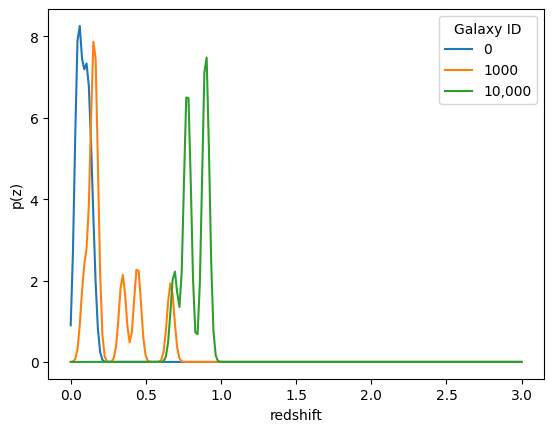
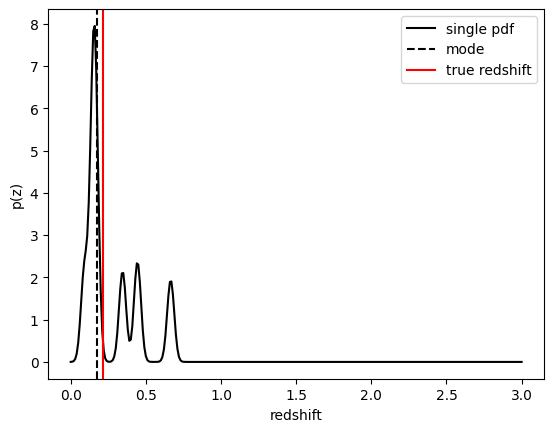
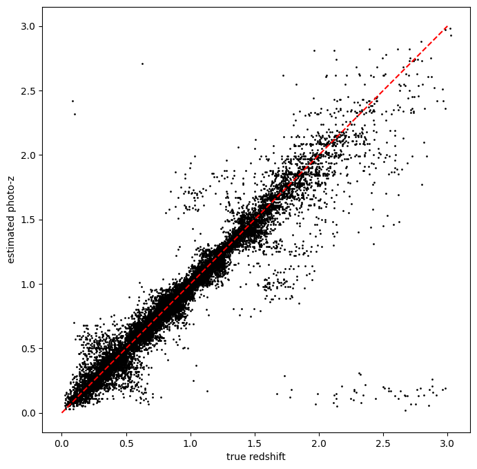
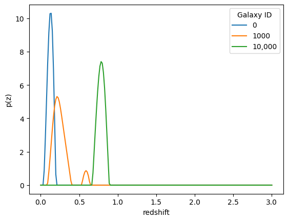
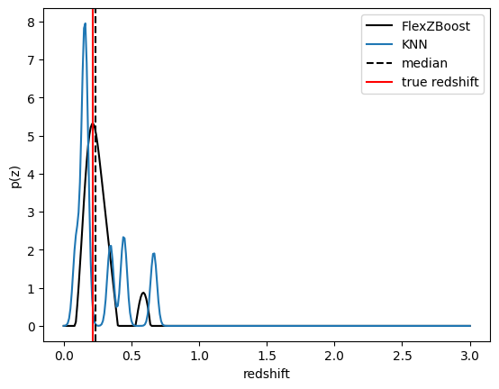
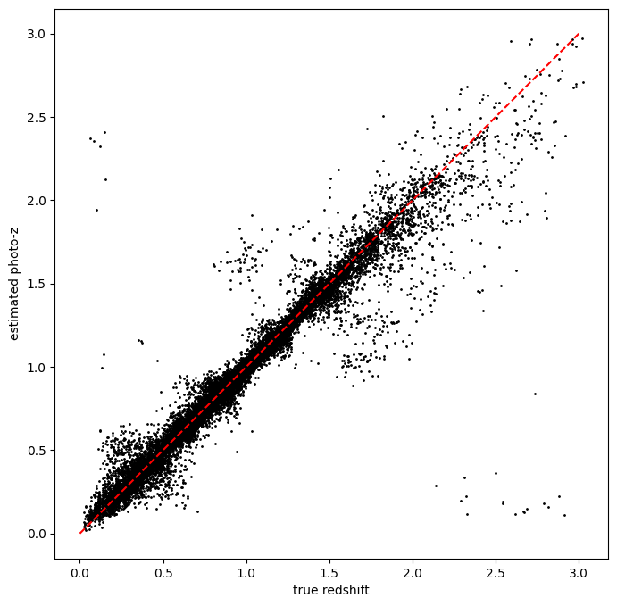

Using Photometry to Estimate Photometric Redshifts
==================================================

**Authors:** Jennifer Scora, Tai Withers, Mubdi Rahman

**Last run successfully:** Feb 9, 2026

This notebook covers the basics of using real galaxy photometry to
estimate photometric redshifts with RAIL. We will use a couple of the
RAIL algorithms to do this, to get a sense of the differences between
algorithms and how they work. We’ll go through the following steps:

1. Setting up your data
2. Estimating redshifts with ``k-Nearest Neighbours`` (KNN)

   -  this includes how to save the redshifts to file or convert them to
      other data formats

3. Estimating redshifts with ``FlexZBoost``

Before we get started, here’s a quick introduction to some of the
features of RAIL interactive mode. The only RAIL package you need to
import is the ``rail.interactive`` package. This contains all of the
interactive functions for all of the RAIL algorithms. You may need to
import supporting functions that are not part of a stage separately. To
get a sense of what functions/stages are available and for some more
detailed instructions, see `the RAIL
documentation <https://rail-hub.readthedocs.io/en/latest/source/user_guide/interactive_usage.html>`__.
For a tutorial that goes through some of the steps covered in this
notebook, you can watch `this tutorial
recording. <https://discovery-alliance.slack.com/files/U2N50LSP8/F0AJ0ULM2JD/fw__meeting_assets_for_desc_pz_are_ready_?origin_team=T06D204F2&origin_channel=Vall_threads>`__.

.. code:: ipython3

    import pickle
    
    import matplotlib.pyplot as plt
    import numpy as np
    import qp
    
    # import the packages we'll need
    import rail.interactive as ri
    import tables_io
    from rail.utils.path_utils import find_rail_file


.. parsed-literal::

    Install FSPS with the following commands:
    pip uninstall fsps
    git clone --recursive https://github.com/dfm/python-fsps.git
    cd python-fsps
    python -m pip install .
    export SPS_HOME=$(pwd)/src/fsps/libfsps
    
    LEPHAREDIR is being set to the default cache directory:
    /home/runner/.cache/lephare/data
    More than 1Gb may be written there.
    LEPHAREWORK is being set to the default cache directory:
    /home/runner/.cache/lephare/work
    Default work cache is already linked. 
    This is linked to the run directory:
    /home/runner/.cache/lephare/runs/20260420T122630


.. parsed-literal::

    
    A module that was compiled using NumPy 1.x cannot be run in
    NumPy 2.2.6 as it may crash. To support both 1.x and 2.x
    versions of NumPy, modules must be compiled with NumPy 2.0.
    Some module may need to rebuild instead e.g. with 'pybind11>=2.12'.
    
    If you are a user of the module, the easiest solution will be to
    downgrade to 'numpy<2' or try to upgrade the affected module.
    We expect that some modules will need time to support NumPy 2.
    
    Traceback (most recent call last):  File "/opt/hostedtoolcache/Python/3.10.20/x64/lib/python3.10/runpy.py", line 196, in _run_module_as_main
        return _run_code(code, main_globals, None,
      File "/opt/hostedtoolcache/Python/3.10.20/x64/lib/python3.10/runpy.py", line 86, in _run_code
        exec(code, run_globals)
      File "/opt/hostedtoolcache/Python/3.10.20/x64/lib/python3.10/site-packages/ipykernel_launcher.py", line 18, in <module>
        app.launch_new_instance()
      File "/opt/hostedtoolcache/Python/3.10.20/x64/lib/python3.10/site-packages/traitlets/config/application.py", line 1075, in launch_instance
        app.start()
      File "/opt/hostedtoolcache/Python/3.10.20/x64/lib/python3.10/site-packages/ipykernel/kernelapp.py", line 758, in start
        self.io_loop.start()
      File "/opt/hostedtoolcache/Python/3.10.20/x64/lib/python3.10/site-packages/tornado/platform/asyncio.py", line 211, in start
        self.asyncio_loop.run_forever()
      File "/opt/hostedtoolcache/Python/3.10.20/x64/lib/python3.10/asyncio/base_events.py", line 603, in run_forever
        self._run_once()
      File "/opt/hostedtoolcache/Python/3.10.20/x64/lib/python3.10/asyncio/base_events.py", line 1909, in _run_once
        handle._run()
      File "/opt/hostedtoolcache/Python/3.10.20/x64/lib/python3.10/asyncio/events.py", line 80, in _run
        self._context.run(self._callback, *self._args)
      File "/opt/hostedtoolcache/Python/3.10.20/x64/lib/python3.10/site-packages/ipykernel/utils.py", line 71, in preserve_context
        return await f(*args, **kwargs)
      File "/opt/hostedtoolcache/Python/3.10.20/x64/lib/python3.10/site-packages/ipykernel/kernelbase.py", line 621, in shell_main
        await self.dispatch_shell(msg, subshell_id=subshell_id)
      File "/opt/hostedtoolcache/Python/3.10.20/x64/lib/python3.10/site-packages/ipykernel/kernelbase.py", line 478, in dispatch_shell
        await result
      File "/opt/hostedtoolcache/Python/3.10.20/x64/lib/python3.10/site-packages/ipykernel/ipkernel.py", line 372, in execute_request
        await super().execute_request(stream, ident, parent)
      File "/opt/hostedtoolcache/Python/3.10.20/x64/lib/python3.10/site-packages/ipykernel/kernelbase.py", line 834, in execute_request
        reply_content = await reply_content
      File "/opt/hostedtoolcache/Python/3.10.20/x64/lib/python3.10/site-packages/ipykernel/ipkernel.py", line 464, in do_execute
        res = shell.run_cell(
      File "/opt/hostedtoolcache/Python/3.10.20/x64/lib/python3.10/site-packages/ipykernel/zmqshell.py", line 663, in run_cell
        return super().run_cell(*args, **kwargs)
      File "/opt/hostedtoolcache/Python/3.10.20/x64/lib/python3.10/site-packages/IPython/core/interactiveshell.py", line 3077, in run_cell
        result = self._run_cell(
      File "/opt/hostedtoolcache/Python/3.10.20/x64/lib/python3.10/site-packages/IPython/core/interactiveshell.py", line 3132, in _run_cell
        result = runner(coro)
      File "/opt/hostedtoolcache/Python/3.10.20/x64/lib/python3.10/site-packages/IPython/core/async_helpers.py", line 128, in _pseudo_sync_runner
        coro.send(None)
      File "/opt/hostedtoolcache/Python/3.10.20/x64/lib/python3.10/site-packages/IPython/core/interactiveshell.py", line 3336, in run_cell_async
        has_raised = await self.run_ast_nodes(code_ast.body, cell_name,
      File "/opt/hostedtoolcache/Python/3.10.20/x64/lib/python3.10/site-packages/IPython/core/interactiveshell.py", line 3519, in run_ast_nodes
        if await self.run_code(code, result, async_=asy):
      File "/opt/hostedtoolcache/Python/3.10.20/x64/lib/python3.10/site-packages/IPython/core/interactiveshell.py", line 3579, in run_code
        exec(code_obj, self.user_global_ns, self.user_ns)
      File "/tmp/ipykernel_4331/2825929938.py", line 8, in <module>
        import rail.interactive as ri
      File "/opt/hostedtoolcache/Python/3.10.20/x64/lib/python3.10/site-packages/rail/interactive/__init__.py", line 3, in <module>
        from . import calib, creation, estimation, evaluation, tools
      File "/opt/hostedtoolcache/Python/3.10.20/x64/lib/python3.10/site-packages/rail/interactive/calib/__init__.py", line 3, in <module>
        from rail.utils.interactive.initialize_utils import _initialize_interactive_module
      File "/opt/hostedtoolcache/Python/3.10.20/x64/lib/python3.10/site-packages/rail/utils/interactive/initialize_utils.py", line 17, in <module>
        from rail.utils.interactive.base_utils import (
      File "/opt/hostedtoolcache/Python/3.10.20/x64/lib/python3.10/site-packages/rail/utils/interactive/base_utils.py", line 10, in <module>
        rail.stages.import_and_attach_all(silent=True)
      File "/opt/hostedtoolcache/Python/3.10.20/x64/lib/python3.10/site-packages/rail/stages/__init__.py", line 74, in import_and_attach_all
        RailEnv.import_all_packages(silent=silent)
      File "/opt/hostedtoolcache/Python/3.10.20/x64/lib/python3.10/site-packages/rail/core/introspection.py", line 541, in import_all_packages
        _imported_module = importlib.import_module(pkg)
      File "/opt/hostedtoolcache/Python/3.10.20/x64/lib/python3.10/importlib/__init__.py", line 126, in import_module
        return _bootstrap._gcd_import(name[level:], package, level)
      File "/opt/hostedtoolcache/Python/3.10.20/x64/lib/python3.10/site-packages/rail/som/__init__.py", line 1, in <module>
        from rail.creation.degraders.specz_som import *
      File "/opt/hostedtoolcache/Python/3.10.20/x64/lib/python3.10/site-packages/rail/creation/degraders/specz_som.py", line 15, in <module>
        from somoclu import Somoclu
      File "/opt/hostedtoolcache/Python/3.10.20/x64/lib/python3.10/site-packages/somoclu/__init__.py", line 11, in <module>
        from .train import Somoclu
      File "/opt/hostedtoolcache/Python/3.10.20/x64/lib/python3.10/site-packages/somoclu/train.py", line 25, in <module>
        from .somoclu_wrap import train as wrap_train
      File "/opt/hostedtoolcache/Python/3.10.20/x64/lib/python3.10/site-packages/somoclu/somoclu_wrap.py", line 11, in <module>
        import _somoclu_wrap


::


    ---------------------------------------------------------------------------

    ImportError                               Traceback (most recent call last)

    File /opt/hostedtoolcache/Python/3.10.20/x64/lib/python3.10/site-packages/numpy/core/_multiarray_umath.py:44, in __getattr__(attr_name)
         39     # Also print the message (with traceback).  This is because old versions
         40     # of NumPy unfortunately set up the import to replace (and hide) the
         41     # error.  The traceback shouldn't be needed, but e.g. pytest plugins
         42     # seem to swallow it and we should be failing anyway...
         43     sys.stderr.write(msg + tb_msg)
    ---> 44     raise ImportError(msg)
         46 ret = getattr(_multiarray_umath, attr_name, None)
         47 if ret is None:


    ImportError: 
    A module that was compiled using NumPy 1.x cannot be run in
    NumPy 2.2.6 as it may crash. To support both 1.x and 2.x
    versions of NumPy, modules must be compiled with NumPy 2.0.
    Some module may need to rebuild instead e.g. with 'pybind11>=2.12'.
    
    If you are a user of the module, the easiest solution will be to
    downgrade to 'numpy<2' or try to upgrade the affected module.
    We expect that some modules will need time to support NumPy 2.
    


.. parsed-literal::

    Warning: the binary library cannot be imported. You cannot train maps, but you can load and analyze ones that you have already saved.
    The problem occurs because either compilation failed when you installed Somoclu or a path is missing from the dependencies when you are trying to import it. Please refer to the documentation to see your options.


In this notebook, we’ll be using estimation algorithms, which can all be
found under the ``ri.estimation.algos`` namespace. You can see a list of
`existing
algorithms <https://rail-hub.readthedocs.io/en/latest/source/rail_stages/estimation.html>`__,
or you can also explore the available options using tab-complete. Each
algorithm will have its own namespace, for example, the namespace for
KNN is ``k_nearneigh``. Each of these algorithms will then have an
``informer`` and ``estimator`` method.

To get the docstrings for a function, including what parameters it needs
and what it returns, you can just put a question mark after the function
call or use the ``help()`` function, as you would with any python
function. For example, we’ll be using the KNN estimator function later,
so we can take a look at what it needs:

.. code:: ipython3

    ri.estimation.algos.k_nearneigh.k_near_neigh_estimator?

1. Setting up your data
-----------------------

In this notebook we’ll be using the `‘Estimation’
stage <https://rail-hub.readthedocs.io/en/latest/source/rail_stages/estimation.html>`__
of RAIL. The estimation algorithms, or ``Estimators``, have both an
*inform* method and an *estimation* method:

-  **Inform**: calibrates the photometric redshift estimation
   algorithms, so it requires both photometry data and the true
   redshifts of the galaxies.
-  **Estimation:** uses the calibrated algorithm to estimate the
   redshifts of the galaxies you’re interested in given their
   photometry.

This means we’ll need two separate data sets, one for calibration and
one for estimating on. We’ll start by getting those data sets set up.
``test_dc2_training_9816.hdf5`` is what we’ll use for calibrating the
*inform* method, and ``test_dc2_validation_9816.hdf5`` will act as our
‘real’ galaxy photometry, or target data set, which we will provide to
the *estimation* method to get our photometric redshifts (photo-z).

Both files contain data drawn from the cosmoDC2_v1.1.4 truth
extragalactic catalog generated by DESC with model 10-year-depth
magnitude uncertainties. The calibration data contains roughly 10,000
galaxies, while the target data contains roughly 20,000. In a real-world
scenario, you’ll be bringing your own “test” data at least, but also
likely your calibration data set as well.

First, we’ll use the ``find_rail_file`` function to get the full path to
the data files mentioned above.

.. code:: ipython3

    calibration_data_file = find_rail_file(
        "examples_data/testdata/test_dc2_training_9816.hdf5"
    )
    test_data_file = find_rail_file("examples_data/testdata/test_dc2_validation_9816.hdf5")
    print(calibration_data_file)


.. parsed-literal::

    /opt/hostedtoolcache/Python/3.10.20/x64/lib/python3.10/site-packages/rail/examples_data/testdata/test_dc2_training_9816.hdf5


Now let’s read these files in. We’ll start by reading in the calibration
data, and converting it to a Pandas DataFrame to make it easier to read.

We use the `tables_io <https://tables-io.readthedocs.io>`__ package in
order to read in these HDF5 files.

**NOTE:** Your data doesn’t have to be in HDF5 files. The only main
requirement is that the data in-memory is in a table format, such as a
Pandas DataFrame.

.. code:: ipython3

    # read in file
    calibration_data = tables_io.read(calibration_data_file)
    print(type(calibration_data), calibration_data.keys())
    
    # get the data table out of the photometry dictionary and convert to pandas DataFrame
    calibration_data = calibration_data["photometry"]
    calibration_data = tables_io.convert(calibration_data, "pandasDataFrame")
    print(calibration_data.info())


.. parsed-literal::

    <class 'collections.OrderedDict'> odict_keys(['photometry'])
    <class 'pandas.core.frame.DataFrame'>
    RangeIndex: 10225 entries, 0 to 10224
    Data columns (total 14 columns):
     #   Column          Non-Null Count  Dtype  
    ---  ------          --------------  -----  
     0   id              10225 non-null  int64  
     1   mag_err_g_lsst  10225 non-null  float32
     2   mag_err_i_lsst  10225 non-null  float32
     3   mag_err_r_lsst  10225 non-null  float32
     4   mag_err_u_lsst  10225 non-null  float32
     5   mag_err_y_lsst  10225 non-null  float32
     6   mag_err_z_lsst  10225 non-null  float32
     7   mag_g_lsst      10225 non-null  float32
     8   mag_i_lsst      10225 non-null  float32
     9   mag_r_lsst      10225 non-null  float32
     10  mag_u_lsst      10225 non-null  float32
     11  mag_y_lsst      10225 non-null  float32
     12  mag_z_lsst      10225 non-null  float32
     13  redshift        10225 non-null  float64
    dtypes: float32(12), float64(1), int64(1)
    memory usage: 639.2 KB
    None


The ``calibration_data`` is now a Pandas DataFrame, containing
information on 10,225 galaxies. It has magnitudes for the *ugrizy*
bands, including errors, and the true redshift of these galaxies.

Take a note of the column names – these are the default expected column
names for most of the RAIL estimation stages. Of course, your actual
calibration or target data sets are not likely to have these exact
column names. In that case, there are a few optional parameters that
need to be changed when running both the *inform* and *estimation*
algorithms: - ``hdf5_groupname``: This is the key used to access your
data table from a dictionary, for example if it was stored in an HDF5
file. If you are passing a data table directly, just give it ``""`` -
``bands``: This is a list of the column names with your photometry
bands, i.e. ``['u','g','r','i','z','y']`` - ``err_bands``: This is a
list of the error column names that are associated with the photometry
bands, i.e. ``['u_err','g_err'...]`` - ``mag_limits``: This is a
dictionary of magnitude limits for each band,
i.e. ``['u': 28.0, 'g': 29.1 ...]`` - ``ref_band``: This is the column
name of a specific band to use in addition to colors, i.e. ``'i'``

For an example of this you can check out
`Running_with_different_data.ipynb <https://rail-hub.readthedocs.io/projects/rail-notebooks/en/latest/interactive_examples/rendered/estimation_examples/Running_with_different_data.html>`__.

We’ll now also load in the target data, which contains the magnitudes
for the galaxies we actually want to calculate redshifts for. Just as an
example, we’ll leave the target data in the default format given by
``tables_io`` for an ``hdf5`` file, which is a dictionary of arrays.
Either method can be used with RAIL functions, but they can require
slightly different methods of passing the data.

.. code:: ipython3

    test_data = tables_io.read(test_data_file)
    print(test_data["photometry"].keys())


.. parsed-literal::

    odict_keys(['id', 'mag_err_g_lsst', 'mag_err_i_lsst', 'mag_err_r_lsst', 'mag_err_u_lsst', 'mag_err_y_lsst', 'mag_err_z_lsst', 'mag_g_lsst', 'mag_i_lsst', 'mag_r_lsst', 'mag_u_lsst', 'mag_y_lsst', 'mag_z_lsst', 'redshift'])


2. Estimate redshifts with the `KNN algorithm <https://rail-hub.readthedocs.io/en/latest/source/rail_stages/estimation.html#k-nearest-neighbor>`__
--------------------------------------------------------------------------------------------------------------------------------------------------

**The algorithm**: The ``k-Nearest Neighbours`` algorithm we’re using
(see
`here <https://en.wikipedia.org/wiki/K-nearest_neighbors_algorithm>`__
for more of an explanation of how KNN works) is a wrapper around
``sklearn``\ ’s nearest neighbour (NN) machine learning model.
Essentially, it takes a given galaxy, identifies its nearest neighbours
in the space, in this case galaxies that have similar colours, and then
constructs the photometric redshift PDF as a sum of Gaussians from each
neighbour.

**Inform**: The inform method is calibrating the model that we will use
to estimate the redshifts. It will set aside some of the calibration
data set as a validation data set. We will plug in our calibration data
set, and any parameters the model needs, which we can check by putting a
question mark after the function name:

.. code:: ipython3

    ri.estimation.algos.k_nearneigh.k_near_neigh_informer?

| There are a lot of optional parameters. Some of the main ones to be
  aware of for the KNN algorithm are: - ``trainfrac`` sets the
  proportion of calibration data to use in training the algorithm, where
  the remaining fraction is used to validate both the width of the
  Gaussians used in constructing the PDF and the number of neighbors
  used in each PDF.
| - ``sigma_grid_min``, ``sigma_grid_max``, and ``ngrid_sigma`` are used
  to specify the grid of sigma values to test for the Gaussians -
  ``nneigh_min`` and ``nneigh_max`` set the range of nearest neighbours
  that will be tested - ``zmin``, ``zmax``, and ``nzbins`` are used to
  create a grid of redshift points on which to validate the model

The only required parameter is the calibration data (called
``training_data``). We’ll also need to include ``hdf5_groupname = ""``,
which just tells the code that there is no dictionary key it needs to
use to get to the data, since we’re just passing it a DataFrame
directly.

.. code:: ipython3

    # parameters to pass to the informer
    knn_dict = dict(
        zmin=0.0,
        zmax=3.0,
        nzbins=301,
        trainfrac=0.75,
        sigma_grid_min=0.01,
        sigma_grid_max=0.07,
        ngrid_sigma=10,
        nneigh_min=3,
        nneigh_max=7,
        hdf5_groupname="",
    )
    
    # run the inform method
    knn_inform = ri.estimation.algos.k_nearneigh.k_near_neigh_informer(
        training_data=calibration_data, **knn_dict
    )


.. parsed-literal::

    Inserting handle into data store.  input: None, KNearNeighInformer
    split into 7669 training and 2556 validation samples
    finding best fit sigma and NNeigh...


.. parsed-literal::

    
    
    
    best fit values are sigma=0.023333333333333334 and numneigh=7
    
    
    
    Inserting handle into data store.  model: inprogress_model.pkl, KNearNeighInformer


Now, if you take a look at the output of this function, you can see that
it’s a dictionary with the key ‘model’, since that’s what we’re
generating, and the actual model object as the value. If there were
multiple outputs for this function, they would all be collected in this
dictionary:

.. code:: ipython3

    print(knn_inform)


.. parsed-literal::

    {'model': {'kdtree': <sklearn.neighbors._kd_tree.KDTree object at 0x55ee336ce8a0>, 'bestsig': np.float64(0.023333333333333334), 'nneigh': 7, 'truezs': array([0.02043499, 0.01936132, 0.03672067, ..., 2.97927326, 2.98694714,
           2.97646626], shape=(10225,)), 'only_colors': False}}


To assess how well this model has been calibrated, you can take a look
at the [algorithm documentation] for more information about it, and you
can explore the `introduction to RAIL
interactive <https://rail-hub.readthedocs.io/projects/rail-notebooks/en/latest/interactive_examples/rendered/estimation_examples/Estimating_Redshifts_and_Comparing_Results_for_Different_Parameters.html>`__
or the
`01_Evaluation_by_Type <https://rail-hub.readthedocs.io/projects/rail-notebooks/en/latest/interactive_examples/rendered/evaluation_examples/01_Evaluation_by_Type.html>`__
notebooks, which go into more detail about the process of evaluating the
performance of estimation algorithm models.

Saving a model and using it with an estimator stage
~~~~~~~~~~~~~~~~~~~~~~~~~~~~~~~~~~~~~~~~~~~~~~~~~~~

The output of the inform stage is just a dictionary with the model under
the “model” key. To make our lives easier, we can save this model to a
file. That way, we only have to run the *estimator* method in the
future, and supply the file name of the model we’ve just saved. This
will make it so you can use this calibration without running the
*informer* stage again.

Let’s start by saving the file (we recommend using the ``pickle`` module
since that’s what format most estimation algorithms expect the model to
be in):

.. code:: ipython3

    # write model file out here
    with open("./knn_model.pkl", "wb") as fout:
        pickle.dump(obj=knn_inform["model"], file=fout, protocol=pickle.HIGHEST_PROTOCOL)

Estimate
~~~~~~~~

Now that our model is calibrated, we can use it to estimate the
redshifts of the target data set. We provide the estimate algorithm with
the target data set, and the filename of the model that we’ve trained,
and any other necessary parameters:

.. code:: ipython3

    knn_estimated = ri.estimation.algos.k_nearneigh.k_near_neigh_estimator(
        input_data=test_data, model="knn_model.pkl"
    )


.. parsed-literal::

    Inserting handle into data store.  input: None, KNearNeighEstimator
    Inserting handle into data store.  model: knn_model.pkl, KNearNeighEstimator
    Process 0 running estimator on chunk 0 - 20,449
    Process 0 estimating PZ PDF for rows 0 - 20,449


.. parsed-literal::

    Inserting handle into data store.  output: inprogress_output.hdf5, KNearNeighEstimator


Taking a look at your estimated redshifts
~~~~~~~~~~~~~~~~~~~~~~~~~~~~~~~~~~~~~~~~~

Typically for photometric redshifts you would expect the algorithm to
give you just a number with error bars. RAIL provides more detailed
information about the photometric redshift estimate, so we give you the
full probability distribution function for each target galaxy. This is a
little more complex than just a table of numbers, so we use the ``qp``
library and its ``Ensemble`` data structure to help store it.

Now let’s take a look at what the output of the estimation stage
actually looks like. Most estimation stages output an ``Ensemble``,
which is a data structure from the package ``qp``. For more information,
see `the qp
documentation <https://qp.readthedocs.io/en/main/user_guide/datastructure.html>`__.

An Ensemble acts a bit like a ```scipy`` probability
distribution <https://docs.scipy.org/doc/scipy/reference/generated/scipy.stats.rv_continuous.html#scipy.stats.rv_continuous>`__,
so you can easily calculate statistics from it, such as the mean,
median, or mode of all of the photo-z PDFs. For a full list of the
functions available see `the list of methods
here <https://qp.readthedocs.io/en/main/user_guide/methods.html>`__.

In this case, we’re using an ``Ensemble`` to hold a redshift
distribution for each of the galaxies we’re estimating. If you’d like to
see the underlying data points that make up the ``Ensemble``\ ’s PDFs,
you can take a look at the three data dictionaries it’s made up of: -
``.metadata``: Contains information about the whole data structure, like
the Ensemble type, and any shared parameters such as the bins of
histograms. This is not per-object metadata. - ``.objdata``: The main
data points of the distributions for each object, where each object is a
row. - ``.ancil``: the optional dictionary, containing extra information
about each object. It can have arrays that have one or more data points
per distribution.

.. code:: ipython3

    print(knn_estimated)


.. parsed-literal::

    {'output': Ensemble(the_class=mixmod,shape=(20449, 7))}


We can see that this algorithm outputs Ensembles of class ``mixmod``,
which are just combinations of Gaussians (for more info see the `qp
docs <https://qp.readthedocs.io/en/main/user_guide/parameterizations/mixmod.html>`__).
The shape portion of the print statement tells us two things: the first
number is the number of photo-z distributions, or galaxies, in this
``Ensemble``, and the second number tells us how many Gaussians are
combined to make up each photo-z distribution.

Let’s take a look at what the different dictionaries look like for this
``Ensemble``:

.. code:: ipython3

    print(knn_estimated["output"].metadata)


.. parsed-literal::

    {'pdf_name': array([b'mixmod'], dtype='|S6'), 'pdf_version': array([0])}


.. code:: ipython3

    print(knn_estimated["output"].objdata)


.. parsed-literal::

    {'weights': array([[0.19366908, 0.1634485 , 0.16324174, ..., 0.12108914, 0.11136012,
            0.11134809],
           [0.26940903, 0.19196925, 0.11705012, ..., 0.10745789, 0.1025761 ,
            0.09628477],
           [0.19355378, 0.17701762, 0.15944133, ..., 0.12632037, 0.1150918 ,
            0.09227033],
           ...,
           [0.20843019, 0.17281054, 0.13567747, ..., 0.12303307, 0.11875043,
            0.11566106],
           [0.22362229, 0.14954008, 0.13867478, ..., 0.12340792, 0.11824944,
            0.11771897],
           [0.18216124, 0.15785531, 0.13410361, ..., 0.13205696, 0.1308656 ,
            0.12984857]], shape=(20449, 7)), 'stds': array([[0.02333333, 0.02333333, 0.02333333, ..., 0.02333333, 0.02333333,
            0.02333333],
           [0.02333333, 0.02333333, 0.02333333, ..., 0.02333333, 0.02333333,
            0.02333333],
           [0.02333333, 0.02333333, 0.02333333, ..., 0.02333333, 0.02333333,
            0.02333333],
           ...,
           [0.02333333, 0.02333333, 0.02333333, ..., 0.02333333, 0.02333333,
            0.02333333],
           [0.02333333, 0.02333333, 0.02333333, ..., 0.02333333, 0.02333333,
            0.02333333],
           [0.02333333, 0.02333333, 0.02333333, ..., 0.02333333, 0.02333333,
            0.02333333]], shape=(20449, 7)), 'means': array([[0.04294833, 0.05424941, 0.12184698, ..., 0.09692552, 0.14761769,
            0.05643328],
           [0.03946906, 0.08277042, 0.14241564, ..., 0.14982309, 0.08088406,
            0.11847609],
           [0.08088406, 0.08277042, 0.03946906, ..., 0.08053718, 0.14241564,
            0.0684152 ],
           ...,
           [2.9793074 , 2.42133502, 0.15693318, ..., 0.12009201, 0.21253327,
            0.24163538],
           [2.46012806, 2.95857654, 2.97927326, ..., 2.79885606, 2.84106725,
            2.40833702],
           [0.1128494 , 0.18361244, 0.21380688, ..., 0.16526045, 0.15693318,
            0.19162498]], shape=(20449, 7))}


.. code:: ipython3

    print(knn_estimated["output"].ancil)


.. parsed-literal::

    {'zmode': array([[0.06],
           [0.14],
           [0.08],
           ...,
           [2.98],
           [2.97],
           [0.18]], shape=(20449, 1)), 'redshift': array([0.02304609, 0.02187623, 0.0441931 , ..., 3.0210144 , 2.98104019,
           2.95916868], shape=(20449,)), 'distribution_type': array([0, 0, 0, ..., 0, 0, 0], shape=(20449,))}


The KNN algorithm automatically adds a photo-z point estimate derived
from the PDFs, called ‘zmode’ in the ancillary dictionary above, but
this is not the case for all Estimation algorithms, and we recommend
choosing your own point estimate based on what you want to use it for.

The nice thing about the ``Ensemble`` is that you don’t actually need to
access these dictionaries at all. You can just use the ``.pdf()``
method, which calculates the value(s) of the distribution(s) at any
redshift(s) you provide, and works the same for all types of
``Ensemble``. This is quite useful for plotting, since the different
estimation algorithms can store data in different ways, which makes
plotting the actual data points more confusing, but we can always use
the ``.pdf()`` method.

We’ll make use of this method to plot a couple of the photo-z
distributions that the algorithm has generated to get a sense of what
they’re like. In order to do this, we’ll need to select a specific
galaxy to get the PDF for, which can be done by slicing as you would
with a numpy array. So to get the first galaxy’s distribution, for
example you would do this: ``knn_estimated["output"][0]``.

.. code:: ipython3

    %matplotlib inline
    
    xvals = np.linspace(0, 3, 200)  # we want to cover the whole available redshift space
    plt.plot(xvals, knn_estimated["output"][0].pdf(xvals), label="0")
    plt.plot(xvals, knn_estimated["output"][1000].pdf(xvals), label="1000")
    plt.plot(xvals, knn_estimated["output"][10000].pdf(xvals), label="10,000")
    
    plt.legend(loc="best", title="Galaxy ID")
    plt.xlabel("redshift")
    plt.ylabel("p(z)")


.. parsed-literal::

    Text(0, 0.5, 'p(z)')





We can see that these distributions have varying shapes. Importantly,
you can see most of them don’t just look like one Guassian, but have
multiple Gaussian peaks. This explains why you shouldn’t just use a
point estimate with some error bars, since that doesn’t accurately
encompass the probability distribution.

However, if you do want a point estimate, you should think about what
you want the point estimate to represent. It’s easy enough to calculate
either the mean, median, or mode with the built-in functions, which
means you can pick which one works best for your goals. For this
example, we’ll go with the median value, which we calculate via:
``knn_estimated["output"][galid].median()``, and we’ll compare it to the
actual redshift for that galaxy to get a sense of how they compare:

.. code:: ipython3

    zgrid = np.linspace(0, 3.0, 301)
    galid = 1000
    truez = test_data["photometry"]["redshift"][galid]
    single_gal = np.squeeze(knn_estimated["output"][galid].pdf(zgrid))
    single_zmed = knn_estimated["output"][galid].median()
    
    plt.plot(zgrid, single_gal, color="k", label="single pdf")
    plt.axvline(single_zmed, color="k", ls="--", label="mode")
    plt.axvline(truez, color="r", label="true redshift")
    plt.legend(loc="upper right")
    plt.xlabel("redshift")
    plt.ylabel("p(z)")


.. parsed-literal::

    Text(0, 0.5, 'p(z)')





In a real world scenario you won’t be able to make this plot, but we do
it here just to illustrate how the estimators work. We can see there is
some difference between the true redshift and the estimated redshift
point estimate, though for this galaxy the point estimate seems quite
good. Let’s see how the algorithm did overall by plotting the
pre-calculated redshift point estimates (the “zmodes”) versus the true
redshifts:

.. code:: ipython3

    plt.figure(figsize=(8, 8))
    plt.scatter(
        test_data["photometry"]["redshift"],
        knn_estimated["output"].ancil["zmode"].flatten(),
        s=1,
        c="k",
        label="simple NN mode",
    )
    plt.plot([0, 3], [0, 3], "r--")
    plt.xlabel("true redshift")
    plt.ylabel("estimated photo-z")
    plt.show()





We can see that the algorithm does quite well overall, though there are
certainly some catastrophic outliers, and more of a spread at higher
redshifts.

Saving the estimated redshift distributions to a file
~~~~~~~~~~~~~~~~~~~~~~~~~~~~~~~~~~~~~~~~~~~~~~~~~~~~~

Now that we’ve investigated our redshifts, let’s say that we want to
save them to a file for later. ``Ensembles`` come with a built in
``write_to()`` function that allows you to write it to an HDF5, FITS, or
parquet file. Just provide the function with the path to the file you
want it to write:

.. code:: ipython3

    knn_estimated["output"].write_to("knn_redshift_estimates.hdf5")

Now if you want to make use of the ``Ensemble`` of distributions in the
future, you can just read the file in like so:

.. code:: ipython3

    knn_ens = qp.read("knn_redshift_estimates.hdf5")
    print(knn_ens)


.. parsed-literal::

    Ensemble(the_class=mixmod,shape=(20449, 7))


But what if you want to convert your data to a table, so you can easily
input it into other algorithms, for example? One way we might want to do
that is by outputting an array where each row gives the values of a
photo-z PDF at certain points on a grid of redshifts. We can do this
easily by using the ``.pdf()`` function of an Ensemble:

.. code:: ipython3

    # create the points to evaluate the PDFs at 
    zgrid_out = np.linspace(0,3,200)
    # evaluate all the PDFs at the given redshifts
    photoz_out = knn_ens.pdf(zgrid_out)
    photoz_out


.. parsed-literal::

    array([[8.98593703e-01, 2.70756823e+00, 5.55422658e+00, ...,
            0.00000000e+00, 0.00000000e+00, 0.00000000e+00],
           [1.11200064e+00, 2.74869549e+00, 4.67758476e+00, ...,
            0.00000000e+00, 0.00000000e+00, 0.00000000e+00],
           [6.92724956e-01, 1.84335076e+00, 3.68923512e+00, ...,
            0.00000000e+00, 0.00000000e+00, 0.00000000e+00],
           ...,
           [4.25963781e-01, 1.10537714e+00, 1.89054092e+00, ...,
            3.28257664e+00, 3.46185722e+00, 2.40500646e+00],
           [1.56060688e+00, 2.16509647e+00, 1.97867199e+00, ...,
            4.46043128e+00, 3.65393245e+00, 2.12687669e+00],
           [2.59507051e-05, 4.79267416e-04, 5.83118556e-03, ...,
            0.00000000e+00, 0.00000000e+00, 0.00000000e+00]],
          shape=(20449, 200))


Now we have an array of datapoints that describes all of our photo-z
distributions at the set ``zgrid_out`` redshift values. This array can
be saved to a file however you like, or passed on to other functions.

You can also use a similar method to create arrays of different data
points, for example if you want the CDF values of all the distributions,
use ``.cdf()``, or if you just want the medians and standard deviations
of all the distributions, use ``.median()`` and ``.std()``.

3. Estimate redshifts with `FlexZBoost <https://rail-hub.readthedocs.io/en/latest/source/rail_stages/estimation.html#flexzboost>`__
-----------------------------------------------------------------------------------------------------------------------------------

Now let’s use ``FlexZBoost`` to get our redshifts.
``FlexZBoostEstimator`` approximates the conditional density estimate
for each PDF with a set of weights on a set of basis functions. This can
save space relative to a gridded parameterization, but it also leads to
residual “bumps” in the PDF intrinsic to the underlying cosine or
fourier parameterization. For this reason, ``FlexZBoostEstimator`` has a
post-processing stage where it “trims” (i.e. sets to zero) any small
peaks, or “bumps”, below a certain ``bump_thresh`` threshold. For more
details on running ``FlexZBoost``, see the
`Quick_Start_in_Estimation.ipynb <https://rail-hub.readthedocs.io/projects/rail-notebooks/en/latest/interactive_examples/rendered/estimation_examples/Quick_Start_in_Estimation.html>`__
notebook.

These are some of the main parameters for the informer:
``basis_system``: which basis system to use in the density estimate. The
default is ``cosine`` but ``fourier`` is also an option - ``max_basis``:
the maximum number of basis functions parameters to use for PDFs -
``regression_params``: a dictionary of options fed to ``xgboost`` that
control the maximum depth and the ``objective`` function. ``objective``
should be set to ``reg:squarederror`` for proper functioning. -
``trainfrac``: The fraction of the calibration data to use for training
the density estimate. The remaining galaxies will be used for validation
of ``bump_thresh`` and ``sharpening``. - ``bumpmin``: the minimum value
to test in the ``bump_thresh`` grid - ``bumpmax``: the maximum value to
test in the ``bump_thresh`` grid - ``nbump``: how many points to test in
the ``bump_thresh`` grid - ``sharpmin``, ``sharpmax``, ``nsharp``: same
as equivalent ``bump_thresh`` params, but for ``sharpening`` parameter

The dictionary below gives the defaults for all of these parameters:

.. code:: ipython3

    fz_dict = dict(
        zmin=0.0,
        zmax=3.0,
        nzbins=301,
        trainfrac=0.75,
        bumpmin=0.02,
        bumpmax=0.35,
        nbump=20,
        sharpmin=0.7,
        sharpmax=2.1,
        nsharp=15,
        max_basis=35,
        basis_system="cosine",
        regression_params={"max_depth": 8, "objective": "reg:squarederror"},
    )

Now we can run the informer with this dictionary, along with the
calibration data and the ``hdf5_groupname`` parameter as before:

.. code:: ipython3

    flex_inform = ri.estimation.algos.flexzboost.flex_z_boost_informer(
        training_data=calibration_data, hdf5_groupname="", **fz_dict
    )


.. parsed-literal::

    Inserting handle into data store.  input: None, FlexZBoostInformer
    stacking some data...
    read in training data
    fit the model...


.. parsed-literal::

    /opt/hostedtoolcache/Python/3.10.20/x64/lib/python3.10/site-packages/xgboost/training.py:200: UserWarning: [12:31:42] WARNING: /__w/xgboost/xgboost/src/learner.cc:782: 
    Parameters: { "silent" } are not used.
    
      bst.update(dtrain, iteration=i, fobj=obj)
    /opt/hostedtoolcache/Python/3.10.20/x64/lib/python3.10/site-packages/xgboost/training.py:200: UserWarning: [12:31:42] WARNING: /__w/xgboost/xgboost/src/learner.cc:782: 
    Parameters: { "silent" } are not used.
    
      bst.update(dtrain, iteration=i, fobj=obj)
    /opt/hostedtoolcache/Python/3.10.20/x64/lib/python3.10/site-packages/xgboost/training.py:200: UserWarning: [12:31:42] WARNING: /__w/xgboost/xgboost/src/learner.cc:782: 
    Parameters: { "silent" } are not used.
    
      bst.update(dtrain, iteration=i, fobj=obj)
    /opt/hostedtoolcache/Python/3.10.20/x64/lib/python3.10/site-packages/xgboost/training.py:200: UserWarning: [12:31:42] WARNING: /__w/xgboost/xgboost/src/learner.cc:782: 
    Parameters: { "silent" } are not used.
    
      bst.update(dtrain, iteration=i, fobj=obj)


.. parsed-literal::

    /opt/hostedtoolcache/Python/3.10.20/x64/lib/python3.10/site-packages/xgboost/training.py:200: UserWarning: [12:31:42] WARNING: /__w/xgboost/xgboost/src/learner.cc:782: 
    Parameters: { "silent" } are not used.
    
      bst.update(dtrain, iteration=i, fobj=obj)


.. parsed-literal::

    /opt/hostedtoolcache/Python/3.10.20/x64/lib/python3.10/site-packages/xgboost/training.py:200: UserWarning: [12:31:43] WARNING: /__w/xgboost/xgboost/src/learner.cc:782: 
    Parameters: { "silent" } are not used.
    
      bst.update(dtrain, iteration=i, fobj=obj)
    /opt/hostedtoolcache/Python/3.10.20/x64/lib/python3.10/site-packages/xgboost/training.py:200: UserWarning: [12:31:43] WARNING: /__w/xgboost/xgboost/src/learner.cc:782: 
    Parameters: { "silent" } are not used.
    
      bst.update(dtrain, iteration=i, fobj=obj)
    /opt/hostedtoolcache/Python/3.10.20/x64/lib/python3.10/site-packages/xgboost/training.py:200: UserWarning: [12:31:43] WARNING: /__w/xgboost/xgboost/src/learner.cc:782: 
    Parameters: { "silent" } are not used.
    
      bst.update(dtrain, iteration=i, fobj=obj)
    /opt/hostedtoolcache/Python/3.10.20/x64/lib/python3.10/site-packages/xgboost/training.py:200: UserWarning: [12:31:43] WARNING: /__w/xgboost/xgboost/src/learner.cc:782: 
    Parameters: { "silent" } are not used.
    
      bst.update(dtrain, iteration=i, fobj=obj)


.. parsed-literal::

    /opt/hostedtoolcache/Python/3.10.20/x64/lib/python3.10/site-packages/xgboost/training.py:200: UserWarning: [12:31:44] WARNING: /__w/xgboost/xgboost/src/learner.cc:782: 
    Parameters: { "silent" } are not used.
    
      bst.update(dtrain, iteration=i, fobj=obj)
    /opt/hostedtoolcache/Python/3.10.20/x64/lib/python3.10/site-packages/xgboost/training.py:200: UserWarning: [12:31:44] WARNING: /__w/xgboost/xgboost/src/learner.cc:782: 
    Parameters: { "silent" } are not used.
    
      bst.update(dtrain, iteration=i, fobj=obj)
    /opt/hostedtoolcache/Python/3.10.20/x64/lib/python3.10/site-packages/xgboost/training.py:200: UserWarning: [12:31:44] WARNING: /__w/xgboost/xgboost/src/learner.cc:782: 
    Parameters: { "silent" } are not used.
    
      bst.update(dtrain, iteration=i, fobj=obj)
    /opt/hostedtoolcache/Python/3.10.20/x64/lib/python3.10/site-packages/xgboost/training.py:200: UserWarning: [12:31:44] WARNING: /__w/xgboost/xgboost/src/learner.cc:782: 
    Parameters: { "silent" } are not used.
    
      bst.update(dtrain, iteration=i, fobj=obj)


.. parsed-literal::

    /opt/hostedtoolcache/Python/3.10.20/x64/lib/python3.10/site-packages/xgboost/training.py:200: UserWarning: [12:31:44] WARNING: /__w/xgboost/xgboost/src/learner.cc:782: 
    Parameters: { "silent" } are not used.
    
      bst.update(dtrain, iteration=i, fobj=obj)
    /opt/hostedtoolcache/Python/3.10.20/x64/lib/python3.10/site-packages/xgboost/training.py:200: UserWarning: [12:31:44] WARNING: /__w/xgboost/xgboost/src/learner.cc:782: 
    Parameters: { "silent" } are not used.
    
      bst.update(dtrain, iteration=i, fobj=obj)
    /opt/hostedtoolcache/Python/3.10.20/x64/lib/python3.10/site-packages/xgboost/training.py:200: UserWarning: [12:31:44] WARNING: /__w/xgboost/xgboost/src/learner.cc:782: 
    Parameters: { "silent" } are not used.
    
      bst.update(dtrain, iteration=i, fobj=obj)


.. parsed-literal::

    /opt/hostedtoolcache/Python/3.10.20/x64/lib/python3.10/site-packages/xgboost/training.py:200: UserWarning: [12:31:44] WARNING: /__w/xgboost/xgboost/src/learner.cc:782: 
    Parameters: { "silent" } are not used.
    
      bst.update(dtrain, iteration=i, fobj=obj)


.. parsed-literal::

    /opt/hostedtoolcache/Python/3.10.20/x64/lib/python3.10/site-packages/xgboost/training.py:200: UserWarning: [12:31:45] WARNING: /__w/xgboost/xgboost/src/learner.cc:782: 
    Parameters: { "silent" } are not used.
    
      bst.update(dtrain, iteration=i, fobj=obj)
    /opt/hostedtoolcache/Python/3.10.20/x64/lib/python3.10/site-packages/xgboost/training.py:200: UserWarning: [12:31:45] WARNING: /__w/xgboost/xgboost/src/learner.cc:782: 
    Parameters: { "silent" } are not used.
    
      bst.update(dtrain, iteration=i, fobj=obj)
    /opt/hostedtoolcache/Python/3.10.20/x64/lib/python3.10/site-packages/xgboost/training.py:200: UserWarning: [12:31:45] WARNING: /__w/xgboost/xgboost/src/learner.cc:782: 
    Parameters: { "silent" } are not used.
    
      bst.update(dtrain, iteration=i, fobj=obj)


.. parsed-literal::

    /opt/hostedtoolcache/Python/3.10.20/x64/lib/python3.10/site-packages/xgboost/training.py:200: UserWarning: [12:31:45] WARNING: /__w/xgboost/xgboost/src/learner.cc:782: 
    Parameters: { "silent" } are not used.
    
      bst.update(dtrain, iteration=i, fobj=obj)


.. parsed-literal::

    /opt/hostedtoolcache/Python/3.10.20/x64/lib/python3.10/site-packages/xgboost/training.py:200: UserWarning: [12:31:45] WARNING: /__w/xgboost/xgboost/src/learner.cc:782: 
    Parameters: { "silent" } are not used.
    
      bst.update(dtrain, iteration=i, fobj=obj)
    /opt/hostedtoolcache/Python/3.10.20/x64/lib/python3.10/site-packages/xgboost/training.py:200: UserWarning: [12:31:45] WARNING: /__w/xgboost/xgboost/src/learner.cc:782: 
    Parameters: { "silent" } are not used.
    
      bst.update(dtrain, iteration=i, fobj=obj)
    /opt/hostedtoolcache/Python/3.10.20/x64/lib/python3.10/site-packages/xgboost/training.py:200: UserWarning: [12:31:45] WARNING: /__w/xgboost/xgboost/src/learner.cc:782: 
    Parameters: { "silent" } are not used.
    
      bst.update(dtrain, iteration=i, fobj=obj)


.. parsed-literal::

    /opt/hostedtoolcache/Python/3.10.20/x64/lib/python3.10/site-packages/xgboost/training.py:200: UserWarning: [12:31:46] WARNING: /__w/xgboost/xgboost/src/learner.cc:782: 
    Parameters: { "silent" } are not used.
    
      bst.update(dtrain, iteration=i, fobj=obj)


.. parsed-literal::

    /opt/hostedtoolcache/Python/3.10.20/x64/lib/python3.10/site-packages/xgboost/training.py:200: UserWarning: [12:31:46] WARNING: /__w/xgboost/xgboost/src/learner.cc:782: 
    Parameters: { "silent" } are not used.
    
      bst.update(dtrain, iteration=i, fobj=obj)
    /opt/hostedtoolcache/Python/3.10.20/x64/lib/python3.10/site-packages/xgboost/training.py:200: UserWarning: [12:31:46] WARNING: /__w/xgboost/xgboost/src/learner.cc:782: 
    Parameters: { "silent" } are not used.
    
      bst.update(dtrain, iteration=i, fobj=obj)
    /opt/hostedtoolcache/Python/3.10.20/x64/lib/python3.10/site-packages/xgboost/training.py:200: UserWarning: [12:31:46] WARNING: /__w/xgboost/xgboost/src/learner.cc:782: 
    Parameters: { "silent" } are not used.
    
      bst.update(dtrain, iteration=i, fobj=obj)


.. parsed-literal::

    /opt/hostedtoolcache/Python/3.10.20/x64/lib/python3.10/site-packages/xgboost/training.py:200: UserWarning: [12:31:46] WARNING: /__w/xgboost/xgboost/src/learner.cc:782: 
    Parameters: { "silent" } are not used.
    
      bst.update(dtrain, iteration=i, fobj=obj)


.. parsed-literal::

    /opt/hostedtoolcache/Python/3.10.20/x64/lib/python3.10/site-packages/xgboost/training.py:200: UserWarning: [12:31:47] WARNING: /__w/xgboost/xgboost/src/learner.cc:782: 
    Parameters: { "silent" } are not used.
    
      bst.update(dtrain, iteration=i, fobj=obj)
    /opt/hostedtoolcache/Python/3.10.20/x64/lib/python3.10/site-packages/xgboost/training.py:200: UserWarning: [12:31:47] WARNING: /__w/xgboost/xgboost/src/learner.cc:782: 
    Parameters: { "silent" } are not used.
    
      bst.update(dtrain, iteration=i, fobj=obj)
    /opt/hostedtoolcache/Python/3.10.20/x64/lib/python3.10/site-packages/xgboost/training.py:200: UserWarning: [12:31:47] WARNING: /__w/xgboost/xgboost/src/learner.cc:782: 
    Parameters: { "silent" } are not used.
    
      bst.update(dtrain, iteration=i, fobj=obj)


.. parsed-literal::

    /opt/hostedtoolcache/Python/3.10.20/x64/lib/python3.10/site-packages/xgboost/training.py:200: UserWarning: [12:31:47] WARNING: /__w/xgboost/xgboost/src/learner.cc:782: 
    Parameters: { "silent" } are not used.
    
      bst.update(dtrain, iteration=i, fobj=obj)


.. parsed-literal::

    /opt/hostedtoolcache/Python/3.10.20/x64/lib/python3.10/site-packages/xgboost/training.py:200: UserWarning: [12:31:47] WARNING: /__w/xgboost/xgboost/src/learner.cc:782: 
    Parameters: { "silent" } are not used.
    
      bst.update(dtrain, iteration=i, fobj=obj)
    /opt/hostedtoolcache/Python/3.10.20/x64/lib/python3.10/site-packages/xgboost/training.py:200: UserWarning: [12:31:47] WARNING: /__w/xgboost/xgboost/src/learner.cc:782: 
    Parameters: { "silent" } are not used.
    
      bst.update(dtrain, iteration=i, fobj=obj)


.. parsed-literal::

    finding best bump thresh...


.. parsed-literal::

    finding best sharpen parameter...


.. parsed-literal::

    Retraining with full training set...


.. parsed-literal::

    /opt/hostedtoolcache/Python/3.10.20/x64/lib/python3.10/site-packages/xgboost/training.py:200: UserWarning: [12:32:36] WARNING: /__w/xgboost/xgboost/src/learner.cc:782: 
    Parameters: { "silent" } are not used.
    
      bst.update(dtrain, iteration=i, fobj=obj)
    /opt/hostedtoolcache/Python/3.10.20/x64/lib/python3.10/site-packages/xgboost/training.py:200: UserWarning: [12:32:36] WARNING: /__w/xgboost/xgboost/src/learner.cc:782: 
    Parameters: { "silent" } are not used.
    
      bst.update(dtrain, iteration=i, fobj=obj)
    /opt/hostedtoolcache/Python/3.10.20/x64/lib/python3.10/site-packages/xgboost/training.py:200: UserWarning: [12:32:36] WARNING: /__w/xgboost/xgboost/src/learner.cc:782: 
    Parameters: { "silent" } are not used.
    
      bst.update(dtrain, iteration=i, fobj=obj)
    /opt/hostedtoolcache/Python/3.10.20/x64/lib/python3.10/site-packages/xgboost/training.py:200: UserWarning: [12:32:36] WARNING: /__w/xgboost/xgboost/src/learner.cc:782: 
    Parameters: { "silent" } are not used.
    
      bst.update(dtrain, iteration=i, fobj=obj)
    /opt/hostedtoolcache/Python/3.10.20/x64/lib/python3.10/site-packages/xgboost/training.py:200: UserWarning: [12:32:36] WARNING: /__w/xgboost/xgboost/src/learner.cc:782: 
    Parameters: { "silent" } are not used.
    
      bst.update(dtrain, iteration=i, fobj=obj)


.. parsed-literal::

    /opt/hostedtoolcache/Python/3.10.20/x64/lib/python3.10/site-packages/xgboost/training.py:200: UserWarning: [12:32:36] WARNING: /__w/xgboost/xgboost/src/learner.cc:782: 
    Parameters: { "silent" } are not used.
    
      bst.update(dtrain, iteration=i, fobj=obj)
    /opt/hostedtoolcache/Python/3.10.20/x64/lib/python3.10/site-packages/xgboost/training.py:200: UserWarning: [12:32:36] WARNING: /__w/xgboost/xgboost/src/learner.cc:782: 
    Parameters: { "silent" } are not used.
    
      bst.update(dtrain, iteration=i, fobj=obj)
    /opt/hostedtoolcache/Python/3.10.20/x64/lib/python3.10/site-packages/xgboost/training.py:200: UserWarning: [12:32:36] WARNING: /__w/xgboost/xgboost/src/learner.cc:782: 
    Parameters: { "silent" } are not used.
    
      bst.update(dtrain, iteration=i, fobj=obj)
    /opt/hostedtoolcache/Python/3.10.20/x64/lib/python3.10/site-packages/xgboost/training.py:200: UserWarning: [12:32:36] WARNING: /__w/xgboost/xgboost/src/learner.cc:782: 
    Parameters: { "silent" } are not used.
    
      bst.update(dtrain, iteration=i, fobj=obj)


.. parsed-literal::

    /opt/hostedtoolcache/Python/3.10.20/x64/lib/python3.10/site-packages/xgboost/training.py:200: UserWarning: [12:32:37] WARNING: /__w/xgboost/xgboost/src/learner.cc:782: 
    Parameters: { "silent" } are not used.
    
      bst.update(dtrain, iteration=i, fobj=obj)
    /opt/hostedtoolcache/Python/3.10.20/x64/lib/python3.10/site-packages/xgboost/training.py:200: UserWarning: [12:32:37] WARNING: /__w/xgboost/xgboost/src/learner.cc:782: 
    Parameters: { "silent" } are not used.
    
      bst.update(dtrain, iteration=i, fobj=obj)
    /opt/hostedtoolcache/Python/3.10.20/x64/lib/python3.10/site-packages/xgboost/training.py:200: UserWarning: [12:32:37] WARNING: /__w/xgboost/xgboost/src/learner.cc:782: 
    Parameters: { "silent" } are not used.
    
      bst.update(dtrain, iteration=i, fobj=obj)
    /opt/hostedtoolcache/Python/3.10.20/x64/lib/python3.10/site-packages/xgboost/training.py:200: UserWarning: [12:32:37] WARNING: /__w/xgboost/xgboost/src/learner.cc:782: 
    Parameters: { "silent" } are not used.
    
      bst.update(dtrain, iteration=i, fobj=obj)


.. parsed-literal::

    /opt/hostedtoolcache/Python/3.10.20/x64/lib/python3.10/site-packages/xgboost/training.py:200: UserWarning: [12:32:37] WARNING: /__w/xgboost/xgboost/src/learner.cc:782: 
    Parameters: { "silent" } are not used.
    
      bst.update(dtrain, iteration=i, fobj=obj)
    /opt/hostedtoolcache/Python/3.10.20/x64/lib/python3.10/site-packages/xgboost/training.py:200: UserWarning: [12:32:38] WARNING: /__w/xgboost/xgboost/src/learner.cc:782: 
    Parameters: { "silent" } are not used.
    
      bst.update(dtrain, iteration=i, fobj=obj)
    /opt/hostedtoolcache/Python/3.10.20/x64/lib/python3.10/site-packages/xgboost/training.py:200: UserWarning: [12:32:38] WARNING: /__w/xgboost/xgboost/src/learner.cc:782: 
    Parameters: { "silent" } are not used.
    
      bst.update(dtrain, iteration=i, fobj=obj)
    /opt/hostedtoolcache/Python/3.10.20/x64/lib/python3.10/site-packages/xgboost/training.py:200: UserWarning: [12:32:38] WARNING: /__w/xgboost/xgboost/src/learner.cc:782: 
    Parameters: { "silent" } are not used.
    
      bst.update(dtrain, iteration=i, fobj=obj)


.. parsed-literal::

    /opt/hostedtoolcache/Python/3.10.20/x64/lib/python3.10/site-packages/xgboost/training.py:200: UserWarning: [12:32:38] WARNING: /__w/xgboost/xgboost/src/learner.cc:782: 
    Parameters: { "silent" } are not used.
    
      bst.update(dtrain, iteration=i, fobj=obj)
    /opt/hostedtoolcache/Python/3.10.20/x64/lib/python3.10/site-packages/xgboost/training.py:200: UserWarning: [12:32:38] WARNING: /__w/xgboost/xgboost/src/learner.cc:782: 
    Parameters: { "silent" } are not used.
    
      bst.update(dtrain, iteration=i, fobj=obj)
    /opt/hostedtoolcache/Python/3.10.20/x64/lib/python3.10/site-packages/xgboost/training.py:200: UserWarning: [12:32:38] WARNING: /__w/xgboost/xgboost/src/learner.cc:782: 
    Parameters: { "silent" } are not used.
    
      bst.update(dtrain, iteration=i, fobj=obj)
    /opt/hostedtoolcache/Python/3.10.20/x64/lib/python3.10/site-packages/xgboost/training.py:200: UserWarning: [12:32:38] WARNING: /__w/xgboost/xgboost/src/learner.cc:782: 
    Parameters: { "silent" } are not used.
    
      bst.update(dtrain, iteration=i, fobj=obj)


.. parsed-literal::

    /opt/hostedtoolcache/Python/3.10.20/x64/lib/python3.10/site-packages/xgboost/training.py:200: UserWarning: [12:32:39] WARNING: /__w/xgboost/xgboost/src/learner.cc:782: 
    Parameters: { "silent" } are not used.
    
      bst.update(dtrain, iteration=i, fobj=obj)
    /opt/hostedtoolcache/Python/3.10.20/x64/lib/python3.10/site-packages/xgboost/training.py:200: UserWarning: [12:32:39] WARNING: /__w/xgboost/xgboost/src/learner.cc:782: 
    Parameters: { "silent" } are not used.
    
      bst.update(dtrain, iteration=i, fobj=obj)
    /opt/hostedtoolcache/Python/3.10.20/x64/lib/python3.10/site-packages/xgboost/training.py:200: UserWarning: [12:32:39] WARNING: /__w/xgboost/xgboost/src/learner.cc:782: 
    Parameters: { "silent" } are not used.
    
      bst.update(dtrain, iteration=i, fobj=obj)
    /opt/hostedtoolcache/Python/3.10.20/x64/lib/python3.10/site-packages/xgboost/training.py:200: UserWarning: [12:32:39] WARNING: /__w/xgboost/xgboost/src/learner.cc:782: 
    Parameters: { "silent" } are not used.
    
      bst.update(dtrain, iteration=i, fobj=obj)


.. parsed-literal::

    /opt/hostedtoolcache/Python/3.10.20/x64/lib/python3.10/site-packages/xgboost/training.py:200: UserWarning: [12:32:39] WARNING: /__w/xgboost/xgboost/src/learner.cc:782: 
    Parameters: { "silent" } are not used.
    
      bst.update(dtrain, iteration=i, fobj=obj)
    /opt/hostedtoolcache/Python/3.10.20/x64/lib/python3.10/site-packages/xgboost/training.py:200: UserWarning: [12:32:39] WARNING: /__w/xgboost/xgboost/src/learner.cc:782: 
    Parameters: { "silent" } are not used.
    
      bst.update(dtrain, iteration=i, fobj=obj)
    /opt/hostedtoolcache/Python/3.10.20/x64/lib/python3.10/site-packages/xgboost/training.py:200: UserWarning: [12:32:39] WARNING: /__w/xgboost/xgboost/src/learner.cc:782: 
    Parameters: { "silent" } are not used.
    
      bst.update(dtrain, iteration=i, fobj=obj)
    /opt/hostedtoolcache/Python/3.10.20/x64/lib/python3.10/site-packages/xgboost/training.py:200: UserWarning: [12:32:39] WARNING: /__w/xgboost/xgboost/src/learner.cc:782: 
    Parameters: { "silent" } are not used.
    
      bst.update(dtrain, iteration=i, fobj=obj)


.. parsed-literal::

    /opt/hostedtoolcache/Python/3.10.20/x64/lib/python3.10/site-packages/xgboost/training.py:200: UserWarning: [12:32:40] WARNING: /__w/xgboost/xgboost/src/learner.cc:782: 
    Parameters: { "silent" } are not used.
    
      bst.update(dtrain, iteration=i, fobj=obj)
    /opt/hostedtoolcache/Python/3.10.20/x64/lib/python3.10/site-packages/xgboost/training.py:200: UserWarning: [12:32:40] WARNING: /__w/xgboost/xgboost/src/learner.cc:782: 
    Parameters: { "silent" } are not used.
    
      bst.update(dtrain, iteration=i, fobj=obj)
    /opt/hostedtoolcache/Python/3.10.20/x64/lib/python3.10/site-packages/xgboost/training.py:200: UserWarning: [12:32:40] WARNING: /__w/xgboost/xgboost/src/learner.cc:782: 
    Parameters: { "silent" } are not used.
    
      bst.update(dtrain, iteration=i, fobj=obj)
    /opt/hostedtoolcache/Python/3.10.20/x64/lib/python3.10/site-packages/xgboost/training.py:200: UserWarning: [12:32:40] WARNING: /__w/xgboost/xgboost/src/learner.cc:782: 
    Parameters: { "silent" } are not used.
    
      bst.update(dtrain, iteration=i, fobj=obj)


.. parsed-literal::

    /opt/hostedtoolcache/Python/3.10.20/x64/lib/python3.10/site-packages/xgboost/training.py:200: UserWarning: [12:32:41] WARNING: /__w/xgboost/xgboost/src/learner.cc:782: 
    Parameters: { "silent" } are not used.
    
      bst.update(dtrain, iteration=i, fobj=obj)
    /opt/hostedtoolcache/Python/3.10.20/x64/lib/python3.10/site-packages/xgboost/training.py:200: UserWarning: [12:32:41] WARNING: /__w/xgboost/xgboost/src/learner.cc:782: 
    Parameters: { "silent" } are not used.
    
      bst.update(dtrain, iteration=i, fobj=obj)


.. parsed-literal::

    Best bump = 0.08947368421052632, best sharpen = 1.2
    Inserting handle into data store.  model: inprogress_model.pkl, FlexZBoostInformer


Next we run the estimator with the model that we’ve just created, like
the ``knn_inform`` variable, ``flex_inform`` is also a dictionary with a
“model” key.

**Note that when we pass the model to this function, we don’t pass the
dictionary, but the actual model object. This is true of all the
interactive functions.**

.. code:: ipython3

    flex_estimated = ri.estimation.algos.flexzboost.flex_z_boost_estimator(
        input_data=test_data, model=flex_inform["model"]
    )


.. parsed-literal::

    Inserting handle into data store.  input: None, FlexZBoostEstimator
    Inserting handle into data store.  model: <flexcode.core.FlexCodeModel object at 0x7f5c0081cee0>, FlexZBoostEstimator
    Process 0 running estimator on chunk 0 - 20,449
    Process 0 estimating PZ PDF for rows 0 - 20,449


.. parsed-literal::

    Inserting handle into data store.  output: inprogress_output.hdf5, FlexZBoostEstimator


.. code:: ipython3

    print(flex_estimated)


.. parsed-literal::

    {'output': Ensemble(the_class=interp,shape=(20449, 301))}


We once again get our dictionary with the key “output”, this time the
``Ensemble`` is of type
```interp`` <https://qp.readthedocs.io/en/main/user_guide/parameterizations/interp.html>`__,
which means the distributions are given as a set of ``xvals`` and
``yvals``, where all the distributions share the same set of ``xvals``.

Now we can plot out some of the data, same as above, to get a sense of
how the estimator did. Let’s start by plotting some of the individual
galaxy photo-z distributions:

.. code:: ipython3

    xvals = np.linspace(0, 3, 200)  # we want to cover the whole available redshift space
    plt.plot(xvals, flex_estimated["output"][0].pdf(xvals), label="0")
    plt.plot(xvals, flex_estimated["output"][1000].pdf(xvals), label="1000")
    plt.plot(xvals, flex_estimated["output"][10000].pdf(xvals), label="10,000")
    
    plt.legend(loc="best", title="Galaxy ID")
    plt.xlabel("redshift")
    plt.ylabel("p(z)")


.. parsed-literal::

    Text(0, 0.5, 'p(z)')





We can see that these distributions look a little smoother than the ones
we got from the KNN algorithm. Let’s compare them by plotting the PDF,
median, and true redshift of a galaxy against the KNN-estimated PDF of
the same galaxy:

.. code:: ipython3

    # calculate median of photo-z PDF
    z_med = flex_estimated["output"][1000].median()
    
    # get rest of plotting data
    zgrid = np.linspace(0, 3.0, 301)
    galid = 1000
    truez = test_data["photometry"]["redshift"][galid]
    single_gal = np.squeeze(flex_estimated["output"][galid].pdf(zgrid))
    
    plt.plot(zgrid, single_gal, color="k", label="FlexZBoost")
    plt.plot(zgrid, knn_estimated["output"][galid].pdf(zgrid), label="KNN")
    plt.axvline(z_med, color="k", ls="--", label="median")
    plt.axvline(truez, color="r", label="true redshift")
    plt.legend(loc="upper right")
    plt.xlabel("redshift")
    plt.ylabel("p(z)")


.. parsed-literal::

    Text(0, 0.5, 'p(z)')





As mentioned, the FlexZBoost estimated distribution for this galaxy is a
lot cleaner, and the point estimate is very close to the true redshift.

Finally, we can do this for all the galaxies, and compare the estimated
redshifts with the true redshifts as we did for the KNN algorithm
earlier:

.. code:: ipython3

    plt.figure(figsize=(8, 8))
    plt.scatter(
        test_data["photometry"]["redshift"],
        flex_estimated["output"].median(),
        s=1,
        c="k",
        label="FlexZBoost median",
    )
    plt.plot([0, 3], [0, 3], "r--")
    plt.xlabel("true redshift")
    plt.ylabel("estimated photo-z")
    plt.show()





This distribution actually looks quite similar to our distribution of
KNN estimated values – in both cases, they’re quite good with some
outliers at higher redshift.

4. Next steps
-------------

Now that you’ve got a handle on estimating photometric redshifts with
these algorithms, take a look at the other `available estimation
algorithms <https://rail-hub.readthedocs.io/en/latest/source/rail_stages/estimation.html#>`__
that you can use. If you want some more detail and some examples of how
to use them, you can explore the `estimation
notebooks <https://rail-hub.readthedocs.io/projects/rail-notebooks/en/latest/interactive_examples/estimation_notebooks.html>`__.

If you’re interested in parallelizing the estimation method within a
notebook, or in learning about any of the other parts of RAIL, try `this
notebook <https://rail-hub.readthedocs.io/projects/rail-notebooks/en/latest/interactive_examples/rendered/estimation_examples/Estimating_Redshifts_and_Comparing_Results_for_Different_Parameters.html>`__.
