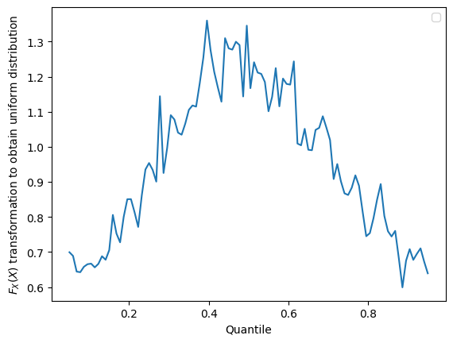
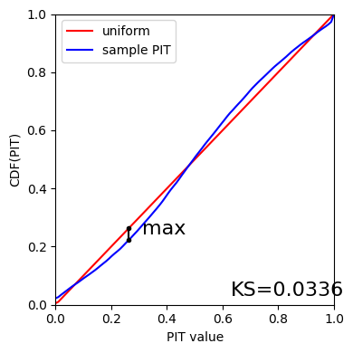

Demo: RAIL Evaluation
=====================

**Authors:** Drew Oldag, Eric Charles, Sam Schmidt, Alex Malz, Julia
Gschwend, others…

**Last run successfully:** Feb 9, 2026

The purpose of this notebook is to demonstrate the application of the
metrics scripts to be used on the photo-z PDF catalogs produced by the
PZ working group. The first implementation of the *evaluation* module is
based on the refactoring of the code used in `Schmidt et
al. 2020 <https://arxiv.org/pdf/2001.03621.pdf>`__, available on Github
repository `PZDC1paper <https://github.com/LSSTDESC/PZDC1paper>`__.

To run this notebook, you must install qp and have the notebook in the
same directory as ``utils.py`` (available in RAIL’s examples
directrory). You must also have installed all RAIL dependencies,
particularly for the estimation codes that you want to run, as well as
ceci, qp, tables_io, etc… See the RAIL installation instructions for
more info.

**Note:** If you’re interested in running this in pipeline mode, see
```01_Evaluation_by_Type.ipynb`` <https://github.com/LSSTDESC/rail/blob/main/pipeline_examples/evaluation_examples/01_Evaluation_by_Type.ipynb>`__
in the ``pipeline_examples/evaluation_examples/`` folder.

.. code:: ipython3

    import os
    from pathlib import Path
    
    import matplotlib.pyplot as plt
    import numpy as np
    import qp
    import tables_io
    from qp.metrics.pit import PIT
    from rail.evaluation.metrics.cdeloss import *
    from rail.utils.path_utils import find_rail_file
    from utils import ks_plot, plot_pit_qq
    
    from rail import interactive as ri
    
    DOWNLOADS_DIR = Path("../examples_data")
    DOWNLOADS_DIR.mkdir(exist_ok=True)


.. parsed-literal::

    Install FSPS with the following commands:
    pip uninstall fsps
    git clone --recursive https://github.com/dfm/python-fsps.git
    cd python-fsps
    python -m pip install .
    export SPS_HOME=$(pwd)/src/fsps/libfsps
    
    LEPHAREDIR is being set to the default cache directory:
    /home/runner/.cache/lephare/data
    More than 1Gb may be written there.
    LEPHAREWORK is being set to the default cache directory:
    /home/runner/.cache/lephare/work
    Default work cache is already linked. 
    This is linked to the run directory:
    /home/runner/.cache/lephare/runs/20260323T211352


.. parsed-literal::

    
    A module that was compiled using NumPy 1.x cannot be run in
    NumPy 2.4.3 as it may crash. To support both 1.x and 2.x
    versions of NumPy, modules must be compiled with NumPy 2.0.
    Some module may need to rebuild instead e.g. with 'pybind11>=2.12'.
    
    If you are a user of the module, the easiest solution will be to
    downgrade to 'numpy<2' or try to upgrade the affected module.
    We expect that some modules will need time to support NumPy 2.
    
    Traceback (most recent call last):  File "<frozen runpy>", line 198, in _run_module_as_main
      File "<frozen runpy>", line 88, in _run_code
      File "/opt/hostedtoolcache/Python/3.11.15/x64/lib/python3.11/site-packages/ipykernel_launcher.py", line 18, in <module>
        app.launch_new_instance()
      File "/opt/hostedtoolcache/Python/3.11.15/x64/lib/python3.11/site-packages/traitlets/config/application.py", line 1075, in launch_instance
        app.start()
      File "/opt/hostedtoolcache/Python/3.11.15/x64/lib/python3.11/site-packages/ipykernel/kernelapp.py", line 758, in start
        self.io_loop.start()
      File "/opt/hostedtoolcache/Python/3.11.15/x64/lib/python3.11/site-packages/tornado/platform/asyncio.py", line 211, in start
        self.asyncio_loop.run_forever()
      File "/opt/hostedtoolcache/Python/3.11.15/x64/lib/python3.11/asyncio/base_events.py", line 608, in run_forever
        self._run_once()
      File "/opt/hostedtoolcache/Python/3.11.15/x64/lib/python3.11/asyncio/base_events.py", line 1936, in _run_once
        handle._run()
      File "/opt/hostedtoolcache/Python/3.11.15/x64/lib/python3.11/asyncio/events.py", line 84, in _run
        self._context.run(self._callback, *self._args)
      File "/opt/hostedtoolcache/Python/3.11.15/x64/lib/python3.11/site-packages/ipykernel/kernelbase.py", line 621, in shell_main
        await self.dispatch_shell(msg, subshell_id=subshell_id)
      File "/opt/hostedtoolcache/Python/3.11.15/x64/lib/python3.11/site-packages/ipykernel/kernelbase.py", line 478, in dispatch_shell
        await result
      File "/opt/hostedtoolcache/Python/3.11.15/x64/lib/python3.11/site-packages/ipykernel/ipkernel.py", line 372, in execute_request
        await super().execute_request(stream, ident, parent)
      File "/opt/hostedtoolcache/Python/3.11.15/x64/lib/python3.11/site-packages/ipykernel/kernelbase.py", line 834, in execute_request
        reply_content = await reply_content
      File "/opt/hostedtoolcache/Python/3.11.15/x64/lib/python3.11/site-packages/ipykernel/ipkernel.py", line 464, in do_execute
        res = shell.run_cell(
      File "/opt/hostedtoolcache/Python/3.11.15/x64/lib/python3.11/site-packages/ipykernel/zmqshell.py", line 663, in run_cell
        return super().run_cell(*args, **kwargs)
      File "/opt/hostedtoolcache/Python/3.11.15/x64/lib/python3.11/site-packages/IPython/core/interactiveshell.py", line 3123, in run_cell
        result = self._run_cell(
      File "/opt/hostedtoolcache/Python/3.11.15/x64/lib/python3.11/site-packages/IPython/core/interactiveshell.py", line 3178, in _run_cell
        result = runner(coro)
      File "/opt/hostedtoolcache/Python/3.11.15/x64/lib/python3.11/site-packages/IPython/core/async_helpers.py", line 128, in _pseudo_sync_runner
        coro.send(None)
      File "/opt/hostedtoolcache/Python/3.11.15/x64/lib/python3.11/site-packages/IPython/core/interactiveshell.py", line 3400, in run_cell_async
        has_raised = await self.run_ast_nodes(code_ast.body, cell_name,
      File "/opt/hostedtoolcache/Python/3.11.15/x64/lib/python3.11/site-packages/IPython/core/interactiveshell.py", line 3641, in run_ast_nodes
        if await self.run_code(code, result, async_=asy):
      File "/opt/hostedtoolcache/Python/3.11.15/x64/lib/python3.11/site-packages/IPython/core/interactiveshell.py", line 3701, in run_code
        exec(code_obj, self.user_global_ns, self.user_ns)
      File "/tmp/ipykernel_4235/1627844557.py", line 13, in <module>
        from rail import interactive as ri
      File "/opt/hostedtoolcache/Python/3.11.15/x64/lib/python3.11/site-packages/rail/interactive/__init__.py", line 3, in <module>
        from . import calib, creation, estimation, evaluation, tools
      File "/opt/hostedtoolcache/Python/3.11.15/x64/lib/python3.11/site-packages/rail/interactive/calib/__init__.py", line 3, in <module>
        from rail.utils.interactive.initialize_utils import _initialize_interactive_module
      File "/opt/hostedtoolcache/Python/3.11.15/x64/lib/python3.11/site-packages/rail/utils/interactive/initialize_utils.py", line 17, in <module>
        from rail.utils.interactive.base_utils import (
      File "/opt/hostedtoolcache/Python/3.11.15/x64/lib/python3.11/site-packages/rail/utils/interactive/base_utils.py", line 10, in <module>
        rail.stages.import_and_attach_all(silent=True)
      File "/opt/hostedtoolcache/Python/3.11.15/x64/lib/python3.11/site-packages/rail/stages/__init__.py", line 74, in import_and_attach_all
        RailEnv.import_all_packages(silent=silent)
      File "/opt/hostedtoolcache/Python/3.11.15/x64/lib/python3.11/site-packages/rail/core/introspection.py", line 541, in import_all_packages
        _imported_module = importlib.import_module(pkg)
      File "/opt/hostedtoolcache/Python/3.11.15/x64/lib/python3.11/importlib/__init__.py", line 126, in import_module
        return _bootstrap._gcd_import(name[level:], package, level)
      File "/opt/hostedtoolcache/Python/3.11.15/x64/lib/python3.11/site-packages/rail/som/__init__.py", line 1, in <module>
        from rail.creation.degraders.specz_som import *
      File "/opt/hostedtoolcache/Python/3.11.15/x64/lib/python3.11/site-packages/rail/creation/degraders/specz_som.py", line 15, in <module>
        from somoclu import Somoclu
      File "/opt/hostedtoolcache/Python/3.11.15/x64/lib/python3.11/site-packages/somoclu/__init__.py", line 11, in <module>
        from .train import Somoclu
      File "/opt/hostedtoolcache/Python/3.11.15/x64/lib/python3.11/site-packages/somoclu/train.py", line 25, in <module>
        from .somoclu_wrap import train as wrap_train
      File "/opt/hostedtoolcache/Python/3.11.15/x64/lib/python3.11/site-packages/somoclu/somoclu_wrap.py", line 11, in <module>
        import _somoclu_wrap


::


    ---------------------------------------------------------------------------

    ImportError                               Traceback (most recent call last)

    File /opt/hostedtoolcache/Python/3.11.15/x64/lib/python3.11/site-packages/numpy/core/_multiarray_umath.py:46, in __getattr__(attr_name)
         41     # Also print the message (with traceback).  This is because old versions
         42     # of NumPy unfortunately set up the import to replace (and hide) the
         43     # error.  The traceback shouldn't be needed, but e.g. pytest plugins
         44     # seem to swallow it and we should be failing anyway...
         45     sys.stderr.write(msg + tb_msg)
    ---> 46     raise ImportError(msg)
         48 ret = getattr(_multiarray_umath, attr_name, None)
         49 if ret is None:


    ImportError: 
    A module that was compiled using NumPy 1.x cannot be run in
    NumPy 2.4.3 as it may crash. To support both 1.x and 2.x
    versions of NumPy, modules must be compiled with NumPy 2.0.
    Some module may need to rebuild instead e.g. with 'pybind11>=2.12'.
    
    If you are a user of the module, the easiest solution will be to
    downgrade to 'numpy<2' or try to upgrade the affected module.
    We expect that some modules will need time to support NumPy 2.
    


.. parsed-literal::

    Warning: the binary library cannot be imported. You cannot train maps, but you can load and analyze ones that you have already saved.
    The problem occurs because either compilation failed when you installed Somoclu or a path is missing from the dependencies when you are trying to import it. Please refer to the documentation to see your options.


Load example Data
-----------------

This will load (and download if needed) two files:

1. output_fzboost.hdf5: a ``qp`` ensemble with the output of running the
   FZBoost alogrithm to estimate redshifts
2. test_dc2_validation_9816.hdf5: a ``hdf5`` file with a table with the
   photometric data used to generate the first file

.. code:: ipython3

    pdfs_file = DOWNLOADS_DIR / "output_fzboost.hdf5"
    curl_com = (
        f"curl -o {pdfs_file} https://portal.nersc.gov/cfs/lsst/PZ/output_fzboost.hdf5"
    )
    os.system(curl_com)
    
    ztrue_file = find_rail_file("examples_data/testdata/test_dc2_validation_9816.hdf5")


.. parsed-literal::

      % Total    % Received % Xferd  Average Speed   Time    Time     Time  Current
                                     Dload  Upload   Total   Spent    Left  Speed
    
  0     0    0     0    0     0      0      0 --:--:-- --:--:-- --:--:--     0

.. parsed-literal::

    
  2 47.1M    2 1145k    0     0  1416k      0  0:00:34 --:--:--  0:00:34 1416k

.. parsed-literal::

    
100 47.1M  100 47.1M    0     0  30.5M      0  0:00:01  0:00:01 --:--:-- 30.5M


.. code:: ipython3

    ensemble = qp.read(pdfs_file)
    mini_ensemble = ensemble[:1000]
    ztrue_data = tables_io.read(ztrue_file)

Dist to Dist Evaluation
-----------------------

The DistToDistEvaluator is for evaluating metrics that compare
distributions to distributions.

To test it we are going to compare a generated p(z) distribution to
itself.

Note that there are two modes in which this can be run. The default mode
is to allow evaluation of the metric in parallel across many nodes. This
is much faster, can avoid potential issues with overflowing the memory
for huge input data sets, however, when computing quantiles or medians
the computation will not be exact (however, with the default parameters
it will be very close in almost all cases). However, if the force_exact
configuration variable is set, it will only run on a single node,
allowing for an exact calculation, but with the drawback of being slower
and more memory intensive.

Here we implement both types, and compare the results.

We will run 5 different estimates, follow the links to get more
information about each: 1. cvm: `Cramer-von
Mises <https://en.wikipedia.org/wiki/Cram%C3%A9r%E2%80%93von_Mises_criterion>`__
2. ks:
`Kolmogorov-Smirnov <https://en.wikipedia.org/wiki/Kolmogorov%E2%80%93Smirnov_test>`__
3. rmse: `Root-mean-square
error <https://en.wikipedia.org/wiki/Root_mean_square>`__ 4. kld:
`Kullback-Leibler
Divergence <https://en.wikipedia.org/wiki/Kullback%E2%80%93Leibler_divergence>`__
5. ad:
`Anderson-Darling <https://en.wikipedia.org/wiki/Anderson%E2%80%93Darling_test>`__

.. code:: ipython3

    stage_dict = dict(
        metrics=["cvm", "ks", "rmse", "kld", "ad"],
        _random_state=None,
    )

.. code:: ipython3

    dtd_results_single = ri.evaluation.dist_to_dist_evaluator.dist_to_dist_evaluator(
        data=ensemble, truth=ensemble, **stage_dict
    )


.. parsed-literal::

    Inserting handle into data store.  input: None, DistToDistEvaluator
    Inserting handle into data store.  truth: Ensemble(the_class=interp,shape=(20449, 301)), DistToDistEvaluator
    Requested metrics: ['cvm', 'ks', 'rmse', 'kld', 'ad']


.. parsed-literal::

    Inserting handle into data store.  output: inprogress_output.hdf5, DistToDistEvaluator
    Inserting handle into data store.  summary: inprogress_summary.hdf5, DistToDistEvaluator
    Inserting handle into data store.  single_distribution_summary: inprogress_single_distribution_summary.hdf5, DistToDistEvaluator


.. code:: ipython3

    print(dtd_results_single.keys())


.. parsed-literal::

    dict_keys(['output', 'summary', 'single_distribution_summary'])


.. code:: ipython3

    dtd_results_single["output"]


.. parsed-literal::

    {'cvm': array([0.19536562, 0.11072134, 0.09407148, ..., 0.13598683, 0.05809289,
            0.09127409], shape=(20449,)),
     'ks': array([0.11825711, 0.0865847 , 0.07368996, ..., 0.09422433, 0.0521201 ,
            0.14002302], shape=(20449,)),
     'rmse': array([0., 0., 0., ..., 0., 0., 0.], shape=(20449,)),
     'kld': array([0., 0., 0., ..., 0., 0., 0.], shape=(20449,)),
     'ad': array([0.25811524, 0.68068192, 1.02106582, ..., 0.69001519, 2.05499605,
            0.49333394], shape=(20449,))}


Dist to Point Evaluation
------------------------

The DistToPointEvaluator is for evaluating metrics that compare
distributions (for the p(z)) estimate to point values (for the reference
or truth).

To test it we are going to compare a generated p(z) distribution to true
redshifts.

Note that as for the DistToDistEvaluator this can be run in parallel or
forced to run on a single node for exact results.

We will run 3 different estimates, follow the links to get more
information about each: 1. cdeloss: `Conditional Density
Estimation <https://vitaliset.github.io/conditional-density-estimation/>`__
2. pit: `Probability Integral
Transform <https://en.wikipedia.org/wiki/Probability_integral_transform>`__
3. brier: `Brier Score <https://en.wikipedia.org/wiki/Brier_score>`__

.. code:: ipython3

    stage_dict = dict(
        metrics=["cdeloss", "pit", "brier"],
        _random_state=None,
        metric_config={
            "brier": {"limits": (0, 3.1)},
            "pit": {"tdigest_compression": 1000},
        },
    )

.. code:: ipython3

    dtp_results = ri.evaluation.dist_to_point_evaluator.dist_to_point_evaluator(
        data=ensemble, truth=ztrue_data, **stage_dict
    )
    # The summary results are in a table, which we can convert to a pandas.DataFrame, note that here
    # we can a single number for the entire ensemble, rather that one number per PDF
    results_df = tables_io.convertObj(dtp_results["summary"], tables_io.types.PD_DATAFRAME)
    results_df


.. parsed-literal::

    Inserting handle into data store.  input: None, DistToPointEvaluator
    Inserting handle into data store.  truth: OrderedDict([('photometry', OrderedDict([('id', array([8062500001, 8062500032, 8062500063, ..., 8082693855, 8082700644,
           8082707141], shape=(20449,))), ('mag_err_g_lsst', array([0.00505748, 0.00504861, 0.00501401, ..., 0.03205564, 0.03619634,
           0.03401821], shape=(20449,), dtype=float32)), ('mag_err_i_lsst', array([0.00501722, 0.00502923, 0.00500794, ..., 0.03604567, 0.03882942,
           0.03827047], shape=(20449,), dtype=float32)), ('mag_err_r_lsst', array([0.00501634, 0.00502238, 0.00500636, ..., 0.02373181, 0.02551932,
           0.02626099], shape=(20449,), dtype=float32)), ('mag_err_u_lsst', array([1.1239138e-02, 7.4995589e-03, 5.6415261e-03, ..., 2.6620825e+01,
           4.0454113e-01, 1.1970136e+00], shape=(20449,), dtype=float32)), ('mag_err_y_lsst', array([0.00510173, 0.00524003, 0.00504637, ..., 0.2401629 , 0.18684624,
           0.19348474], shape=(20449,), dtype=float32)), ('mag_err_z_lsst', array([0.0050318 , 0.00506408, 0.00501549, ..., 0.06791954, 0.08058199,
           0.07850201], shape=(20449,), dtype=float32)), ('mag_g_lsst', array([20.438414, 20.313864, 19.307367, ..., 24.873056, 25.009   ,
           24.93966 ], shape=(20449,), dtype=float32)), ('mag_i_lsst', array([19.3911  , 19.784693, 18.768497, ..., 24.693913, 24.776567,
           24.76048 ], shape=(20449,), dtype=float32)), ('mag_r_lsst', array([19.755016, 19.992922, 18.982983, ..., 24.626976, 24.709862,
           24.742409], shape=(20449,), dtype=float32)), ('mag_u_lsst', array([21.8638  , 21.166199, 20.191656, ..., 99.      , 25.946056,
           27.125193], shape=(20449,), dtype=float32)), ('mag_y_lsst', array([19.089836, 19.637985, 18.559248, ..., 25.238146, 24.965181,
           25.003153], shape=(20449,), dtype=float32)), ('mag_z_lsst', array([19.197659, 19.689024, 18.653229, ..., 24.768852, 24.95582 ,
           24.927248], shape=(20449,), dtype=float32)), ('redshift', array([0.02304609, 0.02187623, 0.0441931 , ..., 3.0210144 , 2.98104019,
           2.95916868], shape=(20449,)))]))]), DistToPointEvaluator
    Requested metrics: ['cdeloss', 'pit', 'brier']


.. parsed-literal::

    WARNING:root:Input predictions do not sum to 1.


.. parsed-literal::

    Inserting handle into data store.  output: inprogress_output.hdf5, DistToPointEvaluator
    Inserting handle into data store.  summary: inprogress_summary.hdf5, DistToPointEvaluator
    Inserting handle into data store.  single_distribution_summary: inprogress_single_distribution_summary.hdf5, DistToPointEvaluator


.. raw:: html

    <div>
    <style scoped>
        .dataframe tbody tr th:only-of-type {
            vertical-align: middle;
        }
    
        .dataframe tbody tr th {
            vertical-align: top;
        }
    
        .dataframe thead th {
            text-align: right;
        }
    </style>
    <table border="1" class="dataframe">
      <thead>
        <tr style="text-align: right;">
          <th></th>
          <th>cdeloss</th>
          <th>brier</th>
        </tr>
      </thead>
      <tbody>
        <tr>
          <th>0</th>
          <td>-6.751813</td>
          <td>732.133867</td>
        </tr>
      </tbody>
    </table>
    </div>


.. code:: ipython3

    # Another type of output is a distritubion, for example the PIT or probability integral transform
    dtp_pit = dtp_results["single_distribution_summary"]["pit"]

.. code:: ipython3

    xgrid = np.linspace(0.05, 0.95, 100)
    a_pdf = dtp_pit.pdf(xgrid)
    
    plt.figure()
    plt.plot(xgrid, np.squeeze(a_pdf))
    plt.xlabel("Quantile")
    plt.ylabel(r"$F_X(X)$ transformation to obtain uniform distribution")
    plt.legend()
    plt.show()


.. parsed-literal::

    /tmp/ipykernel_4235/180185046.py:8: UserWarning: No artists with labels found to put in legend.  Note that artists whose label start with an underscore are ignored when legend() is called with no argument.
      plt.legend()





Point to Point Evaluation
-------------------------

The {pomtToPointEvaluator is for evaluating metrics that compare point
estimates (for the p(z)) to point values (for the reference or truth).

To test it we are going to compare the mode of p(z) distribution to true
redshifts.

Note that as for the DistToDistEvaluator this can be run in parallel or
forced to run on a single node for exact results.

We will run 5 different estimates, follow the links to get more
information about each: 1. point_stats_ez:
``(estimate - reference) / (1.0 + reference)`` 2. point_stats_iqr:
‘Interquatile range from 0.25 to 0.75’, i.e., the middle 50% of the
distribution of point_stats_ez 3. point_bias: Median of point_stats_ez
4. point_outlier_rate: Fraction of distribution outside of 3 sigma 5.
point_stats_sigma_mad: Sigma of the median absolute deviation

.. code:: ipython3

    stage_dict = dict(
        metrics=[
            "point_stats_ez",
            "point_stats_iqr",
            "point_bias",
            "point_outlier_rate",
            "point_stats_sigma_mad",
        ],
        _random_state=None,
        hdf5_groupname="photometry",
        point_estimate_key="zmode",
        chunk_size=10000,
        metric_config={
            "point_stats_iqr": {"tdigest_compression": 100},
        },
    )

.. code:: ipython3

    ptp_results = ri.evaluation.point_to_point_evaluator.point_to_point_evaluator(
        data=ensemble, truth=ztrue_data, **stage_dict
    )
    results_summary = tables_io.convertObj(
        ptp_results["summary"], tables_io.types.PD_DATAFRAME
    )
    results_summary


.. parsed-literal::

    Inserting handle into data store.  input: None, PointToPointEvaluator
    Inserting handle into data store.  truth: OrderedDict([('photometry', OrderedDict([('id', array([8062500001, 8062500032, 8062500063, ..., 8082693855, 8082700644,
           8082707141], shape=(20449,))), ('mag_err_g_lsst', array([0.00505748, 0.00504861, 0.00501401, ..., 0.03205564, 0.03619634,
           0.03401821], shape=(20449,), dtype=float32)), ('mag_err_i_lsst', array([0.00501722, 0.00502923, 0.00500794, ..., 0.03604567, 0.03882942,
           0.03827047], shape=(20449,), dtype=float32)), ('mag_err_r_lsst', array([0.00501634, 0.00502238, 0.00500636, ..., 0.02373181, 0.02551932,
           0.02626099], shape=(20449,), dtype=float32)), ('mag_err_u_lsst', array([1.1239138e-02, 7.4995589e-03, 5.6415261e-03, ..., 2.6620825e+01,
           4.0454113e-01, 1.1970136e+00], shape=(20449,), dtype=float32)), ('mag_err_y_lsst', array([0.00510173, 0.00524003, 0.00504637, ..., 0.2401629 , 0.18684624,
           0.19348474], shape=(20449,), dtype=float32)), ('mag_err_z_lsst', array([0.0050318 , 0.00506408, 0.00501549, ..., 0.06791954, 0.08058199,
           0.07850201], shape=(20449,), dtype=float32)), ('mag_g_lsst', array([20.438414, 20.313864, 19.307367, ..., 24.873056, 25.009   ,
           24.93966 ], shape=(20449,), dtype=float32)), ('mag_i_lsst', array([19.3911  , 19.784693, 18.768497, ..., 24.693913, 24.776567,
           24.76048 ], shape=(20449,), dtype=float32)), ('mag_r_lsst', array([19.755016, 19.992922, 18.982983, ..., 24.626976, 24.709862,
           24.742409], shape=(20449,), dtype=float32)), ('mag_u_lsst', array([21.8638  , 21.166199, 20.191656, ..., 99.      , 25.946056,
           27.125193], shape=(20449,), dtype=float32)), ('mag_y_lsst', array([19.089836, 19.637985, 18.559248, ..., 25.238146, 24.965181,
           25.003153], shape=(20449,), dtype=float32)), ('mag_z_lsst', array([19.197659, 19.689024, 18.653229, ..., 24.768852, 24.95582 ,
           24.927248], shape=(20449,), dtype=float32)), ('redshift', array([0.02304609, 0.02187623, 0.0441931 , ..., 3.0210144 , 2.98104019,
           2.95916868], shape=(20449,)))]))]), PointToPointEvaluator
    Requested metrics: ['point_stats_ez', 'point_stats_iqr', 'point_bias', 'point_outlier_rate', 'point_stats_sigma_mad']
    Inserting handle into data store.  output: inprogress_output.hdf5, PointToPointEvaluator
    Inserting handle into data store.  summary: inprogress_summary.hdf5, PointToPointEvaluator
    Inserting handle into data store.  single_distribution_summary: inprogress_single_distribution_summary.hdf5, PointToPointEvaluator


.. raw:: html

    <div>
    <style scoped>
        .dataframe tbody tr th:only-of-type {
            vertical-align: middle;
        }
    
        .dataframe tbody tr th {
            vertical-align: top;
        }
    
        .dataframe thead th {
            text-align: right;
        }
    </style>
    <table border="1" class="dataframe">
      <thead>
        <tr style="text-align: right;">
          <th></th>
          <th>point_stats_iqr</th>
          <th>point_bias</th>
          <th>point_outlier_rate</th>
          <th>point_stats_sigma_mad</th>
        </tr>
      </thead>
      <tbody>
        <tr>
          <th>0</th>
          <td>0.020847</td>
          <td>0.000266</td>
          <td>0.107096</td>
          <td>0.020865</td>
        </tr>
      </tbody>
    </table>
    </div>


Above we see the effect of the approximation used when running in
parallel. Here we are to do the computation in qp to confirm the exact
value is correct.

.. code:: ipython3

    truth = ztrue_data["photometry"]["redshift"]
    estimates = np.squeeze(ensemble.ancil["zmode"])

.. code:: ipython3

    check_iqr = qp.metrics.point_estimate_metric_classes.PointSigmaIQR().evaluate(
        estimates, truth
    )

.. code:: ipython3

    check_iqr


.. parsed-literal::

    np.float64(0.02084700447796729)


Single Evaluator
~~~~~~~~~~~~~~~~

The SingletEvaluator is will computate all of the metrics that it can
for the inputs that it is given.

It will check to see if the estimate and reference inputs are point
estimates or distributions, (or potentially both, e.g., if the use asks
to use the mode or median of the distribution as a point estimate.)

To test it we are going to compare a generated p(z) distribution to true
redshifts.

Note that as for the DistToDistEvaluator this can be run in parallel or
forced to run on a single node for exact results.

.. code:: ipython3

    stage_dict = dict(
        metrics=[
            "cvm",
            "ks",
            "omega",
            "kld",
            "cdeloss",
            "point_stats_ez",
            "point_stats_iqr",
        ],
        _random_state=None,
        hdf5_groupname="photometry",
        point_estimates=["zmode"],
        truth_point_estimates=["redshift"],
        chunk_size=1000,
    )

.. code:: ipython3

    # single_results = single_stage.evaluate(ensemble_d, ztrue_data_d)
    single_results = ri.evaluation.single_evaluator.single_evaluator(
        data=ensemble, truth=ztrue_data, **stage_dict
    )


.. parsed-literal::

    Inserting handle into data store.  input: None, SingleEvaluator
    Inserting handle into data store.  truth: OrderedDict([('photometry', OrderedDict([('id', array([8062500001, 8062500032, 8062500063, ..., 8082693855, 8082700644,
           8082707141], shape=(20449,))), ('mag_err_g_lsst', array([0.00505748, 0.00504861, 0.00501401, ..., 0.03205564, 0.03619634,
           0.03401821], shape=(20449,), dtype=float32)), ('mag_err_i_lsst', array([0.00501722, 0.00502923, 0.00500794, ..., 0.03604567, 0.03882942,
           0.03827047], shape=(20449,), dtype=float32)), ('mag_err_r_lsst', array([0.00501634, 0.00502238, 0.00500636, ..., 0.02373181, 0.02551932,
           0.02626099], shape=(20449,), dtype=float32)), ('mag_err_u_lsst', array([1.1239138e-02, 7.4995589e-03, 5.6415261e-03, ..., 2.6620825e+01,
           4.0454113e-01, 1.1970136e+00], shape=(20449,), dtype=float32)), ('mag_err_y_lsst', array([0.00510173, 0.00524003, 0.00504637, ..., 0.2401629 , 0.18684624,
           0.19348474], shape=(20449,), dtype=float32)), ('mag_err_z_lsst', array([0.0050318 , 0.00506408, 0.00501549, ..., 0.06791954, 0.08058199,
           0.07850201], shape=(20449,), dtype=float32)), ('mag_g_lsst', array([20.438414, 20.313864, 19.307367, ..., 24.873056, 25.009   ,
           24.93966 ], shape=(20449,), dtype=float32)), ('mag_i_lsst', array([19.3911  , 19.784693, 18.768497, ..., 24.693913, 24.776567,
           24.76048 ], shape=(20449,), dtype=float32)), ('mag_r_lsst', array([19.755016, 19.992922, 18.982983, ..., 24.626976, 24.709862,
           24.742409], shape=(20449,), dtype=float32)), ('mag_u_lsst', array([21.8638  , 21.166199, 20.191656, ..., 99.      , 25.946056,
           27.125193], shape=(20449,), dtype=float32)), ('mag_y_lsst', array([19.089836, 19.637985, 18.559248, ..., 25.238146, 24.965181,
           25.003153], shape=(20449,), dtype=float32)), ('mag_z_lsst', array([19.197659, 19.689024, 18.653229, ..., 24.768852, 24.95582 ,
           24.927248], shape=(20449,), dtype=float32)), ('redshift', array([0.02304609, 0.02187623, 0.0441931 , ..., 3.0210144 , 2.98104019,
           2.95916868], shape=(20449,)))]))]), SingleEvaluator
    Unsupported metric requested: 'omega'.  Available metrics are: ['ad', 'brier', 'cdeloss', 'cvm', 'kld', 'ks', 'moment', 'outlier', 'pit', 'point_bias', 'point_outlier_rate', 'point_stats_ez', 'point_stats_iqr', 'point_stats_sigma_mad', 'rbpe', 'rmse']
    Requested metrics: ['cvm', 'ks', 'kld', 'cdeloss', 'point_stats_ez', 'point_stats_iqr']


.. parsed-literal::

    Inserting handle into data store.  output: inprogress_output.hdf5, SingleEvaluator
    Inserting handle into data store.  summary: inprogress_summary.hdf5, SingleEvaluator
    Inserting handle into data store.  single_distribution_summary: inprogress_single_distribution_summary.hdf5, SingleEvaluator


.. code:: ipython3

    single_results["output"]


.. parsed-literal::

    {'point_stats_ez_zmode_redshift': array([-0.02252694, -0.0214079 , -0.04232273, ..., -0.00522614,
            -0.05552322,  0.0103131 ], shape=(20449,))}


.. code:: ipython3

    single_results["summary"]


.. parsed-literal::

    {'cdeloss_redshift': array([-6.75181317]),
     'point_stats_iqr_zmode_redshift': array([0.020847])}


CDF-based Metrics
-----------------

PIT
~~~

The Probability Integral Transform (PIT), is the Cumulative Distribution
Function (CDF) of the photo-z PDF

.. math::  \mathrm{CDF}(f, q)\ =\ \int_{-\infty}^{q}\ f(z)\ dz 

evaluated at the galaxy’s true redshift for every galaxy :math:`i` in
the catalog.

.. math::  \mathrm{PIT}(p_{i}(z);\ z_{i})\ =\ \int_{-\infty}^{z^{true}_{i}}\ p_{i}(z)\ dz 

.. code:: ipython3

    fzdata = qp.read(pdfs_file)
    ztrue_data = tables_io.read(ztrue_file)
    ztrue = ztrue_data["photometry"]["redshift"]
    zgrid = fzdata.metadata["xvals"].ravel()
    photoz_mode = fzdata.mode(grid=zgrid)

.. code:: ipython3

    pitobj = PIT(fzdata, ztrue)
    quant_ens = pitobj.pit
    metamets = pitobj.calculate_pit_meta_metrics()


.. parsed-literal::

    /opt/hostedtoolcache/Python/3.11.15/x64/lib/python3.11/site-packages/qp/metrics/array_metrics.py:27: UserWarning: Parameter `variant` has been introduced to replace `midrank`; `midrank` will be removed in SciPy 1.19.0. Specify `variant` to silence this warning. Note that the returned object will no longer be unpackable as a tuple, and `critical_values` will be omitted.
      return stats.anderson_ksamp([p_random_variables, q_random_variables], **kwargs)
    /opt/hostedtoolcache/Python/3.11.15/x64/lib/python3.11/site-packages/qp/metrics/array_metrics.py:27: UserWarning: p-value floored: true value smaller than 0.001. Consider specifying `method` (e.g. `method=stats.PermutationMethod()`.)
      return stats.anderson_ksamp([p_random_variables, q_random_variables], **kwargs)


The evaluate method PIT class returns two objects, a quantile
distribution based on the full set of PIT values (a frozen distribution
object), and a dictionary of meta metrics associated to PIT (to be
detailed below).

.. code:: ipython3

    quant_ens


.. parsed-literal::

    Ensemble(the_class=quant,shape=(1, 96))


.. code:: ipython3

    metamets


.. parsed-literal::

    {'ad': Anderson_ksampResult(statistic=np.float64(84.95623553609377), critical_values=array([0.325, 1.226, 1.961, 2.718, 3.752, 4.592, 6.546]), pvalue=np.float64(0.001)),
     'cvm': CramerVonMisesResult(statistic=9.623351996059352, pvalue=9.265039846440004e-10),
     'ks': KstestResult(statistic=np.float64(0.033590049370962216), pvalue=np.float64(1.7621068075751534e-20), statistic_location=np.float64(0.9921210288809627), statistic_sign=np.int8(-1)),
     'outlier_rate': np.float64(0.05873797877466336)}


.. code:: ipython3

    pit_vals = np.array(pitobj.pit_samps)
    pit_vals


.. parsed-literal::

    array([0.19392947, 0.36675619, 0.52017547, ..., 1.        , 0.93189232,
           0.4674437 ], shape=(20449,))


.. code:: ipython3

    pit_out_rate = metamets["outlier_rate"]
    print(f"PIT outlier rate of this sample: {pit_out_rate:.6f}")
    pit_out_rate = pitobj.evaluate_PIT_outlier_rate()
    print(f"PIT outlier rate of this sample: {pit_out_rate:.6f}")


.. parsed-literal::

    PIT outlier rate of this sample: 0.058738
    PIT outlier rate of this sample: 0.058738


PIT-QQ plot
~~~~~~~~~~~

The histogram of PIT values is a useful tool for a qualitative
assessment of PDFs quality. It shows whether the PDFs are: \* biased
(tilted PIT histogram) \* under-dispersed (excess counts close to the
boudaries 0 and 1) \* over-dispersed (lack of counts close the boudaries
0 and 1) \* well-calibrated (flat histogram)

Following the standards in DC1 paper, the PIT histogram is accompanied
by the quantile-quantile (QQ), which can be used to compare
qualitatively the PIT distribution obtained with the PDFs agaist the
ideal case (uniform distribution). The closer the QQ plot is to the
diagonal, the better is the PDFs calibration.

.. code:: ipython3

    pdfs = fzdata.objdata["yvals"]
    plot_pit_qq(
        pdfs,
        zgrid,
        ztrue,
        title="PIT-QQ - toy data",
        code="FlexZBoost",
        pit_out_rate=pit_out_rate,
        savefig=False,
    )


.. image:: Evaluation_by_Type_files/Evaluation_by_Type_43_0.png


The black horizontal line represents the ideal case where the PIT
histogram would behave as a uniform distribution U(0,1).

Summary statistics of CDF-based metrics
---------------------------------------

To evaluate globally the quality of PDFs estimates, ``rail.evaluation``
provides a set of metrics to compare the empirical distributions of PIT
values with the reference uniform distribution, U(0,1).

Kolmogorov-Smirnov
~~~~~~~~~~~~~~~~~~

Let’s start with the traditional Kolmogorov-Smirnov (KS) statistic test,
which is the maximum difference between the empirical and the expected
cumulative distributions of PIT values:

.. math::


   \mathrm{KS} \equiv \max_{PIT} \Big( \left| \ \mathrm{CDF} \small[ \hat{f}, z \small] - \mathrm{CDF} \small[ \tilde{f}, z \small] \  \right| \Big)

Where :math:`\hat{f}` is the PIT distribution and :math:`\tilde{f}` is
U(0,1). Therefore, the smaller value of KS the closer the PIT
distribution is to be uniform. The ``evaluate`` method of the PITKS
class returns a named tuple with the statistic and p-value.

.. code:: ipython3

    ks_stat_and_pval = metamets["ks"]
    print(f"PIT KS stat and pval: {ks_stat_and_pval}")
    ks_stat_and_pval = pitobj.evaluate_PIT_KS()
    print(f"PIT KS stat and pval: {ks_stat_and_pval}")


.. parsed-literal::

    PIT KS stat and pval: KstestResult(statistic=np.float64(0.033590049370962216), pvalue=np.float64(1.7621068075751534e-20), statistic_location=np.float64(0.9921210288809627), statistic_sign=np.int8(-1))
    PIT KS stat and pval: KstestResult(statistic=np.float64(0.033590049370962216), pvalue=np.float64(1.7621068075751534e-20), statistic_location=np.float64(0.9921210288809627), statistic_sign=np.int8(-1))


.. code:: ipython3

    ks_plot(pitobj)





.. code:: ipython3

    print(f"KS metric of this sample: {ks_stat_and_pval.statistic:.4f}")


.. parsed-literal::

    KS metric of this sample: 0.0336


Cramer-von Mises
~~~~~~~~~~~~~~~~

Similarly, let’s calculate the Cramer-von Mises (CvM) test, a variant of
the KS statistic defined as the mean-square difference between the CDFs
of an empirical PDF and the true PDFs:

.. math::  \mathrm{CvM}^2 \equiv \int_{-\infty}^{\infty} \Big( \mathrm{CDF} \small[ \hat{f}, z \small] \ - \ \mathrm{CDF} \small[ \tilde{f}, z \small] \Big)^{2} \mathrm{dCDF}(\tilde{f}, z) 

on the distribution of PIT values, which should be uniform if the PDFs
are perfect.

.. code:: ipython3

    cvm_stat_and_pval = metamets["cvm"]
    print(f"PIT CvM stat and pval: {cvm_stat_and_pval}")
    cvm_stat_and_pval = pitobj.evaluate_PIT_CvM()
    print(f"PIT CvM stat and pval: {cvm_stat_and_pval}")


.. parsed-literal::

    PIT CvM stat and pval: CramerVonMisesResult(statistic=9.623351996059352, pvalue=9.265039846440004e-10)
    PIT CvM stat and pval: CramerVonMisesResult(statistic=9.623351996059352, pvalue=9.265039846440004e-10)


.. code:: ipython3

    print(f"CvM metric of this sample: {cvm_stat_and_pval.statistic:.4f}")


.. parsed-literal::

    CvM metric of this sample: 9.6234


Anderson-Darling
~~~~~~~~~~~~~~~~

Another variation of the KS statistic is the Anderson-Darling (AD) test,
a weighted mean-squared difference featuring enhanced sensitivity to
discrepancies in the tails of the distribution.

.. math::  \mathrm{AD}^2 \equiv N_{tot} \int_{-\infty}^{\infty} \frac{\big( \mathrm{CDF} \small[ \hat{f}, z \small] \ - \ \mathrm{CDF} \small[ \tilde{f}, z \small] \big)^{2}}{\mathrm{CDF} \small[ \tilde{f}, z \small] \big( 1 \ - \ \mathrm{CDF} \small[ \tilde{f}, z \small] \big)}\mathrm{dCDF}(\tilde{f}, z) 

.. code:: ipython3

    ad_stat_crit_sig = metamets["ad"]
    print(f"PIT AD stat and pval: {ad_stat_crit_sig}")
    ad_stat_crit_sig = pitobj.evaluate_PIT_anderson_ksamp()
    print(f"PIT AD stat and pval: {ad_stat_crit_sig}")


.. parsed-literal::

    PIT AD stat and pval: Anderson_ksampResult(statistic=np.float64(84.95623553609377), critical_values=array([0.325, 1.226, 1.961, 2.718, 3.752, 4.592, 6.546]), pvalue=np.float64(0.001))
    PIT AD stat and pval: Anderson_ksampResult(statistic=np.float64(84.95623553609377), critical_values=array([0.325, 1.226, 1.961, 2.718, 3.752, 4.592, 6.546]), pvalue=np.float64(0.001))


.. code:: ipython3

    print(f"AD metric of this sample: {ad_stat_crit_sig.statistic:.4f}")


.. parsed-literal::

    AD metric of this sample: 84.9562


It is possible to remove catastrophic outliers before calculating the
integral for the sake of preserving numerical instability. For instance,
Schmidt et al. computed the Anderson-Darling statistic within the
interval (0.01, 0.99).

.. code:: ipython3

    ad_stat_crit_sig_cut = pitobj.evaluate_PIT_anderson_ksamp(pit_min=0.01, pit_max=0.99)
    print(f"AD metric of this sample: {ad_stat_crit_sig.statistic:.4f}")
    print(f"AD metric for 0.01 < PIT < 0.99: {ad_stat_crit_sig_cut.statistic:.4f}")


.. parsed-literal::

    WARNING:root:Removed 1760 PITs from the sample.


.. parsed-literal::

    AD metric of this sample: 84.9562
    AD metric for 0.01 < PIT < 0.99: 89.9826


CDE Loss
--------

In the absence of true photo-z posteriors, the metric used to evaluate
individual PDFs is the **Conditional Density Estimate (CDE) Loss**, a
metric analogue to the root-mean-squared-error:

.. math::  L(f, \hat{f}) \equiv  \int \int {\big(f(z | x) - \hat{f}(z | x) \big)}^{2} dzdP(x) 

where :math:`f(z | x)` is the true photo-z PDF and
:math:`\hat{f}(z | x)` is the estimated PDF in terms of the photometry
:math:`x`. Since :math:`f(z | x)` is unknown, we estimate the **CDE
Loss** as described in `Izbicki & Lee, 2017
(arXiv:1704.08095) <https://arxiv.org/abs/1704.08095>`__. :

.. math::  \mathrm{CDE} = \mathbb{E}\big(  \int{{\hat{f}(z | X)}^2 dz} \big) - 2{\mathbb{E}}_{X, Z}\big(\hat{f}(Z, X) \big) + K_{f},  

where the first term is the expectation value of photo-z posterior with
respect to the marginal distribution of the covariates X, and the second
term is the expectation value with respect to the joint distribution of
observables X and the space Z of all possible redshifts (in practice,
the centroids of the PDF bins), and the third term is a constant
depending on the true conditional densities :math:`f(z | x)`.

.. code:: ipython3

    cdelossobj = CDELoss(fzdata, zgrid, ztrue)

.. code:: ipython3

    cde_stat_and_pval = cdelossobj.evaluate()
    cde_stat_and_pval


.. parsed-literal::

    stat_and_pval(statistic=np.float64(-6.725602928688289), p_value=nan)


.. code:: ipython3

    print(f"CDE loss of this sample: {cde_stat_and_pval.statistic:.2f}")


.. parsed-literal::

    CDE loss of this sample: -6.73


Cleanup files
-------------

.. code:: ipython3

    pdfs_file.unlink()
