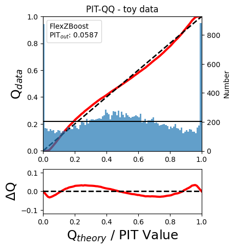

Demo: RAIL Evaluation
=====================

**Authors:** Sam Schmidt, Alex Malz, Julia Gschwend, others…

**Last run successfully:** Feb 9, 2026

The purpose of this notebook is to demonstrate the application of the
metrics scripts to be used on the photo-z PDF catalogs produced by the
PZ working group. The first implementation of the *evaluation* module is
based on the refactoring of the code used in `Schmidt et
al. 2020 <https://arxiv.org/pdf/2001.03621.pdf>`__, available on Github
repository `PZDC1paper <https://github.com/LSSTDESC/PZDC1paper>`__.

To run this notebook, you must install qp and have the notebook in the
same directory as ``utils.py`` (available in RAIL’s examples
directrory). You must also have installed all RAIL dependencies,
particularly for the estimation codes that you want to run, as well as
ceci, qp, tables_io, etc… See the RAIL installation instructions for
more info.

**Note:** If you’re interested in running this in pipeline mode, see
`00_Single_Evaluation.ipynb <https://github.com/LSSTDESC/rail/blob/main/pipeline_examples/evaluation_examples/00_Single_Evaluation.ipynb>`__
in the ``pipeline_examples/evaluation_examples/`` folder.

.. code:: ipython3

    import os
    from pathlib import Path
    
    import rail.interactive as ri
    import tables_io
    from qp.metrics.pit import PIT
    from rail.evaluation.metrics.cdeloss import *
    from rail.utils.path_utils import find_rail_file
    from utils import ks_plot, plot_pit_qq
    
    DOWNLOADS_DIR = Path("../examples_data")
    DOWNLOADS_DIR.mkdir(exist_ok=True)

.. parsed-literal::

    Install FSPS with the following commands:
    pip uninstall fsps
    git clone --recursive https://github.com/dfm/python-fsps.git
    cd python-fsps
    python -m pip install .
    export SPS_HOME=$(pwd)/src/fsps/libfsps
    
    LEPHAREDIR is being set to the default cache directory which is being created at:
    /home/runner/.cache/lephare/data
    More than 1Gb may be written there.
    LEPHAREWORK is being set to the default cache directory:
    /home/runner/.cache/lephare/work

.. parsed-literal::

    
    A module that was compiled using NumPy 1.x cannot be run in
    NumPy 2.2.6 as it may crash. To support both 1.x and 2.x
    versions of NumPy, modules must be compiled with NumPy 2.0.
    Some module may need to rebuild instead e.g. with 'pybind11>=2.12'.
    
    If you are a user of the module, the easiest solution will be to
    downgrade to 'numpy<2' or try to upgrade the affected module.
    We expect that some modules will need time to support NumPy 2.
    
    Traceback (most recent call last):  File "/opt/hostedtoolcache/Python/3.10.20/x64/lib/python3.10/runpy.py", line 196, in _run_module_as_main
        return _run_code(code, main_globals, None,
      File "/opt/hostedtoolcache/Python/3.10.20/x64/lib/python3.10/runpy.py", line 86, in _run_code
        exec(code, run_globals)
      File "/opt/hostedtoolcache/Python/3.10.20/x64/lib/python3.10/site-packages/ipykernel_launcher.py", line 18, in <module>
        app.launch_new_instance()
      File "/opt/hostedtoolcache/Python/3.10.20/x64/lib/python3.10/site-packages/traitlets/config/application.py", line 1075, in launch_instance
        app.start()
      File "/opt/hostedtoolcache/Python/3.10.20/x64/lib/python3.10/site-packages/ipykernel/kernelapp.py", line 758, in start
        self.io_loop.start()
      File "/opt/hostedtoolcache/Python/3.10.20/x64/lib/python3.10/site-packages/tornado/platform/asyncio.py", line 211, in start
        self.asyncio_loop.run_forever()
      File "/opt/hostedtoolcache/Python/3.10.20/x64/lib/python3.10/asyncio/base_events.py", line 603, in run_forever
        self._run_once()
      File "/opt/hostedtoolcache/Python/3.10.20/x64/lib/python3.10/asyncio/base_events.py", line 1909, in _run_once
        handle._run()
      File "/opt/hostedtoolcache/Python/3.10.20/x64/lib/python3.10/asyncio/events.py", line 80, in _run
        self._context.run(self._callback, *self._args)
      File "/opt/hostedtoolcache/Python/3.10.20/x64/lib/python3.10/site-packages/ipykernel/utils.py", line 71, in preserve_context
        return await f(*args, **kwargs)
      File "/opt/hostedtoolcache/Python/3.10.20/x64/lib/python3.10/site-packages/ipykernel/kernelbase.py", line 621, in shell_main
        await self.dispatch_shell(msg, subshell_id=subshell_id)
      File "/opt/hostedtoolcache/Python/3.10.20/x64/lib/python3.10/site-packages/ipykernel/kernelbase.py", line 478, in dispatch_shell
        await result
      File "/opt/hostedtoolcache/Python/3.10.20/x64/lib/python3.10/site-packages/ipykernel/ipkernel.py", line 372, in execute_request
        await super().execute_request(stream, ident, parent)
      File "/opt/hostedtoolcache/Python/3.10.20/x64/lib/python3.10/site-packages/ipykernel/kernelbase.py", line 834, in execute_request
        reply_content = await reply_content
      File "/opt/hostedtoolcache/Python/3.10.20/x64/lib/python3.10/site-packages/ipykernel/ipkernel.py", line 464, in do_execute
        res = shell.run_cell(
      File "/opt/hostedtoolcache/Python/3.10.20/x64/lib/python3.10/site-packages/ipykernel/zmqshell.py", line 663, in run_cell
        return super().run_cell(*args, **kwargs)
      File "/opt/hostedtoolcache/Python/3.10.20/x64/lib/python3.10/site-packages/IPython/core/interactiveshell.py", line 3077, in run_cell
        result = self._run_cell(
      File "/opt/hostedtoolcache/Python/3.10.20/x64/lib/python3.10/site-packages/IPython/core/interactiveshell.py", line 3132, in _run_cell
        result = runner(coro)
      File "/opt/hostedtoolcache/Python/3.10.20/x64/lib/python3.10/site-packages/IPython/core/async_helpers.py", line 128, in _pseudo_sync_runner
        coro.send(None)
      File "/opt/hostedtoolcache/Python/3.10.20/x64/lib/python3.10/site-packages/IPython/core/interactiveshell.py", line 3336, in run_cell_async
        has_raised = await self.run_ast_nodes(code_ast.body, cell_name,
      File "/opt/hostedtoolcache/Python/3.10.20/x64/lib/python3.10/site-packages/IPython/core/interactiveshell.py", line 3519, in run_ast_nodes
        if await self.run_code(code, result, async_=asy):
      File "/opt/hostedtoolcache/Python/3.10.20/x64/lib/python3.10/site-packages/IPython/core/interactiveshell.py", line 3579, in run_code
        exec(code_obj, self.user_global_ns, self.user_ns)
      File "/tmp/ipykernel_4020/3393143206.py", line 4, in <module>
        import rail.interactive as ri
      File "/opt/hostedtoolcache/Python/3.10.20/x64/lib/python3.10/site-packages/rail/interactive/__init__.py", line 3, in <module>
        from . import calib, creation, estimation, evaluation, tools
      File "/opt/hostedtoolcache/Python/3.10.20/x64/lib/python3.10/site-packages/rail/interactive/calib/__init__.py", line 3, in <module>
        from rail.utils.interactive.initialize_utils import _initialize_interactive_module
      File "/opt/hostedtoolcache/Python/3.10.20/x64/lib/python3.10/site-packages/rail/utils/interactive/initialize_utils.py", line 17, in <module>
        from rail.utils.interactive.base_utils import (
      File "/opt/hostedtoolcache/Python/3.10.20/x64/lib/python3.10/site-packages/rail/utils/interactive/base_utils.py", line 10, in <module>
        rail.stages.import_and_attach_all(silent=True)
      File "/opt/hostedtoolcache/Python/3.10.20/x64/lib/python3.10/site-packages/rail/stages/__init__.py", line 74, in import_and_attach_all
        RailEnv.import_all_packages(silent=silent)
      File "/opt/hostedtoolcache/Python/3.10.20/x64/lib/python3.10/site-packages/rail/core/introspection.py", line 541, in import_all_packages
        _imported_module = importlib.import_module(pkg)
      File "/opt/hostedtoolcache/Python/3.10.20/x64/lib/python3.10/importlib/__init__.py", line 126, in import_module
        return _bootstrap._gcd_import(name[level:], package, level)
      File "/opt/hostedtoolcache/Python/3.10.20/x64/lib/python3.10/site-packages/rail/som/__init__.py", line 1, in <module>
        from rail.creation.degraders.specz_som import *
      File "/opt/hostedtoolcache/Python/3.10.20/x64/lib/python3.10/site-packages/rail/creation/degraders/specz_som.py", line 15, in <module>
        from somoclu import Somoclu
      File "/opt/hostedtoolcache/Python/3.10.20/x64/lib/python3.10/site-packages/somoclu/__init__.py", line 11, in <module>
        from .train import Somoclu
      File "/opt/hostedtoolcache/Python/3.10.20/x64/lib/python3.10/site-packages/somoclu/train.py", line 25, in <module>
        from .somoclu_wrap import train as wrap_train
      File "/opt/hostedtoolcache/Python/3.10.20/x64/lib/python3.10/site-packages/somoclu/somoclu_wrap.py", line 11, in <module>
        import _somoclu_wrap

::

    ---------------------------------------------------------------------------

    ImportError                               Traceback (most recent call last)

    File /opt/hostedtoolcache/Python/3.10.20/x64/lib/python3.10/site-packages/numpy/core/_multiarray_umath.py:44, in __getattr__(attr_name)
         39     # Also print the message (with traceback).  This is because old versions
         40     # of NumPy unfortunately set up the import to replace (and hide) the
         41     # error.  The traceback shouldn't be needed, but e.g. pytest plugins
         42     # seem to swallow it and we should be failing anyway...
         43     sys.stderr.write(msg + tb_msg)
    ---> 44     raise ImportError(msg)
         46 ret = getattr(_multiarray_umath, attr_name, None)
         47 if ret is None:

    ImportError: 
    A module that was compiled using NumPy 1.x cannot be run in
    NumPy 2.2.6 as it may crash. To support both 1.x and 2.x
    versions of NumPy, modules must be compiled with NumPy 2.0.
    Some module may need to rebuild instead e.g. with 'pybind11>=2.12'.
    
    If you are a user of the module, the easiest solution will be to
    downgrade to 'numpy<2' or try to upgrade the affected module.
    We expect that some modules will need time to support NumPy 2.
    

.. parsed-literal::

    Warning: the binary library cannot be imported. You cannot train maps, but you can load and analyze ones that you have already saved.
    The problem occurs because either compilation failed when you installed Somoclu or a path is missing from the dependencies when you are trying to import it. Please refer to the documentation to see your options.

Data
----

To compute the photo-z metrics of a given test sample, it is necessary
to read the output of a photo-z code containing galaxies’ photo-z PDFs.
Let’s use the toy data available in ``tests/data/``
(**test_dc2_training_9816.hdf5** and **test_dc2_validation_9816.hdf5**)
to generate a small sample of photo-z PDFs using the **FlexZBoost**
algorithm available on RAIL’s *estimation* module.

Photo-z Results
~~~~~~~~~~~~~~~

Run FlexZBoost
^^^^^^^^^^^^^^

If you have run the notebook ``00_Quick_Start_in_Estimation.ipynb``,
this will produce a file ``output_fzboost.hdf5``, writen at the
location:
``<your_path>/RAIL/examples/estimation_examples/output_fzboost.hdf5``.

Otherwise we can download the file from NERSC

Next we need to set up some paths for the Data Store:

.. code:: ipython3

    pdfs_file = DOWNLOADS_DIR / "output_fzboost.hdf5"
    curl_com = (
        f"curl -o {pdfs_file} https://portal.nersc.gov/cfs/lsst/PZ/output_fzboost.hdf5"
    )
    os.system(curl_com)
    ztrue_file = find_rail_file("examples_data/testdata/test_dc2_validation_9816.hdf5")

.. parsed-literal::

      % Total    % Received % Xferd  Average Speed   Time    Time     Time  Current
                                     Dload  Upload   Total   Spent    Left  Speed
    
  0     0    0     0    0     0      0      0 --:--:-- --:--:-- --:--:--     0
  0     0    0     0    0     0      0      0 --:--:-- --:--:-- --:--:--     0

.. parsed-literal::

    
  7 47.1M    7 3443k    0     0  3140k      0  0:00:15  0:00:01  0:00:14 3139k

.. parsed-literal::

    
100 47.1M  100 47.1M    0     0  25.6M      0  0:00:01  0:00:01 --:--:-- 25.5M

Read the data in, note that the fzdata is a ``qp`` Ensemble, and thus we
should read it in as a ``QPHandle`` type file, while the ztrue_data is
tabular data, and should be read in as a ``Tablehandle`` when adding to
the data store

.. code:: ipython3

    fzdata = qp.read(pdfs_file)
    ztrue_data = tables_io.read(ztrue_file)

.. code:: ipython3

    ztrue = ztrue_data["photometry"]["redshift"]
    zgrid = fzdata.metadata["xvals"].ravel()
    photoz_mode = fzdata.mode(grid=zgrid)

.. code:: ipython3

    truth = ztrue_data["photometry"]
    ensemble = fzdata

Make an evaulator stage
-----------------------

Now let’s set up the Evaluator stage to compute our metrics for the
FlexZBoost results

.. code:: ipython3

    fzb_results = ri.evaluation.evaluator.old_evaluator(data=ensemble, truth=truth)[
        "output"
    ]

.. parsed-literal::

    Inserting handle into data store.  input: None, OldEvaluator
    Inserting handle into data store.  truth: OrderedDict([('id', array([8062500001, 8062500032, 8062500063, ..., 8082693855, 8082700644,
           8082707141], shape=(20449,))), ('mag_err_g_lsst', array([0.00505748, 0.00504861, 0.00501401, ..., 0.03205564, 0.03619634,
           0.03401821], shape=(20449,), dtype=float32)), ('mag_err_i_lsst', array([0.00501722, 0.00502923, 0.00500794, ..., 0.03604567, 0.03882942,
           0.03827047], shape=(20449,), dtype=float32)), ('mag_err_r_lsst', array([0.00501634, 0.00502238, 0.00500636, ..., 0.02373181, 0.02551932,
           0.02626099], shape=(20449,), dtype=float32)), ('mag_err_u_lsst', array([1.1239138e-02, 7.4995589e-03, 5.6415261e-03, ..., 2.6620825e+01,
           4.0454113e-01, 1.1970136e+00], shape=(20449,), dtype=float32)), ('mag_err_y_lsst', array([0.00510173, 0.00524003, 0.00504637, ..., 0.2401629 , 0.18684624,
           0.19348474], shape=(20449,), dtype=float32)), ('mag_err_z_lsst', array([0.0050318 , 0.00506408, 0.00501549, ..., 0.06791954, 0.08058199,
           0.07850201], shape=(20449,), dtype=float32)), ('mag_g_lsst', array([20.438414, 20.313864, 19.307367, ..., 24.873056, 25.009   ,
           24.93966 ], shape=(20449,), dtype=float32)), ('mag_i_lsst', array([19.3911  , 19.784693, 18.768497, ..., 24.693913, 24.776567,
           24.76048 ], shape=(20449,), dtype=float32)), ('mag_r_lsst', array([19.755016, 19.992922, 18.982983, ..., 24.626976, 24.709862,
           24.742409], shape=(20449,), dtype=float32)), ('mag_u_lsst', array([21.8638  , 21.166199, 20.191656, ..., 99.      , 25.946056,
           27.125193], shape=(20449,), dtype=float32)), ('mag_y_lsst', array([19.089836, 19.637985, 18.559248, ..., 25.238146, 24.965181,
           25.003153], shape=(20449,), dtype=float32)), ('mag_z_lsst', array([19.197659, 19.689024, 18.653229, ..., 24.768852, 24.95582 ,
           24.927248], shape=(20449,), dtype=float32)), ('redshift', array([0.02304609, 0.02187623, 0.0441931 , ..., 3.0210144 , 2.98104019,
           2.95916868], shape=(20449,)))]), OldEvaluator

.. parsed-literal::

    /opt/hostedtoolcache/Python/3.10.20/x64/lib/python3.10/site-packages/qp/metrics/array_metrics.py:27: UserWarning: p-value floored: true value smaller than 0.001. Consider specifying `method` (e.g. `method=stats.PermutationMethod()`.)
      return stats.anderson_ksamp([p_random_variables, q_random_variables], **kwargs)

.. parsed-literal::

    Inserting handle into data store.  output: inprogress_output.hdf5, OldEvaluator

We can view the results as a pandas dataframe:

.. code:: ipython3

    results_df = tables_io.convertObj(fzb_results, tables_io.types.PD_DATAFRAME)
    results_df

.. raw:: html

    

    
    <table border="1" class="dataframe">
      <thead>
        <tr style="text-align: right;">
          <th></th>
          <th>PIT_AD_stat</th>
          <th>PIT_AD_pval</th>
          <th>PIT_AD_significance_level</th>
          <th>PIT_CvM_stat</th>
          <th>PIT_CvM_pval</th>
          <th>PIT_KS_stat</th>
          <th>PIT_KS_pval</th>
          <th>PIT_OutRate_stat</th>
          <th>POINT_SimgaIQR</th>
          <th>POINT_Bias</th>
          <th>POINT_OutlierRate</th>
          <th>POINT_SigmaMAD</th>
          <th>CDE_stat</th>
        </tr>
      </thead>
      <tbody>
        <tr>
          <th>0</th>
          <td>84.956236</td>
          <td>NaN</td>
          <td>0.001</td>
          <td>9.623352</td>
          <td>NaN</td>
          <td>0.03359</td>
          <td>NaN</td>
          <td>0.058738</td>
          <td>0.020859</td>
          <td>0.00027</td>
          <td>0.106167</td>
          <td>0.020891</td>
          <td>-6.74027</td>
        </tr>
      </tbody>
    </table>
    

So, there we have it, a way to generate all of our summary statistics
for FZBoost. And note also that the results file has been written out to
``output_FZB_eval.hdf5``, the name we specified when we ran
``make_stage`` (with output\_ prepended).

As an alternative, and to allow for a little more explanation for each
individual metric, we can calculate the metrics using functions from the
evaluation class separate from the stage infrastructure. Here are some
examples below.

CDF-based Metrics
-----------------

PIT
~~~

The Probability Integral Transform (PIT), is the Cumulative Distribution
Function (CDF) of the photo-z PDF

.. math::  \mathrm{CDF}(f, q)\ =\ \int_{-\infty}^{q}\ f(z)\ dz 

evaluated at the galaxy’s true redshift for every galaxy :math:`i` in
the catalog.

.. math::  \mathrm{PIT}(p_{i}(z);\ z_{i})\ =\ \int_{-\infty}^{z^{true}_{i}}\ p_{i}(z)\ dz 

.. code:: ipython3

    pitobj = PIT(fzdata, ztrue)
    quant_ens = pitobj.pit
    metamets = pitobj.calculate_pit_meta_metrics()

.. parsed-literal::

    /opt/hostedtoolcache/Python/3.10.20/x64/lib/python3.10/site-packages/qp/metrics/array_metrics.py:27: UserWarning: p-value floored: true value smaller than 0.001. Consider specifying `method` (e.g. `method=stats.PermutationMethod()`.)
      return stats.anderson_ksamp([p_random_variables, q_random_variables], **kwargs)

The *evaluate* method PIT class returns two objects, a quantile
distribution based on the full set of PIT values (a frozen distribution
object), and a dictionary of meta metrics associated to PIT (to be
detailed below).

.. code:: ipython3

    quant_ens

.. parsed-literal::

    Ensemble(the_class=quant,shape=(1, 96))

.. code:: ipython3

    metamets

.. parsed-literal::

    {'ad': Anderson_ksampResult(statistic=np.float64(84.95623553609381), critical_values=array([0.325, 1.226, 1.961, 2.718, 3.752, 4.592, 6.546]), pvalue=np.float64(0.001)),
     'cvm': CramerVonMisesResult(statistic=9.62335199605935, pvalue=9.265039846440004e-10),
     'ks': KstestResult(statistic=np.float64(0.033590049370962216), pvalue=np.float64(1.7621068075751534e-20), statistic_location=np.float64(0.9921210288809627), statistic_sign=np.int8(-1)),
     'outlier_rate': np.float64(0.05873797877466336)}

PIT values

.. code:: ipython3

    pit_vals = np.array(pitobj.pit_samps)
    pit_vals

.. parsed-literal::

    array([0.19392947, 0.36675619, 0.52017547, ..., 1.        , 0.93189232,
           0.4674437 ], shape=(20449,))

PIT outlier rate
~~~~~~~~~~~~~~~~

The PIT outlier rate is a global metric defined as the fraction of
galaxies in the sample with extreme PIT values. The lower and upper
limits for considering a PIT as outlier are optional parameters set at
the Metrics instantiation (default values are: PIT :math:`<10^{-4}` or
PIT :math:`>0.9999`).

.. code:: ipython3

    pit_out_rate = metamets["outlier_rate"]
    print(f"PIT outlier rate of this sample: {pit_out_rate:.6f}")
    pit_out_rate = pitobj.evaluate_PIT_outlier_rate()
    print(f"PIT outlier rate of this sample: {pit_out_rate:.6f}")

.. parsed-literal::

    PIT outlier rate of this sample: 0.058738
    PIT outlier rate of this sample: 0.058738

PIT-QQ plot
~~~~~~~~~~~

The histogram of PIT values is a useful tool for a qualitative
assessment of PDFs quality. It shows whether the PDFs are: \* biased
(tilted PIT histogram) \* under-dispersed (excess counts close to the
boudaries 0 and 1) \* over-dispersed (lack of counts close the boudaries
0 and 1) \* well-calibrated (flat histogram)

Following the standards in DC1 paper, the PIT histogram is accompanied
by the quantile-quantile (QQ), which can be used to compare
qualitatively the PIT distribution obtained with the PDFs agaist the
ideal case (uniform distribution). The closer the QQ plot is to the
diagonal, the better is the PDFs calibration.

.. code:: ipython3

    pdfs = fzdata.objdata["yvals"]
    plot_pit_qq(
        pdfs,
        zgrid,
        ztrue,
        title="PIT-QQ - toy data",
        code="FlexZBoost",
        pit_out_rate=pit_out_rate,
        savefig=False,
    )

The black horizontal line represents the ideal case where the PIT
histogram would behave as a uniform distribution U(0,1).

Summary statistics of CDF-based metrics
---------------------------------------

To evaluate globally the quality of PDFs estimates, ``rail.evaluation``
provides a set of metrics to compare the empirical distributions of PIT
values with the reference uniform distribution, U(0,1).

Kolmogorov-Smirnov
~~~~~~~~~~~~~~~~~~

Let’s start with the traditional Kolmogorov-Smirnov (KS) statistic test,
which is the maximum difference between the empirical and the expected
cumulative distributions of PIT values:

.. math::

   \mathrm{KS} \equiv \max_{PIT} \Big( \left| \ \mathrm{CDF} \small[ \hat{f}, z \small] - \mathrm{CDF} \small[ \tilde{f}, z \small] \  \right| \Big)

Where :math:`\hat{f}` is the PIT distribution and :math:`\tilde{f}` is
U(0,1). Therefore, the smaller value of KS the closer the PIT
distribution is to be uniform. The ``evaluate`` method of the PITKS
class returns a named tuple with the statistic and p-value.

.. code:: ipython3

    ks_stat_and_pval = metamets["ks"]
    print(f"PIT KS stat and pval: {ks_stat_and_pval}")
    ks_stat_and_pval = pitobj.evaluate_PIT_KS()
    print(f"PIT KS stat and pval: {ks_stat_and_pval}")

.. parsed-literal::

    PIT KS stat and pval: KstestResult(statistic=np.float64(0.033590049370962216), pvalue=np.float64(1.7621068075751534e-20), statistic_location=np.float64(0.9921210288809627), statistic_sign=np.int8(-1))
    PIT KS stat and pval: KstestResult(statistic=np.float64(0.033590049370962216), pvalue=np.float64(1.7621068075751534e-20), statistic_location=np.float64(0.9921210288809627), statistic_sign=np.int8(-1))

Visual interpretation of the KS statistic:

.. code:: ipython3

    ks_plot(pitobj)

.. image:: Single_Evaluation_files/Single_Evaluation_36_0.png

.. code:: ipython3

    print(f"KS metric of this sample: {ks_stat_and_pval.statistic:.4f}")

.. parsed-literal::

    KS metric of this sample: 0.0336

Cramer-von Mises
~~~~~~~~~~~~~~~~

Similarly, let’s calculate the Cramer-von Mises (CvM) test, a variant of
the KS statistic defined as the mean-square difference between the CDFs
of an empirical PDF and the true PDFs:

.. math::  \mathrm{CvM}^2 \equiv \int_{-\infty}^{\infty} \Big( \mathrm{CDF} \small[ \hat{f}, z \small] \ - \ \mathrm{CDF} \small[ \tilde{f}, z \small] \Big)^{2} \mathrm{dCDF}(\tilde{f}, z) 

on the distribution of PIT values, which should be uniform if the PDFs
are perfect.

.. code:: ipython3

    cvm_stat_and_pval = metamets["cvm"]
    print(f"PIT CvM stat and pval: {cvm_stat_and_pval}")
    cvm_stat_and_pval = pitobj.evaluate_PIT_CvM()
    print(f"PIT CvM stat and pval: {cvm_stat_and_pval}")

.. parsed-literal::

    PIT CvM stat and pval: CramerVonMisesResult(statistic=9.62335199605935, pvalue=9.265039846440004e-10)
    PIT CvM stat and pval: CramerVonMisesResult(statistic=9.62335199605935, pvalue=9.265039846440004e-10)

.. code:: ipython3

    print(f"CvM metric of this sample: {cvm_stat_and_pval.statistic:.4f}")

.. parsed-literal::

    CvM metric of this sample: 9.6234

Anderson-Darling
~~~~~~~~~~~~~~~~

Another variation of the KS statistic is the Anderson-Darling (AD) test,
a weighted mean-squared difference featuring enhanced sensitivity to
discrepancies in the tails of the distribution.

.. math::  \mathrm{AD}^2 \equiv N_{tot} \int_{-\infty}^{\infty} \frac{\big( \mathrm{CDF} \small[ \hat{f}, z \small] \ - \ \mathrm{CDF} \small[ \tilde{f}, z \small] \big)^{2}}{\mathrm{CDF} \small[ \tilde{f}, z \small] \big( 1 \ - \ \mathrm{CDF} \small[ \tilde{f}, z \small] \big)}\mathrm{dCDF}(\tilde{f}, z) 

.. code:: ipython3

    ad_stat_crit_sig = metamets["ad"]
    print(f"PIT AD stat and pval: {ad_stat_crit_sig}")
    ad_stat_crit_sig = pitobj.evaluate_PIT_anderson_ksamp()
    print(f"PIT AD stat and pval: {ad_stat_crit_sig}")

.. parsed-literal::

    PIT AD stat and pval: Anderson_ksampResult(statistic=np.float64(84.95623553609381), critical_values=array([0.325, 1.226, 1.961, 2.718, 3.752, 4.592, 6.546]), pvalue=np.float64(0.001))
    PIT AD stat and pval: Anderson_ksampResult(statistic=np.float64(84.95623553609381), critical_values=array([0.325, 1.226, 1.961, 2.718, 3.752, 4.592, 6.546]), pvalue=np.float64(0.001))

.. code:: ipython3

    print(f"AD metric of this sample: {ad_stat_crit_sig.statistic:.4f}")

.. parsed-literal::

    AD metric of this sample: 84.9562

It is possible to remove catastrophic outliers before calculating the
integral for the sake of preserving numerical instability. For instance,
Schmidt et al. computed the Anderson-Darling statistic within the
interval (0.01, 0.99).

.. code:: ipython3

    ad_stat_crit_sig_cut = pitobj.evaluate_PIT_anderson_ksamp(pit_min=0.01, pit_max=0.99)
    print(f"AD metric of this sample: {ad_stat_crit_sig.statistic:.4f}")
    print(f"AD metric for 0.01 < PIT < 0.99: {ad_stat_crit_sig_cut.statistic:.4f}")

.. parsed-literal::

    WARNING:root:Removed 1760 PITs from the sample.

.. parsed-literal::

    AD metric of this sample: 84.9562
    AD metric for 0.01 < PIT < 0.99: 89.9826

CDE Loss
--------

In the absence of true photo-z posteriors, the metric used to evaluate
individual PDFs is the **Conditional Density Estimate (CDE) Loss**, a
metric analogue to the root-mean-squared-error:

.. math::  L(f, \hat{f}) \equiv  \int \int {\big(f(z | x) - \hat{f}(z | x) \big)}^{2} dzdP(x) 

where :math:`f(z | x)` is the true photo-z PDF and
:math:`\hat{f}(z | x)` is the estimated PDF in terms of the photometry
:math:`x`. Since :math:`f(z | x)` is unknown, we estimate the **CDE
Loss** as described in `Izbicki & Lee, 2017
(arXiv:1704.08095) <https://arxiv.org/abs/1704.08095>`__. :

.. math::  \mathrm{CDE} = \mathbb{E}\big(  \int{{\hat{f}(z | X)}^2 dz} \big) - 2{\mathbb{E}}_{X, Z}\big(\hat{f}(Z, X) \big) + K_{f},  

where the first term is the expectation value of photo-z posterior with
respect to the marginal distribution of the covariates X, and the second
term is the expectation value with respect to the joint distribution of
observables X and the space Z of all possible redshifts (in practice,
the centroids of the PDF bins), and the third term is a constant
depending on the true conditional densities :math:`f(z | x)`.

.. code:: ipython3

    cdelossobj = CDELoss(fzdata, zgrid, ztrue)

.. code:: ipython3

    cde_stat_and_pval = cdelossobj.evaluate()
    cde_stat_and_pval

.. parsed-literal::

    stat_and_pval(statistic=np.float64(-6.725602928688286), p_value=nan)

.. code:: ipython3

    print(f"CDE loss of this sample: {cde_stat_and_pval.statistic:.2f}")

.. parsed-literal::

    CDE loss of this sample: -6.73

We note that all of the quantities as run individually are identical to
the quantities in our summary table - a nice check that things have run
properly.

.. code:: ipython3

    pdfs_file.unlink()
