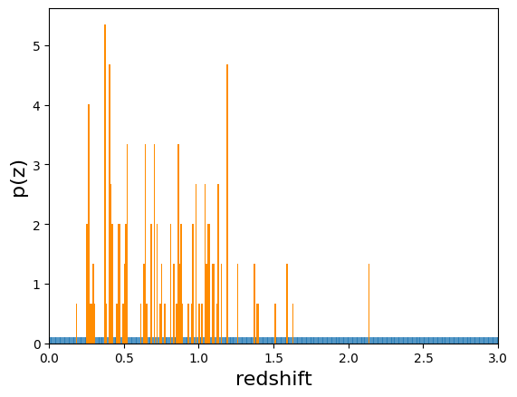
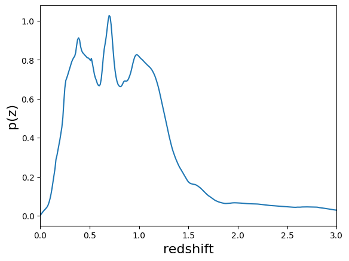

Goldenspike - Interactive Version: an example of an end-to-end analysis using RAIL
==================================================================================

**Authors:** Sam Schmidt, Eric Charles, Alex Malz, John Franklin
Crenshaw, others…

**Last run successfully:** Feb 9, 2026

This notebook demonstrates how to use a the various RAIL Modules to draw
synthetic samples of fluxes by color, apply physical effects to them,
train photo-Z estimators on the samples, test and validate the
preformance of those estimators, and to use the RAIL summarization
modules to obtain n(z) estimates based on the p(z) estimates.

**Note:** If you’re interested in running this in pipeline mode, see
`Goldenspike.ipynb <https://github.com/LSSTDESC/rail/blob/main/pipeline_examples/goldenspike_examples/Goldenspike.ipynb>`__
in the ``pipeline_examples/goldenspike_examples/`` folder.

**Creation**

Note that in the parlance of the Creation Module, “degradation” is any
post-processing that occurs to the “true” sample generated by the create
Engine. This can include adding photometric errors, applying quality
cuts, introducing systematic biases, etc.

In this notebook, we will draw both test and training samples from a
RAIL Engine object. Then we will demonstrate how to use RAIL degraders
to apply effects to those samples.

**Training and Estimation**

The RAIL Informer modules “train” or “inform” models used to estimate
p(z) given band fluxes (and potentially other information).

The RAIL Estimation modules then use those same models to actually apply
the model and extract the p(z) estimates.

**p(z) Validation**

The RAIL Validator module applies various metrics.

**p(z) to n(z) Summarization**

The RAIL Summarization modules convert per-galaxy p(z) posteriors to
ensemble n(z) estimates.

.. code:: ipython3

    import numpy as np
    import rail.interactive as ri
    import tables_io
    from pzflow.examples import get_galaxy_data

.. parsed-literal::

    Install FSPS with the following commands:
    pip uninstall fsps
    git clone --recursive https://github.com/dfm/python-fsps.git
    cd python-fsps
    python -m pip install .
    export SPS_HOME=$(pwd)/src/fsps/libfsps
    
    LEPHAREDIR is being set to the default cache directory which is being created at:
    /home/runner/.cache/lephare/data
    More than 1Gb may be written there.
    LEPHAREWORK is being set to the default cache directory:
    /home/runner/.cache/lephare/work

.. parsed-literal::

    
    A module that was compiled using NumPy 1.x cannot be run in
    NumPy 2.2.6 as it may crash. To support both 1.x and 2.x
    versions of NumPy, modules must be compiled with NumPy 2.0.
    Some module may need to rebuild instead e.g. with 'pybind11>=2.12'.
    
    If you are a user of the module, the easiest solution will be to
    downgrade to 'numpy<2' or try to upgrade the affected module.
    We expect that some modules will need time to support NumPy 2.
    
    Traceback (most recent call last):  File "/opt/hostedtoolcache/Python/3.10.20/x64/lib/python3.10/runpy.py", line 196, in _run_module_as_main
        return _run_code(code, main_globals, None,
      File "/opt/hostedtoolcache/Python/3.10.20/x64/lib/python3.10/runpy.py", line 86, in _run_code
        exec(code, run_globals)
      File "/opt/hostedtoolcache/Python/3.10.20/x64/lib/python3.10/site-packages/ipykernel_launcher.py", line 18, in <module>
        app.launch_new_instance()
      File "/opt/hostedtoolcache/Python/3.10.20/x64/lib/python3.10/site-packages/traitlets/config/application.py", line 1082, in launch_instance
        app.start()
      File "/opt/hostedtoolcache/Python/3.10.20/x64/lib/python3.10/site-packages/ipykernel/kernelapp.py", line 758, in start
        self.io_loop.start()
      File "/opt/hostedtoolcache/Python/3.10.20/x64/lib/python3.10/site-packages/tornado/platform/asyncio.py", line 211, in start
        self.asyncio_loop.run_forever()
      File "/opt/hostedtoolcache/Python/3.10.20/x64/lib/python3.10/asyncio/base_events.py", line 603, in run_forever
        self._run_once()
      File "/opt/hostedtoolcache/Python/3.10.20/x64/lib/python3.10/asyncio/base_events.py", line 1909, in _run_once
        handle._run()
      File "/opt/hostedtoolcache/Python/3.10.20/x64/lib/python3.10/asyncio/events.py", line 80, in _run
        self._context.run(self._callback, *self._args)
      File "/opt/hostedtoolcache/Python/3.10.20/x64/lib/python3.10/site-packages/ipykernel/utils.py", line 71, in preserve_context
        return await f(*args, **kwargs)
      File "/opt/hostedtoolcache/Python/3.10.20/x64/lib/python3.10/site-packages/ipykernel/kernelbase.py", line 621, in shell_main
        await self.dispatch_shell(msg, subshell_id=subshell_id)
      File "/opt/hostedtoolcache/Python/3.10.20/x64/lib/python3.10/site-packages/ipykernel/kernelbase.py", line 478, in dispatch_shell
        await result
      File "/opt/hostedtoolcache/Python/3.10.20/x64/lib/python3.10/site-packages/ipykernel/ipkernel.py", line 372, in execute_request
        await super().execute_request(stream, ident, parent)
      File "/opt/hostedtoolcache/Python/3.10.20/x64/lib/python3.10/site-packages/ipykernel/kernelbase.py", line 834, in execute_request
        reply_content = await reply_content
      File "/opt/hostedtoolcache/Python/3.10.20/x64/lib/python3.10/site-packages/ipykernel/ipkernel.py", line 464, in do_execute
        res = shell.run_cell(
      File "/opt/hostedtoolcache/Python/3.10.20/x64/lib/python3.10/site-packages/ipykernel/zmqshell.py", line 663, in run_cell
        return super().run_cell(*args, **kwargs)
      File "/opt/hostedtoolcache/Python/3.10.20/x64/lib/python3.10/site-packages/IPython/core/interactiveshell.py", line 3077, in run_cell
        result = self._run_cell(
      File "/opt/hostedtoolcache/Python/3.10.20/x64/lib/python3.10/site-packages/IPython/core/interactiveshell.py", line 3132, in _run_cell
        result = runner(coro)
      File "/opt/hostedtoolcache/Python/3.10.20/x64/lib/python3.10/site-packages/IPython/core/async_helpers.py", line 128, in _pseudo_sync_runner
        coro.send(None)
      File "/opt/hostedtoolcache/Python/3.10.20/x64/lib/python3.10/site-packages/IPython/core/interactiveshell.py", line 3336, in run_cell_async
        has_raised = await self.run_ast_nodes(code_ast.body, cell_name,
      File "/opt/hostedtoolcache/Python/3.10.20/x64/lib/python3.10/site-packages/IPython/core/interactiveshell.py", line 3519, in run_ast_nodes
        if await self.run_code(code, result, async_=asy):
      File "/opt/hostedtoolcache/Python/3.10.20/x64/lib/python3.10/site-packages/IPython/core/interactiveshell.py", line 3579, in run_code
        exec(code_obj, self.user_global_ns, self.user_ns)
      File "/tmp/ipykernel_3760/1750766246.py", line 2, in <module>
        import rail.interactive as ri
      File "/opt/hostedtoolcache/Python/3.10.20/x64/lib/python3.10/site-packages/rail/interactive/__init__.py", line 3, in <module>
        from . import calib, creation, estimation, evaluation, tools
      File "/opt/hostedtoolcache/Python/3.10.20/x64/lib/python3.10/site-packages/rail/interactive/calib/__init__.py", line 3, in <module>
        from rail.utils.interactive.initialize_utils import _initialize_interactive_module
      File "/opt/hostedtoolcache/Python/3.10.20/x64/lib/python3.10/site-packages/rail/utils/interactive/initialize_utils.py", line 17, in <module>
        from rail.utils.interactive.base_utils import (
      File "/opt/hostedtoolcache/Python/3.10.20/x64/lib/python3.10/site-packages/rail/utils/interactive/base_utils.py", line 10, in <module>
        rail.stages.import_and_attach_all(silent=True)
      File "/opt/hostedtoolcache/Python/3.10.20/x64/lib/python3.10/site-packages/rail/stages/__init__.py", line 74, in import_and_attach_all
        RailEnv.import_all_packages(silent=silent)
      File "/opt/hostedtoolcache/Python/3.10.20/x64/lib/python3.10/site-packages/rail/core/introspection.py", line 541, in import_all_packages
        _imported_module = importlib.import_module(pkg)
      File "/opt/hostedtoolcache/Python/3.10.20/x64/lib/python3.10/importlib/__init__.py", line 126, in import_module
        return _bootstrap._gcd_import(name[level:], package, level)
      File "/opt/hostedtoolcache/Python/3.10.20/x64/lib/python3.10/site-packages/rail/som/__init__.py", line 1, in <module>
        from rail.creation.degraders.specz_som import *
      File "/opt/hostedtoolcache/Python/3.10.20/x64/lib/python3.10/site-packages/rail/creation/degraders/specz_som.py", line 15, in <module>
        from somoclu import Somoclu
      File "/opt/hostedtoolcache/Python/3.10.20/x64/lib/python3.10/site-packages/somoclu/__init__.py", line 11, in <module>
        from .train import Somoclu
      File "/opt/hostedtoolcache/Python/3.10.20/x64/lib/python3.10/site-packages/somoclu/train.py", line 25, in <module>
        from .somoclu_wrap import train as wrap_train
      File "/opt/hostedtoolcache/Python/3.10.20/x64/lib/python3.10/site-packages/somoclu/somoclu_wrap.py", line 11, in <module>
        import _somoclu_wrap

::

    ---------------------------------------------------------------------------

    ImportError                               Traceback (most recent call last)

    File /opt/hostedtoolcache/Python/3.10.20/x64/lib/python3.10/site-packages/numpy/core/_multiarray_umath.py:44, in __getattr__(attr_name)
         39     # Also print the message (with traceback).  This is because old versions
         40     # of NumPy unfortunately set up the import to replace (and hide) the
         41     # error.  The traceback shouldn't be needed, but e.g. pytest plugins
         42     # seem to swallow it and we should be failing anyway...
         43     sys.stderr.write(msg + tb_msg)
    ---> 44     raise ImportError(msg)
         46 ret = getattr(_multiarray_umath, attr_name, None)
         47 if ret is None:

    ImportError: 
    A module that was compiled using NumPy 1.x cannot be run in
    NumPy 2.2.6 as it may crash. To support both 1.x and 2.x
    versions of NumPy, modules must be compiled with NumPy 2.0.
    Some module may need to rebuild instead e.g. with 'pybind11>=2.12'.
    
    If you are a user of the module, the easiest solution will be to
    downgrade to 'numpy<2' or try to upgrade the affected module.
    We expect that some modules will need time to support NumPy 2.
    

.. parsed-literal::

    Warning: the binary library cannot be imported. You cannot train maps, but you can load and analyze ones that you have already saved.
    The problem occurs because either compilation failed when you installed Somoclu or a path is missing from the dependencies when you are trying to import it. Please refer to the documentation to see your options.

Here we need a few configuration parameters to deal with differences in
data schema between existing PZ codes.

.. code:: ipython3

    bands = ["u", "g", "r", "i", "z", "y"]
    band_dict = {band: f"mag_{band}_lsst" for band in bands}
    rename_dict = {f"mag_{band}_lsst_err": f"mag_err_{band}_lsst" for band in bands}

Get the data to use
-------------------

.. code:: ipython3

    catalog = get_galaxy_data().rename(band_dict, axis=1)

Train the Flow Engine
---------------------

First we need to train the normalizing flow that will serve as the
engine for the notebook.

.. code:: ipython3

    flow_model = ri.creation.engines.flowEngine.flow_modeler(
        input_data=catalog,
        flow_seed=0,
        phys_cols={"redshift": [0, 3]},
        phot_cols={
            "mag_u_lsst": [17, 35],
            "mag_g_lsst": [16, 32],
            "mag_r_lsst": [15, 30],
            "mag_i_lsst": [15, 30],
            "mag_z_lsst": [14, 29],
            "mag_y_lsst": [14, 28],
        },
        calc_colors={"ref_column_name": "mag_i_lsst"},
    )

.. parsed-literal::

    Inserting handle into data store.  input: None, FlowModeler

.. parsed-literal::

    Training 30 epochs 
    Loss:

.. parsed-literal::

    (0) 17.6137

.. parsed-literal::

    (1) 0.6520

.. parsed-literal::

    (2) -0.5447

.. parsed-literal::

    (3) -1.1237

.. parsed-literal::

    (4) -2.2452

.. parsed-literal::

    (5) -0.9087

.. parsed-literal::

    (6) -2.6153

.. parsed-literal::

    (7) -3.0003

.. parsed-literal::

    (8) -2.0957

.. parsed-literal::

    (9) -3.0565

.. parsed-literal::

    (10) -2.7510

.. parsed-literal::

    (11) -2.4835

.. parsed-literal::

    (12) -3.3952

.. parsed-literal::

    (13) -2.1304

.. parsed-literal::

    (14) -3.4847

.. parsed-literal::

    (15) -3.4766

.. parsed-literal::

    (16) -3.0520

.. parsed-literal::

    (17) -2.2952

.. parsed-literal::

    (18) -3.6583

.. parsed-literal::

    (19) -4.3161

.. parsed-literal::

    (20) -4.3173

.. parsed-literal::

    (21) -4.1139

.. parsed-literal::

    (22) -4.1250

.. parsed-literal::

    (23) -3.4916

.. parsed-literal::

    (24) -4.3064

.. parsed-literal::

    (25) -3.4034

.. parsed-literal::

    (26) -4.6735

.. parsed-literal::

    (27) -4.3018

.. parsed-literal::

    (28) -4.7525

.. parsed-literal::

    (29) -4.5583

.. parsed-literal::

    (30) -4.7738

.. parsed-literal::

    Inserting handle into data store.  model: inprogress_model.pkl, FlowModeler

.. code:: ipython3

    ri.creation.engines.flowEngine.flow_modeler?

Make mock data
--------------

Now we will use the trained flow to create training and test data for
the photo-z estimators.

For both the training and test data we will:

1. Use the Flow to produce some synthetic data
2. Use the LSSTErrorModel to add photometric errors
3. Use the FlowPosterior to estimate the redshift posteriors for the
   degraded sample
4. Use the ColumnMapper to rename the error columns so that they match
   the names in DC2.
5. Use the TableConverter to convert the data to a numpy dictionary,
   which will be stored in a hdf5 file with the same schema as the DC2
   data

Training sample
~~~~~~~~~~~~~~~

For the training data we are going to apply a couple of extra
degradation effects to the data beyond what we do to create test data,
as the training data will have some spectroscopic incompleteness. This
will allow us to see how the trained models perform with imperfect
training data.

More details about the degraders are available in the
``rail/examples/creation_examples/00_Quick_Start_in_Creation.ipynb``
notebook.

.. code:: ipython3

    train_data_orig = ri.creation.engines.flowEngine.flow_creator(
        n_samples=150, model=flow_model["model"], seed=1235
    )

.. parsed-literal::

    Inserting handle into data store.  model: <pzflow.flow.Flow object at 0x7f8488a953c0>, FlowCreator

.. parsed-literal::

    Inserting handle into data store.  output: inprogress_output.pq, FlowCreator

.. code:: ipython3

    train_data_errs = ri.creation.degraders.photometric_errors.lsst_error_model(
        sample=train_data_orig["output"], seed=66, renameDict=band_dict, ndFlag=np.nan
    )

.. parsed-literal::

    Inserting handle into data store.  input: None, LSSTErrorModel
    Inserting handle into data store.  output: inprogress_output.pq, LSSTErrorModel

.. code:: ipython3

    train_data_inc = (
        ri.creation.degraders.spectroscopic_degraders.inv_redshift_incompleteness(
            sample=train_data_errs["output"], pivot_redshift=1.0
        )
    )

.. parsed-literal::

    Inserting handle into data store.  input: None, InvRedshiftIncompleteness
    Inserting handle into data store.  output: inprogress_output.pq, InvRedshiftIncompleteness

.. code:: ipython3

    train_data_conf = ri.creation.degraders.spectroscopic_degraders.line_confusion(
        sample=train_data_inc["output"],
        true_wavelen=5007.0,
        wrong_wavelen=3727.0,
        frac_wrong=0.05,
        seed=1337,
    )

.. parsed-literal::

    Inserting handle into data store.  input: None, LineConfusion
    Inserting handle into data store.  output: inprogress_output.pq, LineConfusion

.. code:: ipython3

    train_data_cut = ri.creation.degraders.quantityCut.quantity_cut(
        sample=train_data_conf["output"], cuts={"mag_i_lsst": 25.0}
    )

.. parsed-literal::

    Inserting handle into data store.  input: None, QuantityCut
    Inserting handle into data store.  output: inprogress_output.pq, QuantityCut

.. code:: ipython3

    train_data_pq = ri.tools.table_tools.column_mapper(
        data=train_data_cut["output"], columns=rename_dict
    )

.. parsed-literal::

    Inserting handle into data store.  input: None, ColumnMapper
    Inserting handle into data store.  output: inprogress_output.pq, ColumnMapper

.. code:: ipython3

    train_data = ri.tools.table_tools.table_converter(
        data=train_data_pq["output"], output_format="numpyDict"
    )

.. parsed-literal::

    Inserting handle into data store.  input: None, TableConverter
    Inserting handle into data store.  output: inprogress_output.hdf5, TableConverter

Let’s examine the quantities that we’ve generated, we’ll use the handy
``tables_io`` package to temporarily write to a pandas dataframe for
quick writeout of the columns:

.. code:: ipython3

    train_table = tables_io.convertObj(train_data["output"], tables_io.types.PD_DATAFRAME)
    train_table.head()

.. raw:: html

    

    
    <table border="1" class="dataframe">
      <thead>
        <tr style="text-align: right;">
          <th></th>
          <th>redshift</th>
          <th>mag_u_lsst</th>
          <th>mag_err_u_lsst</th>
          <th>mag_g_lsst</th>
          <th>mag_err_g_lsst</th>
          <th>mag_r_lsst</th>
          <th>mag_err_r_lsst</th>
          <th>mag_i_lsst</th>
          <th>mag_err_i_lsst</th>
          <th>mag_z_lsst</th>
          <th>mag_err_z_lsst</th>
          <th>mag_y_lsst</th>
          <th>mag_err_y_lsst</th>
        </tr>
      </thead>
      <tbody>
        <tr>
          <th>0</th>
          <td>1.242838</td>
          <td>25.113348</td>
          <td>0.119465</td>
          <td>25.024177</td>
          <td>0.037825</td>
          <td>24.977014</td>
          <td>0.031858</td>
          <td>24.690140</td>
          <td>0.040322</td>
          <td>24.073465</td>
          <td>0.044711</td>
          <td>23.791711</td>
          <td>0.078676</td>
        </tr>
        <tr>
          <th>1</th>
          <td>0.228952</td>
          <td>25.975207</td>
          <td>0.247749</td>
          <td>25.191938</td>
          <td>0.043868</td>
          <td>24.756894</td>
          <td>0.026272</td>
          <td>24.486493</td>
          <td>0.033676</td>
          <td>24.418759</td>
          <td>0.060745</td>
          <td>24.251326</td>
          <td>0.117732</td>
        </tr>
        <tr>
          <th>2</th>
          <td>1.062717</td>
          <td>25.650095</td>
          <td>0.189035</td>
          <td>25.715295</td>
          <td>0.069720</td>
          <td>25.443896</td>
          <td>0.048162</td>
          <td>24.830244</td>
          <td>0.045658</td>
          <td>24.356002</td>
          <td>0.057455</td>
          <td>24.151387</td>
          <td>0.107910</td>
        </tr>
        <tr>
          <th>3</th>
          <td>0.781089</td>
          <td>26.513461</td>
          <td>0.380987</td>
          <td>25.384487</td>
          <td>0.052023</td>
          <td>23.587306</td>
          <td>0.010275</td>
          <td>22.380700</td>
          <td>0.007079</td>
          <td>21.676435</td>
          <td>0.007179</td>
          <td>21.400308</td>
          <td>0.010418</td>
        </tr>
        <tr>
          <th>4</th>
          <td>1.392721</td>
          <td>24.933812</td>
          <td>0.102211</td>
          <td>24.114490</td>
          <td>0.017295</td>
          <td>22.957633</td>
          <td>0.007156</td>
          <td>21.929488</td>
          <td>0.006031</td>
          <td>21.544731</td>
          <td>0.006785</td>
          <td>21.327006</td>
          <td>0.009912</td>
        </tr>
      </tbody>
    </table>
    

You see that we’ve generated redshifts, ugrizy magnitudes, and magnitude
errors with names that match those in the cosmoDC2_v1.1.4_image data.

Testing sample
~~~~~~~~~~~~~~

For the test sample we will:

1. Use the Flow to produce some synthetic data
2. Use the LSSTErrorModel to smear the data
3. Use the FlowPosterior to estimate the redshift posteriors for the
   degraded sample
4. Use ColumnMapper to rename some of the columns to match DC2
5. Use the TableConverter to convert the data to a numpy dictionary,
   which will be stored in a hdf5 file with the same schema as the DC2
   data

.. code:: ipython3

    test_data_orig = ri.creation.engines.flowEngine.flow_creator(
        model=flow_model["model"], n_samples=150, seed=1234
    )

.. parsed-literal::

    Inserting handle into data store.  model: <pzflow.flow.Flow object at 0x7f8488a953c0>, FlowCreator
    Inserting handle into data store.  output: inprogress_output.pq, FlowCreator

.. code:: ipython3

    test_data_errs = ri.creation.degraders.photometric_errors.lsst_error_model(
        sample=test_data_orig["output"], seed=58, renameDict=band_dict, ndFlag=np.nan
    )

.. parsed-literal::

    Inserting handle into data store.  input: None, LSSTErrorModel
    Inserting handle into data store.  output: inprogress_output.pq, LSSTErrorModel

.. code:: ipython3

    test_data_post = ri.creation.engines.flowEngine.flow_posterior(
        input_data=test_data_errs["output"],
        model=flow_model["model"],
        column="redshift",
        grid=np.linspace(0.0, 5.0, 21),
        err_samples=None,
    )

.. parsed-literal::

    Inserting handle into data store.  model: <pzflow.flow.Flow object at 0x7f8488a953c0>, FlowPosterior
    Inserting handle into data store.  input: None, FlowPosterior

.. parsed-literal::

    Inserting handle into data store.  output: inprogress_output.hdf5, FlowPosterior

.. parsed-literal::

    /opt/hostedtoolcache/Python/3.10.20/x64/lib/python3.10/site-packages/qp/parameterizations/interp/interp.py:187: UserWarning: The distributions at indices = [7] have an integral of 0.
      warnings.warn(
    /opt/hostedtoolcache/Python/3.10.20/x64/lib/python3.10/site-packages/qp/parameterizations/interp/interp.py:207: RuntimeWarning: invalid value encountered in divide
      new_yvals = (self._yvals.T / self._ycumul[:, -1]).T
    /opt/hostedtoolcache/Python/3.10.20/x64/lib/python3.10/site-packages/qp/parameterizations/interp/interp.py:208: RuntimeWarning: invalid value encountered in divide
      self._ycumul = (self._ycumul.T / self._ycumul[:, -1]).T
    /opt/hostedtoolcache/Python/3.10.20/x64/lib/python3.10/site-packages/qp/parameterizations/interp/interp.py:140: RuntimeWarning: There are non-finite values in the yvals for the following distributions: (array([7, 7, 7, 7, 7, 7, 7, 7, 7, 7, 7, 7, 7, 7, 7, 7, 7, 7, 7, 7, 7]), array([ 0,  1,  2,  3,  4,  5,  6,  7,  8,  9, 10, 11, 12, 13, 14, 15, 16,
           17, 18, 19, 20]))
      warnings.warn(

.. code:: ipython3

    test_data_pq = ri.tools.table_tools.column_mapper(
        data=test_data_errs["output"], columns=rename_dict, hdf5_groupname=""
    )

.. parsed-literal::

    Inserting handle into data store.  input: None, ColumnMapper
    Inserting handle into data store.  output: inprogress_output.pq, ColumnMapper

.. code:: ipython3

    test_data = ri.tools.table_tools.table_converter(
        data=test_data_pq["output"], output_format="numpyDict"
    )

.. parsed-literal::

    Inserting handle into data store.  input: None, TableConverter
    Inserting handle into data store.  output: inprogress_output.hdf5, TableConverter

.. code:: ipython3

    test_table = tables_io.convertObj(test_data["output"], tables_io.types.PD_DATAFRAME)
    test_table.head()

.. raw:: html

    

    
    <table border="1" class="dataframe">
      <thead>
        <tr style="text-align: right;">
          <th></th>
          <th>redshift</th>
          <th>mag_u_lsst</th>
          <th>mag_err_u_lsst</th>
          <th>mag_g_lsst</th>
          <th>mag_err_g_lsst</th>
          <th>mag_r_lsst</th>
          <th>mag_err_r_lsst</th>
          <th>mag_i_lsst</th>
          <th>mag_err_i_lsst</th>
          <th>mag_z_lsst</th>
          <th>mag_err_z_lsst</th>
          <th>mag_y_lsst</th>
          <th>mag_err_y_lsst</th>
        </tr>
      </thead>
      <tbody>
        <tr>
          <th>0</th>
          <td>0.640352</td>
          <td>25.247582</td>
          <td>0.134148</td>
          <td>24.281295</td>
          <td>0.019869</td>
          <td>23.203382</td>
          <td>0.008096</td>
          <td>22.292925</td>
          <td>0.006819</td>
          <td>21.988840</td>
          <td>0.008439</td>
          <td>21.689685</td>
          <td>0.012866</td>
        </tr>
        <tr>
          <th>1</th>
          <td>0.718805</td>
          <td>26.241281</td>
          <td>0.307422</td>
          <td>26.170731</td>
          <td>0.104060</td>
          <td>25.651589</td>
          <td>0.057915</td>
          <td>25.022003</td>
          <td>0.054134</td>
          <td>24.797347</td>
          <td>0.084903</td>
          <td>24.726286</td>
          <td>0.177118</td>
        </tr>
        <tr>
          <th>2</th>
          <td>0.940856</td>
          <td>26.727667</td>
          <td>0.448790</td>
          <td>26.133416</td>
          <td>0.100720</td>
          <td>25.544442</td>
          <td>0.052660</td>
          <td>24.907585</td>
          <td>0.048904</td>
          <td>24.472642</td>
          <td>0.063718</td>
          <td>24.179363</td>
          <td>0.110578</td>
        </tr>
        <tr>
          <th>3</th>
          <td>1.646883</td>
          <td>28.471068</td>
          <td>1.374725</td>
          <td>29.290039</td>
          <td>1.107126</td>
          <td>28.055213</td>
          <td>0.438828</td>
          <td>26.923748</td>
          <td>0.278668</td>
          <td>25.899981</td>
          <td>0.219369</td>
          <td>26.885128</td>
          <td>0.900753</td>
        </tr>
        <tr>
          <th>4</th>
          <td>2.213605</td>
          <td>28.998311</td>
          <td>1.777254</td>
          <td>26.764606</td>
          <td>0.173680</td>
          <td>26.838444</td>
          <td>0.163560</td>
          <td>26.757056</td>
          <td>0.243145</td>
          <td>25.952024</td>
          <td>0.229066</td>
          <td>25.596833</td>
          <td>0.361208</td>
        </tr>
      </tbody>
    </table>
    

“Inform” some estimators
------------------------

More details about the process of “informing” or “training” the models
used by the estimators is available in the
``rail/examples/estimation_examples/00_Quick_Start_in_Estimation.ipynb``
notebook.

We use “inform” rather than “train” to generically refer to the
preprocessing of any prior information. For a machine learning
estimator, that prior information is a training set, but it can also be
an SED template library for a template-fitting or hybrid estimator.

.. code:: ipython3

    inform_bpz = ri.estimation.algos.bpz_lite.bpz_lite_informer(
        training_data=train_data["output"], nondetect_val=np.nan, hdf5_groupname=""
    )
    inform_knn = ri.estimation.algos.k_nearneigh.k_near_neigh_informer(
        training_data=train_data["output"], nondetect_val=np.nan, hdf5_groupname=""
    )
    inform_fzboost = ri.estimation.algos.flexzboost.flex_z_boost_informer(
        training_data=train_data["output"], nondetect_val=np.nan, hdf5_groupname=""
    )

.. parsed-literal::

    Inserting handle into data store.  input: None, BPZliteInformer
    Inserting handle into data store.  model: inprogress_model.pkl, BPZliteInformer
    Inserting handle into data store.  input: None, KNearNeighInformer
    split into 34 training and 12 validation samples
    finding best fit sigma and NNeigh...
    
    
    
    best fit values are sigma=0.075 and numneigh=7
    
    
    
    Inserting handle into data store.  model: inprogress_model.pkl, KNearNeighInformer
    Inserting handle into data store.  input: None, FlexZBoostInformer
    stacking some data...
    read in training data
    fit the model...

.. parsed-literal::

    finding best bump thresh...

.. parsed-literal::

    finding best sharpen parameter...

.. parsed-literal::

    Retraining with full training set...

.. parsed-literal::

    Best bump = 0.35, best sharpen = 1.4
    Inserting handle into data store.  model: inprogress_model.pkl, FlexZBoostInformer

Estimate photo-z posteriors
---------------------------

More detail on the specific estimators used here is available in the
``rail/examples/estimation_examples/00_Quick_Start_in_Estimation.ipynb``
notebook, but here is a very brief summary of the three estimators used
in this notebook:

``BPZliteEstimator`` is a template-based photo-z code that outputs the
posterior estimated given likelihoods calculated using a template set
combined with a Bayesian prior. See Benitez (2000) for more details.
``KNearNeighEstimator`` is a simple photo-z code that finds the K
nearest neighbor training galaxies in color/magnitude space and creates
a weighted (by distance) mixture model PDF based on the redshifts of
those K neighbors. ``FlexZBoostEstimator`` is a mature photo-z algorithm
that estimates a PDF for each galaxy via a conditional density estimate
using the training data. See `Izbicki & Lee
(2017) <https://doi.org/10.1214/17-EJS1302>`__ for more details.

.. code:: ipython3

    bpz_estimated = ri.estimation.algos.bpz_lite.bpz_lite_estimator(
        input_data=test_data["output"],
        model=inform_bpz["model"],
        nondetect_val=np.nan,
        hdf5_groupname="",
    )
    knn_estimated = ri.estimation.algos.k_nearneigh.k_near_neigh_estimator(
        input_data=test_data["output"],
        model=inform_knn["model"],
        nondetect_val=np.nan,
        hdf5_groupname="",
    )
    fzboost_estimated = ri.estimation.algos.flexzboost.flex_z_boost_estimator(
        input_data=test_data["output"],
        model=inform_fzboost["model"],
        nondetect_val=np.nan,
        hdf5_groupname="",
        aliases={"input": "test_data", "output": "fzboost_estim"},
    )

.. parsed-literal::

    Inserting handle into data store.  input: None, BPZliteEstimator
    Inserting handle into data store.  model: {'fo_arr': array([0.35, 0.5 ]), 'kt_arr': array([0.45 , 0.147]), 'zo_arr': array([0.431 , 0.39  , 0.0626]), 'km_arr': array([0.0913, 0.0636, 0.123 ]), 'a_arr': array([2.465, 1.806, 0.906]), 'mo': 20.0, 'nt_array': [1, 2, 5]}, BPZliteEstimator
      Generating new AB file El_B2004a.DC2LSST_u.AB....
    El_B2004a DC2LSST_u
    x_res[0] 3000.0
    x_res[-1] 11500.0
    Writing AB file  /opt/hostedtoolcache/Python/3.10.20/x64/lib/python3.10/site-packages/rail/examples_data/estimation_data/data/AB/El_B2004a.DC2LSST_u.AB
      Generating new AB file El_B2004a.DC2LSST_g.AB....
    El_B2004a DC2LSST_g
    x_res[0] 3000.0
    x_res[-1] 11500.0

.. parsed-literal::

    Writing AB file  /opt/hostedtoolcache/Python/3.10.20/x64/lib/python3.10/site-packages/rail/examples_data/estimation_data/data/AB/El_B2004a.DC2LSST_g.AB
      Generating new AB file El_B2004a.DC2LSST_r.AB....
    El_B2004a DC2LSST_r
    x_res[0] 3000.0
    x_res[-1] 11500.0
    Writing AB file  /opt/hostedtoolcache/Python/3.10.20/x64/lib/python3.10/site-packages/rail/examples_data/estimation_data/data/AB/El_B2004a.DC2LSST_r.AB
      Generating new AB file El_B2004a.DC2LSST_i.AB....
    El_B2004a DC2LSST_i
    x_res[0] 3000.0
    x_res[-1] 11500.0

.. parsed-literal::

    Writing AB file  /opt/hostedtoolcache/Python/3.10.20/x64/lib/python3.10/site-packages/rail/examples_data/estimation_data/data/AB/El_B2004a.DC2LSST_i.AB
      Generating new AB file El_B2004a.DC2LSST_z.AB....
    El_B2004a DC2LSST_z
    x_res[0] 3000.0
    x_res[-1] 11500.0
    Writing AB file  /opt/hostedtoolcache/Python/3.10.20/x64/lib/python3.10/site-packages/rail/examples_data/estimation_data/data/AB/El_B2004a.DC2LSST_z.AB
      Generating new AB file El_B2004a.DC2LSST_y.AB....
    El_B2004a DC2LSST_y
    x_res[0] 3000.0
    x_res[-1] 11500.0

.. parsed-literal::

    Writing AB file  /opt/hostedtoolcache/Python/3.10.20/x64/lib/python3.10/site-packages/rail/examples_data/estimation_data/data/AB/El_B2004a.DC2LSST_y.AB
      Generating new AB file Sbc_B2004a.DC2LSST_u.AB....
    Sbc_B2004a DC2LSST_u
    x_res[0] 3000.0
    x_res[-1] 11500.0
    Writing AB file  /opt/hostedtoolcache/Python/3.10.20/x64/lib/python3.10/site-packages/rail/examples_data/estimation_data/data/AB/Sbc_B2004a.DC2LSST_u.AB
      Generating new AB file Sbc_B2004a.DC2LSST_g.AB....
    Sbc_B2004a DC2LSST_g
    x_res[0] 3000.0
    x_res[-1] 11500.0

.. parsed-literal::

    Writing AB file  /opt/hostedtoolcache/Python/3.10.20/x64/lib/python3.10/site-packages/rail/examples_data/estimation_data/data/AB/Sbc_B2004a.DC2LSST_g.AB
      Generating new AB file Sbc_B2004a.DC2LSST_r.AB....
    Sbc_B2004a DC2LSST_r
    x_res[0] 3000.0
    x_res[-1] 11500.0
    Writing AB file  /opt/hostedtoolcache/Python/3.10.20/x64/lib/python3.10/site-packages/rail/examples_data/estimation_data/data/AB/Sbc_B2004a.DC2LSST_r.AB
      Generating new AB file Sbc_B2004a.DC2LSST_i.AB....
    Sbc_B2004a DC2LSST_i
    x_res[0] 3000.0
    x_res[-1] 11500.0

.. parsed-literal::

    Writing AB file  /opt/hostedtoolcache/Python/3.10.20/x64/lib/python3.10/site-packages/rail/examples_data/estimation_data/data/AB/Sbc_B2004a.DC2LSST_i.AB
      Generating new AB file Sbc_B2004a.DC2LSST_z.AB....
    Sbc_B2004a DC2LSST_z
    x_res[0] 3000.0
    x_res[-1] 11500.0
    Writing AB file  /opt/hostedtoolcache/Python/3.10.20/x64/lib/python3.10/site-packages/rail/examples_data/estimation_data/data/AB/Sbc_B2004a.DC2LSST_z.AB
      Generating new AB file Sbc_B2004a.DC2LSST_y.AB....
    Sbc_B2004a DC2LSST_y
    x_res[0] 3000.0
    x_res[-1] 11500.0

.. parsed-literal::

    Writing AB file  /opt/hostedtoolcache/Python/3.10.20/x64/lib/python3.10/site-packages/rail/examples_data/estimation_data/data/AB/Sbc_B2004a.DC2LSST_y.AB
      Generating new AB file Scd_B2004a.DC2LSST_u.AB....
    Scd_B2004a DC2LSST_u
    x_res[0] 3000.0
    x_res[-1] 11500.0
    Writing AB file  /opt/hostedtoolcache/Python/3.10.20/x64/lib/python3.10/site-packages/rail/examples_data/estimation_data/data/AB/Scd_B2004a.DC2LSST_u.AB
      Generating new AB file Scd_B2004a.DC2LSST_g.AB....
    Scd_B2004a DC2LSST_g
    x_res[0] 3000.0
    x_res[-1] 11500.0

.. parsed-literal::

    Writing AB file  /opt/hostedtoolcache/Python/3.10.20/x64/lib/python3.10/site-packages/rail/examples_data/estimation_data/data/AB/Scd_B2004a.DC2LSST_g.AB
      Generating new AB file Scd_B2004a.DC2LSST_r.AB....
    Scd_B2004a DC2LSST_r
    x_res[0] 3000.0
    x_res[-1] 11500.0
    Writing AB file  /opt/hostedtoolcache/Python/3.10.20/x64/lib/python3.10/site-packages/rail/examples_data/estimation_data/data/AB/Scd_B2004a.DC2LSST_r.AB
      Generating new AB file Scd_B2004a.DC2LSST_i.AB....
    Scd_B2004a DC2LSST_i
    x_res[0] 3000.0
    x_res[-1] 11500.0

.. parsed-literal::

    Writing AB file  /opt/hostedtoolcache/Python/3.10.20/x64/lib/python3.10/site-packages/rail/examples_data/estimation_data/data/AB/Scd_B2004a.DC2LSST_i.AB
      Generating new AB file Scd_B2004a.DC2LSST_z.AB....
    Scd_B2004a DC2LSST_z
    x_res[0] 3000.0
    x_res[-1] 11500.0
    Writing AB file  /opt/hostedtoolcache/Python/3.10.20/x64/lib/python3.10/site-packages/rail/examples_data/estimation_data/data/AB/Scd_B2004a.DC2LSST_z.AB
      Generating new AB file Scd_B2004a.DC2LSST_y.AB....
    Scd_B2004a DC2LSST_y
    x_res[0] 3000.0
    x_res[-1] 11500.0

.. parsed-literal::

    Writing AB file  /opt/hostedtoolcache/Python/3.10.20/x64/lib/python3.10/site-packages/rail/examples_data/estimation_data/data/AB/Scd_B2004a.DC2LSST_y.AB
      Generating new AB file Im_B2004a.DC2LSST_u.AB....
    Im_B2004a DC2LSST_u
    x_res[0] 3000.0
    x_res[-1] 11500.0
    Writing AB file  /opt/hostedtoolcache/Python/3.10.20/x64/lib/python3.10/site-packages/rail/examples_data/estimation_data/data/AB/Im_B2004a.DC2LSST_u.AB
      Generating new AB file Im_B2004a.DC2LSST_g.AB....
    Im_B2004a DC2LSST_g
    x_res[0] 3000.0
    x_res[-1] 11500.0

.. parsed-literal::

    Writing AB file  /opt/hostedtoolcache/Python/3.10.20/x64/lib/python3.10/site-packages/rail/examples_data/estimation_data/data/AB/Im_B2004a.DC2LSST_g.AB
      Generating new AB file Im_B2004a.DC2LSST_r.AB....
    Im_B2004a DC2LSST_r
    x_res[0] 3000.0
    x_res[-1] 11500.0
    Writing AB file  /opt/hostedtoolcache/Python/3.10.20/x64/lib/python3.10/site-packages/rail/examples_data/estimation_data/data/AB/Im_B2004a.DC2LSST_r.AB
      Generating new AB file Im_B2004a.DC2LSST_i.AB....
    Im_B2004a DC2LSST_i
    x_res[0] 3000.0
    x_res[-1] 11500.0

.. parsed-literal::

    Writing AB file  /opt/hostedtoolcache/Python/3.10.20/x64/lib/python3.10/site-packages/rail/examples_data/estimation_data/data/AB/Im_B2004a.DC2LSST_i.AB
      Generating new AB file Im_B2004a.DC2LSST_z.AB....
    Im_B2004a DC2LSST_z
    x_res[0] 3000.0
    x_res[-1] 11500.0
    Writing AB file  /opt/hostedtoolcache/Python/3.10.20/x64/lib/python3.10/site-packages/rail/examples_data/estimation_data/data/AB/Im_B2004a.DC2LSST_z.AB
      Generating new AB file Im_B2004a.DC2LSST_y.AB....
    Im_B2004a DC2LSST_y
    x_res[0] 3000.0
    x_res[-1] 11500.0

.. parsed-literal::

    Writing AB file  /opt/hostedtoolcache/Python/3.10.20/x64/lib/python3.10/site-packages/rail/examples_data/estimation_data/data/AB/Im_B2004a.DC2LSST_y.AB
      Generating new AB file SB3_B2004a.DC2LSST_u.AB....
    SB3_B2004a DC2LSST_u
    x_res[0] 3000.0
    x_res[-1] 11500.0
    Writing AB file  /opt/hostedtoolcache/Python/3.10.20/x64/lib/python3.10/site-packages/rail/examples_data/estimation_data/data/AB/SB3_B2004a.DC2LSST_u.AB
      Generating new AB file SB3_B2004a.DC2LSST_g.AB....
    SB3_B2004a DC2LSST_g
    x_res[0] 3000.0
    x_res[-1] 11500.0

.. parsed-literal::

    Writing AB file  /opt/hostedtoolcache/Python/3.10.20/x64/lib/python3.10/site-packages/rail/examples_data/estimation_data/data/AB/SB3_B2004a.DC2LSST_g.AB
      Generating new AB file SB3_B2004a.DC2LSST_r.AB....
    SB3_B2004a DC2LSST_r
    x_res[0] 3000.0
    x_res[-1] 11500.0
    Writing AB file  /opt/hostedtoolcache/Python/3.10.20/x64/lib/python3.10/site-packages/rail/examples_data/estimation_data/data/AB/SB3_B2004a.DC2LSST_r.AB
      Generating new AB file SB3_B2004a.DC2LSST_i.AB....
    SB3_B2004a DC2LSST_i
    x_res[0] 3000.0
    x_res[-1] 11500.0

.. parsed-literal::

    Writing AB file  /opt/hostedtoolcache/Python/3.10.20/x64/lib/python3.10/site-packages/rail/examples_data/estimation_data/data/AB/SB3_B2004a.DC2LSST_i.AB
      Generating new AB file SB3_B2004a.DC2LSST_z.AB....
    SB3_B2004a DC2LSST_z
    x_res[0] 3000.0
    x_res[-1] 11500.0
    Writing AB file  /opt/hostedtoolcache/Python/3.10.20/x64/lib/python3.10/site-packages/rail/examples_data/estimation_data/data/AB/SB3_B2004a.DC2LSST_z.AB
      Generating new AB file SB3_B2004a.DC2LSST_y.AB....
    SB3_B2004a DC2LSST_y
    x_res[0] 3000.0
    x_res[-1] 11500.0

.. parsed-literal::

    Writing AB file  /opt/hostedtoolcache/Python/3.10.20/x64/lib/python3.10/site-packages/rail/examples_data/estimation_data/data/AB/SB3_B2004a.DC2LSST_y.AB
      Generating new AB file SB2_B2004a.DC2LSST_u.AB....
    SB2_B2004a DC2LSST_u
    x_res[0] 3000.0
    x_res[-1] 11500.0
    Writing AB file  /opt/hostedtoolcache/Python/3.10.20/x64/lib/python3.10/site-packages/rail/examples_data/estimation_data/data/AB/SB2_B2004a.DC2LSST_u.AB
      Generating new AB file SB2_B2004a.DC2LSST_g.AB....
    SB2_B2004a DC2LSST_g
    x_res[0] 3000.0
    x_res[-1] 11500.0

.. parsed-literal::

    Writing AB file  /opt/hostedtoolcache/Python/3.10.20/x64/lib/python3.10/site-packages/rail/examples_data/estimation_data/data/AB/SB2_B2004a.DC2LSST_g.AB
      Generating new AB file SB2_B2004a.DC2LSST_r.AB....
    SB2_B2004a DC2LSST_r
    x_res[0] 3000.0
    x_res[-1] 11500.0
    Writing AB file  /opt/hostedtoolcache/Python/3.10.20/x64/lib/python3.10/site-packages/rail/examples_data/estimation_data/data/AB/SB2_B2004a.DC2LSST_r.AB
      Generating new AB file SB2_B2004a.DC2LSST_i.AB....
    SB2_B2004a DC2LSST_i
    x_res[0] 3000.0
    x_res[-1] 11500.0

.. parsed-literal::

    Writing AB file  /opt/hostedtoolcache/Python/3.10.20/x64/lib/python3.10/site-packages/rail/examples_data/estimation_data/data/AB/SB2_B2004a.DC2LSST_i.AB
      Generating new AB file SB2_B2004a.DC2LSST_z.AB....
    SB2_B2004a DC2LSST_z
    x_res[0] 3000.0
    x_res[-1] 11500.0
    Writing AB file  /opt/hostedtoolcache/Python/3.10.20/x64/lib/python3.10/site-packages/rail/examples_data/estimation_data/data/AB/SB2_B2004a.DC2LSST_z.AB
      Generating new AB file SB2_B2004a.DC2LSST_y.AB....
    SB2_B2004a DC2LSST_y
    x_res[0] 3000.0
    x_res[-1] 11500.0

.. parsed-literal::

    Writing AB file  /opt/hostedtoolcache/Python/3.10.20/x64/lib/python3.10/site-packages/rail/examples_data/estimation_data/data/AB/SB2_B2004a.DC2LSST_y.AB
      Generating new AB file ssp_25Myr_z008.DC2LSST_u.AB....
    ssp_25Myr_z008 DC2LSST_u
    x_res[0] 3000.0
    x_res[-1] 11500.0
    Writing AB file  /opt/hostedtoolcache/Python/3.10.20/x64/lib/python3.10/site-packages/rail/examples_data/estimation_data/data/AB/ssp_25Myr_z008.DC2LSST_u.AB
      Generating new AB file ssp_25Myr_z008.DC2LSST_g.AB....
    ssp_25Myr_z008 DC2LSST_g
    x_res[0] 3000.0
    x_res[-1] 11500.0

.. parsed-literal::

    Writing AB file  /opt/hostedtoolcache/Python/3.10.20/x64/lib/python3.10/site-packages/rail/examples_data/estimation_data/data/AB/ssp_25Myr_z008.DC2LSST_g.AB
      Generating new AB file ssp_25Myr_z008.DC2LSST_r.AB....
    ssp_25Myr_z008 DC2LSST_r
    x_res[0] 3000.0
    x_res[-1] 11500.0
    Writing AB file  /opt/hostedtoolcache/Python/3.10.20/x64/lib/python3.10/site-packages/rail/examples_data/estimation_data/data/AB/ssp_25Myr_z008.DC2LSST_r.AB
      Generating new AB file ssp_25Myr_z008.DC2LSST_i.AB....
    ssp_25Myr_z008 DC2LSST_i
    x_res[0] 3000.0
    x_res[-1] 11500.0

.. parsed-literal::

    Writing AB file  /opt/hostedtoolcache/Python/3.10.20/x64/lib/python3.10/site-packages/rail/examples_data/estimation_data/data/AB/ssp_25Myr_z008.DC2LSST_i.AB
      Generating new AB file ssp_25Myr_z008.DC2LSST_z.AB....
    ssp_25Myr_z008 DC2LSST_z
    x_res[0] 3000.0
    x_res[-1] 11500.0
    Writing AB file  /opt/hostedtoolcache/Python/3.10.20/x64/lib/python3.10/site-packages/rail/examples_data/estimation_data/data/AB/ssp_25Myr_z008.DC2LSST_z.AB
      Generating new AB file ssp_25Myr_z008.DC2LSST_y.AB....
    ssp_25Myr_z008 DC2LSST_y
    x_res[0] 3000.0
    x_res[-1] 11500.0

.. parsed-literal::

    Writing AB file  /opt/hostedtoolcache/Python/3.10.20/x64/lib/python3.10/site-packages/rail/examples_data/estimation_data/data/AB/ssp_25Myr_z008.DC2LSST_y.AB
      Generating new AB file ssp_5Myr_z008.DC2LSST_u.AB....
    ssp_5Myr_z008 DC2LSST_u
    x_res[0] 3000.0
    x_res[-1] 11500.0
    Writing AB file  /opt/hostedtoolcache/Python/3.10.20/x64/lib/python3.10/site-packages/rail/examples_data/estimation_data/data/AB/ssp_5Myr_z008.DC2LSST_u.AB
      Generating new AB file ssp_5Myr_z008.DC2LSST_g.AB....
    ssp_5Myr_z008 DC2LSST_g
    x_res[0] 3000.0
    x_res[-1] 11500.0

.. parsed-literal::

    Writing AB file  /opt/hostedtoolcache/Python/3.10.20/x64/lib/python3.10/site-packages/rail/examples_data/estimation_data/data/AB/ssp_5Myr_z008.DC2LSST_g.AB
      Generating new AB file ssp_5Myr_z008.DC2LSST_r.AB....
    ssp_5Myr_z008 DC2LSST_r
    x_res[0] 3000.0
    x_res[-1] 11500.0
    Writing AB file  /opt/hostedtoolcache/Python/3.10.20/x64/lib/python3.10/site-packages/rail/examples_data/estimation_data/data/AB/ssp_5Myr_z008.DC2LSST_r.AB
      Generating new AB file ssp_5Myr_z008.DC2LSST_i.AB....
    ssp_5Myr_z008 DC2LSST_i
    x_res[0] 3000.0
    x_res[-1] 11500.0

.. parsed-literal::

    Writing AB file  /opt/hostedtoolcache/Python/3.10.20/x64/lib/python3.10/site-packages/rail/examples_data/estimation_data/data/AB/ssp_5Myr_z008.DC2LSST_i.AB
      Generating new AB file ssp_5Myr_z008.DC2LSST_z.AB....
    ssp_5Myr_z008 DC2LSST_z
    x_res[0] 3000.0
    x_res[-1] 11500.0
    Writing AB file  /opt/hostedtoolcache/Python/3.10.20/x64/lib/python3.10/site-packages/rail/examples_data/estimation_data/data/AB/ssp_5Myr_z008.DC2LSST_z.AB
      Generating new AB file ssp_5Myr_z008.DC2LSST_y.AB....
    ssp_5Myr_z008 DC2LSST_y
    x_res[0] 3000.0
    x_res[-1] 11500.0

.. parsed-literal::

    Writing AB file  /opt/hostedtoolcache/Python/3.10.20/x64/lib/python3.10/site-packages/rail/examples_data/estimation_data/data/AB/ssp_5Myr_z008.DC2LSST_y.AB
    Process 0 running estimator on chunk 0 - 150
    Inserting handle into data store.  output: inprogress_output.hdf5, BPZliteEstimator

.. parsed-literal::

    Inserting handle into data store.  input: None, KNearNeighEstimator
    Inserting handle into data store.  model: {'kdtree': <sklearn.neighbors._kd_tree.KDTree object at 0x56514e8c7650>, 'bestsig': np.float64(0.075), 'nneigh': 7, 'truezs': array([1.24283767, 0.22895248, 1.06271672, 0.78108948, 1.3927211 ,
           1.37711191, 0.23441131, 0.46435353, 0.43104923, 0.76381856,
           1.01513505, 0.62745124, 0.46593055, 0.70397484, 0.37883413,
           1.2033819 , 1.76651287, 0.8703745 , 0.87095761, 0.52330321,
           1.7357802 , 0.92489302, 0.89708531, 1.17130756, 0.79670662,
           0.20855731, 0.56129444, 0.42860401, 0.98008621, 0.18994072,
           0.4796893 , 2.17905404, 1.01519871, 0.73904616, 1.2374568 ,
           0.78263283, 0.89657551, 0.20920752, 1.21324003, 1.74117535,
           1.28061306, 0.11741922, 0.39583004, 0.75850296, 0.42948338,
           0.29874933]), 'only_colors': False}, KNearNeighEstimator
    Process 0 running estimator on chunk 0 - 150
    Process 0 estimating PZ PDF for rows 0 - 150
    Inserting handle into data store.  output: inprogress_output.hdf5, KNearNeighEstimator

.. parsed-literal::

    Inserting handle into data store.  test_data: None, FlexZBoostEstimator
    Inserting handle into data store.  model: <flexcode.core.FlexCodeModel object at 0x7f83fcd7f790>, FlexZBoostEstimator
    Process 0 running estimator on chunk 0 - 150
    Process 0 estimating PZ PDF for rows 0 - 150
    Inserting handle into data store.  fzboost_estim: inprogress_fzboost_estim.hdf5, FlexZBoostEstimator

Evaluate the estimates
----------------------

Now we evaluate metrics on the estimates, separately for each estimator.

Each call to the ``Evaluator.evaluate`` will create a table with the
various performance metrics. We will store all of these tables in a
dictionary, keyed by the name of the estimator.

.. code:: ipython3

    eval_dict = dict(bpz=bpz_estimated, fzboost=fzboost_estimated, knn=knn_estimated)
    
    
    evaluator_stage_dict = dict(
        metrics=["cdeloss", "pit", "brier"],
        _random_state=None,
        metric_config={
            "brier": {"limits": (0, 3.1)},
            "pit": {"tdigest_compression": 1000},
        },
    )
    truth = test_data_orig
    
    result_dict = {}
    for key, val in eval_dict.items():
        the_eval = ri.evaluation.dist_to_point_evaluator.dist_to_point_evaluator(
            data=val["output"],
            truth=truth["output"],
            **evaluator_stage_dict,
            hdf5_groupname="",
        )
        result_dict[key] = the_eval

.. parsed-literal::

    WARNING:root:Input predictions do not sum to 1.

.. parsed-literal::

    WARNING:root:Input predictions do not sum to 1.

.. parsed-literal::

    WARNING:root:Input predictions do not sum to 1.

.. parsed-literal::

    Inserting handle into data store.  input: None, DistToPointEvaluator
    Inserting handle into data store.  truth:      redshift  mag_u_lsst  mag_g_lsst  mag_r_lsst  mag_i_lsst  mag_z_lsst  \
    0    0.640352   25.168390   24.283142   23.186247   22.283363   21.982437   
    1    0.718805   26.541204   26.183083   25.626493   25.004520   24.778290   
    2    0.940856   26.357170   26.058905   25.540985   24.893654   24.409941   
    3    1.646883   29.811806   28.482990   27.859926   26.944519   26.227974   
    4    2.213605   28.039825   27.283306   26.743887   26.435787   26.058645   
    ..        ...         ...         ...         ...         ...         ...   
    145  0.315559   25.107685   24.025940   23.163746   22.892872   22.666174   
    146  0.966927   24.771395   24.477812   23.698265   22.866850   22.221828   
    147  2.209504   26.253962   25.949041   25.615923   25.553194   25.359169   
    148  0.777675   25.568367   24.273769   22.684782   21.446318   20.945587   
    149  1.194443   28.250896   27.367151   26.534557   25.937840   25.106590   
    
         mag_y_lsst  
    0     21.686811  
    1     24.667860  
    2     24.198767  
    3     25.746237  
    4     25.565403  
    ..          ...  
    145   22.588453  
    146   21.938881  
    147   24.927837  
    148   20.696480  
    149   24.759459  
    
    [150 rows x 7 columns], DistToPointEvaluator
    Requested metrics: ['cdeloss', 'pit', 'brier']
    Inserting handle into data store.  output: inprogress_output.hdf5, DistToPointEvaluator
    Inserting handle into data store.  summary: inprogress_summary.hdf5, DistToPointEvaluator
    Inserting handle into data store.  single_distribution_summary: inprogress_single_distribution_summary.hdf5, DistToPointEvaluator
    Inserting handle into data store.  input: None, DistToPointEvaluator
    Inserting handle into data store.  truth:      redshift  mag_u_lsst  mag_g_lsst  mag_r_lsst  mag_i_lsst  mag_z_lsst  \
    0    0.640352   25.168390   24.283142   23.186247   22.283363   21.982437   
    1    0.718805   26.541204   26.183083   25.626493   25.004520   24.778290   
    2    0.940856   26.357170   26.058905   25.540985   24.893654   24.409941   
    3    1.646883   29.811806   28.482990   27.859926   26.944519   26.227974   
    4    2.213605   28.039825   27.283306   26.743887   26.435787   26.058645   
    ..        ...         ...         ...         ...         ...         ...   
    145  0.315559   25.107685   24.025940   23.163746   22.892872   22.666174   
    146  0.966927   24.771395   24.477812   23.698265   22.866850   22.221828   
    147  2.209504   26.253962   25.949041   25.615923   25.553194   25.359169   
    148  0.777675   25.568367   24.273769   22.684782   21.446318   20.945587   
    149  1.194443   28.250896   27.367151   26.534557   25.937840   25.106590   
    
         mag_y_lsst  
    0     21.686811  
    1     24.667860  
    2     24.198767  
    3     25.746237  
    4     25.565403  
    ..          ...  
    145   22.588453  
    146   21.938881  
    147   24.927837  
    148   20.696480  
    149   24.759459  
    
    [150 rows x 7 columns], DistToPointEvaluator
    Requested metrics: ['cdeloss', 'pit', 'brier']
    Inserting handle into data store.  output: inprogress_output.hdf5, DistToPointEvaluator
    Inserting handle into data store.  summary: inprogress_summary.hdf5, DistToPointEvaluator
    Inserting handle into data store.  single_distribution_summary: inprogress_single_distribution_summary.hdf5, DistToPointEvaluator
    Inserting handle into data store.  input: None, DistToPointEvaluator
    Inserting handle into data store.  truth:      redshift  mag_u_lsst  mag_g_lsst  mag_r_lsst  mag_i_lsst  mag_z_lsst  \
    0    0.640352   25.168390   24.283142   23.186247   22.283363   21.982437   
    1    0.718805   26.541204   26.183083   25.626493   25.004520   24.778290   
    2    0.940856   26.357170   26.058905   25.540985   24.893654   24.409941   
    3    1.646883   29.811806   28.482990   27.859926   26.944519   26.227974   
    4    2.213605   28.039825   27.283306   26.743887   26.435787   26.058645   
    ..        ...         ...         ...         ...         ...         ...   
    145  0.315559   25.107685   24.025940   23.163746   22.892872   22.666174   
    146  0.966927   24.771395   24.477812   23.698265   22.866850   22.221828   
    147  2.209504   26.253962   25.949041   25.615923   25.553194   25.359169   
    148  0.777675   25.568367   24.273769   22.684782   21.446318   20.945587   
    149  1.194443   28.250896   27.367151   26.534557   25.937840   25.106590   
    
         mag_y_lsst  
    0     21.686811  
    1     24.667860  
    2     24.198767  
    3     25.746237  
    4     25.565403  
    ..          ...  
    145   22.588453  
    146   21.938881  
    147   24.927837  
    148   20.696480  
    149   24.759459  
    
    [150 rows x 7 columns], DistToPointEvaluator
    Requested metrics: ['cdeloss', 'pit', 'brier']
    Inserting handle into data store.  output: inprogress_output.hdf5, DistToPointEvaluator
    Inserting handle into data store.  summary: inprogress_summary.hdf5, DistToPointEvaluator
    Inserting handle into data store.  single_distribution_summary: inprogress_single_distribution_summary.hdf5, DistToPointEvaluator

.. code:: ipython3

    result_dict

.. parsed-literal::

    {'bpz': {'output': {},
      'summary': {'cdeloss': array([-1.11386716]), 'brier': array([225.23365406])},
      'single_distribution_summary': {'pit': Ensemble(the_class=quant,shape=(1, 97))}},
     'fzboost': {'output': {},
      'summary': {'cdeloss': array([0.59136676]), 'brier': array([238.59815604])},
      'single_distribution_summary': {'pit': Ensemble(the_class=quant,shape=(1, 78))}},
     'knn': {'output': {},
      'summary': {'cdeloss': array([-0.94234134]), 'brier': array([137.82648414])},
      'single_distribution_summary': {'pit': Ensemble(the_class=quant,shape=(1, 95))}}}

| The Pandas DataFrame output format conveniently makes human-readable
  printouts of the metrics.
| This next cell will convert everything to Pandas.

.. code:: ipython3

    results_tables = {
        key: tables_io.convertObj(val["summary"], tables_io.types.PD_DATAFRAME)
        for key, val in result_dict.items()
    }

.. code:: ipython3

    results_tables["knn"]

.. raw:: html

    

    
    <table border="1" class="dataframe">
      <thead>
        <tr style="text-align: right;">
          <th></th>
          <th>cdeloss</th>
          <th>brier</th>
        </tr>
      </thead>
      <tbody>
        <tr>
          <th>0</th>
          <td>-0.942341</td>
          <td>137.826484</td>
        </tr>
      </tbody>
    </table>
    

.. code:: ipython3

    results_tables["fzboost"]

.. raw:: html

    

    
    <table border="1" class="dataframe">
      <thead>
        <tr style="text-align: right;">
          <th></th>
          <th>cdeloss</th>
          <th>brier</th>
        </tr>
      </thead>
      <tbody>
        <tr>
          <th>0</th>
          <td>0.591367</td>
          <td>238.598156</td>
        </tr>
      </tbody>
    </table>
    

.. code:: ipython3

    results_tables["bpz"]

.. raw:: html

    

    
    <table border="1" class="dataframe">
      <thead>
        <tr style="text-align: right;">
          <th></th>
          <th>cdeloss</th>
          <th>brier</th>
        </tr>
      </thead>
      <tbody>
        <tr>
          <th>0</th>
          <td>-1.113867</td>
          <td>225.233654</td>
        </tr>
      </tbody>
    </table>
    

Summarize the per-galaxy redshift constraints to make population-level distributions
------------------------------------------------------------------------------------

{introduce the summarizers}

First we make the stages, then execute them, then plot the output.

.. code:: ipython3

    point_estimate_ens = ri.estimation.algos.point_est_hist.point_est_hist_summarizer(
        input_data=eval_dict["bpz"]["output"]
    )
    naive_stack_ens = ri.estimation.algos.naive_stack.naive_stack_summarizer(
        input_data=eval_dict["bpz"]["output"]
    )

.. parsed-literal::

    Inserting handle into data store.  input: None, PointEstHistSummarizer
    Process 0 running estimator on chunk 0 - 150
    Inserting handle into data store.  output: inprogress_output.hdf5, PointEstHistSummarizer
    Inserting handle into data store.  single_NZ: inprogress_single_NZ.hdf5, PointEstHistSummarizer
    Inserting handle into data store.  input: None, NaiveStackSummarizer
    Process 0 running estimator on chunk 0 - 150

.. parsed-literal::

    Inserting handle into data store.  output: inprogress_output.hdf5, NaiveStackSummarizer
    Inserting handle into data store.  single_NZ: inprogress_single_NZ.hdf5, NaiveStackSummarizer

.. code:: ipython3

    point_estimate_ens["output"].plot_native(xlim=(0, 3))

.. parsed-literal::

    <Axes: xlabel='redshift', ylabel='p(z)'>

.. code:: ipython3

    naive_stack_ens["output"].plot_native(xlim=(0, 3))

.. parsed-literal::

    <Axes: xlabel='redshift', ylabel='p(z)'>

Note:
~~~~~

If you would like to convert an interactive workflow into a pipeline,
you will have to first convert the workflow into the ``make_stage()``
and ``entrypoint_function()`` syntax used in old notebooks. Please take
a look at the [link to old Goldenspike here] notebook for how to perform
the same functions in this syntax, and then convert them to a pipeline.
