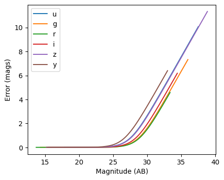
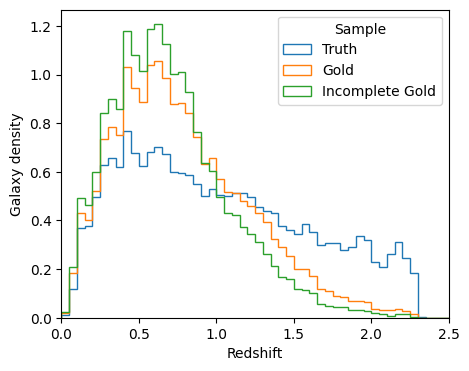
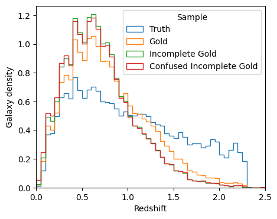
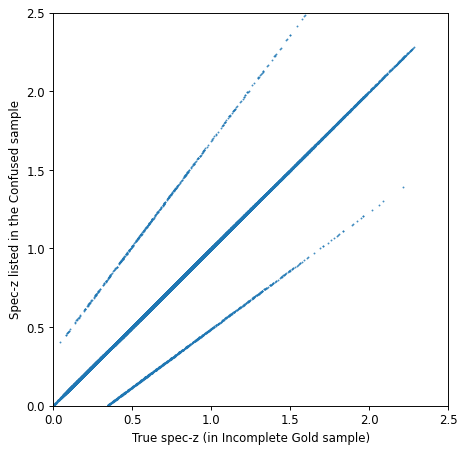

Using Engines and Degraders to Generate Galaxy Samples with Errors and Biases
=============================================================================

author: John Franklin Crenshaw, Sam Schmidt, Eric Charles, others…

last run successfully: August 2, 2023

This notebook demonstrates how to use a RAIL Engines to create galaxy
samples, and how to use Degraders to add various errors and biases to
the sample.

Note that in the parlance of the Creation Module, “degradation” is any
post-processing that occurs to the “true” sample generated by the
Engine. This can include adding photometric errors, applying quality
cuts, introducing systematic biases, etc.

In this notebook, we will first learn how to draw samples from a RAIL
Engine object. Then we will demonstrate how to use the following RAIL
Degraders:

1. **LSSTErrorModel**, which adds photometric errors

2. **QuantityCut**, which applies cuts to the specified columns of the
   sample

3. **InvRedshiftIncompleteness**, which introduces sample incompleteness

4. **LineConfusion**, which introduces spectroscopic errors

Throughout the notebook, we will show how you can chain all these
Degraders together to build a more complicated degrader. Hopefully, this
will allow you to see how you can build your own degrader.

*Note on generating redshift posteriors*: regardless of what Degraders
you apply, when you use a Creator to estimate posteriors, the posteriors
will *always* be calculated with respect to the “true” distribution.
This is the whole point of the Creation Module – you can generate
degraded samples for which we still have access to the *true*
posteriors. For an example of how to calculate posteriors, see
``05_True_Posterior.ipynb``.

**Note:** If you’re planning to run this in a notebook, you may want to
use interactive mode instead. See
```Quick_Start_in_Creation.ipynb`` <https://github.com/LSSTDESC/rail/blob/main/interactive_examples/creation_examples/Quick_Start_in_Creation.ipynb>`__
in the ``interactive_examples/creation_examples/`` folder for a version
of this notebook in interactive mode.

.. code:: ipython3

    import matplotlib.pyplot as plt
    from pzflow.examples import get_example_flow
    from rail.creation.engines.flowEngine import FlowCreator
    from rail.creation.degraders.spectroscopic_degraders import (
        InvRedshiftIncompleteness,
        LineConfusion,
    )
    from rail.creation.degraders.photometric_errors import LSSTErrorModel
    from rail.creation.degraders.quantityCut import QuantityCut
    from rail.core.stage import RailStage


Specify the path to the pretrained ‘pzflow’ used to generate samples
~~~~~~~~~~~~~~~~~~~~~~~~~~~~~~~~~~~~~~~~~~~~~~~~~~~~~~~~~~~~~~~~~~~~

.. code:: ipython3

    import pzflow
    import os
    
    flow_file = os.path.join(
        os.path.dirname(pzflow.__file__), "example_files", "example-flow.pzflow.pkl"
    )


“True” Engine
-------------

First, let’s make an Engine that has no degradation. We can use it to
generate a “true” sample, to which we can compare all the degraded
samples below.

Note: in this example, we will use a normalizing flow engine from the
`pzflow <https://github.com/jfcrenshaw/pzflow>`__ package. However,
everything in this notebook is totally agnostic to what the underlying
engine is.

The Engine is a type of RailStage object, so we can make one using the
``RailStage.make_stage`` function for the class of Engine that we want.
We then pass in the configuration parameters as arguments to
``make_stage``.

.. code:: ipython3

    n_samples = int(1e5)
    flowCreator_truth = FlowCreator.make_stage(
        name="truth", model=flow_file, n_samples=n_samples
    )


.. parsed-literal::

    Inserting handle into data store.  model: /opt/hostedtoolcache/Python/3.11.15/x64/lib/python3.11/site-packages/pzflow/example_files/example-flow.pzflow.pkl, truth


Let’s check that the Engine correctly read the underlying PZ Flow object
~~~~~~~~~~~~~~~~~~~~~~~~~~~~~~~~~~~~~~~~~~~~~~~~~~~~~~~~~~~~~~~~~~~~~~~~

.. code:: ipython3

    flowCreator_truth.get_data("model")


.. parsed-literal::

    <pzflow.flow.Flow at 0x7f5c020b0890>


Now we invoke the ``sample`` method to generate some samples
~~~~~~~~~~~~~~~~~~~~~~~~~~~~~~~~~~~~~~~~~~~~~~~~~~~~~~~~~~~~

Note that this will return a ``DataHandle`` object, which can keep both
the data itself, and also the path to where the data is written. When
talking to rail stages we can use this as though it were the underlying
data and pass it as an argument. This allows the rail stages to keep
track of where their inputs are coming from.

.. code:: ipython3

    samples_truth = flowCreator_truth.sample(n_samples, seed=0)
    print(samples_truth())
    print("Data was written to ", samples_truth.path)


.. parsed-literal::

    Inserting handle into data store.  output_truth: inprogress_output_truth.pq, truth
           redshift          u          g          r          i          z  \
    0      1.398945  27.667538  26.723341  26.032640  25.178591  24.695961   
    1      2.285624  28.786999  27.476587  26.640171  26.259747  25.865673   
    2      1.495132  30.011347  29.789335  28.200388  26.014830  25.030172   
    3      0.842595  29.306242  28.721798  27.353014  26.256907  25.529823   
    4      1.588960  26.273870  26.115387  25.950443  25.687405  25.466604   
    ...         ...        ...        ...        ...        ...        ...   
    99995  0.389450  27.270803  26.371508  25.436853  25.077412  24.852779   
    99996  1.481047  27.478113  26.735254  26.042774  25.204935  24.825090   
    99997  2.023549  26.990147  26.714737  26.377949  26.250345  25.917370   
    99998  1.548204  26.367434  26.206886  26.087982  25.876932  25.715893   
    99999  1.739491  26.881981  26.773062  26.553120  26.319618  25.955982   
    
                   y  
    0      23.994415  
    1      25.391064  
    2      24.304703  
    3      25.291103  
    4      25.096743  
    ...          ...  
    99995  24.737946  
    99996  24.224169  
    99997  25.613838  
    99998  25.274902  
    99999  25.699636  
    
    [100000 rows x 7 columns]
    Data was written to  output_truth.pq


Degrader 1: LSSTErrorModel
--------------------------

Now, we will demonstrate the ``LSSTErrorModel``, which adds photometric
errors using a model similar to the model from `Ivezic et
al. 2019 <https://arxiv.org/abs/0805.2366>`__ (specifically, it uses the
model from this paper, without making the high SNR assumption. To
restore this assumption and therefore use the exact model from the
paper, set ``highSNR=True``.)

Let’s create an error model with the default settings:

.. code:: ipython3

    errorModel = LSSTErrorModel.make_stage(name="error_model")


To see the details of the model, including the default settings we are
using, you can just print the model:

.. code:: ipython3

    errorModel


.. parsed-literal::

    <rail.creation.degraders.photometric_errors.LSSTErrorModel at 0x7f5bb0a94a50>


Now let’s add this error model as a degrader and draw some samples with
photometric errors.

.. code:: ipython3

    samples_w_errs = errorModel(samples_truth)
    samples_w_errs()


.. parsed-literal::

    Inserting handle into data store.  output_truth: None, error_model
    Inserting handle into data store.  output_error_model: inprogress_output_error_model.pq, error_model


.. raw:: html

    <div>
    <style scoped>
        .dataframe tbody tr th:only-of-type {
            vertical-align: middle;
        }
    
        .dataframe tbody tr th {
            vertical-align: top;
        }
    
        .dataframe thead th {
            text-align: right;
        }
    </style>
    <table border="1" class="dataframe">
      <thead>
        <tr style="text-align: right;">
          <th></th>
          <th>redshift</th>
          <th>u</th>
          <th>u_err</th>
          <th>g</th>
          <th>g_err</th>
          <th>r</th>
          <th>r_err</th>
          <th>i</th>
          <th>i_err</th>
          <th>z</th>
          <th>z_err</th>
          <th>y</th>
          <th>y_err</th>
        </tr>
      </thead>
      <tbody>
        <tr>
          <th>0</th>
          <td>1.398945</td>
          <td>26.886490</td>
          <td>0.505130</td>
          <td>26.677971</td>
          <td>0.161332</td>
          <td>26.005965</td>
          <td>0.079263</td>
          <td>25.142252</td>
          <td>0.060231</td>
          <td>24.595688</td>
          <td>0.071054</td>
          <td>23.967975</td>
          <td>0.091891</td>
        </tr>
        <tr>
          <th>1</th>
          <td>2.285624</td>
          <td>inf</td>
          <td>inf</td>
          <td>27.282833</td>
          <td>0.267464</td>
          <td>26.545483</td>
          <td>0.127123</td>
          <td>26.202638</td>
          <td>0.152451</td>
          <td>25.777312</td>
          <td>0.197968</td>
          <td>26.307101</td>
          <td>0.613181</td>
        </tr>
        <tr>
          <th>2</th>
          <td>1.495132</td>
          <td>27.670956</td>
          <td>0.865590</td>
          <td>inf</td>
          <td>inf</td>
          <td>33.373224</td>
          <td>4.576925</td>
          <td>26.095932</td>
          <td>0.139085</td>
          <td>25.070045</td>
          <td>0.107853</td>
          <td>24.343182</td>
          <td>0.127506</td>
        </tr>
        <tr>
          <th>3</th>
          <td>0.842595</td>
          <td>inf</td>
          <td>inf</td>
          <td>30.867549</td>
          <td>2.333340</td>
          <td>27.333547</td>
          <td>0.247773</td>
          <td>26.175026</td>
          <td>0.148881</td>
          <td>25.422157</td>
          <td>0.146352</td>
          <td>25.165580</td>
          <td>0.255578</td>
        </tr>
        <tr>
          <th>4</th>
          <td>1.588960</td>
          <td>26.716378</td>
          <td>0.444986</td>
          <td>26.017279</td>
          <td>0.090972</td>
          <td>25.992718</td>
          <td>0.078341</td>
          <td>25.909979</td>
          <td>0.118394</td>
          <td>25.380521</td>
          <td>0.141201</td>
          <td>25.271589</td>
          <td>0.278663</td>
        </tr>
        <tr>
          <th>...</th>
          <td>...</td>
          <td>...</td>
          <td>...</td>
          <td>...</td>
          <td>...</td>
          <td>...</td>
          <td>...</td>
          <td>...</td>
          <td>...</td>
          <td>...</td>
          <td>...</td>
          <td>...</td>
          <td>...</td>
        </tr>
        <tr>
          <th>99995</th>
          <td>0.389450</td>
          <td>26.924202</td>
          <td>0.519297</td>
          <td>26.272238</td>
          <td>0.113693</td>
          <td>25.423917</td>
          <td>0.047315</td>
          <td>25.062071</td>
          <td>0.056094</td>
          <td>24.906301</td>
          <td>0.093442</td>
          <td>24.637872</td>
          <td>0.164285</td>
        </tr>
        <tr>
          <th>99996</th>
          <td>1.481047</td>
          <td>26.332755</td>
          <td>0.330655</td>
          <td>26.735794</td>
          <td>0.169480</td>
          <td>26.091372</td>
          <td>0.085463</td>
          <td>25.252173</td>
          <td>0.066397</td>
          <td>24.867125</td>
          <td>0.090280</td>
          <td>24.111279</td>
          <td>0.104193</td>
        </tr>
        <tr>
          <th>99997</th>
          <td>2.023549</td>
          <td>27.300242</td>
          <td>0.677790</td>
          <td>26.915591</td>
          <td>0.197309</td>
          <td>26.516540</td>
          <td>0.123972</td>
          <td>26.474497</td>
          <td>0.192103</td>
          <td>26.045803</td>
          <td>0.247517</td>
          <td>25.208306</td>
          <td>0.264671</td>
        </tr>
        <tr>
          <th>99998</th>
          <td>1.548204</td>
          <td>26.719137</td>
          <td>0.445913</td>
          <td>26.158751</td>
          <td>0.102976</td>
          <td>26.087650</td>
          <td>0.085183</td>
          <td>25.805504</td>
          <td>0.108088</td>
          <td>25.526193</td>
          <td>0.160003</td>
          <td>25.407199</td>
          <td>0.310849</td>
        </tr>
        <tr>
          <th>99999</th>
          <td>1.739491</td>
          <td>26.516402</td>
          <td>0.381857</td>
          <td>27.352452</td>
          <td>0.283029</td>
          <td>26.730621</td>
          <td>0.149139</td>
          <td>26.299302</td>
          <td>0.165587</td>
          <td>26.194327</td>
          <td>0.279453</td>
          <td>25.924194</td>
          <td>0.464223</td>
        </tr>
      </tbody>
    </table>
    <p>100000 rows × 13 columns</p>
    </div>


Notice some of the magnitudes are inf’s. These are non-detections. This
means those observed fluxes were negative. You can change the limit for
non-detections by setting ``sigLim=...``, where the value you set is the
minimum SNR. Setting ``ndFlag=...`` changes the value used to flag
non-detections.

Let’s plot the error as a function of magnitude

.. code:: ipython3

    fig, ax = plt.subplots(figsize=(5, 4), dpi=100)
    
    for band in "ugrizy":
        # pull out the magnitudes and errors
        mags = samples_w_errs.data[band].to_numpy()
        errs = samples_w_errs.data[band + "_err"].to_numpy()
    
        # sort them by magnitude
        mags, errs = mags[mags.argsort()], errs[mags.argsort()]
    
        # plot errs vs mags
        ax.plot(mags, errs, label=band)
    
    ax.legend()
    ax.set(xlabel="Magnitude (AB)", ylabel="Error (mags)")
    plt.show()





You can see that the photometric error increases as magnitude gets
dimmer, just like you would expect. Notice, however, that we have
galaxies as dim as magnitude 30. This is because the Flow produces a
sample much deeper than the LSST 5-sigma limiting magnitudes. There are
no galaxies dimmer than magnitude 30 because LSSTErrorModel sets
magnitudes > 30 equal to NaN (the default flag for non-detections).

Degrader 2: QuantityCut
-----------------------

Recall how the sample above has galaxies as dim as magnitude 30. This is
well beyond the LSST 5-sigma limiting magnitudes, so it will be useful
to apply cuts to the data to filter out these super-dim samples. We can
apply these cuts using the ``QuantityCut`` degrader. This degrader will
cut out any samples that do not pass all of the specified cuts.

Let’s make and run degraders that first adds photometric errors, then
cuts at i<25.3, which is the LSST gold sample.

.. code:: ipython3

    gold_cut = QuantityCut.make_stage(name="cuts", cuts={"i": 25.3})


Now we can stick this into a Creator and draw a new sample

.. code:: ipython3

    samples_gold_w_errs = gold_cut(samples_w_errs)


.. parsed-literal::

    Inserting handle into data store.  output_error_model: None, cuts
    Inserting handle into data store.  output_cuts: inprogress_output_cuts.pq, cuts


If you look at the i column, you will see there are no longer any
samples with i > 25.3. The number of galaxies returned has been nearly
cut in half from the input sample and, unlike the LSSTErrorModel
degrader, is not equal to the number of input objects. Users should note
that with degraders that remove galaxies from the sample the size of the
output sample will not equal that of the input sample.

One more note: it is easy to use the QuantityCut degrader as a SNR cut
on the magnitudes. The magnitude equation is :math:`m = -2.5 \log(f)`.
Taking the derivative, we have

.. math::


   dm = \frac{2.5}{\ln(10)} \frac{df}{f} = \frac{2.5}{\ln(10)} \frac{1}{\mathrm{SNR}}.

So if you want to make a cut on galaxies above a certain SNR, you can
make a cut

.. math::


   dm < \frac{2.5}{\ln(10)} \frac{1}{\mathrm{SNR}}.

For example, an SNR cut on the i band would look like this:
``QuantityCut({"i_err": 2.5/np.log(10) * 1/SNR})``.

Degrader 3: InvRedshiftIncompleteness
-------------------------------------

Next, we will demonstrate the ``InvRedshiftIncompleteness`` degrader. It
applies a selection function, which keeps galaxies with probability
:math:`p_{\text{keep}}(z) = \min(1, \frac{z_p}{z})`, where :math:`z_p`
is the ‘’pivot’’ redshift. We’ll use :math:`z_p = 0.8`.

.. code:: ipython3

    inv_incomplete = InvRedshiftIncompleteness.make_stage(
        name="incompleteness", pivot_redshift=0.8
    )


.. code:: ipython3

    samples_incomplete_gold_w_errs = inv_incomplete(samples_gold_w_errs)


.. parsed-literal::

    Inserting handle into data store.  output_cuts: None, incompleteness
    Inserting handle into data store.  output_incompleteness: inprogress_output_incompleteness.pq, incompleteness


Let’s plot the redshift distributions of the samples we have generated
so far:

.. code:: ipython3

    fig, ax = plt.subplots(figsize=(5, 4), dpi=100)
    
    zmin = 0
    zmax = 2.5
    
    hist_settings = {
        "bins": 50,
        "range": (zmin, zmax),
        "density": True,
        "histtype": "step",
    }
    
    ax.hist(samples_truth()["redshift"], label="Truth", **hist_settings)
    ax.hist(samples_gold_w_errs()["redshift"], label="Gold", **hist_settings)
    ax.hist(
        samples_incomplete_gold_w_errs()["redshift"],
        label="Incomplete Gold",
        **hist_settings
    )
    ax.legend(title="Sample")
    ax.set(xlim=(zmin, zmax), xlabel="Redshift", ylabel="Galaxy density")
    plt.show()





You can see that the Gold sample has significantly fewer high-redshift
galaxies than the truth. This is because many of the high-redshift
galaxies have i > 25.3.

You can further see that the Incomplete Gold sample has even fewer
high-redshift galaxies. This is exactly what we expected from this
degrader.

Degrader 4: LineConfusion
-------------------------

``LineConfusion`` is a degrader that simulates spectroscopic errors
resulting from the confusion of different emission lines.

For this example, let’s use the degrader to simulate a scenario in which
which 2% of [OII] lines are mistaken as [OIII] lines, and 1% of [OIII]
lines are mistaken as [OII] lines. (note I do not know how realistic
this scenario is!)

.. code:: ipython3

    OII = 3727
    OIII = 5007
    
    lc_2p_0II_0III = LineConfusion.make_stage(
        name="lc_2p_0II_0III", true_wavelen=OII, wrong_wavelen=OIII, frac_wrong=0.02
    )
    lc_1p_0III_0II = LineConfusion.make_stage(
        name="lc_1p_0III_0II", true_wavelen=OIII, wrong_wavelen=OII, frac_wrong=0.01
    )


.. code:: ipython3

    samples_conf_inc_gold_w_errs = lc_1p_0III_0II(
        lc_2p_0II_0III(samples_incomplete_gold_w_errs)
    )


.. parsed-literal::

    Inserting handle into data store.  output_incompleteness: None, lc_2p_0II_0III
    Inserting handle into data store.  output_lc_2p_0II_0III: inprogress_output_lc_2p_0II_0III.pq, lc_2p_0II_0III


.. parsed-literal::

    Inserting handle into data store.  output_lc_2p_0II_0III: None, lc_1p_0III_0II
    Inserting handle into data store.  output_lc_1p_0III_0II: inprogress_output_lc_1p_0III_0II.pq, lc_1p_0III_0II


Let’s plot the redshift distributions one more time

.. code:: ipython3

    fig, ax = plt.subplots(figsize=(5, 4), dpi=100)
    
    zmin = 0
    zmax = 2.5
    
    hist_settings = {
        "bins": 50,
        "range": (zmin, zmax),
        "density": True,
        "histtype": "step",
    }
    
    ax.hist(samples_truth()["redshift"], label="Truth", **hist_settings)
    ax.hist(samples_gold_w_errs()["redshift"], label="Gold", **hist_settings)
    ax.hist(
        samples_incomplete_gold_w_errs()["redshift"],
        label="Incomplete Gold",
        **hist_settings
    )
    ax.hist(
        samples_conf_inc_gold_w_errs()["redshift"],
        label="Confused Incomplete Gold",
        **hist_settings
    )
    ax.legend(title="Sample")
    ax.set(xlim=(zmin, zmax), xlabel="Redshift", ylabel="Galaxy density")
    plt.show()





You can see that the redshift distribution of this new sample is
essentially identical to the Incomplete Gold sample, with small
perturbations that result from the line confusion.

However the real impact of this degrader isn’t on the redshift
distribution, but rather that it introduces erroneous spec-z’s into the
photo-z training sets! To see the impact of this effect, let’s plot the
true spec-z’s as present in the Incomplete Gold sample, vs the spec-z’s
listed in the new sample with Oxygen Line Confusion.

.. code:: ipython3

    fig, ax = plt.subplots(figsize=(6, 6), dpi=85)
    
    ax.scatter(
        samples_incomplete_gold_w_errs()["redshift"],
        samples_conf_inc_gold_w_errs()["redshift"],
        marker=".",
        s=1,
    )
    
    ax.set(
        xlim=(0, 2.5),
        ylim=(0, 2.5),
        xlabel="True spec-z (in Incomplete Gold sample)",
        ylabel="Spec-z listed in the Confused sample",
    )
    plt.show()





Now we can clearly see the spec-z errors! The galaxies above the line
y=x are the [OII] -> [OIII] galaxies, while the ones below are the
[OIII] -> [OII] galaxies.


