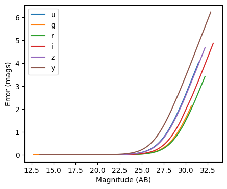
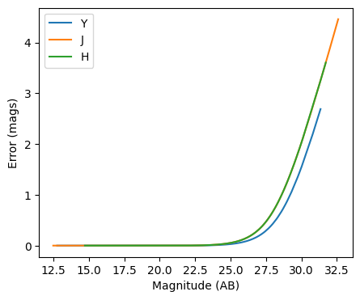
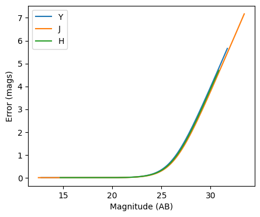

Photometric error stage demo
----------------------------

author: Tianqing Zhang, John-Franklin Crenshaw

This notebook demonstrate the use of
``rail.creation.degraders.photometric_errors``, which adds column for
the photometric noise to the catalog based on the package PhotErr
developed by John-Franklin Crenshaw. The RAIL stage PhotoErrorModel
inherit from the Noisifier base classes, and the LSST, Roman, Euclid
child classes inherit from the PhotoErrorModel

**Note:** If you’re planning to run this in a notebook, you may want to
use interactive mode instead. See
`Photometric_Realization_with_Other_Surveys.ipynb <https://github.com/LSSTDESC/rail/blob/main/interactive_examples/creation_examples/Photometric_Realization_with_Other_Surveys.ipynb>`__
in the ``interactive_examples/creation_examples/`` folder for a version
of this notebook in interactive mode.

.. code:: ipython3

    
    from rail.creation.degraders.photometric_errors import LSSTErrorModel
    from rail.creation.degraders.photometric_errors import RomanErrorModel
    from rail.creation.degraders.photometric_errors import EuclidErrorModel
    
    from rail.core.data import PqHandle
    from rail.core.stage import RailStage
    
    import matplotlib.pyplot as plt
    import pandas as pd
    import numpy as np
    

Create a random catalog with ugrizy+YJHF bands as the the true input
~~~~~~~~~~~~~~~~~~~~~~~~~~~~~~~~~~~~~~~~~~~~~~~~~~~~~~~~~~~~~~~~~~~~

.. code:: ipython3

    data = np.random.normal(23, 3, size = (1000,9))
    
    data_df = pd.DataFrame(data=data,    # values
                columns=['u', 'g', 'r', 'i', 'z', 'y', 'Y', 'J', 'H'])
    data_truth = PqHandle('input')
    data_truth.set_data(data_df)

.. code:: ipython3

    data_df

.. raw:: html

    

    
    <table border="1" class="dataframe">
      <thead>
        <tr style="text-align: right;">
          <th></th>
          <th>u</th>
          <th>g</th>
          <th>r</th>
          <th>i</th>
          <th>z</th>
          <th>y</th>
          <th>Y</th>
          <th>J</th>
          <th>H</th>
        </tr>
      </thead>
      <tbody>
        <tr>
          <th>0</th>
          <td>25.891159</td>
          <td>19.786345</td>
          <td>21.214769</td>
          <td>19.661148</td>
          <td>21.230892</td>
          <td>23.436832</td>
          <td>21.816479</td>
          <td>22.811795</td>
          <td>30.273362</td>
        </tr>
        <tr>
          <th>1</th>
          <td>23.032576</td>
          <td>21.938288</td>
          <td>24.902284</td>
          <td>21.450393</td>
          <td>20.550704</td>
          <td>23.519604</td>
          <td>25.051466</td>
          <td>22.595878</td>
          <td>18.664835</td>
        </tr>
        <tr>
          <th>2</th>
          <td>20.120769</td>
          <td>13.919504</td>
          <td>19.477108</td>
          <td>24.251952</td>
          <td>20.793163</td>
          <td>25.595179</td>
          <td>18.345135</td>
          <td>23.555436</td>
          <td>22.857386</td>
        </tr>
        <tr>
          <th>3</th>
          <td>25.547531</td>
          <td>26.727527</td>
          <td>25.404474</td>
          <td>26.067278</td>
          <td>17.548158</td>
          <td>23.115282</td>
          <td>25.913954</td>
          <td>20.910554</td>
          <td>24.680583</td>
        </tr>
        <tr>
          <th>4</th>
          <td>25.844949</td>
          <td>21.710375</td>
          <td>22.979522</td>
          <td>21.278132</td>
          <td>23.964265</td>
          <td>24.079699</td>
          <td>24.588052</td>
          <td>21.561349</td>
          <td>22.378737</td>
        </tr>
        <tr>
          <th>...</th>
          <td>...</td>
          <td>...</td>
          <td>...</td>
          <td>...</td>
          <td>...</td>
          <td>...</td>
          <td>...</td>
          <td>...</td>
          <td>...</td>
        </tr>
        <tr>
          <th>995</th>
          <td>24.186321</td>
          <td>19.593544</td>
          <td>25.674820</td>
          <td>19.012284</td>
          <td>23.697710</td>
          <td>21.729615</td>
          <td>18.420162</td>
          <td>22.668845</td>
          <td>28.396904</td>
        </tr>
        <tr>
          <th>996</th>
          <td>20.582973</td>
          <td>19.570302</td>
          <td>21.081599</td>
          <td>25.677029</td>
          <td>22.685792</td>
          <td>23.092485</td>
          <td>27.401633</td>
          <td>23.895663</td>
          <td>19.796481</td>
        </tr>
        <tr>
          <th>997</th>
          <td>24.711903</td>
          <td>22.980976</td>
          <td>21.734231</td>
          <td>17.465257</td>
          <td>25.035615</td>
          <td>21.920315</td>
          <td>23.899434</td>
          <td>22.815523</td>
          <td>21.234539</td>
        </tr>
        <tr>
          <th>998</th>
          <td>22.797348</td>
          <td>17.678621</td>
          <td>25.126604</td>
          <td>21.792548</td>
          <td>20.051860</td>
          <td>22.919795</td>
          <td>19.514155</td>
          <td>24.534036</td>
          <td>20.265684</td>
        </tr>
        <tr>
          <th>999</th>
          <td>21.157173</td>
          <td>20.817418</td>
          <td>30.747778</td>
          <td>21.952000</td>
          <td>25.442076</td>
          <td>24.278860</td>
          <td>22.685378</td>
          <td>23.183413</td>
          <td>18.163520</td>
        </tr>
      </tbody>
    </table>
    
1000 rows × 9 columns

    

The LSST error model adds noise to the optical bands
~~~~~~~~~~~~~~~~~~~~~~~~~~~~~~~~~~~~~~~~~~~~~~~~~~~~

.. code:: ipython3

    errorModel_lsst = LSSTErrorModel.make_stage(name="error_model")
    
    samples_w_errs = errorModel_lsst(data_truth)
    samples_w_errs()

.. parsed-literal::

    Inserting handle into data store.  input: None, error_model
    Inserting handle into data store.  output_error_model: inprogress_output_error_model.pq, error_model

.. raw:: html

    

    
    <table border="1" class="dataframe">
      <thead>
        <tr style="text-align: right;">
          <th></th>
          <th>u</th>
          <th>u_err</th>
          <th>g</th>
          <th>g_err</th>
          <th>r</th>
          <th>r_err</th>
          <th>i</th>
          <th>i_err</th>
          <th>z</th>
          <th>z_err</th>
          <th>y</th>
          <th>y_err</th>
          <th>Y</th>
          <th>J</th>
          <th>H</th>
        </tr>
      </thead>
      <tbody>
        <tr>
          <th>0</th>
          <td>25.804758</td>
          <td>0.215174</td>
          <td>19.785258</td>
          <td>0.005029</td>
          <td>21.214537</td>
          <td>0.005136</td>
          <td>19.667948</td>
          <td>0.005031</td>
          <td>21.233300</td>
          <td>0.006100</td>
          <td>23.458001</td>
          <td>0.058550</td>
          <td>21.816479</td>
          <td>22.811795</td>
          <td>30.273362</td>
        </tr>
        <tr>
          <th>1</th>
          <td>22.981651</td>
          <td>0.018814</td>
          <td>21.941201</td>
          <td>0.005596</td>
          <td>24.887878</td>
          <td>0.029458</td>
          <td>21.447901</td>
          <td>0.005475</td>
          <td>20.549860</td>
          <td>0.005368</td>
          <td>23.541545</td>
          <td>0.063053</td>
          <td>25.051466</td>
          <td>22.595878</td>
          <td>18.664835</td>
        </tr>
        <tr>
          <th>2</th>
          <td>20.116051</td>
          <td>0.005322</td>
          <td>13.919146</td>
          <td>0.005000</td>
          <td>19.474005</td>
          <td>0.005012</td>
          <td>24.258970</td>
          <td>0.027575</td>
          <td>20.789107</td>
          <td>0.005541</td>
          <td>25.499867</td>
          <td>0.334651</td>
          <td>18.345135</td>
          <td>23.555436</td>
          <td>22.857386</td>
        </tr>
        <tr>
          <th>3</th>
          <td>25.471640</td>
          <td>0.162524</td>
          <td>26.839242</td>
          <td>0.185014</td>
          <td>25.379409</td>
          <td>0.045482</td>
          <td>25.972591</td>
          <td>0.125011</td>
          <td>17.556942</td>
          <td>0.005006</td>
          <td>23.175506</td>
          <td>0.045565</td>
          <td>25.913954</td>
          <td>20.910554</td>
          <td>24.680583</td>
        </tr>
        <tr>
          <th>4</th>
          <td>25.634919</td>
          <td>0.186634</td>
          <td>21.712530</td>
          <td>0.005420</td>
          <td>22.969185</td>
          <td>0.007194</td>
          <td>21.277486</td>
          <td>0.005361</td>
          <td>24.002838</td>
          <td>0.041996</td>
          <td>24.206849</td>
          <td>0.113260</td>
          <td>24.588052</td>
          <td>21.561349</td>
          <td>22.378737</td>
        </tr>
        <tr>
          <th>...</th>
          <td>...</td>
          <td>...</td>
          <td>...</td>
          <td>...</td>
          <td>...</td>
          <td>...</td>
          <td>...</td>
          <td>...</td>
          <td>...</td>
          <td>...</td>
          <td>...</td>
          <td>...</td>
          <td>...</td>
          <td>...</td>
          <td>...</td>
        </tr>
        <tr>
          <th>995</th>
          <td>24.132682</td>
          <td>0.050597</td>
          <td>19.594345</td>
          <td>0.005023</td>
          <td>25.676377</td>
          <td>0.059203</td>
          <td>19.009484</td>
          <td>0.005013</td>
          <td>23.668796</td>
          <td>0.031262</td>
          <td>21.734206</td>
          <td>0.013314</td>
          <td>18.420162</td>
          <td>22.668845</td>
          <td>28.396904</td>
        </tr>
        <tr>
          <th>996</th>
          <td>20.584653</td>
          <td>0.005606</td>
          <td>19.561914</td>
          <td>0.005022</td>
          <td>21.070033</td>
          <td>0.005109</td>
          <td>25.654969</td>
          <td>0.094738</td>
          <td>22.706480</td>
          <td>0.013874</td>
          <td>23.037688</td>
          <td>0.040323</td>
          <td>27.401633</td>
          <td>23.895663</td>
          <td>19.796481</td>
        </tr>
        <tr>
          <th>997</th>
          <td>24.811252</td>
          <td>0.091841</td>
          <td>22.986007</td>
          <td>0.007876</td>
          <td>21.742302</td>
          <td>0.005314</td>
          <td>17.469584</td>
          <td>0.005002</td>
          <td>25.089010</td>
          <td>0.109654</td>
          <td>21.926719</td>
          <td>0.015507</td>
          <td>23.899434</td>
          <td>22.815523</td>
          <td>21.234539</td>
        </tr>
        <tr>
          <th>998</th>
          <td>22.807115</td>
          <td>0.016344</td>
          <td>17.675342</td>
          <td>0.005003</td>
          <td>25.155510</td>
          <td>0.037295</td>
          <td>21.788587</td>
          <td>0.005824</td>
          <td>20.052690</td>
          <td>0.005167</td>
          <td>22.899920</td>
          <td>0.035695</td>
          <td>19.514155</td>
          <td>24.534036</td>
          <td>20.265684</td>
        </tr>
        <tr>
          <th>999</th>
          <td>21.161426</td>
          <td>0.006353</td>
          <td>20.813022</td>
          <td>0.005111</td>
          <td>30.375264</td>
          <td>1.793837</td>
          <td>21.951302</td>
          <td>0.006068</td>
          <td>25.387617</td>
          <td>0.142067</td>
          <td>24.152416</td>
          <td>0.108007</td>
          <td>22.685378</td>
          <td>23.183413</td>
          <td>18.163520</td>
        </tr>
      </tbody>
    </table>
    
1000 rows × 15 columns

    

.. code:: ipython3

    fig, ax = plt.subplots(figsize=(5, 4), dpi=100)
    
    for band in "ugrizy":
        # pull out the magnitudes and errors
        mags = samples_w_errs.data[band].to_numpy()
        errs = samples_w_errs.data[band + "_err"].to_numpy()
    
        # sort them by magnitude
        mags, errs = mags[mags.argsort()], errs[mags.argsort()]
    
        # plot errs vs mags
        ax.plot(mags, errs, label=band)
    
    ax.legend()
    ax.set(xlabel="Magnitude (AB)", ylabel="Error (mags)")
    plt.show()

The Roman error model adds noise to the infrared bands
~~~~~~~~~~~~~~~~~~~~~~~~~~~~~~~~~~~~~~~~~~~~~~~~~~~~~~

.. code:: ipython3

    errorModel_Roman = RomanErrorModel.make_stage(name="error_model", )
    

.. code:: ipython3

    errorModel_Roman.config['m5']['Y'] = 27.0

.. code:: ipython3

    errorModel_Roman.config['theta']['Y'] = 27.0

.. code:: ipython3

    samples_w_errs_roman = errorModel_Roman(data_truth)
    samples_w_errs_roman()

.. parsed-literal::

    Inserting handle into data store.  input: None, error_model
    Inserting handle into data store.  output_error_model: inprogress_output_error_model.pq, error_model

.. raw:: html

    

    
    <table border="1" class="dataframe">
      <thead>
        <tr style="text-align: right;">
          <th></th>
          <th>u</th>
          <th>g</th>
          <th>r</th>
          <th>i</th>
          <th>z</th>
          <th>y</th>
          <th>Y</th>
          <th>Y_err</th>
          <th>J</th>
          <th>J_err</th>
          <th>H</th>
          <th>H_err</th>
        </tr>
      </thead>
      <tbody>
        <tr>
          <th>0</th>
          <td>25.891159</td>
          <td>19.786345</td>
          <td>21.214769</td>
          <td>19.661148</td>
          <td>21.230892</td>
          <td>23.436832</td>
          <td>21.809238</td>
          <td>0.005319</td>
          <td>22.812001</td>
          <td>0.009376</td>
          <td>inf</td>
          <td>inf</td>
        </tr>
        <tr>
          <th>1</th>
          <td>23.032576</td>
          <td>21.938288</td>
          <td>24.902284</td>
          <td>21.450393</td>
          <td>20.550704</td>
          <td>23.519604</td>
          <td>25.064633</td>
          <td>0.036256</td>
          <td>22.577394</td>
          <td>0.008116</td>
          <td>18.663547</td>
          <td>0.005003</td>
        </tr>
        <tr>
          <th>2</th>
          <td>20.120769</td>
          <td>13.919504</td>
          <td>19.477108</td>
          <td>24.251952</td>
          <td>20.793163</td>
          <td>25.595179</td>
          <td>18.344418</td>
          <td>0.005001</td>
          <td>23.552193</td>
          <td>0.016416</td>
          <td>22.863039</td>
          <td>0.009700</td>
        </tr>
        <tr>
          <th>3</th>
          <td>25.547531</td>
          <td>26.727527</td>
          <td>25.404474</td>
          <td>26.067278</td>
          <td>17.548158</td>
          <td>23.115282</td>
          <td>26.031598</td>
          <td>0.085671</td>
          <td>20.908004</td>
          <td>0.005186</td>
          <td>24.763906</td>
          <td>0.047332</td>
        </tr>
        <tr>
          <th>4</th>
          <td>25.844949</td>
          <td>21.710375</td>
          <td>22.979522</td>
          <td>21.278132</td>
          <td>23.964265</td>
          <td>24.079699</td>
          <td>24.592998</td>
          <td>0.023916</td>
          <td>21.566505</td>
          <td>0.005600</td>
          <td>22.371277</td>
          <td>0.007279</td>
        </tr>
        <tr>
          <th>...</th>
          <td>...</td>
          <td>...</td>
          <td>...</td>
          <td>...</td>
          <td>...</td>
          <td>...</td>
          <td>...</td>
          <td>...</td>
          <td>...</td>
          <td>...</td>
          <td>...</td>
          <td>...</td>
        </tr>
        <tr>
          <th>995</th>
          <td>24.186321</td>
          <td>19.593544</td>
          <td>25.674820</td>
          <td>19.012284</td>
          <td>23.697710</td>
          <td>21.729615</td>
          <td>18.421431</td>
          <td>0.005001</td>
          <td>22.662862</td>
          <td>0.008534</td>
          <td>28.171433</td>
          <td>0.764651</td>
        </tr>
        <tr>
          <th>996</th>
          <td>20.582973</td>
          <td>19.570302</td>
          <td>21.081599</td>
          <td>25.677029</td>
          <td>22.685792</td>
          <td>23.092485</td>
          <td>27.401173</td>
          <td>0.276000</td>
          <td>23.914306</td>
          <td>0.022335</td>
          <td>19.809716</td>
          <td>0.005025</td>
        </tr>
        <tr>
          <th>997</th>
          <td>24.711903</td>
          <td>22.980976</td>
          <td>21.734231</td>
          <td>17.465257</td>
          <td>25.035615</td>
          <td>21.920315</td>
          <td>23.905858</td>
          <td>0.013442</td>
          <td>22.818134</td>
          <td>0.009414</td>
          <td>21.234368</td>
          <td>0.005334</td>
        </tr>
        <tr>
          <th>998</th>
          <td>22.797348</td>
          <td>17.678621</td>
          <td>25.126604</td>
          <td>21.792548</td>
          <td>20.051860</td>
          <td>22.919795</td>
          <td>19.508054</td>
          <td>0.005005</td>
          <td>24.577728</td>
          <td>0.040095</td>
          <td>20.260308</td>
          <td>0.005057</td>
        </tr>
        <tr>
          <th>999</th>
          <td>21.157173</td>
          <td>20.817418</td>
          <td>30.747778</td>
          <td>21.952000</td>
          <td>25.442076</td>
          <td>24.278860</td>
          <td>22.671584</td>
          <td>0.006412</td>
          <td>23.174266</td>
          <td>0.012137</td>
          <td>18.164477</td>
          <td>0.005001</td>
        </tr>
      </tbody>
    </table>
    
1000 rows × 12 columns

    

.. code:: ipython3

    fig, ax = plt.subplots(figsize=(5, 4), dpi=100)
    
    for band in "YJH":
        # pull out the magnitudes and errors
        mags = samples_w_errs_roman.data[band].to_numpy()
        errs = samples_w_errs_roman.data[band + "_err"].to_numpy()
    
        # sort them by magnitude
        mags, errs = mags[mags.argsort()], errs[mags.argsort()]
    
        # plot errs vs mags
        ax.plot(mags, errs, label=band)
    
    ax.legend()
    ax.set(xlabel="Magnitude (AB)", ylabel="Error (mags)")
    plt.show()

The Euclid error model adds noise to YJH bands
~~~~~~~~~~~~~~~~~~~~~~~~~~~~~~~~~~~~~~~~~~~~~~

.. code:: ipython3

    errorModel_Euclid = EuclidErrorModel.make_stage(name="error_model")
    
    samples_w_errs_Euclid = errorModel_Euclid(data_truth)
    samples_w_errs_Euclid()

.. parsed-literal::

    Inserting handle into data store.  input: None, error_model
    Inserting handle into data store.  output_error_model: inprogress_output_error_model.pq, error_model

.. raw:: html

    

    
    <table border="1" class="dataframe">
      <thead>
        <tr style="text-align: right;">
          <th></th>
          <th>u</th>
          <th>g</th>
          <th>r</th>
          <th>i</th>
          <th>z</th>
          <th>y</th>
          <th>Y</th>
          <th>Y_err</th>
          <th>J</th>
          <th>J_err</th>
          <th>H</th>
          <th>H_err</th>
        </tr>
      </thead>
      <tbody>
        <tr>
          <th>0</th>
          <td>25.891159</td>
          <td>19.786345</td>
          <td>21.214769</td>
          <td>19.661148</td>
          <td>21.230892</td>
          <td>23.436832</td>
          <td>21.783939</td>
          <td>0.021756</td>
          <td>22.827643</td>
          <td>0.045827</td>
          <td>26.197404</td>
          <td>0.777857</td>
        </tr>
        <tr>
          <th>1</th>
          <td>23.032576</td>
          <td>21.938288</td>
          <td>24.902284</td>
          <td>21.450393</td>
          <td>20.550704</td>
          <td>23.519604</td>
          <td>24.916167</td>
          <td>0.328088</td>
          <td>22.584528</td>
          <td>0.036904</td>
          <td>18.656783</td>
          <td>0.005118</td>
        </tr>
        <tr>
          <th>2</th>
          <td>20.120769</td>
          <td>13.919504</td>
          <td>19.477108</td>
          <td>24.251952</td>
          <td>20.793163</td>
          <td>25.595179</td>
          <td>18.339870</td>
          <td>0.005079</td>
          <td>23.555680</td>
          <td>0.087511</td>
          <td>22.796813</td>
          <td>0.048742</td>
        </tr>
        <tr>
          <th>3</th>
          <td>25.547531</td>
          <td>26.727527</td>
          <td>25.404474</td>
          <td>26.067278</td>
          <td>17.548158</td>
          <td>23.115282</td>
          <td>inf</td>
          <td>inf</td>
          <td>20.917556</td>
          <td>0.009410</td>
          <td>24.439364</td>
          <td>0.204660</td>
        </tr>
        <tr>
          <th>4</th>
          <td>25.844949</td>
          <td>21.710375</td>
          <td>22.979522</td>
          <td>21.278132</td>
          <td>23.964265</td>
          <td>24.079699</td>
          <td>24.377852</td>
          <td>0.211367</td>
          <td>21.581513</td>
          <td>0.015485</td>
          <td>22.399653</td>
          <td>0.034223</td>
        </tr>
        <tr>
          <th>...</th>
          <td>...</td>
          <td>...</td>
          <td>...</td>
          <td>...</td>
          <td>...</td>
          <td>...</td>
          <td>...</td>
          <td>...</td>
          <td>...</td>
          <td>...</td>
          <td>...</td>
          <td>...</td>
        </tr>
        <tr>
          <th>995</th>
          <td>24.186321</td>
          <td>19.593544</td>
          <td>25.674820</td>
          <td>19.012284</td>
          <td>23.697710</td>
          <td>21.729615</td>
          <td>18.416524</td>
          <td>0.005091</td>
          <td>22.738579</td>
          <td>0.042329</td>
          <td>inf</td>
          <td>inf</td>
        </tr>
        <tr>
          <th>996</th>
          <td>20.582973</td>
          <td>19.570302</td>
          <td>21.081599</td>
          <td>25.677029</td>
          <td>22.685792</td>
          <td>23.092485</td>
          <td>inf</td>
          <td>inf</td>
          <td>24.155049</td>
          <td>0.147616</td>
          <td>19.797686</td>
          <td>0.005894</td>
        </tr>
        <tr>
          <th>997</th>
          <td>24.711903</td>
          <td>22.980976</td>
          <td>21.734231</td>
          <td>17.465257</td>
          <td>25.035615</td>
          <td>21.920315</td>
          <td>23.783991</td>
          <td>0.127331</td>
          <td>22.815766</td>
          <td>0.045344</td>
          <td>21.245846</td>
          <td>0.012825</td>
        </tr>
        <tr>
          <th>998</th>
          <td>22.797348</td>
          <td>17.678621</td>
          <td>25.126604</td>
          <td>21.792548</td>
          <td>20.051860</td>
          <td>22.919795</td>
          <td>19.513132</td>
          <td>0.005651</td>
          <td>24.904546</td>
          <td>0.276758</td>
          <td>20.262708</td>
          <td>0.006922</td>
        </tr>
        <tr>
          <th>999</th>
          <td>21.157173</td>
          <td>20.817418</td>
          <td>30.747778</td>
          <td>21.952000</td>
          <td>25.442076</td>
          <td>24.278860</td>
          <td>22.731201</td>
          <td>0.050259</td>
          <td>23.327383</td>
          <td>0.071504</td>
          <td>18.159472</td>
          <td>0.005047</td>
        </tr>
      </tbody>
    </table>
    
1000 rows × 12 columns

    

.. code:: ipython3

    fig, ax = plt.subplots(figsize=(5, 4), dpi=100)
    
    for band in "YJH":
        # pull out the magnitudes and errors
        mags = samples_w_errs_Euclid.data[band].to_numpy()
        errs = samples_w_errs_Euclid.data[band + "_err"].to_numpy()
    
        # sort them by magnitude
        mags, errs = mags[mags.argsort()], errs[mags.argsort()]
    
        # plot errs vs mags
        ax.plot(mags, errs, label=band)
    
    ax.legend()
    ax.set(xlabel="Magnitude (AB)", ylabel="Error (mags)")
    plt.show()

