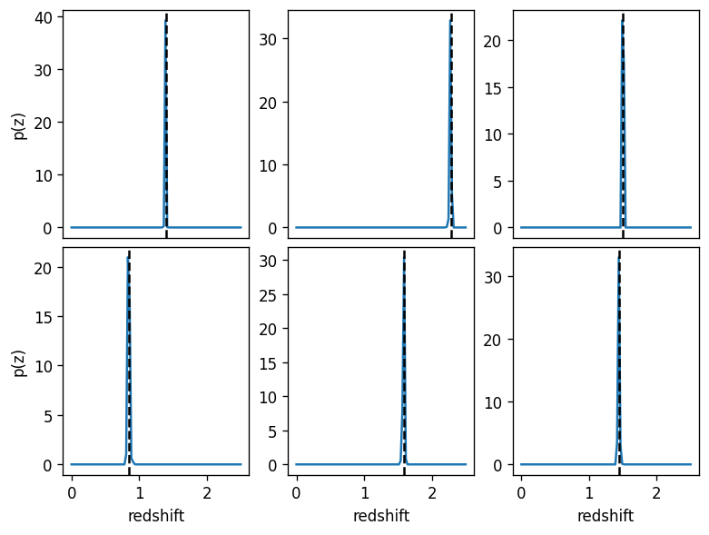
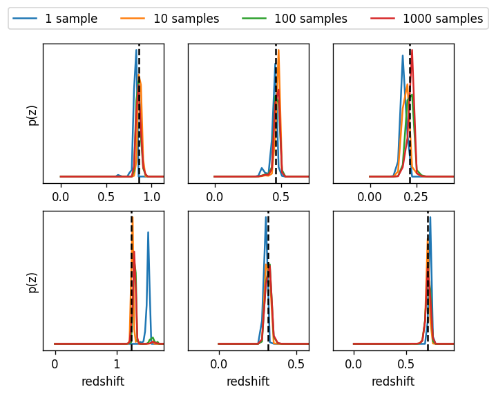
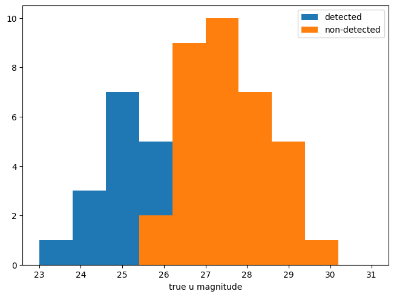
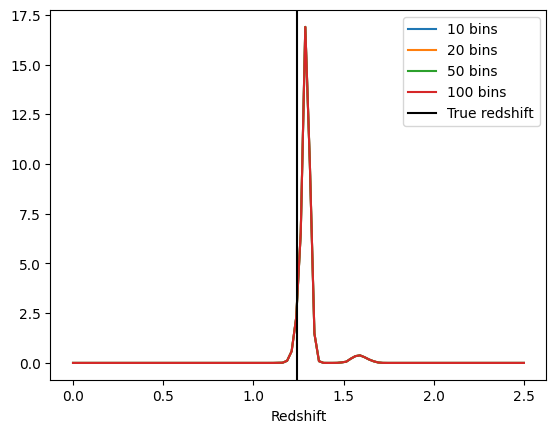

Using a Creator to Calculate True Posteriors for a Galaxy Sample
================================================================

author: John Franklin Crenshaw, Sam Schmidt, Eric Charles, others…

last run successfully: March 7, 2024

This notebook demonstrates how to use a RAIL Engine to calculate true
posteriors for galaxy samples drawn from the same Engine. Note that this
notebook assumes you have already read through
``00_Quick_start_in_Creation.ipynb``.

Calculating posteriors is more complicated than drawing samples, because
it requires more knowledge of the engine that underlies the Engine. In
this example, we will use the same engine we used in Degradation demo:
``FlowEngine`` which wraps a normalizing flow from the
`pzflow <https://github.com/jfcrenshaw/pzflow>`__ package.

This notebook will cover three scenarios of increasing complexity:

1. Calculating posteriors without errors

2. Calculating posteriors while convolving errors

3. Calculating posteriors with missing bands

**Note:** If you’re planning to run this in a notebook, you may want to
use interactive mode instead. See
`True_Posterior.ipynb <https://github.com/LSSTDESC/rail/blob/main/interactive_examples/creation_examples/True_Posterior.ipynb>`__
in the ``interactive_examples/creation_examples/`` folder for a version
of this notebook in interactive mode.

.. code:: ipython3

    import matplotlib.pyplot as plt
    import numpy as np
    import pandas as pd
    from pzflow.examples import get_example_flow
    from rail.creation.engines.flowEngine import FlowCreator, FlowPosterior
    from rail.creation.degraders.photometric_errors import LSSTErrorModel
    from rail.creation.degraders.quantityCut import QuantityCut
    from rail.creation.degraders.spectroscopic_degraders import (
        InvRedshiftIncompleteness,
        LineConfusion,
    )
    from rail.core.data import TableHandle
    from rail.core.stage import RailStage
    from rail.tools.table_tools import ColumnMapper
    from rail.tools.flow_handle import FlowHandle

.. code:: ipython3

    import pzflow
    import os
    
    flow_file = os.path.join(
        os.path.dirname(pzflow.__file__), "example_files", "example-flow.pzflow.pkl"
    )

1. Calculating posteriors without errors
----------------------------------------

For a basic first example, let’s make a Creator with no degradation and
draw a sample.

Note that the ``FlowEngine.sample`` method is handing back a
``DataHandle``. When talking to rail stages we can use this as though it
were the underlying data and pass it as an argument. This allows the
rail stages to keep track of where their inputs are coming from.

.. code:: ipython3

    n_samples = 6
    # create the FlowCreator
    flowCreator = FlowCreator.make_stage(name="truth", model=flow_file, n_samples=n_samples)
    # draw a few samples
    samples_truth = flowCreator.sample(6, seed=0)

.. parsed-literal::

    Inserting handle into data store.  model: /opt/hostedtoolcache/Python/3.10.20/x64/lib/python3.10/site-packages/pzflow/example_files/example-flow.pzflow.pkl, truth

.. parsed-literal::

    Inserting handle into data store.  output_truth: inprogress_output_truth.pq, truth

Now, let’s calculate true posteriors for this sample. Note the important
fact here: these are literally the true posteriors for the sample
because pzflow gives us direct access to the probability distribution
from which the sample was drawn!

When calculating posteriors, the Engine will always require ``data``,
which is a pandas DataFrame of the galaxies for which we are calculating
posteriors (in out case the ``samples_truth``). Because we are using a
``FlowEngine``, we also must provide ``grid``, because ``FlowEngine``
calculates posteriors over a grid of redshift values.

Let’s calculate posteriors for every galaxy in our sample:

.. code:: ipython3

    flow_post = FlowPosterior.make_stage(
        name="truth_post",
        column="redshift",
        grid=np.linspace(0, 2.5, 100),
        marg_rules=dict(flag=np.nan, u=lambda row: np.linspace(25, 31, 10)),
        model=flow_file
    )

.. parsed-literal::

    Inserting handle into data store.  model: /opt/hostedtoolcache/Python/3.10.20/x64/lib/python3.10/site-packages/pzflow/example_files/example-flow.pzflow.pkl, truth_post

.. code:: ipython3

    pdfs = flow_post.get_posterior(samples_truth, column="redshift")

.. parsed-literal::

    Inserting handle into data store.  output_truth: None, truth_post

.. parsed-literal::

    Inserting handle into data store.  output_truth_post: inprogress_output_truth_post.hdf5, truth_post

Note that Creator returns the pdfs as a
`qp <https://github.com/LSSTDESC/qp>`__ Ensemble:

.. code:: ipython3

    pdfs.data

.. parsed-literal::

    Ensemble(the_class=interp,shape=(6, 100))

Let’s plot these pdfs:

.. code:: ipython3

    fig, axes = plt.subplots(2, 3, constrained_layout=True, dpi=120)
    
    for i, ax in enumerate(axes.flatten()):
        # plot the pdf
        pdfs.data[i].plot_native(axes=ax)
    
        # plot the true redshift
        ax.axvline(samples_truth.data["redshift"][i], c="k", ls="--")
    
        # remove x-ticks on top row
        if i < 3:
            ax.set(xticks=[])
        # set x-label on bottom row
        else:
            ax.set(xlabel="redshift")
        # set y-label on far left column
        if i % 3 == 0:
            ax.set(ylabel="p(z)")

The true posteriors are in blue, and the true redshifts are marked by
the vertical black lines.

## 2. Calculating posteriors while convolving errors Now, let’s get a
little more sophisticated.

Let’s recreate the Engine/Degredation we were using at the end of the
Degradation demo.

I will make one change however: the LSST Error Model sometimes results
in non-detections for faint galaxies. These non-detections are flagged
with inf. Calculating posteriors for galaxies with non-detections is
more complicated, so for now, I will add one additional QuantityCut to
remove any galaxies with missing magnitudes. To see how to calculate
posteriors for galaxies with missing magnitudes, see `Section
3 <#MissingBands>`__.

Now let’s draw a degraded sample:

.. code:: ipython3

    # set up the error model
    
    n_samples = 50
    # create the FlowEngine
    flowEngine_degr = FlowCreator.make_stage(
        name="degraded", model=flow_file, n_samples=n_samples
    )
    # draw a few samples
    samples_degr = flowEngine_degr.sample(n_samples, seed=0)
    errorModel = LSSTErrorModel.make_stage(name="lsst_errors", input="xx", sigLim=5)
    quantityCut = QuantityCut.make_stage(
        name="gold_cut", input="xx", cuts={band: np.inf for band in "ugrizy"}
    )
    inv_incomplete = InvRedshiftIncompleteness.make_stage(
        name="incompleteness", pivot_redshift=0.8
    )
    
    OII = 3727
    OIII = 5007
    
    lc_2p_0II_0III = LineConfusion.make_stage(
        name="lc_2p_0II_0III", true_wavelen=OII, wrong_wavelen=OIII, frac_wrong=0.02
    )
    lc_1p_0III_0II = LineConfusion.make_stage(
        name="lc_1p_0III_0II", true_wavelen=OIII, wrong_wavelen=OII, frac_wrong=0.01
    )
    detection = QuantityCut.make_stage(name="detection", cuts={"i": 25.3})
    
    data = samples_degr
    for degr in [
        errorModel,
        quantityCut,
        inv_incomplete,
        lc_2p_0II_0III,
        lc_1p_0III_0II,
        detection,
    ]:
        data = degr(data)

.. parsed-literal::

    Inserting handle into data store.  model: /opt/hostedtoolcache/Python/3.10.20/x64/lib/python3.10/site-packages/pzflow/example_files/example-flow.pzflow.pkl, degraded

.. parsed-literal::

    Inserting handle into data store.  output_degraded: inprogress_output_degraded.pq, degraded
    Inserting handle into data store.  output_degraded: xx, lsst_errors
    Inserting handle into data store.  output_lsst_errors: inprogress_output_lsst_errors.pq, lsst_errors
    Inserting handle into data store.  output_lsst_errors: xx, gold_cut
    Inserting handle into data store.  output_gold_cut: inprogress_output_gold_cut.pq, gold_cut
    Inserting handle into data store.  output_gold_cut: None, incompleteness
    Inserting handle into data store.  output_incompleteness: inprogress_output_incompleteness.pq, incompleteness
    Inserting handle into data store.  output_incompleteness: None, lc_2p_0II_0III
    Inserting handle into data store.  output_lc_2p_0II_0III: inprogress_output_lc_2p_0II_0III.pq, lc_2p_0II_0III
    Inserting handle into data store.  output_lc_2p_0II_0III: None, lc_1p_0III_0II
    Inserting handle into data store.  output_lc_1p_0III_0II: inprogress_output_lc_1p_0III_0II.pq, lc_1p_0III_0II
    Inserting handle into data store.  output_lc_1p_0III_0II: None, detection
    Inserting handle into data store.  output_detection: inprogress_output_detection.pq, detection

.. code:: ipython3

    samples_degraded_wo_nondetects = data.data
    samples_degraded_wo_nondetects

.. raw:: html

    

    
    <table border="1" class="dataframe">
      <thead>
        <tr style="text-align: right;">
          <th></th>
          <th>redshift</th>
          <th>u</th>
          <th>u_err</th>
          <th>g</th>
          <th>g_err</th>
          <th>r</th>
          <th>r_err</th>
          <th>i</th>
          <th>i_err</th>
          <th>z</th>
          <th>z_err</th>
          <th>y</th>
          <th>y_err</th>
        </tr>
      </thead>
      <tbody>
        <tr>
          <th>0</th>
          <td>0.857864</td>
          <td>24.937306</td>
          <td>0.102523</td>
          <td>24.261083</td>
          <td>0.019535</td>
          <td>23.324924</td>
          <td>0.008681</td>
          <td>22.357087</td>
          <td>0.007006</td>
          <td>21.850063</td>
          <td>0.007817</td>
          <td>21.683497</td>
          <td>0.012805</td>
        </tr>
        <tr>
          <th>1</th>
          <td>0.456452</td>
          <td>25.376703</td>
          <td>0.149874</td>
          <td>23.602490</td>
          <td>0.011610</td>
          <td>22.143110</td>
          <td>0.005599</td>
          <td>21.485502</td>
          <td>0.005505</td>
          <td>21.130637</td>
          <td>0.005935</td>
          <td>20.854791</td>
          <td>0.007521</td>
        </tr>
        <tr>
          <th>2</th>
          <td>0.214385</td>
          <td>25.040331</td>
          <td>0.112135</td>
          <td>24.418895</td>
          <td>0.022328</td>
          <td>23.970596</td>
          <td>0.013625</td>
          <td>23.792877</td>
          <td>0.018483</td>
          <td>23.783522</td>
          <td>0.034588</td>
          <td>23.726631</td>
          <td>0.074280</td>
        </tr>
        <tr>
          <th>3</th>
          <td>1.239338</td>
          <td>24.884004</td>
          <td>0.097867</td>
          <td>24.657903</td>
          <td>0.027436</td>
          <td>24.393789</td>
          <td>0.019236</td>
          <td>23.929178</td>
          <td>0.020739</td>
          <td>23.416293</td>
          <td>0.025072</td>
          <td>22.863830</td>
          <td>0.034576</td>
        </tr>
        <tr>
          <th>4</th>
          <td>0.314718</td>
          <td>24.365121</td>
          <td>0.062080</td>
          <td>23.224267</td>
          <td>0.009012</td>
          <td>22.228646</td>
          <td>0.005688</td>
          <td>21.887501</td>
          <td>0.005965</td>
          <td>21.590075</td>
          <td>0.006913</td>
          <td>21.495152</td>
          <td>0.011137</td>
        </tr>
        <tr>
          <th>5</th>
          <td>0.707498</td>
          <td>24.320084</td>
          <td>0.059668</td>
          <td>23.562530</td>
          <td>0.011281</td>
          <td>22.787530</td>
          <td>0.006664</td>
          <td>21.994632</td>
          <td>0.006144</td>
          <td>21.697119</td>
          <td>0.007248</td>
          <td>21.464446</td>
          <td>0.010896</td>
        </tr>
        <tr>
          <th>6</th>
          <td>0.780216</td>
          <td>25.232179</td>
          <td>0.132380</td>
          <td>25.512013</td>
          <td>0.058243</td>
          <td>24.806927</td>
          <td>0.027443</td>
          <td>24.058177</td>
          <td>0.023164</td>
          <td>23.738179</td>
          <td>0.033232</td>
          <td>23.572767</td>
          <td>0.064823</td>
        </tr>
        <tr>
          <th>7</th>
          <td>0.419468</td>
          <td>25.552162</td>
          <td>0.174028</td>
          <td>24.707503</td>
          <td>0.028647</td>
          <td>23.678263</td>
          <td>0.010949</td>
          <td>23.416599</td>
          <td>0.013618</td>
          <td>23.256339</td>
          <td>0.021842</td>
          <td>22.983388</td>
          <td>0.038430</td>
        </tr>
        <tr>
          <th>8</th>
          <td>0.370970</td>
          <td>23.213075</td>
          <td>0.022803</td>
          <td>23.163284</td>
          <td>0.008689</td>
          <td>22.922792</td>
          <td>0.007046</td>
          <td>23.020723</td>
          <td>0.010181</td>
          <td>22.857443</td>
          <td>0.015650</td>
          <td>23.025878</td>
          <td>0.039903</td>
        </tr>
        <tr>
          <th>9</th>
          <td>1.165920</td>
          <td>24.687952</td>
          <td>0.082443</td>
          <td>24.427297</td>
          <td>0.022488</td>
          <td>24.025569</td>
          <td>0.014227</td>
          <td>23.648982</td>
          <td>0.016404</td>
          <td>22.988603</td>
          <td>0.017426</td>
          <td>22.815420</td>
          <td>0.033131</td>
        </tr>
        <tr>
          <th>10</th>
          <td>0.351819</td>
          <td>25.666142</td>
          <td>0.191605</td>
          <td>25.118988</td>
          <td>0.041128</td>
          <td>24.538245</td>
          <td>0.021749</td>
          <td>24.392780</td>
          <td>0.031008</td>
          <td>24.139394</td>
          <td>0.047405</td>
          <td>24.308248</td>
          <td>0.123702</td>
        </tr>
        <tr>
          <th>11</th>
          <td>0.314914</td>
          <td>25.597998</td>
          <td>0.180909</td>
          <td>24.946100</td>
          <td>0.035310</td>
          <td>24.129769</td>
          <td>0.015464</td>
          <td>23.907608</td>
          <td>0.020362</td>
          <td>23.680406</td>
          <td>0.031583</td>
          <td>23.784964</td>
          <td>0.078209</td>
        </tr>
        <tr>
          <th>12</th>
          <td>0.601109</td>
          <td>24.970437</td>
          <td>0.105524</td>
          <td>24.649638</td>
          <td>0.027240</td>
          <td>24.041055</td>
          <td>0.014402</td>
          <td>23.611917</td>
          <td>0.015915</td>
          <td>23.505469</td>
          <td>0.027095</td>
          <td>23.357615</td>
          <td>0.053560</td>
        </tr>
      </tbody>
    </table>
    

This sample has photometric errors that we would like to convolve in the
redshift posteriors, so that the posteriors are fully consistent with
the errors. We can perform this convolution by sampling from the error
distributions, calculating posteriors, and averaging.

``FlowEngine`` has this functionality already built in - we just have to
provide ``err_samples`` to the ``get_posterior`` method.

Let’s calculate posteriors with a variable number of error samples.

.. code:: ipython3

    grid = np.linspace(0, 2.5, 100)
    
    
    def get_degr_post(key, data, **kwargs):
        flow_degr_post = FlowPosterior.make_stage(name=f"degr_post_{key}", **kwargs)
        return flow_degr_post.get_posterior(data, column="redshift")

.. code:: ipython3

    degr_kwargs = dict(
        column="redshift",
        model=flow_file,
        marg_rules=dict(flag=np.nan, u=lambda row: np.linspace(25, 31, 10)),
        grid=grid,
        seed=0,
        batch_size=2,
    )
    pdfs_errs_convolved = {
        err_samples: get_degr_post(
            f"{str(err_samples)}", data, err_samples=err_samples, **degr_kwargs
        )
        for err_samples in [1, 10, 100, 1000]
    }

.. parsed-literal::

    Inserting handle into data store.  model: /opt/hostedtoolcache/Python/3.10.20/x64/lib/python3.10/site-packages/pzflow/example_files/example-flow.pzflow.pkl, degr_post_1
    Inserting handle into data store.  output_detection: None, degr_post_1

.. parsed-literal::

    Inserting handle into data store.  output_degr_post_1: inprogress_output_degr_post_1.hdf5, degr_post_1
    Inserting handle into data store.  model: /opt/hostedtoolcache/Python/3.10.20/x64/lib/python3.10/site-packages/pzflow/example_files/example-flow.pzflow.pkl, degr_post_10
    Inserting handle into data store.  output_detection: None, degr_post_10

.. parsed-literal::

    Inserting handle into data store.  output_degr_post_10: inprogress_output_degr_post_10.hdf5, degr_post_10
    Inserting handle into data store.  model: /opt/hostedtoolcache/Python/3.10.20/x64/lib/python3.10/site-packages/pzflow/example_files/example-flow.pzflow.pkl, degr_post_100
    Inserting handle into data store.  output_detection: None, degr_post_100

.. parsed-literal::

    Inserting handle into data store.  output_degr_post_100: inprogress_output_degr_post_100.hdf5, degr_post_100
    Inserting handle into data store.  model: /opt/hostedtoolcache/Python/3.10.20/x64/lib/python3.10/site-packages/pzflow/example_files/example-flow.pzflow.pkl, degr_post_1000
    Inserting handle into data store.  output_detection: None, degr_post_1000

.. parsed-literal::

    Inserting handle into data store.  output_degr_post_1000: inprogress_output_degr_post_1000.hdf5, degr_post_1000

.. code:: ipython3

    fig, axes = plt.subplots(2, 3, dpi=120)
    
    for i, ax in enumerate(axes.flatten()):
        # set dummy values for xlim
        xlim = [np.inf, -np.inf]
    
        for pdfs_ in pdfs_errs_convolved.values():
            # plot the pdf
            pdfs_.data[i].plot_native(axes=ax)
    
            # get the x value where the pdf first rises above 2
            xmin = grid[np.argmax(pdfs_.data[i].pdf(grid)[0] > 2)]
            if xmin < xlim[0]:
                xlim[0] = xmin
    
            # get the x value where the pdf finally falls below 2
            xmax = grid[-np.argmax(pdfs_.data[i].pdf(grid)[::-1] > 2)]
            if xmax > xlim[1]:
                xlim[1] = xmax
    
        # plot the true redshift
        z_true = samples_degraded_wo_nondetects["redshift"].iloc[i]
        ax.axvline(z_true, c="k", ls="--")
    
        # set x-label on bottom row
        if i >= 3:
            ax.set(xlabel="redshift")
        # set y-label on far left column
        if i % 3 == 0:
            ax.set(ylabel="p(z)")
    
        # set the x-limits so we can see more detail
        xlim[0] -= 0.2
        xlim[1] += 0.2
        ax.set(xlim=xlim, yticks=[])
    
    # create the legend
    axes[0, 1].plot([], [], c="C0", label=f"1 sample")
    for i, n in enumerate([10, 100, 1000]):
        axes[0, 1].plot([], [], c=f"C{i+1}", label=f"{n} samples")
    axes[0, 1].legend(
        bbox_to_anchor=(0.5, 1.3),
        loc="upper center",
        ncol=4,
    )
    
    plt.show()

You can see the effect of convolving the errors. In particular, notice
that without error convolution (1 sample), the redshift posterior is
often totally inconsistent with the true redshift (marked by the
vertical black line). As you convolve more samples, the posterior
generally broadens and becomes consistent with the true redshift.

Also notice how the posterior continues to change as you convolve more
and more samples. This suggests that you need to do a little testing to
ensure that you have convolved enough samples.

3. Calculating posteriors with missing bands
--------------------------------------------

Now let’s finally tackle posterior calculation with missing bands.

First, lets make a sample that has missing bands. Let’s use the same
degrader as we used above, except without the final QuantityCut that
removed non-detections:

.. code:: ipython3

    samples_degraded = lc_1p_0III_0II.get_handle('output')

You can see that galaxy 3 has a non-detection in the u band.
``FlowEngine`` can handle missing values by marginalizing over that
value. By default, ``FlowEngine`` will marginalize over NaNs in the u
band, using the grid ``u = np.linspace(25, 31, 10)``. This default grid
should work in most cases, but you may want to change the flag for
non-detections, use a different grid for the u band, or marginalize over
non-detections in other bands. In order to do these things, you must
supply ``FlowEngine`` with marginalization rules in the form of the
``marg_rules`` dictionary.

Let’s imagine we want to use a different grid for u band
marginalization. In order to determine what grid to use, we will create
a histogram of non-detections in u band vs true u band magnitude
(assuming year 10 LSST errors). This will tell me what are reasonable
values of u to marginalize over.

.. code:: ipython3

    # get true u band magnitudes
    true_u = flowEngine_degr.get_handle('output').data["u"].to_numpy()
    # get the observed u band magnitudes
    obs_u = errorModel.get_handle('output').data["u"].to_numpy()
    
    # create the figure
    fig, ax = plt.subplots(constrained_layout=True, dpi=100)
    # plot the u band detections
    ax.hist(true_u[np.isfinite(obs_u)], bins=10, range=(23, 31), label="detected")
    # plot the u band non-detections
    ax.hist(true_u[~np.isfinite(obs_u)], bins=10, range=(23, 31), label="non-detected")
    
    ax.legend()
    ax.set(xlabel="true u magnitude")
    
    plt.show()

Based on this histogram, I will marginalize over u band values from 25
to 31. Like how I tested different numbers of error samples above, here
I will test different resolutions for the u band grid.

I will provide our new u band grid in the ``marg_rules`` dictionary,
which will also include ``"flag"`` which tells ``FlowEngine`` what my
flag for non-detections is. In this simple example, we are using a fixed
grid for the u band, but notice that the u band rule takes the form of a
function - this is because the grid over which to marginalize can be a
function of any of the other variables in the row. If I wanted to
marginalize over any other bands, I would need to include corresponding
rules in ``marg_rules`` too.

For this example, I will only calculate pdfs for galaxy 3, which is the
galaxy with a non-detection in the u band. Also, similarly to how I
tested the error convolution with a variable number of samples, I will
test the marginalization with varying resolutions for the marginalized
grid.

.. code:: ipython3

    from rail.tools.table_tools import RowSelector
    
    # dict to save the marginalized posteriors
    pdfs_u_marginalized = {}
    
    row3_selector = RowSelector.make_stage(name="select_row3", start_row=3, stop_row=4)
    row3_degraded = row3_selector(samples_degraded)
    
    degr_post_kwargs = dict(
        grid=grid, err_samples=10000, seed=0, model=flow_file, column="redshift"
    )
    
    # iterate over variable grid resolution
    for nbins in [10, 20, 50, 100]:
        # set up the marginalization rules for this grid resolution
        marg_rules = {
            "flag": errorModel.config["ndFlag"],
            "u": lambda row: np.linspace(25, 31, nbins),
        }
    
        # calculate the posterior by marginalizing over u and sampling
        # from the error distributions of the other galaxies
        pdfs_u_marginalized[nbins] = get_degr_post(
            f"degr_post_nbins_{nbins}",
            row3_degraded,
            marg_rules=marg_rules,
            **degr_post_kwargs,
        )

.. parsed-literal::

    Inserting handle into data store.  output_lc_1p_0III_0II: None, select_row3
    Inserting handle into data store.  output_select_row3: inprogress_output_select_row3.pq, select_row3
    Inserting handle into data store.  model: /opt/hostedtoolcache/Python/3.10.20/x64/lib/python3.10/site-packages/pzflow/example_files/example-flow.pzflow.pkl, degr_post_degr_post_nbins_10
    Inserting handle into data store.  output_select_row3: None, degr_post_degr_post_nbins_10

.. parsed-literal::

    Inserting handle into data store.  output_degr_post_degr_post_nbins_10: inprogress_output_degr_post_degr_post_nbins_10.hdf5, degr_post_degr_post_nbins_10
    Inserting handle into data store.  model: /opt/hostedtoolcache/Python/3.10.20/x64/lib/python3.10/site-packages/pzflow/example_files/example-flow.pzflow.pkl, degr_post_degr_post_nbins_20
    Inserting handle into data store.  output_select_row3: None, degr_post_degr_post_nbins_20

.. parsed-literal::

    Inserting handle into data store.  output_degr_post_degr_post_nbins_20: inprogress_output_degr_post_degr_post_nbins_20.hdf5, degr_post_degr_post_nbins_20
    Inserting handle into data store.  model: /opt/hostedtoolcache/Python/3.10.20/x64/lib/python3.10/site-packages/pzflow/example_files/example-flow.pzflow.pkl, degr_post_degr_post_nbins_50
    Inserting handle into data store.  output_select_row3: None, degr_post_degr_post_nbins_50

.. parsed-literal::

    Inserting handle into data store.  output_degr_post_degr_post_nbins_50: inprogress_output_degr_post_degr_post_nbins_50.hdf5, degr_post_degr_post_nbins_50
    Inserting handle into data store.  model: /opt/hostedtoolcache/Python/3.10.20/x64/lib/python3.10/site-packages/pzflow/example_files/example-flow.pzflow.pkl, degr_post_degr_post_nbins_100
    Inserting handle into data store.  output_select_row3: None, degr_post_degr_post_nbins_100

.. parsed-literal::

    Inserting handle into data store.  output_degr_post_degr_post_nbins_100: inprogress_output_degr_post_degr_post_nbins_100.hdf5, degr_post_degr_post_nbins_100

.. code:: ipython3

    fig, ax = plt.subplots(dpi=100)
    for i in [10, 20, 50, 100]:
        pdfs_u_marginalized[i]()[0].plot_native(axes=ax, label=f"{i} bins")
    ax.axvline(samples_degraded().iloc[3]["redshift"], label="True redshift", c="k")
    ax.legend()
    ax.set(xlabel="Redshift")
    plt.show()

Notice that the resolution with only 10 bins is sufficient for this
marginalization.

In this example, only one of the bands featured a non-detection, but you
can easily marginalize over more bands by including corresponding rules
in the ``marg_rules`` dict. Note that marginalizing over multiple bands
quickly gets expensive.

