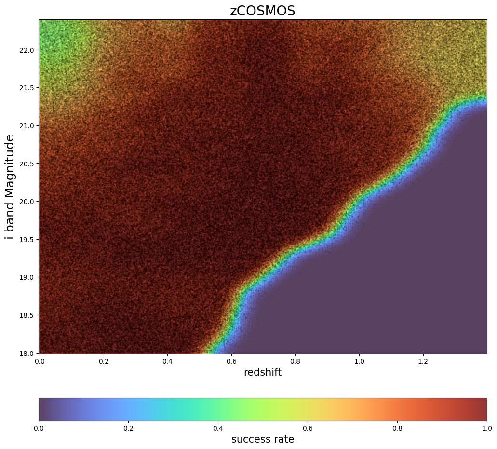

Spectroscopic Selection Degrader to Emulate zCOSMOS Training Samples
====================================================================

last run successfully: April 26, 2023

The spectroscopic_selection degrader can be used to model the
spectroscopic success rates in training sets based on real data. Given a
2-dimensional grid of spec-z success ratio as a function of two
variables (often magnitude, color, or redshift), the degrader will draw
the appropriate fraction of samples from the input data and return a
sample with incompleteness modeled.

The degrader takes the following arguments:

-  ``N_tot``: number of selected sources
-  ``nondetect_val``: non detected magnitude value to be excluded
   (usually 99.0, -99.0 or NaN).
-  ``downsample``: If true, downsample the selected sources into a total
   number of N_tot.
-  ``success_rate_dir``: The path to the directory containing success
   rate files.
-  ``colnames``: a dictionary that includes necessary columns
   (magnitudes, colors and redshift) for selection. For magnitudes, the
   keys are ugrizy; for colors, the keys are, for example, gr standing
   for g-r; for redshift, the key is ‘redshift’. In this demo, zCOSMOS
   takes {‘i’:‘i’, ‘redshift’:‘redshift’} as minimum necessary input

In this quick notebook we’ll select galaxies based on zCOSMOS selection
function.

**Note:** If you’re planning to run this in a notebook, you may want to
use interactive mode instead. See
`Spectroscopic_Selection_for_zCOSMOS.ipynb <https://github.com/LSSTDESC/rail/blob/main/interactive_examples/creation_examples/Spectroscopic_Selection_for_zCOSMOS.ipynb>`__
in the ``interactive_examples/creation_examples/`` folder for a version
of this notebook in interactive mode.

.. code:: ipython3

    import rail
    import os
    import matplotlib.pyplot as plt
    import numpy as np
    import tables_io
    import pandas as pd
    #from rail.core.data import TableHandle
    from rail.utils.path_utils import find_rail_file
    from rail.core.stage import RailStage
    %matplotlib inline 

Let’s make fake data for zCOSMOS selection.

.. code:: ipython3

    i = np.random.uniform(low=18, high=25.9675, size=(2000000,))
    gz = np.random.uniform(low=-1.98, high=5.98, size=(2000000,))
    u = np.full_like(i, 20.0, dtype=np.double)
    g = np.full_like(i, 20.0, dtype=np.double)
    r = np.full_like(i, 20.0, dtype=np.double)
    y = np.full_like(i, 20.0, dtype=np.double)
    z = g - gz
    redshift = np.random.uniform(size=len(i)) * 2

Standardize the column names:

.. code:: ipython3

    mockdict = {}
    for label, item in zip(['u', 'g','r','i', 'z','y', 'redshift'], [u,g,r,i,z,y, redshift]):
        mockdict[f'{label}'] = item

np.repeat(item, 100).flatten()

.. code:: ipython3

    df = pd.DataFrame(mockdict)

.. code:: ipython3

    df.head()

.. raw:: html

    

    
    <table border="1" class="dataframe">
      <thead>
        <tr style="text-align: right;">
          <th></th>
          <th>u</th>
          <th>g</th>
          <th>r</th>
          <th>i</th>
          <th>z</th>
          <th>y</th>
          <th>redshift</th>
        </tr>
      </thead>
      <tbody>
        <tr>
          <th>0</th>
          <td>20.0</td>
          <td>20.0</td>
          <td>20.0</td>
          <td>18.914614</td>
          <td>17.997790</td>
          <td>20.0</td>
          <td>0.936677</td>
        </tr>
        <tr>
          <th>1</th>
          <td>20.0</td>
          <td>20.0</td>
          <td>20.0</td>
          <td>19.666694</td>
          <td>18.110394</td>
          <td>20.0</td>
          <td>1.601380</td>
        </tr>
        <tr>
          <th>2</th>
          <td>20.0</td>
          <td>20.0</td>
          <td>20.0</td>
          <td>18.761008</td>
          <td>16.021253</td>
          <td>20.0</td>
          <td>0.926974</td>
        </tr>
        <tr>
          <th>3</th>
          <td>20.0</td>
          <td>20.0</td>
          <td>20.0</td>
          <td>24.923473</td>
          <td>21.503836</td>
          <td>20.0</td>
          <td>0.058185</td>
        </tr>
        <tr>
          <th>4</th>
          <td>20.0</td>
          <td>20.0</td>
          <td>20.0</td>
          <td>25.716863</td>
          <td>16.950469</td>
          <td>20.0</td>
          <td>0.235412</td>
        </tr>
      </tbody>
    </table>
    

Now, let’s import the spectroscopic_selections degrader for zCOSMOS.

The ratio file for zCOSMOS is located in the
``RAIL/src/rail/examples/creation/data/success_rate_data/`` directory,
as we are in ``RAIL/examples/creation`` folder named
``zCOSMOS_success.txt``; the binning in i band and redshift are given in
``zCOSMOS_I_sampling.txt`` and ``zCOSMOS_z_sampling.txt``.

We will set a random seed for reproducibility, and set the output file
to write our incomplete catalog to “test_hsc.pq”.

.. code:: ipython3

    import sys
    from rail.creation.degraders import spectroscopic_selections
    from importlib import reload
    from rail.creation.degraders.spectroscopic_selections import SpecSelection_zCOSMOS

.. code:: ipython3

    zcosmos_selecter = SpecSelection_zCOSMOS.make_stage(downsample=False, 
                                                        colnames={'i':'i','redshift':'redshift'})

Let’s run the code and see how long it takes:

.. code:: ipython3

    %%time
    trim_data = zcosmos_selecter(df)

.. parsed-literal::

    Inserting handle into data store.  input: None, SpecSelection_zCOSMOS

.. parsed-literal::

    Inserting handle into data store.  output: inprogress_output.pq, SpecSelection_zCOSMOS

.. parsed-literal::

    CPU times: user 1.54 s, sys: 33.6 ms, total: 1.58 s
    Wall time: 1.7 s

.. code:: ipython3

    trim_data.data.info()

.. parsed-literal::

    <class 'pandas.core.frame.DataFrame'>
    Index: 503270 entries, 16 to 1999991
    Data columns (total 7 columns):
     #   Column    Non-Null Count   Dtype  
    ---  ------    --------------   -----  
     0   u         503270 non-null  float64
     1   g         503270 non-null  float64
     2   r         503270 non-null  float64
     3   i         503270 non-null  float64
     4   z         503270 non-null  float64
     5   y         503270 non-null  float64
     6   redshift  503270 non-null  float64
    dtypes: float64(7)
    memory usage: 30.7 MB

And we see that we’ve kept 503967 out of the 2,000,000 galaxies in the
initial sample, so about 25% of the initial sample. To visualize our
cuts, let’s read in the success ratios file and plot our sample overlaid
with an alpha of 0.05, that way the strength of the black dot will give
a visual indication of how many galaxies in each cell we’ve kept.

.. code:: ipython3

    # compare to sum of ratios * 100
    ratio_file=find_rail_file('examples_data/creation_data/data/success_rate_data/zCOSMOS_success.txt')

.. code:: ipython3

    ratios = np.loadtxt(ratio_file)

.. code:: ipython3

    ibin_ = np.arange(18, 22.4, 0.01464226, dtype=np.float64)
    zbin_ = np.arange(0, 1.4, 0.00587002, dtype=np.float64)
    
    ibin, zbin = np.meshgrid(ibin_, zbin_)

.. code:: ipython3

    trim_data.data

.. raw:: html

    

    
    <table border="1" class="dataframe">
      <thead>
        <tr style="text-align: right;">
          <th></th>
          <th>u</th>
          <th>g</th>
          <th>r</th>
          <th>i</th>
          <th>z</th>
          <th>y</th>
          <th>redshift</th>
        </tr>
      </thead>
      <tbody>
        <tr>
          <th>16</th>
          <td>20.0</td>
          <td>20.0</td>
          <td>20.0</td>
          <td>18.918627</td>
          <td>17.255706</td>
          <td>20.0</td>
          <td>0.445507</td>
        </tr>
        <tr>
          <th>19</th>
          <td>20.0</td>
          <td>20.0</td>
          <td>20.0</td>
          <td>19.622985</td>
          <td>20.015031</td>
          <td>20.0</td>
          <td>0.722967</td>
        </tr>
        <tr>
          <th>22</th>
          <td>20.0</td>
          <td>20.0</td>
          <td>20.0</td>
          <td>20.775567</td>
          <td>21.449395</td>
          <td>20.0</td>
          <td>0.644243</td>
        </tr>
        <tr>
          <th>25</th>
          <td>20.0</td>
          <td>20.0</td>
          <td>20.0</td>
          <td>20.980317</td>
          <td>16.746704</td>
          <td>20.0</td>
          <td>0.560118</td>
        </tr>
        <tr>
          <th>27</th>
          <td>20.0</td>
          <td>20.0</td>
          <td>20.0</td>
          <td>20.087513</td>
          <td>21.233731</td>
          <td>20.0</td>
          <td>0.373400</td>
        </tr>
        <tr>
          <th>...</th>
          <td>...</td>
          <td>...</td>
          <td>...</td>
          <td>...</td>
          <td>...</td>
          <td>...</td>
          <td>...</td>
        </tr>
        <tr>
          <th>1999979</th>
          <td>20.0</td>
          <td>20.0</td>
          <td>20.0</td>
          <td>22.100475</td>
          <td>18.072175</td>
          <td>20.0</td>
          <td>1.231424</td>
        </tr>
        <tr>
          <th>1999980</th>
          <td>20.0</td>
          <td>20.0</td>
          <td>20.0</td>
          <td>21.681796</td>
          <td>15.079150</td>
          <td>20.0</td>
          <td>0.053650</td>
        </tr>
        <tr>
          <th>1999981</th>
          <td>20.0</td>
          <td>20.0</td>
          <td>20.0</td>
          <td>19.916774</td>
          <td>20.393927</td>
          <td>20.0</td>
          <td>0.910931</td>
        </tr>
        <tr>
          <th>1999990</th>
          <td>20.0</td>
          <td>20.0</td>
          <td>20.0</td>
          <td>21.715754</td>
          <td>19.133532</td>
          <td>20.0</td>
          <td>0.410081</td>
        </tr>
        <tr>
          <th>1999991</th>
          <td>20.0</td>
          <td>20.0</td>
          <td>20.0</td>
          <td>21.543235</td>
          <td>21.576575</td>
          <td>20.0</td>
          <td>0.706630</td>
        </tr>
      </tbody>
    </table>
    
503270 rows × 7 columns

    

.. code:: ipython3

    plt.figure(figsize=(12,12))
    plt.title('zCOSMOS', fontsize=20)
    
    c = plt.pcolormesh(zbin, ibin, ratios.T, cmap='turbo',vmin=0, vmax=1, alpha=0.8)
    plt.scatter(trim_data.data['redshift'], trim_data.data['i'], s=2, c='k',alpha =.05)
    plt.xlabel("redshift", fontsize=15)
    plt.ylabel("i band Magnitude", fontsize=18)
    cb = plt.colorbar(c, label='success rate',orientation='horizontal', pad=0.1)
    cb.set_label(label='success rate', size=15)

The colormap shows the zCOSMOS success ratios and the strenth of the
black dots shows how many galaxies were actually kept. We see perfect
agreement between our predicted ratios and the actual number of galaxies
kept, the degrader is functioning properly, and we see a nice visual
representation of the resulting spectroscopic sample incompleteness.
