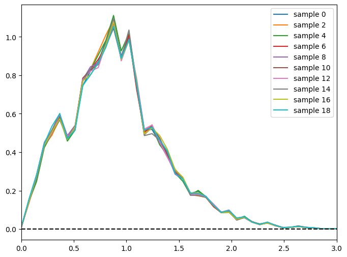
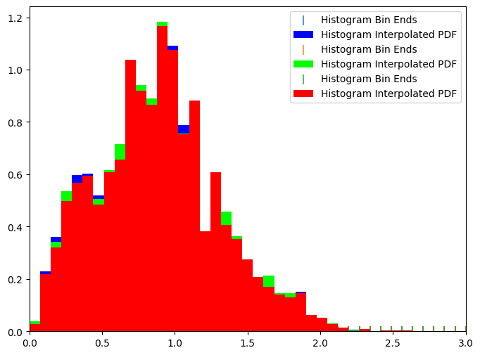
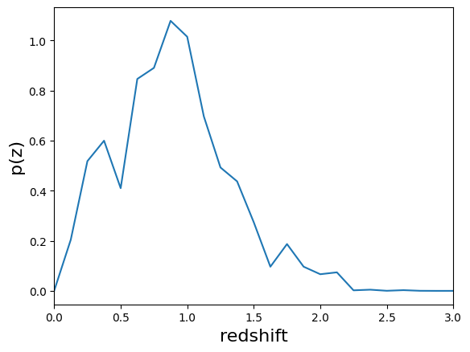
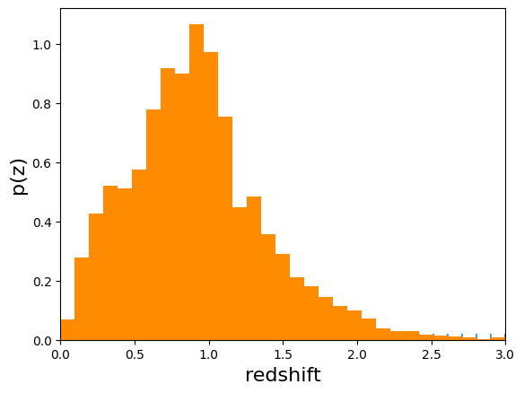
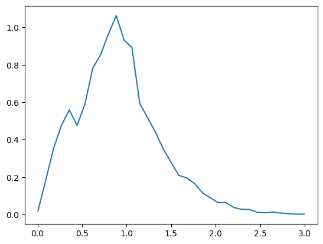
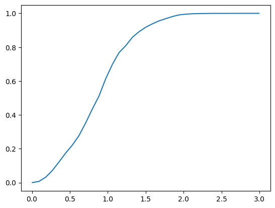
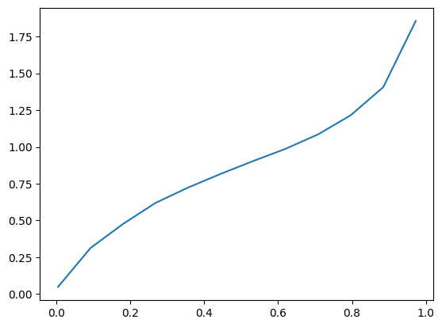
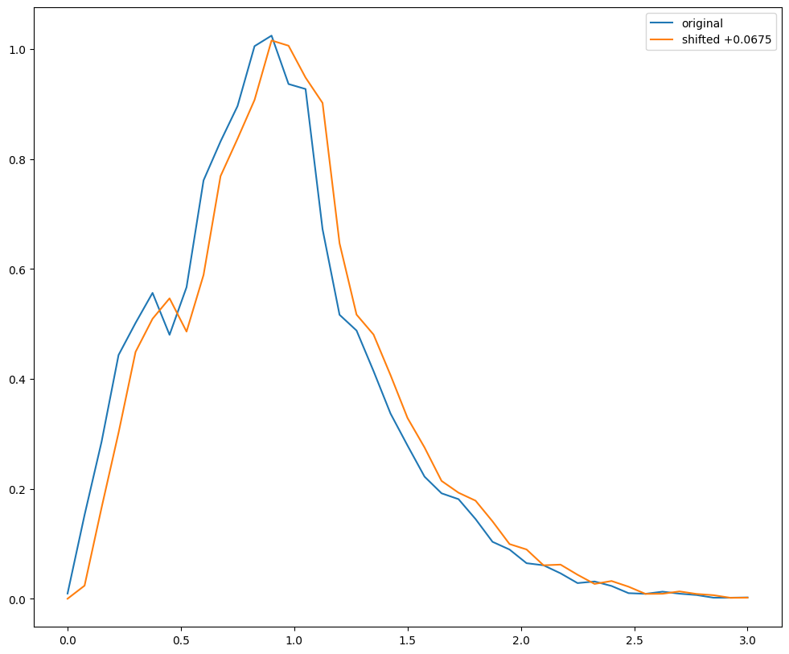

Test Sampled Summarizers
========================

**Author:** Sam Schmidt

**Last successfully run:** April 26, 2023

June 28 update: I modified the summarizers to output not just N sample
N(z) distributions (saved to the file specified via the ``output``
keyword), but also the single fiducial N(z) estimate (saved to the file
specified via the ``single_NZ`` keyword). I also updated NZDir and
included it in this example notebook

**NOTE:** This notebook takes a lot of memory and may not be able to run
on your laptop

**Note:** If you’re planning to run this in a notebook, you may want to
use interactive mode instead. See
`Sampled_Summarizers.ipynb <https://github.com/LSSTDESC/rail/blob/main/interactive_examples/estimation_examples/Sampled_Summarizers.ipynb>`__
in the ``interactive_examples/estimation_examples/`` folder for a
version of this notebook in interactive mode.

.. code:: ipython3

    import os
    import rail
    import numpy as np
    import pandas as pd
    import tables_io
    import matplotlib.pyplot as plt
    %matplotlib inline

.. code:: ipython3

    from rail.estimation.algos.k_nearneigh import KNearNeighInformer, KNearNeighEstimator

.. code:: ipython3

    from rail.estimation.algos.var_inf import VarInfStackSummarizer
    from rail.estimation.algos.naive_stack import NaiveStackSummarizer
    from rail.estimation.algos.point_est_hist import PointEstHistSummarizer
    from rail.estimation.algos.nz_dir import NZDirInformer, NZDirSummarizer
    from rail.core.data import TableHandle, QPHandle
    from rail.core.stage import RailStage

.. code:: ipython3

    import qp

To create some N(z) distributions, we’ll want some PDFs to work with
first, for a quick demo let’s just run some photo-z’s using the
KNearNeighEstimator estimator using the 10,000 training galaxies to
generate ~20,000 PDFs using data from healpix 9816 of cosmoDC2_v1.1.4
that are included in the RAIL repo:

.. code:: ipython3

    knn_dict = dict(zmin=0.0, zmax=3.0, nzbins=301, trainfrac=0.75,
                    sigma_grid_min=0.01, sigma_grid_max=0.07, ngrid_sigma=10,
                    nneigh_min=3, nneigh_max=7, hdf5_groupname='photometry')

.. code:: ipython3

    pz_train = KNearNeighInformer.make_stage(name='inform_KNN', model='demo_knn.pkl', **knn_dict)

.. code:: ipython3

    # Load up the example healpix 9816 data and stick in the DataStore
    from rail.utils.path_utils import find_rail_file
    trainFile = find_rail_file('examples_data/testdata/test_dc2_training_9816.hdf5')
    testFile = find_rail_file('examples_data/testdata/test_dc2_validation_9816.hdf5')
    training_data = tables_io.read(trainFile)
    test_data = tables_io.read(testFile)

.. code:: ipython3

    # train knnpz
    pz_train.inform(training_data)

.. parsed-literal::

    Inserting handle into data store.  input: None, inform_KNN
    split into 7669 training and 2556 validation samples
    finding best fit sigma and NNeigh...

.. parsed-literal::

    
    
    
    best fit values are sigma=0.023333333333333334 and numneigh=7
    
    
    
    Inserting handle into data store.  model_inform_KNN: inprogress_demo_knn.pkl, inform_KNN

.. parsed-literal::

    <rail.core.data.ModelHandle at 0x7f9d9c523fd0>

.. code:: ipython3

    pz = KNearNeighEstimator.make_stage(name='KNN', hdf5_groupname='photometry',
                                  model=pz_train.get_handle('model'))
    qp_data = pz.estimate(test_data)

.. parsed-literal::

    Inserting handle into data store.  input: None, KNN
    Inserting handle into data store.  model_inform_KNN: <class 'rail.core.data.ModelHandle'> demo_knn.pkl, (wd), KNN
    Process 0 running estimator on chunk 0 - 20,449
    Process 0 estimating PZ PDF for rows 0 - 20,449

.. parsed-literal::

    Inserting handle into data store.  output_KNN: inprogress_output_KNN.hdf5, KNN

So, ``qp_data`` now contains the 20,000 PDFs from KNearNeighEstimator,
we can feed this in to three summarizers to generate an overall N(z)
distribution. We won’t bother with any tomographic selections for this
demo, just the overall N(z). It is stored as ``qp_data``, but has also
been saved to disk as ``output_KNN.fits`` as an astropy table. If you
want to read in this data to grab the qp Ensemble at a later stage, you
can do this via qp with a ``ens = qp.read("output_KNN.fits")``

I coded up **quick and dirty** bootstrap versions of the
``NaiveStackSummarizer``, ``PointEstHistSummarizer``, and
``VarInference`` sumarizers. These are not optimized, not parallel
(issue created for future update), but they do produce N different
bootstrap realizations of the overall N(z) which are returned as a qp
Ensemble (Note: the previous versions of these degraders returned only
the single overall N(z) rather than samples).

Naive Stack
-----------

Naive stack just “stacks” i.e. sums up, the PDFs and returns a qp.interp
distribution with bins defined by np.linspace(zmin, zmax, nzbins), we
will create a stack with 41 bins and generate 20 bootstrap realizations

.. code:: ipython3

    stacker = NaiveStackSummarizer.make_stage(zmin=0.0, zmax=3.0, nzbins=41, nsamples=20, output="Naive_samples.hdf5", single_NZ="NaiveStack_NZ.hdf5")

.. code:: ipython3

    naive_results = stacker.summarize(qp_data)

.. parsed-literal::

    Inserting handle into data store.  output_KNN: None, NaiveStackSummarizer
    Process 0 running estimator on chunk 0 - 10,000

.. parsed-literal::

    Process 0 running estimator on chunk 10,000 - 20,000

.. parsed-literal::

    Process 0 running estimator on chunk 20,000 - 20,449
    Inserting handle into data store.  output: inprogress_Naive_samples.hdf5, NaiveStackSummarizer
    Inserting handle into data store.  single_NZ: inprogress_NaiveStack_NZ.hdf5, NaiveStackSummarizer

The results are now in naive_results, but because of the DataStore, the
actual *ensemble* is stored in ``.data``, let’s grab the ensemble and
plot a few of the bootstrap sample N(z) estimates:

.. code:: ipython3

    newens = naive_results.data

.. code:: ipython3

    fig, axs = plt.subplots(figsize=(8,6))
    for i in range(0, 20, 2):
        newens[i].plot_native(axes=axs, label=f"sample {i}")
    axs.plot([0,3],[0,0],'k--')
    axs.set_xlim(0,3)
    axs.legend(loc='upper right')

.. parsed-literal::

    <matplotlib.legend.Legend at 0x7f9d9c5b3220>

The summarizer also outputs a **second** file containing the fiducial
N(z). We saved the fiducial N(z) in the file “NaiveStack_NZ.hdf5”, let’s
grab the N(z) estimate with qp and plot it with the native plotter:

.. code:: ipython3

    naive_nz = qp.read("NaiveStack_NZ.hdf5")
    naive_nz.plot_native(xlim=(0,3))

.. parsed-literal::

    <Axes: xlabel='redshift', ylabel='p(z)'>

.. image:: 13_Sampled_Summarizers_files/13_Sampled_Summarizers_20_1.png

Point Estimate Hist
-------------------

PointEstHistSummarizer takes the point estimate mode of each PDF and
then histograms these, we’ll again generate 41 bootstrap samples of this
and plot a few of the resultant histograms. Note: For some reason the
plotting on the histogram distribution in qp is a little wonky, it
appears alpha is broken, so this plot is not the best:

.. code:: ipython3

    pointy = PointEstHistSummarizer.make_stage(zmin=0.0, zmax=3.0, nzbins=41, n_samples=20, single_NZ="point_NZ.hdf5", output="point_samples.hdf5")

.. code:: ipython3

    %%time
    pointy_results = pointy.summarize(qp_data)

.. parsed-literal::

    Inserting handle into data store.  output_KNN: None, PointEstHistSummarizer
    Process 0 running estimator on chunk 0 - 10,000

.. parsed-literal::

    Process 0 running estimator on chunk 10,000 - 20,000

.. parsed-literal::

    Process 0 running estimator on chunk 20,000 - 20,449
    Inserting handle into data store.  output: inprogress_point_samples.hdf5, PointEstHistSummarizer
    Inserting handle into data store.  single_NZ: inprogress_point_NZ.hdf5, PointEstHistSummarizer
    CPU times: user 17.6 s, sys: 2.72 s, total: 20.3 s
    Wall time: 20.3 s

.. code:: ipython3

    pens = pointy_results.data

.. code:: ipython3

    fig, axs = plt.subplots(figsize=(8,6))
    pens[0].plot_native(axes=axs, fc = [0, 0, 1, 0.01])
    pens[1].plot_native(axes=axs, fc = [0, 1, 0, 0.01])
    pens[4].plot_native(axes=axs, fc = [1, 0, 0, 0.01])
    axs.set_xlim(0,3)
    axs.legend()

.. parsed-literal::

    <matplotlib.legend.Legend at 0x7f9d9a37f6a0>

Again, we have saved the fiducial N(z) in a separate file,
“point_NZ.hdf5”, we could read that data in if we desired.

VarInfStackSummarizer
---------------------

VarInfStackSummarizer implements Markus’ variational inference scheme
and returns qp.interp gridded distribution. VarInfStackSummarizer tends
to get a little wonky if you use too many bins, so we’ll only use 25
bins. Again let’s generate 20 samples and plot a few:

.. code:: ipython3

    runner=VarInfStackSummarizer.make_stage(name='test_varinf', zmin=0.0,zmax=3.0,nzbins=25, n_iter=10, n_samples=20,
                                        output="sampletest.hdf5", single_NZ="varinf_NZ.hdf5")

.. code:: ipython3

    %%time
    varinf_results = runner.summarize(qp_data)

.. parsed-literal::

    Inserting handle into data store.  output_KNN: None, test_varinf
    Process 0 running estimator on chunk 0 - 20,449

.. parsed-literal::

    Inserting handle into data store.  output_test_varinf: inprogress_sampletest.hdf5, test_varinf
    Inserting handle into data store.  single_NZ_test_varinf: inprogress_varinf_NZ.hdf5, test_varinf
    CPU times: user 1.03 s, sys: 32 ms, total: 1.06 s
    Wall time: 1.06 s

.. code:: ipython3

    vens = varinf_results.data
    vens

.. parsed-literal::

    Ensemble(the_class=interp,shape=(20, 25))

Let’s plot the fiducial N(z) for this distribution:

.. code:: ipython3

    varinf_nz = qp.read("varinf_NZ.hdf5")
    varinf_nz.plot_native(xlim=(0,3))

.. parsed-literal::

    <Axes: xlabel='redshift', ylabel='p(z)'>

NZDir
-----

NZDirSummarizer is a different type of summarizer, taking a weighted set
of neighbors to a set of training spectroscopic objects to reconstruct
the redshift distribution of the photometric sample. I implemented a
bootstrap of the **spectroscopic data** rather than the photometric
data, both because it was much easier computationally, and I think that
the spectroscopic variance is more important to take account of than
simple bootstrap of the large photometric sample. We must first run the
``inform_NZDir`` stage to train up the K nearest neigh tree used by
NZDirSummarizer, then we will run ``NZDirSummarizer`` to actually
construct the N(z) estimate.

Like PointEstHistSummarizer NZDirSummarizer returns a qp.hist ensemble
of samples

.. code:: ipython3

    inf_nz = NZDirInformer.make_stage(n_neigh=8, hdf5_groupname="photometry", model="nzdir_model.pkl")

.. code:: ipython3

    inf_nz.inform(training_data)

.. parsed-literal::

    Inserting handle into data store.  input: None, NZDirInformer
    Inserting handle into data store.  model: inprogress_nzdir_model.pkl, NZDirInformer

.. parsed-literal::

    <rail.core.data.ModelHandle at 0x7f9d9a37f790>

.. code:: ipython3

    nzd = NZDirSummarizer.make_stage(leafsize=20, zmin=0.0, zmax=3.0, nzbins=31, model="nzdir_model.pkl", hdf5_groupname='photometry',
                           output='NZDir_samples.hdf5', single_NZ='NZDir_NZ.hdf5')

.. code:: ipython3

    nzd_res = nzd.estimate(test_data)

.. parsed-literal::

    Inserting handle into data store.  input: None, NZDirSummarizer
    Inserting handle into data store.  model: nzdir_model.pkl, NZDirSummarizer
    Process 0 running estimator on chunk 0 - 20449

.. parsed-literal::

    Inserting handle into data store.  single_NZ: inprogress_NZDir_NZ.hdf5, NZDirSummarizer
    Inserting handle into data store.  output: inprogress_NZDir_samples.hdf5, NZDirSummarizer

.. code:: ipython3

    nzd_ens = nzd_res.data

.. code:: ipython3

    nzdir_nz = qp.read("NZDir_NZ.hdf5")

.. code:: ipython3

    fig, axs = plt.subplots(figsize=(10,8))
    nzd_ens[0].plot_native(axes=axs, fc = [0, 0, 1, 0.01])
    nzd_ens[1].plot_native(axes=axs, fc = [0, 1, 0, 0.01])
    nzd_ens[4].plot_native(axes=axs, fc = [1, 0, 0, 0.01])
    axs.set_xlim(0,3)
    axs.legend()

.. parsed-literal::

    <matplotlib.legend.Legend at 0x7f9d92ceda80>

.. image:: 13_Sampled_Summarizers_files/13_Sampled_Summarizers_40_1.png

As we also wrote out the single estimate of N(z) we can read that data
from the second file written (specified by the ``single_NZ`` argument
given in NZDirSummarizer.make_stage above, in this case “NZDir_NZ.hdf5”)

.. code:: ipython3

    nzdir_nz = qp.read("NZDir_NZ.hdf5")

.. code:: ipython3

    nzdir_nz.plot_native(xlim=(0,3))

.. parsed-literal::

    <Axes: xlabel='redshift', ylabel='p(z)'>

Results
-------

All three results files are qp distributions, NaiveStackSummarizer and
VarInfStackSummarizer return qp.interp distributions while
PointEstHistSummarizer returns a qp.histogram distribution. Even with
the different distributions you can use qp functionality to do things
like determine the means, modes, etc… of the distributions. You could
then use the std dev of any of these to estimate a 1 sigma “shift”, etc…

.. code:: ipython3

    zgrid = np.linspace(0,3,41)
    names = ['naive', 'point', 'varinf', 'nzdir']
    enslist = [newens, pens, vens, nzd_ens]
    results_dict = {}
    for nm, en in zip(names, enslist):
        results_dict[f'{nm}_modes'] = en.mode(grid=zgrid).flatten()
        results_dict[f'{nm}_means'] = en.mean().flatten()
        results_dict[f'{nm}_std'] = en.std().flatten()

.. code:: ipython3

    results_dict

.. parsed-literal::

    {'naive_modes': array([0.9  , 0.9  , 0.825, 0.9  , 0.9  , 0.9  , 0.9  , 0.9  , 0.9  ,
            0.9  , 0.9  , 0.9  , 0.9  , 0.9  , 0.9  , 0.9  , 0.9  , 0.9  ,
            0.9  , 0.9  , 0.9  , 0.9  , 0.9  , 0.9  , 0.9  , 0.9  , 0.9  ,
            0.9  , 0.9  , 0.9  , 0.9  , 0.9  , 0.9  , 0.9  , 0.9  , 0.9  ,
            0.9  , 0.9  , 0.9  , 0.9  , 0.9  , 0.9  , 0.9  , 0.9  , 0.9  ,
            0.9  , 0.9  , 0.9  , 0.9  , 0.9  , 0.9  , 0.9  , 0.9  , 0.9  ,
            0.9  , 0.9  , 0.9  , 0.9  , 0.9  , 0.9  , 0.9  , 0.9  , 0.9  ,
            0.9  , 0.9  , 0.9  , 0.9  , 0.9  , 0.9  , 0.9  , 0.9  , 0.9  ,
            0.9  , 0.9  , 0.9  , 0.9  , 0.9  , 0.9  , 0.9  , 0.9  , 0.9  ,
            0.9  , 0.9  , 0.9  , 0.9  , 0.9  , 0.9  , 0.9  , 0.9  , 0.9  ,
            0.9  , 0.9  , 0.9  , 0.9  , 0.9  , 0.9  , 0.9  , 0.825, 0.9  ,
            0.9  , 0.9  , 0.9  , 0.9  , 0.9  , 0.9  , 0.9  , 0.9  , 0.9  ,
            0.9  , 0.9  , 0.9  , 0.9  , 0.9  , 0.9  , 0.9  , 0.9  , 0.9  ,
            0.9  , 0.9  , 0.9  , 0.9  , 0.9  , 0.9  , 0.9  , 0.9  , 0.9  ,
            0.9  , 0.9  , 0.9  , 0.9  , 0.825, 0.9  , 0.9  , 0.9  , 0.9  ,
            0.9  , 0.9  , 0.9  , 0.9  , 0.9  , 0.9  , 0.9  , 0.9  , 0.9  ,
            0.9  , 0.9  , 0.825, 0.9  , 0.9  , 0.9  , 0.9  , 0.9  , 0.825,
            0.9  , 0.9  , 0.9  , 0.825, 0.9  , 0.9  , 0.9  , 0.9  , 0.9  ,
            0.9  , 0.9  , 0.9  , 0.9  , 0.9  , 0.9  , 0.9  , 0.9  , 0.9  ,
            0.9  , 0.9  , 0.9  , 0.9  , 0.9  , 0.9  , 0.9  , 0.9  , 0.9  ,
            0.9  , 0.9  , 0.9  , 0.9  , 0.9  , 0.9  , 0.9  , 0.9  , 0.9  ,
            0.9  , 0.9  , 0.9  , 0.9  , 0.9  , 0.9  , 0.9  , 0.9  , 0.9  ,
            0.9  , 0.9  , 0.9  , 0.9  , 0.9  , 0.9  , 0.9  , 0.9  , 0.9  ,
            0.9  , 0.9  , 0.9  , 0.9  , 0.9  , 0.9  , 0.9  , 0.9  , 0.9  ,
            0.9  , 0.9  , 0.9  , 0.9  , 0.9  , 0.9  , 0.9  , 0.9  , 0.9  ,
            0.9  , 0.9  , 0.9  , 0.9  , 0.9  , 0.9  , 0.9  , 0.9  , 0.9  ,
            0.9  , 0.9  , 0.9  , 0.9  , 0.9  , 0.9  , 0.9  , 0.9  , 0.9  ,
            0.9  , 0.9  , 0.9  , 0.9  , 0.9  , 0.9  , 0.9  , 0.9  , 0.9  ,
            0.9  , 0.9  , 0.9  , 0.9  , 0.9  , 0.9  , 0.9  , 0.825, 0.9  ,
            0.9  , 0.9  , 0.9  , 0.9  , 0.9  , 0.9  , 0.9  , 0.9  , 0.9  ,
            0.9  , 0.9  , 0.9  , 0.9  , 0.9  , 0.9  , 0.9  , 0.9  , 0.9  ,
            0.9  , 0.9  , 0.9  , 0.9  , 0.9  , 0.9  , 0.9  , 0.9  , 0.9  ,
            0.9  , 0.9  , 0.9  , 0.9  , 0.9  , 0.9  , 0.9  , 0.9  , 0.9  ,
            0.9  , 0.9  , 0.9  , 0.9  , 0.825, 0.9  , 0.9  , 0.9  , 0.825,
            0.9  , 0.9  , 0.9  , 0.9  , 0.9  , 0.9  , 0.9  , 0.9  , 0.9  ,
            0.9  , 0.9  , 0.9  , 0.9  , 0.9  , 0.9  , 0.9  , 0.9  , 0.9  ,
            0.9  , 0.9  , 0.9  , 0.9  , 0.9  , 0.9  , 0.9  , 0.9  , 0.9  ,
            0.9  , 0.9  , 0.9  , 0.9  , 0.9  , 0.9  , 0.9  , 0.9  , 0.9  ,
            0.9  , 0.9  , 0.9  , 0.9  , 0.9  , 0.9  , 0.9  , 0.9  , 0.9  ,
            0.9  , 0.9  , 0.9  , 0.9  , 0.9  , 0.9  , 0.9  , 0.9  , 0.9  ,
            0.9  , 0.9  , 0.9  , 0.9  , 0.9  , 0.9  , 0.9  , 0.9  , 0.9  ,
            0.9  , 0.9  , 0.825, 0.9  , 0.9  , 0.9  , 0.9  , 0.9  , 0.9  ,
            0.9  , 0.9  , 0.9  , 0.9  , 0.9  , 0.9  , 0.9  , 0.9  , 0.9  ,
            0.9  , 0.9  , 0.9  , 0.9  , 0.9  , 0.9  , 0.9  , 0.9  , 0.9  ,
            0.9  , 0.9  , 0.9  , 0.9  , 0.9  , 0.9  , 0.9  , 0.9  , 0.9  ,
            0.9  , 0.9  , 0.9  , 0.9  , 0.9  , 0.9  , 0.9  , 0.9  , 0.9  ,
            0.9  , 0.9  , 0.9  , 0.9  , 0.9  , 0.9  , 0.9  , 0.9  , 0.9  ,
            0.9  , 0.9  , 0.9  , 0.9  , 0.9  , 0.9  , 0.9  , 0.9  , 0.9  ,
            0.9  , 0.9  , 0.9  , 0.9  , 0.9  , 0.9  , 0.9  , 0.9  , 0.9  ,
            0.9  , 0.9  , 0.825, 0.9  , 0.9  , 0.9  , 0.9  , 0.9  , 0.9  ,
            0.9  , 0.9  , 0.9  , 0.9  , 0.9  , 0.9  , 0.9  , 0.9  , 0.9  ,
            0.9  , 0.9  , 0.9  , 0.9  , 0.9  , 0.9  , 0.9  , 0.9  , 0.9  ,
            0.9  , 0.9  , 0.9  , 0.9  , 0.9  , 0.9  , 0.9  , 0.9  , 0.9  ,
            0.9  , 0.9  , 0.9  , 0.9  , 0.9  , 0.9  , 0.9  , 0.9  , 0.9  ,
            0.9  , 0.9  , 0.9  , 0.9  , 0.9  , 0.9  , 0.9  , 0.9  , 0.9  ,
            0.9  , 0.9  , 0.9  , 0.9  , 0.9  , 0.9  , 0.9  , 0.9  , 0.9  ,
            0.9  , 0.9  , 0.9  , 0.9  , 0.9  , 0.9  , 0.9  , 0.9  , 0.9  ,
            0.9  , 0.9  , 0.9  , 0.9  , 0.9  , 0.9  , 0.9  , 0.9  , 0.9  ,
            0.9  , 0.9  , 0.9  , 0.9  , 0.9  , 0.9  , 0.9  , 0.9  , 0.9  ,
            0.9  , 0.9  , 0.9  , 0.9  , 0.9  , 0.9  , 0.9  , 0.9  , 0.9  ,
            0.9  , 0.9  , 0.9  , 0.9  , 0.9  , 0.9  , 0.9  , 0.9  , 0.9  ,
            0.9  , 0.9  , 0.9  , 0.9  , 0.9  , 0.9  , 0.9  , 0.9  , 0.9  ,
            0.9  , 0.9  , 0.9  , 0.9  , 0.9  , 0.9  , 0.9  , 0.9  , 0.9  ,
            0.9  , 0.9  , 0.9  , 0.9  , 0.9  , 0.9  , 0.9  , 0.9  , 0.9  ,
            0.9  , 0.9  , 0.9  , 0.9  , 0.9  , 0.9  , 0.9  , 0.9  , 0.9  ,
            0.9  , 0.9  , 0.9  , 0.9  , 0.9  , 0.9  , 0.9  , 0.9  , 0.825,
            0.9  , 0.9  , 0.9  , 0.9  , 0.9  , 0.9  , 0.9  , 0.9  , 0.9  ,
            0.9  , 0.9  , 0.9  , 0.9  , 0.9  , 0.9  , 0.9  , 0.9  , 0.9  ,
            0.9  , 0.9  , 0.9  , 0.9  , 0.9  , 0.9  , 0.9  , 0.9  , 0.9  ,
            0.9  , 0.9  , 0.9  , 0.9  , 0.9  , 0.9  , 0.9  , 0.9  , 0.9  ,
            0.9  , 0.9  , 0.9  , 0.9  , 0.9  , 0.9  , 0.9  , 0.9  , 0.9  ,
            0.9  , 0.9  , 0.9  , 0.9  , 0.9  , 0.9  , 0.9  , 0.9  , 0.9  ,
            0.9  , 0.9  , 0.9  , 0.9  , 0.9  , 0.9  , 0.9  , 0.9  , 0.9  ,
            0.9  , 0.9  , 0.9  , 0.9  , 0.9  , 0.9  , 0.9  , 0.9  , 0.9  ,
            0.9  , 0.9  , 0.9  , 0.9  , 0.9  , 0.9  , 0.9  , 0.9  , 0.9  ,
            0.9  , 0.9  , 0.9  , 0.9  , 0.9  , 0.9  , 0.9  , 0.9  , 0.9  ,
            0.9  , 0.9  , 0.9  , 0.9  , 0.9  , 0.9  , 0.9  , 0.9  , 0.9  ,
            0.9  , 0.9  , 0.9  , 0.9  , 0.9  , 0.9  , 0.9  , 0.9  , 0.9  ,
            0.9  , 0.9  , 0.9  , 0.9  , 0.9  , 0.9  , 0.9  , 0.9  , 0.9  ,
            0.9  , 0.9  , 0.9  , 0.9  , 0.9  , 0.9  , 0.9  , 0.9  , 0.9  ,
            0.9  , 0.9  , 0.9  , 0.9  , 0.9  , 0.9  , 0.9  , 0.9  , 0.9  ,
            0.9  , 0.9  , 0.9  , 0.9  , 0.9  , 0.9  , 0.9  , 0.9  , 0.9  ,
            0.9  , 0.9  , 0.9  , 0.9  , 0.9  , 0.9  , 0.9  , 0.9  , 0.9  ,
            0.9  , 0.9  , 0.9  , 0.9  , 0.9  , 0.9  , 0.9  , 0.9  , 0.9  ,
            0.9  , 0.9  , 0.9  , 0.9  , 0.9  , 0.9  , 0.9  , 0.9  , 0.9  ,
            0.825, 0.9  , 0.9  , 0.9  , 0.9  , 0.9  , 0.9  , 0.9  , 0.9  ,
            0.9  , 0.9  , 0.825, 0.9  , 0.9  , 0.9  , 0.9  , 0.9  , 0.9  ,
            0.9  , 0.9  , 0.9  , 0.9  , 0.9  , 0.9  , 0.9  , 0.9  , 0.9  ,
            0.9  , 0.9  , 0.9  , 0.9  , 0.9  , 0.9  , 0.9  , 0.9  , 0.9  ,
            0.9  , 0.9  , 0.9  , 0.9  , 0.9  , 0.9  , 0.9  , 0.9  , 0.9  ,
            0.9  , 0.9  , 0.9  , 0.9  , 0.9  , 0.9  , 0.9  , 0.9  , 0.9  ,
            0.9  , 0.9  , 0.9  , 0.9  , 0.9  , 0.9  , 0.9  , 0.9  , 0.9  ,
            0.9  , 0.9  , 0.9  , 0.9  , 0.9  , 0.9  , 0.9  , 0.9  , 0.9  ,
            0.9  , 0.9  , 0.9  , 0.9  , 0.9  , 0.9  , 0.825, 0.9  , 0.9  ,
            0.9  , 0.9  , 0.9  , 0.9  , 0.9  , 0.9  , 0.9  , 0.9  , 0.9  ,
            0.9  , 0.9  , 0.9  , 0.9  , 0.9  , 0.9  , 0.9  , 0.9  , 0.9  ,
            0.9  , 0.9  , 0.9  , 0.9  , 0.9  , 0.9  , 0.9  , 0.9  , 0.9  ,
            0.9  , 0.9  , 0.9  , 0.9  , 0.9  , 0.9  , 0.9  , 0.9  , 0.9  ,
            0.9  , 0.9  , 0.9  , 0.9  , 0.9  , 0.9  , 0.9  , 0.9  , 0.9  ,
            0.9  , 0.9  , 0.9  , 0.9  , 0.9  , 0.9  , 0.9  , 0.9  , 0.9  ,
            0.9  , 0.9  , 0.9  , 0.9  , 0.9  , 0.9  , 0.9  , 0.9  , 0.9  ,
            0.9  , 0.9  , 0.825, 0.9  , 0.9  , 0.9  , 0.9  , 0.9  , 0.9  ,
            0.9  , 0.9  , 0.9  , 0.9  , 0.825, 0.825, 0.9  , 0.9  , 0.9  ,
            0.9  , 0.9  , 0.9  , 0.9  , 0.9  , 0.9  , 0.9  , 0.9  , 0.9  ,
            0.9  , 0.9  , 0.9  , 0.9  , 0.9  , 0.825, 0.9  , 0.9  , 0.9  ,
            0.9  , 0.9  , 0.9  , 0.9  , 0.9  , 0.9  , 0.9  , 0.9  , 0.9  ,
            0.9  , 0.9  , 0.9  , 0.9  , 0.9  , 0.9  , 0.9  , 0.9  , 0.9  ,
            0.9  , 0.9  , 0.9  , 0.9  , 0.9  , 0.9  , 0.9  , 0.9  , 0.9  ,
            0.9  , 0.9  , 0.9  , 0.9  , 0.9  , 0.9  , 0.9  , 0.825, 0.9  ,
            0.9  , 0.9  , 0.9  , 0.9  , 0.9  , 0.9  , 0.9  , 0.9  , 0.9  ,
            0.9  , 0.9  , 0.9  , 0.9  , 0.9  , 0.9  , 0.825, 0.9  , 0.9  ,
            0.9  ]),
     'naive_means': array([0.9085933 , 0.90719907, 0.90596457, 0.90747722, 0.90797073,
            0.9139804 , 0.90589885, 0.90439666, 0.90115443, 0.90797736,
            0.90802674, 0.90562565, 0.90785482, 0.90930286, 0.90387582,
            0.91193979, 0.9095788 , 0.90519526, 0.90802126, 0.90705869,
            0.90397736, 0.91047223, 0.90735045, 0.90716929, 0.91436806,
            0.90570653, 0.90505622, 0.90552163, 0.90269166, 0.91115836,
            0.90912643, 0.91034078, 0.91188142, 0.9113045 , 0.90864997,
            0.91303459, 0.90577369, 0.90256839, 0.90387919, 0.90579463,
            0.90559989, 0.91347567, 0.90847739, 0.90745163, 0.9112295 ,
            0.9077758 , 0.91109028, 0.90792015, 0.9026192 , 0.90948622,
            0.91155534, 0.90856039, 0.91375695, 0.90405675, 0.90885933,
            0.90701383, 0.90709578, 0.90484341, 0.9081818 , 0.90687893,
            0.90842831, 0.90752795, 0.9041502 , 0.90881855, 0.91089075,
            0.90817874, 0.90287559, 0.90538795, 0.90350352, 0.90525287,
            0.90868915, 0.91298151, 0.9077436 , 0.90764529, 0.9076561 ,
            0.90920667, 0.90736718, 0.90740312, 0.90998707, 0.90802767,
            0.91100348, 0.90752165, 0.91048619, 0.90994461, 0.90708257,
            0.90361589, 0.90661014, 0.91074063, 0.90732457, 0.91113042,
            0.90080217, 0.90015402, 0.90418495, 0.90821036, 0.90902294,
            0.90908323, 0.9097865 , 0.9074494 , 0.90587003, 0.91097902,
            0.9118838 , 0.90808671, 0.90657212, 0.91252587, 0.90947392,
            0.90890161, 0.91216811, 0.9105144 , 0.90650833, 0.90665281,
            0.90902891, 0.91044978, 0.90439345, 0.90951939, 0.91182049,
            0.90676353, 0.90726307, 0.90713367, 0.90986827, 0.91218948,
            0.9099661 , 0.90462091, 0.90374184, 0.9108322 , 0.90712308,
            0.90497557, 0.90927951, 0.90974733, 0.90717331, 0.90566639,
            0.90974042, 0.91002385, 0.9125267 , 0.90484314, 0.90325036,
            0.90903948, 0.91082013, 0.90576355, 0.90808195, 0.90404735,
            0.90667456, 0.90911504, 0.90903139, 0.90574468, 0.90713207,
            0.91045948, 0.90536706, 0.90407694, 0.90054503, 0.90878649,
            0.90885468, 0.91185471, 0.90833606, 0.90924637, 0.91153878,
            0.9085799 , 0.90560078, 0.90951283, 0.90668312, 0.90786534,
            0.90429822, 0.91066098, 0.90763335, 0.90972577, 0.9067926 ,
            0.90861296, 0.90689293, 0.90776603, 0.90538953, 0.91289153,
            0.90613351, 0.90860917, 0.90205083, 0.91008541, 0.90516731,
            0.90774799, 0.90762316, 0.91274764, 0.90515608, 0.90615421,
            0.91160142, 0.90922414, 0.91087081, 0.90725569, 0.90969721,
            0.90609111, 0.90594916, 0.90536119, 0.90389937, 0.90796402,
            0.90895236, 0.90883198, 0.90633559, 0.91128303, 0.90640768,
            0.90632036, 0.9088407 , 0.90453282, 0.90672393, 0.90583046,
            0.91117796, 0.91199   , 0.90453544, 0.90929573, 0.90993388,
            0.90646868, 0.9112172 , 0.90823646, 0.90923366, 0.90509141,
            0.90534285, 0.90907689, 0.90892338, 0.9061445 , 0.90973963,
            0.905923  , 0.90656022, 0.91335493, 0.90416483, 0.90472487,
            0.91047004, 0.90513479, 0.91327422, 0.91353412, 0.90426526,
            0.9105609 , 0.90580219, 0.90857622, 0.90311664, 0.90843945,
            0.91241569, 0.90335822, 0.9071477 , 0.90130182, 0.90401903,
            0.90988463, 0.91157374, 0.90431207, 0.90600767, 0.91127157,
            0.90806356, 0.9110312 , 0.90665795, 0.90697595, 0.90919172,
            0.90380465, 0.9106719 , 0.9060833 , 0.91210312, 0.91363846,
            0.90684704, 0.90802409, 0.90348335, 0.90768964, 0.90329676,
            0.91067125, 0.90805315, 0.90649745, 0.90543472, 0.90196865,
            0.90784141, 0.90638246, 0.91152757, 0.91191128, 0.91394638,
            0.90804932, 0.90628091, 0.89792644, 0.90615533, 0.90254963,
            0.90813856, 0.90776547, 0.90528285, 0.90874142, 0.90872326,
            0.90957389, 0.91265503, 0.90725167, 0.90996428, 0.90968002,
            0.90912672, 0.90989524, 0.91005991, 0.90246833, 0.91154898,
            0.91121653, 0.90780378, 0.9116991 , 0.90726251, 0.90455944,
            0.90982398, 0.90277441, 0.91233996, 0.90651137, 0.90964609,
            0.90482386, 0.9101312 , 0.90375805, 0.90141684, 0.90773701,
            0.90649593, 0.90600761, 0.90671404, 0.90930702, 0.90311457,
            0.90262248, 0.89885922, 0.90973486, 0.90896471, 0.90497133,
            0.90834888, 0.90481263, 0.90959536, 0.90025066, 0.90716344,
            0.90501889, 0.90971687, 0.91071535, 0.91157026, 0.90850982,
            0.90956598, 0.91219581, 0.90425583, 0.90614572, 0.90942098,
            0.91028223, 0.91467312, 0.90727034, 0.91358006, 0.91063006,
            0.90557147, 0.90451486, 0.91015647, 0.90848539, 0.90367069,
            0.90292568, 0.90880902, 0.90642635, 0.90751727, 0.91099996,
            0.90462708, 0.90680899, 0.91321905, 0.90703716, 0.90451859,
            0.90779949, 0.91055559, 0.90564197, 0.90297834, 0.90629478,
            0.90958811, 0.91114431, 0.91196693, 0.90968857, 0.9049854 ,
            0.9096317 , 0.91194727, 0.90913042, 0.9084457 , 0.90972866,
            0.90473956, 0.90612493, 0.90931708, 0.90881669, 0.90589904,
            0.90544742, 0.90496833, 0.90814328, 0.9102416 , 0.90473057,
            0.9016362 , 0.90763411, 0.91024719, 0.90619868, 0.90791127,
            0.90497371, 0.9100345 , 0.90444161, 0.90726494, 0.91297525,
            0.90242501, 0.91071708, 0.90472974, 0.90675206, 0.91213559,
            0.90729345, 0.90628203, 0.91300754, 0.90729973, 0.9047281 ,
            0.909617  , 0.91236173, 0.90756142, 0.91187352, 0.90816354,
            0.90691696, 0.90668523, 0.90916748, 0.90683842, 0.90525234,
            0.91547867, 0.90136981, 0.91116004, 0.90502765, 0.90832821,
            0.90793148, 0.90648129, 0.90671606, 0.90909598, 0.90809752,
            0.91065002, 0.90959737, 0.90783855, 0.90478949, 0.90561373,
            0.91157643, 0.90835151, 0.90370093, 0.90607493, 0.90825215,
            0.9137907 , 0.91306055, 0.91099837, 0.90614623, 0.91114854,
            0.90912059, 0.90671716, 0.90678017, 0.90477617, 0.90879659,
            0.90639052, 0.9087957 , 0.90283983, 0.90653667, 0.90534078,
            0.90568812, 0.90362786, 0.91062205, 0.90715245, 0.90419521,
            0.90614256, 0.90365771, 0.90658921, 0.90659964, 0.90707383,
            0.90685805, 0.90818709, 0.90788346, 0.9060046 , 0.90924698,
            0.90673012, 0.90193486, 0.90459728, 0.90728161, 0.90766769,
            0.90306573, 0.90997655, 0.90623692, 0.90615335, 0.90416154,
            0.90340902, 0.9113095 , 0.90955686, 0.9058707 , 0.9116037 ,
            0.90949996, 0.90781796, 0.90979151, 0.9057055 , 0.90737865,
            0.9095239 , 0.90429856, 0.9030804 , 0.91389066, 0.90549136,
            0.89997963, 0.90851152, 0.90643207, 0.90913959, 0.9093024 ,
            0.90476591, 0.90698771, 0.90428002, 0.90708741, 0.9083856 ,
            0.90163769, 0.90809592, 0.91791154, 0.91181797, 0.90297781,
            0.90967761, 0.90487172, 0.91066197, 0.90443306, 0.90199109,
            0.90706133, 0.90547599, 0.91139013, 0.90780179, 0.90346808,
            0.91006716, 0.9069362 , 0.90652565, 0.91165146, 0.90908989,
            0.90911724, 0.91243873, 0.90954246, 0.91147799, 0.90820172,
            0.9075353 , 0.90996538, 0.90916121, 0.91041634, 0.91296352,
            0.91115778, 0.90836777, 0.90653622, 0.90761517, 0.90817666,
            0.91441244, 0.90710098, 0.90904118, 0.89897553, 0.9119488 ,
            0.90958142, 0.90751359, 0.91003852, 0.90528498, 0.90856583,
            0.90831377, 0.91370784, 0.90886266, 0.91000218, 0.90926265,
            0.90967337, 0.9041499 , 0.91504227, 0.90484052, 0.90611189,
            0.90897127, 0.90657757, 0.90885809, 0.90735153, 0.91253284,
            0.90986102, 0.91146907, 0.9112594 , 0.91045654, 0.90966997,
            0.91100319, 0.90267105, 0.90383344, 0.91098694, 0.90913306,
            0.90887122, 0.90213271, 0.90887896, 0.91403007, 0.90548447,
            0.91172179, 0.91362503, 0.90985086, 0.91343298, 0.90926468,
            0.90964998, 0.9069706 , 0.91092996, 0.90360976, 0.90983349,
            0.90878658, 0.90343107, 0.91258436, 0.90501008, 0.90209331,
            0.90503797, 0.90025508, 0.9085429 , 0.90893999, 0.90827814,
            0.90835052, 0.9054582 , 0.90665079, 0.91065188, 0.90876316,
            0.90159522, 0.90746306, 0.9093475 , 0.90571341, 0.90453008,
            0.9046008 , 0.90416637, 0.90533452, 0.90983849, 0.90675991,
            0.90253983, 0.90984312, 0.90784827, 0.90787216, 0.91019086,
            0.90369355, 0.90618815, 0.90909001, 0.9016424 , 0.90712515,
            0.91301596, 0.9121168 , 0.91555983, 0.90824114, 0.90688842,
            0.90735676, 0.91330401, 0.90723597, 0.90692365, 0.90357382,
            0.90955362, 0.91040605, 0.90683722, 0.90920178, 0.90378126,
            0.90504835, 0.91062933, 0.90551681, 0.90356983, 0.90707675,
            0.91036899, 0.91006014, 0.90742452, 0.91195607, 0.90999878,
            0.90920896, 0.90505135, 0.90733689, 0.90408731, 0.90623988,
            0.90739808, 0.90773303, 0.91269694, 0.9054253 , 0.90778657,
            0.91266378, 0.90753929, 0.90231667, 0.90419814, 0.91257657,
            0.9092659 , 0.91008508, 0.90580649, 0.90544435, 0.90780143,
            0.90877715, 0.9080025 , 0.90684505, 0.89865884, 0.90545527,
            0.90687058, 0.90951644, 0.90632302, 0.90851035, 0.91061129,
            0.90962322, 0.90903112, 0.91089749, 0.90942766, 0.90467432,
            0.91104958, 0.90654733, 0.90948586, 0.90762674, 0.90744355,
            0.90590539, 0.9067958 , 0.9085617 , 0.90689886, 0.90695271,
            0.90249486, 0.90991349, 0.91254096, 0.91031746, 0.90137358,
            0.90230438, 0.90470945, 0.90982355, 0.91199534, 0.90643508,
            0.90443558, 0.90967404, 0.90818284, 0.91042826, 0.90867507,
            0.9065972 , 0.90839556, 0.90201005, 0.90708228, 0.91063582,
            0.90126753, 0.90610636, 0.90895564, 0.9048537 , 0.90452217,
            0.9087551 , 0.90578976, 0.91257531, 0.90693068, 0.90804527,
            0.90795246, 0.90390768, 0.9055962 , 0.90458165, 0.91095438,
            0.90672796, 0.90742399, 0.91217418, 0.90702163, 0.90398028,
            0.90413066, 0.90267749, 0.90561402, 0.90910649, 0.90818113,
            0.90936316, 0.9159085 , 0.90797633, 0.90320213, 0.90685244,
            0.90750541, 0.9073067 , 0.90306223, 0.91020999, 0.9103635 ,
            0.90502704, 0.90944936, 0.912254  , 0.91139728, 0.9054906 ,
            0.90527767, 0.91077468, 0.90194642, 0.9027811 , 0.90293828,
            0.90529802, 0.90919185, 0.91172036, 0.90382019, 0.90819511,
            0.90382497, 0.90950152, 0.90812833, 0.90637389, 0.90984389,
            0.90873279, 0.90716497, 0.9086752 , 0.91016179, 0.91603657,
            0.90686666, 0.90732676, 0.90593136, 0.9113448 , 0.90902894,
            0.90275592, 0.91021289, 0.90562239, 0.90992617, 0.9099462 ,
            0.89863548, 0.90588116, 0.91027338, 0.90285866, 0.90531378,
            0.9091771 , 0.91378901, 0.9059461 , 0.90812371, 0.90988488,
            0.90493863, 0.91090741, 0.90967552, 0.90721696, 0.91062153,
            0.9130113 , 0.91034315, 0.90458167, 0.90211734, 0.90854679,
            0.91012775, 0.90667024, 0.90155857, 0.90167132, 0.90903182,
            0.9051119 , 0.91312898, 0.90691377, 0.90988504, 0.91169911,
            0.90735446, 0.90405339, 0.90535564, 0.90397519, 0.90310416,
            0.90841046, 0.90204375, 0.906245  , 0.91290605, 0.90793799,
            0.90865864, 0.90479794, 0.90127995, 0.9084316 , 0.904994  ,
            0.9081513 , 0.90788587, 0.90345575, 0.90273688, 0.90815004,
            0.90328473, 0.9020082 , 0.91183399, 0.90959531, 0.90947343,
            0.90468025, 0.90547907, 0.90377739, 0.90970051, 0.91182299,
            0.91069035, 0.90876271, 0.91086475, 0.90586622, 0.91056985,
            0.90976552, 0.9090711 , 0.90930187, 0.90935255, 0.9009422 ,
            0.91055408, 0.90969298, 0.90741035, 0.91061077, 0.90391347,
            0.90497995, 0.90586086, 0.90418937, 0.90434602, 0.91126076,
            0.90382775, 0.90684523, 0.90437986, 0.90756226, 0.91197538,
            0.90824776, 0.90626817, 0.91006058, 0.90840452, 0.90923305,
            0.91119957, 0.90692247, 0.9049456 , 0.90358282, 0.90737482,
            0.91031707, 0.90792471, 0.90696594, 0.90445178, 0.90488509,
            0.90440848, 0.91130459, 0.91148654, 0.90781789, 0.90493669,
            0.90671078, 0.90366514, 0.91250579, 0.9101849 , 0.90272359,
            0.9071546 , 0.91066456, 0.90394309, 0.91490343, 0.91089058,
            0.90432343, 0.90481906, 0.90894071, 0.90695851, 0.90432155,
            0.90393624, 0.9070414 , 0.90613247, 0.90225055, 0.91150873,
            0.90476047, 0.90432448, 0.9084396 , 0.91113282, 0.90716677,
            0.90631004, 0.9072735 , 0.90783609, 0.90780979, 0.90277303,
            0.9053347 , 0.90999029, 0.91115427, 0.90904202, 0.90922067,
            0.90191092, 0.90910377, 0.90741187, 0.90631962, 0.90956735,
            0.90763566, 0.90079244, 0.9142996 , 0.9105789 , 0.9101271 ,
            0.90615408, 0.89844597, 0.9037726 , 0.90120166, 0.90850567,
            0.9065702 , 0.90477286, 0.90837294, 0.90610079, 0.90572244,
            0.91107978, 0.90696116, 0.90843172, 0.90909412, 0.91183   ,
            0.90264969, 0.90751162, 0.90351627, 0.90898177, 0.91272696,
            0.91130544, 0.90712733, 0.90852913, 0.90536307, 0.90561901,
            0.90661888, 0.90830482, 0.90838906, 0.90448512, 0.90889745,
            0.90917401, 0.90681467, 0.90630688, 0.91221929, 0.90746809,
            0.90632878, 0.90656784, 0.90389753, 0.90976914, 0.91135672,
            0.90852602, 0.91256734, 0.90355447, 0.90599706, 0.90348728,
            0.90394103, 0.90898257, 0.90750388, 0.90809399, 0.90480733,
            0.90259431, 0.90857947, 0.90750066, 0.91393095, 0.91127468,
            0.9082755 , 0.90504358, 0.9060115 , 0.90714133, 0.90696925,
            0.9060197 , 0.90433009, 0.9052115 , 0.90895541, 0.91369853,
            0.91214823, 0.91001549, 0.90374126, 0.91292884, 0.90208539,
            0.90529658, 0.9095659 , 0.91122807, 0.91226067, 0.91071701,
            0.9074018 , 0.90702382, 0.91248531, 0.91111099, 0.91002508,
            0.90816262, 0.90477729, 0.91051661, 0.90729546, 0.90853378]),
     'naive_std': array([0.45728676, 0.45614375, 0.45372941, 0.45214584, 0.45336085,
            0.45840166, 0.45703521, 0.45562745, 0.45753267, 0.4562071 ,
            0.45931872, 0.45890284, 0.45774367, 0.45834362, 0.45466345,
            0.46101524, 0.4568191 , 0.45705911, 0.46282457, 0.45583653,
            0.45683992, 0.45938226, 0.45708964, 0.45733482, 0.46203821,
            0.45491637, 0.45457628, 0.45239632, 0.45140717, 0.45461455,
            0.4574112 , 0.45898548, 0.46122602, 0.45625477, 0.45461177,
            0.46078342, 0.45497673, 0.45371937, 0.45463514, 0.46020714,
            0.45880396, 0.45849359, 0.45479696, 0.45793631, 0.45488638,
            0.45732314, 0.45743781, 0.45672713, 0.45452375, 0.45618773,
            0.46228784, 0.46014282, 0.46057052, 0.45624684, 0.45728564,
            0.45824582, 0.45863315, 0.45277737, 0.45597581, 0.46017587,
            0.4601744 , 0.4575533 , 0.4550824 , 0.45631838, 0.45802333,
            0.45780821, 0.45786608, 0.45525251, 0.45546316, 0.45841935,
            0.45855116, 0.458884  , 0.45486948, 0.4548874 , 0.4566854 ,
            0.45527265, 0.45713705, 0.45634406, 0.45688183, 0.45802048,
            0.45943078, 0.46069767, 0.45737976, 0.45879905, 0.45631562,
            0.45938425, 0.45753283, 0.45786872, 0.45760865, 0.4606535 ,
            0.45604466, 0.45225531, 0.4536897 , 0.45843735, 0.45943761,
            0.4588893 , 0.45722685, 0.45550553, 0.45420665, 0.45719561,
            0.4561914 , 0.45796454, 0.45530351, 0.46170207, 0.45943879,
            0.45622181, 0.46108499, 0.45774519, 0.45764111, 0.45785754,
            0.4578069 , 0.45995839, 0.45594548, 0.45615903, 0.45887975,
            0.45445093, 0.45567711, 0.461779  , 0.4591865 , 0.45873892,
            0.45881592, 0.45162032, 0.45509932, 0.46021807, 0.46033879,
            0.45653017, 0.45200788, 0.45659364, 0.45230155, 0.45777554,
            0.45868102, 0.45753487, 0.46019211, 0.45598142, 0.45506628,
            0.45582292, 0.45747285, 0.45707637, 0.45635552, 0.45792317,
            0.4547486 , 0.45352779, 0.46068062, 0.45752019, 0.45519909,
            0.45565838, 0.4573379 , 0.45642953, 0.45526032, 0.45690997,
            0.45522297, 0.46102299, 0.4580552 , 0.45926148, 0.46003338,
            0.45844997, 0.45730256, 0.4568576 , 0.45796344, 0.4567653 ,
            0.45972146, 0.45957654, 0.45633791, 0.45619465, 0.45743153,
            0.45845899, 0.45826107, 0.45967136, 0.45489529, 0.45831423,
            0.45827949, 0.45667988, 0.45581674, 0.459258  , 0.45678339,
            0.46072774, 0.45831096, 0.45596152, 0.4574776 , 0.45592558,
            0.45584141, 0.45377501, 0.45896532, 0.45422335, 0.46039894,
            0.45917465, 0.45586911, 0.45390774, 0.45842874, 0.45277479,
            0.45772043, 0.45579025, 0.45846796, 0.46006461, 0.45722254,
            0.45507091, 0.45930034, 0.45338787, 0.45897005, 0.45494552,
            0.45781752, 0.45860002, 0.45836911, 0.45738476, 0.45264779,
            0.45792214, 0.46001385, 0.45586838, 0.45730891, 0.4561859 ,
            0.45756376, 0.45453582, 0.45588222, 0.45929879, 0.45732948,
            0.45632482, 0.45893128, 0.45635322, 0.45601768, 0.45454832,
            0.46037262, 0.45480687, 0.45903971, 0.46264937, 0.45223527,
            0.45875601, 0.45493334, 0.46163793, 0.45804297, 0.45801843,
            0.46013433, 0.45950091, 0.45831555, 0.45852201, 0.45730836,
            0.45384042, 0.46179258, 0.45914643, 0.45848828, 0.45601548,
            0.45460953, 0.45609426, 0.45569342, 0.45984035, 0.45600814,
            0.45759119, 0.45788876, 0.45369743, 0.46022939, 0.45980837,
            0.45995968, 0.45702655, 0.45603522, 0.45511615, 0.45527747,
            0.45737227, 0.45699718, 0.45757558, 0.45405513, 0.45251712,
            0.4617257 , 0.45703024, 0.4556857 , 0.45846206, 0.46175767,
            0.4591917 , 0.454462  , 0.45324554, 0.45765827, 0.45318755,
            0.4589013 , 0.45556728, 0.45270539, 0.45720555, 0.45980132,
            0.46144309, 0.45945003, 0.45731574, 0.45761462, 0.45781874,
            0.45612852, 0.45649672, 0.45529824, 0.45773428, 0.45717901,
            0.45681796, 0.45653397, 0.45768742, 0.45465832, 0.45541228,
            0.45659545, 0.45592759, 0.45969742, 0.45987574, 0.46236109,
            0.45505765, 0.46121981, 0.45405926, 0.4498828 , 0.45365386,
            0.45976523, 0.45367455, 0.45899551, 0.46038941, 0.45698946,
            0.45418477, 0.45270201, 0.45508665, 0.45722548, 0.45587129,
            0.45652911, 0.45885093, 0.45708842, 0.45480246, 0.46085939,
            0.45876721, 0.46125909, 0.45718936, 0.4641607 , 0.4575189 ,
            0.4580516 , 0.46267329, 0.45554167, 0.45406837, 0.454015  ,
            0.45671713, 0.4602545 , 0.45752887, 0.46005555, 0.45428918,
            0.45386927, 0.45862611, 0.45878082, 0.45939099, 0.4540475 ,
            0.45573974, 0.45665257, 0.45931867, 0.45657387, 0.45730216,
            0.45486235, 0.4599378 , 0.45850081, 0.45903816, 0.45762232,
            0.45835235, 0.45619782, 0.45563549, 0.45694211, 0.4561811 ,
            0.46004014, 0.45770858, 0.45949677, 0.45706343, 0.45655806,
            0.45576106, 0.46077494, 0.45607648, 0.45656311, 0.45713896,
            0.45454459, 0.4541986 , 0.45628758, 0.45870813, 0.45571938,
            0.45599457, 0.4566381 , 0.46130147, 0.4586064 , 0.45901961,
            0.45248768, 0.46127026, 0.45667212, 0.45737795, 0.4574471 ,
            0.45832145, 0.45582382, 0.45691509, 0.45730682, 0.45723917,
            0.4558349 , 0.46018171, 0.45609309, 0.46030904, 0.45966713,
            0.45888934, 0.4549398 , 0.45796826, 0.45677502, 0.45545158,
            0.45810506, 0.46070318, 0.45541564, 0.4606763 , 0.45592777,
            0.46045416, 0.45587092, 0.45465637, 0.45731181, 0.4537997 ,
            0.46075583, 0.45653516, 0.4531104 , 0.45585245, 0.45663698,
            0.45537108, 0.45554263, 0.45063236, 0.45610931, 0.45862111,
            0.45857649, 0.45665714, 0.45725886, 0.45934302, 0.45938918,
            0.45808864, 0.45771467, 0.45900079, 0.45569494, 0.45820739,
            0.45693999, 0.45695941, 0.45986789, 0.45461866, 0.45670798,
            0.45882307, 0.45989679, 0.45755821, 0.45431704, 0.45527532,
            0.4563342 , 0.45798256, 0.45389554, 0.4561042 , 0.45817066,
            0.46245986, 0.45748407, 0.45587825, 0.45625702, 0.45397569,
            0.45619039, 0.45425305, 0.45693138, 0.45937384, 0.4561778 ,
            0.46227492, 0.45508875, 0.45612747, 0.45741121, 0.45628507,
            0.45736472, 0.45566187, 0.45906954, 0.4569314 , 0.45604361,
            0.45542705, 0.45785949, 0.45761619, 0.45514246, 0.45900115,
            0.4543642 , 0.46109598, 0.45323659, 0.45615264, 0.45998913,
            0.45887215, 0.45737169, 0.45626486, 0.45828951, 0.45854526,
            0.45951806, 0.45594782, 0.45629113, 0.46053766, 0.45328889,
            0.45589477, 0.46050765, 0.45614062, 0.45885242, 0.46147173,
            0.45661812, 0.45326446, 0.45560827, 0.4545727 , 0.45950303,
            0.45462149, 0.45771067, 0.46131237, 0.45642541, 0.45466848,
            0.45738923, 0.45848147, 0.45927187, 0.45292058, 0.45674933,
            0.45570258, 0.45485108, 0.45985915, 0.45777839, 0.45662412,
            0.45474169, 0.45972323, 0.4537429 , 0.46108407, 0.45565454,
            0.45636994, 0.46293353, 0.45903926, 0.46324899, 0.45671617,
            0.45842894, 0.45726838, 0.45850834, 0.45758245, 0.45850826,
            0.45829411, 0.45577823, 0.4581629 , 0.45866219, 0.45539215,
            0.46067231, 0.45674025, 0.45323726, 0.45397798, 0.45766268,
            0.45599417, 0.45871522, 0.45517213, 0.46158861, 0.45587009,
            0.45780027, 0.4604955 , 0.45236285, 0.46111536, 0.45669661,
            0.45760185, 0.454207  , 0.46247042, 0.45639484, 0.45869773,
            0.45807115, 0.46158482, 0.45709121, 0.46166383, 0.46035551,
            0.45872986, 0.45788545, 0.45762214, 0.45550391, 0.45754027,
            0.46123143, 0.46051865, 0.45483467, 0.45776876, 0.45767028,
            0.45842454, 0.45880942, 0.45559423, 0.45868088, 0.45482078,
            0.45769639, 0.46165718, 0.45986843, 0.45642468, 0.46048158,
            0.45928376, 0.45547978, 0.45927852, 0.45979934, 0.46150322,
            0.45773028, 0.45810388, 0.45902769, 0.45826914, 0.45799077,
            0.45862707, 0.45254113, 0.45448502, 0.454191  , 0.4565677 ,
            0.4543352 , 0.45909829, 0.45387527, 0.45793225, 0.45544109,
            0.45500247, 0.45689579, 0.45914396, 0.45241832, 0.45687175,
            0.45555581, 0.45917743, 0.45648331, 0.45828321, 0.45606231,
            0.45379239, 0.45672955, 0.45792915, 0.4564537 , 0.45852827,
            0.45631343, 0.4588802 , 0.45804781, 0.45544336, 0.45490345,
            0.46175919, 0.45746213, 0.46324259, 0.45691732, 0.464743  ,
            0.45638318, 0.46120968, 0.45535974, 0.45793028, 0.45635201,
            0.45675853, 0.45976684, 0.45582024, 0.45571188, 0.45562457,
            0.45788913, 0.456639  , 0.45953278, 0.45730304, 0.45600759,
            0.45947398, 0.45696828, 0.45570531, 0.4604824 , 0.45505413,
            0.46091947, 0.45628292, 0.45324232, 0.45380827, 0.45739181,
            0.45837693, 0.45644725, 0.46078201, 0.45509585, 0.45822619,
            0.46130092, 0.45468368, 0.45084047, 0.45602766, 0.45922157,
            0.45533536, 0.45853002, 0.46048646, 0.45703027, 0.45820813,
            0.45536295, 0.45801843, 0.45693334, 0.45602083, 0.46065199,
            0.46166541, 0.45824532, 0.45473841, 0.45671866, 0.45801252,
            0.4556735 , 0.459212  , 0.45640711, 0.45986465, 0.45502295,
            0.4621334 , 0.45871184, 0.45735539, 0.45906856, 0.45703126,
            0.4613005 , 0.45463998, 0.45916906, 0.45938262, 0.46030796,
            0.45759467, 0.45948258, 0.45821106, 0.45899841, 0.45153755,
            0.45766231, 0.45303325, 0.45613537, 0.45624765, 0.45614051,
            0.45612345, 0.45496819, 0.45803311, 0.45929561, 0.45586373,
            0.45100532, 0.46230665, 0.45457403, 0.45546886, 0.45931132,
            0.45742812, 0.4558521 , 0.46176206, 0.45888944, 0.45509118,
            0.458174  , 0.45864003, 0.45816623, 0.46336948, 0.45418696,
            0.45960484, 0.45547502, 0.45810211, 0.45789772, 0.46159021,
            0.45919686, 0.45641179, 0.45819587, 0.45857306, 0.45607379,
            0.45935862, 0.45697585, 0.45759393, 0.45600043, 0.45726415,
            0.45960149, 0.45744156, 0.45676423, 0.4556254 , 0.45834965,
            0.45358414, 0.45872689, 0.45385264, 0.45882398, 0.46040373,
            0.45747211, 0.45812654, 0.46077015, 0.45902417, 0.45530134,
            0.45528395, 0.45703218, 0.45838254, 0.45281395, 0.45434339,
            0.45802465, 0.45862303, 0.45567153, 0.45659238, 0.45539484,
            0.45665895, 0.45594861, 0.45738266, 0.45386773, 0.45568211,
            0.45836048, 0.45708191, 0.45577567, 0.46174376, 0.46161338,
            0.45917987, 0.46049898, 0.45796524, 0.45964328, 0.45686637,
            0.45756369, 0.4585074 , 0.45690654, 0.45777641, 0.45794161,
            0.45402818, 0.45565732, 0.45391333, 0.45400714, 0.45901914,
            0.4604689 , 0.46064313, 0.45839364, 0.4618864 , 0.45678256,
            0.45509035, 0.46040155, 0.45806225, 0.45456283, 0.45611047,
            0.46164867, 0.45831179, 0.45496143, 0.45395314, 0.45836472,
            0.46141792, 0.45622305, 0.45851458, 0.4533746 , 0.4593175 ,
            0.45896945, 0.45615654, 0.45940291, 0.4573022 , 0.45810339,
            0.45638968, 0.45762399, 0.45716191, 0.45587153, 0.45794862,
            0.45531779, 0.45646149, 0.45780031, 0.4575752 , 0.46291901,
            0.45927099, 0.4555706 , 0.45250671, 0.45967974, 0.45447896,
            0.45743253, 0.4566356 , 0.45509309, 0.4540565 , 0.4561798 ,
            0.45416578, 0.45400319, 0.45372636, 0.4585341 , 0.45513187,
            0.45682047, 0.45897301, 0.45702215, 0.46040316, 0.45552502,
            0.45867599, 0.45881544, 0.46030482, 0.45709969, 0.46100067,
            0.46033013, 0.45929829, 0.45846499, 0.45655419, 0.45585413,
            0.45673749, 0.45926662, 0.45908662, 0.45405258, 0.45998688,
            0.45858216, 0.45451273, 0.45611354, 0.45592681, 0.45373023,
            0.45582196, 0.45396962, 0.45565618, 0.45461734, 0.45832599,
            0.46091379, 0.45527437, 0.46103726, 0.4568724 , 0.45935916,
            0.4578748 , 0.45607493, 0.45578888, 0.46034893, 0.45711011,
            0.45579001, 0.4618489 , 0.45782425, 0.46049375, 0.46016216,
            0.4570786 , 0.45775483, 0.45948975, 0.45590782, 0.46170493,
            0.45918299, 0.45842854, 0.4609059 , 0.4572157 , 0.45436404,
            0.45753532, 0.45684258, 0.45754241, 0.46182265, 0.4576554 ,
            0.45512538, 0.45706032, 0.45652499, 0.45413104, 0.45395378,
            0.45906007, 0.46055069, 0.45571525, 0.45847018, 0.45840814,
            0.4555312 , 0.45358206, 0.45757364, 0.4584781 , 0.45732441,
            0.46006992, 0.45687993, 0.45842679, 0.46158945, 0.4587497 ,
            0.45579266, 0.46189219, 0.45831303, 0.45827369, 0.45488863,
            0.45826323, 0.4575229 , 0.45520922, 0.45784032, 0.45834785,
            0.45379606, 0.45304706, 0.45707414, 0.45556388, 0.4572183 ,
            0.45458297, 0.45298994, 0.45133672, 0.45348664, 0.46216037,
            0.45637113, 0.45292994, 0.45813405, 0.45541614, 0.45826929,
            0.45761864, 0.45633709, 0.46056163, 0.45832063, 0.46087401,
            0.454629  , 0.45680211, 0.45684248, 0.46024858, 0.45665639,
            0.45919179, 0.45852267, 0.45837541, 0.45656884, 0.45854312,
            0.45539219, 0.45725948, 0.4540338 , 0.4560847 , 0.45463105,
            0.45739543, 0.45750286, 0.45701795, 0.45770143, 0.45736073,
            0.45805673, 0.45922801, 0.45414365, 0.45904874, 0.45693097,
            0.45478422, 0.46078057, 0.45480899, 0.45549505, 0.45889003,
            0.45537805, 0.45973016, 0.45877457, 0.4565196 , 0.45575872,
            0.45840977, 0.45834981, 0.45545314, 0.45923924, 0.46053084,
            0.4534479 , 0.45875533, 0.45544919, 0.45642767, 0.45236784,
            0.45207571, 0.4590921 , 0.46157363, 0.4491115 , 0.45902424,
            0.45744138, 0.45503217, 0.45545177, 0.4574678 , 0.45926737,
            0.45273872, 0.45643112, 0.45836775, 0.4581991 , 0.45681587,
            0.45714615, 0.45736388, 0.45803527, 0.45373463, 0.45858596,
            0.4544073 , 0.45312086, 0.45938887, 0.45496671, 0.45642726]),
     'point_modes': array([0.9, 0.9, 0.9, 0.9, 0.9, 0.9, 0.9, 0.9, 0.9, 0.9, 0.9, 0.9, 0.9,
            0.9, 0.9, 0.9, 0.9, 0.9, 0.9, 0.9]),
     'point_means': array([0.87747268, 0.87966422, 0.88390687, 0.88292592, 0.88652242,
            0.88416824, 0.88270433, 0.88085392, 0.88398525, 0.88127683,
            0.88581149, 0.88120195, 0.88141923, 0.88272697, 0.87882182,
            0.88615408, 0.88490508, 0.88213304, 0.87551255, 0.88610463]),
     'point_std': array([0.41965477, 0.41628602, 0.41871585, 0.41564559, 0.41745585,
            0.4206483 , 0.41603666, 0.41589367, 0.41726652, 0.41629308,
            0.41392928, 0.41791324, 0.41622493, 0.41328677, 0.41322766,
            0.4182433 , 0.41442477, 0.41762939, 0.41780264, 0.41593474]),
     'varinf_modes': array([0.9  , 0.9  , 0.9  , 0.9  , 0.975, 0.9  , 0.9  , 0.9  , 0.9  ,
            0.9  , 0.9  , 0.9  , 0.9  , 0.9  , 0.9  , 0.9  , 0.9  , 0.9  ,
            0.9  , 0.9  ]),
     'varinf_means': array([0.89007742, 0.89393137, 0.89348035, 0.89529006, 0.89632515,
            0.89304711, 0.89470237, 0.89476074, 0.88891055, 0.89065612,
            0.88963285, 0.88927123, 0.89480197, 0.89551207, 0.8947679 ,
            0.90084125, 0.89603184, 0.89083602, 0.89697313, 0.88937301]),
     'varinf_std': array([0.42671129, 0.43096865, 0.43001351, 0.42473237, 0.42611894,
            0.42608757, 0.42984578, 0.4286463 , 0.42915316, 0.42875199,
            0.42553345, 0.43073474, 0.42927409, 0.42736479, 0.42435752,
            0.43133787, 0.42896748, 0.42596593, 0.4269107 , 0.42523812]),
     'nzdir_modes': array([0.9, 0.9, 0.9, 0.9, 0.9, 0.9, 0.9, 0.9, 0.9, 0.9, 0.9, 0.9, 0.9,
            0.9, 0.9, 0.9, 0.9, 0.9, 0.9, 0.9]),
     'nzdir_means': array([0.91527627, 0.92144451, 0.92166271, 0.92410584, 0.92118734,
            0.91847357, 0.92651638, 0.91452663, 0.92038542, 0.92942564,
            0.93107928, 0.91022267, 0.92142493, 0.92510869, 0.91931933,
            0.92364447, 0.919305  , 0.92659316, 0.91014124, 0.92499533]),
     'nzdir_std': array([0.46761557, 0.47080438, 0.46766624, 0.46515462, 0.46097655,
            0.46587178, 0.46626591, 0.46660589, 0.4646169 , 0.47014536,
            0.47077795, 0.46410977, 0.46431021, 0.46323947, 0.46435023,
            0.47121424, 0.46146407, 0.46880833, 0.46674124, 0.46798514])}

You can also use qp to compute quantities the pdf, cdf, ppf, etc… on any
grid that you want, much of the functionality of scipy.stats
distributions have been inherited by qp ensembles

.. code:: ipython3

    newgrid = np.linspace(0.005,2.995, 35)
    naive_pdf = newens.pdf(newgrid)
    point_cdf = pens.cdf(newgrid)
    var_ppf = vens.ppf(newgrid)

.. code:: ipython3

    plt.plot(newgrid, naive_pdf[0])

.. parsed-literal::

    [<matplotlib.lines.Line2D at 0x7f9d92c8d300>]

.. code:: ipython3

    plt.plot(newgrid, point_cdf[0])

.. parsed-literal::

    [<matplotlib.lines.Line2D at 0x7f9d92c91c90>]

.. code:: ipython3

    plt.plot(newgrid, var_ppf[0])

.. parsed-literal::

    [<matplotlib.lines.Line2D at 0x7f9d92ff60b0>]

Shifts
------

If you want to “shift” a PDF, you can just evaluate the PDF on a shifted
grid, for example to shift the PDF by +0.0375 in redshift you could
evaluate on a shifted grid. For now we can just do this “by hand”, we
could easily implement ``shift`` functionality in qp, I think.

.. code:: ipython3

    def_grid = np.linspace(0., 3., 41)
    shift_grid = def_grid - 0.0675
    native_nz = newens.pdf(def_grid)
    shift_nz = newens.pdf(shift_grid)

.. code:: ipython3

    fig=plt.figure(figsize=(12,10))
    plt.plot(def_grid, native_nz[0], label="original")
    plt.plot(def_grid, shift_nz[0], label="shifted +0.0675")
    plt.legend(loc='upper right')

.. parsed-literal::

    <matplotlib.legend.Legend at 0x7f9d92fbb4c0>

You can estimate how much shift you might expect based on the statistics
of our bootstrap samples, say the std dev of the means for the
NZDir-derived distribution:

.. code:: ipython3

    results_dict['nzdir_means']

.. parsed-literal::

    array([0.91527627, 0.92144451, 0.92166271, 0.92410584, 0.92118734,
           0.91847357, 0.92651638, 0.91452663, 0.92038542, 0.92942564,
           0.93107928, 0.91022267, 0.92142493, 0.92510869, 0.91931933,
           0.92364447, 0.919305  , 0.92659316, 0.91014124, 0.92499533])

.. code:: ipython3

    spread = np.std(results_dict['nzdir_means'])

.. code:: ipython3

    spread

.. parsed-literal::

    np.float64(0.005498408843907329)

Again, not a huge spread in predicted mean redshifts based solely on
bootstraps, even with only ~20,000 galaxies.
