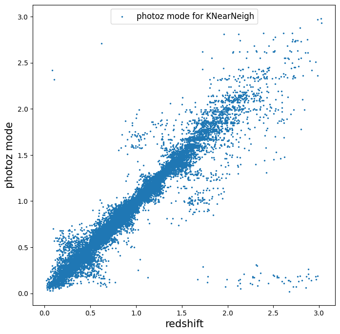

Data, Files, IO, and RAIL
=========================

author: Sam Schmidt

last successfully run: Apr 26, 2023

The switchover to a ``ceci``-based backend has increased the complexity
of methods of data access and IO, this notebook will demonstrate a
variety of ways that users may interact with data in RAIL

In addition to the main RAIL code, we have developed another companion
package, ``tables_io`` `available here on
Github <https://github.com/LSSTDESC/tables_io/>`__.

``tables_io`` aims to simplify IO for reading/writing to some of the
most common file formats used within DESC: HDF5 files, parquet files,
Astropy tables, and ``qp`` ensembles. There are several examples of
tables_io usage in the `nb
directory <https://github.com/LSSTDESC/tables_io/tree/main/nb>`__ of the
``tables_io`` repository, but we will demonstrate usage in several
places in this notebook as well. For furthe examples consult the
tables_io nb examples.

In short, ``tables_io`` aims to simplify fileIO, and much of the io is
automatically sorted out for you if your files have the appriorate
extensions: that is, you can simply do a tables_io.read(“file.fits”) to
read in a fits file or tables_io.read(“newfile.pq”) to read in a
dataframe in parquet format. Similarly, you can specify the output
format via the extension as well. This functionality is extended to
``qp`` and ``RAIL`` through their use of ``tables_io``, and file
extensions will control how files are read and written unless explicitly
overridden.

Another concept used in the ``ceci``-based RAIL when used in a Jupyter
Notebook is the DataStore and DataHandle file specifications (see
`rail_base/src/rail/core/data.py <https://github.com/LSSTDESC/rail_base/blob/main/src/rail/core/data.py>`__
for the actual code implementing these). ``ceci`` requires that each
pipeline stage have defined ``input`` and ``output`` files, and is
primarily geared toward pipelines rather than interactive runs with a
jupyter notebook. The DataStore enables interactive use of files in
Jupyter. We will demonstrate some useful features of the DataStore
below.

Let’s start out with some imports:

.. code:: ipython3

    import os
    import tables_io
    import rail
    import qp
    import numpy as np
    import pandas as pd
    import matplotlib.pyplot as plt
    %matplotlib inline

First, let’s use tables_io to read in some example data. There are two
example files that ship with RAIL containing a small amount of cosmoDC2
data from healpix pixel ``9816``, it is located in the
``rail_base/src/rail/examples_data/testdata/`` directory in the
rail_base repository, one for “training” and one for “validation”. Let’s
read in one of those data files with tables_io:

(NOTE: for historical reasons, our examples files have data that is in
hdf5 format where all of the data arrays are actually in a single hdf5
group named “photometry”. We will grab the data specifically from that
hdf5 group by reading in the file and specifying [“photometry”] as the
group in the cell below. We’ll call our dataset “traindata_io” to
indicate that we’ve read it in via tables_io, and distinguish it from
the data that we’ll place in the DataStore in later steps:

.. code:: ipython3

    from rail.utils.path_utils import find_rail_file
    trainFile = find_rail_file('examples_data/testdata/test_dc2_training_9816.hdf5')
    testFile = find_rail_file('examples_data/testdata/test_dc2_validation_9816.hdf5')
    
    traindata_io = tables_io.read(trainFile)["photometry"]

tables_io reads this data in as an ordered dictionary of numpy arrays by
default, though you can be converted to other data formats, such as a
pandas dataframe as well. Let’s print out the keys in the ordered dict
showing the available columns, then convert the data to a pandas
dataframe and look at a few of the columns as a demo:

.. code:: ipython3

    traindata_io.keys()

.. parsed-literal::

    odict_keys(['id', 'mag_err_g_lsst', 'mag_err_i_lsst', 'mag_err_r_lsst', 'mag_err_u_lsst', 'mag_err_y_lsst', 'mag_err_z_lsst', 'mag_g_lsst', 'mag_i_lsst', 'mag_r_lsst', 'mag_u_lsst', 'mag_y_lsst', 'mag_z_lsst', 'redshift'])

.. code:: ipython3

    traindata_pq = tables_io.convert(traindata_io, tables_io.types.PD_DATAFRAME)

.. code:: ipython3

    traindata_pq.head()

.. raw:: html

    

    
    <table border="1" class="dataframe">
      <thead>
        <tr style="text-align: right;">
          <th></th>
          <th>id</th>
          <th>mag_err_g_lsst</th>
          <th>mag_err_i_lsst</th>
          <th>mag_err_r_lsst</th>
          <th>mag_err_u_lsst</th>
          <th>mag_err_y_lsst</th>
          <th>mag_err_z_lsst</th>
          <th>mag_g_lsst</th>
          <th>mag_i_lsst</th>
          <th>mag_r_lsst</th>
          <th>mag_u_lsst</th>
          <th>mag_y_lsst</th>
          <th>mag_z_lsst</th>
          <th>redshift</th>
        </tr>
      </thead>
      <tbody>
        <tr>
          <th>0</th>
          <td>8062500000</td>
          <td>0.005001</td>
          <td>0.005001</td>
          <td>0.005001</td>
          <td>0.005046</td>
          <td>0.005003</td>
          <td>0.005001</td>
          <td>16.960892</td>
          <td>16.506310</td>
          <td>16.653412</td>
          <td>18.040369</td>
          <td>16.423904</td>
          <td>16.466377</td>
          <td>0.020435</td>
        </tr>
        <tr>
          <th>1</th>
          <td>8062500062</td>
          <td>0.005084</td>
          <td>0.005075</td>
          <td>0.005048</td>
          <td>0.009552</td>
          <td>0.005804</td>
          <td>0.005193</td>
          <td>20.709402</td>
          <td>20.437565</td>
          <td>20.533852</td>
          <td>21.615589</td>
          <td>20.388210</td>
          <td>20.408886</td>
          <td>0.019361</td>
        </tr>
        <tr>
          <th>2</th>
          <td>8062500124</td>
          <td>0.005057</td>
          <td>0.005016</td>
          <td>0.005015</td>
          <td>0.011148</td>
          <td>0.005063</td>
          <td>0.005023</td>
          <td>20.437067</td>
          <td>19.312630</td>
          <td>19.709715</td>
          <td>21.851952</td>
          <td>18.770441</td>
          <td>18.953411</td>
          <td>0.036721</td>
        </tr>
        <tr>
          <th>3</th>
          <td>8062500186</td>
          <td>0.005011</td>
          <td>0.005007</td>
          <td>0.005005</td>
          <td>0.005477</td>
          <td>0.005041</td>
          <td>0.005014</td>
          <td>19.128675</td>
          <td>18.619995</td>
          <td>18.803484</td>
          <td>19.976501</td>
          <td>18.479452</td>
          <td>18.546589</td>
          <td>0.039469</td>
        </tr>
        <tr>
          <th>4</th>
          <td>8062500248</td>
          <td>0.005182</td>
          <td>0.005118</td>
          <td>0.005084</td>
          <td>0.015486</td>
          <td>0.006211</td>
          <td>0.005308</td>
          <td>21.242783</td>
          <td>20.731707</td>
          <td>20.911802</td>
          <td>22.294912</td>
          <td>20.645004</td>
          <td>20.700289</td>
          <td>0.026994</td>
        </tr>
      </tbody>
    </table>
    

Next, let’s set up the Data Store, so that our RAIL module will know
where to fetch data. We will set “allow overwrite” so that we can
overwrite data files and not throw errors while in our jupyter notebook:

.. code:: ipython3

    #import RailStage stuff
    from rail.core.data import TableHandle, PqHandle
    from rail.core.stage import RailStage

.. code:: ipython3

    DS = RailStage.data_store
    DS.__class__.allow_overwrite = True

We need to add our data to the DataStore, we can add previously read
data, like our ``traindata_pq``, or add data to the DataStore directly
via the ``DS.read_file`` method, which we will do with our “test data”.
We can add data with ``DS.add_data`` for the data already in memory, we
want our data in a Numpy Ordered Dict, so we will specify the type as a
TableHandle. If, instead, we were storing a qp ensemble then we would
set the handle as a ``QPHandle``. The DataHandles are defined in
`RAIL/rail/core/data.py <https://github.com/LSSTDESC/RAIL/blob/main/rail/core/data.py>`__,
and you can see the specific code and DataHandles there.

.. code:: ipython3

    #add data that is already read in
    train_data = DS.add_data("train_data", traindata_io, PqHandle)

To read in data from file, we can use ``DS.read_file``, once again we
want a TableHandle, and we can feed it the ``testFile`` path defined in
Cell #2 above:

.. code:: ipython3

    #add test data directly to datastore from file:
    test_data = DS.read_file("test_data", TableHandle, testFile)

Let’s list the data abailable to us in the DataStore:

.. code:: ipython3

    DS

.. parsed-literal::

    DataStore
    {  train_data:<class 'rail.core.data.PqHandle'> None, (d)
      test_data:<class 'rail.core.data.TableHandle'> /opt/hostedtoolcache/Python/3.10.18/x64/lib/python3.10/site-packages/rail/examples_data/testdata/test_dc2_validation_9816.hdf5, (wd)
    }

Note that the DataStore is just a dictionary of the files. Each Handle
object contains the actual data, which is accessible via the ``.data``
property for that file. While not particularly designed for it, you can
manipulate the data via these dictionaries, which is handy for
on-the-fly exploration in notebooks. For example, say we want to add an
additional column to the train_data, say “FakeID” with a more simple
identifier than the long ObjID that is contained the ``id`` column:

.. code:: ipython3

    train_data().keys()
    numgals = len(train_data()['id'])
    train_data()['FakeID'] = np.arange(numgals)

Let’s convert our train_data to a pandas dataframe with tables_io, and
our new “FakeID” column should now be present:

.. code:: ipython3

    train_table = tables_io.convertObj(train_data(), tables_io.types.PD_DATAFRAME)
    train_table.head()

.. raw:: html

    

    
    <table border="1" class="dataframe">
      <thead>
        <tr style="text-align: right;">
          <th></th>
          <th>id</th>
          <th>mag_err_g_lsst</th>
          <th>mag_err_i_lsst</th>
          <th>mag_err_r_lsst</th>
          <th>mag_err_u_lsst</th>
          <th>mag_err_y_lsst</th>
          <th>mag_err_z_lsst</th>
          <th>mag_g_lsst</th>
          <th>mag_i_lsst</th>
          <th>mag_r_lsst</th>
          <th>mag_u_lsst</th>
          <th>mag_y_lsst</th>
          <th>mag_z_lsst</th>
          <th>redshift</th>
          <th>FakeID</th>
        </tr>
      </thead>
      <tbody>
        <tr>
          <th>0</th>
          <td>8062500000</td>
          <td>0.005001</td>
          <td>0.005001</td>
          <td>0.005001</td>
          <td>0.005046</td>
          <td>0.005003</td>
          <td>0.005001</td>
          <td>16.960892</td>
          <td>16.506310</td>
          <td>16.653412</td>
          <td>18.040369</td>
          <td>16.423904</td>
          <td>16.466377</td>
          <td>0.020435</td>
          <td>0</td>
        </tr>
        <tr>
          <th>1</th>
          <td>8062500062</td>
          <td>0.005084</td>
          <td>0.005075</td>
          <td>0.005048</td>
          <td>0.009552</td>
          <td>0.005804</td>
          <td>0.005193</td>
          <td>20.709402</td>
          <td>20.437565</td>
          <td>20.533852</td>
          <td>21.615589</td>
          <td>20.388210</td>
          <td>20.408886</td>
          <td>0.019361</td>
          <td>1</td>
        </tr>
        <tr>
          <th>2</th>
          <td>8062500124</td>
          <td>0.005057</td>
          <td>0.005016</td>
          <td>0.005015</td>
          <td>0.011148</td>
          <td>0.005063</td>
          <td>0.005023</td>
          <td>20.437067</td>
          <td>19.312630</td>
          <td>19.709715</td>
          <td>21.851952</td>
          <td>18.770441</td>
          <td>18.953411</td>
          <td>0.036721</td>
          <td>2</td>
        </tr>
        <tr>
          <th>3</th>
          <td>8062500186</td>
          <td>0.005011</td>
          <td>0.005007</td>
          <td>0.005005</td>
          <td>0.005477</td>
          <td>0.005041</td>
          <td>0.005014</td>
          <td>19.128675</td>
          <td>18.619995</td>
          <td>18.803484</td>
          <td>19.976501</td>
          <td>18.479452</td>
          <td>18.546589</td>
          <td>0.039469</td>
          <td>3</td>
        </tr>
        <tr>
          <th>4</th>
          <td>8062500248</td>
          <td>0.005182</td>
          <td>0.005118</td>
          <td>0.005084</td>
          <td>0.015486</td>
          <td>0.006211</td>
          <td>0.005308</td>
          <td>21.242783</td>
          <td>20.731707</td>
          <td>20.911802</td>
          <td>22.294912</td>
          <td>20.645004</td>
          <td>20.700289</td>
          <td>0.026994</td>
          <td>4</td>
        </tr>
      </tbody>
    </table>
    

And there it is, a new “FakeID” column is now added to the end of the
dataset, success!

Using the data in a pipeline stage: photo-z estimation example
--------------------------------------------------------------

Now that we have our data in place, we can use it in a RAIL stage. As an
example, we’ll estimate photo-z’s for our data. Let’s train the
``KNearNeighEstimator`` algorithm with our train_data, and then estimate
photo-z’s for the test_data. We need to make the RAIL stages for each of
these steps, first we need to train/inform our nearest neighbor
algorithm with the train_data:

.. code:: ipython3

    from rail.estimation.algos.k_nearneigh import KNearNeighInformer, KNearNeighEstimator

.. code:: ipython3

    inform_knn = KNearNeighInformer.make_stage(name='inform_knn', input='train_data', 
                                                nondetect_val=99.0, model='knnpz.pkl',
                                                hdf5_groupname='')

.. code:: ipython3

    inform_knn.inform(train_data)

.. parsed-literal::

    Inserting handle into data store.  input: train_data, inform_knn

.. parsed-literal::

    split into 7669 training and 2556 validation samples
    finding best fit sigma and NNeigh...

.. parsed-literal::

    
    
    
    best fit values are sigma=0.024444444444444446 and numneigh=7
    
    
    
    Inserting handle into data store.  model_inform_knn: inprogress_knnpz.pkl, inform_knn

.. parsed-literal::

    <rail.core.data.ModelHandle at 0x7f20219b7100>

Running the ``inform`` method on the training data has crated the
“knnpz.pkl” file, which contains our trained tree, along with the
``sigma`` bandwidth parameter and the ``numneigh`` (number of neighbors
to use in the PDF estimation). In the future, you could skip the
``inform`` stage and simply load this pkl file directly into the
estimation stage to save time.

Now, let’s stage and run the actual PDF estimation on the test data:
NOTE: we have set hdf5_groupname to “photometry”, as the original data
does have all our our needed photometry in a single hdf5 group named
“photometry”!

.. code:: ipython3

    estimate_knn = KNearNeighEstimator.make_stage(name='estimate_knn', hdf5_groupname='photometry', nondetect_val=99.0,
                                            model='knnpz.pkl', output="KNNPZ_estimates.hdf5")

Note that we have specified the name of the output file here with the
kwarg ``output="KNNPZ_estimates.hdf5"`` *if no output is specified* then
the DataStore will construct its own name based on the name of the
stage, and it will also default to a particular storage format, in the
case of many of the estimator codes this is a FITS file titled
“output\_[stage name].fits”.

.. code:: ipython3

    knn_estimated = estimate_knn.estimate(test_data)

.. parsed-literal::

    Inserting handle into data store.  model: knnpz.pkl, estimate_knn
    Process 0 running estimator on chunk 0 - 10,000
    Process 0 estimating PZ PDF for rows 0 - 10,000

.. parsed-literal::

    Inserting handle into data store.  output_estimate_knn: inprogress_KNNPZ_estimates.hdf5, estimate_knn
    Process 0 running estimator on chunk 10,000 - 20,000
    Process 0 estimating PZ PDF for rows 10,000 - 20,000

.. parsed-literal::

    Process 0 running estimator on chunk 20,000 - 20,449
    Process 0 estimating PZ PDF for rows 20,000 - 20,449

We have successfully estimated PDFs for the ~20,000 galaxies in the test
file! Note that the PDFs are in ``qp`` format! Also note that they have
been written to disk as “KNNPZ_estimate.hdf5”; however, they are also
still available to us via the ``knn_estimated`` dataset in the
datastore. Let’s plot an example PDF from our data in the DataStore:

We can do a quick plot to check our photo-z’s. Our qp Ensemble can be
called by ``knn_estimated()`` and is subsecuently stored in
``knn_estimated.data``, and the Ensemble can calculate the mode of each
PDF if we give it a grid of redshift values to check, which we can plot
against our true redshifts from the test data:

.. code:: ipython3

    pzmodes = knn_estimated().mode(grid=np.linspace(0,3,301)).flatten()
    true_zs = test_data()['photometry']['redshift']

.. code:: ipython3

    plt.figure(figsize=(8,8))
    plt.scatter(true_zs, pzmodes, label='photoz mode for KNearNeigh',s=2)
    plt.xlabel("redshift", fontsize=15)
    plt.ylabel("photoz mode", fontsize=15)
    plt.legend(loc='upper center', fontsize=12)

.. parsed-literal::

    <matplotlib.legend.Legend at 0x7f2021972050>

As an alternative, we can read the data from file and make the same plot
to show that you don’t need to use the DataStore, you can, instead,
operate on the output files:

.. code:: ipython3

    newens = qp.read("KNNPZ_estimates.hdf5")
    newpzmodes = newens.mode(grid=np.linspace(0,3,301))

.. code:: ipython3

    plt.figure(figsize=(8,8))
    plt.scatter(true_zs, newpzmodes, label='photoz mode for KNearNeigh',s=2)
    plt.xlabel("redshift", fontsize=15)
    plt.ylabel("photoz mode", fontsize=15)
    plt.legend(loc='upper center', fontsize=12)

.. parsed-literal::

    <matplotlib.legend.Legend at 0x7f201c9ad450>

That’s about it. For more usages, including how to chain together
multiple stages, feeding results one into the other with the DataStore
names, see goldenspike.ipynb in the examples/goldenspike directory.

