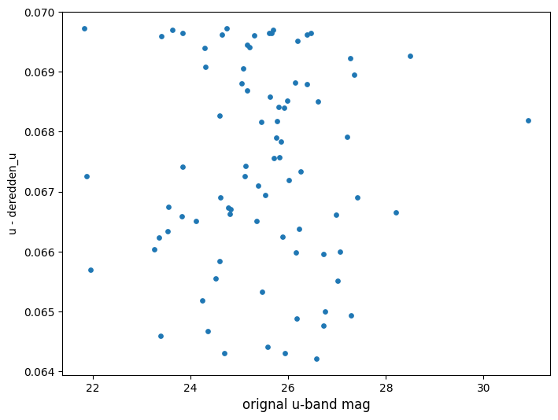

Flux to Mag And Deredden
========================

author: Sam Schmidt

last successfully run: Apr 26, 2023

.. code:: ipython3

    import matplotlib.pyplot as plt
    import os
    import tables_io
    import tempfile
    from rail.core.stage import RailStage
    from rail.core.data import TableHandle
    from rail.utils.path_utils import find_rail_file
    from rail.tools.photometry_tools import LSSTFluxToMagConverter, Dereddener

.. code:: ipython3

    DS = RailStage.data_store
    example_file = find_rail_file("examples_data/testdata/rubin_dm_dc2_example.pq")
    test_data = DS.read_file("test_data", TableHandle, example_file)

.. parsed-literal::

    column_list None

.. code:: ipython3

    test_data().info()

.. parsed-literal::

    <class 'pandas.core.frame.DataFrame'>
    RangeIndex: 100 entries, 0 to 99
    Data columns (total 15 columns):
     #   Column            Non-Null Count  Dtype  
    ---  ------            --------------  -----  
     0   objectId          100 non-null    int64  
     1   ra                100 non-null    float64
     2   decl              100 non-null    float64
     3   u_gaap1p0Flux     100 non-null    float64
     4   u_gaap1p0FluxErr  100 non-null    float64
     5   g_gaap1p0Flux     100 non-null    float64
     6   g_gaap1p0FluxErr  100 non-null    float64
     7   r_gaap1p0Flux     100 non-null    float64
     8   r_gaap1p0FluxErr  100 non-null    float64
     9   i_gaap1p0Flux     100 non-null    float64
     10  i_gaap1p0FluxErr  100 non-null    float64
     11  z_gaap1p0Flux     100 non-null    float64
     12  z_gaap1p0FluxErr  100 non-null    float64
     13  y_gaap1p0Flux     100 non-null    float64
     14  y_gaap1p0FluxErr  100 non-null    float64
    dtypes: float64(14), int64(1)
    memory usage: 11.8 KB

Fluxes to Mags
~~~~~~~~~~~~~~

To convert fluxes to mags, we need to specify patterns for the
``flux_name`` and ``flux_err_name`` columns to be converted, and the
``mag_name`` and ``mag_err_name`` columns that will store the newly
created magnitudes.

This is done as below, by specifying a string listing the bands, and
``{band}`` in the patterns where the individual bands will go. The
dictionary below duplicates the default behavior of the converter, but
is written out explicitly as an example:

.. code:: ipython3

    # convert "gaap" fluxes to magnitudes:
    ftomagdict = dict(bands = "ugrizy",
                      flux_name="{band}_gaap1p0Flux",
                      flux_err_name="{band}_gaap1p0FluxErr",
                      mag_name="mag_{band}_lsst",
                      mag_err_name="mag_err_{band}_lsst",
                      copy_cols=dict(ra='ra', dec='decl', objectId='objectId'))
    fluxToMag = LSSTFluxToMagConverter.make_stage(name='flux2mag', **ftomagdict)

.. code:: ipython3

    mags_data = fluxToMag(test_data)

.. parsed-literal::

    Inserting handle into data store.  input: None, flux2mag
    Inserting handle into data store.  output_flux2mag: inprogress_output_flux2mag.pq, flux2mag

.. parsed-literal::

    /opt/hostedtoolcache/Python/3.10.18/x64/lib/python3.10/site-packages/rail/tools/photometry_tools.py:377: RuntimeWarning: invalid value encountered in log10
      vals = -2.5*np.log10(flux_vals) + self.config.mag_offset

.. code:: ipython3

    list(mags_data().keys())

.. parsed-literal::

    ['mag_u_lsst',
     'mag_err_u_lsst',
     'mag_g_lsst',
     'mag_err_g_lsst',
     'mag_r_lsst',
     'mag_err_r_lsst',
     'mag_i_lsst',
     'mag_err_i_lsst',
     'mag_z_lsst',
     'mag_err_z_lsst',
     'mag_y_lsst',
     'mag_err_y_lsst',
     'ra',
     'dec',
     'objectId']

Deredden Mags
~~~~~~~~~~~~~

To deredden magnitudes we need to grab one of the dust maps used by the
``dustmaps`` package. We’ll grab the default Schlegel-Finkbeiner-Davis
“SFD” map. NOTE: This will download a file to your machine containing
the SFD data!

We need to feed the location of the directory containing the newly
created “sfd” maps to the stage. As we downloaded the data to the
present working directory with the command above, that directory is just
``"./"``

.. code:: ipython3

    dustmap_dir = "./"
    
    dereddener = Dereddener.make_stage(name='dereddener', dustmap_dir=dustmap_dir)
    dereddener.fetch_map()

.. parsed-literal::

    Downloading SFD data file to /home/runner/work/rail_notebooks/rail_notebooks/rail/examples/core_examples/sfd/SFD_dust_4096_ngp.fits

.. parsed-literal::

    /opt/hostedtoolcache/Python/3.10.18/x64/lib/python3.10/site-packages/dustmaps/config.py:74: ConfigWarning: Configuration file not found:
    
        /home/runner/.dustmapsrc
    
    To create a new configuration file in the default location, run the following python code:
    
        from dustmaps.config import config
        config.reset()
    
    Note that this will delete your configuration! For example, if you have specified a data directory, then dustmaps will forget about its location.
      warn(('Configuration file not found:\n\n'

.. parsed-literal::

    Downloading data to '/home/runner/work/rail_notebooks/rail_notebooks/rail/examples/core_examples/sfd/SFD_dust_4096_ngp.fits' ...
    Downloading https://dataverse.harvard.edu/api/access/datafile/2902687 ...

.. parsed-literal::

    
  0.0 B of 64.0 MiB |   0.0 s/B |                       |   0% | ETA:  --:--:--

.. parsed-literal::

    
  1.6 MiB of 64.0 MiB |  28.2 MiB/s |                   |   2% | ETA:  00:00:00

.. parsed-literal::

    
  5.7 MiB of 64.0 MiB |  47.5 MiB/s |#                  |   8% | ETA:   0:00:01

.. parsed-literal::

    
  8.1 MiB of 64.0 MiB |  47.5 MiB/s |##                 |  12% | ETA:   0:00:01

.. parsed-literal::

    
 12.2 MiB of 64.0 MiB |  51.3 MiB/s |###                |  18% | ETA:   0:00:01

.. parsed-literal::

    
 16.2 MiB of 64.0 MiB |  51.3 MiB/s |####               |  25% | ETA:   0:00:00

.. parsed-literal::

    
 20.3 MiB of 64.0 MiB |  56.5 MiB/s |######             |  31% | ETA:   0:00:00

.. parsed-literal::

    
 24.3 MiB of 64.0 MiB |  56.5 MiB/s |#######            |  37% | ETA:   0:00:00

.. parsed-literal::

    
 28.4 MiB of 64.0 MiB |  55.6 MiB/s |########           |  44% | ETA:   0:00:00

.. parsed-literal::

    
 32.4 MiB of 64.0 MiB |  55.6 MiB/s |#########          |  50% | ETA:   0:00:00

.. parsed-literal::

    
 36.5 MiB of 64.0 MiB |  55.8 MiB/s |##########         |  56% | ETA:   0:00:00

.. parsed-literal::

    
 40.5 MiB of 64.0 MiB |  55.8 MiB/s |############       |  63% | ETA:   0:00:00

.. parsed-literal::

    
 44.6 MiB of 64.0 MiB |  57.6 MiB/s |#############      |  69% | ETA:   0:00:00

.. parsed-literal::

    
 48.6 MiB of 64.0 MiB |  57.6 MiB/s |##############     |  75% | ETA:   0:00:00

.. parsed-literal::

    
 52.7 MiB of 64.0 MiB |  59.0 MiB/s |###############    |  82% | ETA:   0:00:00

.. parsed-literal::

    
 56.7 MiB of 64.0 MiB |  59.0 MiB/s |################   |  88% | ETA:   0:00:00

.. parsed-literal::

    
 60.8 MiB of 64.0 MiB |  60.0 MiB/s |################## |  94% | ETA:   0:00:00

.. parsed-literal::

    Downloading SFD data file to /home/runner/work/rail_notebooks/rail_notebooks/rail/examples/core_examples/sfd/SFD_dust_4096_sgp.fits

.. parsed-literal::

    Downloading data to '/home/runner/work/rail_notebooks/rail_notebooks/rail/examples/core_examples/sfd/SFD_dust_4096_sgp.fits' ...
    Downloading https://dataverse.harvard.edu/api/access/datafile/2902695 ...

.. parsed-literal::

    
  0.0 B of 64.0 MiB |   0.0 s/B |                       |   0% | ETA:  --:--:--

.. parsed-literal::

    
  2.4 MiB of 64.0 MiB |  42.0 MiB/s |                   |   3% | ETA:  00:00:00

.. parsed-literal::

    
  6.5 MiB of 64.0 MiB |  54.6 MiB/s |#                  |  10% | ETA:   0:00:01

.. parsed-literal::

    
  8.9 MiB of 64.0 MiB |  54.6 MiB/s |##                 |  13% | ETA:   0:00:01

.. parsed-literal::

    
 13.0 MiB of 64.0 MiB |  53.9 MiB/s |###                |  20% | ETA:   0:00:00

.. parsed-literal::

    
 17.0 MiB of 64.0 MiB |  53.9 MiB/s |#####              |  26% | ETA:   0:00:00

.. parsed-literal::

    
 21.1 MiB of 64.0 MiB |  58.1 MiB/s |######             |  32% | ETA:   0:00:00

.. parsed-literal::

    
 25.1 MiB of 64.0 MiB |  58.1 MiB/s |#######            |  39% | ETA:   0:00:00

.. parsed-literal::

    
 28.4 MiB of 64.0 MiB |  59.4 MiB/s |########           |  44% | ETA:   0:00:00

.. parsed-literal::

    
 32.4 MiB of 64.0 MiB |  59.4 MiB/s |#########          |  50% | ETA:   0:00:00

.. parsed-literal::

    
 36.5 MiB of 64.0 MiB |  60.7 MiB/s |##########         |  56% | ETA:   0:00:00

.. parsed-literal::

    
 40.5 MiB of 64.0 MiB |  60.7 MiB/s |############       |  63% | ETA:   0:00:00

.. parsed-literal::

    
 44.6 MiB of 64.0 MiB |  61.9 MiB/s |#############      |  69% | ETA:   0:00:00

.. parsed-literal::

    
 48.6 MiB of 64.0 MiB |  61.9 MiB/s |##############     |  75% | ETA:   0:00:00

.. parsed-literal::

    
 52.7 MiB of 64.0 MiB |  62.8 MiB/s |###############    |  82% | ETA:   0:00:00

.. parsed-literal::

    
 56.7 MiB of 64.0 MiB |  62.8 MiB/s |################   |  88% | ETA:   0:00:00

.. parsed-literal::

    
 60.8 MiB of 64.0 MiB |  63.3 MiB/s |################## |  94% | ETA:   0:00:00

.. code:: ipython3

    deredden_data = dereddener(mags_data)

.. parsed-literal::

    Inserting handle into data store.  output_dereddener: inprogress_output_dereddener.pq, dereddener

.. code:: ipython3

    deredden_data().keys()

.. parsed-literal::

    Index(['mag_u_lsst', 'mag_g_lsst', 'mag_r_lsst', 'mag_i_lsst', 'mag_z_lsst',
           'mag_y_lsst'],
          dtype='object')

We see that the deredden stage returns us a dictionary with the
dereddened magnitudes. Let’s plot the difference of the un-dereddened
magnitudes and the dereddened ones for u-band to see if they are,
indeed, slightly brighter:

.. code:: ipython3

    delta_u_mag = mags_data()['mag_u_lsst'] - deredden_data()['mag_u_lsst']
    plt.figure(figsize=(8,6))
    plt.scatter(mags_data()['mag_u_lsst'], delta_u_mag, s=15)
    plt.xlabel("orignal u-band mag", fontsize=12)
    plt.ylabel("u - deredden_u");

Clean up
~~~~~~~~

For cleanup, uncomment the line below to delete that SFD map directory
downloaded in this example:

.. code:: ipython3

    #! rm -rf sfd/
