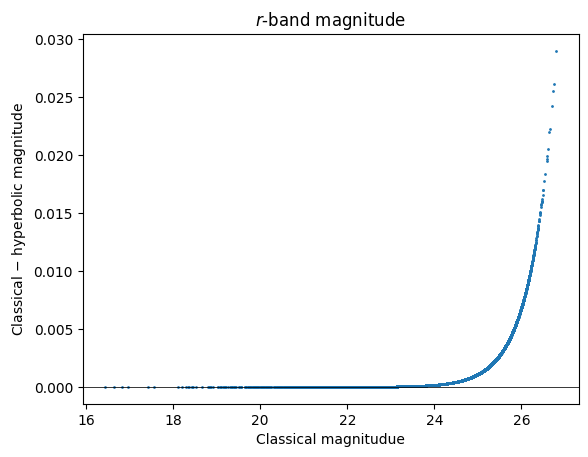

Computing Hyperbolic Magnitudes
===============================

Last successfully run: Apr 26, 2023

`Implementation <https://github.com/jlvdb/hyperbolic>`__ of Lupton et
al. (1999) by Jan Luca van den Busch.

Hyperbolic magnitudes aim to overcome limitations of classical
magnitudes, which are logarithmic in flux. Hyperbolic magnitudues are
implemented using the inverse hyperbolic sine and therefore have a
linear behaviour in flux at low signal to noise, which gradually
transitions to the classical logarithmic scaling at high signal to noise
(i.e. equivalent to classical magnitudes in this limit).

This notebooks provides an example of how to convert classical to
hyperbolical magnitudes using the pipeline stages
``HyperbolicSmoothing`` and ``HyperbolicMagnitudes`` in the
``rail.core`` module.

.. code:: ipython3

    import os
    
    import numpy as np
    import matplotlib.pyplot as plt
    
    import rail
    from rail.core.data import TableHandle
    from rail.core.stage import RailStage
    from rail.tools.photometry_tools import HyperbolicSmoothing, HyperbolicMagnitudes

We first set up a data store for interactive usage of RAIL (see the
``examples/goldenspike_examples/goldenspike.ipynb`` for further
examples).

.. code:: ipython3

    DS = RailStage.data_store
    DS.__class__.allow_overwrite = True

Next we load some DC2 sample data that provides LSST ugrizy magnitudes
and magnitude errors, which we want to convert to hyperbolic magnitudes.

.. code:: ipython3

    from rail.utils.path_utils import find_rail_file
    testFile = find_rail_file('examples_data/testdata/test_dc2_training_9816.pq')
    test_mags = DS.read_file("test_data", TableHandle, testFile)

.. parsed-literal::

    column_list None

Determining the smoothing parameters
------------------------------------

First we run the ``rail.core.HyperbolicSmoothing`` stage. This stage
computes the smoothing parameter (called :math:`b` in Lupton et
al. 1999), which determines the transition between the linear and
logarithmic behaviour of the hyperbolic magnitudes.

The **input** for this stage is a table containing magnitudes and
magnitude errors per object (fluxes are also supported as input data by
setting ``is_flux=True`` in the configuration). In this example, we
assume that the magnitude zeropoint is 0.0 and that we want to convert
all 6 LSST bands. This can be specified with the ``value_columns`` and
``error_columns`` parameters, which list the names of the magnitude
columns and their corresponding magnitude errors.

.. code:: ipython3

    lsst_bands = 'ugrizy'
    configuration = dict(
        value_columns=[f"mag_{band}_lsst" for band in lsst_bands],
        error_columns=[f"mag_err_{band}_lsst" for band in lsst_bands],
        zeropoints=[0.0] * len(lsst_bands),
        is_flux=False)
    
    smooth = HyperbolicSmoothing.make_stage(name='hyperbolic_smoothing', **configuration)
    smooth.compute(test_mags)

.. parsed-literal::

    Inserting handle into data store.  input: None, hyperbolic_smoothing
    Inserting handle into data store.  parameters_hyperbolic_smoothing: inprogress_parameters_hyperbolic_smoothing.pq, hyperbolic_smoothing

.. parsed-literal::

    /opt/hostedtoolcache/Python/3.10.18/x64/lib/python3.10/site-packages/hyperbolic/magnitudes.py:285: FutureWarning: The provided callable <function nanmedian at 0x7f598acc1870> is currently using DataFrameGroupBy.median. In a future version of pandas, the provided callable will be used directly. To keep current behavior pass the string "median" instead.
      stats = df.groupby(Keys.field).agg(np.nanmedian)
    /opt/hostedtoolcache/Python/3.10.18/x64/lib/python3.10/site-packages/hyperbolic/magnitudes.py:285: FutureWarning: The provided callable <function nanmedian at 0x7f598acc1870> is currently using DataFrameGroupBy.median. In a future version of pandas, the provided callable will be used directly. To keep current behavior pass the string "median" instead.
      stats = df.groupby(Keys.field).agg(np.nanmedian)
    /opt/hostedtoolcache/Python/3.10.18/x64/lib/python3.10/site-packages/hyperbolic/magnitudes.py:285: FutureWarning: The provided callable <function nanmedian at 0x7f598acc1870> is currently using DataFrameGroupBy.median. In a future version of pandas, the provided callable will be used directly. To keep current behavior pass the string "median" instead.
      stats = df.groupby(Keys.field).agg(np.nanmedian)
    /opt/hostedtoolcache/Python/3.10.18/x64/lib/python3.10/site-packages/hyperbolic/magnitudes.py:285: FutureWarning: The provided callable <function nanmedian at 0x7f598acc1870> is currently using DataFrameGroupBy.median. In a future version of pandas, the provided callable will be used directly. To keep current behavior pass the string "median" instead.
      stats = df.groupby(Keys.field).agg(np.nanmedian)
    /opt/hostedtoolcache/Python/3.10.18/x64/lib/python3.10/site-packages/hyperbolic/magnitudes.py:285: FutureWarning: The provided callable <function nanmedian at 0x7f598acc1870> is currently using DataFrameGroupBy.median. In a future version of pandas, the provided callable will be used directly. To keep current behavior pass the string "median" instead.
      stats = df.groupby(Keys.field).agg(np.nanmedian)
    /opt/hostedtoolcache/Python/3.10.18/x64/lib/python3.10/site-packages/hyperbolic/magnitudes.py:285: FutureWarning: The provided callable <function nanmedian at 0x7f598acc1870> is currently using DataFrameGroupBy.median. In a future version of pandas, the provided callable will be used directly. To keep current behavior pass the string "median" instead.
      stats = df.groupby(Keys.field).agg(np.nanmedian)

.. parsed-literal::

    <rail.core.data.PqHandle at 0x7f592a830e80>

The **output** of this stage is a table of relevant statistics required
to compute the hyperbolic magnitudes per filter: - the median flux error
- the zeropoint (which can be computed by comparing fluxes and
magnitudes in the original ``hyperbolic`` code) - the reference flux
:math:`f_{\rm ref}` that corresponds to the given zeropoint - the
smoothing parameter :math:`b` (in terms of the absolute and the relative
flux :math:`x = f / f_{\rm ref}`

The ``field ID`` column is currently not used by the RAIL module and can
be ignored.

.. code:: ipython3

    smooth_params = smooth.get_handle("parameters").data
    smooth_params

.. raw:: html

    

    
    <table border="1" class="dataframe">
      <thead>
        <tr style="text-align: right;">
          <th></th>
          <th></th>
          <th>flux error</th>
          <th>zeropoint</th>
          <th>ref. flux</th>
          <th>b relative</th>
          <th>b absolute</th>
        </tr>
        <tr>
          <th>filter</th>
          <th>field ID</th>
          <th></th>
          <th></th>
          <th></th>
          <th></th>
          <th></th>
        </tr>
      </thead>
      <tbody>
        <tr>
          <th>mag_u_lsst</th>
          <th>0</th>
          <td>1.559839e-11</td>
          <td>0.0</td>
          <td>1.0</td>
          <td>1.625332e-11</td>
          <td>1.625332e-11</td>
        </tr>
        <tr>
          <th>mag_g_lsst</th>
          <th>0</th>
          <td>3.286980e-12</td>
          <td>0.0</td>
          <td>1.0</td>
          <td>3.424989e-12</td>
          <td>3.424989e-12</td>
        </tr>
        <tr>
          <th>mag_r_lsst</th>
          <th>0</th>
          <td>3.052049e-12</td>
          <td>0.0</td>
          <td>1.0</td>
          <td>3.180194e-12</td>
          <td>3.180194e-12</td>
        </tr>
        <tr>
          <th>mag_i_lsst</th>
          <th>0</th>
          <td>4.441195e-12</td>
          <td>0.0</td>
          <td>1.0</td>
          <td>4.627666e-12</td>
          <td>4.627666e-12</td>
        </tr>
        <tr>
          <th>mag_z_lsst</th>
          <th>0</th>
          <td>7.823318e-12</td>
          <td>0.0</td>
          <td>1.0</td>
          <td>8.151793e-12</td>
          <td>8.151793e-12</td>
        </tr>
        <tr>
          <th>mag_y_lsst</th>
          <th>0</th>
          <td>1.785106e-11</td>
          <td>0.0</td>
          <td>1.0</td>
          <td>1.860057e-11</td>
          <td>1.860057e-11</td>
        </tr>
      </tbody>
    </table>
    

Computing the magnitudes
------------------------

Based on the smoothing parameters, the hyperbolic magnitudes are
computed with be computed by ``rail.core.HyperbolicMagnitudes``.

The **input** for this module is, again, the table with magnitudes and
magnitude errors and the output table of
``rail.core.HyperbolicSmoothing``.

.. code:: ipython3

    hypmag = HyperbolicMagnitudes.make_stage(name='hyperbolic_magnitudes', **configuration)
    hypmag.compute(test_mags, smooth_params)

.. parsed-literal::

    Inserting handle into data store.  parameters: None, hyperbolic_magnitudes
    Inserting handle into data store.  output_hyperbolic_magnitudes: inprogress_output_hyperbolic_magnitudes.pq, hyperbolic_magnitudes

.. parsed-literal::

    /opt/hostedtoolcache/Python/3.10.18/x64/lib/python3.10/site-packages/rail/tools/photometry_tools.py:295: FutureWarning: The provided callable <function nanmedian at 0x7f598acc1870> is currently using SeriesGroupBy.median. In a future version of pandas, the provided callable will be used directly. To keep current behavior pass the string "median" instead.
      hyperbolic.Keys.filter).agg(np.nanmedian)

.. parsed-literal::

    <rail.core.data.PqHandle at 0x7f592a833b80>

The **output** of this module is a table with hyperbolic magnitudes and
their corresponding error.

**Note:** The current default is to relabel the columns names by
substituting ``mag_`` by ``mag_hyp_``. If this substitution is not
possible, the column names are identical to the input table with
classical magnitudes.

.. code:: ipython3

    test_hypmags = hypmag.get_handle("output").data
    test_hypmags

.. raw:: html

    

    
    <table border="1" class="dataframe">
      <thead>
        <tr style="text-align: right;">
          <th></th>
          <th>mag_hyp_u_lsst</th>
          <th>mag_hyp_err_u_lsst</th>
          <th>mag_hyp_g_lsst</th>
          <th>mag_hyp_err_g_lsst</th>
          <th>mag_hyp_r_lsst</th>
          <th>mag_hyp_err_r_lsst</th>
          <th>mag_hyp_i_lsst</th>
          <th>mag_hyp_err_i_lsst</th>
          <th>mag_hyp_z_lsst</th>
          <th>mag_hyp_err_z_lsst</th>
          <th>mag_hyp_y_lsst</th>
          <th>mag_hyp_err_y_lsst</th>
        </tr>
      </thead>
      <tbody>
        <tr>
          <th>0</th>
          <td>18.040370</td>
          <td>0.005046</td>
          <td>16.960892</td>
          <td>0.005001</td>
          <td>16.653413</td>
          <td>0.005001</td>
          <td>16.506310</td>
          <td>0.005001</td>
          <td>16.466378</td>
          <td>0.005001</td>
          <td>16.423906</td>
          <td>0.005003</td>
        </tr>
        <tr>
          <th>1</th>
          <td>21.615533</td>
          <td>0.009551</td>
          <td>20.709402</td>
          <td>0.005084</td>
          <td>20.533851</td>
          <td>0.005048</td>
          <td>20.437566</td>
          <td>0.005075</td>
          <td>20.408885</td>
          <td>0.005193</td>
          <td>20.388203</td>
          <td>0.005804</td>
        </tr>
        <tr>
          <th>2</th>
          <td>21.851866</td>
          <td>0.011146</td>
          <td>20.437067</td>
          <td>0.005057</td>
          <td>19.709715</td>
          <td>0.005015</td>
          <td>19.312630</td>
          <td>0.005016</td>
          <td>18.953412</td>
          <td>0.005023</td>
          <td>18.770441</td>
          <td>0.005063</td>
        </tr>
        <tr>
          <th>3</th>
          <td>19.976499</td>
          <td>0.005477</td>
          <td>19.128676</td>
          <td>0.005011</td>
          <td>18.803485</td>
          <td>0.005005</td>
          <td>18.619996</td>
          <td>0.005007</td>
          <td>18.546590</td>
          <td>0.005014</td>
          <td>18.479452</td>
          <td>0.005041</td>
        </tr>
        <tr>
          <th>4</th>
          <td>22.294717</td>
          <td>0.015481</td>
          <td>21.242782</td>
          <td>0.005182</td>
          <td>20.911803</td>
          <td>0.005084</td>
          <td>20.731707</td>
          <td>0.005118</td>
          <td>20.700288</td>
          <td>0.005308</td>
          <td>20.644994</td>
          <td>0.006211</td>
        </tr>
        <tr>
          <th>...</th>
          <td>...</td>
          <td>...</td>
          <td>...</td>
          <td>...</td>
          <td>...</td>
          <td>...</td>
          <td>...</td>
          <td>...</td>
          <td>...</td>
          <td>...</td>
          <td>...</td>
          <td>...</td>
        </tr>
        <tr>
          <th>10220</th>
          <td>25.732646</td>
          <td>0.301680</td>
          <td>25.301790</td>
          <td>0.047027</td>
          <td>25.099622</td>
          <td>0.036055</td>
          <td>25.180361</td>
          <td>0.055825</td>
          <td>25.295404</td>
          <td>0.108750</td>
          <td>25.229366</td>
          <td>0.226270</td>
        </tr>
        <tr>
          <th>10221</th>
          <td>25.251545</td>
          <td>0.205102</td>
          <td>24.512358</td>
          <td>0.023323</td>
          <td>24.345662</td>
          <td>0.018623</td>
          <td>24.434138</td>
          <td>0.028559</td>
          <td>24.547622</td>
          <td>0.055349</td>
          <td>24.678486</td>
          <td>0.140864</td>
        </tr>
        <tr>
          <th>10222</th>
          <td>25.147493</td>
          <td>0.187751</td>
          <td>24.113802</td>
          <td>0.016640</td>
          <td>23.828346</td>
          <td>0.012276</td>
          <td>23.711119</td>
          <td>0.015380</td>
          <td>23.755514</td>
          <td>0.027202</td>
          <td>23.830545</td>
          <td>0.065739</td>
        </tr>
        <tr>
          <th>10223</th>
          <td>26.305978</td>
          <td>0.435503</td>
          <td>25.067304</td>
          <td>0.038089</td>
          <td>24.770026</td>
          <td>0.026890</td>
          <td>24.586800</td>
          <td>0.032711</td>
          <td>24.781555</td>
          <td>0.068406</td>
          <td>24.653411</td>
          <td>0.137773</td>
        </tr>
        <tr>
          <th>10224</th>
          <td>26.429216</td>
          <td>0.461142</td>
          <td>25.548904</td>
          <td>0.058784</td>
          <td>24.983338</td>
          <td>0.032494</td>
          <td>24.889564</td>
          <td>0.042924</td>
          <td>24.836702</td>
          <td>0.071907</td>
          <td>24.752944</td>
          <td>0.150422</td>
        </tr>
      </tbody>
    </table>
    
10225 rows × 12 columns

    

This plot shows the difference between the classical and hyperbolic
magnitude as function of the classical :math:`r`-band magnitude. The
turn-off point is determined by the value for :math:`b` estimated above.

.. code:: ipython3

    filt = "r"
    
    mag_class = test_mags.data[f"mag_{filt}_lsst"]
    magerr_class = test_mags.data[f"mag_err_{filt}_lsst"]
    mag_hyp = test_hypmags[f"mag_hyp_{filt}_lsst"]
    magerr_hyp = test_hypmags[f"mag_hyp_err_{filt}_lsst"]
    
    fig = plt.figure(dpi=100)
    plt.axhline(y=0.0, color="k", lw=0.55)
    plt.scatter(mag_class, mag_class - mag_hyp, s=1)
    plt.xlabel("Classical magnitudue")
    plt.ylabel("Classical $-$ hyperbolic magnitude")
    plt.title("$r$-band magnitude")

.. parsed-literal::

    Text(0.5, 1.0, '$r$-band magnitude')

