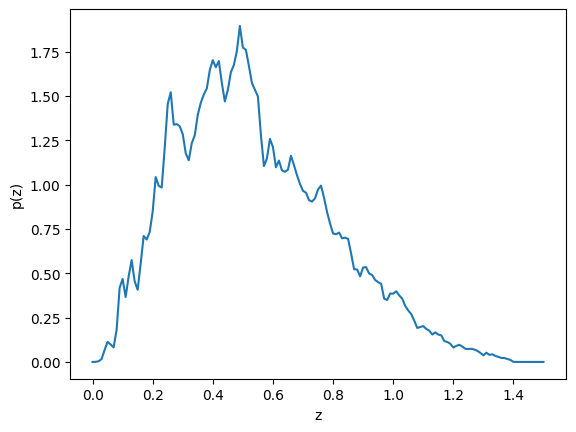

RAIL Interface demo for p(z) estimation

Author: Eric Charles

Last Successfully Run: July 24, 2024

This notebook will demonstrate how to use the rail.interfaces package to
construct an object that can estimate p(z) either for every object in an
input catalog file that contains fluxes in various bands, or from a
dictionary of numpy arrays with fluxes in band.

.. code:: ipython3

    # standard utility imports
    import matplotlib.pyplot as plt
    import numpy as np

.. code:: ipython3

    # rail-related inputs
    import qp
    from rail.utils.path_utils import find_rail_file

.. code:: ipython3

    # import the PZFactory that we will use as the interface
    from rail.interfaces import PZFactory

.. code:: ipython3

    # find a catalog file with 10 object for a quick demonstration
    input_file = find_rail_file('examples_data/testdata/validation_10gal.hdf5')

.. code:: ipython3

    help(PZFactory)

.. parsed-literal::

    Help on class PZFactory in module rail.interfaces.pz_factory:
    
    class PZFactory(builtins.object)
     |  Factory class to provide a unified interface to
     |  rail p(z) estimation algorithms.
     |  
     |  Class methods defined here:
     |  
     |  build_cat_estimator_stage(stage_name: str, class_name: str, module_name: str, model_path: str, data_path: str = 'none', **config_params: dict) -> rail.estimation.estimator.CatEstimator from builtins.type
     |      Build and configure an estimator that can evalute
     |      p(z) given an input catalog
     |      
     |      Parameters
     |      ----------
     |      stage_name: str
     |          Name of the stage instance, used to construct output file name
     |      
     |      class_name: str
     |          Name of the class, e.g., TrainZEstimator, used to find the class
     |      
     |      module_name: str
     |          Name of the python module that constains the class, used to import it
     |      
     |      model_path: str
     |          Path to the model file used by this estimator
     |      
     |      data_path: str
     |          Path to the input data, defaults to 'none'
     |      
     |      config_params: dict
     |          Configuration parameters for the stage
     |      
     |      Returns
     |      -------
     |      stage_obj: CatEstimator
     |          Newly constructed and configured Estimator instance
     |  
     |  build_stage_instance(stage_name: str, stage_class: type[rail.estimation.estimator.CatEstimator], model_path: str | dict, data_path: str = 'none', **config_params: dict) -> rail.estimation.estimator.CatEstimator from builtins.type
     |      Build and configure an estimator that can evalute
     |      p(z) given an input catalog
     |      
     |      Parameters
     |      ----------
     |      stage_name: str
     |          Name of the stage instance, used to construct output file name
     |      
     |      stage_class: type
     |          Python class for the stage
     |      
     |      model_path: str| dict
     |          Path to the model file used by this estimator, or the model itself
     |      
     |      data_path: str
     |          Path to the input data, defaults to 'none'
     |      
     |      config_params: dict
     |          Configuration parameters for the stage
     |      
     |      Returns
     |      -------
     |      stage_obj: CatEstimator
     |          Newly constructed and configured Estimator instance
     |  
     |  get_cat_estimator_stage(stage_name: str) -> rail.estimation.estimator.CatEstimator from builtins.type
     |      Return a cached p(z) estimator
     |  
     |  reset() -> None from builtins.type
     |      Reset the dictionary of cached stage objects
     |  
     |  ----------------------------------------------------------------------
     |  Static methods defined here:
     |  
     |  estimate_single_pz(stage_obj: rail.estimation.estimator.CatEstimator, data_table: dict, input_size: int = 1) -> qp.core.ensemble.Ensemble
     |      Run a p(z) estimator on some objects
     |      
     |      Parameters
     |      ----------
     |      stage_obj: CatEstimator
     |          Object that will do the estimation
     |      
     |      data_table: dict
     |          Input data presented as dict of numpy arrays objects
     |      
     |      input_size: int
     |          Number of objects in the input table
     |      
     |      Returns
     |      -------
     |      pz : qp.Ensemble
     |          Output pz
     |  
     |  run_cat_estimator_stage(stage_obj: rail.estimation.estimator.CatEstimator, data_path: str) -> rail.core.data.DataHandle
     |      Run a p(z) estimator on an input data file
     |      
     |      Parameters
     |      ----------
     |      stage_obj: CatEstimator
     |          Object that will do the estimation
     |      
     |      Returns
     |      -------
     |      data_handle: DataHandle
     |          Object that can give access to the data
     |  
     |  ----------------------------------------------------------------------
     |  Data descriptors defined here:
     |  
     |  __dict__
     |      dictionary for instance variables (if defined)
     |  
     |  __weakref__
     |      list of weak references to the object (if defined)
     |  
     |  ----------------------------------------------------------------------
     |  Data and other attributes defined here:
     |  
     |  __annotations__ = {'_stage_dict': dict[str, rail.estimation.estimator....
    

We are going to use a ``TrainZEstimator`` which just returns the same
pdf (typically the overall z distribution of the training sample) every
time.

.. code:: ipython3

    stage = PZFactory.build_cat_estimator_stage(
        stage_name = 'train_z',
        class_name = 'TrainZEstimator',
        module_name = 'rail.estimation.algos.train_z',
        model_path = 'model_inform_trainz.pkl',
        data_path = 'dummy.in',
    )

Note that we cached the stage object so that we don’t have to recreate
it each time we want it

.. code:: ipython3

    check_stage = PZFactory.get_cat_estimator_stage('train_z')
    assert check_stage == stage

Here we evalute a single p(z)

.. code:: ipython3

    out_single = PZFactory.estimate_single_pz(stage, {'d':np.array([1,1])})

.. parsed-literal::

    Inserting handle into data store.  model: model_inform_trainz.pkl, train_z
    Inserting handle into data store.  output_train_z: inprogress_output_train_z.hdf5, train_z

Note that the return object is a qp ensemble with a single pdf

.. code:: ipython3

    out_single

.. parsed-literal::

    Ensemble(the_class=interp,shape=(1, 301))

.. code:: ipython3

    out_single.npdf

.. parsed-literal::

    np.int64(1)

We can evaluate the pdf on a grid and plot the values

.. code:: ipython3

    zgrid = np.linspace(0, 1.5, 151)

.. code:: ipython3

    _ = plt.plot(zgrid, np.squeeze(out_single.pdf(zgrid)))
    _ = plt.xlabel('z')
    _ = plt.ylabel('p(z)')

Here we evaluate p(z) for all the objects in a file

.. code:: ipython3

    out_handle = PZFactory.run_cat_estimator_stage(
        stage,
        input_file,
    )

.. parsed-literal::

    Inserting handle into data store.  input: /opt/hostedtoolcache/Python/3.10.17/x64/lib/python3.10/site-packages/rail/examples_data/testdata/validation_10gal.hdf5, train_z

.. parsed-literal::

    Inserting handle into data store.  model: model_inform_trainz.pkl, train_z
    Process 0 running estimator on chunk 0 - 10
    Inserting handle into data store.  output_train_z: inprogress_output_train_z.hdf5, train_z

Note that this returns a ``DataHandle`` that we can use to access the
output data. In this case it has 10 pdfs (one for each input object)

.. code:: ipython3

    data = qp.read(out_handle.path)

.. code:: ipython3

    data.npdf

.. parsed-literal::

    np.int64(10)

Here we plot the pdf of the first object. Because train_z returns the
same pdf every time, this is identical to the one above.

.. code:: ipython3

    _ = plt.plot(zgrid, np.squeeze(data[0].pdf(zgrid)))
    _ = plt.xlabel('z')
    _ = plt.ylabel('p(z)')

Let’s clean up after ourselves

.. code:: ipython3

    import os
    try:
        os.unlink('inprogress_output_train_z.hdf5')
    except:
        pass
    try:
        os.unlink('output_train_z.hdf5')
    except:
        pass

