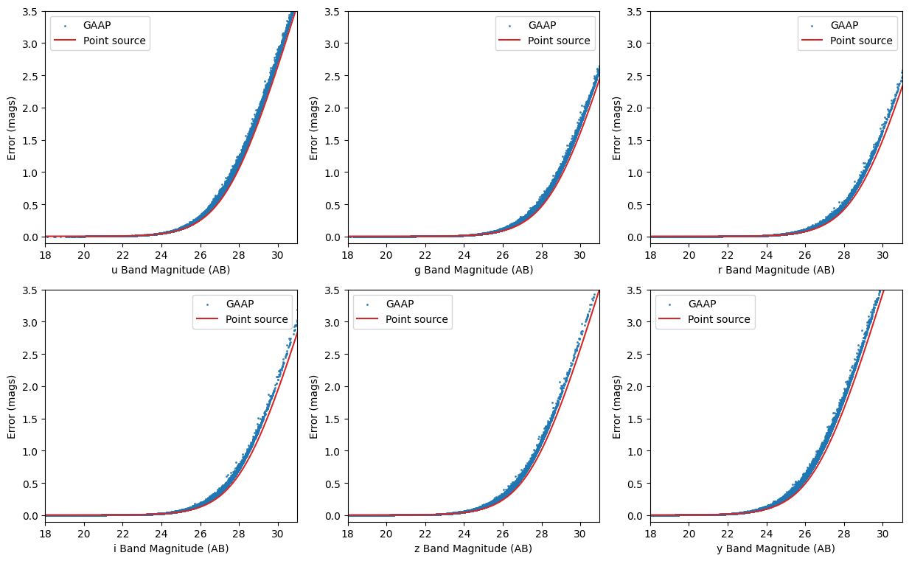
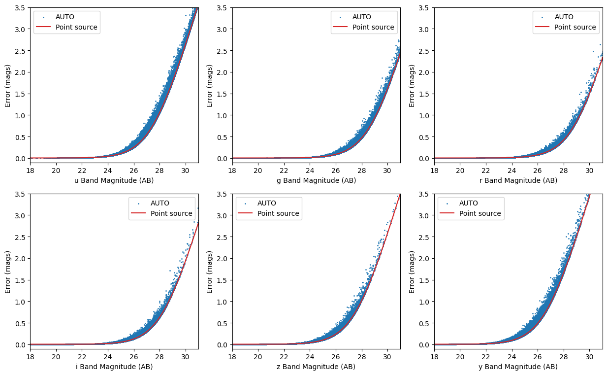

Photometric Realization from Different Magnitude Error Models
=============================================================

author: John Franklin Crenshaw, Sam Schmidt, Eric Charles, Ziang Yan

last run successfully: August 2, 2023

This notebook demonstrates how to do photometric realization from
different magnitude error models. For more completed degrader demo, see
``degradation-demo.ipynb``

.. code:: ipython3

    import matplotlib.pyplot as plt
    from pzflow.examples import get_example_flow
    from rail.creation.engines.flowEngine import FlowCreator
    from rail.creation.degraders.photometric_errors import LSSTErrorModel
    from rail.core.stage import RailStage

Specify the path to the pretrained ‘pzflow’ used to generate samples

.. code:: ipython3

    import pzflow
    import os
    
    flow_file = os.path.join(
        os.path.dirname(pzflow.__file__), "example_files", "example-flow.pzflow.pkl"
    )

“True” Engine
~~~~~~~~~~~~~

First, let’s make an Engine that has no degradation. We can use it to
generate a “true” sample, to which we can compare all the degraded
samples below.

Note: in this example, we will use a normalizing flow engine from the
`pzflow <https://github.com/jfcrenshaw/pzflow>`__ package. However,
everything in this notebook is totally agnostic to what the underlying
engine is.

The Engine is a type of RailStage object, so we can make one using the
``RailStage.make_stage`` function for the class of Engine that we want.
We then pass in the configuration parameters as arguments to
``make_stage``.

.. code:: ipython3

    n_samples = int(1e5)
    flowEngine_truth = FlowCreator.make_stage(
        name="truth", model=flow_file, n_samples=n_samples
    )

.. parsed-literal::

    Inserting handle into data store.  model: /opt/hostedtoolcache/Python/3.11.14/x64/lib/python3.11/site-packages/pzflow/example_files/example-flow.pzflow.pkl, truth

Let’s check that the Engine correctly read the underlying PZ Flow
object:

.. code:: ipython3

    flowEngine_truth.get_data("model")

.. parsed-literal::

    <pzflow.flow.Flow at 0x7f3f1b5eb090>

Now we invoke the ``sample`` method to generate some samples
~~~~~~~~~~~~~~~~~~~~~~~~~~~~~~~~~~~~~~~~~~~~~~~~~~~~~~~~~~~~

Note that this will return a ``DataHandle`` object, which can keep both
the data itself, and also the path to where the data is written. When
talking to rail stages we can use this as though it were the underlying
data and pass it as an argument. This allows the rail stages to keep
track of where their inputs are coming from.

To calculate magnitude error for extended sources, we need the
information about major and minor axes of each galaxy. Here we simply
generate random values

.. code:: ipython3

    samples_truth = flowEngine_truth.sample(n_samples, seed=0)
    
    import numpy as np
    
    samples_truth.data["major"] = np.abs(
        np.random.normal(loc=0.01, scale=0.1, size=n_samples)
    )  # add major and minor axes
    b_to_a = 1 - 0.5 * np.random.rand(n_samples)
    samples_truth.data["minor"] = samples_truth.data["major"] * b_to_a
    
    print(samples_truth())
    print("Data was written to ", samples_truth.path)

.. parsed-literal::

    Inserting handle into data store.  output_truth: inprogress_output_truth.pq, truth
           redshift          u          g          r          i          z  \
    0      1.398944  27.667536  26.723337  26.032637  25.178587  24.695955   
    1      2.285624  28.786999  27.476589  26.640175  26.259745  25.865673   
    2      1.495132  30.011349  29.789337  28.200390  26.014826  25.030174   
    3      0.842594  29.306244  28.721798  27.353018  26.256907  25.529823   
    4      1.588960  26.273870  26.115387  25.950441  25.687405  25.466606   
    ...         ...        ...        ...        ...        ...        ...   
    99995  0.389450  27.270800  26.371506  25.436853  25.077412  24.852779   
    99996  1.481047  27.478113  26.735254  26.042776  25.204935  24.825092   
    99997  2.023548  26.990147  26.714737  26.377949  26.250343  25.917370   
    99998  1.548204  26.367432  26.206884  26.087980  25.876932  25.715893   
    99999  1.739491  26.881983  26.773064  26.553123  26.319622  25.955982   
    
                   y     major     minor  
    0      23.994413  0.162690  0.135856  
    1      25.391064  0.209819  0.110239  
    2      24.304707  0.115458  0.065435  
    3      25.291103  0.141062  0.124644  
    4      25.096743  0.163102  0.138401  
    ...          ...       ...       ...  
    99995  24.737946  0.057698  0.055367  
    99996  24.224169  0.148238  0.135486  
    99997  25.613836  0.011595  0.010050  
    99998  25.274899  0.061435  0.046573  
    99999  25.699642  0.038934  0.033766  
    
    [100000 rows x 9 columns]
    Data was written to  output_truth.pq

LSSTErrorModel
~~~~~~~~~~~~~~

Now, we will demonstrate the ``LSSTErrorModel``, which adds photometric
errors using a model similar to the model from `Ivezic et
al. 2019 <https://arxiv.org/abs/0805.2366>`__ (specifically, it uses the
model from this paper, without making the high SNR assumption. To
restore this assumption and therefore use the exact model from the
paper, set ``highSNR=True``.)

Let’s create an error model with the default settings for point sources:

.. code:: ipython3

    errorModel = LSSTErrorModel.make_stage(name="error_model")

For extended sources:

.. code:: ipython3

    errorModel_auto = LSSTErrorModel.make_stage(
        name="error_model_auto", extendedType="auto"
    )

.. code:: ipython3

    errorModel_gaap = LSSTErrorModel.make_stage(
        name="error_model_gaap", extendedType="gaap"
    )

Now let’s add this error model as a degrader and draw some samples with
photometric errors.

.. code:: ipython3

    samples_w_errs = errorModel(samples_truth)
    samples_w_errs()

.. parsed-literal::

    Inserting handle into data store.  output_truth: None, error_model
    Inserting handle into data store.  output_error_model: inprogress_output_error_model.pq, error_model

.. raw:: html

    

    
    <table border="1" class="dataframe">
      <thead>
        <tr style="text-align: right;">
          <th></th>
          <th>redshift</th>
          <th>u</th>
          <th>u_err</th>
          <th>g</th>
          <th>g_err</th>
          <th>r</th>
          <th>r_err</th>
          <th>i</th>
          <th>i_err</th>
          <th>z</th>
          <th>z_err</th>
          <th>y</th>
          <th>y_err</th>
          <th>major</th>
          <th>minor</th>
        </tr>
      </thead>
      <tbody>
        <tr>
          <th>0</th>
          <td>1.398944</td>
          <td>27.066238</td>
          <td>0.575443</td>
          <td>26.642068</td>
          <td>0.156458</td>
          <td>25.881807</td>
          <td>0.071025</td>
          <td>25.278832</td>
          <td>0.067984</td>
          <td>24.715857</td>
          <td>0.079016</td>
          <td>24.088970</td>
          <td>0.102179</td>
          <td>0.162690</td>
          <td>0.135856</td>
        </tr>
        <tr>
          <th>1</th>
          <td>2.285624</td>
          <td>27.163818</td>
          <td>0.616615</td>
          <td>27.845043</td>
          <td>0.417244</td>
          <td>26.519794</td>
          <td>0.124322</td>
          <td>26.575587</td>
          <td>0.209124</td>
          <td>25.888282</td>
          <td>0.217241</td>
          <td>24.905293</td>
          <td>0.205973</td>
          <td>0.209819</td>
          <td>0.110239</td>
        </tr>
        <tr>
          <th>2</th>
          <td>1.495132</td>
          <td>inf</td>
          <td>inf</td>
          <td>27.991806</td>
          <td>0.466225</td>
          <td>27.890304</td>
          <td>0.386756</td>
          <td>26.126608</td>
          <td>0.142810</td>
          <td>25.151235</td>
          <td>0.115766</td>
          <td>24.733469</td>
          <td>0.178200</td>
          <td>0.115458</td>
          <td>0.065435</td>
        </tr>
        <tr>
          <th>3</th>
          <td>0.842594</td>
          <td>28.967205</td>
          <td>1.752275</td>
          <td>31.412105</td>
          <td>2.826768</td>
          <td>27.069540</td>
          <td>0.198924</td>
          <td>26.301671</td>
          <td>0.165921</td>
          <td>25.489251</td>
          <td>0.155025</td>
          <td>24.825107</td>
          <td>0.192553</td>
          <td>0.141062</td>
          <td>0.124644</td>
        </tr>
        <tr>
          <th>4</th>
          <td>1.588960</td>
          <td>26.041697</td>
          <td>0.261610</td>
          <td>26.079132</td>
          <td>0.096044</td>
          <td>25.861282</td>
          <td>0.069746</td>
          <td>25.649405</td>
          <td>0.094276</td>
          <td>25.286650</td>
          <td>0.130208</td>
          <td>24.998741</td>
          <td>0.222682</td>
          <td>0.163102</td>
          <td>0.138401</td>
        </tr>
        <tr>
          <th>...</th>
          <td>...</td>
          <td>...</td>
          <td>...</td>
          <td>...</td>
          <td>...</td>
          <td>...</td>
          <td>...</td>
          <td>...</td>
          <td>...</td>
          <td>...</td>
          <td>...</td>
          <td>...</td>
          <td>...</td>
          <td>...</td>
          <td>...</td>
        </tr>
        <tr>
          <th>99995</th>
          <td>0.389450</td>
          <td>30.041599</td>
          <td>2.681474</td>
          <td>26.313391</td>
          <td>0.117836</td>
          <td>25.430377</td>
          <td>0.047588</td>
          <td>25.049664</td>
          <td>0.055480</td>
          <td>24.710444</td>
          <td>0.078639</td>
          <td>24.632207</td>
          <td>0.163493</td>
          <td>0.057698</td>
          <td>0.055367</td>
        </tr>
        <tr>
          <th>99996</th>
          <td>1.481047</td>
          <td>27.028263</td>
          <td>0.559996</td>
          <td>26.454752</td>
          <td>0.133189</td>
          <td>26.031421</td>
          <td>0.081064</td>
          <td>25.126222</td>
          <td>0.059381</td>
          <td>24.905884</td>
          <td>0.093408</td>
          <td>24.107943</td>
          <td>0.103889</td>
          <td>0.148238</td>
          <td>0.135486</td>
        </tr>
        <tr>
          <th>99997</th>
          <td>2.023548</td>
          <td>27.181535</td>
          <td>0.624320</td>
          <td>26.568664</td>
          <td>0.146919</td>
          <td>26.298157</td>
          <td>0.102482</td>
          <td>26.382103</td>
          <td>0.177667</td>
          <td>25.585632</td>
          <td>0.168325</td>
          <td>25.376292</td>
          <td>0.303242</td>
          <td>0.011595</td>
          <td>0.010050</td>
        </tr>
        <tr>
          <th>99998</th>
          <td>1.548204</td>
          <td>27.087592</td>
          <td>0.584270</td>
          <td>26.263822</td>
          <td>0.112863</td>
          <td>25.974812</td>
          <td>0.077112</td>
          <td>25.892850</td>
          <td>0.116642</td>
          <td>25.924262</td>
          <td>0.223846</td>
          <td>26.171899</td>
          <td>0.556910</td>
          <td>0.061435</td>
          <td>0.046573</td>
        </tr>
        <tr>
          <th>99999</th>
          <td>1.739491</td>
          <td>26.161538</td>
          <td>0.288337</td>
          <td>26.652706</td>
          <td>0.157888</td>
          <td>26.494857</td>
          <td>0.121660</td>
          <td>26.464840</td>
          <td>0.190546</td>
          <td>25.827000</td>
          <td>0.206397</td>
          <td>26.305389</td>
          <td>0.612443</td>
          <td>0.038934</td>
          <td>0.033766</td>
        </tr>
      </tbody>
    </table>
    
100000 rows × 15 columns

    

.. code:: ipython3

    samples_w_errs_gaap = errorModel_gaap(samples_truth)
    samples_w_errs_gaap.data

.. parsed-literal::

    Inserting handle into data store.  output_truth: None, error_model_gaap

.. parsed-literal::

    Inserting handle into data store.  output_error_model_gaap: inprogress_output_error_model_gaap.pq, error_model_gaap

.. raw:: html

    

    
    <table border="1" class="dataframe">
      <thead>
        <tr style="text-align: right;">
          <th></th>
          <th>redshift</th>
          <th>u</th>
          <th>u_err</th>
          <th>g</th>
          <th>g_err</th>
          <th>r</th>
          <th>r_err</th>
          <th>i</th>
          <th>i_err</th>
          <th>z</th>
          <th>z_err</th>
          <th>y</th>
          <th>y_err</th>
          <th>major</th>
          <th>minor</th>
        </tr>
      </thead>
      <tbody>
        <tr>
          <th>0</th>
          <td>1.398944</td>
          <td>inf</td>
          <td>inf</td>
          <td>26.774514</td>
          <td>0.213620</td>
          <td>25.924146</td>
          <td>0.093124</td>
          <td>25.237472</td>
          <td>0.083602</td>
          <td>24.721400</td>
          <td>0.100204</td>
          <td>24.001400</td>
          <td>0.120111</td>
          <td>0.162690</td>
          <td>0.135856</td>
        </tr>
        <tr>
          <th>1</th>
          <td>2.285624</td>
          <td>26.824874</td>
          <td>0.562222</td>
          <td>27.636709</td>
          <td>0.430933</td>
          <td>26.850198</td>
          <td>0.209419</td>
          <td>26.028050</td>
          <td>0.168483</td>
          <td>25.867818</td>
          <td>0.269157</td>
          <td>25.992402</td>
          <td>0.602173</td>
          <td>0.209819</td>
          <td>0.110239</td>
        </tr>
        <tr>
          <th>2</th>
          <td>1.495132</td>
          <td>26.577488</td>
          <td>0.451675</td>
          <td>27.943235</td>
          <td>0.518529</td>
          <td>28.056983</td>
          <td>0.516347</td>
          <td>25.864348</td>
          <td>0.138383</td>
          <td>25.150933</td>
          <td>0.139629</td>
          <td>24.778196</td>
          <td>0.223266</td>
          <td>0.115458</td>
          <td>0.065435</td>
        </tr>
        <tr>
          <th>3</th>
          <td>0.842594</td>
          <td>26.879471</td>
          <td>0.573992</td>
          <td>27.287880</td>
          <td>0.320968</td>
          <td>27.205349</td>
          <td>0.273377</td>
          <td>26.252383</td>
          <td>0.198068</td>
          <td>25.354893</td>
          <td>0.170860</td>
          <td>25.109169</td>
          <td>0.300598</td>
          <td>0.141062</td>
          <td>0.124644</td>
        </tr>
        <tr>
          <th>4</th>
          <td>1.588960</td>
          <td>25.986816</td>
          <td>0.293590</td>
          <td>26.217458</td>
          <td>0.133208</td>
          <td>25.987253</td>
          <td>0.098546</td>
          <td>25.561087</td>
          <td>0.111171</td>
          <td>25.539704</td>
          <td>0.202684</td>
          <td>24.932751</td>
          <td>0.264350</td>
          <td>0.163102</td>
          <td>0.138401</td>
        </tr>
        <tr>
          <th>...</th>
          <td>...</td>
          <td>...</td>
          <td>...</td>
          <td>...</td>
          <td>...</td>
          <td>...</td>
          <td>...</td>
          <td>...</td>
          <td>...</td>
          <td>...</td>
          <td>...</td>
          <td>...</td>
          <td>...</td>
          <td>...</td>
          <td>...</td>
        </tr>
        <tr>
          <th>99995</th>
          <td>0.389450</td>
          <td>28.434147</td>
          <td>1.451681</td>
          <td>26.476944</td>
          <td>0.157628</td>
          <td>25.463042</td>
          <td>0.058330</td>
          <td>24.987221</td>
          <td>0.062949</td>
          <td>24.897891</td>
          <td>0.110128</td>
          <td>24.573586</td>
          <td>0.184759</td>
          <td>0.057698</td>
          <td>0.055367</td>
        </tr>
        <tr>
          <th>99996</th>
          <td>1.481047</td>
          <td>28.327933</td>
          <td>1.408312</td>
          <td>26.722943</td>
          <td>0.203418</td>
          <td>26.068393</td>
          <td>0.104965</td>
          <td>25.203382</td>
          <td>0.080568</td>
          <td>24.846118</td>
          <td>0.111001</td>
          <td>24.221467</td>
          <td>0.144304</td>
          <td>0.148238</td>
          <td>0.135486</td>
        </tr>
        <tr>
          <th>99997</th>
          <td>2.023548</td>
          <td>26.068443</td>
          <td>0.297985</td>
          <td>26.432679</td>
          <td>0.150388</td>
          <td>26.385042</td>
          <td>0.129784</td>
          <td>26.405880</td>
          <td>0.213069</td>
          <td>26.056893</td>
          <td>0.290190</td>
          <td>inf</td>
          <td>inf</td>
          <td>0.011595</td>
          <td>0.010050</td>
        </tr>
        <tr>
          <th>99998</th>
          <td>1.548204</td>
          <td>25.667743</td>
          <td>0.216148</td>
          <td>26.366461</td>
          <td>0.143289</td>
          <td>26.195034</td>
          <td>0.111085</td>
          <td>25.754672</td>
          <td>0.123461</td>
          <td>25.606135</td>
          <td>0.201971</td>
          <td>25.791405</td>
          <td>0.488622</td>
          <td>0.061435</td>
          <td>0.046573</td>
        </tr>
        <tr>
          <th>99999</th>
          <td>1.739491</td>
          <td>25.754388</td>
          <td>0.231331</td>
          <td>27.426943</td>
          <td>0.343357</td>
          <td>26.718753</td>
          <td>0.173497</td>
          <td>26.198354</td>
          <td>0.179664</td>
          <td>25.960914</td>
          <td>0.269473</td>
          <td>26.278609</td>
          <td>0.688185</td>
          <td>0.038934</td>
          <td>0.033766</td>
        </tr>
      </tbody>
    </table>
    
100000 rows × 15 columns

    

.. code:: ipython3

    samples_w_errs_auto = errorModel_auto(samples_truth)
    samples_w_errs_auto.data

.. parsed-literal::

    Inserting handle into data store.  output_truth: None, error_model_auto

.. parsed-literal::

    Inserting handle into data store.  output_error_model_auto: inprogress_output_error_model_auto.pq, error_model_auto

.. raw:: html

    

    
    <table border="1" class="dataframe">
      <thead>
        <tr style="text-align: right;">
          <th></th>
          <th>redshift</th>
          <th>u</th>
          <th>u_err</th>
          <th>g</th>
          <th>g_err</th>
          <th>r</th>
          <th>r_err</th>
          <th>i</th>
          <th>i_err</th>
          <th>z</th>
          <th>z_err</th>
          <th>y</th>
          <th>y_err</th>
          <th>major</th>
          <th>minor</th>
        </tr>
      </thead>
      <tbody>
        <tr>
          <th>0</th>
          <td>1.398944</td>
          <td>26.907053</td>
          <td>0.591655</td>
          <td>26.462687</td>
          <td>0.164596</td>
          <td>25.967696</td>
          <td>0.096996</td>
          <td>25.278338</td>
          <td>0.086889</td>
          <td>24.751506</td>
          <td>0.103140</td>
          <td>24.017147</td>
          <td>0.122075</td>
          <td>0.162690</td>
          <td>0.135856</td>
        </tr>
        <tr>
          <th>1</th>
          <td>2.285624</td>
          <td>26.728788</td>
          <td>0.531769</td>
          <td>27.362131</td>
          <td>0.354062</td>
          <td>26.627168</td>
          <td>0.176617</td>
          <td>26.207385</td>
          <td>0.199583</td>
          <td>26.403237</td>
          <td>0.417829</td>
          <td>25.667775</td>
          <td>0.483140</td>
          <td>0.209819</td>
          <td>0.110239</td>
        </tr>
        <tr>
          <th>2</th>
          <td>1.495132</td>
          <td>inf</td>
          <td>inf</td>
          <td>inf</td>
          <td>inf</td>
          <td>27.639408</td>
          <td>0.348798</td>
          <td>26.329587</td>
          <td>0.188729</td>
          <td>25.022192</td>
          <td>0.114723</td>
          <td>24.373049</td>
          <td>0.145472</td>
          <td>0.115458</td>
          <td>0.065435</td>
        </tr>
        <tr>
          <th>3</th>
          <td>0.842594</td>
          <td>inf</td>
          <td>inf</td>
          <td>28.359982</td>
          <td>0.698049</td>
          <td>27.133517</td>
          <td>0.252167</td>
          <td>26.394644</td>
          <td>0.217965</td>
          <td>25.509955</td>
          <td>0.190434</td>
          <td>26.340862</td>
          <td>0.734116</td>
          <td>0.141062</td>
          <td>0.124644</td>
        </tr>
        <tr>
          <th>4</th>
          <td>1.588960</td>
          <td>26.357180</td>
          <td>0.394558</td>
          <td>26.100333</td>
          <td>0.120910</td>
          <td>25.963256</td>
          <td>0.096969</td>
          <td>25.535939</td>
          <td>0.109303</td>
          <td>25.790751</td>
          <td>0.250816</td>
          <td>25.556471</td>
          <td>0.434403</td>
          <td>0.163102</td>
          <td>0.138401</td>
        </tr>
        <tr>
          <th>...</th>
          <td>...</td>
          <td>...</td>
          <td>...</td>
          <td>...</td>
          <td>...</td>
          <td>...</td>
          <td>...</td>
          <td>...</td>
          <td>...</td>
          <td>...</td>
          <td>...</td>
          <td>...</td>
          <td>...</td>
          <td>...</td>
          <td>...</td>
        </tr>
        <tr>
          <th>99995</th>
          <td>0.389450</td>
          <td>27.208475</td>
          <td>0.650996</td>
          <td>26.191599</td>
          <td>0.109866</td>
          <td>25.488008</td>
          <td>0.052243</td>
          <td>25.133222</td>
          <td>0.062445</td>
          <td>24.714341</td>
          <td>0.082277</td>
          <td>24.810879</td>
          <td>0.198292</td>
          <td>0.057698</td>
          <td>0.055367</td>
        </tr>
        <tr>
          <th>99996</th>
          <td>1.481047</td>
          <td>26.739318</td>
          <td>0.518040</td>
          <td>26.406068</td>
          <td>0.154258</td>
          <td>26.042995</td>
          <td>0.101710</td>
          <td>25.204914</td>
          <td>0.079901</td>
          <td>24.868479</td>
          <td>0.112144</td>
          <td>24.111607</td>
          <td>0.130031</td>
          <td>0.148238</td>
          <td>0.135486</td>
        </tr>
        <tr>
          <th>99997</th>
          <td>2.023548</td>
          <td>inf</td>
          <td>inf</td>
          <td>26.957718</td>
          <td>0.204679</td>
          <td>26.484124</td>
          <td>0.120721</td>
          <td>26.212839</td>
          <td>0.154042</td>
          <td>25.830870</td>
          <td>0.207382</td>
          <td>26.005376</td>
          <td>0.493838</td>
          <td>0.011595</td>
          <td>0.010050</td>
        </tr>
        <tr>
          <th>99998</th>
          <td>1.548204</td>
          <td>26.529471</td>
          <td>0.395047</td>
          <td>26.351137</td>
          <td>0.125886</td>
          <td>26.337484</td>
          <td>0.110229</td>
          <td>25.747107</td>
          <td>0.106940</td>
          <td>25.575850</td>
          <td>0.173292</td>
          <td>25.211876</td>
          <td>0.275502</td>
          <td>0.061435</td>
          <td>0.046573</td>
        </tr>
        <tr>
          <th>99999</th>
          <td>1.739491</td>
          <td>26.162892</td>
          <td>0.291939</td>
          <td>26.993308</td>
          <td>0.213692</td>
          <td>26.609458</td>
          <td>0.136719</td>
          <td>26.188327</td>
          <td>0.153349</td>
          <td>25.967534</td>
          <td>0.235928</td>
          <td>25.968192</td>
          <td>0.487245</td>
          <td>0.038934</td>
          <td>0.033766</td>
        </tr>
      </tbody>
    </table>
    
100000 rows × 15 columns

    

Notice some of the magnitudes are inf’s. These are non-detections
(i.e. the noisy flux was negative). You can change the nSigma limit for
non-detections by setting ``sigLim=...``. For example, if ``sigLim=5``,
then all fluxes with ``SNR<5`` are flagged as non-detections.

Let’s plot the error as a function of magnitude

.. code:: ipython3

    %matplotlib inline
    
    fig, axes_ = plt.subplots(ncols=3, nrows=2, figsize=(15, 9), dpi=100)
    axes = axes_.reshape(-1)
    for i, band in enumerate("ugrizy"):
        ax = axes[i]
        # pull out the magnitudes and errors
        mags = samples_w_errs.data[band].to_numpy()
        errs = samples_w_errs.data[band + "_err"].to_numpy()
        
        # sort them by magnitude
        mags, errs = mags[mags.argsort()], errs[mags.argsort()]
        
        # plot errs vs mags
        #ax.plot(mags, errs, label=band) 
        
        #plt.plot(mags, errs, c='C'+str(i))
        ax.scatter(samples_w_errs_gaap.data[band].to_numpy(),
                samples_w_errs_gaap.data[band + "_err"].to_numpy(),
                    s=5, marker='.', color='C0', alpha=0.8, label='GAAP')
        
        ax.plot(mags, errs, color='C3', label='Point source')
        
        
        ax.legend()
        ax.set_xlim(18, 31)
        ax.set_ylim(-0.1, 3.5)
        ax.set(xlabel=band+" Band Magnitude (AB)", ylabel="Error (mags)")

.. code:: ipython3

    %matplotlib inline
    
    fig, axes_ = plt.subplots(ncols=3, nrows=2, figsize=(15, 9), dpi=100)
    axes = axes_.reshape(-1)
    for i, band in enumerate("ugrizy"):
        ax = axes[i]
        # pull out the magnitudes and errors
        mags = samples_w_errs.data[band].to_numpy()
        errs = samples_w_errs.data[band + "_err"].to_numpy()
        
        # sort them by magnitude
        mags, errs = mags[mags.argsort()], errs[mags.argsort()]
        
        # plot errs vs mags
        #ax.plot(mags, errs, label=band) 
        
        #plt.plot(mags, errs, c='C'+str(i))
        ax.scatter(samples_w_errs_auto.data[band].to_numpy(),
                samples_w_errs_auto.data[band + "_err"].to_numpy(),
                    s=5, marker='.', color='C0', alpha=0.8, label='AUTO')
        
        ax.plot(mags, errs, color='C3', label='Point source')
        
        
        ax.legend()
        ax.set_xlim(18, 31)
        ax.set_ylim(-0.1, 3.5)
        ax.set(xlabel=band+" Band Magnitude (AB)", ylabel="Error (mags)")

You can see that the photometric error increases as magnitude gets
dimmer, just like you would expect, and that the extended source errors
are greater than the point source errors. The extended source errors are
also scattered, because the galaxies have random sizes.

Also, you can find the GAaP and AUTO magnitude error are scattered due
to variable galaxy sizes. Also, you can find that there are gaps between
GAAP magnitude error and point souce magnitude error, this is because
the additional factors due to aperture sizes have a minimum value of
:math:`\sqrt{(\sigma^2+A_{\mathrm{min}})/\sigma^2}`, where
:math:`\sigma` is the width of the beam, :math:`A_{\min}` is an offset
of the aperture sizes (taken to be 0.7 arcmin here).

You can also see that there are *very* faint galaxies in this sample.
That’s because, by default, the error model returns magnitudes for all
positive fluxes. If you want these galaxies flagged as non-detections
instead, you can set e.g. ``sigLim=5``, and everything with ``SNR<5``
will be flagged as a non-detection.
