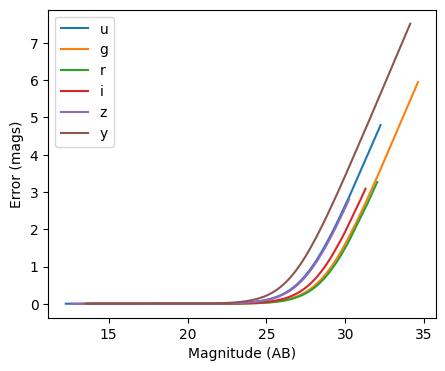
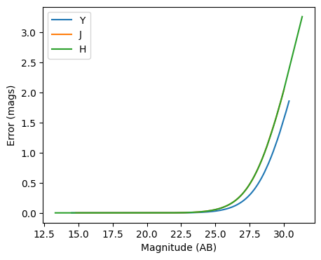
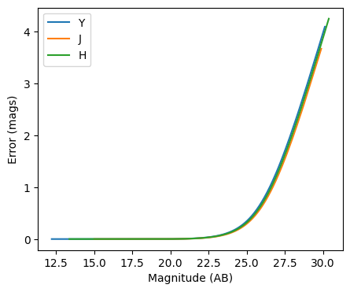

Photometric error stage demo
----------------------------

author: Tianqing Zhang, John-Franklin Crenshaw

This notebook demonstrate the use of
``rail.creation.degraders.photometric_errors``, which adds column for
the photometric noise to the catalog based on the package PhotErr
developed by John-Franklin Crenshaw. The RAIL stage PhotoErrorModel
inherit from the Noisifier base classes, and the LSST, Roman, Euclid
child classes inherit from the PhotoErrorModel

.. code:: ipython3

    
    from rail.creation.degraders.photometric_errors import LSSTErrorModel
    from rail.creation.degraders.photometric_errors import RomanErrorModel
    from rail.creation.degraders.photometric_errors import EuclidErrorModel
    
    from rail.core.data import PqHandle
    from rail.core.stage import RailStage
    
    import matplotlib.pyplot as plt
    import pandas as pd
    import numpy as np
    

.. code:: ipython3

    DS = RailStage.data_store
    DS.__class__.allow_overwrite = True

Create a random catalog with ugrizy+YJHF bands as the the true input
~~~~~~~~~~~~~~~~~~~~~~~~~~~~~~~~~~~~~~~~~~~~~~~~~~~~~~~~~~~~~~~~~~~~

.. code:: ipython3

    data = np.random.normal(23, 3, size = (1000,9))
    
    data_df = pd.DataFrame(data=data,    # values
                columns=['u', 'g', 'r', 'i', 'z', 'y', 'Y', 'J', 'H'])
    data_truth = PqHandle('input')
    data_truth.set_data(data_df)

.. code:: ipython3

    data_df

.. raw:: html

    

    
    <table border="1" class="dataframe">
      <thead>
        <tr style="text-align: right;">
          <th></th>
          <th>u</th>
          <th>g</th>
          <th>r</th>
          <th>i</th>
          <th>z</th>
          <th>y</th>
          <th>Y</th>
          <th>J</th>
          <th>H</th>
        </tr>
      </thead>
      <tbody>
        <tr>
          <th>0</th>
          <td>23.296868</td>
          <td>21.372165</td>
          <td>23.129378</td>
          <td>23.547751</td>
          <td>23.637597</td>
          <td>24.088024</td>
          <td>23.664406</td>
          <td>25.891604</td>
          <td>22.716392</td>
        </tr>
        <tr>
          <th>1</th>
          <td>18.387577</td>
          <td>19.642973</td>
          <td>21.845863</td>
          <td>21.826431</td>
          <td>20.065133</td>
          <td>18.334426</td>
          <td>21.314626</td>
          <td>23.531855</td>
          <td>15.067736</td>
        </tr>
        <tr>
          <th>2</th>
          <td>25.112539</td>
          <td>17.686959</td>
          <td>22.640016</td>
          <td>20.897705</td>
          <td>24.186874</td>
          <td>28.163404</td>
          <td>23.557415</td>
          <td>28.157336</td>
          <td>24.990359</td>
        </tr>
        <tr>
          <th>3</th>
          <td>27.929834</td>
          <td>22.050617</td>
          <td>26.020645</td>
          <td>22.243239</td>
          <td>27.582575</td>
          <td>18.673629</td>
          <td>28.165670</td>
          <td>29.059815</td>
          <td>28.162429</td>
        </tr>
        <tr>
          <th>4</th>
          <td>26.974070</td>
          <td>22.322648</td>
          <td>25.485961</td>
          <td>29.531308</td>
          <td>21.669840</td>
          <td>19.127237</td>
          <td>22.791350</td>
          <td>24.327182</td>
          <td>20.628717</td>
        </tr>
        <tr>
          <th>...</th>
          <td>...</td>
          <td>...</td>
          <td>...</td>
          <td>...</td>
          <td>...</td>
          <td>...</td>
          <td>...</td>
          <td>...</td>
          <td>...</td>
        </tr>
        <tr>
          <th>995</th>
          <td>21.134721</td>
          <td>25.100776</td>
          <td>24.834978</td>
          <td>23.524748</td>
          <td>24.937046</td>
          <td>20.998132</td>
          <td>23.231618</td>
          <td>23.445347</td>
          <td>24.916288</td>
        </tr>
        <tr>
          <th>996</th>
          <td>15.338537</td>
          <td>22.570571</td>
          <td>20.159275</td>
          <td>21.504612</td>
          <td>23.261767</td>
          <td>20.728805</td>
          <td>20.203252</td>
          <td>26.119573</td>
          <td>21.661863</td>
        </tr>
        <tr>
          <th>997</th>
          <td>22.956950</td>
          <td>25.542518</td>
          <td>24.346915</td>
          <td>20.829873</td>
          <td>25.974995</td>
          <td>22.567798</td>
          <td>27.473035</td>
          <td>25.281633</td>
          <td>24.341706</td>
        </tr>
        <tr>
          <th>998</th>
          <td>25.865833</td>
          <td>21.460610</td>
          <td>17.680786</td>
          <td>22.667438</td>
          <td>21.558976</td>
          <td>22.848819</td>
          <td>19.589174</td>
          <td>26.285601</td>
          <td>21.778311</td>
        </tr>
        <tr>
          <th>999</th>
          <td>23.598762</td>
          <td>20.414130</td>
          <td>26.329241</td>
          <td>21.083513</td>
          <td>17.754524</td>
          <td>23.547902</td>
          <td>19.548325</td>
          <td>19.204555</td>
          <td>27.586500</td>
        </tr>
      </tbody>
    </table>
    
1000 rows × 9 columns

    

The LSST error model adds noise to the optical bands
~~~~~~~~~~~~~~~~~~~~~~~~~~~~~~~~~~~~~~~~~~~~~~~~~~~~

.. code:: ipython3

    errorModel_lsst = LSSTErrorModel.make_stage(name="error_model")
    
    samples_w_errs = errorModel_lsst(data_truth)
    samples_w_errs()

.. parsed-literal::

    Inserting handle into data store.  input: None, error_model
    Inserting handle into data store.  output_error_model: inprogress_output_error_model.pq, error_model

.. raw:: html

    

    
    <table border="1" class="dataframe">
      <thead>
        <tr style="text-align: right;">
          <th></th>
          <th>u</th>
          <th>u_err</th>
          <th>g</th>
          <th>g_err</th>
          <th>r</th>
          <th>r_err</th>
          <th>i</th>
          <th>i_err</th>
          <th>z</th>
          <th>z_err</th>
          <th>y</th>
          <th>y_err</th>
          <th>Y</th>
          <th>J</th>
          <th>H</th>
        </tr>
      </thead>
      <tbody>
        <tr>
          <th>0</th>
          <td>23.294670</td>
          <td>0.024431</td>
          <td>21.376028</td>
          <td>0.005252</td>
          <td>23.121193</td>
          <td>0.007748</td>
          <td>23.563785</td>
          <td>0.015306</td>
          <td>23.586582</td>
          <td>0.029086</td>
          <td>24.015238</td>
          <td>0.095785</td>
          <td>23.664406</td>
          <td>25.891604</td>
          <td>22.716392</td>
        </tr>
        <tr>
          <th>1</th>
          <td>18.379705</td>
          <td>0.005042</td>
          <td>19.648657</td>
          <td>0.005025</td>
          <td>21.844565</td>
          <td>0.005370</td>
          <td>21.826729</td>
          <td>0.005875</td>
          <td>20.064959</td>
          <td>0.005171</td>
          <td>18.336286</td>
          <td>0.005051</td>
          <td>21.314626</td>
          <td>23.531855</td>
          <td>15.067736</td>
        </tr>
        <tr>
          <th>2</th>
          <td>25.083455</td>
          <td>0.116410</td>
          <td>17.689840</td>
          <td>0.005003</td>
          <td>22.631039</td>
          <td>0.006305</td>
          <td>20.895947</td>
          <td>0.005196</td>
          <td>24.243500</td>
          <td>0.051995</td>
          <td>27.475706</td>
          <td>1.271820</td>
          <td>23.557415</td>
          <td>28.157336</td>
          <td>24.990359</td>
        </tr>
        <tr>
          <th>3</th>
          <td>28.707034</td>
          <td>1.549152</td>
          <td>22.054205</td>
          <td>0.005710</td>
          <td>25.984985</td>
          <td>0.077808</td>
          <td>22.238124</td>
          <td>0.006673</td>
          <td>27.252291</td>
          <td>0.624449</td>
          <td>18.675224</td>
          <td>0.005083</td>
          <td>28.165670</td>
          <td>29.059815</td>
          <td>28.162429</td>
        </tr>
        <tr>
          <th>4</th>
          <td>27.646347</td>
          <td>0.852146</td>
          <td>22.316718</td>
          <td>0.006063</td>
          <td>25.485195</td>
          <td>0.049961</td>
          <td>27.826634</td>
          <td>0.557965</td>
          <td>21.670630</td>
          <td>0.007160</td>
          <td>19.124442</td>
          <td>0.005165</td>
          <td>22.791350</td>
          <td>24.327182</td>
          <td>20.628717</td>
        </tr>
        <tr>
          <th>...</th>
          <td>...</td>
          <td>...</td>
          <td>...</td>
          <td>...</td>
          <td>...</td>
          <td>...</td>
          <td>...</td>
          <td>...</td>
          <td>...</td>
          <td>...</td>
          <td>...</td>
          <td>...</td>
          <td>...</td>
          <td>...</td>
          <td>...</td>
        </tr>
        <tr>
          <th>995</th>
          <td>21.131782</td>
          <td>0.006298</td>
          <td>25.177484</td>
          <td>0.043311</td>
          <td>24.858494</td>
          <td>0.028709</td>
          <td>23.511682</td>
          <td>0.014679</td>
          <td>24.891696</td>
          <td>0.092251</td>
          <td>21.004616</td>
          <td>0.008135</td>
          <td>23.231618</td>
          <td>23.445347</td>
          <td>24.916288</td>
        </tr>
        <tr>
          <th>996</th>
          <td>15.339248</td>
          <td>0.005002</td>
          <td>22.576357</td>
          <td>0.006577</td>
          <td>20.160578</td>
          <td>0.005029</td>
          <td>21.508221</td>
          <td>0.005524</td>
          <td>23.268099</td>
          <td>0.022063</td>
          <td>20.725476</td>
          <td>0.007079</td>
          <td>20.203252</td>
          <td>26.119573</td>
          <td>21.661863</td>
        </tr>
        <tr>
          <th>997</th>
          <td>23.019804</td>
          <td>0.019413</td>
          <td>25.648751</td>
          <td>0.065736</td>
          <td>24.370041</td>
          <td>0.018856</td>
          <td>20.826335</td>
          <td>0.005175</td>
          <td>26.231624</td>
          <td>0.288022</td>
          <td>22.560691</td>
          <td>0.026500</td>
          <td>27.473035</td>
          <td>25.281633</td>
          <td>24.341706</td>
        </tr>
        <tr>
          <th>998</th>
          <td>26.010410</td>
          <td>0.255004</td>
          <td>21.455480</td>
          <td>0.005284</td>
          <td>17.681531</td>
          <td>0.005002</td>
          <td>22.675649</td>
          <td>0.008210</td>
          <td>21.562602</td>
          <td>0.006835</td>
          <td>22.868312</td>
          <td>0.034713</td>
          <td>19.589174</td>
          <td>26.285601</td>
          <td>21.778311</td>
        </tr>
        <tr>
          <th>999</th>
          <td>23.585931</td>
          <td>0.031368</td>
          <td>20.417565</td>
          <td>0.005065</td>
          <td>26.167281</td>
          <td>0.091367</td>
          <td>21.084645</td>
          <td>0.005265</td>
          <td>17.761098</td>
          <td>0.005008</td>
          <td>23.467162</td>
          <td>0.059028</td>
          <td>19.548325</td>
          <td>19.204555</td>
          <td>27.586500</td>
        </tr>
      </tbody>
    </table>
    
1000 rows × 15 columns

    

.. code:: ipython3

    fig, ax = plt.subplots(figsize=(5, 4), dpi=100)
    
    for band in "ugrizy":
        # pull out the magnitudes and errors
        mags = samples_w_errs.data[band].to_numpy()
        errs = samples_w_errs.data[band + "_err"].to_numpy()
    
        # sort them by magnitude
        mags, errs = mags[mags.argsort()], errs[mags.argsort()]
    
        # plot errs vs mags
        ax.plot(mags, errs, label=band)
    
    ax.legend()
    ax.set(xlabel="Magnitude (AB)", ylabel="Error (mags)")
    plt.show()

The Roman error model adds noise to the infrared bands
~~~~~~~~~~~~~~~~~~~~~~~~~~~~~~~~~~~~~~~~~~~~~~~~~~~~~~

.. code:: ipython3

    errorModel_Roman = RomanErrorModel.make_stage(name="error_model", )
    

.. code:: ipython3

    errorModel_Roman.config['m5']['Y'] = 27.0

.. code:: ipython3

    errorModel_Roman.config['theta']['Y'] = 27.0

.. code:: ipython3

    samples_w_errs_roman = errorModel_Roman(data_truth)
    samples_w_errs_roman()

.. parsed-literal::

    Inserting handle into data store.  output_error_model: inprogress_output_error_model.pq, error_model

.. raw:: html

    

    
    <table border="1" class="dataframe">
      <thead>
        <tr style="text-align: right;">
          <th></th>
          <th>u</th>
          <th>g</th>
          <th>r</th>
          <th>i</th>
          <th>z</th>
          <th>y</th>
          <th>Y</th>
          <th>Y_err</th>
          <th>J</th>
          <th>J_err</th>
          <th>H</th>
          <th>H_err</th>
        </tr>
      </thead>
      <tbody>
        <tr>
          <th>0</th>
          <td>23.296868</td>
          <td>21.372165</td>
          <td>23.129378</td>
          <td>23.547751</td>
          <td>23.637597</td>
          <td>24.088024</td>
          <td>23.657785</td>
          <td>0.011126</td>
          <td>25.816091</td>
          <td>0.120033</td>
          <td>22.716839</td>
          <td>0.008821</td>
        </tr>
        <tr>
          <th>1</th>
          <td>18.387577</td>
          <td>19.642973</td>
          <td>21.845863</td>
          <td>21.826431</td>
          <td>20.065133</td>
          <td>18.334426</td>
          <td>21.307388</td>
          <td>0.005129</td>
          <td>23.523435</td>
          <td>0.016029</td>
          <td>15.066435</td>
          <td>0.005000</td>
        </tr>
        <tr>
          <th>2</th>
          <td>25.112539</td>
          <td>17.686959</td>
          <td>22.640016</td>
          <td>20.897705</td>
          <td>24.186874</td>
          <td>28.163404</td>
          <td>23.562307</td>
          <td>0.010387</td>
          <td>29.579419</td>
          <td>1.689301</td>
          <td>25.124435</td>
          <td>0.065256</td>
        </tr>
        <tr>
          <th>3</th>
          <td>27.929834</td>
          <td>22.050617</td>
          <td>26.020645</td>
          <td>22.243239</td>
          <td>27.582575</td>
          <td>18.673629</td>
          <td>27.534426</td>
          <td>0.307360</td>
          <td>28.189161</td>
          <td>0.773649</td>
          <td>28.412839</td>
          <td>0.893376</td>
        </tr>
        <tr>
          <th>4</th>
          <td>26.974070</td>
          <td>22.322648</td>
          <td>25.485961</td>
          <td>29.531308</td>
          <td>21.669840</td>
          <td>19.127237</td>
          <td>22.801052</td>
          <td>0.006742</td>
          <td>24.265631</td>
          <td>0.030390</td>
          <td>20.621598</td>
          <td>0.005110</td>
        </tr>
        <tr>
          <th>...</th>
          <td>...</td>
          <td>...</td>
          <td>...</td>
          <td>...</td>
          <td>...</td>
          <td>...</td>
          <td>...</td>
          <td>...</td>
          <td>...</td>
          <td>...</td>
          <td>...</td>
          <td>...</td>
        </tr>
        <tr>
          <th>995</th>
          <td>21.134721</td>
          <td>25.100776</td>
          <td>24.834978</td>
          <td>23.524748</td>
          <td>24.937046</td>
          <td>20.998132</td>
          <td>23.241187</td>
          <td>0.008424</td>
          <td>23.465000</td>
          <td>0.015277</td>
          <td>24.993937</td>
          <td>0.058102</td>
        </tr>
        <tr>
          <th>996</th>
          <td>15.338537</td>
          <td>22.570571</td>
          <td>20.159275</td>
          <td>21.504612</td>
          <td>23.261767</td>
          <td>20.728805</td>
          <td>20.201182</td>
          <td>0.005017</td>
          <td>26.062908</td>
          <td>0.148618</td>
          <td>21.652790</td>
          <td>0.005697</td>
        </tr>
        <tr>
          <th>997</th>
          <td>22.956950</td>
          <td>25.542518</td>
          <td>24.346915</td>
          <td>20.829873</td>
          <td>25.974995</td>
          <td>22.567798</td>
          <td>27.646165</td>
          <td>0.335990</td>
          <td>25.297604</td>
          <td>0.076097</td>
          <td>24.335017</td>
          <td>0.032316</td>
        </tr>
        <tr>
          <th>998</th>
          <td>25.865833</td>
          <td>21.460610</td>
          <td>17.680786</td>
          <td>22.667438</td>
          <td>21.558976</td>
          <td>22.848819</td>
          <td>19.590665</td>
          <td>0.005006</td>
          <td>26.560777</td>
          <td>0.226498</td>
          <td>21.787917</td>
          <td>0.005879</td>
        </tr>
        <tr>
          <th>999</th>
          <td>23.598762</td>
          <td>20.414130</td>
          <td>26.329241</td>
          <td>21.083513</td>
          <td>17.754524</td>
          <td>23.547902</td>
          <td>19.548659</td>
          <td>0.005005</td>
          <td>19.210489</td>
          <td>0.005008</td>
          <td>28.058771</td>
          <td>0.709159</td>
        </tr>
      </tbody>
    </table>
    
1000 rows × 12 columns

    

.. code:: ipython3

    fig, ax = plt.subplots(figsize=(5, 4), dpi=100)
    
    for band in "YJH":
        # pull out the magnitudes and errors
        mags = samples_w_errs_roman.data[band].to_numpy()
        errs = samples_w_errs_roman.data[band + "_err"].to_numpy()
    
        # sort them by magnitude
        mags, errs = mags[mags.argsort()], errs[mags.argsort()]
    
        # plot errs vs mags
        ax.plot(mags, errs, label=band)
    
    ax.legend()
    ax.set(xlabel="Magnitude (AB)", ylabel="Error (mags)")
    plt.show()

The Euclid error model adds noise to YJH bands
~~~~~~~~~~~~~~~~~~~~~~~~~~~~~~~~~~~~~~~~~~~~~~

.. code:: ipython3

    errorModel_Euclid = EuclidErrorModel.make_stage(name="error_model")
    
    samples_w_errs_Euclid = errorModel_Euclid(data_truth)
    samples_w_errs_Euclid()

.. parsed-literal::

    Inserting handle into data store.  output_error_model: inprogress_output_error_model.pq, error_model

.. raw:: html

    

    
    <table border="1" class="dataframe">
      <thead>
        <tr style="text-align: right;">
          <th></th>
          <th>u</th>
          <th>g</th>
          <th>r</th>
          <th>i</th>
          <th>z</th>
          <th>y</th>
          <th>Y</th>
          <th>Y_err</th>
          <th>J</th>
          <th>J_err</th>
          <th>H</th>
          <th>H_err</th>
        </tr>
      </thead>
      <tbody>
        <tr>
          <th>0</th>
          <td>23.296868</td>
          <td>21.372165</td>
          <td>23.129378</td>
          <td>23.547751</td>
          <td>23.637597</td>
          <td>24.088024</td>
          <td>23.813266</td>
          <td>0.130605</td>
          <td>26.007005</td>
          <td>0.639014</td>
          <td>22.680372</td>
          <td>0.043936</td>
        </tr>
        <tr>
          <th>1</th>
          <td>18.387577</td>
          <td>19.642973</td>
          <td>21.845863</td>
          <td>21.826431</td>
          <td>20.065133</td>
          <td>18.334426</td>
          <td>21.309054</td>
          <td>0.014598</td>
          <td>23.474926</td>
          <td>0.081487</td>
          <td>15.071444</td>
          <td>0.005000</td>
        </tr>
        <tr>
          <th>2</th>
          <td>25.112539</td>
          <td>17.686959</td>
          <td>22.640016</td>
          <td>20.897705</td>
          <td>24.186874</td>
          <td>28.163404</td>
          <td>23.472976</td>
          <td>0.097034</td>
          <td>28.029941</td>
          <td>1.974699</td>
          <td>24.500692</td>
          <td>0.215440</td>
        </tr>
        <tr>
          <th>3</th>
          <td>27.929834</td>
          <td>22.050617</td>
          <td>26.020645</td>
          <td>22.243239</td>
          <td>27.582575</td>
          <td>18.673629</td>
          <td>26.185000</td>
          <td>0.823545</td>
          <td>28.277511</td>
          <td>2.185750</td>
          <td>inf</td>
          <td>inf</td>
        </tr>
        <tr>
          <th>4</th>
          <td>26.974070</td>
          <td>22.322648</td>
          <td>25.485961</td>
          <td>29.531308</td>
          <td>21.669840</td>
          <td>19.127237</td>
          <td>22.889782</td>
          <td>0.057888</td>
          <td>24.248708</td>
          <td>0.159969</td>
          <td>20.629578</td>
          <td>0.008366</td>
        </tr>
        <tr>
          <th>...</th>
          <td>...</td>
          <td>...</td>
          <td>...</td>
          <td>...</td>
          <td>...</td>
          <td>...</td>
          <td>...</td>
          <td>...</td>
          <td>...</td>
          <td>...</td>
          <td>...</td>
          <td>...</td>
        </tr>
        <tr>
          <th>995</th>
          <td>21.134721</td>
          <td>25.100776</td>
          <td>24.834978</td>
          <td>23.524748</td>
          <td>24.937046</td>
          <td>20.998132</td>
          <td>23.383321</td>
          <td>0.089671</td>
          <td>23.479461</td>
          <td>0.081814</td>
          <td>24.661004</td>
          <td>0.246083</td>
        </tr>
        <tr>
          <th>996</th>
          <td>15.338537</td>
          <td>22.570571</td>
          <td>20.159275</td>
          <td>21.504612</td>
          <td>23.261767</td>
          <td>20.728805</td>
          <td>20.194244</td>
          <td>0.007020</td>
          <td>26.107702</td>
          <td>0.684967</td>
          <td>21.690775</td>
          <td>0.018439</td>
        </tr>
        <tr>
          <th>997</th>
          <td>22.956950</td>
          <td>25.542518</td>
          <td>24.346915</td>
          <td>20.829873</td>
          <td>25.974995</td>
          <td>22.567798</td>
          <td>inf</td>
          <td>inf</td>
          <td>25.093614</td>
          <td>0.322252</td>
          <td>23.957025</td>
          <td>0.135648</td>
        </tr>
        <tr>
          <th>998</th>
          <td>25.865833</td>
          <td>21.460610</td>
          <td>17.680786</td>
          <td>22.667438</td>
          <td>21.558976</td>
          <td>22.848819</td>
          <td>19.591166</td>
          <td>0.005745</td>
          <td>25.555572</td>
          <td>0.460863</td>
          <td>21.762093</td>
          <td>0.019592</td>
        </tr>
        <tr>
          <th>999</th>
          <td>23.598762</td>
          <td>20.414130</td>
          <td>26.329241</td>
          <td>21.083513</td>
          <td>17.754524</td>
          <td>23.547902</td>
          <td>19.548722</td>
          <td>0.005692</td>
          <td>19.203899</td>
          <td>0.005264</td>
          <td>inf</td>
          <td>inf</td>
        </tr>
      </tbody>
    </table>
    
1000 rows × 12 columns

    

.. code:: ipython3

    fig, ax = plt.subplots(figsize=(5, 4), dpi=100)
    
    for band in "YJH":
        # pull out the magnitudes and errors
        mags = samples_w_errs_Euclid.data[band].to_numpy()
        errs = samples_w_errs_Euclid.data[band + "_err"].to_numpy()
    
        # sort them by magnitude
        mags, errs = mags[mags.argsort()], errs[mags.argsort()]
    
        # plot errs vs mags
        ax.plot(mags, errs, label=band)
    
    ax.legend()
    ax.set(xlabel="Magnitude (AB)", ylabel="Error (mags)")
    plt.show()

