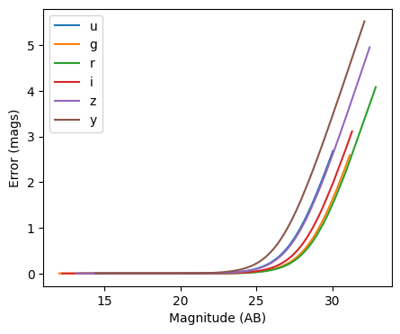
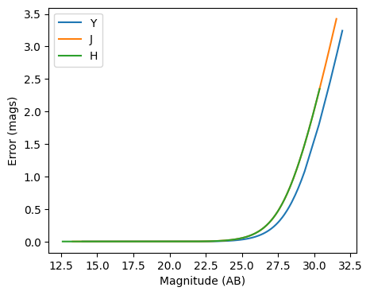
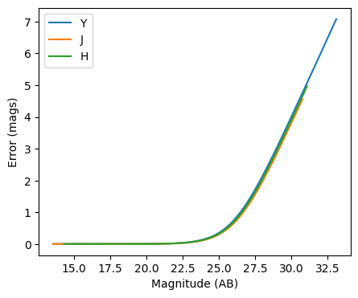

Photometric error stage demo
----------------------------

author: Tianqing Zhang, John-Franklin Crenshaw

This notebook demonstrate the use of
``rail.creation.degraders.photometric_errors``, which adds column for
the photometric noise to the catalog based on the package PhotErr
developed by John-Franklin Crenshaw. The RAIL stage PhotoErrorModel
inherit from the Noisifier base classes, and the LSST, Roman, Euclid
child classes inherit from the PhotoErrorModel

.. code:: ipython3

    
    from rail.creation.degraders.photometric_errors import LSSTErrorModel
    from rail.creation.degraders.photometric_errors import RomanErrorModel
    from rail.creation.degraders.photometric_errors import EuclidErrorModel
    
    from rail.core.data import PqHandle
    from rail.core.stage import RailStage
    
    import matplotlib.pyplot as plt
    import pandas as pd
    import numpy as np
    

.. code:: ipython3

    DS = RailStage.data_store
    DS.__class__.allow_overwrite = True

Create a random catalog with ugrizy+YJHF bands as the the true input
~~~~~~~~~~~~~~~~~~~~~~~~~~~~~~~~~~~~~~~~~~~~~~~~~~~~~~~~~~~~~~~~~~~~

.. code:: ipython3

    data = np.random.normal(23, 3, size = (1000,9))
    
    data_df = pd.DataFrame(data=data,    # values
                columns=['u', 'g', 'r', 'i', 'z', 'y', 'Y', 'J', 'H'])
    data_truth = PqHandle('input')
    data_truth.set_data(data_df)

.. code:: ipython3

    data_df

.. raw:: html

    

    
    <table border="1" class="dataframe">
      <thead>
        <tr style="text-align: right;">
          <th></th>
          <th>u</th>
          <th>g</th>
          <th>r</th>
          <th>i</th>
          <th>z</th>
          <th>y</th>
          <th>Y</th>
          <th>J</th>
          <th>H</th>
        </tr>
      </thead>
      <tbody>
        <tr>
          <th>0</th>
          <td>23.236566</td>
          <td>25.657238</td>
          <td>22.738523</td>
          <td>21.428177</td>
          <td>27.764759</td>
          <td>20.675493</td>
          <td>18.848004</td>
          <td>23.875890</td>
          <td>23.692176</td>
        </tr>
        <tr>
          <th>1</th>
          <td>21.282132</td>
          <td>23.008624</td>
          <td>25.393494</td>
          <td>21.038707</td>
          <td>25.161344</td>
          <td>26.153943</td>
          <td>22.966237</td>
          <td>24.222528</td>
          <td>25.574250</td>
        </tr>
        <tr>
          <th>2</th>
          <td>23.997633</td>
          <td>25.872646</td>
          <td>20.816582</td>
          <td>25.181103</td>
          <td>20.208774</td>
          <td>28.412075</td>
          <td>23.954665</td>
          <td>21.871229</td>
          <td>23.058362</td>
        </tr>
        <tr>
          <th>3</th>
          <td>21.322401</td>
          <td>23.471016</td>
          <td>21.632163</td>
          <td>27.226367</td>
          <td>29.012588</td>
          <td>26.043255</td>
          <td>23.728436</td>
          <td>24.165797</td>
          <td>28.430521</td>
        </tr>
        <tr>
          <th>4</th>
          <td>25.301110</td>
          <td>24.104825</td>
          <td>25.698731</td>
          <td>25.620749</td>
          <td>25.174077</td>
          <td>22.469597</td>
          <td>28.407750</td>
          <td>20.113310</td>
          <td>22.115196</td>
        </tr>
        <tr>
          <th>...</th>
          <td>...</td>
          <td>...</td>
          <td>...</td>
          <td>...</td>
          <td>...</td>
          <td>...</td>
          <td>...</td>
          <td>...</td>
          <td>...</td>
        </tr>
        <tr>
          <th>995</th>
          <td>20.536379</td>
          <td>18.262168</td>
          <td>24.168672</td>
          <td>20.375286</td>
          <td>27.039137</td>
          <td>23.913730</td>
          <td>26.338246</td>
          <td>24.412922</td>
          <td>19.286031</td>
        </tr>
        <tr>
          <th>996</th>
          <td>19.038629</td>
          <td>22.595123</td>
          <td>24.730977</td>
          <td>23.675728</td>
          <td>16.180593</td>
          <td>19.017443</td>
          <td>22.625131</td>
          <td>18.042578</td>
          <td>25.112514</td>
        </tr>
        <tr>
          <th>997</th>
          <td>25.814965</td>
          <td>25.013370</td>
          <td>28.636760</td>
          <td>25.947100</td>
          <td>20.975795</td>
          <td>29.471760</td>
          <td>25.593145</td>
          <td>23.035611</td>
          <td>25.074315</td>
        </tr>
        <tr>
          <th>998</th>
          <td>22.376367</td>
          <td>20.995702</td>
          <td>17.593382</td>
          <td>19.443124</td>
          <td>23.005680</td>
          <td>21.282893</td>
          <td>25.352694</td>
          <td>22.820790</td>
          <td>25.141666</td>
        </tr>
        <tr>
          <th>999</th>
          <td>16.000576</td>
          <td>26.296949</td>
          <td>28.328666</td>
          <td>21.184996</td>
          <td>21.559816</td>
          <td>19.448321</td>
          <td>20.172145</td>
          <td>23.451154</td>
          <td>22.524115</td>
        </tr>
      </tbody>
    </table>
    
1000 rows × 9 columns

    

The LSST error model adds noise to the optical bands
~~~~~~~~~~~~~~~~~~~~~~~~~~~~~~~~~~~~~~~~~~~~~~~~~~~~

.. code:: ipython3

    errorModel_lsst = LSSTErrorModel.make_stage(name="error_model")
    
    samples_w_errs = errorModel_lsst(data_truth)
    samples_w_errs()

.. parsed-literal::

    Inserting handle into data store.  input: None, error_model
    Inserting handle into data store.  output_error_model: inprogress_output_error_model.pq, error_model

.. raw:: html

    

    
    <table border="1" class="dataframe">
      <thead>
        <tr style="text-align: right;">
          <th></th>
          <th>u</th>
          <th>u_err</th>
          <th>g</th>
          <th>g_err</th>
          <th>r</th>
          <th>r_err</th>
          <th>i</th>
          <th>i_err</th>
          <th>z</th>
          <th>z_err</th>
          <th>y</th>
          <th>y_err</th>
          <th>Y</th>
          <th>J</th>
          <th>H</th>
        </tr>
      </thead>
      <tbody>
        <tr>
          <th>0</th>
          <td>23.250317</td>
          <td>0.023530</td>
          <td>25.675387</td>
          <td>0.067303</td>
          <td>22.748750</td>
          <td>0.006568</td>
          <td>21.427903</td>
          <td>0.005460</td>
          <td>27.839518</td>
          <td>0.920704</td>
          <td>20.672788</td>
          <td>0.006920</td>
          <td>18.848004</td>
          <td>23.875890</td>
          <td>23.692176</td>
        </tr>
        <tr>
          <th>1</th>
          <td>21.296397</td>
          <td>0.006633</td>
          <td>23.005157</td>
          <td>0.007956</td>
          <td>25.422148</td>
          <td>0.047241</td>
          <td>21.030140</td>
          <td>0.005243</td>
          <td>25.221905</td>
          <td>0.123102</td>
          <td>26.095282</td>
          <td>0.526823</td>
          <td>22.966237</td>
          <td>24.222528</td>
          <td>25.574250</td>
        </tr>
        <tr>
          <th>2</th>
          <td>24.017960</td>
          <td>0.045744</td>
          <td>25.802697</td>
          <td>0.075314</td>
          <td>20.820474</td>
          <td>0.005075</td>
          <td>25.137160</td>
          <td>0.059960</td>
          <td>20.217181</td>
          <td>0.005217</td>
          <td>28.783485</td>
          <td>2.313934</td>
          <td>23.954665</td>
          <td>21.871229</td>
          <td>23.058362</td>
        </tr>
        <tr>
          <th>3</th>
          <td>21.310782</td>
          <td>0.006666</td>
          <td>23.449382</td>
          <td>0.010424</td>
          <td>21.623952</td>
          <td>0.005260</td>
          <td>26.969758</td>
          <td>0.289246</td>
          <td>26.719468</td>
          <td>0.422698</td>
          <td>25.841003</td>
          <td>0.436011</td>
          <td>23.728436</td>
          <td>24.165797</td>
          <td>28.430521</td>
        </tr>
        <tr>
          <th>4</th>
          <td>25.258424</td>
          <td>0.135406</td>
          <td>24.075359</td>
          <td>0.016749</td>
          <td>25.652629</td>
          <td>0.057968</td>
          <td>25.833032</td>
          <td>0.110717</td>
          <td>25.102341</td>
          <td>0.110937</td>
          <td>22.412557</td>
          <td>0.023307</td>
          <td>28.407750</td>
          <td>20.113310</td>
          <td>22.115196</td>
        </tr>
        <tr>
          <th>...</th>
          <td>...</td>
          <td>...</td>
          <td>...</td>
          <td>...</td>
          <td>...</td>
          <td>...</td>
          <td>...</td>
          <td>...</td>
          <td>...</td>
          <td>...</td>
          <td>...</td>
          <td>...</td>
          <td>...</td>
          <td>...</td>
          <td>...</td>
        </tr>
        <tr>
          <th>995</th>
          <td>20.521002</td>
          <td>0.005555</td>
          <td>18.265174</td>
          <td>0.005006</td>
          <td>24.155785</td>
          <td>0.015793</td>
          <td>20.372454</td>
          <td>0.005087</td>
          <td>26.203960</td>
          <td>0.281645</td>
          <td>23.918103</td>
          <td>0.087948</td>
          <td>26.338246</td>
          <td>24.412922</td>
          <td>19.286031</td>
        </tr>
        <tr>
          <th>996</th>
          <td>19.034692</td>
          <td>0.005085</td>
          <td>22.594763</td>
          <td>0.006621</td>
          <td>24.730853</td>
          <td>0.025683</td>
          <td>23.706820</td>
          <td>0.017205</td>
          <td>16.179392</td>
          <td>0.005001</td>
          <td>19.021865</td>
          <td>0.005141</td>
          <td>22.625131</td>
          <td>18.042578</td>
          <td>25.112514</td>
        </tr>
        <tr>
          <th>997</th>
          <td>25.613113</td>
          <td>0.183233</td>
          <td>24.980509</td>
          <td>0.036396</td>
          <td>27.677432</td>
          <td>0.327259</td>
          <td>25.750002</td>
          <td>0.102969</td>
          <td>20.983121</td>
          <td>0.005739</td>
          <td>inf</td>
          <td>inf</td>
          <td>25.593145</td>
          <td>23.035611</td>
          <td>25.074315</td>
        </tr>
        <tr>
          <th>998</th>
          <td>22.380413</td>
          <td>0.011845</td>
          <td>20.996973</td>
          <td>0.005145</td>
          <td>17.602738</td>
          <td>0.005002</td>
          <td>19.445866</td>
          <td>0.005023</td>
          <td>22.983313</td>
          <td>0.017350</td>
          <td>21.283116</td>
          <td>0.009628</td>
          <td>25.352694</td>
          <td>22.820790</td>
          <td>25.141666</td>
        </tr>
        <tr>
          <th>999</th>
          <td>15.993944</td>
          <td>0.005004</td>
          <td>26.196853</td>
          <td>0.106461</td>
          <td>29.544424</td>
          <td>1.179182</td>
          <td>21.180464</td>
          <td>0.005309</td>
          <td>21.559063</td>
          <td>0.006825</td>
          <td>19.449707</td>
          <td>0.005276</td>
          <td>20.172145</td>
          <td>23.451154</td>
          <td>22.524115</td>
        </tr>
      </tbody>
    </table>
    
1000 rows × 15 columns

    

.. code:: ipython3

    fig, ax = plt.subplots(figsize=(5, 4), dpi=100)
    
    for band in "ugrizy":
        # pull out the magnitudes and errors
        mags = samples_w_errs.data[band].to_numpy()
        errs = samples_w_errs.data[band + "_err"].to_numpy()
    
        # sort them by magnitude
        mags, errs = mags[mags.argsort()], errs[mags.argsort()]
    
        # plot errs vs mags
        ax.plot(mags, errs, label=band)
    
    ax.legend()
    ax.set(xlabel="Magnitude (AB)", ylabel="Error (mags)")
    plt.show()

The Roman error model adds noise to the infrared bands
~~~~~~~~~~~~~~~~~~~~~~~~~~~~~~~~~~~~~~~~~~~~~~~~~~~~~~

.. code:: ipython3

    errorModel_Roman = RomanErrorModel.make_stage(name="error_model", )
    

.. code:: ipython3

    errorModel_Roman.config['m5']['Y'] = 27.0

.. code:: ipython3

    errorModel_Roman.config['theta']['Y'] = 27.0

.. code:: ipython3

    samples_w_errs_roman = errorModel_Roman(data_truth)
    samples_w_errs_roman()

.. parsed-literal::

    Inserting handle into data store.  output_error_model: inprogress_output_error_model.pq, error_model

.. raw:: html

    

    
    <table border="1" class="dataframe">
      <thead>
        <tr style="text-align: right;">
          <th></th>
          <th>u</th>
          <th>g</th>
          <th>r</th>
          <th>i</th>
          <th>z</th>
          <th>y</th>
          <th>Y</th>
          <th>Y_err</th>
          <th>J</th>
          <th>J_err</th>
          <th>H</th>
          <th>H_err</th>
        </tr>
      </thead>
      <tbody>
        <tr>
          <th>0</th>
          <td>23.236566</td>
          <td>25.657238</td>
          <td>22.738523</td>
          <td>21.428177</td>
          <td>27.764759</td>
          <td>20.675493</td>
          <td>18.840396</td>
          <td>0.005001</td>
          <td>23.843439</td>
          <td>0.021008</td>
          <td>23.695734</td>
          <td>0.018517</td>
        </tr>
        <tr>
          <th>1</th>
          <td>21.282132</td>
          <td>23.008624</td>
          <td>25.393494</td>
          <td>21.038707</td>
          <td>25.161344</td>
          <td>26.153943</td>
          <td>22.954633</td>
          <td>0.007220</td>
          <td>24.224932</td>
          <td>0.029317</td>
          <td>25.400263</td>
          <td>0.083333</td>
        </tr>
        <tr>
          <th>2</th>
          <td>23.997633</td>
          <td>25.872646</td>
          <td>20.816582</td>
          <td>25.181103</td>
          <td>20.208774</td>
          <td>28.412075</td>
          <td>23.959449</td>
          <td>0.014027</td>
          <td>21.875024</td>
          <td>0.006019</td>
          <td>23.064720</td>
          <td>0.011182</td>
        </tr>
        <tr>
          <th>3</th>
          <td>21.322401</td>
          <td>23.471016</td>
          <td>21.632163</td>
          <td>27.226367</td>
          <td>29.012588</td>
          <td>26.043255</td>
          <td>23.737838</td>
          <td>0.011807</td>
          <td>24.196454</td>
          <td>0.028589</td>
          <td>inf</td>
          <td>inf</td>
        </tr>
        <tr>
          <th>4</th>
          <td>25.301110</td>
          <td>24.104825</td>
          <td>25.698731</td>
          <td>25.620749</td>
          <td>25.174077</td>
          <td>22.469597</td>
          <td>29.574316</td>
          <td>1.242910</td>
          <td>20.112246</td>
          <td>0.005043</td>
          <td>22.120790</td>
          <td>0.006530</td>
        </tr>
        <tr>
          <th>...</th>
          <td>...</td>
          <td>...</td>
          <td>...</td>
          <td>...</td>
          <td>...</td>
          <td>...</td>
          <td>...</td>
          <td>...</td>
          <td>...</td>
          <td>...</td>
          <td>...</td>
          <td>...</td>
        </tr>
        <tr>
          <th>995</th>
          <td>20.536379</td>
          <td>18.262168</td>
          <td>24.168672</td>
          <td>20.375286</td>
          <td>27.039137</td>
          <td>23.913730</td>
          <td>26.619991</td>
          <td>0.143226</td>
          <td>24.333922</td>
          <td>0.032284</td>
          <td>19.283320</td>
          <td>0.005009</td>
        </tr>
        <tr>
          <th>996</th>
          <td>19.038629</td>
          <td>22.595123</td>
          <td>24.730977</td>
          <td>23.675728</td>
          <td>16.180593</td>
          <td>19.017443</td>
          <td>22.628382</td>
          <td>0.006316</td>
          <td>18.045582</td>
          <td>0.005001</td>
          <td>25.072971</td>
          <td>0.062337</td>
        </tr>
        <tr>
          <th>997</th>
          <td>25.814965</td>
          <td>25.013370</td>
          <td>28.636760</td>
          <td>25.947100</td>
          <td>20.975795</td>
          <td>29.471760</td>
          <td>25.527370</td>
          <td>0.054757</td>
          <td>23.019283</td>
          <td>0.010818</td>
          <td>25.220835</td>
          <td>0.071090</td>
        </tr>
        <tr>
          <th>998</th>
          <td>22.376367</td>
          <td>20.995702</td>
          <td>17.593382</td>
          <td>19.443124</td>
          <td>23.005680</td>
          <td>21.282893</td>
          <td>25.323005</td>
          <td>0.045638</td>
          <td>22.828885</td>
          <td>0.009481</td>
          <td>25.110159</td>
          <td>0.064433</td>
        </tr>
        <tr>
          <th>999</th>
          <td>16.000576</td>
          <td>26.296949</td>
          <td>28.328666</td>
          <td>21.184996</td>
          <td>21.559816</td>
          <td>19.448321</td>
          <td>20.166088</td>
          <td>0.005016</td>
          <td>23.450398</td>
          <td>0.015096</td>
          <td>22.502100</td>
          <td>0.007784</td>
        </tr>
      </tbody>
    </table>
    
1000 rows × 12 columns

    

.. code:: ipython3

    fig, ax = plt.subplots(figsize=(5, 4), dpi=100)
    
    for band in "YJH":
        # pull out the magnitudes and errors
        mags = samples_w_errs_roman.data[band].to_numpy()
        errs = samples_w_errs_roman.data[band + "_err"].to_numpy()
    
        # sort them by magnitude
        mags, errs = mags[mags.argsort()], errs[mags.argsort()]
    
        # plot errs vs mags
        ax.plot(mags, errs, label=band)
    
    ax.legend()
    ax.set(xlabel="Magnitude (AB)", ylabel="Error (mags)")
    plt.show()

The Euclid error model adds noise to YJH bands
~~~~~~~~~~~~~~~~~~~~~~~~~~~~~~~~~~~~~~~~~~~~~~

.. code:: ipython3

    errorModel_Euclid = EuclidErrorModel.make_stage(name="error_model")
    
    samples_w_errs_Euclid = errorModel_Euclid(data_truth)
    samples_w_errs_Euclid()

.. parsed-literal::

    Inserting handle into data store.  output_error_model: inprogress_output_error_model.pq, error_model

.. raw:: html

    

    
    <table border="1" class="dataframe">
      <thead>
        <tr style="text-align: right;">
          <th></th>
          <th>u</th>
          <th>g</th>
          <th>r</th>
          <th>i</th>
          <th>z</th>
          <th>y</th>
          <th>Y</th>
          <th>Y_err</th>
          <th>J</th>
          <th>J_err</th>
          <th>H</th>
          <th>H_err</th>
        </tr>
      </thead>
      <tbody>
        <tr>
          <th>0</th>
          <td>23.236566</td>
          <td>25.657238</td>
          <td>22.738523</td>
          <td>21.428177</td>
          <td>27.764759</td>
          <td>20.675493</td>
          <td>18.845231</td>
          <td>0.005199</td>
          <td>23.946601</td>
          <td>0.123262</td>
          <td>23.892571</td>
          <td>0.128283</td>
        </tr>
        <tr>
          <th>1</th>
          <td>21.282132</td>
          <td>23.008624</td>
          <td>25.393494</td>
          <td>21.038707</td>
          <td>25.161344</td>
          <td>26.153943</td>
          <td>22.969903</td>
          <td>0.062167</td>
          <td>24.027244</td>
          <td>0.132197</td>
          <td>30.342737</td>
          <td>4.217859</td>
        </tr>
        <tr>
          <th>2</th>
          <td>23.997633</td>
          <td>25.872646</td>
          <td>20.816582</td>
          <td>25.181103</td>
          <td>20.208774</td>
          <td>28.412075</td>
          <td>24.025410</td>
          <td>0.156809</td>
          <td>21.852629</td>
          <td>0.019435</td>
          <td>22.991922</td>
          <td>0.057998</td>
        </tr>
        <tr>
          <th>3</th>
          <td>21.322401</td>
          <td>23.471016</td>
          <td>21.632163</td>
          <td>27.226367</td>
          <td>29.012588</td>
          <td>26.043255</td>
          <td>23.738017</td>
          <td>0.122345</td>
          <td>24.242988</td>
          <td>0.159187</td>
          <td>inf</td>
          <td>inf</td>
        </tr>
        <tr>
          <th>4</th>
          <td>25.301110</td>
          <td>24.104825</td>
          <td>25.698731</td>
          <td>25.620749</td>
          <td>25.174077</td>
          <td>22.469597</td>
          <td>30.108469</td>
          <td>4.086524</td>
          <td>20.114168</td>
          <td>0.006285</td>
          <td>22.090629</td>
          <td>0.026048</td>
        </tr>
        <tr>
          <th>...</th>
          <td>...</td>
          <td>...</td>
          <td>...</td>
          <td>...</td>
          <td>...</td>
          <td>...</td>
          <td>...</td>
          <td>...</td>
          <td>...</td>
          <td>...</td>
          <td>...</td>
          <td>...</td>
        </tr>
        <tr>
          <th>995</th>
          <td>20.536379</td>
          <td>18.262168</td>
          <td>24.168672</td>
          <td>20.375286</td>
          <td>27.039137</td>
          <td>23.913730</td>
          <td>inf</td>
          <td>inf</td>
          <td>24.636913</td>
          <td>0.222046</td>
          <td>19.288082</td>
          <td>0.005367</td>
        </tr>
        <tr>
          <th>996</th>
          <td>19.038629</td>
          <td>22.595123</td>
          <td>24.730977</td>
          <td>23.675728</td>
          <td>16.180593</td>
          <td>19.017443</td>
          <td>22.672312</td>
          <td>0.047688</td>
          <td>18.036437</td>
          <td>0.005031</td>
          <td>25.358132</td>
          <td>0.428142</td>
        </tr>
        <tr>
          <th>997</th>
          <td>25.814965</td>
          <td>25.013370</td>
          <td>28.636760</td>
          <td>25.947100</td>
          <td>20.975795</td>
          <td>29.471760</td>
          <td>24.718291</td>
          <td>0.279865</td>
          <td>22.964161</td>
          <td>0.051758</td>
          <td>25.299452</td>
          <td>0.409368</td>
        </tr>
        <tr>
          <th>998</th>
          <td>22.376367</td>
          <td>20.995702</td>
          <td>17.593382</td>
          <td>19.443124</td>
          <td>23.005680</td>
          <td>21.282893</td>
          <td>25.095621</td>
          <td>0.377814</td>
          <td>22.759582</td>
          <td>0.043129</td>
          <td>26.461656</td>
          <td>0.921023</td>
        </tr>
        <tr>
          <th>999</th>
          <td>16.000576</td>
          <td>26.296949</td>
          <td>28.328666</td>
          <td>21.184996</td>
          <td>21.559816</td>
          <td>19.448321</td>
          <td>20.173751</td>
          <td>0.006956</td>
          <td>23.482935</td>
          <td>0.082066</td>
          <td>22.546113</td>
          <td>0.038982</td>
        </tr>
      </tbody>
    </table>
    
1000 rows × 12 columns

    

.. code:: ipython3

    fig, ax = plt.subplots(figsize=(5, 4), dpi=100)
    
    for band in "YJH":
        # pull out the magnitudes and errors
        mags = samples_w_errs_Euclid.data[band].to_numpy()
        errs = samples_w_errs_Euclid.data[band + "_err"].to_numpy()
    
        # sort them by magnitude
        mags, errs = mags[mags.argsort()], errs[mags.argsort()]
    
        # plot errs vs mags
        ax.plot(mags, errs, label=band)
    
    ax.legend()
    ax.set(xlabel="Magnitude (AB)", ylabel="Error (mags)")
    plt.show()

