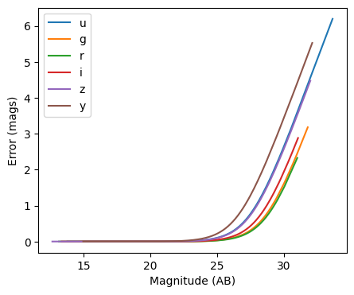
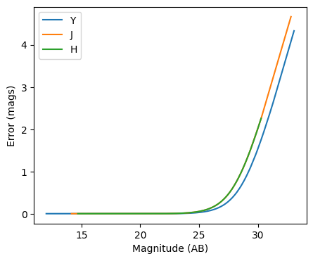
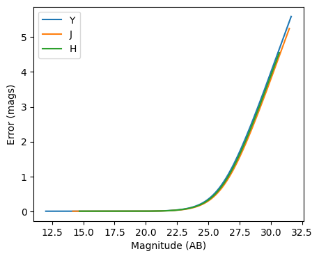

Photometric error stage demo
----------------------------

author: Tianqing Zhang, John-Franklin Crenshaw

This notebook demonstrate the use of
``rail.creation.degraders.photometric_errors``, which adds column for
the photometric noise to the catalog based on the package PhotErr
developed by John-Franklin Crenshaw. The RAIL stage PhotoErrorModel
inherit from the Noisifier base classes, and the LSST, Roman, Euclid
child classes inherit from the PhotoErrorModel

.. code:: ipython3

    
    from rail.creation.degraders.photometric_errors import LSSTErrorModel
    from rail.creation.degraders.photometric_errors import RomanErrorModel
    from rail.creation.degraders.photometric_errors import EuclidErrorModel
    
    from rail.core.data import PqHandle
    from rail.core.stage import RailStage
    
    import matplotlib.pyplot as plt
    import pandas as pd
    import numpy as np
    

Create a random catalog with ugrizy+YJHF bands as the the true input
~~~~~~~~~~~~~~~~~~~~~~~~~~~~~~~~~~~~~~~~~~~~~~~~~~~~~~~~~~~~~~~~~~~~

.. code:: ipython3

    data = np.random.normal(23, 3, size = (1000,9))
    
    data_df = pd.DataFrame(data=data,    # values
                columns=['u', 'g', 'r', 'i', 'z', 'y', 'Y', 'J', 'H'])
    data_truth = PqHandle('input')
    data_truth.set_data(data_df)

.. code:: ipython3

    data_df

.. raw:: html

    

    
    <table border="1" class="dataframe">
      <thead>
        <tr style="text-align: right;">
          <th></th>
          <th>u</th>
          <th>g</th>
          <th>r</th>
          <th>i</th>
          <th>z</th>
          <th>y</th>
          <th>Y</th>
          <th>J</th>
          <th>H</th>
        </tr>
      </thead>
      <tbody>
        <tr>
          <th>0</th>
          <td>19.307910</td>
          <td>26.993763</td>
          <td>25.637557</td>
          <td>25.239535</td>
          <td>21.771380</td>
          <td>29.287086</td>
          <td>25.998776</td>
          <td>22.094950</td>
          <td>22.195603</td>
        </tr>
        <tr>
          <th>1</th>
          <td>19.808175</td>
          <td>24.224637</td>
          <td>23.425014</td>
          <td>23.299127</td>
          <td>22.726422</td>
          <td>24.994533</td>
          <td>25.174531</td>
          <td>28.338533</td>
          <td>20.018859</td>
        </tr>
        <tr>
          <th>2</th>
          <td>21.750134</td>
          <td>24.509805</td>
          <td>23.278102</td>
          <td>19.431980</td>
          <td>22.411579</td>
          <td>23.900136</td>
          <td>19.444308</td>
          <td>24.805727</td>
          <td>23.165246</td>
        </tr>
        <tr>
          <th>3</th>
          <td>23.469537</td>
          <td>20.792836</td>
          <td>17.936096</td>
          <td>28.125632</td>
          <td>23.773699</td>
          <td>24.234786</td>
          <td>23.540651</td>
          <td>22.198064</td>
          <td>22.832319</td>
        </tr>
        <tr>
          <th>4</th>
          <td>22.677287</td>
          <td>27.113339</td>
          <td>17.056329</td>
          <td>25.425777</td>
          <td>23.022985</td>
          <td>31.718065</td>
          <td>20.970711</td>
          <td>21.543796</td>
          <td>20.694385</td>
        </tr>
        <tr>
          <th>...</th>
          <td>...</td>
          <td>...</td>
          <td>...</td>
          <td>...</td>
          <td>...</td>
          <td>...</td>
          <td>...</td>
          <td>...</td>
          <td>...</td>
        </tr>
        <tr>
          <th>995</th>
          <td>16.142449</td>
          <td>25.991748</td>
          <td>23.108196</td>
          <td>19.438951</td>
          <td>18.487579</td>
          <td>25.091905</td>
          <td>25.584081</td>
          <td>26.626336</td>
          <td>26.227042</td>
        </tr>
        <tr>
          <th>996</th>
          <td>21.828109</td>
          <td>18.077492</td>
          <td>19.757614</td>
          <td>19.434305</td>
          <td>24.990835</td>
          <td>22.329137</td>
          <td>28.689030</td>
          <td>23.783115</td>
          <td>17.205253</td>
        </tr>
        <tr>
          <th>997</th>
          <td>23.541560</td>
          <td>18.150238</td>
          <td>18.566777</td>
          <td>22.157727</td>
          <td>26.124129</td>
          <td>27.751451</td>
          <td>27.047079</td>
          <td>25.415780</td>
          <td>24.297875</td>
        </tr>
        <tr>
          <th>998</th>
          <td>22.776977</td>
          <td>22.099614</td>
          <td>27.601599</td>
          <td>22.275126</td>
          <td>26.268158</td>
          <td>20.698724</td>
          <td>22.957659</td>
          <td>15.735994</td>
          <td>24.439100</td>
        </tr>
        <tr>
          <th>999</th>
          <td>23.246618</td>
          <td>20.905633</td>
          <td>23.079336</td>
          <td>24.791292</td>
          <td>30.044248</td>
          <td>22.563935</td>
          <td>20.119644</td>
          <td>18.603927</td>
          <td>21.908101</td>
        </tr>
      </tbody>
    </table>
    
1000 rows × 9 columns

    

The LSST error model adds noise to the optical bands
~~~~~~~~~~~~~~~~~~~~~~~~~~~~~~~~~~~~~~~~~~~~~~~~~~~~

.. code:: ipython3

    errorModel_lsst = LSSTErrorModel.make_stage(name="error_model")
    
    samples_w_errs = errorModel_lsst(data_truth)
    samples_w_errs()

.. parsed-literal::

    Inserting handle into data store.  input: None, error_model
    Inserting handle into data store.  output_error_model: inprogress_output_error_model.pq, error_model

.. raw:: html

    

    
    <table border="1" class="dataframe">
      <thead>
        <tr style="text-align: right;">
          <th></th>
          <th>u</th>
          <th>u_err</th>
          <th>g</th>
          <th>g_err</th>
          <th>r</th>
          <th>r_err</th>
          <th>i</th>
          <th>i_err</th>
          <th>z</th>
          <th>z_err</th>
          <th>y</th>
          <th>y_err</th>
          <th>Y</th>
          <th>J</th>
          <th>H</th>
        </tr>
      </thead>
      <tbody>
        <tr>
          <th>0</th>
          <td>19.303714</td>
          <td>0.005117</td>
          <td>26.603031</td>
          <td>0.151315</td>
          <td>25.645277</td>
          <td>0.057591</td>
          <td>25.225419</td>
          <td>0.064841</td>
          <td>21.765584</td>
          <td>0.007488</td>
          <td>26.583822</td>
          <td>0.741280</td>
          <td>25.998776</td>
          <td>22.094950</td>
          <td>22.195603</td>
        </tr>
        <tr>
          <th>1</th>
          <td>19.805237</td>
          <td>0.005216</td>
          <td>24.247725</td>
          <td>0.019317</td>
          <td>23.432930</td>
          <td>0.009279</td>
          <td>23.307272</td>
          <td>0.012519</td>
          <td>22.684489</td>
          <td>0.013637</td>
          <td>25.455579</td>
          <td>0.323087</td>
          <td>25.174531</td>
          <td>28.338533</td>
          <td>20.018859</td>
        </tr>
        <tr>
          <th>2</th>
          <td>21.754221</td>
          <td>0.008060</td>
          <td>24.518718</td>
          <td>0.024323</td>
          <td>23.275323</td>
          <td>0.008432</td>
          <td>19.437254</td>
          <td>0.005023</td>
          <td>22.411337</td>
          <td>0.011111</td>
          <td>23.849476</td>
          <td>0.082789</td>
          <td>19.444308</td>
          <td>24.805727</td>
          <td>23.165246</td>
        </tr>
        <tr>
          <th>3</th>
          <td>23.466164</td>
          <td>0.028287</td>
          <td>20.787242</td>
          <td>0.005107</td>
          <td>17.936149</td>
          <td>0.005002</td>
          <td>27.248422</td>
          <td>0.361057</td>
          <td>23.766127</td>
          <td>0.034061</td>
          <td>24.116242</td>
          <td>0.104646</td>
          <td>23.540651</td>
          <td>22.198064</td>
          <td>22.832319</td>
        </tr>
        <tr>
          <th>4</th>
          <td>22.677933</td>
          <td>0.014771</td>
          <td>27.126830</td>
          <td>0.235308</td>
          <td>17.060596</td>
          <td>0.005001</td>
          <td>25.341207</td>
          <td>0.071843</td>
          <td>23.045306</td>
          <td>0.018269</td>
          <td>30.740117</td>
          <td>4.157216</td>
          <td>20.970711</td>
          <td>21.543796</td>
          <td>20.694385</td>
        </tr>
        <tr>
          <th>...</th>
          <td>...</td>
          <td>...</td>
          <td>...</td>
          <td>...</td>
          <td>...</td>
          <td>...</td>
          <td>...</td>
          <td>...</td>
          <td>...</td>
          <td>...</td>
          <td>...</td>
          <td>...</td>
          <td>...</td>
          <td>...</td>
          <td>...</td>
        </tr>
        <tr>
          <th>995</th>
          <td>16.138684</td>
          <td>0.005005</td>
          <td>26.000979</td>
          <td>0.089679</td>
          <td>23.119061</td>
          <td>0.007739</td>
          <td>19.427761</td>
          <td>0.005023</td>
          <td>18.499307</td>
          <td>0.005018</td>
          <td>24.918457</td>
          <td>0.208255</td>
          <td>25.584081</td>
          <td>26.626336</td>
          <td>26.227042</td>
        </tr>
        <tr>
          <th>996</th>
          <td>21.837740</td>
          <td>0.008421</td>
          <td>18.081568</td>
          <td>0.005005</td>
          <td>19.759416</td>
          <td>0.005017</td>
          <td>19.429280</td>
          <td>0.005023</td>
          <td>24.994782</td>
          <td>0.100983</td>
          <td>22.332700</td>
          <td>0.021762</td>
          <td>28.689030</td>
          <td>23.783115</td>
          <td>17.205253</td>
        </tr>
        <tr>
          <th>997</th>
          <td>23.492980</td>
          <td>0.028948</td>
          <td>18.149625</td>
          <td>0.005005</td>
          <td>18.562975</td>
          <td>0.005004</td>
          <td>22.155938</td>
          <td>0.006473</td>
          <td>26.228335</td>
          <td>0.287257</td>
          <td>inf</td>
          <td>inf</td>
          <td>27.047079</td>
          <td>25.415780</td>
          <td>24.297875</td>
        </tr>
        <tr>
          <th>998</th>
          <td>22.794217</td>
          <td>0.016178</td>
          <td>22.102537</td>
          <td>0.005765</td>
          <td>27.296139</td>
          <td>0.240253</td>
          <td>22.278363</td>
          <td>0.006779</td>
          <td>25.883956</td>
          <td>0.216459</td>
          <td>20.701339</td>
          <td>0.007005</td>
          <td>22.957659</td>
          <td>15.735994</td>
          <td>24.439100</td>
        </tr>
        <tr>
          <th>999</th>
          <td>23.246284</td>
          <td>0.023450</td>
          <td>20.904236</td>
          <td>0.005127</td>
          <td>23.080777</td>
          <td>0.007589</td>
          <td>24.784985</td>
          <td>0.043861</td>
          <td>27.306195</td>
          <td>0.648348</td>
          <td>22.583923</td>
          <td>0.027042</td>
          <td>20.119644</td>
          <td>18.603927</td>
          <td>21.908101</td>
        </tr>
      </tbody>
    </table>
    
1000 rows × 15 columns

    

.. code:: ipython3

    fig, ax = plt.subplots(figsize=(5, 4), dpi=100)
    
    for band in "ugrizy":
        # pull out the magnitudes and errors
        mags = samples_w_errs.data[band].to_numpy()
        errs = samples_w_errs.data[band + "_err"].to_numpy()
    
        # sort them by magnitude
        mags, errs = mags[mags.argsort()], errs[mags.argsort()]
    
        # plot errs vs mags
        ax.plot(mags, errs, label=band)
    
    ax.legend()
    ax.set(xlabel="Magnitude (AB)", ylabel="Error (mags)")
    plt.show()

The Roman error model adds noise to the infrared bands
~~~~~~~~~~~~~~~~~~~~~~~~~~~~~~~~~~~~~~~~~~~~~~~~~~~~~~

.. code:: ipython3

    errorModel_Roman = RomanErrorModel.make_stage(name="error_model", )
    

.. code:: ipython3

    errorModel_Roman.config['m5']['Y'] = 27.0

.. code:: ipython3

    errorModel_Roman.config['theta']['Y'] = 27.0

.. code:: ipython3

    samples_w_errs_roman = errorModel_Roman(data_truth)
    samples_w_errs_roman()

.. parsed-literal::

    Inserting handle into data store.  input: None, error_model
    Inserting handle into data store.  output_error_model: inprogress_output_error_model.pq, error_model

.. raw:: html

    

    
    <table border="1" class="dataframe">
      <thead>
        <tr style="text-align: right;">
          <th></th>
          <th>u</th>
          <th>g</th>
          <th>r</th>
          <th>i</th>
          <th>z</th>
          <th>y</th>
          <th>Y</th>
          <th>Y_err</th>
          <th>J</th>
          <th>J_err</th>
          <th>H</th>
          <th>H_err</th>
        </tr>
      </thead>
      <tbody>
        <tr>
          <th>0</th>
          <td>19.307910</td>
          <td>26.993763</td>
          <td>25.637557</td>
          <td>25.239535</td>
          <td>21.771380</td>
          <td>29.287086</td>
          <td>26.042667</td>
          <td>0.086512</td>
          <td>22.102909</td>
          <td>0.006487</td>
          <td>22.195745</td>
          <td>0.006727</td>
        </tr>
        <tr>
          <th>1</th>
          <td>19.808175</td>
          <td>24.224637</td>
          <td>23.425014</td>
          <td>23.299127</td>
          <td>22.726422</td>
          <td>24.994533</td>
          <td>25.169027</td>
          <td>0.039786</td>
          <td>27.686033</td>
          <td>0.546216</td>
          <td>20.012847</td>
          <td>0.005036</td>
        </tr>
        <tr>
          <th>2</th>
          <td>21.750134</td>
          <td>24.509805</td>
          <td>23.278102</td>
          <td>19.431980</td>
          <td>22.411579</td>
          <td>23.900136</td>
          <td>19.452930</td>
          <td>0.005004</td>
          <td>24.876747</td>
          <td>0.052342</td>
          <td>23.160166</td>
          <td>0.012008</td>
        </tr>
        <tr>
          <th>3</th>
          <td>23.469537</td>
          <td>20.792836</td>
          <td>17.936096</td>
          <td>28.125632</td>
          <td>23.773699</td>
          <td>24.234786</td>
          <td>23.542497</td>
          <td>0.010244</td>
          <td>22.199782</td>
          <td>0.006738</td>
          <td>22.824650</td>
          <td>0.009454</td>
        </tr>
        <tr>
          <th>4</th>
          <td>22.677287</td>
          <td>27.113339</td>
          <td>17.056329</td>
          <td>25.425777</td>
          <td>23.022985</td>
          <td>31.718065</td>
          <td>20.969416</td>
          <td>0.005070</td>
          <td>21.548674</td>
          <td>0.005582</td>
          <td>20.699853</td>
          <td>0.005127</td>
        </tr>
        <tr>
          <th>...</th>
          <td>...</td>
          <td>...</td>
          <td>...</td>
          <td>...</td>
          <td>...</td>
          <td>...</td>
          <td>...</td>
          <td>...</td>
          <td>...</td>
          <td>...</td>
          <td>...</td>
          <td>...</td>
        </tr>
        <tr>
          <th>995</th>
          <td>16.142449</td>
          <td>25.991748</td>
          <td>23.108196</td>
          <td>19.438951</td>
          <td>18.487579</td>
          <td>25.091905</td>
          <td>25.548918</td>
          <td>0.055819</td>
          <td>26.508607</td>
          <td>0.216868</td>
          <td>26.186331</td>
          <td>0.165196</td>
        </tr>
        <tr>
          <th>996</th>
          <td>21.828109</td>
          <td>18.077492</td>
          <td>19.757614</td>
          <td>19.434305</td>
          <td>24.990835</td>
          <td>22.329137</td>
          <td>inf</td>
          <td>inf</td>
          <td>23.760550</td>
          <td>0.019567</td>
          <td>17.201418</td>
          <td>0.005000</td>
        </tr>
        <tr>
          <th>997</th>
          <td>23.541560</td>
          <td>18.150238</td>
          <td>18.566777</td>
          <td>22.157727</td>
          <td>26.124129</td>
          <td>27.751451</td>
          <td>26.829894</td>
          <td>0.171447</td>
          <td>25.420166</td>
          <td>0.084811</td>
          <td>24.279426</td>
          <td>0.030763</td>
        </tr>
        <tr>
          <th>998</th>
          <td>22.776977</td>
          <td>22.099614</td>
          <td>27.601599</td>
          <td>22.275126</td>
          <td>26.268158</td>
          <td>20.698724</td>
          <td>22.961574</td>
          <td>0.007244</td>
          <td>15.733144</td>
          <td>0.005000</td>
          <td>24.473163</td>
          <td>0.036533</td>
        </tr>
        <tr>
          <th>999</th>
          <td>23.246618</td>
          <td>20.905633</td>
          <td>23.079336</td>
          <td>24.791292</td>
          <td>30.044248</td>
          <td>22.563935</td>
          <td>20.119809</td>
          <td>0.005015</td>
          <td>18.603396</td>
          <td>0.005003</td>
          <td>21.895314</td>
          <td>0.006054</td>
        </tr>
      </tbody>
    </table>
    
1000 rows × 12 columns

    

.. code:: ipython3

    fig, ax = plt.subplots(figsize=(5, 4), dpi=100)
    
    for band in "YJH":
        # pull out the magnitudes and errors
        mags = samples_w_errs_roman.data[band].to_numpy()
        errs = samples_w_errs_roman.data[band + "_err"].to_numpy()
    
        # sort them by magnitude
        mags, errs = mags[mags.argsort()], errs[mags.argsort()]
    
        # plot errs vs mags
        ax.plot(mags, errs, label=band)
    
    ax.legend()
    ax.set(xlabel="Magnitude (AB)", ylabel="Error (mags)")
    plt.show()

The Euclid error model adds noise to YJH bands
~~~~~~~~~~~~~~~~~~~~~~~~~~~~~~~~~~~~~~~~~~~~~~

.. code:: ipython3

    errorModel_Euclid = EuclidErrorModel.make_stage(name="error_model")
    
    samples_w_errs_Euclid = errorModel_Euclid(data_truth)
    samples_w_errs_Euclid()

.. parsed-literal::

    Inserting handle into data store.  input: None, error_model
    Inserting handle into data store.  output_error_model: inprogress_output_error_model.pq, error_model

.. raw:: html

    

    
    <table border="1" class="dataframe">
      <thead>
        <tr style="text-align: right;">
          <th></th>
          <th>u</th>
          <th>g</th>
          <th>r</th>
          <th>i</th>
          <th>z</th>
          <th>y</th>
          <th>Y</th>
          <th>Y_err</th>
          <th>J</th>
          <th>J_err</th>
          <th>H</th>
          <th>H_err</th>
        </tr>
      </thead>
      <tbody>
        <tr>
          <th>0</th>
          <td>19.307910</td>
          <td>26.993763</td>
          <td>25.637557</td>
          <td>25.239535</td>
          <td>21.771380</td>
          <td>29.287086</td>
          <td>25.523704</td>
          <td>0.522003</td>
          <td>22.078745</td>
          <td>0.023621</td>
          <td>22.250863</td>
          <td>0.029996</td>
        </tr>
        <tr>
          <th>1</th>
          <td>19.808175</td>
          <td>24.224637</td>
          <td>23.425014</td>
          <td>23.299127</td>
          <td>22.726422</td>
          <td>24.994533</td>
          <td>25.383365</td>
          <td>0.470556</td>
          <td>27.937363</td>
          <td>1.897687</td>
          <td>20.017259</td>
          <td>0.006292</td>
        </tr>
        <tr>
          <th>2</th>
          <td>21.750134</td>
          <td>24.509805</td>
          <td>23.278102</td>
          <td>19.431980</td>
          <td>22.411579</td>
          <td>23.900136</td>
          <td>19.442128</td>
          <td>0.005575</td>
          <td>24.736478</td>
          <td>0.241155</td>
          <td>23.010347</td>
          <td>0.058958</td>
        </tr>
        <tr>
          <th>3</th>
          <td>23.469537</td>
          <td>20.792836</td>
          <td>17.936096</td>
          <td>28.125632</td>
          <td>23.773699</td>
          <td>24.234786</td>
          <td>23.565607</td>
          <td>0.105250</td>
          <td>22.191208</td>
          <td>0.026061</td>
          <td>22.903485</td>
          <td>0.053604</td>
        </tr>
        <tr>
          <th>4</th>
          <td>22.677287</td>
          <td>27.113339</td>
          <td>17.056329</td>
          <td>25.425777</td>
          <td>23.022985</td>
          <td>31.718065</td>
          <td>20.978174</td>
          <td>0.011294</td>
          <td>21.527688</td>
          <td>0.014820</td>
          <td>20.693697</td>
          <td>0.008696</td>
        </tr>
        <tr>
          <th>...</th>
          <td>...</td>
          <td>...</td>
          <td>...</td>
          <td>...</td>
          <td>...</td>
          <td>...</td>
          <td>...</td>
          <td>...</td>
          <td>...</td>
          <td>...</td>
          <td>...</td>
          <td>...</td>
        </tr>
        <tr>
          <th>995</th>
          <td>16.142449</td>
          <td>25.991748</td>
          <td>23.108196</td>
          <td>19.438951</td>
          <td>18.487579</td>
          <td>25.091905</td>
          <td>24.986139</td>
          <td>0.346772</td>
          <td>inf</td>
          <td>inf</td>
          <td>26.962727</td>
          <td>1.235023</td>
        </tr>
        <tr>
          <th>996</th>
          <td>21.828109</td>
          <td>18.077492</td>
          <td>19.757614</td>
          <td>19.434305</td>
          <td>24.990835</td>
          <td>22.329137</td>
          <td>27.394340</td>
          <td>1.622736</td>
          <td>23.728126</td>
          <td>0.101849</td>
          <td>17.200157</td>
          <td>0.005008</td>
        </tr>
        <tr>
          <th>997</th>
          <td>23.541560</td>
          <td>18.150238</td>
          <td>18.566777</td>
          <td>22.157727</td>
          <td>26.124129</td>
          <td>27.751451</td>
          <td>inf</td>
          <td>inf</td>
          <td>25.286775</td>
          <td>0.375222</td>
          <td>24.472869</td>
          <td>0.210487</td>
        </tr>
        <tr>
          <th>998</th>
          <td>22.776977</td>
          <td>22.099614</td>
          <td>27.601599</td>
          <td>22.275126</td>
          <td>26.268158</td>
          <td>20.698724</td>
          <td>22.803479</td>
          <td>0.053604</td>
          <td>15.739586</td>
          <td>0.005000</td>
          <td>24.300069</td>
          <td>0.181977</td>
        </tr>
        <tr>
          <th>999</th>
          <td>23.246618</td>
          <td>20.905633</td>
          <td>23.079336</td>
          <td>24.791292</td>
          <td>30.044248</td>
          <td>22.563935</td>
          <td>20.109167</td>
          <td>0.006765</td>
          <td>18.597337</td>
          <td>0.005088</td>
          <td>21.857278</td>
          <td>0.021260</td>
        </tr>
      </tbody>
    </table>
    
1000 rows × 12 columns

    

.. code:: ipython3

    fig, ax = plt.subplots(figsize=(5, 4), dpi=100)
    
    for band in "YJH":
        # pull out the magnitudes and errors
        mags = samples_w_errs_Euclid.data[band].to_numpy()
        errs = samples_w_errs_Euclid.data[band + "_err"].to_numpy()
    
        # sort them by magnitude
        mags, errs = mags[mags.argsort()], errs[mags.argsort()]
    
        # plot errs vs mags
        ax.plot(mags, errs, label=band)
    
    ax.legend()
    ax.set(xlabel="Magnitude (AB)", ylabel="Error (mags)")
    plt.show()

