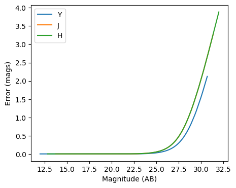

Photometric error stage demo
----------------------------

author: Tianqing Zhang, John-Franklin Crenshaw

This notebook demonstrate the use of
``rail.creation.degraders.photometric_errors``, which adds column for
the photometric noise to the catalog based on the package PhotErr
developed by John-Franklin Crenshaw. The RAIL stage PhotoErrorModel
inherit from the Noisifier base classes, and the LSST, Roman, Euclid
child classes inherit from the PhotoErrorModel

.. code:: ipython3

    
    from rail.creation.degraders.photometric_errors import LSSTErrorModel
    from rail.creation.degraders.photometric_errors import RomanErrorModel
    from rail.creation.degraders.photometric_errors import EuclidErrorModel
    
    from rail.core.data import PqHandle
    from rail.core.stage import RailStage
    
    import matplotlib.pyplot as plt
    import pandas as pd
    import numpy as np
    

.. code:: ipython3

    DS = RailStage.data_store
    DS.__class__.allow_overwrite = True

Create a random catalog with ugrizy+YJHF bands as the the true input
~~~~~~~~~~~~~~~~~~~~~~~~~~~~~~~~~~~~~~~~~~~~~~~~~~~~~~~~~~~~~~~~~~~~

.. code:: ipython3

    data = np.random.normal(23, 3, size = (1000,9))
    
    data_df = pd.DataFrame(data=data,    # values
                columns=['u', 'g', 'r', 'i', 'z', 'y', 'Y', 'J', 'H'])
    data_truth = PqHandle('input')
    data_truth.set_data(data_df)

.. code:: ipython3

    data_df

.. raw:: html

    

    
    <table border="1" class="dataframe">
      <thead>
        <tr style="text-align: right;">
          <th></th>
          <th>u</th>
          <th>g</th>
          <th>r</th>
          <th>i</th>
          <th>z</th>
          <th>y</th>
          <th>Y</th>
          <th>J</th>
          <th>H</th>
        </tr>
      </thead>
      <tbody>
        <tr>
          <th>0</th>
          <td>26.496984</td>
          <td>21.433014</td>
          <td>21.476241</td>
          <td>25.658662</td>
          <td>25.644709</td>
          <td>24.472957</td>
          <td>26.163525</td>
          <td>17.800779</td>
          <td>21.948610</td>
        </tr>
        <tr>
          <th>1</th>
          <td>20.655114</td>
          <td>22.874606</td>
          <td>25.853905</td>
          <td>29.348710</td>
          <td>20.608267</td>
          <td>18.647130</td>
          <td>23.573207</td>
          <td>20.864947</td>
          <td>18.207686</td>
        </tr>
        <tr>
          <th>2</th>
          <td>19.558012</td>
          <td>23.967351</td>
          <td>20.954031</td>
          <td>17.830764</td>
          <td>18.868530</td>
          <td>26.041643</td>
          <td>27.164577</td>
          <td>17.373704</td>
          <td>20.804794</td>
        </tr>
        <tr>
          <th>3</th>
          <td>22.704741</td>
          <td>34.397605</td>
          <td>23.789978</td>
          <td>20.216437</td>
          <td>25.029200</td>
          <td>28.927977</td>
          <td>23.093689</td>
          <td>17.316465</td>
          <td>22.636446</td>
        </tr>
        <tr>
          <th>4</th>
          <td>25.476012</td>
          <td>24.588060</td>
          <td>22.759510</td>
          <td>25.154204</td>
          <td>27.667325</td>
          <td>28.759068</td>
          <td>23.947737</td>
          <td>27.781747</td>
          <td>17.463672</td>
        </tr>
        <tr>
          <th>...</th>
          <td>...</td>
          <td>...</td>
          <td>...</td>
          <td>...</td>
          <td>...</td>
          <td>...</td>
          <td>...</td>
          <td>...</td>
          <td>...</td>
        </tr>
        <tr>
          <th>995</th>
          <td>23.204233</td>
          <td>21.822150</td>
          <td>25.084180</td>
          <td>22.988025</td>
          <td>18.836290</td>
          <td>25.558055</td>
          <td>24.561113</td>
          <td>20.431907</td>
          <td>32.732534</td>
        </tr>
        <tr>
          <th>996</th>
          <td>26.806173</td>
          <td>28.585711</td>
          <td>23.135454</td>
          <td>21.379665</td>
          <td>25.046354</td>
          <td>23.159014</td>
          <td>24.656638</td>
          <td>21.854367</td>
          <td>23.597023</td>
        </tr>
        <tr>
          <th>997</th>
          <td>26.962078</td>
          <td>32.804458</td>
          <td>22.438648</td>
          <td>22.918609</td>
          <td>20.497392</td>
          <td>27.091255</td>
          <td>24.794494</td>
          <td>21.853013</td>
          <td>19.253380</td>
        </tr>
        <tr>
          <th>998</th>
          <td>29.078575</td>
          <td>23.606801</td>
          <td>23.746992</td>
          <td>17.606969</td>
          <td>20.943808</td>
          <td>25.355483</td>
          <td>27.586225</td>
          <td>22.270664</td>
          <td>29.145024</td>
        </tr>
        <tr>
          <th>999</th>
          <td>30.997795</td>
          <td>23.195793</td>
          <td>19.723105</td>
          <td>23.090343</td>
          <td>21.899540</td>
          <td>27.996768</td>
          <td>28.291636</td>
          <td>22.049422</td>
          <td>25.722979</td>
        </tr>
      </tbody>
    </table>
    
1000 rows × 9 columns

    

The LSST error model adds noise to the optical bands
~~~~~~~~~~~~~~~~~~~~~~~~~~~~~~~~~~~~~~~~~~~~~~~~~~~~

.. code:: ipython3

    errorModel_lsst = LSSTErrorModel.make_stage(name="error_model")
    
    samples_w_errs = errorModel_lsst(data_truth)
    samples_w_errs()

.. parsed-literal::

    Inserting handle into data store.  input: None, error_model
    Inserting handle into data store.  output_error_model: inprogress_output_error_model.pq, error_model

.. raw:: html

    

    
    <table border="1" class="dataframe">
      <thead>
        <tr style="text-align: right;">
          <th></th>
          <th>u</th>
          <th>u_err</th>
          <th>g</th>
          <th>g_err</th>
          <th>r</th>
          <th>r_err</th>
          <th>i</th>
          <th>i_err</th>
          <th>z</th>
          <th>z_err</th>
          <th>y</th>
          <th>y_err</th>
          <th>Y</th>
          <th>J</th>
          <th>H</th>
        </tr>
      </thead>
      <tbody>
        <tr>
          <th>0</th>
          <td>28.187126</td>
          <td>1.178676</td>
          <td>21.437534</td>
          <td>0.005276</td>
          <td>21.475886</td>
          <td>0.005205</td>
          <td>25.711503</td>
          <td>0.099555</td>
          <td>25.700213</td>
          <td>0.185511</td>
          <td>24.234389</td>
          <td>0.116010</td>
          <td>26.163525</td>
          <td>17.800779</td>
          <td>21.948610</td>
        </tr>
        <tr>
          <th>1</th>
          <td>20.660279</td>
          <td>0.005672</td>
          <td>22.874089</td>
          <td>0.007449</td>
          <td>25.842135</td>
          <td>0.068574</td>
          <td>31.617122</td>
          <td>3.406449</td>
          <td>20.601541</td>
          <td>0.005400</td>
          <td>18.646385</td>
          <td>0.005080</td>
          <td>23.573207</td>
          <td>20.864947</td>
          <td>18.207686</td>
        </tr>
        <tr>
          <th>2</th>
          <td>19.566858</td>
          <td>0.005160</td>
          <td>23.973683</td>
          <td>0.015427</td>
          <td>20.956416</td>
          <td>0.005092</td>
          <td>17.836312</td>
          <td>0.005003</td>
          <td>18.865101</td>
          <td>0.005030</td>
          <td>26.043400</td>
          <td>0.507178</td>
          <td>27.164577</td>
          <td>17.373704</td>
          <td>20.804794</td>
        </tr>
        <tr>
          <th>3</th>
          <td>22.704103</td>
          <td>0.015073</td>
          <td>inf</td>
          <td>inf</td>
          <td>23.803324</td>
          <td>0.011993</td>
          <td>20.217039</td>
          <td>0.005069</td>
          <td>24.886554</td>
          <td>0.091835</td>
          <td>inf</td>
          <td>inf</td>
          <td>23.093689</td>
          <td>17.316465</td>
          <td>22.636446</td>
        </tr>
        <tr>
          <th>4</th>
          <td>25.551404</td>
          <td>0.173916</td>
          <td>24.632018</td>
          <td>0.026826</td>
          <td>22.761164</td>
          <td>0.006598</td>
          <td>25.058559</td>
          <td>0.055919</td>
          <td>29.438117</td>
          <td>2.084325</td>
          <td>inf</td>
          <td>inf</td>
          <td>23.947737</td>
          <td>27.781747</td>
          <td>17.463672</td>
        </tr>
        <tr>
          <th>...</th>
          <td>...</td>
          <td>...</td>
          <td>...</td>
          <td>...</td>
          <td>...</td>
          <td>...</td>
          <td>...</td>
          <td>...</td>
          <td>...</td>
          <td>...</td>
          <td>...</td>
          <td>...</td>
          <td>...</td>
          <td>...</td>
          <td>...</td>
        </tr>
        <tr>
          <th>995</th>
          <td>23.231712</td>
          <td>0.023164</td>
          <td>21.827199</td>
          <td>0.005500</td>
          <td>25.111724</td>
          <td>0.035878</td>
          <td>22.981757</td>
          <td>0.009917</td>
          <td>18.844086</td>
          <td>0.005029</td>
          <td>25.796156</td>
          <td>0.421389</td>
          <td>24.561113</td>
          <td>20.431907</td>
          <td>32.732534</td>
        </tr>
        <tr>
          <th>996</th>
          <td>27.917857</td>
          <td>1.008055</td>
          <td>29.133703</td>
          <td>1.009827</td>
          <td>23.131261</td>
          <td>0.007788</td>
          <td>21.383799</td>
          <td>0.005429</td>
          <td>24.998393</td>
          <td>0.101302</td>
          <td>23.180404</td>
          <td>0.045763</td>
          <td>24.656638</td>
          <td>21.854367</td>
          <td>23.597023</td>
        </tr>
        <tr>
          <th>997</th>
          <td>26.179684</td>
          <td>0.292587</td>
          <td>inf</td>
          <td>inf</td>
          <td>22.437900</td>
          <td>0.005962</td>
          <td>22.920225</td>
          <td>0.009523</td>
          <td>20.492993</td>
          <td>0.005336</td>
          <td>28.938419</td>
          <td>2.451590</td>
          <td>24.794494</td>
          <td>21.853013</td>
          <td>19.253380</td>
        </tr>
        <tr>
          <th>998</th>
          <td>inf</td>
          <td>inf</td>
          <td>23.609993</td>
          <td>0.011673</td>
          <td>23.754937</td>
          <td>0.011572</td>
          <td>17.596904</td>
          <td>0.005003</td>
          <td>20.944511</td>
          <td>0.005694</td>
          <td>25.782536</td>
          <td>0.417029</td>
          <td>27.586225</td>
          <td>22.270664</td>
          <td>29.145024</td>
        </tr>
        <tr>
          <th>999</th>
          <td>28.173733</td>
          <td>1.169828</td>
          <td>23.180077</td>
          <td>0.008776</td>
          <td>19.725606</td>
          <td>0.005016</td>
          <td>23.091983</td>
          <td>0.010696</td>
          <td>21.894718</td>
          <td>0.008005</td>
          <td>30.168243</td>
          <td>3.601584</td>
          <td>28.291636</td>
          <td>22.049422</td>
          <td>25.722979</td>
        </tr>
      </tbody>
    </table>
    
1000 rows × 15 columns

    

.. code:: ipython3

    fig, ax = plt.subplots(figsize=(5, 4), dpi=100)
    
    for band in "ugrizy":
        # pull out the magnitudes and errors
        mags = samples_w_errs.data[band].to_numpy()
        errs = samples_w_errs.data[band + "_err"].to_numpy()
    
        # sort them by magnitude
        mags, errs = mags[mags.argsort()], errs[mags.argsort()]
    
        # plot errs vs mags
        ax.plot(mags, errs, label=band)
    
    ax.legend()
    ax.set(xlabel="Magnitude (AB)", ylabel="Error (mags)")
    plt.show()

.. image:: ../../../docs/rendered/creation_examples/02_Photometric_Realization_with_Other_Surveys_files/../../../docs/rendered/creation_examples/02_Photometric_Realization_with_Other_Surveys_8_0.png

The Roman error model adds noise to the infrared bands
~~~~~~~~~~~~~~~~~~~~~~~~~~~~~~~~~~~~~~~~~~~~~~~~~~~~~~

.. code:: ipython3

    errorModel_Roman = RomanErrorModel.make_stage(name="error_model", )
    

.. code:: ipython3

    errorModel_Roman.config['m5']['Y'] = 27.0

.. code:: ipython3

    errorModel_Roman.config['theta']['Y'] = 27.0

.. code:: ipython3

    samples_w_errs_roman = errorModel_Roman(data_truth)
    samples_w_errs_roman()

.. parsed-literal::

    Inserting handle into data store.  output_error_model: inprogress_output_error_model.pq, error_model

.. raw:: html

    

    
    <table border="1" class="dataframe">
      <thead>
        <tr style="text-align: right;">
          <th></th>
          <th>u</th>
          <th>g</th>
          <th>r</th>
          <th>i</th>
          <th>z</th>
          <th>y</th>
          <th>Y</th>
          <th>Y_err</th>
          <th>J</th>
          <th>J_err</th>
          <th>H</th>
          <th>H_err</th>
        </tr>
      </thead>
      <tbody>
        <tr>
          <th>0</th>
          <td>26.496984</td>
          <td>21.433014</td>
          <td>21.476241</td>
          <td>25.658662</td>
          <td>25.644709</td>
          <td>24.472957</td>
          <td>26.166872</td>
          <td>0.096515</td>
          <td>17.800368</td>
          <td>0.005001</td>
          <td>21.944107</td>
          <td>0.006144</td>
        </tr>
        <tr>
          <th>1</th>
          <td>20.655114</td>
          <td>22.874606</td>
          <td>25.853905</td>
          <td>29.348710</td>
          <td>20.608267</td>
          <td>18.647130</td>
          <td>23.586598</td>
          <td>0.010568</td>
          <td>20.860182</td>
          <td>0.005170</td>
          <td>18.200818</td>
          <td>0.005001</td>
        </tr>
        <tr>
          <th>2</th>
          <td>19.558012</td>
          <td>23.967351</td>
          <td>20.954031</td>
          <td>17.830764</td>
          <td>18.868530</td>
          <td>26.041643</td>
          <td>26.959471</td>
          <td>0.191353</td>
          <td>17.374068</td>
          <td>0.005000</td>
          <td>20.805828</td>
          <td>0.005154</td>
        </tr>
        <tr>
          <th>3</th>
          <td>22.704741</td>
          <td>34.397605</td>
          <td>23.789978</td>
          <td>20.216437</td>
          <td>25.029200</td>
          <td>28.927977</td>
          <td>23.086254</td>
          <td>0.007718</td>
          <td>17.314315</td>
          <td>0.005000</td>
          <td>22.630723</td>
          <td>0.008371</td>
        </tr>
        <tr>
          <th>4</th>
          <td>25.476012</td>
          <td>24.588060</td>
          <td>22.759510</td>
          <td>25.154204</td>
          <td>27.667325</td>
          <td>28.759068</td>
          <td>23.957934</td>
          <td>0.014010</td>
          <td>28.353722</td>
          <td>0.860620</td>
          <td>17.475442</td>
          <td>0.005000</td>
        </tr>
        <tr>
          <th>...</th>
          <td>...</td>
          <td>...</td>
          <td>...</td>
          <td>...</td>
          <td>...</td>
          <td>...</td>
          <td>...</td>
          <td>...</td>
          <td>...</td>
          <td>...</td>
          <td>...</td>
          <td>...</td>
        </tr>
        <tr>
          <th>995</th>
          <td>23.204233</td>
          <td>21.822150</td>
          <td>25.084180</td>
          <td>22.988025</td>
          <td>18.836290</td>
          <td>25.558055</td>
          <td>24.525456</td>
          <td>0.022552</td>
          <td>20.427235</td>
          <td>0.005077</td>
          <td>inf</td>
          <td>inf</td>
        </tr>
        <tr>
          <th>996</th>
          <td>26.806173</td>
          <td>28.585711</td>
          <td>23.135454</td>
          <td>21.379665</td>
          <td>25.046354</td>
          <td>23.159014</td>
          <td>24.646723</td>
          <td>0.025065</td>
          <td>21.863400</td>
          <td>0.005999</td>
          <td>23.597279</td>
          <td>0.017044</td>
        </tr>
        <tr>
          <th>997</th>
          <td>26.962078</td>
          <td>32.804458</td>
          <td>22.438648</td>
          <td>22.918609</td>
          <td>20.497392</td>
          <td>27.091255</td>
          <td>24.810033</td>
          <td>0.028934</td>
          <td>21.850859</td>
          <td>0.005978</td>
          <td>19.244766</td>
          <td>0.005009</td>
        </tr>
        <tr>
          <th>998</th>
          <td>29.078575</td>
          <td>23.606801</td>
          <td>23.746992</td>
          <td>17.606969</td>
          <td>20.943808</td>
          <td>25.355483</td>
          <td>27.524569</td>
          <td>0.304938</td>
          <td>22.280653</td>
          <td>0.006977</td>
          <td>inf</td>
          <td>inf</td>
        </tr>
        <tr>
          <th>999</th>
          <td>30.997795</td>
          <td>23.195793</td>
          <td>19.723105</td>
          <td>23.090343</td>
          <td>21.899540</td>
          <td>27.996768</td>
          <td>27.611671</td>
          <td>0.326917</td>
          <td>22.044989</td>
          <td>0.006352</td>
          <td>25.796961</td>
          <td>0.118050</td>
        </tr>
      </tbody>
    </table>
    
1000 rows × 12 columns

    

.. code:: ipython3

    fig, ax = plt.subplots(figsize=(5, 4), dpi=100)
    
    for band in "YJH":
        # pull out the magnitudes and errors
        mags = samples_w_errs_roman.data[band].to_numpy()
        errs = samples_w_errs_roman.data[band + "_err"].to_numpy()
    
        # sort them by magnitude
        mags, errs = mags[mags.argsort()], errs[mags.argsort()]
    
        # plot errs vs mags
        ax.plot(mags, errs, label=band)
    
    ax.legend()
    ax.set(xlabel="Magnitude (AB)", ylabel="Error (mags)")
    plt.show()

The Euclid error model adds noise to YJH bands
~~~~~~~~~~~~~~~~~~~~~~~~~~~~~~~~~~~~~~~~~~~~~~

.. code:: ipython3

    errorModel_Euclid = EuclidErrorModel.make_stage(name="error_model")
    
    samples_w_errs_Euclid = errorModel_Euclid(data_truth)
    samples_w_errs_Euclid()

.. parsed-literal::

    Inserting handle into data store.  output_error_model: inprogress_output_error_model.pq, error_model

.. raw:: html

    

    
    <table border="1" class="dataframe">
      <thead>
        <tr style="text-align: right;">
          <th></th>
          <th>u</th>
          <th>g</th>
          <th>r</th>
          <th>i</th>
          <th>z</th>
          <th>y</th>
          <th>Y</th>
          <th>Y_err</th>
          <th>J</th>
          <th>J_err</th>
          <th>H</th>
          <th>H_err</th>
        </tr>
      </thead>
      <tbody>
        <tr>
          <th>0</th>
          <td>26.496984</td>
          <td>21.433014</td>
          <td>21.476241</td>
          <td>25.658662</td>
          <td>25.644709</td>
          <td>24.472957</td>
          <td>inf</td>
          <td>inf</td>
          <td>17.796184</td>
          <td>0.005020</td>
          <td>21.918529</td>
          <td>0.022417</td>
        </tr>
        <tr>
          <th>1</th>
          <td>20.655114</td>
          <td>22.874606</td>
          <td>25.853905</td>
          <td>29.348710</td>
          <td>20.608267</td>
          <td>18.647130</td>
          <td>23.451702</td>
          <td>0.095236</td>
          <td>20.864919</td>
          <td>0.009093</td>
          <td>18.196908</td>
          <td>0.005051</td>
        </tr>
        <tr>
          <th>2</th>
          <td>19.558012</td>
          <td>23.967351</td>
          <td>20.954031</td>
          <td>17.830764</td>
          <td>18.868530</td>
          <td>26.041643</td>
          <td>inf</td>
          <td>inf</td>
          <td>17.375380</td>
          <td>0.005009</td>
          <td>20.811190</td>
          <td>0.009371</td>
        </tr>
        <tr>
          <th>3</th>
          <td>22.704741</td>
          <td>34.397605</td>
          <td>23.789978</td>
          <td>20.216437</td>
          <td>25.029200</td>
          <td>28.927977</td>
          <td>23.144642</td>
          <td>0.072607</td>
          <td>17.312068</td>
          <td>0.005008</td>
          <td>22.609042</td>
          <td>0.041230</td>
        </tr>
        <tr>
          <th>4</th>
          <td>25.476012</td>
          <td>24.588060</td>
          <td>22.759510</td>
          <td>25.154204</td>
          <td>27.667325</td>
          <td>28.759068</td>
          <td>24.043655</td>
          <td>0.159278</td>
          <td>25.405823</td>
          <td>0.411373</td>
          <td>17.465721</td>
          <td>0.005013</td>
        </tr>
        <tr>
          <th>...</th>
          <td>...</td>
          <td>...</td>
          <td>...</td>
          <td>...</td>
          <td>...</td>
          <td>...</td>
          <td>...</td>
          <td>...</td>
          <td>...</td>
          <td>...</td>
          <td>...</td>
          <td>...</td>
        </tr>
        <tr>
          <th>995</th>
          <td>23.204233</td>
          <td>21.822150</td>
          <td>25.084180</td>
          <td>22.988025</td>
          <td>18.836290</td>
          <td>25.558055</td>
          <td>24.215074</td>
          <td>0.184305</td>
          <td>20.441989</td>
          <td>0.007177</td>
          <td>inf</td>
          <td>inf</td>
        </tr>
        <tr>
          <th>996</th>
          <td>26.806173</td>
          <td>28.585711</td>
          <td>23.135454</td>
          <td>21.379665</td>
          <td>25.046354</td>
          <td>23.159014</td>
          <td>24.491288</td>
          <td>0.232306</td>
          <td>21.846295</td>
          <td>0.019330</td>
          <td>23.438224</td>
          <td>0.086174</td>
        </tr>
        <tr>
          <th>997</th>
          <td>26.962078</td>
          <td>32.804458</td>
          <td>22.438648</td>
          <td>22.918609</td>
          <td>20.497392</td>
          <td>27.091255</td>
          <td>24.496265</td>
          <td>0.233267</td>
          <td>21.838355</td>
          <td>0.019200</td>
          <td>19.251248</td>
          <td>0.005344</td>
        </tr>
        <tr>
          <th>998</th>
          <td>29.078575</td>
          <td>23.606801</td>
          <td>23.746992</td>
          <td>17.606969</td>
          <td>20.943808</td>
          <td>25.355483</td>
          <td>inf</td>
          <td>inf</td>
          <td>22.239985</td>
          <td>0.027202</td>
          <td>inf</td>
          <td>inf</td>
        </tr>
        <tr>
          <th>999</th>
          <td>30.997795</td>
          <td>23.195793</td>
          <td>19.723105</td>
          <td>23.090343</td>
          <td>21.899540</td>
          <td>27.996768</td>
          <td>25.587769</td>
          <td>0.546903</td>
          <td>22.049846</td>
          <td>0.023035</td>
          <td>25.822369</td>
          <td>0.602175</td>
        </tr>
      </tbody>
    </table>
    
1000 rows × 12 columns

    

.. code:: ipython3

    fig, ax = plt.subplots(figsize=(5, 4), dpi=100)
    
    for band in "YJH":
        # pull out the magnitudes and errors
        mags = samples_w_errs_Euclid.data[band].to_numpy()
        errs = samples_w_errs_Euclid.data[band + "_err"].to_numpy()
    
        # sort them by magnitude
        mags, errs = mags[mags.argsort()], errs[mags.argsort()]
    
        # plot errs vs mags
        ax.plot(mags, errs, label=band)
    
    ax.legend()
    ax.set(xlabel="Magnitude (AB)", ylabel="Error (mags)")
    plt.show()

.. image:: ../../../docs/rendered/creation_examples/02_Photometric_Realization_with_Other_Surveys_files/../../../docs/rendered/creation_examples/02_Photometric_Realization_with_Other_Surveys_17_0.png

