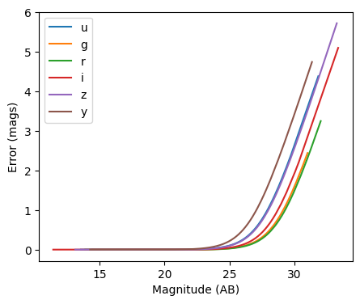

Photometric error stage demo
----------------------------

author: Tianqing Zhang, John-Franklin Crenshaw

This notebook demonstrate the use of
``rail.creation.degraders.photometric_errors``, which adds column for
the photometric noise to the catalog based on the package PhotErr
developed by John-Franklin Crenshaw. The RAIL stage PhotoErrorModel
inherit from the Noisifier base classes, and the LSST, Roman, Euclid
child classes inherit from the PhotoErrorModel

.. code:: ipython3

    
    from rail.creation.degraders.photometric_errors import LSSTErrorModel
    from rail.creation.degraders.photometric_errors import RomanErrorModel
    from rail.creation.degraders.photometric_errors import EuclidErrorModel
    
    from rail.core.data import PqHandle
    from rail.core.stage import RailStage
    
    import matplotlib.pyplot as plt
    import pandas as pd
    import numpy as np
    

.. code:: ipython3

    DS = RailStage.data_store
    DS.__class__.allow_overwrite = True

Create a random catalog with ugrizy+YJHF bands as the the true input
~~~~~~~~~~~~~~~~~~~~~~~~~~~~~~~~~~~~~~~~~~~~~~~~~~~~~~~~~~~~~~~~~~~~

.. code:: ipython3

    data = np.random.normal(23, 3, size = (1000,9))
    
    data_df = pd.DataFrame(data=data,    # values
                columns=['u', 'g', 'r', 'i', 'z', 'y', 'Y', 'J', 'H'])
    data_truth = PqHandle('input')
    data_truth.set_data(data_df)

.. code:: ipython3

    data_df

.. raw:: html

    

    
    <table border="1" class="dataframe">
      <thead>
        <tr style="text-align: right;">
          <th></th>
          <th>u</th>
          <th>g</th>
          <th>r</th>
          <th>i</th>
          <th>z</th>
          <th>y</th>
          <th>Y</th>
          <th>J</th>
          <th>H</th>
        </tr>
      </thead>
      <tbody>
        <tr>
          <th>0</th>
          <td>23.245507</td>
          <td>23.906375</td>
          <td>23.368376</td>
          <td>24.481634</td>
          <td>28.172537</td>
          <td>27.343718</td>
          <td>27.524844</td>
          <td>21.869608</td>
          <td>30.660303</td>
        </tr>
        <tr>
          <th>1</th>
          <td>19.565805</td>
          <td>18.497498</td>
          <td>23.479820</td>
          <td>22.619213</td>
          <td>19.894190</td>
          <td>22.379316</td>
          <td>25.772980</td>
          <td>21.693600</td>
          <td>25.363915</td>
        </tr>
        <tr>
          <th>2</th>
          <td>24.052530</td>
          <td>20.168456</td>
          <td>19.987288</td>
          <td>21.876591</td>
          <td>25.299467</td>
          <td>23.526235</td>
          <td>19.617380</td>
          <td>25.100904</td>
          <td>25.097105</td>
        </tr>
        <tr>
          <th>3</th>
          <td>22.631098</td>
          <td>26.429230</td>
          <td>24.682970</td>
          <td>19.744144</td>
          <td>22.084673</td>
          <td>21.978459</td>
          <td>25.313715</td>
          <td>23.319196</td>
          <td>28.840946</td>
        </tr>
        <tr>
          <th>4</th>
          <td>18.679294</td>
          <td>21.897394</td>
          <td>28.003763</td>
          <td>25.921678</td>
          <td>18.467494</td>
          <td>23.694714</td>
          <td>21.854418</td>
          <td>26.165265</td>
          <td>19.795787</td>
        </tr>
        <tr>
          <th>...</th>
          <td>...</td>
          <td>...</td>
          <td>...</td>
          <td>...</td>
          <td>...</td>
          <td>...</td>
          <td>...</td>
          <td>...</td>
          <td>...</td>
        </tr>
        <tr>
          <th>995</th>
          <td>22.894495</td>
          <td>19.777654</td>
          <td>23.181781</td>
          <td>22.347500</td>
          <td>22.120163</td>
          <td>19.693071</td>
          <td>19.676689</td>
          <td>24.891360</td>
          <td>28.394993</td>
        </tr>
        <tr>
          <th>996</th>
          <td>25.371877</td>
          <td>22.183401</td>
          <td>25.780414</td>
          <td>24.598351</td>
          <td>24.811701</td>
          <td>25.701421</td>
          <td>21.779403</td>
          <td>25.597481</td>
          <td>21.412015</td>
        </tr>
        <tr>
          <th>997</th>
          <td>29.070886</td>
          <td>22.483598</td>
          <td>27.708102</td>
          <td>23.536213</td>
          <td>18.022881</td>
          <td>19.398552</td>
          <td>25.473939</td>
          <td>26.981191</td>
          <td>27.514937</td>
        </tr>
        <tr>
          <th>998</th>
          <td>24.195895</td>
          <td>21.284954</td>
          <td>20.415033</td>
          <td>18.288713</td>
          <td>24.633856</td>
          <td>24.384216</td>
          <td>17.004897</td>
          <td>24.746161</td>
          <td>22.484030</td>
        </tr>
        <tr>
          <th>999</th>
          <td>24.030147</td>
          <td>27.381476</td>
          <td>22.560046</td>
          <td>21.907465</td>
          <td>21.385177</td>
          <td>23.845952</td>
          <td>24.352363</td>
          <td>19.192897</td>
          <td>17.370417</td>
        </tr>
      </tbody>
    </table>
    
1000 rows × 9 columns

    

The LSST error model adds noise to the optical bands
~~~~~~~~~~~~~~~~~~~~~~~~~~~~~~~~~~~~~~~~~~~~~~~~~~~~

.. code:: ipython3

    errorModel_lsst = LSSTErrorModel.make_stage(name="error_model")
    
    samples_w_errs = errorModel_lsst(data_truth)
    samples_w_errs()

.. parsed-literal::

    Inserting handle into data store.  input: None, error_model
    Inserting handle into data store.  output_error_model: inprogress_output_error_model.pq, error_model

.. raw:: html

    

    
    <table border="1" class="dataframe">
      <thead>
        <tr style="text-align: right;">
          <th></th>
          <th>u</th>
          <th>u_err</th>
          <th>g</th>
          <th>g_err</th>
          <th>r</th>
          <th>r_err</th>
          <th>i</th>
          <th>i_err</th>
          <th>z</th>
          <th>z_err</th>
          <th>y</th>
          <th>y_err</th>
          <th>Y</th>
          <th>J</th>
          <th>H</th>
        </tr>
      </thead>
      <tbody>
        <tr>
          <th>0</th>
          <td>23.254580</td>
          <td>0.023615</td>
          <td>23.900279</td>
          <td>0.014552</td>
          <td>23.361530</td>
          <td>0.008875</td>
          <td>24.496595</td>
          <td>0.033977</td>
          <td>29.672158</td>
          <td>2.287039</td>
          <td>26.960091</td>
          <td>0.943643</td>
          <td>27.524844</td>
          <td>21.869608</td>
          <td>30.660303</td>
        </tr>
        <tr>
          <th>1</th>
          <td>19.563054</td>
          <td>0.005160</td>
          <td>18.504476</td>
          <td>0.005007</td>
          <td>23.499712</td>
          <td>0.009688</td>
          <td>22.615950</td>
          <td>0.007945</td>
          <td>19.891768</td>
          <td>0.005130</td>
          <td>22.342305</td>
          <td>0.021942</td>
          <td>25.772980</td>
          <td>21.693600</td>
          <td>25.363915</td>
        </tr>
        <tr>
          <th>2</th>
          <td>24.030059</td>
          <td>0.046232</td>
          <td>20.178592</td>
          <td>0.005048</td>
          <td>19.981446</td>
          <td>0.005023</td>
          <td>21.876226</td>
          <td>0.005947</td>
          <td>25.380169</td>
          <td>0.141159</td>
          <td>23.578406</td>
          <td>0.065147</td>
          <td>19.617380</td>
          <td>25.100904</td>
          <td>25.097105</td>
        </tr>
        <tr>
          <th>3</th>
          <td>22.661899</td>
          <td>0.014589</td>
          <td>26.495369</td>
          <td>0.137940</td>
          <td>24.707895</td>
          <td>0.025176</td>
          <td>19.736989</td>
          <td>0.005035</td>
          <td>22.078542</td>
          <td>0.008901</td>
          <td>21.957634</td>
          <td>0.015900</td>
          <td>25.313715</td>
          <td>23.319196</td>
          <td>28.840946</td>
        </tr>
        <tr>
          <th>4</th>
          <td>18.677044</td>
          <td>0.005057</td>
          <td>21.892200</td>
          <td>0.005553</td>
          <td>29.411397</td>
          <td>1.092912</td>
          <td>26.026424</td>
          <td>0.130979</td>
          <td>18.468236</td>
          <td>0.005018</td>
          <td>23.597374</td>
          <td>0.066251</td>
          <td>21.854418</td>
          <td>26.165265</td>
          <td>19.795787</td>
        </tr>
        <tr>
          <th>...</th>
          <td>...</td>
          <td>...</td>
          <td>...</td>
          <td>...</td>
          <td>...</td>
          <td>...</td>
          <td>...</td>
          <td>...</td>
          <td>...</td>
          <td>...</td>
          <td>...</td>
          <td>...</td>
          <td>...</td>
          <td>...</td>
          <td>...</td>
        </tr>
        <tr>
          <th>995</th>
          <td>22.904020</td>
          <td>0.017663</td>
          <td>19.778155</td>
          <td>0.005029</td>
          <td>23.181036</td>
          <td>0.007998</td>
          <td>22.347929</td>
          <td>0.006978</td>
          <td>22.132579</td>
          <td>0.009205</td>
          <td>19.690529</td>
          <td>0.005406</td>
          <td>19.676689</td>
          <td>24.891360</td>
          <td>28.394993</td>
        </tr>
        <tr>
          <th>996</th>
          <td>25.248337</td>
          <td>0.134236</td>
          <td>22.186439</td>
          <td>0.005870</td>
          <td>25.661913</td>
          <td>0.058448</td>
          <td>24.619953</td>
          <td>0.037892</td>
          <td>24.902694</td>
          <td>0.093147</td>
          <td>25.456634</td>
          <td>0.323358</td>
          <td>21.779403</td>
          <td>25.597481</td>
          <td>21.412015</td>
        </tr>
        <tr>
          <th>997</th>
          <td>inf</td>
          <td>inf</td>
          <td>22.477236</td>
          <td>0.006358</td>
          <td>27.279266</td>
          <td>0.236928</td>
          <td>23.549638</td>
          <td>0.015133</td>
          <td>18.017330</td>
          <td>0.005010</td>
          <td>19.397543</td>
          <td>0.005254</td>
          <td>25.473939</td>
          <td>26.981191</td>
          <td>27.514937</td>
        </tr>
        <tr>
          <th>998</th>
          <td>24.088789</td>
          <td>0.048681</td>
          <td>21.277932</td>
          <td>0.005218</td>
          <td>20.419784</td>
          <td>0.005042</td>
          <td>18.298771</td>
          <td>0.005006</td>
          <td>24.745469</td>
          <td>0.081107</td>
          <td>24.193501</td>
          <td>0.111950</td>
          <td>17.004897</td>
          <td>24.746161</td>
          <td>22.484030</td>
        </tr>
        <tr>
          <th>999</th>
          <td>23.989063</td>
          <td>0.044598</td>
          <td>27.191339</td>
          <td>0.248161</td>
          <td>22.555595</td>
          <td>0.006159</td>
          <td>21.906622</td>
          <td>0.005995</td>
          <td>21.375690</td>
          <td>0.006375</td>
          <td>23.670234</td>
          <td>0.070666</td>
          <td>24.352363</td>
          <td>19.192897</td>
          <td>17.370417</td>
        </tr>
      </tbody>
    </table>
    
1000 rows × 15 columns

    

.. code:: ipython3

    fig, ax = plt.subplots(figsize=(5, 4), dpi=100)
    
    for band in "ugrizy":
        # pull out the magnitudes and errors
        mags = samples_w_errs.data[band].to_numpy()
        errs = samples_w_errs.data[band + "_err"].to_numpy()
    
        # sort them by magnitude
        mags, errs = mags[mags.argsort()], errs[mags.argsort()]
    
        # plot errs vs mags
        ax.plot(mags, errs, label=band)
    
    ax.legend()
    ax.set(xlabel="Magnitude (AB)", ylabel="Error (mags)")
    plt.show()

The Roman error model adds noise to the infrared bands
~~~~~~~~~~~~~~~~~~~~~~~~~~~~~~~~~~~~~~~~~~~~~~~~~~~~~~

.. code:: ipython3

    errorModel_Roman = RomanErrorModel.make_stage(name="error_model", )
    

.. code:: ipython3

    errorModel_Roman.config['m5']['Y'] = 27.0

.. code:: ipython3

    errorModel_Roman.config['theta']['Y'] = 27.0

.. code:: ipython3

    samples_w_errs_roman = errorModel_Roman(data_truth)
    samples_w_errs_roman()

.. parsed-literal::

    Inserting handle into data store.  output_error_model: inprogress_output_error_model.pq, error_model

.. raw:: html

    

    
    <table border="1" class="dataframe">
      <thead>
        <tr style="text-align: right;">
          <th></th>
          <th>u</th>
          <th>g</th>
          <th>r</th>
          <th>i</th>
          <th>z</th>
          <th>y</th>
          <th>Y</th>
          <th>Y_err</th>
          <th>J</th>
          <th>J_err</th>
          <th>H</th>
          <th>H_err</th>
        </tr>
      </thead>
      <tbody>
        <tr>
          <th>0</th>
          <td>23.245507</td>
          <td>23.906375</td>
          <td>23.368376</td>
          <td>24.481634</td>
          <td>28.172537</td>
          <td>27.343718</td>
          <td>27.943712</td>
          <td>0.423465</td>
          <td>21.860044</td>
          <td>0.005993</td>
          <td>28.519098</td>
          <td>0.954242</td>
        </tr>
        <tr>
          <th>1</th>
          <td>19.565805</td>
          <td>18.497498</td>
          <td>23.479820</td>
          <td>22.619213</td>
          <td>19.894190</td>
          <td>22.379316</td>
          <td>25.748284</td>
          <td>0.066654</td>
          <td>21.701295</td>
          <td>0.005758</td>
          <td>25.390365</td>
          <td>0.082607</td>
        </tr>
        <tr>
          <th>2</th>
          <td>24.052530</td>
          <td>20.168456</td>
          <td>19.987288</td>
          <td>21.876591</td>
          <td>25.299467</td>
          <td>23.526235</td>
          <td>19.622706</td>
          <td>0.005006</td>
          <td>25.090526</td>
          <td>0.063318</td>
          <td>25.103691</td>
          <td>0.064064</td>
        </tr>
        <tr>
          <th>3</th>
          <td>22.631098</td>
          <td>26.429230</td>
          <td>24.682970</td>
          <td>19.744144</td>
          <td>22.084673</td>
          <td>21.978459</td>
          <td>25.309939</td>
          <td>0.045109</td>
          <td>23.325192</td>
          <td>0.013650</td>
          <td>27.451182</td>
          <td>0.459346</td>
        </tr>
        <tr>
          <th>4</th>
          <td>18.679294</td>
          <td>21.897394</td>
          <td>28.003763</td>
          <td>25.921678</td>
          <td>18.467494</td>
          <td>23.694714</td>
          <td>21.863343</td>
          <td>0.005352</td>
          <td>26.200298</td>
          <td>0.167177</td>
          <td>19.797783</td>
          <td>0.005024</td>
        </tr>
        <tr>
          <th>...</th>
          <td>...</td>
          <td>...</td>
          <td>...</td>
          <td>...</td>
          <td>...</td>
          <td>...</td>
          <td>...</td>
          <td>...</td>
          <td>...</td>
          <td>...</td>
          <td>...</td>
          <td>...</td>
        </tr>
        <tr>
          <th>995</th>
          <td>22.894495</td>
          <td>19.777654</td>
          <td>23.181781</td>
          <td>22.347500</td>
          <td>22.120163</td>
          <td>19.693071</td>
          <td>19.668125</td>
          <td>0.005006</td>
          <td>24.865040</td>
          <td>0.051798</td>
          <td>28.128673</td>
          <td>0.743245</td>
        </tr>
        <tr>
          <th>996</th>
          <td>25.371877</td>
          <td>22.183401</td>
          <td>25.780414</td>
          <td>24.598351</td>
          <td>24.811701</td>
          <td>25.701421</td>
          <td>21.780610</td>
          <td>0.005303</td>
          <td>25.660760</td>
          <td>0.104804</td>
          <td>21.419789</td>
          <td>0.005464</td>
        </tr>
        <tr>
          <th>997</th>
          <td>29.070886</td>
          <td>22.483598</td>
          <td>27.708102</td>
          <td>23.536213</td>
          <td>18.022881</td>
          <td>19.398552</td>
          <td>25.442055</td>
          <td>0.050748</td>
          <td>26.655740</td>
          <td>0.245018</td>
          <td>27.334983</td>
          <td>0.420654</td>
        </tr>
        <tr>
          <th>998</th>
          <td>24.195895</td>
          <td>21.284954</td>
          <td>20.415033</td>
          <td>18.288713</td>
          <td>24.633856</td>
          <td>24.384216</td>
          <td>17.018648</td>
          <td>0.005000</td>
          <td>24.837417</td>
          <td>0.050538</td>
          <td>22.486203</td>
          <td>0.007718</td>
        </tr>
        <tr>
          <th>999</th>
          <td>24.030147</td>
          <td>27.381476</td>
          <td>22.560046</td>
          <td>21.907465</td>
          <td>21.385177</td>
          <td>23.845952</td>
          <td>24.354065</td>
          <td>0.019459</td>
          <td>19.191546</td>
          <td>0.005008</td>
          <td>17.377458</td>
          <td>0.005000</td>
        </tr>
      </tbody>
    </table>
    
1000 rows × 12 columns

    

.. code:: ipython3

    fig, ax = plt.subplots(figsize=(5, 4), dpi=100)
    
    for band in "YJH":
        # pull out the magnitudes and errors
        mags = samples_w_errs_roman.data[band].to_numpy()
        errs = samples_w_errs_roman.data[band + "_err"].to_numpy()
    
        # sort them by magnitude
        mags, errs = mags[mags.argsort()], errs[mags.argsort()]
    
        # plot errs vs mags
        ax.plot(mags, errs, label=band)
    
    ax.legend()
    ax.set(xlabel="Magnitude (AB)", ylabel="Error (mags)")
    plt.show()

.. image:: ../../../docs/rendered/creation_examples/02_Photometric_Realization_with_Other_Surveys_files/../../../docs/rendered/creation_examples/02_Photometric_Realization_with_Other_Surveys_14_0.png

The Euclid error model adds noise to YJH bands
~~~~~~~~~~~~~~~~~~~~~~~~~~~~~~~~~~~~~~~~~~~~~~

.. code:: ipython3

    errorModel_Euclid = EuclidErrorModel.make_stage(name="error_model")
    
    samples_w_errs_Euclid = errorModel_Euclid(data_truth)
    samples_w_errs_Euclid()

.. parsed-literal::

    Inserting handle into data store.  output_error_model: inprogress_output_error_model.pq, error_model

.. raw:: html

    

    
    <table border="1" class="dataframe">
      <thead>
        <tr style="text-align: right;">
          <th></th>
          <th>u</th>
          <th>g</th>
          <th>r</th>
          <th>i</th>
          <th>z</th>
          <th>y</th>
          <th>Y</th>
          <th>Y_err</th>
          <th>J</th>
          <th>J_err</th>
          <th>H</th>
          <th>H_err</th>
        </tr>
      </thead>
      <tbody>
        <tr>
          <th>0</th>
          <td>23.245507</td>
          <td>23.906375</td>
          <td>23.368376</td>
          <td>24.481634</td>
          <td>28.172537</td>
          <td>27.343718</td>
          <td>28.607199</td>
          <td>2.657956</td>
          <td>21.883765</td>
          <td>0.019959</td>
          <td>25.996947</td>
          <td>0.679948</td>
        </tr>
        <tr>
          <th>1</th>
          <td>19.565805</td>
          <td>18.497498</td>
          <td>23.479820</td>
          <td>22.619213</td>
          <td>19.894190</td>
          <td>22.379316</td>
          <td>25.897890</td>
          <td>0.680387</td>
          <td>21.715119</td>
          <td>0.017300</td>
          <td>inf</td>
          <td>inf</td>
        </tr>
        <tr>
          <th>2</th>
          <td>24.052530</td>
          <td>20.168456</td>
          <td>19.987288</td>
          <td>21.876591</td>
          <td>25.299467</td>
          <td>23.526235</td>
          <td>19.622589</td>
          <td>0.005786</td>
          <td>25.322794</td>
          <td>0.385869</td>
          <td>25.629290</td>
          <td>0.524138</td>
        </tr>
        <tr>
          <th>3</th>
          <td>22.631098</td>
          <td>26.429230</td>
          <td>24.682970</td>
          <td>19.744144</td>
          <td>22.084673</td>
          <td>21.978459</td>
          <td>25.208796</td>
          <td>0.412312</td>
          <td>23.336962</td>
          <td>0.072114</td>
          <td>27.146505</td>
          <td>1.363195</td>
        </tr>
        <tr>
          <th>4</th>
          <td>18.679294</td>
          <td>21.897394</td>
          <td>28.003763</td>
          <td>25.921678</td>
          <td>18.467494</td>
          <td>23.694714</td>
          <td>21.869528</td>
          <td>0.023432</td>
          <td>26.651534</td>
          <td>0.973327</td>
          <td>19.803979</td>
          <td>0.005903</td>
        </tr>
        <tr>
          <th>...</th>
          <td>...</td>
          <td>...</td>
          <td>...</td>
          <td>...</td>
          <td>...</td>
          <td>...</td>
          <td>...</td>
          <td>...</td>
          <td>...</td>
          <td>...</td>
          <td>...</td>
          <td>...</td>
        </tr>
        <tr>
          <th>995</th>
          <td>22.894495</td>
          <td>19.777654</td>
          <td>23.181781</td>
          <td>22.347500</td>
          <td>22.120163</td>
          <td>19.693071</td>
          <td>19.679853</td>
          <td>0.005867</td>
          <td>24.914289</td>
          <td>0.278958</td>
          <td>29.778537</td>
          <td>3.668759</td>
        </tr>
        <tr>
          <th>996</th>
          <td>25.371877</td>
          <td>22.183401</td>
          <td>25.780414</td>
          <td>24.598351</td>
          <td>24.811701</td>
          <td>25.701421</td>
          <td>21.755854</td>
          <td>0.021234</td>
          <td>25.611297</td>
          <td>0.480461</td>
          <td>21.388488</td>
          <td>0.014358</td>
        </tr>
        <tr>
          <th>997</th>
          <td>29.070886</td>
          <td>22.483598</td>
          <td>27.708102</td>
          <td>23.536213</td>
          <td>18.022881</td>
          <td>19.398552</td>
          <td>25.639832</td>
          <td>0.567804</td>
          <td>27.435754</td>
          <td>1.501797</td>
          <td>25.329842</td>
          <td>0.419005</td>
        </tr>
        <tr>
          <th>998</th>
          <td>24.195895</td>
          <td>21.284954</td>
          <td>20.415033</td>
          <td>18.288713</td>
          <td>24.633856</td>
          <td>24.384216</td>
          <td>17.002280</td>
          <td>0.005007</td>
          <td>24.621043</td>
          <td>0.219130</td>
          <td>22.451089</td>
          <td>0.035823</td>
        </tr>
        <tr>
          <th>999</th>
          <td>24.030147</td>
          <td>27.381476</td>
          <td>22.560046</td>
          <td>21.907465</td>
          <td>21.385177</td>
          <td>23.845952</td>
          <td>24.152559</td>
          <td>0.174785</td>
          <td>19.185220</td>
          <td>0.005256</td>
          <td>17.378992</td>
          <td>0.005011</td>
        </tr>
      </tbody>
    </table>
    
1000 rows × 12 columns

    

.. code:: ipython3

    fig, ax = plt.subplots(figsize=(5, 4), dpi=100)
    
    for band in "YJH":
        # pull out the magnitudes and errors
        mags = samples_w_errs_Euclid.data[band].to_numpy()
        errs = samples_w_errs_Euclid.data[band + "_err"].to_numpy()
    
        # sort them by magnitude
        mags, errs = mags[mags.argsort()], errs[mags.argsort()]
    
        # plot errs vs mags
        ax.plot(mags, errs, label=band)
    
    ax.legend()
    ax.set(xlabel="Magnitude (AB)", ylabel="Error (mags)")
    plt.show()

.. image:: ../../../docs/rendered/creation_examples/02_Photometric_Realization_with_Other_Surveys_files/../../../docs/rendered/creation_examples/02_Photometric_Realization_with_Other_Surveys_17_0.png

