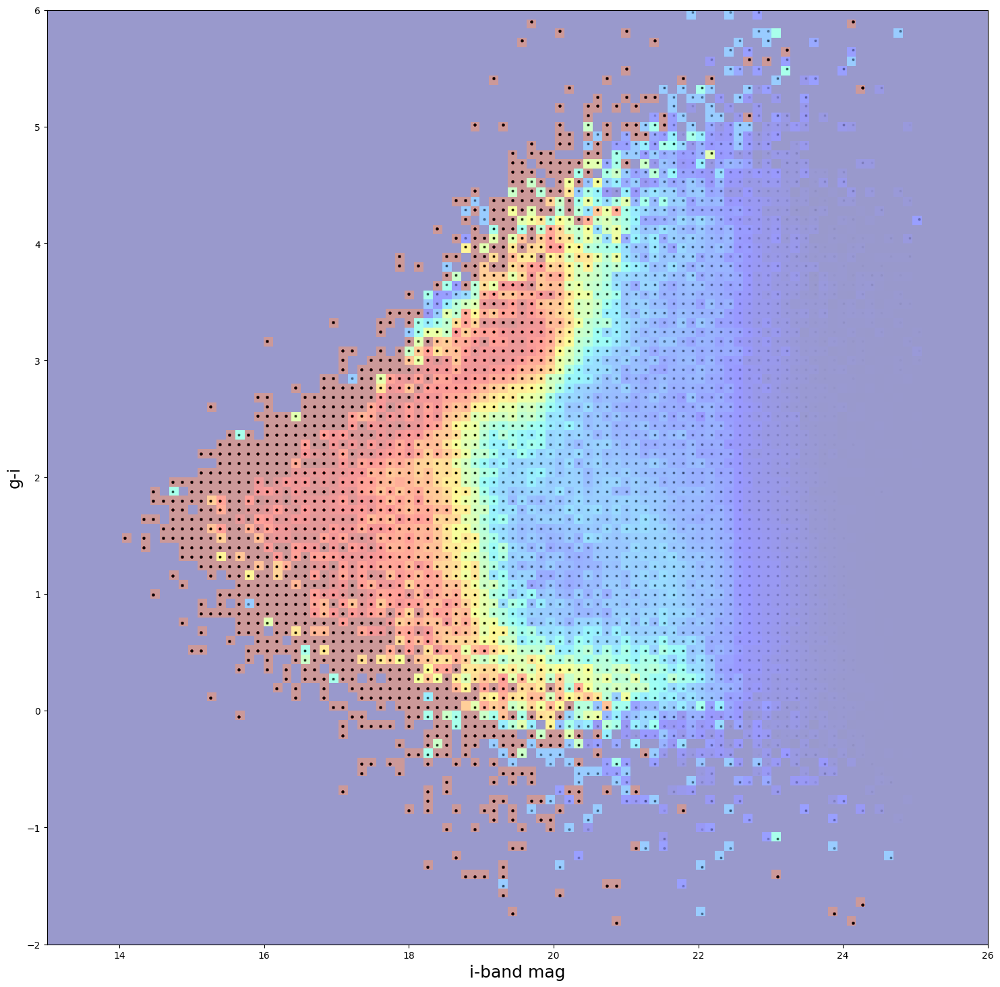

GridSelection Degrader to Emulate HSC Training Samples
======================================================

last run successfully: April 26, 2023

The GridSelection degrader can be used to model the spectroscopic
success rates in training sets based on real data. Given a 2-dimensional
grid of spec-z success ratio as a function of two variables (often
magnitude or color), the degrader will draw the appropriate fraction of
samples from the input data and return a sample with incompleteness
modeled. An additional redshift cut can also be applied, where all
redshifts above the cutoff are also removed from the sample.

| The degrader takes the following arguments: - ``ratio_file``: the name
  of the file containing the 2-dimensional grid of spec-z success -
  ``random_seed``: random seed to feed to numpy for reproducibility -
  ``settings_file``: path to the pickled file containing settings that
  define the 2-dimensional grid. There is a mechanism to make cuts
  either on a single column from the input data, or a difference
  (i.e. either a magnitude or a color as a difference of two
  magnitudes). The parameters in the settings file are: - ``x_band_1``:
  column name for the x-axis variable from ratios grid.
| - ``x_band_2``: [optional] column name for the second x-axis variable.
  If x_band_2 is set to ’’ then it is assumed that the x-axis is
  parameterized in terms of x_band_1. If x_band_2 is not ’’ then the
  x-axis is compared against (x_band_1 - x_band_2) -``y_band_1`` and
  ``y_band_2``: analagous to ``x_band_1`` and ``x_band_2`` but for the
  y-axis - ``x_limits`` and ``y_limits``: 2-element lists with the
  minimum and maximum values for the grid, e.g. [13, 26] if the limits
  in the x-axis are between magnitudes of 13 and 26.

In this quick notebook we’ll create a grid of mock galaxies on the same
grid on which the HyperSuprimeCam Survey (HSC) spectroscopic success has
been parameterized by Irene Moskowitz (and available in the rail_base
repository at ``rail_base/src/rail/examples_data/creation_data/``), and
plot the success rate to visualize the spectroscopic success rate for
HSC.

.. code:: ipython3

    import rail
    import os
    import matplotlib.pyplot as plt
    import numpy as np
    import tables_io
    import pandas as pd
    #from rail.core.data import TableHandle
    from rail.core.stage import RailStage
    from rail.utils.path_utils import find_rail_file
    %matplotlib inline 

.. code:: ipython3

    DS = RailStage.data_store
    DS.__class__.allow_overwrite = True

Let’s make a grid of fake data matching the grid used by HSC. The 2D
grid of spec-z success in this case is parameterized in terms of ``g-z``
color vs ``i-band`` magnitude, with ``g-z`` between ``[-2, 6]`` and
``i-band`` magnitude spanning ``[13, 26]``. Let’s generate 100 identical
objects in each of the 100x100=10,000 grid cells, for a total of
1,000,000 mock galaxies. The only quantities that we need are ``g``,
``i``, ``z`` magnitudes and a ``redshift`` that we can just set to a
random number between 1 and 2.5. The only thing that we really need is
consistent g-z and i-mag values, so we can just set g to 20.0 in all
circumstances.

.. code:: ipython3

    gridgz, gridi = np.meshgrid(np.linspace(-1.98, 5.98, 100), np.linspace(13.0325, 25.9675, 100))

.. code:: ipython3

    i = gridi.flatten()
    gz = gridgz.flatten()
    g = np.full_like(i, 20.0, dtype=np.double)
    z = g - gz
    redshift = np.round(np.random.uniform(size=len(i))*2.5, 2)

.. code:: ipython3

    mockdict = {}
    for label, item in zip(['i', 'gz', 'g', 'z', 'redshift'], [i, gz, g, z, redshift]):
        mockdict[f'{label}'] = np.repeat(item, 100).flatten()

.. code:: ipython3

    df = pd.DataFrame(mockdict)

.. code:: ipython3

    df.head()

.. raw:: html

    

    
    <table border="1" class="dataframe">
      <thead>
        <tr style="text-align: right;">
          <th></th>
          <th>i</th>
          <th>gz</th>
          <th>g</th>
          <th>z</th>
          <th>redshift</th>
        </tr>
      </thead>
      <tbody>
        <tr>
          <th>0</th>
          <td>13.0325</td>
          <td>-1.98</td>
          <td>20.0</td>
          <td>21.98</td>
          <td>1.13</td>
        </tr>
        <tr>
          <th>1</th>
          <td>13.0325</td>
          <td>-1.98</td>
          <td>20.0</td>
          <td>21.98</td>
          <td>1.13</td>
        </tr>
        <tr>
          <th>2</th>
          <td>13.0325</td>
          <td>-1.98</td>
          <td>20.0</td>
          <td>21.98</td>
          <td>1.13</td>
        </tr>
        <tr>
          <th>3</th>
          <td>13.0325</td>
          <td>-1.98</td>
          <td>20.0</td>
          <td>21.98</td>
          <td>1.13</td>
        </tr>
        <tr>
          <th>4</th>
          <td>13.0325</td>
          <td>-1.98</td>
          <td>20.0</td>
          <td>21.98</td>
          <td>1.13</td>
        </tr>
      </tbody>
    </table>
    

Now, let’s import the GridSelection degrader and set up the config dict
parameters. We will set a redshift cut of 5.1 so as to not cut any of
our mock galaxies, if you would want a redshift cut, you would simply
change this parameter as desired. There is an optional
``color_redshift_cut`` that scales the number of galaxies kept, we will
turn this off. There is also a ``percentile_cut`` that computes
percentiles in redshift of each cell and removes the highest redshift
galaxies, as those are usually the most likely to not be recovered by a
spectroscopic survey. For simplicity, we will set percentile_cut to 100.
to not remove any galaxies with this cut.

The ratio file for HSC is located in the ``RAIL/examples/creation/data``
directory, as we are in ``RAIL/examples/creation`` folder with this demo
the paths for the ``ratio_file`` and ``settings_file`` are set
accordingly.

We will set a random seed for reproducibility, and set the output file
to write our incomplete catalog to “test_hsc.pq”.

.. code:: ipython3

    from rail.creation.degraders.grid_selection import GridSelection

.. code:: ipython3

    configdict = dict(redshift_cut=5.1, 
                      ratio_file=find_rail_file('examples_data/creation_data/data/hsc_ratios_and_specz.hdf5'),
                      settings_file=find_rail_file('examples_data/creation_data/data/HSC_grid_settings.pkl'),
                      percentile_cut=100.,
                      color_redshift_cut=False,
                      output="test_hsc.pq", random_seed=66)

.. code:: ipython3

    hsc_selecter = GridSelection.make_stage(name='hsc_cutter', **configdict)

Let’s run the code and see how long it takes:

.. code:: ipython3

    %%time
    trim_data = hsc_selecter(df)

.. parsed-literal::

    Inserting handle into data store.  input: None, hsc_cutter

.. parsed-literal::

    Inserting handle into data store.  output_hsc_cutter: inprogress_test_hsc.pq, hsc_cutter
    CPU times: user 2.67 s, sys: 104 ms, total: 2.77 s
    Wall time: 2.77 s

This took 10.1s on my home computer, not too bad for 4 million mock
galaxies.

.. code:: ipython3

    trim_data().info()

.. parsed-literal::

    <class 'pandas.core.frame.DataFrame'>
    Index: 181814 entries, 84300 to 927787
    Data columns (total 9 columns):
     #   Column     Non-Null Count   Dtype  
    ---  ------     --------------   -----  
     0   i          181814 non-null  float64
     1   gz         181814 non-null  float64
     2   g          181814 non-null  float64
     3   z          181814 non-null  float64
     4   redshift   181814 non-null  float64
     5   x_vals     181814 non-null  float64
     6   y_vals     181814 non-null  float64
     7   ratios     181814 non-null  float64
     8   max_specz  181814 non-null  float64
    dtypes: float64(9)
    memory usage: 13.9 MB

And we see that we’ve kept 625,677 out of the 4,000,000 galaxies in the
initial sample, so about 15% of the initial sample. To visualize our
cuts, let’s read in the success ratios file and plot our sample overlaid
with an alpha of 0.01, that way the strength of the black dot will give
a visual indication of how many galaxies in each cell we’ve kept.

.. code:: ipython3

    # compare to sum of ratios * 100
    ratio_file=find_rail_file('examples_data/creation_data/data/hsc_ratios_and_specz.hdf5')

.. code:: ipython3

    allrats = tables_io.read(ratio_file)['ratios']

.. code:: ipython3

    trim_data()['color'] = trim_data()['g'] - trim_data()['z']

.. parsed-literal::

    /tmp/ipykernel_4527/1938339790.py:1: SettingWithCopyWarning: 
    A value is trying to be set on a copy of a slice from a DataFrame.
    Try using .loc[row_indexer,col_indexer] = value instead
    
    See the caveats in the documentation: https://pandas.pydata.org/pandas-docs/stable/user_guide/indexing.html#returning-a-view-versus-a-copy
      trim_data()['color'] = trim_data()['g'] - trim_data()['z']

.. code:: ipython3

    bgr, bi = np.meshgrid(np.linspace(-2, 6, 101), np.linspace(13, 26, 101))

.. code:: ipython3

    bratios = tables_io.read(find_rail_file('examples_data/creation_data/data/hsc_ratios_and_specz.hdf5'))['ratios']

.. code:: ipython3

    plt.figure(figsize=(18,18))
    plt.pcolormesh(bi, bgr, bratios.T, cmap='jet', vmin=0, vmax=1,alpha=0.4)
    plt.scatter(trim_data()['i'], trim_data()['color'], s=3, c='k',alpha =.015)
    plt.xlabel("i-band mag", fontsize=18)
    plt.ylabel("g-i", fontsize=18)

.. parsed-literal::

    Text(0, 0.5, 'g-i')

The colormap shows the HSC ratios and the strenth of the black dots
shows how many galaxies were actually kept. We see perfect agreement
between our predicted ratios and the actual number of galaxies kept, the
degrader is functioning properly, and we see a nice visual
representation of the resulting spectroscopic sample incompleteness.

As our demo data is just a grid of mock points, let’s remove it so we do
not leave a large file sitting around:

.. code:: ipython3

    os.remove("./test_hsc.pq")
