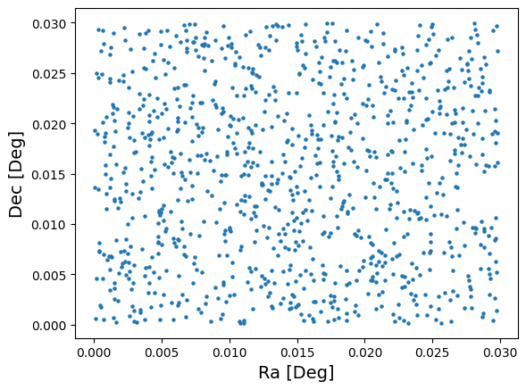
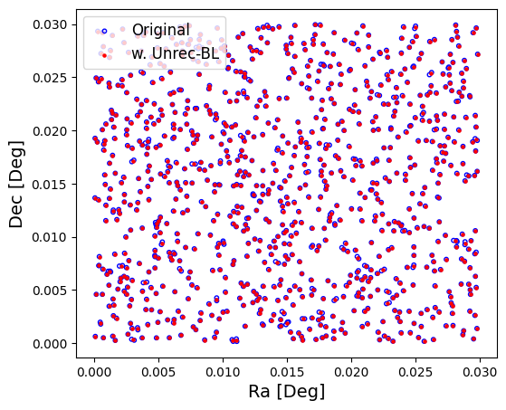
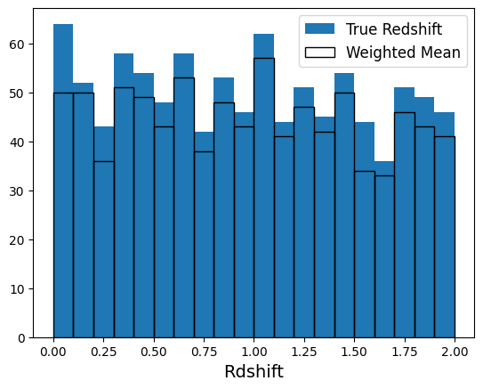
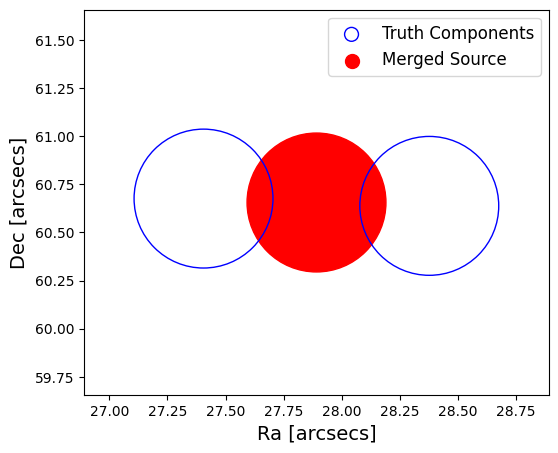

Blending Degrader demo
----------------------

author: Shuang Liang

This notebook demonstrate the use of
``rail.creation.degradation.unrec_bl_model``, which uses Friends of
Friends to finds sources close to each other and merge them into
unrecognized blends

.. code:: ipython3

    from rail.creation.degraders.unrec_bl_model import UnrecBlModel
    
    from rail.core.data import PqHandle
    from rail.core.stage import RailStage
    
    import matplotlib.pyplot as plt
    import pandas as pd, numpy as np

.. code:: ipython3

    DS = RailStage.data_store
    DS.__class__.allow_overwrite = True

Create a random catalog with ugrizy+YJHF bands as the the true input
~~~~~~~~~~~~~~~~~~~~~~~~~~~~~~~~~~~~~~~~~~~~~~~~~~~~~~~~~~~~~~~~~~~~

.. code:: ipython3

    data = np.random.normal(24, 3, size = (1000,13))
    data[:, 0] = np.random.uniform(low=0, high=0.03, size=1000)
    data[:, 1] = np.random.uniform(low=0, high=0.03, size=1000)
    data[:, 2] = np.random.uniform(low=0, high=2, size=1000)
    
    data_df = pd.DataFrame(data=data,    # values
                columns=['ra', 'dec', 'z_true', 'u', 'g', 'r', 'i', 'z', 'y', 'Y', 'J', 'H', 'F'])
    
    data_truth_handle = DS.add_data('input', data_df, PqHandle)
    data_truth = data_truth_handle.data

.. code:: ipython3

    #data_df.to_parquet('bl_test.pq')

.. code:: ipython3

    plt.scatter(data_truth['ra'], data_truth['dec'], s=5)
    plt.xlabel("Ra [Deg]", fontsize=14)
    plt.ylabel("Dec [Deg]", fontsize=14)
    plt.show()

The blending model
~~~~~~~~~~~~~~~~~~

.. code:: ipython3

    ## model configuration; linking length is in arcsecs
    
    lsst_zp_dict = {'u':12.65, 'g':14.69, 'r':14.56, 'i': 14.38, 'z':13.99, 'y': 13.02}
    blModel = UnrecBlModel.make_stage(name='unrec_bl_model', ra_label='ra', dec_label='dec', linking_lengths=1.0, \
                                      bands='ugrizy', zp_dict=lsst_zp_dict, 
                                      ref_band = 'i', redshift_col = 'z_true')
    blModel.get_config_dict()

.. parsed-literal::

    {'output_mode': 'default',
     'seed': 12345,
     'ra_label': 'ra',
     'dec_label': 'dec',
     'linking_lengths': 1.0,
     'bands': ['u', 'g', 'r', 'i', 'z', 'y'],
     'zp_dict': {'u': 12.65,
      'g': 14.69,
      'r': 14.56,
      'i': 14.38,
      'z': 13.99,
      'y': 13.02},
     'ref_band': 'i',
     'redshift_col': 'z_true',
     'match_size': False,
     'match_shape': False,
     'obj_size': 'obj_size',
     'a': 'semi_major',
     'b': 'semi_minor',
     'theta': 'orientation',
     'name': 'unrec_bl_model',
     'config': None}

.. code:: ipython3

    # run the model
    
    outputs = blModel(data_truth)
    
    samples_w_bl = outputs['output'].data
    component_ind = outputs['compInd'].data

.. parsed-literal::

    Inserting handle into data store.  output_unrec_bl_model: inprogress_output_unrec_bl_model.pq, unrec_bl_model
    Inserting handle into data store.  compInd_unrec_bl_model: inprogress_compInd_unrec_bl_model.pq, unrec_bl_model

.. code:: ipython3

    fig, ax = plt.subplots(figsize=(6, 5), dpi=100)
    
    ax.scatter(data_truth['ra'],   data_truth['dec'],   s=10, facecolors='none', edgecolors='b', label='Original')
    ax.scatter(samples_w_bl['ra'], samples_w_bl['dec'], s=5, c='r', label='w. Unrec-BL')
    
    ax.legend(loc=2, fontsize=12)
    ax.set_xlabel("Ra [Deg]", fontsize=14)
    ax.set_ylabel("Dec [Deg]", fontsize=14)
    
    plt.show()

.. code:: ipython3

    b = 'i'
    plt.hist(data_truth[b], bins=np.linspace(10, 30, 20), label='Original')
    plt.hist(samples_w_bl[b], bins=np.linspace(10, 30, 20),  fill=False, label='w. Unrec-BL')
    
    plt.xlabel(fr'Magnitude ${b}$', fontsize=14)
    plt.legend(fontsize=12)
    plt.show()

.. image:: ../../../docs/rendered/creation_examples/06_Blending_Degrader_files/../../../docs/rendered/creation_examples/06_Blending_Degrader_11_0.png

.. code:: ipython3

    
    plt.hist(data_truth['z_true'], bins=20, label='True Redshift')
    plt.hist(samples_w_bl['z_weighted'], bins=20,  fill=False, label='Weighted Mean')
    
    plt.xlabel(fr'Rdshift', fontsize=14)
    plt.legend(fontsize=12)
    plt.show()

Study one BL case
~~~~~~~~~~~~~~~~~

.. code:: ipython3

    ## find a source with more than 1 truth component
    
    group_size = 1
    while group_size==1:
    
        rand_ind = np.random.randint(len(samples_w_bl))
        this_bl = samples_w_bl.iloc[rand_ind]
        group_id = this_bl['group_id']
    
        mask = (component_ind['group_id'] == group_id)
        FoF_group = component_ind[mask]
        group_size = len(FoF_group)
    
    truth_comp = data_truth.iloc[FoF_group.index]
    
    print('Truth RA / Blended RA:')
    print(truth_comp['ra'].to_numpy(), '/', this_bl['ra'])
    print("")
    
    print('Truth DEC / Blended DEC:')
    print(truth_comp['dec'].to_numpy(), '/', this_bl['dec'])
    print("")
    
    for b in 'ugrizy':
        print(f'Truth mag {b} / Blended mag {b}:')
        print(truth_comp[b].to_numpy(), '/', this_bl[b])
        print("")
        

.. parsed-literal::

    Truth RA / Blended RA:
    [0.02436786 0.02424273 0.02423074 0.02441391] / 0.02431380797363244
    
    Truth DEC / Blended DEC:
    [0.02012846 0.0206918  0.0203605  0.02053747] / 0.020429557978536503
    
    Truth mag u / Blended mag u:
    [19.90346521 21.84021452 26.07922328 22.60968524] / 19.657648795352742
    
    Truth mag g / Blended mag g:
    [25.91187857 26.33795846 30.32948287 22.10141529] / 22.04779828167375
    
    Truth mag r / Blended mag r:
    [24.40558977 21.07607267 26.48067439 21.71608075] / 20.560296822528752
    
    Truth mag i / Blended mag i:
    [23.09676957 26.58489244 26.1300936  21.72677448] / 21.432054552990856
    
    Truth mag z / Blended mag z:
    [25.77583335 25.7964081  27.1051762  23.87967879] / 23.516857007064534
    
    Truth mag y / Blended mag y:
    [29.06503914 24.1231725  24.63146402 27.96394383] / 23.569119437034672
    

.. code:: ipython3

    
    fig, ax = plt.subplots(figsize=(6, 5), dpi=100)
    
    ax.scatter(this_bl['ra']*3600, this_bl['dec']*3600, s=1e4, c='r')
    ax.scatter(truth_comp['ra']*3600, truth_comp['dec']*3600, s=1e4, facecolors='none', edgecolors='b')
    
    ax.scatter([], [], s=1e2, facecolors='none', edgecolors='b', label='Truth Components')
    ax.scatter([], [], s=1e2, c='r', label='Merged Source')
    
    fig_size = 1   ## in arcsecs
    ax.set_xlim(this_bl['ra']*3600-fig_size, this_bl['ra']*3600+fig_size)
    ax.set_ylim(this_bl['dec']*3600-fig_size, this_bl['dec']*3600+fig_size)
    
    ax.legend(fontsize=12)
    ax.set_xlabel("Ra [arcsecs]", fontsize=14)
    ax.set_ylabel("Dec [arcsecs]", fontsize=14)
    
    plt.show()

