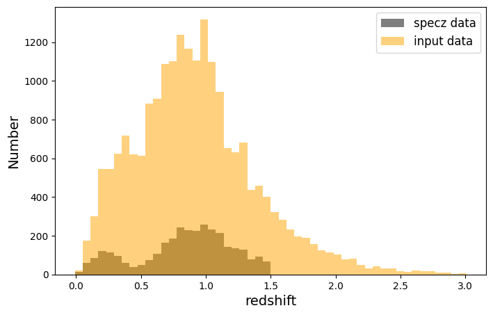
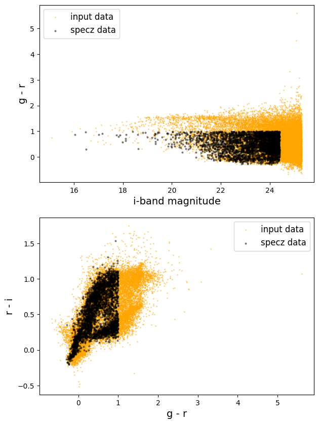
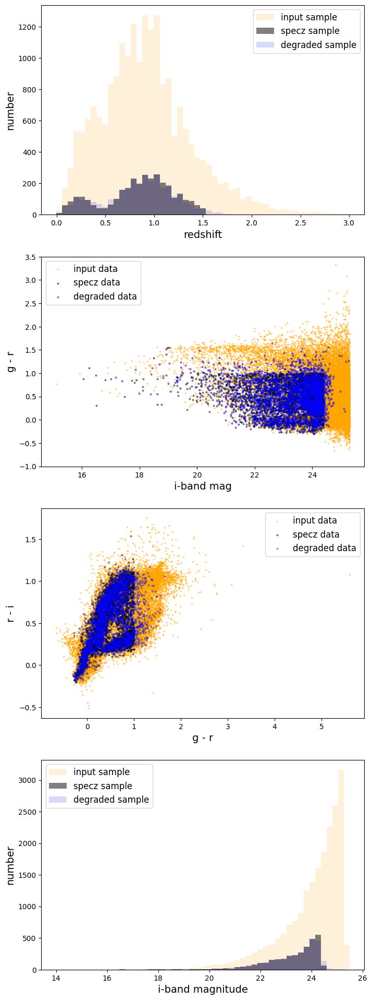
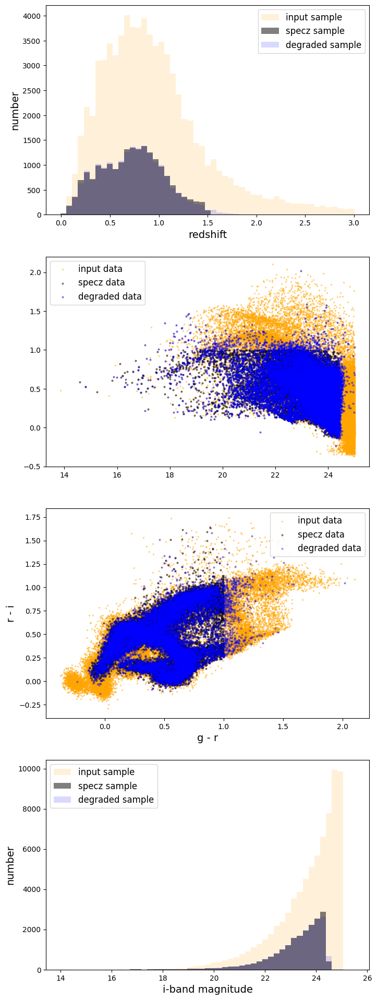

SOMSpecSelector Demo
====================

**Author**: Sam Schmidt

**Last successfully run**: Feb 5, 2025

This is a short demo of the use of the SOM-based degrader
``SOMSpecSelector`` that is designed to select a subset of an input
galaxy sample via SOM classification such that they match the properties
of a reference sample, e.g. to make mock spectroscopic selections for a
training set.

The code works by training a SOM using the (presumably larger) input
dataset, then classifying each galaxy from both the input dataset and
the reference dataset to find the best SOM cell. It then loops over all
occupied SOM cells, counts the number of reference galaxies in a cell,
and selects the same number of input objects in that cell to include in
the degraded sample (if there are more objects in the reference sample
than are available to pick from in the reference sample, then it simply
takes all available objects, which does mean that you can end up with
some incompleteness if areas of your parameter space have more objects
in the reference sample than the input). This should naturally force the
chosen subsample to match (as much as possible given SOM cell
classification given the input parameters) the properties of the
reference sample.

Note that, like other RAIL degraders, this degrader expects the input to
be in a Pandas dataframe.

We will demonstrate below, starting with some necessary imports. Note
that the ``SOMSpecSelector`` code is in the ``rail_som`` package, so
make sure that you have installed either the full RAIL package, or at
least the ``rail_som`` algorithms with either
``pip install pz-rail-som`` or by going to
https://github.com/LSSTDESC/rail_som and cloning and installing the
package there.

.. code:: ipython3

    import numpy as np
    import os
    import matplotlib.pyplot as plt
    import tables_io

.. code:: ipython3

    from rail.creation.degraders.specz_som import SOMSpecSelector
    from rail.utils.path_utils import find_rail_file
    from rail.core.data import TableHandle, PqHandle
    from rail.core.stage import RailStage

First, let’s set up the RAIL DataStore, which is explained in other RAIL
demo notebooks, as our interface to the data. We will read in two files,
one for reference (e.g. a specz sample that we would wish to model), and
an input dataset. Because the samples that are included with RAIL are
both representative, we will first make a few cuts to mimic
incompleteness before adding to the datastore.

**Note:** The SOMSpecSelector stage requires a reference/spectroscopic
set, and the stage expects that stage to be labeled as “spec_data” in
the DataStore! So, once we make a few cuts to our example file, we will
specify the name in the datastore as “spec_data”. Later in the notebook
we will have to set a different name in the ``aliases`` for a second
instance of the stage if we want to use a file with a different label as
the reference/specz file (more on that below):

.. code:: ipython3

    DS = RailStage.data_store
    DS.__class__.allow_overwrite = True

.. code:: ipython3

    trainfile = find_rail_file('examples_data/testdata/test_dc2_training_9816.hdf5')
    testfile = find_rail_file('examples_data/testdata/test_dc2_validation_9816.hdf5')
    testhdf5 = tables_io.read(testfile)['photometry']
    trainhdf5 = tables_io.read(trainfile)['photometry']
    # convert the data to pandas dataframe
    testpq = tables_io.convert(testhdf5, tables_io.types.PD_DATAFRAME)
    trainpq = tables_io.convert(trainhdf5, tables_io.types.PD_DATAFRAME)
    test_data = DS.add_data("input",testpq, PqHandle)
    
    # make a few cuts to the "training" data to simulate some incompleteness so that the distributions do not match
    # we'll cut all galaxies with redshift > 1.5 and mag_i_lsst > 24.4 and g-r color > 1.0
    mask = np.logical_and(trainpq['redshift'] < 1.5,
                          np.logical_and(trainpq['mag_i_lsst'] < 24.4, 
                                         trainpq['mag_g_lsst'] - trainpq['mag_r_lsst'] < 1.0))
    cutpq = trainpq[mask]
    
    ref_data = DS.add_data("spec_data", cutpq, PqHandle, path="spec_data.pq")

Let’s plot our two samples in redshift and color to compare:

.. code:: ipython3

    plt.figure(figsize=(8,5))
    zbins = np.linspace(-.01, 3.01, 51)
    plt.hist(ref_data()['redshift'], bins=zbins, alpha=0.5, color='k', label="specz data");
    plt.hist(test_data()['redshift'], bins=zbins, alpha=0.5, color='orange', label="input data");
    plt.legend(loc='upper right', fontsize=12)
    plt.xlabel("redshift", fontsize=14)
    plt.ylabel("Number", fontsize=14);

.. code:: ipython3

    fig, axs = plt.subplots(2, 1, figsize=(7,10))
    axs[0].scatter(test_data()['mag_i_lsst'], test_data()['mag_g_lsst'] - test_data()['mag_r_lsst'], 
                s=1, label='input data', alpha=0.4, color='orange')
    axs[0].scatter(ref_data()['mag_i_lsst'], ref_data()['mag_g_lsst'] - ref_data()['mag_r_lsst'], 
                s=4, label='specz data', alpha=0.4, color='k')
    axs[0].legend(loc='upper left', fontsize=12)
    axs[0].set_xlabel("i-band magnitude", fontsize=14)
    axs[0].set_ylabel("g - r", fontsize=14);
    
    
    axs[1].scatter(test_data()['mag_g_lsst'] - test_data()['mag_r_lsst'], 
                   test_data()['mag_r_lsst'] - test_data()['mag_i_lsst'], 
                s=1, label='input data', alpha=0.4, color='orange')
    axs[1].scatter(ref_data()['mag_g_lsst'] - ref_data()['mag_r_lsst'],
                   ref_data()['mag_r_lsst'] - ref_data()['mag_i_lsst'], 
                s=4, label='specz data', alpha=0.4, color='k')
    axs[1].legend(loc='upper right', fontsize=12)
    axs[1].set_xlabel("g - r", fontsize=14)
    axs[1].set_ylabel("r - i", fontsize=14);

We can see that, given our cuts, our “specz” data is no longer
representaive of the input sample. Now, let’s set up our degrader to try
to select a subset of galaxies that matches the number and distribution
of the specz sample. We’ll start by setting up the ``SOMSpecSelector``
stage. As input, the stage takes in multiple config parameters, these
are:

-  noncolor_cols: a list of column names in the files that will be used
   directly in training the SOM

-  color_cols: a list of column names in the files, these will be taken
   in order and differenced to make, e.g. colors. So, if you want to
   include u-g, g-r, and r-i as inputs to the SOM, you would specify
   [‘u’, ‘g’, ‘r’, ‘i’] as the ``color_cols`` values, and these will be
   differenced before inclusion in the SOM.

-  nondetect_val: if this value is present in either ``noncolor_cols``
   or ``color_cols`` columns as a value, it will be replaced with the
   corresponding “nondetection value” in ``noncolor_nondet``
   and\ ``color_nondet`` respectively.

-  noncolor_nondet: the list of nondetect values that a non-detection in
   ``noncolor_cols`` should be replaced with

-  color_nondet: the list of nondetect values that a non-detection in
   ``color_cols`` should be replaced with

-  som_size: a tuple, e.g. (32, 32), that specifies the shape of the
   SOM. (32, 32) is the default.

Let’s set up our inputs. As an example, let’s train our SOM using i-band
magnitude, redshift, and the colors u-g, g-r, r-i, i-z, and z-y. To do
this, we will specify ``noncolor_cols`` of ‘mag_i_lsst’ and ‘redshift’,
and color_cols with all six magnitudes. The code will difference the six
magnitudes, producing the desired five colors. Thus, our SOM inputs will
be trained on six inputs: ``mag_i_lsst``, ``u-g``, ``g-r``, ``r-i``,
``i-z``, and ``z-y``. Given that our mock data has true redshifts, we
could also include ``redshift`` as an explicit feature, which would lead
to even better results; however, for this demo we will test without
redshift included as a test of how well the method does in recovering
the redshift distribution with only the implicit color -> redshift
relation information included.

We also need to specify the magnitude and color limits, we’ll use the 1
sigma i-band 10 year limit for i-band and just put -1.0 for redshift.
For colors we’ll just put 0.0 for all colors.

.. code:: ipython3

    bands = ['u', 'g', 'r', 'i', 'z', 'y']
    noncol_cols = ['mag_i_lsst']
    col_cols = []
    for band in bands:
        col_cols.append(f"mag_{band}_lsst")
    
    noncol_nondet = [28.62, -1.0]
    col_nondet = np.zeros(5, dtype=float)
    
    som_dict = dict(color_cols=col_cols,
                    noncolor_cols=noncol_cols,
                    nondetect_val=99.0,
                    noncolor_nondet=noncol_nondet,
                    color_nondet=col_nondet)

.. code:: ipython3

    som_degrade = SOMSpecSelector.make_stage(
        name="som_degrader",
        output="specz_mock_sample.pq",
        spec_data=ref_data.path,
        **som_dict,
    )

.. code:: ipython3

    trimdf = som_degrade(test_data)

.. parsed-literal::

    Inserting handle into data store.  output_som_degrader: inprogress_specz_mock_sample.pq, som_degrader

let’s plot the redshift histogram and mag vs color plot to see how well
our selection matches the reference set:

.. code:: ipython3

    fig, axs = plt.subplots(4,1, figsize=(8,24))
    xbins = np.linspace(-.005, 3.005,52)
    magbins = np.linspace(14, 25.5, 52)
    axs[0].hist(test_data()['redshift'], bins=xbins, alpha=0.15, color='orange', label='input sample');
    axs[0].hist(ref_data()['redshift'], bins=xbins, alpha=0.5, color='k', label='specz sample');
    axs[0].hist(trimdf()['redshift'], bins=xbins, alpha=0.15, color='b', label='degraded sample')
    axs[0].set_xlabel('redshift', fontsize=14)
    axs[0].legend(loc='upper right', fontsize=12)
    axs[0].set_ylabel('number', fontsize=14);
    
    axs[1].scatter(test_data()['mag_i_lsst'], test_data()['mag_g_lsst'] - test_data()['mag_r_lsst'], 
                s=2, label='input data', alpha=0.4, color='orange')
    axs[1].scatter(ref_data()['mag_i_lsst'], ref_data()['mag_g_lsst'] - ref_data()['mag_r_lsst'], 
                s=4, label='specz data', alpha=0.4, color='k')
    axs[1].scatter(trimdf()['mag_i_lsst'], trimdf()['mag_g_lsst'] - trimdf()['mag_r_lsst'], 
                s=4, label='degraded data', alpha=0.4, color='b')
    axs[1].legend(loc='upper left', fontsize=12)
    axs[1].set_ylim(-1,3.5);
    axs[1].set_xlabel("i-band mag", fontsize=14)
    axs[1].set_ylabel("g - r", fontsize=14)
    
    axs[2].scatter(test_data()['mag_g_lsst'] - test_data()['mag_r_lsst'], 
                   test_data()['mag_r_lsst'] - test_data()['mag_i_lsst'], 
                s=2, label='input data', alpha=0.4, color='orange')
    axs[2].scatter(ref_data()['mag_g_lsst'] - ref_data()['mag_r_lsst'],
                   ref_data()['mag_r_lsst'] - ref_data()['mag_i_lsst'], 
                s=4, label='specz data', alpha=0.4, color='k')
    axs[2].scatter(trimdf()['mag_g_lsst'] - trimdf()['mag_r_lsst'],
                   trimdf()['mag_r_lsst'] - trimdf()['mag_i_lsst'], 
                s=4, label='degraded data', alpha=0.3, color='b')
    axs[2].legend(loc='upper right', fontsize=12)
    axs[2].set_xlabel("g - r", fontsize=14)
    axs[2].set_ylabel("r - i", fontsize=14)
    
    axs[3].hist(test_data()['mag_i_lsst'], bins=magbins, alpha=0.15, color='orange', label='input sample');
    axs[3].hist(ref_data()['mag_i_lsst'], bins=magbins, alpha=0.5, color='k', label='specz sample');
    axs[3].hist(trimdf()['mag_i_lsst'], bins=magbins, alpha=0.15, color='b', label='degraded sample')
    axs[3].set_xlabel('i-band magnitude', fontsize=14)
    axs[3].legend(loc='upper left', fontsize=12)
    axs[3].set_ylabel('number', fontsize=14);

The redshift distribution of our degraded sample matches very well with
the reference data, the magnitude vs color distribution is not as clean;
however, this is very likely due to the small number of objects used to
train the SOM, and performance and matchup should improve with larger
samples. Below we will download a slightly larger data samples, and we
can (optionally) test how well the results agree when more data is
available.

**Note:** The files are rather large, so you will need to uncomment the
lines below in order to download the files and have the second half of
this notebook run. Let’s grab some data from the Roman-DESC sims, we’ll
grab a tar file with two files, one with 37,500 galaxies, and one with
75,000 galaxies:

Uncomment the lines in the cell below and execute to download the data needed for the rest of the notebook!
-----------------------------------------------------------------------------------------------------------

.. code:: ipython3

    training_file = "./romandesc_specdeep.tar"
    
    #UNCOMMENT THESE LINES TO GRAB THE LARGER DATA FILES!
    
    if not os.path.exists(training_file):
      os.system('curl -O https://portal.nersc.gov/cfs/lsst/PZ/romandesc_specdeep.tar')
    !tar -xvf romandesc_specdeep.tar

.. parsed-literal::

      % Total    % Received % Xferd  Average Speed   Time    Time     Time  Current
                                     Dload  Upload   Total   Spent    Left  Speed
    
  0     0    0     0    0     0      0      0 --:--:-- --:--:-- --:--:--     0

.. parsed-literal::

    
  0     0    0     0    0     0      0      0 --:--:-- --:--:-- --:--:--     0

.. parsed-literal::

    
  0 32.6M    0  211k    0     0   121k      0  0:04:35  0:00:01  0:04:34  121k

.. parsed-literal::

    
  1 32.6M    1  383k    0     0   139k      0  0:03:59  0:00:02  0:03:57  139k

.. parsed-literal::

    
  1 32.6M    1  543k    0     0   143k      0  0:03:53  0:00:03  0:03:50  143k

.. parsed-literal::

    
  2 32.6M    2  807k    0     0   168k      0  0:03:18  0:00:04  0:03:14  168k

.. parsed-literal::

    
  2 32.6M    2  983k    0     0   171k      0  0:03:15  0:00:05  0:03:10  196k

.. parsed-literal::

    
  3 32.6M    3 1271k    0     0   187k      0  0:02:58  0:00:06  0:02:52  209k

.. parsed-literal::

    
  4 32.6M    4 1547k    0     0   199k      0  0:02:48  0:00:07  0:02:41  231k

.. parsed-literal::

    
  5 32.6M    5 1755k    0     0   197k      0  0:02:49  0:00:08  0:02:41  238k

.. parsed-literal::

    
  5 32.6M    5 1859k    0     0   191k      0  0:02:54  0:00:09  0:02:45  213k

.. parsed-literal::

    
  6 32.6M    6 2099k    0     0   194k      0  0:02:51  0:00:10  0:02:41  221k

.. parsed-literal::

    
  6 32.6M    6 2191k    0     0   186k      0  0:02:59  0:00:11  0:02:48  186k

.. parsed-literal::

    
  7 32.6M    7 2547k    0     0   194k      0  0:02:51  0:00:13  0:02:38  187k

.. parsed-literal::

    
  7 32.6M    7 2667k    0     0   194k      0  0:02:52  0:00:13  0:02:39  187k

.. parsed-literal::

    
  9 32.6M    9 3159k    0     0   214k      0  0:02:35  0:00:14  0:02:21  259k

.. parsed-literal::

    
 12 32.6M   12 4239k    0     0   269k      0  0:02:04  0:00:15  0:01:49  430k

.. parsed-literal::

    
 17 32.6M   17 5715k    0     0   341k      0  0:01:37  0:00:16  0:01:21  703k

.. parsed-literal::

    
 22 32.6M   22 7563k    0     0   426k      0  0:01:18  0:00:17  0:01:01 1081k

.. parsed-literal::

    
 27 32.6M   27 9067k    0     0   479k      0  0:01:09  0:00:18  0:00:51 1234k

.. parsed-literal::

    
 27 32.6M   27 9067k    0     0   455k      0  0:01:13  0:00:19  0:00:54 1138k

.. parsed-literal::

    
 28 32.6M   28 9659k    0     0   464k      0  0:01:11  0:00:20  0:00:51 1075k

.. parsed-literal::

    
 30 32.6M   30  9.9M    0     0   467k      0  0:01:11  0:00:21  0:00:50  882k

.. parsed-literal::

    
 31 32.6M   31 10.4M    0     0   466k      0  0:01:11  0:00:22  0:00:49  604k

.. parsed-literal::

    
 33 32.6M   33 10.9M    0     0   471k      0  0:01:10  0:00:23  0:00:47  443k

.. parsed-literal::

    
 35 32.6M   35 11.5M    0     0   474k      0  0:01:10  0:00:24  0:00:46  554k

.. parsed-literal::

    
 36 32.6M   36 11.9M    0     0   475k      0  0:01:10  0:00:25  0:00:45  522k

.. parsed-literal::

    
 37 32.6M   37 12.3M    0     0   473k      0  0:01:10  0:00:26  0:00:44  500k

.. parsed-literal::

    
 38 32.6M   38 12.5M    0     0   463k      0  0:01:12  0:00:27  0:00:45  449k

.. parsed-literal::

    
 39 32.6M   39 12.8M    0     0   452k      0  0:01:13  0:00:29  0:00:44  367k

.. parsed-literal::

    
 40 32.6M   40 13.2M    0     0   454k      0  0:01:13  0:00:29  0:00:44  353k

.. parsed-literal::

    
 42 32.6M   42 13.7M    0     0   457k      0  0:01:13  0:00:30  0:00:43  364k

.. parsed-literal::

    
 42 32.6M   42 14.0M    0     0   452k      0  0:01:13  0:00:31  0:00:42  341k

.. parsed-literal::

    
 43 32.6M   43 14.2M    0     0   435k      0  0:01:16  0:00:33  0:00:43  300k

.. parsed-literal::

    
 43 32.6M   43 14.2M    0     0   429k      0  0:01:17  0:00:34  0:00:43  292k

.. parsed-literal::

    
 43 32.6M   43 14.2M    0     0   419k      0  0:01:19  0:00:34  0:00:45  213k

.. parsed-literal::

    
 44 32.6M   44 14.4M    0     0   414k      0  0:01:20  0:00:35  0:00:45  150k

.. parsed-literal::

    
 44 32.6M   44 14.5M    0     0   405k      0  0:01:22  0:00:36  0:00:46  109k

.. parsed-literal::

    
 45 32.6M   45 14.7M    0     0   399k      0  0:01:23  0:00:37  0:00:46  117k

.. parsed-literal::

    
 45 32.6M   45 14.9M    0     0   394k      0  0:01:24  0:00:38  0:00:46  147k

.. parsed-literal::

    
 46 32.6M   46 15.2M    0     0   390k      0  0:01:25  0:00:39  0:00:46  189k

.. parsed-literal::

    
 47 32.6M   47 15.3M    0     0   385k      0  0:01:26  0:00:40  0:00:46  176k

.. parsed-literal::

    
 48 32.6M   48 15.9M    0     0   391k      0  0:01:25  0:00:41  0:00:44  288k

.. parsed-literal::

    
 52 32.6M   52 17.0M    0     0   408k      0  0:01:21  0:00:42  0:00:39  481k

.. parsed-literal::

    
 56 32.6M   56 18.5M    0     0   432k      0  0:01:17  0:00:43  0:00:34  734k

.. parsed-literal::

    
 62 32.6M   62 20.3M    0     0   465k      0  0:01:11  0:00:44  0:00:27 1086k

.. parsed-literal::

    
 69 32.6M   69 22.6M    0     0   506k      0  0:01:06  0:00:45  0:00:21 1502k

.. parsed-literal::

    
 77 32.6M   77 25.4M    0     0   557k      0  0:01:00  0:00:46  0:00:14 1937k

.. parsed-literal::

    
 82 32.6M   82 27.0M    0     0   579k      0  0:00:57  0:00:47  0:00:10 2051k

.. parsed-literal::

    
 84 32.6M   84 27.6M    0     0   581k      0  0:00:57  0:00:48  0:00:09 1884k

.. parsed-literal::

    
 87 32.6M   87 28.5M    0     0   580k      0  0:00:57  0:00:50  0:00:07 1513k

.. parsed-literal::

    
 92 32.6M   92 30.0M    0     0   606k      0  0:00:55  0:00:50  0:00:05 1513k

.. parsed-literal::

    romandesc_spec_data_37k.hdf5
    romandesc_deep_data_75k.hdf5

.. parsed-literal::

    
100 32.6M  100 32.6M    0     0   648k      0  0:00:51  0:00:51 --:--:-- 1537k

We will read in the two files, make similar cuts to the mock “spec” file
as we did in the example above, and then add the files to the datastore

.. code:: ipython3

    rdspecfile = "./romandesc_spec_data_37k.hdf5"
    rdtestfile = "./romandesc_deep_data_75k.hdf5"
    
    rdtest = tables_io.read(rdtestfile)
    rdtestpq = tables_io.convert(rdtest, tables_io.types.PD_DATAFRAME)
    big_test_data = DS.add_data("big_input", rdtestpq, PqHandle, path="big_input.pq")
    
    rdspec = tables_io.read(rdspecfile)
    rdspecpq = tables_io.convert(rdspec, tables_io.types.PD_DATAFRAME)
    
    mask = np.logical_and(rdspecpq['redshift'] < 1.5,
                          np.logical_and(rdspecpq['i'] < 24.4, 
                                         rdspecpq['g'] - rdspecpq['r'] < 1.0))
    rdspecpqcut = rdspecpq[mask]
    big_spec_data = DS.add_data("big_spec", rdspecpqcut, PqHandle, path="big_spec.pq")

Let’s take a look at the columns available, this file should contain
both the magnitudes and colors for the Roman-DESC sims:

.. code:: ipython3

    big_spec_data().head()

.. raw:: html

    

    
    <table border="1" class="dataframe">
      <thead>
        <tr style="text-align: right;">
          <th></th>
          <th>F</th>
          <th>F_err</th>
          <th>H</th>
          <th>HF</th>
          <th>HF_err</th>
          <th>H_err</th>
          <th>J</th>
          <th>JH</th>
          <th>JH_err</th>
          <th>J_err</th>
          <th>...</th>
          <th>ug</th>
          <th>ug_err</th>
          <th>y</th>
          <th>yJ</th>
          <th>yJ_err</th>
          <th>y_err</th>
          <th>z</th>
          <th>z_err</th>
          <th>zy</th>
          <th>zy_err</th>
        </tr>
      </thead>
      <tbody>
        <tr>
          <th>0</th>
          <td>22.668509</td>
          <td>0.009416</td>
          <td>22.670394</td>
          <td>0.001886</td>
          <td>0.011532</td>
          <td>0.006658</td>
          <td>22.863637</td>
          <td>0.193243</td>
          <td>0.009721</td>
          <td>0.007083</td>
          <td>...</td>
          <td>0.052752</td>
          <td>0.054803</td>
          <td>23.055371</td>
          <td>0.191734</td>
          <td>0.041568</td>
          <td>0.040960</td>
          <td>23.133485</td>
          <td>0.019674</td>
          <td>0.078114</td>
          <td>0.045440</td>
        </tr>
        <tr>
          <th>4</th>
          <td>23.381875</td>
          <td>0.016141</td>
          <td>23.610780</td>
          <td>0.228905</td>
          <td>0.019860</td>
          <td>0.011570</td>
          <td>23.635874</td>
          <td>0.025094</td>
          <td>0.016213</td>
          <td>0.011358</td>
          <td>...</td>
          <td>-0.053434</td>
          <td>0.084056</td>
          <td>23.729567</td>
          <td>0.093693</td>
          <td>0.075335</td>
          <td>0.074473</td>
          <td>23.856372</td>
          <td>0.036887</td>
          <td>0.126805</td>
          <td>0.083108</td>
        </tr>
        <tr>
          <th>5</th>
          <td>23.168731</td>
          <td>0.013580</td>
          <td>23.407798</td>
          <td>0.239067</td>
          <td>0.016865</td>
          <td>0.010000</td>
          <td>23.441274</td>
          <td>0.033476</td>
          <td>0.014063</td>
          <td>0.009887</td>
          <td>...</td>
          <td>0.050993</td>
          <td>0.070531</td>
          <td>23.593863</td>
          <td>0.152589</td>
          <td>0.066782</td>
          <td>0.066046</td>
          <td>23.670904</td>
          <td>0.031320</td>
          <td>0.077041</td>
          <td>0.073096</td>
        </tr>
        <tr>
          <th>6</th>
          <td>23.580251</td>
          <td>0.019068</td>
          <td>23.697910</td>
          <td>0.117659</td>
          <td>0.022723</td>
          <td>0.012359</td>
          <td>23.683574</td>
          <td>-0.014335</td>
          <td>0.017066</td>
          <td>0.011769</td>
          <td>...</td>
          <td>0.536931</td>
          <td>0.124959</td>
          <td>23.838711</td>
          <td>0.155137</td>
          <td>0.082847</td>
          <td>0.082007</td>
          <td>23.975645</td>
          <td>0.040996</td>
          <td>0.136934</td>
          <td>0.091683</td>
        </tr>
        <tr>
          <th>11</th>
          <td>23.560218</td>
          <td>0.018746</td>
          <td>23.498393</td>
          <td>-0.061825</td>
          <td>0.021563</td>
          <td>0.010657</td>
          <td>23.626236</td>
          <td>0.127843</td>
          <td>0.015516</td>
          <td>0.011277</td>
          <td>...</td>
          <td>0.305268</td>
          <td>0.146536</td>
          <td>23.642759</td>
          <td>0.016523</td>
          <td>0.069884</td>
          <td>0.068969</td>
          <td>24.036394</td>
          <td>0.043264</td>
          <td>0.393635</td>
          <td>0.081415</td>
        </tr>
      </tbody>
    </table>
    
5 rows × 38 columns

    

As in the first example, we will just use one magnitude, ``i``, and the
five colors to build the SOM. Because the colors are already present we
can just add them directly to the non-color columns. Let’s set things up
appropriately:

.. code:: ipython3

    noncol_cols = ['i', 'ug', 'gr', 'ri', 'iz', 'zy']
    col_cols = []
    
    noncol_nondet = [28.62, -1.0, 0.0, 0.0, 0.0, 0.0, 0.0]
    col_nondet = []
    
    som_dict = dict(color_cols=col_cols,
                    noncolor_cols=noncol_cols,
                    nondetect_val=99.0,
                    noncolor_nondet=noncol_nondet,
                    color_nondet=col_nondet)

**Note:** as mentioned earlier in this demo, the ``SOMSpecSelector``
stage expects the reference/spectroscopic data file to be labeled as
“spec_data” in the DataStore. As we already loaded the previous example
data with that name, we’ll need to tell this second copy of the
``SOMSpecSelector`` stage that we will be using a dataset with a
different label. We do this by setting the new label in a dictionary fed
in as ``aliases`` to the stage. We added the new reference/specz file
with the label “big_spec”, so we can simply add
``aliases=dict(spec_data="big_spec")`` to let the stage know which file
to use as the reference/spec data.

.. code:: ipython3

    # note that 
    roman_som_degrade = SOMSpecSelector.make_stage(name="roman_som_degrader", 
                                                   output="roman_specz_mock_sample.pq", 
                                                   aliases=dict(spec_data="big_spec"),
                                                   **som_dict)

.. code:: ipython3

    roman_trim = roman_som_degrade(big_test_data)

.. parsed-literal::

    /opt/hostedtoolcache/Python/3.10.18/x64/lib/python3.10/site-packages/rail/creation/degraders/specz_som.py:100: SettingWithCopyWarning: 
    A value is trying to be set on a copy of a slice from a DataFrame
    
    See the caveats in the documentation: https://pandas.pydata.org/pandas-docs/stable/user_guide/indexing.html#returning-a-view-versus-a-copy
      data.loc[mask, val] = np.float32(lim)

.. parsed-literal::

    Warning: data was not float32. A 32-bit copy was made

.. parsed-literal::

    Inserting handle into data store.  output_roman_som_degrader: inprogress_roman_specz_mock_sample.pq, roman_som_degrader

Let’s make the same plots as above:

.. code:: ipython3

    fig, axs = plt.subplots(4,1, figsize=(8,24))
    xbins = np.linspace(-.005, 3.005,52)
    magbins = np.linspace(14, 25.5, 52)
    axs[0].hist(big_test_data()['redshift'], bins=xbins, alpha=0.15, color='orange', label='input sample');
    axs[0].hist(big_spec_data()['redshift'], bins=xbins, alpha=0.5, color='k', label='specz sample');
    axs[0].hist(roman_trim()['redshift'], bins=xbins, alpha=0.15, color='b', label='degraded sample')
    axs[0].set_xlabel('redshift', fontsize=14)
    axs[0].legend(loc='upper right', fontsize=12)
    axs[0].set_ylabel('number', fontsize=14);
    
    axs[1].scatter(big_test_data()['i'], big_test_data()['gr'], 
                s=2, label='input data', alpha=0.4, color='orange')
    axs[1].scatter(big_spec_data()['i'], big_spec_data()['gr'], 
                s=4, label='specz data', alpha=0.4, color='k')
    axs[1].scatter(roman_trim()['i'], roman_trim()['gr'], 
                s=4, label='degraded data', alpha=0.4, color='b')
    axs[1].legend(loc='upper left', fontsize=12)
    axs[1].set_ylim(-.5,2.2);
    
    axs[2].scatter(big_test_data()['gr'], 
                   big_test_data()['ri'], 
                   s=2, label='input data', alpha=0.4, color='orange')
    axs[2].scatter(big_spec_data()['gr'],
                   big_spec_data()['ri'],
                   s=4, label='specz data', alpha=0.4, color='k')
    axs[2].scatter(roman_trim()['gr'],
                   roman_trim()['ri'],
                   s=4, label='degraded data', alpha=0.3, color='b')
    axs[2].legend(loc='upper right', fontsize=12)
    axs[2].set_xlabel("g - r", fontsize=14)
    axs[2].set_ylabel("r - i", fontsize=14)
    
    axs[3].hist(big_test_data()['i'], bins=magbins, alpha=0.15, color='orange', label='input sample');
    axs[3].hist(big_spec_data()['i'], bins=magbins, alpha=0.5, color='k', label='specz sample');
    axs[3].hist(roman_trim()['i'], bins=magbins, alpha=0.15, color='b', label='degraded sample')
    axs[3].set_xlabel('i-band magnitude', fontsize=14)
    axs[3].legend(loc='upper left', fontsize=12)
    axs[3].set_ylabel('number', fontsize=14);

We again see good agreement on the redshift and i-band magnitude
distributions, and good but not perfect agreement on magnitude-color and
color-color distributions. So, it appears that our mock specz selection
algorithm is working as expected.

