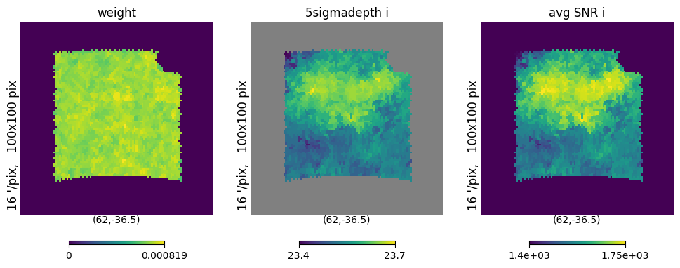
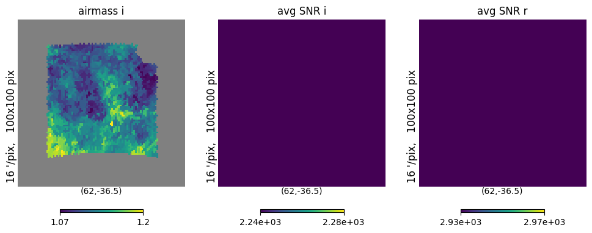

Generate Spatially Varying Magnitude Errors According to Observing Conditions
=============================================================================

last run successfully: April 26, 2023

The ObsCondition degrader can be used to generate spatially-varying
photometric errors using input survey condition maps in ``healpix``
format, such as survey coadd depth, airmass, sky brightness etc. The
photometric error is computed by ``photerr.LsstErrorModel``, based on
the LSST Overview Paper: https://arxiv.org/abs/0805.2366.

The degrader assigns each object in the input catalogue with a pixel
within the survey footprint and computes the magnitude error (SNR) on
each pixel. The degrader takes the following arguments:

-  ``nside``: nside used for the HEALPIX maps.
-  ``mask``: Path to the mask covering the survey footprint in HEALPIX
   format. Notice that all negative values will be set to zero.
-  ``weight``: Path to the weights HEALPIX format, used to assign sample
   galaxies in pixels. Default is weight=““, which uniform weighting.
-  ``tot_nVis_flag``: If ``nVisYr`` is provided in ``map_dict`` (see
   below), this flag indicates whether the map shows the total number of
   visits in nYrObs (``tot_nVis_flag=True``), or the average number of
   visits per year (``tot_nVis_flag=False``). The default is set to
   ``True``.
-  ``random_seed``: A random seed for reproducibility.
-  ``map_dict``: A dictionary that contains the paths to the survey
   condition maps in HEALPIX format. This dictionary uses the same
   arguments as LSSTErrorModel. The following arguements, if supplied,
   may contain either a single number (as in the case of
   LSSTErrorModel), or a path to the corresponding survey condition map
   in ``healpix`` format:``m5``, ``nVisYr``, ``airmass``, ``gamma``,
   ``msky``, ``theta``, ``km``, and ``tvis``. Notice that *except*
   ``airmass`` and ``tvis``, for all other arguements, numbers/paths for
   *specific bands* should be passed. Other ``LsstErrorModel``
   parameters can also be passed in this dictionary (e.g. a necessary
   one may be ``nYrObs`` for the survey condition maps; the default
   value is 10 years, although most may be interested in early data
   releases). If any arguement is not passed, the default value in
   https://arxiv.org/abs/0805.2366 is adopted. Example:

.. code:: json

   {
      "m5": {"u": "path", ...}, 
      "theta": {"u": "path", ...},
   }

Argument defaults are determined by the defaults of the
``LsstErrorModel`` in
`PhotErr <https://github.com/jfcrenshaw/photerr>`__.

In this quick notebook we’ll generate the photometric error based on the
DC2 Y5 LSST median :math:`5\sigma` depth in :math:`i`-band generated by
OpSim ``minion_1016`` database using the Rubin Observatory Metrics
Analysis Framework (MAF).

.. code:: ipython3

    import healpy as hp
    
    %matplotlib inline
    import numpy as np
    import matplotlib.pyplot as plt
    
    from astropy.io import fits
    import os
    
    import pandas as pd
    import tables_io

.. code:: ipython3

    import rail
    from rail.core.stage import RailStage
    from rail.utils.path_utils import find_rail_file
    DS = RailStage.data_store
    DS.__class__.allow_overwrite = True

Let’s generate some fake data.

.. code:: ipython3

    # Fake data with same magnitude in each band
    i = np.ones(50_000)*23.
    u = np.full_like(i, 23.0, dtype=np.double)
    g = np.full_like(i, 23.0, dtype=np.double)
    r = np.full_like(i, 23.0, dtype=np.double)
    y = np.full_like(i, 23.0, dtype=np.double)
    z = np.full_like(i, 23.0, dtype=np.double)
    redshift = np.random.uniform(size=len(i)) * 2

.. code:: ipython3

    mockdict = {}
    for label, item in zip(['redshift','u', 'g','r','i', 'z','y'], [redshift,u,g,r,i,z,y]):
        mockdict[f'{label}'] = item

.. code:: ipython3

    data = pd.DataFrame(mockdict)
    data.head()

.. raw:: html

    

    
    <table border="1" class="dataframe">
      <thead>
        <tr style="text-align: right;">
          <th></th>
          <th>redshift</th>
          <th>u</th>
          <th>g</th>
          <th>r</th>
          <th>i</th>
          <th>z</th>
          <th>y</th>
        </tr>
      </thead>
      <tbody>
        <tr>
          <th>0</th>
          <td>0.905692</td>
          <td>23.0</td>
          <td>23.0</td>
          <td>23.0</td>
          <td>23.0</td>
          <td>23.0</td>
          <td>23.0</td>
        </tr>
        <tr>
          <th>1</th>
          <td>0.008942</td>
          <td>23.0</td>
          <td>23.0</td>
          <td>23.0</td>
          <td>23.0</td>
          <td>23.0</td>
          <td>23.0</td>
        </tr>
        <tr>
          <th>2</th>
          <td>0.629562</td>
          <td>23.0</td>
          <td>23.0</td>
          <td>23.0</td>
          <td>23.0</td>
          <td>23.0</td>
          <td>23.0</td>
        </tr>
        <tr>
          <th>3</th>
          <td>1.220909</td>
          <td>23.0</td>
          <td>23.0</td>
          <td>23.0</td>
          <td>23.0</td>
          <td>23.0</td>
          <td>23.0</td>
        </tr>
        <tr>
          <th>4</th>
          <td>1.987787</td>
          <td>23.0</td>
          <td>23.0</td>
          <td>23.0</td>
          <td>23.0</td>
          <td>23.0</td>
          <td>23.0</td>
        </tr>
      </tbody>
    </table>
    

Now let’s import the ObsCondition from rail.

.. code:: ipython3

    from rail.creation.degraders import observing_condition_degrader
    from rail.creation.degraders.observing_condition_degrader import ObsCondition

.. code:: ipython3

    # First, let's use default arguments:
    obs_cond_degrader = ObsCondition.make_stage()

.. code:: ipython3

    # You can see what arguments have been entered by printing the degrader:
    print(obs_cond_degrader)

.. parsed-literal::

    Loaded observing conditions from configuration file: 
    nside = 128, 
    mask file:  /opt/hostedtoolcache/Python/3.10.16/x64/lib/python3.10/site-packages/rail/creation/degraders/../../examples_data/creation_data/data/survey_conditions/DC2-mask-neg-nside-128.fits, 
    weight file:  /opt/hostedtoolcache/Python/3.10.16/x64/lib/python3.10/site-packages/rail/creation/degraders/../../examples_data/creation_data/data/survey_conditions/DC2-dr6-galcounts-i20-i25.3-nside-128.fits, 
    tot_nVis_flag = True, 
    random_seed = 42, 
    map_dict contains the following items: 
    {'m5': {'i': '/opt/hostedtoolcache/Python/3.10.16/x64/lib/python3.10/site-packages/rail/creation/degraders/../../examples_data/creation_data/data/survey_conditions/minion_1016_dc2_Median_fiveSigmaDepth_i_and_nightlt1825_HEAL.fits'}, 'nYrObs': 5.0}

Let’s run the code and see how long it takes:

.. code:: ipython3

    %%time
    data_degraded = obs_cond_degrader(data)

.. parsed-literal::

    Inserting handle into data store.  input: None, ObsCondition
    Assigning pixels.
    No ra, dec found in catalogue, randomly assign pixels with weights.
    Warning: objects found outside given mask, pixel assigned=-99. These objects will be assigned with defualt error from LSST error model!

.. parsed-literal::

    Inserting handle into data store.  output: inprogress_output.pq, ObsCondition
    CPU times: user 3.19 s, sys: 53 ms, total: 3.24 s
    Wall time: 3.24 s

.. code:: ipython3

    data_degraded.data.head()

.. raw:: html

    

    
    <table border="1" class="dataframe">
      <thead>
        <tr style="text-align: right;">
          <th></th>
          <th>redshift</th>
          <th>u</th>
          <th>u_err</th>
          <th>g</th>
          <th>g_err</th>
          <th>r</th>
          <th>r_err</th>
          <th>i</th>
          <th>i_err</th>
          <th>z</th>
          <th>z_err</th>
          <th>y</th>
          <th>y_err</th>
          <th>ra</th>
          <th>decl</th>
          <th>pixel</th>
        </tr>
      </thead>
      <tbody>
        <tr>
          <th>0</th>
          <td>0.905692</td>
          <td>22.990404</td>
          <td>0.026246</td>
          <td>23.011212</td>
          <td>0.010113</td>
          <td>22.991270</td>
          <td>0.008975</td>
          <td>23.001056</td>
          <td>0.014845</td>
          <td>22.946670</td>
          <td>0.023212</td>
          <td>22.952105</td>
          <td>0.052272</td>
          <td>61.171875</td>
          <td>-40.620185</td>
          <td>162135</td>
        </tr>
        <tr>
          <th>1</th>
          <td>0.008942</td>
          <td>22.962996</td>
          <td>0.025645</td>
          <td>23.012586</td>
          <td>0.010122</td>
          <td>23.024129</td>
          <td>0.009159</td>
          <td>22.990276</td>
          <td>0.013320</td>
          <td>22.975839</td>
          <td>0.023801</td>
          <td>23.027019</td>
          <td>0.055860</td>
          <td>63.632812</td>
          <td>-34.953865</td>
          <td>154458</td>
        </tr>
        <tr>
          <th>2</th>
          <td>0.629562</td>
          <td>23.050979</td>
          <td>0.027628</td>
          <td>22.992791</td>
          <td>0.009991</td>
          <td>23.012578</td>
          <td>0.009093</td>
          <td>22.985111</td>
          <td>0.014289</td>
          <td>23.019294</td>
          <td>0.024710</td>
          <td>23.020908</td>
          <td>0.055559</td>
          <td>52.795276</td>
          <td>-42.210370</td>
          <td>164170</td>
        </tr>
        <tr>
          <th>3</th>
          <td>1.220909</td>
          <td>23.015021</td>
          <td>0.026798</td>
          <td>22.984763</td>
          <td>0.009939</td>
          <td>22.995173</td>
          <td>0.008997</td>
          <td>22.985953</td>
          <td>0.014481</td>
          <td>23.011103</td>
          <td>0.024536</td>
          <td>23.026922</td>
          <td>0.055856</td>
          <td>53.789062</td>
          <td>-39.450895</td>
          <td>160588</td>
        </tr>
        <tr>
          <th>4</th>
          <td>1.987787</td>
          <td>23.005344</td>
          <td>0.026579</td>
          <td>23.010790</td>
          <td>0.010110</td>
          <td>22.991376</td>
          <td>0.008976</td>
          <td>23.000950</td>
          <td>0.014682</td>
          <td>23.005917</td>
          <td>0.024426</td>
          <td>22.946816</td>
          <td>0.052028</td>
          <td>69.609375</td>
          <td>-28.971532</td>
          <td>145763</td>
        </tr>
      </tbody>
    </table>
    

We see that extra columns containing the magnitude errors: ``u_err``,
``g_err``\ … have been added to the catalogue. Notice that since we have
only provided the limiting magnitude for :math:`i`-band, the errors in
all other bands except :math:`i` are computed using the default
parameters in ``LsstErrorModel`` (see:
https://github.com/jfcrenshaw/photerr/blob/main/photerr/lsst.py).

The last column shows the pixel of the survey condition map that is
assigned to each object.

We can check if the spatial dependence has been implemented by looking
at the SNR at different area of the sky, and compare that with the
:math:`i`-band depth:

.. code:: ipython3

    mask = hp.read_map(find_rail_file("examples_data/creation_data/data/survey_conditions/DC2-mask-neg-nside-128.fits"))
    weight = hp.read_map(find_rail_file("examples_data/creation_data/data/survey_conditions/DC2-dr6-galcounts-i20-i25.3-nside-128.fits"))
    Med_5sd_i = hp.read_map(find_rail_file("examples_data/creation_data/data/survey_conditions/minion_1016_dc2_Median_fiveSigmaDepth_i_and_nightlt1825_HEAL.fits"))

.. code:: ipython3

    # Set negative values in mask to zero
    mask[mask<0]=0

.. code:: ipython3

    # Compute the average SNR in each pixel
    avg_SNR_i = np.zeros(len(mask))
    for pix, pix_cat in (data_degraded.data).groupby("pixel"):
        avg_SNR_i[pix] = np.mean((pix_cat["i"]/pix_cat["i_err"]).to_numpy())

.. code:: ipython3

    # View the healpix map
    
    fig,axarr=plt.subplots(1,3,figsize=[12,6])
    
    plt.sca(axarr[0])
    hp.gnomview(weight*mask/sum(weight), rot=(62, -36.5, 0), xsize=100,ysize=100, reso=16, title="weight",
               hold=True)
    plt.sca(axarr[1])
    hp.gnomview(Med_5sd_i*mask, rot=(62, -36.5, 0), xsize=100,ysize=100, reso=16, title="5sigmadepth i",
               hold=True)
    plt.sca(axarr[2])
    hp.gnomview(avg_SNR_i, rot=(62, -36.5, 0), xsize=100,ysize=100, reso=16, title="avg SNR i",
                min=1400, max=1750,
               hold=True)

Now if we want to change any of the default settings, we can supply them
in ``ObsCondition.make_stage()``. In this example, instead of supplying
the median :math:`5\sigma` depth in :math:`i`-band, we supply the median
airmass in :math:`i`-band. In this case, the :math:`i`-band limiting
magnitude ``m5`` will be computed explicitly (notice that if ``m5`` is
also supplied, then it will overwrite the explicitly computed ``m5``).

.. code:: ipython3

    airmass_degrader = ObsCondition.make_stage(
        map_dict={"airmass": find_rail_file("examples_data/creation_data/data/survey_conditions/minion_1016_dc2_Median_airmass_i_and_nightlt1825_HEAL.fits"),
                 "nYrObs": 5.0}
    )

.. code:: ipython3

    print(airmass_degrader)

.. parsed-literal::

    Loaded observing conditions from configuration file: 
    nside = 128, 
    mask file:  /opt/hostedtoolcache/Python/3.10.16/x64/lib/python3.10/site-packages/rail/creation/degraders/../../examples_data/creation_data/data/survey_conditions/DC2-mask-neg-nside-128.fits, 
    weight file:  /opt/hostedtoolcache/Python/3.10.16/x64/lib/python3.10/site-packages/rail/creation/degraders/../../examples_data/creation_data/data/survey_conditions/DC2-dr6-galcounts-i20-i25.3-nside-128.fits, 
    tot_nVis_flag = True, 
    random_seed = 42, 
    map_dict contains the following items: 
    {'airmass': '/opt/hostedtoolcache/Python/3.10.16/x64/lib/python3.10/site-packages/rail/examples_data/creation_data/data/survey_conditions/minion_1016_dc2_Median_airmass_i_and_nightlt1825_HEAL.fits', 'nYrObs': 5.0}

.. code:: ipython3

    data_degraded_airmass = airmass_degrader(data)

.. parsed-literal::

    Assigning pixels.
    No ra, dec found in catalogue, randomly assign pixels with weights.
    Warning: objects found outside given mask, pixel assigned=-99. These objects will be assigned with defualt error from LSST error model!

.. parsed-literal::

    Inserting handle into data store.  output: inprogress_output.pq, ObsCondition

.. code:: ipython3

    data_degraded_airmass.data.head()

.. raw:: html

    

    
    <table border="1" class="dataframe">
      <thead>
        <tr style="text-align: right;">
          <th></th>
          <th>redshift</th>
          <th>u</th>
          <th>u_err</th>
          <th>g</th>
          <th>g_err</th>
          <th>r</th>
          <th>r_err</th>
          <th>i</th>
          <th>i_err</th>
          <th>z</th>
          <th>z_err</th>
          <th>y</th>
          <th>y_err</th>
          <th>ra</th>
          <th>decl</th>
          <th>pixel</th>
        </tr>
      </thead>
      <tbody>
        <tr>
          <th>0</th>
          <td>0.905692</td>
          <td>22.990381</td>
          <td>0.026308</td>
          <td>23.011222</td>
          <td>0.010121</td>
          <td>22.991259</td>
          <td>0.008986</td>
          <td>23.000944</td>
          <td>0.013288</td>
          <td>22.946682</td>
          <td>0.023207</td>
          <td>22.952134</td>
          <td>0.052242</td>
          <td>61.171875</td>
          <td>-40.620185</td>
          <td>162135</td>
        </tr>
        <tr>
          <th>1</th>
          <td>0.008942</td>
          <td>22.963601</td>
          <td>0.025237</td>
          <td>23.012513</td>
          <td>0.010062</td>
          <td>23.024069</td>
          <td>0.009136</td>
          <td>22.990413</td>
          <td>0.013135</td>
          <td>22.975912</td>
          <td>0.023731</td>
          <td>23.026800</td>
          <td>0.055413</td>
          <td>63.632812</td>
          <td>-34.953865</td>
          <td>154458</td>
        </tr>
        <tr>
          <th>2</th>
          <td>0.629562</td>
          <td>23.050276</td>
          <td>0.027242</td>
          <td>22.992825</td>
          <td>0.009945</td>
          <td>23.012555</td>
          <td>0.009077</td>
          <td>22.986365</td>
          <td>0.013102</td>
          <td>23.019244</td>
          <td>0.024645</td>
          <td>23.020765</td>
          <td>0.055185</td>
          <td>52.795276</td>
          <td>-42.210370</td>
          <td>164170</td>
        </tr>
        <tr>
          <th>3</th>
          <td>1.220909</td>
          <td>23.014777</td>
          <td>0.026365</td>
          <td>22.984848</td>
          <td>0.009884</td>
          <td>22.995184</td>
          <td>0.008976</td>
          <td>22.987306</td>
          <td>0.013105</td>
          <td>23.011070</td>
          <td>0.024462</td>
          <td>23.026709</td>
          <td>0.055420</td>
          <td>53.789062</td>
          <td>-39.450895</td>
          <td>160588</td>
        </tr>
        <tr>
          <th>4</th>
          <td>1.987787</td>
          <td>23.005223</td>
          <td>0.025983</td>
          <td>23.010704</td>
          <td>0.010029</td>
          <td>22.991407</td>
          <td>0.008944</td>
          <td>23.000856</td>
          <td>0.013226</td>
          <td>23.005894</td>
          <td>0.024330</td>
          <td>22.947353</td>
          <td>0.051527</td>
          <td>69.609375</td>
          <td>-28.971532</td>
          <td>145763</td>
        </tr>
      </tbody>
    </table>
    

Again, we can examine whether the spatial dependence is indeed applied.
Here, ``LsstErrorModel`` does not have band-dependent airmass, so it
affects all bands. The default airmass is :math:`X=1.2`, but the input
median airmass is more optimistic, thus reducing the magnitude errors.

.. code:: ipython3

    Med_airmass_i = hp.read_map(find_rail_file("examples_data/creation_data/data/survey_conditions/minion_1016_dc2_Median_airmass_i_and_nightlt1825_HEAL.fits"))

Compute the average SNR in each pixel for i and r bands:

.. code:: ipython3

    avg_SNR_i_airmass = np.zeros(len(mask))
    avg_SNR_r_airmass = np.zeros(len(mask))
    for pix, pix_cat in (data_degraded_airmass.data).groupby("pixel"):
        avg_SNR_i_airmass[pix] = np.mean((pix_cat["i"]/pix_cat["i_err"]).to_numpy())
        avg_SNR_r_airmass[pix] = np.mean((pix_cat["r"]/pix_cat["r_err"]).to_numpy())

View the healpix map:

.. code:: ipython3

    fig,axarr=plt.subplots(1,3,figsize=[12,6])
    
    plt.sca(axarr[0])
    hp.gnomview(Med_airmass_i*mask, rot=(62, -36.5, 0), xsize=100,ysize=100, reso=16, title="airmass i",
               hold=True)
    plt.sca(axarr[1])
    hp.gnomview(avg_SNR_i_airmass, rot=(62, -36.5, 0), xsize=100,ysize=100, reso=16, title="avg SNR i",
                min=2240, max=2280,
               hold=True)
    
    plt.sca(axarr[2])
    hp.gnomview(avg_SNR_r_airmass, rot=(62, -36.5, 0), xsize=100,ysize=100, reso=16, title="avg SNR r",
                min=2930, max=2970,
               hold=True)

In both cases, we see a negative correlation between the airmass and the
SNR in :math:`i` and :math:`r` bands, as expected.

