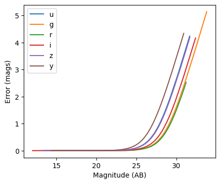
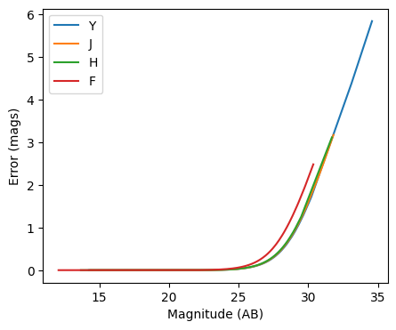
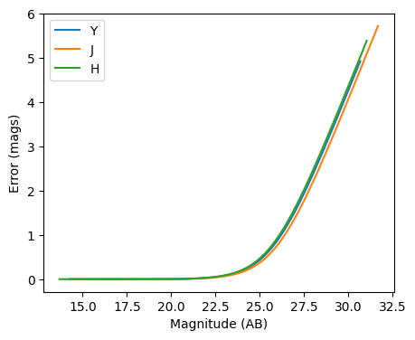

Photometric error stage demo
----------------------------

author: Tianqing Zhang, John-Franklin Crenshaw

This notebook demonstrate the use of
``rail.creation.degraders.photometric_errors``, which adds column for
the photometric noise to the catalog based on the package PhotErr
developed by John-Franklin Crenshaw. The RAIL stage PhotoErrorModel
inherit from the Noisifier base classes, and the LSST, Roman, Euclid
child classes inherit from the PhotoErrorModel

.. code:: ipython3

    
    from rail.creation.degraders.photometric_errors import LSSTErrorModel
    from rail.creation.degraders.photometric_errors import RomanErrorModel
    from rail.creation.degraders.photometric_errors import EuclidErrorModel
    
    from rail.core.data import PqHandle
    from rail.core.stage import RailStage
    
    import matplotlib.pyplot as plt
    import pandas as pd
    import numpy as np
    

.. code:: ipython3

    DS = RailStage.data_store
    DS.__class__.allow_overwrite = True

Create a random catalog with ugrizy+YJHF bands as the the true input
~~~~~~~~~~~~~~~~~~~~~~~~~~~~~~~~~~~~~~~~~~~~~~~~~~~~~~~~~~~~~~~~~~~~

.. code:: ipython3

    data = np.random.normal(23, 3, size = (1000,10))
    
    data_df = pd.DataFrame(data=data,    # values
                columns=['u', 'g', 'r', 'i', 'z', 'y', 'Y', 'J', 'H', 'F'])
    data_truth = PqHandle('input')
    data_truth.set_data(data_df)

.. code:: ipython3

    data_df

.. raw:: html

    

    
    <table border="1" class="dataframe">
      <thead>
        <tr style="text-align: right;">
          <th></th>
          <th>u</th>
          <th>g</th>
          <th>r</th>
          <th>i</th>
          <th>z</th>
          <th>y</th>
          <th>Y</th>
          <th>J</th>
          <th>H</th>
          <th>F</th>
        </tr>
      </thead>
      <tbody>
        <tr>
          <th>0</th>
          <td>22.600424</td>
          <td>22.961977</td>
          <td>25.818134</td>
          <td>18.274340</td>
          <td>23.027885</td>
          <td>23.638181</td>
          <td>24.988174</td>
          <td>17.297281</td>
          <td>25.691319</td>
          <td>22.682690</td>
        </tr>
        <tr>
          <th>1</th>
          <td>24.413747</td>
          <td>20.926504</td>
          <td>24.363033</td>
          <td>22.927275</td>
          <td>26.444150</td>
          <td>23.246999</td>
          <td>24.175778</td>
          <td>24.107270</td>
          <td>22.120187</td>
          <td>23.411418</td>
        </tr>
        <tr>
          <th>2</th>
          <td>22.001105</td>
          <td>25.361529</td>
          <td>22.966012</td>
          <td>23.444323</td>
          <td>24.789983</td>
          <td>25.735875</td>
          <td>24.365248</td>
          <td>22.986236</td>
          <td>22.927064</td>
          <td>28.331736</td>
        </tr>
        <tr>
          <th>3</th>
          <td>19.622063</td>
          <td>18.624798</td>
          <td>22.598671</td>
          <td>25.217366</td>
          <td>22.214593</td>
          <td>23.033418</td>
          <td>19.541318</td>
          <td>22.305423</td>
          <td>24.290190</td>
          <td>12.204110</td>
        </tr>
        <tr>
          <th>4</th>
          <td>27.382203</td>
          <td>22.867527</td>
          <td>23.057799</td>
          <td>22.879641</td>
          <td>16.979636</td>
          <td>24.984402</td>
          <td>24.519918</td>
          <td>26.603928</td>
          <td>28.264883</td>
          <td>24.168218</td>
        </tr>
        <tr>
          <th>...</th>
          <td>...</td>
          <td>...</td>
          <td>...</td>
          <td>...</td>
          <td>...</td>
          <td>...</td>
          <td>...</td>
          <td>...</td>
          <td>...</td>
          <td>...</td>
        </tr>
        <tr>
          <th>995</th>
          <td>22.498273</td>
          <td>19.345848</td>
          <td>30.636966</td>
          <td>17.298766</td>
          <td>25.278388</td>
          <td>21.281571</td>
          <td>23.401882</td>
          <td>20.084787</td>
          <td>17.316507</td>
          <td>20.853307</td>
        </tr>
        <tr>
          <th>996</th>
          <td>23.135983</td>
          <td>23.237559</td>
          <td>23.945569</td>
          <td>25.918791</td>
          <td>24.586021</td>
          <td>24.115220</td>
          <td>21.691973</td>
          <td>25.383890</td>
          <td>22.249757</td>
          <td>20.794577</td>
        </tr>
        <tr>
          <th>997</th>
          <td>17.262651</td>
          <td>20.081021</td>
          <td>23.758420</td>
          <td>19.030635</td>
          <td>23.078506</td>
          <td>25.476684</td>
          <td>20.307481</td>
          <td>25.088338</td>
          <td>25.547408</td>
          <td>18.303647</td>
        </tr>
        <tr>
          <th>998</th>
          <td>19.510375</td>
          <td>18.692511</td>
          <td>19.689822</td>
          <td>23.657409</td>
          <td>22.711747</td>
          <td>22.648712</td>
          <td>23.722045</td>
          <td>21.819881</td>
          <td>20.238721</td>
          <td>25.211479</td>
        </tr>
        <tr>
          <th>999</th>
          <td>19.828188</td>
          <td>24.465429</td>
          <td>24.486282</td>
          <td>23.454620</td>
          <td>21.239060</td>
          <td>16.850985</td>
          <td>25.834554</td>
          <td>20.236373</td>
          <td>24.318103</td>
          <td>22.891500</td>
        </tr>
      </tbody>
    </table>
    
1000 rows × 10 columns

    

The LSST error model adds noise to the optical bands
~~~~~~~~~~~~~~~~~~~~~~~~~~~~~~~~~~~~~~~~~~~~~~~~~~~~

.. code:: ipython3

    errorModel_lsst = LSSTErrorModel.make_stage(name="error_model")
    
    samples_w_errs = errorModel_lsst(data_truth)
    samples_w_errs()

.. parsed-literal::

    Inserting handle into data store.  input: None, error_model
    Inserting handle into data store.  output_error_model: inprogress_output_error_model.pq, error_model

.. raw:: html

    

    
    <table border="1" class="dataframe">
      <thead>
        <tr style="text-align: right;">
          <th></th>
          <th>u</th>
          <th>u_err</th>
          <th>g</th>
          <th>g_err</th>
          <th>r</th>
          <th>r_err</th>
          <th>i</th>
          <th>i_err</th>
          <th>z</th>
          <th>z_err</th>
          <th>y</th>
          <th>y_err</th>
          <th>Y</th>
          <th>J</th>
          <th>H</th>
          <th>F</th>
        </tr>
      </thead>
      <tbody>
        <tr>
          <th>0</th>
          <td>22.606941</td>
          <td>0.013989</td>
          <td>22.969152</td>
          <td>0.007808</td>
          <td>25.835812</td>
          <td>0.068191</td>
          <td>18.272000</td>
          <td>0.005006</td>
          <td>23.011896</td>
          <td>0.017767</td>
          <td>23.647301</td>
          <td>0.069246</td>
          <td>24.988174</td>
          <td>17.297281</td>
          <td>25.691319</td>
          <td>22.682690</td>
        </tr>
        <tr>
          <th>1</th>
          <td>24.485526</td>
          <td>0.069017</td>
          <td>20.930113</td>
          <td>0.005131</td>
          <td>24.348139</td>
          <td>0.018512</td>
          <td>22.941280</td>
          <td>0.009654</td>
          <td>26.717825</td>
          <td>0.422169</td>
          <td>23.355891</td>
          <td>0.053478</td>
          <td>24.175778</td>
          <td>24.107270</td>
          <td>22.120187</td>
          <td>23.411418</td>
        </tr>
        <tr>
          <th>2</th>
          <td>21.995287</td>
          <td>0.009208</td>
          <td>25.341003</td>
          <td>0.050057</td>
          <td>22.964023</td>
          <td>0.007177</td>
          <td>23.436280</td>
          <td>0.013829</td>
          <td>24.597202</td>
          <td>0.071149</td>
          <td>24.812728</td>
          <td>0.190554</td>
          <td>24.365248</td>
          <td>22.986236</td>
          <td>22.927064</td>
          <td>28.331736</td>
        </tr>
        <tr>
          <th>3</th>
          <td>19.627773</td>
          <td>0.005173</td>
          <td>18.624226</td>
          <td>0.005008</td>
          <td>22.590200</td>
          <td>0.006224</td>
          <td>25.306287</td>
          <td>0.069657</td>
          <td>22.213011</td>
          <td>0.009694</td>
          <td>23.011156</td>
          <td>0.039386</td>
          <td>19.541318</td>
          <td>22.305423</td>
          <td>24.290190</td>
          <td>12.204110</td>
        </tr>
        <tr>
          <th>4</th>
          <td>28.348689</td>
          <td>1.288289</td>
          <td>22.864604</td>
          <td>0.007415</td>
          <td>23.044977</td>
          <td>0.007456</td>
          <td>22.885336</td>
          <td>0.009311</td>
          <td>16.987106</td>
          <td>0.005003</td>
          <td>24.772319</td>
          <td>0.184160</td>
          <td>24.519918</td>
          <td>26.603928</td>
          <td>28.264883</td>
          <td>24.168218</td>
        </tr>
        <tr>
          <th>...</th>
          <td>...</td>
          <td>...</td>
          <td>...</td>
          <td>...</td>
          <td>...</td>
          <td>...</td>
          <td>...</td>
          <td>...</td>
          <td>...</td>
          <td>...</td>
          <td>...</td>
          <td>...</td>
          <td>...</td>
          <td>...</td>
          <td>...</td>
          <td>...</td>
        </tr>
        <tr>
          <th>995</th>
          <td>22.506002</td>
          <td>0.012971</td>
          <td>19.346877</td>
          <td>0.005017</td>
          <td>29.197614</td>
          <td>0.962234</td>
          <td>17.298131</td>
          <td>0.005002</td>
          <td>25.169368</td>
          <td>0.117608</td>
          <td>21.284662</td>
          <td>0.009638</td>
          <td>23.401882</td>
          <td>20.084787</td>
          <td>17.316507</td>
          <td>20.853307</td>
        </tr>
        <tr>
          <th>996</th>
          <td>23.146675</td>
          <td>0.021567</td>
          <td>23.245541</td>
          <td>0.009130</td>
          <td>23.942682</td>
          <td>0.013333</td>
          <td>25.905473</td>
          <td>0.117930</td>
          <td>24.598087</td>
          <td>0.071205</td>
          <td>24.014314</td>
          <td>0.095707</td>
          <td>21.691973</td>
          <td>25.383890</td>
          <td>22.249757</td>
          <td>20.794577</td>
        </tr>
        <tr>
          <th>997</th>
          <td>17.258234</td>
          <td>0.005013</td>
          <td>20.087234</td>
          <td>0.005042</td>
          <td>23.743875</td>
          <td>0.011479</td>
          <td>19.037930</td>
          <td>0.005014</td>
          <td>23.094702</td>
          <td>0.019041</td>
          <td>25.300187</td>
          <td>0.285197</td>
          <td>20.307481</td>
          <td>25.088338</td>
          <td>25.547408</td>
          <td>18.303647</td>
        </tr>
        <tr>
          <th>998</th>
          <td>19.507076</td>
          <td>0.005149</td>
          <td>18.693826</td>
          <td>0.005009</td>
          <td>19.701382</td>
          <td>0.005016</td>
          <td>23.658197</td>
          <td>0.016529</td>
          <td>22.729017</td>
          <td>0.014122</td>
          <td>22.634127</td>
          <td>0.028254</td>
          <td>23.722045</td>
          <td>21.819881</td>
          <td>20.238721</td>
          <td>25.211479</td>
        </tr>
        <tr>
          <th>999</th>
          <td>19.823349</td>
          <td>0.005221</td>
          <td>24.478187</td>
          <td>0.023490</td>
          <td>24.495274</td>
          <td>0.020965</td>
          <td>23.447554</td>
          <td>0.013952</td>
          <td>21.237246</td>
          <td>0.006107</td>
          <td>16.853350</td>
          <td>0.005008</td>
          <td>25.834554</td>
          <td>20.236373</td>
          <td>24.318103</td>
          <td>22.891500</td>
        </tr>
      </tbody>
    </table>
    
1000 rows × 16 columns

    

.. code:: ipython3

    fig, ax = plt.subplots(figsize=(5, 4), dpi=100)
    
    for band in "ugrizy":
        # pull out the magnitudes and errors
        mags = samples_w_errs.data[band].to_numpy()
        errs = samples_w_errs.data[band + "_err"].to_numpy()
    
        # sort them by magnitude
        mags, errs = mags[mags.argsort()], errs[mags.argsort()]
    
        # plot errs vs mags
        ax.plot(mags, errs, label=band)
    
    ax.legend()
    ax.set(xlabel="Magnitude (AB)", ylabel="Error (mags)")
    plt.show()

The Roman error model adds noise to the infrared bands
~~~~~~~~~~~~~~~~~~~~~~~~~~~~~~~~~~~~~~~~~~~~~~~~~~~~~~

.. code:: ipython3

    errorModel_Roman = RomanErrorModel.make_stage(name="error_model", )
    

.. code:: ipython3

    errorModel_Roman.config['m5']['Y'] = 27.0

.. code:: ipython3

    errorModel_Roman.config['theta']['Y'] = 27.0

.. code:: ipython3

    samples_w_errs_roman = errorModel_Roman(data_truth)
    samples_w_errs_roman()

.. parsed-literal::

    Inserting handle into data store.  output_error_model: inprogress_output_error_model.pq, error_model

.. raw:: html

    

    
    <table border="1" class="dataframe">
      <thead>
        <tr style="text-align: right;">
          <th></th>
          <th>u</th>
          <th>g</th>
          <th>r</th>
          <th>i</th>
          <th>z</th>
          <th>y</th>
          <th>Y</th>
          <th>Y_err</th>
          <th>J</th>
          <th>J_err</th>
          <th>H</th>
          <th>H_err</th>
          <th>F</th>
          <th>F_err</th>
        </tr>
      </thead>
      <tbody>
        <tr>
          <th>0</th>
          <td>22.600424</td>
          <td>22.961977</td>
          <td>25.818134</td>
          <td>18.274340</td>
          <td>23.027885</td>
          <td>23.638181</td>
          <td>24.972120</td>
          <td>0.033396</td>
          <td>17.302891</td>
          <td>0.005000</td>
          <td>25.684408</td>
          <td>0.068827</td>
          <td>22.665776</td>
          <td>0.009399</td>
        </tr>
        <tr>
          <th>1</th>
          <td>24.413747</td>
          <td>20.926504</td>
          <td>24.363033</td>
          <td>22.927275</td>
          <td>26.444150</td>
          <td>23.246999</td>
          <td>24.180576</td>
          <td>0.016808</td>
          <td>24.110499</td>
          <td>0.016529</td>
          <td>22.115137</td>
          <td>0.005653</td>
          <td>23.395910</td>
          <td>0.016330</td>
        </tr>
        <tr>
          <th>2</th>
          <td>22.001105</td>
          <td>25.361529</td>
          <td>22.966012</td>
          <td>23.444323</td>
          <td>24.789983</td>
          <td>25.735875</td>
          <td>24.370650</td>
          <td>0.019736</td>
          <td>22.989108</td>
          <td>0.007530</td>
          <td>22.942191</td>
          <td>0.007542</td>
          <td>30.351174</td>
          <td>2.471371</td>
        </tr>
        <tr>
          <th>3</th>
          <td>19.622063</td>
          <td>18.624798</td>
          <td>22.598671</td>
          <td>25.217366</td>
          <td>22.214593</td>
          <td>23.033418</td>
          <td>19.539160</td>
          <td>0.005005</td>
          <td>22.308249</td>
          <td>0.005836</td>
          <td>24.257138</td>
          <td>0.019510</td>
          <td>12.200076</td>
          <td>0.005000</td>
        </tr>
        <tr>
          <th>4</th>
          <td>27.382203</td>
          <td>22.867527</td>
          <td>23.057799</td>
          <td>22.879641</td>
          <td>16.979636</td>
          <td>24.984402</td>
          <td>24.562052</td>
          <td>0.023280</td>
          <td>26.502690</td>
          <td>0.135140</td>
          <td>27.711744</td>
          <td>0.382576</td>
          <td>24.203871</td>
          <td>0.032860</td>
        </tr>
        <tr>
          <th>...</th>
          <td>...</td>
          <td>...</td>
          <td>...</td>
          <td>...</td>
          <td>...</td>
          <td>...</td>
          <td>...</td>
          <td>...</td>
          <td>...</td>
          <td>...</td>
          <td>...</td>
          <td>...</td>
          <td>...</td>
          <td>...</td>
        </tr>
        <tr>
          <th>995</th>
          <td>22.498273</td>
          <td>19.345848</td>
          <td>30.636966</td>
          <td>17.298766</td>
          <td>25.278388</td>
          <td>21.281571</td>
          <td>23.389860</td>
          <td>0.009241</td>
          <td>20.087815</td>
          <td>0.005015</td>
          <td>17.320172</td>
          <td>0.005000</td>
          <td>20.853261</td>
          <td>0.005221</td>
        </tr>
        <tr>
          <th>996</th>
          <td>23.135983</td>
          <td>23.237559</td>
          <td>23.945569</td>
          <td>25.918791</td>
          <td>24.586021</td>
          <td>24.115220</td>
          <td>21.691985</td>
          <td>0.005259</td>
          <td>25.415594</td>
          <td>0.051824</td>
          <td>22.237141</td>
          <td>0.005806</td>
          <td>20.788011</td>
          <td>0.005196</td>
        </tr>
        <tr>
          <th>997</th>
          <td>17.262651</td>
          <td>20.081021</td>
          <td>23.758420</td>
          <td>19.030635</td>
          <td>23.078506</td>
          <td>25.476684</td>
          <td>20.307265</td>
          <td>0.005021</td>
          <td>25.117977</td>
          <td>0.039749</td>
          <td>25.563183</td>
          <td>0.061796</td>
          <td>18.298754</td>
          <td>0.005002</td>
        </tr>
        <tr>
          <th>998</th>
          <td>19.510375</td>
          <td>18.692511</td>
          <td>19.689822</td>
          <td>23.657409</td>
          <td>22.711747</td>
          <td>22.648712</td>
          <td>23.748451</td>
          <td>0.011902</td>
          <td>21.825695</td>
          <td>0.005359</td>
          <td>20.237126</td>
          <td>0.005022</td>
          <td>25.273908</td>
          <td>0.085091</td>
        </tr>
        <tr>
          <th>999</th>
          <td>19.828188</td>
          <td>24.465429</td>
          <td>24.486282</td>
          <td>23.454620</td>
          <td>21.239060</td>
          <td>16.850985</td>
          <td>25.697944</td>
          <td>0.063737</td>
          <td>20.236609</td>
          <td>0.005020</td>
          <td>24.347131</td>
          <td>0.021075</td>
          <td>22.872462</td>
          <td>0.010843</td>
        </tr>
      </tbody>
    </table>
    
1000 rows × 14 columns

    

.. code:: ipython3

    fig, ax = plt.subplots(figsize=(5, 4), dpi=100)
    
    for band in "YJHF":
        # pull out the magnitudes and errors
        mags = samples_w_errs_roman.data[band].to_numpy()
        errs = samples_w_errs_roman.data[band + "_err"].to_numpy()
    
        # sort them by magnitude
        mags, errs = mags[mags.argsort()], errs[mags.argsort()]
    
        # plot errs vs mags
        ax.plot(mags, errs, label=band)
    
    ax.legend()
    ax.set(xlabel="Magnitude (AB)", ylabel="Error (mags)")
    plt.show()

The Euclid error model adds noise to YJH bands
~~~~~~~~~~~~~~~~~~~~~~~~~~~~~~~~~~~~~~~~~~~~~~

.. code:: ipython3

    errorModel_Euclid = EuclidErrorModel.make_stage(name="error_model")
    
    samples_w_errs_Euclid = errorModel_Euclid(data_truth)
    samples_w_errs_Euclid()

.. parsed-literal::

    Inserting handle into data store.  output_error_model: inprogress_output_error_model.pq, error_model

.. raw:: html

    

    
    <table border="1" class="dataframe">
      <thead>
        <tr style="text-align: right;">
          <th></th>
          <th>u</th>
          <th>g</th>
          <th>r</th>
          <th>i</th>
          <th>z</th>
          <th>y</th>
          <th>Y</th>
          <th>Y_err</th>
          <th>J</th>
          <th>J_err</th>
          <th>H</th>
          <th>H_err</th>
          <th>F</th>
        </tr>
      </thead>
      <tbody>
        <tr>
          <th>0</th>
          <td>22.600424</td>
          <td>22.961977</td>
          <td>25.818134</td>
          <td>18.274340</td>
          <td>23.027885</td>
          <td>23.638181</td>
          <td>24.612764</td>
          <td>0.327201</td>
          <td>17.313271</td>
          <td>0.005014</td>
          <td>25.588962</td>
          <td>0.723743</td>
          <td>22.682690</td>
        </tr>
        <tr>
          <th>1</th>
          <td>24.413747</td>
          <td>20.926504</td>
          <td>24.363033</td>
          <td>22.927275</td>
          <td>26.444150</td>
          <td>23.246999</td>
          <td>24.340116</td>
          <td>0.262594</td>
          <td>23.768044</td>
          <td>0.136946</td>
          <td>22.106221</td>
          <td>0.041126</td>
          <td>23.411418</td>
        </tr>
        <tr>
          <th>2</th>
          <td>22.001105</td>
          <td>25.361529</td>
          <td>22.966012</td>
          <td>23.444323</td>
          <td>24.789983</td>
          <td>25.735875</td>
          <td>24.194791</td>
          <td>0.232982</td>
          <td>23.061814</td>
          <td>0.073721</td>
          <td>22.954720</td>
          <td>0.087437</td>
          <td>28.331736</td>
        </tr>
        <tr>
          <th>3</th>
          <td>19.622063</td>
          <td>18.624798</td>
          <td>22.598671</td>
          <td>25.217366</td>
          <td>22.214593</td>
          <td>23.033418</td>
          <td>19.531323</td>
          <td>0.006120</td>
          <td>22.245591</td>
          <td>0.035648</td>
          <td>24.015330</td>
          <td>0.218088</td>
          <td>12.204110</td>
        </tr>
        <tr>
          <th>4</th>
          <td>27.382203</td>
          <td>22.867527</td>
          <td>23.057799</td>
          <td>22.879641</td>
          <td>16.979636</td>
          <td>24.984402</td>
          <td>24.740836</td>
          <td>0.362000</td>
          <td>inf</td>
          <td>inf</td>
          <td>inf</td>
          <td>inf</td>
          <td>24.168218</td>
        </tr>
        <tr>
          <th>...</th>
          <td>...</td>
          <td>...</td>
          <td>...</td>
          <td>...</td>
          <td>...</td>
          <td>...</td>
          <td>...</td>
          <td>...</td>
          <td>...</td>
          <td>...</td>
          <td>...</td>
          <td>...</td>
          <td>...</td>
        </tr>
        <tr>
          <th>995</th>
          <td>22.498273</td>
          <td>19.345848</td>
          <td>30.636966</td>
          <td>17.298766</td>
          <td>25.278388</td>
          <td>21.281571</td>
          <td>23.582303</td>
          <td>0.138644</td>
          <td>20.092893</td>
          <td>0.007016</td>
          <td>17.313969</td>
          <td>0.005025</td>
          <td>20.853307</td>
        </tr>
        <tr>
          <th>996</th>
          <td>23.135983</td>
          <td>23.237559</td>
          <td>23.945569</td>
          <td>25.918791</td>
          <td>24.586021</td>
          <td>24.115220</td>
          <td>21.710874</td>
          <td>0.026515</td>
          <td>26.195973</td>
          <td>0.883950</td>
          <td>22.182555</td>
          <td>0.044021</td>
          <td>20.794577</td>
        </tr>
        <tr>
          <th>997</th>
          <td>17.262651</td>
          <td>20.081021</td>
          <td>23.758420</td>
          <td>19.030635</td>
          <td>23.078506</td>
          <td>25.476684</td>
          <td>20.313894</td>
          <td>0.008805</td>
          <td>32.928494</td>
          <td>6.982819</td>
          <td>25.029860</td>
          <td>0.487135</td>
          <td>18.303647</td>
        </tr>
        <tr>
          <th>998</th>
          <td>19.510375</td>
          <td>18.692511</td>
          <td>19.689822</td>
          <td>23.657409</td>
          <td>22.711747</td>
          <td>22.648712</td>
          <td>23.632788</td>
          <td>0.144815</td>
          <td>21.808910</td>
          <td>0.024251</td>
          <td>20.247534</td>
          <td>0.008993</td>
          <td>25.211479</td>
        </tr>
        <tr>
          <th>999</th>
          <td>19.828188</td>
          <td>24.465429</td>
          <td>24.486282</td>
          <td>23.454620</td>
          <td>21.239060</td>
          <td>16.850985</td>
          <td>27.281214</td>
          <td>1.770397</td>
          <td>20.230088</td>
          <td>0.007495</td>
          <td>24.365160</td>
          <td>0.290692</td>
          <td>22.891500</td>
        </tr>
      </tbody>
    </table>
    
1000 rows × 13 columns

    

.. code:: ipython3

    fig, ax = plt.subplots(figsize=(5, 4), dpi=100)
    
    for band in "YJH":
        # pull out the magnitudes and errors
        mags = samples_w_errs_Euclid.data[band].to_numpy()
        errs = samples_w_errs_Euclid.data[band + "_err"].to_numpy()
    
        # sort them by magnitude
        mags, errs = mags[mags.argsort()], errs[mags.argsort()]
    
        # plot errs vs mags
        ax.plot(mags, errs, label=band)
    
    ax.legend()
    ax.set(xlabel="Magnitude (AB)", ylabel="Error (mags)")
    plt.show()

