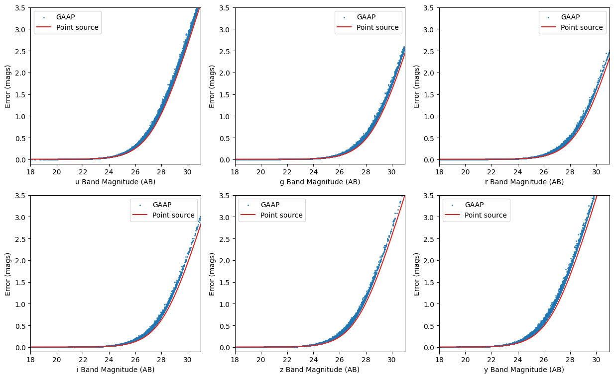
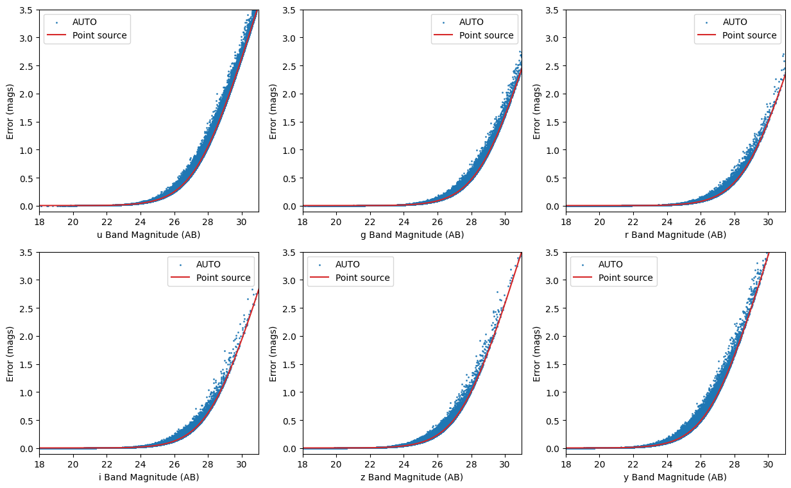

Photometric Realization from Different Magnitude Error Models
=============================================================

author: John Franklin Crenshaw, Sam Schmidt, Eric Charles, Ziang Yan

last run successfully: August 2, 2023

This notebook demonstrates how to do photometric realization from
different magnitude error models. For more completed degrader demo, see
``degradation-demo.ipynb``

.. code:: ipython3

    import matplotlib.pyplot as plt
    from pzflow.examples import get_example_flow
    from rail.creation.engines.flowEngine import FlowCreator
    from rail.creation.degraders.photometric_errors import LSSTErrorModel
    from rail.core.stage import RailStage

Specify the path to the pretrained ‘pzflow’ used to generate samples

.. code:: ipython3

    import pzflow
    import os
    
    flow_file = os.path.join(
        os.path.dirname(pzflow.__file__), "example_files", "example-flow.pzflow.pkl"
    )

We’ll start by setting up the RAIL data store. RAIL uses
`ceci <https://github.com/LSSTDESC/ceci>`__, which is designed for
pipelines rather than interactive notebooks, the data store will work
around that and enable us to use data interactively. See the
``rail/examples/goldenspike_examples/goldenspike.ipynb`` example
notebook for more details on the Data Store.

.. code:: ipython3

    DS = RailStage.data_store
    DS.__class__.allow_overwrite = True

“True” Engine
~~~~~~~~~~~~~

First, let’s make an Engine that has no degradation. We can use it to
generate a “true” sample, to which we can compare all the degraded
samples below.

Note: in this example, we will use a normalizing flow engine from the
`pzflow <https://github.com/jfcrenshaw/pzflow>`__ package. However,
everything in this notebook is totally agnostic to what the underlying
engine is.

The Engine is a type of RailStage object, so we can make one using the
``RailStage.make_stage`` function for the class of Engine that we want.
We then pass in the configuration parameters as arguments to
``make_stage``.

.. code:: ipython3

    n_samples = int(1e5)
    flowEngine_truth = FlowCreator.make_stage(
        name="truth", model=flow_file, n_samples=n_samples
    )

.. parsed-literal::

    Inserting handle into data store.  model: /opt/hostedtoolcache/Python/3.10.15/x64/lib/python3.10/site-packages/pzflow/example_files/example-flow.pzflow.pkl, truth

Let’s check that the Engine correctly read the underlying PZ Flow
object:

.. code:: ipython3

    flowEngine_truth.get_data("model")

.. parsed-literal::

    <pzflow.flow.Flow at 0x7fb66c9d5120>

Now we invoke the ``sample`` method to generate some samples
~~~~~~~~~~~~~~~~~~~~~~~~~~~~~~~~~~~~~~~~~~~~~~~~~~~~~~~~~~~~

Note that this will return a ``DataHandle`` object, which can keep both
the data itself, and also the path to where the data is written. When
talking to rail stages we can use this as though it were the underlying
data and pass it as an argument. This allows the rail stages to keep
track of where their inputs are coming from.

To calculate magnitude error for extended sources, we need the
information about major and minor axes of each galaxy. Here we simply
generate random values

.. code:: ipython3

    samples_truth = flowEngine_truth.sample(n_samples, seed=0)
    
    import numpy as np
    
    samples_truth.data["major"] = np.abs(
        np.random.normal(loc=0.01, scale=0.1, size=n_samples)
    )  # add major and minor axes
    b_to_a = 1 - 0.5 * np.random.rand(n_samples)
    samples_truth.data["minor"] = samples_truth.data["major"] * b_to_a
    
    print(samples_truth())
    print("Data was written to ", samples_truth.path)

.. parsed-literal::

    Inserting handle into data store.  output_truth: inprogress_output_truth.pq, truth
           redshift          u          g          r          i          z  \
    0      0.890625  27.370831  26.712660  26.025223  25.327185  25.016500   
    1      1.978239  29.557047  28.361183  27.587227  27.238544  26.628105   
    2      0.974287  26.566013  25.937716  24.787411  23.872454  23.139563   
    3      1.317978  29.042736  28.274597  27.501110  26.648792  26.091452   
    4      1.386366  26.292624  25.774778  25.429960  24.806530  24.367950   
    ...         ...        ...        ...        ...        ...        ...   
    99995  2.147172  26.550978  26.349937  26.135286  26.082020  25.911032   
    99996  1.457508  27.362209  27.036276  26.823141  26.420132  26.110037   
    99997  1.372993  27.736042  27.271955  26.887583  26.416138  26.043432   
    99998  0.855022  28.044554  27.327116  26.599014  25.862329  25.592169   
    99999  1.723768  27.049067  26.526747  26.094597  25.642973  25.197958   
    
                   y     major     minor  
    0      24.926819  0.003319  0.002869  
    1      26.248560  0.008733  0.007945  
    2      22.832047  0.103938  0.052162  
    3      25.346504  0.147522  0.143359  
    4      23.700008  0.010929  0.009473  
    ...          ...       ...       ...  
    99995  25.558136  0.086491  0.071701  
    99996  25.524906  0.044537  0.022302  
    99997  25.456163  0.073146  0.047825  
    99998  25.506388  0.100551  0.094662  
    99999  24.900501  0.059611  0.049181  
    
    [100000 rows x 9 columns]
    Data was written to  output_truth.pq

LSSTErrorModel
~~~~~~~~~~~~~~

Now, we will demonstrate the ``LSSTErrorModel``, which adds photometric
errors using a model similar to the model from `Ivezic et
al. 2019 <https://arxiv.org/abs/0805.2366>`__ (specifically, it uses the
model from this paper, without making the high SNR assumption. To
restore this assumption and therefore use the exact model from the
paper, set ``highSNR=True``.)

Let’s create an error model with the default settings for point sources:

.. code:: ipython3

    errorModel = LSSTErrorModel.make_stage(name="error_model")

For extended sources:

.. code:: ipython3

    errorModel_auto = LSSTErrorModel.make_stage(
        name="error_model_auto", extendedType="auto"
    )

.. code:: ipython3

    errorModel_gaap = LSSTErrorModel.make_stage(
        name="error_model_gaap", extendedType="gaap"
    )

Now let’s add this error model as a degrader and draw some samples with
photometric errors.

.. code:: ipython3

    samples_w_errs = errorModel(samples_truth)
    samples_w_errs()

.. parsed-literal::

    Inserting handle into data store.  output_error_model: inprogress_output_error_model.pq, error_model

.. raw:: html

    

    
    <table border="1" class="dataframe">
      <thead>
        <tr style="text-align: right;">
          <th></th>
          <th>redshift</th>
          <th>u</th>
          <th>u_err</th>
          <th>g</th>
          <th>g_err</th>
          <th>r</th>
          <th>r_err</th>
          <th>i</th>
          <th>i_err</th>
          <th>z</th>
          <th>z_err</th>
          <th>y</th>
          <th>y_err</th>
          <th>major</th>
          <th>minor</th>
        </tr>
      </thead>
      <tbody>
        <tr>
          <th>0</th>
          <td>0.890625</td>
          <td>27.048277</td>
          <td>0.568097</td>
          <td>26.314090</td>
          <td>0.117907</td>
          <td>25.955985</td>
          <td>0.075840</td>
          <td>25.311326</td>
          <td>0.069968</td>
          <td>24.943470</td>
          <td>0.096541</td>
          <td>25.125087</td>
          <td>0.247218</td>
          <td>0.003319</td>
          <td>0.002869</td>
        </tr>
        <tr>
          <th>1</th>
          <td>1.978239</td>
          <td>28.255083</td>
          <td>1.224142</td>
          <td>28.049013</td>
          <td>0.486527</td>
          <td>27.798459</td>
          <td>0.360053</td>
          <td>27.616919</td>
          <td>0.478519</td>
          <td>25.996817</td>
          <td>0.237719</td>
          <td>25.264116</td>
          <td>0.276977</td>
          <td>0.008733</td>
          <td>0.007945</td>
        </tr>
        <tr>
          <th>2</th>
          <td>0.974287</td>
          <td>26.666262</td>
          <td>0.428414</td>
          <td>25.944237</td>
          <td>0.085316</td>
          <td>24.782320</td>
          <td>0.026860</td>
          <td>23.914246</td>
          <td>0.020477</td>
          <td>23.158948</td>
          <td>0.020103</td>
          <td>22.840778</td>
          <td>0.033880</td>
          <td>0.103938</td>
          <td>0.052162</td>
        </tr>
        <tr>
          <th>3</th>
          <td>1.317978</td>
          <td>26.780366</td>
          <td>0.466896</td>
          <td>27.941452</td>
          <td>0.448922</td>
          <td>27.109938</td>
          <td>0.205783</td>
          <td>26.275517</td>
          <td>0.162260</td>
          <td>25.679920</td>
          <td>0.182354</td>
          <td>25.173430</td>
          <td>0.257228</td>
          <td>0.147522</td>
          <td>0.143359</td>
        </tr>
        <tr>
          <th>4</th>
          <td>1.386366</td>
          <td>26.269353</td>
          <td>0.314397</td>
          <td>25.675402</td>
          <td>0.067304</td>
          <td>25.477264</td>
          <td>0.049610</td>
          <td>24.762323</td>
          <td>0.042987</td>
          <td>24.273123</td>
          <td>0.053380</td>
          <td>23.674835</td>
          <td>0.070955</td>
          <td>0.010929</td>
          <td>0.009473</td>
        </tr>
        <tr>
          <th>...</th>
          <td>...</td>
          <td>...</td>
          <td>...</td>
          <td>...</td>
          <td>...</td>
          <td>...</td>
          <td>...</td>
          <td>...</td>
          <td>...</td>
          <td>...</td>
          <td>...</td>
          <td>...</td>
          <td>...</td>
          <td>...</td>
          <td>...</td>
        </tr>
        <tr>
          <th>99995</th>
          <td>2.147172</td>
          <td>28.157372</td>
          <td>1.159068</td>
          <td>26.437611</td>
          <td>0.131231</td>
          <td>26.101386</td>
          <td>0.086220</td>
          <td>26.060224</td>
          <td>0.134863</td>
          <td>25.872741</td>
          <td>0.214443</td>
          <td>25.738998</td>
          <td>0.403339</td>
          <td>0.086491</td>
          <td>0.071701</td>
        </tr>
        <tr>
          <th>99996</th>
          <td>1.457508</td>
          <td>inf</td>
          <td>inf</td>
          <td>27.276778</td>
          <td>0.266146</td>
          <td>26.935378</td>
          <td>0.177621</td>
          <td>26.436730</td>
          <td>0.186077</td>
          <td>25.948423</td>
          <td>0.228383</td>
          <td>25.344646</td>
          <td>0.295621</td>
          <td>0.044537</td>
          <td>0.022302</td>
        </tr>
        <tr>
          <th>99997</th>
          <td>1.372993</td>
          <td>inf</td>
          <td>inf</td>
          <td>26.905146</td>
          <td>0.195584</td>
          <td>26.608808</td>
          <td>0.134283</td>
          <td>26.495461</td>
          <td>0.195525</td>
          <td>25.651625</td>
          <td>0.178034</td>
          <td>26.412278</td>
          <td>0.659807</td>
          <td>0.073146</td>
          <td>0.047825</td>
        </tr>
        <tr>
          <th>99998</th>
          <td>0.855022</td>
          <td>inf</td>
          <td>inf</td>
          <td>27.321006</td>
          <td>0.275902</td>
          <td>26.746325</td>
          <td>0.151163</td>
          <td>25.690256</td>
          <td>0.097717</td>
          <td>25.771523</td>
          <td>0.197006</td>
          <td>27.098163</td>
          <td>1.025928</td>
          <td>0.100551</td>
          <td>0.094662</td>
        </tr>
        <tr>
          <th>99999</th>
          <td>1.723768</td>
          <td>26.540902</td>
          <td>0.389167</td>
          <td>26.343029</td>
          <td>0.120908</td>
          <td>26.080110</td>
          <td>0.084619</td>
          <td>25.698584</td>
          <td>0.098434</td>
          <td>24.997049</td>
          <td>0.101183</td>
          <td>25.006029</td>
          <td>0.224036</td>
          <td>0.059611</td>
          <td>0.049181</td>
        </tr>
      </tbody>
    </table>
    
100000 rows × 15 columns

    

.. code:: ipython3

    samples_w_errs_gaap = errorModel_gaap(samples_truth)
    samples_w_errs_gaap.data

.. parsed-literal::

    Inserting handle into data store.  output_error_model_gaap: inprogress_output_error_model_gaap.pq, error_model_gaap

.. raw:: html

    

    
    <table border="1" class="dataframe">
      <thead>
        <tr style="text-align: right;">
          <th></th>
          <th>redshift</th>
          <th>u</th>
          <th>u_err</th>
          <th>g</th>
          <th>g_err</th>
          <th>r</th>
          <th>r_err</th>
          <th>i</th>
          <th>i_err</th>
          <th>z</th>
          <th>z_err</th>
          <th>y</th>
          <th>y_err</th>
          <th>major</th>
          <th>minor</th>
        </tr>
      </thead>
      <tbody>
        <tr>
          <th>0</th>
          <td>0.890625</td>
          <td>26.995360</td>
          <td>0.601609</td>
          <td>26.602945</td>
          <td>0.173842</td>
          <td>26.156683</td>
          <td>0.106367</td>
          <td>25.296629</td>
          <td>0.081833</td>
          <td>25.009302</td>
          <td>0.120060</td>
          <td>24.740603</td>
          <td>0.210377</td>
          <td>0.003319</td>
          <td>0.002869</td>
        </tr>
        <tr>
          <th>1</th>
          <td>1.978239</td>
          <td>inf</td>
          <td>inf</td>
          <td>28.768262</td>
          <td>0.891672</td>
          <td>27.964514</td>
          <td>0.470713</td>
          <td>27.079307</td>
          <td>0.367516</td>
          <td>26.174407</td>
          <td>0.318840</td>
          <td>25.764645</td>
          <td>0.474944</td>
          <td>0.008733</td>
          <td>0.007945</td>
        </tr>
        <tr>
          <th>2</th>
          <td>0.974287</td>
          <td>26.213202</td>
          <td>0.339525</td>
          <td>25.686829</td>
          <td>0.080130</td>
          <td>24.763338</td>
          <td>0.031769</td>
          <td>23.819993</td>
          <td>0.022800</td>
          <td>23.136559</td>
          <td>0.023622</td>
          <td>22.792767</td>
          <td>0.039342</td>
          <td>0.103938</td>
          <td>0.052162</td>
        </tr>
        <tr>
          <th>3</th>
          <td>1.317978</td>
          <td>28.454394</td>
          <td>1.503599</td>
          <td>31.691156</td>
          <td>3.306913</td>
          <td>26.999237</td>
          <td>0.233073</td>
          <td>26.947836</td>
          <td>0.352619</td>
          <td>25.929584</td>
          <td>0.278363</td>
          <td>25.314150</td>
          <td>0.357144</td>
          <td>0.147522</td>
          <td>0.143359</td>
        </tr>
        <tr>
          <th>4</th>
          <td>1.386366</td>
          <td>26.575213</td>
          <td>0.442524</td>
          <td>25.969833</td>
          <td>0.100698</td>
          <td>25.476826</td>
          <td>0.058428</td>
          <td>24.792235</td>
          <td>0.052377</td>
          <td>24.309627</td>
          <td>0.064941</td>
          <td>23.666749</td>
          <td>0.083371</td>
          <td>0.010929</td>
          <td>0.009473</td>
        </tr>
        <tr>
          <th>...</th>
          <td>...</td>
          <td>...</td>
          <td>...</td>
          <td>...</td>
          <td>...</td>
          <td>...</td>
          <td>...</td>
          <td>...</td>
          <td>...</td>
          <td>...</td>
          <td>...</td>
          <td>...</td>
          <td>...</td>
          <td>...</td>
          <td>...</td>
        </tr>
        <tr>
          <th>99995</th>
          <td>2.147172</td>
          <td>26.178190</td>
          <td>0.329947</td>
          <td>26.573288</td>
          <td>0.172657</td>
          <td>26.335975</td>
          <td>0.126941</td>
          <td>25.946542</td>
          <td>0.147350</td>
          <td>26.166198</td>
          <td>0.322782</td>
          <td>25.434646</td>
          <td>0.376236</td>
          <td>0.086491</td>
          <td>0.071701</td>
        </tr>
        <tr>
          <th>99996</th>
          <td>1.457508</td>
          <td>28.740858</td>
          <td>1.681311</td>
          <td>26.638444</td>
          <td>0.179804</td>
          <td>26.347798</td>
          <td>0.126137</td>
          <td>26.825789</td>
          <td>0.301747</td>
          <td>25.829194</td>
          <td>0.241824</td>
          <td>25.244731</td>
          <td>0.318977</td>
          <td>0.044537</td>
          <td>0.022302</td>
        </tr>
        <tr>
          <th>99997</th>
          <td>1.372993</td>
          <td>27.848402</td>
          <td>1.054033</td>
          <td>27.249290</td>
          <td>0.300097</td>
          <td>26.524016</td>
          <td>0.148099</td>
          <td>27.229032</td>
          <td>0.417336</td>
          <td>26.004870</td>
          <td>0.281426</td>
          <td>26.269227</td>
          <td>0.688339</td>
          <td>0.073146</td>
          <td>0.047825</td>
        </tr>
        <tr>
          <th>99998</th>
          <td>0.855022</td>
          <td>27.794204</td>
          <td>1.030627</td>
          <td>27.383923</td>
          <td>0.339236</td>
          <td>26.523844</td>
          <td>0.150798</td>
          <td>25.910774</td>
          <td>0.144402</td>
          <td>25.839244</td>
          <td>0.250130</td>
          <td>25.899682</td>
          <td>0.538816</td>
          <td>0.100551</td>
          <td>0.094662</td>
        </tr>
        <tr>
          <th>99999</th>
          <td>1.723768</td>
          <td>26.913001</td>
          <td>0.570910</td>
          <td>26.793509</td>
          <td>0.205922</td>
          <td>26.190029</td>
          <td>0.110607</td>
          <td>25.536881</td>
          <td>0.102121</td>
          <td>25.285423</td>
          <td>0.153876</td>
          <td>24.965227</td>
          <td>0.255854</td>
          <td>0.059611</td>
          <td>0.049181</td>
        </tr>
      </tbody>
    </table>
    
100000 rows × 15 columns

    

.. code:: ipython3

    samples_w_errs_auto = errorModel_auto(samples_truth)
    samples_w_errs_auto.data

.. parsed-literal::

    Inserting handle into data store.  output_error_model_auto: inprogress_output_error_model_auto.pq, error_model_auto

.. raw:: html

    

    
    <table border="1" class="dataframe">
      <thead>
        <tr style="text-align: right;">
          <th></th>
          <th>redshift</th>
          <th>u</th>
          <th>u_err</th>
          <th>g</th>
          <th>g_err</th>
          <th>r</th>
          <th>r_err</th>
          <th>i</th>
          <th>i_err</th>
          <th>z</th>
          <th>z_err</th>
          <th>y</th>
          <th>y_err</th>
          <th>major</th>
          <th>minor</th>
        </tr>
      </thead>
      <tbody>
        <tr>
          <th>0</th>
          <td>0.890625</td>
          <td>27.546937</td>
          <td>0.799300</td>
          <td>26.660286</td>
          <td>0.158931</td>
          <td>26.030875</td>
          <td>0.081035</td>
          <td>25.295136</td>
          <td>0.068982</td>
          <td>24.866844</td>
          <td>0.090270</td>
          <td>24.553885</td>
          <td>0.152920</td>
          <td>0.003319</td>
          <td>0.002869</td>
        </tr>
        <tr>
          <th>1</th>
          <td>1.978239</td>
          <td>27.467714</td>
          <td>0.759091</td>
          <td>28.843878</td>
          <td>0.844275</td>
          <td>27.427448</td>
          <td>0.267818</td>
          <td>27.318037</td>
          <td>0.381531</td>
          <td>26.573324</td>
          <td>0.378023</td>
          <td>inf</td>
          <td>inf</td>
          <td>0.008733</td>
          <td>0.007945</td>
        </tr>
        <tr>
          <th>2</th>
          <td>0.974287</td>
          <td>inf</td>
          <td>inf</td>
          <td>25.846721</td>
          <td>0.084166</td>
          <td>24.792866</td>
          <td>0.029425</td>
          <td>23.894082</td>
          <td>0.021888</td>
          <td>23.139358</td>
          <td>0.021416</td>
          <td>22.836639</td>
          <td>0.036772</td>
          <td>0.103938</td>
          <td>0.052162</td>
        </tr>
        <tr>
          <th>3</th>
          <td>1.317978</td>
          <td>inf</td>
          <td>inf</td>
          <td>28.963725</td>
          <td>1.045335</td>
          <td>26.970291</td>
          <td>0.226782</td>
          <td>26.432456</td>
          <td>0.231716</td>
          <td>26.227346</td>
          <td>0.352000</td>
          <td>24.877515</td>
          <td>0.250613</td>
          <td>0.147522</td>
          <td>0.143359</td>
        </tr>
        <tr>
          <th>4</th>
          <td>1.386366</td>
          <td>29.003249</td>
          <td>1.782132</td>
          <td>25.764341</td>
          <td>0.072897</td>
          <td>25.414831</td>
          <td>0.047003</td>
          <td>24.738802</td>
          <td>0.042164</td>
          <td>24.333641</td>
          <td>0.056407</td>
          <td>23.818360</td>
          <td>0.080668</td>
          <td>0.010929</td>
          <td>0.009473</td>
        </tr>
        <tr>
          <th>...</th>
          <td>...</td>
          <td>...</td>
          <td>...</td>
          <td>...</td>
          <td>...</td>
          <td>...</td>
          <td>...</td>
          <td>...</td>
          <td>...</td>
          <td>...</td>
          <td>...</td>
          <td>...</td>
          <td>...</td>
          <td>...</td>
          <td>...</td>
        </tr>
        <tr>
          <th>99995</th>
          <td>2.147172</td>
          <td>25.945148</td>
          <td>0.254665</td>
          <td>26.663794</td>
          <td>0.170423</td>
          <td>26.247520</td>
          <td>0.106040</td>
          <td>26.070042</td>
          <td>0.147450</td>
          <td>26.190778</td>
          <td>0.299532</td>
          <td>27.214842</td>
          <td>1.158653</td>
          <td>0.086491</td>
          <td>0.071701</td>
        </tr>
        <tr>
          <th>99996</th>
          <td>1.457508</td>
          <td>26.730414</td>
          <td>0.454161</td>
          <td>27.230669</td>
          <td>0.259743</td>
          <td>26.587548</td>
          <td>0.133993</td>
          <td>26.606718</td>
          <td>0.218185</td>
          <td>25.971782</td>
          <td>0.236482</td>
          <td>25.353151</td>
          <td>0.302347</td>
          <td>0.044537</td>
          <td>0.022302</td>
        </tr>
        <tr>
          <th>99997</th>
          <td>1.372993</td>
          <td>26.567804</td>
          <td>0.409476</td>
          <td>27.421010</td>
          <td>0.311018</td>
          <td>26.815237</td>
          <td>0.168149</td>
          <td>26.438148</td>
          <td>0.195688</td>
          <td>25.736695</td>
          <td>0.200476</td>
          <td>26.571193</td>
          <td>0.763804</td>
          <td>0.073146</td>
          <td>0.047825</td>
        </tr>
        <tr>
          <th>99998</th>
          <td>0.855022</td>
          <td>29.282659</td>
          <td>2.091042</td>
          <td>27.419644</td>
          <td>0.327505</td>
          <td>26.510627</td>
          <td>0.138087</td>
          <td>25.941750</td>
          <td>0.136962</td>
          <td>25.888154</td>
          <td>0.242006</td>
          <td>26.001403</td>
          <td>0.542792</td>
          <td>0.100551</td>
          <td>0.094662</td>
        </tr>
        <tr>
          <th>99999</th>
          <td>1.723768</td>
          <td>27.092685</td>
          <td>0.599430</td>
          <td>26.706555</td>
          <td>0.170836</td>
          <td>26.056044</td>
          <td>0.086144</td>
          <td>25.561767</td>
          <td>0.090927</td>
          <td>25.278201</td>
          <td>0.134302</td>
          <td>24.999481</td>
          <td>0.231482</td>
          <td>0.059611</td>
          <td>0.049181</td>
        </tr>
      </tbody>
    </table>
    
100000 rows × 15 columns

    

Notice some of the magnitudes are inf’s. These are non-detections
(i.e. the noisy flux was negative). You can change the nSigma limit for
non-detections by setting ``sigLim=...``. For example, if ``sigLim=5``,
then all fluxes with ``SNR<5`` are flagged as non-detections.

Let’s plot the error as a function of magnitude

.. code:: ipython3

    %matplotlib inline
    
    fig, axes_ = plt.subplots(ncols=3, nrows=2, figsize=(15, 9), dpi=100)
    axes = axes_.reshape(-1)
    for i, band in enumerate("ugrizy"):
        ax = axes[i]
        # pull out the magnitudes and errors
        mags = samples_w_errs.data[band].to_numpy()
        errs = samples_w_errs.data[band + "_err"].to_numpy()
        
        # sort them by magnitude
        mags, errs = mags[mags.argsort()], errs[mags.argsort()]
        
        # plot errs vs mags
        #ax.plot(mags, errs, label=band) 
        
        #plt.plot(mags, errs, c='C'+str(i))
        ax.scatter(samples_w_errs_gaap.data[band].to_numpy(),
                samples_w_errs_gaap.data[band + "_err"].to_numpy(),
                    s=5, marker='.', color='C0', alpha=0.8, label='GAAP')
        
        ax.plot(mags, errs, color='C3', label='Point source')
        
        
        ax.legend()
        ax.set_xlim(18, 31)
        ax.set_ylim(-0.1, 3.5)
        ax.set(xlabel=band+" Band Magnitude (AB)", ylabel="Error (mags)")

.. code:: ipython3

    %matplotlib inline
    
    fig, axes_ = plt.subplots(ncols=3, nrows=2, figsize=(15, 9), dpi=100)
    axes = axes_.reshape(-1)
    for i, band in enumerate("ugrizy"):
        ax = axes[i]
        # pull out the magnitudes and errors
        mags = samples_w_errs.data[band].to_numpy()
        errs = samples_w_errs.data[band + "_err"].to_numpy()
        
        # sort them by magnitude
        mags, errs = mags[mags.argsort()], errs[mags.argsort()]
        
        # plot errs vs mags
        #ax.plot(mags, errs, label=band) 
        
        #plt.plot(mags, errs, c='C'+str(i))
        ax.scatter(samples_w_errs_auto.data[band].to_numpy(),
                samples_w_errs_auto.data[band + "_err"].to_numpy(),
                    s=5, marker='.', color='C0', alpha=0.8, label='AUTO')
        
        ax.plot(mags, errs, color='C3', label='Point source')
        
        
        ax.legend()
        ax.set_xlim(18, 31)
        ax.set_ylim(-0.1, 3.5)
        ax.set(xlabel=band+" Band Magnitude (AB)", ylabel="Error (mags)")

You can see that the photometric error increases as magnitude gets
dimmer, just like you would expect, and that the extended source errors
are greater than the point source errors. The extended source errors are
also scattered, because the galaxies have random sizes.

Also, you can find the GAaP and AUTO magnitude error are scattered due
to variable galaxy sizes. Also, you can find that there are gaps between
GAAP magnitude error and point souce magnitude error, this is because
the additional factors due to aperture sizes have a minimum value of
:math:`\sqrt{(\sigma^2+A_{\mathrm{min}})/\sigma^2}`, where
:math:`\sigma` is the width of the beam, :math:`A_{\min}` is an offset
of the aperture sizes (taken to be 0.7 arcmin here).

You can also see that there are *very* faint galaxies in this sample.
That’s because, by default, the error model returns magnitudes for all
positive fluxes. If you want these galaxies flagged as non-detections
instead, you can set e.g. ``sigLim=5``, and everything with ``SNR<5``
will be flagged as a non-detection.
