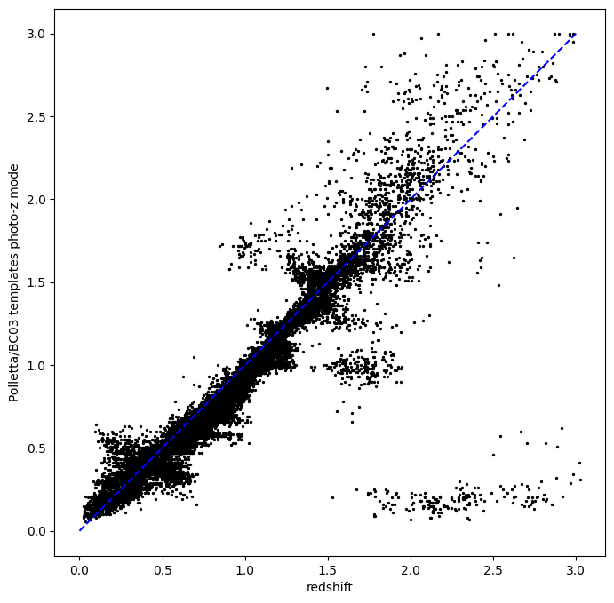
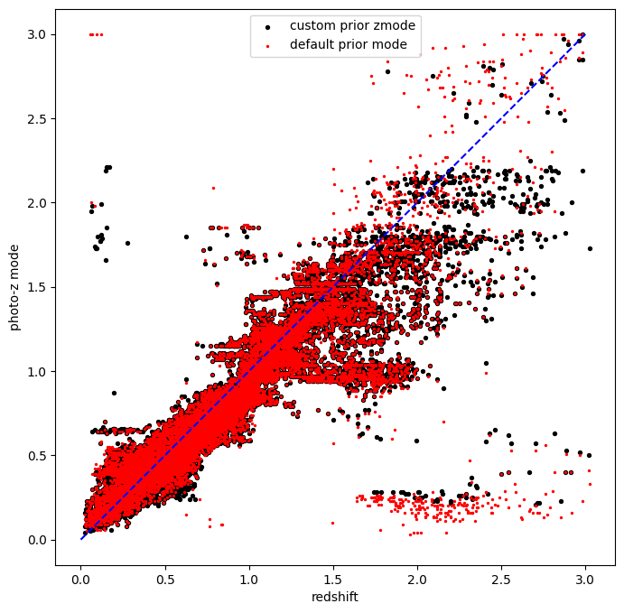

BPZ Lite Demo
=============

**Authors:** Sam Schmidt

**Last Successfully Run:** Oct 01, 2024

This notebook will go through a simple example of running rail_bpz
estimate and inform stages with a small set of test data that ships with
the RAIL package.

.. code:: ipython3

    import os
    import qp
    import pickle
    import matplotlib.pyplot as plt
    import numpy as np
    import pandas as pd
    import desc_bpz
    from rail.core.data import TableHandle, ModelHandle
    from rail.core.stage import RailStage
    from rail.utils.path_utils import RAILDIR
    from rail.estimation.algos.bpz_lite import BPZliteInformer, BPZliteEstimator

First, let’s set up a DataStore, for more info on the DataStore, see the
RAIL example notebooks:

.. code:: ipython3

    DS = RailStage.data_store
    DS.__class__.allow_overwrite = True

First, let’s grab the training and test data files that we will use in
this example, they are included with RAIL, so we can access their
location via the RAILDIR path. Both file contain data drawn from the
cosmoDC2_v1.1.4 truth extragalactic catalog generated by DESC with model
10-year-depth magnitude uncertainties. The training data contains
roughly 10,000 galaxies, while the test data contains roughly 20,000.
Both sets are representative down to a limiting apparent magnitude.

.. code:: ipython3

    trainFile = os.path.join(RAILDIR, 'rail/examples_data/testdata/test_dc2_training_9816.hdf5')
    testFile = os.path.join(RAILDIR, 'rail/examples_data/testdata/test_dc2_validation_9816.hdf5')
    training_data = DS.read_file("training_data", TableHandle, trainFile)
    test_data = DS.read_file("test_data", TableHandle, testFile)

running BPZliteEstimator with a pre-existing model
--------------------------------------------------

BPZ is a template-fitting code that works by calculating the chi^2 value
for observed photometry and errors compared with a grid of theoretical
photometric fluxes generated from a set of template SEDs at each of a
grid of redshift values. These chi^2 values are converted to
likelihoods. If desired, a Bayesian prior can be applied that
parameterizes the expected distribution of galaxies in terms of both
probability of a “broad” SED type as a function of apparent magnitude,
and the probability of a galaxy being at a certain redshift given broad
SED type and apparent magnitude. The product of this prior and the
likelihoods is then summed over the SED types to return a marginalized
posterior PDF, or p(z) for each galaxy. If the config option
``no_prior`` is set to ``True``, then no prior is applied, and
BPZliteEstimator will return a likelihood for each galaxy rather than a
posterior.

``bpz-1.99.3``, the code written by Dan Coe and Narcisso Benitez and
available at https://www.stsci.edu/~dcoe/BPZ/, uses a default set of
eight SED templates: four templates from Coleman, Wu, & Weedman (CWW,
one Elliptical, two Spirals Sbc and Scd, and one Irregular), two
starburst (WB) templates, and two very blue star forming templates
generated using Bruzual & Charlot models with very young ages of 25Myr
and 5Myr. The original BPZ paper, Benitez(2000) computed a “default”
prior fit to data from the Hubble Deep Field North (HDFN). A pickle file
with these parameters and the default SEDs are included with RAIL, named
``CWW_HDFN_prior.pkl``. You can run BPZliteEstimator with these default
templates and priors without doing any training, the equivalent of
“running BPZ with the defaults” had you downloaded bpz-1.99.3 and run
it. **Note, however**, that the cosmoDC2_v1.1.4 dataset has a population
of galaxy SEDs that are fairly different from the “default” CWWSB
templates, and the prior distributions do not exactly match. So, you
will get results that do not look particularly good. We will demonstrate
that use case here, though, as it is the most simple way to run the code
out of the box (and illustrates the dangers of grabbing code and running
it out of the box):

We need to set up a RAIL stage for the default run of BPZ, including
specifying the location of the model pickle file, which is located
included in the ``rail_base`` package and can be found relative to
``RAILDIR`` at
``rail/examples_data/estimation_data/data/CWW_HDFN_prior.pkl``.

``rail_bpz`` attempts to set “sensible” defaults for an expected run on
Rubin data, including for the magnitude and magnitude error column
names. While the defaults match the names in our small example datasets,
we will set the configuration parameters explicitly so that users can
see how this is done. The names of the magnitudes are read in as a list
by the configuration parameter ``bands``, while the magnitude errors the
parameter ``err_bands``.

``BPZ`` works by creating synthetic expected magnitudes by convolving
the SEDs with filter curves, so ``rail_bpz`` needs to know which filter
files to use. The names of the filters are specified by the
``filter_list`` configuration parameter, and should consist of a list of
strings containing the names of the files, minus the “.sed” suffix. Also
note that these files must be located in the ``SED`` directory where
``BPZ`` expects to find all filters. This is defined, relative to
``RAILDIR`` as:
``RAILDIR + '/rail/examples_data/estimation_data/data/FILTER'``

Also note that the ``bands``, ``err_bands``, and ``filter_list`` lists
are required to be of the same length, and must be in the same order,
usually ascending in wavelength, i.e. all three would be ordered
u,g,r,i,z,y for Rubin data.

Let’s make lists containing the expected bands, errors, and filter
names. Our file contains magnitudes with names of the form
“mag\_{band}\ *lsst” and magnitude errors named like
”mag_err*\ {band}\ *lsst”. This example data is from the DESC DC2
simulations, and our default filter bandpass curves haves names of the
form ”DC2LSST*\ {band}.sed”.

.. code:: ipython3

    bands = ["u", "g", "r", "i", "z", "y"]
    lsst_bands = []
    lsst_errs = []
    lsst_filts = []
    for band in bands:
        lsst_bands.append(f"mag_{band}_lsst")
        lsst_errs.append(f"mag_err_{band}_lsst")
        lsst_filts.append(f"DC2LSST_{band}")
    print(lsst_bands)
    print(lsst_filts)

.. parsed-literal::

    ['mag_u_lsst', 'mag_g_lsst', 'mag_r_lsst', 'mag_i_lsst', 'mag_z_lsst', 'mag_y_lsst']
    ['DC2LSST_u', 'DC2LSST_g', 'DC2LSST_r', 'DC2LSST_i', 'DC2LSST_z', 'DC2LSST_y']

Now, let’s set up a dictionary of configuration parameters and set up to
run the estimator.

.. code:: ipython3

    hdfnfile = os.path.join(RAILDIR, "rail/examples_data/estimation_data/data/CWW_HDFN_prior.pkl")
    default_dict = dict(hdf5_groupname="photometry", output="bpz_results_defaultprior.hdf5",
                        bands=lsst_bands, err_bands=lsst_errs, filter_list=lsst_filts,
                        prior_band="mag_i_lsst", no_prior=False)
    run_default = BPZliteEstimator.make_stage(name="bpz_def_prior", model=hdfnfile, **default_dict)

Let’s run the estimate stage, if this is the first run of
``BPZliteEstimator`` or ``BPZliteInformer``, you may see a bunch of
output lines as ``DESC_BPZ`` creates the synthetic photometry “AB” files
for the SEDs and filters.

.. code:: ipython3

    %%time
    run_default.estimate(test_data)

.. parsed-literal::

    Inserting handle into data store.  model: /opt/hostedtoolcache/Python/3.10.18/x64/lib/python3.10/site-packages/rail/examples_data/estimation_data/data/CWW_HDFN_prior.pkl, bpz_def_prior
      Generating new AB file El_B2004a.DC2LSST_u.AB....
    El_B2004a DC2LSST_u
    x_res[0] 3000.0
    x_res[-1] 11500.0

.. parsed-literal::

    Writing AB file  /opt/hostedtoolcache/Python/3.10.18/x64/lib/python3.10/site-packages/rail/examples_data/estimation_data/data/AB/El_B2004a.DC2LSST_u.AB
      Generating new AB file El_B2004a.DC2LSST_g.AB....
    El_B2004a DC2LSST_g
    x_res[0] 3000.0
    x_res[-1] 11500.0

.. parsed-literal::

    Writing AB file  /opt/hostedtoolcache/Python/3.10.18/x64/lib/python3.10/site-packages/rail/examples_data/estimation_data/data/AB/El_B2004a.DC2LSST_g.AB
      Generating new AB file El_B2004a.DC2LSST_r.AB....
    El_B2004a DC2LSST_r
    x_res[0] 3000.0
    x_res[-1] 11500.0

.. parsed-literal::

    Writing AB file  /opt/hostedtoolcache/Python/3.10.18/x64/lib/python3.10/site-packages/rail/examples_data/estimation_data/data/AB/El_B2004a.DC2LSST_r.AB
      Generating new AB file El_B2004a.DC2LSST_i.AB....
    El_B2004a DC2LSST_i
    x_res[0] 3000.0
    x_res[-1] 11500.0

.. parsed-literal::

    Writing AB file  /opt/hostedtoolcache/Python/3.10.18/x64/lib/python3.10/site-packages/rail/examples_data/estimation_data/data/AB/El_B2004a.DC2LSST_i.AB
      Generating new AB file El_B2004a.DC2LSST_z.AB....
    El_B2004a DC2LSST_z
    x_res[0] 3000.0
    x_res[-1] 11500.0

.. parsed-literal::

    Writing AB file  /opt/hostedtoolcache/Python/3.10.18/x64/lib/python3.10/site-packages/rail/examples_data/estimation_data/data/AB/El_B2004a.DC2LSST_z.AB
      Generating new AB file El_B2004a.DC2LSST_y.AB....
    El_B2004a DC2LSST_y
    x_res[0] 3000.0
    x_res[-1] 11500.0

.. parsed-literal::

    Writing AB file  /opt/hostedtoolcache/Python/3.10.18/x64/lib/python3.10/site-packages/rail/examples_data/estimation_data/data/AB/El_B2004a.DC2LSST_y.AB
      Generating new AB file Sbc_B2004a.DC2LSST_u.AB....
    Sbc_B2004a DC2LSST_u
    x_res[0] 3000.0
    x_res[-1] 11500.0

.. parsed-literal::

    Writing AB file  /opt/hostedtoolcache/Python/3.10.18/x64/lib/python3.10/site-packages/rail/examples_data/estimation_data/data/AB/Sbc_B2004a.DC2LSST_u.AB
      Generating new AB file Sbc_B2004a.DC2LSST_g.AB....
    Sbc_B2004a DC2LSST_g
    x_res[0] 3000.0
    x_res[-1] 11500.0

.. parsed-literal::

    Writing AB file  /opt/hostedtoolcache/Python/3.10.18/x64/lib/python3.10/site-packages/rail/examples_data/estimation_data/data/AB/Sbc_B2004a.DC2LSST_g.AB
      Generating new AB file Sbc_B2004a.DC2LSST_r.AB....
    Sbc_B2004a DC2LSST_r
    x_res[0] 3000.0
    x_res[-1] 11500.0

.. parsed-literal::

    Writing AB file  /opt/hostedtoolcache/Python/3.10.18/x64/lib/python3.10/site-packages/rail/examples_data/estimation_data/data/AB/Sbc_B2004a.DC2LSST_r.AB
      Generating new AB file Sbc_B2004a.DC2LSST_i.AB....
    Sbc_B2004a DC2LSST_i
    x_res[0] 3000.0
    x_res[-1] 11500.0

.. parsed-literal::

    Writing AB file  /opt/hostedtoolcache/Python/3.10.18/x64/lib/python3.10/site-packages/rail/examples_data/estimation_data/data/AB/Sbc_B2004a.DC2LSST_i.AB
      Generating new AB file Sbc_B2004a.DC2LSST_z.AB....
    Sbc_B2004a DC2LSST_z
    x_res[0] 3000.0
    x_res[-1] 11500.0

.. parsed-literal::

    Writing AB file  /opt/hostedtoolcache/Python/3.10.18/x64/lib/python3.10/site-packages/rail/examples_data/estimation_data/data/AB/Sbc_B2004a.DC2LSST_z.AB
      Generating new AB file Sbc_B2004a.DC2LSST_y.AB....
    Sbc_B2004a DC2LSST_y
    x_res[0] 3000.0
    x_res[-1] 11500.0

.. parsed-literal::

    Writing AB file  /opt/hostedtoolcache/Python/3.10.18/x64/lib/python3.10/site-packages/rail/examples_data/estimation_data/data/AB/Sbc_B2004a.DC2LSST_y.AB
      Generating new AB file Scd_B2004a.DC2LSST_u.AB....
    Scd_B2004a DC2LSST_u
    x_res[0] 3000.0
    x_res[-1] 11500.0

.. parsed-literal::

    Writing AB file  /opt/hostedtoolcache/Python/3.10.18/x64/lib/python3.10/site-packages/rail/examples_data/estimation_data/data/AB/Scd_B2004a.DC2LSST_u.AB
      Generating new AB file Scd_B2004a.DC2LSST_g.AB....
    Scd_B2004a DC2LSST_g
    x_res[0] 3000.0
    x_res[-1] 11500.0

.. parsed-literal::

    Writing AB file  /opt/hostedtoolcache/Python/3.10.18/x64/lib/python3.10/site-packages/rail/examples_data/estimation_data/data/AB/Scd_B2004a.DC2LSST_g.AB
      Generating new AB file Scd_B2004a.DC2LSST_r.AB....
    Scd_B2004a DC2LSST_r
    x_res[0] 3000.0
    x_res[-1] 11500.0

.. parsed-literal::

    Writing AB file  /opt/hostedtoolcache/Python/3.10.18/x64/lib/python3.10/site-packages/rail/examples_data/estimation_data/data/AB/Scd_B2004a.DC2LSST_r.AB
      Generating new AB file Scd_B2004a.DC2LSST_i.AB....
    Scd_B2004a DC2LSST_i
    x_res[0] 3000.0
    x_res[-1] 11500.0

.. parsed-literal::

    Writing AB file  /opt/hostedtoolcache/Python/3.10.18/x64/lib/python3.10/site-packages/rail/examples_data/estimation_data/data/AB/Scd_B2004a.DC2LSST_i.AB
      Generating new AB file Scd_B2004a.DC2LSST_z.AB....
    Scd_B2004a DC2LSST_z
    x_res[0] 3000.0
    x_res[-1] 11500.0

.. parsed-literal::

    Writing AB file  /opt/hostedtoolcache/Python/3.10.18/x64/lib/python3.10/site-packages/rail/examples_data/estimation_data/data/AB/Scd_B2004a.DC2LSST_z.AB
      Generating new AB file Scd_B2004a.DC2LSST_y.AB....
    Scd_B2004a DC2LSST_y
    x_res[0] 3000.0
    x_res[-1] 11500.0

.. parsed-literal::

    Writing AB file  /opt/hostedtoolcache/Python/3.10.18/x64/lib/python3.10/site-packages/rail/examples_data/estimation_data/data/AB/Scd_B2004a.DC2LSST_y.AB
      Generating new AB file Im_B2004a.DC2LSST_u.AB....
    Im_B2004a DC2LSST_u
    x_res[0] 3000.0
    x_res[-1] 11500.0

.. parsed-literal::

    Writing AB file  /opt/hostedtoolcache/Python/3.10.18/x64/lib/python3.10/site-packages/rail/examples_data/estimation_data/data/AB/Im_B2004a.DC2LSST_u.AB
      Generating new AB file Im_B2004a.DC2LSST_g.AB....
    Im_B2004a DC2LSST_g
    x_res[0] 3000.0
    x_res[-1] 11500.0

.. parsed-literal::

    Writing AB file  /opt/hostedtoolcache/Python/3.10.18/x64/lib/python3.10/site-packages/rail/examples_data/estimation_data/data/AB/Im_B2004a.DC2LSST_g.AB
      Generating new AB file Im_B2004a.DC2LSST_r.AB....
    Im_B2004a DC2LSST_r
    x_res[0] 3000.0
    x_res[-1] 11500.0

.. parsed-literal::

    Writing AB file  /opt/hostedtoolcache/Python/3.10.18/x64/lib/python3.10/site-packages/rail/examples_data/estimation_data/data/AB/Im_B2004a.DC2LSST_r.AB
      Generating new AB file Im_B2004a.DC2LSST_i.AB....
    Im_B2004a DC2LSST_i
    x_res[0] 3000.0
    x_res[-1] 11500.0

.. parsed-literal::

    Writing AB file  /opt/hostedtoolcache/Python/3.10.18/x64/lib/python3.10/site-packages/rail/examples_data/estimation_data/data/AB/Im_B2004a.DC2LSST_i.AB
      Generating new AB file Im_B2004a.DC2LSST_z.AB....
    Im_B2004a DC2LSST_z
    x_res[0] 3000.0
    x_res[-1] 11500.0

.. parsed-literal::

    Writing AB file  /opt/hostedtoolcache/Python/3.10.18/x64/lib/python3.10/site-packages/rail/examples_data/estimation_data/data/AB/Im_B2004a.DC2LSST_z.AB
      Generating new AB file Im_B2004a.DC2LSST_y.AB....
    Im_B2004a DC2LSST_y
    x_res[0] 3000.0
    x_res[-1] 11500.0

.. parsed-literal::

    Writing AB file  /opt/hostedtoolcache/Python/3.10.18/x64/lib/python3.10/site-packages/rail/examples_data/estimation_data/data/AB/Im_B2004a.DC2LSST_y.AB
      Generating new AB file SB3_B2004a.DC2LSST_u.AB....
    SB3_B2004a DC2LSST_u
    x_res[0] 3000.0
    x_res[-1] 11500.0

.. parsed-literal::

    Writing AB file  /opt/hostedtoolcache/Python/3.10.18/x64/lib/python3.10/site-packages/rail/examples_data/estimation_data/data/AB/SB3_B2004a.DC2LSST_u.AB
      Generating new AB file SB3_B2004a.DC2LSST_g.AB....
    SB3_B2004a DC2LSST_g
    x_res[0] 3000.0
    x_res[-1] 11500.0

.. parsed-literal::

    Writing AB file  /opt/hostedtoolcache/Python/3.10.18/x64/lib/python3.10/site-packages/rail/examples_data/estimation_data/data/AB/SB3_B2004a.DC2LSST_g.AB
      Generating new AB file SB3_B2004a.DC2LSST_r.AB....
    SB3_B2004a DC2LSST_r
    x_res[0] 3000.0
    x_res[-1] 11500.0

.. parsed-literal::

    Writing AB file  /opt/hostedtoolcache/Python/3.10.18/x64/lib/python3.10/site-packages/rail/examples_data/estimation_data/data/AB/SB3_B2004a.DC2LSST_r.AB
      Generating new AB file SB3_B2004a.DC2LSST_i.AB....
    SB3_B2004a DC2LSST_i
    x_res[0] 3000.0
    x_res[-1] 11500.0

.. parsed-literal::

    Writing AB file  /opt/hostedtoolcache/Python/3.10.18/x64/lib/python3.10/site-packages/rail/examples_data/estimation_data/data/AB/SB3_B2004a.DC2LSST_i.AB
      Generating new AB file SB3_B2004a.DC2LSST_z.AB....
    SB3_B2004a DC2LSST_z
    x_res[0] 3000.0
    x_res[-1] 11500.0

.. parsed-literal::

    Writing AB file  /opt/hostedtoolcache/Python/3.10.18/x64/lib/python3.10/site-packages/rail/examples_data/estimation_data/data/AB/SB3_B2004a.DC2LSST_z.AB
      Generating new AB file SB3_B2004a.DC2LSST_y.AB....
    SB3_B2004a DC2LSST_y
    x_res[0] 3000.0
    x_res[-1] 11500.0

.. parsed-literal::

    Writing AB file  /opt/hostedtoolcache/Python/3.10.18/x64/lib/python3.10/site-packages/rail/examples_data/estimation_data/data/AB/SB3_B2004a.DC2LSST_y.AB
      Generating new AB file SB2_B2004a.DC2LSST_u.AB....
    SB2_B2004a DC2LSST_u
    x_res[0] 3000.0
    x_res[-1] 11500.0

.. parsed-literal::

    Writing AB file  /opt/hostedtoolcache/Python/3.10.18/x64/lib/python3.10/site-packages/rail/examples_data/estimation_data/data/AB/SB2_B2004a.DC2LSST_u.AB
      Generating new AB file SB2_B2004a.DC2LSST_g.AB....
    SB2_B2004a DC2LSST_g
    x_res[0] 3000.0
    x_res[-1] 11500.0

.. parsed-literal::

    Writing AB file  /opt/hostedtoolcache/Python/3.10.18/x64/lib/python3.10/site-packages/rail/examples_data/estimation_data/data/AB/SB2_B2004a.DC2LSST_g.AB
      Generating new AB file SB2_B2004a.DC2LSST_r.AB....
    SB2_B2004a DC2LSST_r
    x_res[0] 3000.0
    x_res[-1] 11500.0

.. parsed-literal::

    Writing AB file  /opt/hostedtoolcache/Python/3.10.18/x64/lib/python3.10/site-packages/rail/examples_data/estimation_data/data/AB/SB2_B2004a.DC2LSST_r.AB
      Generating new AB file SB2_B2004a.DC2LSST_i.AB....
    SB2_B2004a DC2LSST_i
    x_res[0] 3000.0
    x_res[-1] 11500.0

.. parsed-literal::

    Writing AB file  /opt/hostedtoolcache/Python/3.10.18/x64/lib/python3.10/site-packages/rail/examples_data/estimation_data/data/AB/SB2_B2004a.DC2LSST_i.AB
      Generating new AB file SB2_B2004a.DC2LSST_z.AB....
    SB2_B2004a DC2LSST_z
    x_res[0] 3000.0
    x_res[-1] 11500.0

.. parsed-literal::

    Writing AB file  /opt/hostedtoolcache/Python/3.10.18/x64/lib/python3.10/site-packages/rail/examples_data/estimation_data/data/AB/SB2_B2004a.DC2LSST_z.AB
      Generating new AB file SB2_B2004a.DC2LSST_y.AB....
    SB2_B2004a DC2LSST_y
    x_res[0] 3000.0
    x_res[-1] 11500.0

.. parsed-literal::

    Writing AB file  /opt/hostedtoolcache/Python/3.10.18/x64/lib/python3.10/site-packages/rail/examples_data/estimation_data/data/AB/SB2_B2004a.DC2LSST_y.AB
      Generating new AB file ssp_25Myr_z008.DC2LSST_u.AB....
    ssp_25Myr_z008 DC2LSST_u
    x_res[0] 3000.0
    x_res[-1] 11500.0

.. parsed-literal::

    Writing AB file  /opt/hostedtoolcache/Python/3.10.18/x64/lib/python3.10/site-packages/rail/examples_data/estimation_data/data/AB/ssp_25Myr_z008.DC2LSST_u.AB
      Generating new AB file ssp_25Myr_z008.DC2LSST_g.AB....
    ssp_25Myr_z008 DC2LSST_g
    x_res[0] 3000.0
    x_res[-1] 11500.0

.. parsed-literal::

    Writing AB file  /opt/hostedtoolcache/Python/3.10.18/x64/lib/python3.10/site-packages/rail/examples_data/estimation_data/data/AB/ssp_25Myr_z008.DC2LSST_g.AB
      Generating new AB file ssp_25Myr_z008.DC2LSST_r.AB....
    ssp_25Myr_z008 DC2LSST_r
    x_res[0] 3000.0
    x_res[-1] 11500.0

.. parsed-literal::

    Writing AB file  /opt/hostedtoolcache/Python/3.10.18/x64/lib/python3.10/site-packages/rail/examples_data/estimation_data/data/AB/ssp_25Myr_z008.DC2LSST_r.AB
      Generating new AB file ssp_25Myr_z008.DC2LSST_i.AB....
    ssp_25Myr_z008 DC2LSST_i
    x_res[0] 3000.0
    x_res[-1] 11500.0

.. parsed-literal::

    Writing AB file  /opt/hostedtoolcache/Python/3.10.18/x64/lib/python3.10/site-packages/rail/examples_data/estimation_data/data/AB/ssp_25Myr_z008.DC2LSST_i.AB
      Generating new AB file ssp_25Myr_z008.DC2LSST_z.AB....
    ssp_25Myr_z008 DC2LSST_z
    x_res[0] 3000.0
    x_res[-1] 11500.0

.. parsed-literal::

    Writing AB file  /opt/hostedtoolcache/Python/3.10.18/x64/lib/python3.10/site-packages/rail/examples_data/estimation_data/data/AB/ssp_25Myr_z008.DC2LSST_z.AB
      Generating new AB file ssp_25Myr_z008.DC2LSST_y.AB....
    ssp_25Myr_z008 DC2LSST_y
    x_res[0] 3000.0
    x_res[-1] 11500.0

.. parsed-literal::

    Writing AB file  /opt/hostedtoolcache/Python/3.10.18/x64/lib/python3.10/site-packages/rail/examples_data/estimation_data/data/AB/ssp_25Myr_z008.DC2LSST_y.AB
      Generating new AB file ssp_5Myr_z008.DC2LSST_u.AB....
    ssp_5Myr_z008 DC2LSST_u
    x_res[0] 3000.0
    x_res[-1] 11500.0

.. parsed-literal::

    Writing AB file  /opt/hostedtoolcache/Python/3.10.18/x64/lib/python3.10/site-packages/rail/examples_data/estimation_data/data/AB/ssp_5Myr_z008.DC2LSST_u.AB
      Generating new AB file ssp_5Myr_z008.DC2LSST_g.AB....
    ssp_5Myr_z008 DC2LSST_g
    x_res[0] 3000.0
    x_res[-1] 11500.0

.. parsed-literal::

    Writing AB file  /opt/hostedtoolcache/Python/3.10.18/x64/lib/python3.10/site-packages/rail/examples_data/estimation_data/data/AB/ssp_5Myr_z008.DC2LSST_g.AB
      Generating new AB file ssp_5Myr_z008.DC2LSST_r.AB....
    ssp_5Myr_z008 DC2LSST_r
    x_res[0] 3000.0
    x_res[-1] 11500.0

.. parsed-literal::

    Writing AB file  /opt/hostedtoolcache/Python/3.10.18/x64/lib/python3.10/site-packages/rail/examples_data/estimation_data/data/AB/ssp_5Myr_z008.DC2LSST_r.AB
      Generating new AB file ssp_5Myr_z008.DC2LSST_i.AB....
    ssp_5Myr_z008 DC2LSST_i
    x_res[0] 3000.0
    x_res[-1] 11500.0

.. parsed-literal::

    Writing AB file  /opt/hostedtoolcache/Python/3.10.18/x64/lib/python3.10/site-packages/rail/examples_data/estimation_data/data/AB/ssp_5Myr_z008.DC2LSST_i.AB
      Generating new AB file ssp_5Myr_z008.DC2LSST_z.AB....
    ssp_5Myr_z008 DC2LSST_z
    x_res[0] 3000.0
    x_res[-1] 11500.0

.. parsed-literal::

    Writing AB file  /opt/hostedtoolcache/Python/3.10.18/x64/lib/python3.10/site-packages/rail/examples_data/estimation_data/data/AB/ssp_5Myr_z008.DC2LSST_z.AB
      Generating new AB file ssp_5Myr_z008.DC2LSST_y.AB....
    ssp_5Myr_z008 DC2LSST_y
    x_res[0] 3000.0
    x_res[-1] 11500.0

.. parsed-literal::

    Writing AB file  /opt/hostedtoolcache/Python/3.10.18/x64/lib/python3.10/site-packages/rail/examples_data/estimation_data/data/AB/ssp_5Myr_z008.DC2LSST_y.AB
    Process 0 running estimator on chunk 0 - 10,000

.. parsed-literal::

    /opt/hostedtoolcache/Python/3.10.18/x64/lib/python3.10/site-packages/rail/estimation/algos/bpz_lite.py:490: RuntimeWarning: overflow encountered in cast
      flux_err[unobserved] = 1e108

.. parsed-literal::

    Inserting handle into data store.  output_bpz_def_prior: inprogress_bpz_results_defaultprior.hdf5, bpz_def_prior
    Process 0 running estimator on chunk 10,000 - 20,000

.. parsed-literal::

    Process 0 running estimator on chunk 20,000 - 20,449

.. parsed-literal::

    CPU times: user 23.2 s, sys: 174 ms, total: 23.4 s
    Wall time: 23.3 s

.. parsed-literal::

    <rail.core.data.QPHandle at 0x7fdf5e3874c0>

.. code:: ipython3

    default_result = qp.read("bpz_results_defaultprior.hdf5")

Plot the mode of these “default run” PDFs against the true redshifts, we
have the true redshifts stored in the ``test_data`` in the DataStore,
and the modes are stored as ancillary data in the results that we just
produced:

.. code:: ipython3

    sz = test_data()['photometry']['redshift']

.. code:: ipython3

    plt.figure(figsize=(8,8))
    plt.scatter(sz, default_result.ancil['zmode'].flatten(), s=2, c='k', label='default prior mode')
    plt.plot([0,3], [0,3], 'b--')
    plt.xlabel("redshift")
    plt.ylabel("photo-z mode")

.. parsed-literal::

    Text(0, 0.5, 'photo-z mode')

Results do not look bad, there are some catastrophic outliers, and there
appears to be some bias in the redshift estimates, but as the SED
templates have slightly systematically different colors than our test
data, that is just what we expect to see.

BPZliteEstimator also produces a ``tb`` , a “best-fit type”; that is,
the SED template with the highest posterior probability contribution at
the value of the ``zmode``. We can plot up a color color diagram of our
test data and we should see a pattern in color space reflecting the
different populations in different areas of color space. ``tb`` is
stored as an 1-indexed integer corresponding the the number of the SED
in our template set.

.. code:: ipython3

    colordict = {}
    bands = ['u', 'g', 'r', 'i', 'z', 'y']
    for i in range(5):
        colordict[f'{bands[i]}{bands[i+1]}'] = test_data()['photometry'][f'mag_{bands[i]}_lsst'] - test_data()['photometry'][f'mag_{bands[i+1]}_lsst']
    colordict['tb'] = default_result.ancil['tb'].flatten()
    colordict['todds'] = default_result.ancil['todds'].flatten()
    colordict['sz'] = sz
    colordf = pd.DataFrame(colordict)
    sed_col = ['r', 'g', 'm', 'b', 'royalblue', 'gray', 'k']
    sed_label = ['Ell', 'Sbc', 'Scd', 'Im', 'SB3', 'SB2', 'ssp25Myr', 'ssp5Myr']

.. code:: ipython3

    plt.figure(figsize=(10,10))
    for i,col, lab in zip(range(8), sed_col, sed_label):
        tbmask = (np.isclose(colordf['tb'], i+1)) # note the 1-offset here because of how DESC_BPZ labels the SED types
        plt.scatter(colordf['gr'][tbmask], colordf['ri'][tbmask], color=col, s=2, label=lab)
    plt.xlim(-1,2.25)
    plt.xlabel("g-r", fontsize=13)
    plt.ylabel("r-i", fontsize=13)
    plt.legend(loc='upper left', fontsize=10)

.. parsed-literal::

    <matplotlib.legend.Legend at 0x7fdfb8086b90>

As expected, we see Ellptical galaxies with redder colors, and the
bluest galaxies being star-forming galaxies with power-law-like SED
shapes, with the other types spaced out in between.

BPZliteEstimator also computes a quantity called ``todds``, which is the
fraction of posterior probability in the best-fit SED relative to the
overall probability of all templates. If the value is high, then a
single SED is providing more of the probability. If the value is low,
then multiple SEDs are contributing, which means that ``tb``, the
best-fit-SED-type, is less meaningful. The values of todds whould be
lower where SEDs have degenerate broad-band colors, let’s highlight the
values of low todds and see where they lie in color space.

.. code:: ipython3

    plt.figure(figsize=(10,10))
    lowtoddsmask = (colordf['todds']<0.25)
    plt.scatter(colordf['gr'], colordf['ri'], color='k', s=8)
    plt.scatter(colordf['gr'][lowtoddsmask], colordf['ri'][lowtoddsmask], color='r', s=4, label='todds < 0.25')
    plt.xlim(-1,2.25)
    plt.xlabel("g-r", fontsize=13)
    plt.ylabel("r-i", fontsize=13)
    plt.legend(loc='upper left', fontsize=12)

.. parsed-literal::

    <matplotlib.legend.Legend at 0x7fdf58f222f0>

If you compare the areas of color space with low todds you can see that
it corresponds to portions of color space where multiple best-fit SED
types lie very close in color, e.g. areas where Sbc, Scd, and Im
galaxies all have similar g-r and r-i colors.

Running with the Polletta et al 2007 and BC03 SED template set
--------------------------------------------------------------

We have also included a second SED template set, the one used to compute
the COSMOS 30-band photo-z’s (See Ilbert et al 2007, Dahlen et al 2013
for more information) within rail. This set consists of 31 total SEDs,
the Elliptical and Spiral galaxy SEDs are empirical SEDs from Polletta
et al 2007, with additional blue templates generated from Bruzual and
Charlot (Bruzual & Charlot 2003) models. These SEDs can be accessed via
a path relative to ``RAILDIR`` as done below. In order to tell
``rail_bpz`` to use these SEDs, we need to set the ``spectra_file``
configuration parameter, which will point to an ascii file containing a
list of the SED names in the same directory that contains the SEDs. That
list file can be found relative to RAILDIR at:
``rail/examples_data/estimation_data/data/SED/COSMOS_seds.list``. We
have also created a version of the HDFN prior used above corresponding
to these templates, which we can specify with the ``model``
configuration parameter. The prior can be found relative to ``RAILDIR``
at ``rail/examples_data/estimation_data/data/COSMOS31_HDFN_prior.pkl``.

Let’s set up a run with this template set:

.. code:: ipython3

    cosmospriorfile = os.path.join(RAILDIR, "rail/examples_data/estimation_data/data/COSMOS31_HDFN_prior.pkl")
    cosmosprior = DS.read_file("cosmos_prior", ModelHandle, cosmospriorfile)
    sedfile = os.path.join(RAILDIR, "rail/examples_data/estimation_data/data/SED/COSMOS_seds.list")
    cosmos_dict = dict(hdf5_groupname="photometry", output="bpz_results_COSMOS_SEDs.hdf5",
                       spectra_file=sedfile, bands=lsst_bands, err_bands=lsst_errs,
                       filter_list=lsst_filts, prior_band="mag_i_lsst", no_prior=False)
    run_newseds = BPZliteEstimator.make_stage(name="bpz_newseds", model=cosmosprior, **cosmos_dict)

Let’s run the estimate stage, it should take almost four times as long,
as we are now using 31 templates rather than 8, and the code should
scale linearly in runtime with the number or SEDs. However, if this is
the first timet that you are running the code, additional time will be
taken in generating the “AB” files used to store the model fluxes, and
so the relative runtimes may be skewed by that extra, one time
computation (the AB files are computed once the first time that they are
used and stored for future runs).

.. code:: ipython3

    %%time
    newsed_result = run_newseds.estimate(test_data)

.. parsed-literal::

    Process 0 running estimator on chunk 0 - 10,000

.. parsed-literal::

    Inserting handle into data store.  output_bpz_newseds: inprogress_bpz_results_COSMOS_SEDs.hdf5, bpz_newseds
    Process 0 running estimator on chunk 10,000 - 20,000

.. parsed-literal::

    Process 0 running estimator on chunk 20,000 - 20,449

.. parsed-literal::

    CPU times: user 32.4 s, sys: 124 ms, total: 32.5 s
    Wall time: 32.5 s

A run on a single processor on a Mac took 15.7 seconds for me, relative
to 5.9 seconds for the CWWSB template set (not counting time used
generating the AB files), so not far off of the rough factor of four
predicted.

Let’s plot the point estimate vs true redshift for a quick comparison to
the CWWSB plot above:

.. code:: ipython3

    plt.figure(figsize=(8,8))
    plt.scatter(sz, newsed_result().ancil['zmode'].flatten(), s=2, c='k', label='default prior mode')
    plt.plot([0,3], [0,3], 'b--')
    plt.xlabel("redshift")
    plt.ylabel("Polletta/BC03 templates photo-z mode")

.. parsed-literal::

    Text(0, 0.5, 'Polletta/BC03 templates photo-z mode')

We see some differences in scatter, bias, and outliers, as we would
expect for different SEDs, as we are comparing our photometry to a
different set of synthetic magnitudes. We will compare more quantitative
stats later in the notebook.

BPZliteInformer: training a custom prior
----------------------------------------

If you want to go beyond the default prior, there is an
``BPZliteInformer`` stage that allows you to use a training dataset to
fit a custom parameterized prior that better matches the magnitude and
type distributions of the training set. As a major caveat, this inform
stage does not always converge to sensible results, and **should ouly be
run on a representative set of training data**. As such, we do not
anticipate that this will be run in full very often, and the *default*
behavior of this method will be to simply return the default Hubble Deep
Field North (HDFN) prior normalized to the type mix specified via the
``nt_array`` configuration parameter.

The ``BPZliteInformer`` configuration parameter ``output_hdfn`` controls
the behavior of the ``inform`` stage. By default it is set to ``True``,
which, as stated above, will not perform a fit, but instead just returns
the HDFN prior parameters. If ``output_hdfn`` is set to ``False``, and a
broad type file is supplied, then a full fit to new prior parameters is
performed, as described below:

``bpz-1.99.3`` and our local fork, ``DESC_BPZ`` both parameterize the
Bayesian prior using the form described in Benitez (2000), where the
individual SED types are grouped into “broad types”, e.g. 1 Elliptical
makes up one type, the two spirals (Sbc and Scd) make up a second, and
the five remaining “blue” templates (Im, SB3, SB2, ssp25Myr, and
ssp5Myr) make up a third type. This grouping is somewhat ad-hoc, but
does have physical motivation, in that we have observed that
Ellipticals, spirals, and irregular/starburst galaxies do show
distinctly evolving observed fractions as a function of
apparent/absolute magnitude and redshift. Things get more complicated
with more complex SED sets that contain variations in dust content, star
formation histories, emission lines, etc… Due to such complications, the
**current** implementation of ``BPZliteInformer`` leaves the assignment
of a “broad-SED-type” to the user, and these broad types are a necessary
input to ``BPZliteInformer`` via the ``type_file`` config option. In the
future, determination of broad SED type will be added as a
pre-processing step to the rail_bpz package.

The easiest way to obtain these broad SED types is to run ``DESC_BPZ``
with the parameter ``ONLY_TYPE`` set to ``yes``. When the ``ONLY_TYPE``
option is turned on in ``DESC_BPZ``, the code returns a best-fit SED
type evaluated only at the spectroscopic redshift for the object
(determined as the best chi^2 amongst the N templates). The user then
needs to map these N integers down to a set of “broad-type” integers
corresponding to however they wish to define the mapping from N SED
types to M broad types. As an example, I have done this using the CWWSB
templates and the 1 Ell, 2 Sp, and 5 Im/SB broad type mapping for our
``test_dc2_training_9816.hdf5`` dataset. The file with these broad
types, named ``test_dc2_training_9816_broadtypes.hdf5`` is available to
download from NERSC, and for convenience, can be downloaded via the
built-in RAIL command line tool with: ``!rail get-data --bpz-demo-data``
in the cell below.

The file ``test_dc2_training_9816_broadtypes.hdf5`` consists of an array
of integers named ``types`` with values 0 (Elliptical), 1 (Spiral), and
2 (Irregular/Starburst) corresponding to the best-fit broad SED for each
of the 10,225 galaxies in our training sample.

Now, let’s set up our inform stage to calculate a new prior. We will
name the new prior ``test_9816_demo_prior.pkl``, setting this as the
``model`` config parameter will tell ``BPZliteInformer`` to save our
trained model by that name in the current directory.

When we run ``inform`` it will display values for the parameters as the
minimizer runs, including final values for the parameters. You do not
need to pay attention to these values, though if you are curious you can
plot them up and compare to the distributions of the HDFN prior.

First, as mentioned in the above cell, we must download the file containing the broad types for each galaxy in our training set. You can do this by executing the ``rail get-data --bpz-demo-data`` command:
------------------------------------------------------------------------------------------------------------------------------------------------------------------------------------------------------------

.. code:: ipython3

    !rail get-data --bpz-demo-data

.. parsed-literal::

    Downloading BPZ demo data...
    (Note: you can run get-data without the bpz-demo-data flag to download standard data.)

.. code:: ipython3

    train_dict = dict(hdf5_groupname="photometry", model="test_9816_demo_prior.pkl",
                     type_file=os.path.join(RAILDIR, "rail/examples_data/estimation_data/data/test_dc2_training_9816_broadtypes.hdf5"),
                     nt_array=[1,2,5], output_hdfn=False)
    run_bpz_train = BPZliteInformer.make_stage(name="bpz_new_prior", **train_dict)

.. code:: ipython3

    %%time
    run_bpz_train.inform(training_data)

.. parsed-literal::

    using 10213 galaxies in calculation

.. parsed-literal::

    best values for fo and kt:
    [0.47289716 0.51295654]
    [ 0.44992085 -0.01323466]
    minimizing for type 0
    best fit z0, alpha, km for type 0: [0.28011776 1.86228103 0.09894587]
    minimizing for type 1
    best fit z0, alpha, km for type 1: [0.39341294 2.04677095 0.07633585]
    minimizing for type 2
    best fit z0, alpha, km for type 2: [0.557186   1.92439164 0.11126791]
    Inserting handle into data store.  model_bpz_new_prior: inprogress_test_9816_demo_prior.pkl, bpz_new_prior
    CPU times: user 9.74 s, sys: 7.96 ms, total: 9.75 s
    Wall time: 9.75 s

.. parsed-literal::

    <rail.core.data.ModelHandle at 0x7fdf5e208280>

So, we’ve created a new prior named ``test_9816_demo_prior.pkl`` which
should have appeared in this directory. We can visualize the prior using
the ``prior_function`` function from DESC_BPZ to generate prior values
for our broad types. We can compare our new prior to that of the default
HDFN prior that we ran initially. The model files simply store a set of
parameters in a dictionary that ``prior_function`` uses to produce the
prior values.

**NOTE:** if you want to learn the meaning of these parameters, you can
read the original BPZ paper, Benitez (2000) here:
https://ui.adsabs.harvard.edu/abs/2000ApJ…536..571B/abstract

.. code:: ipython3

    from desc_bpz.prior_from_dict import prior_function
    
    with open(hdfnfile, "rb") as f:
        hdfnmodel = pickle.load(f)
    hdfnmodel

.. parsed-literal::

    {'fo_arr': array([0.35, 0.5 ]),
     'kt_arr': array([0.45 , 0.147]),
     'zo_arr': array([0.431 , 0.39  , 0.0626]),
     'km_arr': array([0.0913, 0.0636, 0.123 ]),
     'a_arr': array([2.465, 1.806, 0.906]),
     'mo': 20.0,
     'nt_array': [1, 2, 5]}

.. code:: ipython3

    with open("test_9816_demo_prior.pkl", "rb") as f:
        newmodel = pickle.load(f)
    newmodel

.. parsed-literal::

    {'fo_arr': array([0.47289716, 0.51295654]),
     'kt_arr': array([ 0.44992085, -0.01323466]),
     'zo_arr': array([0.28011776, 0.39341294, 0.557186  ]),
     'km_arr': array([0.09894587, 0.07633585, 0.11126791]),
     'a_arr': array([1.86228103, 2.04677095, 1.92439164]),
     'mo': 20.0,
     'nt_array': [1, 2, 5]}

``prior_with_dict`` takes four arguments: a redshift grid, a magnitude
(it is an apparent magnitude-dependent prior), the modeldict, and the
number of templates in our SED set as arguments. Let’s generate priors
for mag=23, and then for mag=25:

.. code:: ipython3

    zgrid=np.linspace(0,3,301)
    defprior20 = prior_function(zgrid, 20., hdfnmodel, 8)
    defprior23 = prior_function(zgrid, 23., hdfnmodel, 8)
    defprior25 = prior_function(zgrid, 25., hdfnmodel, 8)

.. code:: ipython3

    newprior23 = prior_function(zgrid, 23., newmodel, 8)
    newprior25 = prior_function(zgrid, 25., newmodel, 8)
    newprior20 = prior_function(zgrid, 20., newmodel, 8)

We will plot the prior for the elliptical, one spiral, and one irregular
to compare. Note the BPZ divides up the probability in each broad type
equally amongst the N templates in that broad type, so we will multiply
by that number to get the total prior probability for the entire broad
type, in our case 1 Elliptical SED, 2 Spiral SEDs, and 5 Irr/SB SEDs:

.. code:: ipython3

    seddict = {'El': 0, 'Sp': 1, 'Irr/SB': 7}
    multiplier = [1.0, 2.0, 5.0]
    sedcol = ['r', 'm', 'b']
    fig, (axs, axs2, axs3) = plt.subplots(3, 1, figsize=(10,12))
    for sed, col, multi in zip(seddict, sedcol, multiplier):
        axs.plot(zgrid, defprior20[:,seddict[sed]]*multi, color=col, lw=2,ls='--', label=f"hdfn prior {sed}")
        axs.plot(zgrid, newprior20[:,seddict[sed]]*multi, color=col, ls='-', label=f"new prior {sed}")
        axs.set_title("priors for mag=20.0")
        axs2.plot(zgrid, defprior23[:,seddict[sed]]*multi, color=col, lw=2,ls='--', label=f"hdfn prior {sed}")
        axs2.plot(zgrid, newprior23[:,seddict[sed]]*multi, color=col, ls='-', label=f"new prior {sed}")
        axs2.set_title("priors for mag=23.0")
        axs3.plot(zgrid, defprior25[:,seddict[sed]]*multi, color=col, lw=2,ls='--', label=f"hdfn prior {sed}")
        axs3.plot(zgrid, newprior25[:,seddict[sed]]*multi, color=col, ls='-', label=f"new prior {sed}")
        axs3.set_xlabel("redshift")
        axs3.set_title("priors for mag=25.0")
        axs3.set_ylabel("prior_probability")
        axs.set_ylabel("prior probability")
    axs.legend(loc="upper right", fontsize=10)

.. parsed-literal::

    <matplotlib.legend.Legend at 0x7fdf58ef5720>

For the ellipticals and spirals at magnitudes 23 and 25, we see that the
mean redshift and shape of the prior are similar, but the amplitudes are
dramatically different: the HDFN prior is telling us that you are more
likely to be an irregular/starburst galaxy than an elliptical or spiral
at our two example magnitudes, whereas our custom prior has a higher
probability for spirals at fainter magnitudes. We also see that the
custom prior is predicting a slightly different redshift distribution
and higher mean redshift than the HDFN prior for irregular/starburst
galaxies. At magnitude 20 we see almost no probability of being an
irregular galaxy in our custom prior. In both priors, the probability of
being an irregular/starburst increases dramatically as we go fainter in
apparent magnitude, consistent with our expectations of galaxy
evolution.

The final posterior PDF is a product of the marginalized likelihood as a
function of redshift and type, and thus the effect of the prior depends
heavily on the “peakiness” of the likelihood: with a high chi^2 in
flux/color space leading to very high likelihoods, the prior should not
have a dramatic effect on the posterior. For lower chi^2 values and
galaxies with low S/N where the likelihoods are broad in redshift, the
prior can have more dramatic results, often pushing the PDF to higher or
lower redshifts. The exception can be if the prior for a particular
redshift or type goest to zero. For example, our custom prior assigns
almost zero prior probability of a galaxy being an irregular at 20th
magnitude. So, no matter how high the likelihood the prior is for one of
the irregular templates, the prior will quash this and any probability
from the elliptical or spiral templates is likely to dominate in the
final marginalized posterior. In general, the redshift distributions as
a function of apparent magnitude become very broad at fainter
magnitudes, and so this “strong prior” case only occurs at very bright
apparent magnitudes. Given the power law shape of apparent magnitude
number counts, this means that this only affects a small number of
galaxies.

Now, let’s re-run BPZliteEstimator using this new prior and see if our
results are any different:

.. code:: ipython3

    rerun_dict = dict(hdf5_groupname="photometry", output="bpz_results_rerun.hdf5", prior_band='mag_i_lsst',
                     no_prior=False)
    rerun = BPZliteEstimator.make_stage(name="rerun_bpz", **rerun_dict, 
                                model=run_bpz_train.get_handle('model'))

.. code:: ipython3

    %%time
    rerun.estimate(test_data)

.. parsed-literal::

    Process 0 running estimator on chunk 0 - 10,000

.. parsed-literal::

    Inserting handle into data store.  output_rerun_bpz: inprogress_bpz_results_rerun.hdf5, rerun_bpz
    Process 0 running estimator on chunk 10,000 - 20,000

.. parsed-literal::

    Process 0 running estimator on chunk 20,000 - 20,449

.. parsed-literal::

    CPU times: user 12.7 s, sys: 138 ms, total: 12.8 s
    Wall time: 12.8 s

.. parsed-literal::

    <rail.core.data.QPHandle at 0x7fdf8de51f00>

.. code:: ipython3

    rerun_res = qp.read("bpz_results_rerun.hdf5")
    #rerun_res = qp.read("bpz_results_newprior_STANDALONE.hdf5")

And let’s plot the modes fore this new run as well as our run with the
default prior:

.. code:: ipython3

    plt.figure(figsize=(8,8))
    plt.scatter(sz, rerun_res.ancil['zmode'].flatten(), s=8, c='k', label='custom prior zmode')
    plt.scatter(sz, default_result.ancil['zmode'].flatten(), s=2, c='r', label='default prior mode')
    plt.plot([0,3], [0,3], 'b--')
    plt.xlabel("redshift")
    plt.ylabel("photo-z mode")
    plt.legend(loc='upper center', fontsize=10)

.. parsed-literal::

    <matplotlib.legend.Legend at 0x7fdf8df4ee00>

We generally consistent performance, but with small shifts (particularly
at higher redshift), and some noticeable changes in the outliers. This
is about what we would expect, as our priors are fairly broad, and the
redshif/type distributions for our cosmoDC2 data is not massively
different than that described by the HDFN prior (except at very bright
magnitudes, which may just be due to very small numbers of those bright
galaxies in our training set, and which only affects a very small
portion of our test sample, e.g. only 318 of our test_sample galaxies
have ``mag_i_lsst < 21.0``). Overall, the Bayesian prior should only
have a dramatic effect on low S/N galaxies with fairly broad PDFs. For
high S/N galaxies like those in our “gold” sample tested here, the chi^2
and likelihood values should dominate, and the prior should mostly cause
minor changes. The exception can be on bimodal PDFs, where the prior may
increase one peak and decrease the other, moving the mode from a
catastrophic outlier to a reasonable estimate, or vice-versa. Let’s find
the indeces for objects with very large differences between our two
estimates and plot one:

.. code:: ipython3

    delta_mode = rerun_res.ancil['zmode'].flatten() - default_result.ancil['zmode'].flatten()
    largedelta = (np.abs(delta_mode)>2.5)
    print(f"{np.sum(largedelta)} gals have large shift in mode with indices:\n\n")
    for i, delt in enumerate(largedelta):
        if delt:
            print(i)

.. parsed-literal::

    5 gals have large shift in mode with indices:
    
    
    44
    65
    108
    240
    20400

.. code:: ipython3

    whichone = 109
    fig, axs = plt.subplots(1,1, figsize=(10,6))
    default_result.plot_native(key=whichone, axes=axs, label="CWWHDFN prior")
    rerun_res.plot_native(key=whichone, axes=axs, label="custom prior")
    axs.set_xlabel("redshift")
    axs.set_ylabel("PDF")
    axs.legend(loc="upper center", fontsize=10)

.. parsed-literal::

    <matplotlib.legend.Legend at 0x7fdf8deb6f80>

Yes, the difference in prior has modulated the amplitude in the two
peaks slightly, shifting the mode from low redshift peak for CWWHDFN to
the high redshift peak for the custom prior. While the mode has changed
dramatically, both PDFs still have significant probability at both
potential redshift solutions.

Point estimate metrics
----------------------

Let’s see if our point estimate metrics have improved at all given the
tuned prior. These metrics take in arrays of the point estimates (we’ll
use the mode) and the true redshifts.

.. code:: ipython3

    from rail.evaluation.metrics.pointestimates import PointSigmaIQR, PointBias, PointOutlierRate, PointSigmaMAD

.. code:: ipython3

    hdfn_sigma_eval = PointSigmaIQR(default_result.ancil['zmode'].flatten(), sz)
    newsed_sigma_eval = PointSigmaIQR(newsed_result().ancil['zmode'].flatten(), sz)
    rerun_sigma_eval = PointSigmaIQR(rerun_res.ancil['zmode'].flatten(), sz)

.. code:: ipython3

    hdfn_sigma = hdfn_sigma_eval.evaluate()
    newsed_sigma = newsed_sigma_eval.evaluate()
    rerun_sigma = rerun_sigma_eval.evaluate()

.. code:: ipython3

    print(f"hdfn sigma: {hdfn_sigma:.4f} \nnewsed sigma: {newsed_sigma:.4f}\ncustom prior sigma: {rerun_sigma:.4f}")

.. parsed-literal::

    hdfn sigma: 0.0566 
    newsed sigma: 0.0434
    custom prior sigma: 0.0554

.. code:: ipython3

    hdfn_bias_eval = PointBias(default_result.ancil['zmode'].flatten(), sz)
    newsed_bias_eval = PointBias(newsed_result().ancil['zmode'].flatten(), sz)
    rerun_bias_eval = PointBias(rerun_res.ancil['zmode'].flatten(), sz)

.. code:: ipython3

    hdfn_bias = hdfn_bias_eval.evaluate()
    newsed_bias = newsed_bias_eval.evaluate()
    rerun_bias = rerun_bias_eval.evaluate()
    print(f"hdfn bias: {hdfn_bias:.4f}\nnewsed bias: {newsed_bias:.4f}\ncustom prior bias: {rerun_bias:.4f}")

.. parsed-literal::

    hdfn bias: -0.0295
    newsed bias: -0.0294
    custom prior bias: -0.0295

We see very minor reductions, and overall similar behavior, between the
HDFN and custom prior, but a much smaller scatter in the larger COSMOS
SED templates set. These SEDs are slightly newer than the CWWSB, and we
are comparing against 31 rather than 8, which allows for better matches
to photometry in some cases, so this is not unexpected, and in some
sense we are trading extra compute-time for a reduction in scatter by
increasing the number of SED templates. Comparing the HDFN prior to the
custom prior, we note that the prior should not affect high S/N
observations very much, and as we are in a fairly high S/N regime it is
appropriate that we do not see much difference. From our plot it looks
like the outlier fraction may be the metric most affected by the prior,
let’s check this:

.. code:: ipython3

    hdfn_outlier_eval = PointOutlierRate(default_result.ancil['zmode'].flatten(), sz)
    newsed_outlier_eval = PointOutlierRate(newsed_result().ancil['zmode'].flatten(), sz)
    rerun_outlier_eval = PointOutlierRate(rerun_res.ancil['zmode'].flatten(), sz)

.. code:: ipython3

    hdfn_outlier = hdfn_outlier_eval.evaluate()
    newsed_outlier = newsed_outlier_eval.evaluate()
    rerun_outlier = rerun_outlier_eval.evaluate()
    print(f"hdfn outlier rate: {hdfn_outlier:.4f}\nnewsed outlier rate: {newsed_outlier:.4f}\ncustom prior outlier rate: {rerun_outlier:.4f}")

.. parsed-literal::

    hdfn outlier rate: 0.0724
    newsed outlier rate: 0.0647
    custom prior outlier rate: 0.0668

Not a dramatic effect, but a definite reduction in the number of
outliers between the HDFN and custom prior, and a slight increase in
outliers for the COSMOS SEDs. This outlier rate is defined in terms of
PointSigmaIQR, and thus varies depending on said sigma, and is thus
harder to directly compare. For a direct comparison, let’s compute the
fraction of galaxies that have a delta(zmode - specz) larger than
0.15*(1+z), i.e. those with abs(zmode - specz) / (1 + specz) > 0.15:

.. code:: ipython3

    from rail.evaluation.metrics.pointestimates import PointStatsEz
    hdfn_ez_eval = PointStatsEz(default_result.ancil['zmode'].flatten(), sz)
    newsed_ez_eval = PointStatsEz(newsed_result().ancil['zmode'].flatten(), sz)
    rerun_ez_eval = PointStatsEz(rerun_res.ancil['zmode'].flatten(), sz)
    hdfn_ez = hdfn_ez_eval.evaluate()
    newsed_ez = newsed_ez_eval.evaluate()
    rerun_ez = rerun_ez_eval.evaluate()
    hdfn_outlier_frac = (np.sum((np.abs(hdfn_ez) > 0.15))) / len(sz)
    newsed_outlier_frac = (np.sum((np.abs(newsed_ez) > 0.15))) / len(sz)
    rerun_outlier_frac = (np.sum((np.abs(rerun_ez) > 0.15))) / len(sz)
    print(f"HDFN catastrophic outlier frac is: {hdfn_outlier_frac:.4f}\nnew sed outlier frac: {newsed_outlier_frac:.4f}\ncustom prior catastrophic oulier frac is: {rerun_outlier_frac:.4f}")

.. parsed-literal::

    HDFN catastrophic outlier frac is: 0.0861
    new sed outlier frac: 0.0519
    custom prior catastrophic oulier frac is: 0.0793

We see that the COSMOS SED has a smaller fraction of absolute outliers
now that we have removed the dependence on the reduced sigma, so overall
it just performs better, but at the expense of a longer runtime. The
template set used is also part of the implicit prior of the code, and
can have a much larger effect on the results: our chi^2 values, and thus
likelihoods for each galaxy at each redshift, are measured relative to
the fluxes predicted for the templates. The combination of the templates
and prior, and optimization of both will influence resultant photo-z
performance. However, optimization of SED template sets is beyond the
scope of this simple demo notebook.

In terms of the prior and comparing the HDFN prior, our custom prior has
some effect on results, but it does not dominate. That is a good thing,
as again, we do not want our prior to dominate photo-z calculations for
high signal-to-noise data.

