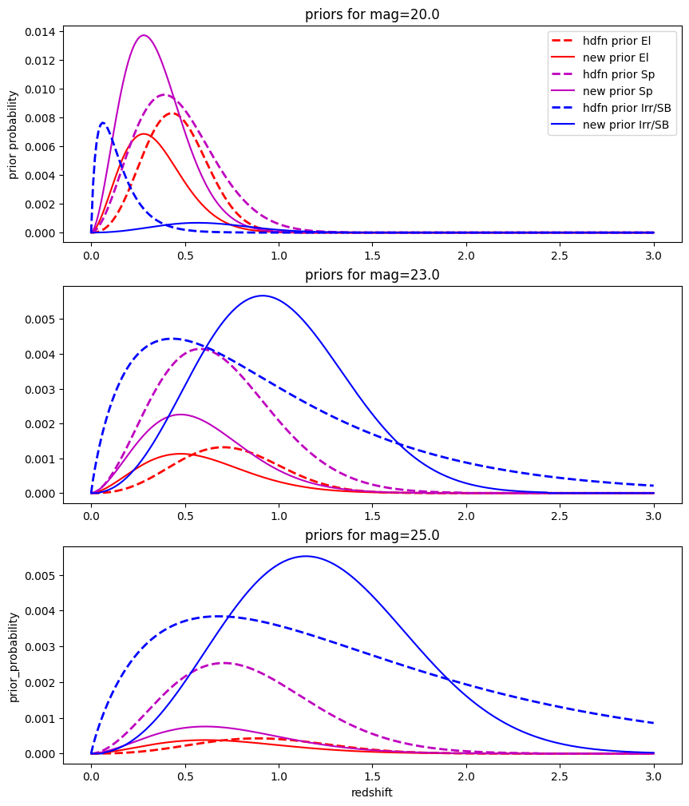
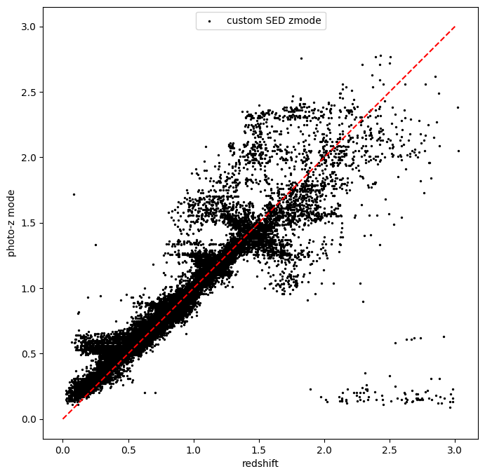

Running BPZliteEstimator with a custom set of SEDs
==================================================

**Authors:** Sam Schmidt

**Last Successfully Run:** Nov 14, 2023

This notebook will go through an example of running rail_bpz estimate
and inform stages with a custom set of SEDs.

**NOTE: the SEDs used in this example are SPECIFIC to DESC’s cosmoDC2_v1.1.4 data, they contain some non-physical features that would add systematics if run on any real data! DO NOT USE THESE TEMPLATES FOR ANY SCIENCE WITH REAL DATA!**
-------------------------------------------------------------------------------------------------------------------------------------------------------------------------------------------------------------------------------------------

A set of nine SED templates (the non-physical ones from the unfriendly
warning above) are included as a tarfile named
``nonphysical_dc2_templates.tar``, and are named like
``DC2_DONOTUSE_El1.sed``, ``DC2_DONOTUSE_Sp1.sed``, and
``DC2_DONOTUSE_Im1.sed``. Here, ``El`` is for “elliptical”, ``Sp`` is
for “spiral”, and ``Im`` is for “irregular”. This dummy set contains two
ellipticals, three spirals, and four irregular SED templates. These
templates are not the optimal templates, they are a subset of a larger
set that roughly spans the color/type range expected for DC2. The
tarball also contains a file containing a list of all nine names that is
needed by ``DESC_BPZ``, a file named ``baddc2templates.list`` (you may
be able to tell from the names that we really don’t want you to use
these SEDs anywhere outside of this demo). In order for rail_bpz to be
able to use these templates, we must move them to the directory where it
expects to find all of the SEDs. The default is to define this relative
to ``RAILDIR`` within RAIL, so let’s do that:

action needed before running the notebook:
------------------------------------------

To download the tarfile from NERSC, execute the cli ``get-data`` command
for bpz demo data:

.. code:: ipython3

    !rail get-data --bpz-demo-data

.. parsed-literal::

    Downloading BPZ demo data...
    (Note: you can run get-data without the bpz-demo-data flag to download standard data.)

The files must be untarred and moved, as well:

.. code:: ipython3

    from rail.utils.path_utils import RAILDIR
    import os
    custom_data_path = RAILDIR + '/rail/examples_data/estimation_data/data'
    sedpath = RAILDIR + '/rail/examples_data/estimation_data/data/SED'
    tarpath = RAILDIR + '/rail/examples_data/estimation_data/data/nonphysical_dc2_templates.tar'
    
    os.environ['tempbpzsedpath'] = sedpath
    os.environ['tempbpztarpath'] = tarpath
    !tar -xvf $tempbpztarpath
    !mv DC2_DONOTUSE*.sed $tempbpzsedpath
    !mv baddc2templates.list $tempbpzsedpath

.. parsed-literal::

    baddc2templates.list
    DC2_DONOTUSE_El1.sed
    DC2_DONOTUSE_El2.sed
    DC2_DONOTUSE_Im1.sed
    DC2_DONOTUSE_Im2.sed
    DC2_DONOTUSE_Im3.sed
    DC2_DONOTUSE_Im4.sed
    DC2_DONOTUSE_Sp1.sed
    DC2_DONOTUSE_Sp2.sed
    DC2_DONOTUSE_Sp3.sed

.. code:: ipython3

    !echo $tempbpzsedpath

.. parsed-literal::

    /opt/hostedtoolcache/Python/3.10.18/x64/lib/python3.10/site-packages/rail/examples_data/estimation_data/data/SED

This should have successfully copied the files to the proper SED
directory. Now, we can proceed in the same manner that we did in the
``BPZ_lite_demo.ipynb`` notebook:

.. code:: ipython3

    import os
    import qp
    import pickle
    import matplotlib.pyplot as plt
    import numpy as np
    import pandas as pd
    import desc_bpz
    from rail.core.data import TableHandle
    from rail.core.stage import RailStage
    from rail.estimation.algos.bpz_lite import BPZliteInformer, BPZliteEstimator

First, let’s set up a DataStore, for more info on the DataStore, see the
RAIL example notebooks:

.. code:: ipython3

    DS = RailStage.data_store
    DS.__class__.allow_overwrite = True

First, let’s grab the training and test data files that we will use in
this example, they are included with RAIL, so we can access their
location via the RAILDIR path. Both file contain data drawn from the
cosmoDC2_v1.1.4 truth extragalactic catalog generated by DESC with model
10-year-depth magnitude uncertainties. The training data contains
roughly 10,000 galaxies, while the test data contains roughly 20,000.
Both sets are representative down to a limiting apparent magnitude.

.. code:: ipython3

    trainFile = os.path.join(RAILDIR, 'rail/examples_data/testdata/test_dc2_training_9816.hdf5')
    testFile = os.path.join(RAILDIR, 'rail/examples_data/testdata/test_dc2_validation_9816.hdf5')
    training_data = DS.read_file("training_data", TableHandle, trainFile)
    test_data = DS.read_file("test_data", TableHandle, testFile)

BPZliteInformer: training a custom prior with our new SEDs
----------------------------------------------------------

We will run the inform stage just as we did in the main demo notebook;
however, we will have to define a few extra configuration parameters in
order to tell BPZliteInformer to use our new SEDs. We specify the SED
set using the ``spectra_file`` configuration parameter, which points to
an ascii file that contains the names of the SEDs, which must be sorted
in the same order as the “broad type array” (usually done in ascending
rest-frame “blueness”, that is Elliptical red galaxies first, then
increasingly blue galaxies). In this case, the tar file that we copied
to the SED directory contained this file, named
``baddc2templates.list``. As before, we need a “best fit type” for each
of the galaxies in our training set. And, as before, this has been
computed separately (computing best type within rail_bpz will be added
in the future). The best fit broad types are available in a dictionary
stored in the file ``test_dc2_train_customtemp_broadttypes.hdf5``, which
we will point to with the ``type_file`` config parameter. This file
should already exist in this directory. As stated above, we have two
Elliptical, three Spiral, and four Irregular/Starburst seds, so we’ll
set the ``nt_array`` configuration parameter to a list ``[2, 3, 4]`` to
specify those numbers of the three broad types.

.. code:: ipython3

    train_dict = dict(hdf5_groupname="photometry", model="test_9816_customsed_demo_prior.pkl",
                      spectra_file="baddc2templates.list",
                      type_file=os.path.join(RAILDIR, "rail/examples_data/estimation_data/data/test_dc2_train_customtemp_broadttypes.hdf5"),
                      prior_band="mag_i_lsst",
                      nt_array=[2,3,4], output_hdfn=False)
    run_bpz_train = BPZliteInformer.make_stage(name="bpz_custom_sed_prior", **train_dict)

.. code:: ipython3

    %%time
    run_bpz_train.inform(training_data)

.. parsed-literal::

    Inserting handle into data store.  input: None, bpz_custom_sed_prior
    using 10213 galaxies in calculation

.. parsed-literal::

    best values for fo and kt:
    [0.5538811  0.41290803]
    [0.42501231 0.0116699 ]
    minimizing for type 0
    best fit z0, alpha, km for type 0: [0.28089894 1.68880761 0.0655626 ]
    minimizing for type 1
    best fit z0, alpha, km for type 1: [0.34557593 1.73745454 0.06583076]
    minimizing for type 2
    best fit z0, alpha, km for type 2: [0.5679393  2.23510956 0.11549469]
    Inserting handle into data store.  model_bpz_custom_sed_prior: inprogress_test_9816_customsed_demo_prior.pkl, bpz_custom_sed_prior
    CPU times: user 9.59 s, sys: 3.71 ms, total: 9.6 s
    Wall time: 9.59 s

.. parsed-literal::

    <rail.core.data.ModelHandle at 0x7fefe85859c0>

So, we’ve created a new prior named
``test_9816_customsed_demo_prior.pkl`` which should have appeared in
this directory. We can visualize the prior using the ``prior_function``
function from DESC_BPZ to generate prior values for our broad types. We
can compare our new prior to that of the default HDFN prior that we ran
initially. The model files simply store a set of parameters in a
dictionary that ``prior_function`` uses to produce the prior values.

**NOTE:** if you want to learn the meaning of these parameters, you can
read the original BPZ paper, Benitez (2000) here:
https://ui.adsabs.harvard.edu/abs/2000ApJ…536..571B/abstract

.. code:: ipython3

    from desc_bpz.prior_from_dict import prior_function
    hdfnfile = os.path.join(RAILDIR, "rail/examples_data/estimation_data/data/CWW_HDFN_prior.pkl")
    with open(hdfnfile, "rb") as f:
        hdfnmodel = pickle.load(f)
    hdfnmodel

.. parsed-literal::

    {'fo_arr': array([0.35, 0.5 ]),
     'kt_arr': array([0.45 , 0.147]),
     'zo_arr': array([0.431 , 0.39  , 0.0626]),
     'km_arr': array([0.0913, 0.0636, 0.123 ]),
     'a_arr': array([2.465, 1.806, 0.906]),
     'mo': 20.0,
     'nt_array': [1, 2, 5]}

.. code:: ipython3

    with open("test_9816_customsed_demo_prior.pkl", "rb") as f:
        newmodel = pickle.load(f)
    newmodel

.. parsed-literal::

    {'fo_arr': array([0.5538811 , 0.41290803]),
     'kt_arr': array([0.42501231, 0.0116699 ]),
     'zo_arr': array([0.28089894, 0.34557593, 0.5679393 ]),
     'km_arr': array([0.0655626 , 0.06583076, 0.11549469]),
     'a_arr': array([1.68880761, 1.73745454, 2.23510956]),
     'mo': 20.0,
     'nt_array': [2, 3, 4]}

``prior_with_dict`` takes four arguments: a redshift grid, a magnitude
(it is an apparent magnitude-dependent prior), the modeldict, and the
number of templates in our SED set as arguments. Let’s generate priors
for mag=23, and then for mag=25:

.. code:: ipython3

    zgrid=np.linspace(0,3,301)
    defprior20 = prior_function(zgrid, 20., hdfnmodel, 8)
    defprior23 = prior_function(zgrid, 23., hdfnmodel, 8)
    defprior25 = prior_function(zgrid, 25., hdfnmodel, 8)

.. code:: ipython3

    newprior23 = prior_function(zgrid, 23., newmodel, 8)
    newprior25 = prior_function(zgrid, 25., newmodel, 8)
    newprior20 = prior_function(zgrid, 20., newmodel, 8)

We will plot the prior for the elliptical, one spiral, and one irregular
to compare. Note the BPZ divides up the probability in each broad type
equally amongst the N templates in that broad type, so we will multiply
by that number to get the total prior probability for the entire broad
type, in our case 1 Elliptical SED, 2 Spiral SEDs, and 5 Irr/SB SEDs:

.. code:: ipython3

    seddict = {'El': 0, 'Sp': 1, 'Irr/SB': 7}
    multiplier = [1.0, 2.0, 5.0]
    sedcol = ['r', 'm', 'b']
    fig, (axs, axs2, axs3) = plt.subplots(3, 1, figsize=(10,12))
    for sed, col, multi in zip(seddict, sedcol, multiplier):
        axs.plot(zgrid, defprior20[:,seddict[sed]]*multi, color=col, lw=2,ls='--', label=f"hdfn prior {sed}")
        axs.plot(zgrid, newprior20[:,seddict[sed]]*multi, color=col, ls='-', label=f"new prior {sed}")
        axs.set_title("priors for mag=20.0")
        axs2.plot(zgrid, defprior23[:,seddict[sed]]*multi, color=col, lw=2,ls='--', label=f"hdfn prior {sed}")
        axs2.plot(zgrid, newprior23[:,seddict[sed]]*multi, color=col, ls='-', label=f"new prior {sed}")
        axs2.set_title("priors for mag=23.0")
        axs3.plot(zgrid, defprior25[:,seddict[sed]]*multi, color=col, lw=2,ls='--', label=f"hdfn prior {sed}")
        axs3.plot(zgrid, newprior25[:,seddict[sed]]*multi, color=col, ls='-', label=f"new prior {sed}")
        axs3.set_xlabel("redshift")
        axs3.set_title("priors for mag=25.0")
        axs3.set_ylabel("prior_probability")
        axs.set_ylabel("prior probability")
    axs.legend(loc="upper right", fontsize=10)

.. parsed-literal::

    <matplotlib.legend.Legend at 0x7fefa42e26e0>

We see slightly more dramatic differences than we had with the same
“CWWSB” templates used in the main demo notebook, which is to be
expected, given the different SED shapes and numbers of SEDs of each
type: we’re defining a fairly different mapping into three “broad”
types, and so a direct comparison is hard to do.

Now, let’s re-run BPZliteEstimator using this new prior and see if our
results are any different:

.. code:: ipython3

    custom_dict = dict(hdf5_groupname="photometry",
                       spectra_file="baddc2templates.list",
                       output="bpz_results_customprior.hdf5", 
                       prior_band='mag_i_lsst',
                       data_path=custom_data_path,
                       no_prior=False)
    custom_run = BPZliteEstimator.make_stage(name="rerun_bpz", **custom_dict, 
                                     model=run_bpz_train.get_handle('model'))

Let’s compute the estimate, and note that if this is the first time that
you’ve run BPZ, you will see a bunch of lines print out as the code
creates “AB” files (the model flux files used by BPZ and stored for
later use) for the first time.

.. code:: ipython3

    %%time
    custom_run.estimate(test_data)

.. parsed-literal::

    Inserting handle into data store.  model: <class 'rail.core.data.ModelHandle'> test_9816_customsed_demo_prior.pkl, (wd), rerun_bpz
      Generating new AB file DC2_DONOTUSE_El1.DC2LSST_u.AB....
    DC2_DONOTUSE_El1 DC2LSST_u
    x_res[0] 3000.0
    x_res[-1] 11500.0

.. parsed-literal::

    Writing AB file  /opt/hostedtoolcache/Python/3.10.18/x64/lib/python3.10/site-packages/rail/examples_data/estimation_data/data/AB/DC2_DONOTUSE_El1.DC2LSST_u.AB
      Generating new AB file DC2_DONOTUSE_El1.DC2LSST_g.AB....
    DC2_DONOTUSE_El1 DC2LSST_g
    x_res[0] 3000.0
    x_res[-1] 11500.0

.. parsed-literal::

    Writing AB file  /opt/hostedtoolcache/Python/3.10.18/x64/lib/python3.10/site-packages/rail/examples_data/estimation_data/data/AB/DC2_DONOTUSE_El1.DC2LSST_g.AB
      Generating new AB file DC2_DONOTUSE_El1.DC2LSST_r.AB....
    DC2_DONOTUSE_El1 DC2LSST_r
    x_res[0] 3000.0
    x_res[-1] 11500.0

.. parsed-literal::

    Writing AB file  /opt/hostedtoolcache/Python/3.10.18/x64/lib/python3.10/site-packages/rail/examples_data/estimation_data/data/AB/DC2_DONOTUSE_El1.DC2LSST_r.AB
      Generating new AB file DC2_DONOTUSE_El1.DC2LSST_i.AB....
    DC2_DONOTUSE_El1 DC2LSST_i
    x_res[0] 3000.0
    x_res[-1] 11500.0

.. parsed-literal::

    Writing AB file  /opt/hostedtoolcache/Python/3.10.18/x64/lib/python3.10/site-packages/rail/examples_data/estimation_data/data/AB/DC2_DONOTUSE_El1.DC2LSST_i.AB
      Generating new AB file DC2_DONOTUSE_El1.DC2LSST_z.AB....
    DC2_DONOTUSE_El1 DC2LSST_z
    x_res[0] 3000.0
    x_res[-1] 11500.0

.. parsed-literal::

    Writing AB file  /opt/hostedtoolcache/Python/3.10.18/x64/lib/python3.10/site-packages/rail/examples_data/estimation_data/data/AB/DC2_DONOTUSE_El1.DC2LSST_z.AB
      Generating new AB file DC2_DONOTUSE_El1.DC2LSST_y.AB....
    DC2_DONOTUSE_El1 DC2LSST_y
    x_res[0] 3000.0
    x_res[-1] 11500.0

.. parsed-literal::

    Writing AB file  /opt/hostedtoolcache/Python/3.10.18/x64/lib/python3.10/site-packages/rail/examples_data/estimation_data/data/AB/DC2_DONOTUSE_El1.DC2LSST_y.AB
      Generating new AB file DC2_DONOTUSE_El2.DC2LSST_u.AB....
    DC2_DONOTUSE_El2 DC2LSST_u
    x_res[0] 3000.0
    x_res[-1] 11500.0

.. parsed-literal::

    Writing AB file  /opt/hostedtoolcache/Python/3.10.18/x64/lib/python3.10/site-packages/rail/examples_data/estimation_data/data/AB/DC2_DONOTUSE_El2.DC2LSST_u.AB
      Generating new AB file DC2_DONOTUSE_El2.DC2LSST_g.AB....
    DC2_DONOTUSE_El2 DC2LSST_g
    x_res[0] 3000.0
    x_res[-1] 11500.0

.. parsed-literal::

    Writing AB file  /opt/hostedtoolcache/Python/3.10.18/x64/lib/python3.10/site-packages/rail/examples_data/estimation_data/data/AB/DC2_DONOTUSE_El2.DC2LSST_g.AB
      Generating new AB file DC2_DONOTUSE_El2.DC2LSST_r.AB....
    DC2_DONOTUSE_El2 DC2LSST_r
    x_res[0] 3000.0
    x_res[-1] 11500.0

.. parsed-literal::

    Writing AB file  /opt/hostedtoolcache/Python/3.10.18/x64/lib/python3.10/site-packages/rail/examples_data/estimation_data/data/AB/DC2_DONOTUSE_El2.DC2LSST_r.AB
      Generating new AB file DC2_DONOTUSE_El2.DC2LSST_i.AB....
    DC2_DONOTUSE_El2 DC2LSST_i
    x_res[0] 3000.0
    x_res[-1] 11500.0

.. parsed-literal::

    Writing AB file  /opt/hostedtoolcache/Python/3.10.18/x64/lib/python3.10/site-packages/rail/examples_data/estimation_data/data/AB/DC2_DONOTUSE_El2.DC2LSST_i.AB
      Generating new AB file DC2_DONOTUSE_El2.DC2LSST_z.AB....
    DC2_DONOTUSE_El2 DC2LSST_z
    x_res[0] 3000.0
    x_res[-1] 11500.0

.. parsed-literal::

    Writing AB file  /opt/hostedtoolcache/Python/3.10.18/x64/lib/python3.10/site-packages/rail/examples_data/estimation_data/data/AB/DC2_DONOTUSE_El2.DC2LSST_z.AB
      Generating new AB file DC2_DONOTUSE_El2.DC2LSST_y.AB....
    DC2_DONOTUSE_El2 DC2LSST_y
    x_res[0] 3000.0
    x_res[-1] 11500.0

.. parsed-literal::

    Writing AB file  /opt/hostedtoolcache/Python/3.10.18/x64/lib/python3.10/site-packages/rail/examples_data/estimation_data/data/AB/DC2_DONOTUSE_El2.DC2LSST_y.AB
      Generating new AB file DC2_DONOTUSE_Sp1.DC2LSST_u.AB....
    DC2_DONOTUSE_Sp1 DC2LSST_u
    x_res[0] 3000.0
    x_res[-1] 11500.0

.. parsed-literal::

    Writing AB file  /opt/hostedtoolcache/Python/3.10.18/x64/lib/python3.10/site-packages/rail/examples_data/estimation_data/data/AB/DC2_DONOTUSE_Sp1.DC2LSST_u.AB
      Generating new AB file DC2_DONOTUSE_Sp1.DC2LSST_g.AB....
    DC2_DONOTUSE_Sp1 DC2LSST_g
    x_res[0] 3000.0
    x_res[-1] 11500.0

.. parsed-literal::

    Writing AB file  /opt/hostedtoolcache/Python/3.10.18/x64/lib/python3.10/site-packages/rail/examples_data/estimation_data/data/AB/DC2_DONOTUSE_Sp1.DC2LSST_g.AB
      Generating new AB file DC2_DONOTUSE_Sp1.DC2LSST_r.AB....
    DC2_DONOTUSE_Sp1 DC2LSST_r
    x_res[0] 3000.0
    x_res[-1] 11500.0

.. parsed-literal::

    Writing AB file  /opt/hostedtoolcache/Python/3.10.18/x64/lib/python3.10/site-packages/rail/examples_data/estimation_data/data/AB/DC2_DONOTUSE_Sp1.DC2LSST_r.AB
      Generating new AB file DC2_DONOTUSE_Sp1.DC2LSST_i.AB....
    DC2_DONOTUSE_Sp1 DC2LSST_i
    x_res[0] 3000.0
    x_res[-1] 11500.0

.. parsed-literal::

    Writing AB file  /opt/hostedtoolcache/Python/3.10.18/x64/lib/python3.10/site-packages/rail/examples_data/estimation_data/data/AB/DC2_DONOTUSE_Sp1.DC2LSST_i.AB
      Generating new AB file DC2_DONOTUSE_Sp1.DC2LSST_z.AB....
    DC2_DONOTUSE_Sp1 DC2LSST_z
    x_res[0] 3000.0
    x_res[-1] 11500.0

.. parsed-literal::

    Writing AB file  /opt/hostedtoolcache/Python/3.10.18/x64/lib/python3.10/site-packages/rail/examples_data/estimation_data/data/AB/DC2_DONOTUSE_Sp1.DC2LSST_z.AB
      Generating new AB file DC2_DONOTUSE_Sp1.DC2LSST_y.AB....
    DC2_DONOTUSE_Sp1 DC2LSST_y
    x_res[0] 3000.0
    x_res[-1] 11500.0

.. parsed-literal::

    Writing AB file  /opt/hostedtoolcache/Python/3.10.18/x64/lib/python3.10/site-packages/rail/examples_data/estimation_data/data/AB/DC2_DONOTUSE_Sp1.DC2LSST_y.AB
      Generating new AB file DC2_DONOTUSE_Sp2.DC2LSST_u.AB....
    DC2_DONOTUSE_Sp2 DC2LSST_u
    x_res[0] 3000.0
    x_res[-1] 11500.0

.. parsed-literal::

    Writing AB file  /opt/hostedtoolcache/Python/3.10.18/x64/lib/python3.10/site-packages/rail/examples_data/estimation_data/data/AB/DC2_DONOTUSE_Sp2.DC2LSST_u.AB
      Generating new AB file DC2_DONOTUSE_Sp2.DC2LSST_g.AB....
    DC2_DONOTUSE_Sp2 DC2LSST_g
    x_res[0] 3000.0
    x_res[-1] 11500.0

.. parsed-literal::

    Writing AB file  /opt/hostedtoolcache/Python/3.10.18/x64/lib/python3.10/site-packages/rail/examples_data/estimation_data/data/AB/DC2_DONOTUSE_Sp2.DC2LSST_g.AB
      Generating new AB file DC2_DONOTUSE_Sp2.DC2LSST_r.AB....
    DC2_DONOTUSE_Sp2 DC2LSST_r
    x_res[0] 3000.0
    x_res[-1] 11500.0

.. parsed-literal::

    Writing AB file  /opt/hostedtoolcache/Python/3.10.18/x64/lib/python3.10/site-packages/rail/examples_data/estimation_data/data/AB/DC2_DONOTUSE_Sp2.DC2LSST_r.AB
      Generating new AB file DC2_DONOTUSE_Sp2.DC2LSST_i.AB....
    DC2_DONOTUSE_Sp2 DC2LSST_i
    x_res[0] 3000.0
    x_res[-1] 11500.0

.. parsed-literal::

    Writing AB file  /opt/hostedtoolcache/Python/3.10.18/x64/lib/python3.10/site-packages/rail/examples_data/estimation_data/data/AB/DC2_DONOTUSE_Sp2.DC2LSST_i.AB
      Generating new AB file DC2_DONOTUSE_Sp2.DC2LSST_z.AB....
    DC2_DONOTUSE_Sp2 DC2LSST_z
    x_res[0] 3000.0
    x_res[-1] 11500.0

.. parsed-literal::

    Writing AB file  /opt/hostedtoolcache/Python/3.10.18/x64/lib/python3.10/site-packages/rail/examples_data/estimation_data/data/AB/DC2_DONOTUSE_Sp2.DC2LSST_z.AB
      Generating new AB file DC2_DONOTUSE_Sp2.DC2LSST_y.AB....
    DC2_DONOTUSE_Sp2 DC2LSST_y
    x_res[0] 3000.0
    x_res[-1] 11500.0

.. parsed-literal::

    Writing AB file  /opt/hostedtoolcache/Python/3.10.18/x64/lib/python3.10/site-packages/rail/examples_data/estimation_data/data/AB/DC2_DONOTUSE_Sp2.DC2LSST_y.AB
      Generating new AB file DC2_DONOTUSE_Sp3.DC2LSST_u.AB....
    DC2_DONOTUSE_Sp3 DC2LSST_u
    x_res[0] 3000.0
    x_res[-1] 11500.0

.. parsed-literal::

    Writing AB file  /opt/hostedtoolcache/Python/3.10.18/x64/lib/python3.10/site-packages/rail/examples_data/estimation_data/data/AB/DC2_DONOTUSE_Sp3.DC2LSST_u.AB
      Generating new AB file DC2_DONOTUSE_Sp3.DC2LSST_g.AB....
    DC2_DONOTUSE_Sp3 DC2LSST_g
    x_res[0] 3000.0
    x_res[-1] 11500.0

.. parsed-literal::

    Writing AB file  /opt/hostedtoolcache/Python/3.10.18/x64/lib/python3.10/site-packages/rail/examples_data/estimation_data/data/AB/DC2_DONOTUSE_Sp3.DC2LSST_g.AB
      Generating new AB file DC2_DONOTUSE_Sp3.DC2LSST_r.AB....
    DC2_DONOTUSE_Sp3 DC2LSST_r
    x_res[0] 3000.0
    x_res[-1] 11500.0

.. parsed-literal::

    Writing AB file  /opt/hostedtoolcache/Python/3.10.18/x64/lib/python3.10/site-packages/rail/examples_data/estimation_data/data/AB/DC2_DONOTUSE_Sp3.DC2LSST_r.AB
      Generating new AB file DC2_DONOTUSE_Sp3.DC2LSST_i.AB....
    DC2_DONOTUSE_Sp3 DC2LSST_i
    x_res[0] 3000.0
    x_res[-1] 11500.0

.. parsed-literal::

    Writing AB file  /opt/hostedtoolcache/Python/3.10.18/x64/lib/python3.10/site-packages/rail/examples_data/estimation_data/data/AB/DC2_DONOTUSE_Sp3.DC2LSST_i.AB
      Generating new AB file DC2_DONOTUSE_Sp3.DC2LSST_z.AB....
    DC2_DONOTUSE_Sp3 DC2LSST_z
    x_res[0] 3000.0
    x_res[-1] 11500.0

.. parsed-literal::

    Writing AB file  /opt/hostedtoolcache/Python/3.10.18/x64/lib/python3.10/site-packages/rail/examples_data/estimation_data/data/AB/DC2_DONOTUSE_Sp3.DC2LSST_z.AB
      Generating new AB file DC2_DONOTUSE_Sp3.DC2LSST_y.AB....
    DC2_DONOTUSE_Sp3 DC2LSST_y
    x_res[0] 3000.0
    x_res[-1] 11500.0

.. parsed-literal::

    Writing AB file  /opt/hostedtoolcache/Python/3.10.18/x64/lib/python3.10/site-packages/rail/examples_data/estimation_data/data/AB/DC2_DONOTUSE_Sp3.DC2LSST_y.AB
      Generating new AB file DC2_DONOTUSE_Im1.DC2LSST_u.AB....
    DC2_DONOTUSE_Im1 DC2LSST_u
    x_res[0] 3000.0
    x_res[-1] 11500.0

.. parsed-literal::

    Writing AB file  /opt/hostedtoolcache/Python/3.10.18/x64/lib/python3.10/site-packages/rail/examples_data/estimation_data/data/AB/DC2_DONOTUSE_Im1.DC2LSST_u.AB
      Generating new AB file DC2_DONOTUSE_Im1.DC2LSST_g.AB....
    DC2_DONOTUSE_Im1 DC2LSST_g
    x_res[0] 3000.0
    x_res[-1] 11500.0

.. parsed-literal::

    Writing AB file  /opt/hostedtoolcache/Python/3.10.18/x64/lib/python3.10/site-packages/rail/examples_data/estimation_data/data/AB/DC2_DONOTUSE_Im1.DC2LSST_g.AB
      Generating new AB file DC2_DONOTUSE_Im1.DC2LSST_r.AB....
    DC2_DONOTUSE_Im1 DC2LSST_r
    x_res[0] 3000.0
    x_res[-1] 11500.0

.. parsed-literal::

    Writing AB file  /opt/hostedtoolcache/Python/3.10.18/x64/lib/python3.10/site-packages/rail/examples_data/estimation_data/data/AB/DC2_DONOTUSE_Im1.DC2LSST_r.AB
      Generating new AB file DC2_DONOTUSE_Im1.DC2LSST_i.AB....
    DC2_DONOTUSE_Im1 DC2LSST_i
    x_res[0] 3000.0
    x_res[-1] 11500.0

.. parsed-literal::

    Writing AB file  /opt/hostedtoolcache/Python/3.10.18/x64/lib/python3.10/site-packages/rail/examples_data/estimation_data/data/AB/DC2_DONOTUSE_Im1.DC2LSST_i.AB
      Generating new AB file DC2_DONOTUSE_Im1.DC2LSST_z.AB....
    DC2_DONOTUSE_Im1 DC2LSST_z
    x_res[0] 3000.0
    x_res[-1] 11500.0

.. parsed-literal::

    Writing AB file  /opt/hostedtoolcache/Python/3.10.18/x64/lib/python3.10/site-packages/rail/examples_data/estimation_data/data/AB/DC2_DONOTUSE_Im1.DC2LSST_z.AB
      Generating new AB file DC2_DONOTUSE_Im1.DC2LSST_y.AB....
    DC2_DONOTUSE_Im1 DC2LSST_y
    x_res[0] 3000.0
    x_res[-1] 11500.0

.. parsed-literal::

    Writing AB file  /opt/hostedtoolcache/Python/3.10.18/x64/lib/python3.10/site-packages/rail/examples_data/estimation_data/data/AB/DC2_DONOTUSE_Im1.DC2LSST_y.AB
      Generating new AB file DC2_DONOTUSE_Im2.DC2LSST_u.AB....
    DC2_DONOTUSE_Im2 DC2LSST_u
    x_res[0] 3000.0
    x_res[-1] 11500.0

.. parsed-literal::

    Writing AB file  /opt/hostedtoolcache/Python/3.10.18/x64/lib/python3.10/site-packages/rail/examples_data/estimation_data/data/AB/DC2_DONOTUSE_Im2.DC2LSST_u.AB
      Generating new AB file DC2_DONOTUSE_Im2.DC2LSST_g.AB....
    DC2_DONOTUSE_Im2 DC2LSST_g
    x_res[0] 3000.0
    x_res[-1] 11500.0

.. parsed-literal::

    Writing AB file  /opt/hostedtoolcache/Python/3.10.18/x64/lib/python3.10/site-packages/rail/examples_data/estimation_data/data/AB/DC2_DONOTUSE_Im2.DC2LSST_g.AB
      Generating new AB file DC2_DONOTUSE_Im2.DC2LSST_r.AB....
    DC2_DONOTUSE_Im2 DC2LSST_r
    x_res[0] 3000.0
    x_res[-1] 11500.0

.. parsed-literal::

    Writing AB file  /opt/hostedtoolcache/Python/3.10.18/x64/lib/python3.10/site-packages/rail/examples_data/estimation_data/data/AB/DC2_DONOTUSE_Im2.DC2LSST_r.AB
      Generating new AB file DC2_DONOTUSE_Im2.DC2LSST_i.AB....
    DC2_DONOTUSE_Im2 DC2LSST_i
    x_res[0] 3000.0
    x_res[-1] 11500.0

.. parsed-literal::

    Writing AB file  /opt/hostedtoolcache/Python/3.10.18/x64/lib/python3.10/site-packages/rail/examples_data/estimation_data/data/AB/DC2_DONOTUSE_Im2.DC2LSST_i.AB
      Generating new AB file DC2_DONOTUSE_Im2.DC2LSST_z.AB....
    DC2_DONOTUSE_Im2 DC2LSST_z
    x_res[0] 3000.0
    x_res[-1] 11500.0

.. parsed-literal::

    Writing AB file  /opt/hostedtoolcache/Python/3.10.18/x64/lib/python3.10/site-packages/rail/examples_data/estimation_data/data/AB/DC2_DONOTUSE_Im2.DC2LSST_z.AB
      Generating new AB file DC2_DONOTUSE_Im2.DC2LSST_y.AB....
    DC2_DONOTUSE_Im2 DC2LSST_y
    x_res[0] 3000.0
    x_res[-1] 11500.0

.. parsed-literal::

    Writing AB file  /opt/hostedtoolcache/Python/3.10.18/x64/lib/python3.10/site-packages/rail/examples_data/estimation_data/data/AB/DC2_DONOTUSE_Im2.DC2LSST_y.AB
      Generating new AB file DC2_DONOTUSE_Im3.DC2LSST_u.AB....
    DC2_DONOTUSE_Im3 DC2LSST_u
    x_res[0] 3000.0
    x_res[-1] 11500.0

.. parsed-literal::

    Writing AB file  /opt/hostedtoolcache/Python/3.10.18/x64/lib/python3.10/site-packages/rail/examples_data/estimation_data/data/AB/DC2_DONOTUSE_Im3.DC2LSST_u.AB
      Generating new AB file DC2_DONOTUSE_Im3.DC2LSST_g.AB....
    DC2_DONOTUSE_Im3 DC2LSST_g
    x_res[0] 3000.0
    x_res[-1] 11500.0

.. parsed-literal::

    Writing AB file  /opt/hostedtoolcache/Python/3.10.18/x64/lib/python3.10/site-packages/rail/examples_data/estimation_data/data/AB/DC2_DONOTUSE_Im3.DC2LSST_g.AB
      Generating new AB file DC2_DONOTUSE_Im3.DC2LSST_r.AB....
    DC2_DONOTUSE_Im3 DC2LSST_r
    x_res[0] 3000.0
    x_res[-1] 11500.0

.. parsed-literal::

    Writing AB file  /opt/hostedtoolcache/Python/3.10.18/x64/lib/python3.10/site-packages/rail/examples_data/estimation_data/data/AB/DC2_DONOTUSE_Im3.DC2LSST_r.AB
      Generating new AB file DC2_DONOTUSE_Im3.DC2LSST_i.AB....
    DC2_DONOTUSE_Im3 DC2LSST_i
    x_res[0] 3000.0
    x_res[-1] 11500.0

.. parsed-literal::

    Writing AB file  /opt/hostedtoolcache/Python/3.10.18/x64/lib/python3.10/site-packages/rail/examples_data/estimation_data/data/AB/DC2_DONOTUSE_Im3.DC2LSST_i.AB
      Generating new AB file DC2_DONOTUSE_Im3.DC2LSST_z.AB....
    DC2_DONOTUSE_Im3 DC2LSST_z
    x_res[0] 3000.0
    x_res[-1] 11500.0

.. parsed-literal::

    Writing AB file  /opt/hostedtoolcache/Python/3.10.18/x64/lib/python3.10/site-packages/rail/examples_data/estimation_data/data/AB/DC2_DONOTUSE_Im3.DC2LSST_z.AB
      Generating new AB file DC2_DONOTUSE_Im3.DC2LSST_y.AB....
    DC2_DONOTUSE_Im3 DC2LSST_y
    x_res[0] 3000.0
    x_res[-1] 11500.0

.. parsed-literal::

    Writing AB file  /opt/hostedtoolcache/Python/3.10.18/x64/lib/python3.10/site-packages/rail/examples_data/estimation_data/data/AB/DC2_DONOTUSE_Im3.DC2LSST_y.AB
      Generating new AB file DC2_DONOTUSE_Im4.DC2LSST_u.AB....
    DC2_DONOTUSE_Im4 DC2LSST_u
    x_res[0] 3000.0
    x_res[-1] 11500.0

.. parsed-literal::

    Writing AB file  /opt/hostedtoolcache/Python/3.10.18/x64/lib/python3.10/site-packages/rail/examples_data/estimation_data/data/AB/DC2_DONOTUSE_Im4.DC2LSST_u.AB
      Generating new AB file DC2_DONOTUSE_Im4.DC2LSST_g.AB....
    DC2_DONOTUSE_Im4 DC2LSST_g
    x_res[0] 3000.0
    x_res[-1] 11500.0

.. parsed-literal::

    Writing AB file  /opt/hostedtoolcache/Python/3.10.18/x64/lib/python3.10/site-packages/rail/examples_data/estimation_data/data/AB/DC2_DONOTUSE_Im4.DC2LSST_g.AB
      Generating new AB file DC2_DONOTUSE_Im4.DC2LSST_r.AB....
    DC2_DONOTUSE_Im4 DC2LSST_r
    x_res[0] 3000.0
    x_res[-1] 11500.0

.. parsed-literal::

    Writing AB file  /opt/hostedtoolcache/Python/3.10.18/x64/lib/python3.10/site-packages/rail/examples_data/estimation_data/data/AB/DC2_DONOTUSE_Im4.DC2LSST_r.AB
      Generating new AB file DC2_DONOTUSE_Im4.DC2LSST_i.AB....
    DC2_DONOTUSE_Im4 DC2LSST_i
    x_res[0] 3000.0
    x_res[-1] 11500.0

.. parsed-literal::

    Writing AB file  /opt/hostedtoolcache/Python/3.10.18/x64/lib/python3.10/site-packages/rail/examples_data/estimation_data/data/AB/DC2_DONOTUSE_Im4.DC2LSST_i.AB
      Generating new AB file DC2_DONOTUSE_Im4.DC2LSST_z.AB....
    DC2_DONOTUSE_Im4 DC2LSST_z
    x_res[0] 3000.0
    x_res[-1] 11500.0

.. parsed-literal::

    Writing AB file  /opt/hostedtoolcache/Python/3.10.18/x64/lib/python3.10/site-packages/rail/examples_data/estimation_data/data/AB/DC2_DONOTUSE_Im4.DC2LSST_z.AB
      Generating new AB file DC2_DONOTUSE_Im4.DC2LSST_y.AB....
    DC2_DONOTUSE_Im4 DC2LSST_y
    x_res[0] 3000.0
    x_res[-1] 11500.0

.. parsed-literal::

    Writing AB file  /opt/hostedtoolcache/Python/3.10.18/x64/lib/python3.10/site-packages/rail/examples_data/estimation_data/data/AB/DC2_DONOTUSE_Im4.DC2LSST_y.AB
    Process 0 running estimator on chunk 0 - 10,000

.. parsed-literal::

    /opt/hostedtoolcache/Python/3.10.18/x64/lib/python3.10/site-packages/rail/estimation/algos/bpz_lite.py:485: RuntimeWarning: overflow encountered in cast
      flux_err[unobserved] = 1e108

.. parsed-literal::

    Inserting handle into data store.  output_rerun_bpz: inprogress_bpz_results_customprior.hdf5, rerun_bpz
    Process 0 running estimator on chunk 10,000 - 20,000

.. parsed-literal::

    Process 0 running estimator on chunk 20,000 - 20,449

.. parsed-literal::

    CPU times: user 25.9 s, sys: 171 ms, total: 26 s
    Wall time: 26 s

.. parsed-literal::

    <rail.core.data.QPHandle at 0x7fefa3b93040>

.. code:: ipython3

    custom_res = qp.read("bpz_results_customprior.hdf5")

.. code:: ipython3

    sz = test_data()['photometry']['redshift']

And let’s plot the modes fore this new run as well as our run with the
default prior:

.. code:: ipython3

    plt.figure(figsize=(8,8))
    plt.scatter(sz, custom_res.ancil['zmode'].flatten(), s=2, c='k', label='custom SED zmode')
    plt.plot([0,3], [0,3], 'r--')
    plt.xlabel("redshift")
    plt.ylabel("photo-z mode")
    plt.legend(loc='upper center', fontsize=10)

.. parsed-literal::

    <matplotlib.legend.Legend at 0x7fefa4161570>

Things look pretty dramatically different than they did with our CWW/SB
templates, we see reduced scatter, less bias overall, and very different
outlier population, with almost no galaxies now residing in the
upper-left of the plot, fewer in the lower-right, but a new population
just above the zmode=zspec line at higher redshifts.

As mentioned above, there are some quirks to the SEDs that make up the
cosmoDC2 simulation that are slightly different from the galaxies in the
local Universe, which are a better match to the CWW/SB templates (which
themselves are mostly derived from empirical local galaxy SEDs). As our
new “custom” SEDs better reflect the galaxies of cosmoDC2, it’s not
surprising that we see improved photo-z performance. Let’s compute a few
point-estimate metrics to compare to those calculated in the main demo
notebook with the CWW/SB templates.

Point estimate metrics
----------------------

Let’s see if our point estimate metrics have improved at all given the
tuned prior. These metrics take in arrays of the point estimates (we’ll
use the mode) and the true redshifts.

.. code:: ipython3

    from rail.evaluation.metrics.pointestimates import PointSigmaIQR, PointBias, PointOutlierRate, PointSigmaMAD

.. code:: ipython3

    custom_sigma_eval = PointSigmaIQR(custom_res.ancil['zmode'].flatten(), sz)

.. code:: ipython3

    custom_sigma = custom_sigma_eval.evaluate()

.. code:: ipython3

    print("custom SED sigma: %.4f" % (custom_sigma))

.. parsed-literal::

    custom SED sigma: 0.0490

.. code:: ipython3

    custom_bias_eval = PointBias(custom_res.ancil['zmode'].flatten(), sz)

.. code:: ipython3

    custom_bias = custom_bias_eval.evaluate()
    print("custom SED bias: %.4f" % (custom_bias))

.. parsed-literal::

    custom SED bias: 0.0068

Indeed, we see an improvement in the sigma from 0.057-0.059 with the
CWW/SB templates to 0.0438 with our new templates and custom prior, and
a much smaller bias of 0.0082 compared to -0.026 in the CWW/SB case (run
the other notebook to see these numbers)!

.. code:: ipython3

    custom_outlier_eval = PointOutlierRate(custom_res.ancil['zmode'].flatten(), sz)

.. code:: ipython3

    custom_outlier = custom_outlier_eval.evaluate()
    print("custom SED outlier rate: %.4f" % (custom_outlier))

.. parsed-literal::

    custom SED outlier rate: 0.0915

We see a higher outlier rate here; however, our ourlier rate is defined
in terms of those galaxies outside of three sigma, as defined by
PointSigmaIQR, and with a smaller sigma the number of outliers is not
really as easy to directly compare. As in the main demo notebook, let’s
compute the fraction of galaxies with (zmode - specz) / (1 + specz) >
0.15:

.. code:: ipython3

    from rail.evaluation.metrics.pointestimates import PointStatsEz
    custom_ez_eval = PointStatsEz(custom_res.ancil['zmode'].flatten(), sz)
    custom_ez = custom_ez_eval.evaluate()
    custom_outlier_frac = (np.sum((np.abs(custom_ez) > 0.15))) / len(sz)
    print("fraction of catastrophic outliers: %.4f" % custom_outlier_frac)

.. parsed-literal::

    fraction of catastrophic outliers: 0.0894

So, our catastrophic outlier fraction remains similar but slightly
higher than in the CWW/SB template case, even if the distribution and
character of those outliers is now dramatically different.

Finally, we’ll plot an example PDF. Given that we are now comparing to a
completely different set of SEDs with different predicted fluxes, we can
expect different chi^2 values, and thus a complately different
likelihood or posterior shape:

.. code:: ipython3

    whichone = 109
    fig, axs = plt.subplots(1,1, figsize=(10,6))
    custom_res.plot_native(key=whichone, axes=axs, label="custom SED")
    axs.set_xlabel("redshift")
    axs.set_ylabel("PDF")
    axs.legend(loc="upper center", fontsize=10)

.. parsed-literal::

    <matplotlib.legend.Legend at 0x7fefa409b280>

Yes, in our one example PDF, number 109, we see almost no peak at high
redshift, but rather a new peak at z~0.6, again demonstrating just how
large of an impact the SED template set used has on photo-z results.
