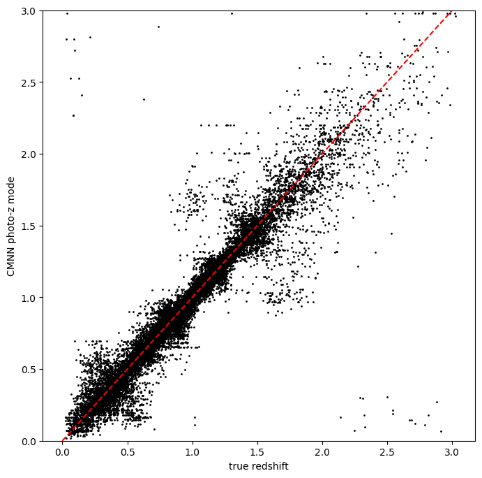
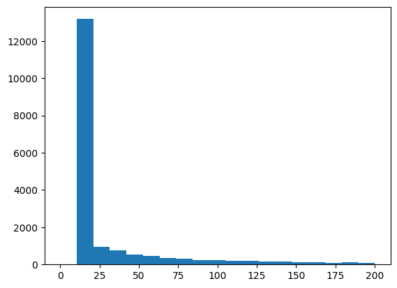
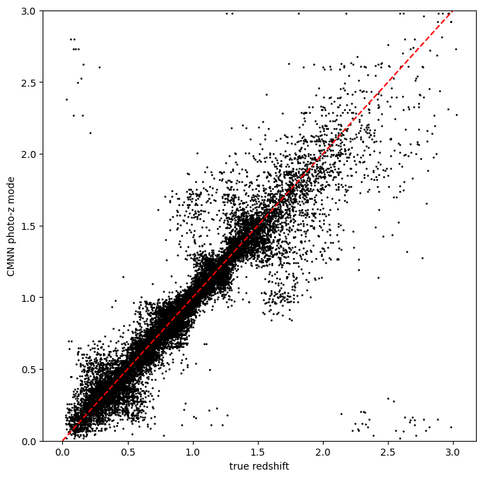
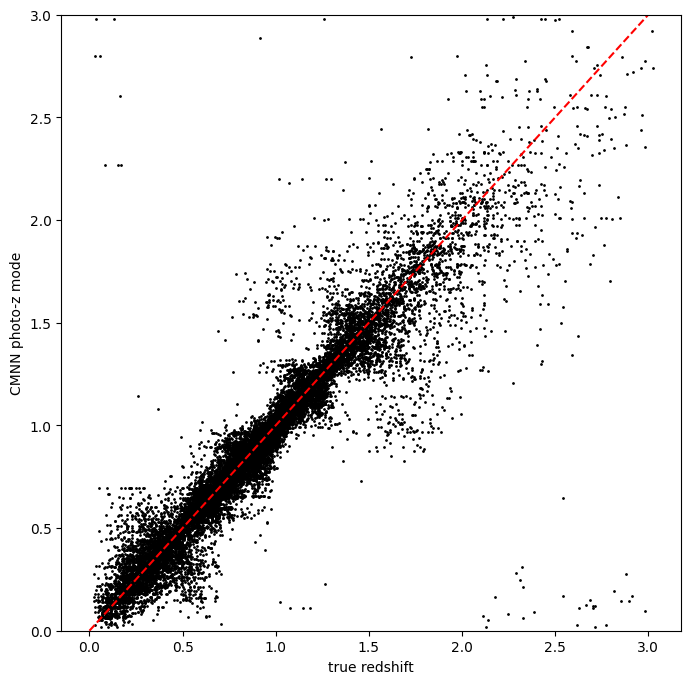
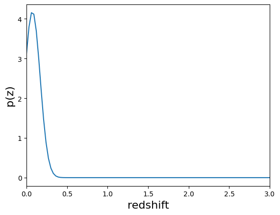
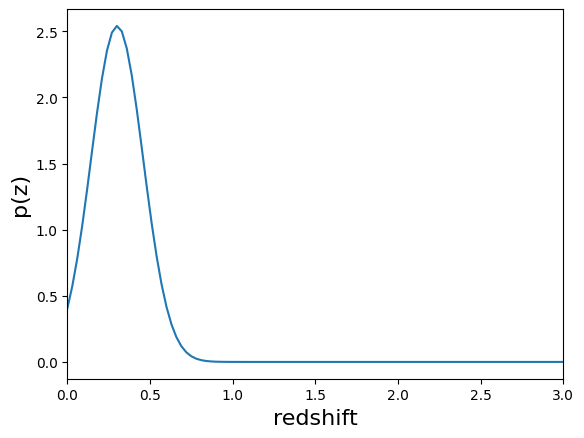
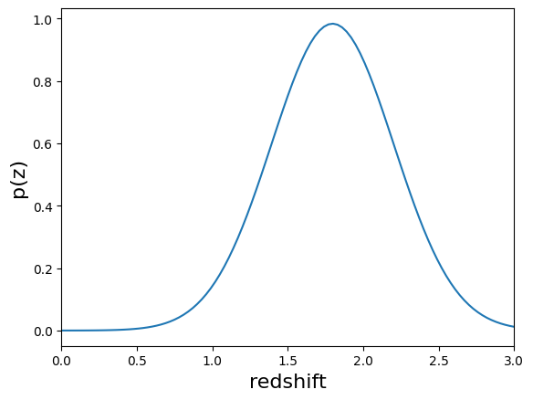

RAIL CMNN Tutorial Notebook
===========================

**Author:** Sam Schmidt

**Last Successfully Run:** September 26, 2023

This is a notebook demonstrating some of the features of the LSSTDESC
``RAIL`` version of the CMNN estimator, see `Graham et
al. (2018) <https://ui.adsabs.harvard.edu/abs/2018AJ....155....1G/abstract>`__
for more details on the algorithm.

CMNN stands for color-matched nearest-neighbor, and as this name
implies, the method works by finding the Mahalanobis distance between
each test galaxy and the training galaxies, and selecting one of those
“nearby” in color space as the redshift estimate. The algorithm also
estimates the “width” of the resulting PDF based on the standard
deviation of this nearby set and returns a single Gaussian with a mean
and width defined as such.

The current version of the code consists of a training stage,
``CMNNInformer``, that computes colors for a set of training data and an
estimation stage ``CMNNEstimator`` that calculates the Mahalanobis
distance to each training galaxy for each test galaxy and returns a
single Guassian PDF for each galaxy. The mean value of this Gaussian PDF
can be estimated in one of three ways (see selection mode below), and
the width is determined by the standard deviation of training galaxy
redshifts within the threshold Mahalanobis distance. Future
implementation improvements may change the output format to include
multiple Gaussians.

For the color calculation, there is an option for how to treat the
“non-detections” in a band: the default choice is to ignore any colors
that contain a non-detect magnitude and adjust the number of degrees of
freedom in the Mahalanobis distance accordingly (this is how the CMNN
algorithm was originally implemented). Or, if the configuration
parameter ``nondetect_replace`` is set to ``True`` in ``CMNNInformer``,
the non-detected magnitudes will be replaced with the 1-sigma limiting
magnitude in each band as supplied by the user via the ``mag_limits``
configuration parameter (or by the default 1-sigma limits if the user
does not supply specific numbers). We have not done any exploration of
the relative performance of these two choices, but note that there is
not a significant performance difference in terms of runtime between the
two methods.

In addition to the Gaussian PDF for each test galaxy, two ancillary
quantities are stored: ``zmode``: the mode of the redshift PDF and
``Ncm``, the integer number of “nearby” galaxies considered as neighbors
for each galaxy.

``CMNNInformer`` takes in a training data set and returns a model file
that simply consists of the computed colors and color errors (magnitude
errors added in quadrature) for that dataset, the model to be used in
the ``CMNNEstimator`` stage. A modification of the original CMNN
algorithm, “nondetections” are now replaced by the 1-sigma limiting
magnitudes and the non-detect magnitude errors replaced with a value of
1.0. The config parameters that can be set by the user for
``CMNNInformer`` are:

-  bands: list of the band names that should be present in the input
   data.
-  err_bands: list of the magnitude error column names that should be
   present in the input data.
-  redshift_col: a string giving the name for the redshift column
   present in the input data.
-  mag_limits: a dictionary with keys that match those in bands and a
   float with the 1 sigma limiting magnitude for each band.
-  nondetect_val: float or np.nan, the value indicating a non-detection,
   which will be replaced by the values in mag_limits.
-  nondetect_replace: bool, if set to ``False`` (the default) this
   option ignores colors with non-detected values in the Mahalanobis
   distance calculation, with a corresponding drop in the degrees of
   freedom value. If set to ``True``, the method will replace
   non-detections with the 1-sigma limiting magnitudes specified via
   ``mag_limits`` (or default 1-sigma limits if not supplied), and will
   use all colors in the Mahalanobis distance calculation.

The parameters that can be set via the config_params in
``CMNNEstimator`` are described in brief below:

-  bands, err_bands, redshift_col, mag_limits are all the same as
   described above for CMNNInformer.
-  ppf_value: float, usually 0.68 or 0.95, which sets the value of the
   PPF used in the Mahalanobis distance calculation.
-  selection_mode: int, selects how the central value of the Gaussian
   PDF is calculated in the algorithm, if set to **0** randomly chooses
   from set within the Mahalanobis distance, if set to **1** chooses the
   nearest neighbor point, if set to **2** adds a distance weight to the
   random choice.
-  min_n: int, the minimum number of training galaxies to use.
-  min_thresh: float, the minimum threshold cutoff. Values smaller than
   this threshold value will be ignored.
-  min_dist: float, the minimum Mahalanobis distance. Values smaller
   than this will be ignored.
-  bad_redshift_val: float, in the unlikely case that there are not
   enough training galaxies, this central redshift will be assigned to
   galaxies.
-  bad_redshift_err: float, in the unlikely case that there are not
   enough training galaxies, this Gaussian width will be assigned to
   galaxies.

Let’s grab some example data, train the model by running the
``CMNNInformer`` ``inform`` method, then calculate a set of photo-z’s
using ``CMNNEstimator`` ``estimate``. Much of the following is copied
from the ``RAIL_estiation_demo.ipynb`` in the RAIL repo, so look at that
notebook for general questions on setting up the RAIL infrastructure for
estimators.

.. code:: ipython3

    import os
    import matplotlib.pyplot as plt
    import numpy as np
    %matplotlib inline 

.. code:: ipython3

    import rail
    import qp
    from rail.core.data import TableHandle
    from rail.core.stage import RailStage

.. code:: ipython3

    DS = RailStage.data_store
    DS.__class__.allow_overwrite = True

Getting the list of available Estimators
~~~~~~~~~~~~~~~~~~~~~~~~~~~~~~~~~~~~~~~~

RailStage knows about all of the sub-types of stages. The are stored in
the ``RailStage.pipeline_stages`` dict. By looping through the values in
that dict we can and asking if each one is a sub-class of
``rail.estimation.estimator.CatEstimator`` we can identify the available
estimators that operator on catalog-like inputs.

The code-specific parameters
----------------------------

As mentioned above, CMNN has particular configuration options that can
be set when setting up an instance of our ``CMNNInformer`` stage, we’ll
define those in a dictionary. Any parameters not specifically assigned
will take on default values.

.. code:: ipython3

    cmnn_dict = dict(zmin=0.0, zmax=3.0, nzbins=301, hdf5_groupname='photometry')

We will begin by training the algorithm, to to this we instantiate a
rail object with a call to the base class.

.. code:: ipython3

    from rail.estimation.algos.cmnn import CMNNInformer, CMNNEstimator
    pz_train = CMNNInformer.make_stage(name='inform_CMNN', model='demo_cmnn_model.pkl', **cmnn_dict)

Now, let’s load our training data, which is stored in hdf5 format. We’ll
load it into the Data Store so that the ceci stages are able to access
it.

.. code:: ipython3

    from rail.utils.path_utils import RAILDIR
    trainFile = os.path.join(RAILDIR, 'rail/examples_data/testdata/test_dc2_training_9816.hdf5')
    testFile = os.path.join(RAILDIR, 'rail/examples_data/testdata/test_dc2_validation_9816.hdf5')
    training_data = DS.read_file("training_data", TableHandle, trainFile)
    test_data = DS.read_file("test_data", TableHandle, testFile)

The inform stage for CMNN should not take long to run, it essentially
just converts the magnitudes to colors for the training data and stores
those as a model dictionary which is stored in a pickle file specfied by
the ``model`` keyword above, in this case “demo_cmnn_model.pkl”. This
file should appear in the directory after we run the inform stage in the
cell below:

.. code:: ipython3

    %%time
    pz_train.inform(training_data)

.. parsed-literal::

    Inserting handle into data store.  input: None, inform_CMNN
    Inserting handle into data store.  model_inform_CMNN: inprogress_demo_cmnn_model.pkl, inform_CMNN
    CPU times: user 2.18 ms, sys: 13 μs, total: 2.19 ms
    Wall time: 2.03 ms

.. parsed-literal::

    <rail.core.data.ModelHandle at 0x7f82a464b910>

We can now set up the main photo-z stage and run our algorithm on the
data to produce simple photo-z estimates. Note that we are loading the
trained model that we computed from the inform stage: with the
``model=pz_train.get_handle('model')`` statement. We will set
``nondetect_replace`` to ``True`` to replace our non-detection
magnitudes with their 1-sigma limits and use all colors.

Let’s also set the minumum number of neighbors to 24, and the
``selection_mode`` to “1”, which will choose the nearest neighbor for
each galaxy as the redshift estimate:

.. code:: ipython3

    %%time
    pz = CMNNEstimator.make_stage(name='CMNN', hdf5_groupname='photometry',
                            model=pz_train.get_handle('model'),
                            min_n=20,
                            selection_mode=1,
                            nondetect_replace=True,
                            aliases={"output":"pz_near"})
    results = pz.estimate(test_data)

.. parsed-literal::

    Inserting handle into data store.  model: <class 'rail.core.data.ModelHandle'> demo_cmnn_model.pkl, (wd), CMNN
    Process 0 running estimator on chunk 0 - 10,000
    Process 0 estimating PZ PDF for rows 0 - 10,000

.. parsed-literal::

    Inserting handle into data store.  output_CMNN: inprogress_output_CMNN.hdf5, CMNN
    Process 0 running estimator on chunk 10,000 - 20,000
    Process 0 estimating PZ PDF for rows 10,000 - 20,000

.. parsed-literal::

    Process 0 running estimator on chunk 20,000 - 20,449
    Process 0 estimating PZ PDF for rows 20,000 - 20,449

.. parsed-literal::

    CPU times: user 47.5 s, sys: 11.8 ms, total: 47.5 s
    Wall time: 47.5 s

As mentioned above, in addition to the PDF, ``estimate`` calculates and
stores both the mode of the PDF (``zmode``), and the number of neighbors
(``Ncm``) for each galaxy, which can be accessed from the ancillary
data. We will plot the modes vs the true redshift to see how well CMNN
did in estimating redshifts:

.. code:: ipython3

    zmode = results().ancil['zmode']

Let’s plot the redshift mode against the true redshifts to see how they
look:

.. code:: ipython3

    plt.figure(figsize=(8,8))
    plt.scatter(test_data()['photometry']['redshift'],zmode,s=1,c='k',label='simple NN mode')
    plt.plot([0,3],[0,3],'r--');
    plt.xlabel("true redshift")
    plt.ylabel("CMNN photo-z mode")
    plt.ylim(0,3)

.. parsed-literal::

    (0.0, 3.0)

Very nice! Not many outliers and a fairly small scatter without much
biase!

Now, let’s plot the histogram of how many neighbors were used. We set a
minimum number of 20, so we should see a large peak at that value:

.. code:: ipython3

    ncm =results().ancil['Ncm']
    plt.hist(ncm, bins=np.linspace(0,200,20));

As mentioned previously, we can change the method for how we select the
mean redshift, let’s re-run the estimator but use ``selection_mode`` =
“0”, which will select a random galaxy from amongst the neighbors. This
should still look decent, but perhaps not as nice as the nearest
neighbor estimator:

.. code:: ipython3

    pz_rand = CMNNEstimator.make_stage(name='CMNN_rand', hdf5_groupname='photometry',
                                 model=pz_train.get_handle('model'),
                                 min_n=20,
                                 selection_mode=0,
                                 nondetect_replace=True,
                                 aliaes={"output": "pz_rand"})
    results_rand = pz_rand.estimate(test_data)

.. parsed-literal::

    Process 0 running estimator on chunk 0 - 10,000
    Process 0 estimating PZ PDF for rows 0 - 10,000

.. parsed-literal::

    Inserting handle into data store.  output_CMNN_rand: inprogress_output_CMNN_rand.hdf5, CMNN_rand
    Process 0 running estimator on chunk 10,000 - 20,000
    Process 0 estimating PZ PDF for rows 10,000 - 20,000

.. parsed-literal::

    Process 0 running estimator on chunk 20,000 - 20,449
    Process 0 estimating PZ PDF for rows 20,000 - 20,449

.. code:: ipython3

    zmode_rand = results_rand().ancil['zmode']
    plt.figure(figsize=(8,8))
    plt.scatter(test_data()['photometry']['redshift'],zmode_rand,s=1,c='k',label='simple NN mode')
    plt.plot([0,3],[0,3],'r--');
    plt.xlabel("true redshift")
    plt.ylabel("CMNN photo-z mode")
    plt.ylim(0,3)

.. parsed-literal::

    (0.0, 3.0)

Slightly worse, but not dramatically so, a few more outliers are visible
visually. Finally, we can try the weighted random selection by setting
``selection_mode`` to “2”:

.. code:: ipython3

    pz_weight = CMNNEstimator.make_stage(name='CMNN_weight', hdf5_groupname='photometry',
                                   model=pz_train.get_handle('model'),
                                   min_n=20,
                                   selection_mode=2,
                                   nondetect_replace=True,
                                   aliaes={"output": "pz_weight"})
    results_weight = pz_weight.estimate(test_data)

.. parsed-literal::

    Process 0 running estimator on chunk 0 - 10,000
    Process 0 estimating PZ PDF for rows 0 - 10,000

.. parsed-literal::

    Inserting handle into data store.  output_CMNN_weight: inprogress_output_CMNN_weight.hdf5, CMNN_weight
    Process 0 running estimator on chunk 10,000 - 20,000
    Process 0 estimating PZ PDF for rows 10,000 - 20,000

.. parsed-literal::

    Process 0 running estimator on chunk 20,000 - 20,449
    Process 0 estimating PZ PDF for rows 20,000 - 20,449

.. code:: ipython3

    zmode_weight = results_weight().ancil['zmode']
    plt.figure(figsize=(8,8))
    plt.scatter(test_data()['photometry']['redshift'],zmode_weight,s=1,c='k',label='simple NN mode')
    plt.plot([0,3],[0,3],'r--');
    plt.xlabel("true redshift")
    plt.ylabel("CMNN photo-z mode")
    plt.ylim(0,3)

.. parsed-literal::

    (0.0, 3.0)

Again, not a dramatic difference, but it can make a difference if there
is sparse coverage of areas of the color-space by the training data,
where choosing “nearest” might choose the same single data point for
many test points, whereas setting to random or weighted random could
slightly “smooth” that choice by forcing choices of other nearby points
for the redshift estimate.

Finally, let’s plot a few PDFs, again, they are a single Gaussian:

.. code:: ipython3

    results().plot_native(key=9, xlim=(0,3))

.. parsed-literal::

    <Axes: xlabel='redshift', ylabel='p(z)'>

.. code:: ipython3

    results().plot_native(key=1554, xlim=(0,3))

.. parsed-literal::

    <Axes: xlabel='redshift', ylabel='p(z)'>

.. code:: ipython3

    results().plot_native(key=19554, xlim=(0,3))

.. parsed-literal::

    <Axes: xlabel='redshift', ylabel='p(z)'>

We see a wide variety of widths, as expected for a single Gaussian
parameterization that must encompass a wide variety of PDF shapes.
