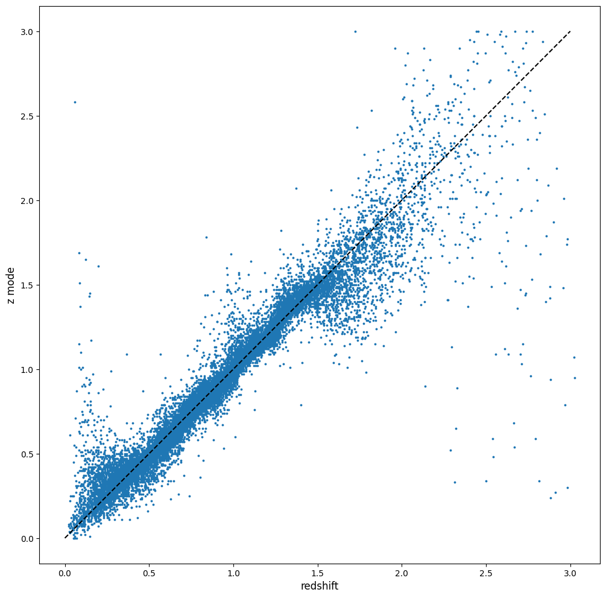

GPz Estimation Example
======================

**Author:** Sam Schmidt

**Last Run Successfully:** September 26, 2023

A quick demo of running GPz on the typical test data. You should have
installed rail_gpz_v1 (we highly recommend that you do this from within
a custom conda environment so that all dependencies for package versions
are met), either by cloning and installing from github, or with:

::

   pip install pz-rail-gpz-v1

As RAIL is a namespace package, installing rail_gpz_v1 will make
``GPzInformer`` and ``GPzEstimator`` available, and they can be imported
via:

::

   from rail.estimation.algos.gpz import GPzInformer, GPzEstimator

Let’s start with all of our necessary imports:

.. code:: ipython3

    import os
    import matplotlib.pyplot as plt
    import numpy as np
    import rail
    import qp
    from rail.core.data import TableHandle
    from rail.core.stage import RailStage
    from rail.estimation.algos.gpz import GPzInformer, GPzEstimator

.. code:: ipython3

    # set up the DataStore to keep track of data
    DS = RailStage.data_store
    DS.__class__.allow_overwrite = True

.. code:: ipython3

    # find_rail_file is a convenience function that finds a file in the RAIL ecosystem   We have several example data files that are copied with RAIL that we can use for our example run, let's grab those files, one for training/validation, and the other for testing:
    from rail.utils.path_utils import find_rail_file
    trainFile = find_rail_file('examples_data/testdata/test_dc2_training_9816.hdf5')
    testFile = find_rail_file('examples_data/testdata/test_dc2_validation_9816.hdf5')
    training_data = DS.read_file("training_data", TableHandle, trainFile)
    test_data = DS.read_file("test_data", TableHandle, testFile)

Now, we need to set up the stage that will run GPz. We begin by defining
a dictionary with the config options for the algorithm. There are
sensible defaults set, we will override several of these as an example
of how to do this. Config parameters not set in the dictionary will
automatically be set to their default values.

.. code:: ipython3

    gpz_train_dict = dict(n_basis=60, trainfrac=0.8, csl_method="normal", max_iter=150, hdf5_groupname="photometry") 

Let’s set up the training stage. We need to provide a name for the stage
for ceci, as well as a name for the model file that will be written by
the stage. We also include the arguments in the dictionary we wrote
above as additional arguments:

.. code:: ipython3

    # set up the stage to run our GPZ_training
    pz_train = GPzInformer.make_stage(name="GPz_Train", model="GPz_model.pkl", **gpz_train_dict)

We are now ready to run the stage to create the model. We will use the
training data from ``test_dc2_training_9816.hdf5``, which contains
10,225 galaxies drawn from healpix 9816 from the cosmoDC2_v1.1.4
dataset, to train the model. Note that we read this data in called
``train_data`` in the DataStore. Note that we set ``trainfrac`` to 0.8,
so 80% of the data will be used in the “main” training, but 20% will be
reserved by ``GPzInformer`` to determine a SIGMA parameter. We set
``max_iter`` to 150, so we will see 150 steps where the stage tries to
maximize the likelihood. We run the stage as follows:

.. code:: ipython3

    %%time
    pz_train.inform(training_data)

.. parsed-literal::

    ngal: 10225
    training model...

.. parsed-literal::

    Iter	 logML/n 		 Train RMSE		 Train RMSE/n		 Valid RMSE		 Valid MLL		 Time    
       1	-3.4525401e-01	 3.2116732e-01	-3.3557690e-01	 3.1807347e-01	[-3.3029633e-01]	 4.6286154e-01

.. parsed-literal::

       2	-2.7438821e-01	 3.1048703e-01	-2.5056672e-01	 3.0808228e-01	[-2.4380103e-01]	 2.3215747e-01

.. parsed-literal::

       3	-2.3145427e-01	 2.9070939e-01	-1.9064322e-01	 2.8667430e-01	[-1.7643304e-01]	 2.8039074e-01
       4	-1.9374868e-01	 2.6671437e-01	-1.5287635e-01	 2.6125425e-01	[-1.2407029e-01]	 2.0302057e-01

.. parsed-literal::

       5	-1.0990565e-01	 2.5836882e-01	-7.6636767e-02	 2.5314427e-01	[-5.3842531e-02]	 2.0418119e-01

.. parsed-literal::

       6	-7.4190662e-02	 2.5258440e-01	-4.4099497e-02	 2.4806859e-01	[-2.7965631e-02]	 2.1292114e-01

.. parsed-literal::

       7	-5.8281432e-02	 2.5023119e-01	-3.3827672e-02	 2.4533421e-01	[-1.5273897e-02]	 2.1459222e-01

.. parsed-literal::

       8	-4.3418649e-02	 2.4770170e-01	-2.3261446e-02	 2.4261058e-01	[-3.5861803e-03]	 2.1753907e-01
       9	-3.0598465e-02	 2.4533666e-01	-1.3277470e-02	 2.4013527e-01	[ 7.4495387e-03]	 1.7829061e-01

.. parsed-literal::

      10	-2.1639498e-02	 2.4372698e-01	-6.2946810e-03	 2.3824470e-01	[ 1.4936267e-02]	 2.0335913e-01

.. parsed-literal::

      11	-1.5824642e-02	 2.4262342e-01	-1.5575949e-03	 2.3707178e-01	[ 2.2618589e-02]	 2.1352482e-01

.. parsed-literal::

      12	-1.2955629e-02	 2.4215330e-01	 1.1256080e-03	 2.3642989e-01	[ 2.4963919e-02]	 2.1125007e-01
      13	-9.3696625e-03	 2.4147679e-01	 4.4683947e-03	 2.3557005e-01	[ 2.9002337e-02]	 1.7322540e-01

.. parsed-literal::

      14	-3.1533616e-03	 2.4006009e-01	 1.1566912e-02	 2.3418710e-01	[ 3.5881249e-02]	 2.0987988e-01
      15	 5.6002623e-02	 2.2774138e-01	 7.3127554e-02	 2.2088128e-01	[ 9.2027125e-02]	 2.0523286e-01

.. parsed-literal::

      16	 1.0747862e-01	 2.2463655e-01	 1.2689079e-01	 2.1667575e-01	[ 1.4603391e-01]	 2.1312833e-01

.. parsed-literal::

      17	 2.3008623e-01	 2.2210752e-01	 2.5760535e-01	 2.1237558e-01	[ 2.8674109e-01]	 2.1651292e-01

.. parsed-literal::

      18	 2.7763420e-01	 2.2150596e-01	 3.0838728e-01	 2.1310803e-01	[ 3.2963505e-01]	 2.1515989e-01

.. parsed-literal::

      19	 3.1336857e-01	 2.1887346e-01	 3.4323620e-01	 2.1145192e-01	[ 3.5523334e-01]	 2.1085930e-01
      20	 3.5905610e-01	 2.1454783e-01	 3.9016913e-01	 2.0679195e-01	[ 4.0242319e-01]	 1.9032431e-01

.. parsed-literal::

      21	 4.2350154e-01	 2.1143550e-01	 4.5586902e-01	 2.0424234e-01	[ 4.6440497e-01]	 2.1883559e-01

.. parsed-literal::

      22	 5.1506617e-01	 2.1165183e-01	 5.5041957e-01	 2.0597194e-01	[ 5.3703903e-01]	 2.1044183e-01

.. parsed-literal::

      23	 5.6080825e-01	 2.1411642e-01	 5.9912488e-01	 2.0709689e-01	[ 5.6072194e-01]	 2.1168542e-01

.. parsed-literal::

      24	 5.9609875e-01	 2.1008238e-01	 6.3441529e-01	 2.0398928e-01	[ 5.8781895e-01]	 2.0660210e-01

.. parsed-literal::

      25	 6.2738116e-01	 2.0753383e-01	 6.6568277e-01	 2.0174697e-01	[ 6.1410349e-01]	 2.1227407e-01
      26	 6.8955159e-01	 2.0540566e-01	 7.2666375e-01	 1.9890450e-01	[ 6.7263896e-01]	 1.8639946e-01

.. parsed-literal::

      27	 7.1983641e-01	 2.0082228e-01	 7.5455582e-01	 1.9349628e-01	[ 7.1174110e-01]	 2.0742273e-01
      28	 7.6741134e-01	 1.9995644e-01	 8.0564021e-01	 1.9252653e-01	[ 7.5173699e-01]	 1.9324064e-01

.. parsed-literal::

      29	 7.9984494e-01	 2.0200841e-01	 8.4013698e-01	 1.9262542e-01	[ 7.8270322e-01]	 1.8405390e-01
      30	 8.1980744e-01	 2.0243665e-01	 8.5944404e-01	 1.9380008e-01	[ 7.9590319e-01]	 2.0101857e-01

.. parsed-literal::

      31	 8.3916348e-01	 2.0114694e-01	 8.7891758e-01	 1.9263498e-01	[ 8.0918563e-01]	 2.1838474e-01

.. parsed-literal::

      32	 8.6120454e-01	 2.0112573e-01	 9.0174487e-01	 1.9255083e-01	[ 8.2504439e-01]	 2.2149611e-01

.. parsed-literal::

      33	 8.8914044e-01	 2.0161973e-01	 9.3068491e-01	 1.9211457e-01	[ 8.6414369e-01]	 2.2051096e-01

.. parsed-literal::

      34	 9.0381823e-01	 2.0216681e-01	 9.4715869e-01	 1.9139795e-01	[ 8.9213564e-01]	 2.0971084e-01

.. parsed-literal::

      35	 9.2808081e-01	 2.0005605e-01	 9.7094871e-01	 1.8937031e-01	[ 9.1706186e-01]	 2.1553850e-01

.. parsed-literal::

      36	 9.4158181e-01	 1.9807262e-01	 9.8452554e-01	 1.8757681e-01	[ 9.3220297e-01]	 2.1090817e-01

.. parsed-literal::

      37	 9.5676876e-01	 1.9522163e-01	 1.0003215e+00	 1.8527508e-01	[ 9.4629714e-01]	 2.0921302e-01

.. parsed-literal::

      38	 9.7064693e-01	 1.9296909e-01	 1.0158972e+00	 1.8298375e-01	[ 9.4961130e-01]	 2.1854615e-01

.. parsed-literal::

      39	 9.8421069e-01	 1.9149677e-01	 1.0297788e+00	 1.8166686e-01	[ 9.6080393e-01]	 2.1064091e-01

.. parsed-literal::

      40	 9.9145263e-01	 1.9127412e-01	 1.0367415e+00	 1.8136882e-01	[ 9.6795856e-01]	 2.1752977e-01

.. parsed-literal::

      41	 1.0038489e+00	 1.9126638e-01	 1.0496196e+00	 1.8047281e-01	[ 9.8084660e-01]	 2.1036005e-01

.. parsed-literal::

      42	 1.0153487e+00	 1.9005521e-01	 1.0611980e+00	 1.7873001e-01	[ 9.9216463e-01]	 2.0391536e-01

.. parsed-literal::

      43	 1.0267381e+00	 1.8930514e-01	 1.0725880e+00	 1.7781982e-01	[ 1.0028558e+00]	 2.0415020e-01

.. parsed-literal::

      44	 1.0368358e+00	 1.8776886e-01	 1.0831336e+00	 1.7661185e-01	[ 1.0102205e+00]	 2.0885944e-01
      45	 1.0567957e+00	 1.8412003e-01	 1.1040041e+00	 1.7399193e-01	[ 1.0157952e+00]	 1.9558287e-01

.. parsed-literal::

      46	 1.0683279e+00	 1.8277444e-01	 1.1157343e+00	 1.7280645e-01	[ 1.0158614e+00]	 1.7727089e-01

.. parsed-literal::

      47	 1.0810028e+00	 1.8086437e-01	 1.1284041e+00	 1.7157129e-01	  1.0156611e+00 	 2.1025324e-01

.. parsed-literal::

      48	 1.0902605e+00	 1.7982809e-01	 1.1378123e+00	 1.7090574e-01	  1.0142938e+00 	 2.0816660e-01

.. parsed-literal::

      49	 1.1055519e+00	 1.7765288e-01	 1.1533561e+00	 1.6920297e-01	[ 1.0210061e+00]	 2.1436262e-01
      50	 1.1099622e+00	 1.7518717e-01	 1.1591014e+00	 1.6709485e-01	  9.9842574e-01 	 1.8899608e-01

.. parsed-literal::

      51	 1.1263325e+00	 1.7403354e-01	 1.1746527e+00	 1.6608968e-01	[ 1.0342966e+00]	 2.0653343e-01

.. parsed-literal::

      52	 1.1316585e+00	 1.7311503e-01	 1.1799334e+00	 1.6538245e-01	[ 1.0418569e+00]	 2.0934033e-01

.. parsed-literal::

      53	 1.1418506e+00	 1.7081899e-01	 1.1904622e+00	 1.6357571e-01	[ 1.0492881e+00]	 2.0906258e-01

.. parsed-literal::

      54	 1.1515515e+00	 1.6850261e-01	 1.2003807e+00	 1.6161471e-01	[ 1.0541650e+00]	 2.0828581e-01
      55	 1.1632549e+00	 1.6624668e-01	 1.2127999e+00	 1.5951637e-01	  1.0536790e+00 	 1.8698525e-01

.. parsed-literal::

      56	 1.1728759e+00	 1.6549780e-01	 1.2227229e+00	 1.5851152e-01	  1.0530597e+00 	 2.1249580e-01

.. parsed-literal::

      57	 1.1853764e+00	 1.6299356e-01	 1.2358380e+00	 1.5585895e-01	  1.0493604e+00 	 2.0893645e-01

.. parsed-literal::

      58	 1.1952199e+00	 1.6076179e-01	 1.2461991e+00	 1.5325053e-01	  1.0479682e+00 	 2.0695424e-01
      59	 1.2058795e+00	 1.5890464e-01	 1.2568516e+00	 1.5123597e-01	[ 1.0648103e+00]	 1.8168855e-01

.. parsed-literal::

      60	 1.2141591e+00	 1.5836067e-01	 1.2647905e+00	 1.5053929e-01	[ 1.0822100e+00]	 2.0937276e-01
      61	 1.2227428e+00	 1.5662058e-01	 1.2734389e+00	 1.4860683e-01	[ 1.0985363e+00]	 1.9265485e-01

.. parsed-literal::

      62	 1.2310092e+00	 1.5597666e-01	 1.2817207e+00	 1.4755432e-01	[ 1.1162877e+00]	 1.9856572e-01

.. parsed-literal::

      63	 1.2377719e+00	 1.5571684e-01	 1.2884646e+00	 1.4725075e-01	[ 1.1203321e+00]	 2.1142530e-01

.. parsed-literal::

      64	 1.2465953e+00	 1.5484029e-01	 1.2976307e+00	 1.4634801e-01	[ 1.1247201e+00]	 2.1142530e-01
      65	 1.2536958e+00	 1.5502235e-01	 1.3047925e+00	 1.4660389e-01	[ 1.1341475e+00]	 2.0751095e-01

.. parsed-literal::

      66	 1.2615709e+00	 1.5405726e-01	 1.3127121e+00	 1.4558555e-01	[ 1.1456921e+00]	 1.9861650e-01

.. parsed-literal::

      67	 1.2689263e+00	 1.5285860e-01	 1.3201409e+00	 1.4432400e-01	[ 1.1557937e+00]	 2.0586371e-01

.. parsed-literal::

      68	 1.2770558e+00	 1.5167542e-01	 1.3286249e+00	 1.4317500e-01	[ 1.1627550e+00]	 2.0996547e-01

.. parsed-literal::

      69	 1.2834192e+00	 1.5076618e-01	 1.3352378e+00	 1.4215968e-01	[ 1.1752364e+00]	 2.1113968e-01

.. parsed-literal::

      70	 1.2906365e+00	 1.5004680e-01	 1.3424753e+00	 1.4169372e-01	[ 1.1793767e+00]	 2.0452189e-01

.. parsed-literal::

      71	 1.2973619e+00	 1.4947305e-01	 1.3493233e+00	 1.4133520e-01	[ 1.1845138e+00]	 2.0992494e-01

.. parsed-literal::

      72	 1.3050451e+00	 1.4835091e-01	 1.3572467e+00	 1.4044410e-01	[ 1.1898129e+00]	 2.1473932e-01
      73	 1.3146374e+00	 1.4771264e-01	 1.3668911e+00	 1.4048636e-01	[ 1.1966387e+00]	 1.8184257e-01

.. parsed-literal::

      74	 1.3188606e+00	 1.4555402e-01	 1.3713532e+00	 1.3822932e-01	  1.1903466e+00 	 2.0879173e-01

.. parsed-literal::

      75	 1.3258415e+00	 1.4600978e-01	 1.3779380e+00	 1.3873231e-01	[ 1.1986121e+00]	 2.1361136e-01

.. parsed-literal::

      76	 1.3291224e+00	 1.4582230e-01	 1.3812494e+00	 1.3862676e-01	[ 1.1988473e+00]	 2.1611857e-01

.. parsed-literal::

      77	 1.3354311e+00	 1.4563755e-01	 1.3877352e+00	 1.3855421e-01	  1.1935780e+00 	 2.1867299e-01
      78	 1.3404795e+00	 1.4495621e-01	 1.3931561e+00	 1.3847131e-01	  1.1888647e+00 	 1.6726995e-01

.. parsed-literal::

      79	 1.3489002e+00	 1.4511965e-01	 1.4015378e+00	 1.3843222e-01	  1.1914415e+00 	 1.9820929e-01

.. parsed-literal::

      80	 1.3541549e+00	 1.4506865e-01	 1.4069449e+00	 1.3812585e-01	  1.1939689e+00 	 2.1148682e-01
      81	 1.3605077e+00	 1.4498779e-01	 1.4136286e+00	 1.3761417e-01	  1.1969058e+00 	 2.0415926e-01

.. parsed-literal::

      82	 1.3672917e+00	 1.4478814e-01	 1.4205339e+00	 1.3700920e-01	[ 1.2034265e+00]	 1.8217683e-01
      83	 1.3706184e+00	 1.4544288e-01	 1.4243812e+00	 1.3729102e-01	  1.2012646e+00 	 1.8082643e-01

.. parsed-literal::

      84	 1.3794441e+00	 1.4458869e-01	 1.4328427e+00	 1.3643194e-01	[ 1.2134962e+00]	 2.1377420e-01

.. parsed-literal::

      85	 1.3831699e+00	 1.4418208e-01	 1.4364650e+00	 1.3611083e-01	[ 1.2167177e+00]	 2.0783114e-01

.. parsed-literal::

      86	 1.3899165e+00	 1.4350926e-01	 1.4431773e+00	 1.3542716e-01	[ 1.2213541e+00]	 2.1064901e-01
      87	 1.3959489e+00	 1.4262193e-01	 1.4491407e+00	 1.3413161e-01	[ 1.2271827e+00]	 1.9874573e-01

.. parsed-literal::

      88	 1.4017199e+00	 1.4268323e-01	 1.4550019e+00	 1.3403283e-01	[ 1.2324463e+00]	 1.9163632e-01

.. parsed-literal::

      89	 1.4056008e+00	 1.4251984e-01	 1.4588452e+00	 1.3371482e-01	[ 1.2361580e+00]	 2.1260142e-01

.. parsed-literal::

      90	 1.4110475e+00	 1.4198038e-01	 1.4645460e+00	 1.3267675e-01	[ 1.2395575e+00]	 2.1349525e-01
      91	 1.4154898e+00	 1.4133636e-01	 1.4689893e+00	 1.3177057e-01	[ 1.2415494e+00]	 1.9794655e-01

.. parsed-literal::

      92	 1.4207575e+00	 1.4035772e-01	 1.4742985e+00	 1.2970206e-01	  1.2407152e+00 	 2.1332026e-01

.. parsed-literal::

      93	 1.4253067e+00	 1.4007846e-01	 1.4789789e+00	 1.2896503e-01	  1.2398663e+00 	 2.0993304e-01

.. parsed-literal::

      94	 1.4290243e+00	 1.3966867e-01	 1.4827281e+00	 1.2809519e-01	  1.2358049e+00 	 2.0260143e-01
      95	 1.4339718e+00	 1.3911385e-01	 1.4876787e+00	 1.2680629e-01	  1.2313573e+00 	 1.8879485e-01

.. parsed-literal::

      96	 1.4387989e+00	 1.3874224e-01	 1.4926281e+00	 1.2515573e-01	  1.2181859e+00 	 2.1158195e-01

.. parsed-literal::

      97	 1.4430567e+00	 1.3875863e-01	 1.4969157e+00	 1.2489569e-01	  1.2141439e+00 	 2.0808268e-01
      98	 1.4455222e+00	 1.3887841e-01	 1.4993412e+00	 1.2525750e-01	  1.2154376e+00 	 1.9700289e-01

.. parsed-literal::

      99	 1.4484275e+00	 1.3885748e-01	 1.5023498e+00	 1.2512070e-01	  1.2048423e+00 	 2.1274567e-01

.. parsed-literal::

     100	 1.4525042e+00	 1.3883984e-01	 1.5064753e+00	 1.2504917e-01	  1.1910278e+00 	 2.0723724e-01
     101	 1.4559513e+00	 1.3877796e-01	 1.5099372e+00	 1.2520510e-01	  1.1761860e+00 	 2.0259237e-01

.. parsed-literal::

     102	 1.4590648e+00	 1.3854909e-01	 1.5130867e+00	 1.2483318e-01	  1.1616004e+00 	 2.1743464e-01

.. parsed-literal::

     103	 1.4615739e+00	 1.3826727e-01	 1.5156204e+00	 1.2440726e-01	  1.1555356e+00 	 2.0606160e-01

.. parsed-literal::

     104	 1.4653907e+00	 1.3789049e-01	 1.5196620e+00	 1.2387507e-01	  1.1293576e+00 	 2.1107292e-01

.. parsed-literal::

     105	 1.4677810e+00	 1.3781677e-01	 1.5222050e+00	 1.2368985e-01	  1.1102986e+00 	 2.1351933e-01

.. parsed-literal::

     106	 1.4703376e+00	 1.3782806e-01	 1.5247013e+00	 1.2374474e-01	  1.1061074e+00 	 2.0827317e-01

.. parsed-literal::

     107	 1.4724279e+00	 1.3790843e-01	 1.5268287e+00	 1.2384937e-01	  1.0960314e+00 	 2.0329309e-01

.. parsed-literal::

     108	 1.4748162e+00	 1.3792064e-01	 1.5293248e+00	 1.2383663e-01	  1.0846923e+00 	 2.0310569e-01

.. parsed-literal::

     109	 1.4772519e+00	 1.3792864e-01	 1.5320819e+00	 1.2361721e-01	  1.0514521e+00 	 2.0618129e-01
     110	 1.4799868e+00	 1.3777371e-01	 1.5347481e+00	 1.2337422e-01	  1.0555205e+00 	 1.8530631e-01

.. parsed-literal::

     111	 1.4821640e+00	 1.3754653e-01	 1.5369563e+00	 1.2299770e-01	  1.0489137e+00 	 2.0360923e-01

.. parsed-literal::

     112	 1.4849201e+00	 1.3733723e-01	 1.5397358e+00	 1.2266005e-01	  1.0417256e+00 	 2.0155668e-01
     113	 1.4871510e+00	 1.3698808e-01	 1.5420637e+00	 1.2225007e-01	  1.0337990e+00 	 1.8862987e-01

.. parsed-literal::

     114	 1.4899002e+00	 1.3697880e-01	 1.5446688e+00	 1.2245079e-01	  1.0342193e+00 	 1.7848635e-01

.. parsed-literal::

     115	 1.4914236e+00	 1.3696588e-01	 1.5461666e+00	 1.2263747e-01	  1.0322853e+00 	 2.1363282e-01
     116	 1.4936669e+00	 1.3677275e-01	 1.5484097e+00	 1.2263832e-01	  1.0253332e+00 	 1.9406581e-01

.. parsed-literal::

     117	 1.4950881e+00	 1.3641286e-01	 1.5500283e+00	 1.2247832e-01	  1.0117309e+00 	 1.9242454e-01

.. parsed-literal::

     118	 1.4982199e+00	 1.3615197e-01	 1.5530426e+00	 1.2208535e-01	  1.0076145e+00 	 2.0902491e-01
     119	 1.4996501e+00	 1.3596662e-01	 1.5544868e+00	 1.2167133e-01	  1.0052718e+00 	 1.8888950e-01

.. parsed-literal::

     120	 1.5014576e+00	 1.3574040e-01	 1.5563661e+00	 1.2117675e-01	  9.9494939e-01 	 2.0322132e-01

.. parsed-literal::

     121	 1.5030841e+00	 1.3543432e-01	 1.5581140e+00	 1.2052347e-01	  9.8206440e-01 	 2.2050095e-01
     122	 1.5052700e+00	 1.3535196e-01	 1.5602614e+00	 1.2042098e-01	  9.7235930e-01 	 1.9879007e-01

.. parsed-literal::

     123	 1.5064798e+00	 1.3526603e-01	 1.5614758e+00	 1.2034469e-01	  9.6175123e-01 	 2.0685887e-01
     124	 1.5075602e+00	 1.3517764e-01	 1.5625730e+00	 1.2024467e-01	  9.5138043e-01 	 1.8646383e-01

.. parsed-literal::

     125	 1.5091479e+00	 1.3491051e-01	 1.5642982e+00	 1.2004272e-01	  9.2289873e-01 	 1.9141746e-01

.. parsed-literal::

     126	 1.5109996e+00	 1.3480710e-01	 1.5661556e+00	 1.1993407e-01	  9.1204905e-01 	 2.0958304e-01

.. parsed-literal::

     127	 1.5122744e+00	 1.3471022e-01	 1.5674672e+00	 1.1984401e-01	  9.0563837e-01 	 2.1949697e-01

.. parsed-literal::

     128	 1.5140360e+00	 1.3457588e-01	 1.5693300e+00	 1.1973894e-01	  8.8961687e-01 	 2.0588779e-01

.. parsed-literal::

     129	 1.5156695e+00	 1.3425165e-01	 1.5711435e+00	 1.1960294e-01	  8.7281739e-01 	 2.1230507e-01

.. parsed-literal::

     130	 1.5176840e+00	 1.3409680e-01	 1.5731903e+00	 1.1958148e-01	  8.5132877e-01 	 2.0474410e-01
     131	 1.5191964e+00	 1.3389708e-01	 1.5746778e+00	 1.1955175e-01	  8.4163164e-01 	 1.9363999e-01

.. parsed-literal::

     132	 1.5211443e+00	 1.3347719e-01	 1.5766462e+00	 1.1944148e-01	  8.3245466e-01 	 2.0766330e-01

.. parsed-literal::

     133	 1.5216882e+00	 1.3293826e-01	 1.5773362e+00	 1.1936550e-01	  8.2715503e-01 	 2.1255326e-01

.. parsed-literal::

     134	 1.5237821e+00	 1.3276132e-01	 1.5793551e+00	 1.1926922e-01	  8.2596088e-01 	 2.1796656e-01

.. parsed-literal::

     135	 1.5245308e+00	 1.3266796e-01	 1.5801041e+00	 1.1919170e-01	  8.2574270e-01 	 2.1248198e-01

.. parsed-literal::

     136	 1.5257182e+00	 1.3244107e-01	 1.5813119e+00	 1.1906430e-01	  8.2191354e-01 	 2.1324277e-01
     137	 1.5273124e+00	 1.3217305e-01	 1.5829445e+00	 1.1886119e-01	  8.1526915e-01 	 1.8565464e-01

.. parsed-literal::

     138	 1.5290102e+00	 1.3185604e-01	 1.5846042e+00	 1.1875534e-01	  8.0161972e-01 	 2.0557570e-01

.. parsed-literal::

     139	 1.5305126e+00	 1.3167873e-01	 1.5860508e+00	 1.1867966e-01	  7.9283133e-01 	 2.0850730e-01
     140	 1.5323172e+00	 1.3152002e-01	 1.5877772e+00	 1.1857498e-01	  7.8291898e-01 	 1.8175173e-01

.. parsed-literal::

     141	 1.5336636e+00	 1.3119362e-01	 1.5890805e+00	 1.1842462e-01	  7.9319475e-01 	 2.3111153e-01

.. parsed-literal::

     142	 1.5349491e+00	 1.3112803e-01	 1.5903198e+00	 1.1835849e-01	  7.9792914e-01 	 2.0378017e-01

.. parsed-literal::

     143	 1.5365101e+00	 1.3090694e-01	 1.5918610e+00	 1.1815695e-01	  8.1053106e-01 	 2.0731854e-01

.. parsed-literal::

     144	 1.5374991e+00	 1.3075400e-01	 1.5928665e+00	 1.1804475e-01	  8.1186678e-01 	 2.2082186e-01

.. parsed-literal::

     145	 1.5390922e+00	 1.3056487e-01	 1.5944896e+00	 1.1781005e-01	  8.1117406e-01 	 2.1782732e-01

.. parsed-literal::

     146	 1.5401152e+00	 1.3033457e-01	 1.5955488e+00	 1.1760920e-01	  8.0411443e-01 	 3.2650018e-01

.. parsed-literal::

     147	 1.5415095e+00	 1.3025826e-01	 1.5969338e+00	 1.1746336e-01	  7.9761184e-01 	 2.2041464e-01

.. parsed-literal::

     148	 1.5427544e+00	 1.3014510e-01	 1.5981827e+00	 1.1734063e-01	  7.8968054e-01 	 2.2333264e-01

.. parsed-literal::

     149	 1.5444806e+00	 1.2984258e-01	 1.5999433e+00	 1.1715121e-01	  7.7272613e-01 	 2.0792460e-01

.. parsed-literal::

     150	 1.5454808e+00	 1.2960493e-01	 1.6010416e+00	 1.1694207e-01	  7.5923995e-01 	 3.2445240e-01
    Inserting handle into data store.  model_GPz_Train: inprogress_GPz_model.pkl, GPz_Train
    CPU times: user 2min 4s, sys: 1.08 s, total: 2min 5s
    Wall time: 31.6 s

.. parsed-literal::

    <rail.core.data.ModelHandle at 0x7f84e8635a80>

This should have taken about 30 seconds on a typical desktop computer,
and you should now see a file called ``GPz_model.pkl`` in the directory.
This model file is used by the ``GPzEstimator`` stage to determine our
redshift PDFs for the test set of galaxies. Let’s set up that stage,
again defining a dictionary of variables for the config params:

.. code:: ipython3

    gpz_test_dict = dict(hdf5_groupname="photometry", model="GPz_model.pkl")
    
    gpz_run = GPzEstimator.make_stage(name="gpz_run", **gpz_test_dict)

Let’s run the stage and compute photo-z’s for our test set:

.. code:: ipython3

    %%time
    results = gpz_run.estimate(test_data)

.. parsed-literal::

    Inserting handle into data store.  model: GPz_model.pkl, gpz_run
    Process 0 running estimator on chunk 0 - 10,000
    Process 0 estimating GPz PZ PDF for rows 0 - 10,000

.. parsed-literal::

    Inserting handle into data store.  output_gpz_run: inprogress_output_gpz_run.hdf5, gpz_run

.. parsed-literal::

    Process 0 running estimator on chunk 10,000 - 20,000
    Process 0 estimating GPz PZ PDF for rows 10,000 - 20,000

.. parsed-literal::

    Process 0 running estimator on chunk 20,000 - 20,449
    Process 0 estimating GPz PZ PDF for rows 20,000 - 20,449
    CPU times: user 1.85 s, sys: 54.9 ms, total: 1.9 s
    Wall time: 615 ms

This should be very fast, under a second for our 20,449 galaxies in the
test set. Now, let’s plot a scatter plot of the point estimates, as well
as a few example PDFs. We can get access to the ``qp`` ensemble that was
written via the DataStore via ``results()``

.. code:: ipython3

    ens = results()

.. code:: ipython3

    expdfids = [2, 180, 13517, 18032]
    fig, axs = plt.subplots(4, 1, figsize=(12,10))
    for i, xx in enumerate(expdfids):
        axs[i].set_xlim(0,3)
        ens[xx].plot_native(axes=axs[i])
    axs[3].set_xlabel("redshift", fontsize=15)

.. parsed-literal::

    Text(0.5, 0, 'redshift')

.. image:: ../../../docs/rendered/estimation_examples/06_GPz_files/../../../docs/rendered/estimation_examples/06_GPz_16_1.png

GPzEstimator parameterizes each PDF as a single Gaussian, here we see a
few examples of Gaussians of different widths. Now let’s grab the mode
of each PDF (stored as ancil data in the ensemble) and compare to the
true redshifts from the test_data file:

.. code:: ipython3

    truez = test_data.data['photometry']['redshift']
    zmode = ens.ancil['zmode'].flatten()

.. code:: ipython3

    plt.figure(figsize=(12,12))
    plt.scatter(truez, zmode, s=3)
    plt.plot([0,3],[0,3], 'k--')
    plt.xlabel("redshift", fontsize=12)
    plt.ylabel("z mode", fontsize=12)

.. parsed-literal::

    Text(0, 0.5, 'z mode')

