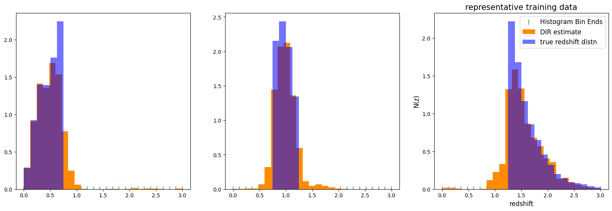
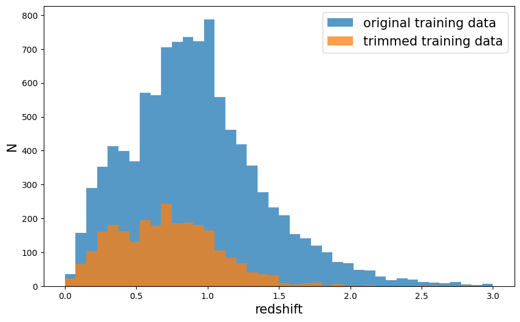
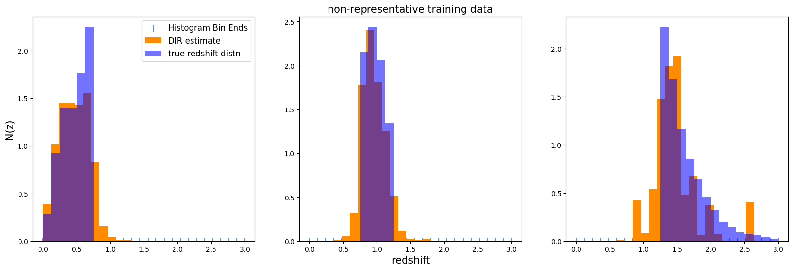

The NZDir estimator
===================

**Author:** Sam Schmidt

**Last successfully run:** April 26, 2023

This is a quick demo of the NZDir estimator, it has been ported to RAIL
based on Joe Zuntz’s implementation in TXPipe here:
https://github.com/LSSTDESC/TXPipe/blob/nz-dir/txpipe/nz_calibration.py

First off, let’s load the relevant packages from RAIL:

.. code:: ipython3

    import os
    import rail
    import numpy as np
    import pandas as pd
    import tables_io
    import matplotlib.pyplot as plt
    %matplotlib inline

.. code:: ipython3

    from rail.estimation.algos.nz_dir import NZDirSummarizer, NZDirInformer
    from rail.core.data import TableHandle, Hdf5Handle
    from rail.core.stage import RailStage

Next, let’s set up the Data Store, so that our RAIL module will know
where to fetch data:

.. code:: ipython3

    DS = RailStage.data_store
    DS.__class__.allow_overwrite = True

Next, we’ll load some data into the Data Store:

``test_dc2_training_9816.hdf5`` contains ~10,000 galaxies from healpix
9816 of the cosmoDC2 “truth” catalog, and the “validation” data set
contains ~20,000 galaxies from this same healpix pixel.

.. code:: ipython3

    from rail.utils.path_utils import find_rail_file
    trainFile = find_rail_file('examples_data/testdata/test_dc2_training_9816.hdf5')
    testFile = find_rail_file('examples_data/testdata/test_dc2_validation_9816.hdf5')
    training_data = DS.read_file("training_data", TableHandle, trainFile)

Let’s read test data in with tables_io, and then split it up into
several tomographic bins. We can mock up some simple “tomographic” bins
via their true redshift. The degrader expects a pandas DataFrame, so we
will create three dataframes for each of a low, mid, and hi redshift
sample. Let’s also add a weight column to the test data while we are at
it, this will be used later by the NZDir algorithm (for now we’ll set
all weights to one):

.. code:: ipython3

    rawdata = tables_io.read(testFile)['photometry']
    df = tables_io.convert(rawdata, tType=tables_io.types.PD_DATAFRAME)
    szcol = rawdata['redshift']
    numintest = len(szcol)
    df['weight'] = np.ones(numintest, dtype='float')
    lowmask = (szcol<=0.75)
    midmask = np.logical_and(szcol>.75, szcol<1.25)
    himask = (szcol>=1.25)
    lowzdata = df[lowmask]
    midzdata = df[midmask]
    hizdata = df[himask]
    low_bin = DS.add_data("lowz_bin", lowzdata, Hdf5Handle)
    mid_bin = DS.add_data("midz_bin", midzdata, Hdf5Handle)
    hi_bin = DS.add_data("hiz_bin", hizdata, Hdf5Handle)

The algorithm:
--------------

The NZDir estimator tries to reconstruct the redshift distribution for
an unknown sample (which we’ll alternately call the “photometric
sample”, as it has photometric, but not spectroscopic information for
each galaxy) by finding spectroscopic galaxies with similar
magnitudes/colors and assigning a redshift based on those
similarly-colored objects.

In practice, this particular algorithm actually reverses that process:
it defines a neighborhood around each spectroscopic object (based on the
distance to the Nth nearest neighbor, where N is defined by the user via
the parameter ``n_neigh``). Then, it loops over the set of all
spectroscopic objects and adds its (weighted) redshift to a histogram
for each photometric object that it finds within the annulus.

This process is more efficient computationally, and has the benefit of
automatically “ignoring” photometric objects that have no similarly
colored spectroscopic objects nearby. *However*, that could also be seen
as a limitation, as if there are areas of color^N space not covered by
your training sample, those galaxies will be “skipped” when assembling
the tomographic redshift N(z) estimate, which can lead to biased
results, as we will show later in this demo.

Like PDF estimators, the algorithm is broken up into an “inform” stage
and an “estimate” stage. The inform stage creates the neighbors for the
spectroscopic samples and calculates the distance to the Nth nearest
neighbor that is used to determine annulus checks around each spec-z
object. These quantites are stored in a specified model file that is
loaded and used by the estimate stage.

Let’s also add a “weight column” to the training data to test
functionality. For simplicity we already set the weights to 1.0 for all
photometric galaxies a few cells above, and now let’s set weights of 0.5
for all spectroscopic galaxies. This should have no impact on the
recovery compared to having no weights included. Note that if weights
are not included, the algorithm will set all weights to 1.0. However,
these weights could be used in more realistic analyses to reweight
training or test samples to account for various biases.

.. code:: ipython3

    numinphot = len(training_data()['photometry']['redshift'])
    training_data()['photometry']['weight'] = np.ones(numinphot, dtype='float')*0.5

.. code:: ipython3

    zmin = 0.0
    zmax = 3.0
    xmanybins = 25

Now, let’s set up or estimator, first creating a stage for the informer.
We define any input variables in a dictionary and then use that with
``make_stage`` to create an instance of our NZDirSummarizer. We’ll
create a histogram of 25 bins, using 5 nearest neighbors to define our
specz neighborhood, and above we defined our bin column as “bin”:

.. code:: ipython3

    train_nzdir = NZDirInformer.make_stage(name='train_nzdir', n_neigh=5,
                                          szweightcol='weight', model="NZDir_model.pkl")

.. code:: ipython3

    train_nzdir.inform(training_data)

.. parsed-literal::

    Inserting handle into data store.  model_train_nzdir: inprogress_NZDir_model.pkl, train_nzdir

.. parsed-literal::

    <rail.core.data.ModelHandle at 0x7fa504677400>

Now, let’s set up our NZDir estimator, providing parameters for the
redshift grid, photomtetric weight column, and the model that we created
with the informer. Note that NZDir returns N bootstrap samples rather
than just a single distribution. The code draws bootstrap samples from
the spectroscopic sample to use as input as the training data.
``nsamples`` can be used to set the number of bootstrap samples
returned, for this demo we will only generate 20:

.. code:: ipython3

    summdict = dict(leafsize=20, zmin=zmin, zmax=zmax, nzbins=xmanybins, nsamples=20,
                    phot_weightcol='weight', model="NZDir_model.pkl", hdf5_groupname='')

We have three tomographic bins, we can make a stage and run each one in
a loop. To run our Nz Estimator we just need to run ``estimate`` with
arguments for the test and training data handles as named in the Data
Store: The code uses a fast Nearest Neighbor calculation and KDTree
calculation, so this should run very fast:

.. code:: ipython3

    %%time
    bin_ens = {}
    binnames = ['low', 'mid', 'hi']
    bin_datasets = [low_bin, mid_bin, hi_bin]
    for bin, indata in zip(binnames, bin_datasets):
        nzsumm = NZDirSummarizer.make_stage(name=f'nzsumm_{bin}', **summdict)
        bin_ens[f'{bin}'] = nzsumm.estimate(indata)

.. parsed-literal::

    Inserting handle into data store.  model: NZDir_model.pkl, nzsumm_low
    Process 0 running estimator on chunk 0 - 7679
    Inserting handle into data store.  single_NZ_nzsumm_low: inprogress_single_NZ_nzsumm_low.hdf5, nzsumm_low
    Inserting handle into data store.  output_nzsumm_low: inprogress_output_nzsumm_low.hdf5, nzsumm_low
    Process 0 running estimator on chunk 0 - 8513
    Inserting handle into data store.  single_NZ_nzsumm_mid: inprogress_single_NZ_nzsumm_mid.hdf5, nzsumm_mid
    Inserting handle into data store.  output_nzsumm_mid: inprogress_output_nzsumm_mid.hdf5, nzsumm_mid

.. parsed-literal::

    Process 0 running estimator on chunk 0 - 4257
    Inserting handle into data store.  single_NZ_nzsumm_hi: inprogress_single_NZ_nzsumm_hi.hdf5, nzsumm_hi
    Inserting handle into data store.  output_nzsumm_hi: inprogress_output_nzsumm_hi.hdf5, nzsumm_hi
    CPU times: user 290 ms, sys: 5.12 ms, total: 295 ms
    Wall time: 294 ms

indeed, for our 20,000 test and 10,000 training galaxies, it takes less
than a second to run all three bins! Now, let’s plot our estimates and
compare to the true distributions in our tomo bins. While the ensembles
actually contain 20 distributions, we will plot only the first bootstrap
realization for each bin:

.. code:: ipython3

    samebins = np.linspace(zmin,zmax, xmanybins)
    binsize= samebins[1]-samebins[0]
    bincents = 0.5*(samebins[1:] + samebins[:-1])
    
    fig, axs = plt.subplots(1,3, figsize=(20,6))
    bin_datasets = [low_bin, mid_bin, hi_bin]
    binnames = ['low', 'mid', 'hi']
    for ii, (bin, indata) in enumerate(zip(binnames, bin_datasets)):
        truehist, bins = np.histogram(indata()['redshift'], bins=samebins)
        norm = np.sum(truehist)*binsize
        truehist = np.array(truehist)/norm
        bin_ens[f'{bin}']().plot_native(axes=axs[ii],label="DIR estimate")
        axs[ii].bar(bincents, truehist,alpha=0.55, width=binsize, color='b', label="true redshift distn")
    plt.legend(loc='upper right', fontsize=12)
    plt.title("representative training data", fontsize=15)
    plt.xlabel("redshift", fontsize=12)
    plt.ylabel("N(z)", fontsize=12)

.. parsed-literal::

    Text(0, 0.5, 'N(z)')

Non-representative data
-----------------------

That looks very nice, while there is a little bit of “slosh” outside of
each bin, we have a relatively compact and accurate representation from
the DIR method! This makes sense, as our training and test data are
drawn from the same underlying distribution (in this case
cosmoDC2_v1.1.4). However, how will things look if we are missing chunks
of data, or have incorrect redshifts in our spec-z sample? We can use
RAIL’s degradation modules to do just that: place incorrect redshifts
for percentage of the training data, and we can make a magnitude cut
that will limite the redshift and color range of our training data:

Let’s import the necessary modules from rail.creation.degraders, we will
put in “line confusion” for 5% of our sample, and then cut the sample at
magnitude 23.5:

.. code:: ipython3

    from rail.creation.degraders.spectroscopic_degraders import LineConfusion
    from rail.creation.degraders.quantityCut import QuantityCut
    from rail.core.data import PqHandle

.. code:: ipython3

    line_confusion = LineConfusion.make_stage(name='line_confusion', hdf5_groupname='photometry',
                                              true_wavelen=5007., wrong_wavelen=3727., frac_wrong=0.05)
    
    quantity_cut = QuantityCut.make_stage(name='quantity_cut', hdf5_groupname='photometry',
                                          cuts={'mag_i_lsst': 23.5})

The degrader expects a pandas dataframe, so let’s construct one and add
it to the data store, we’ll strip out the ‘photometry’ hdf5 while we’re
at it:

.. code:: ipython3

    degrade_df = pd.DataFrame(training_data.data['photometry'])
    degrade_data = DS.add_data("degrade_data", degrade_df, PqHandle)

Now, apply our degraders:

.. code:: ipython3

    train_data_conf = line_confusion(degrade_data)
    train_data_cut = quantity_cut(train_data_conf)

.. parsed-literal::

    Inserting handle into data store.  output_line_confusion: inprogress_output_line_confusion.pq, line_confusion
    Inserting handle into data store.  output_quantity_cut: inprogress_output_quantity_cut.pq, quantity_cut

Let’s plot our trimmed training sample, we see that we have fewer
galaxies, so we’ll be subject to more “shot noise”/discretization of the
redshifts, and we are very incomplete at high redshift.

.. code:: ipython3

    #compare original specz data to degraded data
    fig = plt.figure(figsize=(10,6))
    xbins = np.linspace(0,3,41)
    plt.hist(training_data()['photometry']['redshift'],bins=xbins,alpha=0.75, label='original training data');
    plt.hist(train_data_cut()['redshift'], bins=xbins,alpha=0.75, label='trimmed training data');
    plt.legend(loc='upper right', fontsize=15)
    plt.xlabel("redshift", fontsize=15)
    plt.ylabel("N", fontsize=15)

.. parsed-literal::

    Text(0, 0.5, 'N')

Let’s re-run our estimator on the same test data but now with our
incomplete training data:

.. code:: ipython3

    xinformdict = dict(n_neigh=5, bincol="bin", szweightcol='weight',
                       model="NZDir_model_incompl.pkl", hdf5_groupname='')
    newsumm_inform = NZDirInformer.make_stage(name='newsumm_inform', **xinformdict)

.. code:: ipython3

    newsumm_inform.inform(train_data_cut)

.. parsed-literal::

    Inserting handle into data store.  model_newsumm_inform: inprogress_NZDir_model_incompl.pkl, newsumm_inform

.. parsed-literal::

    <rail.core.data.ModelHandle at 0x7fa502e1c340>

Now we need to re-run our tomographic bin estimates with this new model:

.. code:: ipython3

    %%time
    xestimatedict = dict(leafsize=20, zmin=zmin, zmax=zmax, nzbins=xmanybins, hdf5_groupname='', nsamples=20,
                         phot_weightcol='weight', model=newsumm_inform.get_handle('model'))
    new_ens = {}
    binnames = ['low', 'mid', 'hi']
    bin_datasets = [low_bin, mid_bin, hi_bin]
    for bin, indata in zip(binnames, bin_datasets):
        nzsumm = NZDirSummarizer.make_stage(name=f'nzsumm_{bin}', **xestimatedict)
        new_ens[f'{bin}'] = nzsumm.estimate(indata)

.. parsed-literal::

    Process 0 running estimator on chunk 0 - 7679
    Inserting handle into data store.  single_NZ_nzsumm_low: inprogress_single_NZ_nzsumm_low.hdf5, nzsumm_low
    Inserting handle into data store.  output_nzsumm_low: inprogress_output_nzsumm_low.hdf5, nzsumm_low
    Process 0 running estimator on chunk 0 - 8513
    Inserting handle into data store.  single_NZ_nzsumm_mid: inprogress_single_NZ_nzsumm_mid.hdf5, nzsumm_mid
    Inserting handle into data store.  output_nzsumm_mid: inprogress_output_nzsumm_mid.hdf5, nzsumm_mid
    Process 0 running estimator on chunk 0 - 4257
    Inserting handle into data store.  single_NZ_nzsumm_hi: inprogress_single_NZ_nzsumm_hi.hdf5, nzsumm_hi
    Inserting handle into data store.  output_nzsumm_hi: inprogress_output_nzsumm_hi.hdf5, nzsumm_hi
    CPU times: user 127 ms, sys: 2.01 ms, total: 129 ms
    Wall time: 129 ms

.. code:: ipython3

    fig, axs = plt.subplots(1,3, figsize=(20,6))
    samebins = np.linspace(0,3, xmanybins)
    binsize= samebins[1]-samebins[0]
    bincents = 0.5*(samebins[1:] + samebins[:-1])
    bin_datasets = [low_bin, mid_bin, hi_bin]
    binnames = ['low', 'mid', 'hi']
    
    for ii, (bin, indata) in enumerate(zip(binnames, bin_datasets)):
        truehist, bins = np.histogram(indata.data['redshift'], bins=samebins)
        norm = np.sum(truehist)*binsize
        truehist = np.array(truehist)/norm
        new_ens[f'{bin}']().plot_native(axes=axs[ii],label="DIR estimate")
        axs[ii].bar(bincents, truehist,alpha=0.55, width=binsize, color='b', label="true redshift distn")
    axs[0].legend(loc='upper right', fontsize=12)
    axs[1].set_title("non-representative training data", fontsize=15)
    axs[1].set_xlabel("redshift", fontsize=15)
    axs[0].set_ylabel("N(z)", fontsize=15);

We see that the high redshift bin, where our training set was very
incomplete, looks particularly bad, as expected. Bins 1 and 2 look
surprisingly good, which is a promising sign that, even when a brighter
magnitude cut is enforced, this method is sometimes still able to
produce reasonable results.

