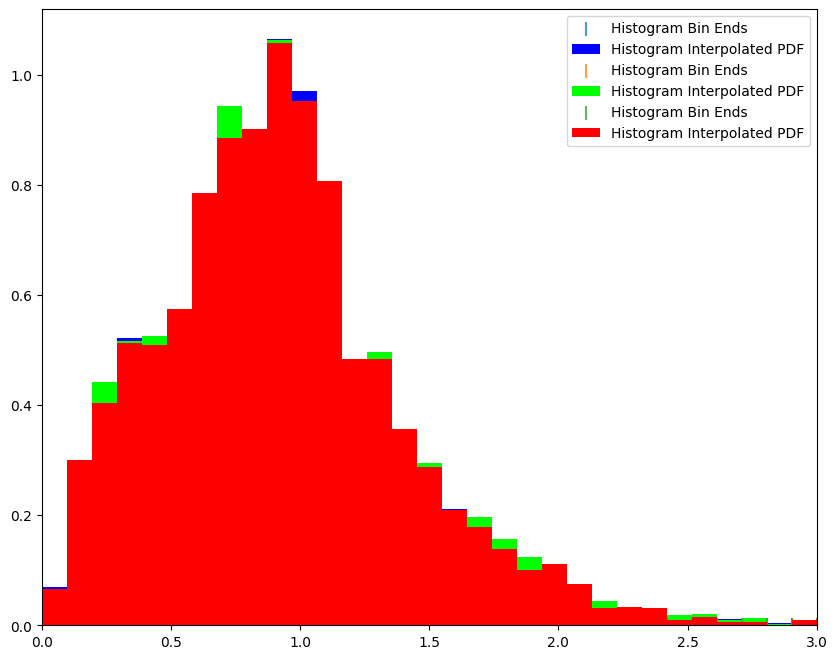

NZDir as a Pipeline
===================

**Author:** Sam Schmidt

**Last successfully run:** April 26, 2023

.. code:: ipython3

    import os
    import rail
    import qp
    import numpy as np
    import pandas as pd
    import matplotlib.pyplot as plt
    %matplotlib inline
    from rail.estimation.algos.nz_dir import NZDirInformer, NZDirSummarizer
    from rail.core.data import TableHandle, QPHandle
    from rail.core.stage import RailStage

.. code:: ipython3

    DS = RailStage.data_store
    DS.__class__.allow_overwrite = True

.. code:: ipython3

    # Load up the example healpix 9816 data and stick in the DataStore
    from rail.utils.path_utils import find_rail_file
    trainFile = find_rail_file('examples_data/testdata/test_dc2_training_9816.hdf5')
    testFile = find_rail_file('examples_data/testdata/test_dc2_validation_9816.hdf5')
    training_data = DS.read_file("training_data", TableHandle, trainFile)
    test_data = DS.read_file("test_data", TableHandle, testFile)

.. code:: ipython3

    inf_nz = NZDirInformer.make_stage(n_neigh=8, hdf5_groupname="photometry", model="nzdir_model.pkl")
    inf_nz.inform(training_data)
    nzd = NZDirSummarizer.make_stage(leafsize=20, zmin=0.0, zmax=3.0, nzbins=31, model="NZDir_model.pkl", hdf5_groupname='photometry',
                           output='NZDir_samples.hdf5', single_NZ='NZDir_NZ.hdf5')

.. parsed-literal::

    Inserting handle into data store.  model: inprogress_nzdir_model.pkl, NZDirInformer

.. code:: ipython3

    # I don't know why it is necessary to execute this estimate once before saving everything to a pipeline
    nzd_res = nzd.estimate(test_data)

.. parsed-literal::

    Process 0 running estimator on chunk 0 - 10000
    Inserting handle into data store.  single_NZ: inprogress_NZDir_NZ.hdf5, NZDirSummarizer
    Inserting handle into data store.  output: inprogress_NZDir_samples.hdf5, NZDirSummarizer
    Process 0 running estimator on chunk 10000 - 20000

.. parsed-literal::

    Process 0 running estimator on chunk 20000 - 20449

Creating a pipeline with 2 process

.. code:: ipython3

    import ceci
    pipe = ceci.Pipeline.interactive()
    stages = [inf_nz,nzd]
    for stage in stages:
        pipe.add_stage(stage)
    pipe.stage_execution_config['NZDirSummarizer'].nprocess=2

.. code:: ipython3

    pipe.initialize(dict(training_data=trainFile, test_data=testFile) , dict(output_dir='.', log_dir='.', resume=False), None)

.. parsed-literal::

    (({'NZDirInformer': <Job NZDirInformer>,
       'NZDirSummarizer': <Job NZDirSummarizer>},
      [<rail.estimation.algos.nz_dir.NZDirInformer at 0x7fcd307689d0>,
       <rail.estimation.algos.nz_dir.NZDirSummarizer at 0x7fccda4d5f00>]),
     {'output_dir': '.', 'log_dir': '.', 'resume': False})

.. code:: ipython3

    pipe.save('nzdir.yml')

Once the pipeline is saved, we execute it

.. code:: ipython3

    pr = ceci.Pipeline.read('nzdir.yml')

.. code:: ipython3

    pr.run()

.. parsed-literal::

    
    Executing NZDirInformer
    Command is:
    OMP_NUM_THREADS=1   python3 -m ceci rail.estimation.algos.nz_dir.NZDirInformer   --input=/opt/hostedtoolcache/Python/3.10.17/x64/lib/python3.10/site-packages/rail/examples_data/testdata/test_dc2_training_9816.hdf5   --config=nzdir_config.yml   --model=./nzdir_model.pkl 
    Output writing to ./NZDirInformer.out
    

.. parsed-literal::

    Job NZDirInformer has completed successfully in 3.0 seconds seconds !

.. parsed-literal::

    
    Executing NZDirSummarizer
    Command is:
    OMP_NUM_THREADS=1  mpirun -n 2 python3 -m ceci rail.estimation.algos.nz_dir.NZDirSummarizer   --model=./nzdir_model.pkl   --input=/opt/hostedtoolcache/Python/3.10.17/x64/lib/python3.10/site-packages/rail/examples_data/testdata/test_dc2_validation_9816.hdf5   --config=nzdir_config.yml   --output=./NZDir_samples.hdf5   --single_NZ=./NZDir_NZ.hdf5 --mpi
    Output writing to ./NZDirSummarizer.out
    

.. parsed-literal::

    Job NZDirSummarizer has failed with status 127

.. parsed-literal::

    
    *************************************************
    Error running pipeline stage NZDirSummarizer.
    Failed after 3.0 seconds.
    
    Standard output and error streams in ./NZDirSummarizer.out
    *************************************************

.. parsed-literal::

    1

Reading the output

.. code:: ipython3

    nzd_ens = qp.read('NZDir_samples.hdf5')
    nzdir_nz = qp.read("NZDir_NZ.hdf5")

.. code:: ipython3

    fig, axs = plt.subplots(figsize=(10,8))
    nzdir_nz[0].plot_native(axes=axs, fc = [0, 0, 1, 0.01])
    nzd_ens[1].plot_native(axes=axs, fc = [0, 1, 0, 0.01])
    nzd_ens[4].plot_native(axes=axs, fc = [1, 0, 0, 0.01])
    axs.set_xlim(0,3)
    axs.legend()

.. parsed-literal::

    <matplotlib.legend.Legend at 0x7fccd7f81810>

