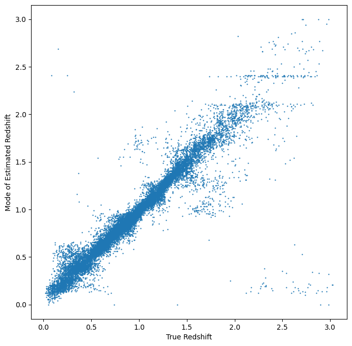

PZFlow Informer and Estimator Demo

Author: Tianqing Zhang

.. code:: ipython3

    %matplotlib inline
    import os
    import matplotlib.pyplot as plt
    import numpy as np
    import pandas as pd
    
    import rail
    from rail.core.data import TableHandle
    from rail.core.stage import RailStage
    import qp
    import tables_io
    
    from rail.estimation.algos.pzflow_nf import PZFlowInformer, PZFlowEstimator

.. code:: ipython3

    DS = RailStage.data_store
    DS.__class__.allow_overwrite = True

.. code:: ipython3

    from rail.utils.path_utils import find_rail_file
    trainFile = find_rail_file('examples_data/testdata/test_dc2_training_9816.hdf5')
    testFile = find_rail_file('examples_data/testdata/test_dc2_validation_9816.hdf5')
    training_data = DS.read_file("training_data", TableHandle, trainFile)
    test_data = DS.read_file("test_data", TableHandle, testFile)

.. code:: ipython3

    pzflow_dict = dict(hdf5_groupname='photometry',output_mode = 'not_fiducial' )

.. code:: ipython3

    
    # epoch = 200 gives a reasonable converged loss
    pzflow_train = PZFlowInformer.make_stage(name='inform_pzflow',model='demo_pzflow.pkl',num_training_epochs = 30, **pzflow_dict)

.. code:: ipython3

    # training of the pzflow
    pzflow_train.inform(training_data)

.. parsed-literal::

    Inserting handle into data store.  input: None, inform_pzflow

.. parsed-literal::

    Training 30 epochs 
    Loss:

.. parsed-literal::

    (0) 37.3273

.. parsed-literal::

    (1) 9.1679

.. parsed-literal::

    (2) 6.4489

.. parsed-literal::

    (3) 4.7060

.. parsed-literal::

    (4) 3.4757

.. parsed-literal::

    (5) 3.0395

.. parsed-literal::

    (6) 2.4205

.. parsed-literal::

    (7) 1.8210

.. parsed-literal::

    (8) 1.7583

.. parsed-literal::

    (9) 1.2419

.. parsed-literal::

    (10) 0.9476

.. parsed-literal::

    (11) 0.7195

.. parsed-literal::

    (12) 0.6141

.. parsed-literal::

    (13) 0.4739

.. parsed-literal::

    (14) 0.3886

.. parsed-literal::

    (15) 0.3899

.. parsed-literal::

    (16) 0.1482

.. parsed-literal::

    (17) 0.1622

.. parsed-literal::

    (18) 0.4439

.. parsed-literal::

    (19) 0.0236

.. parsed-literal::

    (20) 0.4557

.. parsed-literal::

    (21) 0.5141

.. parsed-literal::

    (22) 0.0444

.. parsed-literal::

    (23) 0.1235

.. parsed-literal::

    (24) -0.2529

.. parsed-literal::

    (25) -0.2421

.. parsed-literal::

    (26) -0.3549

.. parsed-literal::

    (27) -0.3631

.. parsed-literal::

    (28) -0.3917

.. parsed-literal::

    (29) -0.4974

.. parsed-literal::

    (30) -0.5397

.. parsed-literal::

    Inserting handle into data store.  model_inform_pzflow: inprogress_demo_pzflow.pkl, inform_pzflow

.. parsed-literal::

    <rail.tools.flow_handle.FlowHandle at 0x7fe31cb79c00>

.. code:: ipython3

    pzflow_dict = dict(hdf5_groupname='photometry')
    
    pzflow_estimator = PZFlowEstimator.make_stage(name='estimate_pzflow',model='demo_pzflow.pkl',**pzflow_dict, chunk_size = 20000)

.. code:: ipython3

    # estimate using the test data
    estimate_results = pzflow_estimator.estimate(test_data)

.. parsed-literal::

    Inserting handle into data store.  model: demo_pzflow.pkl, estimate_pzflow
    Process 0 running estimator on chunk 0 - 20,000

.. parsed-literal::

    /opt/hostedtoolcache/Python/3.10.18/x64/lib/python3.10/site-packages/qp/parameterizations/interp/interp.py:187: UserWarning: The distributions at indices = [ 6919 17601] have an integral of 0.
      warnings.warn(
    /opt/hostedtoolcache/Python/3.10.18/x64/lib/python3.10/site-packages/qp/parameterizations/interp/interp.py:207: RuntimeWarning: invalid value encountered in divide
      new_yvals = (self._yvals.T / self._ycumul[:, -1]).T
    /opt/hostedtoolcache/Python/3.10.18/x64/lib/python3.10/site-packages/qp/parameterizations/interp/interp.py:208: RuntimeWarning: invalid value encountered in divide
      self._ycumul = (self._ycumul.T / self._ycumul[:, -1]).T
    /opt/hostedtoolcache/Python/3.10.18/x64/lib/python3.10/site-packages/qp/parameterizations/interp/interp.py:140: RuntimeWarning: There are non-finite values in the yvals for the following distributions: (array([ 6919,  6919,  6919,  6919,  6919,  6919,  6919,  6919,  6919,
            6919,  6919,  6919,  6919,  6919,  6919,  6919,  6919,  6919,
            6919,  6919,  6919,  6919,  6919,  6919,  6919,  6919,  6919,
            6919,  6919,  6919,  6919,  6919,  6919,  6919,  6919,  6919,
            6919,  6919,  6919,  6919,  6919,  6919,  6919,  6919,  6919,
            6919,  6919,  6919,  6919,  6919,  6919,  6919,  6919,  6919,
            6919,  6919,  6919,  6919,  6919,  6919,  6919,  6919,  6919,
            6919,  6919,  6919,  6919,  6919,  6919,  6919,  6919,  6919,
            6919,  6919,  6919,  6919,  6919,  6919,  6919,  6919,  6919,
            6919,  6919,  6919,  6919,  6919,  6919,  6919,  6919,  6919,
            6919,  6919,  6919,  6919,  6919,  6919,  6919,  6919,  6919,
            6919,  6919,  6919,  6919,  6919,  6919,  6919,  6919,  6919,
            6919,  6919,  6919,  6919,  6919,  6919,  6919,  6919,  6919,
            6919,  6919,  6919,  6919,  6919,  6919,  6919,  6919,  6919,
            6919,  6919,  6919,  6919,  6919,  6919,  6919,  6919,  6919,
            6919,  6919,  6919,  6919,  6919,  6919,  6919,  6919,  6919,
            6919,  6919,  6919,  6919,  6919,  6919,  6919,  6919,  6919,
            6919,  6919,  6919,  6919,  6919,  6919,  6919,  6919,  6919,
            6919,  6919,  6919,  6919,  6919,  6919,  6919,  6919,  6919,
            6919,  6919,  6919,  6919,  6919,  6919,  6919,  6919,  6919,
            6919,  6919,  6919,  6919,  6919,  6919,  6919,  6919,  6919,
            6919,  6919,  6919,  6919,  6919,  6919,  6919,  6919,  6919,
            6919,  6919,  6919,  6919,  6919,  6919,  6919,  6919,  6919,
            6919,  6919,  6919,  6919,  6919,  6919,  6919,  6919,  6919,
            6919,  6919,  6919,  6919,  6919,  6919,  6919,  6919,  6919,
            6919,  6919,  6919,  6919,  6919,  6919,  6919,  6919,  6919,
            6919,  6919,  6919,  6919,  6919,  6919,  6919,  6919,  6919,
            6919,  6919,  6919,  6919,  6919,  6919,  6919,  6919,  6919,
            6919,  6919,  6919,  6919,  6919,  6919,  6919,  6919,  6919,
            6919,  6919,  6919,  6919,  6919,  6919,  6919,  6919,  6919,
            6919,  6919,  6919,  6919,  6919,  6919,  6919,  6919,  6919,
            6919,  6919,  6919,  6919,  6919,  6919,  6919,  6919,  6919,
            6919,  6919,  6919,  6919,  6919,  6919,  6919,  6919,  6919,
            6919,  6919,  6919,  6919, 17601, 17601, 17601, 17601, 17601,
           17601, 17601, 17601, 17601, 17601, 17601, 17601, 17601, 17601,
           17601, 17601, 17601, 17601, 17601, 17601, 17601, 17601, 17601,
           17601, 17601, 17601, 17601, 17601, 17601, 17601, 17601, 17601,
           17601, 17601, 17601, 17601, 17601, 17601, 17601, 17601, 17601,
           17601, 17601, 17601, 17601, 17601, 17601, 17601, 17601, 17601,
           17601, 17601, 17601, 17601, 17601, 17601, 17601, 17601, 17601,
           17601, 17601, 17601, 17601, 17601, 17601, 17601, 17601, 17601,
           17601, 17601, 17601, 17601, 17601, 17601, 17601, 17601, 17601,
           17601, 17601, 17601, 17601, 17601, 17601, 17601, 17601, 17601,
           17601, 17601, 17601, 17601, 17601, 17601, 17601, 17601, 17601,
           17601, 17601, 17601, 17601, 17601, 17601, 17601, 17601, 17601,
           17601, 17601, 17601, 17601, 17601, 17601, 17601, 17601, 17601,
           17601, 17601, 17601, 17601, 17601, 17601, 17601, 17601, 17601,
           17601, 17601, 17601, 17601, 17601, 17601, 17601, 17601, 17601,
           17601, 17601, 17601, 17601, 17601, 17601, 17601, 17601, 17601,
           17601, 17601, 17601, 17601, 17601, 17601, 17601, 17601, 17601,
           17601, 17601, 17601, 17601, 17601, 17601, 17601, 17601, 17601,
           17601, 17601, 17601, 17601, 17601, 17601, 17601, 17601, 17601,
           17601, 17601, 17601, 17601, 17601, 17601, 17601, 17601, 17601,
           17601, 17601, 17601, 17601, 17601, 17601, 17601, 17601, 17601,
           17601, 17601, 17601, 17601, 17601, 17601, 17601, 17601, 17601,
           17601, 17601, 17601, 17601, 17601, 17601, 17601, 17601, 17601,
           17601, 17601, 17601, 17601, 17601, 17601, 17601, 17601, 17601,
           17601, 17601, 17601, 17601, 17601, 17601, 17601, 17601, 17601,
           17601, 17601, 17601, 17601, 17601, 17601, 17601, 17601, 17601,
           17601, 17601, 17601, 17601, 17601, 17601, 17601, 17601, 17601,
           17601, 17601, 17601, 17601, 17601, 17601, 17601, 17601, 17601,
           17601, 17601, 17601, 17601, 17601, 17601, 17601, 17601, 17601,
           17601, 17601, 17601, 17601, 17601, 17601, 17601, 17601, 17601,
           17601, 17601, 17601, 17601, 17601, 17601, 17601, 17601, 17601,
           17601, 17601, 17601, 17601, 17601, 17601, 17601, 17601, 17601,
           17601, 17601, 17601, 17601, 17601, 17601, 17601, 17601, 17601,
           17601, 17601, 17601, 17601, 17601, 17601, 17601, 17601]), array([  0,   1,   2,   3,   4,   5,   6,   7,   8,   9,  10,  11,  12,
            13,  14,  15,  16,  17,  18,  19,  20,  21,  22,  23,  24,  25,
            26,  27,  28,  29,  30,  31,  32,  33,  34,  35,  36,  37,  38,
            39,  40,  41,  42,  43,  44,  45,  46,  47,  48,  49,  50,  51,
            52,  53,  54,  55,  56,  57,  58,  59,  60,  61,  62,  63,  64,
            65,  66,  67,  68,  69,  70,  71,  72,  73,  74,  75,  76,  77,
            78,  79,  80,  81,  82,  83,  84,  85,  86,  87,  88,  89,  90,
            91,  92,  93,  94,  95,  96,  97,  98,  99, 100, 101, 102, 103,
           104, 105, 106, 107, 108, 109, 110, 111, 112, 113, 114, 115, 116,
           117, 118, 119, 120, 121, 122, 123, 124, 125, 126, 127, 128, 129,
           130, 131, 132, 133, 134, 135, 136, 137, 138, 139, 140, 141, 142,
           143, 144, 145, 146, 147, 148, 149, 150, 151, 152, 153, 154, 155,
           156, 157, 158, 159, 160, 161, 162, 163, 164, 165, 166, 167, 168,
           169, 170, 171, 172, 173, 174, 175, 176, 177, 178, 179, 180, 181,
           182, 183, 184, 185, 186, 187, 188, 189, 190, 191, 192, 193, 194,
           195, 196, 197, 198, 199, 200, 201, 202, 203, 204, 205, 206, 207,
           208, 209, 210, 211, 212, 213, 214, 215, 216, 217, 218, 219, 220,
           221, 222, 223, 224, 225, 226, 227, 228, 229, 230, 231, 232, 233,
           234, 235, 236, 237, 238, 239, 240, 241, 242, 243, 244, 245, 246,
           247, 248, 249, 250, 251, 252, 253, 254, 255, 256, 257, 258, 259,
           260, 261, 262, 263, 264, 265, 266, 267, 268, 269, 270, 271, 272,
           273, 274, 275, 276, 277, 278, 279, 280, 281, 282, 283, 284, 285,
           286, 287, 288, 289, 290, 291, 292, 293, 294, 295, 296, 297, 298,
           299, 300,   0,   1,   2,   3,   4,   5,   6,   7,   8,   9,  10,
            11,  12,  13,  14,  15,  16,  17,  18,  19,  20,  21,  22,  23,
            24,  25,  26,  27,  28,  29,  30,  31,  32,  33,  34,  35,  36,
            37,  38,  39,  40,  41,  42,  43,  44,  45,  46,  47,  48,  49,
            50,  51,  52,  53,  54,  55,  56,  57,  58,  59,  60,  61,  62,
            63,  64,  65,  66,  67,  68,  69,  70,  71,  72,  73,  74,  75,
            76,  77,  78,  79,  80,  81,  82,  83,  84,  85,  86,  87,  88,
            89,  90,  91,  92,  93,  94,  95,  96,  97,  98,  99, 100, 101,
           102, 103, 104, 105, 106, 107, 108, 109, 110, 111, 112, 113, 114,
           115, 116, 117, 118, 119, 120, 121, 122, 123, 124, 125, 126, 127,
           128, 129, 130, 131, 132, 133, 134, 135, 136, 137, 138, 139, 140,
           141, 142, 143, 144, 145, 146, 147, 148, 149, 150, 151, 152, 153,
           154, 155, 156, 157, 158, 159, 160, 161, 162, 163, 164, 165, 166,
           167, 168, 169, 170, 171, 172, 173, 174, 175, 176, 177, 178, 179,
           180, 181, 182, 183, 184, 185, 186, 187, 188, 189, 190, 191, 192,
           193, 194, 195, 196, 197, 198, 199, 200, 201, 202, 203, 204, 205,
           206, 207, 208, 209, 210, 211, 212, 213, 214, 215, 216, 217, 218,
           219, 220, 221, 222, 223, 224, 225, 226, 227, 228, 229, 230, 231,
           232, 233, 234, 235, 236, 237, 238, 239, 240, 241, 242, 243, 244,
           245, 246, 247, 248, 249, 250, 251, 252, 253, 254, 255, 256, 257,
           258, 259, 260, 261, 262, 263, 264, 265, 266, 267, 268, 269, 270,
           271, 272, 273, 274, 275, 276, 277, 278, 279, 280, 281, 282, 283,
           284, 285, 286, 287, 288, 289, 290, 291, 292, 293, 294, 295, 296,
           297, 298, 299, 300]))
      warnings.warn(

.. parsed-literal::

    Inserting handle into data store.  output_estimate_pzflow: inprogress_output_estimate_pzflow.hdf5, estimate_pzflow
    Process 0 running estimator on chunk 20,000 - 20,449

.. parsed-literal::

    /opt/hostedtoolcache/Python/3.10.18/x64/lib/python3.10/site-packages/qp/parameterizations/interp/interp.py:140: RuntimeWarning: There are non-finite values in the yvals for the following distributions: (array([ 6919,  6919,  6919,  6919,  6919,  6919,  6919,  6919,  6919,
            6919,  6919,  6919,  6919,  6919,  6919,  6919,  6919,  6919,
            6919,  6919,  6919,  6919,  6919,  6919,  6919,  6919,  6919,
            6919,  6919,  6919,  6919,  6919,  6919,  6919,  6919,  6919,
            6919,  6919,  6919,  6919,  6919,  6919,  6919,  6919,  6919,
            6919,  6919,  6919,  6919,  6919,  6919,  6919,  6919,  6919,
            6919,  6919,  6919,  6919,  6919,  6919,  6919,  6919,  6919,
            6919,  6919,  6919,  6919,  6919,  6919,  6919,  6919,  6919,
            6919,  6919,  6919,  6919,  6919,  6919,  6919,  6919,  6919,
            6919,  6919,  6919,  6919,  6919,  6919,  6919,  6919,  6919,
            6919,  6919,  6919,  6919,  6919,  6919,  6919,  6919,  6919,
            6919,  6919,  6919,  6919,  6919,  6919,  6919,  6919,  6919,
            6919,  6919,  6919,  6919,  6919,  6919,  6919,  6919,  6919,
            6919,  6919,  6919,  6919,  6919,  6919,  6919,  6919,  6919,
            6919,  6919,  6919,  6919,  6919,  6919,  6919,  6919,  6919,
            6919,  6919,  6919,  6919,  6919,  6919,  6919,  6919,  6919,
            6919,  6919,  6919,  6919,  6919,  6919,  6919,  6919,  6919,
            6919,  6919,  6919,  6919,  6919,  6919,  6919,  6919,  6919,
            6919,  6919,  6919,  6919,  6919,  6919,  6919,  6919,  6919,
            6919,  6919,  6919,  6919,  6919,  6919,  6919,  6919,  6919,
            6919,  6919,  6919,  6919,  6919,  6919,  6919,  6919,  6919,
            6919,  6919,  6919,  6919,  6919,  6919,  6919,  6919,  6919,
            6919,  6919,  6919,  6919,  6919,  6919,  6919,  6919,  6919,
            6919,  6919,  6919,  6919,  6919,  6919,  6919,  6919,  6919,
            6919,  6919,  6919,  6919,  6919,  6919,  6919,  6919,  6919,
            6919,  6919,  6919,  6919,  6919,  6919,  6919,  6919,  6919,
            6919,  6919,  6919,  6919,  6919,  6919,  6919,  6919,  6919,
            6919,  6919,  6919,  6919,  6919,  6919,  6919,  6919,  6919,
            6919,  6919,  6919,  6919,  6919,  6919,  6919,  6919,  6919,
            6919,  6919,  6919,  6919,  6919,  6919,  6919,  6919,  6919,
            6919,  6919,  6919,  6919,  6919,  6919,  6919,  6919,  6919,
            6919,  6919,  6919,  6919,  6919,  6919,  6919,  6919,  6919,
            6919,  6919,  6919,  6919,  6919,  6919,  6919,  6919,  6919,
            6919,  6919,  6919,  6919, 17601, 17601, 17601, 17601, 17601,
           17601, 17601, 17601, 17601, 17601, 17601, 17601, 17601, 17601,
           17601, 17601, 17601, 17601, 17601, 17601, 17601, 17601, 17601,
           17601, 17601, 17601, 17601, 17601, 17601, 17601, 17601, 17601,
           17601, 17601, 17601, 17601, 17601, 17601, 17601, 17601, 17601,
           17601, 17601, 17601, 17601, 17601, 17601, 17601, 17601, 17601,
           17601, 17601, 17601, 17601, 17601, 17601, 17601, 17601, 17601,
           17601, 17601, 17601, 17601, 17601, 17601, 17601, 17601, 17601,
           17601, 17601, 17601, 17601, 17601, 17601, 17601, 17601, 17601,
           17601, 17601, 17601, 17601, 17601, 17601, 17601, 17601, 17601,
           17601, 17601, 17601, 17601, 17601, 17601, 17601, 17601, 17601,
           17601, 17601, 17601, 17601, 17601, 17601, 17601, 17601, 17601,
           17601, 17601, 17601, 17601, 17601, 17601, 17601, 17601, 17601,
           17601, 17601, 17601, 17601, 17601, 17601, 17601, 17601, 17601,
           17601, 17601, 17601, 17601, 17601, 17601, 17601, 17601, 17601,
           17601, 17601, 17601, 17601, 17601, 17601, 17601, 17601, 17601,
           17601, 17601, 17601, 17601, 17601, 17601, 17601, 17601, 17601,
           17601, 17601, 17601, 17601, 17601, 17601, 17601, 17601, 17601,
           17601, 17601, 17601, 17601, 17601, 17601, 17601, 17601, 17601,
           17601, 17601, 17601, 17601, 17601, 17601, 17601, 17601, 17601,
           17601, 17601, 17601, 17601, 17601, 17601, 17601, 17601, 17601,
           17601, 17601, 17601, 17601, 17601, 17601, 17601, 17601, 17601,
           17601, 17601, 17601, 17601, 17601, 17601, 17601, 17601, 17601,
           17601, 17601, 17601, 17601, 17601, 17601, 17601, 17601, 17601,
           17601, 17601, 17601, 17601, 17601, 17601, 17601, 17601, 17601,
           17601, 17601, 17601, 17601, 17601, 17601, 17601, 17601, 17601,
           17601, 17601, 17601, 17601, 17601, 17601, 17601, 17601, 17601,
           17601, 17601, 17601, 17601, 17601, 17601, 17601, 17601, 17601,
           17601, 17601, 17601, 17601, 17601, 17601, 17601, 17601, 17601,
           17601, 17601, 17601, 17601, 17601, 17601, 17601, 17601, 17601,
           17601, 17601, 17601, 17601, 17601, 17601, 17601, 17601, 17601,
           17601, 17601, 17601, 17601, 17601, 17601, 17601, 17601, 17601,
           17601, 17601, 17601, 17601, 17601, 17601, 17601, 17601, 17601,
           17601, 17601, 17601, 17601, 17601, 17601, 17601, 17601]), array([  0,   1,   2,   3,   4,   5,   6,   7,   8,   9,  10,  11,  12,
            13,  14,  15,  16,  17,  18,  19,  20,  21,  22,  23,  24,  25,
            26,  27,  28,  29,  30,  31,  32,  33,  34,  35,  36,  37,  38,
            39,  40,  41,  42,  43,  44,  45,  46,  47,  48,  49,  50,  51,
            52,  53,  54,  55,  56,  57,  58,  59,  60,  61,  62,  63,  64,
            65,  66,  67,  68,  69,  70,  71,  72,  73,  74,  75,  76,  77,
            78,  79,  80,  81,  82,  83,  84,  85,  86,  87,  88,  89,  90,
            91,  92,  93,  94,  95,  96,  97,  98,  99, 100, 101, 102, 103,
           104, 105, 106, 107, 108, 109, 110, 111, 112, 113, 114, 115, 116,
           117, 118, 119, 120, 121, 122, 123, 124, 125, 126, 127, 128, 129,
           130, 131, 132, 133, 134, 135, 136, 137, 138, 139, 140, 141, 142,
           143, 144, 145, 146, 147, 148, 149, 150, 151, 152, 153, 154, 155,
           156, 157, 158, 159, 160, 161, 162, 163, 164, 165, 166, 167, 168,
           169, 170, 171, 172, 173, 174, 175, 176, 177, 178, 179, 180, 181,
           182, 183, 184, 185, 186, 187, 188, 189, 190, 191, 192, 193, 194,
           195, 196, 197, 198, 199, 200, 201, 202, 203, 204, 205, 206, 207,
           208, 209, 210, 211, 212, 213, 214, 215, 216, 217, 218, 219, 220,
           221, 222, 223, 224, 225, 226, 227, 228, 229, 230, 231, 232, 233,
           234, 235, 236, 237, 238, 239, 240, 241, 242, 243, 244, 245, 246,
           247, 248, 249, 250, 251, 252, 253, 254, 255, 256, 257, 258, 259,
           260, 261, 262, 263, 264, 265, 266, 267, 268, 269, 270, 271, 272,
           273, 274, 275, 276, 277, 278, 279, 280, 281, 282, 283, 284, 285,
           286, 287, 288, 289, 290, 291, 292, 293, 294, 295, 296, 297, 298,
           299, 300,   0,   1,   2,   3,   4,   5,   6,   7,   8,   9,  10,
            11,  12,  13,  14,  15,  16,  17,  18,  19,  20,  21,  22,  23,
            24,  25,  26,  27,  28,  29,  30,  31,  32,  33,  34,  35,  36,
            37,  38,  39,  40,  41,  42,  43,  44,  45,  46,  47,  48,  49,
            50,  51,  52,  53,  54,  55,  56,  57,  58,  59,  60,  61,  62,
            63,  64,  65,  66,  67,  68,  69,  70,  71,  72,  73,  74,  75,
            76,  77,  78,  79,  80,  81,  82,  83,  84,  85,  86,  87,  88,
            89,  90,  91,  92,  93,  94,  95,  96,  97,  98,  99, 100, 101,
           102, 103, 104, 105, 106, 107, 108, 109, 110, 111, 112, 113, 114,
           115, 116, 117, 118, 119, 120, 121, 122, 123, 124, 125, 126, 127,
           128, 129, 130, 131, 132, 133, 134, 135, 136, 137, 138, 139, 140,
           141, 142, 143, 144, 145, 146, 147, 148, 149, 150, 151, 152, 153,
           154, 155, 156, 157, 158, 159, 160, 161, 162, 163, 164, 165, 166,
           167, 168, 169, 170, 171, 172, 173, 174, 175, 176, 177, 178, 179,
           180, 181, 182, 183, 184, 185, 186, 187, 188, 189, 190, 191, 192,
           193, 194, 195, 196, 197, 198, 199, 200, 201, 202, 203, 204, 205,
           206, 207, 208, 209, 210, 211, 212, 213, 214, 215, 216, 217, 218,
           219, 220, 221, 222, 223, 224, 225, 226, 227, 228, 229, 230, 231,
           232, 233, 234, 235, 236, 237, 238, 239, 240, 241, 242, 243, 244,
           245, 246, 247, 248, 249, 250, 251, 252, 253, 254, 255, 256, 257,
           258, 259, 260, 261, 262, 263, 264, 265, 266, 267, 268, 269, 270,
           271, 272, 273, 274, 275, 276, 277, 278, 279, 280, 281, 282, 283,
           284, 285, 286, 287, 288, 289, 290, 291, 292, 293, 294, 295, 296,
           297, 298, 299, 300]))
      warnings.warn(

.. code:: ipython3

    mode = estimate_results.read(force=True).ancil['zmode']
    truth = np.array(test_data.data['photometry']['redshift'])

.. code:: ipython3

    # visualize the prediction. 
    plt.figure(figsize = (8,8))
    plt.scatter(truth, mode, s = 0.5)
    plt.xlabel('True Redshift')
    plt.ylabel('Mode of Estimated Redshift')

.. parsed-literal::

    Text(0, 0.5, 'Mode of Estimated Redshift')

