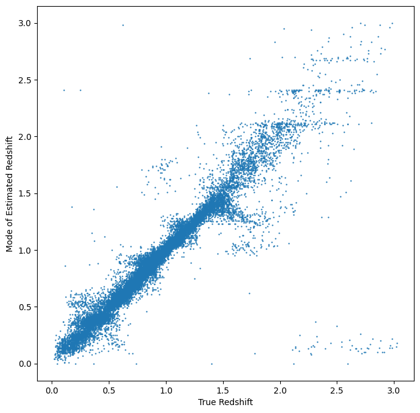

PZFlow Informer and Estimator Demo

Author: Tianqing Zhang

.. code:: ipython3

    %matplotlib inline
    import os
    import matplotlib.pyplot as plt
    import numpy as np
    import pandas as pd
    
    import rail
    from rail.core.data import TableHandle
    from rail.core.stage import RailStage
    import qp
    import tables_io
    
    from rail.estimation.algos.pzflow_nf import PZFlowInformer, PZFlowEstimator

.. code:: ipython3

    DS = RailStage.data_store
    DS.__class__.allow_overwrite = True

.. code:: ipython3

    from rail.utils.path_utils import find_rail_file
    trainFile = find_rail_file('examples_data/testdata/test_dc2_training_9816.hdf5')
    testFile = find_rail_file('examples_data/testdata/test_dc2_validation_9816.hdf5')
    training_data = DS.read_file("training_data", TableHandle, trainFile)
    test_data = DS.read_file("test_data", TableHandle, testFile)

.. code:: ipython3

    pzflow_dict = dict(hdf5_groupname='photometry',output_mode = 'not_fiducial' )

.. code:: ipython3

    
    # epoch = 200 gives a reasonable converged loss
    pzflow_train = PZFlowInformer.make_stage(name='inform_pzflow',model='demo_pzflow.pkl',num_training_epochs = 30, **pzflow_dict)

.. code:: ipython3

    # training of the pzflow
    pzflow_train.inform(training_data)

.. parsed-literal::

    Training 30 epochs 
    Loss:

.. parsed-literal::

    (0) 37.3273

.. parsed-literal::

    (1) 9.1676

.. parsed-literal::

    (2) 6.4447

.. parsed-literal::

    (3) 4.6352

.. parsed-literal::

    (4) 3.6721

.. parsed-literal::

    (5) 2.7108

.. parsed-literal::

    (6) 2.1987

.. parsed-literal::

    (7) 1.9756

.. parsed-literal::

    (8) 2.0567

.. parsed-literal::

    (9) 1.3983

.. parsed-literal::

    (10) 0.8625

.. parsed-literal::

    (11) 1.4191

.. parsed-literal::

    (12) 1.0998

.. parsed-literal::

    (13) 1.0022

.. parsed-literal::

    (14) 0.6951

.. parsed-literal::

    (15) 0.5534

.. parsed-literal::

    (16) 0.2914

.. parsed-literal::

    (17) 0.0675

.. parsed-literal::

    (18) 0.6496

.. parsed-literal::

    (19) 0.4512

.. parsed-literal::

    (20) -0.1057

.. parsed-literal::

    (21) -0.0546

.. parsed-literal::

    (22) -0.2515

.. parsed-literal::

    (23) -0.3659

.. parsed-literal::

    (24) -0.1334

.. parsed-literal::

    (25) -0.2298

.. parsed-literal::

    (26) 0.2135

.. parsed-literal::

    (27) -0.4265

.. parsed-literal::

    (28) -0.1709

.. parsed-literal::

    (29) 0.4959

.. parsed-literal::

    (30) -0.2889

.. parsed-literal::

    Inserting handle into data store.  model_inform_pzflow: inprogress_demo_pzflow.pkl, inform_pzflow

.. parsed-literal::

    <rail.tools.flow_handle.FlowHandle at 0x7f42bee8e740>

.. code:: ipython3

    pzflow_dict = dict(hdf5_groupname='photometry')
    
    pzflow_estimator = PZFlowEstimator.make_stage(name='estimate_pzflow',model='demo_pzflow.pkl',**pzflow_dict, chunk_size = 20000)

.. code:: ipython3

    # estimate using the test data
    estimate_results = pzflow_estimator.estimate(test_data)

.. parsed-literal::

    Inserting handle into data store.  model: demo_pzflow.pkl, estimate_pzflow
    Process 0 running estimator on chunk 0 - 20000

.. parsed-literal::

    /opt/hostedtoolcache/Python/3.10.16/x64/lib/python3.10/site-packages/qp/interp_pdf.py:89: RuntimeWarning: invalid value encountered in divide
      self._ycumul = (self._ycumul.T / self._ycumul[:, -1]).T

.. parsed-literal::

    Inserting handle into data store.  output_estimate_pzflow: inprogress_output_estimate_pzflow.hdf5, estimate_pzflow
    Process 0 running estimator on chunk 20000 - 20449

.. code:: ipython3

    mode = estimate_results.read(force=True).ancil['zmode']
    truth = np.array(test_data.data['photometry']['redshift'])

.. code:: ipython3

    # visualize the prediction. 
    plt.figure(figsize = (8,8))
    plt.scatter(truth, mode, s = 0.5)
    plt.xlabel('True Redshift')
    plt.ylabel('Mode of Estimated Redshift')

.. parsed-literal::

    Text(0, 0.5, 'Mode of Estimated Redshift')

