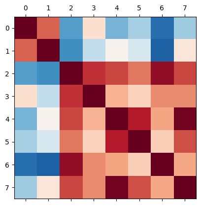

Clustering redshifts with *yet_another_wizz*
============================================

This notebooks summarises the steps to compute clustering redshifts for
an unknown sample of galaxies using a reference sample with known
redshifts. Additionally, a correction for the galaxy bias of the
reference sample is applied (see Eqs. 17 & 20 in `van den Busch et
al. 2020 <https://arxiv.org/pdf/2007.01846>`__).

This involves a number of steps (see schema below): 1. Preparing the
input data (creating randoms, applying masks; simplfied here). 2.
Splitting the data into spatial patches and cache them on disk for
faster access. 3. Computing the autocorrelation function amplitude
:math:`w_{\rm ss}(z)`, used as correction for the galaxy bias 4.
Computing the cross-correlation function amplitude
:math:`w_{\rm sp}(z)`, which is the biased redshift estimate. 5.
Summarising the result by correcting for the refernece sample bias and
producing a redshift estimate (not a PDF!).

**Note:** The cached data must be removed manually since its lifetime
can currently not be handled by RAIL.

The aim of this notebook is to **give an overview of the wrapper
functionality**, including a summary of all currently implemented
optional parameters (commented). It is not meant to be a demonstaration
of the performance of *yet_another_wizz* since the example data used
here is very small and the resulting signal-to-noise ratio is quite
poor.

.. code:: ipython3

    import matplotlib.pyplot as plt
    
    from rail.core.data import TableHandle, Hdf5Handle
    
    # configure RAIL datastore to allow overwriting data
    from rail.core.stage import RailStage
    DS = RailStage.data_store
    DS.__class__.allow_overwrite = True

.. code:: ipython3

    # step 1
    from yaw.randoms import BoxRandoms
    from rail.yaw_rail.utils import get_dc2_test_data
    
    from rail.estimation.algos.cc_yaw import (
        create_yaw_cache_alias,  # utility for YawCacheCreate
        YawCacheCreate,     # step 2
        YawAutoCorrelate,   # step 3
        YawCrossCorrelate,  # step 4
        YawSummarize,       # step 5
    )  # equivalent: from rail.yaw_rail import *

.. code:: ipython3

    VERBOSE = "debug"  # verbosity level of built-in logger, disable with "error"

1. Data preparation
-------------------

Since this is a simple example, we are not going into the details of
creating realistic randoms and properly masking the reference and
unknown data to a shared footprint on sky. Instead, we are using a
simulated dataset that serves as both, reference and unknown sample.

First, we download the small test dataset derived from 25 sqdeg of DC2,
containing 100k objects on a limited redshift range of
:math:`0.2 < z < 1.8`. We add the data as new handle to the datastore.

.. code:: ipython3

    test_data = get_dc2_test_data()  # downloads test data, cached for future calls
    redshifts = test_data["z"].to_numpy()
    zmin = redshifts.min()
    zmax = redshifts.max()
    n_data = len(test_data)
    print(f"N={n_data}, {zmin:.1f}<z<{zmax:.1f}")
    
    handle_test_data = DS.add_data("input_data", test_data, Hdf5Handle)

.. parsed-literal::

    N=100000, 0.2<z<1.8

Next we generate a x10 enhanced uniform random dataset for the test data
constrained to its rectangular footprint. We add redshifts by cloning
the redshift column ``"z"`` of the dataset. We add the randoms as new
handle to the datastore.

.. code:: ipython3

    generator = BoxRandoms(
        test_data["ra"].min(),
        test_data["ra"].max(),
        test_data["dec"].min(),
        test_data["dec"].max(),
        redshifts=redshifts,
        seed=12345,
    )
    test_rand = generator.generate_dataframe(n_data * 10)
    test_rand.rename(columns=dict(redshifts="z"), inplace=True)
    
    handle_test_rand = DS.add_data("input_rand", test_rand, Hdf5Handle)

2. Splitting and caching the data
---------------------------------

This step is crucial to compute consistent clustering redshift
uncertainties. *yet_another_wizz* uses spatial (jackknife) resampling
and therefore, every input dataset must be split into the same exact
spatial regions/patches. To improve the parallel performance, the
datasets and randoms are pre-arranged into these patches and cached on
disk for better random patch-wise access. While this is slow for small
datasets, it is highly beneficial for large datasets with many patches
and/or memory constraints.

The RAIL wrapper uses manually specified cache directories, each of
which contains one dataset and optionally corresponding randoms. This
ensures that the patch centers are defined consistently. To create a new
cache, use the ``YawCacheCreate.create()`` method.

Note on names and aliasing in RAIL
~~~~~~~~~~~~~~~~~~~~~~~~~~~~~~~~~~

We need to create separate caches for the reference and the unknown
data, which means that we need to run the ``YawCacheCreate`` twice.
Since that creates name clashes in the RAIL datastore, we need to
properly alias the inputs (``data``/ ``rand``) and the output
(``cache``) by providing a dictionary for the ``aliases`` parameter when
calling the ``make_stage()``, e.g. by adding a unique suffix:

.. code:: ipython3

    name = "stage_name"
    aliases = dict(data="data_suffix", rand="rand_suffix", cache="cache_suffix")

There is a shorthand for convenience
(``from rail.yaw_rail.cache.AliasHelper``) that allows to generate this
dictionary by just providing a suffix name for the stage instance (see
example below).

.. code:: ipython3

    name = "stage_name"
    aliases = create_yaw_cache_alias("suffix")

The reference data
~~~~~~~~~~~~~~~~~~

To create a cache directory we must specify a ``path`` to the directory
at which the data will be cached. This directory must not exist yet. We
also have to specify a ``name`` for the stage to ensure that the
reference and unknown caches (see below) are properly aliased to be
distinguishable by the RAIL datastore.

Furthermore, a few basic column names that describe the tabular input
data must be provided. These are right ascension (``ra_name``) and
declination (``dec_name``), and in case of the reference sample also the
redshifts (``redshift_name``). Finally, the patches must be defined and
there are three ways to do so: 1. Stage parameter ``patch_file``: Read
the patch center coordinates from an ASCII file with pairs of
R.A/Dec. coordinates in radian. 2. Stage parameter ``patch_num``:
Generating a given number of patches from the object positions
(peferrably of the randoms if possible) using k-means clustering. 3.
Stage parameter ``patch_name``: Providing a column name in the input
table which contains patch indices (using 0-based indexing). 4. Stage
input ``patch_source``: Using the patch centers from a different cache
instance, given by a cache handle. When this input is provided it takes
precedence over any of the stage parameters above.

In this example we choose to auto-generate five patches. **In a more
realistic setup this number should be much larger**.

.. code:: ipython3

    stage_cache_ref = YawCacheCreate.make_stage(
        name="cache_ref",
        aliases=create_yaw_cache_alias("ref"),
        path="run/test_ref",
        overwrite=True,  # default: False
        ra_name="ra",
        dec_name="dec",
        redshift_name="z",
        # weight_name=None,
        # patch_name=None,
        patch_num=5,  # default: None
        # max_workers=None,
        verbose=VERBOSE,  # default: "info"
    )
    handle_cache_ref = stage_cache_ref.create(
        data=handle_test_data,
        rand=handle_test_rand,
        # patch_source=None,
    )

.. parsed-literal::

    Inserting handle into data store.  data_ref: None, cache_ref
    Inserting handle into data store.  rand_ref: None, cache_ref
    YAW | yet_another_wizz v3.1.2

.. parsed-literal::

    INF | running in multiprocessing environment with 2 workers

.. parsed-literal::

    Inserting handle into data store.  patch_source_ref: None, cache_ref
    INF | loading 1M records in 1 chunks from memory

.. parsed-literal::

    DBG | selecting input columns: ra, dec, z

.. parsed-literal::

    DBG | creating 5 patches

.. parsed-literal::

    INF | computing 5 patch centers from subset of 224K records

.. parsed-literal::

    DBG | running preprocessing on 2 workers

.. parsed-literal::

    INF | using cache directory: run/test_ref/rand

.. parsed-literal::

    INF | computing patch metadata

.. parsed-literal::

    DBG | running parallel jobs on 2 workers

.. parsed-literal::

    INF | loading 100K records in 1 chunks from memory

.. parsed-literal::

    DBG | selecting input columns: ra, dec, z

.. parsed-literal::

    DBG | applying 5 patches

.. parsed-literal::

    DBG | running preprocessing on 2 workers

.. parsed-literal::

    INF | using cache directory: run/test_ref/data

.. parsed-literal::

    INF | computing patch metadata

.. parsed-literal::

    DBG | running parallel jobs on 2 workers

.. parsed-literal::

    Inserting handle into data store.  output_cache_ref: inprogress_output_cache_ref.path, cache_ref

We can see from the log messages that *yet_another_wizz* processes the
randoms first and generates patch centers (``creating 5 patches``) and
then applies them to the dataset, which is processed last
(``applying 5 patches``). Caching the data can take considerable time
depending on the hardware and the number of patches.

The unknown data
~~~~~~~~~~~~~~~~

The same procedure for the unknown sample, however there are some small,
but important differences. We use a different ``path`` and ``name``, do
not specify the ``redshift_name`` (since we would not have this
information with real data), and here we chose to not provide any
randoms for the unknown sample and instead rely on the reference sample
randoms for cross-correlation measurements.

Most importantly, we must ensure that the patch centers are consistent
with the reference data and therefore provide the reference sample cache
as a stage input called ``patch_source``.

**Important:** Even if the reference and unknown data are the same as in
this specific case, the automatically generated patch centers are not
deterministic. We can see in the log messages that the code reports
``applying 5 patches``.

.. code:: ipython3

    stage_cache_unk = YawCacheCreate.make_stage(
        name="cache_unk",
        aliases=create_yaw_cache_alias("unk"),
        path="run/test_unk",
        overwrite=True,  # default: False
        ra_name="ra",
        dec_name="dec",
        # redshift_name=None,
        # weight_name=None,
        # patch_name=None,
        # patch_num=None,
        # max_workers=None,
        verbose=VERBOSE,  # default: "info"
    )
    handle_cache_unk = stage_cache_unk.create(
        data=handle_test_data,
        # rand=None,
        patch_source=handle_cache_ref,
    )

.. parsed-literal::

    Inserting handle into data store.  data_unk: None, cache_unk
    Inserting handle into data store.  patch_source_unk: None, cache_unk
    YAW | yet_another_wizz v3.1.2

.. parsed-literal::

    INF | running in multiprocessing environment with 2 workers

.. parsed-literal::

    Inserting handle into data store.  rand_unk: None, cache_unk
    INF | loading 100K records in 1 chunks from memory

.. parsed-literal::

    DBG | selecting input columns: ra, dec

.. parsed-literal::

    DBG | applying 5 patches

.. parsed-literal::

    DBG | running preprocessing on 2 workers

.. parsed-literal::

    INF | using cache directory: run/test_unk/data

.. parsed-literal::

    INF | computing patch metadata

.. parsed-literal::

    DBG | running parallel jobs on 2 workers

.. parsed-literal::

    Inserting handle into data store.  output_cache_unk: inprogress_output_cache_unk.path, cache_unk

3. Computing the autocorrelation / bias correction
--------------------------------------------------

The bias correction is computed from the amplitude of the angular
autocorrelation function of the reference sample. The measurement
parameters are the same as for the cross-correlation amplitude
measurement, so we can define all configuration parameters once in a
dictionary.

As a first step, we need to decide on which redshift bins/sampling we
want to compute the clustering redshifts. Here we choose the redshift
limits of the reference data (``zmin``/``zmax``) and, since the sample
is small, only 8 bins (``zbin_num``) spaced linearly in redshift
(default ``method="linear"``). Finally, we have to define the physical
scales in kpc (``rmin``/``rmax``, converted to angular separation at
each redshift) on which we measure the correlation amplitudes.

**Optional parameters:** Bins edges can alternatively specifed manually
through ``zbins``. To apply scale dependent weights,
e.g. :math:`w \propto r^{-1}`, specify the power-law exponent
as\ ``rweight=-1``. The parameter ``resolution`` specifies the radial
resolution (logarithmic) of the weights.

.. code:: ipython3

    corr_config = dict(
        rmin=100,   # in kpc
        rmax=1000,  # in kpc
        # rweight=None,
        # resolution=50,
        zmin=zmin,
        zmax=zmax,
        num_bins=8,  # default: 30
        # method="linear",
        # edges=np.linspace(zmin, zmax, zbin_num+1)
        # closed="right",
        # max_workers=None,
        verbose=VERBOSE,  # default: "info"
    )

We then measure the autocorrelation using the
``YawAutoCorrelate.correlate()`` method, which takes a single parameter,
the cache (handle) of the reference dataset.

.. code:: ipython3

    stage_auto_corr = YawAutoCorrelate.make_stage(
        name="auto_corr",
        **corr_config,
    )
    handle_auto_corr = stage_auto_corr.correlate(
        sample=handle_cache_ref,
    )

.. parsed-literal::

    Inserting handle into data store.  sample: None, auto_corr
    YAW | yet_another_wizz v3.1.2

.. parsed-literal::

    INF | running in multiprocessing environment with 2 workers

.. parsed-literal::

    INF | building data trees

.. parsed-literal::

    DBG | building patch-wise trees (using 8 bins)

.. parsed-literal::

    DBG | running parallel jobs on 2 workers

.. parsed-literal::

    INF | building random trees

.. parsed-literal::

    DBG | building patch-wise trees (using 8 bins)

.. parsed-literal::

    DBG | running parallel jobs on 2 workers

.. parsed-literal::

    INF | computing auto-correlation from DD, DR, RR

.. parsed-literal::

    DBG | computing patch linkage with max. separation of 1.42e-03 rad

.. parsed-literal::

    DBG | created patch linkage with 19 patch pairs

.. parsed-literal::

    DBG | using 1 scales without weighting

.. parsed-literal::

    INF | counting DD from patch pairs

.. parsed-literal::

    DBG | running parallel jobs on 2 workers

.. parsed-literal::

    INF | counting DR from patch pairs

.. parsed-literal::

    DBG | running parallel jobs on 2 workers

.. parsed-literal::

    INF | counting RR from patch pairs

.. parsed-literal::

    DBG | running parallel jobs on 2 workers

.. parsed-literal::

    Inserting handle into data store.  output_auto_corr: inprogress_output_auto_corr.hdf5, auto_corr

As the code is progressing, we can observe the log messages of
*yet_another_wizz* which indicate the performed steps: getting the
cached data, generating the job list of patches to correlate, and
counting pairs. Finally, the pair counts are stored as custom data
handle in the datastore.

We can interact with the returned pair counts (``yaw.CorrFunc``,
`documentation <https://yet-another-wizz.readthedocs.io/en/latest/api/correlation/yaw.correlation.CorrFunc.html>`__)
manually if we want to investigate the results:

.. code:: ipython3

    counts_auto = handle_auto_corr.data  # extract payload from handle
    counts_auto.dd

.. parsed-literal::

    NormalisedCounts(auto=True, binning=8 bins @ (0.200...1.800], num_patches=5)

4. Computing the cross-correlation / redshift estimate
------------------------------------------------------

The cross-correlation amplitude, which is the biased estimate of the
unknown redshift distribution, is computed similarly to the
autocorrelation above. We measure the correlation using the
``YawCrossCorrelate.correlate()`` method, which takes two parameters,
the cache (handles) of the reference and the unknown data.

.. code:: ipython3

    stage_cross_corr = YawCrossCorrelate.make_stage(
        name="cross_corr",
        **corr_config,
    )
    handle_cross_corr = stage_cross_corr.correlate(
        reference=handle_cache_ref,
        unknown=handle_cache_unk,
    )

.. parsed-literal::

    Inserting handle into data store.  reference: None, cross_corr
    Inserting handle into data store.  unknown: None, cross_corr
    YAW | yet_another_wizz v3.1.2

.. parsed-literal::

    INF | running in multiprocessing environment with 2 workers

.. parsed-literal::

    INF | building reference data trees

.. parsed-literal::

    DBG | building patch-wise trees (using 8 bins)

.. parsed-literal::

    DBG | running parallel jobs on 2 workers

.. parsed-literal::

    INF | building reference random trees

.. parsed-literal::

    DBG | building patch-wise trees (using 8 bins)

.. parsed-literal::

    DBG | running parallel jobs on 2 workers

.. parsed-literal::

    INF | building unknown data trees

.. parsed-literal::

    DBG | building patch-wise trees (unbinned)

.. parsed-literal::

    DBG | running parallel jobs on 2 workers

.. parsed-literal::

    INF | computing cross-correlation from DD, RD

.. parsed-literal::

    DBG | computing patch linkage with max. separation of 1.42e-03 rad

.. parsed-literal::

    DBG | created patch linkage with 19 patch pairs

.. parsed-literal::

    DBG | using 1 scales without weighting

.. parsed-literal::

    INF | counting DD from patch pairs

.. parsed-literal::

    DBG | running parallel jobs on 2 workers

.. parsed-literal::

    INF | counting RD from patch pairs

.. parsed-literal::

    DBG | running parallel jobs on 2 workers

.. parsed-literal::

    Inserting handle into data store.  output_cross_corr: inprogress_output_cross_corr.hdf5, cross_corr

As before, we can see the actions performed by *yet_another_wizz*. The
main difference for the cross-correlation function is that the second
sample (the unknown data/randoms) are not binned by redshift when
counting pairs.

As for the autocorrelation, we can interact with the result, e.g. by
evaluating the correlation estimator manually and getting the
cross-correlation amplitude per redshift bin.

.. code:: ipython3

    counts_cross = handle_cross_corr.data  # extract payload from handle
    corrfunc = counts_cross.sample()  # evaluate the correlation estimator
    corrfunc.data

.. parsed-literal::

    DBG | sampling correlation function with estimator 'DP'

.. parsed-literal::

    array([0.0023559 , 0.00403239, 0.00684468, 0.01126758, 0.00945143,
           0.00898257, 0.00882812, 0.01273689])

5. Computing the redshift estimate
----------------------------------

The final analysis step is combining the two measured correlation
amplitudes to get a redshift estimate which is corrected for the
reference sample bias. **This estimate is not a PDF.** Converting the
result to a proper PDF (without negative values) is non-trivial and
requires further modelling stages that are currently not part of this
wrapper.

We use ``YawSummarize.summarize()`` method, which takes the pair count
handles of the cross- and autocorrelation functions as input. In
principle, the autocorrelation of the unknown sample could be specified
to fully correct for galaxy bias, however this is not possible in
practice since the exact redshifts of the unknown objects are not known.

.. code:: ipython3

    stage_summarize = YawSummarize.make_stage(
        name="summarize",
        verbose=VERBOSE,  # default: "info"
    )
    handle_summarize = stage_summarize.summarize(
        cross_corr=handle_cross_corr,
        auto_corr_ref=handle_auto_corr,  # default: None
        # auto_corr_unk=None,
    )

.. parsed-literal::

    Inserting handle into data store.  cross_corr: None, summarize
    Inserting handle into data store.  auto_corr_ref: None, summarize
    YAW | yet_another_wizz v3.1.2

.. parsed-literal::

    INF | running in multiprocessing environment with 2 workers

.. parsed-literal::

    Inserting handle into data store.  auto_corr_unk: None, summarize
    DBG | sampling correlation function with estimator 'DP'

.. parsed-literal::

    DBG | sampling correlation function with estimator 'LS'

.. parsed-literal::

    DBG | computing clustering redshifts from correlation function samples

.. parsed-literal::

    DBG | mitigating reference sample bias

.. parsed-literal::

    Inserting handle into data store.  output_summarize: inprogress_output_summarize.pkl, summarize

The stage produces a single output which contains the redshift estimate
with uncertainties, jackknife samples of the estimate, and a covariance
matrix. These data products are wrapped as ``yaw.RedshiftData``
`documentation <https://yet-another-wizz.readthedocs.io/en/latest/api/redshifts/yaw.redshifts.RedshiftData.html#yaw.redshifts.RedshiftData>`__
which gets stored as ``pickle`` file when running a ``ceci`` pipeline.
Some examples on how to use this data is shown below.

Remove caches
-------------

The cached datasets are not automatically removed, since the algorithm
does not know when they are no longer needed. Additionally, the
reference data could be resued for future runs, e.g. for different
tomographic bins.

Since that is not the case here, we just delete the cached data with a
built-in method.

.. code:: ipython3

    handle_cache_ref.data.drop()
    handle_cache_unk.data.drop()

Inspect results
---------------

Below are some examples on how to access the redshift binning, estimate,
estimte error, samples and covariance matrix produced by
*yet_another_wizz*.

.. code:: ipython3

    ncc = handle_summarize.data
    ncc.data / ncc.error  # n redshift slices

.. parsed-literal::

    array([1.07182461, 1.35668927, 1.56375463, 4.83102594, 2.48537537,
           3.28650675, 2.64576631, 2.38672804])

.. code:: ipython3

    # true n(z)
    zbins = handle_cross_corr.data.binning.edges
    plt.hist(test_data["z"], zbins, density=True, color="0.8", label="true n(z)")
    
    # fiducial n(z)
    normalised = ncc.normalised()  # copy of data with n(z) is normalised to unity
    ax = normalised.plot(label="YAW estimate")
    
    # jackknife samples
    normalised.samples.shape  # m jackknife-samples x n redshift slices
    z = normalised.binning.mids
    plt.plot(z, normalised.samples.T, color="k", alpha=0.2)
    # create a dummy for the legend
    plt.plot([], [], color="k", alpha=0.2, label="jackknife samples")
    ax.legend()

.. parsed-literal::

    DBG | normalising RedshiftData

.. parsed-literal::

    <matplotlib.legend.Legend at 0x7f9a6f0a8070>

.. image:: ../../../docs/rendered/estimation_examples/10_YAW_files/../../../docs/rendered/estimation_examples/10_YAW_35_2.png

.. code:: ipython3

    ncc.covariance.shape  # n x n redshift slices
    ncc.plot_corr()

.. parsed-literal::

    <Axes: >

